# 02 — Introduction to NumPy

**Status:** Executed successfully

## Code and Output

### Cell 2

```python
# Setup - Run this cell first!
import numpy as np
import matplotlib.pyplot as plt
from matplotlib.patches import FancyBboxPatch, FancyArrowPatch
import matplotlib.gridspec as gridspec
from mpl_toolkits.mplot3d import Axes3D

# Beautiful plot settings
plt.style.use('seaborn-v0_8-whitegrid')
plt.rcParams['figure.figsize'] = [10, 6]
plt.rcParams['font.size'] = 12
plt.rcParams['axes.titlesize'] = 14
plt.rcParams['axes.labelsize'] = 12

# For reproducibility
np.random.seed(42)

print("NumPy version:", np.__version__)
print("Setup complete!")
```

**Output**

```text
NumPy version: 2.1.3
Setup complete!
```

### Cell 5

```python
# From a Python list - simplest way
a = np.array([1, 2, 3, 4, 5])
print("1D Array (Vector):")
print(a)
print(f"Shape: {a.shape}")
print(f"Dimensions: {a.ndim}")
print()
```

**Output**

```text
1D Array (Vector):
[1 2 3 4 5]
Shape: (5,)
Dimensions: 1
```

### Cell 6

```python
# 2D Array (Matrix) - like a spreadsheet or image
b = np.array([[1, 2, 3],
              [4, 5, 6]])
print("2D Array (Matrix):")
print(b)
print(f"Shape: {b.shape}  <- (rows, columns)")
print(f"Dimensions: {b.ndim}")
print()
```

**Output**

```text
2D Array (Matrix):
[[1 2 3]
 [4 5 6]]
Shape: (2, 3)  <- (rows, columns)
Dimensions: 2
```

### Cell 7

```python
# 3D Array - like a stack of matrices (or RGB image)
c = np.array([[[1, 2], [3, 4]],
              [[5, 6], [7, 8]],
              [[9, 10], [11, 12]]])
print("3D Array (Tensor):")
print(c)
print(f"Shape: {c.shape}  <- (depth, rows, columns)")
print(f"Dimensions: {c.ndim}")
```

**Output**

```text
3D Array (Tensor):
[[[ 1  2]
  [ 3  4]]

 [[ 5  6]
  [ 7  8]]

 [[ 9 10]
  [11 12]]]
Shape: (3, 2, 2)  <- (depth, rows, columns)
Dimensions: 3
```

### Cell 8

```python
# Visualize array dimensions
fig, axes = plt.subplots(1, 3, figsize=(14, 4))

# 1D - Vector
ax1 = axes[0]
vector = np.array([3, 1, 4, 1, 5])
ax1.bar(range(len(vector)), vector, color='steelblue', edgecolor='black')
ax1.set_title('1D Array (Vector)\nShape: (5,)', fontsize=14, fontweight='bold')
ax1.set_xlabel('Index')
ax1.set_ylabel('Value')
for i, v in enumerate(vector):
    ax1.text(i, v + 0.1, str(v), ha='center', fontweight='bold')

# 2D - Matrix
ax2 = axes[1]
matrix = np.array([[1, 2, 3], [4, 5, 6], [7, 8, 9]])
im = ax2.imshow(matrix, cmap='Blues')
ax2.set_title('2D Array (Matrix)\nShape: (3, 3)', fontsize=14, fontweight='bold')
for i in range(3):
    for j in range(3):
        ax2.text(j, i, matrix[i, j], ha='center', va='center', fontsize=14, fontweight='bold')
ax2.set_xticks(range(3))
ax2.set_yticks(range(3))
ax2.set_xlabel('Column')
ax2.set_ylabel('Row')

# 3D - Tensor visualization
ax3 = axes[2]
ax3.axis('off')
ax3.set_title('3D Array (Tensor)\nShape: (3, 2, 2)', fontsize=14, fontweight='bold')

# Draw stacked matrices
colors = ['#e74c3c', '#3498db', '#2ecc71']
for idx, (color, offset) in enumerate(zip(colors, [0, 0.15, 0.3])):
    rect = FancyBboxPatch((0.2 + offset, 0.2 + offset), 0.4, 0.4,
                          boxstyle="round,pad=0.02",
                          facecolor=color, alpha=0.7, edgecolor='black', linewidth=2)
    ax3.add_patch(rect)
    ax3.text(0.4 + offset, 0.4 + offset, f'Layer {idx}', ha='center', va='center',
             fontsize=10, fontweight='bold', color='white')

ax3.set_xlim(0, 1)
ax3.set_ylim(0, 1)
ax3.text(0.5, 0.05, 'Like stacked matrices\n(e.g., RGB image channels)',
         ha='center', fontsize=10, style='italic')

plt.tight_layout()
plt.show()
```

**Output**

```text
<Figure size 1400x400 with 3 Axes>
```

**Figure**

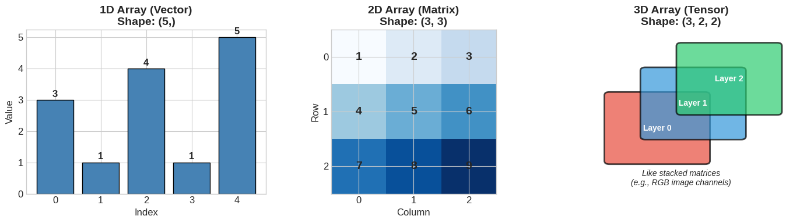

### Cell 10

```python
# Zeros - used for bias initialization
zeros = np.zeros((3, 4))
print("Zeros (3x4):")
print(zeros)
print("Deep Learning Use: Initialize biases to zero\n")

# Ones - used for masks, scaling
ones = np.ones((2, 3))
print("Ones (2x3):")
print(ones)
print("Deep Learning Use: Attention masks, gradient scaling\n")

# Identity matrix - used in residual connections
identity = np.eye(4)
print("Identity (4x4):")
print(identity)
print("Deep Learning Use: Skip connections (ResNet), orthogonal initialization")
```

**Output**

```text
Zeros (3x4):
[[0. 0. 0. 0.]
 [0. 0. 0. 0.]
 [0. 0. 0. 0.]]
Deep Learning Use: Initialize biases to zero

Ones (2x3):
[[1. 1. 1.]
 [1. 1. 1.]]
Deep Learning Use: Attention masks, gradient scaling

Identity (4x4):
[[1. 0. 0. 0.]
 [0. 1. 0. 0.]
 [0. 0. 1. 0.]
 [0. 0. 0. 1.]]
Deep Learning Use: Skip connections (ResNet), orthogonal initialization
```

### Cell 11

```python
# Ranges - useful for creating sequences
print("np.arange(0, 10, 2):")
print(np.arange(0, 10, 2))  # start, stop, step
print("Deep Learning Use: Creating position encodings\n")

print("np.linspace(0, 1, 5):")
print(np.linspace(0, 1, 5))  # start, stop, num_points
print("Deep Learning Use: Learning rate schedules, interpolation")
```

**Output**

```text
np.arange(0, 10, 2):
[0 2 4 6 8]
Deep Learning Use: Creating position encodings

np.linspace(0, 1, 5):
[0.   0.25 0.5  0.75 1.  ]
Deep Learning Use: Learning rate schedules, interpolation
```

### Cell 13

```python
# Different data types
int_array = np.array([1, 2, 3], dtype=np.int32)
float32_array = np.array([1, 2, 3], dtype=np.float32)
float64_array = np.array([1, 2, 3], dtype=np.float64)

print(f"int32:   {int_array}, dtype={int_array.dtype}, bytes per element={int_array.itemsize}")
print(f"float32: {float32_array}, dtype={float32_array.dtype}, bytes per element={float32_array.itemsize}")
print(f"float64: {float64_array}, dtype={float64_array.dtype}, bytes per element={float64_array.itemsize}")
```

**Output**

```text
int32:   [1 2 3], dtype=int32, bytes per element=4
float32: [1. 2. 3.], dtype=float32, bytes per element=4
float64: [1. 2. 3.], dtype=float64, bytes per element=8
```

### Cell 14

```python
# Visualize dtype memory usage for deep learning
fig, ax = plt.subplots(figsize=(10, 5))

dtypes = ['float16\n(Half)', 'float32\n(Single)', 'float64\n(Double)']
bytes_per = [2, 4, 8]
colors = ['#2ecc71', '#3498db', '#9b59b6']
uses = ['Mixed precision\ntraining (GPUs)', 'Standard DL\ntraining', 'Scientific\ncomputing']

bars = ax.bar(dtypes, bytes_per, color=colors, edgecolor='black', linewidth=2)

for bar, use in zip(bars, uses):
    height = bar.get_height()
    ax.text(bar.get_x() + bar.get_width()/2., height + 0.2,
            f'{int(height)} bytes', ha='center', fontweight='bold', fontsize=12)
    ax.text(bar.get_x() + bar.get_width()/2., height/2,
            use, ha='center', va='center', fontsize=10, color='white', fontweight='bold')

ax.set_ylabel('Bytes per Element', fontsize=12)
ax.set_title('Data Types in Deep Learning\nSmaller = Faster training, less memory', fontsize=14, fontweight='bold')
ax.set_ylim(0, 10)

# Add annotation
ax.annotate('Most common\nfor deep learning!', xy=(1, 4), xytext=(1.5, 7),
            fontsize=11, ha='center',
            arrowprops=dict(arrowstyle='->', color='red', lw=2),
            bbox=dict(boxstyle='round', facecolor='yellow', alpha=0.8))

plt.tight_layout()
plt.show()
```

**Output**

```text
<Figure size 1000x500 with 1 Axes>
```

**Figure**

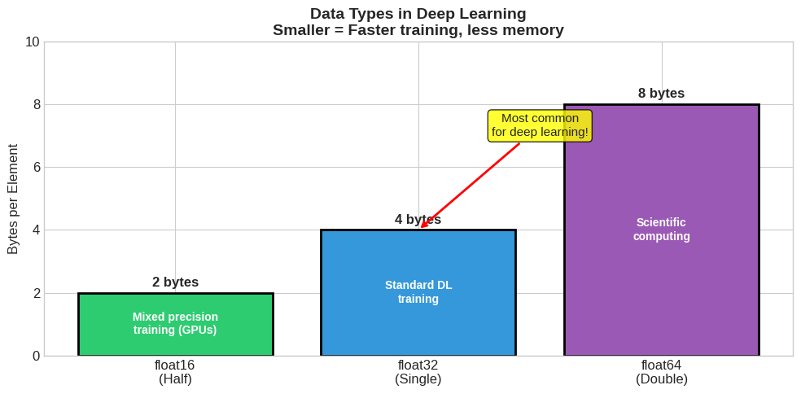

### Cell 16

```python
# Real deep learning tensor shapes
print("Common Tensor Shapes in Deep Learning:")
print("=" * 50)

# Batch of grayscale images (like MNIST)
mnist_batch = np.zeros((32, 28, 28))  # 32 images, 28x28 pixels
print(f"\nMNIST batch shape: {mnist_batch.shape}")
print("  -> (batch_size, height, width)")

# Batch of color images (like CIFAR-10)
cifar_batch = np.zeros((32, 32, 32, 3))  # 32 images, 32x32 pixels, RGB
print(f"\nCIFAR-10 batch shape: {cifar_batch.shape}")
print("  -> (batch_size, height, width, channels)")

# Weight matrix for fully connected layer
weights = np.zeros((784, 256))  # 784 inputs -> 256 outputs
print(f"\nDense layer weights shape: {weights.shape}")
print("  -> (input_features, output_features)")

# Sequence data (like text)
text_batch = np.zeros((16, 100, 512))  # 16 sequences, length 100, embedding dim 512
print(f"\nText batch shape: {text_batch.shape}")
print("  -> (batch_size, sequence_length, embedding_dim)")
```

**Output**

```text
Common Tensor Shapes in Deep Learning:
==================================================

MNIST batch shape: (32, 28, 28)
  -> (batch_size, height, width)

CIFAR-10 batch shape: (32, 32, 32, 3)
  -> (batch_size, height, width, channels)

Dense layer weights shape: (784, 256)
  -> (input_features, output_features)

Text batch shape: (16, 100, 512)
  -> (batch_size, sequence_length, embedding_dim)
```

### Cell 17

```python
# Visualize a real MNIST-like image batch
fig, axes = plt.subplots(2, 5, figsize=(12, 5))
fig.suptitle('Batch of Images: Shape (10, 28, 28)\nEach image is a 2D array of pixel values',
             fontsize=14, fontweight='bold')

# Create fake digit-like patterns
batch = np.random.rand(10, 28, 28) * 0.3  # background noise
for i in range(10):
    # Add some structure to make them look digit-like
    center_x, center_y = 14 + np.random.randint(-3, 4), 14 + np.random.randint(-3, 4)
    for dx in range(-5, 6):
        for dy in range(-5, 6):
            if np.random.rand() > 0.3:
                x, y = center_x + dx, center_y + dy
                if 0 <= x < 28 and 0 <= y < 28:
                    batch[i, y, x] = np.random.rand() * 0.5 + 0.5

for idx, ax in enumerate(axes.flat):
    ax.imshow(batch[idx], cmap='gray')
    ax.set_title(f'Image [{idx}]', fontsize=10)
    ax.axis('off')

plt.tight_layout()
plt.show()

print(f"\nBatch shape: {batch.shape}")
print(f"Single image shape: {batch[0].shape}")
print(f"Total pixels in batch: {batch.size:,}")
```

**Output**

```text
<Figure size 1200x500 with 10 Axes>
```

**Figure**

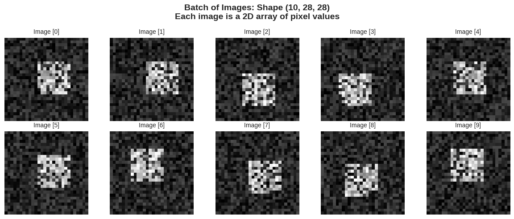

**Output**

```text
Batch shape: (10, 28, 28)
Single image shape: (28, 28)
Total pixels in batch: 7,840
```

### Cell 19

```python
# Exercise: Predict the shapes before running!
a = np.zeros((3, 4, 5))
b = np.ones((2,))
c = np.eye(3)

print("Predict these shapes, then check:")
print(f"a.shape = {a.shape}  <- 3D tensor with ? elements")
print(f"b.shape = {b.shape}  <- 1D vector")
print(f"c.shape = {c.shape}  <- 2D identity matrix")
print(f"\nTotal elements: a={a.size}, b={b.size}, c={c.size}")
```

**Output**

```text
Predict these shapes, then check:
a.shape = (3, 4, 5)  <- 3D tensor with ? elements
b.shape = (2,)  <- 1D vector
c.shape = (3, 3)  <- 2D identity matrix

Total elements: a=60, b=2, c=9
```

### Cell 22

```python
arr = np.array([10, 20, 30, 40, 50, 60, 70, 80, 90])
print("Array:", arr)
print(f"Length: {len(arr)}")
print()

# Positive indexing (from start)
print(f"arr[0] = {arr[0]}   <- First element")
print(f"arr[3] = {arr[3]}   <- Fourth element")
print()

# Negative indexing (from end)
print(f"arr[-1] = {arr[-1]}  <- Last element")
print(f"arr[-2] = {arr[-2]}  <- Second to last")
```

**Output**

```text
Array: [10 20 30 40 50 60 70 80 90]
Length: 9

arr[0] = 10   <- First element
arr[3] = 40   <- Fourth element

arr[-1] = 90  <- Last element
arr[-2] = 80  <- Second to last
```

### Cell 23

```python
# Visualize indexing
fig, ax = plt.subplots(figsize=(14, 4))

arr = np.array([10, 20, 30, 40, 50, 60, 70, 80, 90])
x_pos = np.arange(len(arr))

# Draw boxes for each element
for i, (x, val) in enumerate(zip(x_pos, arr)):
    rect = FancyBboxPatch((x - 0.4, 0.3), 0.8, 0.4,
                          boxstyle="round,pad=0.02",
                          facecolor='steelblue', edgecolor='black', linewidth=2)
    ax.add_patch(rect)
    ax.text(x, 0.5, str(val), ha='center', va='center', fontsize=14, fontweight='bold', color='white')

    # Positive index
    ax.text(x, 0.1, f'[{i}]', ha='center', va='center', fontsize=11, color='green', fontweight='bold')

    # Negative index
    ax.text(x, 0.85, f'[{i - len(arr)}]', ha='center', va='center', fontsize=11, color='red', fontweight='bold')

ax.set_xlim(-1, len(arr))
ax.set_ylim(-0.1, 1.1)
ax.axis('off')
ax.set_title('NumPy Array Indexing\nGreen: Positive indices | Red: Negative indices', fontsize=14, fontweight='bold')

plt.tight_layout()
plt.show()
```

**Output**

```text
<Figure size 1400x400 with 1 Axes>
```

**Figure**

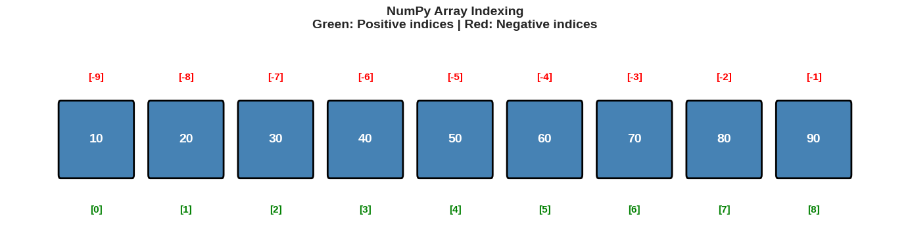

### Cell 25

```python
arr = np.array([10, 20, 30, 40, 50, 60, 70, 80, 90])
print("Original:", arr)
print()

# Basic slicing
print(f"arr[2:5]   = {arr[2:5]}      <- Elements 2,3,4 (stop is exclusive!)")
print(f"arr[:4]    = {arr[:4]}    <- First 4 elements")
print(f"arr[5:]    = {arr[5:]}    <- From index 5 to end")
print(f"arr[::2]   = {arr[::2]}   <- Every 2nd element")
print(f"arr[::-1]  = {arr[::-1]}  <- Reversed!")
```

**Output**

```text
Original: [10 20 30 40 50 60 70 80 90]

arr[2:5]   = [30 40 50]      <- Elements 2,3,4 (stop is exclusive!)
arr[:4]    = [10 20 30 40]    <- First 4 elements
arr[5:]    = [60 70 80 90]    <- From index 5 to end
arr[::2]   = [10 30 50 70 90]   <- Every 2nd element
arr[::-1]  = [90 80 70 60 50 40 30 20 10]  <- Reversed!
```

### Cell 26

```python
# Deep Learning Example: Train/Validation Split
print("Deep Learning Use Case: Train/Validation Split")
print("=" * 50)

# Simulate a dataset
dataset = np.arange(100)  # 100 samples
np.random.shuffle(dataset)  # Shuffle!

# 80/20 split
split_idx = int(0.8 * len(dataset))
train_data = dataset[:split_idx]
val_data = dataset[split_idx:]

print(f"Total samples: {len(dataset)}")
print(f"Training samples: {len(train_data)} (indices [:80])")
print(f"Validation samples: {len(val_data)} (indices [80:])")
print(f"\nFirst 10 training samples: {train_data[:10]}")
```

**Output**

```text
Deep Learning Use Case: Train/Validation Split
==================================================
Total samples: 100
Training samples: 80 (indices [:80])
Validation samples: 20 (indices [80:])

First 10 training samples: [65 36  2 60 48 45 20  6 69 92]
```

### Cell 28

```python
# Create a 2D array (matrix)
matrix = np.array([[1, 2, 3, 4],
                   [5, 6, 7, 8],
                   [9, 10, 11, 12]])

print("Matrix (3x4):")
print(matrix)
print(f"Shape: {matrix.shape}")
print()

# Accessing elements: [row, column]
print(f"matrix[0, 0] = {matrix[0, 0]}   <- Top-left")
print(f"matrix[1, 2] = {matrix[1, 2]}   <- Row 1, Column 2")
print(f"matrix[-1, -1] = {matrix[-1, -1]} <- Bottom-right")
```

**Output**

```text
Matrix (3x4):
[[ 1  2  3  4]
 [ 5  6  7  8]
 [ 9 10 11 12]]
Shape: (3, 4)

matrix[0, 0] = 1   <- Top-left
matrix[1, 2] = 7   <- Row 1, Column 2
matrix[-1, -1] = 12 <- Bottom-right
```

### Cell 29

```python
# Slicing rows and columns
print("Slicing Examples:")
print(f"matrix[0, :]   = {matrix[0, :]}      <- First row (all columns)")
print(f"matrix[:, 0]   = {matrix[:, 0]}          <- First column (all rows)")
print(f"matrix[0:2, 1:3] =\n{matrix[0:2, 1:3]}    <- Submatrix")
```

**Output**

```text
Slicing Examples:
matrix[0, :]   = [1 2 3 4]      <- First row (all columns)
matrix[:, 0]   = [1 5 9]          <- First column (all rows)
matrix[0:2, 1:3] =
[[2 3]
 [6 7]]    <- Submatrix
```

### Cell 30

```python
# Visualize 2D slicing
fig, axes = plt.subplots(1, 4, figsize=(16, 4))

matrix = np.arange(1, 13).reshape(3, 4)

titles = ['Original Matrix', 'matrix[1, :]\n(Row 1)', 'matrix[:, 2]\n(Column 2)', 'matrix[0:2, 1:3]\n(Submatrix)']
data = [matrix, matrix[1:2, :], matrix[:, 2:3], matrix[0:2, 1:3]]
highlights = [None, (1, slice(None)), (slice(None), 2), (slice(0,2), slice(1,3))]

for ax, title, d, h in zip(axes, titles, data, highlights):
    # Show full matrix with highlight
    display = np.zeros_like(matrix, dtype=float)
    if h is None:
        display = matrix.astype(float)
        mask = np.ones_like(matrix)
    else:
        mask = np.zeros_like(matrix)
        mask[h] = 1
        display = matrix * mask

    ax.imshow(mask, cmap='Blues', alpha=0.5, vmin=0, vmax=1)

    for i in range(3):
        for j in range(4):
            color = 'black' if mask[i, j] else 'gray'
            weight = 'bold' if mask[i, j] else 'normal'
            ax.text(j, i, str(matrix[i, j]), ha='center', va='center',
                   fontsize=14, color=color, fontweight=weight)

    ax.set_title(title, fontsize=12, fontweight='bold')
    ax.set_xticks(range(4))
    ax.set_yticks(range(3))
    ax.set_xticklabels(['Col 0', 'Col 1', 'Col 2', 'Col 3'])
    ax.set_yticklabels(['Row 0', 'Row 1', 'Row 2'])

plt.suptitle('2D Array Slicing Visualization', fontsize=14, fontweight='bold', y=1.02)
plt.tight_layout()
plt.show()
```

**Output**

```text
<Figure size 1600x400 with 4 Axes>
```

**Figure**

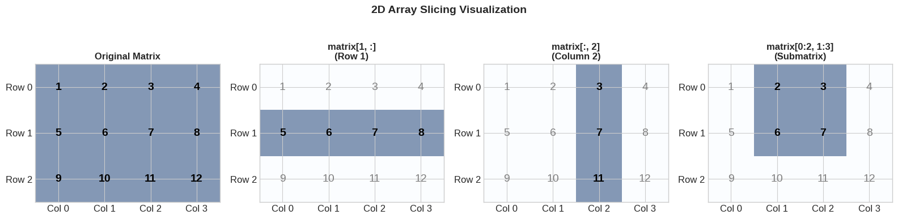

### Cell 32

```python
# Simulating batch processing in neural networks
print("Deep Learning Use Case: Mini-Batch Selection")
print("=" * 50)

# Create fake image dataset: 1000 images, 28x28 pixels
dataset = np.random.rand(1000, 28, 28)
labels = np.random.randint(0, 10, 1000)  # 10 classes

print(f"Dataset shape: {dataset.shape}")
print(f"Labels shape: {labels.shape}")

# Get a mini-batch of 32 samples
batch_size = 32
batch_idx = 0

start = batch_idx * batch_size
end = start + batch_size

batch_images = dataset[start:end]  # Shape: (32, 28, 28)
batch_labels = labels[start:end]   # Shape: (32,)

print(f"\nBatch {batch_idx}:")
print(f"  Images shape: {batch_images.shape}")
print(f"  Labels shape: {batch_labels.shape}")
print(f"  Labels: {batch_labels[:10]}... (first 10)")
```

**Output**

```text
Deep Learning Use Case: Mini-Batch Selection
==================================================
Dataset shape: (1000, 28, 28)
Labels shape: (1000,)

Batch 0:
  Images shape: (32, 28, 28)
  Labels shape: (32,)
  Labels: [0 3 7 0 6 1 1 6 9 4]... (first 10)
```

### Cell 34

```python
arr = np.array([1, -2, 3, -4, 5, -6, 7, -8, 9])
print("Array:", arr)
print()

# Create boolean mask
mask = arr > 0
print(f"Mask (arr > 0): {mask}")
print(f"Positive values: {arr[mask]}")
print()

# Multiple conditions
mask2 = (arr > 0) & (arr < 6)  # Note: use & not 'and'
print(f"Values between 0 and 6: {arr[mask2]}")
```

**Output**

```text
Array: [ 1 -2  3 -4  5 -6  7 -8  9]

Mask (arr > 0): [ True False  True False  True False  True False  True]
Positive values: [1 3 5 7 9]

Values between 0 and 6: [1 3 5]
```

### Cell 35

```python
# Deep Learning Example: ReLU activation using boolean indexing!
print("Deep Learning Use Case: ReLU Activation")
print("=" * 50)

# Simulate layer output (before activation)
z = np.array([-2.5, 1.2, -0.5, 3.1, -1.8, 0.7, -0.1, 2.4])
print(f"Before ReLU: {z}")

# ReLU: max(0, x) - implemented with boolean indexing
relu_output = z.copy()
relu_output[relu_output < 0] = 0  # Set negatives to zero
print(f"After ReLU:  {relu_output}")

# Visualize
fig, ax = plt.subplots(figsize=(10, 4))
x = np.arange(len(z))
width = 0.35

bars1 = ax.bar(x - width/2, z, width, label='Before ReLU', color='steelblue', alpha=0.7)
bars2 = ax.bar(x + width/2, relu_output, width, label='After ReLU', color='coral', alpha=0.7)

ax.axhline(y=0, color='black', linestyle='-', linewidth=0.5)
ax.set_xlabel('Neuron Index')
ax.set_ylabel('Value')
ax.set_title('ReLU Activation: max(0, x)\nNegative values become zero!', fontsize=14, fontweight='bold')
ax.legend()
ax.set_xticks(x)

plt.tight_layout()
plt.show()
```

**Output**

```text
Deep Learning Use Case: ReLU Activation
==================================================
Before ReLU: [-2.5  1.2 -0.5  3.1 -1.8  0.7 -0.1  2.4]
After ReLU:  [0.  1.2 0.  3.1 0.  0.7 0.  2.4]
```

**Output**

```text
<Figure size 1000x400 with 1 Axes>
```

**Figure**

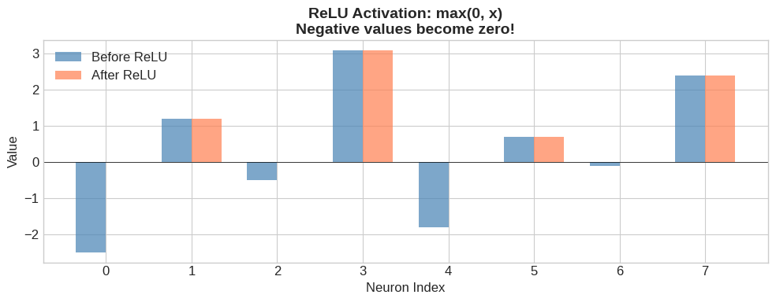

### Cell 37

```python
arr = np.array([10, 20, 30, 40, 50, 60, 70, 80, 90])
print("Array:", arr)

# Select specific indices
indices = np.array([0, 2, 5, 8])
print(f"Indices: {indices}")
print(f"Selected: {arr[indices]}")
```

**Output**

```text
Array: [10 20 30 40 50 60 70 80 90]
Indices: [0 2 5 8]
Selected: [10 30 60 90]
```

### Cell 38

```python
# Deep Learning Example: Embedding lookup
print("Deep Learning Use Case: Word Embedding Lookup")
print("=" * 50)

# Embedding matrix: 1000 words, 128-dimensional embeddings
vocab_size = 1000
embedding_dim = 128
embedding_matrix = np.random.randn(vocab_size, embedding_dim)

print(f"Embedding matrix shape: {embedding_matrix.shape}")

# A sentence as word indices
sentence = np.array([42, 156, 789, 23, 501])  # 5 word indices
print(f"Sentence (word indices): {sentence}")

# Look up embeddings for the sentence
sentence_embeddings = embedding_matrix[sentence]  # Fancy indexing!
print(f"Sentence embeddings shape: {sentence_embeddings.shape}")
print("  -> (num_words, embedding_dim)")
```

**Output**

```text
Deep Learning Use Case: Word Embedding Lookup
==================================================
Embedding matrix shape: (1000, 128)
Sentence (word indices): [ 42 156 789  23 501]
Sentence embeddings shape: (5, 128)
  -> (num_words, embedding_dim)
```

### Cell 41

```python
# Basic arithmetic - operates on every element!
a = np.array([1, 2, 3, 4, 5])
print("Array a:", a)
print()

print(f"a + 10  = {a + 10}   <- Add 10 to each element")
print(f"a * 2   = {a * 2}    <- Multiply each by 2")
print(f"a ** 2  = {a ** 2}   <- Square each element")
print(f"a / 2   = {a / 2}  <- Divide each by 2")
```

**Output**

```text
Array a: [1 2 3 4 5]

a + 10  = [11 12 13 14 15]   <- Add 10 to each element
a * 2   = [ 2  4  6  8 10]    <- Multiply each by 2
a ** 2  = [ 1  4  9 16 25]   <- Square each element
a / 2   = [0.5 1.  1.5 2.  2.5]  <- Divide each by 2
```

### Cell 42

```python
# Operations between two arrays (same shape)
a = np.array([1, 2, 3, 4])
b = np.array([5, 6, 7, 8])

print("Array a:", a)
print("Array b:", b)
print()

print(f"a + b = {a + b}   <- Add corresponding elements")
print(f"a * b = {a * b}   <- Multiply corresponding elements (Hadamard product)")
print(f"a - b = {a - b}  <- Subtract corresponding elements")
print(f"a / b = {a / b}  <- Divide corresponding elements")
```

**Output**

```text
Array a: [1 2 3 4]
Array b: [5 6 7 8]

a + b = [ 6  8 10 12]   <- Add corresponding elements
a * b = [ 5 12 21 32]   <- Multiply corresponding elements (Hadamard product)
a - b = [-4 -4 -4 -4]  <- Subtract corresponding elements
a / b = [0.2        0.33333333 0.42857143 0.5       ]  <- Divide corresponding elements
```

### Cell 43

```python
# Visualize element-wise multiplication
fig, axes = plt.subplots(1, 4, figsize=(14, 3))

a = np.array([1, 2, 3, 4])
b = np.array([5, 6, 7, 8])
result = a * b

colors = ['steelblue', 'coral', 'mediumseagreen']
labels = ['Array a', 'Array b', 'a * b']
data_arrays = [a, b, result]

for idx, (ax, arr, color, label) in enumerate(zip(axes[:3], data_arrays, colors, labels)):
    ax.bar(range(len(arr)), arr, color=color, edgecolor='black')
    ax.set_title(label, fontsize=14, fontweight='bold')
    ax.set_ylim(0, 35)
    for i, v in enumerate(arr):
        ax.text(i, v + 1, str(v), ha='center', fontweight='bold')
    ax.set_xticks(range(4))
    ax.set_xlabel('Index')

# Show the operation
axes[3].axis('off')
axes[3].text(0.5, 0.5, 'Element-wise\\nMultiplication\\n\\n1*5=5\\n2*6=12\\n3*7=21\\n4*8=32',
             ha='center', va='center', fontsize=14, fontweight='bold',
             bbox=dict(boxstyle='round', facecolor='lightyellow', edgecolor='orange', linewidth=2))

plt.suptitle('Element-wise Operation: a * b', fontsize=14, fontweight='bold')
plt.tight_layout()
plt.show()
```

**Output**

```text
<Figure size 1400x300 with 4 Axes>
```

**Figure**

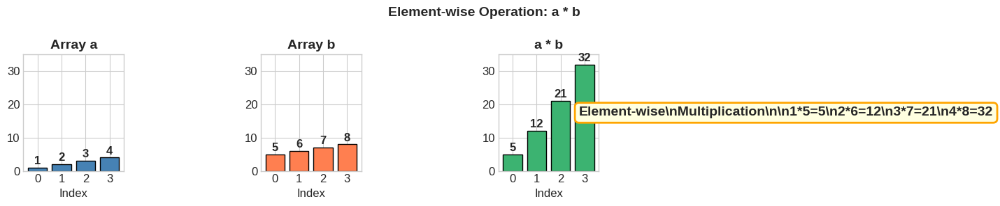

### Cell 45

```python
# Essential math functions for deep learning
x = np.array([-2, -1, 0, 1, 2])
print("x =", x)
print()

# Exponential and logarithm
print(f"np.exp(x)  = {np.exp(x)}")
print("  -> Used in: Softmax, Sigmoid")
print()

print(f"np.log(np.abs(x) + 1) = {np.log(np.abs(x) + 1)}")
print("  -> Used in: Cross-entropy loss")
print()

# Trigonometric (for positional encoding in Transformers!)
print(f"np.sin(x) = {np.sin(x)}")
print(f"np.cos(x) = {np.cos(x)}")
print("  -> Used in: Positional encoding (Transformers)")
```

**Output**

```text
x = [-2 -1  0  1  2]

np.exp(x)  = [0.13533528 0.36787944 1.         2.71828183 7.3890561 ]
  -> Used in: Softmax, Sigmoid

np.log(np.abs(x) + 1) = [1.09861229 0.69314718 0.         0.69314718 1.09861229]
  -> Used in: Cross-entropy loss

np.sin(x) = [-0.90929743 -0.84147098  0.          0.84147098  0.90929743]
np.cos(x) = [-0.41614684  0.54030231  1.          0.54030231 -0.41614684]
  -> Used in: Positional encoding (Transformers)
```

### Cell 47

```python
# Implementing activation functions with NumPy!

def sigmoid(x):
    """Squashes values to (0, 1) - used for binary classification"""
    return 1 / (1 + np.exp(-x))

def tanh(x):
    """Squashes values to (-1, 1) - zero-centered"""
    return np.tanh(x)

def relu(x):
    """max(0, x) - most popular activation for hidden layers"""
    return np.maximum(0, x)

def leaky_relu(x, alpha=0.01):
    """Allows small negative gradients"""
    return np.where(x > 0, x, alpha * x)

def softmax(x):
    """Converts to probability distribution - used for classification"""
    exp_x = np.exp(x - np.max(x))  # Subtract max for numerical stability
    return exp_x / np.sum(exp_x)

# Test them
x = np.array([-2, -1, 0, 1, 2])
print("Input x:", x)
print()
print(f"sigmoid(x):    {sigmoid(x)}")
print(f"tanh(x):       {tanh(x)}")
print(f"relu(x):       {relu(x)}")
print(f"leaky_relu(x): {leaky_relu(x)}")
print(f"softmax(x):    {softmax(x)}  (sums to {softmax(x).sum():.2f})")
```

**Output**

```text
Input x: [-2 -1  0  1  2]

sigmoid(x):    [0.11920292 0.26894142 0.5        0.73105858 0.88079708]
tanh(x):       [-0.96402758 -0.76159416  0.          0.76159416  0.96402758]
relu(x):       [0 0 0 1 2]
leaky_relu(x): [-0.02 -0.01  0.    1.    2.  ]
softmax(x):    [0.01165623 0.03168492 0.08612854 0.23412166 0.63640865]  (sums to 1.00)
```

### Cell 48

```python
# Beautiful visualization of activation functions
fig, axes = plt.subplots(2, 2, figsize=(12, 10))

x = np.linspace(-5, 5, 200)

# Sigmoid
ax = axes[0, 0]
ax.plot(x, sigmoid(x), 'b-', linewidth=3, label='Sigmoid')
ax.axhline(y=0.5, color='gray', linestyle='--', alpha=0.5)
ax.axhline(y=0, color='gray', linestyle='-', alpha=0.3)
ax.axhline(y=1, color='gray', linestyle='-', alpha=0.3)
ax.axvline(x=0, color='gray', linestyle='-', alpha=0.3)
ax.fill_between(x, 0, sigmoid(x), alpha=0.2)
ax.set_title('Sigmoid: $\\sigma(x) = \\frac{1}{1 + e^{-x}}$', fontsize=14, fontweight='bold')
ax.set_xlabel('x')
ax.set_ylabel('$\\sigma(x)$')
ax.set_ylim(-0.1, 1.1)
ax.annotate('Output: (0, 1)\\nUsed for: Binary classification\\nProbability output',
            xy=(2, 0.9), fontsize=10,
            bbox=dict(boxstyle='round', facecolor='lightblue', alpha=0.8))

# Tanh
ax = axes[0, 1]
ax.plot(x, tanh(x), 'g-', linewidth=3, label='Tanh')
ax.axhline(y=0, color='gray', linestyle='-', alpha=0.5)
ax.axhline(y=-1, color='gray', linestyle='--', alpha=0.3)
ax.axhline(y=1, color='gray', linestyle='--', alpha=0.3)
ax.axvline(x=0, color='gray', linestyle='-', alpha=0.3)
ax.fill_between(x, 0, tanh(x), alpha=0.2, color='green')
ax.set_title('Tanh: $\\tanh(x) = \\frac{e^x - e^{-x}}{e^x + e^{-x}}$', fontsize=14, fontweight='bold')
ax.set_xlabel('x')
ax.set_ylabel('tanh(x)')
ax.set_ylim(-1.3, 1.3)
ax.annotate('Output: (-1, 1)\\nUsed for: Hidden layers\\nZero-centered!',
            xy=(1.5, -0.5), fontsize=10,
            bbox=dict(boxstyle='round', facecolor='lightgreen', alpha=0.8))

# ReLU
ax = axes[1, 0]
ax.plot(x, relu(x), 'r-', linewidth=3, label='ReLU')
ax.axhline(y=0, color='gray', linestyle='-', alpha=0.5)
ax.axvline(x=0, color='gray', linestyle='-', alpha=0.5)
ax.fill_between(x[x >= 0], 0, relu(x[x >= 0]), alpha=0.2, color='red')
ax.set_title('ReLU: $f(x) = \\max(0, x)$', fontsize=14, fontweight='bold')
ax.set_xlabel('x')
ax.set_ylabel('ReLU(x)')
ax.set_ylim(-1, 5.5)
ax.annotate('Output: [0, inf)\\nUsed for: Hidden layers\\nMost popular! Fast!',
            xy=(-4.5, 4), fontsize=10,
            bbox=dict(boxstyle='round', facecolor='lightyellow', alpha=0.8))

# Leaky ReLU
ax = axes[1, 1]
ax.plot(x, leaky_relu(x, 0.1), 'purple', linewidth=3, label='Leaky ReLU')
ax.axhline(y=0, color='gray', linestyle='-', alpha=0.5)
ax.axvline(x=0, color='gray', linestyle='-', alpha=0.5)
ax.fill_between(x, 0, leaky_relu(x, 0.1), alpha=0.2, color='purple')
ax.set_title('Leaky ReLU: $f(x) = \\max(\\alpha x, x)$, $\\alpha=0.1$', fontsize=14, fontweight='bold')
ax.set_xlabel('x')
ax.set_ylabel('Leaky ReLU(x)')
ax.set_ylim(-1, 5.5)
ax.annotate('Output: (-inf, inf)\\nUsed for: Hidden layers\\nFixes "dying ReLU"',
            xy=(-4.5, 4), fontsize=10,
            bbox=dict(boxstyle='round', facecolor='plum', alpha=0.8))

plt.suptitle('Activation Functions in Deep Learning\\nAll implemented with element-wise NumPy operations!',
             fontsize=16, fontweight='bold', y=1.02)
plt.tight_layout()
plt.show()
```

**Output**

```text
<Figure size 1200x1000 with 4 Axes>
```

**Figure**

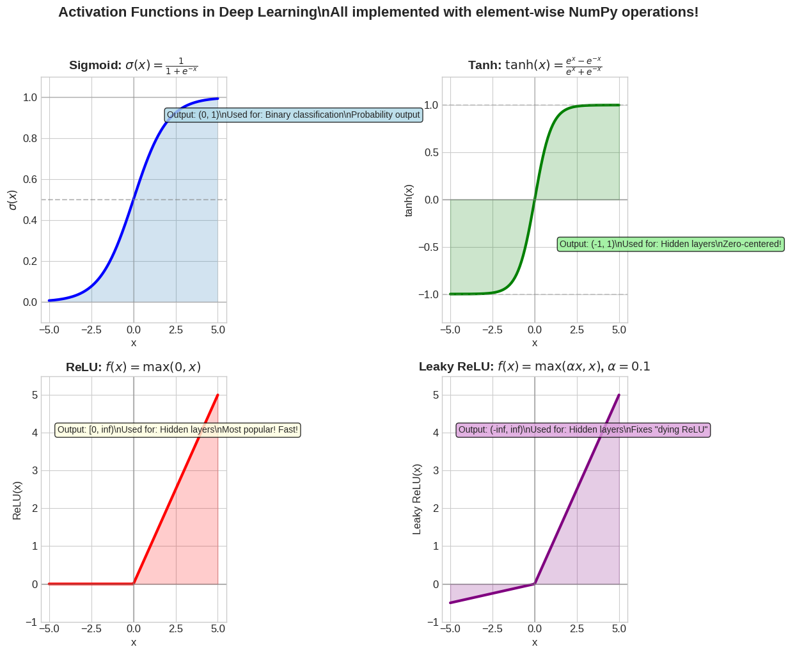

### Cell 51

```python
# Scalar + Array (simplest broadcasting)
arr = np.array([1, 2, 3, 4, 5])
scalar = 10

result = arr + scalar  # 10 is "broadcast" to [10, 10, 10, 10, 10]
print("Array + Scalar:")
print(f"  {arr}")
print(f"+ {scalar}")
print(f"= {result}")
print()
print("What happened: scalar 10 was 'stretched' to match the array shape!")
```

**Output**

```text
Array + Scalar:
  [1 2 3 4 5]
+ 10
= [11 12 13 14 15]

What happened: scalar 10 was 'stretched' to match the array shape!
```

### Cell 52

```python
# Matrix + Vector (most common in deep learning!)
matrix = np.array([[1, 2, 3],
                   [4, 5, 6],
                   [7, 8, 9]])
row_vector = np.array([10, 20, 30])

print("Matrix (3x3):")
print(matrix)
print(f"Shape: {matrix.shape}")
print()
print("Row vector:", row_vector)
print(f"Shape: {row_vector.shape}")
print()

result = matrix + row_vector
print("Matrix + Row Vector:")
print(result)
print()
print("The vector was broadcast across all rows!")
```

**Output**

```text
Matrix (3x3):
[[1 2 3]
 [4 5 6]
 [7 8 9]]
Shape: (3, 3)

Row vector: [10 20 30]
Shape: (3,)

Matrix + Row Vector:
[[11 22 33]
 [14 25 36]
 [17 28 39]]

The vector was broadcast across all rows!
```

### Cell 53

```python
# Visualize broadcasting
fig, axes = plt.subplots(1, 4, figsize=(16, 4))

matrix = np.array([[1, 2, 3],
                   [4, 5, 6],
                   [7, 8, 9]])
vector = np.array([10, 20, 30])
result = matrix + vector

# Original matrix
ax = axes[0]
im = ax.imshow(matrix, cmap='Blues', vmin=0, vmax=40)
ax.set_title('Matrix\\n(3, 3)', fontsize=12, fontweight='bold')
for i in range(3):
    for j in range(3):
        ax.text(j, i, matrix[i, j], ha='center', va='center', fontsize=14, fontweight='bold')
ax.set_xticks(range(3))
ax.set_yticks(range(3))

# Vector (shown as it will be broadcast)
ax = axes[1]
broadcast_viz = np.tile(vector, (3, 1))
im = ax.imshow(broadcast_viz, cmap='Oranges', vmin=0, vmax=40)
ax.set_title('Vector (broadcast)\\n(3,) -> (3, 3)', fontsize=12, fontweight='bold')
for i in range(3):
    for j in range(3):
        ax.text(j, i, broadcast_viz[i, j], ha='center', va='center', fontsize=14, fontweight='bold')
ax.set_xticks(range(3))
ax.set_yticks(range(3))

# Plus sign
ax = axes[2]
ax.axis('off')
ax.text(0.5, 0.5, '+', fontsize=60, ha='center', va='center', fontweight='bold')

# Result
ax = axes[3]
im = ax.imshow(result, cmap='Greens', vmin=0, vmax=40)
ax.set_title('Result\\n(3, 3)', fontsize=12, fontweight='bold')
for i in range(3):
    for j in range(3):
        ax.text(j, i, result[i, j], ha='center', va='center', fontsize=14, fontweight='bold')
ax.set_xticks(range(3))
ax.set_yticks(range(3))

plt.suptitle('Broadcasting: Matrix (3,3) + Vector (3,) = Matrix (3,3)', fontsize=14, fontweight='bold')
plt.tight_layout()
plt.show()
```

**Output**

```text
<Figure size 1600x400 with 4 Axes>
```

**Figure**

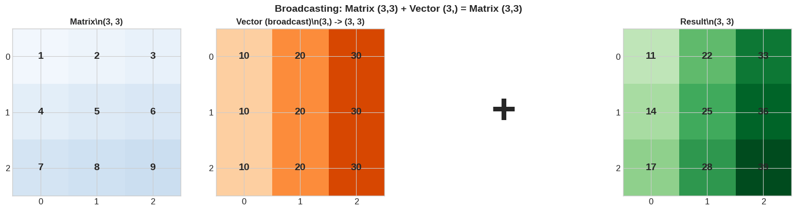

### Cell 55

```python
# Simulating a neural network layer with bias addition
print("Neural Network Layer: z = Wx + b")
print("=" * 50)

# Batch of 4 samples, each with 3 features
batch_size = 4
input_features = 3
output_features = 2

X = np.random.randn(batch_size, input_features)  # (4, 3)
W = np.random.randn(input_features, output_features)  # (3, 2)
b = np.array([0.5, -0.5])  # (2,) - one bias per output neuron

print(f"Input X shape: {X.shape}     <- (batch_size, input_features)")
print(f"Weights W shape: {W.shape}   <- (input_features, output_features)")
print(f"Bias b shape: {b.shape}         <- (output_features,)")
print()

# Forward pass
z = X @ W  # Matrix multiplication: (4, 3) @ (3, 2) = (4, 2)
print(f"X @ W shape: {z.shape}        <- (batch_size, output_features)")

# Add bias using broadcasting!
z = z + b  # Broadcasting: (4, 2) + (2,) = (4, 2)
print(f"z + b shape: {z.shape}        <- Same! Bias was broadcast across batch")
print()
print("Result (z = Wx + b):")
print(z)
```

**Output**

```text
Neural Network Layer: z = Wx + b
==================================================
Input X shape: (4, 3)     <- (batch_size, input_features)
Weights W shape: (3, 2)   <- (input_features, output_features)
Bias b shape: (2,)         <- (output_features,)

X @ W shape: (4, 2)        <- (batch_size, output_features)
z + b shape: (4, 2)        <- Same! Bias was broadcast across batch

Result (z = Wx + b):
[[ 0.35262886 -0.14868992]
 [ 1.01725398 -0.95551432]
 [ 1.6505743  -0.97061206]
 [ 0.93434527 -1.67009057]]
```

### Cell 58

```python
# Matrix multiplication basics
A = np.array([[1, 2, 3],
              [4, 5, 6]])  # Shape: (2, 3)

B = np.array([[7, 8],
              [9, 10],
              [11, 12]])  # Shape: (3, 2)

print("Matrix A (2x3):")
print(A)
print()
print("Matrix B (3x2):")
print(B)
print()

# Matrix multiplication
C = A @ B  # or np.matmul(A, B) or np.dot(A, B)
print("C = A @ B (2x2):")
print(C)
print()
print(f"Shape: {A.shape} @ {B.shape} = {C.shape}")
print("  (2, 3) @ (3, 2) -> inner dims match (3=3) -> output (2, 2)")
```

**Output**

```text
Matrix A (2x3):
[[1 2 3]
 [4 5 6]]

Matrix B (3x2):
[[ 7  8]
 [ 9 10]
 [11 12]]

C = A @ B (2x2):
[[ 58  64]
 [139 154]]

Shape: (2, 3) @ (3, 2) = (2, 2)
  (2, 3) @ (3, 2) -> inner dims match (3=3) -> output (2, 2)
```

### Cell 59

```python
# Let's break down exactly what happens
print("How Matrix Multiplication Works:")
print("=" * 50)

A = np.array([[1, 2, 3],
              [4, 5, 6]])

B = np.array([[7, 8],
              [9, 10],
              [11, 12]])

print("A @ B element by element:")
print()

# Calculate each element
for i in range(2):
    for j in range(2):
        row = A[i, :]
        col = B[:, j]
        dot = np.dot(row, col)

        calc = " + ".join([f"{r}*{c}" for r, c in zip(row, col)])
        print(f"C[{i},{j}] = Row {i} of A . Col {j} of B")
        print(f"       = {row} . {col}")
        print(f"       = {calc}")
        print(f"       = {dot}")
        print()
```

**Output**

```text
How Matrix Multiplication Works:
==================================================
A @ B element by element:

C[0,0] = Row 0 of A . Col 0 of B
       = [1 2 3] . [ 7  9 11]
       = 1*7 + 2*9 + 3*11
       = 58

C[0,1] = Row 0 of A . Col 1 of B
       = [1 2 3] . [ 8 10 12]
       = 1*8 + 2*10 + 3*12
       = 64

C[1,0] = Row 1 of A . Col 0 of B
       = [4 5 6] . [ 7  9 11]
       = 4*7 + 5*9 + 6*11
       = 139

C[1,1] = Row 1 of A . Col 1 of B
       = [4 5 6] . [ 8 10 12]
       = 4*8 + 5*10 + 6*12
       = 154
```

### Cell 60

```python
# Visual representation of matrix multiplication
fig, axes = plt.subplots(1, 5, figsize=(16, 4))

A = np.array([[1, 2, 3],
              [4, 5, 6]])
B = np.array([[7, 8],
              [9, 10],
              [11, 12]])
C = A @ B

# Matrix A
ax = axes[0]
ax.imshow(np.ones_like(A), cmap='Blues', alpha=0.3)
for i in range(2):
    for j in range(3):
        ax.text(j, i, str(A[i, j]), ha='center', va='center', fontsize=16, fontweight='bold')
ax.set_title('A (2x3)', fontsize=14, fontweight='bold')
ax.set_xticks(range(3))
ax.set_yticks(range(2))
ax.set_aspect('equal')

# @ symbol
ax = axes[1]
ax.axis('off')
ax.text(0.5, 0.5, '@', fontsize=40, ha='center', va='center', fontweight='bold')

# Matrix B
ax = axes[2]
ax.imshow(np.ones_like(B), cmap='Oranges', alpha=0.3)
for i in range(3):
    for j in range(2):
        ax.text(j, i, str(B[i, j]), ha='center', va='center', fontsize=16, fontweight='bold')
ax.set_title('B (3x2)', fontsize=14, fontweight='bold')
ax.set_xticks(range(2))
ax.set_yticks(range(3))
ax.set_aspect('equal')

# = symbol
ax = axes[3]
ax.axis('off')
ax.text(0.5, 0.5, '=', fontsize=40, ha='center', va='center', fontweight='bold')

# Result C
ax = axes[4]
ax.imshow(np.ones_like(C), cmap='Greens', alpha=0.3)
for i in range(2):
    for j in range(2):
        ax.text(j, i, str(C[i, j]), ha='center', va='center', fontsize=16, fontweight='bold')
ax.set_title('C (2x2)', fontsize=14, fontweight='bold')
ax.set_xticks(range(2))
ax.set_yticks(range(2))
ax.set_aspect('equal')

plt.suptitle('Matrix Multiplication: (2,3) @ (3,2) = (2,2)\\nInner dimensions must match!',
             fontsize=14, fontweight='bold')
plt.tight_layout()
plt.show()
```

**Output**

```text
<Figure size 1600x400 with 5 Axes>
```

**Figure**

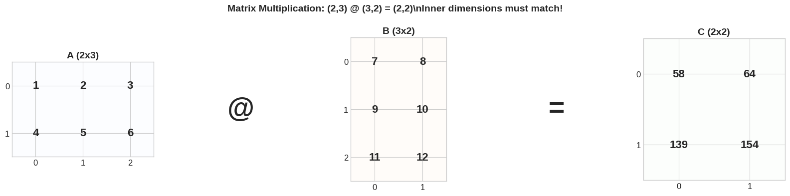

### Cell 62

```python
# Complete forward pass through a neural network layer
print("Forward Pass Through a Dense Layer")
print("=" * 50)

# A batch of 3 samples, each with 4 features
X = np.array([[0.1, 0.2, 0.3, 0.4],
              [0.5, 0.6, 0.7, 0.8],
              [0.9, 1.0, 1.1, 1.2]])

# Weight matrix: 4 inputs -> 3 outputs
W = np.array([[0.1, 0.2, 0.3],
              [0.4, 0.5, 0.6],
              [0.7, 0.8, 0.9],
              [1.0, 1.1, 1.2]])

# Bias: one per output
b = np.array([0.1, 0.2, 0.3])

print(f"Input X shape: {X.shape}  (batch_size=3, input_features=4)")
print(f"Weights W shape: {W.shape}  (input_features=4, output_features=3)")
print(f"Bias b shape: {b.shape}  (output_features=3)")
print()

# Step 1: Linear transformation (matrix multiplication)
z = X @ W
print(f"Step 1 - Linear: z = X @ W")
print(f"  z shape: {z.shape}")
print(f"  z = \\n{z}")
print()

# Step 2: Add bias (broadcasting!)
z = z + b
print(f"Step 2 - Add bias: z = z + b (broadcasting!)")
print(f"  z = \\n{z}")
print()

# Step 3: Apply activation
a = sigmoid(z)  # Using our sigmoid from earlier
print(f"Step 3 - Activation: a = sigmoid(z)")
print(f"  a = \\n{a}")
print()

print("This output becomes the input to the next layer!")
```

**Output**

```text
Forward Pass Through a Dense Layer
==================================================
Input X shape: (3, 4)  (batch_size=3, input_features=4)
Weights W shape: (4, 3)  (input_features=4, output_features=3)
Bias b shape: (3,)  (output_features=3)

Step 1 - Linear: z = X @ W
  z shape: (3, 3)
  z = \n[[0.7  0.8  0.9 ]
 [1.58 1.84 2.1 ]
 [2.46 2.88 3.3 ]]

Step 2 - Add bias: z = z + b (broadcasting!)
  z = \n[[0.8  1.   1.2 ]
 [1.68 2.04 2.4 ]
 [2.56 3.08 3.6 ]]

Step 3 - Activation: a = sigmoid(z)
  a = \n[[0.68997448 0.73105858 0.76852478]
 [0.84290453 0.88493327 0.9168273 ]
 [0.92824246 0.95606018 0.97340301]]

This output becomes the input to the next layer!
```

### Cell 63

```python
# Visualize neural network layer computation
fig, ax = plt.subplots(figsize=(14, 8))
ax.axis('off')

# Draw the network
def draw_layer(ax, x, num_neurons, label, color):
    positions = []
    spacing = 0.8 / (num_neurons + 1)
    for i in range(num_neurons):
        y = 0.9 - (i + 1) * spacing
        circle = plt.Circle((x, y), 0.03, color=color, ec='black', linewidth=2, zorder=3)
        ax.add_patch(circle)
        positions.append((x, y))
    ax.text(x, 0.95, label, ha='center', va='bottom', fontsize=12, fontweight='bold')
    return positions

# Input layer (4 neurons)
input_pos = draw_layer(ax, 0.15, 4, 'Input\\n(4 features)', 'steelblue')

# Hidden layer (3 neurons)
hidden_pos = draw_layer(ax, 0.5, 3, 'Hidden\\n(3 neurons)', 'coral')

# Draw connections (weights)
for inp in input_pos:
    for hid in hidden_pos:
        ax.plot([inp[0], hid[0]], [inp[1], hid[1]], 'gray', alpha=0.3, linewidth=0.5)

# Add operation labels
ax.annotate('', xy=(0.32, 0.5), xytext=(0.22, 0.5),
            arrowprops=dict(arrowstyle='->', color='black', lw=2))
ax.text(0.27, 0.55, 'W', ha='center', fontsize=14, fontweight='bold', color='purple')
ax.text(0.27, 0.45, '(4x3)', ha='center', fontsize=10, color='gray')

ax.annotate('', xy=(0.65, 0.5), xytext=(0.58, 0.5),
            arrowprops=dict(arrowstyle='->', color='black', lw=2))
ax.text(0.615, 0.55, '+b', ha='center', fontsize=14, fontweight='bold', color='green')

ax.annotate('', xy=(0.80, 0.5), xytext=(0.72, 0.5),
            arrowprops=dict(arrowstyle='->', color='black', lw=2))
ax.text(0.76, 0.55, 'sigmoid', ha='center', fontsize=12, fontweight='bold', color='blue')

# Output
output_pos = draw_layer(ax, 0.85, 3, 'Output\\n(3 values)', 'mediumseagreen')

# Draw connections from hidden to output (just for visualization)
for hid in hidden_pos:
    for out in output_pos:
        ax.plot([hid[0] + 0.03, out[0] - 0.03], [hid[1], out[1]], 'gray', alpha=0.1, linewidth=0.5)

# Add formula
ax.text(0.5, 0.08, r'$\mathbf{a} = \sigma(\mathbf{X} \times \mathbf{W} + \mathbf{b})$',
        ha='center', fontsize=18, fontweight='bold',
        bbox=dict(boxstyle='round', facecolor='lightyellow', edgecolor='orange', linewidth=2))

ax.set_xlim(0, 1)
ax.set_ylim(0, 1)
ax.set_title('Single Dense Layer Forward Pass\\nThis is what happens in every neural network layer!',
             fontsize=14, fontweight='bold')

plt.tight_layout()
plt.show()
```

**Output**

```text
<Figure size 1400x800 with 1 Axes>
```

**Figure**

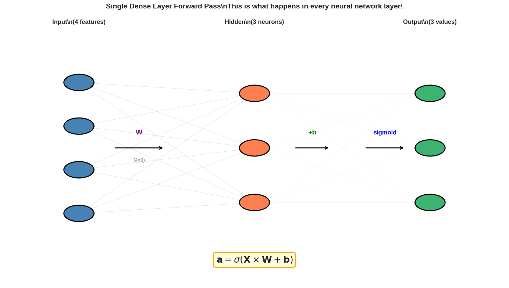

### Cell 65

```python
# Basic aggregations
arr = np.array([1, 2, 3, 4, 5, 6, 7, 8, 9, 10])
print("Array:", arr)
print()

print(f"np.sum(arr)  = {np.sum(arr)}     <- Total")
print(f"np.mean(arr) = {np.mean(arr)}    <- Average")
print(f"np.std(arr)  = {np.std(arr):.4f}  <- Standard deviation")
print(f"np.var(arr)  = {np.var(arr):.4f}  <- Variance")
print(f"np.min(arr)  = {np.min(arr)}      <- Minimum")
print(f"np.max(arr)  = {np.max(arr)}     <- Maximum")
print(f"np.argmax(arr) = {np.argmax(arr)}   <- Index of maximum")
```

**Output**

```text
Array: [ 1  2  3  4  5  6  7  8  9 10]

np.sum(arr)  = 55     <- Total
np.mean(arr) = 5.5    <- Average
np.std(arr)  = 2.8723  <- Standard deviation
np.var(arr)  = 8.2500  <- Variance
np.min(arr)  = 1      <- Minimum
np.max(arr)  = 10     <- Maximum
np.argmax(arr) = 9   <- Index of maximum
```

### Cell 67

```python
# Understanding axis
matrix = np.array([[1, 2, 3],
                   [4, 5, 6],
                   [7, 8, 9]])

print("Matrix:")
print(matrix)
print(f"Shape: {matrix.shape}")
print()

print(f"np.sum(matrix)         = {np.sum(matrix)}    <- Sum all elements")
print(f"np.sum(matrix, axis=0) = {np.sum(matrix, axis=0)}  <- Sum along rows (collapse axis 0)")
print(f"np.sum(matrix, axis=1) = {np.sum(matrix, axis=1)}  <- Sum along columns (collapse axis 1)")
```

**Output**

```text
Matrix:
[[1 2 3]
 [4 5 6]
 [7 8 9]]
Shape: (3, 3)

np.sum(matrix)         = 45    <- Sum all elements
np.sum(matrix, axis=0) = [12 15 18]  <- Sum along rows (collapse axis 0)
np.sum(matrix, axis=1) = [ 6 15 24]  <- Sum along columns (collapse axis 1)
```

### Cell 68

```python
# Visualize axis operations
fig, axes = plt.subplots(1, 3, figsize=(15, 4))

matrix = np.array([[1, 2, 3],
                   [4, 5, 6],
                   [7, 8, 9]])

# Original matrix
ax = axes[0]
ax.imshow(matrix, cmap='Blues', alpha=0.5)
for i in range(3):
    for j in range(3):
        ax.text(j, i, str(matrix[i, j]), ha='center', va='center', fontsize=16, fontweight='bold')
ax.set_title('Original Matrix\\n(3, 3)', fontsize=12, fontweight='bold')
ax.set_xticks(range(3))
ax.set_yticks(range(3))
ax.set_ylabel('axis=0 (rows)')
ax.set_xlabel('axis=1 (columns)')

# Sum along axis=0 (collapse rows)
ax = axes[1]
result = np.sum(matrix, axis=0)
ax.bar(range(3), result, color='coral', edgecolor='black')
for i, v in enumerate(result):
    ax.text(i, v + 0.5, str(v), ha='center', fontweight='bold', fontsize=14)
ax.set_title('np.sum(matrix, axis=0)\\nCollapse rows -> Shape: (3,)', fontsize=12, fontweight='bold')
ax.set_xlabel('Column index')
ax.set_ylabel('Sum')
ax.set_ylim(0, 25)

# Add arrows showing direction
for i in range(3):
    axes[0].annotate('', xy=(i, 2.3), xytext=(i, -0.3),
                     arrowprops=dict(arrowstyle='->', color='coral', lw=2))

# Sum along axis=1 (collapse columns)
ax = axes[2]
result = np.sum(matrix, axis=1)
ax.barh(range(3), result, color='mediumseagreen', edgecolor='black')
for i, v in enumerate(result):
    ax.text(v + 0.5, i, str(v), va='center', fontweight='bold', fontsize=14)
ax.set_title('np.sum(matrix, axis=1)\\nCollapse columns -> Shape: (3,)', fontsize=12, fontweight='bold')
ax.set_ylabel('Row index')
ax.set_xlabel('Sum')
ax.set_xlim(0, 28)
ax.set_yticks(range(3))
ax.invert_yaxis()

plt.suptitle('Understanding the axis Parameter\\naxis=0: down columns | axis=1: across rows',
             fontsize=14, fontweight='bold')
plt.tight_layout()
plt.show()
```

**Output**

```text
<Figure size 1500x400 with 3 Axes>
```

**Figure**

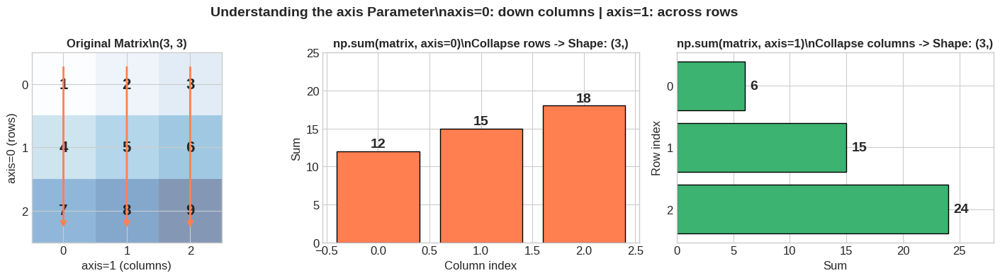

### Cell 70

```python
# Implementing loss functions with NumPy aggregations

def mean_squared_error(y_true, y_pred):
    """MSE = mean((y_true - y_pred)^2)"""
    return np.mean((y_true - y_pred) ** 2)

def binary_cross_entropy(y_true, y_pred, epsilon=1e-15):
    """BCE = -mean(y*log(p) + (1-y)*log(1-p))"""
    # Clip predictions to prevent log(0)
    y_pred = np.clip(y_pred, epsilon, 1 - epsilon)
    return -np.mean(y_true * np.log(y_pred) + (1 - y_true) * np.log(1 - y_pred))

# Test MSE
y_true = np.array([1.0, 2.0, 3.0, 4.0, 5.0])
y_pred = np.array([1.1, 2.2, 2.8, 4.1, 4.9])

print("Mean Squared Error (MSE)")
print("=" * 40)
print(f"y_true: {y_true}")
print(f"y_pred: {y_pred}")
print(f"errors: {y_true - y_pred}")
print(f"squared errors: {(y_true - y_pred) ** 2}")
print(f"MSE = {mean_squared_error(y_true, y_pred):.4f}")
print()

# Test BCE
y_true_binary = np.array([1, 0, 1, 1, 0])
y_pred_probs = np.array([0.9, 0.1, 0.8, 0.7, 0.2])

print("Binary Cross-Entropy (BCE)")
print("=" * 40)
print(f"y_true: {y_true_binary}")
print(f"y_pred: {y_pred_probs}")
print(f"BCE = {binary_cross_entropy(y_true_binary, y_pred_probs):.4f}")
```

**Output**

```text
Mean Squared Error (MSE)
========================================
y_true: [1. 2. 3. 4. 5.]
y_pred: [1.1 2.2 2.8 4.1 4.9]
errors: [-0.1 -0.2  0.2 -0.1  0.1]
squared errors: [0.01 0.04 0.04 0.01 0.01]
MSE = 0.0220

Binary Cross-Entropy (BCE)
========================================
y_true: [1 0 1 1 0]
y_pred: [0.9 0.1 0.8 0.7 0.2]
BCE = 0.2027
```

### Cell 72

```python
# reshape() - change shape while keeping all elements
arr = np.arange(12)
print("Original 1D array:", arr)
print(f"Shape: {arr.shape}")
print()

# Reshape to 2D
reshaped_2d = arr.reshape(3, 4)  # 3 rows, 4 columns
print("Reshaped to (3, 4):")
print(reshaped_2d)
print()

# Reshape to 3D
reshaped_3d = arr.reshape(2, 2, 3)  # 2 batches, 2 rows, 3 columns
print("Reshaped to (2, 2, 3):")
print(reshaped_3d)
print()

# Use -1 to auto-calculate one dimension
auto_reshaped = arr.reshape(3, -1)  # -1 means "figure it out"
print("Reshaped with -1: arr.reshape(3, -1)")
print(auto_reshaped)
print(f"Shape: {auto_reshaped.shape}  <- NumPy calculated 4 columns")
```

**Output**

```text
Original 1D array: [ 0  1  2  3  4  5  6  7  8  9 10 11]
Shape: (12,)

Reshaped to (3, 4):
[[ 0  1  2  3]
 [ 4  5  6  7]
 [ 8  9 10 11]]

Reshaped to (2, 2, 3):
[[[ 0  1  2]
  [ 3  4  5]]

 [[ 6  7  8]
  [ 9 10 11]]]

Reshaped with -1: arr.reshape(3, -1)
[[ 0  1  2  3]
 [ 4  5  6  7]
 [ 8  9 10 11]]
Shape: (3, 4)  <- NumPy calculated 4 columns
```

### Cell 73

```python
# Deep Learning Use Case: Flattening images for Dense layers
print("Flattening Images for Neural Networks")
print("=" * 50)

# A batch of 4 MNIST images (28x28 grayscale)
batch_images = np.random.rand(4, 28, 28)
print(f"Original batch shape: {batch_images.shape}")
print("  -> (batch_size, height, width)")
print()

# Flatten for a Dense layer: keep batch dimension, flatten rest
flattened = batch_images.reshape(4, -1)  # -1 = 28*28 = 784
print(f"Flattened shape: {flattened.shape}")
print("  -> (batch_size, features)")
print()

# Alternative: use .flatten() or .ravel() for single images
single_image = batch_images[0]  # Shape: (28, 28)
flat_image = single_image.flatten()  # Shape: (784,)
print(f"Single image: {single_image.shape} -> flattened: {flat_image.shape}")
```

**Output**

```text
Flattening Images for Neural Networks
==================================================
Original batch shape: (4, 28, 28)
  -> (batch_size, height, width)

Flattened shape: (4, 784)
  -> (batch_size, features)

Single image: (28, 28) -> flattened: (784,)
```

### Cell 74

```python
# Transpose - swap axes
matrix = np.array([[1, 2, 3],
                   [4, 5, 6]])

print("Original (2x3):")
print(matrix)
print()

print("Transposed (3x2):")
print(matrix.T)  # or np.transpose(matrix)
print()

# Deep Learning Use: Aligning matrices for multiplication
print("Deep Learning Use: Transposing for matrix multiplication")
X = np.random.rand(32, 10)  # 32 samples, 10 features
print(f"X shape: {X.shape}")
print(f"X.T shape: {X.T.shape}")
print(f"X.T @ X shape: {(X.T @ X).shape}  <- Covariance-like operation")
```

**Output**

```text
Original (2x3):
[[1 2 3]
 [4 5 6]]

Transposed (3x2):
[[1 4]
 [2 5]
 [3 6]]

Deep Learning Use: Transposing for matrix multiplication
X shape: (32, 10)
X.T shape: (10, 32)
X.T @ X shape: (10, 10)  <- Covariance-like operation
```

### Cell 76

```python
# Random number generation basics
np.random.seed(42)  # For reproducibility - IMPORTANT in research!

# Uniform distribution [0, 1)
uniform = np.random.rand(3, 4)
print("Uniform [0, 1) - np.random.rand(3, 4):")
print(uniform)
print()

# Standard normal (Gaussian) - mean=0, std=1
normal = np.random.randn(3, 4)
print("Standard Normal - np.random.randn(3, 4):")
print(normal)
print()

# Random integers
integers = np.random.randint(0, 10, size=(3, 4))  # [low, high)
print("Random integers [0, 10) - np.random.randint(0, 10, (3, 4)):")
print(integers)
```

**Output**

```text
Uniform [0, 1) - np.random.rand(3, 4):
[[0.37454012 0.95071431 0.73199394 0.59865848]
 [0.15601864 0.15599452 0.05808361 0.86617615]
 [0.60111501 0.70807258 0.02058449 0.96990985]]

Standard Normal - np.random.randn(3, 4):
[[-0.46947439  0.54256004 -0.46341769 -0.46572975]
 [ 0.24196227 -1.91328024 -1.72491783 -0.56228753]
 [-1.01283112  0.31424733 -0.90802408 -1.4123037 ]]

Random integers [0, 10) - np.random.randint(0, 10, (3, 4)):
[[2 6 3 8]
 [2 4 2 6]
 [4 8 6 1]]
```

### Cell 78

```python
# Weight initialization schemes
def xavier_init(n_in, n_out):
    """Xavier/Glorot initialization - good for tanh/sigmoid"""
    std = np.sqrt(2.0 / (n_in + n_out))
    return np.random.randn(n_in, n_out) * std

def he_init(n_in, n_out):
    """He initialization - best for ReLU"""
    std = np.sqrt(2.0 / n_in)
    return np.random.randn(n_in, n_out) * std

def lecun_init(n_in, n_out):
    """LeCun initialization - good for SELU"""
    std = np.sqrt(1.0 / n_in)
    return np.random.randn(n_in, n_out) * std

# Compare initializations for a layer: 784 inputs -> 256 outputs
n_in, n_out = 784, 256

np.random.seed(42)
random_weights = np.random.randn(n_in, n_out)  # No scaling - BAD!
xavier_weights = xavier_init(n_in, n_out)
he_weights = he_init(n_in, n_out)

print("Weight Statistics Comparison (784 -> 256 layer):")
print("=" * 60)
print(f"{'Method':<15} {'Mean':>10} {'Std':>10} {'Min':>10} {'Max':>10}")
print("-" * 60)
print(f"{'Random':<15} {random_weights.mean():>10.4f} {random_weights.std():>10.4f} {random_weights.min():>10.4f} {random_weights.max():>10.4f}")
print(f"{'Xavier':<15} {xavier_weights.mean():>10.4f} {xavier_weights.std():>10.4f} {xavier_weights.min():>10.4f} {xavier_weights.max():>10.4f}")
print(f"{'He':<15} {he_weights.mean():>10.4f} {he_weights.std():>10.4f} {he_weights.min():>10.4f} {he_weights.max():>10.4f}")
```

**Output**

```text
Weight Statistics Comparison (784 -> 256 layer):
============================================================
Method                Mean        Std        Min        Max
------------------------------------------------------------
Random              0.0011     0.9998    -4.4656     4.5621
Xavier             -0.0000     0.0439    -0.1936     0.1850
He                 -0.0002     0.0506    -0.2439     0.2363
```

### Cell 80

```python
import time

# Speed comparison: Loop vs Vectorized
n = 1_000_000

a = np.random.rand(n)
b = np.random.rand(n)

# Method 1: Python loop (SLOW)
start = time.time()
result_loop = []
for i in range(n):
    result_loop.append(a[i] + b[i])
loop_time = time.time() - start

# Method 2: NumPy vectorized (FAST)
start = time.time()
result_vectorized = a + b
vector_time = time.time() - start

print("Speed Comparison: Adding 1,000,000 element pairs")
print("=" * 50)
print(f"Python loop:  {loop_time:.4f} seconds")
print(f"NumPy vector: {vector_time:.6f} seconds")
print(f"Speedup:      {loop_time/vector_time:.1f}x faster!")
print()
print("This is why deep learning frameworks use vectorized operations!")
```

**Output**

```text
Speed Comparison: Adding 1,000,000 element pairs
==================================================
Python loop:  0.9496 seconds
NumPy vector: 0.006075 seconds
Speedup:      156.3x faster!

This is why deep learning frameworks use vectorized operations!
```

### Cell 82

```python
# The XOR Problem - impossible for single-layer networks!
print("The XOR Problem")
print("=" * 40)
print("Input A | Input B | XOR Output")
print("-" * 40)
print("   0    |    0    |     0     ")
print("   0    |    1    |     1     ")
print("   1    |    0    |     1     ")
print("   1    |    1    |     0     ")
print()
print("This pattern CANNOT be learned without hidden layers!")
print("A neural network must learn this non-linear relationship.")
```

**Output**

```text
The XOR Problem
========================================
Input A | Input B | XOR Output
----------------------------------------
   0    |    0    |     0     
   0    |    1    |     1     
   1    |    0    |     1     
   1    |    1    |     0     

This pattern CANNOT be learned without hidden layers!
A neural network must learn this non-linear relationship.
```

### Cell 83

```python
class MiniNeuralNetwork:
    """
    A simple 2-layer neural network using only NumPy!

    This demonstrates:
    - Arrays: Weight matrices and biases
    - Indexing: Batch processing
    - Element-wise ops: Activations
    - Broadcasting: Bias addition
    - Matrix multiplication: Forward pass
    - Statistics: Loss computation
    - Random: Weight initialization
    """

    def __init__(self, input_size, hidden_size, output_size):
        # He initialization (Section 8)
        self.W1 = np.random.randn(input_size, hidden_size) * np.sqrt(2.0 / input_size)
        self.b1 = np.zeros(hidden_size)  # Bias init to zero

        self.W2 = np.random.randn(hidden_size, output_size) * np.sqrt(2.0 / hidden_size)
        self.b2 = np.zeros(output_size)

    def sigmoid(self, x):
        # Element-wise operation (Section 3)
        return 1 / (1 + np.exp(-np.clip(x, -500, 500)))

    def sigmoid_derivative(self, x):
        # For backpropagation
        return x * (1 - x)

    def forward(self, X):
        # Layer 1: Matrix multiplication + broadcasting + activation (Sections 4, 5)
        self.z1 = X @ self.W1 + self.b1  # Broadcasting bias!
        self.a1 = self.sigmoid(self.z1)  # Element-wise activation

        # Layer 2
        self.z2 = self.a1 @ self.W2 + self.b2
        self.a2 = self.sigmoid(self.z2)

        return self.a2

    def backward(self, X, y, learning_rate=0.5):
        m = X.shape[0]  # Batch size

        # Output layer error
        delta2 = (self.a2 - y) * self.sigmoid_derivative(self.a2)

        # Hidden layer error
        delta1 = (delta2 @ self.W2.T) * self.sigmoid_derivative(self.a1)

        # Gradient descent updates
        self.W2 -= learning_rate * (self.a1.T @ delta2) / m
        self.b2 -= learning_rate * np.mean(delta2, axis=0)  # Mean across batch (Section 6)

        self.W1 -= learning_rate * (X.T @ delta1) / m
        self.b1 -= learning_rate * np.mean(delta1, axis=0)

    def train(self, X, y, epochs=10000, print_every=1000):
        losses = []
        for epoch in range(epochs):
            # Forward pass
            output = self.forward(X)

            # Compute loss (MSE - Section 6)
            loss = np.mean((y - output) ** 2)
            losses.append(loss)

            # Backward pass
            self.backward(X, y)

            if epoch % print_every == 0:
                print(f"Epoch {epoch:5d} | Loss: {loss:.6f}")

        return losses

    def predict(self, X):
        return self.forward(X)
```

### Cell 84

```python
# Train on XOR!
np.random.seed(42)

# XOR dataset (Section 1 - Arrays)
X = np.array([[0, 0],
              [0, 1],
              [1, 0],
              [1, 1]])

y = np.array([[0],
              [1],
              [1],
              [0]])

print("Training Neural Network on XOR Problem")
print("=" * 50)
print(f"Input shape: {X.shape}  (4 samples, 2 features)")
print(f"Output shape: {y.shape} (4 samples, 1 output)")
print()

# Create network: 2 inputs -> 4 hidden -> 1 output
nn = MiniNeuralNetwork(input_size=2, hidden_size=4, output_size=1)

# Train!
losses = nn.train(X, y, epochs=10001, print_every=2000)
```

**Output**

```text
Training Neural Network on XOR Problem
==================================================
Input shape: (4, 2)  (4 samples, 2 features)
Output shape: (4, 1) (4 samples, 1 output)

Epoch     0 | Loss: 0.268272
Epoch  2000 | Loss: 0.183650
Epoch  4000 | Loss: 0.022198
Epoch  6000 | Loss: 0.005429
Epoch  8000 | Loss: 0.002847
Epoch 10000 | Loss: 0.001889
```

### Cell 85

```python
# Test the trained network
print("\\nResults After Training:")
print("=" * 50)
predictions = nn.predict(X)

print(f"{'Input':<15} {'Target':<10} {'Prediction':<12} {'Rounded':<10}")
print("-" * 50)
for i in range(len(X)):
    pred = predictions[i, 0]
    rounded = round(pred)
    correct = "" if rounded == y[i, 0] else "X"
    print(f"{str(X[i]):<15} {y[i, 0]:<10} {pred:<12.4f} {rounded:<10} {correct}")

accuracy = np.mean((np.round(predictions) == y).astype(float)) * 100
print(f"\\nAccuracy: {accuracy:.0f}%")
```

**Output**

```text
\nResults After Training:
==================================================
Input           Target     Prediction   Rounded   
--------------------------------------------------
[0 0]           0          0.0440       0          
[0 1]           1          0.9543       1          
[1 0]           1          0.9621       1          
[1 1]           0          0.0458       0          
\nAccuracy: 100%
```

### Cell 86

```python
# Visualize training progress and decision boundary
fig, axes = plt.subplots(1, 2, figsize=(14, 5))

# Loss curve
ax = axes[0]
ax.plot(losses, 'b-', linewidth=2)
ax.set_xlabel('Epoch')
ax.set_ylabel('Loss (MSE)')
ax.set_title('Training Loss Over Time', fontsize=14, fontweight='bold')
ax.set_yscale('log')
ax.grid(True, alpha=0.3)
ax.annotate(f'Final Loss: {losses[-1]:.6f}', xy=(len(losses)-1, losses[-1]),
            xytext=(len(losses)*0.6, losses[-1]*10),
            arrowprops=dict(arrowstyle='->', color='red'),
            fontsize=11, color='red')

# Decision boundary
ax = axes[1]
xx, yy = np.meshgrid(np.linspace(-0.5, 1.5, 100),
                     np.linspace(-0.5, 1.5, 100))
grid = np.c_[xx.ravel(), yy.ravel()]
Z = nn.predict(grid).reshape(xx.shape)

contour = ax.contourf(xx, yy, Z, levels=20, cmap='RdYlBu', alpha=0.8)
ax.colorbar = plt.colorbar(contour, ax=ax, label='Network Output')

# Plot data points
for i in range(len(X)):
    color = 'green' if y[i] == 1 else 'red'
    marker = 'o' if y[i] == 1 else 's'
    ax.scatter(X[i, 0], X[i, 1], c=color, s=200, edgecolors='black',
               linewidth=2, marker=marker, zorder=5)
    ax.annotate(f'XOR={y[i,0]}', (X[i,0]+0.05, X[i,1]+0.1), fontsize=10, fontweight='bold')

ax.set_xlabel('Input A')
ax.set_ylabel('Input B')
ax.set_title('Decision Boundary Learned by Network\\nBlue=0, Red=1', fontsize=14, fontweight='bold')
ax.set_xlim(-0.5, 1.5)
ax.set_ylim(-0.5, 1.5)

plt.suptitle('Neural Network Successfully Learned XOR!', fontsize=16, fontweight='bold', y=1.02)
plt.tight_layout()
plt.show()
```

**Output**

```text
<Figure size 1400x500 with 3 Axes>
```

**Figure**

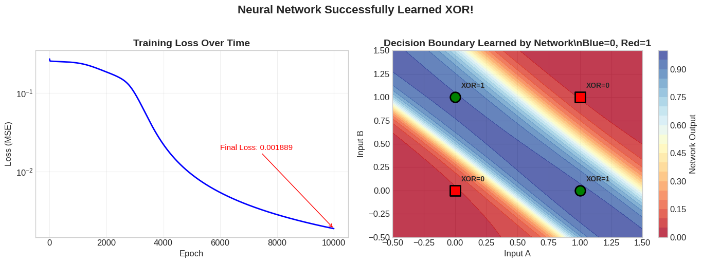

