# 03 — Introduction to Pandas

**Status:** Executed successfully

## Code and Output

### Cell 3

```python
# ============================================================
#  Setup -- runs anywhere. No installs, no downloads, no keys.
# ============================================================
import numpy as np
import pandas as pd
import matplotlib.pyplot as plt

pd.set_option("display.max_rows", 12)
pd.set_option("display.width", 100)
plt.rcParams["figure.figsize"] = (9, 4)
plt.rcParams["axes.grid"] = True
plt.rcParams["grid.alpha"] = 0.3
plt.rcParams["axes.spines.top"] = False
plt.rcParams["axes.spines.right"] = False

C_IDX, C_DATA, C_GROUP = "#7C3AED", "#2563EB", "#059669"
C_NA, C_WARN, C_GREY, C_SOFT = "#DC2626", "#D97706", "#6B7280", "#E5E7EB"

print(f"pandas {pd.__version__}   numpy {np.__version__}")
```

**Output**

```text
pandas 2.2.3   numpy 2.1.3
```

### Cell 5

```python
# ============================================================
#  The dataset -- generated here so the notebook needs no
#  downloads, no API keys and no network. It is deliberately
#  MESSY: missing values, wrong dtypes, duplicates, stray
#  whitespace and a few impossible numbers. Cleaning it is
#  most of Parts 4 and 5.
# ============================================================
import numpy as np
import pandas as pd

RNG = np.random.default_rng(7)

N_ROWS = 900
STORES  = ["Bakersfield", "Fresno", "Modesto", "Salinas", "Stockton"]
REGIONS = {"Bakersfield": "South", "Fresno": "Central", "Modesto": "Central",
           "Salinas": "Coast", "Stockton": "North"}
PRODUCTS = ["espresso", "latte", "cold brew", "muffin", "bagel", "cookie"]
CATEGORY = {"espresso": "drink", "latte": "drink", "cold brew": "drink",
            "muffin": "food", "bagel": "food", "cookie": "food"}
UNIT_PRICE = {"espresso": 3.25, "latte": 4.75, "cold brew": 4.25,
              "muffin": 3.50, "bagel": 2.75, "cookie": 2.25}

dates = pd.date_range("2024-01-01", periods=180, freq="D")

rows = []
for i in range(N_ROWS):
    d = RNG.choice(dates)
    store = RNG.choice(STORES)
    product = RNG.choice(PRODUCTS)
    # weekends sell more; drinks sell more in the morning half of the year
    weekend = 1.6 if pd.Timestamp(d).dayofweek >= 5 else 1.0
    base = RNG.poisson(6 * weekend) + 1
    rows.append({
        "order_id":   1000 + i,
        "date":       str(pd.Timestamp(d).date()),      # str, not datetime -- on purpose
        "store":      store,
        "region":     REGIONS[store],
        "product":    product,
        "category":   CATEGORY[product],
        "quantity":   base,
        "unit_price": UNIT_PRICE[product],
        "rating":     round(float(np.clip(RNG.normal(4.1, 0.6), 1, 5)), 1),
    })

sales = pd.DataFrame(rows)

# --- now make it realistically dirty -------------------------------------
# stray whitespace and inconsistent case in a key column
mask = RNG.random(len(sales)) < 0.06
sales.loc[mask, "store"] = sales.loc[mask, "store"].str.upper()
mask = RNG.random(len(sales)) < 0.05
sales.loc[mask, "product"] = "  " + sales.loc[mask, "product"] + " "

# missing values, in three columns, for three different reasons
sales.loc[RNG.random(len(sales)) < 0.08, "rating"] = np.nan        # not asked
sales.loc[RNG.random(len(sales)) < 0.03, "quantity"] = np.nan      # not recorded
sales.loc[RNG.random(len(sales)) < 0.02, "region"] = None          # new store

# a numeric column that arrived as text, with a currency symbol
sales["unit_price"] = "$" + sales["unit_price"].astype(str)

# a few exact duplicate rows, as a double-scanned batch would produce
dupes = sales.sample(14, random_state=7)
sales = pd.concat([sales, dupes], ignore_index=True)

# and a handful of impossible values
bad = RNG.choice(len(sales), 6, replace=False)
sales.loc[bad, "quantity"] = -1

sales = sales.sample(frac=1, random_state=7).reset_index(drop=True)

print(f"sales: {sales.shape[0]:,} rows x {sales.shape[1]} columns")
print(f"memory: {sales.memory_usage(deep=True).sum() / 1024:,.1f} KB")
sales.head()
```

**Output**

```text
sales: 914 rows x 9 columns
memory: 359.3 KB
```

**Output**

```text
   order_id        date     store   region       product category  quantity unit_price  rating
0      1063  2024-02-08  Stockton    North    cold brew     drink       6.0      $4.25     4.2
1      1677  2024-05-17    Fresno  Central      espresso    drink       9.0      $3.25     5.0
2      1140  2024-03-19  Stockton    North       muffin      food       9.0       $3.5     4.1
3      1053  2024-05-27  Stockton    North         latte    drink       5.0      $4.75     2.6
4      1825  2024-06-01  Stockton    North         bagel     food       9.0      $2.75     4.3
```

### Cell 10

```python
# A Series = the values + the labels + a name + a dtype.
prices = pd.Series(
    [3.25, 4.75, 4.25, 3.50],
    index=["espresso", "latte", "cold brew", "muffin"],
    name="unit_price",
)

print(prices)
print()
print("type(prices)      ->", type(prices))
print(".values           ->", prices.values, " (a", type(prices.values).__name__ + ")")
print(".index            ->", prices.index)
print(".dtype            ->", prices.dtype)
print(".name             ->", prices.name)
print(".shape            ->", prices.shape)
print()
print("by label     prices['latte']  ->", prices["latte"])
print("by position  prices.iloc[1]   ->", prices.iloc[1])
```

**Output**

```text
espresso     3.25
latte        4.75
cold brew    4.25
muffin       3.50
Name: unit_price, dtype: float64

type(prices)      -> <class 'pandas.core.series.Series'>
.values           -> [3.25 4.75 4.25 3.5 ]  (a ndarray)
.index            -> Index(['espresso', 'latte', 'cold brew', 'muffin'], dtype='object')
.dtype            -> float64
.name             -> unit_price
.shape            -> (4,)

by label     prices['latte']  -> 4.75
by position  prices.iloc[1]   -> 4.75
```

### Cell 13

```python
# 1. A column of the real dataset IS a Series.
rat = sales["rating"]
print("type(sales)           ->", type(sales))
print("type(sales['rating']) ->", type(rat))
print("its name              ->", rat.name)
print("its dtype             ->", rat.dtype)
print("its index equals the frame's index? ->", rat.index.equals(sales.index))
print()
print(rat.head(3))
print()

# 2. And a DataFrame really can be assembled from a dict of Series.
sold  = pd.Series([120, 95, 60], index=["espresso", "latte", "muffin"], name="sold")
stars = pd.Series([4.2, 4.6, 3.9], index=["espresso", "latte", "muffin"], name="rating")

menu = pd.DataFrame({"sold": sold, "rating": stars})
print(menu)
print()
print("menu.index   ->", menu.index)
print("menu.columns ->", menu.columns)
print("both are Index objects:", type(menu.index).__name__, "/", type(menu.columns).__name__)
```

**Output**

```text
type(sales)           -> <class 'pandas.core.frame.DataFrame'>
type(sales['rating']) -> <class 'pandas.core.series.Series'>
its name              -> rating
its dtype             -> float64
its index equals the frame's index? -> True

0    4.2
1    5.0
2    4.1
Name: rating, dtype: float64

          sold  rating
espresso   120     4.2
latte       95     4.6
muffin      60     3.9

menu.index   -> Index(['espresso', 'latte', 'muffin'], dtype='object')
menu.columns -> Index(['sold', 'rating'], dtype='object')
both are Index objects: Index / Index
```

### Cell 16

```python
monday  = pd.Series([12, 9, 5], index=["espresso", "latte", "muffin"], name="monday")
tuesday = pd.Series([7, 4, 6],  index=["latte", "muffin", "cookie"],   name="tuesday")

print("MONDAY");   print(monday)
print("\nTUESDAY"); print(tuesday)

print("\n" + "=" * 52)
print("pandas:  monday + tuesday          (aligns on LABEL)")
print("=" * 52)
print(monday + tuesday)

print("\n" + "=" * 52)
print("numpy:   monday.values + tuesday.values   (aligns on POSITION)")
print("=" * 52)
print(monday.values + tuesday.values)
print("...which pairs espresso with latte, latte with muffin, muffin with cookie.")

print("\n" + "=" * 52)
print("The fix, when you MEANT 'absent = zero sold'")
print("=" * 52)
print(monday.add(tuesday, fill_value=0))

print("\nlabels only Monday knows about ->", list(monday.index.difference(tuesday.index)))
print("labels only Tuesday knows about ->", list(tuesday.index.difference(monday.index)))
```

**Output**

```text
MONDAY
espresso    12
latte        9
muffin       5
Name: monday, dtype: int64

TUESDAY
latte     7
muffin    4
cookie    6
Name: tuesday, dtype: int64

====================================================
pandas:  monday + tuesday          (aligns on LABEL)
====================================================
cookie       NaN
espresso     NaN
latte       16.0
muffin       9.0
dtype: float64

====================================================
numpy:   monday.values + tuesday.values   (aligns on POSITION)
====================================================
[19 13 11]
...which pairs espresso with latte, latte with muffin, muffin with cookie.

====================================================
The fix, when you MEANT 'absent = zero sold'
====================================================
cookie       6.0
espresso    12.0
latte       16.0
muffin       9.0
dtype: float64

labels only Monday knows about -> ['espresso']
labels only Tuesday knows about -> ['cookie']
```

### Cell 20

```python
print(".shape   ->", sales.shape, "  (rows, columns) -- an attribute, not a method")
print(".columns ->", list(sales.columns))
print(".index   ->", sales.index)
print()
print(".dtypes:")
print(sales.dtypes)
print()
print(".info():")
sales.info()
```

**Output**

```text
.shape   -> (914, 9)   (rows, columns) -- an attribute, not a method
.columns -> ['order_id', 'date', 'store', 'region', 'product', 'category', 'quantity', 'unit_price', 'rating']
.index   -> RangeIndex(start=0, stop=914, step=1)

.dtypes:
order_id        int64
date           object
store          object
region         object
product        object
category       object
quantity      float64
unit_price     object
rating        float64
dtype: object

.info():
<class 'pandas.core.frame.DataFrame'>
RangeIndex: 914 entries, 0 to 913
Data columns (total 9 columns):
 #   Column      Non-Null Count  Dtype  
---  ------      --------------  -----  
 0   order_id    914 non-null    int64  
 1   date        914 non-null    object 
 2   store       914 non-null    object 
 3   region      899 non-null    object 
 4   product     914 non-null    object 
 5   category    914 non-null    object 
 6   quantity    884 non-null    float64
 7   unit_price  914 non-null    object 
 8   rating      851 non-null    float64
dtypes: float64(2), int64(1), object(6)
memory usage: 64.4+ KB
```

### Cell 22

```python
# One picture of the two axes: index down the side, columns across the top.
demo = sales.loc[[0, 1, 2, 3], ["store", "product", "quantity", "rating"]]

nrow, ncol = demo.shape
cw, ch = 1.55, 0.62                      # cell width / height, in data units

fig, ax = plt.subplots(figsize=(9.6, 3.9))
ax.set_axis_off()
ax.grid(False)

# --- column headers (the columns Index) ---------------------------------
for j, col in enumerate(demo.columns):
    ax.add_patch(plt.Rectangle((cw + j * cw, nrow * ch), cw, ch,
                               facecolor=C_DATA, alpha=0.16, edgecolor=C_DATA, lw=1.2))
    ax.text(cw + j * cw + cw / 2, nrow * ch + ch / 2, col,
            ha="center", va="center", color=C_DATA, fontweight="bold", fontsize=10)

# --- index labels (the row Index) + the values --------------------------
for i in range(nrow):
    y = (nrow - 1 - i) * ch
    ax.add_patch(plt.Rectangle((0, y), cw, ch,
                               facecolor=C_IDX, alpha=0.16, edgecolor=C_IDX, lw=1.2))
    ax.text(cw / 2, y + ch / 2, str(demo.index[i]),
            ha="center", va="center", color=C_IDX, fontweight="bold", fontsize=10)
    for j in range(ncol):
        ax.add_patch(plt.Rectangle((cw + j * cw, y), cw, ch,
                                   facecolor="white", edgecolor=C_SOFT, lw=1.0))
        ax.text(cw + j * cw + cw / 2, y + ch / 2, str(demo.iat[i, j]),
                ha="center", va="center", fontsize=9, color="#111827")

# --- the two axis labels ------------------------------------------------
ax.annotate("", xy=(cw + ncol * cw, nrow * ch + ch * 1.45),
            xytext=(cw, nrow * ch + ch * 1.45),
            arrowprops=dict(arrowstyle="->", color=C_DATA, lw=1.6))
ax.text(cw + ncol * cw / 2, nrow * ch + ch * 1.7, "df.columns  (axis 1)",
        ha="center", va="bottom", color=C_DATA, fontweight="bold", fontsize=11)

ax.annotate("", xy=(-0.30, 0), xytext=(-0.30, nrow * ch),
            arrowprops=dict(arrowstyle="->", color=C_IDX, lw=1.6))
ax.text(-0.45, nrow * ch / 2, "df.index  (axis 0)", rotation=90,
        ha="right", va="center", color=C_IDX, fontweight="bold", fontsize=11)

ax.text(cw, -ch * 0.65,
        "one column, top to bottom = one Series, sharing the labels on the left",
        ha="left", va="center", color=C_GREY, fontsize=9.5, style="italic")

ax.set_xlim(-1.05, cw + ncol * cw + 0.30)
ax.set_ylim(-ch * 1.15, nrow * ch + ch * 2.45)
plt.tight_layout()
plt.show()
```

**Output**

```text
<Figure size 960x390 with 1 Axes>
```

**Figure**

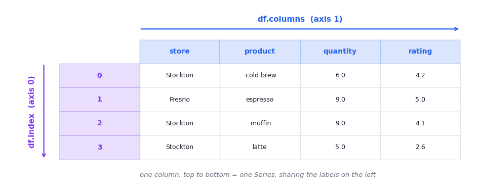

### Cell 25

```python
by_id = sales.set_index("order_id")

print("sales.shape ->", sales.shape, "  (order_id is one of the columns)")
print("by_id.shape ->", by_id.shape, "  (order_id became the index, so one column fewer)")
print("by_id.index.name ->", by_id.index.name)
print()
print("Look an order up by the id itself:")
print(by_id.loc[1000])

# ...and straight back out again.
back = by_id.reset_index()
print()
print("after reset_index, columns ->", list(back.columns))
print("after reset_index, index   ->", back.index)

# But: is this index actually unique?
print()
print("by_id.index.is_unique ->", by_id.index.is_unique)
dup_ids = by_id.index[by_id.index.duplicated()]
print("repeated order ids     ->", len(dup_ids))
print("first repeated id      ->", dup_ids[0])
print()
print("by_id.loc[", dup_ids[0], "] returns:")
print(by_id.loc[dup_ids[0], ["date", "store", "product", "quantity"]])
print("type ->", type(by_id.loc[dup_ids[0]]))
```

**Output**

```text
sales.shape -> (914, 9)   (order_id is one of the columns)
by_id.shape -> (914, 8)   (order_id became the index, so one column fewer)
by_id.index.name -> order_id

Look an order up by the id itself:
date          2024-06-19
store            Salinas
region             Coast
product            bagel
category            food
quantity             5.0
unit_price         $2.75
rating               4.9
Name: 1000, dtype: object

after reset_index, columns -> ['order_id', 'date', 'store', 'region', 'product', 'category', 'quantity', 'unit_price', 'rating']
after reset_index, index   -> RangeIndex(start=0, stop=914, step=1)

by_id.index.is_unique -> False
repeated order ids     -> 14
first repeated id      -> 1399

by_id.loc[ 1399 ] returns:
                date        store product  quantity
order_id                                           
1399      2024-02-02  Bakersfield   latte      10.0
1399      2024-02-02  Bakersfield   latte      10.0
type -> <class 'pandas.core.frame.DataFrame'>
```

### Cell 29

```python
# Five rows, picked to include a couple of missing ratings so the new
# column below has something to say. .copy(): never mutate the raw frame.
first5 = sales.loc[[0, 1, 2, 16, 29]].copy()
print("before ->", list(first5.columns))

# assignment appends at the end...
first5["rating_missing"] = first5["rating"].isna()

# ...insert() puts it exactly where you want it.
first5.insert(0, "row_tag", ["a", "b", "c", "d", "e"])

print("after  ->", list(first5.columns))
print()
print(first5[["row_tag", "store", "quantity", "rating", "rating_missing"]])
```

**Output**

```text
before -> ['order_id', 'date', 'store', 'region', 'product', 'category', 'quantity', 'unit_price', 'rating']
after  -> ['row_tag', 'order_id', 'date', 'store', 'region', 'product', 'category', 'quantity', 'unit_price', 'rating', 'rating_missing']

   row_tag        store  quantity  rating  rating_missing
0        a     Stockton       6.0     4.2           False
1        b       Fresno       9.0     5.0           False
2        c     Stockton       9.0     4.1           False
16       d      Salinas       9.0     NaN            True
29       e  Bakersfield       5.0     NaN            True
```

### Cell 31

```python
# Attribute access LOOKS nicer... until a column name collides with pandas itself.
trap = pd.DataFrame({"count": [3, 1, 4], "unit price": [3.25, 4.75, 4.25]})
print(trap)
print()

print("trap['count'] (the column) ->", trap["count"].tolist())

print("\ntrap.count  (NOT the column):")
print("  ", trap.count)                  # a bound method, not your data
try:
    print("  trap.count.sum() ->", trap.count.sum())
except AttributeError as e:
    print("   AttributeError:", e)

print("\ntrap.unit_price:")
try:
    trap.unit_price                      # the real name has a space in it
except AttributeError as e:
    print("   AttributeError:", e)

# And a column named 'shape' loses to the attribute, every time.
trap["shape"] = [10, 20, 30]
print("\ntrap.shape    ->", trap.shape, "  <- the frame's dimensions, not the column")
print("trap['shape'] ->", trap["shape"].tolist())

print("\nOn the real frame, attribute access happens to work:")
print("  sales.rating.mean()    ->", round(sales.rating.mean(), 4))
print("  sales['rating'].mean() ->", round(sales["rating"].mean(), 4))
```

**Output**

```text
   count  unit price
0      3        3.25
1      1        4.75
2      4        4.25

trap['count'] (the column) -> [3, 1, 4]

trap.count  (NOT the column):
   <bound method DataFrame.count of    count  unit price
0      3        3.25
1      1        4.75
2      4        4.25>
   AttributeError: 'function' object has no attribute 'sum'

trap.unit_price:
   AttributeError: 'DataFrame' object has no attribute 'unit_price'

trap.shape    -> (3, 3)   <- the frame's dimensions, not the column
trap['shape'] -> [10, 20, 30]

On the real frame, attribute access happens to work:
  sales.rating.mean()    -> 4.043
  sales['rating'].mean() -> 4.043
```

### Cell 36

```python
sales.head()
```

**Output**

```text
   order_id        date     store   region       product category  quantity unit_price  rating
0      1063  2024-02-08  Stockton    North    cold brew     drink       6.0      $4.25     4.2
1      1677  2024-05-17    Fresno  Central      espresso    drink       9.0      $3.25     5.0
2      1140  2024-03-19  Stockton    North       muffin      food       9.0       $3.5     4.1
3      1053  2024-05-27  Stockton    North         latte    drink       5.0      $4.75     2.6
4      1825  2024-06-01  Stockton    North         bagel     food       9.0      $2.75     4.3
```

### Cell 39

```python
# The same frame the thumbnail came from -- asked four harder questions.
print("shape:", sales.shape)

print("\n--- 1. what is each column, really? ------------------")
sales.info()

print("\n--- 2. what is missing? ------------------------------")
print(sales.isna().sum().to_string())

print("\n--- 3. what is repeated? -----------------------------")
print("exact duplicate rows:", int(sales.duplicated().sum()))

print("\n--- 4. what is impossible? ---------------------------")
print("smallest quantity in the file:", sales["quantity"].min())
print("orders with quantity < 0     :", int((sales["quantity"] < 0).sum()))
```

**Output**

```text
shape: (914, 9)

--- 1. what is each column, really? ------------------
<class 'pandas.core.frame.DataFrame'>
RangeIndex: 914 entries, 0 to 913
Data columns (total 9 columns):
 #   Column      Non-Null Count  Dtype  
---  ------      --------------  -----  
 0   order_id    914 non-null    int64  
 1   date        914 non-null    object 
 2   store       914 non-null    object 
 3   region      899 non-null    object 
 4   product     914 non-null    object 
 5   category    914 non-null    object 
 6   quantity    884 non-null    float64
 7   unit_price  914 non-null    object 
 8   rating      851 non-null    float64
dtypes: float64(2), int64(1), object(6)
memory usage: 64.4+ KB

--- 2. what is missing? ------------------------------
order_id       0
date           0
store          0
region        15
product        0
category       0
quantity      30
unit_price     0
rating        63

--- 3. what is repeated? -----------------------------
exact duplicate rows: 14

--- 4. what is impossible? ---------------------------
smallest quantity in the file: -1.0
orders with quantity < 0     : 6
```

### Cell 42

```python
import os, io, tempfile

# A small typed frame, carved out of sales. We are NOT cleaning sales here --
# this is a separate demo frame that exists to be written to disk and read back.
n = 200
typed = pd.DataFrame({
    "order_id": sales["order_id"].head(n).astype(str).str.zfill(8),  # ids keep leading zeros
    "date":     pd.to_datetime(sales["date"].head(n)),               # a real datetime
    "store":    sales["store"].head(n).astype("category"),           # a category
    "quantity": sales["quantity"].head(n).astype("Int64"),           # nullable integer
})

TMPDIR = os.path.join(tempfile.gettempdir(), "pandas_z2h_part2")
os.makedirs(TMPDIR, exist_ok=True)
CSV = os.path.join(TMPDIR, "typed.csv")

typed.to_csv(CSV, index=False)
naive = pd.read_csv(CSV)          # no arguments -- let pandas guess

print("the first two lines of the file on disk:")
with open(CSV) as f:
    print("    " + next(f).strip())
    print("    " + next(f).strip())

before, after = typed.dtypes.astype(str), naive.dtypes.astype(str)
print()
print(pd.DataFrame({"written as": before,
                    "read back as": after,
                    "survived": before.values == after.values}).to_string())

print("\norder_id first value -- before:", repr(typed["order_id"].iloc[0]),
      "  after:", repr(naive["order_id"].iloc[0]))
```

**Output**

```text
the first two lines of the file on disk:
    order_id,date,store,quantity
    00001063,2024-02-08,Stockton,6

              written as read back as  survived
order_id          object        int64     False
date      datetime64[ns]       object     False
store           category       object     False
quantity           Int64      float64     False

order_id first value -- before: '00001063'   after: np.int64(1063)
```

### Cell 46

```python
# --- the same CSV, read with the dtypes declared instead of guessed ---------
restored = pd.read_csv(
    CSV,
    dtype={"order_id": "str", "store": "category", "quantity": "Int64"},
    parse_dates=["date"],
)
print("restored dtypes:")
print(restored.dtypes.to_string())
print("order_id first value:", repr(restored["order_id"].iloc[0]))
print("store is a category again:", list(restored["store"].cat.categories)[:3], "...")

# --- a deliberately ugly file: grouped numbers and three spellings of NA ----
UGLY = (
    "store,units_sold,revenue\n"
    'Fresno,"1,204","12,450.50"\n'
    'Salinas,N/A,"9,001.00"\n'
    "Modesto,876,unknown\n"
    'Stockton,-,"4,110.25"\n'
)
print("\nthe raw file:")
print(UGLY)

lazy    = pd.read_csv(io.StringIO(UGLY))
careful = pd.read_csv(io.StringIO(UGLY), thousands=",",
                      na_values=["N/A", "unknown", "-"])
print("read with no arguments      ->", dict(lazy.dtypes.astype(str)))
print("read with thousands+na_values ->", dict(careful.dtypes.astype(str)))
print()
print(careful.to_string())
print("\nrevenue total, the careful way:", careful["revenue"].sum())

# --- usecols / nrows / index_col: probing a file you have not seen ----------
peek = pd.read_csv(CSV, usecols=["order_id", "quantity"], nrows=4,
                   index_col="order_id")
print("\nusecols + nrows + index_col -- 2 columns, 4 rows, keyed by order_id:")
print(peek.to_string())
```

**Output**

```text
restored dtypes:
order_id            object
date        datetime64[ns]
store             category
quantity             Int64
order_id first value: '00001063'
store is a category again: ['BAKERSFIELD', 'Bakersfield', 'FRESNO'] ...

the raw file:
store,units_sold,revenue
Fresno,"1,204","12,450.50"
Salinas,N/A,"9,001.00"
Modesto,876,unknown
Stockton,-,"4,110.25"

read with no arguments      -> {'store': 'object', 'units_sold': 'object', 'revenue': 'object'}
read with thousands+na_values -> {'store': 'object', 'units_sold': 'float64', 'revenue': 'float64'}

      store  units_sold   revenue
0    Fresno      1204.0  12450.50
1   Salinas         NaN   9001.00
2   Modesto       876.0       NaN
3  Stockton         NaN   4110.25

revenue total, the careful way: 25561.75

usecols + nrows + index_col -- 2 columns, 4 rows, keyed by order_id:
          quantity
order_id          
1063             6
1677             9
1140             9
1053             5
```

### Cell 49

```python
# The same frame through parquet instead of CSV.
PARQ = os.path.join(TMPDIR, "typed.parquet")
if not os.path.exists(CSV):          # so this cell can be re-run on its own
    typed.to_csv(CSV, index=False)
typed.to_parquet(PARQ, index=False)  # needs pyarrow, preinstalled on Colab
pq = pd.read_parquet(PARQ)

print(pd.DataFrame({"original":    typed.dtypes.astype(str),
                    "via parquet": pq.dtypes.astype(str),
                    "via csv":     naive.dtypes.astype(str)}).to_string())
print("\norder_id first value via parquet:", repr(pq["order_id"].iloc[0]))
print("store categories survived       :", list(pq["store"].cat.categories)[:3], "...")
print()
print(f"file sizes: csv {os.path.getsize(CSV)} bytes, "
      f"parquet {os.path.getsize(PARQ)} bytes")

# tidy up -- the notebook leaves nothing behind on disk
import shutil
shutil.rmtree(TMPDIR, ignore_errors=True)
print("temp directory removed:", not os.path.exists(TMPDIR))
```

**Output**

```text
                original     via parquet  via csv
order_id          object          object    int64
date      datetime64[ns]  datetime64[ns]   object
store           category        category   object
quantity           Int64           Int64  float64

order_id first value via parquet: '00001063'
store categories survived       : ['BAKERSFIELD', 'Bakersfield', 'FRESNO'] ...

file sizes: csv 6273 bytes, parquet 5623 bytes
temp directory removed: True
```

### Cell 52

```python
print("1. shape:", sales.shape, "-> %d rows, %d columns" % sales.shape)

print("\n2a. head -- the first rows, in file order")
print(sales.head(3).to_string())
print("\n2b. tail -- the last rows. Trailing junk, spurious totals rows and")
print("    truncated exports show up here and nowhere else.")
print(sales.tail(3).to_string())
print("\n2c. sample -- rows from anywhere. head() can never show you row 600.")
print(sales.sample(3, random_state=0).to_string())

print("\n4. dtypes, as a Series you can query:")
print(sales.dtypes.to_string())
print("   numeric columns:", list(sales.select_dtypes("number").columns))

print("\n7. nunique -- distinct values per column:")
print(sales.nunique().to_string())

print("\n11. memory_usage(deep=True), bytes per column:")
mem = sales.memory_usage(deep=True)
print(mem.to_string())
print("   total: %.1f KB for %d rows" % (mem.sum() / 1024, len(sales)))
print("   store stored as text    : %d bytes" % mem["store"])
cat_bytes = sales["store"].astype("category").memory_usage(deep=True)
print(f"   store stored as category: {cat_bytes} bytes")
```

**Output**

```text
1. shape: (914, 9) -> 914 rows, 9 columns

2a. head -- the first rows, in file order
   order_id        date     store   region       product category  quantity unit_price  rating
0      1063  2024-02-08  Stockton    North    cold brew     drink       6.0      $4.25     4.2
1      1677  2024-05-17    Fresno  Central      espresso    drink       9.0      $3.25     5.0
2      1140  2024-03-19  Stockton    North       muffin      food       9.0       $3.5     4.1

2b. tail -- the last rows. Trailing junk, spurious totals rows and
    truncated exports show up here and nowhere else.
     order_id        date     store   region    product category  quantity unit_price  rating
911      1537  2024-03-14  Stockton    North      bagel     food       3.0      $2.75     5.0
912      1196  2024-03-29   Modesto  Central     bagel      food       6.0      $2.75     4.2
913      1175  2024-05-24    Fresno  Central    cookie      food       4.0      $2.25     3.5

2c. sample -- rows from anywhere. head() can never show you row 600.
     order_id        date        store   region    product category  quantity unit_price  rating
252      1692  2024-04-30  Bakersfield    South     muffin     food       8.0       $3.5     3.5
695      1862  2024-05-28      Salinas    Coast  cold brew    drink       8.0      $4.25     4.0
144      1694  2024-03-08       FRESNO  Central      latte    drink      10.0      $4.75     4.6

4. dtypes, as a Series you can query:
order_id        int64
date           object
store          object
region         object
product        object
category       object
quantity      float64
unit_price     object
rating        float64
   numeric columns: ['order_id', 'quantity', 'rating']

7. nunique -- distinct values per column:
order_id      900
date          179
store          10
region          4
product        12
category        2
quantity       19
unit_price      6
rating         28

11. memory_usage(deep=True), bytes per column:
Index           132
order_id       7312
date          53926
store         72498
region        49594
product       71717
category      48909
quantity       7312
unit_price    49206
rating         7312
   total: 359.3 KB for 914 rows
   store stored as text    : 72498 bytes
   store stored as category: 2034 bytes
```

### Cell 54

```python
print("describe() covered these columns:", list(sales.describe().columns))
print("the frame has these columns     :", list(sales.columns))
print()
print(sales.describe().to_string())

# 6. ask for the text columns explicitly -- a different set of statistics
print("\ndescribe(include='object'):")
print(sales.describe(include="object").to_string())

# ...or everything at once
print("\ndescribe(include='all'):")
print(sales.describe(include="all").to_string())
```

**Output**

```text
describe() covered these columns: ['order_id', 'quantity', 'rating']
the frame has these columns     : ['order_id', 'date', 'store', 'region', 'product', 'category', 'quantity', 'unit_price', 'rating']

          order_id    quantity      rating
count   914.000000  884.000000  851.000000
mean   1449.762582    7.875566    4.043008
std     260.482078    3.107787    0.561496
min    1000.000000   -1.000000    2.100000
25%    1225.250000    6.000000    3.700000
50%    1450.500000    8.000000    4.000000
75%    1674.750000   10.000000    4.400000
max    1899.000000   22.000000    5.000000

describe(include='object'):
              date        store   region product category unit_price
count          914          914      899     914      914        914
unique         179           10        4      12        2          6
top     2024-04-21  Bakersfield  Central   latte    drink      $4.75
freq            12          181      344     171      467        180

describe(include='all'):
           order_id        date        store   region product category    quantity unit_price      rating
count    914.000000         914          914      899     914      914  884.000000        914  851.000000
unique          NaN         179           10        4      12        2         NaN          6         NaN
top             NaN  2024-04-21  Bakersfield  Central   latte    drink         NaN      $4.75         NaN
freq            NaN          12          181      344     171      467         NaN        180         NaN
mean    1449.762582         NaN          NaN      NaN     NaN      NaN    7.875566        NaN    4.043008
std      260.482078         NaN          NaN      NaN     NaN      NaN    3.107787        NaN    0.561496
min     1000.000000         NaN          NaN      NaN     NaN      NaN   -1.000000        NaN    2.100000
25%     1225.250000         NaN          NaN      NaN     NaN      NaN    6.000000        NaN    3.700000
50%     1450.500000         NaN          NaN      NaN     NaN      NaN    8.000000        NaN    4.000000
75%     1674.750000         NaN          NaN      NaN     NaN      NaN   10.000000        NaN    4.400000
max     1899.000000         NaN          NaN      NaN     NaN      NaN   22.000000        NaN    5.000000
```

### Cell 56

```python
# 8. value_counts -- and the default that quietly under-reports
vc_default = sales["region"].value_counts()
vc_all     = sales["region"].value_counts(dropna=False)

print(pd.DataFrame({"value_counts()": vc_default,
                    "value_counts(dropna=False)": vc_all}).to_string())
print()
print("rows accounted for by the default   :", int(vc_default.sum()))
print("rows accounted for with dropna=False:", int(vc_all.sum()))
print("rows actually in the frame          :", len(sales))
print()
print("as proportions -- normalize=True divides by whichever total you chose:")
print("  default    :", round(float(sales["region"].value_counts(normalize=True).iloc[0]), 4))
print("  dropna=False:", round(float(sales["region"].value_counts(normalize=True, dropna=False).iloc[0]), 4))
```

**Output**

```text
         value_counts()  value_counts(dropna=False)
region                                             
Central           344.0                         344
Coast             192.0                         192
North             178.0                         178
South             185.0                         185
None                NaN                          15

rows accounted for by the default   : 899
rows accounted for with dropna=False: 914
rows actually in the frame          : 914

as proportions -- normalize=True divides by whichever total you chose:
  default    : 0.3826
  dropna=False: 0.3764
```

### Cell 58

```python
# 3. info() -- and the argument you need once the frame gets big
import io as _io

print("default info() on this frame -- per-column non-null counts are shown:")
buf = _io.StringIO(); sales.info(buf=buf); print(buf.getvalue())

# pandas stops counting nulls once a frame is 'large'. The threshold is an option:
print("display.max_info_rows default:", pd.get_option("display.max_info_rows"))

pd.set_option("display.max_info_rows", 500)   # pretend 914 rows counts as large
buf = _io.StringIO(); sales.info(buf=buf)
print("\nsame call, frame now counts as large -- a whole column has vanished:")
print(buf.getvalue())

buf = _io.StringIO(); sales.info(buf=buf, show_counts=True)
print("info(show_counts=True) brings it back:")
print(buf.getvalue())
pd.reset_option("display.max_info_rows")
```

**Output**

```text
default info() on this frame -- per-column non-null counts are shown:
<class 'pandas.core.frame.DataFrame'>
RangeIndex: 914 entries, 0 to 913
Data columns (total 9 columns):
 #   Column      Non-Null Count  Dtype  
---  ------      --------------  -----  
 0   order_id    914 non-null    int64  
 1   date        914 non-null    object 
 2   store       914 non-null    object 
 3   region      899 non-null    object 
 4   product     914 non-null    object 
 5   category    914 non-null    object 
 6   quantity    884 non-null    float64
 7   unit_price  914 non-null    object 
 8   rating      851 non-null    float64
dtypes: float64(2), int64(1), object(6)
memory usage: 64.4+ KB

display.max_info_rows default: 1690785

same call, frame now counts as large -- a whole column has vanished:
<class 'pandas.core.frame.DataFrame'>
RangeIndex: 914 entries, 0 to 913
Data columns (total 9 columns):
 #   Column      Dtype  
---  ------      -----  
 0   order_id    int64  
 1   date        object 
 2   store       object 
 3   region      object 
 4   product     object 
 5   category    object 
 6   quantity    float64
 7   unit_price  object 
 8   rating      float64
dtypes: float64(2), int64(1), object(6)
memory usage: 64.4+ KB

info(show_counts=True) brings it back:
<class 'pandas.core.frame.DataFrame'>
RangeIndex: 914 entries, 0 to 913
Data columns (total 9 columns):
 #   Column      Non-Null Count  Dtype  
---  ------      --------------  -----  
 0   order_id    914 non-null    int64  
 1   date        914 non-null    object 
 2   store       914 non-null    object 
 3   region      899 non-null    object 
 4   product     914 non-null    object 
 5   category    914 non-null    object 
 6   quantity    884 non-null    float64
 7   unit_price  914 non-null    object 
 8   rating      851 non-null    float64
dtypes: float64(2), int64(1), object(6)
memory usage: 64.4+ KB
```

### Cell 61

```python
from matplotlib.colors import ListedColormap

na = sales.isna()

fig, (ax, axb) = plt.subplots(1, 2, figsize=(11, 4.6),
                              gridspec_kw={"width_ratios": [3, 1]})

ax.imshow(na.values, aspect="auto", interpolation="nearest",
          cmap=ListedColormap([C_SOFT, C_NA]))
ax.set_xticks(range(len(na.columns)))
ax.set_xticklabels(na.columns, rotation=45, ha="right")
ax.set_ylabel("row position in the file")
ax.set_title("Missingness map of sales   (red = missing)")
ax.grid(False)

counts = na.sum().sort_values()
axb.barh(counts.index, counts.values,
         color=[C_NA if v else C_SOFT for v in counts.values])
for name, v in counts.items():
    axb.text(v + 1, name, str(int(v)), va="center", fontsize=9, color=C_GREY)
axb.set_title("missing values per column")
axb.set_xlim(0, max(counts.max() * 1.35, 1))

plt.tight_layout()
plt.show()

print("columns with any missing        :", list(counts[counts > 0].index))
print("rows missing more than one field:", int((na.sum(axis=1) > 1).sum()))
print("rows with nothing missing at all:", int((na.sum(axis=1) == 0).sum()))
```

**Output**

```text
<Figure size 1100x460 with 2 Axes>
```

**Figure**

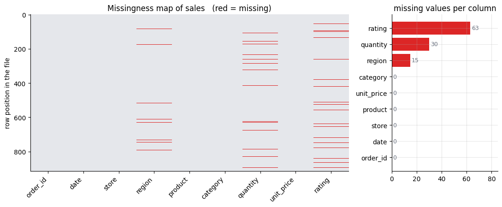

**Output**

```text
columns with any missing        : ['region', 'quantity', 'rating']
rows missing more than one field: 4
rows with nothing missing at all: 810
```

### Cell 63

```python
vc = sales["store"].value_counts(dropna=False)
is_shouty = [str(s).upper() == str(s) for s in vc.index]

fig, ax = plt.subplots(figsize=(9, 4.4))
ax.bar(range(len(vc)), vc.values,
       color=[C_NA if s else C_DATA for s in is_shouty])
ax.set_xticks(range(len(vc)))
ax.set_xticklabels(vc.index, rotation=45, ha="right")
ax.set_ylabel("orders")
ax.set_title("value_counts() of store: five stores, ten labels")
for i, v in enumerate(vc.values):
    ax.text(i, v + 3, str(int(v)), ha="center", fontsize=9, color=C_GREY)
ax.text(0.98, 0.92, "red = the same store, uppercased",
        transform=ax.transAxes, ha="right", fontsize=10, color=C_NA)

plt.tight_layout()
plt.show()

print("distinct labels              :", sales["store"].nunique())
print("distinct after lower-casing  :", sales["store"].str.lower().nunique())
salinas_lower = int(vc.get("Salinas", 0))
salinas_upper = int(vc.get("SALINAS", 0))
salinas_total = salinas_lower + salinas_upper
salinas_pct = 100 * salinas_upper / salinas_total
print(f"Salinas orders filed as 'SALINAS': {salinas_upper} of {salinas_total}"
      f"  ({salinas_pct:.1f} percent)")
```

**Output**

```text
<Figure size 900x440 with 1 Axes>
```

**Figure**

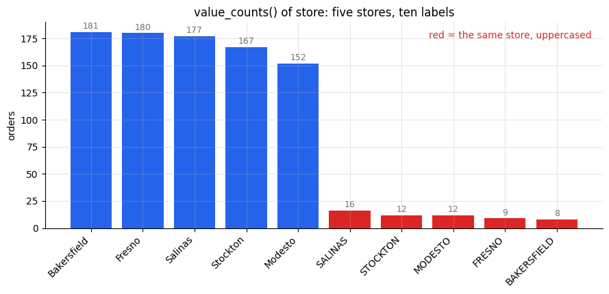

**Output**

```text
distinct labels              : 10
distinct after lower-casing  : 5
Salinas orders filed as 'SALINAS': 16 of 193  (8.3 percent)
```

### Cell 68

```python
# Four calls that look identical and do four different things.
examples = [
    ("sales['store']",            sales['store'],             "columns"),
    ("sales[['store','rating']]", sales[['store', 'rating']], "columns"),
    ("sales[0:3]",                sales[0:3],                 "rows"),   # a SLICE!
    ("sales[sales.rating > 4.9]", sales[sales.rating > 4.9],  "rows"),
]

print(f"{'expression':30s} {'returns':10s} {'shape':12s} selects")
print("-" * 62)
for expr, out, axis in examples:
    print(f"{expr:30s} {type(out).__name__:10s} {str(out.shape):12s} {axis}")

print()
print("sales[0:3] -- three ROWS, all nine columns:")
print(sales[0:3][['order_id', 'store', 'product', 'rating']])
```

**Output**

```text
expression                     returns    shape        selects
--------------------------------------------------------------
sales['store']                 Series     (914,)       columns
sales[['store','rating']]      DataFrame  (914, 2)     columns
sales[0:3]                     DataFrame  (3, 9)       rows
sales[sales.rating > 4.9]      DataFrame  (56, 9)      rows

sales[0:3] -- three ROWS, all nine columns:
   order_id     store       product  rating
0      1063  Stockton    cold brew      4.2
1      1677    Fresno      espresso     5.0
2      1140  Stockton       muffin      4.1
```

### Cell 72

```python
# Sorting moves the rows but the index labels TRAVEL WITH THEM.
by_rating = sales.sort_values("rating", ascending=False)

print("the index is no longer 0,1,2,... -- it is shuffled:")
print(list(by_rating.index[:8]))
print()

cols = ["order_id", "store", "rating"]
print("by_rating.loc[5]   -- the row LABELLED 5 (it was row 5 of the raw frame):")
print(by_rating.loc[5][cols].to_string())
print()
print("by_rating.iloc[5]  -- the row at POSITION 5 (6th-highest rating):")
print(by_rating.iloc[5][cols].to_string())
print()
print("same argument, different rows:",
      by_rating.loc[5]["order_id"] != by_rating.iloc[5]["order_id"])

# --- and slices behave differently too --------------------------------
srt = sales.set_index("order_id").sort_index()   # index = order ids, sorted

lab = srt.loc[1005:1010]     # LABEL slice
pos = srt.iloc[5:10]         # POSITION slice
print()
print(f"srt.loc[1005:1010] -> {len(lab)} rows, labels {list(lab.index)}")
print(f"srt.iloc[5:10]     -> {len(pos)} rows, labels {list(pos.index)}")
print(".loc includes its endpoint; .iloc does not.")
```

**Output**

```text
the index is no longer 0,1,2,... -- it is shuffled:
[911, 1, 549, 49, 866, 64, 605, 515]

by_rating.loc[5]   -- the row LABELLED 5 (it was row 5 of the raw frame):
order_id        1870
store       Stockton
rating           4.3

by_rating.iloc[5]  -- the row at POSITION 5 (6th-highest rating):
order_id      1128
store       Fresno
rating         5.0

same argument, different rows: True

srt.loc[1005:1010] -> 6 rows, labels [1005, 1006, 1007, 1008, 1009, 1010]
srt.iloc[5:10]     -> 5 rows, labels [1005, 1006, 1007, 1008, 1009]
.loc includes its endpoint; .iloc does not.
```

### Cell 76

```python
# ---------- FAILURE 1: & without parentheses -------------------------
try:
    result = sales[sales.rating > 4.5 & sales.store == "Fresno"]
except Exception as e:
    print("FAILS:", type(e).__name__)
    print("      ", str(e)[:110])

# ---------- FAILURE 2: the `and` keyword -----------------------------
try:
    result = sales[(sales.rating > 4.5) and (sales.store == "Fresno")]
except Exception as e:
    print("FAILS:", type(e).__name__)
    print("      ", str(e)[:110])

# ---------- CORRECT: & with parentheses ------------------------------
mask = (sales.rating > 4.5) & (sales.store == "Fresno")
print()
print("type(mask):", type(mask).__name__, " dtype:", mask.dtype, " length:", len(mask))
print("mask.sum():", mask.sum(), "rows are True")
print()
print(sales[mask][["order_id", "store", "product", "rating"]].head())
```

**Output**

```text
FAILS: TypeError
       Cannot perform 'rand_' with a dtyped [object] array and scalar of type [bool]
FAILS: ValueError
       The truth value of a Series is ambiguous. Use a.empty, a.bool(), a.item(), a.any() or a.all().

type(mask): Series  dtype: bool  length: 914
mask.sum(): 27 rows are True

     order_id   store   product  rating
1        1677  Fresno  espresso     5.0
39       1668  Fresno     latte     4.7
64       1128  Fresno  espresso     5.0
109      1673  Fresno    cookie     4.9
123      1591  Fresno     bagel     5.0
```

### Cell 79

```python
# A picture of what a mask actually is: a column of booleans running
# alongside the frame, deciding row by row who survives.
demo = pd.concat([sales.head(11), sales[sales.rating.isna()].head(1)])
demo_mask = demo["rating"] > 4.2          # NaN compares False -- watch row 12

fig, ax = plt.subplots(figsize=(10, 5.6))
n = len(demo)
row_h, y0 = 0.42, 0.0

def cell(x, y, w, text, face, edge=C_SOFT, tcol="black", weight="normal"):
    ax.add_patch(plt.Rectangle((x, y), w, row_h, facecolor=face,
                               edgecolor=edge, linewidth=1.0))
    ax.text(x + w / 2, y + row_h / 2, text, ha="center", va="center",
            fontsize=9, color=tcol, fontweight=weight)

for i, (idx, row) in enumerate(demo.iterrows()):
    y = y0 + (n - 1 - i) * (row_h + 0.06)
    keep = bool(demo_mask.iloc[i])
    rating = "NaN" if pd.isna(row["rating"]) else f"{row['rating']:.1f}"

    # left block: the frame
    cell(0.0, y, 0.9, str(idx), "white", tcol=C_IDX, weight="bold")
    cell(0.9, y, 2.0, str(row["store"])[:11], "white")
    cell(2.9, y, 0.9, rating, "white", tcol=C_DATA)

    # middle block: the mask
    cell(4.2, y, 1.3, "True" if keep else "False",
         C_GROUP if keep else "white",
         tcol="white" if keep else C_GREY, weight="bold" if keep else "normal")

    # right block: what survives
    if keep:
        cell(5.9, y, 2.6, f"{str(row['store'])[:11]}   {rating}",
             "#E8F5F0", edge=C_GROUP, tcol=C_GROUP, weight="bold")
    else:
        ax.plot([5.9, 8.5], [y + row_h / 2] * 2, color=C_SOFT, lw=1.2, zorder=0)

top = y0 + n * (row_h + 0.06)
ax.text(1.9, top, "demo", ha="center", fontsize=11, fontweight="bold", color=C_GREY)
ax.text(4.85, top, "rating > 4.2", ha="center", fontsize=11,
        fontweight="bold", color=C_GROUP)
ax.text(7.2, top, "demo[mask]", ha="center", fontsize=11,
        fontweight="bold", color=C_GROUP)
ax.annotate("", xy=(5.85, top * 0.45), xytext=(5.55, top * 0.45),
            arrowprops=dict(arrowstyle="-|>", color=C_GROUP, lw=2))

ax.set_xlim(-0.2, 8.7); ax.set_ylim(-0.25, top + 0.45)
ax.axis("off"); ax.grid(False)
plt.title("A boolean mask is a parallel column, not a query",
          fontsize=13, fontweight="bold", pad=14)
plt.tight_layout(); plt.show()

print(f"rows in demo: {len(demo)}   mask True: {int(demo_mask.sum())}"
      f"   rows returned: {len(demo[demo_mask])}")
```

**Output**

```text
<Figure size 1000x560 with 1 Axes>
```

**Figure**

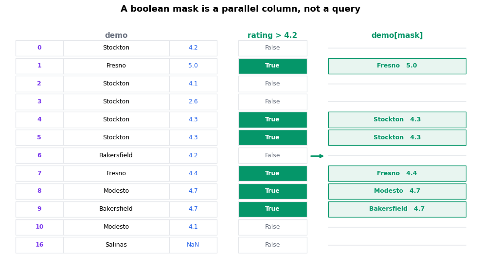

**Output**

```text
rows in demo: 12   mask True: 6   rows returned: 6
```

### Cell 81

```python
# ---- ~ negation, .isin(), .between() --------------------------------
hi = sales["rating"] > 4.0

print(f"{'expression':42s} rows")
print("-" * 50)
print(f"{'(rating > 4.0)':42s} {hi.sum()}")
print(f"{'~(rating > 4.0)':42s} {(~hi).sum()}")
print(f"{'(rating <= 4.0)':42s} {(sales.rating <= 4.0).sum()}")
print(f"{'rating is NaN':42s} {sales.rating.isna().sum()}")
print()
print("~hi + hi          =", (~hi).sum() + hi.sum(), "  (every row is in one or the other)")
print("(<=4) + (>4)      =", (sales.rating <= 4.0).sum() + hi.sum(),
      "  (the NaN rows fall through BOTH)")
print()

# .isin() -- one call instead of a chain of ORs
picked = sales["store"].isin(["Fresno", "Salinas"])
print("store in {Fresno, Salinas}:", picked.sum(), "rows")

# .between() -- inclusive on both ends by default
mid = sales["rating"].between(3.5, 4.5)
print("rating between 3.5 and 4.5 (inclusive):", mid.sum(), "rows")
print("                       (exclusive):",
      sales["rating"].between(3.5, 4.5, inclusive="neither").sum(), "rows")
```

**Output**

```text
expression                                 rows
--------------------------------------------------
(rating > 4.0)                             423
~(rating > 4.0)                            491
(rating <= 4.0)                            428
rating is NaN                              63

~hi + hi          = 914   (every row is in one or the other)
(<=4) + (>4)      = 851   (the NaN rows fall through BOTH)

store in {Fresno, Salinas}: 357 rows
rating between 3.5 and 4.5 (inclusive): 539 rows
                       (exclusive): 470 rows
```

### Cell 85

```python
threshold = 4.5
wanted = ["Fresno", "Salinas"]

# the same selection, written twice
mask_way  = sales[(sales.rating > threshold) & (sales.store == "Fresno")]
query_way = sales.query("rating > @threshold and store == 'Fresno'")
print("mask:", len(mask_way), " query:", len(query_way),
      " identical:", mask_way.equals(query_way))

print()
print("a long condition, which is where .query() earns its keep:")
q = sales.query("rating > 4 and store in @wanted and category == 'drink'")
print(q[["order_id", "store", "product", "category", "rating"]].head())
print("rows:", len(q))

# --- where .query() runs out ------------------------------------------
print()
try:
    sales.query("`order id` > 5")          # a name that is not an identifier
except Exception as e:
    print("FAILS on non-identifier column names:", type(e).__name__)
print("but method calls DO work:",
      sales.query("unit_price.str.strip('$').astype('float') > 4").shape)

# --- and it is not free ------------------------------------------------
import timeit
n = 200
t_mask  = timeit.timeit(
    lambda: sales[(sales.rating > threshold) & (sales.store == "Fresno")], number=n) / n
t_query = timeit.timeit(
    lambda: sales.query("rating > @threshold and store == 'Fresno'"), number=n) / n
print()
print(f"mask  {t_mask*1e3:5.2f} ms      query {t_query*1e3:5.2f} ms"
      f"      query is {t_query/t_mask:.1f}x SLOWER on 914 rows")
```

**Output**

```text
mask: 27  query: 27  identical: True

a long condition, which is where .query() earns its keep:
    order_id   store    product category  rating
1       1677  Fresno   espresso    drink     5.0
30      1327  Fresno  cold brew    drink     4.2
37      1657  Fresno      latte    drink     4.2
39      1668  Fresno      latte    drink     4.7
43      1778  Fresno      latte    drink     4.1
rows: 78

FAILS on non-identifier column names: UndefinedVariableError
but method calls DO work: (312, 9)

mask   2.53 ms      query 14.60 ms      query is 5.8x SLOWER on 914 rows
```

### Cell 88

```python
# ---- rows AND columns in one call: .loc[rows, columns] --------------
good = (sales["rating"] >= 4.8) & (sales["category"] == "drink")

print(".loc[mask, ['store','product','quantity']]:")
print(sales.loc[good, ["store", "product", "quantity"]].head())
print("shape:", sales.loc[good, ["store", "product", "quantity"]].shape)
print()
print(".iloc uses positions on BOTH axes -- rows 0:3, columns 2 and 4:")
print(sales.iloc[0:3, [2, 4]])

# ---- .at / .iat: one cell, no machinery -----------------------------
srt = sales.set_index("order_id").sort_index()

print()
print("srt.at[1005, 'store']  =", srt.at[1005, "store"], "  (label, label)")
print("srt.iat[5, 1]          =", srt.iat[5, 1], "  (position, position)")
print("srt.loc[1005, 'store'] =", srt.loc[1005, "store"], "  (same value, more work)")

# WHY they are the cheap path: they refuse everything except one scalar,
# so there is no indexer to classify and no new object to build.
print()
for label, fn in [
    (".at[[1005], 'rating']",    lambda: srt.at[[1005], "rating"]),
    (".at[1005:1010, 'rating']", lambda: srt.at[1005:1010, "rating"]),
    (".at[mask, 'rating']",      lambda: srt.at[srt.rating > 4, "rating"]),
    (".iat[5, 'rating']",        lambda: srt.iat[5, "rating"]),
    (".loc[[1005], ['rating']]", lambda: srt.loc[[1005], ["rating"]]),
]:
    try:
        out = fn()
        print(f"{label:28s} -> OK, a {type(out).__name__} of shape {out.shape}")
    except Exception as e:
        print(f"{label:28s} -> {type(e).__name__}: {str(e)[:44]}")
```

**Output**

```text
.loc[mask, ['store','product','quantity']]:
          store    product  quantity
1        Fresno   espresso       9.0
12     Stockton      latte       9.0
49     Stockton      latte      10.0
52  Bakersfield  cold brew       8.0
64       Fresno   espresso       5.0
shape: (50, 3)

.iloc uses positions on BOTH axes -- rows 0:3, columns 2 and 4:
      store       product
0  Stockton    cold brew 
1    Fresno      espresso
2  Stockton       muffin 

srt.at[1005, 'store']  = Bakersfield   (label, label)
srt.iat[5, 1]          = Bakersfield   (position, position)
srt.loc[1005, 'store'] = Bakersfield   (same value, more work)

.at[[1005], 'rating']        -> ValueError: Invalid call for scalar access (getting)!
.at[1005:1010, 'rating']     -> ValueError: Invalid call for scalar access (getting)!
.at[mask, 'rating']          -> ValueError: Invalid call for scalar access (getting)!
.iat[5, 'rating']            -> ValueError: iAt based indexing can only have integer ind
.loc[[1005], ['rating']]     -> OK, a DataFrame of shape (1, 1)
```

### Cell 91

```python
import warnings

flagged = sales.copy()          # never mutate `sales` -- Part 0 promised that
flagged["bulk"] = 0

target = (flagged["quantity"] > 10).sum()
print("rows we intend to flag:", target)
print("bulk column BEFORE:  sum =", flagged["bulk"].sum())

# ---- the chained assignment ------------------------------------------
with warnings.catch_warnings(record=True) as caught:
    warnings.simplefilter("always")
    flagged[flagged["quantity"] > 10]["bulk"] = 1      # <-- looks right
    for w in caught:
        print(f"\n{type(w.message).__name__} was raised as a WARNING:")
        print("  " + str(w.message).splitlines()[0])

print("\nbulk column AFTER:   sum =", flagged["bulk"].sum())
print("did anything change?", flagged["bulk"].sum() != 0)
print(f"pandas {pd.__version__}: the statement completed, the frame did not move.")
```

**Output**

```text
rows we intend to flag: 169
bulk column BEFORE:  sum = 0

SettingWithCopyWarning was raised as a WARNING:
  

bulk column AFTER:   sum = 0
did anything change? False
pandas 2.2.3: the statement completed, the frame did not move.
```

### Cell 94

```python
# ---- THE FIX: one .loc call, both axes, one __setitem__ ---------------
flagged.loc[flagged["quantity"] > 10, "bulk"] = 1
print("after .loc[mask, 'bulk'] = 1  ->  bulk.sum() =", flagged["bulk"].sum(),
      " (target was", target, ")")

# ---- the sneakier variant: split across two lines --------------------
# This is the SAME mistake, but pandas cannot see it, so there is no warning.
f2 = sales.copy()
f2["bulk"] = 0
with warnings.catch_warnings(record=True) as caught:
    warnings.simplefilter("always")
    big = f2[f2["quantity"] > 10]     # a copy, named
    big["bulk"] = 1                   # writes to the copy -- no warning at all
    print("\nwarnings from the two-line version:", len(caught))

print("big['bulk'].sum() =", big["bulk"].sum(), " <- the copy did change")
print("f2['bulk'].sum()  =", f2["bulk"].sum(),  " <- the original did not")
print("\nIf you meant to edit f2, use .loc. If you meant a separate")
print("filtered frame, say so: big = f2[f2['quantity'] > 10].copy()")
```

**Output**

```text
after .loc[mask, 'bulk'] = 1  ->  bulk.sum() = 169  (target was 169 )

warnings from the two-line version: 1
big['bulk'].sum() = 169  <- the copy did change
f2['bulk'].sum()  = 0  <- the original did not

If you meant to edit f2, use .loc. If you meant a separate
filtered frame, say so: big = f2[f2['quantity'] > 10].copy()
```

### Cell 98

```python
# ============================================================
#  What does modifying a slice do to the parent, in THIS
#  version of pandas? Do not trust memory -- run the experiment.
# ============================================================
import warnings

print(f"pandas {pd.__version__}")
print()

# --- Experiment 1: bind the slice to a name, then modify it --------------
coast = sales[sales["region"] == "Coast"]     # a slice, bound to a name
row = coast.index[0]

parent_before = sales.loc[row, "rating"]
coast.loc[row, "rating"] = 99.0               # modify the SLICE
parent_after = sales.loc[row, "rating"]

print("Experiment 1 -- assign into a named slice")
print(f"  slice value after assignment : {coast.loc[row, 'rating']}")
print(f"  parent before                : {parent_before}")
print(f"  parent after                 : {parent_after}")
print(f"  -> parent changed?           : {parent_before != parent_after}")
print()

# --- Experiment 2: chained assignment (no intermediate name) -------------
print("Experiment 2 -- chained assignment  sales[mask]['rating'] = 0")
with warnings.catch_warnings(record=True) as caught:
    warnings.simplefilter("always")
    sales[sales["region"] == "Coast"]["rating"] = 0.0
    for w in caught:
        print(f"  {w.category.__name__}: {str(w.message).splitlines()[0]}")
print(f"  parent value now             : {sales.loc[row, 'rating']}")
print(f"  -> parent changed?           : {sales.loc[row, 'rating'] == 0.0}")
```

**Output**

```text
pandas 2.2.3

Experiment 1 -- assign into a named slice
  slice value after assignment : 99.0
  parent before                : 3.3
  parent after                 : 3.3
  -> parent changed?           : False

Experiment 2 -- chained assignment  sales[mask]['rating'] = 0
  SettingWithCopyWarning: 
  parent value now             : 3.3
  -> parent changed?           : False
```

### Cell 102

```python
# ============================================================
#  The anatomy of a missing value
# ============================================================
na_counts = sales.isna().sum()
report = pd.DataFrame({
    "missing":   na_counts,
    "present":   sales.notna().sum(),
    "missing_%": (100 * na_counts / len(sales)).round(2),
    "dtype":     sales.dtypes.astype(str),
})
print(f"sales: {len(sales):,} rows")
print()
print(report)
print(f"\nrows with at least one missing value: {sales.isna().any(axis=1).sum()}")
print(f"rows that are completely full        : {sales.notna().all(axis=1).sum()}")

# --- np.nan vs None vs pd.NA ---------------------------------------------
print("\n--- the three flavours of 'missing' ---")
print(f"np.nan == np.nan             -> {np.nan == np.nan}")
print(f"np.nan is np.nan             -> {np.nan is np.nan}")
print(f"pd.Series([1.0, None]) dtype -> {pd.Series([1.0, None]).dtype}   (None became NaN)")
print(f"pd.Series(['a', None]) dtype -> {pd.Series(['a', None]).dtype}   (stays a string column)")
print(f"pd.isna(np.nan), pd.isna(None), pd.isna(pd.NA) -> "
      f"{pd.isna(np.nan)}, {pd.isna(None)}, {pd.isna(pd.NA)}")
try:
    bool(pd.NA == pd.NA)
except TypeError as e:
    print(f"bool(pd.NA == pd.NA)         -> TypeError: {e}")
```

**Output**

```text
sales: 914 rows

            missing  present  missing_%    dtype
order_id          0      914       0.00    int64
date              0      914       0.00   object
store             0      914       0.00   object
region           15      899       1.64   object
product           0      914       0.00   object
category          0      914       0.00   object
quantity         30      884       3.28  float64
unit_price        0      914       0.00   object
rating           63      851       6.89  float64

rows with at least one missing value: 104
rows that are completely full        : 810

--- the three flavours of 'missing' ---
np.nan == np.nan             -> False
np.nan is np.nan             -> True
pd.Series([1.0, None]) dtype -> float64   (None became NaN)
pd.Series(['a', None]) dtype -> object   (stays a string column)
pd.isna(np.nan), pd.isna(None), pd.isna(pd.NA) -> True, True, True
bool(pd.NA == pd.NA)         -> TypeError: boolean value of NA is ambiguous
```

### Cell 106

```python
# ============================================================
#  The two families of answer: DELETE the row, or FILL the gap
# ============================================================
print("--- DELETE: dropna() ---")
print(f"rows now                    : {len(sales)}")
print(f"dropna()                    -> keeps {len(sales.dropna()):>4}   "
      f"(removes {len(sales) - len(sales.dropna())})   <- how='any' is the DEFAULT")
print(f"dropna(how='all')           -> keeps {len(sales.dropna(how='all')):>4}   "
      f"(removes {len(sales) - len(sales.dropna(how='all'))})")
print(f"dropna(subset=['quantity']) -> keeps {len(sales.dropna(subset=['quantity'])):>4}   "
      f"(removes {len(sales) - len(sales.dropna(subset=['quantity']))})")
print(f"dropna(thresh=8)            -> keeps {len(sales.dropna(thresh=8)):>4}   "
      f"(removes {len(sales) - len(sales.dropna(thresh=8))})   <- needs 8 of 9 non-null")

print("\n--- FILL: fillna() and friends, on a tiny series ---")
demo = pd.Series([1.0, np.nan, np.nan, 4.0, np.nan], name="demo")
print(pd.DataFrame({
    "original":      demo,
    "fillna(0)":     demo.fillna(0),
    "ffill()":       demo.ffill(),       # carry the last known value forward
    "bfill()":       demo.bfill(),       # carry the next known value backward
    "interpolate()": demo.interpolate(),  # straight line between known values
}))

print("\n--- fillna with a DICT: a different answer per column ---")
patched = sales.fillna({"region": "Unassigned", "rating": -1})
print(f"region missing   : {sales['region'].isna().sum()} -> {patched['region'].isna().sum()}")
print(f"rating missing   : {sales['rating'].isna().sum()} -> {patched['rating'].isna().sum()}")
print(f"quantity missing : {sales['quantity'].isna().sum()} -> "
      f"{patched['quantity'].isna().sum()}   (not in the dict, left alone)")

print("\n--- and why a blanket fillna(0) is wrong ---")
zeroed = sales.fillna({"rating": 0, "quantity": 0})
print(f"mean rating,     NaNs skipped : {sales['rating'].mean():.3f}   "
      f"(over the {sales['rating'].notna().sum()} customers who answered)")
print(f"mean rating,     NaNs -> 0    : {zeroed['rating'].mean():.3f}   "
      f"<- {zeroed['rating'].mean() - sales['rating'].mean():+.3f} stars, from nothing")
print(f"mean units/order, NaNs skipped: {sales['quantity'].mean():.3f}   "
      f"(over the {sales['quantity'].count()} sales the till recorded)")
print(f"mean units/order, NaNs -> 0   : {zeroed['quantity'].mean():.3f}   "
      f"<- {zeroed['quantity'].mean() - sales['quantity'].mean():+.3f} units, "
      f"from {sales['quantity'].isna().sum()} sales recorded as buying nothing")
print(f"TOTAL units is {sales['quantity'].sum():,.0f} either way "
      f"({zeroed['quantity'].sum():,.0f} after the fill) -- .sum() already skips NaN.")
print("  The headline total looks untouched while every average quietly drops.")
```

**Output**

```text
--- DELETE: dropna() ---
rows now                    : 914
dropna()                    -> keeps  810   (removes 104)   <- how='any' is the DEFAULT
dropna(how='all')           -> keeps  914   (removes 0)
dropna(subset=['quantity']) -> keeps  884   (removes 30)
dropna(thresh=8)            -> keeps  910   (removes 4)   <- needs 8 of 9 non-null

--- FILL: fillna() and friends, on a tiny series ---
   original  fillna(0)  ffill()  bfill()  interpolate()
0       1.0        1.0      1.0      1.0            1.0
1       NaN        0.0      1.0      4.0            2.0
2       NaN        0.0      1.0      4.0            3.0
3       4.0        4.0      4.0      4.0            4.0
4       NaN        0.0      4.0      NaN            4.0

--- fillna with a DICT: a different answer per column ---
region missing   : 15 -> 0
rating missing   : 63 -> 0
quantity missing : 30 -> 30   (not in the dict, left alone)

--- and why a blanket fillna(0) is wrong ---
mean rating,     NaNs skipped : 4.043   (over the 851 customers who answered)
mean rating,     NaNs -> 0    : 3.764   <- -0.279 stars, from nothing
mean units/order, NaNs skipped: 7.876   (over the 884 sales the till recorded)
mean units/order, NaNs -> 0   : 7.617   <- -0.258 units, from 30 sales recorded as buying nothing
TOTAL units is 6,962 either way (6,962 after the fill) -- .sum() already skips NaN.
  The headline total looks untouched while every average quietly drops.
```

### Cell 110

```python
# ============================================================
#  clean = a copy. `sales` is never touched again in this part.
# ============================================================
clean = sales.copy()
n_start = len(clean)

# --- duplicates ----------------------------------------------------------
print("--- duplicated(): which rows are repeats? ---")
print(f"duplicated()                    -> {clean.duplicated().sum():>3}   "
      f"(keep='first': the FIRST copy is not flagged)")
print(f"duplicated(keep='last')         -> {clean.duplicated(keep='last').sum():>3}   "
      f"(the LAST copy is not flagged)")
print(f"duplicated(keep=False)          -> {clean.duplicated(keep=False).sum():>3}   "
      f"(every row involved, both copies)")
print(f"duplicated(subset=['order_id']) -> {clean.duplicated(subset=['order_id']).sum():>3}   "
      f"(order_id is supposed to be unique)")

print("\nOne duplicated pair, side by side:")
dup_id = clean.loc[clean.duplicated(subset=["order_id"], keep=False), "order_id"].iloc[0]
print(clean[clean["order_id"] == dup_id])

clean = clean.drop_duplicates()
print(f"\nrows: {n_start} -> {len(clean)}   (removed {n_start - len(clean)})")
print(f"duplicates remaining: {clean.duplicated().sum()}")

# --- impossible values ---------------------------------------------------
n_dedup = len(clean)
impossible = clean["quantity"] < 0
print("\n--- impossible values ---")
print(f"rows with quantity < 0: {impossible.sum()}")
print(clean.loc[impossible, ["order_id", "store", "product", "quantity"]].head())

clean = clean[~impossible]
print(f"\nrows: {n_dedup} -> {len(clean)}   (removed {n_dedup - len(clean)})")

# --- clip: a guard on a column whose valid range we know -----------------
r = clean["rating"]
clipped = r.clip(1, 5)
naive_changed  = int((clipped != r).sum())                  # WRONG -- see the trap below
honest_changed = int(((clipped != r) & r.notna()).sum())
print(f"\nrating range observed    : {r.min()} .. {r.max()}")
print(f"clip(1, 5) 'changed'     : {naive_changed}   <- naive count")
print(f"clip(1, 5) really changed: {honest_changed}")
print(f"ratings that are NaN     : {int(r.isna().sum())}")
clean["rating"] = clipped
```

**Output**

```text
--- duplicated(): which rows are repeats? ---
duplicated()                    ->  14   (keep='first': the FIRST copy is not flagged)
duplicated(keep='last')         ->  14   (the LAST copy is not flagged)
duplicated(keep=False)          ->  28   (every row involved, both copies)
duplicated(subset=['order_id']) ->  14   (order_id is supposed to be unique)

One duplicated pair, side by side:
     order_id        date     store region       product category  quantity unit_price  rating
0        1063  2024-02-08  Stockton  North    cold brew     drink       6.0      $4.25     4.2
842      1063  2024-02-08  Stockton  North    cold brew     drink       6.0      $4.25     4.2

rows: 914 -> 900   (removed 14)
duplicates remaining: 0

--- impossible values ---
rows with quantity < 0: 6
     order_id    store product  quantity
132      1048  Modesto  cookie      -1.0
304      1630  Modesto  cookie      -1.0
512      1574  Salinas  muffin      -1.0
525      1477  Salinas   bagel      -1.0
732      1629  Modesto   bagel      -1.0

rows: 900 -> 894   (removed 6)

rating range observed    : 2.1 .. 5.0
clip(1, 5) 'changed'     : 61   <- naive count
clip(1, 5) really changed: 0
ratings that are NaN     : 61
```

### Cell 114

```python
# ============================================================
#  One decision per column. Every fill is a reassignment.
# ============================================================
na_before = clean.isna().sum()

# --- region: a real category, not a hole ---------------------------------
clean["region"] = clean["region"].fillna("Unassigned")

# --- quantity: impute from the narrowest sensible group ------------------
by_store_product = clean.groupby(["store", "product"], observed=True)["quantity"].transform("median")
by_product       = clean.groupby("product", observed=True)["quantity"].transform("median")

step1 = clean["quantity"].fillna(by_store_product)
step2 = step1.fillna(by_product)               # fallback -- see below for why
print("--- imputing quantity ---")
print(f"missing before                : {clean['quantity'].isna().sum()}")
print(f"after (store, product) median : {step1.isna().sum()}")
print(f"after product-median fallback : {step2.isna().sum()}")

stuck = clean.loc[step1.isna(), ["store", "product", "quantity"]]
if len(stuck):
    print("\nrows the (store, product) median could not fill:")
    print(stuck)
    s, p = stuck.iloc[0]["store"], stuck.iloc[0]["product"]
    n_in_group = int(((clean["store"] == s) & (clean["product"] == p)).sum())
    print(f"\n  group ('{s}', '{p}') holds {n_in_group} row(s) -- "
          f"and that row IS the missing one, so its median is NaN.")

clean["quantity"] = step2

# --- rating: left alone, on purpose --------------------------------------
print("\n--- rating: deliberately NOT filled ---")
print(f"missing ratings kept as NaN          : {clean['rating'].isna().sum()}")
print(f"mean over the customers who answered : {clean['rating'].mean():.3f}")
print(f"how many answered (.count())         : {clean['rating'].count()} of {len(clean)}")

print("\n--- missing values, before and after this cell ---")
print(pd.DataFrame({"before": na_before, "after": clean.isna().sum()}))
```

**Output**

```text
--- imputing quantity ---
missing before                : 29
after (store, product) median : 1
after product-median fallback : 0

rows the (store, product) median could not fill:
      store product  quantity
630  FRESNO  muffin       NaN

  group ('FRESNO', 'muffin') holds 1 row(s) -- and that row IS the missing one, so its median is NaN.

--- rating: deliberately NOT filled ---
missing ratings kept as NaN          : 61
mean over the customers who answered : 4.041
how many answered (.count())         : 833 of 894

--- missing values, before and after this cell ---
            before  after
order_id         0      0
date             0      0
store            0      0
region          14      0
product          0      0
category         0      0
quantity        29      0
unit_price       0      0
rating          61     61
```

### Cell 117

```python
# ============================================================
#  Text -> numbers
# ============================================================
print("before:", clean["unit_price"].dtype, "->", clean["unit_price"].head(3).tolist())

stripped = clean["unit_price"].str.replace("$", "", regex=False)
clean["unit_price"] = pd.to_numeric(stripped, errors="coerce")

print("after :", clean["unit_price"].dtype, "->", clean["unit_price"].head(3).tolist())
print(f"unparseable (now NaN): {clean['unit_price'].isna().sum()}")
print(f"revenue is now computable: {(clean['quantity'] * clean['unit_price']).sum():,.2f}")

# --- what errors='coerce' actually does ----------------------------------
junk = pd.Series(["3.25", "", "n/a", "4,75", "5", "$6.00"])
print("\n--- pd.to_numeric on deliberately messy input ---")
print(pd.DataFrame({"input": junk, "coerce": pd.to_numeric(junk, errors="coerce")}))
try:
    pd.to_numeric(junk)                      # errors='raise' is the default
except ValueError as e:
    print(f"errors='raise' (the default) -> ValueError: {str(e)[:64]}...")

# --- quantity: float64 -> a real integer ---------------------------------
print("\n--- quantity back to an integer ---")
demo_nan = pd.Series([1.0, 2.0, np.nan])
try:
    demo_nan.astype("int64")
except Exception as e:
    print(f"astype('int64') with a NaN -> {type(e).__name__}: {str(e)[:56]}...")
print(f"astype('Int64') with a NaN -> {demo_nan.astype('Int64').tolist()}   "
      f"(nullable: keeps the gap)")

clean["quantity"] = clean["quantity"].round().astype("int64")
print(f"clean['quantity'] : {clean['quantity'].dtype}, "
      f"range {clean['quantity'].min()}..{clean['quantity'].max()}")

clean = clean.reset_index(drop=True)   # the dropped rows left holes in the index
```

**Output**

```text
before: object -> ['$4.25', '$3.25', '$3.5']
after : float64 -> [4.25, 3.25, 3.5]
unparseable (now NaN): 0
revenue is now computable: 24,871.50

--- pd.to_numeric on deliberately messy input ---
   input  coerce
0   3.25    3.25
1            NaN
2    n/a     NaN
3   4,75     NaN
4      5    5.00
5  $6.00     NaN
errors='raise' (the default) -> ValueError: Unable to parse string "n/a" at position 2...

--- quantity back to an integer ---
astype('int64') with a NaN -> IntCastingNaNError: Cannot convert non-finite values (NA or inf) to integer...
astype('Int64') with a NaN -> [1, 2, <NA>]   (nullable: keeps the gap)
clean['quantity'] : int64, range 2..22
```

### Cell 119

```python
# ============================================================
#  category: measure the saving, do not assume it
# ============================================================
CAT_COLS = ["store", "region", "product", "category"]

demo_frame = clean.copy()                   # a throwaway, to measure ALL FOUR
mem_before = demo_frame.memory_usage(deep=True)
for c in CAT_COLS:
    demo_frame[c] = demo_frame[c].astype("category")
mem_after = demo_frame.memory_usage(deep=True)

mem_table = pd.DataFrame({
    "bytes_before": mem_before,
    "bytes_after":  mem_after,
    "saved":        mem_before - mem_after,
})
mem_table["saved_%"] = (100 * mem_table["saved"] / mem_before).round(1)
print(mem_table)
print(f"\ntotal: {mem_before.sum() / 1024:,.1f} KB -> {mem_after.sum() / 1024:,.1f} KB "
      f"({100 * (1 - mem_after.sum() / mem_before.sum()):.1f}% smaller)")

print(f"\n'store' as text     : {mem_before['store']:>6,} bytes")
print(f"'store' as category : {mem_after['store']:>6,} bytes  "
      f"({mem_before['store'] / mem_after['store']:.1f}x smaller)")
print(f"  categories stored once: {list(demo_frame['store'].cat.categories)}")

# --- but `clean` takes only two of the four. Look at that list again. ----
for c in ["region", "category"]:
    clean[c] = clean[c].astype("category")
print("\nclean converts region + category only (store/product wait for Part 5).")
print(f"clean memory: {clean.memory_usage(deep=True).sum() / 1024:,.1f} KB")
```

**Output**

```text
            bytes_before  bytes_after  saved  saved_%
Index                132          132      0      0.0
order_id            7152         7152      0      0.0
date               52746        52746      0      0.0
store              70907         1882  69025     97.3
region             49024         1343  47681     97.3
product            70199         2022  68177     97.1
category           47842         1109  46733     97.7
quantity            7152         7152      0      0.0
unit_price          7152         7152      0      0.0
rating              7152         7152      0      0.0

total: 312.0 KB -> 85.8 KB (72.5% smaller)

'store' as text     : 70,907 bytes
'store' as category :  1,882 bytes  (37.7x smaller)
  categories stored once: ['BAKERSFIELD', np.str_('Bakersfield'), 'FRESNO', np.str_('Fresno'), 'MODESTO', np.str_('Modesto'), 'SALINAS', 'STOCKTON', np.str_('Salinas'), np.str_('Stockton')]

clean converts region + category only (store/product wait for Part 5).
clean memory: 219.8 KB
```

### Cell 121

```python
# ============================================================
#  FIGURE 1 -- missing values by column, before and after
# ============================================================
cols = list(sales.columns)
before_na = sales.isna().sum().reindex(cols)
after_na  = clean.isna().sum().reindex(cols)
ymax = max(before_na.max(), after_na.max()) * 1.28

fig, axes = plt.subplots(1, 2, figsize=(12, 4.4), sharey=True)
for ax, vals, title, colour in [
    (axes[0], before_na, f"BEFORE  —  sales  ({len(sales)} rows)", C_NA),
    (axes[1], after_na,  f"AFTER   —  clean  ({len(clean)} rows)", C_GROUP),
]:
    bars = ax.bar(cols, vals.values, color=colour, alpha=0.85)
    ax.set_title(title, fontsize=12, weight="bold")
    ax.set_ylim(0, ymax)
    ax.tick_params(axis="x", rotation=55)
    for b, v in zip(bars, vals.values):
        if v:
            ax.text(b.get_x() + b.get_width() / 2, v + ymax * 0.03, str(int(v)),
                    ha="center", fontsize=10, weight="bold", color=colour)
axes[0].set_ylabel("missing values")
axes[1].annotate("kept on purpose:\nthe customer\ndeclined to rate",
                 xy=(len(cols) - 1, after_na["rating"]),
                 xytext=(len(cols) - 4.0, ymax * 0.62),
                 fontsize=9, color=C_GREY, ha="center",
                 arrowprops=dict(arrowstyle="->", color=C_GREY, lw=1.2))
fig.suptitle("Missing values by column", fontsize=13, weight="bold")
plt.tight_layout()
plt.show()
```

**Output**

```text
<Figure size 1200x440 with 2 Axes>
```

**Figure**

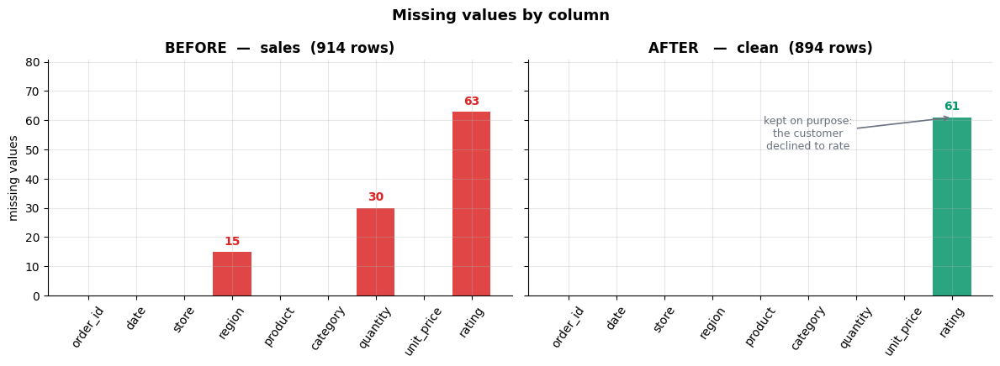

### Cell 123

```python
# ============================================================
#  FIGURE 2 -- memory by column, before and after ->category
# ============================================================
order = [c for c in cols if c in mem_table.index]
b = (mem_table.loc[order, "bytes_before"] / 1024).values
a = (mem_table.loc[order, "bytes_after"] / 1024).values
x = np.arange(len(order)); w = 0.38

fig, ax = plt.subplots(figsize=(11, 4.4))
ax.bar(x - w / 2, b, w, label="as text", color=C_DATA, alpha=0.9)
ax.bar(x + w / 2, a, w, label="after .astype('category')", color=C_GROUP, alpha=0.9)
for xi, bv, av in zip(x, b, a):
    if bv - av > 0.5:
        ax.text(xi, bv + 0.4, f"-{100 * (1 - av / bv):.0f}%", ha="center",
                fontsize=9, weight="bold", color=C_GROUP)
ax.set_xticks(x); ax.set_xticklabels(order, rotation=45, ha="right")
ax.set_ylabel("KB (deep=True)")
ax.set_title(f"Memory per column: {b.sum():.1f} KB → {a.sum():.1f} KB "
             f"({100 * (1 - a.sum() / b.sum()):.0f}% smaller)",
             fontsize=12, weight="bold")
ax.legend(frameon=False)
plt.tight_layout()
plt.show()
```

**Output**

```text
<Figure size 1100x440 with 1 Axes>
```

**Figure**

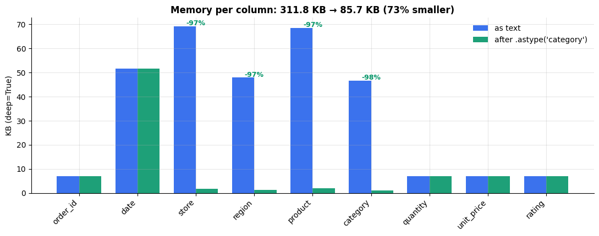

### Cell 125

```python
# ============================================================
#  The contract with the rest of the course: sales vs clean
# ============================================================
summary = pd.DataFrame({
    "sales (raw)": [
        f"{len(sales):,}",
        f"{sales.memory_usage(deep=True).sum() / 1024:,.1f} KB",
        f"{int(sales.isna().sum().sum())}",
        f"{int(sales.duplicated().sum())}",
        f"{int((sales['quantity'] < 0).sum())}",
        str(sales["unit_price"].dtype),
        str(sales["quantity"].dtype),
        f"{sales['store'].nunique()}",
    ],
    "clean": [
        f"{len(clean):,}",
        f"{clean.memory_usage(deep=True).sum() / 1024:,.1f} KB",
        f"{int(clean.isna().sum().sum())}",
        f"{int(clean.duplicated().sum())}",
        f"{int((clean['quantity'] < 0).sum())}",
        str(clean["unit_price"].dtype),
        str(clean["quantity"].dtype),
        f"{clean['store'].nunique()}",
    ],
}, index=["rows", "memory (deep)", "missing values (total)", "duplicate rows",
          "impossible quantities", "unit_price dtype", "quantity dtype",
          "distinct store labels"])
print(summary.to_string())

print("\n--- missing values, column by column ---")
print(pd.DataFrame({"sales": sales.isna().sum(),
                    "clean": clean.isna().sum().reindex(sales.columns)}).to_string())

print("\n--- dtypes ---")
print(pd.DataFrame({"sales": sales.dtypes.astype(str),
                    "clean": clean.dtypes.astype(str).reindex(sales.columns)}).to_string())

print(f"\nclean is ready: {clean.shape[0]:,} rows x {clean.shape[1]} columns")
clean.head()
```

**Output**

```text
                       sales (raw)     clean
rows                           914       894
memory (deep)             359.3 KB  219.8 KB
missing values (total)         108        61
duplicate rows                  14         0
impossible quantities            6         0
unit_price dtype            object   float64
quantity dtype             float64     int64
distinct store labels           10        10

--- missing values, column by column ---
            sales  clean
order_id        0      0
date            0      0
store           0      0
region         15      0
product         0      0
category        0      0
quantity       30      0
unit_price      0      0
rating         63     61

--- dtypes ---
              sales     clean
order_id      int64     int64
date         object    object
store        object    object
region       object  category
product      object    object
category     object  category
quantity    float64     int64
unit_price   object   float64
rating      float64   float64

clean is ready: 894 rows x 9 columns
```

**Output**

```text
   order_id        date     store   region       product category  quantity  unit_price  rating
0      1063  2024-02-08  Stockton    North    cold brew     drink         6        4.25     4.2
1      1677  2024-05-17    Fresno  Central      espresso    drink         9        3.25     5.0
2      1140  2024-03-19  Stockton    North       muffin      food         9        3.50     4.1
3      1053  2024-05-27  Stockton    North         latte    drink         5        4.75     2.6
4      1825  2024-06-01  Stockton    North         bagel     food         9        2.75     4.3
```

### Cell 130

```python
import time

# `clean` is Part 4's output and we leave it alone, exactly as Part 4 left
# `sales` alone. Everything from here lands in a new frame.
tidy = clean.copy()
print(f"tidy: {tidy.shape[0]:,} rows x {tidy.shape[1]} columns   "
      f"(date dtype is still {tidy['date'].dtype})\n")


def best_of(fn, repeat=5):
    """Fastest of `repeat` runs -- the fastest run is the one least polluted
    by the OS scheduling something else on top of us."""
    best = float("inf")
    for _ in range(repeat):
        t0 = time.perf_counter()
        out = fn()
        best = min(best, time.perf_counter() - t0)
    return best, out

# --- 1. the Python loop, written the way a beginner writes it -------------
def by_loop():
    values = []
    for _, row in tidy.iterrows():
        values.append(row["quantity"] * row["unit_price"])
    return pd.Series(values, index=tidy.index)

# --- 2. .apply(axis=1): looks vectorised, is not ---------------------------
def by_apply():
    return tidy.apply(lambda r: r["quantity"] * r["unit_price"], axis=1)

# --- 3. the vectorised expression -----------------------------------------
def by_vector():
    return tidy["quantity"] * tidy["unit_price"]

t_loop,  r_loop  = best_of(by_loop)
t_apply, r_apply = best_of(by_apply)
t_vec,   r_vec   = best_of(by_vector)

# all three must produce the SAME numbers, or the comparison is meaningless
same = (np.allclose(r_loop, r_vec, equal_nan=True) and
        np.allclose(r_apply, r_vec, equal_nan=True))

timings = pd.DataFrame({
    "approach":     ["for + iterrows", "apply(axis=1)", "vectorised"],
    "milliseconds": [t_loop * 1e3, t_apply * 1e3, t_vec * 1e3],
    "x slower":     [t_loop / t_vec, t_apply / t_vec, 1.0],
})

print(f"rows: {len(tidy):,}    identical results from all three: {same}\n")
print(timings.to_string(index=False, float_format=lambda v: f"{v:10.3f}"))

tidy["revenue"] = r_vec        # keep the fast one
print(f"\ntotal revenue: ${tidy['revenue'].sum():,.2f}")
```

**Output**

```text
tidy: 894 rows x 9 columns   (date dtype is still object)

rows: 894    identical results from all three: True

      approach  milliseconds   x slower
for + iterrows       136.129    908.705
 apply(axis=1)        14.588     97.380
    vectorised         0.150      1.000

total revenue: $24,867.25
```

### Cell 132

```python
fig, ax = plt.subplots(figsize=(8, 4))

labels = timings["approach"]
values = timings["milliseconds"]
colors = [C_NA, C_WARN, C_DATA]

bars = ax.bar(labels, values, color=colors, width=0.55)
ax.set_yscale("log")
ax.set_ylabel("time for the whole column (ms, log scale)")
ax.set_title(f"Same column, three ways -- {len(tidy):,} rows")

for bar, v, mult in zip(bars, values, timings["x slower"]):
    tag = f"{v:.3f} ms" + (f"\n{mult:,.0f}x slower" if mult > 1.01 else "\nbaseline")
    ax.text(bar.get_x() + bar.get_width() / 2, v * 1.25, tag,
            ha="center", va="bottom", fontsize=10, color=C_GREY)

ax.set_ylim(values.min() / 3, values.max() * 6)
plt.tight_layout()
plt.show()
```

**Output**

```text
<Figure size 800x400 with 1 Axes>
```

**Figure**

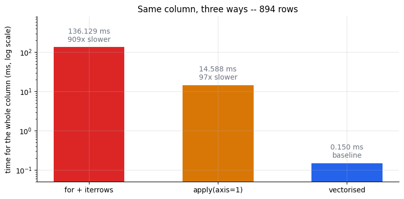

### Cell 136

```python
before_store   = tidy["store"].nunique()
before_product = tidy["product"].nunique()

print("BEFORE")
print(f"  store   : {before_store} distinct values -> {sorted(tidy['store'].unique())}")
print(f"  product : {before_product} distinct values")
print(f"            {sorted(repr(p) for p in tidy['product'].unique())}")

# --- the repair -----------------------------------------------------------
# .strip() removes leading/trailing whitespace; .title() and .lower() force
# one spelling. Each returns a NEW Series -- we assign it back explicitly.
tidy["store"]   = tidy["store"].str.strip().str.title()
tidy["product"] = tidy["product"].str.strip().str.lower()

after_store   = tidy["store"].nunique()
after_product = tidy["product"].nunique()

print("\nAFTER")
print(f"  store   : {after_store} distinct values -> {sorted(tidy['store'].unique())}")
print(f"  product : {after_product} distinct values -> {sorted(tidy['product'].unique())}")
print(f"\nphantom categories removed: "
      f"{(before_store - after_store) + (before_product - after_product)}")
```

**Output**

```text
BEFORE
  store   : 10 distinct values -> ['BAKERSFIELD', np.str_('Bakersfield'), 'FRESNO', np.str_('Fresno'), 'MODESTO', np.str_('Modesto'), 'SALINAS', 'STOCKTON', np.str_('Salinas'), np.str_('Stockton')]
  product : 12 distinct values
            ["'  bagel '", "'  cold brew '", "'  cookie '", "'  espresso '", "'  latte '", "'  muffin '", "np.str_('bagel')", "np.str_('cold brew')", "np.str_('cookie')", "np.str_('espresso')", "np.str_('latte')", "np.str_('muffin')"]

AFTER
  store   : 5 distinct values -> ['Bakersfield', 'Fresno', 'Modesto', 'Salinas', 'Stockton']
  product : 6 distinct values -> ['bagel', 'cold brew', 'cookie', 'espresso', 'latte', 'muffin']

phantom categories removed: 11
```

### Cell 139

```python
# The rest of the .str API, on the now-clean columns.
prod, store = tidy["product"], tidy["store"]

# --- membership and prefixes: both return boolean Series, usable as masks --
is_brew   = prod.str.contains("brew")          # substring, regex by default
starts_c  = prod.str.startswith("c")           # literal prefix, no regex

# --- splitting into columns -----------------------------------------------
# expand=True turns the list-of-pieces into a DataFrame; rows with fewer
# pieces than the widest row get None, which is why "espresso" has no second.
words = prod.str.split(" ", expand=True)
words.columns = ["word_1", "word_2"]

# --- extract with a regex: only the CAPTURE GROUPS come back --------------
# Named groups become column names, which is why this is worth the regex.
initials = store.str.extract(r"^(?P<initial>[A-Z])(?P<rest>.+)$")

# --- length, and gluing two columns together ------------------------------
name_len = prod.str.len()
label    = store.str.cat(prod, sep=" / ")      # NOT store + " / " + prod on NaN

summary = pd.DataFrame({
    "product":   prod,
    "word_1":    words["word_1"],
    "word_2":    words["word_2"],
    "len":       name_len,
    "initial":   initials["initial"],
    "label":     label,
    "has_brew":  is_brew,
    "starts_c":  starts_c,
})

print(summary.head(8).to_string())
print(f"\nrows containing 'brew'  : {is_brew.sum():>4}")
print(f"rows starting with 'c'  : {starts_c.sum():>4}")
print(f"products that are two words: "
      f"{words['word_2'].notna().sum()} of {len(words)}")

# --- and what a CHAIN of these costs --------------------------------------
# Each link is its own full pass over the column. If that is true, four links
# should cost about four times one link -- so let us check.
def four_links(s):
    return s.str.strip().str.lower().str.replace(" ", "_", regex=False).str.title()

chain_cost = []
for size, s in [("this frame", clean["product"]),
                ("x80 copies", pd.concat([clean["product"]] * 80, ignore_index=True))]:
    t1, _ = best_of(lambda: s.str.strip(), repeat=7)
    t4, _ = best_of(lambda: four_links(s),  repeat=7)
    chain_cost.append({"column": size, "rows": len(s), "1 link (ms)": t1 * 1e3,
                       "4 links (ms)": t4 * 1e3, "ratio": t4 / t1})

print("\ncost of chaining .str calls:")
print(pd.DataFrame(chain_cost).to_string(index=False,
      float_format=lambda v: f"{v:9.3f}"))
```

**Output**

```text
     product    word_1 word_2  len initial                   label  has_brew  starts_c
0  cold brew      cold   brew    9       S    Stockton / cold brew      True      True
1   espresso  espresso   None    8       F       Fresno / espresso     False     False
2     muffin    muffin   None    6       S       Stockton / muffin     False     False
3      latte     latte   None    5       S        Stockton / latte     False     False
4      bagel     bagel   None    5       S        Stockton / bagel     False     False
5      bagel     bagel   None    5       S        Stockton / bagel     False     False
6   espresso  espresso   None    8       B  Bakersfield / espresso     False     False
7     muffin    muffin   None    6       F         Fresno / muffin     False     False

rows containing 'brew'  :  130
rows starting with 'c'  :  268
products that are two words: 130 of 894

cost of chaining .str calls:
    column  rows  1 link (ms)  4 links (ms)     ratio
this frame   894        0.616         2.504     4.065
x80 copies 71520       33.152       168.502     5.083
```

### Cell 143

```python
date_str = tidy["date"]

# our dates are ISO-8601 -- pandas has a dedicated fast path for those
t_infer, _ = best_of(lambda: pd.to_datetime(date_str), repeat=7)
t_fmt,   _ = best_of(lambda: pd.to_datetime(date_str, format="%Y-%m-%d"), repeat=7)

# the same dates written the way a European spreadsheet exports them
euro = pd.to_datetime(date_str, format="%Y-%m-%d").dt.strftime("%d %b %Y")
t_euro_infer, _ = best_of(lambda: pd.to_datetime(euro), repeat=7)
t_euro_fmt,   _ = best_of(lambda: pd.to_datetime(euro, format="%d %b %Y"), repeat=7)
# 'mixed' is what you are forced into when the column is genuinely inconsistent:
# pandas gives up on one shared pattern and parses each element on its own.
t_euro_mixed, _ = best_of(lambda: pd.to_datetime(euro, format="mixed"), repeat=7)

bench = pd.DataFrame([
    {"input": "ISO '2024-03-14'",  "call": "no format=",        "ms": t_infer * 1e3},
    {"input": "ISO '2024-03-14'",  "call": "format='%Y-%m-%d'", "ms": t_fmt * 1e3},
    {"input": "'14 Mar 2024'",     "call": "no format=",        "ms": t_euro_infer * 1e3},
    {"input": "'14 Mar 2024'",     "call": "format='%d %b %Y'", "ms": t_euro_fmt * 1e3},
    {"input": "'14 Mar 2024'",     "call": "format='mixed'",    "ms": t_euro_mixed * 1e3},
])
bench["x vs explicit format"] = [t_infer / t_fmt, 1.0,
                                 t_euro_infer / t_euro_fmt, 1.0,
                                 t_euro_mixed / t_euro_fmt]
print(bench.to_string(index=False, float_format=lambda v: f"{v:8.3f}"))

# --- errors=: the same column with three unparseable values ---------------
broken = date_str.copy()
broken.iloc[[3, 17, 40]] = "not a date"
try:
    pd.to_datetime(broken)
except ValueError as e:
    print(f"\nerrors='raise' (the default) -> ValueError: {str(e)[:70]}...")

coerced = pd.to_datetime(broken, errors="coerce")
print(f"errors='coerce'              -> dtype {coerced.dtype}, "
      f"{coerced.isna().sum()} NaT, no exception")

# --- and now, for real ----------------------------------------------------
tidy["date"] = pd.to_datetime(tidy["date"], format="%Y-%m-%d")
print(f"\ntidy['date'] is now {tidy['date'].dtype}, "
      f"spanning {tidy['date'].min().date()} to {tidy['date'].max().date()}")
```

**Output**

```text
           input              call       ms  x vs explicit format
ISO '2024-03-14'        no format=    1.413                 1.785
ISO '2024-03-14' format='%Y-%m-%d'    0.792                 1.000
   '14 Mar 2024'        no format=    9.568                 1.555
   '14 Mar 2024' format='%d %b %Y'    6.152                 1.000
   '14 Mar 2024'    format='mixed'  122.775                19.956

errors='raise' (the default) -> ValueError: time data "not a date" doesn't match format "%Y-%m-%d", at position 3....
errors='coerce'              -> dtype datetime64[ns], 3 NaT, no exception

tidy['date'] is now datetime64[ns], spanning 2024-01-01 to 2024-06-28
```

### Cell 146

```python
# The .dt accessor: same idea as .str, but for datetimes. Every field is a
# vectorised read straight out of the datetime64 values -- no parsing, no loop.
d = tidy["date"]

tidy["year"]       = d.dt.year
tidy["month"]      = d.dt.month
tidy["day"]        = d.dt.day
tidy["dayofweek"]  = d.dt.dayofweek        # Monday=0 ... Sunday=6
tidy["day_name"]   = d.dt.day_name()       # a STRING, and locale-dependent
tidy["quarter"]    = d.dt.quarter
tidy["month_end"]  = d.dt.is_month_end     # boolean, no arithmetic needed

# The derived flag the rest of the notebook leans on.
tidy["is_weekend"] = d.dt.dayofweek >= 5

cal = tidy[["date", "year", "month", "day", "dayofweek",
            "day_name", "quarter", "month_end", "is_weekend"]]
print(cal.head(6).to_string(index=False))

print(f"\nweekend rows      : {tidy['is_weekend'].sum():>4} "
      f"of {len(tidy)}  ({tidy['is_weekend'].mean():.1%})")
print(f"month-end rows    : {tidy['month_end'].sum():>4}")
print("orders per quarter:",
      tidy["quarter"].value_counts().sort_index().to_dict())
```

**Output**

```text
      date  year  month  day  dayofweek day_name  quarter  month_end  is_weekend
2024-02-08  2024      2    8          3 Thursday        1      False       False
2024-05-17  2024      5   17          4   Friday        2      False       False
2024-03-19  2024      3   19          1  Tuesday        1      False       False
2024-05-27  2024      5   27          0   Monday        2      False       False
2024-06-01  2024      6    1          5 Saturday        2      False        True
2024-04-06  2024      4    6          5 Saturday        2      False        True

weekend rows      :  235 of 894  (26.3%)
month-end rows    :   30
orders per quarter: {1: 460, 2: 434}
```

### Cell 148

```python
DAY_ORDER = ["Monday", "Tuesday", "Wednesday", "Thursday",
             "Friday", "Saturday", "Sunday"]

by_day = (tidy.groupby("day_name", observed=True)["revenue"]
              .mean()
              .reindex(DAY_ORDER))          # calendar order, not alphabetical

weekday_mean = tidy.loc[~tidy["is_weekend"], "revenue"].mean()
weekend_mean = tidy.loc[tidy["is_weekend"],  "revenue"].mean()
lift = weekend_mean / weekday_mean - 1

fig, ax = plt.subplots(figsize=(9, 4))
colors = [C_GROUP if day in ("Saturday", "Sunday") else C_DATA for day in DAY_ORDER]
bars = ax.bar(by_day.index, by_day.values, color=colors, width=0.65)

ax.axhline(weekday_mean, color=C_GREY, ls="--", lw=1.2,
           label=rf"Mon-Fri mean = \${weekday_mean:,.2f}")
ax.set_ylabel(r"mean revenue per order (\$)")
ax.set_title("The weekend is worth more per order")
ax.legend(loc="upper left", frameon=False)

for bar, v in zip(bars, by_day.values):
    ax.text(bar.get_x() + bar.get_width() / 2, v + 0.6, rf"\${v:,.2f}",
            ha="center", fontsize=9, color=C_GREY)

ax.set_ylim(0, by_day.max() * 1.18)
plt.tight_layout()
plt.show()

print(f"Mon-Fri mean revenue/order : ${weekday_mean:,.2f}")
print(f"Sat-Sun mean revenue/order : ${weekend_mean:,.2f}")
print(f"weekend lift               : {lift:+.1%}")
```

**Output**

```text
<Figure size 900x400 with 1 Axes>
```

**Figure**

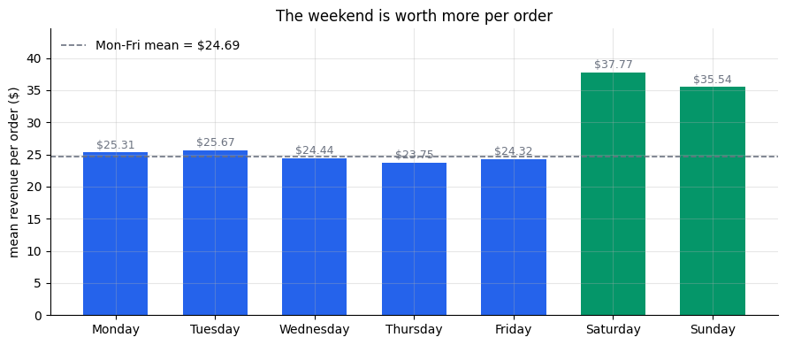

**Output**

```text
Mon-Fri mean revenue/order : $24.69
Sat-Sun mean revenue/order : $36.58
weekend lift               : +48.1%
```

### Cell 151

```python
# --- two outcomes: np.where ----------------------------------------------
BULK = 8
tidy["size_flag"] = np.where(tidy["quantity"] >= BULK, "bulk", "normal")

# --- many outcomes: np.select. Conditions are tested IN ORDER and the
#     FIRST match wins, so these must be written most-specific first.
conds  = [tidy["revenue"] >= 40, tidy["revenue"] >= 20, tidy["revenue"] >= 10]
labels = ["A (>= 40)", "B (20-40)", "C (10-20)"]
tidy["tier"] = np.select(conds, labels, default="D (< 10)")

# --- fixed edges: pd.cut. right=True by default => (0, 3] excludes 0,
#     includes 3. Rows with a NaN rating stay NaN; they are not a band.
tidy["rating_band"] = pd.cut(tidy["rating"],
                             bins=[0, 3, 4, 4.5, 5],
                             labels=["poor", "ok", "good", "great"])

# --- equal-sized groups: pd.qcut. The EDGES come from the data.
tidy["rev_quartile"] = pd.qcut(tidy["revenue"], q=4,
                               labels=["Q1", "Q2", "Q3", "Q4"])

# --- a lookup table: .map with a dict -------------------------------------
STORE_CODE = {"Bakersfield": "BAK", "Fresno": "FRE", "Modesto": "MOD",
              "Salinas": "SAL", "Stockton": "STO"}
tidy["store_code"] = tidy["store"].map(STORE_CODE)

for col in ["size_flag", "tier", "rating_band", "rev_quartile", "store_code"]:
    counts = tidy[col].value_counts(dropna=False).sort_index()
    print(f"{col:<13} {counts.to_dict()}")

print(f"\nrating_band is NaN for {tidy['rating_band'].isna().sum()} rows "
      f"(the ratings Part 4 left missing)")
print(f"store_code unmapped     : {tidy['store_code'].isna().sum()} rows")
```

**Output**

```text
size_flag     {'bulk': 453, 'normal': 441}
tier          {'A (>= 40)': 151, 'B (20-40)': 473, 'C (10-20)': 234, 'D (< 10)': 36}
rating_band   {'poor': 29, 'ok': 390, 'good': 243, 'great': 171, nan: 61}
rev_quartile  {'Q1': 230, 'Q2': 226, 'Q3': 219, 'Q4': 219}
store_code    {'BAK': 186, 'FRE': 188, 'MOD': 159, 'SAL': 186, 'STO': 175}

rating_band is NaN for 61 rows (the ratings Part 4 left missing)
store_code unmapped     : 0 rows
```

### Cell 154

```python
# --- the three, on the same data, so the difference is visible ------------
per_cell   = tidy[["quantity", "revenue"]].map(lambda v: round(v, 1))     # scalar in
per_column = tidy[["quantity", "revenue"]].apply(lambda s: s.max() - s.min())  # Series in
per_scalar = tidy["product"].map(str.title)                               # scalar in

print("DataFrame.map -> one call per CELL, same shape back:")
print(per_cell.head(3).to_string(), "\n")
print("DataFrame.apply (axis=0) -> one call per COLUMN, one number each:")
print(per_column.to_string(), "\n")
print("Series.map -> one call per VALUE:", per_scalar.unique()[:3].tolist(), "\n")

# --- the whole of Part 5 as one chain -------------------------------------
tidy_chained = (
    clean
    .assign(
        store      = lambda d: d["store"].str.strip().str.title(),
        product    = lambda d: d["product"].str.strip().str.lower(),
        date       = lambda d: pd.to_datetime(d["date"], format="%Y-%m-%d"),
        revenue    = lambda d: d["quantity"] * d["unit_price"],
        # these three depend on columns assigned ABOVE them in this same call
        day_name   = lambda d: d["date"].dt.day_name(),
        is_weekend = lambda d: d["date"].dt.dayofweek >= 5,
        tier       = lambda d: np.select(
            [d["revenue"] >= 40, d["revenue"] >= 20, d["revenue"] >= 10],
            ["A (>= 40)", "B (20-40)", "C (10-20)"], default="D (< 10)"),
    )
)

shared = ["store", "product", "date", "revenue", "day_name", "is_weekend", "tier"]
print("chain reproduces the step-by-step version exactly:",
      tidy_chained[shared].equals(tidy[shared]))
print(f"tidy: {tidy.shape[0]:,} rows x {tidy.shape[1]} columns "
      f"(clean had {clean.shape[1]})")
print("columns added by Part 5:",
      [c for c in tidy.columns if c not in clean.columns])
```

**Output**

```text
DataFrame.map -> one call per CELL, same shape back:
   quantity  revenue
0         6     25.5
1         9     29.2
2         9     31.5 

DataFrame.apply (axis=0) -> one call per COLUMN, one number each:
quantity    20.00
revenue     85.75 

Series.map -> one call per VALUE: ['Cold Brew', 'Espresso', 'Muffin'] 

chain reproduces the step-by-step version exactly: True
tidy: 894 rows x 23 columns (clean had 9)
columns added by Part 5: ['revenue', 'year', 'month', 'day', 'dayofweek', 'day_name', 'quarter', 'month_end', 'is_weekend', 'size_flag', 'tier', 'rating_band', 'rev_quartile', 'store_code']
```

### Cell 158

```python
# ============================================================
#  Split -> apply -> combine, on a frame small enough to hold
#  in your head: 6 rows, 3 groups, one aggregation.
# ============================================================
from matplotlib.patches import FancyArrowPatch, Rectangle

toy = [("Fresno", 12), ("Salinas", 30), ("Fresno", 8),
       ("Modesto", 15), ("Salinas", 10), ("Fresno", 20)]
GC = {"Fresno": C_DATA, "Salinas": C_GROUP, "Modesto": C_WARN}
ORDER = ["Fresno", "Modesto", "Salinas"]        # groupby sorts the keys

RH, RW = 0.52, 2.4                              # row height, table width


def cell(ax, x, y, w, h, text, fc="white", ec=C_SOFT, tc="#111827",
         weight="normal", size=9):
    ax.add_patch(Rectangle((x, y), w, h, facecolor=fc, edgecolor=ec, lw=1.1))
    ax.text(x + w / 2, y + h / 2, text, ha="center", va="center",
            fontsize=size, color=tc, fontweight=weight)


def table(ax, x, ytop, rows, header):
    """Draw a little store|revenue table; return its bottom edge."""
    cell(ax, x, ytop - RH, RW, RH, header, fc="#F3F4F6", ec=C_GREY,
         weight="bold", size=8.5)
    y = ytop - RH
    for s, v in rows:
        y -= RH
        cell(ax, x, y, RW * 0.62, RH, s, fc=GC[s], ec="white", tc="white")
        cell(ax, x + RW * 0.62, y, RW * 0.38, RH, f"{v}")
    return y


def arrow(ax, x0, y0, x1, y1, label="", color=C_GREY):
    ax.add_patch(FancyArrowPatch((x0, y0), (x1, y1), arrowstyle="-|>",
                                 mutation_scale=14, color=color, lw=1.6))
    if label:
        ax.text((x0 + x1) / 2, (y0 + y1) / 2 + 0.14, label, ha="center",
                va="bottom", fontsize=9, color=color, fontweight="bold")


fig, ax = plt.subplots(figsize=(11.5, 5.8))
ax.set_xlim(0, 13.6); ax.set_ylim(0, 7.0); ax.axis("off"); ax.grid(False)
TOP = 6.1


def head(x, t):
    ax.text(x + RW / 2, TOP + 0.22, t, ha="center", fontsize=11,
            fontweight="bold", color="#111827")


# 1 -- the whole frame
bottom = table(ax, 0.2, TOP, toy, "store | revenue")
head(0.2, "1. one frame")
mid1 = (TOP - RH + bottom) / 2

# 2 -- SPLIT: one sub-frame per distinct store
head(4.2, "2. SPLIT by store")
y, mids = TOP, {}
for name in ORDER:
    rows = [r for r in toy if r[0] == name]
    bot = table(ax, 4.2, y, rows, f"group: {name}")
    mids[name] = (y - RH + bot) / 2
    y = bot - 0.42
for i, name in enumerate(ORDER):
    arrow(ax, 2.75, mid1, 4.1, mids[name], "split" if i == 1 else "")

# 3 -- APPLY: sum() runs on each sub-frame independently
head(7.6, "3. APPLY sum()")
sums = {}
for name in ORDER:
    sums[name] = sum(v for s, v in toy if s == name)
    cell(ax, 7.7, mids[name] - RH / 2, 1.6, RH, f"sum = {sums[name]}",
         fc=GC[name], ec="white", tc="white", weight="bold", size=9.5)
    arrow(ax, 6.7, mids[name], 7.6, mids[name])

# 4 -- COMBINE: the three answers stack into one object
res = [(n, sums[n]) for n in ORDER]
b4 = table(ax, 10.9, TOP - 1.0, res, "store | revenue")
ax.text(10.9 + RW / 2, TOP - 0.78, "4. COMBINE", ha="center", fontsize=11,
        fontweight="bold", color="#111827")
mid4 = (TOP - 1.0 - RH + b4) / 2
for name in ORDER:
    arrow(ax, 9.4, mids[name], 10.8, mid4, "combine" if name == "Modesto" else "")
ax.text(10.9 + RW / 2, b4 - 0.42, "the group keys became the INDEX",
        ha="center", fontsize=9, color=C_IDX, fontweight="bold")

ax.set_title("split → apply → combine:   "
             "df.groupby('store')['revenue'].sum()",
             fontsize=13, fontweight="bold", pad=10)
plt.tight_layout(); plt.show()
```

**Output**

```text
<Figure size 1150x580 with 1 Axes>
```

**Figure**

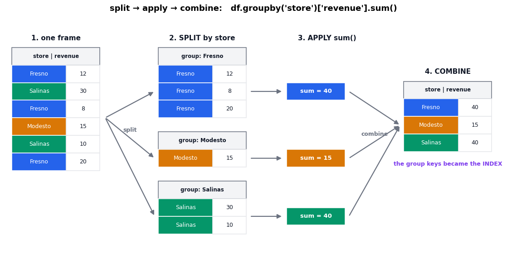

### Cell 161

```python
g = tidy.groupby("store")

print(type(g).__name__)
print(g)                                   # a plan, not a table
print(f"\nngroups: {g.ngroups}   keys: {list(g.groups)}")

# .groups maps each key -> the row LABELS in that group (not positions)
fresno_labels = g.groups["Fresno"]
print(f"\nFresno has {len(fresno_labels)} rows; first five labels: "
      f"{list(fresno_labels[:5])}")

# .get_group pulls one group out as a normal DataFrame
print(f"\nget_group('Fresno') -> {type(g.get_group('Fresno')).__name__} "
      f"of shape {g.get_group('Fresno').shape}")

# iterating gives (key, sub-frame) pairs -- good for looking, bad for computing
print("\niterating the GroupBy:")
for name, sub in g:
    print(f"   {name:<12} {sub.shape[0]:>4} rows   "
          f"revenue sum {sub['revenue'].sum():>10,.2f}")
```

**Output**

```text
DataFrameGroupBy
<pandas.core.groupby.generic.DataFrameGroupBy object at 0x7f196256a8b0>

ngroups: 5   keys: ['Bakersfield', 'Fresno', 'Modesto', 'Salinas', 'Stockton']

Fresno has 188 rows; first five labels: [1, 7, 29, 32, 36]

get_group('Fresno') -> DataFrame of shape (188, 23)

iterating the GroupBy:
   Bakersfield   186 rows   revenue sum   5,069.00
   Fresno        188 rows   revenue sum   5,192.25
   Modesto       159 rows   revenue sum   4,551.00
   Salinas       186 rows   revenue sum   5,398.25
   Stockton      175 rows   revenue sum   4,656.75
```

### Cell 164

```python
# --- one key -------------------------------------------------------------
by_store = tidy.groupby("store")["revenue"].sum()
print("one key, one column -> Series")
print(by_store, "\n")

# --- two keys ------------------------------------------------------------
by_two = tidy.groupby(["region", "category"])["revenue"].sum()
print("two keys -> Series with a MultiIndex")
print(by_two, "\n")

# --- size vs count vs mean, on the SAME column, side by side -------------
print("size vs count vs mean on 'rating':")
print(tidy.groupby("store").agg(size=("rating", "size"),
                                count=("rating", "count"),
                                mean=("rating", "mean")))

print(f"\nrating is missing in {tidy['rating'].isna().sum()} rows "
      f"of {len(tidy)} -- Part 4 kept those NaN on purpose, because a "
      f"customer who declined to rate is not a customer who rated 0.")
print(f"that gap is the whole difference between the first two columns: "
      f"{tidy.groupby('store')['rating'].size().sum()} - "
      f"{tidy.groupby('store')['rating'].count().sum()} = "
      f"{tidy['rating'].isna().sum()}")
```

**Output**

```text
one key, one column -> Series
store
Bakersfield    5069.00
Fresno         5192.25
Modesto        4551.00
Salinas        5398.25
Stockton       4656.75
Name: revenue, dtype: float64 

two keys -> Series with a MultiIndex
region      category
Central     drink       5959.50
            food        3603.75
Coast       drink       3679.00
            food        1699.00
North       drink       2759.00
            food        1882.00
South       drink       2606.25
            food        2339.75
Unassigned  drink        133.75
            food         205.25
Name: revenue, dtype: float64 

size vs count vs mean on 'rating':
             size  count      mean
store                             
Bakersfield   186    179  4.014525
Fresno        188    172  4.022674
Modesto       159    153  4.054902
Salinas       186    171  4.030409
Stockton      175    158  4.089241

rating is missing in 61 rows of 894 -- Part 4 kept those NaN on purpose, because a customer who declined to rate is not a customer who rated 0.
that gap is the whole difference between the first two columns: 894 - 833 = 61
```

**Output**

```text
/tmp/ipykernel_703/438475291.py:7: FutureWarning: The default of observed=False is deprecated and will be changed to True in a future version of pandas. Pass observed=False to retain current behavior or observed=True to adopt the future default and silence this warning.
  by_two = tidy.groupby(["region", "category"])["revenue"].sum()
```

### Cell 168

```python
# --- the failure, first --------------------------------------------------
per_band = tidy.groupby("rating_band")["revenue"].sum()
print(per_band, "\n")

n_rows  = len(tidy)
n_group = tidy.groupby("rating_band").size().sum()
print(f"rows in the frame  : {n_rows:>8,}")
print(f"rows in the groups : {n_group:>8,}")
print(f"silently dropped   : {n_rows - n_group:>8,}   "
      f"(rows with a missing rating_band: {tidy['rating_band'].isna().sum()})")

total_all     = tidy["revenue"].sum()
total_grouped = per_band.sum()
print(f"\nrevenue over the whole frame : {total_all:>12,.2f}")
print(f"revenue summed over groups   : {total_grouped:>12,.2f}")
print(f"unaccounted for              : {total_all - total_grouped:>12,.2f}"
      f"   ({(total_all - total_grouped) / total_all:.1%} of the business)")

# --- the fix -------------------------------------------------------------
print("\ndropna=False keeps them, in a group whose key is NaN:")
print(tidy.groupby("rating_band", dropna=False)["revenue"].sum())
print(f"\nand now the totals reconcile: "
      f"{tidy.groupby('rating_band', dropna=False)['revenue'].sum().sum():,.2f}"
      f" == {total_all:,.2f}")
```

**Output**

```text
rating_band
poor       796.25
ok       10987.50
good      6397.75
great     4920.00
Name: revenue, dtype: float64 

rows in the frame  :      894
rows in the groups :      833
silently dropped   :       61   (rows with a missing rating_band: 61)

revenue over the whole frame :    24,867.25
revenue summed over groups   :    23,101.50
unaccounted for              :     1,765.75   (7.1% of the business)

dropna=False keeps them, in a group whose key is NaN:
rating_band
poor       796.25
ok       10987.50
good      6397.75
great     4920.00
NaN       1765.75
Name: revenue, dtype: float64

and now the totals reconcile: 24,867.25 == 24,867.25
```

**Output**

```text
/tmp/ipykernel_703/1277281781.py:2: FutureWarning: The default of observed=False is deprecated and will be changed to True in a future version of pandas. Pass observed=False to retain current behavior or observed=True to adopt the future default and silence this warning.
  per_band = tidy.groupby("rating_band")["revenue"].sum()
/tmp/ipykernel_703/1277281781.py:6: FutureWarning: The default of observed=False is deprecated and will be changed to True in a future version of pandas. Pass observed=False to retain current behavior or observed=True to adopt the future default and silence this warning.
  n_group = tidy.groupby("rating_band").size().sum()
/tmp/ipykernel_703/1277281781.py:21: FutureWarning: The default of observed=False is deprecated and will be changed to True in a future version of pandas. Pass observed=False to retain current behavior or observed=True to adopt the future default and silence this warning.
  print(tidy.groupby("rating_band", dropna=False)["revenue"].sum())
/tmp/ipykernel_703/1277281781.py:23: FutureWarning: The default of observed=False is deprecated and will be changed to True in a future version of pandas. Pass observed=False to retain current behavior or observed=True to adopt the future default and silence this warning.
  f"{tidy.groupby('rating_band', dropna=False)['revenue'].sum().sum():,.2f}"
```

### Cell 172

```python
# --- 1. a list of functions ---------------------------------------------
print("1. list of functions:")
print(tidy.groupby("region")["revenue"].agg(["sum", "mean", "count"]), "\n")

# --- 2. a dict: column -> function --------------------------------------
print("2. dict, column -> function:")
print(tidy.groupby("region").agg({"revenue": "sum",
                                  "quantity": "mean",
                                  "rating": "median"}), "\n")

# --- 3. named aggregation -- the readable form ---------------------------
report = tidy.groupby("region").agg(
    orders     = ("order_id", "size"),      # every row, missing values included
    rated      = ("rating",   "count"),     # only the rows a customer rated
    revenue    = ("revenue",  "sum"),
    avg_order  = ("revenue",  "mean"),
    avg_rating = ("rating",   "mean"),      # computed over `rated`, not `orders`
)
print("3. named aggregation:")
print(report, "\n")
print("   columns come out flat:", list(report.columns), "\n")

# --- 4. a custom callable ------------------------------------------------
print("4. a lambda, for something pandas has no name for:")
print(tidy.groupby("region")["revenue"].agg(
    spread  = lambda s: s.max() - s.min(),
    biggest = lambda s: s.idxmax(),          # the row LABEL, not the value
))
```

**Output**

```text
1. list of functions:
                sum       mean  count
region                               
Central     9563.25  28.210177    339
Coast       5378.00  29.070270    185
North       4641.00  26.672414    174
South       4946.00  27.175824    182
Unassigned   339.00  24.214286     14 

2. dict, column -> function:
            revenue  quantity  rating
region                               
Central     9563.25  8.103245    4.00
Coast       5378.00  7.978378    4.00
North       4641.00  7.511494    4.10
South       4946.00  7.928571    4.00
Unassigned   339.00  7.428571    4.15 

3. named aggregation:
            orders  rated  revenue  avg_order  avg_rating
region                                                   
Central        339    317  9563.25  28.210177    4.040379
Coast          185    170  5378.00  29.070270    4.032353
North          174    157  4641.00  26.672414    4.083439
South          182    175  4946.00  27.175824    4.017143
Unassigned      14     14   339.00  24.214286    3.985714 

   columns come out flat: ['orders', 'rated', 'revenue', 'avg_order', 'avg_rating'] 

4. a lambda, for something pandas has no name for:
            spread  biggest
region                     
Central      85.75      816
Coast        66.75       71
North        66.75      546
South        56.25      840
Unassigned   53.50      177
```

**Output**

```text
/tmp/ipykernel_703/1994470378.py:3: FutureWarning: The default of observed=False is deprecated and will be changed to True in a future version of pandas. Pass observed=False to retain current behavior or observed=True to adopt the future default and silence this warning.
  print(tidy.groupby("region")["revenue"].agg(["sum", "mean", "count"]), "\n")
/tmp/ipykernel_703/1994470378.py:7: FutureWarning: The default of observed=False is deprecated and will be changed to True in a future version of pandas. Pass observed=False to retain current behavior or observed=True to adopt the future default and silence this warning.
  print(tidy.groupby("region").agg({"revenue": "sum",
/tmp/ipykernel_703/1994470378.py:12: FutureWarning: The default of observed=False is deprecated and will be changed to True in a future version of pandas. Pass observed=False to retain current behavior or observed=True to adopt the future default and silence this warning.
  report = tidy.groupby("region").agg(
/tmp/ipykernel_703/1994470378.py:25: FutureWarning: The default of observed=False is deprecated and will be changed to True in a future version of pandas. Pass observed=False to retain current behavior or observed=True to adopt the future default and silence this warning.
  print(tidy.groupby("region")["revenue"].agg(
```

### Cell 175

```python
import time

# --- the SAME question, three ways --------------------------------------
a_agg       = tidy.groupby("store")["revenue"].sum()                     # reduce
a_transform = tidy.groupby("store")["revenue"].transform("sum")          # broadcast
a_apply     = tidy.groupby("store")["revenue"].apply(lambda s: s.sum())  # reduce
a_apply2    = tidy.groupby("store")["revenue"].apply(lambda s: s / s.sum())

print(f"input frame                       {tidy.shape}")
print(f"agg        .sum()                 {a_agg.shape}   <- one row per group")
print(f"apply      lambda s: s.sum()      {a_apply.shape}   <- same: it reduced")
print(f"transform  'sum'                  {a_transform.shape} <- one row per INPUT row")
print(f"apply      lambda s: s / s.sum()  {a_apply2.shape} <- apply broadcast instead")
print(f"\nnumber of groups: {tidy.groupby('store').ngroups}   "
      f"rows in the frame: {len(tidy)}")

# --- and the same numbers, seen from a row's point of view ---------------
print("\ntransform gives every row its own group's total:")
print(pd.DataFrame({"store": tidy["store"],
                    "revenue": tidy["revenue"],
                    "store_total": a_transform}).head(6))

# --- speed ---------------------------------------------------------------
def ms(f, n=25):
    t0 = time.perf_counter()
    for _ in range(n):
        f()
    return (time.perf_counter() - t0) / n * 1000

# the cost of apply is per GROUP, so it grows with the number of groups:
# time both on two keys (30 groups) rather than one (5).
keys  = ["store", "product"]
t_sum = ms(lambda: tidy.groupby(keys)["revenue"].sum())
t_app = ms(lambda: tidy.groupby(keys)["revenue"].apply(lambda s: s.sum()))
print(f"\nover {tidy.groupby(keys).ngroups} groups:")
print(f"   .sum()                     {t_sum:6.2f} ms")
print(f"   .apply(lambda s: s.sum())  {t_app:6.2f} ms   "
      f"({t_app / t_sum:.1f}x slower, for identical arithmetic)")
```

**Output**

```text
input frame                       (894, 23)
agg        .sum()                 (5,)   <- one row per group
apply      lambda s: s.sum()      (5,)   <- same: it reduced
transform  'sum'                  (894,) <- one row per INPUT row
apply      lambda s: s / s.sum()  (894,) <- apply broadcast instead

number of groups: 5   rows in the frame: 894

transform gives every row its own group's total:
      store  revenue  store_total
0  Stockton    25.50      4656.75
1    Fresno    29.25      5192.25
2  Stockton    31.50      4656.75
3  Stockton    23.75      4656.75
4  Stockton    24.75      4656.75
5  Stockton    22.00      4656.75

over 30 groups:
   .sum()                       4.07 ms
   .apply(lambda s: s.sum())    5.48 ms   (1.3x slower, for identical arithmetic)
```

### Cell 179

```python
# ---- transform: compare each row to its own group -----------------------
cmp = tidy[["store", "product", "revenue", "rating"]].copy()
cmp["store_total"] = tidy.groupby("store")["revenue"].transform("sum")
cmp["share_of_store"] = cmp["revenue"] / cmp["store_total"]
cmp["rating_vs_store"] = (tidy["rating"]
                          - tidy.groupby("store")["rating"].transform("mean"))

print("each row against its own store:")
print(cmp[["store", "revenue", "store_total",
           "share_of_store", "rating_vs_store"]].head(6), "\n")
one = cmp["store"] == "Fresno"
print(f"shares within one store sum to 1     : "
      f"{cmp.loc[one, 'share_of_store'].sum():.6f}")
print(f"centred ratings within one store to 0: "
      f"{cmp.loc[one, 'rating_vs_store'].sum():.6f}\n")

# ---- the index that comes back ------------------------------------------
print("default -- group keys become the index:")
print(tidy.groupby("region")["revenue"].sum(), "\n")

print("as_index=False -- a flat DataFrame instead:")
print(tidy.groupby("region", as_index=False)["revenue"].sum(), "\n")

print("reset_index() -- same thing, after the fact:")
print(tidy.groupby("region")["revenue"].sum().reset_index(), "\n")

# ---- what ORDER do the keys come back in? -------------------------------
DAY_ORDER = ["Monday", "Tuesday", "Wednesday", "Thursday",
             "Friday", "Saturday", "Sunday"]

# groupby SORTS its keys by default, and day_name is a string, so:
print("default (sort=True) -- alphabetical, which is useless for weekdays:")
print(list(tidy.groupby("day_name")["revenue"].sum().index), "\n")

print("sort=False -- order of first appearance in the frame, also not calendar:")
print(list(tidy.groupby("day_name", sort=False)["revenue"].sum().index), "\n")

# the real fix: make the key an ORDERED categorical and the order is a
# property of the column, so every groupby on it comes out right for free
day = pd.Categorical(tidy["day_name"], categories=DAY_ORDER, ordered=True)
print("ordered categorical key -- calendar order, no reindex needed:")
print(tidy.groupby(day, observed=True)["revenue"].sum(), "\n")

# ---- two keys -> unstack -> sort ----------------------------------------
long = tidy.groupby(["region", "category"])["revenue"].sum()
wide = long.unstack()
print("two keys, unstacked into a matrix, sorted by drink revenue:")
print(wide.sort_values("drink", ascending=False))
print(f"\nlong result: {long.shape}   ->   wide result: {wide.shape}")
```

**Output**

```text
each row against its own store:
      store  revenue  store_total  share_of_store  rating_vs_store
0  Stockton    25.50      4656.75        0.005476         0.110759
1    Fresno    29.25      5192.25        0.005633         0.977326
2  Stockton    31.50      4656.75        0.006764         0.010759
3  Stockton    23.75      4656.75        0.005100        -1.489241
4  Stockton    24.75      4656.75        0.005315         0.210759
5  Stockton    22.00      4656.75        0.004724         0.210759 

shares within one store sum to 1     : 1.000000
centred ratings within one store to 0: 0.000000

default -- group keys become the index:
region
Central       9563.25
Coast         5378.00
North         4641.00
South         4946.00
Unassigned     339.00
Name: revenue, dtype: float64 

as_index=False -- a flat DataFrame instead:
       region  revenue
0     Central  9563.25
1       Coast  5378.00
2       North  4641.00
3       South  4946.00
4  Unassigned   339.00 

reset_index() -- same thing, after the fact:
       region  revenue
0     Central  9563.25
1       Coast  5378.00
2       North  4641.00
3       South  4946.00
4  Unassigned   339.00 

default (sort=True) -- alphabetical, which is useless for weekdays:
['Friday', 'Monday', 'Saturday', 'Sunday', 'Thursday', 'Tuesday', 'Wednesday'] 

sort=False -- order of first appearance in the frame, also not calendar:
['Thursday', 'Friday', 'Tuesday', 'Monday', 'Saturday', 'Wednesday', 'Sunday'] 

ordered categorical key -- calendar order, no reindex needed:
Monday       3037.50
Tuesday      3439.75
Wednesday    2981.75
Thursday     2897.25
Friday       3915.50
Saturday     4117.00
Sunday       4478.50
Name: revenue, dtype: float64 

two keys, unstacked into a matrix, sorted by drink revenue:
category      drink     food
region                      
Central     5959.50  3603.75
Coast       3679.00  1699.00
North       2759.00  1882.00
South       2606.25  2339.75
Unassigned   133.75   205.25

long result: (10,)   ->   wide result: (5, 2)
```

**Output**

```text
/tmp/ipykernel_703/3856402021.py:19: FutureWarning: The default of observed=False is deprecated and will be changed to True in a future version of pandas. Pass observed=False to retain current behavior or observed=True to adopt the future default and silence this warning.
  print(tidy.groupby("region")["revenue"].sum(), "\n")
/tmp/ipykernel_703/3856402021.py:22: FutureWarning: The default of observed=False is deprecated and will be changed to True in a future version of pandas. Pass observed=False to retain current behavior or observed=True to adopt the future default and silence this warning.
  print(tidy.groupby("region", as_index=False)["revenue"].sum(), "\n")
/tmp/ipykernel_703/3856402021.py:25: FutureWarning: The default of observed=False is deprecated and will be changed to True in a future version of pandas. Pass observed=False to retain current behavior or observed=True to adopt the future default and silence this warning.
  print(tidy.groupby("region")["revenue"].sum().reset_index(), "\n")
/tmp/ipykernel_703/3856402021.py:45: FutureWarning: The default of observed=False is deprecated and will be changed to True in a future version of pandas. Pass observed=False to retain current behavior or observed=True to adopt the future default and silence this warning.
  long = tidy.groupby(["region", "category"])["revenue"].sum()
```

### Cell 182

```python
import inspect

default = inspect.signature(pd.DataFrame.groupby).parameters["observed"].default
print(f"pandas {pd.__version__}: groupby(observed=...) defaults to {default}\n")

coast = tidy[tidy["region"] == "Coast"]
print(f"after filtering to one region: {len(coast)} rows, but "
      f"{len(coast['region'].cat.categories)} regions are still DECLARED:")
print(f"   {list(coast['region'].cat.categories)}\n")

print("observed=True  -- only the groups that actually occur:")
print(coast.groupby("region", observed=True).size(), "\n")

print("observed=False -- every declared category, present or not:")
print(coast.groupby("region", observed=False).size(), "\n")

# and with two categorical keys, observed=False is a full CROSS PRODUCT
n_true  = coast.groupby(["region", "category"], observed=True).size().shape[0]
n_false = coast.groupby(["region", "category"], observed=False).size().shape[0]
n_reg   = len(coast["region"].cat.categories)
n_cat   = len(coast["category"].cat.categories)
print("two categorical keys on that same filtered frame:")
print(f"   observed=True  -> {n_true} rows   (the combinations that occur)")
print(f"   observed=False -> {n_false} rows   "
      f"(= {n_reg} regions x {n_cat} categories = {n_reg * n_cat})")
```

**Output**

```text
pandas 2.2.3: groupby(observed=...) defaults to _NoDefault.no_default

after filtering to one region: 185 rows, but 5 regions are still DECLARED:
   ['Central', 'Coast', 'North', 'South', 'Unassigned']

observed=True  -- only the groups that actually occur:
region
Coast    185
dtype: int64 

observed=False -- every declared category, present or not:
region
Central         0
Coast         185
North           0
South           0
Unassigned      0
dtype: int64 

two categorical keys on that same filtered frame:
   observed=True  -> 2 rows   (the combinations that occur)
   observed=False -> 10 rows   (= 5 regions x 2 categories = 10)
```

### Cell 186

```python
weekend_by_product = (
    tidy[tidy["is_weekend"]]                                 # weekends only
        .groupby(["region", "product"], dropna=False)        # split on both keys
        ["revenue"].sum()                                    # apply
        .sort_values(ascending=False)                        # best first
)

best_per_region = (weekend_by_product
                   .groupby("region", dropna=False)          # within each region...
                   .head(1)                                  # ...keep the top row
                   .sort_index())

print("weekend revenue -- the best product in each region:\n")
print(best_per_region.to_frame("weekend_revenue"), "\n")

for (region, product), rev in best_per_region.items():
    total = weekend_by_product.loc[region].sum()
    print(f"   {str(region):<11} -> {product:<10} {rev:>9,.2f}   "
          f"({rev / total:.1%} of that region's weekend revenue)")
```

**Output**

```text
weekend revenue -- the best product in each region:

                      weekend_revenue
region     product                   
Central    cold brew           837.25
Coast      latte               470.25
North      latte               726.75
South      muffin              374.50
Unassigned latte                61.75 

   Central     -> cold brew     837.25   (23.2% of that region's weekend revenue)
   Coast       -> latte         470.25   (31.0% of that region's weekend revenue)
   North       -> latte         726.75   (40.7% of that region's weekend revenue)
   South       -> muffin        374.50   (23.9% of that region's weekend revenue)
   Unassigned  -> latte          61.75   (55.3% of that region's weekend revenue)
```

**Output**

```text
/tmp/ipykernel_703/1901473864.py:3: FutureWarning: The default of observed=False is deprecated and will be changed to True in a future version of pandas. Pass observed=False to retain current behavior or observed=True to adopt the future default and silence this warning.
  .groupby(["region", "product"], dropna=False)        # split on both keys
/tmp/ipykernel_703/1901473864.py:9: FutureWarning: The default of observed=False is deprecated and will be changed to True in a future version of pandas. Pass observed=False to retain current behavior or observed=True to adopt the future default and silence this warning.
  .groupby("region", dropna=False)          # within each region...
```

### Cell 188

```python
# ============================================================
#  The two-key result as a matrix: weekend revenue by
#  region x product, with each region's winner ringed.
# ============================================================
mat = (tidy[tidy["is_weekend"]]
       .groupby(["region", "product"])["revenue"].sum()
       .unstack()                                  # regions down, products across
       .fillna(0))

fig, ax = plt.subplots(figsize=(9.5, 4.2))
im = ax.imshow(mat.values, cmap="YlGnBu", aspect="auto")

ax.set_xticks(range(mat.shape[1]), mat.columns.astype(str), rotation=20, ha="right")
ax.set_yticks(range(mat.shape[0]), mat.index.astype(str))
ax.set_xlabel("product"); ax.set_ylabel("region")
ax.set_title("Weekend revenue by region and product   "
             "(ringed = that region's best seller)",
             fontsize=12, fontweight="bold", pad=10)
ax.grid(False)

hi = mat.values.max()
for i in range(mat.shape[0]):
    winner = int(mat.values[i].argmax())
    for j in range(mat.shape[1]):
        v = mat.values[i, j]
        ax.text(j, i, f"{v:,.0f}", ha="center", va="center", fontsize=9,
                color="white" if v > 0.6 * hi else "#111827",
                fontweight="bold" if j == winner else "normal")
    ax.add_patch(plt.Rectangle((winner - 0.5, i - 0.5), 1, 1, fill=False,
                               edgecolor=C_NA, lw=2.5))

fig.colorbar(im, ax=ax, label="weekend revenue", shrink=0.85)
plt.tight_layout(); plt.show()
```

**Output**

```text
/tmp/ipykernel_703/250198065.py:6: FutureWarning: The default of observed=False is deprecated and will be changed to True in a future version of pandas. Pass observed=False to retain current behavior or observed=True to adopt the future default and silence this warning.
  .groupby(["region", "product"])["revenue"].sum()
```

**Output**

```text
<Figure size 950x420 with 2 Axes>
```

**Figure**

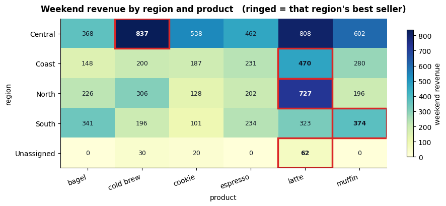

### Cell 192

```python
# ============================================================
#  Part 7 reshapes Part 5's `tidy` frame. We take a COPY and
#  add one label column to it, so that nothing we do here
#  leaks into Parts 8 and 9 -- they still get `tidy` untouched.
#  `tidy["month"]` is an integer (1..6); for grids we want a
#  readable header, so we derive `month_name` alongside it.
# ============================================================
txn = tidy.copy()
txn["month_name"] = txn["date"].dt.strftime("%b")

MONTHS = ["Jan", "Feb", "Mar", "Apr", "May", "Jun"]

print(f"txn: {len(txn):,} rows x {txn.shape[1]} columns  "
      f"(tidy + one derived label column)")
print(f"stores  : {sorted(txn['store'].unique())}")
print(f"months  : {sorted(txn['month_name'].unique(), key=MONTHS.index)}")
print(f"revenue : {txn['revenue'].sum():,.2f} total  -- every grid below must "
      f"add back up to this")
txn[["date", "month_name", "store", "product", "category",
     "quantity", "unit_price", "revenue"]].head()
```

**Output**

```text
txn: 894 rows x 24 columns  (tidy + one derived label column)
stores  : ['Bakersfield', 'Fresno', 'Modesto', 'Salinas', 'Stockton']
months  : ['Jan', 'Feb', 'Mar', 'Apr', 'May', 'Jun']
revenue : 24,867.25 total  -- every grid below must add back up to this
```

**Output**

```text
        date month_name     store    product category  quantity  unit_price  revenue
0 2024-02-08        Feb  Stockton  cold brew    drink         6        4.25    25.50
1 2024-05-17        May    Fresno   espresso    drink         9        3.25    29.25
2 2024-03-19        Mar  Stockton     muffin     food         9        3.50    31.50
3 2024-05-27        May  Stockton      latte    drink         5        4.75    23.75
4 2024-06-01        Jun  Stockton      bagel     food         9        2.75    24.75
```

### Cell 194

```python
# ============================================================
#  ONE picture: the same six numbers, twice.
#  Left = long (one row per observation). Right = wide (month
#  became the column headers). The arrows show that nothing is
#  computed -- each long row simply lands in one wide cell.
# ============================================================
shape_demo = (txn[txn["store"].isin(["Fresno", "Salinas"])]
              .groupby(["store", "month_name"])["revenue"].sum()
              .round(0).astype(int).reset_index())
shape_demo = shape_demo[shape_demo["month_name"].isin(["Jan", "Feb", "Mar"])].copy()
shape_demo["month_name"] = pd.Categorical(shape_demo["month_name"], MONTHS, ordered=True)
shape_demo = shape_demo.sort_values(["store", "month_name"]).reset_index(drop=True)

fig, ax = plt.subplots(figsize=(11.5, 5.0))
ax.set_xlim(0, 10); ax.set_ylim(0, 7.4); ax.axis("off"); ax.grid(False)

# z: data cells sit at 1, arrows at 2, labels/headers at 3, all text at 4 --
# so an arrow passes BEHIND a row label and lands ON TOP of the cell it feeds
def box(x, y, w, h, text, fc, tc="black", weight="normal", size=10, z=3):
    ax.add_patch(plt.Rectangle((x, y), w, h, facecolor=fc, edgecolor="white",
                               lw=1.4, zorder=z))
    ax.text(x + w / 2, y + h / 2, text, ha="center", va="center", zorder=4,
            color=tc, fontweight=weight, fontsize=size)

# ---- LONG (left): 6 rows x 3 columns
LX, LY, CW, RH = 0.25, 5.6, 1.05, 0.62
for j, name in enumerate(["store", "month", "revenue"]):
    box(LX + j * CW, LY, CW, RH, name, C_GREY, "white", "bold", 9)
row_mid = {}
for i, r in shape_demo.iterrows():
    y = LY - (i + 1) * RH
    row_mid[(r["store"], str(r["month_name"]))] = y + RH / 2
    box(LX + 0 * CW, y, CW, RH, r["store"][:8], C_SOFT, size=9)
    box(LX + 1 * CW, y, CW, RH, str(r["month_name"]), C_IDX, "white", size=9)
    box(LX + 2 * CW, y, CW, RH, f"{r['revenue']:,}", C_DATA, "white", size=9, z=1)
ax.text(LX + 1.5 * CW, LY + RH + 0.42, "LONG  (tidy)", ha="center",
        fontsize=13, fontweight="bold", color=C_GREY)
ax.text(LX + 1.5 * CW, LY + RH + 0.10, "one row per observation",
        ha="center", fontsize=9, color=C_GREY)

# ---- WIDE (right): 2 rows x 3 columns
WX, WY = 6.15, 4.35
box(WX - 1.55, WY + RH, 1.55, RH, "store", C_GREY, "white", "bold", 9)
for j, m in enumerate(["Jan", "Feb", "Mar"]):
    box(WX + j * CW, WY + RH, CW, RH, m, C_IDX, "white", "bold", 9)
wide_mid = {}
for i, s in enumerate(["Fresno", "Salinas"]):
    y = WY - i * RH
    box(WX - 1.55, y, 1.55, RH, s, C_SOFT, size=9)
    for j, m in enumerate(["Jan", "Feb", "Mar"]):
        hit = (shape_demo["store"] == s) & (shape_demo["month_name"] == m)
        box(WX + j * CW, y, CW, RH,
            f"{int(shape_demo.loc[hit, 'revenue'].iloc[0]):,}",
            C_DATA, "white", size=9, z=1)
        wide_mid[(s, m)] = (WX + j * CW, y + RH / 2)
ax.text(WX + 1.5 * CW - 0.7, WY + 2 * RH + 0.42, "WIDE  (presentation)",
        ha="center", fontsize=13, fontweight="bold", color=C_GREY)
ax.text(WX + 1.5 * CW - 0.7, WY + 2 * RH + 0.10, "month became the column headers",
        ha="center", fontsize=9, color=C_GREY)

# ---- arrows: three long rows to the wide cell each one lands in
for key in [("Fresno", "Jan"), ("Salinas", "Feb"), ("Salinas", "Mar")]:
    x2, y2 = wide_mid[key]
    ax.annotate("", xy=(x2 + CW * 0.45, y2 + RH * 0.30),
                xytext=(LX + 3 * CW + 0.05, row_mid[key]),
                zorder=2,
                arrowprops=dict(arrowstyle="->", color=C_GROUP, lw=1.8,
                                connectionstyle="arc3,rad=0.12"))
ax.text(5.0, 0.80, "pivot_table  →", ha="center", fontsize=12,
        fontweight="bold", color=C_GROUP)
ax.text(5.0, 0.32, "←  melt", ha="center", fontsize=12,
        fontweight="bold", color=C_WARN)
plt.tight_layout(); plt.show()
```

**Output**

```text
<Figure size 1150x500 with 1 Axes>
```

**Figure**

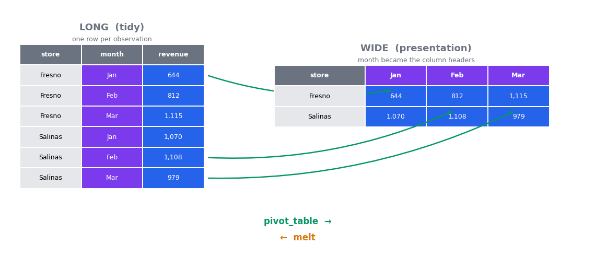

### Cell 197

```python
# ---- 1. the basic grid: stores down the side, months across the top --------
grid = txn.pivot_table(index="store", columns="month_name",
                       values="revenue", aggfunc="sum")[MONTHS]
print("revenue by store x month")
print(grid.round(2))

# ---- 2. totals on both edges, and a zero-fill ------------------------------
grid_tot = txn.pivot_table(index="store", columns="category", values="revenue",
                           aggfunc="sum", margins=True, margins_name="TOTAL",
                           fill_value=0)
print("\nrevenue by store x category, with margins")
print(grid_tot.round(2))
print(f"\ncorner    = {grid_tot.loc['TOTAL', 'TOTAL']:,.2f}")
print(f"ungrouped = {txn['revenue'].sum():,.2f}   match: "
      f"{np.isclose(grid_tot.loc['TOTAL', 'TOTAL'], txn['revenue'].sum())}")

# ---- 3. two aggregations at once -> a two-level column index ---------------
multi = txn.pivot_table(index="region", columns="category",
                        values="revenue", aggfunc=["sum", "mean"]).round(2)
print("\ntwo aggfuncs -> the columns become two levels deep")
print(multi)

# ---- 4. the same request through pivot(), which refuses --------------------
n_pairs = txn.groupby(["store", "category"]).ngroups
try:
    txn.pivot(index="store", columns="category", values="revenue")
except ValueError as e:
    print(f"\npivot() raised {type(e).__name__}: {e}")
print(f"{len(txn)} rows collapse into only {n_pairs} distinct store x category "
      f"pairs (~{len(txn) / n_pairs:.0f} rows competing for every cell)")
```

**Output**

```text
revenue by store x month
month_name       Jan      Feb      Mar      Apr     May     Jun
store                                                          
Bakersfield  1002.50   707.25   881.75  1089.50  737.25  650.75
Fresno        644.50   812.25  1115.25  1155.75  677.00  787.50
Modesto       648.00   683.50   779.75  1060.00  699.75  680.00
Salinas      1070.25  1107.50   979.00   568.25  998.25  675.00
Stockton      742.75   756.25   830.75   818.25  840.00  668.75

revenue by store x category, with margins
category       drink     food     TOTAL
store                                  
Bakersfield   2668.0  2401.00   5069.00
Fresno        3009.5  2182.75   5192.25
Modesto       3022.0  1529.00   4551.00
Salinas       3679.0  1719.25   5398.25
Stockton      2759.0  1897.75   4656.75
TOTAL        15137.5  9729.75  24867.25

corner    = 24,867.25
ungrouped = 24,867.25   match: True

two aggfuncs -> the columns become two levels deep
                sum            mean       
category      drink     food  drink   food
region                                    
Central     5959.50  3603.75  33.48  22.38
Coast       3679.00  1699.00  33.45  22.65
North       2759.00  1882.00  31.71  21.63
South       2606.25  2339.75  32.18  23.17
Unassigned   133.75   205.25  33.44  20.52

pivot() raised ValueError: Index contains duplicate entries, cannot reshape
894 rows collapse into only 10 distinct store x category pairs (~89 rows competing for every cell)
```

**Output**

```text
/tmp/ipykernel_703/3203797608.py:8: FutureWarning: The default value of observed=False is deprecated and will change to observed=True in a future version of pandas. Specify observed=False to silence this warning and retain the current behavior
  grid_tot = txn.pivot_table(index="store", columns="category", values="revenue",
/tmp/ipykernel_703/3203797608.py:18: FutureWarning: The default value of observed=False is deprecated and will change to observed=True in a future version of pandas. Specify observed=False to silence this warning and retain the current behavior
  multi = txn.pivot_table(index="region", columns="category",
/tmp/ipykernel_703/3203797608.py:18: FutureWarning: The default value of observed=False is deprecated and will change to observed=True in a future version of pandas. Specify observed=False to silence this warning and retain the current behavior
  multi = txn.pivot_table(index="region", columns="category",
/tmp/ipykernel_703/3203797608.py:24: FutureWarning: The default of observed=False is deprecated and will be changed to True in a future version of pandas. Pass observed=False to retain current behavior or observed=True to adopt the future default and silence this warning.
  n_pairs = txn.groupby(["store", "category"]).ngroups
```

### Cell 201

```python
# ---- wide -> long ----------------------------------------------------------
flat = grid.reset_index()          # move `store` out of the index, into a column
long = flat.melt(id_vars="store", value_vars=MONTHS,
                 var_name="month_name", value_name="revenue")

print(f"wide grid : {grid.shape[0]} rows x {grid.shape[1]} cols = "
      f"{grid.shape[0] * grid.shape[1]} numbers")
print(f"melted    : {long.shape[0]} rows x {long.shape[1]} cols")
print(long.head(4))

# ---- long -> wide again, and check we got back what we started with --------
back = long.pivot(index="store", columns="month_name", values="revenue")[MONTHS]
print(f"\nround trip identical : {back.equals(grid)}")
print(f"same grand total     : "
      f"{np.isclose(back.to_numpy().sum(), grid.to_numpy().sum())}")

# ---- and why you would bother: `month_name` is a column again --------------
print("\nafter melting, month is a COLUMN, so groupby works on it:")
print(long.groupby("month_name")["revenue"].sum().reindex(MONTHS).round(2))
```

**Output**

```text
wide grid : 5 rows x 6 cols = 30 numbers
melted    : 30 rows x 3 cols
         store month_name  revenue
0  Bakersfield        Jan  1002.50
1       Fresno        Jan   644.50
2      Modesto        Jan   648.00
3      Salinas        Jan  1070.25

round trip identical : True
same grand total     : True

after melting, month is a COLUMN, so groupby works on it:
month_name
Jan    4108.00
Feb    4066.75
Mar    4586.50
Apr    4691.75
May    3952.25
Jun    3462.00
Name: revenue, dtype: float64
```

### Cell 204

```python
# ---- a two-level index is what grouping on two keys gives you -------------
by_sc = txn.groupby(["store", "category"], observed=True)["revenue"].sum().round(2)
print("a Series with a 2-level index:")
print(by_sc.head(4))
print(f"index levels: {by_sc.index.names}   entries: {len(by_sc)}")

# ---- unstack: an index level becomes columns ------------------------------
print("\nunstack()        -> category across the top")
print(by_sc.unstack().round(2))
print("\nunstack(level=0) -> store across the top instead")
print(by_sc.unstack(level=0).round(2))
print(f"\nstack() undoes it exactly: {by_sc.unstack().stack().equals(by_sc)}")

# ---- selecting from a MultiIndex ------------------------------------------
by_sp = txn.groupby(["store", "product"], observed=True)["revenue"].sum().round(2)
print(f"\n.loc[('Fresno', 'latte')] = {by_sp.loc[('Fresno', 'latte')]:,.2f}")
print(".xs('latte', level='product') ->")
print(by_sp.xs("latte", level="product").round(2))

# ---- and the reason sort_index() exists -----------------------------------
shuffled = by_sp.sample(frac=1, random_state=0)    # same data, scrambled order
print(f"\nis the index sorted? {shuffled.index.is_monotonic_increasing}")
try:
    shuffled.loc[("Fresno", "latte"):("Modesto", "muffin")]
except Exception as e:
    print(f"slicing it raised {type(e).__name__}: {e}")
ok = shuffled.sort_index().loc[("Fresno", "latte"):("Modesto", "muffin")]
print(f"after sort_index() the same slice returns {len(ok)} rows")
```

**Output**

```text
a Series with a 2-level index:
store        category
Bakersfield  drink       2668.00
             food        2401.00
Fresno       drink       3009.50
             food        2182.75
Name: revenue, dtype: float64
index levels: ['store', 'category']   entries: 10

unstack()        -> category across the top
category      drink     food
store                       
Bakersfield  2668.0  2401.00
Fresno       3009.5  2182.75
Modesto      3022.0  1529.00
Salinas      3679.0  1719.25
Stockton     2759.0  1897.75

unstack(level=0) -> store across the top instead
store     Bakersfield   Fresno  Modesto  Salinas  Stockton
category                                                  
drink          2668.0  3009.50   3022.0  3679.00   2759.00
food           2401.0  2182.75   1529.0  1719.25   1897.75

stack() undoes it exactly: True

.loc[('Fresno', 'latte')] = 1,178.00
.xs('latte', level='product') ->
store
Bakersfield    1306.25
Fresno         1178.00
Modesto        1220.75
Salinas        1795.50
Stockton       1401.25
Name: revenue, dtype: float64

is the index sorted? False
slicing it raised UnsortedIndexError: 'Key length (2) was greater than MultiIndex lexsort depth (0)'
after sort_index() the same slice returns 8 rows
```

### Cell 208

```python
# ============================================================
#  The lookup table. Fresno is MISSING from it; Merced is in
#  it but has no sales. Both gaps are deliberate.
# ============================================================
store_meta = pd.DataFrame({
    "store":   ["Bakersfield", "Modesto", "Salinas", "Stockton", "Merced"],
    "manager": ["Ana Ruiz", "Dev Patel", "Kim Ortega", "Sam Iyer", "Lena Cho"],
    "opened":  pd.to_datetime(["2019-04-01", "2021-09-15", "2018-02-20",
                               "2022-06-01", "2024-07-10"]),
    "sq_ft":   [1450, 1100, 1780, 980, 1250],
})
print(store_meta)

sold, known = set(txn["store"].unique()), set(store_meta["store"])
print(f"\nsales but no metadata: {sorted(sold - known)}  "
      f"({(txn['store'] == 'Fresno').sum()} rows)")
print(f"metadata but no sales: {sorted(known - sold)}")

# ---- the four joins, with the row count printed for each ------------------
JOIN_ROWS = {}
print(f"\nleft frame `txn` has {len(txn)} rows; "
      f"right frame `store_meta` has {len(store_meta)}\n")
for how in ["inner", "left", "right", "outer"]:
    m = txn.merge(store_meta, on="store", how=how)
    JOIN_ROWS[how] = len(m)
    print(f"  how={how:<6s} -> {len(m):4d} rows   "
          f"null manager: {m['manager'].isna().sum():3d}   "
          f"null revenue: {m['revenue'].isna().sum():3d}")

# ---- indicator=True: exactly where every output row came from -------------
audit = txn.merge(store_meta, on="store", how="outer", indicator=True)
print("\nouter join with indicator=True:")
print(audit["_merge"].value_counts())
print("\nthe right_only row -- metadata for a store with no sales:")
print(audit.loc[audit["_merge"] == "right_only",
                ["store", "manager", "sq_ft", "revenue", "_merge"]])
```

**Output**

```text
         store     manager     opened  sq_ft
0  Bakersfield    Ana Ruiz 2019-04-01   1450
1      Modesto   Dev Patel 2021-09-15   1100
2      Salinas  Kim Ortega 2018-02-20   1780
3     Stockton    Sam Iyer 2022-06-01    980
4       Merced    Lena Cho 2024-07-10   1250

sales but no metadata: ['Fresno']  (188 rows)
metadata but no sales: ['Merced']

left frame `txn` has 894 rows; right frame `store_meta` has 5

  how=inner  ->  706 rows   null manager:   0   null revenue:   0
  how=left   ->  894 rows   null manager: 188   null revenue:   0
  how=right  ->  707 rows   null manager:   0   null revenue:   1
  how=outer  ->  895 rows   null manager: 188   null revenue:   1

outer join with indicator=True:
_merge
both          706
left_only     188
right_only      1
Name: count, dtype: int64

the right_only row -- metadata for a store with no sales:
      store   manager   sq_ft  revenue      _merge
374  Merced  Lena Cho  1250.0      NaN  right_only
```

### Cell 211

```python
# ---- when the key columns have DIFFERENT names ----------------------------
targets = store_meta.rename(columns={"store": "location"})[["location", "sq_ft"]].copy()
targets["revenue"] = [5000.0, 4500.0, 5000.0, 4200.0, 3000.0]   # six-month target
by_key = txn.merge(targets, left_on="store", right_on="location", how="left",
                   suffixes=("_actual", "_target"))
print("both frames had a `revenue` column, so `suffixes` kept them apart:")
print([c for c in by_key.columns if "revenue" in c or c in ("store", "location")])
print(by_key[["store", "location", "revenue_actual", "revenue_target"]].head(3))

# ---- .join(): the same idea, matched on the INDEX -------------------------
joined = txn.set_index("store").join(store_meta.set_index("store"), how="left")
print(f"\n.join() on the index -> {len(joined)} rows "
      f"(same as merge how='left': {len(joined) == JOIN_ROWS['left']})")

# ---- what the join was FOR: a number neither table contains ---------------
per_sqft = (txn.merge(store_meta, on="store", how="inner")
              .groupby(["store", "sq_ft"], observed=True)["revenue"].sum().reset_index())
per_sqft["rev_per_sqft"] = (per_sqft["revenue"] / per_sqft["sq_ft"]).round(3)
print("\nrevenue per square foot (only computable AFTER the join):")
print(per_sqft.sort_values("rev_per_sqft", ascending=False))
```

**Output**

```text
both frames had a `revenue` column, so `suffixes` kept them apart:
['store', 'revenue_actual', 'location', 'revenue_target']
      store  location  revenue_actual  revenue_target
0  Stockton  Stockton           25.50          4200.0
1    Fresno       NaN           29.25             NaN
2  Stockton  Stockton           31.50          4200.0

.join() on the index -> 894 rows (same as merge how='left': True)

revenue per square foot (only computable AFTER the join):
         store  sq_ft  revenue  rev_per_sqft
3     Stockton    980  4656.75         4.752
1      Modesto   1100  4551.00         4.137
0  Bakersfield   1450  5069.00         3.496
2      Salinas   1780  5398.25         3.033
```

### Cell 213

```python
# ============================================================
#  THE EXPENSIVE BUG. Head office sends an updated metadata
#  file. Salinas changed manager mid-year, so it now appears
#  TWICE -- one row for the old manager, one for the new.
#  Nobody mentions this. We merge exactly as before.
# ============================================================
handover = pd.DataFrame({
    "store": ["Salinas"], "manager": ["Jo Park"],
    "opened": pd.to_datetime(["2018-02-20"]), "sq_ft": [1780]})
meta_v2 = pd.concat([store_meta, handover], ignore_index=True)

exploded = txn.merge(meta_v2, on="store", how="left")
n_salinas = int((txn["store"] == "Salinas").sum())

print(f"rows BEFORE the merge : {len(txn)}")
print(f"rows AFTER  the merge : {len(exploded)}     <-- and this is how='left'!")
print(f"gained                : {len(exploded) - len(txn)}   "
      f"(the {n_salinas} Salinas rows, each emitted twice)")
print(f"revenue BEFORE : {txn['revenue'].sum():,.2f}")
print(f"revenue AFTER  : {exploded['revenue'].sum():,.2f}   "
      f"(+{exploded['revenue'].sum() - txn['revenue'].sum():,.2f} "
      f"= {100 * (exploded['revenue'].sum() / txn['revenue'].sum() - 1):.1f}% "
      f"of revenue invented)")

# ---- the two one-line defences -------------------------------------------
print(f"\nis the key unique on the right? {meta_v2['store'].is_unique}")
try:
    txn.merge(meta_v2, on="store", how="left", validate="many_to_one")
except Exception as e:
    print(f"validate='many_to_one' raised {type(e).__name__}: "
          f"{str(e).splitlines()[0]}")
fixed = txn.merge(meta_v2.drop_duplicates("store"), on="store", how="left")
print(f"after drop_duplicates on the key: {len(fixed)} rows "
      f"(unchanged: {len(fixed) == len(txn)})")
```

**Output**

```text
rows BEFORE the merge : 894
rows AFTER  the merge : 1080     <-- and this is how='left'!
gained                : 186   (the 186 Salinas rows, each emitted twice)
revenue BEFORE : 24,867.25
revenue AFTER  : 30,265.50   (+5,398.25 = 21.7% of revenue invented)

is the key unique on the right? False
validate='many_to_one' raised MergeError: Merge keys are not unique in right dataset; not a many-to-one merge
after drop_duplicates on the key: 894 rows (unchanged: True)
```

### Cell 215

```python
# ============================================================
#  pd.concat -- gluing, not matching.
#  axis=0 stacks rows; axis=1 puts frames side by side. BOTH
#  align on the other axis, and that is the whole trap.
# ============================================================
# two batches that each arrived with their own 0..n-1 index, as two
# freshly-read CSVs would
jan = txn[txn["month_name"] == "Jan"][["store", "product", "revenue"]].head(3).reset_index(drop=True)
feb = txn[txn["month_name"] == "Feb"][["store", "product", "revenue"]].head(3).reset_index(drop=True)

stacked = pd.concat([jan, feb])
print(f"axis=0 -> {len(stacked)} rows, index {stacked.index.tolist()}, "
      f"unique: {stacked.index.is_unique}")
print(f"so .loc[0] now returns {len(stacked.loc[[0]])} rows, not 1")
print(f"ignore_index=True -> index "
      f"{pd.concat([jan, feb], ignore_index=True).index.tolist()}")

keyed = pd.concat([jan, feb], keys=["Jan", "Feb"], names=["batch", "row"])
print("\nkeys= adds an outer index level, so you can still tell them apart:")
print(keyed)

# ---- axis=1, done the way people expect it to work ------------------------
top4   = txn.nlargest(4, "revenue")[["store", "revenue"]]
names4 = txn.nlargest(4, "revenue")[["product"]].reset_index(drop=True)
print(f"\ntop4   index: {top4.index.tolist()}")
print(f"names4 index: {names4.index.tolist()}")

side = pd.concat([top4, names4], axis=1)
print(f"\npd.concat([top4, names4], axis=1) -> {side.shape[0]} rows "
      f"(we wanted 4) and {int(side.isna().sum().sum())} NaNs:")
print(side)

good = pd.concat([top4.reset_index(drop=True), names4], axis=1)
print(f"\nafter making the indexes agree -> {good.shape[0]} rows, "
      f"{int(good.isna().sum().sum())} NaNs:")
print(good)
```

**Output**

```text
axis=0 -> 6 rows, index [0, 1, 2, 0, 1, 2], unique: False
so .loc[0] now returns 2 rows, not 1
ignore_index=True -> index [0, 1, 2, 3, 4, 5]

keys= adds an outer index level, so you can still tell them apart:
                 store    product  revenue
batch row                                 
Jan   0    Bakersfield     muffin    21.00
      1        Salinas     cookie    13.50
      2        Salinas   espresso    29.25
Feb   0       Stockton  cold brew    25.50
      1    Bakersfield      latte    47.50
      2       Stockton      latte    42.75

top4   index: [816, 362, 372, 546]
names4 index: [0, 1, 2, 3]

pd.concat([top4, names4], axis=1) -> 8 rows (we wanted 4) and 12 NaNs:
        store  revenue    product
816   Modesto    90.25        NaN
362    Fresno    76.00        NaN
372    Fresno    76.00        NaN
546  Stockton    72.25        NaN
0         NaN      NaN      latte
1         NaN      NaN      latte
2         NaN      NaN      latte
3         NaN      NaN  cold brew

after making the indexes agree -> 4 rows, 0 NaNs:
      store  revenue    product
0   Modesto    90.25      latte
1    Fresno    76.00      latte
2    Fresno    76.00      latte
3  Stockton    72.25  cold brew
```

### Cell 217

```python
# ============================================================
#  The four join types, drawn from the counts we measured
#  above -- there is not one hand-typed number in this cell.
# ============================================================
order, parts = ["inner", "left", "right", "outer"], {}
for how in order:
    vc = txn.merge(store_meta, on="store", how=how,
                   indicator=True)["_merge"].value_counts()
    parts[how] = (int(vc.get("both", 0)), int(vc.get("left_only", 0)),
                  int(vc.get("right_only", 0)))

fig, ax = plt.subplots(figsize=(9.5, 4.8))
x     = np.arange(len(order))
both  = np.array([parts[h][0] for h in order])
lonly = np.array([parts[h][1] for h in order])
ronly = np.array([parts[h][2] for h in order])

ax.bar(x, both,  0.62, color=C_GROUP, label="both (matched on the key)")
ax.bar(x, lonly, 0.62, bottom=both, color=C_WARN,
       label="left_only (sales, no metadata)")
ax.bar(x, ronly, 0.62, bottom=both + lonly, color=C_NA,
       label="right_only (metadata, no sales)")
ax.axhline(len(txn), color=C_IDX, ls="--", lw=1.6)
ax.text(-0.44, len(txn) + 18, f"txn = {len(txn)} rows", color=C_IDX,
        ha="left", fontsize=9, fontweight="bold")

for i, h in enumerate(order):
    ax.text(i, sum(parts[h]) + 36, f"{sum(parts[h])}", ha="center",
            fontweight="bold", fontsize=12)
    ax.text(i, both[i] / 2, f"{both[i]}", ha="center", va="center",
            color="white", fontweight="bold", fontsize=10)

# the right_only sliver is 1 row out of ~700 -- real, and far too thin to see
ax.annotate(f"+{ronly[2]} right_only row",
            xy=(2.33, sum(parts["right"]) + 1), xytext=(2.0, len(txn) - 100),
            ha="center", fontsize=8.5, color=C_NA,
            arrowprops=dict(arrowstyle="->", color=C_NA, lw=1.2))

ax.set_xticks(x); ax.set_xticklabels([f"how='{h}'" for h in order], fontsize=11)
ax.set_ylabel("rows in the result")
ax.set_title(f"What each join keeps  ({len(txn)} sales rows, "
             f"{len(store_meta)}-row lookup table)", fontweight="bold")
ax.set_ylim(0, len(txn) + 150)
ax.legend(loc="upper center", bbox_to_anchor=(0.5, -0.11), ncol=3,
          fontsize=9, frameon=False)
plt.tight_layout(); plt.show()

print({h: sum(parts[h]) for h in order})
```

**Output**

```text
<Figure size 950x480 with 1 Axes>
```

**Figure**

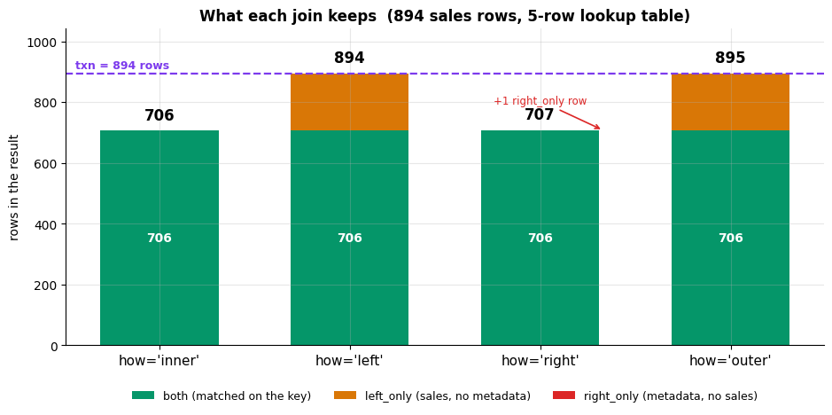

**Output**

```text
{'inner': 706, 'left': 894, 'right': 707, 'outer': 895}
```

### Cell 221

```python
# ============================================================
#  Part 8 needs exactly two things: a real datetime column and
#  a revenue column. Parts 4-5 built both. This cell picks up
#  whichever cleaned frame they left in memory; if you jumped
#  straight to Part 8, it redoes that cleaning in five lines so
#  this part still runs.
# ============================================================
src = None
for _name in ("tidy", "clean5", "sales5", "orders", "trans", "clean"):
    _f = globals().get(_name)
    if (isinstance(_f, pd.DataFrame) and "revenue" in _f.columns
            and "date" in _f.columns
            and pd.api.types.is_datetime64_any_dtype(_f["date"])):
        src, src_name = _f.copy(), _name
        break

if src is None:
    src_name = "sales (re-cleaned here)"
    src = sales.drop_duplicates().copy()
    src["date"] = pd.to_datetime(src["date"])
    src["unit_price"] = src["unit_price"].str.removeprefix("$").astype(float)
    src = src[src["quantity"].gt(0)]          # drops the NaNs and the -1s
    src["revenue"] = src["quantity"] * src["unit_price"]

# One row per day. THIS is the object the rest of Part 8 works on.
daily = src.groupby("date")["revenue"].sum().sort_index()
daily.name = "revenue"

print(f"source: {src_name}  ({len(src):,} orders)")
print(f"index type : {type(daily.index).__name__}")
print(f"index dtype: {daily.index.dtype}")
print(f"index freq : {daily.index.freq!r}      <- note: None, not 'D'")
print(f"span       : {daily.index.min():%Y-%m-%d} to {daily.index.max():%Y-%m-%d}")
print(f"rows       : {len(daily)}   calendar days in that span: "
      f"{(daily.index.max() - daily.index.min()).days + 1}")
daily.head()
```

**Output**

```text
source: tidy  (894 orders)
index type : DatetimeIndex
index dtype: datetime64[ns]
index freq : None      <- note: None, not 'D'
span       : 2024-01-01 to 2024-06-28
rows       : 179   calendar days in that span: 180
```

**Output**

```text
date
2024-01-01     72.50
2024-01-02    137.75
2024-01-03    103.75
2024-01-04     17.50
2024-01-05    125.25
Name: revenue, dtype: float64
```

### Cell 224

```python
march = daily.loc["2024-03"]                 # a whole month from a 7-character string
q1    = daily.loc["2024-02":"2024-04"]       # a range of months
oneday = daily.loc["2024-03-14"]             # exact key -> a scalar, not a Series

print(f"daily.loc['2024-03']           -> {len(march)} rows, "
      f"{march.index.min():%b %d} to {march.index.max():%b %d}")
print(f"daily.loc['2024-02':'2024-04'] -> {len(q1)} rows, "
      f"{q1.index.min():%b %d} to {q1.index.max():%b %d}")
print(f"daily.loc['2024-03-14']        -> {oneday!r}  ({type(oneday).__name__})")

# The endpoint is INCLUSIVE, and it is inclusive of the whole PERIOD.
# '2024-04' as a right endpoint means "through the end of April", not "April 1st".
print(f"\nlast row of the '2024-02':'2024-04' slice: {q1.index.max():%Y-%m-%d}")
print("...so the right endpoint pulled in all of April, not just April 1.")

# It works on DataFrames too -- the index is what matters, not the object.
frame = daily.to_frame()
frame["weekday"] = frame.index.day_name()
print("\nDataFrame, first week of March:")
frame.loc["2024-03-01":"2024-03-07"]
```

**Output**

```text
daily.loc['2024-03']           -> 30 rows, Mar 01 to Mar 31
daily.loc['2024-02':'2024-04'] -> 89 rows, Feb 01 to Apr 30
daily.loc['2024-03-14']        -> np.float64(84.5)  (float64)

last row of the '2024-02':'2024-04' slice: 2024-04-30
...so the right endpoint pulled in all of April, not just April 1.

DataFrame, first week of March:
```

**Output**

```text
            revenue    weekday
date                          
2024-03-01   131.50     Friday
2024-03-02   125.75   Saturday
2024-03-03    61.00     Sunday
2024-03-05   160.50    Tuesday
2024-03-06   193.00  Wednesday
2024-03-07    82.25   Thursday
```

### Cell 228

```python
import warnings
from pandas.tseries.frequencies import to_offset

CANDIDATES = ["D", "B", "W", "W-MON", "SM", "SME", "M", "ME", "MS",
              "Q", "QE", "QS", "Y", "YE", "YS", "A", "BM", "BME",
              "H", "h", "T", "min", "S", "s", "2W", "7D"]

verdicts = []
for a in CANDIDATES:
    try:
        with warnings.catch_warnings():
            warnings.simplefilter("error")     # a deprecation counts as a failure
            verdicts.append((a, "accepted", repr(to_offset(a))))
    except Exception as e:
        verdicts.append((a, "REJECTED", type(e).__name__))

alias_table = pd.DataFrame(verdicts, columns=["alias", "verdict", "meaning"])
print(f"pandas {pd.__version__} -- verified here, not remembered:\n")
print(alias_table.to_string(index=False))
print(f"\nrejected: {', '.join(alias_table.loc[alias_table.verdict.eq('REJECTED'), 'alias'])}")
```

**Output**

```text
pandas 2.2.3 -- verified here, not remembered:

alias  verdict                         meaning
    D accepted                           <Day>
    B accepted                   <BusinessDay>
    W accepted               <Week: weekday=6>
W-MON accepted               <Week: weekday=0>
   SM REJECTED                   FutureWarning
  SME accepted <SemiMonthEnd: day_of_month=15>
    M REJECTED                   FutureWarning
   ME accepted                      <MonthEnd>
   MS accepted                    <MonthBegin>
    Q REJECTED                   FutureWarning
   QE accepted  <QuarterEnd: startingMonth=12>
   QS accepted <QuarterBegin: startingMonth=1>
    Y REJECTED                   FutureWarning
   YE accepted             <YearEnd: month=12>
   YS accepted            <YearBegin: month=1>
    A REJECTED                   FutureWarning
   BM REJECTED                   FutureWarning
  BME accepted              <BusinessMonthEnd>
    H REJECTED                   FutureWarning
    h accepted                          <Hour>
    T REJECTED                   FutureWarning
  min accepted                        <Minute>
    S REJECTED                   FutureWarning
    s accepted                        <Second>
   2W accepted          <2 * Weeks: weekday=6>
   7D accepted                      <7 * Days>

rejected: SM, M, Q, Y, A, BM, H, T, S
```

### Cell 230

```python
# --- downsampling: the same series at three resolutions --------------------
weekly  = daily.resample("W").sum()      # W == W-SUN: weeks LABELLED by their Sunday
monthly = daily.resample("ME").sum()     # ME: month END   -> 2024-01-31
month_s = daily.resample("MS").sum()     # MS: month START -> 2024-01-01

print("resample('W').sum()  -- first 3 weeks")
print(weekly.head(3), "\n")
print("ME vs MS: identical numbers, different labels")
print(pd.DataFrame({"ME_label": monthly.index.date, "MS_label": month_s.index.date,
                    "revenue": monthly.values}).to_string(index=False), "\n")

# --- .agg(): several answers per bin --------------------------------------
print("resample('W').agg([...]) -- first 3 weeks")
print(daily.resample("W").agg(["sum", "mean", "count"]).head(3), "\n")

# --- closed / label: where the bin edge goes and how it gets named ---------
default   = daily.resample("W").sum()
left_edge = daily.resample("W", label="left", closed="left").sum()
print("default  (closed='right', label='right'):")
print(default.head(3))
print("\nlabel='left', closed='left':")
print(left_edge.head(3))
print("\nSame data, different bin boundaries -> different totals, and a first")
print("bin labelled with a date from BEFORE the data starts.")
```

**Output**

```text
resample('W').sum()  -- first 3 weeks
date
2024-01-07     775.25
2024-01-14    1009.50
2024-01-21     904.25
Freq: W-SUN, Name: revenue, dtype: float64 

ME vs MS: identical numbers, different labels
  ME_label   MS_label  revenue
2024-01-31 2024-01-01  4108.00
2024-02-29 2024-02-01  4066.75
2024-03-31 2024-03-01  4586.50
2024-04-30 2024-04-01  4691.75
2024-05-31 2024-05-01  3952.25
2024-06-30 2024-06-01  3462.00 

resample('W').agg([...]) -- first 3 weeks
                sum        mean  count
date                                  
2024-01-07   775.25  110.750000      7
2024-01-14  1009.50  144.214286      7
2024-01-21   904.25  129.178571      7 

default  (closed='right', label='right'):
date
2024-01-07     775.25
2024-01-14    1009.50
2024-01-21     904.25
Freq: W-SUN, Name: revenue, dtype: float64

label='left', closed='left':
date
2023-12-31     521.50
2024-01-07    1041.50
2024-01-14     909.25
Freq: W-SUN, Name: revenue, dtype: float64

Same data, different bin boundaries -> different totals, and a first
bin labelled with a date from BEFORE the data starts.
```

### Cell 232

```python
# ============================================================
#  Gaps are invisible. Proof, in two stages.
# ============================================================

# --- stage 1: is anything missing from the REAL data? ---------------------
full = daily.asfreq("D")          # reindex onto every calendar day, D by D
holes = full[full.isna()]

print(f"daily : {len(daily)} rows")
print(f"asfreq('D') : {len(full)} rows   -> {len(holes)} day(s) had no orders at all")
if len(holes):
    print("missing:", ", ".join(f"{d:%Y-%m-%d} ({d:%a})" for d in holes.index))
print("\nAround the gap, BEFORE asfreq -- the days just run into each other:")
print(daily.loc["2024-03-02":"2024-03-06"])
print("\nSame window AFTER asfreq -- now the hole has a row and a NaN:")
print(full.loc["2024-03-02":"2024-03-06"])

# --- stage 2: what a gap does to a SUM ------------------------------------
gap = pd.date_range("2024-04-08", "2024-04-11", freq="D")   # knock out 4 days
holed = daily.drop(gap)

audit = pd.DataFrame({
    "sum_true":  daily.resample("W").sum(),
    "sum_holed": holed.resample("W").sum(),
    "days":      holed.resample("W").count(),      # <- the tell
    "mean_true": daily.resample("W").mean(),
    "mean_holed": holed.resample("W").mean(),
}).loc["2024-04-01":"2024-04-21"].round(2)
print("\nWeekly rollup with four April days deleted:")
print(audit.to_string())

hit = audit["sum_holed"].idxmin()
print(f"\nweek ending {hit:%Y-%m-%d}: reported {audit.loc[hit, 'sum_holed']:,.2f} "
      f"against a true {audit.loc[hit, 'sum_true']:,.2f}")
print(f"  under-reported by {100 * (1 - audit.loc[hit,'sum_holed'] / audit.loc[hit,'sum_true']):.1f}%"
      f"  -- with no NaN, no warning, and a perfectly normal-looking number.")
print(f"  the mean for that week moved the OTHER way: "
      f"{audit.loc[hit,'mean_true']:.2f} -> {audit.loc[hit,'mean_holed']:.2f}")
```

**Output**

```text
daily : 179 rows
asfreq('D') : 180 rows   -> 1 day(s) had no orders at all
missing: 2024-03-04 (Mon)

Around the gap, BEFORE asfreq -- the days just run into each other:
date
2024-03-02    125.75
2024-03-03     61.00
2024-03-05    160.50
2024-03-06    193.00
Name: revenue, dtype: float64

Same window AFTER asfreq -- now the hole has a row and a NaN:
date
2024-03-02    125.75
2024-03-03     61.00
2024-03-04       NaN
2024-03-05    160.50
2024-03-06    193.00
Freq: D, Name: revenue, dtype: float64

Weekly rollup with four April days deleted:
            sum_true  sum_holed  days  mean_true  mean_holed
date                                                        
2024-04-07   1049.25    1049.25     7     149.89      149.89
2024-04-14   1062.25     606.25     3     151.75      202.08
2024-04-21   1154.25    1154.25     7     164.89      164.89

week ending 2024-04-14: reported 606.25 against a true 1,062.25
  under-reported by 42.9%  -- with no NaN, no warning, and a perfectly normal-looking number.
  the mean for that week moved the OTHER way: 151.75 -> 202.08
```

### Cell 235

```python
# ============================================================
#  Upsampling: one row becomes many, so something must fill them
# ============================================================
window = daily.loc["2024-03-01":"2024-03-05"]     # contains the real gap
up = window.resample("12h").asfreq()              # .asfreq() == "do not fill"

fills = pd.DataFrame({
    "raw":         up,
    "ffill":       up.ffill(),          # carry the last real value forward
    "bfill":       up.bfill(),          # pull the next real value back
    "interpolate": up.interpolate(),    # straight line between neighbours
    "limit=1":     up.ffill(limit=1),   # carry forward at most one step
})
print("Daily -> 12-hourly. Every second row is new and starts empty:\n")
print(fills.round(2).to_string())
print(f"\nNaNs before filling: {up.isna().sum()} of {len(up)}")
print("NaNs after each strategy:", fills.isna().sum().to_dict())
```

**Output**

```text
Daily -> 12-hourly. Every second row is new and starts empty:

                        raw   ffill   bfill  interpolate  limit=1
date                                                             
2024-03-01 00:00:00  131.50  131.50  131.50       131.50   131.50
2024-03-01 12:00:00     NaN  131.50  125.75       128.62   131.50
2024-03-02 00:00:00  125.75  125.75  125.75       125.75   125.75
2024-03-02 12:00:00     NaN  125.75   61.00        93.38   125.75
2024-03-03 00:00:00   61.00   61.00   61.00        61.00    61.00
2024-03-03 12:00:00     NaN   61.00  160.50        85.88    61.00
2024-03-04 00:00:00     NaN   61.00  160.50       110.75      NaN
2024-03-04 12:00:00     NaN   61.00  160.50       135.62      NaN
2024-03-05 00:00:00  160.50  160.50  160.50       160.50   160.50

NaNs before filling: 5 of 9
NaNs after each strategy: {'raw': 5, 'ffill': 0, 'bfill': 0, 'interpolate': 0, 'limit=1': 2}
```

### Cell 238

```python
roll7   = daily.rolling(7).mean()                    # default: needs all 7
roll7mp = daily.rolling(7, min_periods=1).mean()     # emit from row 1
roll7c  = daily.rolling(7, center=True).mean()       # stamp at window centre
expand  = daily.expanding().mean()                   # running mean from the start

print("First 8 days, four ways of smoothing:")
print(pd.DataFrame({"revenue": daily, "rolling(7)": roll7,
                    "min_periods=1": roll7mp, "center=True": roll7c,
                    "expanding()": expand}).head(8).round(2).to_string())

print(f"\nNaNs:  rolling(7)={roll7.isna().sum()}   "
      f"min_periods=1={roll7mp.isna().sum()}   center=True={roll7c.isna().sum()}")
print(f"first real value: rolling(7) at {roll7.first_valid_index():%Y-%m-%d}, "
      f"center=True at {roll7c.first_valid_index():%Y-%m-%d}")
print(f"center=True also loses the END: last real value "
      f"{roll7c.last_valid_index():%Y-%m-%d} vs {roll7.last_valid_index():%Y-%m-%d}")
print(f"\nexpanding().mean() converges to the overall mean: "
      f"{expand.iloc[-1]:.2f} == {daily.mean():.2f}")

# ---------------------------------------------------------------- FIGURE 1
fig, ax = plt.subplots(figsize=(11, 4.2))
ax.plot(daily.index, daily.values, color=C_SOFT, lw=1.1, zorder=1,
        label="daily revenue (raw)")
ax.plot(daily.index, daily.rolling(7).mean(), color=C_DATA, lw=2.4, zorder=3,
        label="7-day rolling mean")
ax.plot(daily.index, daily.expanding().mean(), color=C_GREY, lw=1.4, ls="--",
        zorder=2, label="expanding mean (running average)")
ax.axvspan(daily.index[0], roll7.first_valid_index(), color=C_NA, alpha=0.10,
           zorder=0)
ax.text(daily.index[1], ax.get_ylim()[1] * 0.94, " no rolling value here",
        color=C_NA, fontsize=8.5, va="top")
ax.set_title("Daily revenue is unreadable; the 7-day mean is the business",
             fontsize=12, weight="bold")
ax.set_ylabel(r"revenue (\$)")
ax.set_xlabel("")
ax.legend(loc="upper right", framealpha=0.9, fontsize=9)
plt.tight_layout(); plt.show()
```

**Output**

```text
First 8 days, four ways of smoothing:
            revenue  rolling(7)  min_periods=1  center=True  expanding()
date                                                                    
2024-01-01    72.50         NaN          72.50          NaN        72.50
2024-01-02   137.75         NaN         105.12          NaN       105.12
2024-01-03   103.75         NaN         104.67          NaN       104.67
2024-01-04    17.50         NaN          82.88       110.75        82.88
2024-01-05   125.25         NaN          91.35       114.89        91.35
2024-01-06    64.75         NaN          86.92       105.96        86.92
2024-01-07   253.75      110.75         110.75       117.79       110.75
2024-01-08   101.50      114.89         114.89       133.36       109.59

NaNs:  rolling(7)=6   min_periods=1=0   center=True=6
first real value: rolling(7) at 2024-01-07, center=True at 2024-01-04
center=True also loses the END: last real value 2024-06-25 vs 2024-06-28

expanding().mean() converges to the overall mean: 138.92 == 138.92
```

**Output**

```text
<Figure size 1100x420 with 1 Axes>
```

**Figure**

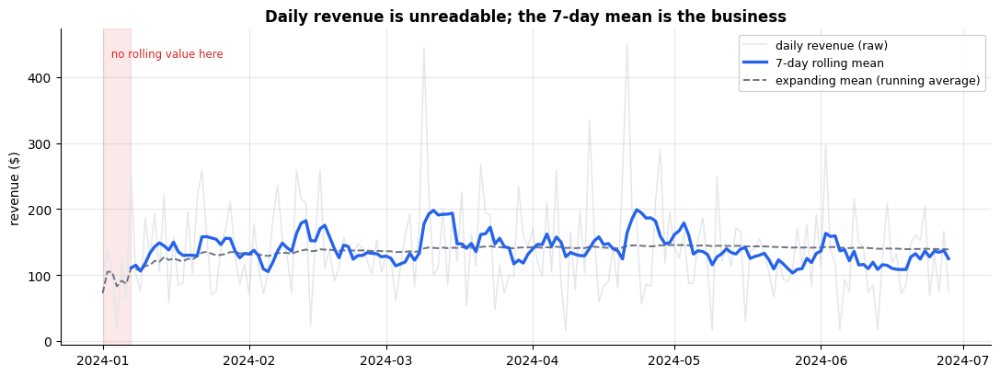

### Cell 242

```python
change = pd.DataFrame({
    "revenue":  daily,
    "prev_day": daily.shift(1),          # shift is the primitive...
    "dod":      daily.diff(1),           # ...and diff is s - s.shift(1)
    "dod_pct":  daily.pct_change(1),
    "wow":      daily.diff(7),           # same weekday, one week back
    "wow_pct":  daily.pct_change(7),
})
print("shift is the primitive -- diff(1) is exactly revenue - prev_day:")
print(change.head(4).round(2).to_string())
print("identical:", change["dod"].equals(change["revenue"] - change["prev_day"]))

# --- why shift(7) and not shift(1), measured -------------------------------
ORDER = ["Monday", "Tuesday", "Wednesday", "Thursday", "Friday",
         "Saturday", "Sunday"]
change["weekday"] = daily.index.day_name()
by_day = change.groupby("weekday")[["dod", "wow"]].mean().reindex(ORDER).round(2)
print("\nMean change, split by weekday:")
print(by_day.to_string())

print(f"\nspread (std) of those seven weekday means:"
      f"   diff(1) = {by_day['dod'].std():.2f}   diff(7) = {by_day['wow'].std():.2f}")
print(f"diff(1) carries {by_day['dod'].std() / by_day['wow'].std():.1f}x more "
      f"weekday structure than diff(7).")
print(f"worst offenders: {by_day['dod'].idxmin()} averages "
      f"{by_day['dod'].min():+.2f}, {by_day['dod'].idxmax()} averages "
      f"{by_day['dod'].max():+.2f} -- pure calendar, no business content.")
print(f"\nNote the noise floor is NOT much lower: std of the change itself is "
      f"{change['dod'].std():.2f} for diff(1) vs {change['wow'].std():.2f} for "
      f"diff(7).\nshift(7) removes the weekly BIAS, not the day-to-day variance.")
```

**Output**

```text
shift is the primitive -- diff(1) is exactly revenue - prev_day:
            revenue  prev_day    dod  dod_pct  wow  wow_pct
date                                                       
2024-01-01    72.50       NaN    NaN      NaN  NaN      NaN
2024-01-02   137.75     72.50  65.25     0.90  NaN      NaN
2024-01-03   103.75    137.75 -34.00    -0.25  NaN      NaN
2024-01-04    17.50    103.75 -86.25    -0.83  NaN      NaN
identical: True

Mean change, split by weekday:
             dod   wow
weekday               
Monday    -60.52  2.32
Tuesday    13.12 -0.96
Wednesday -17.62  0.87
Thursday   -3.25  4.01
Friday     39.16 -0.93
Saturday   11.05  3.41
Sunday     14.46 -4.73

spread (std) of those seven weekday means:   diff(1) = 31.67   diff(7) = 3.05
diff(1) carries 10.4x more weekday structure than diff(7).
worst offenders: Monday averages -60.52, Friday averages +39.16 -- pure calendar, no business content.

Note the noise floor is NOT much lower: std of the change itself is 94.52 for diff(1) vs 88.85 for diff(7).
shift(7) removes the weekly BIAS, not the day-to-day variance.
```

### Cell 245

```python
# The gotcha above, executed -- because the point is that it does NOT look wrong.
shuffled = daily.sample(frac=1, random_state=0)

print("index sorted?   daily:", daily.index.is_monotonic_increasing,
      "   shuffled:", shuffled.index.is_monotonic_increasing)
print("\nshuffled.diff().head(4) -- 'daily changes' across months:")
print(shuffled.diff().head(4).round(2).to_string())

print(f"\nmean |diff|   sorted: {daily.diff().abs().mean():.2f}"
      f"    shuffled: {shuffled.diff().abs().mean():.2f}")
print("Two summary numbers of the same magnitude. One is meaningful.")
print("\nAnd for contrast, the operations that DO defend themselves:")
print(f"  resample('W').sum() equal on both? "
      f"{daily.resample('W').sum().equals(shuffled.resample('W').sum())}")
print(f"  asfreq('D')         equal on both? "
      f"{daily.asfreq('D').equals(shuffled.asfreq('D'))}")
try:
    shuffled.loc["2024-02":"2024-04"]
except KeyError as e:
    print(f"  loc['2024-02':'2024-04'] on the shuffled index -> "
          f"KeyError: {str(e)[:72]}...")
```

**Output**

```text
index sorted?   daily: True    shuffled: False

shuffled.diff().head(4) -- 'daily changes' across months:
date
2024-05-18      NaN
2024-01-08    -39.5
2024-05-05    -13.5
2024-03-13    112.0

mean |diff|   sorted: 75.90    shuffled: 71.84
Two summary numbers of the same magnitude. One is meaningful.

And for contrast, the operations that DO defend themselves:
  resample('W').sum() equal on both? True
  asfreq('D')         equal on both? True
  loc['2024-02':'2024-04'] on the shuffled index -> KeyError: 'Value based partial slicing on non-monotonic DatetimeIndexes with non-e...
```

### Cell 247

```python
# ---------------------------------------------------------------- FIGURE 2
prof = daily.groupby(daily.index.dayofweek).mean()
prof.index = ["Mon", "Tue", "Wed", "Thu", "Fri", "Sat", "Sun"]
is_weekend = daily.index.dayofweek >= 5
we, wd = daily[is_weekend].mean(), daily[~is_weekend].mean()
lift = we / wd - 1

monthly = daily.resample("ME").sum()

fig, (ax1, ax2) = plt.subplots(1, 2, figsize=(12, 4.2))

bars = ax1.bar(prof.index, prof.values,
               color=[C_GROUP if d < 5 else C_DATA for d in range(7)])
ax1.axhline(wd, color=C_GROUP, ls="--", lw=1.3,
            label=rf"weekday mean \${wd:,.0f}")
ax1.axhline(we, color=C_DATA, ls="--", lw=1.3,
            label=rf"weekend mean \${we:,.0f}")
ax1.set_title(f"Weekends run {lift:+.0%} above weekdays", fontsize=11.5,
              weight="bold")
ax1.set_ylabel(r"mean daily revenue (\$)")
ax1.legend(fontsize=8.5, loc="upper left", framealpha=0.9)

ax2.bar([f"{d:%b}" for d in monthly.index], monthly.values, color=C_IDX)
for x, v in enumerate(monthly.values):
    ax2.text(x, v, rf"\${v:,.0f}", ha="center", va="bottom", fontsize=8.5)
ax2.set_title("resample('ME').sum() -- revenue by month", fontsize=11.5,
              weight="bold")
ax2.set_ylabel(r"total revenue (\$)")
ax2.set_ylim(0, monthly.max() * 1.15)

plt.tight_layout(); plt.show()

print(f"weekday mean {wd:,.2f}   weekend mean {we:,.2f}   "
      f"ratio {we / wd:.3f}  (lift {lift:+.1%})")
print(f"days: {(~is_weekend).sum()} weekday, {is_weekend.sum()} weekend")
print(f"\nmonth totals from resample('ME').sum():")
print(monthly.round(2).to_string())
counts = daily.resample("ME").count()
print("\ndays counted per month (watch for a short one):")
print("  " + "   ".join(f"{d:%b} {n}" for d, n in counts.items()))
```

**Output**

```text
<Figure size 1200x420 with 2 Axes>
```

**Figure**

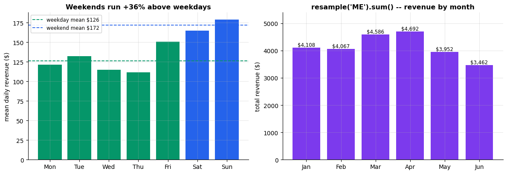

**Output**

```text
weekday mean 126.14   weekend mean 171.91   ratio 1.363  (lift +36.3%)
days: 129 weekday, 50 weekend

month totals from resample('ME').sum():
date
2024-01-31    4108.00
2024-02-29    4066.75
2024-03-31    4586.50
2024-04-30    4691.75
2024-05-31    3952.25
2024-06-30    3462.00
Freq: ME

days counted per month (watch for a short one):
  Jan 31   Feb 29   Mar 30   Apr 30   May 31   Jun 28
```

### Cell 249

```python
# ============================================================
#  Time zones: naive vs aware, in sixty seconds
# ============================================================
naive = daily.tail(3)
print(f"naive index tz: {naive.index.tz}      dtype: {naive.index.dtype}")

# tz_localize: ATTACH a zone. The clock times do not move.
la = naive.tz_localize("America/Los_Angeles")
print(f"\ntz_localize('America/Los_Angeles') -- same wall clock, now anchored:")
print(la.index)

# tz_convert: RE-EXPRESS the same instants in another zone. The instants
# do not move; the clock times do.
print(f"\ntz_convert('UTC') -- same instants, different clock:")
print(la.tz_convert("UTC").index)

# Using the wrong one of the two is an error, not a silent mistake:
for label, fn in [("tz_convert on a NAIVE index", lambda: naive.tz_convert("UTC")),
                  ("tz_localize on an AWARE index", lambda: la.tz_localize("UTC"))]:
    try:
        fn()
    except TypeError as e:
        print(f"\n{label}\n  -> TypeError: {e}")

# ...but a naive timestamp that does not exist IS a real-world bug:
try:
    pd.Series([1]).set_axis(pd.to_datetime(["2024-03-10 02:30"])) \
                  .tz_localize("America/Los_Angeles")
except Exception as e:
    print(f"\n2024-03-10 02:30 in Los Angeles\n  -> {type(e).__name__}: "
          f"{str(e)[:96]}...")
```

**Output**

```text
naive index tz: None      dtype: datetime64[ns]

tz_localize('America/Los_Angeles') -- same wall clock, now anchored:
DatetimeIndex(['2024-06-26 00:00:00-07:00', '2024-06-27 00:00:00-07:00',
               '2024-06-28 00:00:00-07:00'],
              dtype='datetime64[ns, America/Los_Angeles]', name='date', freq=None)

tz_convert('UTC') -- same instants, different clock:
DatetimeIndex(['2024-06-26 07:00:00+00:00', '2024-06-27 07:00:00+00:00',
               '2024-06-28 07:00:00+00:00'],
              dtype='datetime64[ns, UTC]', name='date', freq=None)

tz_convert on a NAIVE index
  -> TypeError: Cannot convert tz-naive timestamps, use tz_localize to localize

tz_localize on an AWARE index
  -> TypeError: Already tz-aware, use tz_convert to convert.

2024-03-10 02:30 in Los Angeles
  -> NonExistentTimeError: 2024-03-10 02:30:00...
```

### Cell 254

```python
import time, tempfile, os

# The whole chart. No matplotlib call of our own except plt.show().
p9_weekly = tidy.set_index("date")["revenue"].resample("W").sum()

ax = p9_weekly.plot(color=C_DATA, lw=2, title="Weekly revenue, all stores")
ax.set_xlabel("week ending")
ax.set_ylabel("revenue (USD)")
plt.show()

print(f"{len(p9_weekly)} weekly buckets, "
      f"{p9_weekly.index.min().date()} to {p9_weekly.index.max().date()}")
print(f"last bucket covers "
      f"{(tidy['date'].max() - p9_weekly.index[-2]).days} days of data, "
      f"not 7")
```

**Output**

```text
<Figure size 900x400 with 1 Axes>
```

**Figure**

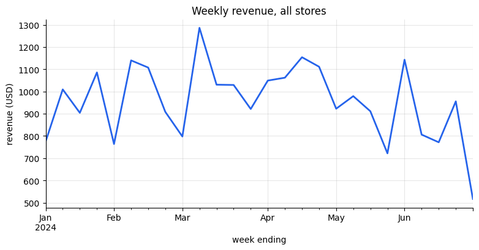

**Output**

```text
26 weekly buckets, 2024-01-07 to 2024-06-30
last bucket covers 5 days of data, not 7
```

### Cell 256

```python
# ---- one figure, eight kinds -----------------------------------------------
p9_by_product = tidy.groupby("product")["revenue"].sum().sort_values()
p9_monthly    = tidy.pivot_table(index=pd.Grouper(key="date", freq="ME"),
                                 columns="category", values="revenue",
                                 aggfunc="sum")
p9_monthly.index = p9_monthly.index.strftime("%b")     # short month labels

fig, axes = plt.subplots(2, 4, figsize=(16, 7))

p9_by_product.plot(kind="bar",  ax=axes[0, 0], color=C_DATA,  title="kind='bar'")
p9_by_product.plot(kind="barh", ax=axes[0, 1], color=C_GROUP, title="kind='barh'")
tidy["revenue"].plot(kind="hist", bins=30, ax=axes[0, 2], color=C_IDX,
                     title="kind='hist'")
tidy[["quantity", "rating"]].plot(kind="box", ax=axes[0, 3], title="kind='box'")

tidy.plot(kind="scatter", x="quantity", y="revenue", alpha=0.25, s=14,
          color=C_DATA, ax=axes[1, 0], title="kind='scatter'")
p9_monthly.plot(kind="area", alpha=0.6, ax=axes[1, 1], title="kind='area'")
p9_monthly.plot(kind="bar", stacked=True, ax=axes[1, 2],
                title="kind='bar', stacked=True")
p9_by_product.plot(kind="pie", ax=axes[1, 3], autopct="%1.0f%%",
                   ylabel="", title="kind='pie'")
axes[1, 3].grid(False)

for ax in axes.flat:
    ax.title.set_fontsize(10)
    if ax.get_legend() is not None:
        ax.legend(fontsize=7)
plt.tight_layout()
plt.show()
```

**Output**

```text
/tmp/ipykernel_703/4170237732.py:3: FutureWarning: The default value of observed=False is deprecated and will change to observed=True in a future version of pandas. Specify observed=False to silence this warning and retain the current behavior
  p9_monthly    = tidy.pivot_table(index=pd.Grouper(key="date", freq="ME"),
```

**Output**

```text
<Figure size 1600x700 with 8 Axes>
```

**Figure**

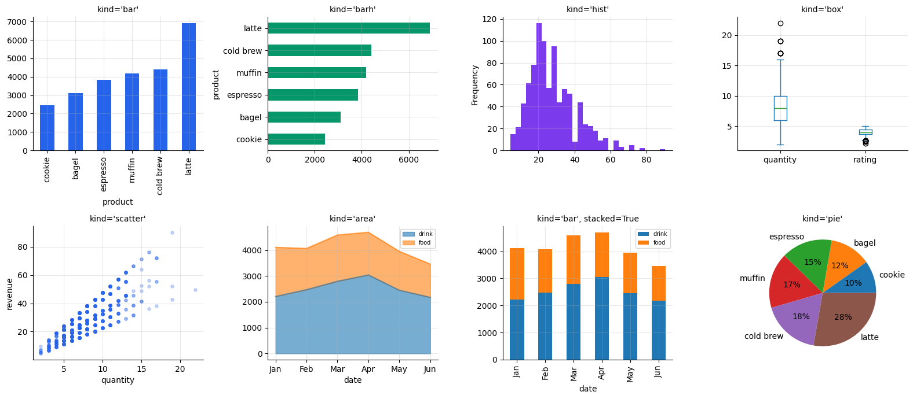

### Cell 259

```python
# ---- three keywords that save you from writing matplotlib -------------------
p9_by_month = (tidy.set_index("date")
                   .resample("ME")
                   .agg(revenue=("revenue", "sum"), rating=("rating", "mean")))

fig = plt.figure(figsize=(15, 4))

# (a) subplots=True -- one panel per column, shared x-axis, no loop
ax_a = [fig.add_subplot(2, 3, 1), fig.add_subplot(2, 3, 4)]
p9_monthly[["drink", "food"]].plot(subplots=True, ax=ax_a, legend=True,
                                   color=[C_DATA, C_GROUP])
ax_a[0].set_title("subplots=True", fontsize=10)

# (b) secondary_y -- two columns, incompatible units, one panel
ax_b = fig.add_subplot(1, 3, 2)
p9_by_month.plot(secondary_y="rating", ax=ax_b, color=[C_DATA, C_NA],
                 title="secondary_y='rating'")
ax_b.set_ylabel("revenue (USD)")

# (c) .plot() straight off a groupby result
ax_c = fig.add_subplot(1, 3, 3)
(tidy.groupby("region")["revenue"].sum().sort_values()
     .plot(kind="barh", ax=ax_c, color=C_GROUP,
           title="groupby(...).sum().plot(kind='barh')"))
ax_c.set_xlabel("revenue (USD)")

plt.tight_layout()
plt.show()

print("monthly revenue and mean rating, the two lines in the middle panel:")
print(p9_by_month.round(2))
```

**Output**

```text
/tmp/ipykernel_703/1932509731.py:22: FutureWarning: The default of observed=False is deprecated and will be changed to True in a future version of pandas. Pass observed=False to retain current behavior or observed=True to adopt the future default and silence this warning.
  (tidy.groupby("region")["revenue"].sum().sort_values()
```

**Output**

```text
<Figure size 1500x400 with 5 Axes>
```

**Figure**

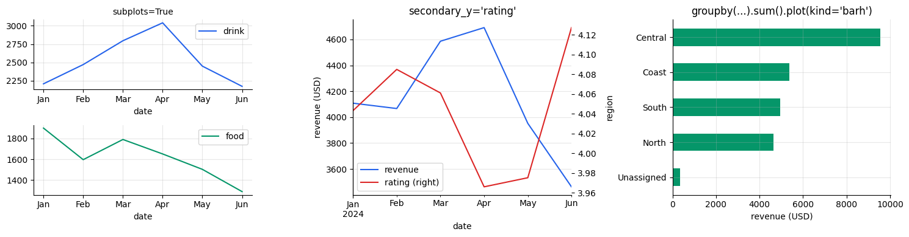

**Output**

```text
monthly revenue and mean rating, the two lines in the middle panel:
            revenue  rating
date                       
2024-01-31  4108.00    4.04
2024-02-29  4066.75    4.08
2024-03-31  4586.50    4.06
2024-04-30  4691.75    3.97
2024-05-31  3952.25    3.98
2024-06-30  3462.00    4.13
```

### Cell 261

```python
# ---- looking at every numeric column at once --------------------------------
p9_num  = tidy[["quantity", "unit_price", "rating", "revenue"]]
p9_corr = p9_num.corr()

fig, ax = plt.subplots(figsize=(5.5, 4.5))
im = ax.imshow(p9_corr, cmap="RdBu_r", vmin=-1, vmax=1)
ax.set_xticks(range(len(p9_corr)), p9_corr.columns, rotation=45, ha="right")
ax.set_yticks(range(len(p9_corr)), p9_corr.index)
for i in range(len(p9_corr)):
    for j in range(len(p9_corr)):
        v = p9_corr.iat[i, j]
        ax.text(j, i, f"{v:.2f}", ha="center", va="center", fontsize=9,
                color="white" if abs(v) > 0.6 else "black")
ax.set_title("tidy[numeric].corr(), as a heatmap")
ax.grid(False)
fig.colorbar(im, ax=ax, shrink=0.82)
plt.tight_layout()
plt.show()

# scatter_matrix builds its own grid of axes, so it gets its own figure
sm = pd.plotting.scatter_matrix(p9_num, figsize=(9, 9), diagonal="hist",
                                alpha=0.25, s=8, color=C_DATA)
for a in sm.flat:
    a.xaxis.label.set_size(8)
    a.yaxis.label.set_size(8)
plt.suptitle("pd.plotting.scatter_matrix(tidy[numeric])", y=0.92)
plt.show()

print(p9_corr.round(3))
```

**Output**

```text
<Figure size 550x450 with 2 Axes>
```

**Figure**

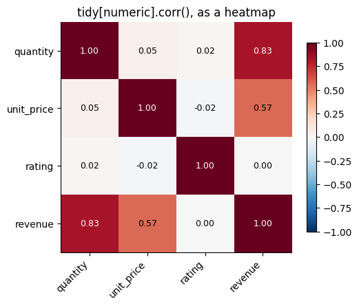

**Output**

```text
<Figure size 900x900 with 16 Axes>
```

**Figure**

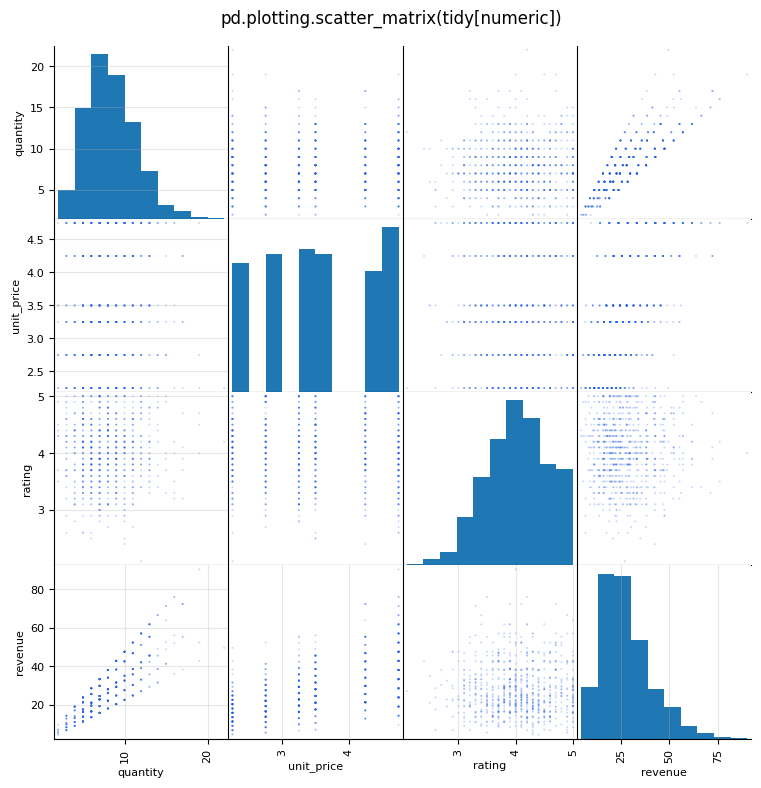

**Output**

```text
            quantity  unit_price  rating  revenue
quantity       1.000       0.053   0.016    0.826
unit_price     0.053       1.000  -0.018    0.568
rating         0.016      -0.018   1.000    0.004
revenue        0.826       0.568   0.004    1.000
```

### Cell 264

```python
# ---- where do the bytes actually go? ---------------------------------------
p9_text = ["store", "region", "product", "category"]

# the SAME frame, with its four text columns stored three different ways
p9_layouts = {
    "object   (pandas <=2 default)": sales.astype({c: object     for c in p9_text}),
    "str      (pandas 3 default)":   sales,
    "category (what you should do)": sales.astype({c: "category" for c in p9_text}),
}

rows = []
for name, df in p9_layouts.items():
    sh, dp = df.memory_usage(deep=False), df.memory_usage(deep=True)
    rows.append({"layout": name,
                 "shallow KB":    sh.sum() / 1024,
                 "deep KB":       dp.sum() / 1024,
                 "deep/shallow":  dp.sum() / sh.sum(),
                 "text cols, KB": dp[p9_text].sum() / 1024})
p9_mem = pd.DataFrame(rows).set_index("layout").round(2)
print(p9_mem.to_string())

obj_txt = p9_layouts["object   (pandas <=2 default)"].memory_usage(deep=True)[p9_text].sum()
cat_txt = p9_layouts["category (what you should do)"].memory_usage(deep=True)[p9_text].sum()
print(f"\nthe four text columns alone: {obj_txt/1024:.1f} KB as object "
      f"-> {cat_txt/1024:.1f} KB as category  ({obj_txt/cat_txt:.1f}x smaller)")
print("they hold this many distinct values each:")
print("   " + ",  ".join(f"{c}={sales[c].nunique()}" for c in p9_text))

print(f"\ndtype of sales['store'] on THIS pandas: {sales['store'].dtype}")
```

**Output**

```text
                               shallow KB  deep KB  deep/shallow  text cols, KB
layout                                                                         
object   (pandas <=2 default)       64.39   359.29          5.58         237.03
str      (pandas 3 default)         64.39   359.29          5.58         237.03
category (what you should do)       40.48   128.49          3.17           6.23

the four text columns alone: 237.0 KB as object -> 6.2 KB as category  (38.1x smaller)
they hold this many distinct values each:
   store=10,  region=4,  product=12,  category=2

dtype of sales['store'] on THIS pandas: object
```

### Cell 266

```python
# ============================================================================
#  Vectorised vs .apply(axis=1) vs .iterrows(), on a ROW-WISE CONDITIONAL.
#  Part 5 timed single-column arithmetic -- the easy case, and the one every
#  tutorial uses. This is the case people genuinely reach for a loop on: a
#  business rule that reads two columns at once and branches.
#
#  The rule: 15% off bulk drink orders; else 10% if the customer rated us
#  4.5 or better; else nothing.
# ============================================================================
def discount_vectorised(df):
    return np.select(
        [(df["category"] == "drink") & (df["quantity"] >= 8),
         df["rating"] >= 4.5],
        [0.15, 0.10],
        default=0.0)

def discount_apply(df):
    def rule(row):
        if row["category"] == "drink" and row["quantity"] >= 8:
            return 0.15
        return 0.10 if row["rating"] >= 4.5 else 0.0
    return df.apply(rule, axis=1).to_numpy()

def discount_iterrows(df):
    out = []
    for _, row in df.iterrows():
        if row["category"] == "drink" and row["quantity"] >= 8:
            out.append(0.15)
        elif row["rating"] >= 4.5:
            out.append(0.10)
        else:
            out.append(0.0)
    return np.array(out)

def p9_timeit(fn, df, repeats):
    fn(df)                                  # warm up; never time the first call
    t0 = time.perf_counter()
    for _ in range(repeats):
        result = fn(df)
    return (time.perf_counter() - t0) / repeats, result

t9_vec, r9_vec = p9_timeit(discount_vectorised, tidy, 30)
t9_app, r9_app = p9_timeit(discount_apply,      tidy, 5)
t9_itr, r9_itr = p9_timeit(discount_iterrows,   tidy, 5)

# If the three do not agree, the benchmark is meaningless.
assert np.allclose(r9_vec, r9_app, equal_nan=True), "apply disagrees"
assert np.allclose(r9_vec, r9_itr, equal_nan=True), "iterrows disagrees"

print(f"{len(tidy)} rows; all three produce identical output\n")
for name, t in [("np.select  (vectorised)", t9_vec),
                (".apply(axis=1)",          t9_app),
                (".iterrows() loop",        t9_itr)]:
    print(f"  {name:<24} {t*1e3:8.3f} ms")
print()
print(f"  vectorised vs .apply(axis=1) : {t9_app/t9_vec:6.1f}x faster")
print(f"  vectorised vs .iterrows()    : {t9_itr/t9_vec:6.1f}x faster")
print(f"\nper row: the loop costs {t9_itr/len(tidy)*1e6:6.2f} microseconds, "
      f"np.select costs {t9_vec/len(tidy)*1e6:.3f}")
```

**Output**

```text
894 rows; all three produce identical output

  np.select  (vectorised)     0.439 ms
  .apply(axis=1)              9.614 ms
  .iterrows() loop           48.439 ms

  vectorised vs .apply(axis=1) :   21.9x faster
  vectorised vs .iterrows()    :  110.2x faster

per row: the loop costs  54.18 microseconds, np.select costs 0.492
```

### Cell 269

```python
# ---- df.eval() and df.query(): worth it at size, and only sometimes --------
try:
    import numexpr
    ENGINE, HAVE_NE = f"numexpr {numexpr.__version__} IS installed", True
except ImportError:
    ENGINE, HAVE_NE = "numexpr is NOT installed on this runtime", False

# eval/query pay off by not materialising temporary arrays, so the frame has
# to be big enough for temporaries to cost something. Three columns is all
# the expressions touch, so we tile only those.
p9_big = pd.concat([tidy[["quantity", "unit_price", "rating"]]] * 400,
                   ignore_index=True)
print(f"{ENGINE}\nbenchmark frame: {len(p9_big):,} rows x 3 columns\n")

EXPR = "quantity * unit_price * 1.0825 - rating * 0.1"
QRY  = "quantity > 5 and unit_price > 3.0 and rating > 4.0"

def plain_arith(df):
    return df["quantity"] * df["unit_price"] * 1.0825 - df["rating"] * 0.1
def eval_arith(df):
    return df.eval(EXPR)
def plain_mask(df):
    return df[(df["quantity"] > 5) & (df["unit_price"] > 3.0) & (df["rating"] > 4.0)]
def query_mask(df):
    return df.query(QRY)

t9_pa, _ = p9_timeit(plain_arith, p9_big, 5)
t9_ea, _ = p9_timeit(eval_arith,  p9_big, 5)
t9_pm, _ = p9_timeit(plain_mask,  p9_big, 5)
t9_qm, _ = p9_timeit(query_mask,  p9_big, 5)

print(f"  {'arithmetic, 3 temporaries':<28} {t9_pa*1e3:8.2f} ms")
print(f"  {'  the same via .eval()':<28} {t9_ea*1e3:8.2f} ms"
      f"   -> {t9_pa/t9_ea:5.2f}x")
print(f"  {'3-condition boolean mask':<28} {t9_pm*1e3:8.2f} ms")
print(f"  {'  the same via .query()':<28} {t9_qm*1e3:8.2f} ms"
      f"   -> {t9_pm/t9_qm:5.2f}x")

speedup = t9_pa / t9_ea
verdict = ("FASTER" if speedup > 1.05 else
           "no faster" if speedup > 0.95 else "SLOWER")
print(f"\nVERDICT on THIS runtime: .eval() is {verdict} than plain arithmetic "
      f"({speedup:.2f}x).")
if HAVE_NE:
    print("  numexpr fuses the whole expression into one pass over the data and")
    print("  never builds the intermediate arrays. The gain grows with the frame")
    print("  and with the number of operations in the expression.")
else:
    print("  With numexpr absent, .eval() parses the string in Python and then")
    print("  performs the same operations you would have written by hand -- so")
    print("  it can only lose. Colab ships numexpr; a bare venv may not.")
print("\nEither way: reach for .query() for READABILITY first, speed second.")

del p9_big
```

**Output**

```text
numexpr 2.14.2 IS installed
benchmark frame: 357,600 rows x 3 columns

  arithmetic, 3 temporaries        2.78 ms
    the same via .eval()           5.55 ms   ->  0.50x
  3-condition boolean mask         3.41 ms
    the same via .query()          7.98 ms   ->  0.43x

VERDICT on THIS runtime: .eval() is SLOWER than plain arithmetic (0.50x).
  numexpr fuses the whole expression into one pass over the data and
  never builds the intermediate arrays. The gain grows with the frame
  and with the number of operations in the expression.

Either way: reach for .query() for READABILITY first, speed second.
```

### Cell 271

```python
# ---- chunksize: processing a file that does not fit in memory --------------
p9_cols = ["date", "store", "region", "product", "category",
           "quantity", "unit_price", "rating", "revenue"]

with tempfile.TemporaryDirectory() as tmpdir:
    p9_path = os.path.join(tmpdir, "orders.csv")
    pd.concat([tidy[p9_cols]] * 120, ignore_index=True).to_csv(p9_path, index=False)
    print(f"wrote orders.csv: {os.path.getsize(p9_path)/1e6:.1f} MB on disk\n")

    # (a) the way that needs the whole file resident at once
    whole = pd.read_csv(p9_path, parse_dates=["date"])
    whole_mb = whole.memory_usage(deep=True).sum() / 1e6
    whole_total = whole["revenue"].sum()
    print(f"{'whole file':<11}: {len(whole):>8,} rows | {whole_mb:6.1f} MB "
          f"resident | revenue {whole_total:,.2f}")
    del whole

    # (b) the way that never holds more than one chunk
    running, n_rows, n_chunks, peak_mb = 0.0, 0, 0, 0.0
    by_region = pd.Series(dtype="float64")
    for chunk in pd.read_csv(p9_path, chunksize=5_000, parse_dates=["date"]):
        running  += chunk["revenue"].sum()
        n_rows   += len(chunk)
        n_chunks += 1
        peak_mb   = max(peak_mb, chunk.memory_usage(deep=True).sum() / 1e6)
        # partial aggregates combine because sum is ASSOCIATIVE
        by_region = by_region.add(chunk.groupby("region")["revenue"].sum(),
                                  fill_value=0.0)
    print(f"{f'{n_chunks} chunks':<11}: {n_rows:>8,} rows | {peak_mb:6.1f} MB "
          f"resident | revenue {running:,.2f}")

    print(f"\nidentical answer: {np.isclose(running, whole_total)}"
          f"   |   peak memory cut to {peak_mb/whole_mb:.0%} of the full read")
    print("\nregion totals, accumulated one chunk at a time:")
    print(by_region.round(2).to_string())

# TemporaryDirectory deletes the file on the way out of the with-block.
print(f"\ntemp file still on disk? {os.path.exists(p9_path)}")
```

**Output**

```text
wrote orders.csv: 6.0 MB on disk

whole file :  107,280 rows |   28.0 MB resident | revenue 2,984,070.00
22 chunks  :  107,280 rows |    1.3 MB resident | revenue 2,984,070.00

identical answer: True   |   peak memory cut to 5% of the full read

region totals, accumulated one chunk at a time:
region
Central       1147590.0
Coast          645360.0
North          556920.0
South          593520.0
Unassigned      40680.0

temp file still on disk? False
```

### Cell 275

```python
# ============================================================================
#  RAW  ->  ANSWER, in a single expression.
#  Weekend revenue mix by region: what share of each region's weekend money
#  does each product bring in?
# ============================================================================
weekend_mix = (
    sales                                                   # the raw frame, untouched
    .drop_duplicates()                                      # 1. the double-scanned batch
    .assign(                                                # 2. the dtypes that arrived wrong
        date       = lambda d: pd.to_datetime(d["date"], format="%Y-%m-%d"),
        unit_price = lambda d: d["unit_price"].str.removeprefix("$").astype("float64"),
        store      = lambda d: d["store"].str.strip().str.title(),
        product    = lambda d: d["product"].str.strip().str.lower(),
    )
    .assign(                                                # 3. a missing region is knowable
        region = lambda d: d["region"].fillna(d["store"].map(REGIONS)),
    )
    .loc[lambda d: d["quantity"] > 0]                       # 4. drops the -1s AND the NaNs
    .assign(                                                # 5. the two derived columns
        revenue = lambda d: d["quantity"] * d["unit_price"],
        weekend = lambda d: d["date"].dt.dayofweek >= 5,
    )
    .loc[lambda d: d["weekend"]]                            # 6. the question said weekends
    .groupby(["region", "product"])["revenue"].sum()        # 7. split - apply - combine
    .unstack("product")                                     # 8. long -> wide
    .fillna(0.0)                                            # 9. a pair that never sold
    .pipe(lambda w: w.div(w.sum(axis=1), axis=0) * 100)     # 10. row-wise share, in %
    .round(1)
)

print("weekend revenue mix -- % of each region's weekend revenue\n")
print(weekend_mix.to_string())

winner = weekend_mix.idxmax(axis=1)
print("\nthe answer the manager asked for:")
for region, product in winner.items():
    print(f"   {region:<9} -> {product:<10} "
          f"{weekend_mix.loc[region, product]:5.1f}% of weekend revenue")

print(f"\n{len(sales)} raw rows in, {weekend_mix.size} numbers out, "
      f"and every row sums to {weekend_mix.sum(axis=1).round(0).unique()}")
```

**Output**

```text
weekend revenue mix -- % of each region's weekend revenue

product  bagel  cold brew  cookie  espresso  latte  muffin
region                                                    
Central   10.3       24.3    14.6      12.2   21.6    16.9
Coast      9.7       13.0    13.5      15.0   30.6    18.2
North     11.9       17.8     7.5      10.4   42.4    10.0
South     21.5       12.3     5.2      13.1   24.2    23.6

the answer the manager asked for:
   Central   -> cold brew   24.3% of weekend revenue
   Coast     -> latte       30.6% of weekend revenue
   North     -> latte       42.4% of weekend revenue
   South     -> latte       24.2% of weekend revenue

914 raw rows in, 24 numbers out, and every row sums to [100.]
```

### Cell 277

```python
# ---- the same answer, as the figure you would actually put in the deck ------
fig, ax = plt.subplots(figsize=(10, 4.2))

p9_vals = weekend_mix.to_numpy()
p9_hi   = p9_vals.max()
im = ax.imshow(p9_vals, cmap="Greens", aspect="auto", vmin=0, vmax=p9_hi)

ax.set_xticks(range(weekend_mix.shape[1]), weekend_mix.columns)
ax.set_yticks(range(weekend_mix.shape[0]), weekend_mix.index)
ax.grid(False)

for i, region in enumerate(weekend_mix.index):
    for j, product in enumerate(weekend_mix.columns):
        v = weekend_mix.iat[i, j]
        ax.text(j, i, f"{v:.0f}", ha="center", va="center", fontsize=11,
                color="white" if v > 0.6 * p9_hi else "#111827",
                weight="bold" if product == winner[region] else "normal")
    j = list(weekend_mix.columns).index(winner[region])          # ring the leader
    ax.add_patch(plt.Rectangle((j - 0.5, i - 0.5), 1, 1, fill=False,
                               edgecolor=C_NA, lw=2.5))

ax.set_title("Weekend revenue mix by region\n"
             "share of each region's own weekend revenue, %",
             loc="left", fontsize=13, weight="bold")
fig.colorbar(im, ax=ax, shrink=0.85, label="% of that region's weekend revenue")
fig.text(0.01, -0.05,
         f"n = {len(sales)} raw orders. Duplicate rows and non-positive "
         f"quantities removed; Saturday and Sunday only. Rows sum to 100%.",
         fontsize=8, color=C_GREY)
plt.tight_layout()
plt.show()
```

**Output**

```text
<Figure size 1000x420 with 2 Axes>
```

**Figure**

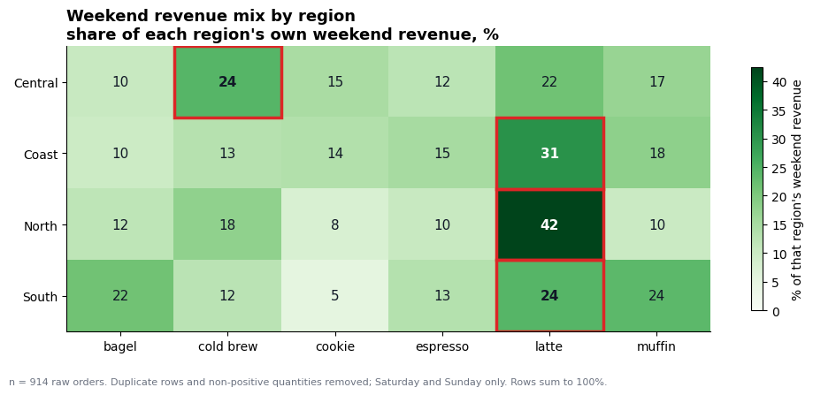

