# 04 — Introduction to Matplotlib

**Status:** Executed successfully

## Code and Output

### Cell 3

```python
# ============================================================
#  Setup -- no installs, no downloads, no network.
# ============================================================
import numpy as np
import matplotlib
import matplotlib.pyplot as plt

# Deliberately DO NOT set a style yet. Part 0 shows what the raw default
# looks like, because knowing what matplotlib gives you for free is how you
# learn what every later part is actually changing.
plt.rcParams.update(plt.rcParamsDefault)

C_LINE, C_ALT, C_OK = "#2563EB", "#DC2626", "#059669"
C_WARN, C_ACC, C_GREY, C_SOFT = "#D97706", "#7C3AED", "#6B7280", "#E5E7EB"

print(f"matplotlib {matplotlib.__version__}   numpy {np.__version__}")
print(f"backend: {matplotlib.get_backend()}")
```

**Output**

```text
matplotlib 3.10.0   numpy 2.1.3
backend: module://matplotlib_inline.backend_inline
```

### Cell 5

```python
# ============================================================
#  The data -- generated, so the notebook works offline forever.
#  A year of daily readings from four weather stations, plus a
#  small table of station facts. Small enough to print, real
#  enough to have trend, seasonality, noise, outliers and gaps.
# ============================================================
import numpy as np
import pandas as pd

RNG = np.random.default_rng(11)

days = pd.date_range("2024-01-01", periods=365, freq="D")
t = np.arange(365)

STATIONS = {                       # name: (base temp, seasonal swing, noise)
    "Coastal":  (14.0,  5.0, 1.2),
    "Valley":   (17.0, 12.0, 2.1),
    "Foothill": (11.5,  9.0, 1.8),
    "Alpine":   ( 2.0, 11.0, 2.6),
}

frames = []
for name, (base, swing, noise) in STATIONS.items():
    seasonal = swing * np.sin(2 * np.pi * (t - 100) / 365)
    warming  = 0.0025 * t                      # a small real trend
    temp = base + seasonal + warming + RNG.normal(0, noise, 365)
    rain = np.clip(RNG.gamma(0.6, 4.0, 365) * (1.6 - 0.9 * np.sin(
        2 * np.pi * (t - 100) / 365)), 0, None)
    frames.append(pd.DataFrame({"date": days, "station": name,
                                "temp_c": temp, "rain_mm": rain}))

weather = pd.concat(frames, ignore_index=True)

# a few sensor faults: three short gaps and two impossible spikes
for st, lo, hi in [("Valley", 120, 127), ("Alpine", 300, 309), ("Coastal", 40, 44)]:
    m = (weather.station == st) & weather.date.between(days[lo], days[hi])
    weather.loc[m, "temp_c"] = np.nan
weather.loc[(weather.station == "Foothill") & (weather.date == days[200]), "temp_c"] = 61.0
weather.loc[(weather.station == "Valley")   & (weather.date == days[88]),  "temp_c"] = -40.0

stations = pd.DataFrame({
    "station":   list(STATIONS),
    "elevation": [12, 95, 640, 2310],
    "lat":       [36.6, 36.7, 37.2, 37.6],
    "sensors":   [3, 5, 2, 2],
})

wide = weather.pivot_table(index="date", columns="station", values="temp_c")

print(f"weather : {weather.shape[0]:,} rows x {weather.shape[1]} cols")
print(f"wide    : {wide.shape[0]} days x {wide.shape[1]} stations")
print(f"missing : {weather.temp_c.isna().sum()} temperature readings")
wide.head()
```

**Output**

```text
weather : 1,460 rows x 4 cols
wide    : 365 days x 4 stations
missing : 23 temperature readings
```

**Output**

```text
station        Alpine    Coastal  Foothill    Valley
date                                                
2024-01-01  -8.963958   9.097643  1.525386  8.704761
2024-01-02  -9.475561  10.678627  6.192734  3.988893
2024-01-03  -7.755356  10.508381  2.725038  9.156020
2024-01-04  -6.752090   8.419605  3.060991  6.198953
2024-01-05 -12.949968   8.669142  0.537412  6.003171
```

### Cell 8

```python
# The default. No colours chosen, no labels, no limits, nothing.
fig, ax = plt.subplots()
ax.plot(wide.index, wide.values)
plt.show()

print("What matplotlib chose for you, without being asked:")
print(f"  figure size   : {fig.get_size_inches()}  inches")
print(f"  dpi           : {fig.get_dpi()}")
print(f"  y-axis limits : {ax.get_ylim()}")
print(f"  colours       : {[l.get_color() for l in ax.get_lines()]}")
print(f"  line width    : {ax.get_lines()[0].get_linewidth()}")
print()
print("Every one of those is a decision. You made none of them.")
```

**Output**

```text
<Figure size 640x480 with 1 Axes>
```

**Figure**


**Output**

```text
What matplotlib chose for you, without being asked:
  figure size   : [6.4 4.8]  inches
  dpi           : 100.0
  y-axis limits : (np.float64(-45.05), np.float64(66.05))
  colours       : ['#1f77b4', '#ff7f0e', '#2ca02c', '#d62728']
  line width    : 1.5

Every one of those is a decision. You made none of them.
```

### Cell 13

```python
from matplotlib.patches import Rectangle

sub = wide["Valley"].iloc[:60]          # one clean stretch, no sensor gap
day = np.arange(len(sub))

fig = plt.figure(figsize=(11.5, 7.0))
fig.patch.set_facecolor("white")

# Draw the Figure's own rectangle so you can see where it ends.
fig.add_artist(Rectangle((0.006, 0.006), 0.988, 0.988, transform=fig.transFigure,
                         fill=False, ec=C_ACC, lw=2.5, ls="--", zorder=0))

# add_axes puts the Axes at an explicit [left, bottom, width, height] in
# figure coordinates, which leaves us wide margins to write in.
ax = fig.add_axes([0.20, 0.18, 0.55, 0.62])
line, = ax.plot(day, sub.values, color=C_LINE, lw=2.0)
ax.set_title("Valley station, first 60 days", fontsize=13)
ax.set_xlabel("day of year")
ax.set_ylabel("temperature (°C)")


def tag(text, xy, xycoords, xytext, rad=0.2):
    """Point an arrow at one part of the figure and name it."""
    ax.annotate(text, xy=xy, xycoords=xycoords,
                xytext=xytext, textcoords="figure fraction",
                ha="left", va="center", fontsize=10, fontweight="bold",
                color=C_ALT,
                arrowprops=dict(arrowstyle="->", lw=1.5, color=C_ALT,
                                connectionstyle="arc3,rad=%s" % rad))


tag("Axes\n(one plotting box)",         (1.00,  1.00), "axes fraction",   (0.785, 0.905), rad=-0.25)
tag("Line2D artist\n(what ax.plot returned)", (38, sub.values[38]), "data", (0.785, 0.605))
tag("spine\n(one of four box edges)",   (1.00,  0.28), "axes fraction",   (0.785, 0.295), rad=-0.20)
tag("title\n(a Text artist)",           (0.30,  1.02), "axes fraction",   (0.115, 0.925), rad=0.25)
tag("y Axis: ticks, tick\nlabels, scale, limits", (0.00, 0.62), "axes fraction", (0.015, 0.735), rad=-0.25)
tag("axis label\n(also a Text artist)", (0.157, 0.49), "figure fraction", (0.015, 0.345), rad=0.25)
tag("x Axis: the same,\nalong the bottom", (0.42, 0.00), "axes fraction", (0.225, 0.080), rad=0.25)
tag("a tick and\nits tick label",       (0.78, -0.045), "axes fraction",  (0.575, 0.105), rad=-0.25)

fig.text(0.985, 0.020,
         "the dashed violet border is the Figure — everything else lives inside it",
         ha="right", va="bottom", fontsize=9.5, color=C_ACC, style="italic")
plt.show()

from collections import Counter

print("fig.axes            ->", fig.axes)
print("ax.xaxis, ax.yaxis  ->", type(ax.xaxis).__name__, type(ax.yaxis).__name__)
print("ax.spines           ->", list(ax.spines))
print()
print("Artists owned by this one Axes:", len(ax.get_children()))
for kind, n in Counter(type(c).__name__ for c in ax.get_children()).most_common():
    print(f"   {n:3d} x {kind}")
print("(the Annotations are the labels we just added -- they are Artists too)")
```

**Output**

```text
<Figure size 1150x700 with 1 Axes>
```

**Figure**

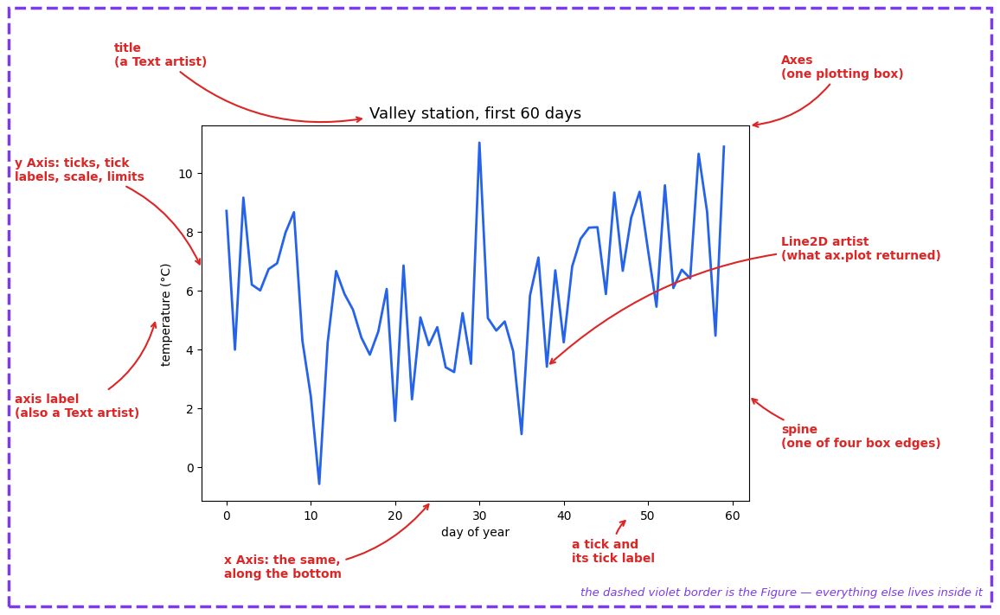

**Output**

```text
fig.axes            -> [<Axes: title={'center': 'Valley station, first 60 days'}, xlabel='day of year', ylabel='temperature (°C)'>]
ax.xaxis, ax.yaxis  -> XAxis YAxis
ax.spines           -> ['left', 'right', 'bottom', 'top']

Artists owned by this one Axes: 19
     8 x Annotation
     4 x Spine
     3 x Text
     1 x Line2D
     1 x XAxis
     1 x YAxis
     1 x Rectangle
(the Annotations are the labels we just added -- they are Artists too)
```

### Cell 16

```python
day = np.arange(60)
valley = wide["Valley"].iloc[:60].values

# ---- API 1: implicit. Nothing is named. Every call means "the current one".
plt.figure(figsize=(9, 2.8))
plt.plot(day, valley, color=C_LINE)
plt.title("implicit API: plt.* acts on whatever is 'current'")
plt.ylabel("°C")
plt.xlabel("day of year")
plt.show()

# ---- API 2: explicit. The same picture, with the objects in hand.
fig, ax = plt.subplots(figsize=(9, 2.8))
ax.plot(day, valley, color=C_LINE)
ax.set_title("explicit API: every call names the object it acts on")
ax.set_ylabel("°C")
ax.set_xlabel("day of year")
plt.show()

print("The translation is almost mechanical:\n")
for a, b in [("plt.plot(x, y)",  "ax.plot(x, y)"),
             ("plt.title(s)",    "ax.set_title(s)"),
             ("plt.xlabel(s)",   "ax.set_xlabel(s)"),
             ("plt.ylim(a, b)",  "ax.set_ylim(a, b)"),
             ("plt.xticks(v)",   "ax.set_xticks(v)"),
             ("plt.legend()",    "ax.legend()"),
             ("plt.savefig(p)",  "fig.savefig(p)   # note: fig, not ax")]:
    print(f"   {a:18s}  ->   {b}")
print("\nMostly it is a 'set_' prefix. savefig is the exception: it belongs to the Figure.")
```

**Output**

```text
<Figure size 900x280 with 1 Axes>
```

**Figure**

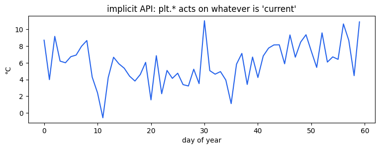

**Output**

```text
<Figure size 900x280 with 1 Axes>
```

**Figure**

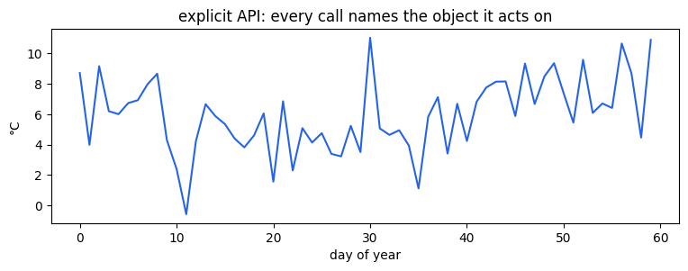

**Output**

```text
The translation is almost mechanical:

   plt.plot(x, y)      ->   ax.plot(x, y)
   plt.title(s)        ->   ax.set_title(s)
   plt.xlabel(s)       ->   ax.set_xlabel(s)
   plt.ylim(a, b)      ->   ax.set_ylim(a, b)
   plt.xticks(v)       ->   ax.set_xticks(v)
   plt.legend()        ->   ax.legend()
   plt.savefig(p)      ->   fig.savefig(p)   # note: fig, not ax

Mostly it is a 'set_' prefix. savefig is the exception: it belongs to the Figure.
```

### Cell 19

```python
alpine = wide["Alpine"].iloc[:60].values

fig_a, ax_a = plt.subplots(figsize=(7, 2.2))
ax_a.plot(day, valley, color=C_LINE)
ax_a.set_title("Figure A — Valley — the one we meant to annotate")

fig_b, ax_b = plt.subplots(figsize=(7, 2.2))
ax_b.plot(day, alpine, color=C_ALT)
ax_b.set_title("Figure B — Alpine — created second")

# We want a reference line on Figure A. We wrote it the pyplot way.
plt.axhline(10.0, color=C_OK, lw=2, ls="--")

print("plt.gcf() is fig_a ?", plt.gcf() is fig_a)
print("plt.gcf() is fig_b ?", plt.gcf() is fig_b)
print("plt.gca() is ax_a  ?", plt.gca() is ax_a)
print("plt.gca() is ax_b  ?", plt.gca() is ax_b)
print()
print("lines on ax_a:", len(ax_a.lines), "   lines on ax_b:", len(ax_b.lines))
plt.show()
```

**Output**

```text
plt.gcf() is fig_a ? False
plt.gcf() is fig_b ? True
plt.gca() is ax_a  ? False
plt.gca() is ax_b  ? True

lines on ax_a: 1    lines on ax_b: 2
```

**Output**

```text
<Figure size 700x220 with 1 Axes>
```

**Figure**

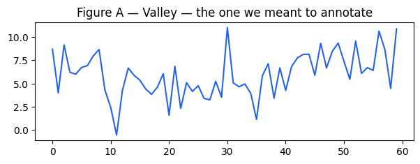

**Output**

```text
<Figure size 700x220 with 1 Axes>
```

**Figure**

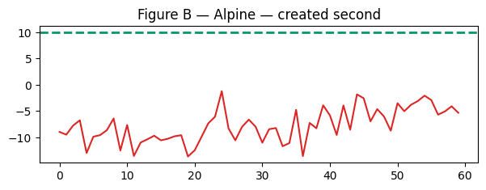

### Cell 22

```python
# The explicit version cannot land on the wrong object, because there is no
# "current" anything involved.
ax_a.axhline(10.0, color=C_OK, lw=2, ls="--")
ax_a.set_title("Figure A — the line is now where we asked for it")

print("lines on ax_a:", len(ax_a.lines), "   lines on ax_b:", len(ax_b.lines))
print("no ambiguity — we never asked matplotlib to guess.")

fig_a        # naming a Figure is also how you re-display it later
```

**Output**

```text
lines on ax_a: 2    lines on ax_b: 2
no ambiguity — we never asked matplotlib to guess.
```

**Output**

```text
<Figure size 700x220 with 1 Axes>
```

**Figure**

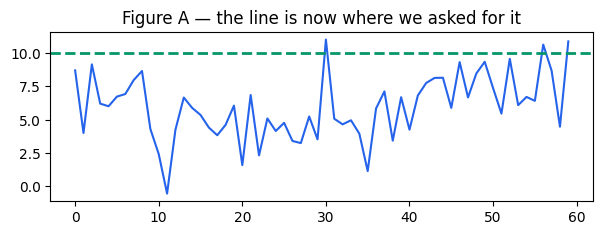

### Cell 25

```python
fig, ax = plt.subplots(figsize=(9.5, 3.4))

returned = ax.plot(day, valley, day, alpine)   # two series in one call
print("ax.plot returned a", type(returned).__name__, "of length", len(returned))
print("its contents:", [type(o).__name__ for o in returned])
print()

first, second = returned

# get_color() hands back matplotlib's internal form, which for a cycled colour
# is a tuple of floats. to_hex just makes it readable here; nothing is changed.
from matplotlib.colors import to_hex

print("BEFORE we touch anything, matplotlib had already chosen:")
print(f"   raw form of line 1's colour: {first.get_color()}")
print(f"   line 1 colour  {to_hex(first.get_color())}   width {first.get_linewidth()}   label {first.get_label()!r}")
print(f"   line 2 colour  {to_hex(second.get_color())}   width {second.get_linewidth()}   label {second.get_label()!r}")
print(f"   x-limits       {ax.get_xlim()}")
print(f"   y-limits       {ax.get_ylim()}")
print(f"   figure size    {fig.get_size_inches()} inches at {fig.get_dpi()} dpi")
print(f"   ax.get_lines() {ax.get_lines()}")
print()

# Now change the drawing through the handles. Nothing is re-plotted.
first.set_color(C_LINE);  first.set_linewidth(2.2);  first.set_label("Valley")
second.set_color(C_ALT);  second.set_linewidth(1.4); second.set_alpha(0.7)
second.set_label("Alpine")
ax.set_title("the same two Line2D objects — restyled in place, not redrawn")
ax.set_ylabel("°C")
ax.set_xlabel("day of year")
ax.legend()

print("AFTER:")
print(f"   line 1 colour  {to_hex(first.get_color())}   label {first.get_label()!r}")
print(f"   line 2 colour  {to_hex(second.get_color())}   label {second.get_label()!r}   alpha {second.get_alpha()}")
plt.show()
```

**Output**

```text
ax.plot returned a list of length 2
its contents: ['Line2D', 'Line2D']

BEFORE we touch anything, matplotlib had already chosen:
   raw form of line 1's colour: #1f77b4
   line 1 colour  #1f77b4   width 1.5   label '_child0'
   line 2 colour  #ff7f0e   width 1.5   label '_child1'
   x-limits       (np.float64(-2.95), np.float64(61.95))
   y-limits       (np.float64(-14.85349622475082), np.float64(12.257327249540872))
   figure size    [9.5 3.4] inches at 100.0 dpi
   ax.get_lines() <a list of 2 Line2D objects>

AFTER:
   line 1 colour  #2563eb   label 'Valley'
   line 2 colour  #dc2626   label 'Alpine'   alpha 0.7
```

**Output**

```text
<Figure size 950x340 with 1 Axes>
```

**Figure**

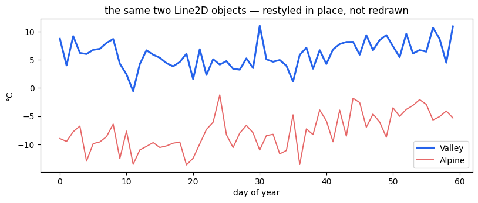

### Cell 27

```python
# The failure, first.
fig, ax = plt.subplots(figsize=(7, 2.2))

line = ax.plot(day, valley)          # looks singular. is not.
try:
    line.set_color(C_ALT)
except AttributeError as err:
    print("AttributeError:", err)

print("what ax.plot actually returned:", type(line).__name__,
      "of length", len(line))

# Two correct ways:
line[0].set_color(C_ALT)             # index it ...
(only_line,) = ax.plot(day, alpine)  # ... or unpack it at the call site
only_line.set_color(C_OK)
ax.set_title("both lines restyled — one by indexing, one by unpacking")
plt.show()
```

**Output**

```text
AttributeError: 'list' object has no attribute 'set_color'
what ax.plot actually returned: list of length 1
```

**Output**

```text
<Figure size 700x220 with 1 Axes>
```

**Figure**

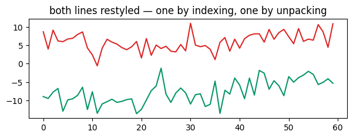

### Cell 31

```python
# What plt.subplots hands back, for three different grid shapes.
probe = {}
for label, shape in [("subplots(1, 1)", (1, 1)),
                     ("subplots(1, 3)", (1, 3)),
                     ("subplots(2, 2)", (2, 2))]:
    _f, _a = plt.subplots(*shape)
    probe[label] = (type(_a).__name__, getattr(_a, "shape", "-- not an array --"))
    plt.close(_f)                      # throwaway: close it so it is not displayed

for label, (kind, shp) in probe.items():
    print(f"   {label}  ->  {kind:8s}  shape {shp}")
print("\nA single Axes gets squeezed down to a bare object, and a single row to a")
print("1-D array. Pass squeeze=False to always get a 2-D array, which is what you")
print("want inside a function that must not care how many panels it was given.\n")

# The real 2x2 grid, one station per panel.
fig, axes = plt.subplots(2, 2, figsize=(10, 5))
print("axes is a", type(axes).__name__, "with shape", axes.shape)

for ax_, name in zip(axes.flat, wide.columns):
    ax_.plot(wide.index, wide[name], lw=0.7, color=C_LINE)
    ax_.set_title(name, fontsize=10)
    ax_.tick_params(labelsize=7)

print("axes[0, 1] is list(axes.flat)[1] ?", axes[0, 1] is list(axes.flat)[1])
print("axes.flat walks the grid row by row:", [a.get_title() for a in axes.flat])

fig.tight_layout()
plt.show()
```

**Output**

```text
   subplots(1, 1)  ->  Axes      shape -- not an array --
   subplots(1, 3)  ->  ndarray   shape (3,)
   subplots(2, 2)  ->  ndarray   shape (2, 2)

A single Axes gets squeezed down to a bare object, and a single row to a
1-D array. Pass squeeze=False to always get a 2-D array, which is what you
want inside a function that must not care how many panels it was given.

axes is a ndarray with shape (2, 2)
axes[0, 1] is list(axes.flat)[1] ? True
axes.flat walks the grid row by row: ['Alpine', 'Coastal', 'Foothill', 'Valley']
```

**Output**

```text
<Figure size 1000x500 with 4 Axes>
```

**Figure**

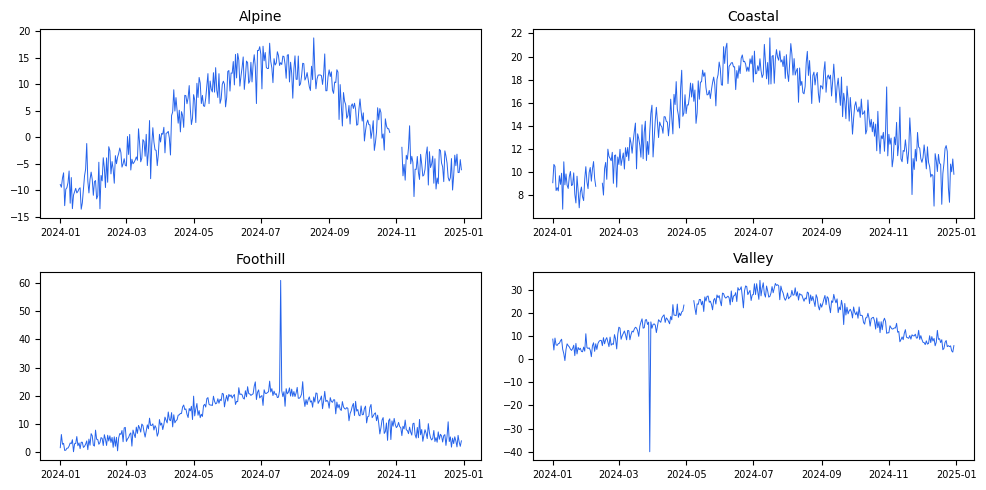

### Cell 34

```python
print("backend                :", matplotlib.get_backend())
print("interactive mode       :", plt.isinteractive())
print("open figure numbers    :", plt.get_fignums())

fig, ax = plt.subplots(figsize=(6, 1.8))
ax.plot(day, valley, color=C_LINE)
ax.set_title("one throwaway figure")
print("after creating one more:", plt.get_fignums())

plt.show()
print("after plt.show()       :", plt.get_fignums())

plt.close("all")
print("after plt.close('all') :", plt.get_fignums(), "  <- always empty")
```

**Output**

```text
backend                : module://matplotlib_inline.backend_inline
interactive mode       : False
open figure numbers    : []
after creating one more: [1]
```

**Output**

```text
<Figure size 600x180 with 1 Axes>
```

**Figure**

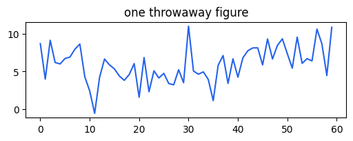

**Output**

```text
after plt.show()       : []
after plt.close('all') : []   <- always empty
```

### Cell 37

```python
fig, ax = plt.subplots(figsize=(10, 4))

lines = ax.plot(wide.index, wide.values, lw=1.0)   # still a list, still 2-D input
for ln, name in zip(lines, wide.columns):
    ln.set_label(name)                              # one handle per station

ax.set_title("Part 0's figure, rebuilt with every object named")
ax.set_xlabel("date")
ax.set_ylabel("temperature (°C)")
ax.legend(fontsize=8, ncol=4)

from matplotlib.colors import to_hex

print("the handles we kept:")
for ln in lines:
    print(f"   {ln.get_label():9s} colour {to_hex(ln.get_color())}   width {ln.get_linewidth()}")
print()
print("still chosen for us, and still wrong:")
lo, hi = ax.get_ylim()
print(f"   y-limits    {lo:.1f} to {hi:.1f} °C   <- the two bad sensor readings own this")
print(f"   real range  {wide.min().min():.1f} to {wide.max().max():.1f} °C, of which the")
print(f"               honest readings only span {wide.stack().quantile(0.001):.1f} to "
      f"{wide.stack().quantile(0.999):.1f}")
print(f"   figure size {fig.get_size_inches()} inches")
print(f"   colours     {[to_hex(ln.get_color()) for ln in lines]}")
print()
print("But every one of those is now reachable through a name, which is the")
print("only thing Part 1 was ever trying to buy you.")
plt.show()
```

**Output**

```text
the handles we kept:
   Alpine    colour #1f77b4   width 1.0
   Coastal   colour #ff7f0e   width 1.0
   Foothill  colour #2ca02c   width 1.0
   Valley    colour #d62728   width 1.0

still chosen for us, and still wrong:
   y-limits    -45.0 to 66.0 °C   <- the two bad sensor readings own this
   real range  -40.0 to 61.0 °C, of which the
               honest readings only span -13.6 to 33.6
   figure size [10.  4.] inches
   colours     ['#1f77b4', '#ff7f0e', '#2ca02c', '#d62728']

But every one of those is now reachable through a name, which is the
only thing Part 1 was ever trying to buy you.
```

**Output**

```text
<Figure size 1000x400 with 1 Axes>
```

**Figure**

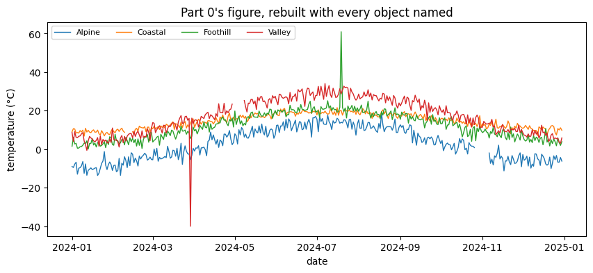

### Cell 41

```python
# ============================================================
#  One figure, one question per panel. Same data throughout.
# ============================================================
order = ["Alpine", "Coastal", "Foothill", "Valley"]

means = weather.groupby("station").temp_c.mean().reindex(order)
temps = weather.temp_c.dropna().to_numpy()      # hist cannot bin a NaN -- see below
valley = weather[weather.station == "Valley"]

fig, axes = plt.subplots(2, 2, figsize=(11, 7))

axes[0, 0].bar(order, means.values, color=C_LINE)
axes[0, 0].set_title("COMPARISON  ->  bar")

axes[0, 1].hist(temps, bins=40, color=C_ACC)
axes[0, 1].set_title("DISTRIBUTION  ->  hist")

axes[1, 0].scatter(valley.rain_mm, valley.temp_c, s=8, color=C_OK)
axes[1, 0].set_title("RELATIONSHIP  ->  scatter")

axes[1, 1].plot(wide.index, wide["Valley"], color=C_ALT, lw=1)
axes[1, 1].set_title("CHANGE OVER TIME  ->  line")

fig.tight_layout()
plt.show()

print("What each panel is built from:")
print(f"  bar     : {len(order)} numbers, from {len(weather):,} rows")
print(f"  hist    : {len(temps):,} values (dropped {weather.temp_c.isna().sum()} NaN)")
print(f"  scatter : {len(valley):,} points, one station only")
print(f"  line    : {wide['Valley'].notna().sum()} points joined by "
      f"{wide['Valley'].notna().sum() - 1} segments nobody measured")
print()
print(f"temperature range actually plotted: "
      f"{temps.min():.1f} to {temps.max():.1f} deg C")
```

**Output**

```text
<Figure size 1100x700 with 4 Axes>
```

**Figure**

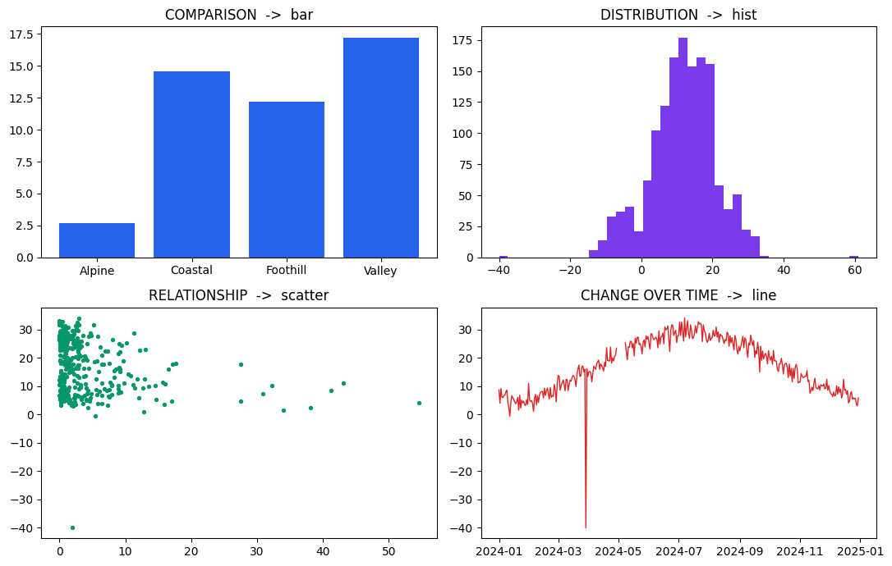

**Output**

```text
What each panel is built from:
  bar     : 4 numbers, from 1,460 rows
  hist    : 1,437 values (dropped 23 NaN)
  scatter : 365 points, one station only
  line    : 357 points joined by 356 segments nobody measured

temperature range actually plotted: -40.0 to 61.0 deg C
```

### Cell 44

```python
# ============================================================
#  Left  : markers show you where the data really is.
#  Middle: steps-post is honest for a quantity that holds.
#  Right : steps-post on temperature is a lie.
# ============================================================
slice30 = wide["Coastal"].iloc[60:90]

# a genuinely piecewise-constant quantity: sensors installed at Valley
change_dates = pd.to_datetime(["2024-01-01", "2024-04-15", "2024-08-01", "2024-11-10"])
sensor_count = np.array([2, 3, 5, 4])

fig, axes = plt.subplots(1, 3, figsize=(13, 3.8))

axes[0].plot(slice30.index, slice30.values, color=C_GREY, lw=1, label="line only")
axes[0].plot(slice30.index, slice30.values, color=C_LINE, lw=1,
             marker="o", ms=3, label="line + markers")
axes[0].set_title("markers: where the data is")
axes[0].legend(fontsize=8)

axes[1].plot(change_dates, sensor_count, color=C_ALT, lw=1.5,
             marker="o", label="default (wrong)")
axes[1].plot(change_dates, sensor_count, color=C_OK, lw=2,
             drawstyle="steps-post", label="steps-post (right)")
axes[1].set_title("sensors installed: holds until it changes")
axes[1].legend(fontsize=8)

axes[2].plot(slice30.index, slice30.values, color=C_ALT, lw=1.2,
             drawstyle="steps-post")
axes[2].set_title("steps-post on temperature: wrong")

for ax in axes:
    ax.tick_params(axis="x", labelrotation=30, labelsize=7)
fig.tight_layout()
plt.show()

print(f"sensor series: {len(change_dates)} measured points, "
      f"{len(slice30)} days spanned by the middle panel")
print("A default line through those 4 points claims Valley had a "
      "non-integer number of sensors on most days.")
```

**Output**

```text
<Figure size 1300x380 with 3 Axes>
```

**Figure**

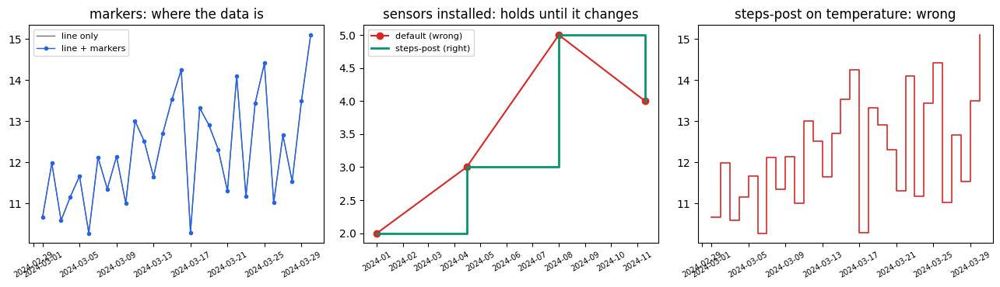

**Output**

```text
sensor series: 4 measured points, 30 days spanned by the middle panel
A default line through those 4 points claims Valley had a non-integer number of sensors on most days.
```

### Cell 46

```python
# ============================================================
#  bar / barh: grouped, stacked, and horizontal.
# ============================================================
q = weather.date.dt.quarter.rename("quarter")
temp_q = weather.groupby(["station", q]).temp_c.mean().unstack().reindex(order)
rain_q = weather.groupby(["station", q]).rain_mm.sum().unstack().reindex(order)

x = np.arange(len(order))
qcols = [C_LINE, C_OK, C_WARN, C_ACC]

fig, axes = plt.subplots(2, 2, figsize=(12, 7.5))

# (a) plain: one number per station
axes[0, 0].bar(x, means.values, color=C_LINE)
axes[0, 0].set_xticks(x); axes[0, 0].set_xticklabels(order)
axes[0, 0].set_title("(a) plain bar: mean temperature")
axes[0, 0].set_ylabel("deg C")

# (b) grouped: one number per station PER QUARTER, side by side
w = 0.2
for i, qtr in enumerate(temp_q.columns):
    axes[0, 1].bar(x + (i - 1.5) * w, temp_q[qtr].values, w,
                   color=qcols[i], label=f"Q{qtr}")
axes[0, 1].set_xticks(x); axes[0, 1].set_xticklabels(order)
axes[0, 1].set_title("(b) grouped: compare within and across")
axes[0, 1].legend(fontsize=8, ncol=4)

# (c) stacked: only legitimate when the parts ADD UP to the whole
bottom = np.zeros(len(order))
for i, qtr in enumerate(rain_q.columns):
    axes[1, 0].bar(x, rain_q[qtr].values, 0.6, bottom=bottom,
                   color=qcols[i], label=f"Q{qtr}")
    bottom += rain_q[qtr].values
axes[1, 0].set_xticks(x); axes[1, 0].set_xticklabels(order)
axes[1, 0].set_title("(c) stacked: total rain, quarters sum to the year")
axes[1, 0].set_ylabel("mm")
axes[1, 0].legend(fontsize=8, ncol=4)

# (d) barh: horizontal, because the labels are long
info = stations.set_index("station").reindex(order)
long_labels = [f"{s} - {int(r.elevation)} m, {int(r.sensors)} sensors"
               for s, r in info.iterrows()]
axes[1, 1].barh(x, means.values, color=C_ACC)
axes[1, 1].set_yticks(x); axes[1, 1].set_yticklabels(long_labels, fontsize=8)
axes[1, 1].set_title("(d) barh: long labels stay readable")
axes[1, 1].set_xlabel("mean deg C")

fig.tight_layout()
plt.show()

print("Quarterly rain totals (mm) -- these sum, so stacking is legitimate:")
print(rain_q.round(0).to_string())
print()
print("Quarterly mean temperature (deg C) -- these do NOT sum.")
print("Stacking panel (b) would produce a 'total temperature' of "
      f"{temp_q.loc['Valley'].sum():.1f} for Valley, which means nothing.")
```

**Output**

```text
<Figure size 1200x750 with 4 Axes>
```

**Figure**

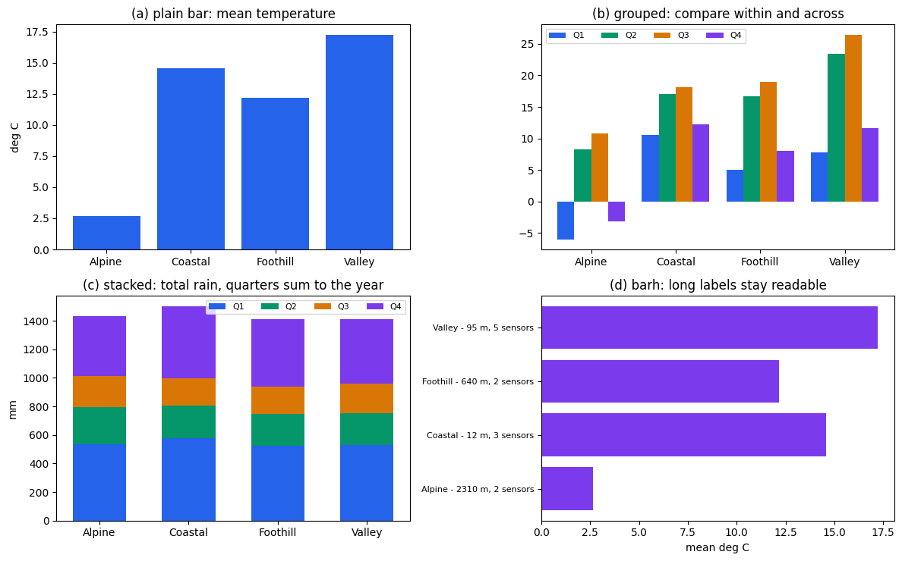

**Output**

```text
Quarterly rain totals (mm) -- these sum, so stacking is legitimate:
quarter       1      2      3      4
station                             
Alpine    533.0  261.0  216.0  421.0
Coastal   575.0  232.0  192.0  501.0
Foothill  524.0  222.0  191.0  473.0
Valley    527.0  224.0  207.0  455.0

Quarterly mean temperature (deg C) -- these do NOT sum.
Stacking panel (b) would produce a 'total temperature' of 69.3 for Valley, which means nothing.
```

### Cell 48

```python
# ============================================================
#  FAILURE FIRST: the same four means, two y-axes.
# ============================================================
fig, axes = plt.subplots(1, 2, figsize=(11, 4))

axes[0].bar(order, means.values, color=C_ALT)
axes[0].set_ylim(means.min() - 0.5, means.max() + 0.5)   # <-- the distortion
axes[0].set_title("y-axis starts near the smallest value")
axes[0].set_ylabel("deg C")

axes[1].bar(order, means.values, color=C_OK)
axes[1].set_ylim(0, None)                                 # honest for a bar
axes[1].set_title("y-axis starts at zero")
axes[1].set_ylabel("deg C")

fig.tight_layout()
plt.show()

lo = means.min() - 0.5
drawn = means.values - lo                 # bar lengths the eye actually compares
true_ratio  = means.max() / means.min()
drawn_ratio = drawn.max() / drawn.min()
print(f"Warmest / coldest station, true ratio of means : {true_ratio:5.2f} x")
print(f"Ratio of BAR LENGTHS in the left-hand panel     : {drawn_ratio:5.2f} x")
print(f"The truncated axis exaggerates the difference by "
      f"{drawn_ratio / true_ratio:.1f} times.")
```

**Output**

```text
<Figure size 1100x400 with 2 Axes>
```

**Figure**

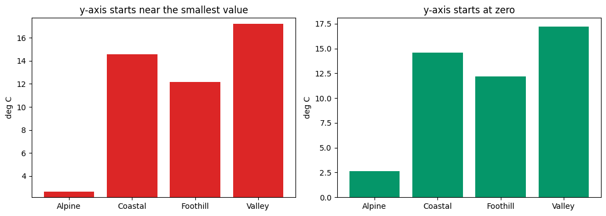

**Output**

```text
Warmest / coldest station, true ratio of means :  6.48 x
Ratio of BAR LENGTHS in the left-hand panel     : 30.12 x
The truncated axis exaggerates the difference by 4.7 times.
```

### Cell 52

```python
# ============================================================
#  The same values, four bin counts. Nothing else differs.
# ============================================================
fig, axes = plt.subplots(2, 2, figsize=(11, 6.5))

for ax, b in zip(axes.ravel(), [5, 20, 60, 200]):
    ax.hist(temps, bins=b, color=C_LINE, edgecolor="white", linewidth=0.4)
    ax.set_title(f"bins={b}")
    ax.set_xlabel("deg C")

fig.suptitle(f"One variable, {len(temps):,} values, four different stories",
             fontsize=12)
fig.tight_layout()
plt.show()

# what each bin count actually buys
print(f"{'bins':>5}  {'width':>7}  {'non-empty':>9}  {'in tallest bar':>14}")
for b in [5, 20, 60, 200]:
    c, edges = np.histogram(temps, bins=b)
    print(f"{b:>5}  {edges[1] - edges[0]:6.2f}C  {np.count_nonzero(c):>5}/{b:<3}"
          f"  {100 * c.max() / c.sum():>13.1f}%")

print()
# what density=True actually changes
counts, edges = np.histogram(temps, bins=30)
dens,   _     = np.histogram(temps, bins=30, density=True)
width = edges[1] - edges[0]
print(f"density=False : tallest bar = {counts.max():,} (a count of readings)")
print(f"density=True  : tallest bar = {dens.max():.4f} (a probability density)")
print(f"density=True  : sum(height * width) = {(dens * width).sum():.4f}  <- area is 1")
print()
print(f"Rule-of-thumb bin counts for n={len(temps):,}:")
print(f"  Sturges       : {int(np.ceil(np.log2(len(temps)) + 1))}")
print(f"  sqrt(n)       : {int(np.sqrt(len(temps)))}")
print(f"  numpy 'fd'    : {len(np.histogram_bin_edges(temps, bins='fd')) - 1}")
```

**Output**

```text
<Figure size 1100x650 with 4 Axes>
```

**Figure**

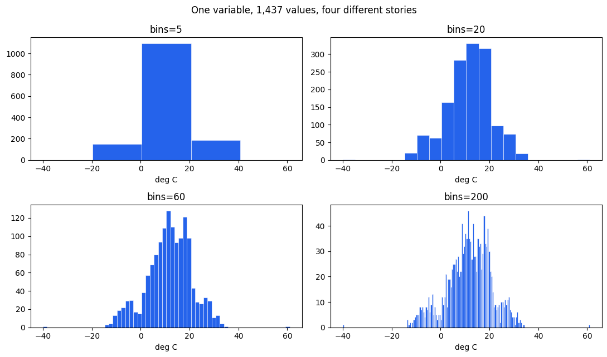

**Output**

```text
 bins    width  non-empty  in tallest bar
    5   20.20C      5/5             76.2%
   20    5.05C     12/20            23.0%
   60    1.68C     32/60             8.9%
  200    0.51C     95/200            3.2%

density=False : tallest bar = 238 (a count of readings)
density=True  : tallest bar = 0.0492 (a probability density)
density=True  : sum(height * width) = 1.0000  <- area is 1

Rule-of-thumb bin counts for n=1,437:
  Sturges       : 12
  sqrt(n)       : 37
  numpy 'fd'    : 50
```

### Cell 55

```python
# ============================================================
#  boxplot vs violinplot -- on real data (top) and on a
#  distribution deliberately built to break the box (bottom).
# ============================================================
# NEITHER function tolerates NaN: with gaps left in, the quartiles come back
# NaN and the boxes vanish. Masking is telling the function what to skip --
# it is not cleaning the data, which stays exactly as Part 0 made it.
groups = [weather.loc[weather.station == s, "temp_c"].dropna().to_numpy()
          for s in order]

# a two-mode mixture: morning and afternoon readings from one sensor
rng = np.random.default_rng(7)
mix = np.concatenate([rng.normal(6.0, 1.5, 400), rng.normal(20.0, 1.5, 400)])

fig, axes = plt.subplots(2, 2, figsize=(11.5, 7.5))

axes[0, 0].boxplot(groups)
axes[0, 0].set_xticks(range(1, len(order) + 1))
axes[0, 0].set_xticklabels(order, fontsize=8)
axes[0, 0].set_title("boxplot: five numbers per station")
axes[0, 0].set_ylabel("deg C")

parts = axes[0, 1].violinplot(groups, showmedians=True)
for b in parts["bodies"]:
    b.set_facecolor(C_LINE); b.set_alpha(0.5)
axes[0, 1].set_xticks(range(1, len(order) + 1))
axes[0, 1].set_xticklabels(order, fontsize=8)
axes[0, 1].set_title("violinplot: the whole shape")

axes[1, 0].boxplot([mix])
axes[1, 0].set_xticks([1]); axes[1, 0].set_xticklabels(["mixture"])
axes[1, 0].set_title("the SAME values: box sees one blob")
axes[1, 0].set_ylabel("deg C")

p2 = axes[1, 1].violinplot([mix], showmedians=True)
p2["bodies"][0].set_facecolor(C_ACC); p2["bodies"][0].set_alpha(0.5)
axes[1, 1].set_xticks([1]); axes[1, 1].set_xticklabels(["mixture"])
axes[1, 1].set_title("violin sees two peaks")

fig.tight_layout()
plt.show()

# what the box actually draws, spelled out for Valley
v = weather.loc[weather.station == "Valley", "temp_c"].dropna()
q1, med, q3 = np.percentile(v, [25, 50, 75])
iqr = q3 - q1
lo_w, hi_w = q1 - 1.5 * iqr, q3 + 1.5 * iqr
inside = v[(v >= lo_w) & (v <= hi_w)]
print("Valley box, part by part:")
print(f"  median (the line)       : {med:6.2f}")
print(f"  Q1 / Q3 (the box edges) : {q1:6.2f} / {q3:6.2f}   IQR = {iqr:.2f}")
print(f"  whisker reach (1.5*IQR) : {lo_w:6.2f} / {hi_w:6.2f}")
print(f"  whiskers actually drawn : {inside.min():6.2f} / {inside.max():6.2f}"
      "   (last point inside the reach)")
print(f"  fliers (dots beyond)    : {len(v) - len(inside)}"
      f"   min={v.min():.1f}  <- the -40 sensor fault, plotted as a dot")
print()
print("The mixture, which the box plot called one blob:")
print(f"  median                  : {np.median(mix):6.2f}")
print(f"  values within +/-1 of that median: {np.sum(np.abs(mix - np.median(mix)) < 1)}"
      f" out of {len(mix)}")
print()
# Are the REAL stations bimodal too? Split each station's middle 90% into
# three equal-width slices and count. A single peak puts the most readings
# in the middle slice. A dip in the middle means two modes.
print("Readings per third of each station's middle 90% (low / middle / high):")
for s, g in zip(order, groups):
    e = np.linspace(*np.percentile(g, [5, 95]), 4)
    c, _ = np.histogram(g, bins=e)
    print(f"  {s:<9} {c[0]:>4} {c[1]:>4} {c[2]:>4}"
          f"   middle is the emptiest: {c[1] < c[0] and c[1] < c[2]}")
```

**Output**

```text
<Figure size 1150x750 with 4 Axes>
```

**Figure**

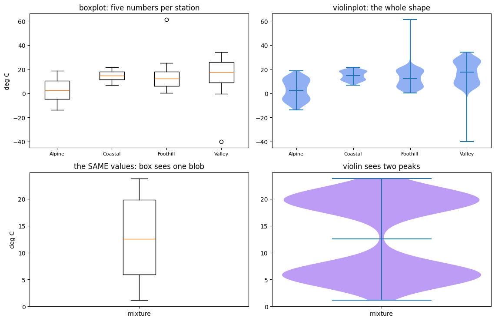

**Output**

```text
Valley box, part by part:
  median (the line)       :  17.47
  Q1 / Q3 (the box edges) :   9.05 /  25.84   IQR = 16.79
  whisker reach (1.5*IQR) : -16.14 /  51.03
  whiskers actually drawn :  -0.57 /  34.10   (last point inside the reach)
  fliers (dots beyond)    : 1   min=-40.0  <- the -40 sensor fault, plotted as a dot

The mixture, which the box plot called one blob:
  median                  :  12.58
  values within +/-1 of that median: 0 out of 800

Readings per third of each station's middle 90% (low / middle / high):
  Alpine     119   85  115   middle is the emptiest: True
  Coastal    108   91  125   middle is the emptiest: True
  Foothill   112   86  129   middle is the emptiest: True
  Valley     115   88  118   middle is the emptiest: True
```

### Cell 57

```python
# ============================================================
#  scatter: two variables, plus up to two more via s= and c=.
# ============================================================
v = weather[weather.station == "Valley"]
doy = v.date.dt.dayofyear.to_numpy()

fig, axes = plt.subplots(1, 3, figsize=(13.5, 4))

axes[0].scatter(v.rain_mm, v.temp_c, s=12, color=C_LINE)
axes[0].set_title("two variables")
axes[0].set_xlabel("rain (mm)"); axes[0].set_ylabel("deg C")

axes[1].scatter(v.rain_mm, v.temp_c, s=4 + 6 * v.rain_mm, alpha=0.5, color=C_ACC)
axes[1].set_title("s= : a third variable as area")
axes[1].set_xlabel("rain (mm)")

sc = axes[2].scatter(v.rain_mm, v.temp_c, s=12, c=doy, cmap="twilight")
axes[2].set_title("c= : a third variable as colour (day of year)")
axes[2].set_xlabel("rain (mm)")
fig.colorbar(sc, ax=axes[2], label="day of year")

fig.tight_layout()
plt.show()

r = v[["rain_mm", "temp_c"]].corr().iloc[0, 1]
print(f"Valley: Pearson correlation of rain and temperature = {r:.3f}")
print(f"n = {v.temp_c.notna().sum()} points plotted, "
      f"{v.temp_c.isna().sum()} silently skipped as NaN")
print(f"y-axis spans {v.temp_c.min():.1f} to {v.temp_c.max():.1f} -- "
      "the -40 fault is one of these points, bottom left.")
```

**Output**

```text
<Figure size 1350x400 with 4 Axes>
```

**Figure**

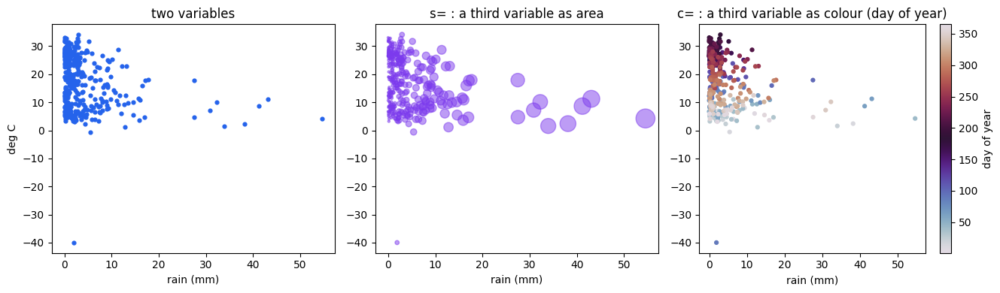

**Output**

```text
Valley: Pearson correlation of rain and temperature = -0.265
n = 357 points plotted, 8 silently skipped as NaN
y-axis spans -40.0 to 34.1 -- the -40 fault is one of these points, bottom left.
```

### Cell 59

```python
# ============================================================
#  FAILURE FIRST: all four stations, every day, opaque.
# ============================================================
ok = weather.temp_c.notna()          # hexbin cannot bin a NaN either
x_all, y_all = weather.rain_mm[ok].to_numpy(), weather.temp_c[ok].to_numpy()

fig, axes = plt.subplots(2, 2, figsize=(11.5, 7.5))

axes[0, 0].scatter(x_all, y_all)                       # every default
axes[0, 0].set_title(f"(a) BROKEN: {len(x_all):,} opaque default markers")

axes[0, 1].scatter(x_all, y_all, alpha=0.15, s=20, color=C_LINE)
axes[0, 1].set_title("(b) fix 1: alpha=0.15")

axes[1, 0].scatter(x_all, y_all, s=2, color=C_LINE)
axes[1, 0].set_title("(c) fix 2: s=2")

hb = axes[1, 1].hexbin(x_all, y_all, gridsize=28, cmap="Blues", mincnt=1)
axes[1, 1].set_title("(d) fix 3: hexbin -- bin, then colour by count")
fig.colorbar(hb, ax=axes[1, 1], label="points per hexagon")

for ax in axes.ravel():
    ax.set_xlabel("rain (mm)"); ax.set_ylabel("deg C")
fig.tight_layout()
plt.show()

# how bad is the overplotting, numerically?
counts = hb.get_array()
print(f"points plotted        : {len(x_all):,}")
print(f"occupied hexagons     : {len(counts):,}")
print(f"busiest hexagon holds : {int(counts.max()):,} points")
print(f"that one hexagon is   : {100 * counts.max() / len(x_all):.1f}% "
      "of the data, drawn as a single blob in panel (a)")
```

**Output**

```text
<Figure size 1150x750 with 5 Axes>
```

**Figure**

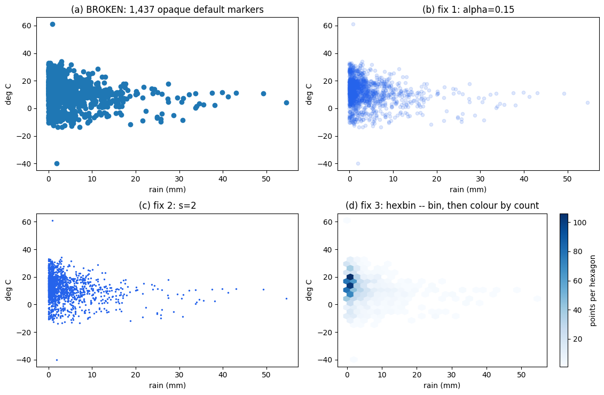

**Output**

```text
points plotted        : 1,437
occupied hexagons     : 148
busiest hexagon holds : 106 points
that one hexagon is   : 7.4% of the data, drawn as a single blob in panel (a)
```

### Cell 62

```python
# ============================================================
#  Uncertainty: errorbar (discrete) and fill_between (continuous).
# ============================================================
vv = weather[weather.station == "Valley"]
mo = vv.groupby(vv.date.dt.month).temp_c.agg(["mean", "std", "count"])

fig, axes = plt.subplots(1, 2, figsize=(12, 4.2), sharey=True)

axes[0].errorbar(mo.index, mo["mean"], yerr=mo["std"], fmt="o-",
                 color=C_LINE, ecolor=C_GREY, capsize=4, lw=1.5)
axes[0].set_title("errorbar: 12 monthly means, +/- 1 sd")
axes[0].set_xlabel("month"); axes[0].set_ylabel("deg C")

axes[1].plot(mo.index, mo["mean"], color=C_LINE, lw=2, label="monthly mean")
axes[1].fill_between(mo.index, mo["mean"] - mo["std"], mo["mean"] + mo["std"],
                     color=C_LINE, alpha=0.2, label="+/- 1 sd")
axes[1].set_title("fill_between: the same numbers as a band")
axes[1].set_xlabel("month"); axes[1].legend(fontsize=8)

fig.tight_layout()
plt.show()

print(mo.round(2).to_string())
print()
worst = mo["std"].idxmax()
typical = mo["std"].drop(worst).median()
print(f"Largest monthly sd is month {worst}: {mo.loc[worst, 'std']:.2f} deg C, "
      f"against a median of {typical:.2f} elsewhere.")
print("That month contains the -40 sensor fault. One bad reading out of "
      f"{int(mo.loc[worst, 'count'])} has roughly "
      f"{mo.loc[worst, 'std'] / typical:.1f}x-ed the error bar.")
```

**Output**

```text
<Figure size 1200x420 with 2 Axes>
```

**Figure**

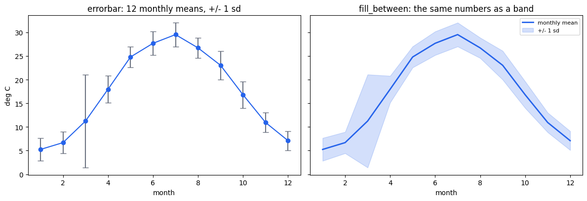

**Output**

```text
       mean   std  count
date                    
1      5.24  2.41     31
2      6.68  2.26     29
3     11.24  9.83     31
4     17.97  2.82     29
5     24.78  2.23     24
6     27.68  2.50     30
7     29.52  2.52     31
8     26.71  2.16     31
9     23.03  3.04     30
10    16.80  2.81     31
11    10.94  2.07     30
12     7.10  2.00     30

Largest monthly sd is month 3: 9.83 deg C, against a median of 2.41 elsewhere.
That month contains the -40 sensor fault. One bad reading out of 31 has roughly 4.1x-ed the error bar.
```

### Cell 64

```python
# ============================================================
#  imshow: a matrix as a picture. Stations x months.
# ============================================================
grid = (weather.groupby(["station", weather.date.dt.month])
        .temp_c.mean().unstack().reindex(order))

fig, axes = plt.subplots(1, 2, figsize=(12, 3.6))

im0 = axes[0].imshow(grid.values, cmap="RdYlBu_r", aspect="auto")
axes[0].set_title("origin='upper' (default), aspect='auto'")
axes[0].set_yticks(range(len(order))); axes[0].set_yticklabels(order, fontsize=8)
axes[0].set_xticks(range(12)); axes[0].set_xticklabels(range(1, 13), fontsize=8)
axes[0].set_xlabel("month")
fig.colorbar(im0, ax=axes[0], label="mean deg C")

im1 = axes[1].imshow(grid.values, cmap="RdYlBu_r", origin="lower", aspect="equal")
axes[1].set_title("origin='lower', aspect='equal' -- rows FLIPPED")
axes[1].set_yticks(range(len(order))); axes[1].set_yticklabels(order, fontsize=8)
axes[1].set_xticks(range(12)); axes[1].set_xticklabels(range(1, 13), fontsize=8)
axes[1].set_xlabel("month")
fig.colorbar(im1, ax=axes[1], label="mean deg C")

fig.tight_layout()
plt.show()

print(grid.round(1).to_string())
print()
print(f"matrix shape        : {grid.shape[0]} stations x {grid.shape[1]} months")
print(f"row 0 of the array  : {order[0]}")
print("In the LEFT panel row 0 is drawn at the top; in the RIGHT panel the "
      "same row is at the bottom. The tick labels were not changed, so the "
      "right panel now labels the wrong rows.")
```

**Output**

```text
<Figure size 1200x360 with 4 Axes>
```

**Figure**

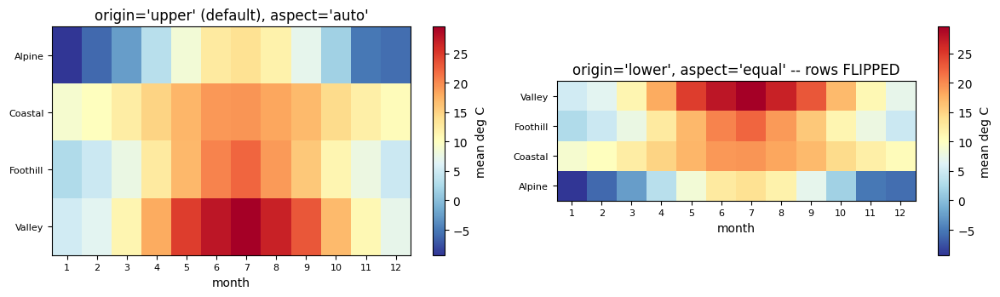

**Output**

```text
date       1     2     3     4     5     6     7     8     9     10    11    12
station                                                                        
Alpine   -9.3  -6.1  -2.6   3.4   8.5  12.7  13.7  11.7   6.9   1.8  -5.1  -5.7
Coastal   9.0  10.2  12.4  14.8  17.1  19.2  19.3  18.3  16.9  14.2  12.1  10.4
Foothill  2.8   4.7   7.6  12.6  17.0  20.3  22.1  19.0  15.8  11.3   7.8   4.8
Valley    5.2   6.7  11.2  18.0  24.8  27.7  29.5  26.7  23.0  16.8  10.9   7.1

matrix shape        : 4 stations x 12 months
row 0 of the array  : Alpine
In the LEFT panel row 0 is drawn at the top; in the RIGHT panel the same row is at the bottom. The tick labels were not changed, so the right panel now labels the wrong rows.
```

### Cell 68

```python
# ============================================================
#  The property cycle, five ways to name a colour, and your own cycle
# ============================================================
from cycler import cycler
import matplotlib.colors as mcolors

default_colors = plt.rcParams["axes.prop_cycle"].by_key()["color"]
print(f"axes.prop_cycle holds {len(default_colors)} colours:")
for i, c in enumerate(default_colors):
    print(f"   C{i} -> {mcolors.to_hex(c)}")

# A clean, calm version of the data so that what you notice in this part is the
# STYLING and not the noise: the two impossible sensor readings dropped, and a
# 7-day rolling mean. (Part 4 fixes axis limits properly; here we sidestep.)
clean  = wide.mask((wide < -30) | (wide > 50))
smooth = clean.rolling(7, min_periods=3).mean()
print(f"\nseries : {list(smooth.columns)}")
print(f"points : {len(smooth)} days per series")

mine = cycler(color=[C_LINE, C_ALT, C_OK, C_ACC])

fig = plt.figure(figsize=(14, 3.9))

# --- panel 1: name no colour at all, and watch the cycle hand them out
ax0 = fig.add_subplot(1, 3, 1)
for col in smooth.columns:
    ax0.plot(smooth.index, smooth[col])
ax0.set_title("no colour given: C0, C1, C2, C3")
print("\npanel 1 got:", [mcolors.to_hex(ln.get_color()) for ln in ax0.get_lines()])

# --- panel 2: five different spellings of 'a colour'
ax1 = fig.add_subplot(1, 3, 2)
ways = [("named   'tab:red'",          "tab:red"),
        ("hex     '#2563EB'",          C_LINE),
        ("RGBA    (.05,.6,.4,.9)",     (0.05, 0.6, 0.4, 0.9)),
        ("cycle   'C3'",               "C3"),
        ("grey    '0.65'",             "0.65")]
for k, (label, spec) in enumerate(ways):
    ax1.plot(smooth.index, smooth["Valley"] - 5 * k, color=spec, lw=2.2, label=label)
ax1.legend(fontsize=7, loc="lower left")
ax1.set_title("five ways to name a colour")

# --- panel 3: our own cycle. NOTE the Axes is created INSIDE the context --
#     rcParams are read when an artist is created, not when it is drawn.
with plt.rc_context({"axes.prop_cycle": mine}):
    ax2 = fig.add_subplot(1, 3, 3)
    for col in smooth.columns:
        ax2.plot(smooth.index, smooth[col])
    ax2.set_title("our own prop_cycle")
print("panel 3 got:", [ln.get_color() for ln in ax2.get_lines()])

for ax in (ax0, ax1, ax2):
    ax.set_ylabel("temp (deg C)")
    ax.tick_params(labelsize=7)
fig.autofmt_xdate()
fig.tight_layout()
plt.show()
```

**Output**

```text
axes.prop_cycle holds 10 colours:
   C0 -> #1f77b4
   C1 -> #ff7f0e
   C2 -> #2ca02c
   C3 -> #d62728
   C4 -> #9467bd
   C5 -> #8c564b
   C6 -> #e377c2
   C7 -> #7f7f7f
   C8 -> #bcbd22
   C9 -> #17becf

series : ['Alpine', 'Coastal', 'Foothill', 'Valley']
points : 365 days per series

panel 1 got: ['#1f77b4', '#ff7f0e', '#2ca02c', '#d62728']
panel 3 got: ['#2563EB', '#DC2626', '#059669', '#7C3AED']
```

**Output**

```text
<Figure size 1400x390 with 3 Axes>
```

**Figure**

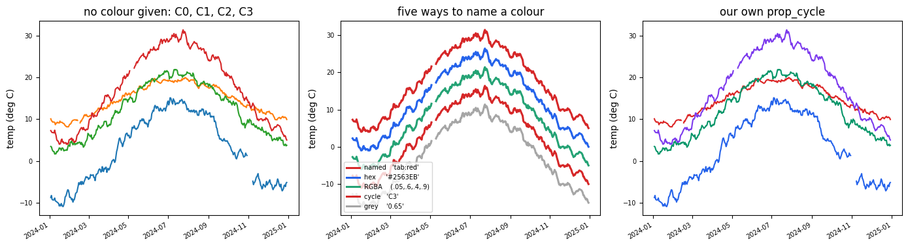

### Cell 71

```python
# ============================================================
#  linestyle / linewidth / marker / markevery, on the same series
# ============================================================
fig, axes = plt.subplots(2, 2, figsize=(12.5, 6.6))
a, b, c, d = axes.ravel()

for k, ls in enumerate(["-", "--", "-.", ":"]):
    a.plot(smooth.index, smooth["Coastal"] - 4 * k, color=C_LINE,
           linestyle=ls, lw=1.8, label=f"linestyle={ls!r}")
a.legend(fontsize=7, loc="lower left")
a.set_title("linestyle: shape of the stroke")

for k, lw in enumerate([0.6, 1.5, 3.0, 5.5]):
    b.plot(smooth.index, smooth["Coastal"] - 4 * k, color=C_ACC,
           lw=lw, label=f"linewidth={lw}")
b.legend(fontsize=7, loc="lower left")
b.set_title("linewidth: weight, i.e. importance")

# the failure: one marker per data point
c.plot(smooth.index, smooth["Valley"], color=C_ALT, lw=1.2,
       marker="o", markersize=5)
c.set_title("marker='o' on every point")

# the fix: one marker every 14th point
step = 14
d.plot(smooth.index, smooth["Valley"], color=C_ALT, lw=1.2,
       marker="o", markersize=5, markevery=step)
d.set_title(f"same line, markevery={step}")

for ax in axes.ravel():
    ax.set_ylabel("temp (deg C)")
    ax.tick_params(labelsize=7)
fig.autofmt_xdate()
fig.tight_layout()
plt.show()

drawn = len(smooth["Valley"].dropna())
print(f"Valley: {len(smooth)} days, {len(smooth) - drawn} of them NaN (the sensor gap)")
print(f"bottom-left  markers drawn: {drawn}")
print(f"bottom-right markers drawn: {len(range(0, drawn, step))}")
print("Same information. One of them is readable.")
```

**Output**

```text
<Figure size 1250x660 with 4 Axes>
```

**Figure**

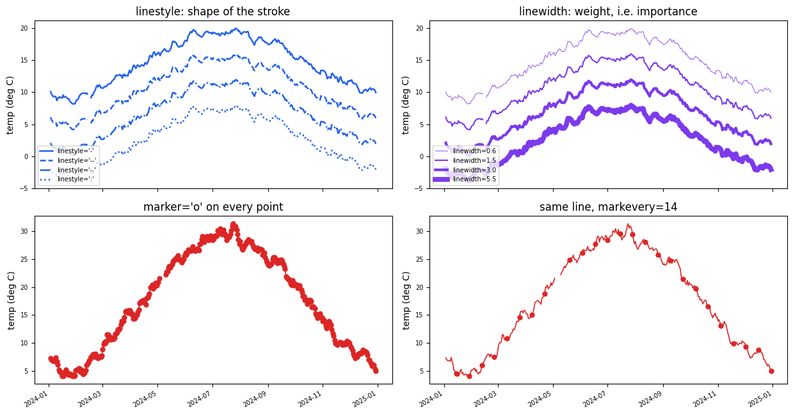

**Output**

```text
Valley: 365 days, 8 of them NaN (the sensor gap)
bottom-left  markers drawn: 357
bottom-right markers drawn: 26
Same information. One of them is readable.
```

### Cell 75

```python
# ============================================================
#  Same three artists, two zorders  +  alpha as a density encoding
# ============================================================
fig, axes = plt.subplots(2, 2, figsize=(12.5, 6.8))
(za, zb, aa, ab) = axes.ravel()

trio = [("Valley",   C_ALT),
        ("Foothill", C_OK),
        ("Coastal",  C_LINE)]

# --- top-left: three fat lines, default zorder, drawn in this order
for name, col in trio:
    za.plot(smooth.index, smooth[name], color=col, lw=7, label=name)
za.set_title("equal zorder: last drawn wins")

# --- top-right: SAME artists, SAME draw order, explicit zorder reversed
for k, (name, col) in enumerate(trio):
    zb.plot(smooth.index, smooth[name], color=col, lw=7, label=name,
            zorder=5 - k)
zb.set_title("zorder=5,4,3: first drawn wins")

for ax in (za, zb):
    ax.legend(fontsize=7, loc="lower left")
    ax.set_ylabel("temp (deg C)")

# --- bottom row: every daily reading, opaque vs translucent
pts = weather.dropna(subset=["temp_c"])
aa.scatter(pts.rain_mm, pts.temp_c, s=22, color=C_ACC, alpha=1.0)
aa.set_title(f"alpha=1.0 on {len(pts):,} points")
ab.scatter(pts.rain_mm, pts.temp_c, s=22, color=C_ACC, alpha=0.08)
ab.set_title("alpha=0.08: darkness is the count")
for ax in (aa, ab):
    ax.set_xlabel("rain (mm)")
    ax.set_ylabel("temp (deg C)")

for ax in axes.ravel():
    ax.tick_params(labelsize=7)
fig.autofmt_xdate()
fig.tight_layout()
plt.show()

print("top-left  zorders:", [ln.get_zorder() for ln in za.get_lines()])
print("top-right zorders:", [ln.get_zorder() for ln in zb.get_lines()])
print(f"points plotted in the bottom row: {len(pts):,} (both panels)")
```

**Output**

```text
<Figure size 1250x680 with 4 Axes>
```

**Figure**

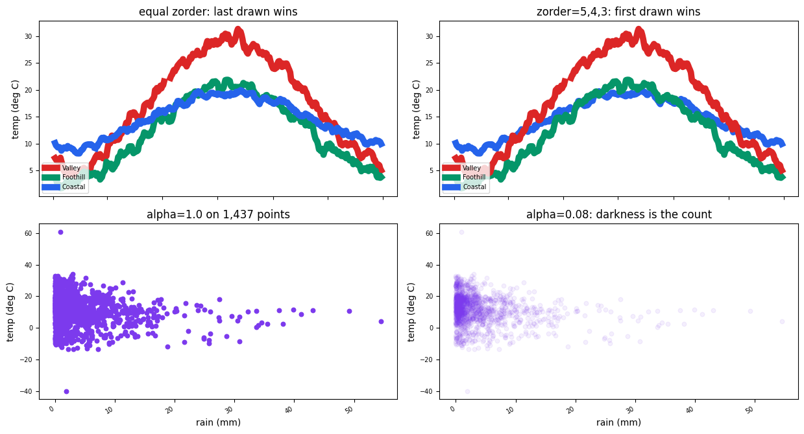

**Output**

```text
top-left  zorders: [2, 2, 2]
top-right zorders: [5, 4, 3]
points plotted in the bottom row: 1,437 (both panels)
```

### Cell 78

```python
# ============================================================
#  Three encodings of the same four series -- and we keep the pixels
# ============================================================
S3_COLOR = {"Alpine": C_ACC, "Coastal": C_LINE, "Foothill": C_OK, "Valley": C_ALT}
S3_STYLE = {"Alpine": ("--", "^"), "Coastal": ("-", "o"),
            "Foothill": ("-.", "s"), "Valley": (":", "D")}
FOCUS = "Alpine"          # the one series this figure exists to talk about

fig, (p1, p2, p3) = plt.subplots(1, 3, figsize=(14.5, 4.2))

# --- panel 1: colour only. The usual default.
for name in smooth.columns:
    p1.plot(smooth.index, smooth[name], color=S3_COLOR[name], lw=1.8, label=name)
p1.set_title("1. colour only")

# --- panel 2: colour AND linestyle AND marker
for name in smooth.columns:
    ls, mk = S3_STYLE[name]
    p2.plot(smooth.index, smooth[name], color=S3_COLOR[name], lw=1.8,
            linestyle=ls, marker=mk, markersize=5, markevery=26, label=name)
p2.set_title("2. colour + linestyle + marker")

# --- panel 3: emphasis by de-emphasis
for name in smooth.columns:
    focus = (name == FOCUS)
    p3.plot(smooth.index, smooth[name],
            color=C_ALT if focus else "0.78",
            lw=2.6 if focus else 1.3,
            zorder=3 if focus else 2,
            label=name if focus else None)
p3.set_title(f"3. only {FOCUS} matters")

for ax in (p1, p2, p3):
    ax.legend(fontsize=7, loc="lower left")
    ax.set_ylabel("temp (deg C)")
    ax.tick_params(labelsize=7)
fig.autofmt_xdate()
fig.tight_layout()

# Keep the rendered pixels so the next cell can desaturate them. draw() forces
# the renderer to run; buffer_rgba() hands back the actual RGBA image.
fig.canvas.draw()
try:
    rgba = np.asarray(fig.canvas.buffer_rgba(), dtype=float) / 255.0
except AttributeError:                      # non-Agg canvas: go via a PNG
    import io as _io
    _b = _io.BytesIO(); fig.savefig(_b, format="png"); _b.seek(0)
    rgba = plt.imread(_b)
S3_LUM = rgba[..., :3] @ np.array([0.2126, 0.7152, 0.0722])   # ITU-R BT.709
plt.show()

print(f"captured {rgba.shape[1]} x {rgba.shape[0]} pixels")
print(f"luminance range: {S3_LUM.min():.3f} to {S3_LUM.max():.3f}")
```

**Output**

```text
<Figure size 1450x420 with 3 Axes>
```

**Figure**

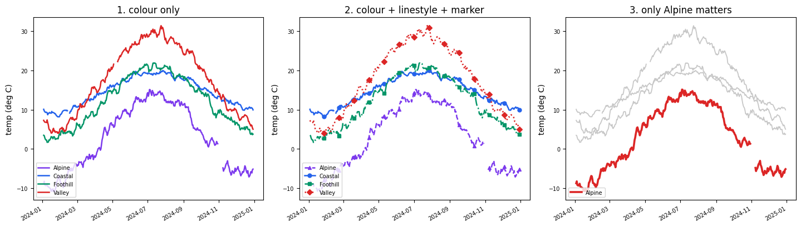

**Output**

```text
captured 1450 x 420 pixels
luminance range: 0.000 to 1.000
```

### Cell 80

```python
# ============================================================
#  The same figure, as a black-and-white printer would deliver it
# ============================================================
fig, ax = plt.subplots(figsize=(14.5, 4.2))
ax.imshow(S3_LUM, cmap="gray", vmin=0.0, vmax=1.0, interpolation="nearest")
ax.set_axis_off()
ax.set_title("the previous figure, luminance only -- which panel still works?",
             fontsize=11)
fig.tight_layout()
plt.show()

# How different are the four series once colour is gone? Compare the luminance
# of the four line colours we used, on the 0..1 scale of the image above.
w = np.array([0.2126, 0.7152, 0.0722])
print("luminance of the four series colours:")
for name in smooth.columns:
    lum = np.array(mcolors.to_rgb(S3_COLOR[name])) @ w
    print(f"   {name:9s} {S3_COLOR[name]}  ->  {lum:.3f}")
lums = np.array([np.array(mcolors.to_rgb(S3_COLOR[n])) @ w for n in smooth.columns])
print(f"\nspread between the lightest and darkest: {lums.max() - lums.min():.3f}")
print("Four series, and in greyscale they are that close together.")
```

**Output**

```text
<Figure size 1450x420 with 1 Axes>
```

**Figure**

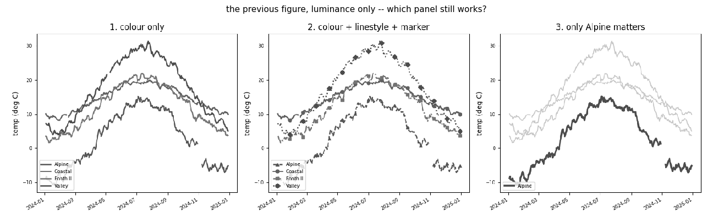

**Output**

```text
luminance of the four series colours:
   Alpine    #7C3AED  ->  0.333
   Coastal   #2563EB  ->  0.375
   Foothill  #059669  ->  0.455
   Valley    #DC2626  ->  0.301

spread between the lightest and darkest: 0.154
Four series, and in greyscale they are that close together.
```

### Cell 85

```python
# ============================================================
#  THE FAILURE: plt.style.use leaks into everything that follows
# ============================================================
def n_nondefault():
    """How many rcParams currently differ from matplotlib's defaults."""
    skip = {"backend", "interactive"}
    return sum(1 for k in plt.rcParamsDefault
               if k not in skip
               and repr(plt.rcParams[k]) != repr(plt.rcParamsDefault[k]))

print(f"before      : {n_nondefault()} rcParams differ from default")
print(f"              figure.facecolor = {plt.rcParams['figure.facecolor']!r}")

plt.style.use("dark_background")          # <-- looks local. is not.

print(f"after use() : {n_nondefault()} rcParams differ from default")
print(f"              figure.facecolor = {plt.rcParams['figure.facecolor']!r}")

# ...and now a completely unrelated figure, drawn later, that never asked:
fig, ax = plt.subplots(figsize=(8, 3.2))
ax.plot(smooth.index, smooth["Coastal"], lw=2)
ax.set_title("a figure drawn later, which never asked to be dark")
ax.set_ylabel("temp (deg C)")
ax.tick_params(labelsize=8)
fig.autofmt_xdate()
fig.tight_layout()
plt.show()

print("\nNothing in the cell that drew that figure mentions a style.")
```

**Output**

```text
before      : 0 rcParams differ from default
              figure.facecolor = 'white'
after use() : 17 rcParams differ from default
              figure.facecolor = 'black'
```

**Output**

```text
<Figure size 800x320 with 1 Axes>
```

**Figure**

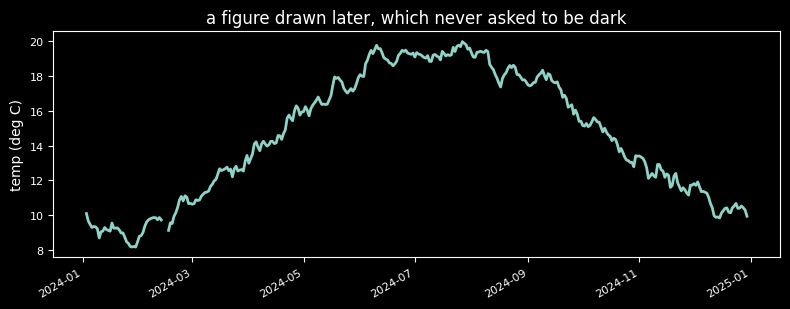

**Output**

```text
Nothing in the cell that drew that figure mentions a style.
```

### Cell 88

```python
# ============================================================
#  THE FIX: reset, then compare styles inside context managers
# ============================================================
plt.rcParams.update(plt.rcParamsDefault)
print(f"after reset : {n_nondefault()} rcParams differ from default")

# Ask for what we want, fall back to whatever this matplotlib actually ships.
def pick(*names):
    for n in names:
        if n in plt.style.available:
            return n
    return "classic"

wanted = [pick("ggplot"),
          pick("seaborn-v0_8-whitegrid", "seaborn-whitegrid", "bmh"),
          pick("fivethirtyeight")]
print(f"{len(plt.style.available)} styles available; showing: {wanted}")

fig = plt.figure(figsize=(15, 3.8))
panels = wanted + [None]           # None = 'our own rcParams', not a stylesheet
for i, name in enumerate(panels, start=1):
    ctx = (plt.style.context(name) if name is not None else
           plt.rc_context({"axes.prop_cycle": mine, "axes.grid": True,
                           "grid.alpha": 0.35, "axes.spines.top": False,
                           "axes.spines.right": False, "font.size": 9}))
    with ctx:                       # <-- Axes CREATED inside the block
        ax = fig.add_subplot(1, 4, i)
        for col in smooth.columns:
            ax.plot(smooth.index, smooth[col], lw=1.6)
        ax.set_title(name if name is not None else "rc_context: our own", fontsize=10)
        ax.tick_params(labelsize=6, labelrotation=30)
fig.tight_layout()
plt.show()

print(f"after the four context blocks : {n_nondefault()} rcParams differ from default")
```

**Output**

```text
after reset : 0 rcParams differ from default
29 styles available; showing: ['ggplot', 'seaborn-v0_8-whitegrid', 'fivethirtyeight']
```

**Output**

```text
<Figure size 1500x380 with 4 Axes>
```

**Figure**

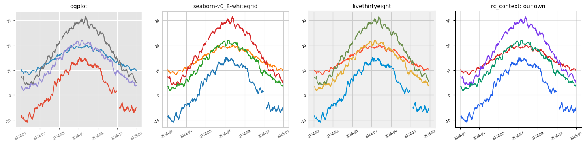

**Output**

```text
after the four context blocks : 0 rcParams differ from default
```

### Cell 90

```python
# ============================================================
#  A few sensible global defaults -- set, seen, and then given back
# ============================================================
SENSIBLE = {
    "figure.figsize":      (8.0, 4.5),   # 16:9-ish, not the 4:3 default
    "figure.dpi":          110,          # readable on a modern screen
    "axes.spines.top":     False,        # remove the box; Part 4 says why
    "axes.spines.right":   False,
    "axes.grid":           True,
    "grid.alpha":          0.3,
    "lines.linewidth":     1.8,
    "font.size":           10,
}
plt.rcParams.update(SENSIBLE)
print(f"with our defaults applied : {n_nondefault()} rcParams differ from default")
for k in SENSIBLE:
    print(f"   {k:22s} {plt.rcParams[k]}")

# --- and now hand the session back exactly as we found it -------------------
plt.rcParams.update(plt.rcParamsDefault)
leftover = [k for k in plt.rcParamsDefault
            if k not in {"backend", "interactive"}
            and repr(plt.rcParams[k]) != repr(plt.rcParamsDefault[k])]
print(f"\nEND OF PART 3 -- rcParams differing from default: {len(leftover)}")
print(f"leftovers: {leftover}")
print("rcParams restored" if not leftover else "WARNING: this part leaked style")
```

**Output**

```text
with our defaults applied : 7 rcParams differ from default
   figure.figsize         [8.0, 4.5]
   figure.dpi             110.0
   axes.spines.top        False
   axes.spines.right      False
   axes.grid              True
   grid.alpha             0.3
   lines.linewidth        1.8
   font.size              10.0

END OF PART 3 -- rcParams differing from default: 0
leftovers: []
rcParams restored
```

### Cell 93

```python
# ============================================================
#  Measure first. The two impossible readings were injected in
#  Part 0 (a 61.0 and a -40.0), so we know exactly which they are.
# ============================================================
bad_mask = weather.temp_c.isin([61.0, -40.0])
real = weather.loc[~bad_mask, "temp_c"].dropna()
p1, p99 = real.quantile([0.01, 0.99])

fig, (axA, axB) = plt.subplots(1, 2, figsize=(11.5, 3.8))

axA.plot(wide.index, wide.values, lw=0.8)
axA.set_title("default limits (the Part 0 figure)", fontsize=10)

axB.plot(wide.index, wide.values, lw=0.8)
axB.set_xlim(pd.Timestamp("2024-03-01"), pd.Timestamp("2024-04-01"))
axB.set_ylim(-5, 30)
axB.set_title("set_xlim + set_ylim: one month, sensible range", fontsize=10)

plt.show()

y0, y1 = axA.get_ylim()
span = y1 - y0
print(f"the two impossible readings : {sorted(weather.loc[bad_mask, 'temp_c'])}")
print(f"default y-limits            : {y0:.1f} to {y1:.1f}   (span {span:.1f} degrees)")
print(f"real readings span          : {real.min():.1f} to {real.max():.1f}")
print()
print("Fraction of the panel's height the real data actually occupies:")
print(f"  every real reading        : {(real.max() - real.min()) / span:6.1%}")
print(f"  the middle 98% of them    : {(p99 - p1) / span:6.1%}")
print()
print("ax.axis() reads all four limits back at once, as (x0, x1, y0, y1):")
print(f"  axB.axis() -> {tuple(round(float(v), 2) for v in axB.axis())}")
print("  (the two x values are matplotlib date numbers -- days since 1970-01-01,")
print("   which is what a date axis is really made of. Section 4.3 formats them.)")
```

**Output**

```text
<Figure size 1150x380 with 2 Axes>
```

**Figure**

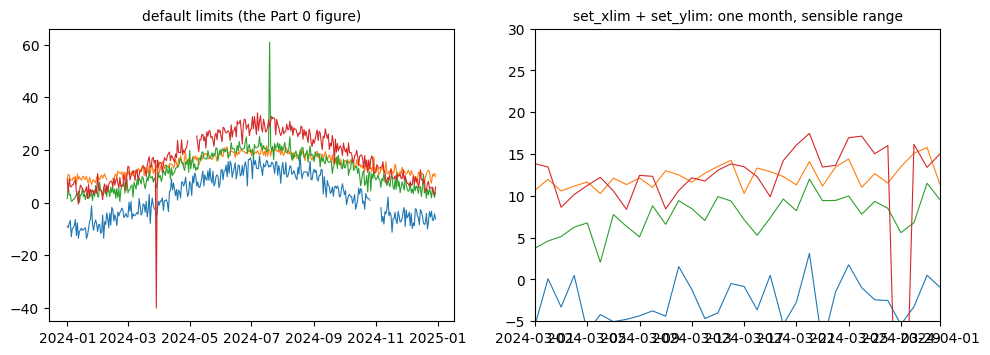

**Output**

```text
the two impossible readings : [-40.0, 61.0]
default y-limits            : -45.0 to 66.0   (span 111.1 degrees)
real readings span          : -13.6 to 34.1

Fraction of the panel's height the real data actually occupies:
  every real reading        :  43.0%
  the middle 98% of them    :  37.0%

ax.axis() reads all four limits back at once, as (x0, x1, y0, y1):
  axB.axis() -> (19783.0, 19814.0, -5.0, 30.0)
  (the two x values are matplotlib date numbers -- days since 1970-01-01,
   which is what a date axis is really made of. Section 4.3 formats them.)
```

### Cell 96

```python
# ============================================================
#  (a) clip the view   (b) mask the data   (c) inset for context
# ============================================================
PLAUSIBLE = (-30.0, 50.0)     # nothing this station network can legitimately record outside this
mask_bad = (wide < PLAUSIBLE[0]) | (wide > PLAUSIBLE[1])
wide_clean = wide.mask(mask_bad)

n_masked = int(mask_bad.values.sum())
real_lo = float(wide_clean.min().min())
real_hi = float(wide_clean.max().max())
print(f"readings outside {PLAUSIBLE[0]:.0f}..{PLAUSIBLE[1]:.0f} C, masked to NaN: {n_masked}")
print(f"real data now spans {real_lo:.1f} to {real_hi:.1f} degrees\n")

# the default span, recomputed here so this cell stands on its own
_f, _a = plt.subplots()
_a.plot(wide.index, wide.values)
default_span = float(np.diff(_a.get_ylim())[0])
plt.close(_f)

fig, (axA, axB, axC) = plt.subplots(1, 3, figsize=(14, 4.0))

# (a) clip the view -- bad points still drawn, they just leave the panel
axA.plot(wide.index, wide.values, lw=0.7)
axA.set_ylim(-15, 35)
axA.set_title("(a) set_ylim(-15, 35)", fontsize=10)

# (b) mask the impossible values -- autoscale then does the right thing
axB.plot(wide.index, wide_clean.values, lw=0.7)
axB.set_title("(b) mask them as NaN, let it autoscale", fontsize=10)

# (c) keep everything, but give the outliers their own small panel
axC.plot(wide.index, wide.values, lw=0.7)
axC.set_ylim(-15, 35)
axC.set_title("(c) sensible view + inset with the full range", fontsize=10)
ins = axC.inset_axes([0.58, 0.60, 0.40, 0.38])
ins.plot(wide.index, wide.values, lw=0.5)
ins.set_ylim(-45, 65)
ins.set_xticks([])
ins.tick_params(labelsize=7)
ins.set_title("full range", fontsize=7)

plt.show()

def vfrac(ax):
    """Fraction of this axes' height occupied by the real (non-impossible) data."""
    lo, hi = ax.get_ylim()
    return (real_hi - real_lo) / (hi - lo)

print("Fraction of panel height the real data occupies:")
print(f"  before (Part 0 defaults) : {(real_hi - real_lo) / default_span:6.1%}")
print(f"  (a) set_ylim             : {vfrac(axA):6.1%}")
print(f"  (b) masked as NaN        : {vfrac(axB):6.1%}")
print(f"  (c) main panel of inset  : {vfrac(axC):6.1%}")
```

**Output**

```text
readings outside -30..50 C, masked to NaN: 2
real data now spans -13.6 to 34.1 degrees
```

**Output**

```text
<Figure size 1400x400 with 3 Axes>
```

**Figure**

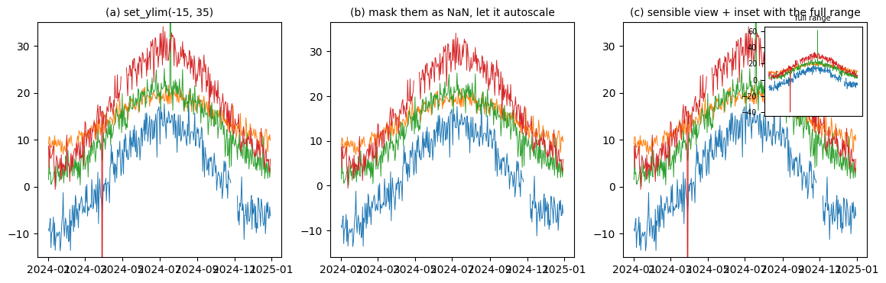

**Output**

```text
Fraction of panel height the real data occupies:
  before (Part 0 defaults) :  43.0%
  (a) set_ylim             :  95.4%
  (b) masked as NaN        :  90.9%
  (c) main panel of inset  :  95.4%
```

### Cell 99

```python
# ============================================================
#  margins, frozen autoscale, and how to unfreeze it
# ============================================================
fig, axes = plt.subplots(2, 2, figsize=(12, 6.4))
(axA, axB), (axC, axD) = axes

# --- A: the default 5% margin on each side -------------------------------
axA.plot(wide.index, wide_clean["Valley"], lw=0.8, color=C_LINE)
axA.set_title("default margins (5% each side)", fontsize=10)

# --- B: no padding at all -------------------------------------------------
axB.plot(wide.index, wide_clean["Valley"], lw=0.8, color=C_LINE)
axB.margins(x=0, y=0)
axB.set_title("ax.margins(x=0, y=0)", fontsize=10)

# --- C: set_ylim first, then add a series that does not fit ---------------
axC.plot(wide.index, wide_clean["Coastal"], lw=0.8, color=C_LINE)
axC.set_ylim(5, 25)                                    # y-autoscaling now OFF
axC.plot(wide.index, wide_clean["Alpine"], lw=0.8, color=C_ALT)   # mostly below 5
axC.set_title("set_ylim, THEN plot: red series is cut off", fontsize=10)

# --- D: identical, then explicitly re-enable autoscaling ------------------
axD.plot(wide.index, wide_clean["Coastal"], lw=0.8, color=C_LINE)
axD.set_ylim(5, 25)
axD.plot(wide.index, wide_clean["Alpine"], lw=0.8, color=C_ALT)
axD.autoscale(enable=True, axis="y")                   # back on, and it rescales
axD.set_title("...then ax.autoscale(enable=True, axis='y')", fontsize=10)

plt.tight_layout()
plt.show()

def lims(ax):
    return tuple(round(float(v), 1) for v in ax.get_ylim())

print(f"default margins            : {axA.margins()}")
print(f"after margins(x=0, y=0)    : {axB.margins()}")
print(f"panel C y-autoscale on?    : {axC.get_autoscaley_on()}   ylim {lims(axC)}")
print(f"panel D y-autoscale on?    : {axD.get_autoscaley_on()}    ylim {lims(axD)}")

# --- and the case relim() exists for: removing an artist ------------------
_f, _a = plt.subplots()
_a.plot(wide.index, wide_clean["Coastal"])
_a.plot(wide.index, wide_clean["Alpine"])
dl = lambda a: tuple(round(float(v), 1) for v in a.dataLim.intervaly)
print(f"\ndataLim y with both series       : {dl(_a)}")
_a.get_lines()[1].remove()
print(f"after .remove(), dataLim is stale : {dl(_a)}")
_a.relim(); _a.autoscale_view()
print(f"after relim() + autoscale_view() : {dl(_a)}")
plt.close(_f)
```

**Output**

```text
<Figure size 1200x640 with 4 Axes>
```

**Figure**

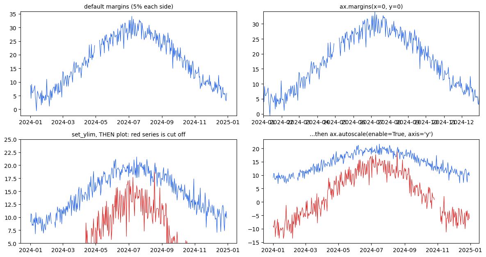

**Output**

```text
default margins            : (0.05, 0.05)
after margins(x=0, y=0)    : (0, 0)
panel C y-autoscale on?    : False   ylim (5.0, 25.0)
panel D y-autoscale on?    : True    ylim (-15.4, 23.4)

dataLim y with both series       : (-13.6, 21.6)
after .remove(), dataLim is stale : (-13.6, 21.6)
after relim() + autoscale_view() : (6.8, 21.6)
```

### Cell 103

```python
# ============================================================
#  Locators and formatters, six panels
# ============================================================
from matplotlib.ticker import (MaxNLocator, MultipleLocator,
                               FuncFormatter, PercentFormatter)

valley = wide_clean["Valley"].dropna()
monthly = wide_clean["Valley"].resample("MS").mean()          # 12 monthly means
MONTHS = ["Jan", "Feb", "Mar", "Apr", "May", "Jun",
          "Jul", "Aug", "Sep", "Oct", "Nov", "Dec"]

fig, axes = plt.subplots(2, 3, figsize=(15, 7.0))
(axA, axB, axC), (axD, axE, axF) = axes

# --- A: baseline, whatever matplotlib picks ------------------------------
axA.plot(valley.index, valley.values, lw=0.7, color=C_LINE)
axA.set_title("A. default locator + formatter", fontsize=10)

# --- B: MaxNLocator -- 'at most this many, at round numbers' -------------
axB.plot(valley.index, valley.values, lw=0.7, color=C_LINE)
axB.yaxis.set_major_locator(MaxNLocator(4))
axB.set_title("B. MaxNLocator(4) on y", fontsize=10)

# --- C: MultipleLocator -- 'every k units', plus a minor grid ------------
axC.plot(valley.index, valley.values, lw=0.7, color=C_LINE)
axC.yaxis.set_major_locator(MultipleLocator(10))
axC.yaxis.set_minor_locator(MultipleLocator(2.5))
axC.grid(which="major", axis="y", alpha=0.35)
axC.grid(which="minor", axis="y", alpha=0.15)
axC.set_title("C. MultipleLocator(10) + minor(2.5)", fontsize=10)

# --- D: FuncFormatter -- the units live on the ticks ---------------------
axD.plot(valley.index, valley.values, lw=0.7, color=C_LINE)
axD.yaxis.set_major_locator(MaxNLocator(5))
axD.yaxis.set_major_formatter(FuncFormatter(lambda v, pos: f"{v:.0f} °C"))
axD.set_title("D. FuncFormatter: '12 °C'", fontsize=10)

# --- E: PercentFormatter on a fraction --------------------------------------
xs = np.sort(valley.values)
ys = np.arange(1, len(xs) + 1) / len(xs)          # ECDF, a fraction in 0..1
axE.plot(xs, ys, lw=1.4, color=C_ACC)
axE.yaxis.set_major_formatter(PercentFormatter(xmax=1))
axE.set_title("E. PercentFormatter(xmax=1)", fontsize=10)

# --- F: set_xticks THEN set_xticklabels, rotated and right-aligned -------
axF.plot(range(12), monthly.values, marker="o", lw=1.2, color=C_OK)
axF.set_xticks(range(12))
axF.set_xticklabels(MONTHS, rotation=45, ha="right")
axF.set_title("F. set_xticks + set_xticklabels, ha='right'", fontsize=10)

plt.tight_layout()
plt.show()

print(f"A y-ticks : {[round(float(t), 1) for t in axA.get_yticks()]}")
print(f"B y-ticks : {[round(float(t), 1) for t in axB.get_yticks()]}   <- MaxNLocator(4)")
print(f"C y-ticks : {[round(float(t), 1) for t in axC.get_yticks()]}   <- MultipleLocator(10)")
print(f"D labels  : {[t.get_text() for t in axD.get_yticklabels()][:4]} ...")
print(f"F labels  : {[t.get_text() for t in axF.get_xticklabels()][:4]} ...")
```

**Output**

```text
<Figure size 1500x700 with 6 Axes>
```

**Figure**

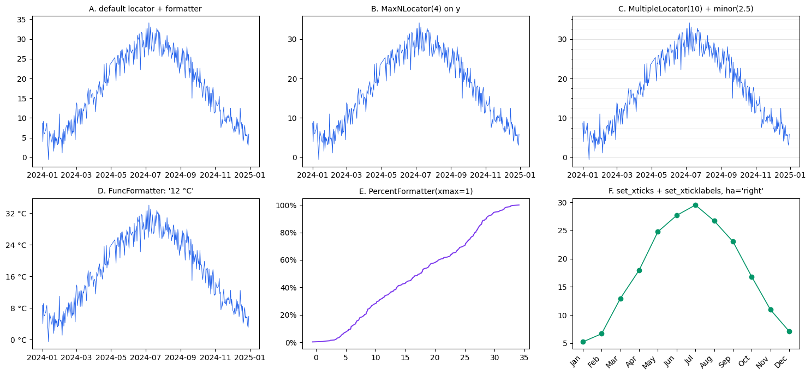

**Output**

```text
A y-ticks : [-5.0, 0.0, 5.0, 10.0, 15.0, 20.0, 25.0, 30.0, 35.0, 40.0]
B y-ticks : [-10.0, 0.0, 10.0, 20.0, 30.0, 40.0]   <- MaxNLocator(4)
C y-ticks : [-10.0, 0.0, 10.0, 20.0, 30.0, 40.0]   <- MultipleLocator(10)
D labels  : ['-8 °C', '0 °C', '8 °C', '16 °C'] ...
F labels  : ['Jan', 'Feb', 'Mar', 'Apr'] ...
```

### Cell 105

```python
# ============================================================
#  The failure first: set_xticklabels without set_xticks
# ============================================================
fig, (axBad, axGood) = plt.subplots(1, 2, figsize=(11.5, 3.8))

# --- WRONG: label the ticks matplotlib happened to choose ----------------
import warnings

axBad.plot(range(12), monthly.values, marker="o", lw=1.2, color=C_ALT)
fig.canvas.draw()                       # force the auto locator to commit
auto_positions = [float(t) for t in axBad.get_xticks()]
with warnings.catch_warnings(record=True) as caught:
    warnings.simplefilter("always")
    axBad.set_xticklabels((MONTHS * 3)[:len(auto_positions)])   # no set_xticks!
axBad.set_title("WRONG: set_xticklabels alone", fontsize=10)

# --- RIGHT: pin the positions, then name them ----------------------------
axGood.plot(range(12), monthly.values, marker="o", lw=1.2, color=C_OK)
axGood.set_xticks(range(12))
axGood.set_xticklabels(MONTHS, rotation=45, ha="right")
axGood.set_title("RIGHT: set_xticks, then set_xticklabels", fontsize=10)

plt.tight_layout()
plt.show()

print("What the WRONG panel actually claims:")
for pos, lab in zip(auto_positions, [t.get_text() for t in axBad.get_xticklabels()]):
    truth = MONTHS[int(pos)] if 0 <= pos < 12 else "(off the data)"
    flag = "  <-- WRONG" if truth != lab else ""
    print(f"   x = {pos:5.1f}  labelled {lab!r:>7}   really {truth}{flag}")

print(f"\nmatplotlib said something about it: {len(caught)} warning(s)")
for w in caught:
    print(f"   {w.category.__name__}: {w.message}")
print()
print("It warned. It did not stop, and it did not fix anything -- the figure")
print("above was still drawn, with almost every label on the wrong tick.")
```

**Output**

```text
<Figure size 1150x380 with 2 Axes>
```

**Figure**

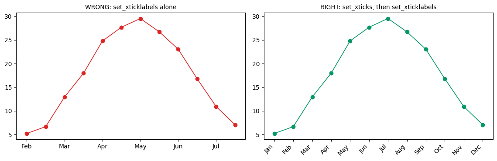

**Output**

```text
What the WRONG panel actually claims:
   x =  -2.0  labelled   'Jan'   really (off the data)  <-- WRONG
   x =   0.0  labelled   'Feb'   really Jan  <-- WRONG
   x =   2.0  labelled   'Mar'   really Mar
   x =   4.0  labelled   'Apr'   really May  <-- WRONG
   x =   6.0  labelled   'May'   really Jul  <-- WRONG
   x =   8.0  labelled   'Jun'   really Sep  <-- WRONG
   x =  10.0  labelled   'Jul'   really Nov  <-- WRONG
   x =  12.0  labelled   'Aug'   really (off the data)  <-- WRONG

matplotlib said something about it: 1 warning(s)
   UserWarning: set_ticklabels() should only be used with a fixed number of ticks, i.e. after set_ticks() or using a FixedLocator.

It warned. It did not stop, and it did not fix anything -- the figure
above was still drawn, with almost every label on the wrong tick.
```

### Cell 108

```python
# ============================================================
#  Defect 7: the x-axis is dates, and nobody told matplotlib
# ============================================================
import matplotlib.dates as mdates

coastal = wide_clean["Coastal"]

fig, (axA, axB, axC) = plt.subplots(1, 3, figsize=(15, 4.2))

# --- A: dates that arrived as strings (a CSV read without parse_dates) ---
axA.plot(coastal.index.strftime("%Y-%m-%d"), coastal.values, lw=0.7, color=C_ALT)
axA.set_title("A. dates as strings: 365 categories", fontsize=10)

# --- B: real datetimes, matplotlib's own date machinery, rotated ---------
axB.plot(coastal.index, coastal.values, lw=0.7, color=C_WARN)
axB.tick_params(axis="x", rotation=45)          # rotation only -- note the drift
axB.set_title("B. real dates, rotated (default ha)", fontsize=10)

# --- C: locator + formatter chosen on purpose, labels anchored -----------
axC.plot(coastal.index, coastal.values, lw=0.7, color=C_OK)
axC.xaxis.set_major_locator(mdates.MonthLocator(interval=2))
axC.xaxis.set_minor_locator(mdates.MonthLocator())
axC.xaxis.set_major_formatter(mdates.DateFormatter("%b %Y"))
axC.tick_params(axis="x", rotation=45)
for lab in axC.get_xticklabels():
    lab.set_ha("right")
axC.set_title("C. MonthLocator + DateFormatter, ha='right'", fontsize=10)

plt.tight_layout()
plt.show()

print(f"A: number of x-ticks     : {len(axA.get_xticks())}  (one per string category)")
print(f"B: number of x-ticks     : {len(axB.get_xticks())}")
print(f"B: labels                : {[t.get_text() for t in axB.get_xticklabels()][:4]} ...")
print(f"C: number of x-ticks     : {len(axC.get_xticks())}")
print(f"C: labels                : {[t.get_text() for t in axC.get_xticklabels()]}")
print()
print("A also loses a real property of the data: with string categories the")
print("spacing between two points is 1, whatever the gap between the dates.")
```

**Output**

```text
<Figure size 1500x420 with 3 Axes>
```

**Figure**

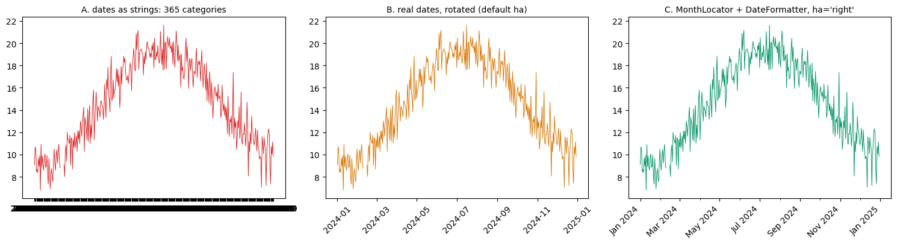

**Output**

```text
A: number of x-ticks     : 365  (one per string category)
B: number of x-ticks     : 7
B: labels                : ['2024-01', '2024-03', '2024-05', '2024-07'] ...
C: number of x-ticks     : 7
C: labels                : ['Jan 2024', 'Mar 2024', 'May 2024', 'Jul 2024', 'Sep 2024', 'Nov 2024', 'Jan 2025']

A also loses a real property of the data: with string categories the
spacing between two points is 1, whatever the gap between the dates.
```

### Cell 111

```python
# ============================================================
#  log where it fails, symlog where it works, log where it belongs
# ============================================================
temps = wide_clean["Alpine"].dropna()
rain = weather.loc[weather.station == "Valley", "rain_mm"].dropna()
rain = rain[rain > 0]

n_nonpos = int((temps <= 0).sum())
print(f"Alpine readings                : {len(temps)}")
print(f"  of which <= 0 C              : {n_nonpos}  ({n_nonpos / len(temps):.1%})")
print("  -> every one of those is dropped by a log y-axis\n")
print(f"Valley rainfall  min {rain.min():.2e} mm | median {rain.median():.2f} mm | "
      f"p99 {rain.quantile(0.99):.1f} mm | max {rain.max():.1f} mm")
print(f"  max / median = {rain.max() / rain.median():.0f}x  -- genuinely skewed")
print(f"  days below 0.01 mm (a trace of drizzle): {int((rain < 0.01).sum())}, "
      f"spanning {np.log10(rain.max() / rain.min()):.1f} decades in all\n")

fig, (axA, axB, axC, axD) = plt.subplots(1, 4, figsize=(16, 3.8))

# --- A: log on data that goes below zero. The failure. -------------------
axA.plot(temps.index, temps.values, lw=0.7, color=C_ALT)
axA.set_yscale("log")
axA.set_title("A. set_yscale('log'), data < 0", fontsize=10)

# --- B: symlog -- linear near zero, log outside it -----------------------
axB.plot(temps.index, temps.values, lw=0.7, color=C_WARN)
axB.set_yscale("symlog", linthresh=1)
axB.set_title("B. symlog(linthresh=1): keeps them", fontsize=10)

# --- C/D: rainfall, which is skewed and strictly positive ----------------
axC.hist(rain, bins=40, color=C_LINE, alpha=0.85)
axC.set_title("C. rainfall, linear x", fontsize=10)

bins = np.logspace(np.log10(rain.min()), np.log10(rain.max()), 40)
axD.hist(rain, bins=bins, color=C_OK, alpha=0.85)
axD.set_xscale("log")
axD.set_title("D. rainfall, log x + log-spaced bins", fontsize=10)

plt.tight_layout()
plt.show()

lo, hi = axA.get_ylim()
kept = int(((temps > 0) & (temps >= lo) & (temps <= hi)).sum())
print(f"Panel A y-limits: {lo:.2f} to {hi:.2f}")
print(f"Panel A shows {kept} of {len(temps)} readings ({kept / len(temps):.1%}). "
      f"The other {len(temps) - kept} are simply not there.")
```

**Output**

```text
Alpine readings                : 355
  of which <= 0 C              : 148  (41.7%)
  -> every one of those is dropped by a log y-axis

Valley rainfall  min 4.35e-04 mm | median 1.75 mm | p99 35.4 mm | max 54.5 mm
  max / median = 31x  -- genuinely skewed
  days below 0.01 mm (a trace of drizzle): 10, spanning 5.1 decades in all
```

**Output**

```text
<Figure size 1600x380 with 4 Axes>
```

**Figure**

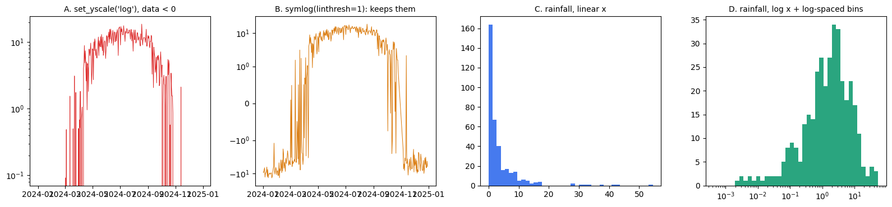

**Output**

```text
Panel A y-limits: 0.07 to 24.39
Panel A shows 207 of 355 readings (58.3%). The other 148 are simply not there.
```

### Cell 115

```python
# ============================================================
#  Same data, same size. Only the furniture changes.
# ============================================================
sub = wide_clean.loc["2024-03-01":"2024-06-30"]

fig, (axA, axB) = plt.subplots(1, 2, figsize=(12, 4.2), sharey=True)

# --- A: full box, heavy grid, drawn in front -----------------------------
for col, c in zip(sub.columns, [C_LINE, C_ALT, C_OK, C_ACC]):
    axA.plot(sub.index, sub[col], lw=1.0, color=c)
axA.grid(True, which="major", color="#999999", lw=1.2, alpha=1.0)
axA.set_axisbelow(False)                       # grid ON TOP of the data
axA.tick_params(axis="x", rotation=45)
axA.set_title("A. full box, heavy grid in front", fontsize=10)

# --- B: two spines removed, faint grid behind, y only --------------------
for col, c in zip(sub.columns, [C_LINE, C_ALT, C_OK, C_ACC]):
    axB.plot(sub.index, sub[col], lw=1.0, color=c)
axB.spines["top"].set_visible(False)
axB.spines["right"].set_visible(False)
axB.spines["left"].set_color(C_GREY)
axB.spines["bottom"].set_color(C_GREY)
axB.grid(True, which="major", axis="y", color=C_GREY, lw=0.6, alpha=0.30)
axB.set_axisbelow(True)                        # grid BEHIND the data
axB.axhline(0, color=C_GREY, lw=0.8)           # zero is a real reference here
axB.tick_params(axis="x", rotation=45, colors=C_GREY)
axB.set_title("B. top/right gone, faint y-grid behind", fontsize=10)

for lab in list(axA.get_xticklabels()) + list(axB.get_xticklabels()):
    lab.set_ha("right")

plt.tight_layout()
plt.show()

print(f"A: axisbelow = {axA.get_axisbelow()},  visible spines = "
      f"{[k for k, s in axA.spines.items() if s.get_visible()]}")
print(f"B: axisbelow = {axB.get_axisbelow()},  visible spines = "
      f"{[k for k, s in axB.spines.items() if s.get_visible()]}")
print()
print("A spine can also be moved rather than hidden:")
print("  ax.spines['left'].set_position(('data', 0))     -> pin it to x = 0")
print("  ax.spines['left'].set_position(('outward', 10)) -> float it 10pt clear")
```

**Output**

```text
<Figure size 1200x420 with 2 Axes>
```

**Figure**

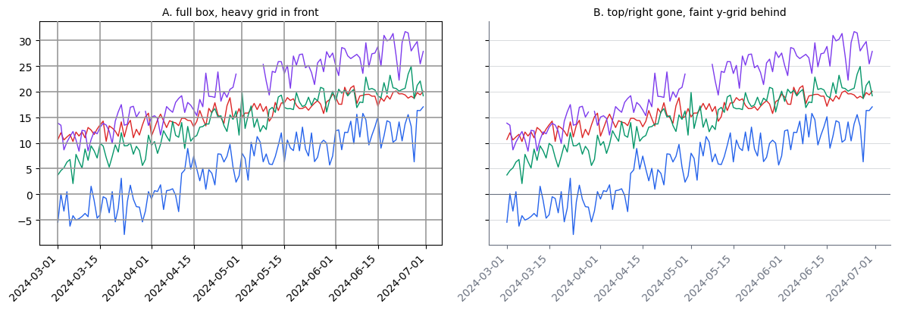

**Output**

```text
A: axisbelow = False,  visible spines = ['left', 'right', 'bottom', 'top']
B: axisbelow = True,  visible spines = ['left', 'bottom']

A spine can also be moved rather than hidden:
  ax.spines['left'].set_position(('data', 0))     -> pin it to x = 0
  ax.spines['left'].set_position(('outward', 10)) -> float it 10pt clear
```

### Cell 118

```python
# ============================================================
#  The same two series, plotted twice, telling opposite stories
# ============================================================
val = weather[weather.station == "Valley"].set_index("date")
mon_t = val["temp_c"].where(val["temp_c"].between(-30, 50)).resample("MS").mean()
mon_r = val["rain_mm"].resample("MS").sum()

r = float(np.corrcoef(mon_t.values, mon_r.values)[0, 1])
print(f"Pearson correlation, monthly mean temp vs monthly total rain: r = {r:+.3f}")
print("That number is a property of the data. Neither panel below changes it.\n")

fig, (axA, axB) = plt.subplots(1, 2, figsize=(12.5, 4.2))

for ax, title, invert in [(axA, "A. rain axis as it comes", False),
                          (axB, "B. rain axis reversed", True)]:
    ax.plot(mon_t.index, mon_t.values, lw=2.0, color=C_ALT, marker="o", ms=4)
    ax.set_ylabel("mean temperature (°C)", color=C_ALT)
    ax.tick_params(axis="y", labelcolor=C_ALT)
    ax.spines["top"].set_visible(False)

    ax2 = ax.twinx()
    ax2.plot(mon_r.index, mon_r.values, lw=2.0, color=C_LINE, marker="s", ms=4)
    ax2.set_ylabel("total rainfall (mm)", color=C_LINE)
    ax2.tick_params(axis="y", labelcolor=C_LINE)
    ax2.spines["top"].set_visible(False)
    if invert:
        lo, hi = ax2.get_ylim()
        ax2.set_ylim(hi, lo)                  # one line. That is all it takes.
    ax.set_title(title, fontsize=10)
    ax.xaxis.set_major_locator(mdates.MonthLocator(interval=3))
    ax.xaxis.set_major_formatter(mdates.DateFormatter("%b"))

plt.tight_layout()
plt.show()

print("Panel A: the two lines pull apart  -> 'wet months are the cold months'")
print("Panel B: the two lines track       -> 'rain follows temperature'")
print(f"Both panels plot the same {len(mon_t)} pairs of numbers, and r is still {r:+.3f}.")
```

**Output**

```text
Pearson correlation, monthly mean temp vs monthly total rain: r = -0.924
That number is a property of the data. Neither panel below changes it.
```

**Output**

```text
<Figure size 1250x420 with 4 Axes>
```

**Figure**

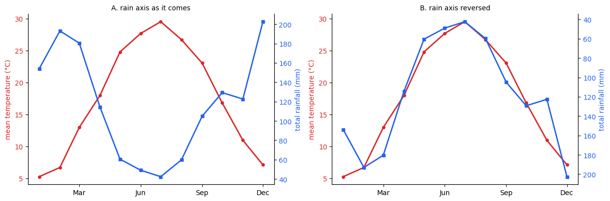

**Output**

```text
Panel A: the two lines pull apart  -> 'wet months are the cold months'
Panel B: the two lines track       -> 'rain follows temperature'
Both panels plot the same 12 pairs of numbers, and r is still -0.924.
```

### Cell 121

```python
# ============================================================
#  Part 0's figure, rebuilt with nothing but the axis tools
#  from this part. No legend, no labels, no annotation yet --
#  those are Part 5. This is the axes alone.
# ============================================================
fig, (axBefore, axAfter) = plt.subplots(1, 2, figsize=(13.5, 4.4))

# ---- before: exactly the Part 0 call -------------------------------------
axBefore.plot(wide.index, wide.values, lw=0.8)
axBefore.set_title("Part 0: every default", fontsize=11)

# ---- after: limits, ticks, dates, spines, grid ---------------------------
for col, c in zip(wide_clean.columns, [C_ACC, C_LINE, C_OK, C_ALT]):
    axAfter.plot(wide_clean.index, wide_clean[col], lw=0.9, color=c)

loc = mdates.AutoDateLocator(minticks=6, maxticks=10)
axAfter.xaxis.set_major_locator(loc)
axAfter.xaxis.set_major_formatter(mdates.ConciseDateFormatter(loc))
axAfter.yaxis.set_major_locator(MaxNLocator(6))
axAfter.yaxis.set_major_formatter(FuncFormatter(lambda v, pos: f"{v:.0f} °C"))
axAfter.margins(x=0.01)
axAfter.spines["top"].set_visible(False)
axAfter.spines["right"].set_visible(False)
axAfter.spines["left"].set_color(C_GREY)
axAfter.spines["bottom"].set_color(C_GREY)
axAfter.grid(True, axis="y", color=C_GREY, lw=0.6, alpha=0.30)
axAfter.set_axisbelow(True)
axAfter.set_title(f"Part 4: {n_masked} impossible readings masked, axes chosen",
                  fontsize=11)

plt.tight_layout()
plt.show()

def occupancy(ax):
    lo, hi = ax.get_ylim()
    return (real_hi - real_lo) / (hi - lo)

ylims = lambda ax: tuple(round(float(v), 1) for v in ax.get_ylim())
print(f"vertical space given to the real data")
print(f"  before : {occupancy(axBefore):6.1%}   (y-limits {ylims(axBefore)})")
print(f"  after  : {occupancy(axAfter):6.1%}   (y-limits {ylims(axAfter)})")
print(f"  gain   : {occupancy(axAfter) / occupancy(axBefore):.2f}x")
print()
print(f"x-tick labels before : {[t.get_text() for t in axBefore.get_xticklabels()][:3]} ...")
print(f"x-tick labels after  : {[t.get_text() for t in axAfter.get_xticklabels()][:3]} ...")
print()
print("Still missing, on purpose: a legend, axis labels, a title that says")
print("something, and a mark where the sensors failed. That is Part 5.")
```

**Output**

```text
<Figure size 1350x440 with 2 Axes>
```

**Figure**

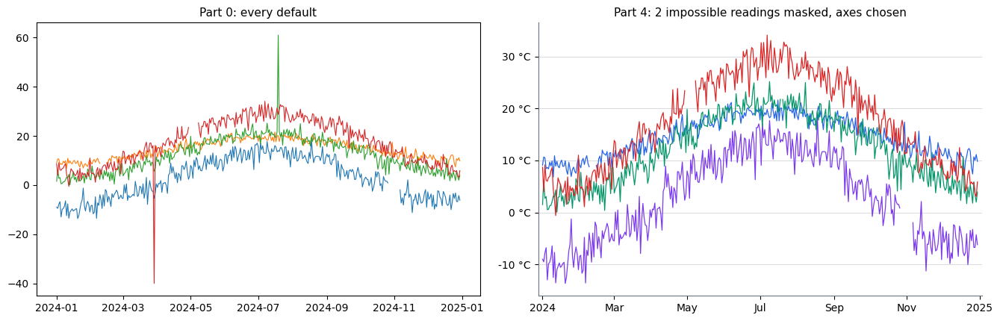

**Output**

```text
vertical space given to the real data
  before :  43.0%   (y-limits (-45.0, 66.0))
  after  :  90.9%   (y-limits (-16.0, 36.5))
  gain   : 2.12x

x-tick labels before : ['2024-01', '2024-03', '2024-05'] ...
x-tick labels after  : ['2024', 'Mar', 'May'] ...

Still missing, on purpose: a legend, axis labels, a title that says
something, and a mark where the sensors failed. That is Part 5.
```

### Cell 125

```python
# ============================================================
#  The canvas for Part 5.
#  Part 4 already fixed the y-limits and the date ticks, so we
#  wrap that work in one helper and stop thinking about it.
#  Everything below is about what the figure SAYS.
# ============================================================
import warnings
import matplotlib.dates as mdates

# one colour per station, fixed for the whole part
COLORS = {"Coastal": C_LINE, "Valley": C_ALT, "Foothill": C_OK, "Alpine": C_ACC}

# the two impossible readings are masked out of `clean` so they stop
# owning the y-axis -- but we keep `wide` around, because in a moment we
# are going to point an arrow at exactly where they were.
PLAUSIBLE = (-25.0, 50.0)
bad   = (wide < PLAUSIBLE[0]) | (wide > PLAUSIBLE[1])
clean = wide.mask(bad)

spikes = [(st, d, wide.loc[d, st])
          for st in wide.columns for d in wide.index[bad[st].fillna(False)]]


def nan_runs(s):
    """Contiguous runs of missing values in a series -> (start, end, n_days)."""
    isna, runs, start = s.isna().to_numpy(), [], None
    for i, v in enumerate(isna):
        if v and start is None:
            start = i
        elif not v and start is not None:
            runs.append((s.index[start], s.index[i - 1], i - start))
            start = None
    if start is not None:
        runs.append((s.index[start], s.index[-1], len(isna) - start))
    return runs


gaps = [(st, a, b, n) for st in wide.columns for a, b, n in nan_runs(wide[st])]

# sensible, stable y-limits computed from the plausible data only
YLO = float(np.floor(clean.min().min()) - 1)
YHI = float(np.ceil(clean.max().max()) + 1)


def base_ax(figsize=(9.0, 4.2)):
    """A correctly-scaled, correctly-ticked axes. Part 4's work, bottled."""
    fig, ax = plt.subplots(figsize=figsize)
    ax.set_ylim(YLO, YHI)
    ax.xaxis.set_major_locator(mdates.MonthLocator(interval=2))
    ax.xaxis.set_major_formatter(mdates.DateFormatter("%b"))
    return fig, ax


def draw4(ax, labelled=False, lw=1.0, alpha=1.0, order=None):
    """Draw the four cleaned series. `labelled` controls ONE keyword: label=."""
    for name in (order or list(COLORS)):
        kw = {"label": name} if labelled else {}
        ax.plot(clean.index, clean[name], color=COLORS[name],
                lw=lw, alpha=alpha, **kw)


# --- the facts this part is allowed to put in a title ------------------
# a 7-day mean, so one noisy day cannot define a station's "annual swing"
smooth  = clean.rolling(7, center=True, min_periods=5).mean()
ranges  = (smooth.max() - smooth.min()).sort_values(ascending=False)
WIDEST, SWING   = ranges.index[0],  float(ranges.iloc[0])
NARROW, SWING_N = ranges.index[-1], float(ranges.iloc[-1])
RATIO           = SWING / SWING_N
PEAK_DAY        = clean.mean(axis=1).idxmax()
GAP_ST, GAP_A, GAP_B, GAP_N = max(gaps, key=lambda g: g[3])

print(f"y-limits in use     : {YLO:.0f} to {YHI:.0f} °C")
print(f"impossible readings : {len(spikes)}")
for st, d, v in spikes:
    print(f"    {st:9s} {d:%d %b %Y}  {v:+.1f} °C")
print(f"sensor gaps         : {len(gaps)}")
for st, a, b, n in gaps:
    print(f"    {st:9s} {a:%d %b} to {b:%d %b}  ({n} days)")
print(f"widest annual swing : {WIDEST} {SWING:.1f} °C  "
      f"({RATIO:.1f}x {NARROW}'s {SWING_N:.1f} °C)   [7-day mean]")
print(f"pandas hands the columns over as: {list(clean.columns)}")
print(f"warmest day (4-station mean): {PEAK_DAY:%d %b}")
```

**Output**

```text
y-limits in use     : -15 to 36 °C
impossible readings : 2
    Foothill  19 Jul 2024  +61.0 °C
    Valley    29 Mar 2024  -40.0 °C
sensor gaps         : 3
    Alpine    27 Oct to 05 Nov  (10 days)
    Coastal   10 Feb to 14 Feb  (5 days)
    Valley    30 Apr to 07 May  (8 days)
widest annual swing : Valley 27.4 °C  (2.3x Coastal's 11.8 °C)   [7-day mean]
pandas hands the columns over as: ['Alpine', 'Coastal', 'Foothill', 'Valley']
warmest day (4-station mean): 09 Jul
```

### Cell 127

```python
# ---- Title 1: states the CONTENTS. Everything the reader already knew. ----
fig, ax = base_ax()
draw4(ax)
ax.set_xlabel("Date")
ax.set_ylabel("Temperature")            # units? unknown.
ax.set_title("Temperature by station")
plt.show()

# ---- Title 2: states the FINDING. Same data, same figure size. ----
fig, ax = base_ax()
draw4(ax)
ax.set_xlabel("2024")
ax.set_ylabel("Daily mean temperature (°C)")

fig.suptitle(f"{WIDEST} swings {SWING:.0f} °C across the year — "
             f"{RATIO:.1f}x {NARROW}'s {SWING_N:.0f} °C",
             fontsize=13, fontweight="bold", y=0.98)
ax.set_title("Daily mean temperature, four weather stations, 2024. "
             "Swing measured on a 7-day mean.",
             fontsize=9.5, color=C_GREY, pad=8)
fig.subplots_adjust(top=0.82)           # make room, or suptitle sits on the title
plt.show()

print("suptitle belongs to :", type(fig).__name__)
print("title    belongs to :", type(ax).__name__)
```

**Output**

```text
<Figure size 900x420 with 1 Axes>
```

**Figure**

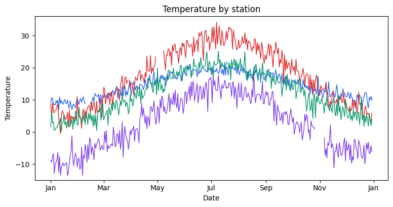

**Output**

```text
<Figure size 900x420 with 1 Axes>
```

**Figure**

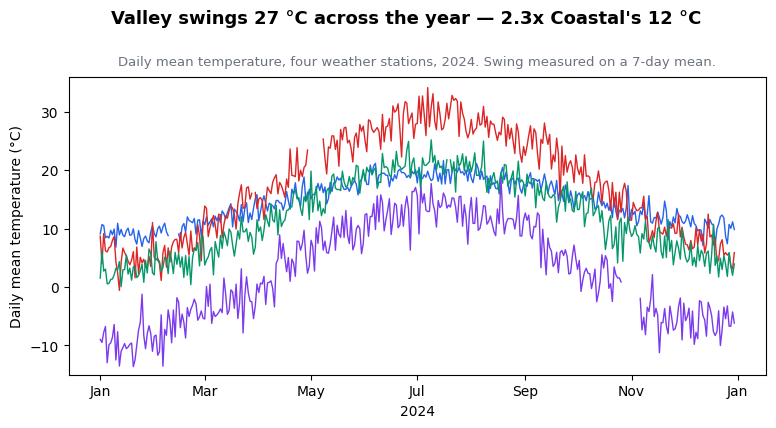

**Output**

```text
suptitle belongs to : Figure
title    belongs to : Axes
```

### Cell 130

```python
# ---- The failure. Four lines, no label= anywhere. ----
fig, ax = base_ax()
draw4(ax, labelled=False)               # <- no label= on any artist
ax.set_ylabel("Daily mean temperature (°C)")
ax.set_title("ax.legend() with nothing to put in it")

with warnings.catch_warnings(record=True) as caught:
    warnings.simplefilter("always")
    leg = ax.legend()

plt.show()
print("what matplotlib said:")
for w in caught:
    print(f"   {w.category.__name__}: {w.message}")
print(f"   returned object : {type(leg).__name__}")
print(f"   entries in it   : {len(leg.get_texts())}")
print(f"   labels the lines actually carry: "
      f"{[l.get_label() for l in ax.get_lines()]}")

# ---- The fix. One keyword, at the point of drawing. ----
fig, ax = base_ax()
draw4(ax, labelled=True)                # <- label=name on every artist
ax.set_ylabel("Daily mean temperature (°C)")
ax.set_title("ax.legend() with label= on every line")
ax.legend()
plt.show()
```

**Output**

```text
<Figure size 900x420 with 1 Axes>
```

**Figure**

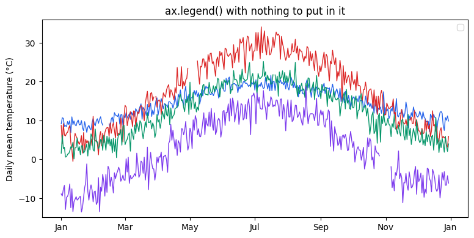

**Output**

```text
what matplotlib said:
   UserWarning: No artists with labels found to put in legend.  Note that artists whose label start with an underscore are ignored when legend() is called with no argument.
   returned object : Legend
   entries in it   : 0
   labels the lines actually carry: ['_child0', '_child1', '_child2', '_child3']
```

**Output**

```text
<Figure size 900x420 with 1 Axes>
```

**Figure**

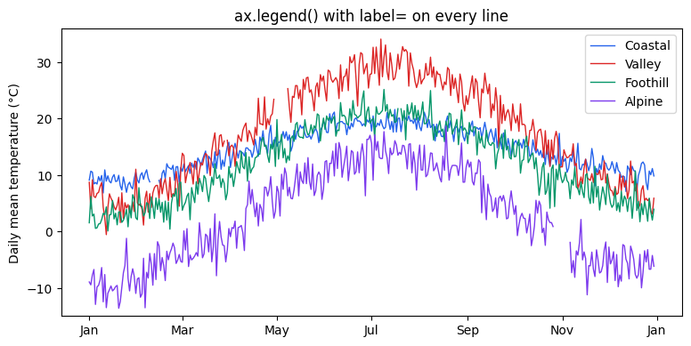

### Cell 133

```python
# Draw in the order pandas hands the columns over -- alphabetical, which is
# the order you get for free and almost never the order the lines appear in.
DRAW_ORDER = list(clean.columns)

# ---- The failure. A legend parked on top of the data. ----
fig, ax = base_ax()
draw4(ax, labelled=True, order=DRAW_ORDER)
ax.set_ylabel("Daily mean temperature (°C)")
ax.set_title("loc chosen badly: the legend covers the summer peak")
ax.legend(loc="center")                 # inside the axes, right over the data
plt.show()

# ---- The fix. Outside the axes, and ordered like the lines look. ----
fig, ax = base_ax()
draw4(ax, labelled=True, order=DRAW_ORDER)
ax.set_ylabel("Daily mean temperature (°C)")
ax.set_title("Legend outside the axes, ordered top-to-bottom as the lines end")

handles, labels = ax.get_legend_handles_labels()

# each line's LAST valid y-value -- sort descending so the legend order
# matches what the eye sees at the right-hand edge of the plot
def final_y(h):
    y = np.asarray(h.get_ydata(), dtype=float)
    y = y[~np.isnan(y)]
    return y[-1]

order = np.argsort([final_y(h) for h in handles])[::-1]

ax.legend([handles[i] for i in order], [labels[i] for i in order],
          loc="center left", bbox_to_anchor=(1.02, 0.5),
          frameon=False, ncol=1, handlelength=1.6, fontsize=9,
          title="Station", title_fontsize=9)
fig.subplots_adjust(right=0.80)         # give the legend somewhere to live
plt.show()

print("draw order  :", labels, "  <- alphabetical, from pandas")
print("legend order:", [labels[i] for i in order],
      "  <- descending final temperature")
for i in order:
    print(f"    {labels[i]:9s} ends at {float(final_y(handles[i])):6.1f} °C")
```

**Output**

```text
<Figure size 900x420 with 1 Axes>
```

**Figure**

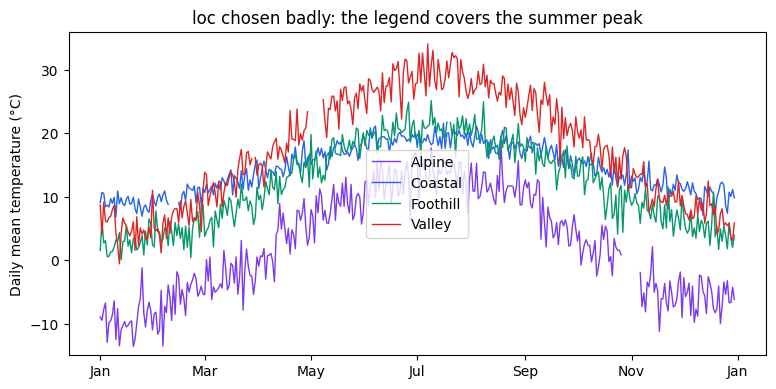

**Output**

```text
<Figure size 900x420 with 1 Axes>
```

**Figure**

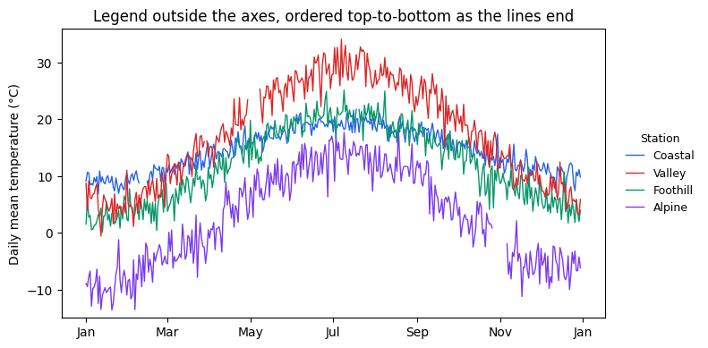

**Output**

```text
draw order  : ['Alpine', 'Coastal', 'Foothill', 'Valley']   <- alphabetical, from pandas
legend order: ['Coastal', 'Valley', 'Foothill', 'Alpine']   <- descending final temperature
    Coastal   ends at    9.8 °C
    Valley    ends at    5.9 °C
    Foothill  ends at    3.9 °C
    Alpine    ends at   -6.2 °C
```

### Cell 137

```python
fig, ax = base_ax(figsize=(9.6, 4.2))

x_end = clean.index[-1]
for name, c in COLORS.items():
    ax.plot(clean.index, clean[name], color=c, lw=1.2)
    y_end = clean[name].tail(7).mean()          # trailing mean, not the last point
    ax.annotate(f" {name}",
                xy=(x_end, y_end), xycoords="data",
                xytext=(6, 0), textcoords="offset points",
                color=c, fontsize=9.5, fontweight="bold", va="center",
                annotation_clip=False)

# room on the right for the labels to live in
ax.set_xlim(clean.index[0], x_end + pd.Timedelta(days=52))
ax.set_ylabel("Daily mean temperature (°C)")
ax.set_xlabel("2024")
ax.set_title("Direct labelling: the name is where the eye already is")
plt.show()

print("no legend was created:", ax.get_legend())
print("label anchors (7-day trailing mean, °C):")
for name in COLORS:
    print(f"   {name:9s} {float(clean[name].tail(7).mean()):6.1f}")
```

**Output**

```text
<Figure size 960x420 with 1 Axes>
```

**Figure**

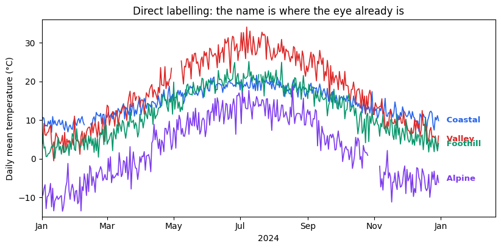

**Output**

```text
no legend was created: None
label anchors (7-day trailing mean, °C):
   Coastal      9.9
   Valley       5.0
   Foothill     3.8
   Alpine      -5.1
```

### Cell 140

```python
MSG = "same string, three transforms"

def place_all_three(fig, ax):
    # 1. DATA coordinates -- the default, no transform argument needed
    ax.text(pd.Timestamp("2024-05-01"), 26, MSG + "  (data: 1 May, 26 °C)",
            color=C_ALT, fontsize=9, fontweight="bold",
            bbox=dict(boxstyle="round,pad=0.3", fc="white", ec=C_ALT))
    # 2. AXES fraction -- glued to the box, whatever is inside it
    ax.text(0.5, 0.5, MSG + "  (axes: 0.5, 0.5)",
            transform=ax.transAxes, ha="center", color=C_ACC, fontsize=9,
            fontweight="bold",
            bbox=dict(boxstyle="round,pad=0.3", fc="white", ec=C_ACC))
    # 3. FIGURE fraction -- glued to the page. Note: fig.text, not ax.text.
    fig.text(0.5, 0.015, MSG + "  (figure: 0.5, 0.015)",
             ha="center", color=C_OK, fontsize=9, fontweight="bold")

# ---- As written. All three land where you expect. ----
fig, ax = base_ax()
draw4(ax)
place_all_three(fig, ax)
ax.set_title("Three transforms, original limits")
plt.show()

# ---- Now zoom in on a cold spring week. Nothing else changed. ----
fig, ax = base_ax()
draw4(ax)
place_all_three(fig, ax)
ax.set_xlim(pd.Timestamp("2024-02-01"), pd.Timestamp("2024-03-15"))
ax.set_ylim(-5, 12)
ax.xaxis.set_major_locator(mdates.WeekdayLocator(byweekday=0, interval=2))
ax.xaxis.set_major_formatter(mdates.DateFormatter("%d %b"))
ax.set_title("Same three text calls, after set_xlim / set_ylim")
plt.show()

print(f"the data-coords text asks for x=2024-05-01, y=26")
ylo, yhi = (float(v) for v in ax.get_ylim())
print(f"the visible window is now  x={mdates.num2date(ax.get_xlim()[0]):%d %b} "
      f"to {mdates.num2date(ax.get_xlim()[1]):%d %b},  y={ylo:.0f} to {yhi:.0f} °C")
print("-> it is still on the figure. It is just not on the part you can see.")
```

**Output**

```text
<Figure size 900x420 with 1 Axes>
```

**Figure**

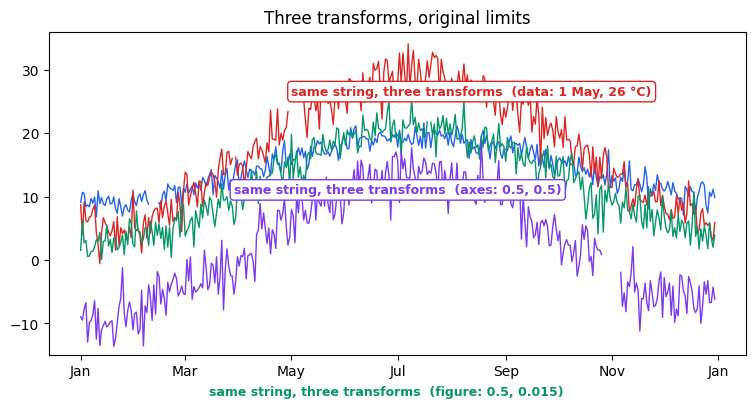

**Output**

```text
<Figure size 900x420 with 1 Axes>
```

**Figure**

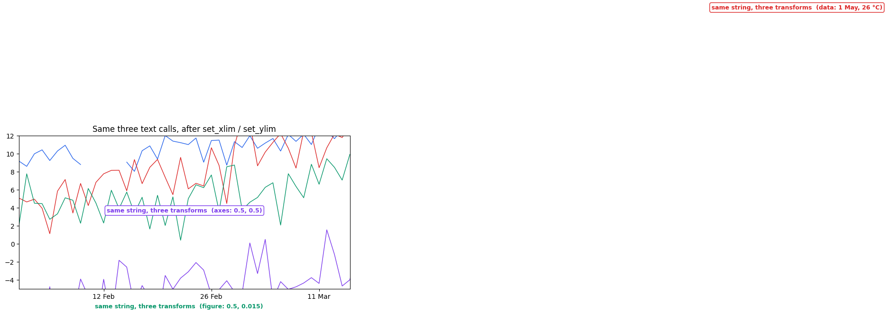

**Output**

```text
the data-coords text asks for x=2024-05-01, y=26
the visible window is now  x=01 Feb to 15 Mar,  y=-5 to 12 °C
-> it is still on the figure. It is just not on the part you can see.
```

### Cell 144

```python
# ============================================================
#  Defects 1, 2 and 6, finally marked.
# ============================================================
fig, ax = base_ax(figsize=(10.0, 4.8))
draw4(ax, lw=1.1)

# --- reference marks -------------------------------------------------
ax.axhline(0, color=C_GREY, lw=1.0, ls="--", zorder=0)
# x in AXES fraction, y in DATA -- exactly the transform you want for this
ax.text(0.012, 0, r"freezing, $0^\circ$C", transform=ax.get_yaxis_transform(),
        va="center", ha="left", fontsize=8, color=C_GREY,
        bbox=dict(boxstyle="square,pad=0.15", fc="white", ec="none"))
ax.axvline(PEAK_DAY, color=C_ACC, lw=1.0, ls=":", zorder=0)
ax.text(PEAK_DAY, YLO + 0.5, f" warmest day, {PEAK_DAY:%d %b}",
        color=C_ACC, fontsize=8, va="bottom",
        bbox=dict(boxstyle="square,pad=0.15", fc="white", ec="none"))

# --- defect 6: the three sensor gaps ---------------------------------
for st, a, b, n in gaps:
    ax.axvspan(a, b, color=C_WARN, alpha=0.22, lw=0, zorder=0)
ax.annotate(f"shaded = sensor offline\n(longest: {GAP_ST}, {GAP_N} days)",
            xy=(GAP_A + (GAP_B - GAP_A) / 2, YLO + 1.0),
            xytext=(-150, 34), textcoords="offset points",
            fontsize=8.5, color=C_WARN, ha="left",
            arrowprops=dict(arrowstyle="->", color=C_WARN, lw=1.2,
                            connectionstyle="arc3,rad=-0.3"),
            bbox=dict(boxstyle="round,pad=0.3", fc="white", ec="none",
                      alpha=0.9))

# --- the two impossible readings, arrowed at the edge they blew past ---
for st, d, v in spikes:
    edge = YHI if v > 0 else YLO
    ax.annotate(f"{st}, {d:%d %b}: {v:+.0f} °C\noff scale — sensor fault",
                xy=(d, edge), xycoords="data",
                xytext=(26, -52 if v > 0 else 52), textcoords="offset points",
                fontsize=8.5, color=C_ALT, ha="left",
                arrowprops=dict(arrowstyle="-|>", color=C_ALT, lw=1.3,
                                connectionstyle="arc3,rad=0.25"),
                bbox=dict(boxstyle="round,pad=0.35", fc="white", ec=C_ALT))

ax.set_ylabel(r"Daily mean temperature ($^\circ$C)")   # mathtext degree sign
ax.set_xlabel("2024")
ax.set_title("Every planted defect, marked on the figure itself")
plt.show()


# ============================================================
#  Mathtext: what parses, what silently mangles, what fails.
# ============================================================
def parses(s):
    f = plt.figure(figsize=(0.4, 0.2))
    f.text(0.1, 0.5, s)
    try:
        f.canvas.draw()
        out = "renders"
    except Exception as e:
        # the useful part of a mathtext error is the LAST line, not the first
        out = "FAILS: " + str(e).strip().splitlines()[-1].split(" (at char")[0][:60]
    plt.close(f)
    return out

CANDIDATES = [
    (r"$^\circ$C",                "the usual degree idiom"),
    (r"$\degree$C",               "also valid: the real degree sign"),
    (r"$\Delta T$",               "Greek"),
    (r"$\mathrm{mm\,day^{-1}}$",  "units, upright, real superscript"),
    (r"$T_{max} - T_{min}$",      "subscripts"),
    ("sensor costs $5 to $9",     "MANGLES: two unescaped dollars"),
    (r"sensor costs \$5 to \$9",  "correct: dollars escaped"),
    (r"$\circle$C",               r"typo for ^\circ"),
    (r"$T_{max$",                 "brace never closed"),
]
for s, why in CANDIDATES:
    print(f"  {s!r:32s} {parses(s):<62s} {why}")

# and what the two dollar-sign versions actually LOOK like
figm, axm = plt.subplots(figsize=(7.6, 1.5))
axm.axis("off")
for i, (s, note) in enumerate([
        ("sensor costs $5 to $9", "unescaped: the dollars vanish, '5 to ' goes italic"),
        (r"sensor costs \$5 to \$9", "escaped with \\$ : reads as written")]):
    axm.text(0.02, 0.70 - 0.42 * i, s, fontsize=15, transform=axm.transAxes)
    axm.text(0.02, 0.52 - 0.42 * i, note, fontsize=8.5, color=C_GREY,
             transform=axm.transAxes)
plt.show()
```

**Output**

```text
<Figure size 1000x480 with 1 Axes>
```

**Figure**

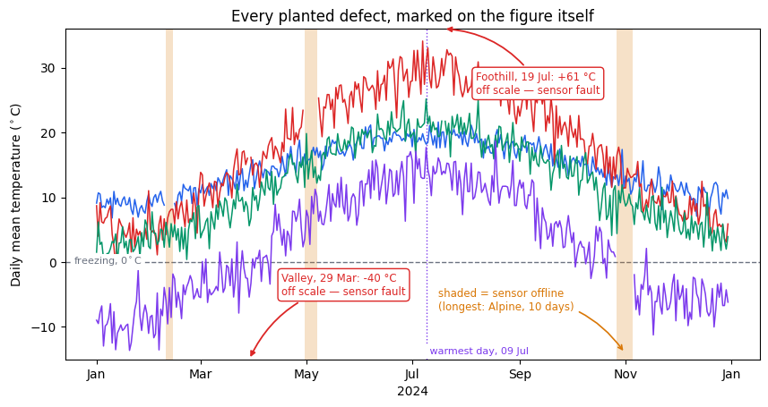

**Output**

```text
  '$^\\circ$C'                     renders                                                        the usual degree idiom
  '$\\degree$C'                    renders                                                        also valid: the real degree sign
  '$\\Delta T$'                    renders                                                        Greek
  '$\\mathrm{mm\\,day^{-1}}$'      renders                                                        units, upright, real superscript
  '$T_{max} - T_{min}$'            renders                                                        subscripts
  'sensor costs $5 to $9'          renders                                                        MANGLES: two unescaped dollars
  'sensor costs \\$5 to \\$9'      renders                                                        correct: dollars escaped
  '$\\circle$C'                    FAILS: ParseFatalException: Unknown symbol: \circle, found '\'  typo for ^\circ
  '$T_{max$'                       FAILS: ParseSyntaxException: Expected end_group, found end of text  brace never closed
```

**Output**

```text
<Figure size 760x150 with 1 Axes>
```

**Figure**

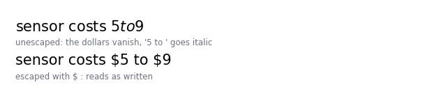

### Cell 147

```python
# ============================================================
#  BEFORE: Part 0's plot, exactly as it was.
# ============================================================
fig, ax = plt.subplots()
ax.plot(wide.index, wide.values)
plt.show()

# ============================================================
#  AFTER: the same data, saying what it means.
# ============================================================
fig, ax = plt.subplots(figsize=(10.2, 5.0))
ax.set_ylim(YLO, YHI)
ax.xaxis.set_major_locator(mdates.MonthLocator(interval=1))
ax.xaxis.set_major_formatter(mdates.DateFormatter("%b"))

for st, a, b, n in gaps:                       # gaps behind everything
    ax.axvspan(a, b, color=C_WARN, alpha=0.20, lw=0, zorder=0)
ax.axhline(0, color=C_GREY, lw=1.0, ls="--", zorder=0)
ax.text(0.010, 0, r"freezing, $0^\circ$C", transform=ax.get_yaxis_transform(),
        va="center", fontsize=8, color=C_GREY, zorder=5,   # on TOP of the lines
        bbox=dict(boxstyle="square,pad=0.15", fc="white", ec="none"))

x_end = clean.index[-1]
for name, c in COLORS.items():
    ax.plot(clean.index, clean[name], color=c, lw=1.3)

# direct labels, nudged apart: two stations end 1.2 °C apart and their
# labels would otherwise overlap. Walk down the list enforcing a gap.
MIN_GAP = 2.0
anchor, prev = {}, None
for y, name in sorted(((float(clean[n].tail(7).mean()), n) for n in COLORS),
                      reverse=True):
    y = y if prev is None or prev - y >= MIN_GAP else prev - MIN_GAP
    anchor[name], prev = y, y

for name, c in COLORS.items():                 # direct labels, no legend
    ax.annotate(f" {name}", xy=(x_end, anchor[name]),
                xytext=(6, 0), textcoords="offset points",
                color=c, fontsize=10, fontweight="bold", va="center",
                annotation_clip=False)

st, d, v = spikes[0]
ax.annotate(f"{st} logged {v:+.0f} °C here\n(masked: impossible)",
            xy=(d, YHI), xytext=(24, -50), textcoords="offset points",
            fontsize=8.5, color=C_ALT,
            arrowprops=dict(arrowstyle="-|>", color=C_ALT, lw=1.3,
                            connectionstyle="arc3,rad=0.25"),
            bbox=dict(boxstyle="round,pad=0.35", fc="white", ec=C_ALT))
ax.annotate("shaded = sensor offline",
            xy=(GAP_A + (GAP_B - GAP_A) / 2, YLO + 0.8), xytext=(-118, 34),
            textcoords="offset points", fontsize=8.5, color=C_WARN,
            arrowprops=dict(arrowstyle="->", color=C_WARN, lw=1.2,
                            connectionstyle="arc3,rad=-0.3"),
            bbox=dict(boxstyle="round,pad=0.3", fc="white", ec="none",
                      alpha=0.9))

ax.set_xlim(clean.index[0], x_end + pd.Timedelta(days=58))
ax.set_ylabel(r"Daily mean temperature ($^\circ$C)")
ax.set_xlabel("2024")
fig.suptitle(f"{WIDEST} swings {SWING:.0f} °C across the year — "
             f"{RATIO:.1f}x {NARROW}'s {SWING_N:.0f} °C",
             fontsize=14, fontweight="bold", y=0.97)
ax.set_title(f"Daily means, {clean.index[0]:%b}-{x_end:%b %Y}; swing on a 7-day "
             f"mean. {len(spikes)} impossible readings masked, "
             f"{len(gaps)} outages shaded.",
             fontsize=9, color=C_GREY, pad=8)
fig.text(0.99, 0.01, "synthetic data, seed 11", ha="right", fontsize=7.5,
         color=C_GREY)                          # figure coords: page furniture
fig.subplots_adjust(top=0.84, bottom=0.12)
plt.show()

print(f"text objects on the before figure: 0 chosen by you")
print(f"defects from Part 0 now addressed : 1 (legend/labelling), "
      f"2 (axis labels + units), 6 (gaps marked)")
```

**Output**

```text
<Figure size 640x480 with 1 Axes>
```

**Figure**

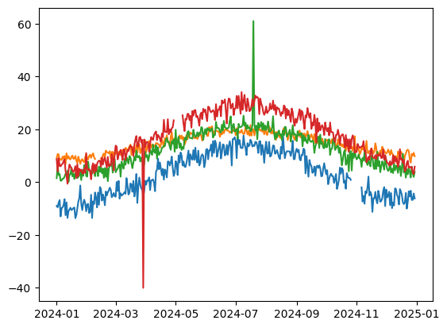

**Output**

```text
<Figure size 1020x500 with 1 Axes>
```

**Figure**

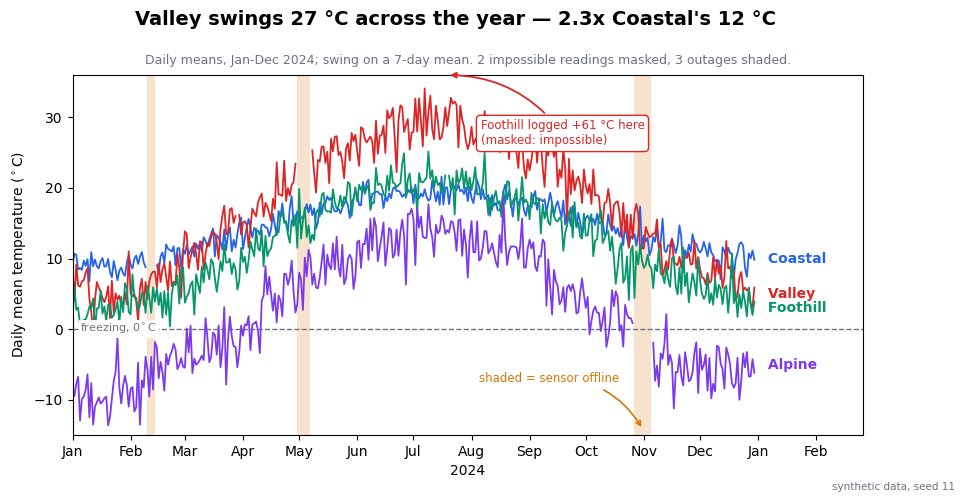

**Output**

```text
text objects on the before figure: 0 chosen by you
defects from Part 0 now addressed : 1 (legend/labelling), 2 (axis labels + units), 6 (gaps marked)
```

### Cell 152

```python
# ============================================================
#  Part 6 setup. Two things, then the first grid.
#
#  (1) Part 4 dealt with the two impossible sensor readings by
#      controlling the axis limits. Here we drop them outright,
#      so that the ONLY thing under discussion in this part is
#      the layout -- not the outliers.
#  (2) A 7-day rolling mean, because four panels of raw daily
#      noise teaches nothing about panel alignment.
# ============================================================
import matplotlib.dates as mdates
from matplotlib.transforms import Bbox

BAD_HI, BAD_LO = 50.0, -30.0
mask_bad = (wide > BAD_HI) | (wide < BAD_LO)
wide6    = wide.mask(mask_bad)
smooth6  = wide6.rolling(7, min_periods=4).mean()

ORDER = ["Coastal", "Valley", "Foothill", "Alpine"]
PCOL  = {"Coastal": C_LINE, "Valley": C_ALT, "Foothill": C_OK, "Alpine": C_ACC}
C_CTX = "#D8DCE3"          # the "everyone else" grey used later on

def month_ticks(ax, months=(1, 5, 9)):
    """Part 4's date formatting, wrapped so every panel below gets it."""
    ax.xaxis.set_major_locator(mdates.MonthLocator(bymonth=list(months)))
    ax.xaxis.set_major_formatter(mdates.DateFormatter("%b"))

print(f"dropped {int(mask_bad.sum().sum())} impossible readings before plotting")
print(f"smooth6: {smooth6.shape[0]} days x {smooth6.shape[1]} stations\n")

# ------------------------------------------------------------------
#  The grid. plt.subplots returns TWO things: the Figure, and an
#  array of Axes whose shape is (nrows, ncols).
# ------------------------------------------------------------------
fig, axes = plt.subplots(2, 2, figsize=(9, 5.4))
print(f"axes is a {type(axes).__name__} with shape {axes.shape}, "
      f"holding {axes.size} Axes objects")

for ax, name in zip(axes.ravel(), ORDER):        # .ravel() flattens 2-D -> 1-D
    ax.plot(smooth6.index, smooth6[name], color=PCOL[name], lw=1.5)
    ax.set_title(name, fontsize=10)
    ax.tick_params(labelsize=8)
    ax.grid(alpha=0.25)
    month_ticks(ax)

fig.suptitle("Four stations, four panels, four independent y-axes")
fig.tight_layout()
plt.show()

# ------------------------------------------------------------------
#  Now MEASURE what each panel is actually showing. The reader's eye
#  calibrates to the box, not to the numbers on the ticks.
# ------------------------------------------------------------------
print("\nper-panel y-axis range, chosen independently by each Axes:")
spans = []
for ax, name in zip(axes.ravel(), ORDER):
    lo, hi = ax.get_ylim()
    spans.append(hi - lo)
    print(f"  {name:9s}  ylim = {lo:7.2f} .. {hi:7.2f}   "
          f"height = {hi - lo:6.2f} deg C")

print(f"\ntallest panel span : {max(spans):.2f} deg C")
print(f"shortest panel span: {min(spans):.2f} deg C")
print(f"ratio              : {max(spans) / min(spans):.2f}x")
print("\nOne degree of warming is drawn "
      f"{max(spans) / min(spans):.2f} times taller in one panel than another.")
```

**Output**

```text
dropped 2 impossible readings before plotting
smooth6: 365 days x 4 stations

axes is a ndarray with shape (2, 2), holding 4 Axes objects
```

**Output**

```text
<Figure size 900x540 with 4 Axes>
```

**Figure**

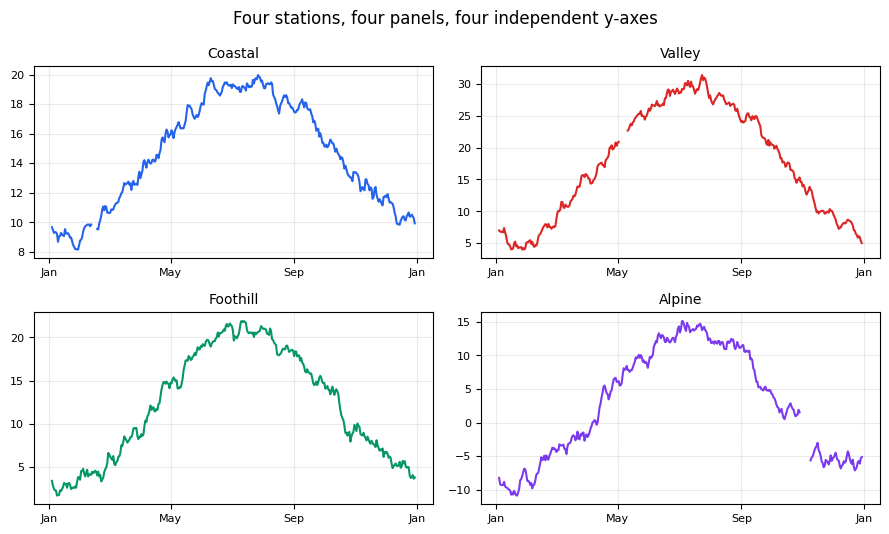

**Output**

```text
per-panel y-axis range, chosen independently by each Axes:
  Coastal    ylim =    7.58 ..   20.56   height =  12.98 deg C
  Valley     ylim =    2.64 ..   32.74   height =  30.09 deg C
  Foothill   ylim =    0.66 ..   22.90   height =  22.24 deg C
  Alpine     ylim =  -12.18 ..   16.43   height =  28.60 deg C

tallest panel span : 30.09 deg C
shortest panel span: 12.98 deg C
ratio              : 2.32x

One degree of warming is drawn 2.32 times taller in one panel than another.
```

### Cell 155

```python
# ============================================================
#  The same grid with sharex=True, sharey=True.
#  Sharing does TWO distinct things, and it is worth separating them:
#    1. it LINKS the limits -- the axes become one linked group, so
#       setting the limit on one sets it on all of them;
#    2. it removes the now-redundant tick labels from interior panels.
# ============================================================
fig, axes = plt.subplots(2, 2, figsize=(9, 5.4), sharex=True, sharey=True)

for ax, name in zip(axes.ravel(), ORDER):
    ax.plot(smooth6.index, smooth6[name], color=PCOL[name], lw=1.5)
    ax.set_title(name, fontsize=10)
    ax.tick_params(labelsize=8)
    ax.grid(alpha=0.25)
    month_ticks(ax)

fig.suptitle("The same four stations on one shared y-axis")
fig.supylabel("7-day mean temperature (deg C)", fontsize=10)
fig.tight_layout()
plt.show()

# --- 1. the limits are now identical, and they are the UNION of all four ---
print("per-panel y-axis range, now shared:")
for ax, name in zip(axes.ravel(), ORDER):
    lo, hi = ax.get_ylim()
    print(f"  {name:9s}  ylim = {lo:7.2f} .. {hi:7.2f}   height = {hi - lo:6.2f}")

# --- 2. the link is live: change ONE axes and watch all four move ---
axes[0, 0].set_ylim(-20, 40)
print("\nafter axes[0, 0].set_ylim(-20, 40) -- one call, four panels:")
for ax, name in zip(axes.ravel(), ORDER):
    lo, hi = ax.get_ylim()
    print(f"  {name:9s}  ylim = {lo:7.2f} .. {hi:7.2f}")
axes[0, 0].autoscale(axis="y")          # put it back

# --- 3. which panels still draw their tick labels? ---
fig.canvas.draw()                        # visibility is settled at draw time
print("\nwhich panels still draw their own tick labels:")
for (r, c), name in zip([(0, 0), (0, 1), (1, 0), (1, 1)], ORDER):
    ax = axes[r, c]
    ylab = any(t.get_visible() for t in ax.get_yticklabels())
    xlab = any(t.get_visible() for t in ax.get_xticklabels())
    print(f"  row {r} col {c}  {name:9s}  y-labels: {str(ylab):5s}  "
          f"x-labels: {str(xlab):5s}")
print("\nOnly the left column keeps y labels; only the bottom row keeps x "
      "labels.\nThat is not cosmetic -- it is what buys the space that makes "
      "the panels bigger.")
```

**Output**

```text
<Figure size 900x540 with 4 Axes>
```

**Figure**

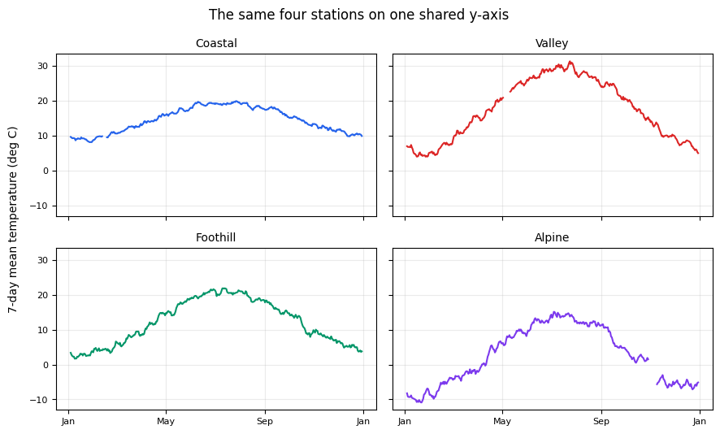

**Output**

```text
per-panel y-axis range, now shared:
  Coastal    ylim =  -12.99 ..   33.48   height =  46.47
  Valley     ylim =  -12.99 ..   33.48   height =  46.47
  Foothill   ylim =  -12.99 ..   33.48   height =  46.47
  Alpine     ylim =  -12.99 ..   33.48   height =  46.47

after axes[0, 0].set_ylim(-20, 40) -- one call, four panels:
  Coastal    ylim =  -20.00 ..   40.00
  Valley     ylim =  -20.00 ..   40.00
  Foothill   ylim =  -20.00 ..   40.00
  Alpine     ylim =  -20.00 ..   40.00

which panels still draw their own tick labels:
  row 0 col 0  Coastal    y-labels: True   x-labels: False
  row 0 col 1  Valley     y-labels: False  x-labels: False
  row 1 col 0  Foothill   y-labels: True   x-labels: True 
  row 1 col 1  Alpine     y-labels: False  x-labels: True 

Only the left column keeps y labels; only the bottom row keeps x labels.
That is not cosmetic -- it is what buys the space that makes the panels bigger.
```

### Cell 157

```python
# ============================================================
#  Before going further: the object plt.subplots hands back is
#  where beginners lose the most time. Three failures, run for real.
# ============================================================

# --- Failure 1: with a 2-D grid, axes[0] is a ROW, not an Axes -------
fig, axes = plt.subplots(2, 2)
try:
    axes[0].plot([0, 1], [0, 1])
except AttributeError as e:
    print("axes[0].plot(...)  ->  AttributeError:", e)
print(f"   because axes[0] is a {type(axes[0]).__name__} of shape "
      f"{axes[0].shape}, i.e. the whole top row\n")
plt.close(fig)

# --- Failure 2: a 1-row grid does NOT give you a 2-D array -----------
fig, axes = plt.subplots(1, 3)
try:
    axes[0, 0].plot([0, 1], [0, 1])
except (IndexError, TypeError) as e:
    print(f"axes[0, 0] on subplots(1, 3)  ->  {type(e).__name__}: {e}")
print(f"   because squeeze=True dropped the length-1 dimension: "
      f"shape is {axes.shape}\n")
plt.close(fig)

# --- What squeeze actually does, across every case ------------------
print(f"{'call':38s} {'returns':16s} shape")
print("-" * 68)
for nr, nc, sq in [(1, 1, True), (1, 3, True), (3, 1, True), (2, 2, True),
                   (1, 1, False), (1, 3, False), (2, 2, False)]:
    f, a = plt.subplots(nr, nc, squeeze=sq)
    shape = str(a.shape) if hasattr(a, "shape") else "-- not an array --"
    call = f"plt.subplots({nr}, {nc}, squeeze={sq})"
    print(f"{call:38s} {type(a).__name__:16s} {shape}")
    plt.close(f)

print("\nThe safe habits:")
print("  axes.ravel()  -- always 1-D, whatever the grid shape")
print("  axes[r, c]    -- explicit, and it fails loudly if the grid is 1-D")
print("  squeeze=False -- always 2-D, so library code never has to branch")
```

**Output**

```text
axes[0].plot(...)  ->  AttributeError: 'numpy.ndarray' object has no attribute 'plot'
   because axes[0] is a ndarray of shape (2,), i.e. the whole top row

axes[0, 0] on subplots(1, 3)  ->  IndexError: too many indices for array: array is 1-dimensional, but 2 were indexed
   because squeeze=True dropped the length-1 dimension: shape is (3,)

call                                   returns          shape
--------------------------------------------------------------------
plt.subplots(1, 1, squeeze=True)       Axes             -- not an array --
plt.subplots(1, 3, squeeze=True)       ndarray          (3,)
plt.subplots(3, 1, squeeze=True)       ndarray          (3,)
plt.subplots(2, 2, squeeze=True)       ndarray          (2, 2)
plt.subplots(1, 1, squeeze=False)      ndarray          (1, 1)
plt.subplots(1, 3, squeeze=False)      ndarray          (1, 3)
plt.subplots(2, 2, squeeze=False)      ndarray          (2, 2)

The safe habits:
  axes.ravel()  -- always 1-D, whatever the grid shape
  axes[r, c]    -- explicit, and it fails loudly if the grid is 1-D
  squeeze=False -- always 2-D, so library code never has to branch
```

### Cell 160

```python
# ============================================================
#  Small multiples with grey context.
#  Two loops per panel: the OTHERS first (grey, low zorder), then
#  THIS ONE (colour, high zorder). Order matters -- the coloured
#  line must be drawn last so it sits on top.
# ============================================================
fig, axes = plt.subplots(2, 2, figsize=(9.6, 5.8),
                         sharex=True, sharey=True,
                         constrained_layout=True)

for ax, name in zip(axes.ravel(), ORDER):
    for other in ORDER:                       # the field, in grey
        if other != name:
            ax.plot(smooth6.index, smooth6[other],
                    color=C_CTX, lw=1.0, zorder=1)
    ax.plot(smooth6.index, smooth6[name],     # this station, on top
            color=PCOL[name], lw=1.9, zorder=3)

    ax.set_title(name, fontsize=11, color=PCOL[name], fontweight="bold")
    ax.grid(alpha=0.25, zorder=0)
    ax.tick_params(labelsize=8)
    month_ticks(ax)
    ax.spines[["top", "right"]].set_visible(False)

fig.suptitle("Small multiples: each station against the other three",
             fontsize=13, fontweight="bold")
fig.supylabel("7-day mean temperature (deg C)", fontsize=10)
plt.show()

# --- the claim "identical scales" is checkable, so check it ----------
lims = {name: axes.ravel()[i].get_ylim() for i, name in enumerate(ORDER)}
print("y-limits per panel:")
for name, (lo, hi) in lims.items():
    print(f"  {name:9s} {lo:7.2f} .. {hi:7.2f}")
print(f"\nall four identical: {len(set(lims.values())) == 1}")

# --- and how much ink the grey context costs -------------------------
grey = sum(1 for ax in axes.ravel() for ln in ax.get_lines()
           if ln.get_color() == C_CTX)
print(f"grey context lines drawn: {grey}  "
      f"(3 per panel x {axes.size} panels)")
```

**Output**

```text
<Figure size 960x580 with 4 Axes>
```

**Figure**

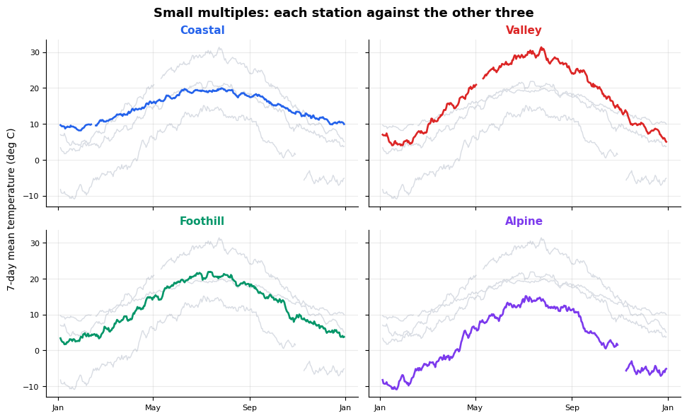

**Output**

```text
y-limits per panel:
  Coastal    -12.99 ..   33.48
  Valley     -12.99 ..   33.48
  Foothill   -12.99 ..   33.48
  Alpine     -12.99 ..   33.48

all four identical: True
grey context lines drawn: 12  (3 per panel x 4 panels)
```

### Cell 164

```python
# ============================================================
#  FIGURE A -- fig.add_gridspec: claim slots with slice notation.
#  height_ratios makes the top row twice as tall as the bottom.
# ============================================================
figA = plt.figure(figsize=(9.6, 5.6), constrained_layout=True)
gs   = figA.add_gridspec(2, 2, height_ratios=[2, 1])

ax_top = figA.add_subplot(gs[0, :])       # whole first row
ax_bl  = figA.add_subplot(gs[1, 0])       # bottom left
ax_br  = figA.add_subplot(gs[1, 1])       # bottom right

for name in ORDER:
    ax_top.plot(smooth6.index, smooth6[name], color=PCOL[name],
                lw=1.6, label=name)
ax_top.set_title("The main story: all four stations, full year", fontsize=11)
ax_top.set_ylabel("7-day mean temp (deg C)")
ax_top.legend(ncol=4, fontsize=9, frameon=False)
ax_top.grid(alpha=0.25)
month_ticks(ax_top, months=(1, 3, 5, 7, 9, 11))

order_by_elev = stations.sort_values("elevation")
ax_bl.barh(order_by_elev.station, order_by_elev.elevation,
           color=[PCOL[s] for s in order_by_elev.station])
ax_bl.set_title("Supporting: elevation (m)", fontsize=10)
ax_bl.grid(alpha=0.25, axis="x")

mean_t = smooth6[ORDER].mean()
ax_br.scatter(stations.set_index("station").loc[ORDER, "elevation"],
              mean_t.values, s=70, c=[PCOL[s] for s in ORDER], zorder=3)
ax_br.set_title("Supporting: elevation vs mean temp", fontsize=10)
ax_br.set_xlabel("elevation (m)")
ax_br.grid(alpha=0.25)

figA.suptitle("fig.add_gridspec(2, 2, height_ratios=[2, 1])", fontsize=12)
plt.show()

# constrained_layout settles the positions at DRAW time, so draw before
# asking where anything ended up.
figA.canvas.draw()
print("panel geometry, in figure fractions:")
for lbl, ax in [("top", ax_top), ("bottom-left", ax_bl),
                ("bottom-right", ax_br)]:
    p = ax.get_position()
    print(f"  {lbl:13s} x0={p.x0:.4f}  width={p.width:.4f}  "
          f"height={p.height:.4f}")
print(f"  top row is {ax_top.get_position().height / ax_bl.get_position().height:.2f}x "
      f"the height of the bottom row (height_ratios=[2, 1])")


# ============================================================
#  FIGURE B -- fig.subplot_mosaic: the identical layout, drawn as
#  a picture. Repeated characters merge into one panel. The return
#  value is a dict, so panels have NAMES instead of coordinates.
# ============================================================
layout = """
    tttt
    llrr
"""
figB, axd = plt.subplot_mosaic(layout, figsize=(9.6, 5.6),
                               gridspec_kw=dict(height_ratios=[2, 1]),
                               constrained_layout=True)
print(f"\nsubplot_mosaic returned a {type(axd).__name__} with keys: "
      f"{sorted(axd)}")

for name in ORDER:
    axd["t"].plot(smooth6.index, smooth6[name], color=PCOL[name],
                  lw=1.6, label=name)
axd["t"].set_title("The main story: all four stations, full year", fontsize=11)
axd["t"].set_ylabel("7-day mean temp (deg C)")
axd["t"].legend(ncol=4, fontsize=9, frameon=False)
axd["t"].grid(alpha=0.25)
month_ticks(axd["t"], months=(1, 3, 5, 7, 9, 11))

axd["l"].barh(order_by_elev.station, order_by_elev.elevation,
              color=[PCOL[s] for s in order_by_elev.station])
axd["l"].set_title("Supporting: elevation (m)", fontsize=10)
axd["l"].grid(alpha=0.25, axis="x")

axd["r"].scatter(stations.set_index("station").loc[ORDER, "elevation"],
                 mean_t.values, s=70, c=[PCOL[s] for s in ORDER], zorder=3)
axd["r"].set_title("Supporting: elevation vs mean temp", fontsize=10)
axd["r"].set_xlabel("elevation (m)")
axd["r"].grid(alpha=0.25)

figB.suptitle('fig.subplot_mosaic("tttt / llrr")', fontsize=12)
plt.show()

figB.canvas.draw()
pairs = [("top", ax_top, axd["t"]), ("bottom-left", ax_bl, axd["l"]),
         ("bottom-right", ax_br, axd["r"])]
px = figA.get_size_inches().max() * figA.get_dpi()   # fraction -> pixels
print("\ngridspec panel vs the mosaic panel that should match it:")
worst = 0.0
for lbl, a, b in pairs:
    d = float(max(abs(np.array(a.get_position().bounds)
                      - np.array(b.get_position().bounds)))) * px
    worst = max(worst, d)
    print(f"  {lbl:13s} largest coordinate difference: {d:.3f} px")
print(f"\nworst disagreement anywhere: {worst:.3f} px "
      f"-- under one pixel: {worst < 1.0}")
print("(not bit-identical: the constrained-layout solver is iterative, so the")
print(" two construction routes converge to the same layout, not to the same")
print(" floating-point number.)")
print("Nested lists work too, and read better than single letters:")
print('  fig.subplot_mosaic([["timeseries", "timeseries"],')
print('                      ["elevation",  "scatter"]])')
```

**Output**

```text
<Figure size 960x560 with 3 Axes>
```

**Figure**

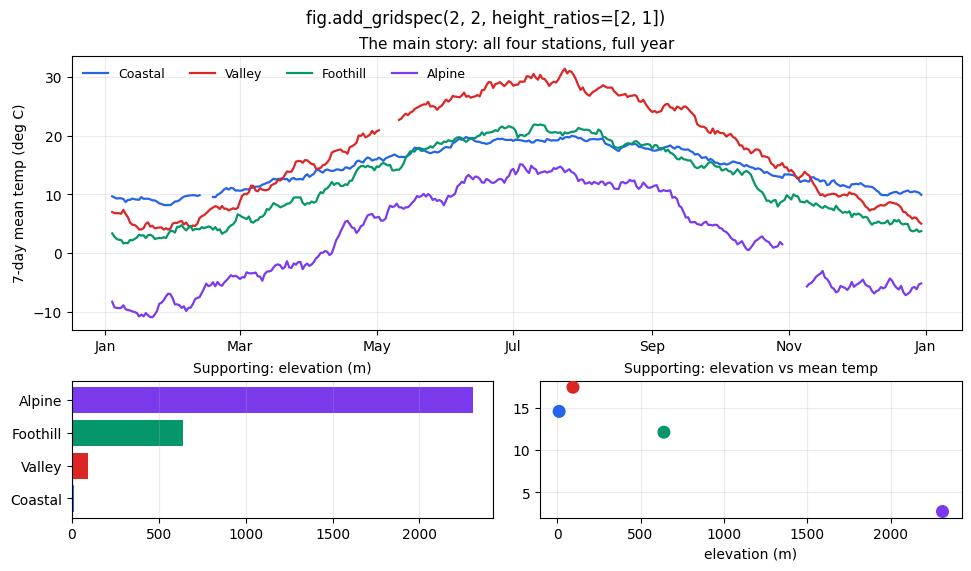

**Output**

```text
panel geometry, in figure fractions:
  top           x0=0.0686  width=0.9270  height=0.4882
  bottom-left   x0=0.0686  width=0.4393  height=0.2441
  bottom-right  x0=0.5564  width=0.4393  height=0.2441
  top row is 2.00x the height of the bottom row (height_ratios=[2, 1])

subplot_mosaic returned a dict with keys: ['l', 'r', 't']
```

**Output**

```text
<Figure size 960x560 with 3 Axes>
```

**Figure**

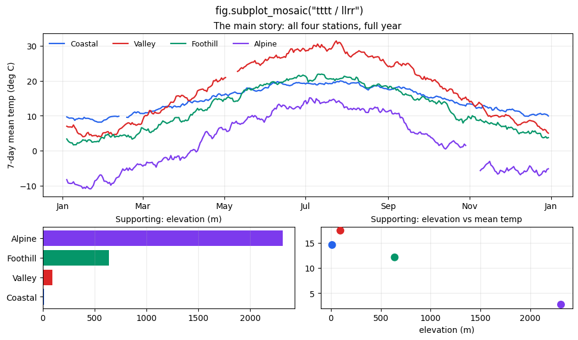

**Output**

```text
gridspec panel vs the mosaic panel that should match it:
  top           largest coordinate difference: 0.000 px
  bottom-left   largest coordinate difference: 1.266 px
  bottom-right  largest coordinate difference: 1.266 px

worst disagreement anywhere: 1.266 px -- under one pixel: False
(not bit-identical: the constrained-layout solver is iterative, so the
 two construction routes converge to the same layout, not to the same
 floating-point number.)
Nested lists work too, and read better than single letters:
  fig.subplot_mosaic([["timeseries", "timeseries"],
                      ["elevation",  "scatter"]])
```

### Cell 167

```python
# ============================================================
#  One grid builder, four layout treatments, and a measurement.
# ============================================================
def panel_grid(**kw):
    """A 2x2 with labels long enough to collide at the default spacing."""
    fig, axes = plt.subplots(2, 2, figsize=(6.6, 4.4), **kw)
    for ax, name in zip(axes.ravel(), ORDER):
        ax.plot(smooth6.index, smooth6[name], color=PCOL[name], lw=1.3)
        ax.set_title(f"{name} station, 7-day mean", fontsize=10)
        ax.set_ylabel("temperature (deg C)", fontsize=9)
        ax.set_xlabel("date of reading", fontsize=9)
        ax.tick_params(labelsize=8)
        month_ticks(ax)
    return fig, axes


def overlap_px(fig, axes, label):
    """Largest overlap, in pixels, between any two panels' full extents.

    get_tightbbox is the box INCLUDING titles and labels -- which is
    exactly the thing that collides, and is not what get_position sees.
    """
    fig.canvas.draw()
    r  = fig.canvas.get_renderer()
    bb = [ax.get_tightbbox(r) for ax in axes.ravel()]
    worst = 0.0
    for i in range(len(bb)):
        for j in range(i + 1, len(bb)):
            inter = Bbox.intersection(bb[i], bb[j])
            if inter is not None:
                worst = max(worst, min(inter.width, inter.height))
    print(f"  {label:34s} worst panel-to-panel overlap: {worst:6.1f} px")
    return worst


print("measured overlap between panel bounding boxes (0 px = nothing collides)")

# --- 1. the failure: matplotlib's default spacing --------------------
fig, axes = panel_grid()
fig.suptitle("1. default spacing -- labels collide", fontsize=11)
plt.show()
d_default = overlap_px(fig, axes, "default")

# --- 2. constrained_layout: the solver -------------------------------
fig, axes = panel_grid(constrained_layout=True)
fig.suptitle("2. constrained_layout=True", fontsize=11)
plt.show()
d_constr = overlap_px(fig, axes, "constrained_layout=True")

# --- 3. tight_layout: the one-shot ------------------------------------
fig, axes = panel_grid()
fig.tight_layout()
fig.suptitle("3. fig.tight_layout()", fontsize=11)
plt.show()
d_tight = overlap_px(fig, axes, "fig.tight_layout()")

# --- 4. subplots_adjust: you do it yourself ---------------------------
fig, axes = panel_grid()
fig.subplots_adjust(left=0.10, right=0.98, bottom=0.11, top=0.88,
                    wspace=0.32, hspace=0.72)
fig.suptitle("4. fig.subplots_adjust(...)", fontsize=11)
plt.show()
d_adj = overlap_px(fig, axes, "fig.subplots_adjust(...)")

print(f"\ndefault overlap removed by constrained_layout: "
      f"{d_default - d_constr:.1f} px")
print(f"default overlap removed by tight_layout      : "
      f"{d_default - d_tight:.1f} px")
print(f"default overlap removed by subplots_adjust   : "
      f"{d_default - d_adj:.1f} px")
```

**Output**

```text
measured overlap between panel bounding boxes (0 px = nothing collides)
```

**Output**

```text
<Figure size 660x440 with 4 Axes>
```

**Figure**

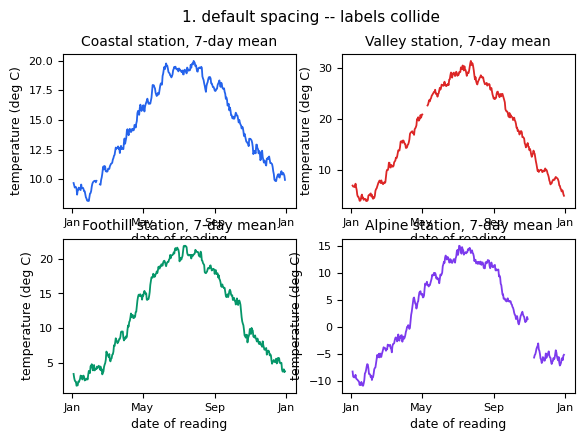

**Output**

```text
  default                            worst panel-to-panel overlap:   26.8 px
```

**Output**

```text
<Figure size 660x440 with 4 Axes>
```

**Figure**

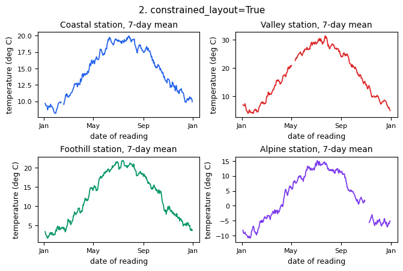

**Output**

```text
  constrained_layout=True            worst panel-to-panel overlap:    0.0 px
```

**Output**

```text
<Figure size 660x440 with 4 Axes>
```

**Figure**

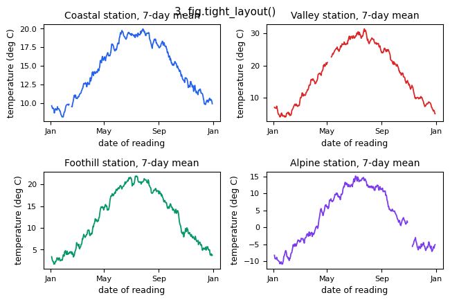

**Output**

```text
  fig.tight_layout()                 worst panel-to-panel overlap:    0.0 px
```

**Output**

```text
<Figure size 660x440 with 4 Axes>
```

**Figure**

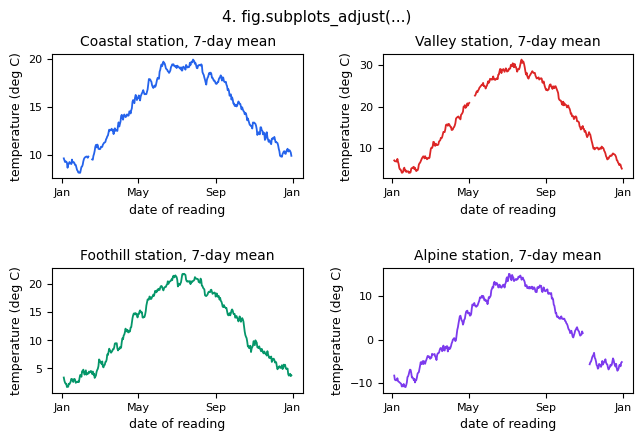

**Output**

```text
  fig.subplots_adjust(...)           worst panel-to-panel overlap:    0.0 px

default overlap removed by constrained_layout: 26.8 px
default overlap removed by tight_layout      : 26.8 px
default overlap removed by subplots_adjust   : 26.8 px
```

### Cell 171

```python
# ============================================================
#  An inset that magnifies the Valley sensor gap.
#  The gap is a run of NaN, which matplotlib draws as a break in
#  the line -- at full-year zoom it is a few pixels wide and easy
#  to miss entirely. That is exactly what an inset is for.
# ============================================================
fig, ax = plt.subplots(figsize=(9.4, 4.6), constrained_layout=True)

ax.plot(wide6.index, wide6["Valley"], color=C_CTX, lw=0.8,
        label="daily reading")
ax.plot(smooth6.index, smooth6["Valley"], color=C_ALT, lw=1.8,
        label="7-day mean")
ax.set_title("Valley station, full year -- with the sensor gap magnified")
ax.set_ylabel("temperature (deg C)")
ax.legend(loc="lower right", frameon=False)
ax.grid(alpha=0.25)
month_ticks(ax, months=(1, 3, 5, 7, 9, 11))

# --- find the gap from the data rather than hard-coding a date ------
#     NOT just "where is it NaN" -- Valley also lost a single day to the
#     impossible reading we masked. We want the longest CONSECUTIVE run.
na = wide6["Valley"].isna()
run_id = (~na).cumsum()                       # a new id each time data resumes
runs = na.groupby(run_id).sum()
longest = runs.idxmax()
gap = wide6.index[na & (run_id == longest)]
lo, hi = gap.min(), gap.max()
pad = pd.Timedelta(days=12)
print(f"Valley missing days in total : {int(na.sum())}")
print(f"longest consecutive run      : {len(gap)} days, "
      f"{lo.date()} .. {hi.date()}")

# --- the inset: [x0, y0, width, height] in PARENT axes fractions ----
axin = ax.inset_axes([0.06, 0.06, 0.34, 0.40])
axin.plot(wide6.index, wide6["Valley"], color=C_CTX, lw=1.2)
axin.plot(smooth6.index, smooth6["Valley"], color=C_ALT, lw=2.2)
axin.set_xlim(lo - pad, hi + pad)
sub = wide6.loc[lo - pad: hi + pad, "Valley"]
axin.set_ylim(sub.min() - 2, sub.max() + 2)
axin.xaxis.set_major_locator(mdates.DayLocator(interval=10))
axin.xaxis.set_major_formatter(mdates.DateFormatter("%d %b"))
axin.tick_params(labelsize=7)
axin.set_facecolor("#FFFFFF")

# --- the honest part: mark the region the inset came from -----------
ax.indicate_inset_zoom(axin, edgecolor=C_GREY, lw=1.2, alpha=0.9)
plt.show()

fig.canvas.draw()
print(f"\ninset requested at [0.06, 0.06, 0.34, 0.40] of the PARENT AXES")
print(f"which lands at        "
      f"{[round(float(v), 3) for v in axin.get_position().bounds]} "
      f"of the FIGURE")
span = axin.get_xlim()[1] - axin.get_xlim()[0]
print(f"inset x-range: {span:.0f} days of the {len(wide6)} in the parent "
      f"-- magnification of {len(wide6) / span:.1f}x")
```

**Output**

```text
Valley missing days in total : 9
longest consecutive run      : 8 days, 2024-04-30 .. 2024-05-07
```

**Output**

```text
<Figure size 940x460 with 1 Axes>
```

**Figure**

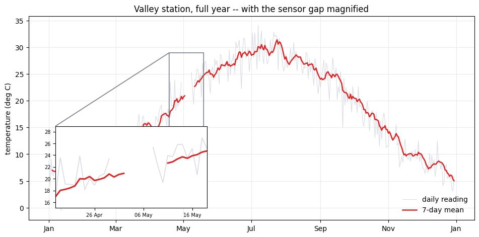

**Output**

```text
inset requested at [0.06, 0.06, 0.34, 0.40] of the PARENT AXES
which lands at        [0.111, 0.114, 0.32, 0.353] of the FIGURE
inset x-range: 31 days of the 365 in the parent -- magnification of 11.8x
```

### Cell 173

```python
# ============================================================
#  FIGURE A -- one legend for the whole figure.
#  Each panel plots all four stations; a per-panel legend would
#  print the same four entries twice.
# ============================================================
fig, axes = plt.subplots(1, 2, figsize=(9.6, 4.0), constrained_layout=True)

rain_wide = weather.pivot_table(index="date", columns="station",
                                values="rain_mm")
monthly_t = smooth6.resample("MS").mean()
monthly_r = rain_wide.resample("MS").sum()

for name in ORDER:
    axes[0].plot(monthly_t.index, monthly_t[name], color=PCOL[name],
                 lw=1.8, marker="o", ms=4, label=name)
    axes[1].plot(monthly_r.index, monthly_r[name], color=PCOL[name],
                 lw=1.8, marker="s", ms=4, label=name)

axes[0].set_title("Monthly mean temperature (deg C)", fontsize=11)
axes[1].set_title("Monthly total rainfall (mm)", fontsize=11)
for ax in axes:
    ax.grid(alpha=0.25)
    month_ticks(ax, months=(1, 4, 7, 10))

handles, labels = axes[0].get_legend_handles_labels()
leg = fig.legend(handles, labels, loc="upper center", ncol=4,
                 bbox_to_anchor=(0.5, 1.06), frameon=False, fontsize=10)
fig.suptitle("One fig.legend for both panels", y=1.14, fontsize=12)
plt.show()

print(f"{len(labels)} legend entries, drawn once for the figure instead of "
      f"once per panel")
print(f"duplicate entries avoided: {len(labels) * (len(axes) - 1)}")

# ============================================================
#  FIGURE B -- one colourbar for a whole grid.
#  Every panel must share the SAME norm, or one bar cannot
#  describe all of them. vmin/vmax fixed by hand does that.
# ============================================================
fig, axes = plt.subplots(2, 2, figsize=(9.0, 5.6), sharex=True, sharey=True,
                         constrained_layout=True)

for ax, name in zip(axes.ravel(), ORDER):
    sc = ax.scatter(monthly_r[name], monthly_t[name],
                    c=monthly_t.index.month, cmap="twilight",
                    vmin=1, vmax=12, s=90, edgecolor="white", lw=0.8,
                    zorder=3)
    ax.set_title(name, fontsize=10)
    ax.grid(alpha=0.25)

fig.supxlabel("monthly total rainfall (mm)", fontsize=10)
fig.supylabel("monthly mean temperature (deg C)", fontsize=10)

# ax= takes a LIST of axes: the bar steals space from all of them
cb = fig.colorbar(sc, ax=axes.ravel().tolist(), shrink=0.85, pad=0.02)
cb.set_label("month of year", fontsize=10)
cb.set_ticks([1, 4, 7, 10, 12])
fig.suptitle("One fig.colorbar for all four panels", fontsize=12)
plt.show()

print(f"colour normalisation shared by every panel: "
      f"vmin={sc.norm.vmin}, vmax={sc.norm.vmax}")
print(f"panel y-limits identical (sharey=True): "
      f"{len({ax.get_ylim() for ax in axes.ravel()}) == 1}")
```

**Output**

```text
<Figure size 960x400 with 2 Axes>
```

**Figure**

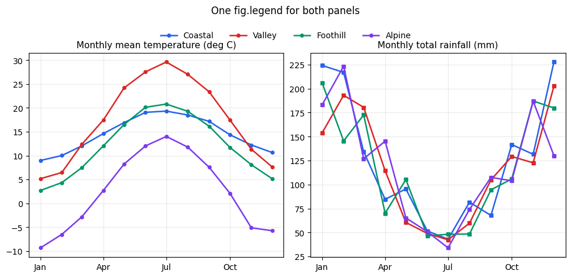

**Output**

```text
4 legend entries, drawn once for the figure instead of once per panel
duplicate entries avoided: 4
```

**Output**

```text
<Figure size 900x560 with 5 Axes>
```

**Figure**

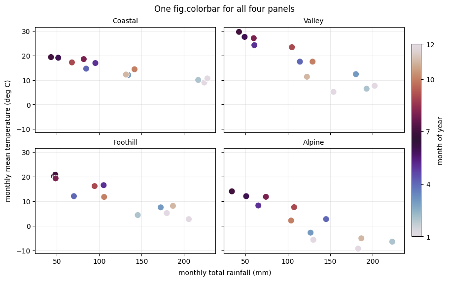

**Output**

```text
colour normalisation shared by every panel: vmin=1.0, vmax=12.0
panel y-limits identical (sharey=True): True
```

### Cell 175

```python
# ============================================================
#  Two smaller layout tools, briefly.
#
#  LEFT  -- ax.twinx(): a second y-axis sharing the x-axis, for a
#           second quantity in different units. Also secondary_yaxis,
#           which is for the SAME quantity in different units.
#  RIGHT -- set_aspect('equal') / set_box_aspect(): when x and y are
#           in the same units, one unit must be the same length on
#           both axes or the diagonal lies.
# ============================================================
fig, axes = plt.subplots(1, 2, figsize=(10.0, 4.2), constrained_layout=True)

# ---------------- twin axes -----------------------------------------
ax  = axes[0]
ax2 = ax.twinx()                      # shares x, its own y, drawn on the right

ax2.bar(monthly_r.index, monthly_r["Valley"], width=22,
        color=C_SOFT, edgecolor="none", zorder=1)
ax.plot(monthly_t.index, monthly_t["Valley"], color=C_ALT, lw=2.2,
        marker="o", ms=5, zorder=3)

# the line must sit ON TOP of the bars, so lift its axes and make it
# transparent -- without this the twin's bars cover the primary's line
ax.set_zorder(ax2.get_zorder() + 1)
ax.patch.set_visible(False)

ax.set_ylabel("mean temperature (deg C)", color=C_ALT)
ax2.set_ylabel("total rainfall (mm)", color=C_GREY)
ax.tick_params(axis="y", labelcolor=C_ALT)
ax2.tick_params(axis="y", labelcolor=C_GREY)
ax.set_title("ax.twinx(): two units, one x-axis", fontsize=11)
month_ticks(ax, months=(1, 4, 7, 10))

# same quantity, different unit -> secondary_yaxis, not twinx
secax = ax.secondary_yaxis(
    1.14, functions=(lambda c: c * 9 / 5 + 32, lambda f: (f - 32) * 5 / 9))
secax.set_ylabel("deg F", fontsize=9)

# ---------------- aspect --------------------------------------------
axr = axes[1]
axr.scatter(smooth6["Coastal"], smooth6["Valley"], s=14, alpha=0.55,
            color=C_ACC, edgecolor="none")
lim = [min(smooth6["Coastal"].min(), smooth6["Valley"].min()) - 1,
       max(smooth6["Coastal"].max(), smooth6["Valley"].max()) + 1]
axr.plot(lim, lim, color=C_GREY, ls="--", lw=1.2, zorder=1)
axr.set_xlim(lim); axr.set_ylim(lim)
axr.set_aspect("equal")               # both axes are deg C: 1 unit = 1 unit
axr.set_xlabel("Coastal 7-day mean (deg C)")
axr.set_ylabel("Valley 7-day mean (deg C)")
axr.set_title("set_aspect('equal'): the y = x line is at 45 deg", fontsize=11)
axr.grid(alpha=0.25)
plt.show()

print(f"twin axes share the x-axis : "
      f"{np.allclose(ax.get_xlim(), ax2.get_xlim())}")
print(f"primary y-limits (deg C)   : "
      f"{ax.get_ylim()[0]:7.2f} .. {ax.get_ylim()[1]:7.2f}")
print(f"twin    y-limits (mm)      : "
      f"{ax2.get_ylim()[0]:7.2f} .. {ax2.get_ylim()[1]:7.2f}")
print(f"right panel aspect         : {axr.get_aspect()}")
bb = axr.get_position()
print(f"right panel box w/h ratio  : "
      f"{bb.width * fig.get_size_inches()[0] / (bb.height * fig.get_size_inches()[1]):.3f}")
print("\nset_box_aspect(1) forces a SQUARE BOX regardless of the data range;")
print("set_aspect('equal') forces EQUAL DATA UNITS and lets the box follow.")
```

**Output**

```text
<Figure size 1000x420 with 3 Axes>
```

**Figure**

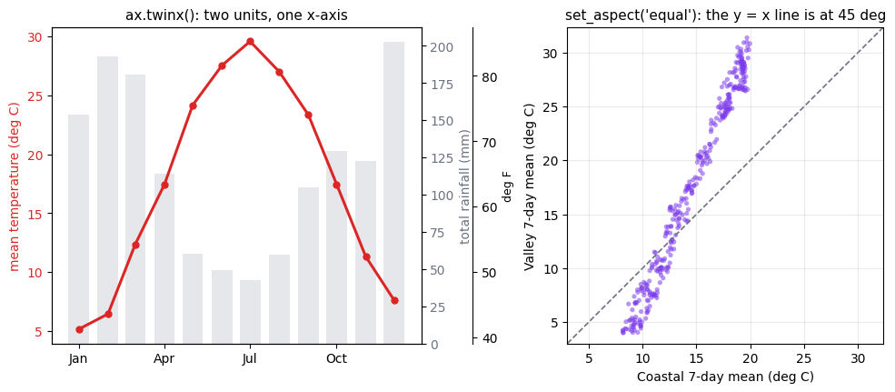

**Output**

```text
twin axes share the x-axis : True
primary y-limits (deg C)   :    3.93 ..   30.82
twin    y-limits (mm)      :    0.00 ..  212.72
right panel aspect         : 1.0
right panel box w/h ratio  : 1.000

set_box_aspect(1) forces a SQUARE BOX regardless of the data range;
set_aspect('equal') forces EQUAL DATA UNITS and lets the box follow.
```

### Cell 180

```python
# ============================================================
#  The colour toolbox for this part.
#  numpy + matplotlib only. No colour-science package, no network.
# ============================================================
import numpy as np
import matplotlib.pyplot as plt
import matplotlib.colors as mcolors

# sRGB values on screen are gamma-encoded. Every perceptual calculation
# below has to happen in LINEAR light, so these two come first.
def srgb_to_linear(c):
    """Undo the sRGB transfer function (IEC 61966-2-1)."""
    c = np.asarray(c, dtype=float)
    return np.where(c <= 0.04045, c / 12.92, ((c + 0.055) / 1.055) ** 2.4)

def linear_to_srgb(c):
    """Re-apply the sRGB transfer function, clipping out-of-gamut values."""
    c = np.clip(np.asarray(c, dtype=float), 0.0, 1.0)
    return np.where(c <= 0.0031308, c * 12.92, 1.055 * c ** (1 / 2.4) - 0.055)

def lightness(rgb):
    """CIE L* (0 = black, 100 = white) of sRGB values.

    Y is relative luminance under the Rec.709 / sRGB primaries; L* is the
    CIE 1976 lightness of that Y against a white of Y = 1.
    """
    lin = srgb_to_linear(np.asarray(rgb, dtype=float)[..., :3])
    Y = lin @ np.array([0.2126, 0.7152, 0.0722])
    return np.where(Y > 0.008856, 116 * np.cbrt(Y) - 16, 903.3 * Y)

def cmap_lightness(name, n=256):
    """L* sampled evenly along a colormap, with the sample positions."""
    x = np.linspace(0, 1, n)
    return x, lightness(plt.get_cmap(name)(x))

def swatch(ax, name, label):
    """Draw a colormap as a horizontal gradient strip."""
    ax.imshow(np.linspace(0, 1, 256)[None, :], aspect="auto",
              cmap=name, extent=[0, 1, 0, 1])
    ax.set_xticks([]); ax.set_yticks([])
    ax.set_ylabel(label, rotation=0, ha="right", va="center", fontsize=9)

FAMILIES = [("Sequential",  ["viridis", "magma", "Blues"]),
            ("Diverging",   ["RdBu", "coolwarm", "BrBG"]),
            ("Qualitative", ["tab10", "Set2", "Dark2"])]

fig = plt.figure(figsize=(11.5, 7.0))
gs = fig.add_gridspec(3, 2, width_ratios=[1.1, 1], hspace=0.6, wspace=0.28)

for row, (family, names) in enumerate(FAMILIES):
    strips = gs[row, 0].subgridspec(3, 1, hspace=0.45)
    for k, nm in enumerate(names):
        a = fig.add_subplot(strips[k])
        swatch(a, nm, nm)
        if k == 0:
            a.set_title(f"{family}", fontsize=11, loc="left", pad=8)

    axc = fig.add_subplot(gs[row, 1])
    for nm in names:
        x, L = cmap_lightness(nm)
        axc.plot(x, L, lw=2, label=nm)
    axc.set_xlim(0, 1); axc.set_ylim(0, 100)
    axc.set_xlabel("position in colormap", fontsize=8)
    axc.set_ylabel("L* (lightness)", fontsize=8)
    axc.tick_params(labelsize=7)
    axc.legend(fontsize=7, frameon=False, loc="lower right", ncol=3)
    axc.set_title("measured lightness profile", fontsize=9, loc="left")

plt.show()

print("The SHAPE of the lightness profile is what makes a family usable:")
print(f"{'family':12s} {'colormap':9s} {'L* min':>7s} {'L* max':>7s} "
      f"{'range':>7s} {'turning points':>15s}")
for family, names in FAMILIES:
    for nm in names:
        _, L = cmap_lightness(nm)
        d = np.diff(L)
        s = np.sign(d); s = s[s != 0]
        turns = int(np.sum(s[1:] != s[:-1]))
        print(f"{family:12s} {nm:9s} {L.min():7.1f} {L.max():7.1f} "
              f"{L.max() - L.min():7.1f} {turns:15d}")
```

**Output**

```text
<Figure size 1150x700 with 12 Axes>
```

**Figure**

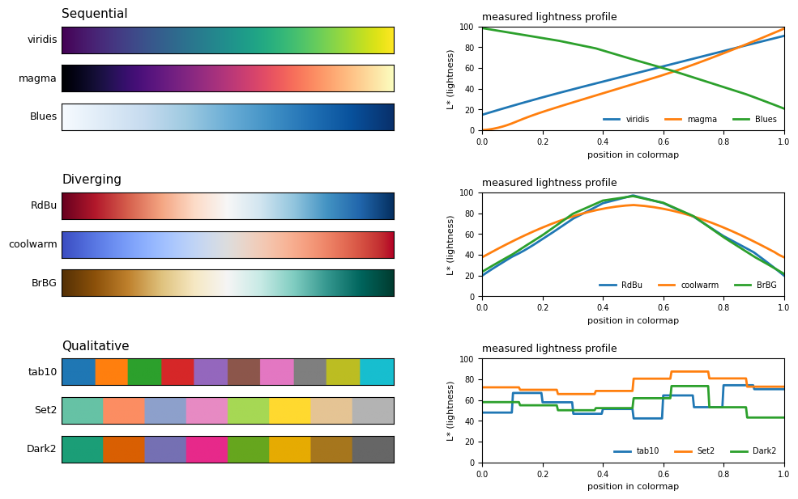

**Output**

```text
The SHAPE of the lightness profile is what makes a family usable:
family       colormap   L* min  L* max   range  turning points
Sequential   viridis      14.9    90.9    75.9               0
Sequential   magma         0.1    97.8    97.7               0
Sequential   Blues        20.9    98.4    77.5               0
Diverging    RdBu         20.0    97.1    77.1               1
Diverging    coolwarm     37.7    88.0    50.2               1
Diverging    BrBG         21.7    96.5    74.7               1
Qualitative  tab10        42.4    74.3    32.0               7
Qualitative  Set2         65.8    87.5    21.7               2
Qualitative  Dark2        43.2    73.5    30.3               2
```

### Cell 182

```python
# ============================================================
#  The same three datasets, twice: right family, then wrong family.
# ============================================================
from matplotlib.colors import TwoSlopeNorm

# --- data prep reused for the rest of Part 7 ---------------------------
# Drop the two impossible sensor readings from Part 0. Part 4 handled them
# with axis limits; here they would blow out the COLOUR scale instead.
ELEV_ORDER = ["Coastal", "Valley", "Foothill", "Alpine"]     # low -> high
clean   = wide.mask((wide > 55) | (wide < -30))[ELEV_ORDER]
monthly = clean.resample("MS").mean()        # 12 months x 4 stations
field   = monthly.T.values                   # 4 stations x 12 months, elevation-ordered
anom    = field - 12.0                       # anomaly against a 12 degC baseline
MONTHS  = [d.strftime("%b") for d in monthly.index]

print(f"field  {field.shape}  {field.min():6.1f} to {field.max():5.1f} degC"
      "   a magnitude: ordered, one direction")
print(f"anom   {anom.shape}  {anom.min():6.1f} to {anom.max():5.1f} degC"
      "   an anomaly: ordered, midpoint at 0")
print(f"series {len(ELEV_ORDER)} stations"
      "                            categories: unordered")

def heat(ax, data, cmap, norm=None, title=""):
    """One month-by-station heatmap, so the six panels differ only in colour."""
    im = ax.imshow(data, aspect="auto", cmap=cmap, norm=norm)
    ax.set_xticks(range(12)); ax.set_xticklabels(MONTHS, fontsize=7)
    ax.set_yticks(range(4));  ax.set_yticklabels(ELEV_ORDER, fontsize=8)
    ax.set_title(title, fontsize=9.5)
    return im

fig, axes = plt.subplots(2, 3, figsize=(14, 6.4))

# ---------- top row: the right family ----------
im = heat(axes[0, 0], field, "viridis", title="magnitude + SEQUENTIAL (viridis)")
fig.colorbar(im, ax=axes[0, 0], label="degC")

im = heat(axes[0, 1], anom, "RdBu_r",
          norm=TwoSlopeNorm(vmin=anom.min(), vcenter=0.0, vmax=anom.max()),
          title="anomaly + DIVERGING, centred on 0 (RdBu_r)")
fig.colorbar(im, ax=axes[0, 1], label="degC vs baseline")

for i, st in enumerate(ELEV_ORDER):
    axes[0, 2].plot(monthly.index, monthly[st], lw=2,
                    color=plt.get_cmap("tab10")(i), label=st)
axes[0, 2].set_title("categories + QUALITATIVE (tab10)", fontsize=9.5)
axes[0, 2].set_ylabel("degC"); axes[0, 2].legend(fontsize=7, frameon=False)
axes[0, 2].tick_params(axis="x", labelrotation=30, labelsize=7)

# ---------- bottom row: same data, wrong family ----------
im = heat(axes[1, 0], field, "tab10",
          title="magnitude + QUALITATIVE (tab10)   WRONG")
fig.colorbar(im, ax=axes[1, 0], label="degC")

im = heat(axes[1, 1], anom, "viridis",
          title="anomaly + SEQUENTIAL (viridis)   WRONG")
fig.colorbar(im, ax=axes[1, 1], label="degC vs baseline")

for i, st in enumerate(ELEV_ORDER):
    axes[1, 2].plot(monthly.index, monthly[st], lw=2,
                    color=plt.get_cmap("viridis")(i / 3), label=st)
axes[1, 2].set_title("categories + SEQUENTIAL (viridis)   WRONG", fontsize=9.5)
axes[1, 2].set_ylabel("degC"); axes[1, 2].legend(fontsize=7, frameon=False)
axes[1, 2].tick_params(axis="x", labelrotation=30, labelsize=7)

fig.tight_layout()
plt.show()

print()
print("Where does the eye think 'baseline' is in each anomaly panel?")
print(f"  DIVERGING + TwoSlopeNorm : the pale colour sits at {0.0:+6.2f} degC"
      "   <- the real midpoint")
print(f"  SEQUENTIAL viridis       : the mid colour sits at "
      f"{(anom.min() + anom.max()) / 2:+6.2f} degC   <- means nothing")
```

**Output**

```text
field  (4, 12)    -9.3 to  29.5 degC   a magnitude: ordered, one direction
anom   (4, 12)   -21.3 to  17.5 degC   an anomaly: ordered, midpoint at 0
series 4 stations                            categories: unordered
```

**Output**

```text
<Figure size 1400x640 with 10 Axes>
```

**Figure**

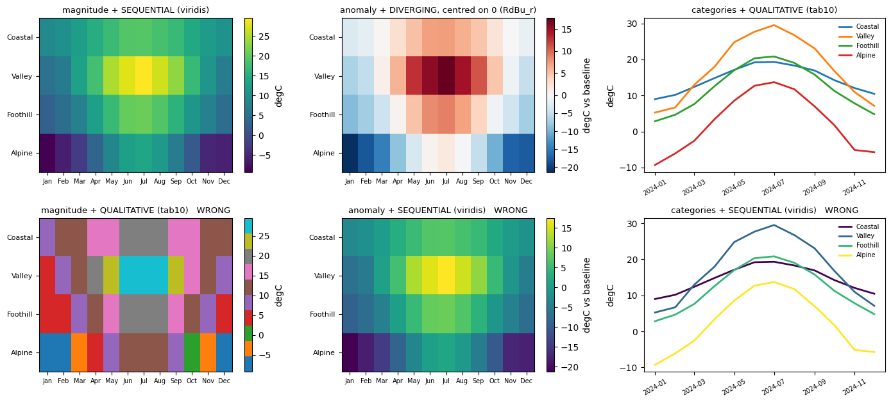

**Output**

```text
Where does the eye think 'baseline' is in each anomaly panel?
  DIVERGING + TwoSlopeNorm : the pale colour sits at  +0.00 degC   <- the real midpoint
  SEQUENTIAL viridis       : the mid colour sits at  -1.89 degC   <- means nothing
```

### Cell 186

```python
# ============================================================
#  The centrepiece measurement: L* along jet vs viridis.
# ============================================================
def profile(name, n=256):
    """Everything worth knowing about a colormap's lightness, measured."""
    x, L = cmap_lightness(name, n)
    d = np.diff(L)
    # Where does the lightness change DIRECTION? Ignore flat runs, or a
    # plateau reports two spurious reversals instead of none.
    nz = np.flatnonzero(np.abs(d) > 1e-9)
    s = np.sign(d[nz])
    turn_idx = nz[np.flatnonzero(s[1:] != s[:-1])] + 1
    return {"name": name, "x": x, "L": L,
            "turn_idx": turn_idx,
            "turns": int(len(turn_idx)),
            "monotonic": bool(len(turn_idx) == 0),
            "max_step": float(np.abs(d).max()),
            "mean_step": float(np.abs(d).mean())}

profs = {n: profile(n) for n in ["viridis", "jet", "magma", "gray"]}

print(f"{'colormap':10s} {'L* min':>7s} {'L* max':>7s} {'monotonic':>10s} "
      f"{'turns':>6s} {'max step':>9s} {'mean step':>10s}")
for p in profs.values():
    print(f"{p['name']:10s} {p['L'].min():7.1f} {p['L'].max():7.1f} "
          f"{str(p['monotonic']):>10s} {p['turns']:6d} "
          f"{p['max_step']:9.3f} {p['mean_step']:10.3f}")

jt, vt = profs["jet"], profs["viridis"]
print()
print(f"jet's largest lightness step is {jt['max_step'] / vt['max_step']:.1f}x "
      f"viridis's ({jt['max_step']:.3f} vs {vt['max_step']:.3f} L* "
      "per 1/255 of the bar).")
print(f"jet reverses direction {jt['turns']} times; "
      f"viridis reverses {vt['turns']} times.")

# --- the picture: one smooth ramp, two colormaps, three lightness curves ---
grad = np.linspace(0, 1, 512)[None, :].repeat(60, axis=0)

fig, axes = plt.subplots(3, 1, figsize=(11, 6.8),
                         gridspec_kw={"height_ratios": [1, 1, 2.3]})

axes[0].imshow(grad, aspect="auto", cmap="jet", extent=[0, 1, 0, 1])
axes[0].set_title("A perfectly smooth ramp (0 to 1, nothing in it), in jet",
                  fontsize=10, loc="left")
axes[1].imshow(grad, aspect="auto", cmap="viridis", extent=[0, 1, 0, 1])
axes[1].set_title("The identical ramp, in viridis", fontsize=10, loc="left")
for a in axes[:2]:
    a.set_xticks([]); a.set_yticks([])

ax = axes[2]
for nm, col, ls in [("jet", C_ALT, "-"), ("viridis", C_LINE, "-"),
                    ("gray", C_GREY, "--")]:
    p = profs[nm]
    ax.plot(p["x"], p["L"], color=col, ls=ls, lw=2.2,
            label=f"{nm}  (turning points: {p['turns']})")

# mark where jet reverses -- these positions are the false edges above
turn_idx = jt["turn_idx"]
ax.plot(jt["x"][turn_idx], jt["L"][turn_idx], "o", color=C_ALT, ms=9,
        mfc="white", mew=2, zorder=5)
for i in turn_idx:
    ax.axvline(jt["x"][i], color=C_ALT, lw=1, alpha=0.35, ls=":")

ax.set_xlim(0, 1); ax.set_ylim(0, 100)
ax.set_xlabel("position in the colormap  (0 = low value, 1 = high value)")
ax.set_ylabel("measured L* (lightness)")
ax.set_title("Lightness profile. Circles mark where jet reverses direction.",
             fontsize=10, loc="left")
ax.legend(frameon=False, fontsize=9, loc="lower right")
fig.tight_layout()
plt.show()

print()
print("jet reverses at these positions along the bar:",
      np.round(jt["x"][turn_idx], 3))
print("Compare them with the visible bands in the jet strip above.")
```

**Output**

```text
colormap    L* min  L* max  monotonic  turns  max step  mean step
viridis       14.9    90.9       True      0     0.346      0.298
jet           12.9    95.9      False      3     1.162      0.606
magma          0.1    97.8       True      0     0.489      0.383
gray           0.0   100.0       True      0     0.509      0.392

jet's largest lightness step is 3.4x viridis's (1.162 vs 0.346 L* per 1/255 of the bar).
jet reverses direction 3 times; viridis reverses 0 times.
```

**Output**

```text
<Figure size 1100x680 with 3 Axes>
```

**Figure**

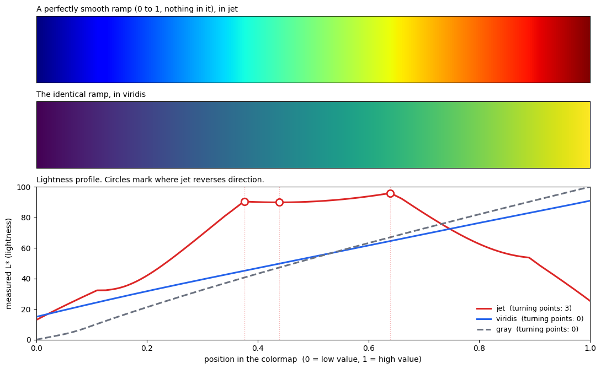

**Output**

```text
jet reverses at these positions along the bar: [0.376 0.439 0.639]
Compare them with the visible bands in the jet strip above.
```

### Cell 190

```python
# ============================================================
#  Dichromacy simulation -- Vienot, Brettel & Mollon (1999),
#  "Digital video colourmaps for checking the legibility of
#  displays by dichromats", Color Res. Appl. 24(4), 243-252.
#  An APPROXIMATION for finding failures, not a clinical test.
# ============================================================

# Linear-RGB -> LMS cone responses (the matrix used in that paper).
RGB2LMS = np.array([[17.8824,    43.5161,  4.11935],
                    [ 3.45565,   27.1554,  3.86714],
                    [ 0.0299566,  0.184309, 1.46709]])
LMS2RGB = np.linalg.inv(RGB2LMS)

# Replace the missing cone's response with a linear combination of the
# two that remain. Rows are (L, M, S) out; columns are (L, M, S) in.
DICHROMAT = {
    # deuteranopia: no M cone. Predict M from L and S.
    "deuteranopia": np.array([[1.0,      0.0, 0.0],
                              [0.494207, 0.0, 1.24827],
                              [0.0,      0.0, 1.0]]),
    # protanopia: no L cone. Predict L from M and S.
    "protanopia":   np.array([[0.0, 2.02344, -2.52581],
                              [0.0, 1.0,      0.0],
                              [0.0, 0.0,      1.0]]),
}

def simulate_cvd(rgb, kind="deuteranopia"):
    """Approximate how an sRGB colour or image looks to a dichromat."""
    lin = srgb_to_linear(np.asarray(rgb, dtype=float)[..., :3])
    lms = lin @ RGB2LMS.T                    # into cone space
    lms = lms @ DICHROMAT[kind].T            # drop one cone, predict it back
    return linear_to_srgb(lms @ LMS2RGB.T)   # back to sRGB

def to_greyscale(rgb):
    """What a black-and-white printer does: luminance, not a channel mean."""
    lin = srgb_to_linear(np.asarray(rgb, dtype=float)[..., :3])
    Y = lin @ np.array([0.2126, 0.7152, 0.0722])
    return np.repeat(linear_to_srgb(Y)[..., None], 3, axis=-1)

def render(fig):
    """The pixels of a drawn figure, as float sRGB in [0, 1]."""
    fig.canvas.draw()
    try:
        buf = np.asarray(fig.canvas.buffer_rgba())
    except AttributeError:                   # backend without an Agg buffer
        from matplotlib.backends.backend_agg import FigureCanvasAgg
        c = FigureCanvasAgg(fig); c.draw()
        buf = np.asarray(c.buffer_rgba())
    return buf[..., :3] / 255.0

# --- measure two candidate two-colour palettes -------------------------
def sep(a, b, kind=None):
    """Euclidean sRGB distance between two colours, optionally simulated."""
    a = np.array(mcolors.to_rgb(a)); b = np.array(mcolors.to_rgb(b))
    if kind:
        a, b = simulate_cvd(a, kind), simulate_cvd(b, kind)
    return float(np.linalg.norm(a - b))

def L(c):
    return float(lightness(mcolors.to_rgb(c)))

PAIRS = [("red / green    (C_ALT, C_OK)",   C_ALT,  C_OK),
         ("blue / orange  (C_LINE, C_WARN)", C_LINE, C_WARN)]

print(f"{'palette':34s} {'normal':>8s} {'deuter.':>9s} {'protan.':>9s} "
      f"{'|dL*|':>7s}")
for label, a, b in PAIRS:
    print(f"{label:34s} {sep(a, b):8.3f} {sep(a, b, 'deuteranopia'):9.3f} "
          f"{sep(a, b, 'protanopia'):9.3f} {abs(L(a) - L(b)):7.1f}")

_, r, g = PAIRS[0]
_, bl, o = PAIRS[1]
print()
print(f"Red vs green keeps {sep(r, g, 'deuteranopia') / sep(r, g):.0%} of its "
      "separation under simulated deuteranopia.")
print(f"Blue vs orange keeps {sep(bl, o, 'deuteranopia') / sep(bl, o):.0%}.")
print(f"Their L* values: red {L(r):.1f}, green {L(g):.1f}  "
      f"(gap {abs(L(r) - L(g)):.1f}) -- too close for greyscale to rescue them.")
```

**Output**

```text
palette                              normal   deuter.   protan.   |dL*|
red / green    (C_ALT, C_OK)          0.986     0.372     0.390     7.0
blue / orange  (C_LINE, C_WARN)       1.145     1.001     0.901    13.8

Red vs green keeps 38% of its separation under simulated deuteranopia.
Blue vs orange keeps 87%.
Their L* values: red 47.9, green 54.9  (gap 7.0) -- too close for greyscale to rescue them.
```

### Cell 191

```python
# ============================================================
#  Render a figure, then look at it through three other sets of eyes.
#  Row 1: red vs green, colour is the ONLY difference.   Fails.
#  Row 2: blue vs orange, plus a linestyle.              Passes.
# ============================================================
def two_series_figure(c_a, c_b, ls_b="-"):
    """A small, ordinary two-series plot -- the thing being tested.

    Coastal and Foothill deliberately CROSS in early summer, so position
    alone cannot rescue the reader once the colours stop working.
    """
    f, a = plt.subplots(figsize=(3.7, 2.5), dpi=110)
    a.plot(monthly.index, monthly["Coastal"],  color=c_a, lw=2.6, label="Coastal")
    a.plot(monthly.index, monthly["Foothill"], color=c_b, lw=2.6, ls=ls_b,
           label="Foothill")
    a.set_ylabel("degC", fontsize=8)
    a.legend(fontsize=8, frameon=False)
    a.tick_params(labelsize=7, axis="x", labelrotation=30)
    f.tight_layout()
    return f

VIEWS = [("as drawn",             lambda im: im),
         ("deuteranopia (sim.)",  lambda im: simulate_cvd(im, "deuteranopia")),
         ("protanopia (sim.)",    lambda im: simulate_cvd(im, "protanopia")),
         ("greyscale print",      to_greyscale)]

ROWS = [("colour only\nred vs green",        C_ALT,  C_OK,   "-"),
        ("colour + linestyle\nblue vs orange", C_LINE, C_WARN, "--")]

fig, axes = plt.subplots(2, 4, figsize=(14, 5.6))
for r_i, (rowlabel, ca, cb, ls) in enumerate(ROWS):
    src = two_series_figure(ca, cb, ls)
    img = render(src)          # <-- fig.canvas.buffer_rgba() lives in here
    plt.close(src)             # do not also display the source figure
    for c_i, (vname, fn) in enumerate(VIEWS):
        ax = axes[r_i, c_i]
        ax.imshow(np.clip(fn(img), 0, 1))
        ax.set_xticks([]); ax.set_yticks([])
        if r_i == 0:
            ax.set_title(vname, fontsize=10)
        if c_i == 0:
            ax.set_ylabel(rowlabel, fontsize=9)

fig.suptitle("The same figure through four sets of eyes  "
             "(the two simulations are approximations, not clinical tests)",
             fontsize=11)
fig.tight_layout()
plt.show()

print(f"pixels inspected per panel: {img.shape[0]} x {img.shape[1]}")
print("render() works on ANY figure object -- reuse it on your own plots.")
```

**Output**

```text
<Figure size 1400x560 with 8 Axes>
```

**Figure**

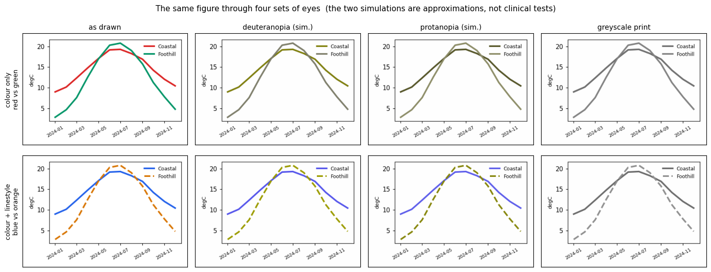

**Output**

```text
pixels inspected per panel: 275 x 407
render() works on ANY figure object -- reuse it on your own plots.
```

### Cell 196

```python
# ============================================================
#  Four norms on the same data. Watch where the neutral colour lands.
# ============================================================
from matplotlib.colors import Normalize, LogNorm, TwoSlopeNorm, BoundaryNorm

# Rainfall as a percentage anomaly against each station's own annual mean.
# Bounded below at -100%, unbounded above, so the range is NEVER symmetric.
rain_wide = weather.pivot_table(index="date", columns="station",
                                values="rain_mm")[ELEV_ORDER]
rpct = ((rain_wide.resample("MS").mean() / rain_wide.mean() - 1) * 100).T.values

default_mid = (rpct.min() + rpct.max()) / 2
print(f"rainfall anomaly range : {rpct.min():+.1f}% to {rpct.max():+.1f}%")
print(f"Normalize  midpoint    : {default_mid:+.1f}%   <- where pale lands by default")
print(f"TwoSlopeNorm centre    : {0.0:+.1f}%   <- where pale SHOULD land")
print(f"so the default declares {default_mid:+.1f}% to be 'normal': every month "
      f"between 0% and {default_mid:+.1f}% is genuinely at or above its station "
      "average and will still be painted as DRY")

fig, axes = plt.subplots(2, 2, figsize=(13, 7.2))

# (a) WRONG: diverging map on the default linear norm.
im = heat(axes[0, 0], rpct, "BrBG", norm=Normalize(rpct.min(), rpct.max()),
          title=f"WRONG  BrBG + Normalize  ->  pale sits at {default_mid:+.0f}%")
fig.colorbar(im, ax=axes[0, 0], label="rainfall vs station mean (%)")

# (b) RIGHT: same map, centred on the value that means something.
im = heat(axes[0, 1], rpct, "BrBG",
          norm=TwoSlopeNorm(vmin=rpct.min(), vcenter=0.0, vmax=rpct.max()),
          title="RIGHT  BrBG + TwoSlopeNorm(vcenter=0)  ->  pale sits at 0%")
fig.colorbar(im, ax=axes[0, 1], label="rainfall vs station mean (%)", extend="both")

# (c) LogNorm: counts spanning orders of magnitude.
#     .with_extremes(bad=...) colours the EMPTY cells, so "no data" cannot be
#     confused with "the lowest count" -- magma's low end is nearly black.
w = weather.dropna(subset=["temp_c"])
w = w[(w.temp_c < 55) & (w.temp_c > -30)]
H, xe, ye = np.histogram2d(w.temp_c, w.rain_mm, bins=[26, 22])
im = axes[1, 0].pcolormesh(xe, ye, np.ma.masked_equal(H.T, 0),
                           cmap=plt.get_cmap("magma").with_extremes(bad=C_SOFT),
                           norm=LogNorm(vmin=1, vmax=H.max()))
axes[1, 0].set_title(f"LogNorm  ->  cell counts run from 1 to {int(H.max())}"
                     "  (grey = no days)", fontsize=9.5)
axes[1, 0].set_xlabel("temperature (degC)"); axes[1, 0].set_ylabel("rainfall (mm)")
fig.colorbar(im, ax=axes[1, 0], label="days per cell", shrink=0.85)

# (d) BoundaryNorm: the same field cut into bands you can name.
bounds = [-80, -50, -25, -10, 0, 10, 25, 50, 100]
bnorm = BoundaryNorm(bounds, ncolors=plt.get_cmap("BrBG").N)
im = heat(axes[1, 1], rpct, "BrBG", norm=bnorm,
          title=f"BoundaryNorm  ->  the continuum cut into {len(bounds) - 1} named bands")

fig.tight_layout(rect=[0, 0, 0.90, 1])
# cax= puts the bar on an axes YOU place, rather than stealing space from a plot
cax = fig.add_axes([0.925, 0.09, 0.016, 0.33])
fig.colorbar(im, cax=cax, label="rainfall band (%)", ticks=bounds)
plt.show()

print()
print("Colorbar arguments used above: label=, extend='both', shrink=0.85, "
      "ticks=, ax=<axes>, cax=<your own axes>.")
```

**Output**

```text
rainfall anomaly range : -72.0% to +96.4%
Normalize  midpoint    : +12.2%   <- where pale lands by default
TwoSlopeNorm centre    : +0.0%   <- where pale SHOULD land
so the default declares +12.2% to be 'normal': every month between 0% and +12.2% is genuinely at or above its station average and will still be painted as DRY
```

**Output**

```text
<Figure size 1300x720 with 8 Axes>
```

**Figure**

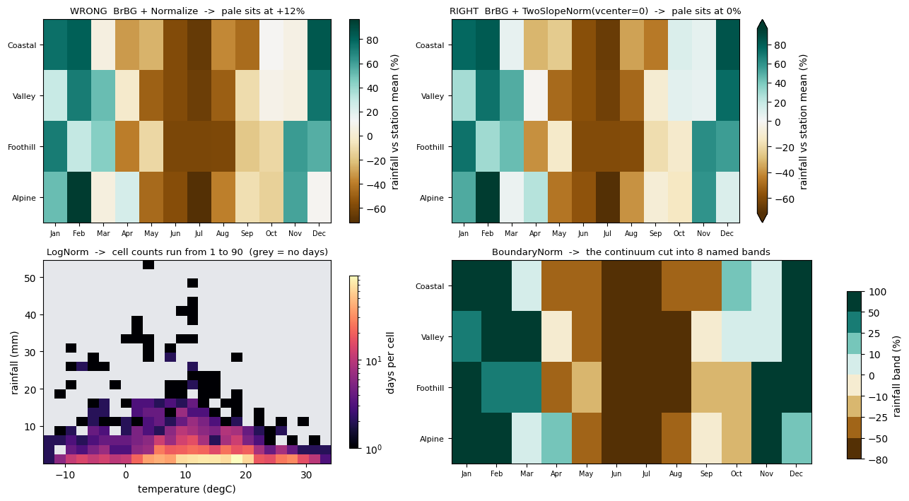

**Output**

```text
Colorbar arguments used above: label=, extend='both', shrink=0.85, ticks=, ax=<axes>, cax=<your own axes>.
```

### Cell 200

```python
# ============================================================
#  How many categorical colours actually stay distinguishable?
# ============================================================
def min_pair_distance(colours, kind=None):
    """The closest pair decides confusability, so measure the minimum."""
    c = np.array([mcolors.to_rgb(x) for x in colours])
    if kind:
        c = simulate_cvd(c, kind)
    best = np.inf
    for i in range(len(c)):
        for j in range(i + 1, len(c)):
            best = min(best, float(np.linalg.norm(c[i] - c[j])))
    return best

tab10 = [plt.get_cmap("tab10")(i) for i in range(10)]
tab20 = [plt.get_cmap("tab20")(i) for i in range(20)]

Ns = list(range(2, 21))
curves = {}
for pal, name in [(tab10, "tab10"), (tab20, "tab20")]:
    for kind, tag in [(None, "normal"), ("deuteranopia", "deuteranopia")]:
        curves[(name, tag)] = [min_pair_distance(pal[:n], kind)
                               if n <= len(pal) else np.nan for n in Ns]

fig, axes = plt.subplots(1, 2, figsize=(13.5, 4.6),
                         gridspec_kw={"width_ratios": [1, 1.3]})

# --- left: the tab10 swatches, as drawn and as simulated ---
ax = axes[0]
for i, c in enumerate(tab10):
    ax.add_patch(plt.Rectangle((i, 1.0), 0.92, 0.85, color=c))
    ax.add_patch(plt.Rectangle((i, 0.0), 0.92, 0.85,
                               color=np.clip(simulate_cvd(np.array(c[:3])), 0, 1)))
    ax.text(i + 0.46, 1.95, str(i), ha="center", fontsize=8, color=C_GREY)
ax.set_xlim(-0.1, 10); ax.set_ylim(-0.2, 2.3)
ax.set_yticks([0.42, 1.42])
ax.set_yticklabels(["deuteranopia (sim.)", "as drawn"], fontsize=9)
ax.set_xticks([])
ax.set_title("tab10: ten categorical colours", fontsize=10, loc="left")
for s in ax.spines.values():
    s.set_visible(False)

# --- right: separation as the number of categories grows ---
ax = axes[1]
style = {("tab10", "normal"): (C_LINE, "-"), ("tab10", "deuteranopia"): (C_LINE, "--"),
         ("tab20", "normal"): (C_ACC, "-"),  ("tab20", "deuteranopia"): (C_ACC, "--")}
FLOOR = 0.30
for key, ys in curves.items():
    col, ls = style[key]
    ax.plot(Ns, ys, color=col, ls=ls, lw=2, marker="o", ms=3,
            label=f"{key[0]} / {key[1]}")
ax.axhline(FLOOR, color=C_ALT, lw=1.2, ls=":")
ax.text(20, FLOOR + 0.01, f"rough comfort floor ({FLOOR})", color=C_ALT,
        fontsize=8, ha="right", va="bottom")
ax.set_xlabel("number of categories used, N")
ax.set_ylabel("minimum pairwise sRGB distance")
ax.set_title("Separation collapses as N grows, and faster under CVD",
             fontsize=10, loc="left")
ax.set_xticks(Ns[::2])
ax.legend(fontsize=8, frameon=False)
fig.tight_layout()
plt.show()

print(f"How far each palette gets before its closest pair drops below {FLOOR}:")
for name in ["tab10", "tab20"]:
    for tag in ["normal", "deuteranopia"]:
        ys = np.array(curves[(name, tag)], dtype=float)
        ok = [n for n, y in zip(Ns, ys) if np.isfinite(y) and y >= FLOOR]
        print(f"  {name:6s} {tag:13s}  N = {max(ok) if ok else 1}")
print()
print("Read those as ceilings, not targets. Past roughly six series, small "
      "multiples (Part 6) beat any palette.")
```

**Output**

```text
<Figure size 1350x460 with 2 Axes>
```

**Figure**

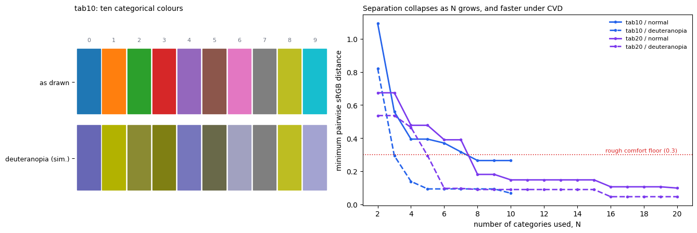

**Output**

```text
How far each palette gets before its closest pair drops below 0.3:
  tab10  normal         N = 7
  tab10  deuteranopia   N = 2
  tab20  normal         N = 7
  tab20  deuteranopia   N = 4

Read those as ceilings, not targets. Past roughly six series, small multiples (Part 6) beat any palette.
```

### Cell 204

```python
# ============================================================
#  A private scratch directory for this part. Everything we
#  save goes here, and the last cell deletes it. No network,
#  no writes anywhere near your own files.
# ============================================================
import os, shutil, tempfile
import numpy as np
import matplotlib
import matplotlib.pyplot as plt

WORK = tempfile.mkdtemp(prefix="mpl_part8_")
print(f"scratch dir : {WORK}")

# ---- measurement helpers: we never assert a size, we read it back ----------
def kb(path):
    """Size of a file on disk, in kilobytes."""
    return os.path.getsize(path) / 1024

def png_px(path):
    """(width, height) of a saved PNG in pixels, read back off the disk."""
    img = plt.imread(path)            # (rows, cols, channels)
    return img.shape[1], img.shape[0]

def renderer_for(fig):
    """A renderer we can measure text with, on any backend."""
    fig.canvas.draw()
    try:
        return fig.canvas.get_renderer()
    except AttributeError:                      # non-Agg backend
        from matplotlib.backends.backend_agg import FigureCanvasAgg
        return FigureCanvasAgg(fig).get_renderer()

def label_pt(fig, ax):
    """Height of a y tick label, in POINTS (1 pt = 1/72 inch).

    Measured off the renderer, not read out of rcParams -- the point of this
    part is that the physical size of type is a thing you can check.
    """
    r = renderer_for(fig)
    for lab in ax.get_yticklabels():
        if lab.get_text().strip():
            return lab.get_window_extent(r).height / fig.dpi * 72.0
    return float("nan")

def alpha_zero_frac(arr):
    """Fraction of fully transparent pixels; 0 if the image has no alpha."""
    return float((arr[..., 3] == 0).mean()) if arr.ndim == 3 and arr.shape[2] == 4 else 0.0

# ---- the figure we will save over and over --------------------------------
def make_fig(figsize=None, dpi=None):
    """One honest little chart: two stations, monthly means, sane limits."""
    monthly = wide[["Coastal", "Alpine"]].resample("MS").mean()
    fig, ax = plt.subplots(figsize=figsize, dpi=dpi)
    ax.plot(monthly.index, monthly["Coastal"], color=C_LINE, label="Coastal")
    ax.plot(monthly.index, monthly["Alpine"],  color=C_ALT,  label="Alpine")
    ax.set_ylabel("Monthly mean temperature (deg C)")
    ax.set_title("Two stations, one year")
    ax.legend(frameon=False)
    return fig, ax

# ---- the numbers this part argues with ------------------------------------
DEFAULT_FIGSIZE = tuple(plt.rcParamsDefault["figure.figsize"])
DEFAULT_DPI     = plt.rcParamsDefault["figure.dpi"]
SAVE_DPI        = plt.rcParamsDefault["savefig.dpi"]
BASE_FONT_PT    = plt.rcParamsDefault["font.size"]
COLUMN_IN       = 3.25          # a typical two-column journal text column

print(f"default figsize   : {DEFAULT_FIGSIZE[0]} x {DEFAULT_FIGSIZE[1]} inches")
print(f"default figure.dpi: {DEFAULT_DPI}   savefig.dpi: {SAVE_DPI!r}")
print(f"default font.size : {BASE_FONT_PT} pt  (1 pt = 1/72 inch)")
print(f"so the default figure is "
      f"{DEFAULT_FIGSIZE[0] * DEFAULT_DPI:.0f} x {DEFAULT_FIGSIZE[1] * DEFAULT_DPI:.0f} px on screen")
print(f"target column width for this part's paper example: {COLUMN_IN} inches")
```

**Output**

```text
scratch dir : /tmp/mpl_part8_1nlzp7vz
default figsize   : 6.4 x 4.8 inches
default figure.dpi: 100.0   savefig.dpi: 'figure'
default font.size : 10.0 pt  (1 pt = 1/72 inch)
so the default figure is 640 x 480 px on screen
target column width for this part's paper example: 3.25 inches
```

### Cell 205

```python
# ============================================================
#  pixels = inches x dpi. Save the SAME figure at five
#  combinations and read every result back off the disk.
# ============================================================
COMBOS = [
    ((6.4, 4.8), 100),      # the default, roughly
    ((6.4, 4.8), 200),      # same layout, twice the sampling
    ((6.4, 4.8), 300),      # print-grade sampling
    ((3.2, 2.4), 200),      # half the physical size
    ((12.8, 9.6), 50),      # same PIXELS as row 1 -- but look at the text
]

print(f"{'figsize (in)':>14} {'dpi':>5} {'expected px':>13} {'actual px':>13} {'KB':>8}")
print("-" * 58)
rows = []
for size, dpi in COMBOS:
    path = os.path.join(WORK, f"grid_{size[0]}x{size[1]}_{dpi}.png")
    fig, ax = make_fig(figsize=size, dpi=dpi)
    fig.savefig(path)                       # inherits the figure's own dpi
    plt.close(fig)
    w, h = png_px(path)
    exp = (round(size[0] * dpi), round(size[1] * dpi))
    rows.append((size, dpi, exp, (w, h), kb(path)))
    print(f"{size[0]:>6} x{size[1]:>5} {dpi:>5} {exp[0]:>6} x{exp[1]:<6} "
          f"{w:>6} x{h:<6} {kb(path):>8.1f}")

print()
print("expected == actual in every row:",
      all(exp == act for _, _, exp, act, _ in rows))
r1, r5 = rows[0], rows[4]
print(f"row 1 and row 5 are both {r1[3][0]} x {r1[3][1]} px, "
      f"but row 5 is {r5[0][0] / r1[0][0]:.0f}x the physical size, so its "
      f"{BASE_FONT_PT:.0f} pt text occupies "
      f"{r1[0][0] / r5[0][0]:.2f}x the width of the image.")
```

**Output**

```text
  figsize (in)   dpi   expected px     actual px       KB
----------------------------------------------------------
   6.4 x  4.8   100    640 x480       640 x480        35.1
   6.4 x  4.8   200   1280 x960      1280 x960        80.4
   6.4 x  4.8   300   1920 x1440     1920 x1440      129.3
   3.2 x  2.4   200    640 x480       640 x480        39.9
  12.8 x  9.6    50    640 x480       640 x480        23.4

expected == actual in every row: True
row 1 and row 5 are both 640 x 480 px, but row 5 is 2x the physical size, so its 10 pt text occupies 0.50x the width of the image.
```

### Cell 207

```python
# ============================================================
#  The single most-copied savefig argument, and what it
#  silently does to the size you just carefully chose.
# ============================================================
REQ, DPI = (6.0, 4.0), 150      # the size we asked for
print(f"we asked for {REQ[0]} x {REQ[1]} in at {DPI} dpi "
      f"= {REQ[0]*DPI:.0f} x {REQ[1]*DPI:.0f} px\n")

variants = [
    ("plain savefig",             dict()),
    ("bbox_inches='tight'",       dict(bbox_inches="tight")),
    ("tight, pad_inches=0",       dict(bbox_inches="tight", pad_inches=0)),
    ("tight, pad_inches=0.5",     dict(bbox_inches="tight", pad_inches=0.5)),
]

print(f"{'savefig call':<26} {'actual px':>13} {'actual inches':>15} {'KB':>7}")
print("-" * 66)
for i, (name, kwargs) in enumerate(variants):
    path = os.path.join(WORK, f"bbox_{i}.png")
    fig, ax = make_fig(figsize=REQ, dpi=DPI)
    # a long tick label, so the crop has something to react to
    ax.set_xlabel("Month of 2024 (the label that changes the crop)")
    fig.savefig(path, **kwargs)
    plt.close(fig)
    w, h = png_px(path)
    print(f"{name:<26} {w:>6} x{h:<6} {w/DPI:>7.2f} x{h/DPI:<6.2f} {kb(path):>7.1f}")

print()
print("Only the first row is the size you asked for.")
```

**Output**

```text
we asked for 6.0 x 4.0 in at 150 dpi = 900 x 600 px

savefig call                   actual px   actual inches      KB
------------------------------------------------------------------
plain savefig                 900 x600       6.00 x4.00      59.8
bbox_inches='tight'           814 x586       5.43 x3.91      59.1
tight, pad_inches=0           784 x556       5.23 x3.71      58.1
tight, pad_inches=0.5         934 x706       6.23 x4.71      61.1

Only the first row is the size you asked for.
```

### Cell 210

```python
# ============================================================
#  Same figure, same dpi, two physical sizes.
#  Then: what happens when the big one is scaled to the column.
# ============================================================
BIG   = (8.00, 6.00)
SMALL = (COLUMN_IN, COLUMN_IN * 6.0 / 8.0)      # same aspect, column width
DPI   = 200

paths = {}
for name, size in [("big", BIG), ("small", SMALL)]:
    fig, ax = make_fig(figsize=size, dpi=DPI)
    ax.set_xlabel("Month")
    p = os.path.join(WORK, f"scale_{name}.png")
    fig.savefig(p)
    pt = label_pt(fig, ax)              # measured, not assumed
    paths[name] = p
    w, h = png_px(p)
    print(f"{name:<6} figsize={size[0]:.2f} x {size[1]:.2f} in   "
          f"{w} x {h} px   tick label height = {pt:.2f} pt   {kb(p):.0f} KB")
    plt.close(fig)

scale = COLUMN_IN / BIG[0]
print()
print(f"To fit a {COLUMN_IN} in column, the big figure must be scaled by "
      f"{scale:.3f}.")
print(f"Its {BASE_FONT_PT:.0f} pt tick labels then print at "
      f"{BASE_FONT_PT * scale:.2f} pt, versus {BASE_FONT_PT:.1f} pt for the "
      f"figure drawn at column width.")
print(f"Body text in a paper is about 9-10 pt. Anything under ~6 pt is a "
      f"reviewer complaint.")

# ---- show both files at their TRUE relative size, on an inch grid ----------
big_img, small_img = plt.imread(paths["big"]), plt.imread(paths["small"])
fig, ax = plt.subplots(figsize=(12, 5))
ax.imshow(big_img,   extent=(0, BIG[0], 0, BIG[1]))
ax.imshow(small_img, extent=(BIG[0] + 0.6, BIG[0] + 0.6 + SMALL[0], 0, SMALL[1]))
ax.set_xlim(-0.3, BIG[0] + 0.9 + SMALL[0])
ax.set_ylim(-0.4, BIG[1] + 0.4)
ax.set_aspect("equal")
ax.axis("off")
ax.text(BIG[0] / 2, -0.25, f"drawn at {BIG[0]:.0f} x {BIG[1]:.0f} in",
        ha="center", va="top", color=C_GREY)
ax.text(BIG[0] + 0.6 + SMALL[0] / 2, -0.25,
        f"drawn at {SMALL[0]:.2f} x {SMALL[1]:.2f} in",
        ha="center", va="top", color=C_GREY)
plt.show()
```

**Output**

```text
big    figsize=8.00 x 6.00 in   1600 x 1200 px   tick label height = 10.08 pt   96 KB
small  figsize=3.25 x 2.44 in   650 x 487 px   tick label height = 10.08 pt   41 KB

To fit a 3.25 in column, the big figure must be scaled by 0.406.
Its 10 pt tick labels then print at 4.06 pt, versus 10.0 pt for the figure drawn at column width.
Body text in a paper is about 9-10 pt. Anything under ~6 pt is a reviewer complaint.
```

**Output**

```text
<Figure size 1200x500 with 1 Axes>
```

**Figure**

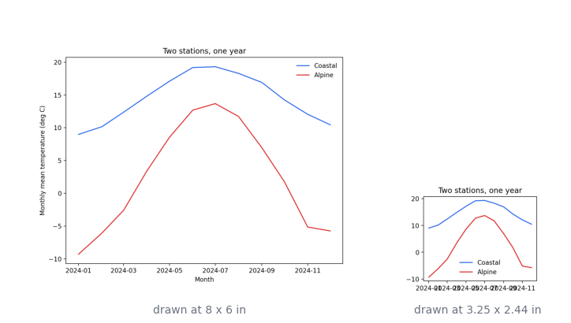

### Cell 214

```python
# ============================================================
#  A publication-defaults block worth copying. Applied with a
#  context manager, so it CANNOT leak into the rest of the
#  notebook -- which we check at the end of the cell.
# ============================================================
PUB = {
    # type: sized for a figure that is actually COLUMN_IN inches wide
    "font.size":        8,
    "axes.titlesize":   9,
    "axes.labelsize":   8,
    "xtick.labelsize":  7,
    "ytick.labelsize":  7,
    "legend.fontsize":  7,
    # weights: thin lines disappear in print, thick ones look crude
    "lines.linewidth":  1.2,
    "lines.markersize": 3,
    "axes.linewidth":   0.6,
    "xtick.major.width": 0.6,
    "ytick.major.width": 0.6,
    # output
    "figure.dpi":       120,     # what you see while you work
    "savefig.dpi":      300,     # what the journal gets
    "savefig.bbox":     None,    # explicitly NOT 'tight' -- keep our size
    # fonts that survive the trip into a PDF (explained in the next cell)
    "pdf.fonttype":     42,
    "ps.fonttype":      42,
}

before_font = plt.rcParams["font.size"]

fig, axes = plt.subplots(1, 2, figsize=(11, 4))
for ax_host, (label, ctx) in zip(axes, [("default type", {}), ("PUB type", PUB)]):
    with plt.rc_context(ctx):
        f, a = make_fig(figsize=SMALL, dpi=DPI)
        a.set_xlabel("Month")
        p = os.path.join(WORK, f"pub_{label.split()[0]}.png")
        # dpi=DPI explicitly: PUB sets savefig.dpi=300, and we want the two
        # panels to come out the SAME number of pixels so the only visible
        # difference is the type. (That override is itself worth noticing.)
        f.savefig(p, dpi=DPI)
        pt = label_pt(f, a)
        plt.close(f)
    ax_host.imshow(plt.imread(p))
    ax_host.axis("off")
    ax_host.set_title(f"{label}: tick labels {pt:.2f} pt, {kb(p):.0f} KB",
                      fontsize=11)
    print(f"{label:<13} -> {png_px(p)[0]} x {png_px(p)[1]} px, "
          f"tick label {pt:.2f} pt, {kb(p):.1f} KB")
fig.tight_layout()
plt.show()

after_font = plt.rcParams["font.size"]
print()
print(f"font.size outside the with-block: before={before_font}, "
      f"after={after_font}  ->  leaked: {before_font != after_font}")
```

**Output**

```text
default type  -> 650 x 487 px, tick label 10.08 pt, 40.5 KB
PUB type      -> 650 x 487 px, tick label 6.84 pt, 38.7 KB
```

**Output**

```text
<Figure size 1100x400 with 2 Axes>
```

**Figure**

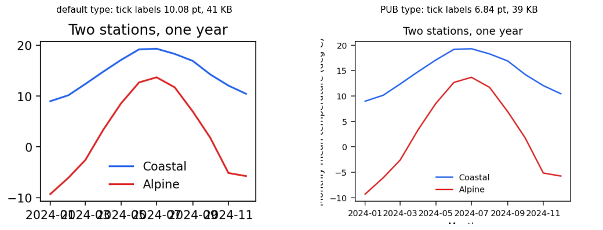

**Output**

```text
font.size outside the with-block: before=10.0, after=10.0  ->  leaked: False
```

### Cell 217

```python
# ============================================================
#  Real byte counts. This cell writes a large SVG on purpose
#  and takes a few seconds -- that slowness IS the lesson.
# ============================================================
import time

# a simple figure: a few hundred drawing instructions
def simple_fig():
    fig, ax = make_fig(figsize=(5, 4), dpi=150)
    return fig

# a dense figure: 100,000 drawing instructions
N = 100_000
rng = np.random.default_rng(8)
sx = rng.normal(size=N)
sy = 0.6 * sx + rng.normal(size=N)

def dense_fig():
    fig, ax = plt.subplots(figsize=(5, 4), dpi=150)
    ax.scatter(sx, sy, s=2, alpha=0.15, color=C_LINE, edgecolors="none")
    ax.set_title(f"{N:,} points")
    ax.set_xlabel("x")
    ax.set_ylabel("y")
    return fig

print(f"{'figure':<22} {'format':<7} {'KB':>12} {'save seconds':>13}")
print("-" * 58)
sizes = {}
for label, builder in [("line chart", simple_fig), (f"scatter, {N:,} pts", dense_fig)]:
    for ext in ["png", "svg", "pdf"]:
        fig = builder()
        p = os.path.join(WORK, f"{label.split(',')[0].replace(' ', '_')}.{ext}")
        t0 = time.time()
        fig.savefig(p)
        dt = time.time() - t0
        plt.close(fig)
        sizes[(label, ext)] = kb(p)
        print(f"{label:<22} {ext:<7} {kb(p):>12,.1f} {dt:>13.2f}")

print()
line_ratio  = sizes[("line chart", "svg")] / sizes[("line chart", "png")]
dense_label = f"scatter, {N:,} pts"
dense_ratio = sizes[(dense_label, "svg")] / sizes[(dense_label, "png")]
print(f"line chart : SVG is {line_ratio:.2f}x the PNG "
      f"({sizes[('line chart','svg')]:,.1f} KB vs "
      f"{sizes[('line chart','png')]:,.1f} KB)")
print(f"dense scatter: SVG is {dense_ratio:,.0f}x the PNG "
      f"({sizes[(dense_label,'svg')]/1024:,.1f} MB vs "
      f"{sizes[(dense_label,'png')]:,.1f} KB)")
print()
print("Rule: vector by default; raster when the number of drawn objects is "
      "large. For the best of both, keep the axes and text vector and "
      "rasterise only the dense artist:  ax.scatter(..., rasterized=True) "
      "then savefig(..., dpi=300).")
```

**Output**

```text
figure                 format            KB  save seconds
----------------------------------------------------------
line chart             png             49.9          0.06
line chart             svg             29.4          0.06
line chart             pdf             13.5          0.93
scatter, 100,000 pts   png            174.8          0.43
scatter, 100,000 pts   svg         15,711.8          3.23
scatter, 100,000 pts   pdf          1,493.6          3.56

line chart : SVG is 0.59x the PNG (29.4 KB vs 49.9 KB)
dense scatter: SVG is 90x the PNG (15.3 MB vs 174.8 KB)

Rule: vector by default; raster when the number of drawn objects is large. For the best of both, keep the axes and text vector and rasterise only the dense artist:  ax.scatter(..., rasterized=True) then savefig(..., dpi=300).
```

### Cell 219

```python
# ============================================================
#  transparent=True, and why the figure vanishes on a dark slide.
#  Failure first: we save it, then paste it onto a dark panel.
# ============================================================
DARK = "#111827"

def save_variant(name, transparent, textcolor, **save_kw):
    with plt.rc_context({"text.color": textcolor, "axes.labelcolor": textcolor,
                         "xtick.color": textcolor, "ytick.color": textcolor,
                         "axes.edgecolor": textcolor, "font.size": 9}):
        fig, ax = make_fig(figsize=(4.2, 3.0), dpi=150)
        ax.set_xlabel("Month")
        p = os.path.join(WORK, f"trans_{name}.png")
        fig.savefig(p, transparent=transparent, **save_kw)
        plt.close(fig)
    return p

p_bad  = save_variant("bad",  True,  "black")            # the default text colour
p_fix1 = save_variant("fix1", True,  "#F9FAFB")          # light text, still transparent
p_fix2 = save_variant("fix2", False, "black", facecolor="white")   # opaque white plate

fig, axes = plt.subplots(1, 3, figsize=(13, 3.6))
fig.patch.set_facecolor(DARK)                 # pretend this is your dark slide
titles = ["transparent=True, black text",
          "transparent=True, light text",
          "transparent=False, facecolor='white'"]
for ax, p, ttl in zip(axes, [p_bad, p_fix1, p_fix2], titles):
    ax.set_facecolor(DARK)
    ax.imshow(plt.imread(p))                  # RGBA blends over the dark axes
    ax.set_xticks([]); ax.set_yticks([])
    for s in ax.spines.values():
        s.set_color("#374151")
    ax.set_title(ttl, color="white", fontsize=10)
fig.tight_layout()
plt.show()

# proof that the file really is transparent, not just pale
img = plt.imread(p_bad)
print(f"{os.path.basename(p_bad)}: shape {img.shape}  (4 channels = RGBA)")
print(f"  fraction of pixels fully transparent (alpha == 0): "
      f"{alpha_zero_frac(img):.1%}")
print(f"{os.path.basename(p_fix2)}: fraction fully transparent: "
      f"{alpha_zero_frac(plt.imread(p_fix2)):.1%}")
```

**Output**

```text
<Figure size 1300x360 with 3 Axes>
```

**Figure**

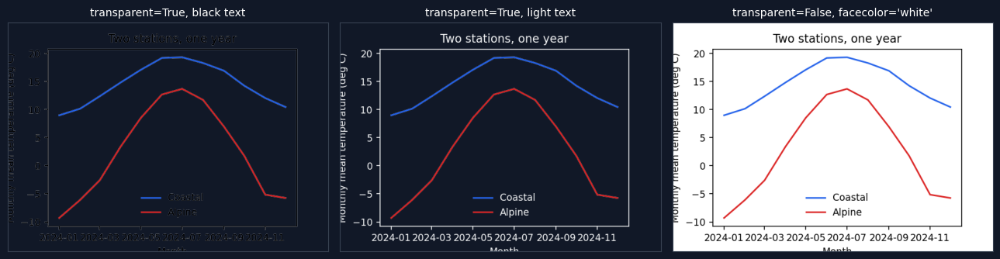

**Output**

```text
trans_bad.png: shape (450, 630, 4)  (4 channels = RGBA)
  fraction of pixels fully transparent (alpha == 0): 93.8%
trans_fix2.png: fraction fully transparent: 0.0%
```

### Cell 222

```python
# ============================================================
#  Fonts: what exists on THIS machine, what happens when the
#  font you asked for does not, and how to embed it in a PDF.
# ============================================================
from matplotlib import font_manager

families = sorted({f.name for f in font_manager.fontManager.ttflist})
print(f"font families matplotlib can see here: {len(families)}")
print("first 12:", ", ".join(families[:12]))
print()

WANTED = ["DejaVu Sans", "Helvetica", "Arial", "Times New Roman",
          "Computer Modern Roman", "Comic Sans MS"]
print(f"{'requested family':<24} {'available here':>15}")
print("-" * 41)
for name in WANTED:
    print(f"{name:<24} {str(name in families):>15}")

print()
# What matplotlib actually does when the family is missing: it does not fail.
resolved = font_manager.findfont("A Font That Does Not Exist",
                                 fallback_to_default=True)
print("asked for  : 'A Font That Does Not Exist'")
print(f"resolved to: {os.path.basename(resolved)}")
print("-> a missing font is a SILENT substitution, not an error. Your figure "
      "renders, in a different typeface, with different metrics, so the text "
      "is a different width and your layout shifts.")
print()

# Font embedding for vector output.
print(f"pdf.fonttype default : {plt.rcParamsDefault['pdf.fonttype']}   "
      f"(3 = Type 3, 42 = TrueType)")
for ft in (3, 42):
    with plt.rc_context({"pdf.fonttype": ft}):
        fig, ax = make_fig(figsize=(4, 3), dpi=150)
        p = os.path.join(WORK, f"fonttype_{ft}.pdf")
        fig.savefig(p)
        plt.close(fig)
    print(f"  pdf.fonttype={ft:<3} -> {os.path.basename(p)}  {kb(p):6.1f} KB")
print()
print("Set pdf.fonttype = 42 (and ps.fonttype = 42). Type 3 text is often not "
      "selectable or searchable, and several journal submission systems "
      "reject it outright. TrueType costs a few KB and always works.")
```

**Output**

```text
WARNING:matplotlib.font_manager:findfont: Font family ['A Font That Does Not Exist'] not found. Falling back to DejaVu Sans.
```

**Output**

```text
font families matplotlib can see here: 23
first 12: DejaVu Sans, DejaVu Sans Display, DejaVu Sans Mono, DejaVu Serif, DejaVu Serif Display, Humor Sans, Liberation Mono, Liberation Sans, Liberation Serif, STIXGeneral, STIXNonUnicode, STIXSizeFiveSym

requested family          available here
-----------------------------------------
DejaVu Sans                         True
Helvetica                          False
Arial                              False
Times New Roman                    False
Computer Modern Roman              False
Comic Sans MS                      False

asked for  : 'A Font That Does Not Exist'
resolved to: DejaVuSans.ttf
-> a missing font is a SILENT substitution, not an error. Your figure renders, in a different typeface, with different metrics, so the text is a different width and your layout shifts.

pdf.fonttype default : 3   (3 = Type 3, 42 = TrueType)
  pdf.fonttype=3   -> fonttype_3.pdf    13.5 KB
  pdf.fonttype=42  -> fonttype_42.pdf    11.7 KB

Set pdf.fonttype = 42 (and ps.fonttype = 42). Type 3 text is often not selectable or searchable, and several journal submission systems reject it outright. TrueType costs a few KB and always works.
```

### Cell 223

```python
# ============================================================
#  The habit that catches everything above: SAVE, THEN READ
#  IT BACK. Plus metadata, and cleaning up after ourselves.
# ============================================================
FINAL = os.path.join(WORK, "figure_1.png")
TARGET_IN, TARGET_DPI = (COLUMN_IN, 2.4), 300

with plt.rc_context(PUB):
    fig, ax = make_fig(figsize=TARGET_IN, dpi=TARGET_DPI)
    ax.set_xlabel("Month")
    fig.savefig(FINAL, dpi=TARGET_DPI, metadata={
        "Title":       "Monthly mean temperature, two stations",
        "Author":      "CMPE 258 matplotlib zero-to-hero",
        "Description": "Figure 1. Coastal and Alpine monthly means, 2024.",
        "Software":    f"matplotlib {matplotlib.__version__}",
    })
    plt.close(fig)

# ---- 1. is it the size you asked for? -------------------------------------
w, h = png_px(FINAL)
print(f"asked for : {TARGET_IN[0]} x {TARGET_IN[1]} in at {TARGET_DPI} dpi "
      f"= {TARGET_IN[0]*TARGET_DPI:.0f} x {TARGET_IN[1]*TARGET_DPI:.0f} px")
print(f"got       : {w} x {h} px  ({w/TARGET_DPI:.2f} x {h/TARGET_DPI:.2f} in "
      f"at {TARGET_DPI} dpi),  {kb(FINAL):.0f} KB")
print(f"match     : {(w, h) == (round(TARGET_IN[0]*TARGET_DPI), round(TARGET_IN[1]*TARGET_DPI))}")

# ---- 2. is it opaque, and does it have an alpha channel? ------------------
arr = plt.imread(FINAL)
print(f"array     : shape {arr.shape}, dtype {arr.dtype}, "
      f"value range {arr.min():.2f}-{arr.max():.2f}")
print(f"fully transparent pixels: {alpha_zero_frac(arr):.1%}")

# ---- 3. did the metadata survive? -----------------------------------------
try:
    from PIL import Image
    with Image.open(FINAL) as im:
        meta = dict(getattr(im, "text", {}))
    for k in ["Title", "Author", "Description", "Software"]:
        print(f"metadata  : {k:<12} = {meta.get(k, '(missing)')}")
except ImportError:
    print("metadata  : Pillow not available; skipped the read-back")

# ---- clean up: this part wrote a lot of files, including a large SVG ------
n_files = sum(len(fs) for _, _, fs in os.walk(WORK))
total_mb = sum(os.path.getsize(os.path.join(d, f))
               for d, _, fs in os.walk(WORK) for f in fs) / 1024**2
shutil.rmtree(WORK, ignore_errors=True)
print()
print(f"scratch dir held {n_files} files, {total_mb:.1f} MB total -- removed.")
print(f"still exists: {os.path.exists(WORK)}")
```

**Output**

```text
asked for : 3.25 x 2.4 in at 300 dpi = 975 x 720 px
got       : 975 x 720 px  (3.25 x 2.40 in at 300 dpi),  62 KB
match     : True
array     : shape (720, 975, 4), dtype float32, value range 0.00-1.00
fully transparent pixels: 0.0%
metadata  : Title        = Monthly mean temperature, two stations
metadata  : Author       = CMPE 258 matplotlib zero-to-hero
metadata  : Description  = Figure 1. Coastal and Alpine monthly means, 2024.
metadata  : Software     = matplotlib 3.10.0

scratch dir held 25 files, 18.0 MB total -- removed.
still exists: False
```

### Cell 227

```python
# ============================================================
#  Part 9 works from an explicit baseline of its own.
#  Earlier parts changed rcParams to demonstrate what they change; the clinic
#  resets and sets its own small, deliberate style so that within each case the
#  ONLY difference between the bad figure and the fixed one is the thing under
#  discussion. (Style as a decision: Part 3. Saving and dpi: Part 8.)
# ============================================================
plt.rcParams.update(plt.rcParamsDefault)
plt.rcParams.update({
    "figure.dpi": 110, "savefig.dpi": 200,
    "figure.facecolor": "white", "savefig.facecolor": "white",
    "font.size": 9, "axes.titlesize": 11, "axes.labelsize": 10,
    "axes.titlelocation": "left",
    "axes.grid": True, "axes.axisbelow": True,
    "grid.color": "#E5E7EB", "grid.linewidth": 0.8,
    "legend.frameon": False,
})

# The two impossible sensor readings from Part 0 are masked ONCE here, so the
# clinic argues about design rather than about data cleaning. `weather` and
# `wide` are left untouched -- some cases need the raw version.
PLAUSIBLE = (-30.0, 55.0)
impossible = weather.temp_c.notna() & ~weather.temp_c.between(*PLAUSIBLE)

clean = weather.copy()
clean.loc[impossible, "temp_c"] = np.nan
wide_c = clean.pivot_table(index="date", columns="station", values="temp_c")

print(f"plausible temperature range assumed : {PLAUSIBLE[0]:.0f} to {PLAUSIBLE[1]:.0f} °C")
print(f"readings outside it, now masked     : {int(impossible.sum())}")
print(weather.loc[impossible, ["date", "station", "temp_c"]].to_string(index=False))
print(f"missing values before masking       : {int(weather.temp_c.isna().sum())}")
print(f"missing values after masking        : {int(clean.temp_c.isna().sum())}")
```

**Output**

```text
plausible temperature range assumed : -30 to 55 °C
readings outside it, now masked     : 2
      date  station  temp_c
2024-03-29   Valley   -40.0
2024-07-19 Foothill    61.0
missing values before masking       : 23
missing values after masking        : 25
```

### Cell 229

```python
# ---------- BAD #1 -------------------------------------------------
rain_mean = weather.groupby("station")["rain_mm"].mean().reindex(list(stations.station))

fig, ax = plt.subplots(figsize=(5.4, 3.4))
ax.bar(rain_mean.index, rain_mean.values, color="#4C78A8")
ax.set_ylim(rain_mean.min() - 0.03, rain_mean.max() + 0.03)   # <-- the whole crime
ax.set_ylabel("rain")
ax.set_title("Rainfall differs sharply by station")
plt.show()

# What the picture claims, versus what the numbers say.
lo, _ = ax.get_ylim()
true_ratio  = rain_mean.max() / rain_mean.min()
drawn_ratio = (rain_mean.max() - lo) / (rain_mean.min() - lo)
sem = weather.groupby("station")["rain_mm"].sem().reindex(rain_mean.index)

print(rain_mean.round(3).to_string())
print()
print(f"wettest / driest, in the data      : {true_ratio:.3f}x")
print(f"wettest / driest, as BAR HEIGHTS   : {drawn_ratio:.1f}x")
print(f"gap between the extreme means      : {rain_mean.max() - rain_mean.min():.3f} mm/day")
print(f"typical standard error of one mean : {sem.mean():.3f} mm/day")
```

**Output**

```text
<Figure size 594x374 with 1 Axes>
```

**Figure**

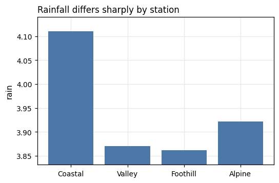

**Output**

```text
station
Coastal     4.110
Valley      3.871
Foothill    3.862
Alpine      3.921

wettest / driest, in the data      : 1.064x
wettest / driest, as BAR HEIGHTS   : 9.3x
gap between the extreme means      : 0.249 mm/day
typical standard error of one mean : 0.308 mm/day
```

### Cell 231

```python
# ---------- FIXED #1 -----------------------------------------------
order = rain_mean.sort_values(ascending=False)          # rank is now readable
err   = 1.96 * sem.reindex(order.index)                 # 95% interval on each mean

fig, ax = plt.subplots(figsize=(6.2, 3.6))
bars = ax.bar(order.index, order.values, color=C_GREY, width=0.62,
              yerr=err.values, capsize=4,
              error_kw=dict(ecolor="#111827", elinewidth=1.2))
ax.set_ylim(0, None)                                    # Part 4: bars start at zero
ax.set_ylabel("mean daily rainfall (mm/day)")           # Part 5: quantity + unit
ax.set_title("Mean daily rainfall is indistinguishable across the four stations")
ax.bar_label(bars, fmt="%.2f", padding=3, fontsize=8, color="#374151")
ax.spines[["top", "right"]].set_visible(False)          # Part 4: spines
ax.grid(axis="x", visible=False)
plt.show()

hi_lo = order.values - err.values
lo_hi = order.values + err.values
print(f"every 95% interval overlaps every other: {hi_lo.max() <= lo_hi.min()}")
print(f"widest interval  : +/- {err.max():.2f} mm/day")
print(f"largest gap between two station means: {order.max() - order.min():.3f} mm/day")
```

**Output**

```text
<Figure size 682x396 with 1 Axes>
```

**Figure**

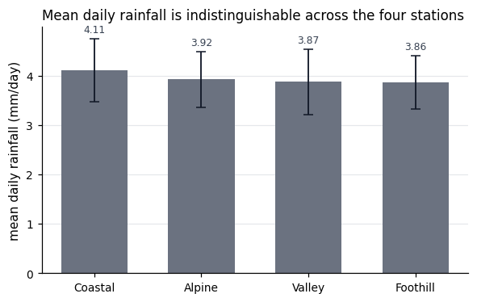

**Output**

```text
every 95% interval overlaps every other: True
widest interval  : +/- 0.67 mm/day
largest gap between two station means: 0.249 mm/day
```

### Cell 233

```python
# ---------- BAD #2 -------------------------------------------------
valley = wide_c["Valley"]
by_month = {m: valley[valley.index.month == m] for m in range(1, 13)}

fig, ax = plt.subplots(figsize=(7.4, 4.0))
for m, s in by_month.items():
    ax.plot(s.index.day, s.values, label=f"month {m}")
ax.legend(ncol=6, fontsize=7, loc="upper center")
ax.set_xlabel("day of month")
ax.set_ylabel("temperature (°C)")
ax.set_title("Valley temperature by month")
plt.show()

n_lines = len(ax.get_lines())
n_colours = len(plt.rcParams["axes.prop_cycle"])
print(f"lines drawn                       : {n_lines}")
print(f"colours in the default cycle      : {n_colours}")
print(f"lines forced to reuse a colour    : {max(0, n_lines - n_colours)}")
print(f"legend entries a reader must map  : {len(ax.get_legend().get_texts())}")
```

**Output**

```text
<Figure size 814x440 with 1 Axes>
```

**Figure**

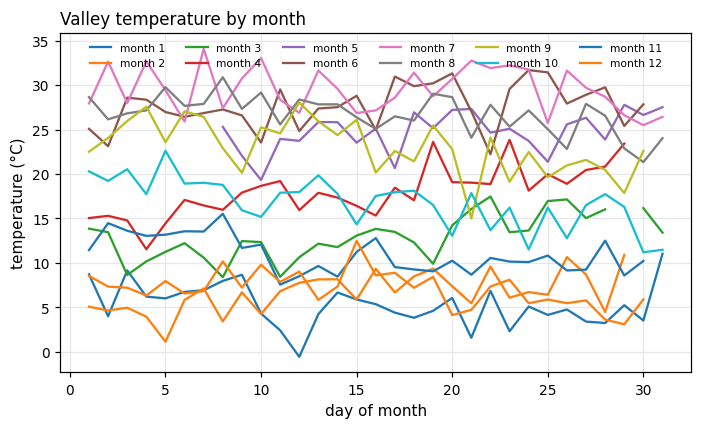

**Output**

```text
lines drawn                       : 12
colours in the default cycle      : 10
lines forced to reuse a colour    : 2
legend entries a reader must map  : 12
```

### Cell 235

```python
# ---------- FIXED #2 -----------------------------------------------
# One panel per month, shared axes so panels are comparable at a glance
# (Part 6), every OTHER month redrawn in grey behind for context (Part 3:
# alpha and line width as a foreground/background device).
fig, axes = plt.subplots(3, 4, figsize=(9.4, 5.4), sharex=True, sharey=True)

for ax, m in zip(axes.ravel(), range(1, 13)):
    for other in by_month.values():                       # context, deliberately mute
        ax.plot(other.index.day, other.values, color=C_SOFT, lw=0.7, zorder=1)
    s = by_month[m]
    ax.plot(s.index.day, s.values, color=C_LINE, lw=1.7, zorder=2)
    ax.set_title(pd.Timestamp(2024, m, 1).strftime("%B"), fontsize=9)  # direct label
    ax.grid(alpha=0.5)

fig.supxlabel("day of month")
fig.supylabel("temperature (°C)")
fig.suptitle("Valley temperature, one panel per month (all other months in grey)",
             x=0.02, ha="left", fontsize=12)
fig.tight_layout()
plt.show()

means = valley.groupby(valley.index.month).mean()
print(f"warmest month : {pd.Timestamp(2024, int(means.idxmax()), 1):%B}  "
      f"({means.max():.1f} °C)")
print(f"coldest month : {pd.Timestamp(2024, int(means.idxmin()), 1):%B}  "
      f"({means.min():.1f} °C)")
ylo, yhi = axes[0, 0].get_ylim()
print(f"shared y-limits across all twelve panels: {ylo:.1f} to {yhi:.1f} °C")
```

**Output**

```text
<Figure size 1034x594 with 12 Axes>
```

**Figure**

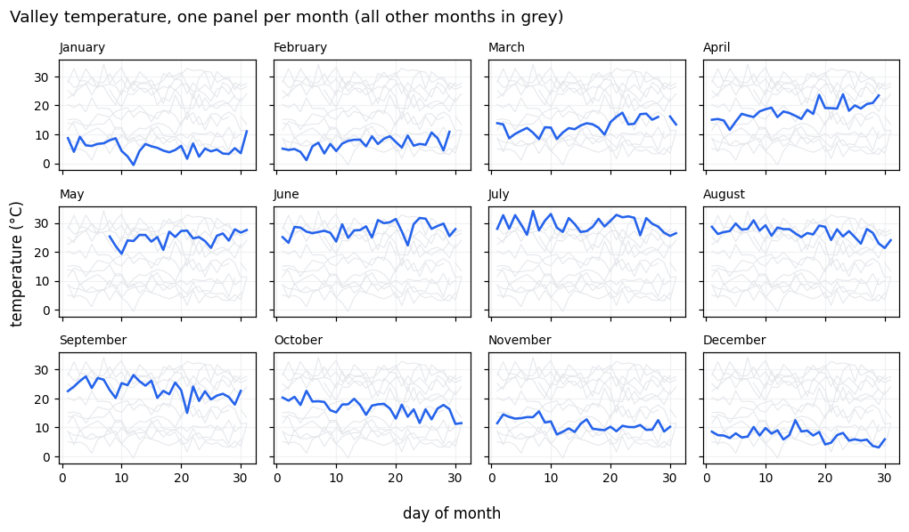

**Output**

```text
warmest month : July  (29.5 °C)
coldest month : January  (5.2 °C)
shared y-limits across all twelve panels: -2.3 to 35.8 °C
```

### Cell 237

```python
# ---------- BAD #3 -------------------------------------------------
temp7 = wide_c["Valley"].rolling(7, min_periods=4).mean()
rain7 = (clean[clean.station == "Coastal"].set_index("date")["rain_mm"]
         .rolling(7, min_periods=4).mean())

fig, (axL, axR) = plt.subplots(1, 2, figsize=(11.0, 3.6))

for ax, flip, title in [(axL, False, "Warm weeks are dry weeks"),
                        (axR, True,  "Warm weeks are wet weeks")]:
    ax.plot(temp7.index, temp7.values, color=C_ALT, lw=1.6)
    ax.set_ylabel("temp", color=C_ALT)
    ax2 = ax.twinx()
    ax2.plot(rain7.index, rain7.values, color=C_LINE, lw=1.6)
    ax2.set_ylabel("rain", color=C_LINE)
    ax2.grid(False)
    if flip:
        ax2.invert_yaxis()          # one line, opposite conclusion, same data
    ax.set_title(title)

fig.tight_layout()
plt.show()

both = pd.concat([temp7, rain7], axis=1, keys=["temp", "rain"]).dropna()
r = both["temp"].corr(both["rain"])
print(f"aligned weeks compared        : {len(both)}")
print(f"Pearson r (7-day smoothed)    : {r:+.3f}")
print(f"shared variance, r squared    : {r ** 2:.3f}")
print(f"variance NOT shared           : {1 - r ** 2:.3f}")
```

**Output**

```text
<Figure size 1210x396 with 4 Axes>
```

**Figure**

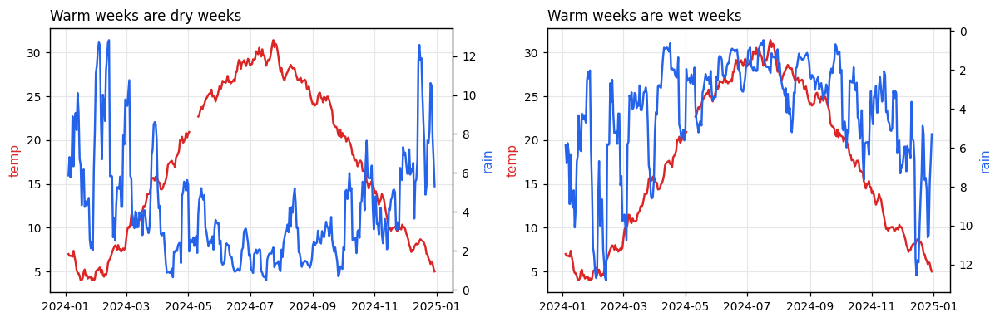

**Output**

```text
aligned weeks compared        : 354
Pearson r (7-day smoothed)    : -0.684
shared variance, r squared    : 0.468
variance NOT shared           : 0.532
```

### Cell 239

```python
# ---------- FIXED #3 -----------------------------------------------
# Stacked panels sharing the date axis (Part 6) so time is comparable and each
# series keeps its own honest scale; the relationship itself gets the chart it
# deserves -- a scatter, with the number written on it (Part 5).
import matplotlib.dates as mdates

fig, axd = plt.subplot_mosaic([["t", "s"],
                               ["r", "s"]],
                              figsize=(10.4, 4.4), width_ratios=[1.7, 1.0],
                              layout="constrained")
axd["r"].sharex(axd["t"])

axd["t"].plot(temp7.index, temp7.values, color=C_ALT, lw=1.6)
axd["t"].set_ylabel("Valley temp\n(°C, 7-day mean)")
axd["t"].set_title("Two series, two panels, one shared time axis")
axd["t"].tick_params(labelbottom=False)

axd["r"].plot(rain7.index, rain7.values, color=C_LINE, lw=1.6)
axd["r"].set_ylabel("Coastal rain\n(mm/day, 7-day mean)")
axd["r"].set_ylim(0, None)                      # rainfall genuinely starts at zero
axd["r"].xaxis.set_major_locator(mdates.MonthLocator(interval=2))   # Part 4
axd["r"].xaxis.set_major_formatter(mdates.DateFormatter("%b"))

axd["s"].scatter(both["temp"], both["rain"], s=10, alpha=0.35,
                 color=C_ACC, edgecolor="none")
axd["s"].set_xlabel("Valley temp (°C, 7-day mean)")
axd["s"].set_ylabel("Coastal rain (mm/day, 7-day mean)")
axd["s"].set_title("The relationship itself")
axd["s"].annotate(f"r = {r:+.2f}\nr² = {r ** 2:.2f}\nn = {len(both)}",
                  xy=(0.97, 0.95), xycoords="axes fraction",
                  ha="right", va="top", fontsize=9,
                  bbox=dict(boxstyle="round,pad=0.4", fc="white", ec=C_SOFT))
plt.show()

q = both.assign(band=pd.qcut(both["temp"], 4, labels=["coldest", "cool", "warm", "warmest"]))
print(q.groupby("band", observed=True)["rain"].agg(["mean", "std", "size"]).round(2).to_string())
```

**Output**

```text
<Figure size 1144x484 with 3 Axes>
```

**Figure**

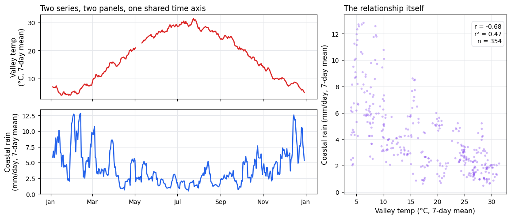

**Output**

```text
         mean   std  size
band                     
coldest  7.16  2.85    89
cool     4.41  2.08    88
warm     3.02  1.36    88
warmest  1.94  0.98    89
```

### Cell 241

```python
# ---------- BAD #4 -------------------------------------------------
half = np.where(clean.date.dt.month <= 6, "Jan-Jun", "Jul-Dec")
share = clean.assign(half=half).groupby(["station", "half"])["rain_mm"].sum()
pct = 100 * share / share.sum()
labels = [f"{st} {h}" for st, h in share.index]

fig, ax = plt.subplots(figsize=(5.8, 5.8))
ax.pie(share.values, labels=labels, autopct="%1.0f%%", startangle=90,
       textprops=dict(fontsize=8))
ax.set_title("Share of total rainfall")
plt.show()

print(f"slices                       : {len(share)}")
print(f"largest slice                : {pct.max():.1f}%  ({pct.idxmax()[0]} {pct.idxmax()[1]})")
print(f"smallest slice               : {pct.min():.1f}%  ({pct.idxmin()[0]} {pct.idxmin()[1]})")
print(f"spread, largest to smallest  : {pct.max() - pct.min():.1f} percentage points")
print(f"an equal split would be      : {100 / len(share):.1f}% each")
```

**Output**

```text
<Figure size 638x638 with 1 Axes>
```

**Figure**

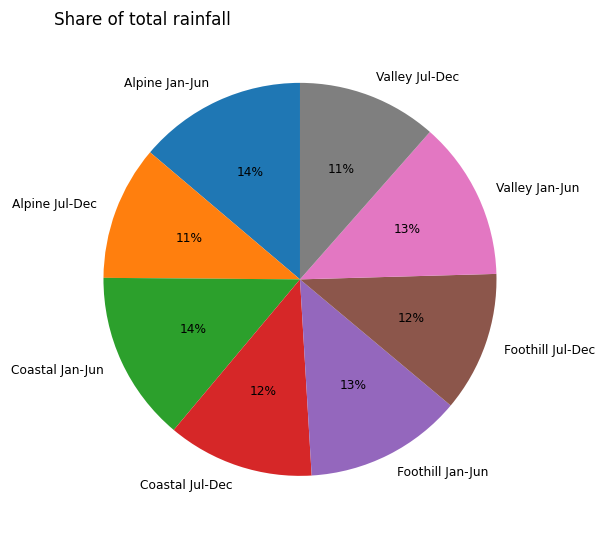

**Output**

```text
slices                       : 8
largest slice                : 14.0%  (Coastal Jan-Jun)
smallest slice               : 11.1%  (Alpine Jul-Dec)
spread, largest to smallest  : 3.0 percentage points
an equal split would be      : 12.5% each
```

### Cell 243

```python
# ---------- FIXED #4 -----------------------------------------------
# Length along a common baseline instead of angle (Part 2), grouped so the two
# variables stay separate (Part 6), and colour used for the half-year only --
# one meaningful distinction, two hues (Part 7).
tbl = (100 * share / share.sum()).unstack()
tbl = tbl.loc[tbl.sum(axis=1).sort_values().index]      # sorted: rank is readable
y = np.arange(len(tbl))
h = 0.38

fig, ax = plt.subplots(figsize=(7.2, 3.4))
b1 = ax.barh(y + h / 2, tbl["Jan-Jun"], height=h, color=C_LINE, label="Jan-Jun")
b2 = ax.barh(y - h / 2, tbl["Jul-Dec"], height=h, color=C_WARN, label="Jul-Dec")
ax.bar_label(b1, fmt="%.1f%%", padding=2, fontsize=8)
ax.bar_label(b2, fmt="%.1f%%", padding=2, fontsize=8)
ax.set_yticks(y)
ax.set_yticklabels(tbl.index)
ax.set_xlim(0, tbl.values.max() * 1.25)
ax.set_xlabel("share of the year's total rainfall (%)")
ax.set_title("Rainfall is split almost evenly between stations; each station is wetter in Jan-Jun")

# Part 5: label the two series ON the top pair of bars instead of in a legend,
# so no lookup is needed and nothing is drawn over the data.
for bar, name in [(b1[-1], "Jan-Jun"), (b2[-1], "Jul-Dec")]:
    ax.text(0.35, bar.get_y() + bar.get_height() / 2, name, color="white",
            va="center", ha="left", fontsize=8, fontweight="bold")

ax.spines[["top", "right"]].set_visible(False)
ax.grid(axis="y", visible=False)
plt.show()

print(tbl.round(2).to_string())
print()
print(f"every station is wetter in Jan-Jun: {bool((tbl['Jan-Jun'] > tbl['Jul-Dec']).all())}")
print(f"station totals span               : {tbl.sum(axis=1).max() - tbl.sum(axis=1).min():.2f} "
      f"percentage points")
```

**Output**

```text
<Figure size 792x374 with 1 Axes>
```

**Figure**

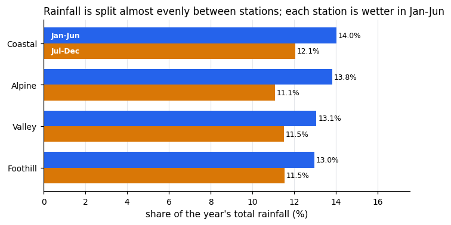

**Output**

```text
half      Jan-Jun  Jul-Dec
station                   
Foothill    12.96    11.54
Valley      13.06    11.50
Alpine      13.81    11.06
Coastal     14.02    12.05

every station is wetter in Jan-Jun: True
station totals span               : 1.58 percentage points
```

### Cell 245

```python
# ---------- BAD #5 -------------------------------------------------
monthly = (clean.assign(month=clean.date.dt.month)
           .groupby(["station", "month"])["temp_c"].mean().unstack())
anomaly = monthly.sub(monthly.mean(axis=1), axis=0)      # vs each station's own year
warm = anomaly.loc[list(stations.station), 4:10]         # Apr-Oct only

fig, ax = plt.subplots(figsize=(7.6, 2.9))
im = ax.imshow(warm.values, cmap="coolwarm", aspect="auto")   # autoscaled: the bug
ax.set_xticks(range(warm.shape[1]))
ax.set_xticklabels([pd.Timestamp(2024, int(c), 1).strftime("%b") for c in warm.columns])
ax.set_yticks(range(len(warm)))
ax.set_yticklabels(warm.index)
ax.set_title("Warm-season temperature anomaly")
ax.grid(False)
fig.colorbar(im, ax=ax)
plt.show()

vmin, vmax = im.get_clim()
zero_at = (0 - vmin) / (vmax - vmin)
print(f"colour scale runs from        : {vmin:+.2f} to {vmax:+.2f} °C")
print(f"the colormap's white midpoint : {vmin + 0.5 * (vmax - vmin):+.2f} °C")
print(f"zero sits at this fraction of the scale : {zero_at:.3f}  (0.5 would be centred)")
print(f"cells at or below zero        : {int((warm.values <= 0).sum())} of {warm.size}")
```

**Output**

```text
<Figure size 836x319 with 2 Axes>
```

**Figure**

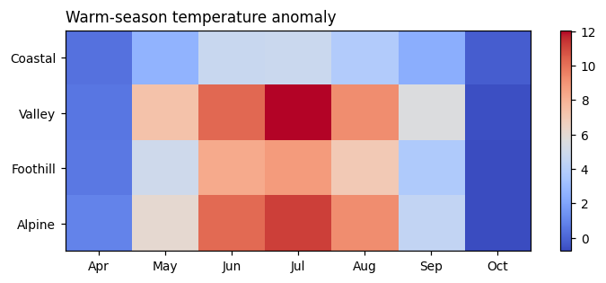

**Output**

```text
colour scale runs from        : -0.77 to +12.07 °C
the colormap's white midpoint : +5.65 °C
zero sits at this fraction of the scale : 0.060  (0.5 would be centred)
cells at or below zero        : 4 of 28
```

### Cell 247

```python
# ---------- FIXED #5 -----------------------------------------------
# Symmetric limits about zero, so the colormap's neutral is the data's neutral
# and one degree warm looks exactly as strong as one degree cold (Part 7).
lim = float(np.abs(warm.values).max())
warm_sorted = warm.loc[warm.mean(axis=1).sort_values(ascending=False).index]

fig, ax = plt.subplots(figsize=(8.2, 3.0))
im = ax.imshow(warm_sorted.values, cmap="RdBu_r", vmin=-lim, vmax=lim, aspect="auto")
ax.set_xticks(range(warm_sorted.shape[1]))
ax.set_xticklabels([pd.Timestamp(2024, int(c), 1).strftime("%b")
                    for c in warm_sorted.columns])
ax.set_yticks(range(len(warm_sorted)))
ax.set_yticklabels(warm_sorted.index)
ax.set_title("Apr-Oct temperature anomaly vs each station's own annual mean")
ax.grid(False)

# Values in the cells, in whichever ink stays readable on that cell (Part 5).
for i in range(warm_sorted.shape[0]):
    for j in range(warm_sorted.shape[1]):
        v = warm_sorted.values[i, j]
        ax.text(j, i, f"{v:+.1f}", ha="center", va="center", fontsize=8,
                color="white" if abs(v) > 0.62 * lim else "#111827")

cb = fig.colorbar(im, ax=ax, pad=0.02)
cb.set_label("°C vs annual mean")
cb.set_ticks([-lim, -lim / 2, 0, lim / 2, lim])
fig.tight_layout()
plt.show()

print(f"colour scale runs from        : {-lim:+.2f} to {lim:+.2f} °C")
print(f"zero sits at this fraction of the scale : "
      f"{(0 - (-lim)) / (2 * lim):.3f}  (centred)")
print(f"largest positive anomaly      : {warm.values.max():+.2f} °C")
print(f"largest negative anomaly      : {warm.values.min():+.2f} °C")
```

**Output**

```text
<Figure size 902x330 with 2 Axes>
```

**Figure**

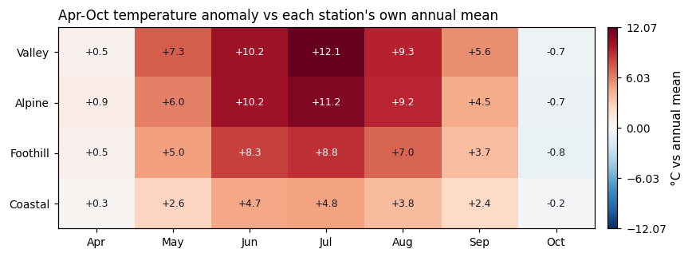

**Output**

```text
colour scale runs from        : -12.07 to +12.07 °C
zero sits at this fraction of the scale : 0.500  (centred)
largest positive anomaly      : +12.07 °C
largest negative anomaly      : -0.77 °C
```

### Cell 251

```python
# ============================================================
#  CAPSTONE -- a year of station temperatures, publication grade.
#  Every block below is labelled with the part of this notebook it comes from.
# ============================================================
import os
import tempfile
import matplotlib.dates as mdates

# --- [Part 7] Colour, decided once ---------------------------------
# Okabe-Ito hues: distinguishable under the common forms of colour vision
# deficiency and still distinct in greyscale. One hue per station, reused in
# every panel, so colour means "station" everywhere in the figure.
PALETTE = {"Valley": "#D55E00", "Coastal": "#0072B2",
           "Foothill": "#009E73", "Alpine": "#CC79A7"}
ORDER = ["Valley", "Coastal", "Foothill", "Alpine"]     # warmest first

# --- [Part 0 + Part 4] Data, with the faults kept findable ---------
roll = wide_c[ORDER].rolling(14, min_periods=7).mean()  # 14-day mean: stated in the label
faults = weather.loc[impossible, ["date", "station", "temp_c"]]

def longest_gap(series):
    """Start and length of the longest run of missing readings."""
    missing, best, best_start, run = series.isna().values, 0, 0, 0
    for i, m in enumerate(missing):
        run = run + 1 if m else 0
        if run > best:
            best, best_start = run, i - run + 1
    return best_start, best

# --- [Part 6] Layout: a mosaic, sized by importance ----------------
fig, axd = plt.subplot_mosaic(
    [["main", "main", "dist"],
     ["heat", "heat", "dist"]],
    figsize=(11.5, 6.4), height_ratios=[1.9, 1.1], width_ratios=[1, 1, 0.42],
    layout="constrained")
ax, axh, axd_dist = axd["main"], axd["heat"], axd["dist"]

# --- [Part 6] Shared axes, only where sharing means something ------
# The distribution panel shows the same quantity as the time series, so it gets
# the identical temperature scale. The heatmap does not, so it does not.
axd_dist.sharey(ax)

# --- [Part 1 + Part 3] The main panel: explicit Axes, chosen styling
for st in ORDER:
    ax.plot(roll.index, roll[st].values, color=PALETTE[st], lw=1.9, zorder=3)

    # [Part 5] Direct labelling: the label sits on the line, so there is no
    # legend to look things up in.
    last = roll[st].last_valid_index()
    ax.text(last + pd.Timedelta(days=7), roll[st].loc[last],
            f"{st}  ({int(stations.set_index('station').elevation[st])} m)",
            color=PALETTE[st], va="center", fontsize=9, fontweight="bold")

    # [Part 5] The sensor gaps are shaded, not silently skipped.
    start, length = longest_gap(wide_c[st])
    if length:
        ax.axvspan(wide_c.index[start], wide_c.index[start + length - 1],
                   color=PALETTE[st], alpha=0.13, lw=0, zorder=1)

# [Part 5] Annotation: the two impossible readings, named and placed by hand in
# axes coordinates, in empty regions, so neither callout lands on the data.
callout_spots = [(0.05, 0.30), (0.36, 0.12)]
for (fx, fy), (_, row) in zip(callout_spots, faults.iterrows()):
    ax.annotate(f"{row.station} sensor read {row.temp_c:+.0f} °C — masked",
                xy=(row.date, roll[row.station].loc[:row.date].iloc[-1]),
                xytext=(fx, fy), textcoords="axes fraction",
                fontsize=8, color="#374151", ha="left", va="center",
                arrowprops=dict(arrowstyle="->", color="#9CA3AF", lw=1.0,
                                connectionstyle="arc3,rad=-0.2"),
                bbox=dict(boxstyle="round,pad=0.3", fc="white", ec=C_SOFT))

# --- [Part 4] Axis control: date formatting, limits, spines --------
# Room is made on the right for the direct labels, but the month ticks stop at
# the last month of data, so the padding cannot be misread as more year.
ax.set_xlim(roll.index[0], roll.index[-1] + pd.Timedelta(days=58))
ax.set_xticks(pd.date_range(roll.index[0], periods=12, freq="MS"))
ax.xaxis.set_major_formatter(mdates.DateFormatter("%b"))
ax.set_ylabel("temperature (°C)\n14-day mean")
ax.set_title("Four stations, one year: the shaded bands are dead sensors, not weather",
             fontsize=12)
ax.spines[["top", "right"]].set_visible(False)
ax.grid(axis="y", alpha=0.6)
ax.grid(axis="x", visible=False)

# --- [Part 2] The distribution panel: the right chart for spread ---
bp = axd_dist.boxplot([wide_c[st].dropna().values for st in ORDER],
                      positions=range(len(ORDER)), widths=0.62,
                      patch_artist=True, showfliers=False)
for patch, st in zip(bp["boxes"], ORDER):
    patch.set_facecolor(PALETTE[st])
    patch.set_alpha(0.55)
    patch.set_edgecolor(PALETTE[st])
for med in bp["medians"]:
    med.set_color("#111827")
axd_dist.set_xticks(range(len(ORDER)))
axd_dist.set_xticklabels(ORDER, fontsize=7.5, rotation=45, ha="right")
axd_dist.set_title("daily spread", fontsize=10)
axd_dist.tick_params(labelleft=False)          # the shared scale is labelled once
axd_dist.spines[["top", "right"]].set_visible(False)
axd_dist.grid(axis="x", visible=False)

# --- [Part 7] The heatmap panel: diverging, centred on zero --------
cap_anom = (clean.assign(month=clean.date.dt.month)
            .groupby(["station", "month"])["temp_c"].mean().unstack())
cap_anom = cap_anom.sub(cap_anom.mean(axis=1), axis=0).loc[ORDER]
lim = float(np.abs(cap_anom.values).max())
im = axh.imshow(cap_anom.values, cmap="RdBu_r", vmin=-lim, vmax=lim, aspect="auto")
axh.set_xticks(range(cap_anom.shape[1]))
axh.set_xticklabels([pd.Timestamp(2024, int(c), 1).strftime("%b")
                     for c in cap_anom.columns], fontsize=8)
axh.set_yticks(range(len(ORDER)))
axh.set_yticklabels(ORDER, fontsize=8)
axh.set_title("monthly anomaly vs each station's own annual mean", fontsize=10)
axh.grid(False)
cb = fig.colorbar(im, ax=axh, pad=0.02)
cb.set_label("°C", fontsize=8)
cb.set_ticks([-lim, 0, lim])

# [Part 5] A source note, so the figure survives leaving the notebook.
fig.text(0.005, -0.01,
         f"Simulated daily readings, {roll.index[0]:%d %b %Y} to {roll.index[-1]:%d %b %Y}. "
         f"{int(clean.temp_c.isna().sum())} of {len(clean)} readings missing or masked.",
         fontsize=7.5, color=C_GREY, ha="left", va="top")

# --- [Part 8] Output: size, dpi, tight bounding box, opaque ground -
tmpdir = tempfile.mkdtemp()
png = os.path.join(tmpdir, "capstone.png")
fig.savefig(png, dpi=200, bbox_inches="tight", facecolor="white")
plt.show()

print(f"figure size : {fig.get_size_inches()[0]:.1f} x {fig.get_size_inches()[1]:.1f} in")
print(f"saved at    : dpi=200  ->  "
      f"{int(fig.get_size_inches()[0] * 200)} x {int(fig.get_size_inches()[1] * 200)} px nominal")
print(f"file size   : {os.path.getsize(png) / 1024:.0f} KB")

os.remove(png)
os.rmdir(tmpdir)
print(f"temporary file cleaned up: {not os.path.exists(png)}")
```

**Output**

```text
<Figure size 1265x704 with 4 Axes>
```

**Figure**

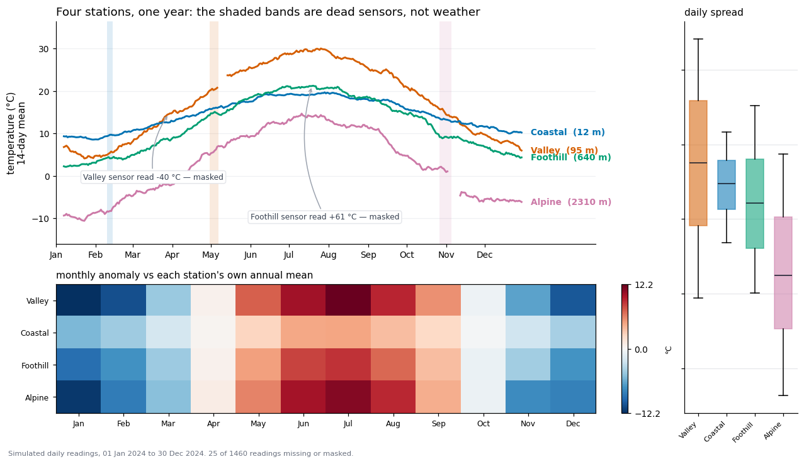

**Output**

```text
figure size : 11.5 x 6.4 in
saved at    : dpi=200  ->  2300 x 1280 px nominal
file size   : 257 KB
temporary file cleaned up: True
```

