# 05 — Basic Linear Algebra

**Status:** Executed successfully

## Code and Output

### Cell 3

```python
# ============================================================
#  Setup -- no installs, no downloads, no network.
# ============================================================
import numpy as np
import matplotlib.pyplot as plt

plt.rcParams["figure.figsize"] = (9, 4.5)
plt.rcParams["axes.grid"]      = True
plt.rcParams["grid.alpha"]     = 0.3
plt.rcParams["axes.spines.top"]   = False
plt.rcParams["axes.spines.right"] = False
plt.rcParams["font.size"] = 11

C_F, C_SLOPE, C_AREA = "#2563EB", "#DC2626", "#059669"
C_APPROX, C_EXACT, C_GREY, C_SOFT = "#D97706", "#7C3AED", "#6B7280", "#E5E7EB"


print(f"numpy {np.__version__}")
```

**Output**

```text
numpy 2.1.3
```

### Cell 5

```python
# ============================================================
#  The running example -- 200 flowers, two measurements each.
#  Every idea in this notebook is shown ON this data: a vector
#  is one flower, a matrix is all of them, a transformation is
#  something we DO to them, and PCA at the end finds the
#  direction they actually vary along.
# ============================================================
import numpy as np

RNG = np.random.default_rng(3)

# two correlated measurements, in centimetres, for two species
n = 100
a = RNG.multivariate_normal([5.0, 3.4], [[0.35, 0.28], [0.28, 0.30]], n)
b = RNG.multivariate_normal([6.6, 2.9], [[0.40, 0.22], [0.22, 0.26]], n)

X       = np.vstack([a, b])                 # 200 x 2 -- the data matrix
species = np.array([0] * n + [1] * n)
FEATURES = ["petal length (cm)", "petal width (cm)"]

print(f"X is a {X.shape[0]} x {X.shape[1]} matrix: "
      f"{X.shape[0]} flowers, {X.shape[1]} measurements each")
print(f"one flower is a vector of length {X.shape[1]}: {X[0].round(2)}")
print(f"column means: {X.mean(axis=0).round(3)}")
```

**Output**

```text
X is a 200 x 2 matrix: 200 flowers, 2 measurements each
one flower is a vector of length 2: [4.19 1.93]
column means: [5.781 3.149]
```

### Cell 6

```python
fig, ax = plt.subplots(figsize=(6.4, 5.4))
ax.scatter(*X[species == 0].T, s=26, c=C_F,     alpha=0.75, label="species A")
ax.scatter(*X[species == 1].T, s=26, c=C_SLOPE, alpha=0.75, label="species B")
ax.set_xlabel(FEATURES[0]); ax.set_ylabel(FEATURES[1])
ax.set_title("200 flowers, two measurements each")
ax.set_aspect("equal"); ax.legend(frameon=False)
fig.tight_layout(); plt.show()

print(f"X.shape = {X.shape}   -> {X.shape[0]} rows (flowers), "
      f"{X.shape[1]} columns (measurements)")
print(f"The first flower is the vector {X[0].round(2)} --")
print(f"  {X[0][0]:.2f} cm long and {X[0][1]:.2f} cm wide.")
print(f"That single pair of numbers IS a vector. Nothing more mysterious.")
```

**Output**

```text
<Figure size 640x540 with 1 Axes>
```

**Figure**

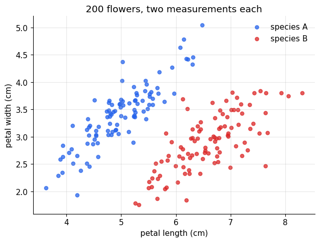

**Output**

```text
X.shape = (200, 2)   -> 200 rows (flowers), 2 columns (measurements)
The first flower is the vector [4.19 1.93] --
  4.19 cm long and 1.93 cm wide.
That single pair of numbers IS a vector. Nothing more mysterious.
```

### Cell 12

```python
v = np.array([3.0, 2.0])          # ONE vector. Three pictures of it below.

fig, axes = plt.subplots(1, 3, figsize=(12.6, 4.3))

# ---------- picture 1: an ARROW from the origin ----------
ax = axes[0]
ax.axhline(0, color=C_GREY, lw=0.9); ax.axvline(0, color=C_GREY, lw=0.9)
ax.annotate("", xy=(v[0], v[1]), xytext=(0, 0),
            arrowprops=dict(arrowstyle="-|>", lw=2.8, color=C_F))
ax.text(v[0] * 0.45, v[1] * 0.45 + 0.32, "v", color=C_F,
        fontsize=16, fontweight="bold")
ax.set_xlim(-0.7, 4.2); ax.set_ylim(-0.7, 3.2)
ax.set_aspect("equal")
ax.set_title("1. an ARROW\nfrom the origin", fontsize=11)

# ---------- picture 2: an ordered LIST of numbers ----------
ax = axes[1]
ax.set_xlim(0, 4); ax.set_ylim(0, 3); ax.axis("off")
for i, val in enumerate(v):
    y = 1.85 - 0.85 * i
    ax.add_patch(plt.Rectangle((1.35, y), 1.5, 0.72,
                               fill=False, ec=C_F, lw=2.4))
    ax.text(2.10, y + 0.36, f"{val:.0f}", ha="center", va="center",
            fontsize=18, color=C_F)
    ax.text(1.20, y + 0.36, f"v[{i}]", ha="right", va="center",
            fontsize=11, color=C_GREY)
ax.text(2.10, 2.85, "slot 0 on top, slot 1 below",
        ha="center", fontsize=10, color=C_GREY)
ax.set_title("2. an ordered LIST\nof numbers", fontsize=11)

# ---------- picture 3: a POINT in space ----------
ax = axes[2]
ax.axhline(0, color=C_GREY, lw=0.9); ax.axvline(0, color=C_GREY, lw=0.9)
ax.plot([v[0], v[0]], [0, v[1]], ls=":", color=C_GREY, lw=1.3)
ax.plot([0, v[0]], [v[1], v[1]], ls=":", color=C_GREY, lw=1.3)
ax.scatter([v[0]], [v[1]], s=110, color=C_F, zorder=3)
ax.text(v[0] + 0.15, v[1] + 0.12, "v", color=C_F,
        fontsize=16, fontweight="bold")
ax.set_xlim(-0.7, 4.2); ax.set_ylim(-0.7, 3.2)
ax.set_aspect("equal")
ax.set_title("3. a POINT\nin space", fontsize=11)

fig.tight_layout(); plt.show()

print(f"v            = {v}")
print(f"v.shape      = {v.shape}     <- a 1-D array holding {v.shape[0]} numbers")
print(f"v[0], v[1]   = {v[0]}, {v[1]}")
print("All three panels above are drawings of exactly this object.")
```

**Output**

```text
<Figure size 1260x430 with 3 Axes>
```

**Figure**

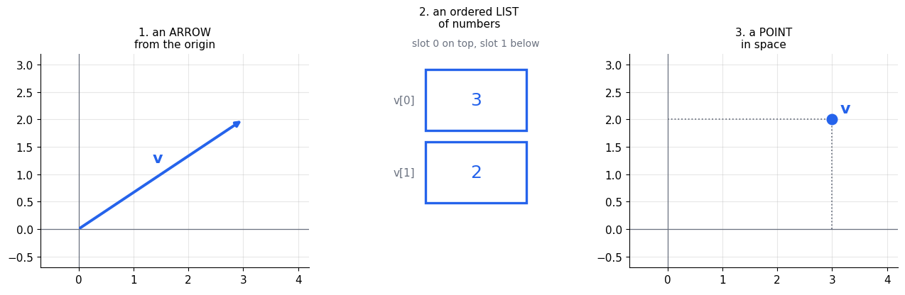

**Output**

```text
v            = [3. 2.]
v.shape      = (2,)     <- a 1-D array holding 2 numbers
v[0], v[1]   = 3.0, 2.0
All three panels above are drawings of exactly this object.
```

### Cell 17

```python
# The same operation -- addition -- in 2, 3 and 768 dimensions.
RNG_L1 = np.random.default_rng(11)

flat  = np.array([3.0, 2.0])                 # 2-D: drawable
space = np.array([3.0, 2.0, -1.0])           # 3-D: just about drawable
huge  = RNG_L1.normal(size=768)              # 768-D: not drawable at all

for name, u in [("2-D  ", flat), ("3-D  ", space), ("768-D", huge)]:
    s = u + u                                # the identical line of code
    print(f"{name} dimension {u.shape[0]:>3}  |  "
          f"first component {u[0]:+.3f} -> doubled {s[0]:+.3f}  |  "
          f"every slot doubled? {np.allclose(s, 2 * u)}")

print()
print("One line of code. Three dimensions. No special cases, no warnings.")
print(f"The 768-D vector has {huge.shape[0]} components and is a perfectly "
      f"ordinary vector.")
```

**Output**

```text
2-D   dimension   2  |  first component +3.000 -> doubled +6.000  |  every slot doubled? True
3-D   dimension   3  |  first component +3.000 -> doubled +6.000  |  every slot doubled? True
768-D dimension 768  |  first component +0.034 -> doubled +0.068  |  every slot doubled? True

One line of code. Three dimensions. No special cases, no warnings.
The 768-D vector has 768 components and is a perfectly ordinary vector.
```

### Cell 20

```python
flat_v = np.array([3.0, 2.0])          # shape (2,)   -- 1-D, "just a vector"
col_v  = flat_v.reshape(2, 1)          # shape (2,1)  -- a column
row_v  = flat_v.reshape(1, 2)          # shape (1,2)  -- a row

for name, u in [("flat_v", flat_v), ("col_v", col_v), ("row_v", row_v)]:
    print(f"{name:>6}  shape={str(u.shape):<7} ndim={u.ndim}   values={u.tolist()}")

print("\nAll three hold the same two numbers. numpy does not consider them equal "
      "objects.")
print(f"flat_v is the same shape as col_v? {flat_v.shape == col_v.shape}")

# ---- indexing differs, which is the first place it bites ----
print(f"\nflat_v[0] = {flat_v[0]}        <- a single number")
print(f"col_v[0]  = {col_v[0]}      <- a whole row, which happens to have one entry")
print(f"col_v[0, 0] = {col_v[0, 0]}      <- the number, if you ask for row AND column")
```

**Output**

```text
flat_v  shape=(2,)    ndim=1   values=[3.0, 2.0]
 col_v  shape=(2, 1)  ndim=2   values=[[3.0], [2.0]]
 row_v  shape=(1, 2)  ndim=2   values=[[3.0, 2.0]]

All three hold the same two numbers. numpy does not consider them equal objects.
flat_v is the same shape as col_v? False

flat_v[0] = 3.0        <- a single number
col_v[0]  = [3.]      <- a whole row, which happens to have one entry
col_v[0, 0] = 3.0      <- the number, if you ask for row AND column
```

### Cell 21

```python
# ---- and here is the day numpy stops being forgiving ----
# Subtracting a column from a row does NOT complain. It BROADCASTS.
surprise = row_v - col_v

print(f"row_v.shape - col_v.shape  ->  {row_v.shape} - {col_v.shape}")
print(f"result shape: {surprise.shape}   <-- a 2x2 MATRIX, from two 2-vectors")
print(surprise)
print()
print("What numpy did: it stretched the (1,2) row down to 2 rows, stretched the")
print("(2,1) column across to 2 columns, then subtracted the two 2x2 blocks.")
print("Every pairwise difference, silently. No error. No warning.")
print()

# the version you almost certainly meant
intended = flat_v - flat_v
print(f"flat_v - flat_v -> shape {intended.shape}, values {intended}")
print(f"Same numbers going in, {surprise.size} out one way and "
      f"{intended.size} the other.")
```

**Output**

```text
row_v.shape - col_v.shape  ->  (1, 2) - (2, 1)
result shape: (2, 2)   <-- a 2x2 MATRIX, from two 2-vectors
[[ 0. -1.]
 [ 1.  0.]]

What numpy did: it stretched the (1,2) row down to 2 rows, stretched the
(2,1) column across to 2 columns, then subtracted the two 2x2 blocks.
Every pairwise difference, silently. No error. No warning.

flat_v - flat_v -> shape (2,), values [0. 0.]
Same numbers going in, 4 out one way and 2 the other.
```

### Cell 24

```python
e1 = np.array([1.0, 0.0])          # one step along the horizontal axis
e2 = np.array([0.0, 1.0])          # one step along the vertical axis
zero = np.zeros(2)

print(f"e1   = {e1}")
print(f"e2   = {e2}")
print(f"zero = {zero}   (no length, no direction)")

# rebuild v from the basis, using only its own components as the amounts
rebuilt = v[0] * e1 + v[1] * e2

print(f"\nv                    = {v}")
print(f"v[0]*e1 + v[1]*e2    = {rebuilt}")
print(f"identical in every slot? {np.allclose(rebuilt, v)}")

fig, ax = plt.subplots(figsize=(5.6, 5.0))
ax.axhline(0, color=C_GREY, lw=0.9); ax.axvline(0, color=C_GREY, lw=0.9)

# the two basis steps, laid tip-to-tail
ax.annotate("", xy=(v[0], 0), xytext=(0, 0),
            arrowprops=dict(arrowstyle="-|>", lw=2.4, color=C_AREA))
ax.annotate("", xy=(v[0], v[1]), xytext=(v[0], 0),
            arrowprops=dict(arrowstyle="-|>", lw=2.4, color=C_APPROX))
# the vector itself
ax.annotate("", xy=(v[0], v[1]), xytext=(0, 0),
            arrowprops=dict(arrowstyle="-|>", lw=3.0, color=C_F))

ax.text(v[0] / 2, -0.34, f"{v[0]:.0f} x e1", color=C_AREA,
        ha="center", fontsize=12)
ax.text(v[0] + 0.14, v[1] / 2, f"{v[1]:.0f} x e2", color=C_APPROX,
        va="center", fontsize=12)
ax.text(1.05, 1.55, "v", color=C_F, fontsize=16, fontweight="bold")

# the unit steps themselves, small and grey, for scale
ax.annotate("", xy=(1, 0), xytext=(0, 0),
            arrowprops=dict(arrowstyle="-|>", lw=3.4, color="#111827"))
ax.annotate("", xy=(0, 1), xytext=(0, 0),
            arrowprops=dict(arrowstyle="-|>", lw=3.4, color="#111827"))
ax.text(0.52, -0.34, "e1", fontsize=11, ha="center")
ax.text(-0.30, 0.52, "e2", fontsize=11, va="center")

ax.set_xlim(-0.9, 4.2); ax.set_ylim(-0.9, 3.2)
ax.set_aspect("equal")
ax.set_title("every vector is an amount of e1 plus an amount of e2")
fig.tight_layout(); plt.show()
```

**Output**

```text
e1   = [1. 0.]
e2   = [0. 1.]
zero = [0. 0.]   (no length, no direction)

v                    = [3. 2.]
v[0]*e1 + v[1]*e2    = [3. 2.]
identical in every slot? True
```

**Output**

```text
<Figure size 560x500 with 1 Axes>
```

**Figure**

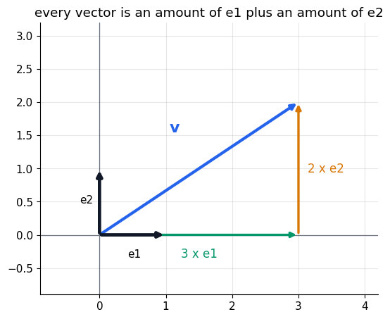

### Cell 28

```python
picks = [0, 7, 140]                       # three flowers, chosen once
chosen = X[picks]

print("Three rows pulled straight out of the data matrix X:")
for i, p in enumerate(picks):
    print(f"  X[{p:>3}] = {X[p].round(3)}   species {species[p]}   "
          f"({FEATURES[0]} {X[p][0]:.2f}, {FEATURES[1]} {X[p][1]:.2f})")
print(f"\nEach one has shape {X[picks[0]].shape} -- a 2-component vector, "
      f"exactly like v.")

fig, axes = plt.subplots(1, 2, figsize=(12.2, 5.2))

for ax, as_arrows in zip(axes, [False, True]):
    ax.scatter(*X[species == 0].T, s=18, c=C_F,     alpha=0.22, zorder=1)
    ax.scatter(*X[species == 1].T, s=18, c=C_SLOPE, alpha=0.22, zorder=1)
    cols = ["#111827", C_APPROX, C_EXACT]
    for pt, col, p in zip(chosen, cols, picks):
        if as_arrows:
            ax.annotate("", xy=(pt[0], pt[1]), xytext=(0, 0),
                        arrowprops=dict(arrowstyle="-|>", lw=2.2, color=col))
        ax.scatter([pt[0]], [pt[1]], s=95, color=col, zorder=3)
        ax.text(pt[0] + 0.12, pt[1] + 0.10, f"X[{p}]", color=col, fontsize=10)
    ax.set_xlabel(FEATURES[0]); ax.set_ylabel(FEATURES[1])
    ax.set_aspect("equal")
    if as_arrows:
        ax.set_xlim(-0.4, 8.6); ax.set_ylim(-0.4, 5.2)
        ax.set_title("the same flowers as ARROWS from the origin")
    else:
        ax.set_title("the flowers as POINTS (Part 0's picture)")

fig.tight_layout(); plt.show()
```

**Output**

```text
Three rows pulled straight out of the data matrix X:
  X[  0] = [4.189 1.933]   species 0   (petal length (cm) 4.19, petal width (cm) 1.93)
  X[  7] = [5.661 3.894]   species 0   (petal length (cm) 5.66, petal width (cm) 3.89)
  X[140] = [6.455 3.271]   species 1   (petal length (cm) 6.46, petal width (cm) 3.27)

Each one has shape (2,) -- a 2-component vector, exactly like v.
```

**Output**

```text
<Figure size 1220x520 with 2 Axes>
```

**Figure**

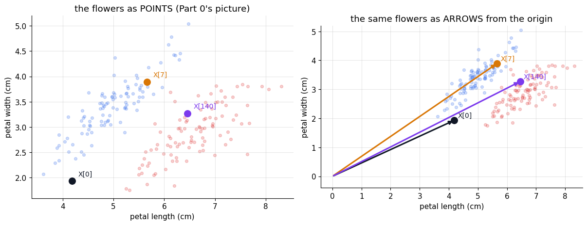

### Cell 32

```python
print(f"flat_v.shape        = {flat_v.shape}")
print(f"flat_v.T.shape      = {flat_v.T.shape}   <- transpose did NOTHING")
print(f"unchanged? {np.array_equal(flat_v, flat_v.T)}")
print()
print(f"col_v.shape         = {col_v.shape}")
print(f"col_v.T.shape       = {col_v.T.shape}   <- on a 2-D array, transpose works")
print()

# transpose on the data matrix, where it is genuinely useful
print(f"X.shape             = {X.shape}   ({X.shape[0]} flowers, "
      f"{X.shape[1]} measurements)")
print(f"X.T.shape           = {X.T.shape}   ({X.T.shape[0]} measurements, "
      f"{X.T.shape[1]} flowers)")
print()
print(f"X[0] is flower 0        : {X[0].round(3)}")
print(f"X.T[0] is measurement 0 : {X.T[0][:4].round(3)} ... "
      f"({X.T[0].shape[0]} values, one per flower)")
print()
print("Same numbers, reorganised. X reads flower-by-flower; X.T reads "
      "measurement-by-measurement.")
print(f"round trip X.T.T == X ? {np.array_equal(X.T.T, X)}")
```

**Output**

```text
flat_v.shape        = (2,)
flat_v.T.shape      = (2,)   <- transpose did NOTHING
unchanged? True

col_v.shape         = (2, 1)
col_v.T.shape       = (1, 2)   <- on a 2-D array, transpose works

X.shape             = (200, 2)   (200 flowers, 2 measurements)
X.T.shape           = (2, 200)   (2 measurements, 200 flowers)

X[0] is flower 0        : [4.189 1.933]
X.T[0] is measurement 0 : [4.189 4.84  5.291 6.193] ... (200 values, one per flower)

Same numbers, reorganised. X reads flower-by-flower; X.T reads measurement-by-measurement.
round trip X.T.T == X ? True
```

### Cell 36

```python
u = np.array([3.0, 1.0])
w = np.array([1.0, 2.0])
s = u + w                      # numpy adds slot by slot. That is the whole rule.

print(f"u     = {u}")
print(f"w     = {w}")
print(f"u + w = {s}          <- slot 0: {u[0]:.0f}+{w[0]:.0f}={s[0]:.0f}, "
      f"slot 1: {u[1]:.0f}+{w[1]:.0f}={s[1]:.0f}")
print(f"done slot by slot? {np.allclose(s, [u[0] + w[0], u[1] + w[1]])}")
print(f"does order matter?  u+w == w+u ? {np.array_equal(u + w, w + u)}")


def arrow(ax, start, end, colour, lw=2.6, style="-|>", ls="-"):
    ax.annotate("", xy=(end[0], end[1]), xytext=(start[0], start[1]),
                arrowprops=dict(arrowstyle=style, lw=lw, color=colour,
                                linestyle=ls))


fig, axes = plt.subplots(1, 2, figsize=(12.4, 5.2))

# ---------- reading 1: tip to tail ----------
ax = axes[0]
arrow(ax, [0, 0], u, C_F)
arrow(ax, u, s, C_AREA)                      # w, re-drawn starting at the tip of u
arrow(ax, [0, 0], s, C_EXACT, lw=3.2)
ax.text(u[0] / 2, u[1] / 2 - 0.42, "u", color=C_F, fontsize=15, fontweight="bold")
ax.text(u[0] + 0.45, u[1] + 1.0, "w", color=C_AREA, fontsize=15, fontweight="bold")
ax.text(1.5, 2.05, "u + w", color=C_EXACT, fontsize=15, fontweight="bold")
ax.set_title("reading 1: TIP TO TAIL\nwalk u, then walk w from where you stopped")

# ---------- reading 2: the parallelogram ----------
ax = axes[1]
arrow(ax, [0, 0], u, C_F)
arrow(ax, [0, 0], w, C_AREA)
arrow(ax, u, s, C_GREY, lw=1.6, style="-", ls="--")
arrow(ax, w, s, C_GREY, lw=1.6, style="-", ls="--")
arrow(ax, [0, 0], s, C_EXACT, lw=3.2)
ax.text(u[0] / 2, u[1] / 2 - 0.42, "u", color=C_F, fontsize=15, fontweight="bold")
ax.text(w[0] / 2 - 0.45, w[1] / 2, "w", color=C_AREA, fontsize=15, fontweight="bold")
ax.text(1.5, 2.05, "u + w", color=C_EXACT, fontsize=15, fontweight="bold")
ax.set_title("reading 2: THE PARALLELOGRAM\nu + w is the diagonal of the box they make")

for ax in axes:
    ax.axhline(0, color=C_GREY, lw=0.9); ax.axvline(0, color=C_GREY, lw=0.9)
    ax.set_xlim(-1.0, 5.0); ax.set_ylim(-1.0, 3.8)
    ax.set_aspect("equal")

fig.tight_layout(); plt.show()
```

**Output**

```text
u     = [3. 1.]
w     = [1. 2.]
u + w = [4. 3.]          <- slot 0: 3+1=4, slot 1: 1+2=3
done slot by slot? True
does order matter?  u+w == w+u ? True
```

**Output**

```text
<Figure size 1240x520 with 2 Axes>
```

**Figure**

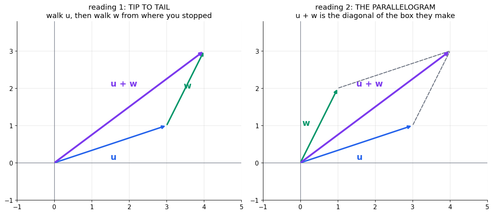

### Cell 39

```python
base = np.array([2.0, 1.0])
factors = [2.0, 1.0, 0.5, -1.0]
cols = [C_EXACT, C_F, C_AREA, C_SLOPE]

fig, ax = plt.subplots(figsize=(6.8, 5.6))
ax.axhline(0, color=C_GREY, lw=0.9); ax.axvline(0, color=C_GREY, lw=0.9)

# the line every multiple of `base` must lie on
line_t = np.linspace(-2.2, 2.6, 2)
ax.plot(line_t * base[0], line_t * base[1], color=C_SOFT, lw=8, zorder=0)

for c, col in zip(factors, cols):
    scaled = c * base
    ax.annotate("", xy=(scaled[0], scaled[1]), xytext=(0, 0),
                arrowprops=dict(arrowstyle="-|>", lw=2.8, color=col))
    ax.text(scaled[0] * 1.06 + 0.16, scaled[1] * 1.06,
            f"{c:g} x v", color=col, fontsize=12, fontweight="bold")

ax.set_xlim(-3.4, 5.4); ax.set_ylim(-2.0, 3.0)
ax.set_aspect("equal")
ax.set_title("scaling stretches, shrinks, or flips -- but never leaves the grey line")
fig.tight_layout(); plt.show()

print(f"v = {base}\n")
for c in factors:
    sc = c * base
    print(f"{c:>5g} * v = {sc}   length is {abs(c):g}x the original, "
          f"direction {'REVERSED' if c < 0 else 'unchanged'}")

print(f"\n0 * v = {0.0 * base}   <- the zero vector: scaling all the way down "
      f"collapses it to a point")

# --- scaling by a NUMBER is safe. `*` between two VECTORS is a different beast. ---
p = np.array([1, 2])
q = np.array([3, 4])

print(f"\np * q        = {p * q}      <- elementwise: [1*3, 2*4]. Still a vector.")
print(f"np.dot(p, q) = {np.dot(p, q)}             <- the dot product. A single number.")
print(f"p @ q        = {p @ q}             <- same thing, shorter (Part 3)")
print(f"sum of the elementwise product = {np.sum(p * q)}  "
      f"-- so dot = sum(p*q). Match? {np.sum(p * q) == np.dot(p, q)}")

print("\n--- the silent shape accident ---")
col = q.reshape(2, 1)
print(f"p.shape {p.shape} * col.shape {col.shape} -> {(p * col).shape}, "
      f"a matrix:\n{p * col}")

print("\n--- the loud, friendly failure ---")
try:
    np.array([1.0, 2.0]) + np.array([1.0, 2.0, 3.0])
except ValueError as e:
    print(f"ValueError: {e}")
    print("Mismatched lengths DO raise. It is mismatched *shapes* that go quiet.")
```

**Output**

```text
<Figure size 680x560 with 1 Axes>
```

**Figure**

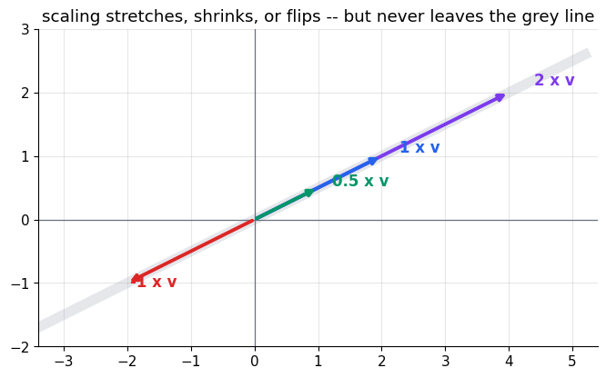

**Output**

```text
v = [2. 1.]

    2 * v = [4. 2.]   length is 2x the original, direction unchanged
    1 * v = [2. 1.]   length is 1x the original, direction unchanged
  0.5 * v = [1.  0.5]   length is 0.5x the original, direction unchanged
   -1 * v = [-2. -1.]   length is 1x the original, direction REVERSED

0 * v = [0. 0.]   <- the zero vector: scaling all the way down collapses it to a point

p * q        = [3 8]      <- elementwise: [1*3, 2*4]. Still a vector.
np.dot(p, q) = 11             <- the dot product. A single number.
p @ q        = 11             <- same thing, shorter (Part 3)
sum of the elementwise product = 11  -- so dot = sum(p*q). Match? True

--- the silent shape accident ---
p.shape (2,) * col.shape (2, 1) -> (2, 2), a matrix:
[[3 6]
 [4 8]]

--- the loud, friendly failure ---
ValueError: operands could not be broadcast together with shapes (2,) (3,) 
Mismatched lengths DO raise. It is mismatched *shapes* that go quiet.
```

### Cell 43

```python
f1, f2 = X[7], X[140]          # two flowers, one from each species
diff = f2 - f1                 # the trip from flower 7 to flower 140

print(f"f1 = X[7]    = {f1.round(3)}   (species {species[7]})")
print(f"f2 = X[140]  = {f2.round(3)}   (species {species[140]})")
print(f"f2 - f1      = {diff.round(3)}")
print(f"  slot 0: {f2[0]:.3f} - {f1[0]:.3f} = {diff[0]:+.3f}  "
      f"({FEATURES[0]})")
print(f"  slot 1: {f2[1]:.3f} - {f1[1]:.3f} = {diff[1]:+.3f}  "
      f"({FEATURES[1]})")
print(f"\nSo flower 140 is {abs(diff[0]):.3f} cm longer and "
      f"{abs(diff[1]):.3f} cm {'wider' if diff[1] > 0 else 'narrower'} "
      f"than flower 7.")

# --- the claim: starting at f1 and adding (f2 - f1) must land exactly on f2 ---
landing = f1 + diff
print(f"\nf1 + (f2 - f1)  = {landing.round(6)}")
print(f"f2              = {f2.round(6)}")
print(f"exact match? {np.allclose(landing, f2)}   "
      f"(largest slot-wise error: {np.max(np.abs(landing - f2)):.2e})")
print(f"and order matters: f1 - f2 = {(f1 - f2).round(3)}, every sign flipped; "
      f"is it -(f2-f1)? {np.allclose(f1 - f2, -diff)}")

fig, ax = plt.subplots(figsize=(7.6, 6.0))
ax.scatter(*X[species == 0].T, s=16, c=C_F,     alpha=0.18, zorder=1)
ax.scatter(*X[species == 1].T, s=16, c=C_SLOPE, alpha=0.18, zorder=1)

# the two flowers as arrows from the origin
for pt, col, lab in [(f1, C_F, "f1 = X[7]"), (f2, C_SLOPE, "f2 = X[140]")]:
    ax.annotate("", xy=(pt[0], pt[1]), xytext=(0, 0),
                arrowprops=dict(arrowstyle="-|>", lw=2.2, color=col))
    ax.scatter([pt[0]], [pt[1]], s=90, color=col, zorder=4)
    ax.text(pt[0] + 0.10, pt[1] + 0.13, lab, color=col, fontsize=11)

# the difference, drawn where it is USEFUL: starting at f1
ax.annotate("", xy=(f2[0], f2[1]), xytext=(f1[0], f1[1]),
            arrowprops=dict(arrowstyle="-|>", lw=3.0, color=C_EXACT))
ax.text((f1[0] + f2[0]) / 2 + 0.05, (f1[1] + f2[1]) / 2 + 0.22,
        "f2 - f1", color=C_EXACT, fontsize=13, fontweight="bold")

# and the SAME vector drawn from the origin, dashed, to show it is one object
ax.annotate("", xy=(diff[0], diff[1]), xytext=(0, 0),
            arrowprops=dict(arrowstyle="-|>", lw=2.0, color=C_EXACT,
                            linestyle="--"))
ax.text(diff[0] + 0.20, diff[1] - 0.02, "the same arrow,\ndrawn from 0",
        color=C_EXACT, fontsize=10, va="top")

ax.axhline(0, color=C_GREY, lw=0.9); ax.axvline(0, color=C_GREY, lw=0.9)
ax.set_xlabel(FEATURES[0]); ax.set_ylabel(FEATURES[1])
ax.set_xlim(-0.5, 8.0); ax.set_ylim(-0.9, 4.9)
ax.set_aspect("equal")
ax.set_title("f2 - f1 is the arrow FROM f1 TO f2")
fig.tight_layout(); plt.show()
```

**Output**

```text
f1 = X[7]    = [5.661 3.894]   (species 0)
f2 = X[140]  = [6.455 3.271]   (species 1)
f2 - f1      = [ 0.794 -0.623]
  slot 0: 6.455 - 5.661 = +0.794  (petal length (cm))
  slot 1: 3.271 - 3.894 = -0.623  (petal width (cm))

So flower 140 is 0.794 cm longer and 0.623 cm narrower than flower 7.

f1 + (f2 - f1)  = [6.455168 3.27113 ]
f2              = [6.455168 3.27113 ]
exact match? True   (largest slot-wise error: 0.00e+00)
and order matters: f1 - f2 = [-0.794  0.623], every sign flipped; is it -(f2-f1)? True
```

**Output**

```text
<Figure size 760x600 with 1 Axes>
```

**Figure**

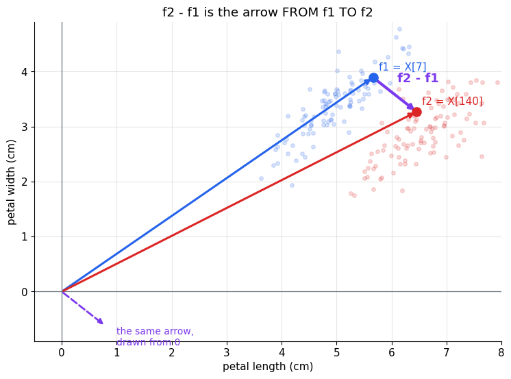

### Cell 47

```python
vec = np.array([3.0, 4.0])          # chosen so the answer is a round number

by_hand = np.sqrt(vec[0] ** 2 + vec[1] ** 2)   # straight from Pythagoras
by_sum  = np.sqrt(np.sum(vec ** 2))            # the general N-dimensional form
by_numpy = np.linalg.norm(vec)                 # what you will actually type

print(f"vec = {vec}")
print(f"  sqrt(v0^2 + v1^2)     = sqrt({vec[0]**2:.0f} + {vec[1]**2:.0f}) "
      f"= {by_hand:.6f}")
print(f"  sqrt(sum(vec**2))     = {by_sum:.6f}")
print(f"  np.linalg.norm(vec)   = {by_numpy:.6f}")
print(f"  all three agree? {np.allclose([by_hand, by_sum], by_numpy)}")

# ... and the same three lines in 768 dimensions, where no triangle can be drawn
RNG_L2 = np.random.default_rng(23)
big = RNG_L2.normal(size=768)
print(f"\n768-D vector: sqrt(sum of squares) = {np.sqrt(np.sum(big**2)):.6f}, "
      f"np.linalg.norm = {np.linalg.norm(big):.6f}, "
      f"agree? {np.isclose(np.sqrt(np.sum(big**2)), np.linalg.norm(big))}")

fig, ax = plt.subplots(figsize=(6.2, 5.4))
ax.axhline(0, color=C_GREY, lw=0.9); ax.axvline(0, color=C_GREY, lw=0.9)

ax.plot([0, vec[0]], [0, 0], color=C_AREA, lw=3.2)
ax.plot([vec[0], vec[0]], [0, vec[1]], color=C_APPROX, lw=3.2)
ax.annotate("", xy=(vec[0], vec[1]), xytext=(0, 0),
            arrowprops=dict(arrowstyle="-|>", lw=3.2, color=C_F))
ax.add_patch(plt.Rectangle((vec[0] - 0.32, 0), 0.32, 0.32,
                           fill=False, ec=C_GREY, lw=1.4))

ax.text(vec[0] / 2, -0.36, f"leg = {vec[0]:.0f}", color=C_AREA,
        ha="center", fontsize=12)
ax.text(vec[0] + 0.16, vec[1] / 2, f"leg = {vec[1]:.0f}", color=C_APPROX,
        va="center", fontsize=12)
ax.text(0.45, 1.30, f"length = {by_numpy:.0f}", color=C_F,
        fontsize=13, fontweight="bold", rotation=53)

ax.set_xlim(-0.8, 4.6); ax.set_ylim(-0.8, 4.8)
ax.set_aspect("equal")
ax.set_title("the norm is just the hypotenuse")
fig.tight_layout(); plt.show()
```

**Output**

```text
vec = [3. 4.]
  sqrt(v0^2 + v1^2)     = sqrt(9 + 16) = 5.000000
  sqrt(sum(vec**2))     = 5.000000
  np.linalg.norm(vec)   = 5.000000
  all three agree? True

768-D vector: sqrt(sum of squares) = 27.883338, np.linalg.norm = 27.883338, agree? True
```

**Output**

```text
<Figure size 620x540 with 1 Axes>
```

**Figure**

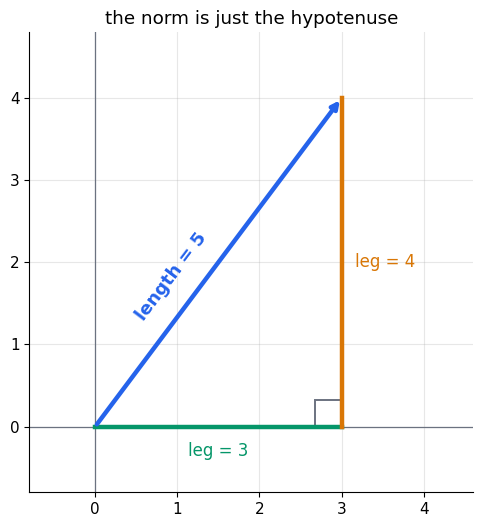

### Cell 51

```python
family = np.array([[3.0, 1.0], [1.0, 2.5], [-2.0, 1.0], [0.6, -1.8]])
cols4 = [C_F, C_AREA, C_EXACT, C_SLOPE]

fig, ax = plt.subplots(figsize=(6.4, 6.0))
theta = np.linspace(0, 2 * np.pi, 400)
ax.plot(np.cos(theta), np.sin(theta), color=C_GREY, lw=1.6, ls="--")
ax.axhline(0, color=C_GREY, lw=0.9); ax.axvline(0, color=C_GREY, lw=0.9)

print("vector              length      normalised          length after")
print("-" * 66)
for vv, col in zip(family, cols4):
    length = np.linalg.norm(vv)
    hat = vv / length
    ax.annotate("", xy=(vv[0], vv[1]), xytext=(0, 0),
                arrowprops=dict(arrowstyle="-|>", lw=1.8, color=col, alpha=0.45))
    ax.annotate("", xy=(hat[0], hat[1]), xytext=(0, 0),
                arrowprops=dict(arrowstyle="-|>", lw=3.2, color=col))
    print(f"{str(vv):<18}  {length:>6.4f}    {str(hat.round(4)):<20} "
          f"{np.linalg.norm(hat):.6f}")

ax.set_xlim(-2.6, 3.6); ax.set_ylim(-2.4, 3.0)
ax.set_aspect("equal")
ax.set_title("faded = the original vectors,  bold = the same directions, length 1")
fig.tight_layout(); plt.show()

hats = family / np.linalg.norm(family, axis=1, keepdims=True)
print(f"\nAll four normalised at once with one line, using axis=1:")
print(f"  lengths afterwards: {np.linalg.norm(hats, axis=1).round(12)}")
print(f"  every one exactly 1? {np.allclose(np.linalg.norm(hats, axis=1), 1.0)}")
```

**Output**

```text
vector              length      normalised          length after
------------------------------------------------------------------
[3. 1.]             3.1623    [0.9487 0.3162]      1.000000
[1.  2.5]           2.6926    [0.3714 0.9285]      1.000000
[-2.  1.]           2.2361    [-0.8944  0.4472]    1.000000
[ 0.6 -1.8]         1.8974    [ 0.3162 -0.9487]    1.000000
```

**Output**

```text
<Figure size 640x600 with 1 Axes>
```

**Figure**

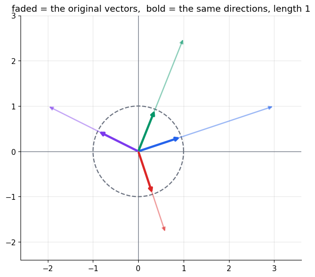

**Output**

```text
All four normalised at once with one line, using axis=1:
  lengths afterwards: [1. 1. 1. 1.]
  every one exactly 1? True
```

### Cell 56

```python
trio = [7, 140, 12]
labels = [f"X[{i}]" for i in trio]
pts = X[trio]

print("Pairwise Euclidean distances, computed from the definition:")
for i in range(3):
    for j in range(i + 1, 3):
        d_manual = np.sqrt(np.sum((pts[j] - pts[i]) ** 2))
        d_norm = np.linalg.norm(pts[j] - pts[i])
        print(f"  {labels[i]} to {labels[j]}: sqrt(sum of squared differences) "
              f"= {d_manual:.4f}, np.linalg.norm(diff) = {d_norm:.4f}, "
              f"agree? {np.isclose(d_manual, d_norm)}")

d_ab = np.linalg.norm(pts[1] - pts[0])
d_ba = np.linalg.norm(pts[0] - pts[1])
print(f"\nsymmetry: dist(a,b) = {d_ab:.6f}, dist(b,a) = {d_ba:.6f}, "
      f"equal? {np.isclose(d_ab, d_ba)}")
print(f"distance from a flower to itself: "
      f"{np.linalg.norm(pts[0] - pts[0]):.1f}")

fig, ax = plt.subplots(figsize=(7.4, 5.8))
ax.scatter(*X[species == 0].T, s=16, c=C_F,     alpha=0.18, zorder=1)
ax.scatter(*X[species == 1].T, s=16, c=C_SLOPE, alpha=0.18, zorder=1)

pair_cols = [C_EXACT, C_AREA, C_APPROX]
k = 0
for i in range(3):
    for j in range(i + 1, 3):
        ax.plot([pts[i][0], pts[j][0]], [pts[i][1], pts[j][1]],
                color=pair_cols[k], lw=2.4)
        mx, my = (pts[i] + pts[j]) / 2
        ax.text(mx, my + 0.12, f"{np.linalg.norm(pts[j] - pts[i]):.2f} cm",
                color=pair_cols[k], fontsize=11, fontweight="bold", ha="center")
        k += 1

for pt, lab in zip(pts, labels):
    ax.scatter([pt[0]], [pt[1]], s=100, color="#111827", zorder=4)
    ax.text(pt[0] + 0.09, pt[1] + 0.14, lab, fontsize=11)

ax.set_xlabel(FEATURES[0]); ax.set_ylabel(FEATURES[1])
ax.set_aspect("equal")
ax.set_title("distance between flowers = length of the arrow between them")
fig.tight_layout(); plt.show()
```

**Output**

```text
Pairwise Euclidean distances, computed from the definition:
  X[7] to X[140]: sqrt(sum of squared differences) = 1.0090, np.linalg.norm(diff) = 1.0090, agree? True
  X[7] to X[12]: sqrt(sum of squared differences) = 0.7066, np.linalg.norm(diff) = 0.7066, agree? True
  X[140] to X[12]: sqrt(sum of squared differences) = 1.4595, np.linalg.norm(diff) = 1.4595, agree? True

symmetry: dist(a,b) = 1.008993, dist(b,a) = 1.008993, equal? True
distance from a flower to itself: 0.0
```

**Output**

```text
<Figure size 740x580 with 1 Axes>
```

**Figure**

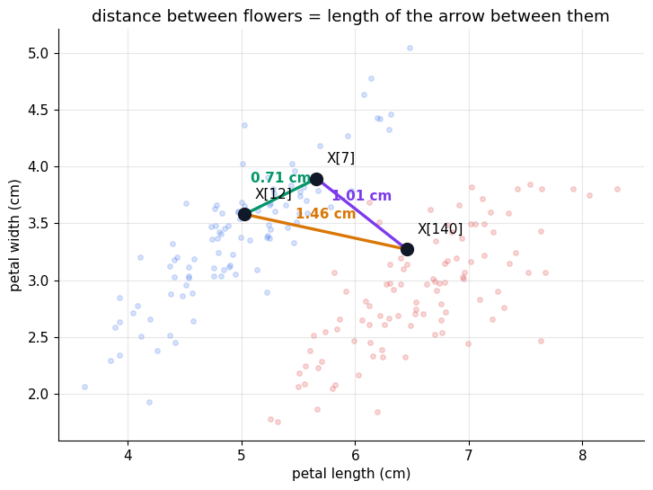

### Cell 59

```python
tst = np.array([3.0, -4.0])
l2 = np.sqrt(np.sum(tst ** 2))
l1 = np.sum(np.abs(tst))

print(f"v = {tst}")
print(f"  L2 (Pythagoras, 'as the crow flies') = {l2:.4f}   "
      f"np.linalg.norm(v)      = {np.linalg.norm(tst):.4f}")
print(f"  L1 (taxi on a grid)                  = {l1:.4f}   "
      f"np.linalg.norm(v, 1)   = {np.linalg.norm(tst, 1):.4f}")
print(f"  L1 is never smaller than L2 here: {l1 >= l2}")

fig, ax = plt.subplots(figsize=(6.2, 6.0))
th = np.linspace(0, 2 * np.pi, 500)
ax.plot(np.cos(th), np.sin(th), color=C_F, lw=3.0, label="L2 ball: circle")
ax.plot([1, 0, -1, 0, 1], [0, 1, 0, -1, 0], color=C_SLOPE, lw=3.0,
        label="L1 ball: diamond")

for pt in [(1, 0), (0, 1), (-1, 0), (0, -1)]:
    ax.scatter([pt[0]], [pt[1]], s=70, color=C_SLOPE, zorder=4)

ax.axhline(0, color=C_GREY, lw=0.9); ax.axvline(0, color=C_GREY, lw=0.9)
ax.set_xlim(-1.6, 1.6); ax.set_ylim(-1.6, 1.6)
ax.set_aspect("equal")
ax.legend(frameon=False, loc="upper right", fontsize=10)
ax.set_title("every vector of length 1, under each norm")
fig.tight_layout(); plt.show()

# a vector on the diamond need not be on the circle, and vice versa
corner = np.array([1.0, 0.0])
mid = np.array([0.5, 0.5])
print(f"\n{corner} : L1 = {np.linalg.norm(corner,1):.3f}, "
      f"L2 = {np.linalg.norm(corner):.3f}   <- on BOTH shapes")
print(f"{mid} : L1 = {np.linalg.norm(mid,1):.3f}, "
      f"L2 = {np.linalg.norm(mid):.3f}   <- on the diamond, inside the circle")
```

**Output**

```text
v = [ 3. -4.]
  L2 (Pythagoras, 'as the crow flies') = 5.0000   np.linalg.norm(v)      = 5.0000
  L1 (taxi on a grid)                  = 7.0000   np.linalg.norm(v, 1)   = 7.0000
  L1 is never smaller than L2 here: True
```

**Output**

```text
<Figure size 620x600 with 1 Axes>
```

**Figure**

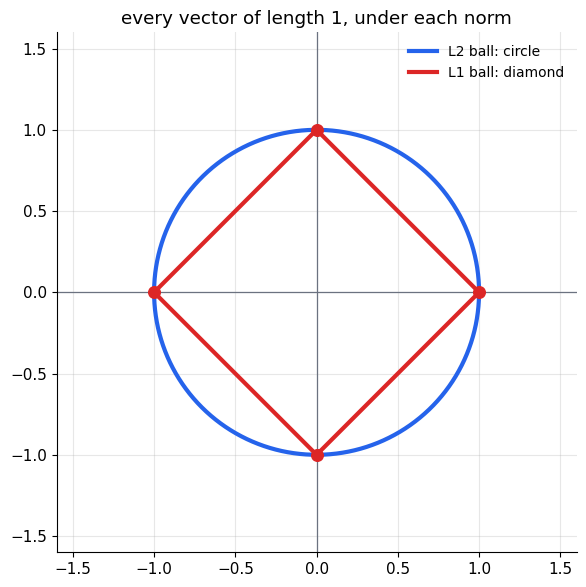

**Output**

```text
[1. 0.] : L1 = 1.000, L2 = 1.000   <- on BOTH shapes
[0.5 0.5] : L1 = 1.000, L2 = 0.707   <- on the diamond, inside the circle
```

### Cell 62

```python
RNG_L3 = np.random.default_rng(41)
coef = RNG_L3.uniform(-1.6, 1.6, size=(700, 2))     # 700 random (c1, c2) pairs

g1 = np.array([2.0, 1.0])
g2 = np.array([-1.0, 1.5])          # a genuinely different direction
g2_dep = -1.5 * g1                  # a multiple of g1: adds nothing new

fig, axes = plt.subplots(1, 2, figsize=(12.4, 5.6))

for ax, second, title in [
        (axes[0], g2,     "independent: the span is the WHOLE PLANE"),
        (axes[1], g2_dep, "dependent: the span COLLAPSES to a line")]:
    reach = coef[:, [0]] * g1 + coef[:, [1]] * second     # every c1*g1 + c2*v2
    ax.scatter(reach[:, 0], reach[:, 1], s=9, c=C_SOFT, zorder=0)
    ax.annotate("", xy=(g1[0], g1[1]), xytext=(0, 0),
                arrowprops=dict(arrowstyle="-|>", lw=3.0, color=C_F))
    ax.annotate("", xy=(second[0], second[1]), xytext=(0, 0),
                arrowprops=dict(arrowstyle="-|>", lw=3.0, color=C_SLOPE))
    ax.text(g1[0] + 0.15, g1[1], "g1", color=C_F, fontsize=13, fontweight="bold")
    ax.text(second[0] + 0.15, second[1], "g2", color=C_SLOPE,
            fontsize=13, fontweight="bold")
    ax.axhline(0, color=C_GREY, lw=0.9); ax.axvline(0, color=C_GREY, lw=0.9)
    ax.set_xlim(-6.2, 6.2); ax.set_ylim(-4.6, 4.6)
    ax.set_aspect("equal")
    ax.set_title(title, fontsize=11)

fig.tight_layout(); plt.show()

# the numeric version of the same statement
for name, second in [("g1, g2     ", g2), ("g1, g2_dep ", g2_dep)]:
    pair = np.vstack([g1, second])
    reach = coef[:, [0]] * g1 + coef[:, [1]] * second
    print(f"{name} -> matrix_rank = {np.linalg.matrix_rank(pair)}   "
          f"(2 = spans a plane, 1 = spans only a line)")

print(f"\nIs g2_dep really a multiple of g1?  g2_dep = {g2_dep} = "
      f"{-1.5} * {g1}, check: {np.allclose(g2_dep, -1.5 * g1)}")

dep_reach = coef[:, [0]] * g1 + coef[:, [1]] * g2_dep
on_line = np.abs(dep_reach[:, 0] * g1[1] - dep_reach[:, 1] * g1[0])
print(f"Of the {dep_reach.shape[0]} points in the right panel, how many lie "
      f"exactly on g1's line? {int(np.sum(on_line < 1e-12))}")
```

**Output**

```text
<Figure size 1240x560 with 2 Axes>
```

**Figure**

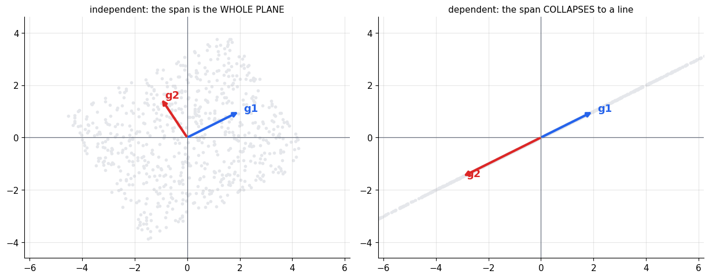

**Output**

```text
g1, g2      -> matrix_rank = 2   (2 = spans a plane, 1 = spans only a line)
g1, g2_dep  -> matrix_rank = 1   (2 = spans a plane, 1 = spans only a line)

Is g2_dep really a multiple of g1?  g2_dep = [-3.  -1.5] = -1.5 * [2. 1.], check: True
Of the 700 points in the right panel, how many lie exactly on g1's line? 700
```

### Cell 66

```python
# ============================================================
#  Definition 1, written out by hand so nothing is hidden.
# ============================================================
import numpy as np

a = np.array([3.0, 4.0])
b = np.array([2.0, 1.0])

# --- the algebraic definition, one multiplication at a time ---
total = 0.0
for i in range(len(a)):
    piece = a[i] * b[i]
    total = total + piece
    print(f"  entry {i}:  a[{i}] * b[{i}]  =  {a[i]:>4.1f} * {b[i]:>4.1f} "
          f"= {piece:>5.1f}      running total = {total:>5.1f}")

print()
print(f"by hand      a . b = {total}")
print(f"numpy sum    a . b = {np.sum(a * b)}")
print(f"numpy dot    a . b = {np.dot(a, b)}")
print(f"the @ operator     = {a @ b}")
print()
print(f"all four agree: {np.allclose([total, np.sum(a*b), np.dot(a,b), a@b], total)}")
```

**Output**

```text
  entry 0:  a[0] * b[0]  =   3.0 *  2.0 =   6.0      running total =   6.0
  entry 1:  a[1] * b[1]  =   4.0 *  1.0 =   4.0      running total =  10.0

by hand      a . b = 10.0
numpy sum    a . b = 10.0
numpy dot    a . b = 10.0
the @ operator     = 10.0

all four agree: True
```

### Cell 68

```python
# ============================================================
#  Definition 2 -- lengths and the angle between them.
#  We measure the angle from the picture, NOT from the dot
#  product, so this is a genuinely independent calculation.
# ============================================================
norm_a = np.sqrt(np.sum(a ** 2))       # length of a, from Part 2
norm_b = np.sqrt(np.sum(b ** 2))

# the angle each arrow makes with the positive x-axis, read off with arctan2
angle_a = np.arctan2(a[1], a[0])
angle_b = np.arctan2(b[1], b[0])
theta   = angle_a - angle_b            # the angle BETWEEN them

print(f"a points at {np.degrees(angle_a):6.2f} degrees, length {norm_a:.4f}")
print(f"b points at {np.degrees(angle_b):6.2f} degrees, length {norm_b:.4f}")
print(f"angle between them, theta = {np.degrees(theta):.4f} degrees "
      f"= {theta:.6f} radians")
print()

geometric = norm_a * norm_b * np.cos(theta)
algebraic = float(a @ b)

print("=" * 52)
print(f"  ALGEBRAIC   sum of a_i * b_i      = {algebraic:.10f}")
print(f"  GEOMETRIC   |a| |b| cos(theta)    = {geometric:.10f}")
print(f"  difference                        = {abs(algebraic - geometric):.2e}")
print("=" * 52)
print(f"they agree: {np.isclose(algebraic, geometric)}")
```

**Output**

```text
a points at  53.13 degrees, length 5.0000
b points at  26.57 degrees, length 2.2361
angle between them, theta = 26.5651 degrees = 0.463648 radians

====================================================
  ALGEBRAIC   sum of a_i * b_i      = 10.0000000000
  GEOMETRIC   |a| |b| cos(theta)    = 10.0000000000
  difference                        = 0.00e+00
====================================================
they agree: True
```

### Cell 71

```python
# ============================================================
#  Check the derivation at many angles, not just one lucky pair.
#  For each angle we verify BOTH steps of the argument separately:
#    (i)  the law of cosines itself
#    (ii) the algebraic expansion of ||a - b||^2
#  and then the conclusion.
# ============================================================
print(f"{'theta':>7} | {'algebraic':>10} | {'geometric':>10} || "
      f"{'||a-b||^2':>10} | {'law-of-cos':>10} | {'expansion':>10} | match")
print("-" * 82)

for deg in [0, 30, 45, 60, 90, 120, 150, 180, 235, 310]:
    th = np.radians(deg)
    # a fixed, b built to sit exactly `deg` degrees away from a
    u = np.array([2.0, 1.0])
    ang_u = np.arctan2(u[1], u[0])
    length_v = 1.7
    v = length_v * np.array([np.cos(ang_u + th), np.sin(ang_u + th)])

    nu, nv = np.linalg.norm(u), np.linalg.norm(v)
    alg = float(np.sum(u * v))                       # definition 1
    geo = nu * nv * np.cos(th)                       # definition 2
    lhs = float(np.sum((u - v) ** 2))                # ||a-b||^2, measured
    loc = nu**2 + nv**2 - 2*nu*nv*np.cos(th)         # law of cosines
    exp = nu**2 + nv**2 - 2*alg                      # algebraic expansion

    ok = np.allclose([geo, loc, exp], [alg, lhs, lhs])
    print(f"{deg:>6}d | {alg:>10.6f} | {geo:>10.6f} || {lhs:>10.6f} | "
          f"{loc:>10.6f} | {exp:>10.6f} | {ok}")

print()
print("LEFT of the double bar: the two definitions of the dot product.")
print("  They agree at every angle -- that is the theorem.")
print()
print("RIGHT of the double bar: the three routes to ||a-b||^2 --")
print("  measured directly, via the law of cosines, and via the algebraic")
print("  expansion. All three agree, and the proof is exactly the observation")
print("  that the last two must therefore be equal to each other.")
```

**Output**

```text
  theta |  algebraic |  geometric ||  ||a-b||^2 | law-of-cos |  expansion | match
----------------------------------------------------------------------------------
     0d |   3.801316 |   3.801316 ||   0.287369 |   0.287369 |   0.287369 | True
    30d |   3.292036 |   3.292036 ||   1.305928 |   1.305928 |   1.305928 | True
    45d |   2.687936 |   2.687936 ||   2.514128 |   2.514128 |   2.514128 | True
    60d |   1.900658 |   1.900658 ||   4.088684 |   4.088684 |   4.088684 | True
    90d |   0.000000 |   0.000000 ||   7.890000 |   7.890000 |   7.890000 | True
   120d |  -1.900658 |  -1.900658 ||  11.691316 |  11.691316 |  11.691316 | True
   150d |  -3.292036 |  -3.292036 ||  14.474072 |  14.474072 |  14.474072 | True
   180d |  -3.801316 |  -3.801316 ||  15.492631 |  15.492631 |  15.492631 | True
   235d |  -2.180345 |  -2.180345 ||  12.250690 |  12.250690 |  12.250690 | True
   310d |   2.443439 |   2.443439 ||   3.003123 |   3.003123 |   3.003123 | True

LEFT of the double bar: the two definitions of the dot product.
  They agree at every angle -- that is the theorem.

RIGHT of the double bar: the three routes to ||a-b||^2 --
  measured directly, via the law of cosines, and via the algebraic
  expansion. All three agree, and the proof is exactly the observation
  that the last two must therefore be equal to each other.
```

### Cell 74

```python
import matplotlib.pyplot as plt

# ============================================================
#  Sweep a unit vector all the way round and watch the dot
#  product with a fixed vector b change sign.
# ============================================================
b_fixed = np.array([2.0, 1.0])
angles  = np.linspace(0, 2 * np.pi, 721)                 # 0 .. 360 degrees
sweep   = np.stack([np.cos(angles), np.sin(angles)], 1)  # unit vectors
dots    = sweep @ b_fixed                                # one dot product each

fig, (axL, axR) = plt.subplots(1, 2, figsize=(12.4, 5.0))

# ---- left: the arrows themselves, coloured by the sign of the dot product
axL.add_patch(plt.Circle((0, 0), 1.0, fill=False, ec=C_SOFT, lw=1.4))
for deg in range(0, 360, 15):
    th = np.radians(deg)
    v  = np.array([np.cos(th), np.sin(th)])
    d  = v @ b_fixed
    col = C_AREA if d > 1e-9 else (C_SLOPE if d < -1e-9 else C_EXACT)
    axL.arrow(0, 0, v[0], v[1], head_width=0.05, length_includes_head=True,
              color=col, alpha=0.85, lw=1.2)
axL.arrow(0, 0, b_fixed[0], b_fixed[1], head_width=0.11,
          length_includes_head=True, color=C_F, lw=3.0, zorder=5)
axL.text(b_fixed[0] * 1.06, b_fixed[1] * 1.06, "b (fixed)", color=C_F,
         fontsize=12, fontweight="bold")
axL.set_xlim(-1.6, 2.6); axL.set_ylim(-1.5, 1.8)
axL.set_aspect("equal")
axL.set_title("green: dot > 0    red: dot < 0    purple: dot = 0")

# ---- right: the meter reading
axR.axhline(0, color=C_GREY, lw=1.2)
axR.fill_between(np.degrees(angles), dots, 0, where=dots > 0,
                 color=C_AREA, alpha=0.22)
axR.fill_between(np.degrees(angles), dots, 0, where=dots < 0,
                 color=C_SLOPE, alpha=0.22)
axR.plot(np.degrees(angles), dots, color=C_F, lw=2.4)
for z in np.degrees(angles[np.where(np.diff(np.sign(dots)))[0]]):
    axR.axvline(z, color=C_EXACT, ls="--", lw=1.4)
    axR.text(z, dots.max() * 0.9, f"{z:.0f} deg", color=C_EXACT,
             ha="center", fontsize=9)
axR.set_xlabel("direction of the sweeping unit vector (degrees)")
axR.set_ylabel("dot product with b")
axR.set_xlim(0, 360); axR.set_xticks(range(0, 361, 45))
axR.set_title("the same numbers, plotted")

fig.tight_layout(); plt.show()

print(f"largest dot product  {dots.max():+.4f} at "
      f"{np.degrees(angles[dots.argmax()]):.1f} deg  "
      f"(b itself points at {np.degrees(np.arctan2(*b_fixed[::-1])):.1f} deg)")
print(f"smallest dot product {dots.min():+.4f} at "
      f"{np.degrees(angles[dots.argmin()]):.1f} deg  "
      f"(exactly 180 deg away)")
print(f"length of b = {np.linalg.norm(b_fixed):.4f}  -- and the peak dot "
      f"product equals that, because the sweeping vector has length 1")
```

**Output**

```text
<Figure size 1240x500 with 2 Axes>
```

**Figure**

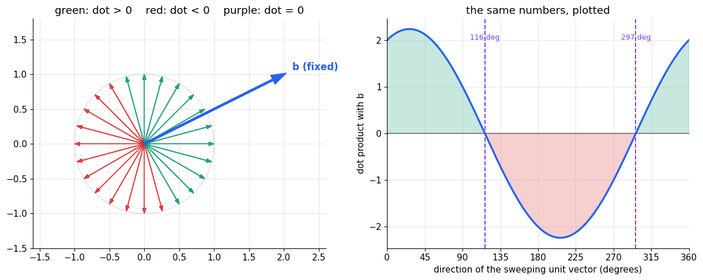

**Output**

```text
largest dot product  +2.2361 at 26.5 deg  (b itself points at 26.6 deg)
smallest dot product -2.2361 at 206.5 deg  (exactly 180 deg away)
length of b = 2.2361  -- and the peak dot product equals that, because the sweeping vector has length 1
```

### Cell 77

```python
# ============================================================
#  The single most common numpy mistake in this whole subject.
# ============================================================
p = np.array([3.0, 4.0])
q = np.array([2.0, 1.0])

star   = p * q          # ELEMENTWISE -- a VECTOR comes out
at     = p @ q          # DOT PRODUCT -- a SCALAR comes out

print(f"p          = {p}")
print(f"q          = {q}")
print()
print(f"p * q      = {star}          <- still a vector, shape {star.shape}")
print(f"p @ q      = {at}                    <- one number, shape "
      f"{np.shape(at)}")
print(f"np.dot(p,q)= {np.dot(p, q)}")
print(f"sum(p * q) = {np.sum(p * q)}          <- the * result, then added up")
print()
print("So `*` is HALF of a dot product: it does the multiplying but not the")
print("adding. `@` does both. Neither one errors, which is the problem.")
```

**Output**

```text
p          = [3. 4.]
q          = [2. 1.]

p * q      = [6. 4.]          <- still a vector, shape (2,)
p @ q      = 10.0                    <- one number, shape ()
np.dot(p,q)= 10.0
sum(p * q) = 10.0          <- the * result, then added up

So `*` is HALF of a dot product: it does the multiplying but not the
adding. `@` does both. Neither one errors, which is the problem.
```

### Cell 80

```python
# ============================================================
#  Perpendicularity tested three ways.
# ============================================================
pairs = [
    ("east and north",        np.array([1.0, 0.0]),  np.array([0.0, 1.0])),
    ("a and its rotation",    np.array([3.0, 4.0]),  np.array([-4.0, 3.0])),
    ("same direction",        np.array([3.0, 4.0]),  np.array([6.0, 8.0])),
    ("opposite directions",   np.array([3.0, 4.0]),  np.array([-3.0, -4.0])),
    ("a broadly agreeing q",  np.array([3.0, 4.0]),  np.array([2.0, 1.0])),
]

print(f"{'pair':>22} | {'a . b':>8} | {'angle':>8} | verdict")
print("-" * 62)
for name, u, v in pairs:
    d  = float(u @ v)
    ct = d / (np.linalg.norm(u) * np.linalg.norm(v))
    ang = np.degrees(np.arccos(np.clip(ct, -1, 1)))
    verdict = ("PERPENDICULAR" if abs(d) < 1e-12 else
               "agreeing" if d > 0 else "opposing")
    print(f"{name:>22} | {d:>8.2f} | {ang:>7.2f}d | {verdict}")

print()
# the swap-and-negate trick, on 1000 random vectors at once
V    = np.random.default_rng(4).normal(size=(1000, 2))
Vrot = np.stack([-V[:, 1], V[:, 0]], axis=1)      # [x,y] -> [-y,x]
dps  = np.sum(V * Vrot, axis=1)                   # dot product of each row pair
print(f"swap-and-negate on 1000 random vectors:")
print(f"  largest dot product found = {np.abs(dps).max():.2e}  (i.e. zero)")
print(f"  all perpendicular: {np.allclose(dps, 0)}")
```

**Output**

```text
                  pair |    a . b |    angle | verdict
--------------------------------------------------------------
        east and north |     0.00 |   90.00d | PERPENDICULAR
    a and its rotation |     0.00 |   90.00d | PERPENDICULAR
        same direction |    50.00 |    0.00d | agreeing
   opposite directions |   -25.00 |  180.00d | opposing
  a broadly agreeing q |    10.00 |   26.57d | agreeing

swap-and-negate on 1000 random vectors:
  largest dot product found = 0.00e+00  (i.e. zero)
  all perpendicular: True
```

### Cell 84

```python
# ============================================================
#  Projection, computed and then verified against its own
#  defining property.
# ============================================================
a = np.array([3.0, 4.0])
b = np.array([4.0, 1.0])

t          = (a @ b) / (b @ b)      # the scalar from the derivation
projection = t * b                  # the shadow itself
residual   = a - projection         # the leftover piece

print(f"a                = {a}")
print(f"b                = {b}")
print(f"t = (a.b)/(b.b)  = {t:.6f}")
print(f"projection = t*b = {projection.round(6)}")
print(f"residual  = a-t*b= {residual.round(6)}")
print()
print("-- verification 1: the residual must be perpendicular to b --")
print(f"   residual . b = {residual @ b:.2e}   -> zero: "
      f"{np.isclose(residual @ b, 0)}")
print()
print("-- verification 2: projection + residual must rebuild a --")
print(f"   projection + residual = {(projection + residual).round(6)}  -> a: "
      f"{np.allclose(projection + residual, a)}")
print()
print("-- verification 3: t*b really is the CLOSEST point on b's line --")
grid  = np.linspace(t - 2, t + 2, 40001)
dists = np.linalg.norm(a - grid[:, None] * b, axis=1)
print(f"   brute-force search over 40001 multiples of b finds the closest")
print(f"   at t = {grid[dists.argmin()]:.6f}, versus formula {t:.6f}")
print(f"   agree to 4 decimals: {np.isclose(grid[dists.argmin()], t, atol=1e-4)}")
print()
print("-- verification 4: signed length matches (a.b)/|b| --")
signed = (a @ b) / np.linalg.norm(b)
print(f"   |projection| = {np.linalg.norm(projection):.6f}, "
      f"(a.b)/|b| = {signed:.6f}")
```

**Output**

```text
a                = [3. 4.]
b                = [4. 1.]
t = (a.b)/(b.b)  = 0.941176
projection = t*b = [3.764706 0.941176]
residual  = a-t*b= [-0.764706  3.058824]

-- verification 1: the residual must be perpendicular to b --
   residual . b = 0.00e+00   -> zero: True

-- verification 2: projection + residual must rebuild a --
   projection + residual = [3. 4.]  -> a: True

-- verification 3: t*b really is the CLOSEST point on b's line --
   brute-force search over 40001 multiples of b finds the closest
   at t = 0.941176, versus formula 0.941176
   agree to 4 decimals: True

-- verification 4: signed length matches (a.b)/|b| --
   |projection| = 3.880570, (a.b)/|b| = 3.880570
```

### Cell 85

```python
fig, ax = plt.subplots(figsize=(6.6, 5.6))

ray = np.linspace(-0.4, 1.5, 2)[:, None] * b
ax.plot(ray[:, 0], ray[:, 1], color=C_SOFT, lw=8, zorder=0,
        solid_capstyle="round")

ax.arrow(0, 0, b[0], b[1], head_width=0.14, length_includes_head=True,
         color=C_F, lw=2.6, zorder=3)
ax.arrow(0, 0, a[0], a[1], head_width=0.14, length_includes_head=True,
         color=C_SLOPE, lw=2.6, zorder=3)
ax.arrow(0, 0, projection[0], projection[1], head_width=0.14,
         length_includes_head=True, color=C_AREA, lw=3.4, zorder=4)
ax.plot([projection[0], a[0]], [projection[1], a[1]],
        color=C_EXACT, ls="--", lw=2.0, zorder=3)

# the little square that marks a right angle
u_along = b / np.linalg.norm(b)
u_perp  = residual / np.linalg.norm(residual)
s = 0.34
corner = projection
sq = np.array([corner, corner + s*u_along, corner + s*u_along + s*u_perp,
               corner + s*u_perp])
ax.plot(*np.vstack([sq, sq[:1]]).T, color=C_EXACT, lw=1.6, zorder=4)

ax.text(a[0] + .12, a[1] + .12, "a", color=C_SLOPE, fontsize=15, weight="bold")
ax.text(b[0] + .12, b[1] - .30, "b", color=C_F, fontsize=15, weight="bold")
ax.text(projection[0] * .55, projection[1] * .55 - .55,
        "projection of a onto b", color=C_AREA, fontsize=11, weight="bold")
ax.text((projection[0] + a[0]) / 2 + .12, (projection[1] + a[1]) / 2,
        "residual\n(perpendicular)", color=C_EXACT, fontsize=10)

ax.axhline(0, color=C_GREY, lw=.8); ax.axvline(0, color=C_GREY, lw=.8)
ax.set_xlim(-0.8, 5.6); ax.set_ylim(-1.2, 5.0)
ax.set_aspect("equal")
ax.set_title("shining a light straight down onto the line through b")
fig.tight_layout(); plt.show()
```

**Output**

```text
<Figure size 660x560 with 1 Axes>
```

**Figure**

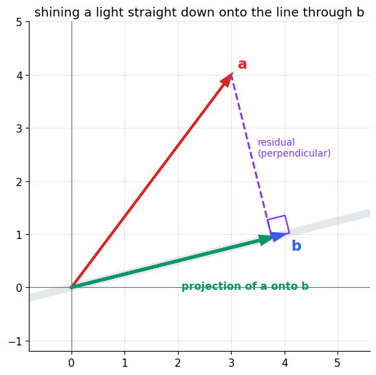

### Cell 88

```python
# ============================================================
#  Same direction, wildly different lengths.
# ============================================================
def cosine_similarity(u, v):
    return float(u @ v) / (np.linalg.norm(u) * np.linalg.norm(v))

base  = np.array([3.0, 4.0])          # length 5
short = np.array([0.6, 0.8])          # SAME direction, length 1
long_ = np.array([30.0, 40.0])        # SAME direction, length 50

print(f"{'pair':>28} | {'raw dot':>10} | {'cosine sim':>11} | {'angle':>7}")
print("-" * 68)
for name, u, v in [("base with the short one",  base, short),
                   ("base with the long one",   base, long_),
                   ("base with itself",         base, base)]:
    cs = cosine_similarity(u, v)
    print(f"{name:>28} | {u @ v:>10.2f} | {cs:>11.6f} | "
          f"{np.degrees(np.arccos(np.clip(cs, -1, 1))):>6.2f}d")

print()
print(f"raw dot products differ by a factor of "
      f"{(base @ long_) / (base @ short):.0f}x --")
print(f"cosine similarities are identical: "
      f"{np.isclose(cosine_similarity(base, short), cosine_similarity(base, long_))}")
print()
print("...and all three point in EXACTLY the same direction, which is what")
print("cosine similarity reports and the raw dot product completely hides.")
print()
print("scale-invariance, checked over 500 random rescalings:")
r = np.random.default_rng(7)
scales = r.uniform(0.01, 100, 500)
sims = [cosine_similarity(base, s * long_) for s in scales]
print(f"  spread of cosine similarity across all of them = "
      f"{np.ptp(sims):.2e}   (i.e. it never moved)")
```

**Output**

```text
                        pair |    raw dot |  cosine sim |   angle
--------------------------------------------------------------------
     base with the short one |       5.00 |    1.000000 |   0.00d
      base with the long one |     250.00 |    1.000000 |   0.00d
            base with itself |      25.00 |    1.000000 |   0.00d

raw dot products differ by a factor of 50x --
cosine similarities are identical: True

...and all three point in EXACTLY the same direction, which is what
cosine similarity reports and the raw dot product completely hides.

scale-invariance, checked over 500 random rescalings:
  spread of cosine similarity across all of them = 5.55e-16   (i.e. it never moved)
```

### Cell 90

```python
# ============================================================
#  Cosine similarity on the flowers.
# ============================================================
mean_A = X[species == 0].mean(axis=0)
mean_B = X[species == 1].mean(axis=0)

print("the two species, as average flowers:")
print(f"  species A mean = {mean_A.round(3)}  ({FEATURES[0]}, {FEATURES[1]})")
print(f"  species B mean = {mean_B.round(3)}")
print()

cs_species = cosine_similarity(mean_A, mean_B)
print(f"cosine similarity between the two species means = {cs_species:.6f}")
print(f"angle between them                              = "
      f"{np.degrees(np.arccos(np.clip(cs_species, -1, 1))):.3f} degrees")
print(f"euclidean distance between them (Part 2)        = "
      f"{np.linalg.norm(mean_A - mean_B):.4f} cm")
print()

# how wide a range of ANGLES does the whole dataset occupy?
head = np.degrees(np.arctan2(X[:, 1], X[:, 0]))
print(f"every flower's direction from the origin lies between "
      f"{head.min():.2f} and {head.max():.2f} degrees")
print(f"  -- a wedge {np.ptp(head):.2f} degrees wide, out of the 360 available.")
print(f"  Every flower has positive length AND positive width, so every arrow")
print(f"  points into the same quadrant. Cosine similarity has to express all")
print(f"  the variety in this data inside that narrow sliver.")
print()

def cos_to(mu):
    return (X @ mu) / (np.linalg.norm(X, axis=1) * np.linalg.norm(mu))

angle_guess = (cos_to(mean_B) > cos_to(mean_A)).astype(int)
dist_guess  = (np.linalg.norm(X - mean_B, axis=1)
               < np.linalg.norm(X - mean_A, axis=1)).astype(int)
print("label each flower by whichever species mean it is nearer to --")
print(f"  by ANGLE    (cosine similarity): {(angle_guess == species).mean():.1%}")
print(f"  by DISTANCE (Part 2's norm)    : {(dist_guess  == species).mean():.1%}")
print("Both work here, and neither is 'the right one' -- they are answering")
print("different questions. Here is the difference between those questions:")
print()

# same flowers, same SHAPES, random overall sizes
sizes = np.random.default_rng(19).uniform(0.5, 2.0, len(X))
Xs    = X * sizes[:, None]        # each flower scaled, proportions preserved

a_s = ((Xs @ mean_B) / (np.linalg.norm(Xs, axis=1) * np.linalg.norm(mean_B)) >
       (Xs @ mean_A) / (np.linalg.norm(Xs, axis=1) * np.linalg.norm(mean_A)))
d_s = (np.linalg.norm(Xs - mean_B, axis=1)
       < np.linalg.norm(Xs - mean_A, axis=1))

print("now rescale each flower by a random factor from 0.5x to 2x -- same")
print("proportions, different overall size:")
print(f"  by ANGLE   : {(a_s.astype(int) == species).mean():.1%}   "
      f"(unchanged -- cosine cannot see size at all)")
print(f"  by DISTANCE: {(d_s.astype(int) == species).mean():.1%}   "
      f"(collapsed -- distance sees nothing else)")
```

**Output**

```text
the two species, as average flowers:
  species A mean = [4.976 3.399]  (petal length (cm), petal width (cm))
  species B mean = [6.586 2.899]

cosine similarity between the two species means = 0.983002
angle between them                              = 10.579 degrees
euclidean distance between them (Part 2)        = 1.6857 cm

every flower's direction from the origin lies between 16.57 and 40.99 degrees
  -- a wedge 24.42 degrees wide, out of the 360 available.
  Every flower has positive length AND positive width, so every arrow
  points into the same quadrant. Cosine similarity has to express all
  the variety in this data inside that narrow sliver.

label each flower by whichever species mean it is nearer to --
  by ANGLE    (cosine similarity): 97.5%
  by DISTANCE (Part 2's norm)    : 96.5%
Both work here, and neither is 'the right one' -- they are answering
different questions. Here is the difference between those questions:

now rescale each flower by a random factor from 0.5x to 2x -- same
proportions, different overall size:
  by ANGLE   : 97.5%   (unchanged -- cosine cannot see size at all)
  by DISTANCE: 60.0%   (collapsed -- distance sees nothing else)
```

### Cell 94

```python
# ============================================================
#  Shape, rows, columns, and reaching inside.
# ============================================================
import numpy as np
import matplotlib.pyplot as plt

A = np.array([[10.0, 20.0, 30.0],
              [40.0, 50.0, 60.0]])

print("A =")
print(A)
print()
print(f"A.shape   = {A.shape}   -> ({A.shape[0]} rows, {A.shape[1]} columns)")
print(f"A.ndim    = {A.ndim}        -> a matrix is a 2-dimensional array")
print(f"A.size    = {A.size}        -> {A.shape[0]} * {A.shape[1]} numbers in total")
print()
print("-- indexing is [row, column], ALWAYS in that order --")
for i in range(A.shape[0]):
    for j in range(A.shape[1]):
        print(f"   A[{i}, {j}]  = {A[i, j]:>5.1f}   (row {i}, column {j})")

print()
print(f"A[0, 2] = {A[0, 2]}   <- row 0, column 2")
print(f"A[2, 0] would ask for row 2 of a 2-row matrix. Watch:")
try:
    A[2, 0]
except IndexError as e:
    print(f"   IndexError: {e}")
```

**Output**

```text
A =
[[10. 20. 30.]
 [40. 50. 60.]]

A.shape   = (2, 3)   -> (2 rows, 3 columns)
A.ndim    = 2        -> a matrix is a 2-dimensional array
A.size    = 6        -> 2 * 3 numbers in total

-- indexing is [row, column], ALWAYS in that order --
   A[0, 0]  =  10.0   (row 0, column 0)
   A[0, 1]  =  20.0   (row 0, column 1)
   A[0, 2]  =  30.0   (row 0, column 2)
   A[1, 0]  =  40.0   (row 1, column 0)
   A[1, 1]  =  50.0   (row 1, column 1)
   A[1, 2]  =  60.0   (row 1, column 2)

A[0, 2] = 30.0   <- row 0, column 2
A[2, 0] would ask for row 2 of a 2-row matrix. Watch:
   IndexError: index 2 is out of bounds for axis 0 with size 2
```

### Cell 97

```python
# ============================================================
#  Reading X as a data matrix.
# ============================================================
print(f"X.shape = {X.shape}")
print(f"   {X.shape[0]:>3} rows    -> {X.shape[0]} flowers      (the examples)")
print(f"   {X.shape[1]:>3} columns -> {X.shape[1]} measurements (the features)")
print()

print(f"{'row':>4} | {FEATURES[0]:>18} | {FEATURES[1]:>17} | species")
print("-" * 60)
for i in list(range(4)) + [None] + [len(X) - 1]:
    if i is None:
        print(f"{'...':>4} | {'...':>18} | {'...':>17} | ...")
        continue
    print(f"{i:>4} | {X[i, 0]:>18.3f} | {X[i, 1]:>17.3f} | "
          f"{'A' if species[i] == 0 else 'B'}")

print()
print("-- a ROW is one flower, a whole example --")
print(f"   X[0, :]  = {X[0, :].round(3)}   shape {X[0, :].shape}")
print(f"   that is one flower: {X[0,0]:.2f} cm long, {X[0,1]:.2f} cm wide")
print()
print("-- a COLUMN is one measurement, across every flower --")
print(f"   X[:, 0]  = {np.array2string(X[:, 0][:5], precision=2)} ... "
      f"shape {X[:, 0].shape}")
print(f"   that is the {FEATURES[0]} of all {X.shape[0]} flowers")
print()
print(f"both come out as 1-D arrays, NOT as 1-row or 1-column matrices:")
print(f"   X[0, :].ndim = {X[0, :].ndim},  X[:, 0].ndim = {X[:, 0].ndim}")
```

**Output**

```text
X.shape = (200, 2)
   200 rows    -> 200 flowers      (the examples)
     2 columns -> 2 measurements (the features)

 row |  petal length (cm) |  petal width (cm) | species
------------------------------------------------------------
   0 |              4.189 |             1.933 | A
   1 |              4.840 |             3.093 | A
   2 |              5.291 |             3.605 | A
   3 |              6.193 |             4.426 | A
 ... |                ... |               ... | ...
 199 |              6.596 |             2.705 | B

-- a ROW is one flower, a whole example --
   X[0, :]  = [4.189 1.933]   shape (2,)
   that is one flower: 4.19 cm long, 1.93 cm wide

-- a COLUMN is one measurement, across every flower --
   X[:, 0]  = [4.19 4.84 5.29 6.19 5.03] ... shape (200,)
   that is the petal length (cm) of all 200 flowers

both come out as 1-D arrays, NOT as 1-row or 1-column matrices:
   X[0, :].ndim = 1,  X[:, 0].ndim = 1
```

### Cell 100

```python
# ============================================================
#  Six named matrices, built and drawn.
# ============================================================
k = 5
Zero  = np.zeros((k, k))
Iden  = np.eye(k)
Diag  = np.diag([3.0, -2.0, 1.0, 4.0, -1.0])

RNG_M = np.random.default_rng(21)
M     = RNG_M.uniform(-3, 3, (k, k))
Symm  = (M + M.T) / 2                    # mirror-average makes it symmetric
Upper = np.triu(M.round(1))
Lower = np.tril(M.round(1))

panels = [("zero", Zero), ("identity", Iden), ("diagonal", Diag),
          ("symmetric", Symm), ("upper triangular", Upper),
          ("lower triangular", Lower)]

fig, axes = plt.subplots(2, 3, figsize=(12.6, 7.4))
for ax, (name, Mx) in zip(axes.ravel(), panels):
    ax.imshow(Mx, cmap="RdBu_r", vmin=-4, vmax=4)
    for i in range(k):
        for j in range(k):
            ax.text(j, i, f"{Mx[i, j]:.1f}", ha="center", va="center",
                    fontsize=8.5,
                    color="white" if abs(Mx[i, j]) > 2.2 else "black")
    ax.set_title(name, fontsize=12, fontweight="bold")
    ax.set_xticks(range(k)); ax.set_yticks(range(k))
    ax.set_xlabel("column j"); ax.set_ylabel("row i")
    ax.grid(False)
fig.suptitle("blue = negative, white = zero, red = positive", fontsize=11)
fig.tight_layout(); plt.show()

print(f"symmetric?  Symm == Symm.T : {np.allclose(Symm, Symm.T)}")
print(f"            M    == M.T    : {np.allclose(M, M.T)}   (the raw one is not)")
print(f"upper triangular: everything below the diagonal is zero: "
      f"{np.allclose(np.tril(Upper, -1), 0)}")
print(f"lower triangular: everything above the diagonal is zero: "
      f"{np.allclose(np.triu(Lower,  1), 0)}")
print(f"diagonal entries of Diag = {np.diag(Diag)}")
```

**Output**

```text
<Figure size 1260x740 with 6 Axes>
```

**Figure**

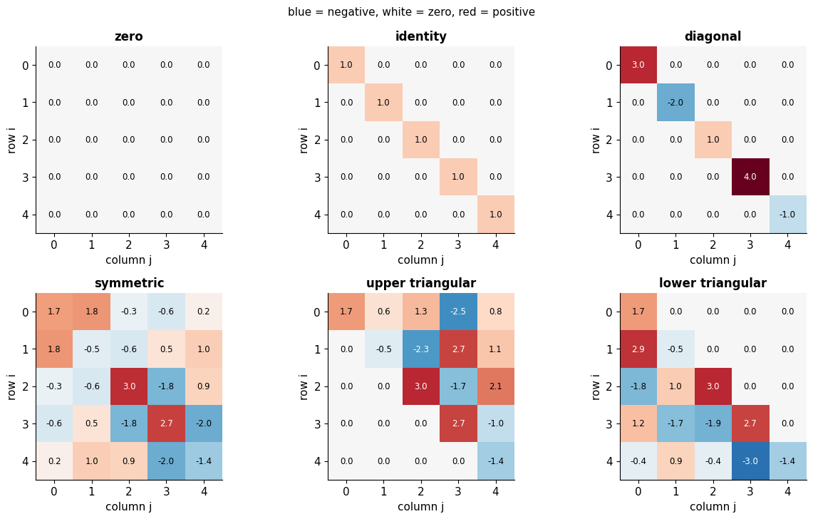

**Output**

```text
symmetric?  Symm == Symm.T : True
            M    == M.T    : False   (the raw one is not)
upper triangular: everything below the diagonal is zero: True
lower triangular: everything above the diagonal is zero: True
diagonal entries of Diag = [ 3. -2.  1.  4. -1.]
```

### Cell 102

```python
# ============================================================
#  The identity really does nothing. Verified, not asserted.
# ============================================================
I3 = np.eye(3)
v  = np.array([7.0, -2.0, 0.5])
B  = np.random.default_rng(5).normal(size=(3, 3)).round(2)

print("I =")
print(I3)
print()
print(f"v      = {v}")
print(f"I @ v  = {I3 @ v}      unchanged: {np.allclose(I3 @ v, v)}")
print()
print(f"I @ B == B : {np.allclose(I3 @ B, B)}")
print(f"B @ I == B : {np.allclose(B @ I3, B)}   (works from both sides)")
print()
print("-- a diagonal matrix scales each coordinate by its own factor --")
D = np.diag([10.0, 100.0, 1000.0])
print(f"D @ v = {D @ v}")
print(f"which is just v times the diagonal, entry by entry:")
print(f"        {np.diag(D) * v}   same: {np.allclose(D @ v, np.diag(D) * v)}")
print()
print("(the @ operator is matrix multiplication -- Part 5 explains what it")
print(" is doing. For now we only need that it exists, so we can check")
print(" these claims instead of asking you to believe them.)")
```

**Output**

```text
I =
[[1. 0. 0.]
 [0. 1. 0.]
 [0. 0. 1.]]

v      = [ 7.  -2.   0.5]
I @ v  = [ 7.  -2.   0.5]      unchanged: True

I @ B == B : True
B @ I == B : True   (works from both sides)

-- a diagonal matrix scales each coordinate by its own factor --
D @ v = [  70. -200.  500.]
which is just v times the diagonal, entry by entry:
        [  70. -200.  500.]   same: True

(the @ operator is matrix multiplication -- Part 5 explains what it
 is doing. For now we only need that it exists, so we can check
 these claims instead of asking you to believe them.)
```

### Cell 106

```python
# ============================================================
#  Transpose, and the two identities.
# ============================================================
A = np.array([[10.0, 20.0, 30.0],
              [40.0, 50.0, 60.0]])

print("A =");     print(A);   print(f"shape {A.shape}")
print("A.T =");   print(A.T); print(f"shape {A.T.shape}")
print()
print("entry by entry, (A.T)[j, i] should equal A[i, j]:")
for i in range(A.shape[0]):
    for j in range(A.shape[1]):
        print(f"   A[{i},{j}] = {A[i,j]:>5.1f}   A.T[{j},{i}] = {A.T[j,i]:>5.1f}"
              f"   match: {A[i,j] == A.T[j,i]}")

print()
print(f"-- identity 1:  (A.T).T == A  --")
print(f"   {np.allclose(A.T.T, A)}")

print()
print(f"-- identity 2:  (A @ B).T == B.T @ A.T  --")
Bm = np.random.default_rng(31).normal(size=(3, 4)).round(2)   # 3 x 4
print(f"   A is {A.shape}, B is {Bm.shape}, so A @ B is {(A @ Bm).shape}")
print(f"   (A @ B).T   is {(A @ Bm).T.shape}")
print(f"   B.T @ A.T   is {(Bm.T @ A.T).shape}")
print(f"   equal: {np.allclose((A @ Bm).T, Bm.T @ A.T)}")

print()
print("   and the WRONG order, A.T @ B.T, cannot even be formed:")
try:
    A.T @ Bm.T
except ValueError as e:
    print(f"   ValueError: {e}")
```

**Output**

```text
A =
[[10. 20. 30.]
 [40. 50. 60.]]
shape (2, 3)
A.T =
[[10. 40.]
 [20. 50.]
 [30. 60.]]
shape (3, 2)

entry by entry, (A.T)[j, i] should equal A[i, j]:
   A[0,0] =  10.0   A.T[0,0] =  10.0   match: True
   A[0,1] =  20.0   A.T[1,0] =  20.0   match: True
   A[0,2] =  30.0   A.T[2,0] =  30.0   match: True
   A[1,0] =  40.0   A.T[0,1] =  40.0   match: True
   A[1,1] =  50.0   A.T[1,1] =  50.0   match: True
   A[1,2] =  60.0   A.T[2,1] =  60.0   match: True

-- identity 1:  (A.T).T == A  --
   True

-- identity 2:  (A @ B).T == B.T @ A.T  --
   A is (2, 3), B is (3, 4), so A @ B is (2, 4)
   (A @ B).T   is (4, 2)
   B.T @ A.T   is (4, 2)
   equal: True

   and the WRONG order, A.T @ B.T, cannot even be formed:
   ValueError: matmul: Input operand 1 has a mismatch in its core dimension 0, with gufunc signature (n?,k),(k,m?)->(n?,m?) (size 4 is different from 2)
```

### Cell 110

```python
# ============================================================
#  Addition, scaling, and the error when shapes disagree.
# ============================================================
P = np.array([[1.0, 2.0],
              [3.0, 4.0]])
Q = np.array([[10.0, 20.0],
              [30.0, 40.0]])

print("P + Q  (entry by entry) =");  print(P + Q)
print(f"check corner by hand: P[1,0] + Q[1,0] = {P[1,0]} + {Q[1,0]} = "
      f"{P[1,0] + Q[1,0]}, and (P+Q)[1,0] = {(P + Q)[1,0]}")
print()
print("3 * P =");  print(3 * P)
print(f"check: every entry tripled: {np.allclose(3 * P, P + P + P)}")
print()
print("-- now a deliberate shape mismatch --")
R = np.ones((3, 2))
print(f"P is {P.shape}, R is {R.shape}. Adding them:")
try:
    P + R
except ValueError as e:
    print(f"   ValueError: {e}")
print()
print("Read that message carefully: numpy names both shapes and tells you")
print("which dimension it could not reconcile. Nearly every shape bug you")
print("will ever hit is solved by reading this sentence instead of guessing.")
```

**Output**

```text
P + Q  (entry by entry) =
[[11. 22.]
 [33. 44.]]
check corner by hand: P[1,0] + Q[1,0] = 3.0 + 30.0 = 33.0, and (P+Q)[1,0] = 33.0

3 * P =
[[ 3.  6.]
 [ 9. 12.]]
check: every entry tripled: True

-- now a deliberate shape mismatch --
P is (2, 2), R is (3, 2). Adding them:
   ValueError: operands could not be broadcast together with shapes (2,2) (3,2) 

Read that message carefully: numpy names both shapes and tells you
which dimension it could not reconcile. Nearly every shape bug you
will ever hit is solved by reading this sentence instead of guessing.
```

### Cell 111

```python
# ============================================================
#  * versus @ , on matrices. Same shapes in, same shape out,
#  completely different answers, no error either way.
# ============================================================
star = P * Q       # ELEMENTWISE product (a.k.a. Hadamard product)
at   = P @ Q       # MATRIX product -- Part 5

print("P =");        print(P)
print("Q =");        print(Q)
print()
print("P * Q   (elementwise) =");    print(star)
print(f"   e.g. top-left is {P[0,0]} * {Q[0,0]} = {P[0,0]*Q[0,0]}")
print()
print("P @ Q   (matrix product) =");  print(at)
print(f"   e.g. top-left is the dot product of P's first ROW with Q's first")
print(f"        COLUMN: {P[0,:]} . {Q[:,0]} = {P[0,:] @ Q[:,0]}")
print()
print(f"both results have shape {star.shape} and {at.shape} -- identical.")
print(f"are they the same matrix?  {np.array_equal(star, at)}")
print(f"largest disagreement: {np.abs(star - at).max()}")
```

**Output**

```text
P =
[[1. 2.]
 [3. 4.]]
Q =
[[10. 20.]
 [30. 40.]]

P * Q   (elementwise) =
[[ 10.  40.]
 [ 90. 160.]]
   e.g. top-left is 1.0 * 10.0 = 10.0

P @ Q   (matrix product) =
[[ 70. 100.]
 [150. 220.]]
   e.g. top-left is the dot product of P's first ROW with Q's first
        COLUMN: [1. 2.] . [10. 30.] = 70.0

both results have shape (2, 2) and (2, 2) -- identical.
are they the same matrix?  False
largest disagreement: 60.0
```

### Cell 114

```python
# ============================================================
#  Broadcasting: the useful case, then two traps.
# ============================================================
G   = np.array([[1.0, 2.0, 3.0],
                [4.0, 5.0, 6.0],
                [7.0, 8.0, 9.0]])
row = np.array([100.0, 200.0, 300.0])

print("G =");            print(G)
print(f"row = {row}   shape {row.shape}")
print()
print("G + row  -- row is added to EVERY row of G:")
print(G + row)
print(f"   check row 2 by hand: {G[2]} + {row} = {G[2] + row}")
print()

print("=" * 62)
print("TRAP 1: you wanted to add it to every COLUMN, not every row.")
print("=" * 62)
print("G + row              (adds along the rows):")
print(G + row)
print()
print("G + row[:, None]     (row reshaped to a column, adds down the columns):")
print(G + row[:, None])
print(f"   row[:, None] has shape {row[:, None].shape} -- a genuine column")
print()
print("Both ran. Both returned a 3x3. Only one is what you asked for, and")
print("numpy has no way to know which.")
```

**Output**

```text
G =
[[1. 2. 3.]
 [4. 5. 6.]
 [7. 8. 9.]]
row = [100. 200. 300.]   shape (3,)

G + row  -- row is added to EVERY row of G:
[[101. 202. 303.]
 [104. 205. 306.]
 [107. 208. 309.]]
   check row 2 by hand: [7. 8. 9.] + [100. 200. 300.] = [107. 208. 309.]

==============================================================
TRAP 1: you wanted to add it to every COLUMN, not every row.
==============================================================
G + row              (adds along the rows):
[[101. 202. 303.]
 [104. 205. 306.]
 [107. 208. 309.]]

G + row[:, None]     (row reshaped to a column, adds down the columns):
[[101. 102. 103.]
 [204. 205. 206.]
 [307. 308. 309.]]
   row[:, None] has shape (3, 1) -- a genuine column

Both ran. Both returned a 3x3. Only one is what you asked for, and
numpy has no way to know which.
```

### Cell 115

```python
# ============================================================
#  TRAP 2: the accidental outer product of shapes.
#  This one is far nastier -- the OUTPUT SHAPE changes, and
#  people miss it because the numbers still look reasonable.
# ============================================================
u = np.array([1.0, 2.0, 3.0])          # shape (3,)
w = np.array([[10.0], [20.0], [30.0]]) # shape (3, 1) -- a column, not a vector

print(f"u shape {u.shape}:  {u}")
print(f"w shape {w.shape}:")
print(w)
print()
print("You meant elementwise subtraction of two length-3 things. You get:")
result = u - w
print(result)
print(f"   shape {result.shape}  <-- NOT (3,). Every u against every w.")
print()
print("What you almost certainly wanted:")
right = u - w.ravel()
print(f"   u - w.ravel() = {right}   shape {right.shape}")
print()
print("=" * 62)
print("HOW TO CATCH IT: assert the shape you expect, before using the result.")
print("=" * 62)
def safe_subtract(p, q):
    out = p - q
    if out.shape != np.shape(p):
        raise ValueError(f"broadcast changed the shape: {np.shape(p)} -> "
                         f"{out.shape}. Did you mean .ravel() or [:, None]?")
    return out

try:
    safe_subtract(u, w)
except ValueError as e:
    print(f"caught: {e}")
print(f"and the correct call passes: {safe_subtract(u, w.ravel())}")
```

**Output**

```text
u shape (3,):  [1. 2. 3.]
w shape (3, 1):
[[10.]
 [20.]
 [30.]]

You meant elementwise subtraction of two length-3 things. You get:
[[ -9.  -8.  -7.]
 [-19. -18. -17.]
 [-29. -28. -27.]]
   shape (3, 3)  <-- NOT (3,). Every u against every w.

What you almost certainly wanted:
   u - w.ravel() = [ -9. -18. -27.]   shape (3,)

==============================================================
HOW TO CATCH IT: assert the shape you expect, before using the result.
==============================================================
caught: broadcast changed the shape: (3,) -> (3, 3). Did you mean .ravel() or [:, None]?
and the correct call passes: [ -9. -18. -27.]
```

### Cell 119

```python
# ============================================================
#  Mean-centring the flower matrix.
# ============================================================
col_means = X.mean(axis=0)          # axis=0 -> average DOWN each column
Xc        = X - col_means           # broadcast: (200,2) - (2,) -> (200,2)

print(f"X.shape         = {X.shape}")
print(f"col_means.shape = {col_means.shape}   <- one mean per feature")
print(f"Xc.shape        = {Xc.shape}   <- shape unchanged, as it must be")
assert Xc.shape == X.shape, "broadcasting changed the shape"
print()
print(f"column means BEFORE centring: {col_means.round(4)}")
print(f"column means AFTER  centring: "
      f"{np.array2string(Xc.mean(axis=0), precision=3)}   <- not rounded")
print(f"are they zero?  {np.allclose(Xc.mean(axis=0), 0)}")
print(f"largest surviving mean = {np.abs(Xc.mean(axis=0)).max():.3e}  "
      f"(floating-point dust)")
print()
print("-- distances between flowers are untouched --")
d_before = np.linalg.norm(X[0]  - X[1])
d_after  = np.linalg.norm(Xc[0] - Xc[1])
print(f"   distance flower 0 to flower 1, before = {d_before:.10f}")
print(f"   distance flower 0 to flower 1, after  = {d_after:.10f}")
print(f"   identical: {np.isclose(d_before, d_after)}")
print(f"   and for ALL pairs of the first 50 flowers: "
      f"{np.allclose(np.linalg.norm(X[:50,None]-X[None,:50], axis=2), np.linalg.norm(Xc[:50,None]-Xc[None,:50], axis=2))}")
print()
print("-- but distances from the ORIGIN change completely, which is the point --")
print(f"   mean distance from origin, before = {np.linalg.norm(X,  axis=1).mean():.4f}")
print(f"   mean distance from origin, after  = {np.linalg.norm(Xc, axis=1).mean():.4f}")
```

**Output**

```text
X.shape         = (200, 2)
col_means.shape = (2,)   <- one mean per feature
Xc.shape        = (200, 2)   <- shape unchanged, as it must be

column means BEFORE centring: [5.7813 3.1492]
column means AFTER  centring: [2.971e-15 1.905e-15]   <- not rounded
are they zero?  True
largest surviving mean = 2.971e-15  (floating-point dust)

-- distances between flowers are untouched --
   distance flower 0 to flower 1, before = 1.3302836611
   distance flower 0 to flower 1, after  = 1.3302836611
   identical: True
   and for ALL pairs of the first 50 flowers: True

-- but distances from the ORIGIN change completely, which is the point --
   mean distance from origin, before = 6.6178
   mean distance from origin, after  = 1.0964
```

### Cell 120

```python
fig, (ax1, ax2) = plt.subplots(1, 2, figsize=(12.4, 5.4))

for ax, data, title in [(ax1, X,  "before: X, as measured"),
                        (ax2, Xc, "after: Xc, mean-centred")]:
    ax.scatter(*data[species == 0].T, s=22, c=C_F,     alpha=.7, label="species A")
    ax.scatter(*data[species == 1].T, s=22, c=C_SLOPE, alpha=.7, label="species B")
    ax.scatter(*data.mean(axis=0), s=200, marker="X", c=C_EXACT,
               edgecolor="white", lw=1.5, zorder=5, label="mean of all")
    ax.axhline(0, color=C_GREY, lw=1.0)
    ax.axvline(0, color=C_GREY, lw=1.0)
    ax.plot(0, 0, "o", ms=9, mfc="none", mec=C_AREA, mew=2.5, zorder=6)
    ax.set_title(title)
    ax.set_xlabel(FEATURES[0]); ax.set_ylabel(FEATURES[1])
    ax.set_aspect("equal")
ax1.set_xlim(-0.6, 8.6); ax1.set_ylim(-0.6, 8.6)
ax2.set_xlim(-4.6, 4.6); ax2.set_ylim(-4.6, 4.6)
ax1.legend(frameon=False, loc="upper left", fontsize=9)
fig.suptitle("green ring = the origin;  purple X = the mean of the data",
             fontsize=11)
fig.tight_layout(); plt.show()

print(f"the purple X moved from {X.mean(axis=0).round(3)} to "
      f"{Xc.mean(axis=0).round(3)} -- onto the origin, by construction")
```

**Output**

```text
<Figure size 1240x540 with 2 Axes>
```

**Figure**

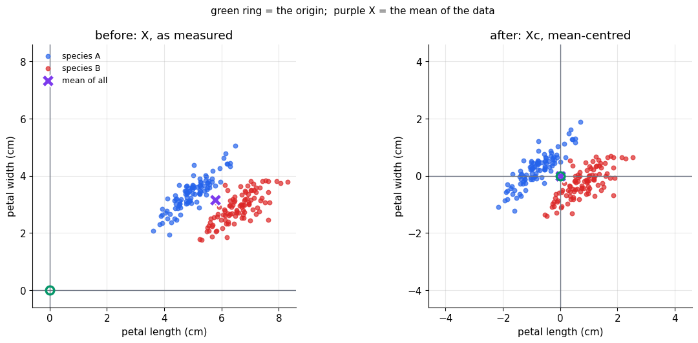

**Output**

```text
the purple X moved from [5.781 3.149] to [0. 0.] -- onto the origin, by construction
```

### Cell 126

```python
import numpy as np

A = np.array([[ 2., -1.],
              [ 1.,  3.],
              [ 0.,  4.]])          # 3 rows, 2 columns
v = np.array([4., 2.])              # 2 entries

print("A =")
print(A)
print(f"\nv = {v}    (A has {A.shape[1]} columns, v has {v.size} entries -- they match)")
print("\n--- one output entry per ROW of A, each one a dot product from Part 3 ---")

out = np.zeros(A.shape[0])
for i in range(A.shape[0]):
    row = A[i]                                   # the i-th row of A
    out[i] = np.sum(row * v)                     # dot product, written out by hand
    terms = "  +  ".join(f"{row[j]:g}x{v[j]:g}" for j in range(v.size))
    print(f"row {i} = {row}   dotted with v  ->  {terms}  =  {out[i]:g}")

print(f"\nbuilt by hand : {out}")
print(f"numpy A @ v   : {A @ v}")
print(f"identical?      {np.allclose(out, A @ v)}")
```

**Output**

```text
A =
[[ 2. -1.]
 [ 1.  3.]
 [ 0.  4.]]

v = [4. 2.]    (A has 2 columns, v has 2 entries -- they match)

--- one output entry per ROW of A, each one a dot product from Part 3 ---
row 0 = [ 2. -1.]   dotted with v  ->  2x4  +  -1x2  =  6
row 1 = [1. 3.]   dotted with v  ->  1x4  +  3x2  =  10
row 2 = [0. 4.]   dotted with v  ->  0x4  +  4x2  =  8

built by hand : [ 6. 10.  8.]
numpy A @ v   : [ 6. 10.  8.]
identical?      True
```

### Cell 130

```python
col0, col1 = A[:, 0], A[:, 1]        # the two columns of A, each with 3 entries

print(f"column 0 of A : {col0}")
print(f"column 1 of A : {col1}")
print(f"v             : {v}   -> use {v[0]:g} of column 0 and {v[1]:g} of column 1\n")

combo = v[0] * col0 + v[1] * col1
print(f"{v[0]:g} * {col0}  =  {v[0] * col0}")
print(f"{v[1]:g} * {col1}  =  {v[1] * col1}")
print(f"                     sum =  {combo}")

rows_way = np.array([np.sum(A[i] * v) for i in range(A.shape[0])])
print(f"\nrow-by-row way (5.1) : {rows_way}")
print(f"column-mixing way    : {combo}")
print(f"numpy A @ v          : {A @ v}")
print(f"all three agree?       {np.allclose(rows_way, combo) and np.allclose(combo, A @ v)}")
```

**Output**

```text
column 0 of A : [2. 1. 0.]
column 1 of A : [-1.  3.  4.]
v             : [4. 2.]   -> use 4 of column 0 and 2 of column 1

4 * [2. 1. 0.]  =  [8. 4. 0.]
2 * [-1.  3.  4.]  =  [-2.  6.  8.]
                     sum =  [ 6. 10.  8.]

row-by-row way (5.1) : [ 6. 10.  8.]
column-mixing way    : [ 6. 10.  8.]
numpy A @ v          : [ 6. 10.  8.]
all three agree?       True
```

### Cell 133

```python
# The column reading is the one we are keeping, so it is worth SEEING.
# Drop to a 2x2 matrix and the columns become two arrows on a flat page:
# the vector says how far to travel along each, laid tip to tail.
import matplotlib.pyplot as plt

def arrow_from_to(ax, tail, head, color, lw=2.4, ls="-", alpha=1.0):
    """Draw one arrow from `tail` to `head`. Used throughout Parts 5 and 6."""
    ax.annotate("", xy=head, xytext=tail,
                arrowprops=dict(arrowstyle="-|>", color=color, lw=lw,
                                linestyle=ls, alpha=alpha,
                                shrinkA=0, shrinkB=0))

M = np.array([[2., -1.],
              [1.,  3.]])
w = np.array([1.5, 1.0])
c0, c1 = M[:, 0], M[:, 1]
result = M @ w

fig, ax = plt.subplots(figsize=(6.2, 5.6))

arrow_from_to(ax, (0, 0), c0, C_GREY, lw=1.6, ls="--")
arrow_from_to(ax, (0, 0), c1, C_GREY, lw=1.6, ls="--")
ax.text(*(c0 * 1.06), "column 0", color=C_GREY, fontsize=9)
ax.text(*(c1 * 1.06), "column 1", color=C_GREY, fontsize=9)

step0 = w[0] * c0
arrow_from_to(ax, (0, 0), step0, C_F)
ax.text(*(step0 * 0.55 + np.array([0.12, -0.32])),
        f"{w[0]:g} x column 0", color=C_F, fontsize=9)

step1 = w[1] * c1
arrow_from_to(ax, step0, step0 + step1, C_AREA)
ax.text(*(step0 + step1 * 0.5 + np.array([0.15, 0.0])),
        f"{w[1]:g} x column 1", color=C_AREA, fontsize=9)

arrow_from_to(ax, (0, 0), result, C_EXACT, lw=3.0)
ax.text(*(result + np.array([0.1, 0.15])),
        f"M @ w = {result}", color=C_EXACT, fontsize=10, fontweight="bold")

lim = 5.2
ax.set_xlim(-2.2, lim); ax.set_ylim(-0.8, lim)
ax.axhline(0, color="k", lw=0.8); ax.axvline(0, color="k", lw=0.8)
ax.set_aspect("equal")
ax.set_title("A @ v is a weighted sum of A's columns")
fig.tight_layout(); plt.show()

print(f"M columns: {c0} and {c1}")
print(f"w = {w}  ->  travel {w[0]:g} along column 0, then {w[1]:g} along column 1")
print(f"tip-to-tail landing point : {step0 + step1}")
print(f"M @ w                     : {result}")
print(f"same point?                 {np.allclose(step0 + step1, result)}")
```

**Output**

```text
<Figure size 620x560 with 1 Axes>
```

**Figure**

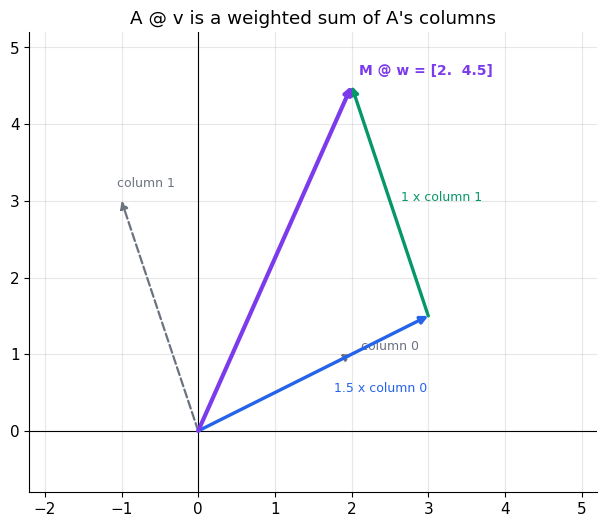

**Output**

```text
M columns: [2. 1.] and [-1.  3.]
w = [1.5 1. ]  ->  travel 1.5 along column 0, then 1 along column 1
tip-to-tail landing point : [2.  4.5]
M @ w                     : [2.  4.5]
same point?                 True
```

### Cell 137

```python
B = np.array([[1., 0., 2., -1.],
              [3., 1., 0.,  4.]])        # 2 rows, 4 columns

print(f"A is {A.shape[0]} x {A.shape[1]},  B is {B.shape[0]} x {B.shape[1]}")
print("A has 2 columns and B has 2 rows -- so A can eat each column of B.\n")

columns = []
for k in range(B.shape[1]):
    bk = B[:, k]                 # the k-th column of B: a vector with 2 entries
    ak = A @ bk                  # exactly the operation from 5.1
    columns.append(ak)
    print(f"column {k} of B = {bk}   ->   A @ (that column) = {ak}")

built = np.column_stack(columns)
print(f"\nstacked side by side, that is a {built.shape[0]} x {built.shape[1]} matrix:")
print(built)
print("\nnumpy A @ B:")
print(A @ B)
print(f"\nidentical? {np.allclose(built, A @ B)}")
print(f"\nshapes:  ({A.shape[0]} x {A.shape[1]}) @ ({B.shape[0]} x {B.shape[1]})"
      f"  ->  ({(A @ B).shape[0]} x {(A @ B).shape[1]})")

# --- and what happens when the inner dimensions do NOT agree? Ask numpy. ---
print(f"\nA @ A asks A's {A.shape[1]} columns to equal A's {A.shape[0]} rows:")
try:
    A @ A
except ValueError as err:
    print(f"  ValueError: {err}")

print(f"\nB @ A has inner pair ({B.shape[1]}, {A.shape[0]}) -- also a mismatch:")
try:
    B @ A
except ValueError as err:
    print(f"  ValueError: {err}")

print("\nWhat does work here, and its shape:")
print(f"  A @ B      inner pair ({A.shape[1]}, {B.shape[0]})  ->  {(A @ B).shape}")
print(f"  B.T @ A.T  inner pair ({B.T.shape[1]}, {A.T.shape[0]})  ->  {(B.T @ A.T).shape}")
print(f"  and (A @ B).T equals B.T @ A.T ? {np.allclose((A @ B).T, B.T @ A.T)}")
```

**Output**

```text
A is 3 x 2,  B is 2 x 4
A has 2 columns and B has 2 rows -- so A can eat each column of B.

column 0 of B = [1. 3.]   ->   A @ (that column) = [-1. 10. 12.]
column 1 of B = [0. 1.]   ->   A @ (that column) = [-1.  3.  4.]
column 2 of B = [2. 0.]   ->   A @ (that column) = [4. 2. 0.]
column 3 of B = [-1.  4.]   ->   A @ (that column) = [-6. 11. 16.]

stacked side by side, that is a 3 x 4 matrix:
[[-1. -1.  4. -6.]
 [10.  3.  2. 11.]
 [12.  4.  0. 16.]]

numpy A @ B:
[[-1. -1.  4. -6.]
 [10.  3.  2. 11.]
 [12.  4.  0. 16.]]

identical? True

shapes:  (3 x 2) @ (2 x 4)  ->  (3 x 4)

A @ A asks A's 2 columns to equal A's 3 rows:
  ValueError: matmul: Input operand 1 has a mismatch in its core dimension 0, with gufunc signature (n?,k),(k,m?)->(n?,m?) (size 3 is different from 2)

B @ A has inner pair (4, 3) -- also a mismatch:
  ValueError: matmul: Input operand 1 has a mismatch in its core dimension 0, with gufunc signature (n?,k),(k,m?)->(n?,m?) (size 3 is different from 4)

What does work here, and its shape:
  A @ B      inner pair (2, 2)  ->  (3, 4)
  B.T @ A.T  inner pair (2, 2)  ->  (4, 3)
  and (A @ B).T equals B.T @ A.T ? True
```

### Cell 142

```python
theta = np.deg2rad(90.0)
R = np.array([[np.cos(theta), -np.sin(theta)],       # quarter turn
              [np.sin(theta),  np.cos(theta)]])
S = np.array([[3., 0.],
              [0., 1.]])                              # stretch x by 3, leave y

print("R (quarter turn):"); print(R.round(3))
print("\nS (stretch x by 3):"); print(S)
print("\nR @ S  =  'stretch first, THEN rotate':")
print((R @ S).round(3))
print("\nS @ R  =  'rotate first, THEN stretch':")
print((S @ R).round(3))
print(f"\nAre they equal? {np.allclose(R @ S, S @ R)}")
print(f"largest entry-by-entry difference: {np.abs(R @ S - S @ R).max():.3f}")

probe = np.array([1., 1.])
print(f"\nOn the single vector {probe}:")
print(f"  stretch first, then rotate : {(R @ S) @ probe}")
print(f"  rotate first, then stretch : {(S @ R) @ probe}")

# --- the same two orders, applied to a shape, so the difference is visible ---
flag = np.array([[0., 0.], [1., 0.], [1., 0.35], [0.45, 0.35],
                 [0.45, 0.7], [1.0, 0.7], [1.0, 1.0], [0., 1.], [0., 0.]]).T  # 2 x 9

panels = [("original shape", np.eye(2)),
          ("R @ S : stretch, THEN rotate", R @ S),
          ("S @ R : rotate, THEN stretch", S @ R)]

fig, axes = plt.subplots(1, 3, figsize=(12.6, 4.4))
for ax, (title, Mx) in zip(axes, panels):
    shape = Mx @ flag
    ax.fill(shape[0], shape[1], color=C_F, alpha=0.25)
    ax.plot(shape[0], shape[1], color=C_F, lw=2)
    arrow_from_to(ax, (0, 0), Mx @ np.array([1., 0.]), C_SLOPE)
    arrow_from_to(ax, (0, 0), Mx @ np.array([0., 1.]), C_AREA)
    ax.set_xlim(-3.4, 3.4); ax.set_ylim(-3.4, 3.4)
    ax.axhline(0, color="k", lw=0.7); ax.axvline(0, color="k", lw=0.7)
    ax.set_aspect("equal")
    ax.set_title(title, fontsize=10)
fig.suptitle("Same two actions, two orders, two different results", y=1.0)
fig.tight_layout(); plt.show()

print("red arrow  = where the matrix sends (1, 0)")
print("green arrow = where the matrix sends (0, 1)")
print(f"R @ S sends (1,0) to {(R @ S) @ np.array([1., 0.])}")
print(f"S @ R sends (1,0) to {(S @ R) @ np.array([1., 0.])}")
```

**Output**

```text
R (quarter turn):
[[ 0. -1.]
 [ 1.  0.]]

S (stretch x by 3):
[[3. 0.]
 [0. 1.]]

R @ S  =  'stretch first, THEN rotate':
[[ 0. -1.]
 [ 3.  0.]]

S @ R  =  'rotate first, THEN stretch':
[[ 0. -3.]
 [ 1.  0.]]

Are they equal? False
largest entry-by-entry difference: 2.000

On the single vector [1. 1.]:
  stretch first, then rotate : [-1.  3.]
  rotate first, then stretch : [-3.  1.]
```

**Output**

```text
<Figure size 1260x440 with 3 Axes>
```

**Figure**

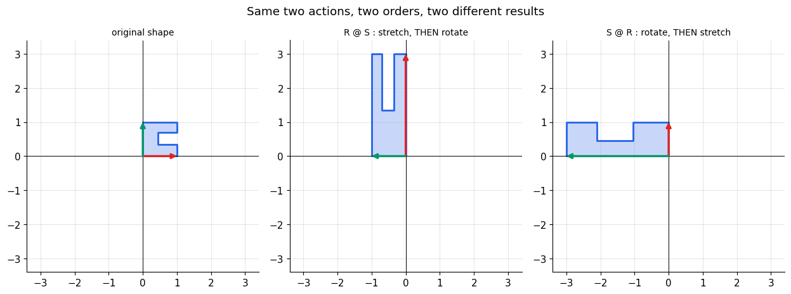

**Output**

```text
red arrow  = where the matrix sends (1, 0)
green arrow = where the matrix sends (0, 1)
R @ S sends (1,0) to [1.8369702e-16 3.0000000e+00]
S @ R sends (1,0) to [1.8369702e-16 1.0000000e+00]
```

### Cell 146

```python
RNG5 = np.random.default_rng(11)
P = RNG5.normal(size=(3, 4))
Q = RNG5.normal(size=(4, 2))
T = RNG5.normal(size=(2, 5))
Q2 = RNG5.normal(size=(4, 2))
u  = RNG5.normal(size=5)

left  = (P @ Q) @ T
right = P @ (Q @ T)
print(f"associativity   (PQ)T vs P(QT) : max difference {np.abs(left - right).max():.2e}")
print(f"                same shape?      {left.shape == right.shape} -> {left.shape}")

d_left  = P @ (Q + Q2)
d_right = P @ Q + P @ Q2
print(f"distributivity  P(Q+Q2) vs PQ+PQ2 : max difference "
      f"{np.abs(d_left - d_right).max():.2e}")

# and the one that matters in practice: fuse the chain once, reuse it forever
fused = P @ Q @ T
print(f"\nfusing P @ Q @ T into a single {fused.shape[0]} x {fused.shape[1]} matrix,")
print(f"then applying it to a vector, agrees with applying the three in turn: "
      f"{np.allclose(fused @ u, P @ (Q @ (T @ u)))}")
print("\n(The differences above are not exactly zero because floating-point")
print(" addition is not exactly associative -- they are at rounding level,")
print(" around 1e-16 relative, which is agreement.)")
```

**Output**

```text
associativity   (PQ)T vs P(QT) : max difference 4.44e-16
                same shape?      True -> (3, 5)
distributivity  P(Q+Q2) vs PQ+PQ2 : max difference 4.44e-16

fusing P @ Q @ T into a single 3 x 5 matrix,
then applying it to a vector, agrees with applying the three in turn: True

(The differences above are not exactly zero because floating-point
 addition is not exactly associative -- they are at rounding level,
 around 1e-16 relative, which is agreement.)
```

### Cell 149

```python
def mults(m, n, p):
    """Multiplications needed for an (m x n) @ (n x p) product."""
    return m * n * p

print(f"our small example: A ({A.shape[0]}x{A.shape[1]}) @ B "
      f"({B.shape[0]}x{B.shape[1]}) needs {mults(A.shape[0], A.shape[1], B.shape[1])} "
      f"multiplications")

# verify the formula by counting, rather than trusting it
counter = 0
for i in range(A.shape[0]):
    for k in range(B.shape[1]):
        for j in range(A.shape[1]):
            counter += 1
print(f"counted by triple loop                          : {counter}")
print(f"formula m*n*p                                    : "
      f"{mults(A.shape[0], A.shape[1], B.shape[1])}")
print(f"agree? {counter == mults(A.shape[0], A.shape[1], B.shape[1])}\n")

print("now the same formula at the sizes machine learning actually uses:")
print(f"{'size':>10} | {'multiplications':>20} | {'x bigger than 1024':>19}")
base = mults(1024, 1024, 1024)
for s in [1024, 2048, 4096, 8192, 16384]:
    t = mults(s, s, s)
    print(f"{s:>10} | {t:>20,} | {t / base:>18.0f}x")

secs = mults(16384, 16384, 16384) / 1e12
print(f"\nA machine doing a million million multiplications per second would")
print(f"need about {secs:.1f} seconds for the last row -- for ONE product.")
print("Every doubling of the size costs eight times the work. That is the")
print("whole reason specialised matrix-multiply hardware exists.")
```

**Output**

```text
our small example: A (3x2) @ B (2x4) needs 24 multiplications
counted by triple loop                          : 24
formula m*n*p                                    : 24
agree? True

now the same formula at the sizes machine learning actually uses:
      size |      multiplications |  x bigger than 1024
      1024 |        1,073,741,824 |                  1x
      2048 |        8,589,934,592 |                  8x
      4096 |       68,719,476,736 |                 64x
      8192 |      549,755,813,888 |                512x
     16384 |    4,398,046,511,104 |               4096x

A machine doing a million million multiplications per second would
need about 4.4 seconds for the last row -- for ONE product.
Every doubling of the size costs eight times the work. That is the
whole reason specialised matrix-multiply hardware exists.
```

### Cell 152

```python
Mflow = np.array([[1.4, -0.6],
                  [0.5,  0.9]])

print(f"X     : {X.shape}   (200 flowers as ROWS, 2 measurements each)")
print(f"Mflow : {Mflow.shape}\n")

# Route 1 -- the whiteboard route: flowers as columns.
Xcols = X.T                                  # 2 x 200
print(f"X.T            : {Xcols.shape}   (each flower is now a COLUMN)")
moved_cols = Mflow @ Xcols                   # (2x2) @ (2x200) -> 2x200
print(f"Mflow @ X.T    : {moved_cols.shape}")
moved_1 = moved_cols.T                       # back to rows
print(f"(Mflow @ X.T).T: {moved_1.shape}   (flowers are rows again)\n")

# Route 2 -- the code route: keep flowers as rows, transpose the matrix instead.
moved_2 = X @ Mflow.T                         # (200x2) @ (2x2) -> 200x2
print(f"X @ Mflow.T    : {moved_2.shape}")
print(f"\nsame answer by both routes? {np.allclose(moved_1, moved_2)}")

# And spot-check ONE flower against the definition, by hand.
i = 7
by_hand = np.array([np.sum(Mflow[r] * X[i]) for r in range(2)])
print(f"\nflower {i} was {X[i].round(3)}")
print(f"  hand-computed Mflow @ flower : {by_hand.round(3)}")
print(f"  row {i} of the batch result   : {moved_2[i].round(3)}")
print(f"  agree? {np.allclose(by_hand, moved_2[i])}")
print(f"\n200 flowers transformed with ONE matrix product, "
      f"{mults(200, 2, 2)} multiplications, no Python loop.")
```

**Output**

```text
X     : (200, 2)   (200 flowers as ROWS, 2 measurements each)
Mflow : (2, 2)

X.T            : (2, 200)   (each flower is now a COLUMN)
Mflow @ X.T    : (2, 200)
(Mflow @ X.T).T: (200, 2)   (flowers are rows again)

X @ Mflow.T    : (200, 2)

same answer by both routes? True

flower 7 was [5.661 3.894]
  hand-computed Mflow @ flower : [5.59  6.335]
  row 7 of the batch result   : [5.59  6.335]
  agree? True

200 flowers transformed with ONE matrix product, 800 multiplications, no Python loop.
```

### Cell 154

```python
# A neural network layer, in full, with no framework.
W = np.array([[0.8, -0.4],
              [0.2,  1.1],
              [-0.9, 0.3]])          # 3 outputs from 2 inputs
b = np.array([0.05, -0.2, 0.4])

x = X[0]                              # one flower as the input vector
y = W @ x + b
print(f"x (one flower) : {x.round(3)}     shape {x.shape}")
print(f"W              : shape {W.shape}")
print(f"b              : {b}   shape {b.shape}")
print(f"y = W @ x + b  : {y.round(3)}   shape {y.shape}\n")

print("entry by entry, y is Part 3 all over again:")
for r in range(W.shape[0]):
    print(f"  y[{r}] = (row {r} of W) . x  +  b[{r}] = "
          f"{np.sum(W[r] * x):.3f} + {b[r]:.3f} = {y[r]:.3f}")

# the whole batch, one line
Y = X @ W.T + b                       # (200x2)@(2x3) -> 200x3, then b broadcasts
print(f"\nall 200 flowers through the layer: X @ W.T + b -> {Y.shape}")
print(f"row 0 of the batch equals the single-flower answer? "
      f"{np.allclose(Y[0], y)}")

# and the collapse: two linear layers with nothing between them
W1 = np.array([[0.8, -0.4], [0.2, 1.1]])
W2 = np.array([[1.3, 0.5], [-0.7, 0.9]])
two_steps = W2 @ (W1 @ x)
one_step  = (W2 @ W1) @ x
print(f"\nW2 @ (W1 @ x) = {two_steps.round(4)}")
print(f"(W2 @ W1) @ x = {one_step.round(4)}")
print(f"identical? {np.allclose(two_steps, one_step)}")
print(f"W2 @ W1 is just another {(W2 @ W1).shape[0]}x{(W2 @ W1).shape[1]} matrix:")
print((W2 @ W1).round(4))
```

**Output**

```text
x (one flower) : [4.189 1.933]     shape (2,)
W              : shape (3, 2)
b              : [ 0.05 -0.2   0.4 ]   shape (3,)
y = W @ x + b  : [ 2.628  2.764 -2.79 ]   shape (3,)

entry by entry, y is Part 3 all over again:
  y[0] = (row 0 of W) . x  +  b[0] = 2.578 + 0.050 = 2.628
  y[1] = (row 1 of W) . x  +  b[1] = 2.964 + -0.200 = 2.764
  y[2] = (row 2 of W) . x  +  b[2] = -3.190 + 0.400 = -2.790

all 200 flowers through the layer: X @ W.T + b -> (200, 3)
row 0 of the batch equals the single-flower answer? True

W2 @ (W1 @ x) = [4.8333 0.8625]
(W2 @ W1) @ x = [4.8333 0.8625]
identical? True
W2 @ W1 is just another 2x2 matrix:
[[ 1.14  0.03]
 [-0.38  1.27]]
```

### Cell 159

```python
import numpy as np
import matplotlib.pyplot as plt

e1, e2 = np.array([1., 0.]), np.array([0., 1.])

want1 = np.array([ 2.0, 1.0])       # where we want e1 to land
want2 = np.array([-1.0, 1.5])       # where we want e2 to land

M = np.column_stack([want1, want2])  # write the destinations down as columns
print("M, built by stacking the two destinations as columns:")
print(M)

print(f"\nM @ e1 = {M @ e1}   (we asked for {want1})  -> {np.allclose(M @ e1, want1)}")
print(f"M @ e2 = {M @ e2}   (we asked for {want2})  -> {np.allclose(M @ e2, want2)}")

# ...and it also determines every OTHER point, with no extra information.
p = np.array([3., -2.])
print(f"\nA point we never mentioned: p = {p}")
print(f"  p = {p[0]:g}*e1 + {p[1]:g}*e2, so it must land at "
      f"{p[0]:g}*{want1} + {p[1]:g}*{want2}")
print(f"  predicted from the two landings : {p[0] * want1 + p[1] * want2}")
print(f"  actually computed as M @ p      : {M @ p}")
print(f"  agree? {np.allclose(p[0] * want1 + p[1] * want2, M @ p)}")

# The same fact, run backwards: any matrix's columns are its basis landings.
RNG6 = np.random.default_rng(23)
Z = RNG6.normal(size=(2, 2)).round(2)
print(f"\nFor an arbitrary matrix Z =\n{Z}")
print(f"  Z @ e1 = {Z @ e1}  and column 0 of Z = {Z[:, 0]}")
print(f"  Z @ e2 = {Z @ e2}  and column 1 of Z = {Z[:, 1]}")
print(f"  columns are the landings? {np.allclose(np.column_stack([Z @ e1, Z @ e2]), Z)}")
```

**Output**

```text
M, built by stacking the two destinations as columns:
[[ 2.  -1. ]
 [ 1.   1.5]]

M @ e1 = [2. 1.]   (we asked for [2. 1.])  -> True
M @ e2 = [-1.   1.5]   (we asked for [-1.   1.5])  -> True

A point we never mentioned: p = [ 3. -2.]
  p = 3*e1 + -2*e2, so it must land at 3*[2. 1.] + -2*[-1.   1.5]
  predicted from the two landings : [8. 0.]
  actually computed as M @ p      : [8. 0.]
  agree? True

For an arbitrary matrix Z =
[[ 0.55  0.22]
 [-0.06 -2.32]]
  Z @ e1 = [ 0.55 -0.06]  and column 0 of Z = [ 0.55 -0.06]
  Z @ e2 = [ 0.22 -2.32]  and column 1 of Z = [ 0.22 -2.32]
  columns are the landings? True
```

### Cell 163

```python
def transformed_grid(ax, T, extent=2.6, n_lines=11, color=C_SOFT):
    """Draw the image of a square grid under the linear map T (2x2)."""
    ticks = np.linspace(-extent, extent, n_lines)
    for k in ticks:
        vert = T @ np.array([[k, k], [-extent, extent]])   # the line x = k
        horiz = T @ np.array([[-extent, extent], [k, k]])  # the line y = k
        ax.plot(vert[0], vert[1], color=color, lw=1.0, zorder=1)
        ax.plot(horiz[0], horiz[1], color=color, lw=1.0, zorder=1)


def arrow_from_to(ax, tail, head, color, lw=2.4, ls="-"):
    ax.annotate("", xy=head, xytext=tail,
                arrowprops=dict(arrowstyle="-|>", color=color, lw=lw,
                                linestyle=ls, shrinkA=0, shrinkB=0))


# the unit square, corners listed anticlockwise (this ordering matters in 6.3)
SQUARE = np.array([[0., 1., 1., 0.],
                   [0., 0., 1., 1.]])

ang = np.deg2rad(35.0)
u_line = np.array([2., 1.]); u_line = u_line / np.linalg.norm(u_line)

ZOO = [
    ("identity\ndo nothing",            np.array([[1., 0.], [0., 1.]])),
    ("uniform scaling\nblow up by 1.6", np.array([[1.6, 0.], [0., 1.6]])),
    ("non-uniform scaling\nwide and flat", np.array([[2., 0.], [0., 0.5]])),
    ("rotation by 35 degrees",          np.array([[np.cos(ang), -np.sin(ang)],
                                                  [np.sin(ang),  np.cos(ang)]])),
    ("shear\npush the top sideways",    np.array([[1., 1.], [0., 1.]])),
    ("reflection\nflip across the x axis", np.array([[1., 0.], [0., -1.]])),
    ("squash\nnearly flatten",          np.array([[1.2, 0.6], [0.6, 0.35]])),
    ("projection onto a line\nall depth lost", np.outer(u_line, u_line)),
]

fig, axes = plt.subplots(2, 4, figsize=(15.5, 8.0))
for ax, (name, T) in zip(axes.ravel(), ZOO):
    transformed_grid(ax, T)
    sq = T @ SQUARE
    ax.fill(sq[0], sq[1], color=C_F, alpha=0.28, zorder=2)
    ax.plot(np.append(sq[0], sq[0][0]), np.append(sq[1], sq[1][0]),
            color=C_F, lw=1.8, zorder=3)
    arrow_from_to(ax, (0, 0), T @ e1, C_SLOPE)     # where (1,0) went
    arrow_from_to(ax, (0, 0), T @ e2, C_AREA)      # where (0,1) went
    ax.plot(0, 0, "o", color="k", ms=4, zorder=4)
    ax.set_xlim(-2.7, 2.7); ax.set_ylim(-2.7, 2.7)
    ax.set_aspect("equal")
    ax.set_xticks([]); ax.set_yticks([]); ax.grid(False)
    ax.set_title(f"{name}\ncolumns: {T[:, 0].round(2)} and {T[:, 1].round(2)}",
                 fontsize=9)
fig.suptitle("Eight matrices, eight motions of the plane "
             "(red arrow = where (1,0) lands, green = where (0,1) lands)",
             fontsize=12, y=1.0)
fig.tight_layout(); plt.show()

for name, T in ZOO:
    label = name.replace(chr(10), " / ")
    print(f"{label:<42} e1 -> {str(T[:, 0].round(2)):<16} "
          f"e2 -> {T[:, 1].round(2)}")
```

**Output**

```text
<Figure size 1550x800 with 8 Axes>
```

**Figure**

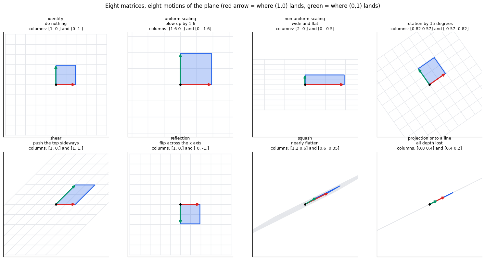

**Output**

```text
identity / do nothing                      e1 -> [1. 0.]          e2 -> [0. 1.]
uniform scaling / blow up by 1.6           e1 -> [1.6 0. ]        e2 -> [0.  1.6]
non-uniform scaling / wide and flat        e1 -> [2. 0.]          e2 -> [0.  0.5]
rotation by 35 degrees                     e1 -> [0.82 0.57]      e2 -> [-0.57  0.82]
shear / push the top sideways              e1 -> [1. 0.]          e2 -> [1. 1.]
reflection / flip across the x axis        e1 -> [1. 0.]          e2 -> [ 0. -1.]
squash / nearly flatten                    e1 -> [1.2 0.6]        e2 -> [0.6  0.35]
projection onto a line / all depth lost    e1 -> [0.8 0.4]        e2 -> [0.4 0.2]
```

### Cell 166

```python
def shoelace(P):
    """Signed area of the polygon whose corners are the columns of P (2 x k).

    Anticlockwise corners give a positive area, clockwise a negative one, so
    this measures the orientation flip as well as the size.
    """
    x, y = P[0], P[1]
    return 0.5 * np.sum(x * np.roll(y, -1) - np.roll(x, -1) * y)


print(f"the unit square itself, corners anticlockwise: signed area "
      f"{shoelace(SQUARE):+.4f}\n")
print(f"{'transformation':<40} {'shoelace area':>14} {'np.linalg.det':>14} {'match':>7}")
print("-" * 78)
worst = 0.0
for name, T in ZOO:
    area = shoelace(T @ SQUARE)
    dete = np.linalg.det(T)
    worst = max(worst, abs(area - dete))
    label = name.replace(chr(10), " / ")
    print(f"{label:<40} {area:>+14.6f} {dete:>+14.6f} "
          f"{str(np.isclose(area, dete)):>7}")
print("-" * 78)
print(f"largest disagreement anywhere in the table: {worst:.2e}")

# It is not just the square. Any shape, scaled by the same factor.
blob_t = np.linspace(0, 2 * np.pi, 200, endpoint=False)
blob = np.array([0.9 * np.cos(blob_t) + 0.25 * np.cos(3 * blob_t),
                 0.7 * np.sin(blob_t)])
T = ZOO[1][1]                      # the uniform scaling
print(f"\na lumpy blob, area {shoelace(blob):+.4f}")
print(f"after the '{ZOO[1][0].splitlines()[0]}' matrix: {shoelace(T @ blob):+.4f}")
print(f"ratio of the two areas : {shoelace(T @ blob) / shoelace(blob):.4f}")
print(f"det of that matrix     : {np.linalg.det(T):.4f}")
```

**Output**

```text
the unit square itself, corners anticlockwise: signed area +1.0000

transformation                            shoelace area  np.linalg.det   match
------------------------------------------------------------------------------
identity / do nothing                         +1.000000      +1.000000    True
uniform scaling / blow up by 1.6              +2.560000      +2.560000    True
non-uniform scaling / wide and flat           +1.000000      +1.000000    True
rotation by 35 degrees                        +1.000000      +1.000000    True
shear / push the top sideways                 +1.000000      +1.000000    True
reflection / flip across the x axis           -1.000000      -1.000000    True
squash / nearly flatten                       +0.060000      +0.060000    True
projection onto a line / all depth lost       +0.000000      +0.000000    True
------------------------------------------------------------------------------
largest disagreement anywhere in the table: 2.78e-17

a lumpy blob, area +1.9789
after the 'uniform scaling' matrix: +5.0659
ratio of the two areas : 2.5600
det of that matrix     : 2.5600
```

### Cell 169

```python
# Three determinants, seen: one that grows area, one that flips it, one that
# destroys it. Corners are labelled so the orientation flip is readable.
CASES = [("grows area\ndet > 1",  np.array([[1.6, 0.5], [0.2, 1.4]])),
         ("flips the plane\ndet < 0", np.array([[1.2, 0.4], [0.9, -1.0]])),
         ("collapses to a line\ndet = 0", np.array([[2., 1.], [4., 2.]]))]

fig, axes = plt.subplots(1, 3, figsize=(13.2, 4.6))
for ax, (name, T) in zip(axes, CASES):
    sq = T @ SQUARE
    ax.fill(np.append(SQUARE[0], SQUARE[0][0]), np.append(SQUARE[1], SQUARE[1][0]),
            color=C_GREY, alpha=0.18, zorder=1)
    ax.plot(np.append(SQUARE[0], SQUARE[0][0]), np.append(SQUARE[1], SQUARE[1][0]),
            color=C_GREY, lw=1.4, ls="--", zorder=2, label="before (area 1)")
    ax.fill(np.append(sq[0], sq[0][0]), np.append(sq[1], sq[1][0]),
            color=C_EXACT, alpha=0.28, zorder=3)
    ax.plot(np.append(sq[0], sq[0][0]), np.append(sq[1], sq[1][0]),
            color=C_EXACT, lw=2.2, zorder=4, label="after")
    for lab, corner in zip("ABCD", sq.T):
        ax.text(corner[0] + 0.09, corner[1] + 0.09, lab,
                color=C_EXACT, fontsize=11, fontweight="bold", zorder=5)
    ax.axhline(0, color="k", lw=0.7); ax.axvline(0, color="k", lw=0.7)
    ax.set_xlim(-1.0, 3.4); ax.set_ylim(-2.0, 2.6)
    ax.set_aspect("equal")
    ax.set_title(f"{name}\nshoelace {shoelace(T @ SQUARE):+.2f},  "
                 f"det {np.linalg.det(T):+.2f}", fontsize=10)
    ax.legend(frameon=False, fontsize=8, loc="upper left")
fig.tight_layout(); plt.show()

Tsing = CASES[2][1]
print("The collapsing matrix:"); print(Tsing)
print(f"\nits columns are {Tsing[:, 0]} and {Tsing[:, 1]} -- and the first is "
      f"exactly {Tsing[0, 0] / Tsing[0, 1]:g} times the second,")
print("so both columns point along ONE line. Part 5 said the output is a")
print("mixture of the columns; if the columns lie on a line, so does every")
print("possible output. The plane had nowhere else to go.")
print(f"\ndeterminant : {np.linalg.det(Tsing):.2e}")
print(f"two different inputs, same output:")
q1, q2 = np.array([1., 0.]), np.array([0.5, 1.])
print(f"  Tsing @ {q1} = {Tsing @ q1}")
print(f"  Tsing @ {q2} = {Tsing @ q2}")
print(f"  equal? {np.allclose(Tsing @ q1, Tsing @ q2)}  -- so you cannot tell,")
print("  from the output, which of the two inputs you started with.")
```

**Output**

```text
<Figure size 1320x460 with 3 Axes>
```

**Figure**

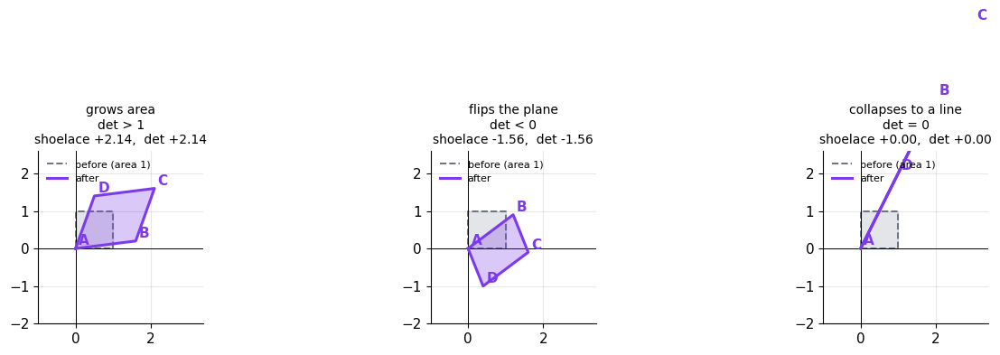

**Output**

```text
The collapsing matrix:
[[2. 1.]
 [4. 2.]]

its columns are [2. 4.] and [1. 2.] -- and the first is exactly 2 times the second,
so both columns point along ONE line. Part 5 said the output is a
mixture of the columns; if the columns lie on a line, so does every
possible output. The plane had nowhere else to go.

determinant : 0.00e+00
two different inputs, same output:
  Tsing @ [1. 0.] = [2. 4.]
  Tsing @ [0.5 1. ] = [2. 4.]
  equal? True  -- so you cannot tell,
  from the output, which of the two inputs you started with.
```

### Cell 173

```python
Bsh = np.array([[1., 0.8], [0., 1.]])                 # a shear
ang2 = np.deg2rad(50.0)
Arot = np.array([[np.cos(ang2), -np.sin(ang2)],       # a rotation
                 [np.sin(ang2),  np.cos(ang2)]])

steps = [("start", np.eye(2)),
         ("after B (shear)", Bsh),
         ("then A (rotate)\ntwo separate steps", Arot @ Bsh),
         ("A @ B applied once\none step", Arot @ Bsh)]

fig, axes = plt.subplots(1, 4, figsize=(15.2, 4.3))
for ax, (name, T) in zip(axes, steps):
    transformed_grid(ax, T, extent=2.2, n_lines=9)
    sq = T @ SQUARE
    ax.fill(np.append(sq[0], sq[0][0]), np.append(sq[1], sq[1][0]),
            color=C_F, alpha=0.28, zorder=2)
    ax.plot(np.append(sq[0], sq[0][0]), np.append(sq[1], sq[1][0]),
            color=C_F, lw=1.8, zorder=3)
    arrow_from_to(ax, (0, 0), T @ e1, C_SLOPE)
    arrow_from_to(ax, (0, 0), T @ e2, C_AREA)
    ax.set_xlim(-2.4, 2.4); ax.set_ylim(-2.4, 2.4)
    ax.set_aspect("equal"); ax.set_xticks([]); ax.set_yticks([]); ax.grid(False)
    ax.set_title(name, fontsize=10)
fig.suptitle("Two steps, or one product -- the same motion", y=1.0)
fig.tight_layout(); plt.show()

pts = RNG6.normal(size=(2, 60))
two_at_a_time = Arot @ (Bsh @ pts)
one_product   = (Arot @ Bsh) @ pts
print(f"60 random points, pushed through B then A, vs through the product A@B:")
print(f"  largest difference over all 120 coordinates: "
      f"{np.abs(two_at_a_time - one_product).max():.2e}")

print(f"\nareas multiply too, because doing both scales area twice:")
print(f"  det(B) = {np.linalg.det(Bsh):.4f}")
print(f"  det(A) = {np.linalg.det(Arot):.4f}")
print(f"  det(A) * det(B)  = {np.linalg.det(Arot) * np.linalg.det(Bsh):.4f}")
print(f"  det(A @ B)       = {np.linalg.det(Arot @ Bsh):.4f}")

print(f"\nand the order still matters, now for an obvious reason:")
print(f"  A @ B sends e1 to {(Arot @ Bsh) @ e1}")
print(f"  B @ A sends e1 to {(Bsh @ Arot) @ e1}")
print(f"  same matrix? {np.allclose(Arot @ Bsh, Bsh @ Arot)}")
```

**Output**

```text
<Figure size 1520x430 with 4 Axes>
```

**Figure**

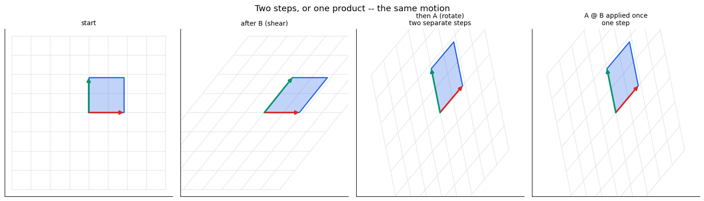

**Output**

```text
60 random points, pushed through B then A, vs through the product A@B:
  largest difference over all 120 coordinates: 8.88e-16

areas multiply too, because doing both scales area twice:
  det(B) = 1.0000
  det(A) = 1.0000
  det(A) * det(B)  = 1.0000
  det(A @ B)       = 1.0000

and the order still matters, now for an obvious reason:
  A @ B sends e1 to [0.64278761 0.76604444]
  B @ A sends e1 to [1.25562316 0.76604444]
  same matrix? False
```

### Cell 177

```python
th = np.deg2rad(37.0)

# built from the two landing spots, using cos/sin of the SHIFTED angle for e2
land_e1 = np.array([np.cos(th),            np.sin(th)])
land_e2 = np.array([np.cos(th + np.pi/2),  np.sin(th + np.pi/2)])
R_built = np.column_stack([land_e1, land_e2])


def rot2(degrees):
    """The memorised formula, for comparison and for composing turns."""
    t = np.deg2rad(degrees)
    return np.array([[np.cos(t), -np.sin(t)],
                     [np.sin(t),  np.cos(t)]])


R_formula = rot2(37.0)

print("built from where e1 and e2 land:"); print(R_built.round(6))
print("\nthe formula everyone memorises:");  print(R_formula.round(6))
print(f"\nsame matrix? {np.allclose(R_built, R_formula)}")
print(f"and cos(theta+90) really is -sin(theta)? "
      f"{np.isclose(np.cos(th + np.pi/2), -np.sin(th))}")

# A rotation should change NOTHING except direction. Check that, do not assume it.
a = np.array([2.0, 0.5])
b = np.array([-1.0, 1.7])
Ra, Rb = R_built @ a, R_built @ b

print(f"\n{'':22}{'before':>12}{'after':>12}")
print(f"{'length of a':<22}{np.linalg.norm(a):>12.6f}{np.linalg.norm(Ra):>12.6f}")
print(f"{'length of b':<22}{np.linalg.norm(b):>12.6f}{np.linalg.norm(Rb):>12.6f}")
print(f"{'a . b (dot product)':<22}{a @ b:>12.6f}{Ra @ Rb:>12.6f}")
ang_before = np.degrees(np.arccos((a @ b) / (np.linalg.norm(a) * np.linalg.norm(b))))
ang_after  = np.degrees(np.arccos((Ra @ Rb) / (np.linalg.norm(Ra) * np.linalg.norm(Rb))))
print(f"{'angle between, degrees':<22}{ang_before:>12.6f}{ang_after:>12.6f}")

print(f"\ndeterminant (area unchanged, not flipped): {np.linalg.det(R_built):.6f}")
print(f"R.T @ R is the identity?  {np.allclose(R_built.T @ R_built, np.eye(2))}")
print(f"undoing a turn is turning back: R(-37) @ R(37) is the identity? "
      f"{np.allclose(rot2(-37.0) @ R_built, np.eye(2))}")
print(f"two turns add up: R(20) @ R(17) equals R(37)? "
      f"{np.allclose(rot2(20.0) @ rot2(17.0), R_formula)}")
```

**Output**

```text
built from where e1 and e2 land:
[[ 0.798636 -0.601815]
 [ 0.601815  0.798636]]

the formula everyone memorises:
[[ 0.798636 -0.601815]
 [ 0.601815  0.798636]]

same matrix? True
and cos(theta+90) really is -sin(theta)? True

                            before       after
length of a               2.061553    2.061553
length of b               1.972308    1.972308
a . b (dot product)      -1.150000   -1.150000
angle between, degrees  106.429301  106.429301

determinant (area unchanged, not flipped): 1.000000
R.T @ R is the identity?  True
undoing a turn is turning back: R(-37) @ R(37) is the identity? True
two turns add up: R(20) @ R(17) equals R(37)? True
```

### Cell 181

```python
Xc = X - X.mean(axis=0)                    # mean-centred, so the origin is inside
print(f"X centred: mean is now {Xc.mean(axis=0).round(12)}  (shape {Xc.shape})")

rot   = np.array([[np.cos(np.deg2rad(40)), -np.sin(np.deg2rad(40))],
                  [np.sin(np.deg2rad(40)),  np.cos(np.deg2rad(40))]])
scal  = np.array([[1.7, 0.], [0., 0.45]])
shear = np.array([[1., 1.1], [0., 1.]])

VIEWS = [("original (centred)", np.eye(2)),
         ("rotated 40 degrees", rot),
         ("scaled: wide and flat", scal),
         ("sheared", shear)]

fig, axes = plt.subplots(1, 4, figsize=(16.0, 4.3))
for ax, (name, T) in zip(axes, VIEWS):
    moved = Xc @ T.T                        # Part 5.7: rows stay rows
    ax.scatter(*moved[species == 0].T, s=16, c=C_F,     alpha=0.75, label="species A")
    ax.scatter(*moved[species == 1].T, s=16, c=C_SLOPE, alpha=0.75, label="species B")
    ax.scatter(*moved[0], s=110, facecolor="none", edgecolor=C_EXACT, lw=2.0,
               zorder=5, label="flower 0")
    ax.axhline(0, color="k", lw=0.7); ax.axvline(0, color="k", lw=0.7)
    ax.set_xlim(-3.6, 3.6); ax.set_ylim(-3.6, 3.6)
    ax.set_aspect("equal")
    ax.set_title(f"{name}\ndet {np.linalg.det(T):+.2f}", fontsize=10)
    if name.startswith("original"):
        ax.legend(frameon=False, fontsize=8, loc="upper left")
fig.suptitle("The same 200 flowers, under four transformations", y=1.0)
fig.tight_layout(); plt.show()

d0 = np.linalg.norm(Xc[0] - Xc[1])
print(f"{'transformation':<24}{'flower 0 lands at':>26}{'dist(0,1)':>12}{'area factor':>13}")
print("-" * 76)
for name, T in VIEWS:
    moved = Xc @ T.T
    print(f"{name:<24}{str(moved[0].round(3)):>26}"
          f"{np.linalg.norm(moved[0] - moved[1]):>12.4f}"
          f"{abs(np.linalg.det(T)):>13.3f}")
print("-" * 76)
print(f"rotation kept the distance between flowers 0 and 1 at {d0:.4f}? "
      f"{np.isclose(np.linalg.norm((Xc @ rot.T)[0] - (Xc @ rot.T)[1]), d0)}")
print(f"the shear did not -- that distance became "
      f"{np.linalg.norm((Xc @ shear.T)[0] - (Xc @ shear.T)[1]):.4f}")

# nothing was lost: turn the rotated cloud back (6.5 -- a rotation's inverse
# is its transpose) and every flower is exactly where it started.
back = (Xc @ rot.T) @ rot
print(f"\nrotating back recovers every one of the {back.shape[0]} flowers? "
      f"{np.allclose(back, Xc)}  (max drift {np.abs(back - Xc).max():.2e})")
print(f"flower 0 is still row 0, and its species is still "
      f"{species[0]} -- labels were never fed to a matrix, only coordinates were.")
```

**Output**

```text
X centred: mean is now [0. 0.]  (shape (200, 2))
```

**Output**

```text
<Figure size 1600x430 with 4 Axes>
```

**Figure**

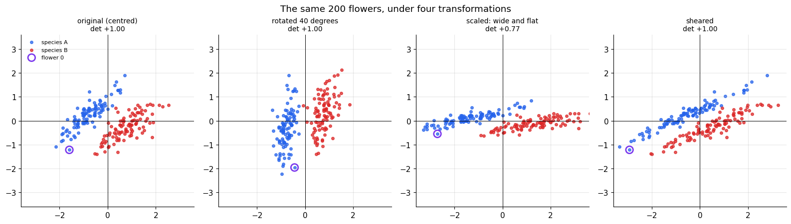

**Output**

```text
transformation                   flower 0 lands at   dist(0,1)  area factor
----------------------------------------------------------------------------
original (centred)                 [-1.592 -1.217]      1.3303        1.000
rotated 40 degrees                 [-0.438 -1.956]      1.3303        1.000
scaled: wide and flat              [-2.707 -0.547]      1.2239        0.765
sheared                            [-2.931 -1.217]      2.2494        1.000
----------------------------------------------------------------------------
rotation kept the distance between flowers 0 and 1 at 1.3303? True
the shear did not -- that distance became 2.2494

rotating back recovers every one of the 200 flowers? True  (max drift 4.44e-16)
flower 0 is still row 0, and its species is still 0 -- labels were never fed to a matrix, only coordinates were.
```

### Cell 183

```python
# 1. y = Wx + b, geometrically: a linear motion, and THEN a shift.
Wl = np.array([[1.3, -0.5], [0.4, 0.9]])
bl = np.array([1.2, -0.8])

linear_only = Xc @ Wl.T
affine      = Xc @ Wl.T + bl

print(f"origin under the linear part alone : {Wl @ np.zeros(2)}  (it cannot move)")
print(f"origin under W x + b               : {Wl @ np.zeros(2) + bl}  (b moved it)")
print(f"cloud centre, linear only : {linear_only.mean(axis=0).round(4)}")
print(f"cloud centre, with b      : {affine.mean(axis=0).round(4)}")
print(f"the shift is exactly b?     "
      f"{np.allclose(affine.mean(axis=0) - linear_only.mean(axis=0), bl)}")
print(f"shape and area unchanged by b: det is still {np.linalg.det(Wl):.4f}, and")
print(f"  distance between flowers 0 and 1 with b: "
      f"{np.linalg.norm(affine[0] - affine[1]):.6f}  without b: "
      f"{np.linalg.norm(linear_only[0] - linear_only[1]):.6f}")

# 2. Two layers with nothing between them collapse into one.
W1 = np.array([[1.1, -0.6], [0.35, 0.8]])
W2 = np.array([[0.9,  0.7], [-0.5, 1.2]])
fused = W2 @ W1

print(f"\nW1 does one motion, det {np.linalg.det(W1):+.4f}")
print(f"W2 does another,     det {np.linalg.det(W2):+.4f}")
print(f"W2 @ W1 is a single 2x2 matrix:"); print(fused.round(4))
print(f"det of the fused matrix {np.linalg.det(fused):+.4f}, which is the "
      f"product {np.linalg.det(W1) * np.linalg.det(W2):+.4f}")
print(f"\nall 200 flowers, two layers vs one fused layer: max difference "
      f"{np.abs((Xc @ W1.T) @ W2.T - Xc @ fused.T).max():.2e}")

# ten layers, same story
deep = np.eye(2)
for k in range(10):
    deep = RNG6.normal(size=(2, 2)) @ deep
print(f"ten linear layers multiplied together are still a "
      f"{deep.shape[0]}x{deep.shape[1]} matrix -- one transformation:")
print(deep.round(3))
```

**Output**

```text
origin under the linear part alone : [0. 0.]  (it cannot move)
origin under W x + b               : [ 1.2 -0.8]  (b moved it)
cloud centre, linear only : [0. 0.]
cloud centre, with b      : [ 1.2 -0.8]
the shift is exactly b?     True
shape and area unchanged by b: det is still 1.3700, and
  distance between flowers 0 and 1 with b: 1.331429  without b: 1.331429

W1 does one motion, det +1.0900
W2 does another,     det +1.4300
W2 @ W1 is a single 2x2 matrix:
[[ 1.235  0.02 ]
 [-0.13   1.26 ]]
det of the fused matrix +1.5587, which is the product +1.5587

all 200 flowers, two layers vs one fused layer: max difference 4.44e-16
ten linear layers multiplied together are still a 2x2 matrix -- one transformation:
[[-0.169  0.101]
 [ 0.728 -0.43 ]]
```

### Cell 190

```python
# ============================================================
#  The machine A, the output b, and the input we must recover.
# ============================================================
A = np.array([[2.0, 1.0],
              [1.0, 3.0]])
b = np.array([4.0, 7.0])

print("A =\n", A)
print("b =", b)
print()
print("Read row by row, A x = b is these two ordinary equations:")
print(f"   row 1:   {A[0,0]:.0f}*x + {A[0,1]:.0f}*y = {b[0]:.0f}")
print(f"   row 2:   {A[1,0]:.0f}*x + {A[1,1]:.0f}*y = {b[1]:.0f}")

# Draw each equation as a line: solve each one for y across a range of x.
xs = np.linspace(-1, 5, 200)
line1 = (b[0] - A[0, 0] * xs) / A[0, 1]      # from row 1
line2 = (b[1] - A[1, 0] * xs) / A[1, 1]      # from row 2

fig, ax = plt.subplots(figsize=(6.0, 5.4))
ax.plot(xs, line1, color=C_F,     lw=2.2, label="row 1:  2x + y = 4")
ax.plot(xs, line2, color=C_SLOPE, lw=2.2, label="row 2:  x + 3y = 7")

sol = np.linalg.solve(A, b)                  # the crossing point
ax.plot(*sol, "o", ms=12, color=C_EXACT, zorder=5)
ax.annotate(f"solution ({sol[0]:.0f}, {sol[1]:.0f})", sol, textcoords="offset points",
            xytext=(14, 12), color=C_EXACT, fontsize=11, fontweight="bold")

ax.axhline(0, color=C_GREY, lw=0.8); ax.axvline(0, color=C_GREY, lw=0.8)
ax.set_xlabel("x"); ax.set_ylabel("y")
ax.set_title("Row picture: two lines, one crossing point")
ax.set_aspect("equal"); ax.legend(frameon=False, loc="upper right")
ax.set_xlim(-1, 5); ax.set_ylim(-1, 5)
fig.tight_layout(); plt.show()

print()
print(f"The crossing point is x = {sol.round(6)}")
print(f"Check it satisfies BOTH equations:  A @ x = {(A @ sol).round(6)}   (b = {b})")
```

**Output**

```text
A =
 [[2. 1.]
 [1. 3.]]
b = [4. 7.]

Read row by row, A x = b is these two ordinary equations:
   row 1:   2*x + 1*y = 4
   row 2:   1*x + 3*y = 7
```

**Output**

```text
<Figure size 600x540 with 1 Axes>
```

**Figure**

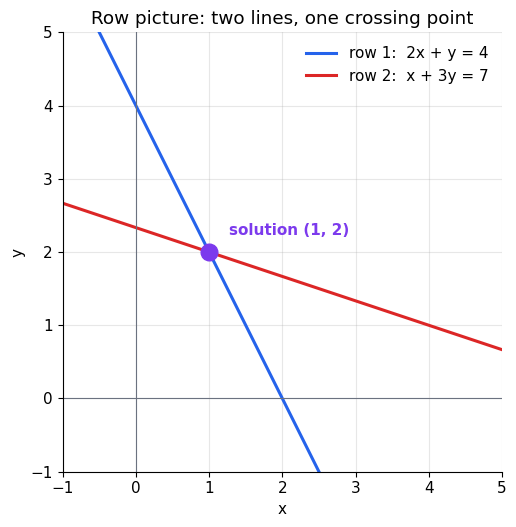

**Output**

```text
The crossing point is x = [1. 2.]
Check it satisfies BOTH equations:  A @ x = [4. 7.]   (b = [4. 7.])
```

### Cell 193

```python
c1, c2 = A[:, 0], A[:, 1]        # the two columns, as arrows
x1, x2 = sol                     # the amounts of each, found above

print(f"column 1 of A:  c1 = {c1}")
print(f"column 2 of A:  c2 = {c2}")
print(f"weights from x: x1 = {x1:.0f},  x2 = {x2:.0f}")
print(f"x1*c1 + x2*c2 = {(x1 * c1 + x2 * c2)}      b = {b}")
print(f"identical? {np.allclose(x1 * c1 + x2 * c2, b)}")

fig, ax = plt.subplots(figsize=(6.0, 5.4))


def arrow(ax, start, vec, color, label=None, lw=2.4, alpha=1.0, ls="-"):
    ax.annotate("", xy=np.add(start, vec), xytext=start,
                arrowprops=dict(arrowstyle="-|>", lw=lw, color=color,
                                alpha=alpha, linestyle=ls, mutation_scale=18))
    if label:
        mid = np.add(start, np.multiply(vec, 0.55))
        ax.text(*mid, label, color=color, fontsize=11, fontweight="bold")


# the raw columns, at the origin
arrow(ax, (0, 0), c1, C_GREY, alpha=0.55, lw=1.8)
arrow(ax, (0, 0), c2, C_GREY, alpha=0.55, lw=1.8)
ax.text(*(c1 * 1.05), "c1", color=C_GREY, fontsize=10)
ax.text(*(c2 * 1.05), "c2", color=C_GREY, fontsize=10)

# the recipe, tip to tail
arrow(ax, (0, 0), x1 * c1, C_F, f"{x1:.0f} x c1")
arrow(ax, x1 * c1, x2 * c2, C_SLOPE, f"{x2:.0f} x c2")
arrow(ax, (0, 0), b, C_EXACT, lw=3.0)
ax.text(*(b + np.array([0.15, 0.15])), "b", color=C_EXACT,
        fontsize=13, fontweight="bold")

ax.axhline(0, color=C_GREY, lw=0.8); ax.axvline(0, color=C_GREY, lw=0.8)
ax.set_xlabel("first coordinate"); ax.set_ylabel("second coordinate")
ax.set_title("Column picture: how much of each column reaches b?")
ax.set_aspect("equal"); ax.set_xlim(-1, 6); ax.set_ylim(-1, 8)
fig.tight_layout(); plt.show()
```

**Output**

```text
column 1 of A:  c1 = [2. 1.]
column 2 of A:  c2 = [1. 3.]
weights from x: x1 = 1,  x2 = 2
x1*c1 + x2*c2 = [4. 7.]      b = [4. 7.]
identical? True
```

**Output**

```text
<Figure size 600x540 with 1 Axes>
```

**Figure**

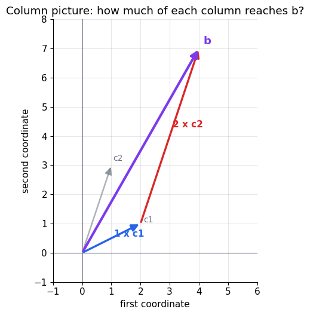

### Cell 196

```python
# ============================================================
#  Elimination, one step at a time, nothing hidden.
# ============================================================
r1 = np.array([A[0, 0], A[0, 1], b[0]])   # [coeff of x, coeff of y, right side]
r2 = np.array([A[1, 0], A[1, 1], b[1]])
print(f"start      row1 = {r1},  row2 = {r2}")

# Step 1: choose the multiplier that annihilates x in row 2.
m = r2[0] / r1[0]
print(f"\nstep 1     multiplier m = row2[x] / row1[x] = {r2[0]:.0f} / {r1[0]:.0f} = {m}")
r2_new = r2 - m * r1
print(f"           row2 - m*row1 = {r2_new}")
print(f"           the x term is now {r2_new[0]:.0f} -- x has been eliminated")

# Step 2: one equation, one unknown.
y = r2_new[2] / r2_new[1]
print(f"\nstep 2     {r2_new[1]}*y = {r2_new[2]}   ->   y = {r2_new[2]} / {r2_new[1]} = {y}")

# Step 3: back-substitute into row 1.
x = (r1[2] - r1[1] * y) / r1[0]
print(f"\nstep 3     {r1[0]:.0f}*x + {r1[1]:.0f}*({y}) = {r1[2]:.0f}"
      f"   ->   x = {x}")

by_hand = np.array([x, y])
by_numpy = np.linalg.solve(A, b)

print("\n" + "-" * 58)
print(f"by hand           x = {by_hand}")
print(f"np.linalg.solve   x = {by_numpy}")
print(f"agree to 1e-12?     {np.allclose(by_hand, by_numpy, atol=1e-12)}")
print(f"largest difference: {np.abs(by_hand - by_numpy).max():.2e}")
print(f"\nand it really solves the system: A @ x = {(A @ by_hand)}   (b = {b})")
print(f"residual ||A x - b|| = {np.linalg.norm(A @ by_hand - b):.2e}")
```

**Output**

```text
start      row1 = [2. 1. 4.],  row2 = [1. 3. 7.]

step 1     multiplier m = row2[x] / row1[x] = 1 / 2 = 0.5
           row2 - m*row1 = [0.  2.5 5. ]
           the x term is now 0 -- x has been eliminated

step 2     2.5*y = 5.0   ->   y = 5.0 / 2.5 = 2.0

step 3     2*x + 1*(2.0) = 4   ->   x = 1.0

----------------------------------------------------------
by hand           x = [1. 2.]
np.linalg.solve   x = [1. 2.]
agree to 1e-12?     True
largest difference: 0.00e+00

and it really solves the system: A @ x = [4. 7.]   (b = [4. 7.])
residual ||A x - b|| = 0.00e+00
```

### Cell 200

```python
# ============================================================
#  Build the inverse from the 2x2 formula, then check it.
# ============================================================
# name the four entries a, b, c, d as in the formula -- but with an 11/12/21/22
# suffix, because plain `b` is already the output vector of our system.
(a11, a12), (a21, a22) = A
det = a11 * a22 - a12 * a21

A_inv_formula = (1.0 / det) * np.array([[ a22, -a12],
                                        [-a21,  a11]])
A_inv_numpy = np.linalg.inv(A)

print(f"det(A) = a*d - b*c = {a11:.0f}*{a22:.0f} - {a12:.0f}*{a21:.0f} = {det:.0f}")
print(f"np.linalg.det(A)   = {np.linalg.det(A):.6f}\n")
print("A_inv by the formula:\n", A_inv_formula.round(6))
print("\nnp.linalg.inv(A):\n", A_inv_numpy.round(6))
print(f"\nsame matrix? {np.allclose(A_inv_formula, A_inv_numpy)}")

I2 = np.eye(2)
print("\nA @ A_inv =\n", (A @ A_inv_formula).round(12))
print("A_inv @ A =\n", (A_inv_formula @ A).round(12))
print(f"\nboth equal the identity? "
      f"{np.allclose(A @ A_inv_formula, I2) and np.allclose(A_inv_formula @ A, I2)}")

x_via_inverse = A_inv_formula @ b
print(f"\nx = A_inv @ b   = {x_via_inverse.round(12)}")
print(f"x = solve(A, b) = {np.linalg.solve(A, b).round(12)}")
print(f"agree? {np.allclose(x_via_inverse, np.linalg.solve(A, b))}")
```

**Output**

```text
det(A) = a*d - b*c = 2*3 - 1*1 = 5
np.linalg.det(A)   = 5.000000

A_inv by the formula:
 [[ 0.6 -0.2]
 [-0.2  0.4]]

np.linalg.inv(A):
 [[ 0.6 -0.2]
 [-0.2  0.4]]

same matrix? True

A @ A_inv =
 [[1. 0.]
 [0. 1.]]
A_inv @ A =
 [[1. 0.]
 [0. 1.]]

both equal the identity? True

x = A_inv @ b   = [1. 2.]
x = solve(A, b) = [1. 2.]
agree? True
```

### Cell 204

```python
# ============================================================
#  Three systems. Same singular matrix S for the last two.
# ============================================================
S = np.array([[1.0, 2.0],
              [2.0, 4.0]])          # row 2 is exactly 2 x row 1 -- singular
b_none = np.array([3.0, 7.0])       # 7 is NOT 2 x 3  -> no solution
b_many = np.array([3.0, 6.0])       # 6 IS  2 x 3     -> infinitely many

xs = np.linspace(-2, 6, 200)
fig, axes = plt.subplots(1, 3, figsize=(15, 5.0))

# ---- panel 1: parallel, distinct  (no solution)
ax = axes[0]
ax.plot(xs, (b_none[0] - S[0, 0] * xs) / S[0, 1], color=C_F,     lw=2.4,
        label="x + 2y = 3")
ax.plot(xs, (b_none[1] - S[1, 0] * xs) / S[1, 1], color=C_SLOPE, lw=2.4,
        ls="--", label="2x + 4y = 7")
ax.set_title("No solution\nparallel, never meet")
ax.legend(frameon=False, fontsize=9, loc="upper right")

# ---- panel 2: identical  (infinitely many)
ax = axes[1]
ax.plot(xs, (b_many[0] - S[0, 0] * xs) / S[0, 1], color=C_F, lw=6.0, alpha=0.35,
        label="x + 2y = 3")
ax.plot(xs, (b_many[1] - S[1, 0] * xs) / S[1, 1], color=C_SLOPE, lw=2.0,
        ls="--", label="2x + 4y = 6")
ax.set_title("Infinitely many\nthe same line twice")
ax.legend(frameon=False, fontsize=9, loc="upper right")

# ---- panel 3: the transformation itself, collapsing the plane
ax = axes[2]
th = np.linspace(0, 2 * np.pi, 90)
circle = np.stack([np.cos(th), np.sin(th)])         # 2 x 90 unit vectors
imgs = S @ circle                                   # where they all land
ax.plot(*circle, color=C_GREY, lw=1.6, label="input: a circle")
ax.scatter(*imgs, s=14, color=C_SLOPE, zorder=4, label="output: all on ONE line")
ax.set_title("Why: S flattens the plane\nonto a single line")
ax.legend(frameon=False, fontsize=9, loc="upper left")

for ax in axes:
    ax.axhline(0, color=C_GREY, lw=0.8); ax.axvline(0, color=C_GREY, lw=0.8)
    ax.set_aspect("equal"); ax.set_xlabel("x"); ax.set_ylabel("y")
axes[0].set_xlim(-2, 6); axes[0].set_ylim(-2, 4)
axes[1].set_xlim(-2, 6); axes[1].set_ylim(-2, 4)
axes[2].set_xlim(-6, 6); axes[2].set_ylim(-6, 6)
fig.tight_layout(); plt.show()

print("S =\n", S)
print(f"\ndet(S) = {np.linalg.det(S):.1e}      (the plane's area is scaled to zero)")
print(f"rank(S) = {np.linalg.matrix_rank(S)}   (only ONE independent direction survives)")
print(f"column 2 is exactly {S[1,1]/S[0,1]:.0f} x column 1: "
      f"{np.allclose(S[:,1], (S[1,1]/S[0,1]) * S[:,0])}")

print("\n--- asking for the inverse ---")
try:
    np.linalg.inv(S)
except np.linalg.LinAlgError as e:
    print(f"np.linalg.inv(S) raised LinAlgError: {e}")

print("\n--- the two failures, told apart by rank ---")
for name, bv in [("no solution   ", b_none), ("infinitely many", b_many)]:
    aug = np.column_stack([S, bv])                # the augmented matrix [S | b]
    print(f"{name}: b = {bv},  rank(S) = {np.linalg.matrix_rank(S)}, "
          f"rank([S|b]) = {np.linalg.matrix_rank(aug)}")
    try:
        np.linalg.solve(S, bv)
    except np.linalg.LinAlgError as e:
        print(f"                 np.linalg.solve -> LinAlgError: {e}")
```

**Output**

```text
<Figure size 1500x500 with 3 Axes>
```

**Figure**

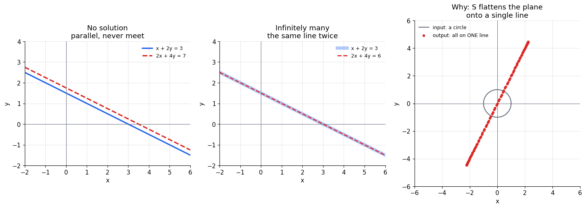

**Output**

```text
S =
 [[1. 2.]
 [2. 4.]]

det(S) = 0.0e+00      (the plane's area is scaled to zero)
rank(S) = 1   (only ONE independent direction survives)
column 2 is exactly 2 x column 1: True

--- asking for the inverse ---
np.linalg.inv(S) raised LinAlgError: Singular matrix

--- the two failures, told apart by rank ---
no solution   : b = [3. 7.],  rank(S) = 1, rank([S|b]) = 2
                 np.linalg.solve -> LinAlgError: Singular matrix
infinitely many: b = [3. 6.],  rank(S) = 1, rank([S|b]) = 1
                 np.linalg.solve -> LinAlgError: Singular matrix
```

### Cell 208

```python
# ============================================================
#  Well-conditioned vs nearly-singular: the same nudge, twice.
# ============================================================
N = np.array([[1.0, 2.0],
              [2.0, 4.001]])          # singular, except for that 0.001

print(f"A (from earlier)   det = {np.linalg.det(A):>10.6f}   "
      f"cond = {np.linalg.cond(A):>12.4f}")
print(f"N (near-singular)  det = {np.linalg.det(N):>10.6f}   "
      f"cond = {np.linalg.cond(N):>12.4f}")

b0 = np.array([3.0, 6.0])
nudge = np.array([0.0, 0.001])         # a change in the FOURTH decimal place
b1 = b0 + nudge

rel_b = np.linalg.norm(nudge) / np.linalg.norm(b0)
print(f"\nwe change b from {b0} to {b1}")
print(f"relative change in b: {rel_b:.3e}  ({100*rel_b:.4f} %)")

print("\n--- the well-conditioned matrix A ---")
xa0, xa1 = np.linalg.solve(A, b0), np.linalg.solve(A, b1)
rel_xa = np.linalg.norm(xa1 - xa0) / np.linalg.norm(xa0)
print(f"x before = {xa0.round(6)}")
print(f"x after  = {xa1.round(6)}")
print(f"relative change in x: {rel_xa:.3e}   -> amplification "
      f"{rel_xa / rel_b:.2f}x   (cond = {np.linalg.cond(A):.2f})")

print("\n--- the near-singular matrix N ---")
xn0, xn1 = np.linalg.solve(N, b0), np.linalg.solve(N, b1)
rel_xn = np.linalg.norm(xn1 - xn0) / np.linalg.norm(xn0)
print(f"x before = {xn0.round(6)}")
print(f"x after  = {xn1.round(6)}")
print(f"relative change in x: {rel_xn:.3e}   -> amplification "
      f"{rel_xn / rel_b:.1f}x   (cond = {np.linalg.cond(N):.1f})")

print(f"\nsame nudge to b. With A the answer moved by {rel_xa:.2e}; "
      f"with N it moved by {rel_xn:.2e}.")
print(f"That is {rel_xn / rel_xa:.0f} times more sensitive, "
      f"from a matrix that looks perfectly ordinary.")

print("\n--- and the same instability, in the inverse itself ---")
print("inv(N) =\n", np.linalg.inv(N).round(2))
print(f"largest entry of inv(N): {np.abs(np.linalg.inv(N)).max():,.1f}"
      f"    (largest entry of inv(A): {np.abs(np.linalg.inv(A)).max():.3f})")
print("Enormous entries with opposite signs cancel almost exactly when they")
print("multiply b -- and cancellation is precisely where floating point loses")
print("its digits. np.linalg.solve never builds this object, which is why it")
print("is the routine to reach for.")
```

**Output**

```text
A (from earlier)   det =   5.000000   cond =       2.6180
N (near-singular)  det =   0.001000   cond =   25008.0010

we change b from [3. 6.] to [3.    6.001]
relative change in b: 1.491e-04  (0.0149 %)

--- the well-conditioned matrix A ---
x before = [0.6 1.8]
x after  = [0.5998 1.8004]
relative change in x: 2.357e-04   -> amplification 1.58x   (cond = 2.62)

--- the near-singular matrix N ---
x before = [ 3. -0.]
x after  = [1. 1.]
relative change in x: 7.454e-01   -> amplification 5000.0x   (cond = 25008.0)

same nudge to b. With A the answer moved by 2.36e-04; with N it moved by 7.45e-01.
That is 3162 times more sensitive, from a matrix that looks perfectly ordinary.

--- and the same instability, in the inverse itself ---
inv(N) =
 [[ 4001. -2000.]
 [-2000.  1000.]]
largest entry of inv(N): 4,001.0    (largest entry of inv(A): 0.600)
Enormous entries with opposite signs cancel almost exactly when they
multiply b -- and cancellation is precisely where floating point loses
its digits. np.linalg.solve never builds this object, which is why it
is the routine to reach for.
```

### Cell 212

```python
# ============================================================
#  Rank on three matrices, and on our flowers.
# ============================================================
R1 = np.array([[1.0, 2.0], [3.0, 4.0]])       # ordinary
R2 = np.array([[1.0, 2.0], [2.0, 4.0]])       # col2 = 2 * col1
R3 = np.array([[1.0, 2.0, 3.0],
               [2.0, 4.0, 6.0],
               [1.0, 1.0, 1.0]])              # row2 = 2 * row1

for name, M in [("R1 (independent columns)", R1),
                ("R2 (col2 = 2 x col1)    ", R2),
                ("R3 (3x3, row2 = 2 x row1)", R3)]:
    r = np.linalg.matrix_rank(M)
    full = min(M.shape)
    print(f"{name}  shape {M.shape}  rank = {r}  "
          f"({'FULL rank' if r == full else f'rank-deficient: lost {full - r}'})"
          f"   det = {np.linalg.det(M):+.4f}")

print("\n--- and the flower data itself ---")
print(f"X.shape = {X.shape},  rank(X) = {np.linalg.matrix_rank(X)}")
print("Rank 2 out of a possible 2: the two measurements are correlated, but")
print("neither is a fixed multiple of the other, so both directions survive.")

X_fake = np.column_stack([X, X[:, 0] * 2.54])     # petal length in... inches-ish
print(f"\nnow add a duplicated feature (a rescaled copy of column 1):")
print(f"X_fake.shape = {X_fake.shape},  rank(X_fake) = {np.linalg.matrix_rank(X_fake)}")
print("Three columns, but still only 2 independent directions. The third column")
print("carries no information the first two did not already have -- and this is")
print("exactly the situation that made N ill-conditioned above.")
```

**Output**

```text
R1 (independent columns)  shape (2, 2)  rank = 2  (FULL rank)   det = -2.0000
R2 (col2 = 2 x col1)      shape (2, 2)  rank = 1  (rank-deficient: lost 1)   det = +0.0000
R3 (3x3, row2 = 2 x row1)  shape (3, 3)  rank = 2  (rank-deficient: lost 1)   det = +0.0000

--- and the flower data itself ---
X.shape = (200, 2),  rank(X) = 2
Rank 2 out of a possible 2: the two measurements are correlated, but
neither is a fixed multiple of the other, so both directions survive.

now add a duplicated feature (a rescaled copy of column 1):
X_fake.shape = (200, 3),  rank(X_fake) = 2
Three columns, but still only 2 independent directions. The third column
carries no information the first two did not already have -- and this is
exactly the situation that made N ill-conditioned above.
```

### Cell 214

```python
# ============================================================
#  Least squares on the flowers: width ~ slope * length + intercept.
# ============================================================
length = X[:, 0]
width  = X[:, 1]

Adesign = np.column_stack([length, np.ones_like(length)])   # 200 x 2
bvec = width                                                # 200

print(f"Adesign.shape = {Adesign.shape}   ({Adesign.shape[0]} equations)")
print(f"unknowns      = {Adesign.shape[1]}   (slope, intercept)")
print(f"-> {Adesign.shape[0]} equations, {Adesign.shape[1]} unknowns: "
      f"overdetermined, no exact solution exists.")

coef, residuals, rank_A, svals = np.linalg.lstsq(Adesign, bvec, rcond=None)
slope, intercept = coef
print(f"\nnp.linalg.lstsq ->  slope = {slope:.4f},  intercept = {intercept:.4f}")
print(f"rank of the design matrix: {rank_A} (full rank, so the fit is unique)")

resid = Adesign @ coef - bvec
print(f"\nsum of squared residuals: {np.sum(resid**2):.4f}")
print(f"largest single miss:      {np.abs(resid).max():.4f} cm")
print(f"is the residual zero?     {np.allclose(resid, 0)}   <- no exact solution, as promised")

# Is it really the MINIMUM? Perturb the answer and watch the error rise.
print("\n--- is this really the best line? nudge it and see ---")
base = np.sum(resid**2)
for ds in (-0.05, -0.01, 0.0, 0.01, 0.05):
    trial = coef + np.array([ds, 0.0])
    e = np.sum((Adesign @ trial - bvec) ** 2)
    mark = "  <- lstsq's answer" if ds == 0.0 else ""
    print(f"   slope {slope + ds:+.4f}   sum of squares = {e:.5f}"
          f"   ({e - base:+.5f} vs best){mark}")

fig, ax = plt.subplots(figsize=(6.6, 5.4))
ax.scatter(*X[species == 0].T, s=22, c=C_F,     alpha=0.55, label="species A")
ax.scatter(*X[species == 1].T, s=22, c=C_SLOPE, alpha=0.55, label="species B")
grid = np.linspace(length.min(), length.max(), 50)
ax.plot(grid, slope * grid + intercept, color=C_EXACT, lw=3.0,
        label="least-squares line")

# draw a handful of residuals as vertical sticks
for i in range(0, len(length), 17):
    ax.plot([length[i], length[i]], [width[i], slope * length[i] + intercept],
            color=C_APPROX, lw=1.1, alpha=0.9)

ax.set_xlabel(FEATURES[0]); ax.set_ylabel(FEATURES[1])
ax.set_title("Least squares: no line fits, so take the least-bad one")
ax.set_aspect("equal"); ax.legend(frameon=False, loc="upper left")
fig.tight_layout(); plt.show()
```

**Output**

```text
Adesign.shape = (200, 2)   (200 equations)
unknowns      = 2   (slope, intercept)
-> 200 equations, 2 unknowns: overdetermined, no exact solution exists.

np.linalg.lstsq ->  slope = 0.0683,  intercept = 2.7546
rank of the design matrix: 2 (full rank, so the fit is unique)

sum of squared residuals: 71.0120
largest single miss:      1.8471 cm
is the residual zero?     False   <- no exact solution, as promised

--- is this really the best line? nudge it and see ---
   slope +0.0183   sum of squares = 88.24361   (+17.23158 vs best)
   slope +0.0583   sum of squares = 71.70129   (+0.68926 vs best)
   slope +0.0683   sum of squares = 71.01203   (+0.00000 vs best)  <- lstsq's answer
   slope +0.0783   sum of squares = 71.70129   (+0.68926 vs best)
   slope +0.1183   sum of squares = 88.24361   (+17.23158 vs best)
```

**Output**

```text
<Figure size 660x540 with 1 Axes>
```

**Figure**

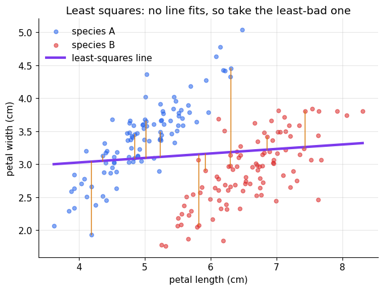

### Cell 219

```python
# ============================================================
#  One matrix. Many directions. Which ones does it NOT turn?
# ============================================================
A8 = np.array([[4.0, 1.0],
               [2.0, 3.0]])
print("A8 =\n", A8)

angles = np.linspace(0, 2 * np.pi, 72, endpoint=False)
ins = np.stack([np.cos(angles), np.sin(angles)])       # 2 x 72 unit vectors
outs = A8 @ ins                                        # where each one lands

# how far did each one TURN? angle between input and output, in degrees.
unit_out = outs / np.linalg.norm(outs, axis=0)
cosang = np.clip(np.sum(ins * unit_out, axis=0), -1.0, 1.0)
turn = np.degrees(np.arccos(np.abs(cosang)))   # abs: same LINE counts as unturned

survivors = turn < 3.0                          # near-zero turn

fig, axes = plt.subplots(1, 2, figsize=(13.0, 5.6))

ax = axes[0]
for i in range(ins.shape[1]):
    col = C_EXACT if survivors[i] else C_SOFT
    ax.annotate("", xy=outs[:, i], xytext=(0, 0),
                arrowprops=dict(arrowstyle="-|>", lw=2.4 if survivors[i] else 1.0,
                                color=col, mutation_scale=13,
                                alpha=1.0 if survivors[i] else 0.9))
ax.plot(*ins, color=C_GREY, lw=1.6, label="the inputs (a unit circle)")
ax.scatter(*ins[:, survivors], s=45, color=C_EXACT, zorder=6,
           label="inputs that did NOT turn")
ax.axhline(0, color=C_GREY, lw=0.8); ax.axvline(0, color=C_GREY, lw=0.8)
ax.set_title("Outputs: grey arrows turned, purple ones did not")
ax.set_aspect("equal"); ax.legend(frameon=False, fontsize=9, loc="upper left")

ax = axes[1]
deg = np.degrees(angles)
ax.plot(deg, turn, color=C_F, lw=2.2)
ax.scatter(deg[survivors], turn[survivors], s=55, color=C_EXACT, zorder=5)
ax.axhline(0, color=C_SLOPE, lw=1.4, ls="--")
ax.set_xlabel("direction of the input (degrees around the circle)")
ax.set_ylabel("how far it turned (degrees)")
ax.set_title("The turning, measured -- and it hits zero")
ax.set_xlim(0, 360)

fig.tight_layout(); plt.show()

print(f"\nof {ins.shape[1]} directions tried, {survivors.sum()} turned by less "
      f"than 3 degrees.")
print(f"they point along: {np.round(deg[survivors], 1)} degrees")
print(f"smallest turn found: {turn.min():.4f} deg,  largest: {turn.max():.2f} deg")
print("\nSo the answer to the question is: YES, such directions exist -- and for")
print("this matrix there appear to be exactly two of them (each counted twice,")
print("since a direction and its opposite lie on the same line).")
```

**Output**

```text
A8 =
 [[4. 1.]
 [2. 3.]]
```

**Output**

```text
<Figure size 1300x560 with 2 Axes>
```

**Figure**

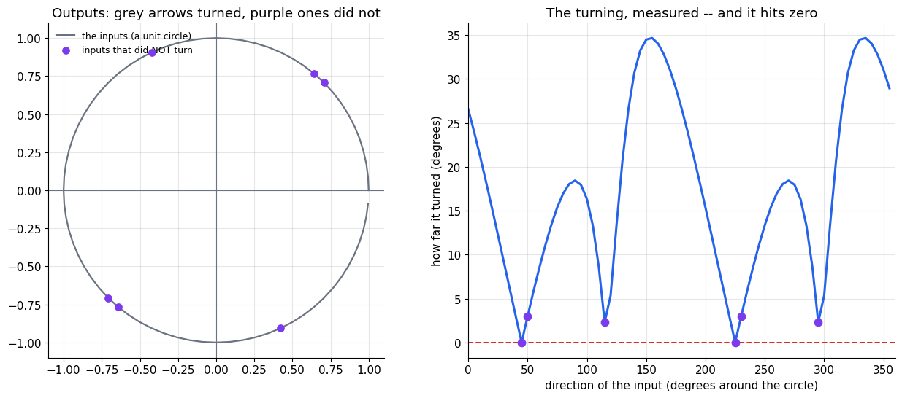

**Output**

```text
of 72 directions tried, 6 turned by less than 3 degrees.
they point along: [ 45.  50. 115. 225. 230. 295.] degrees
smallest turn found: 0.0000 deg,  largest: 34.65 deg

So the answer to the question is: YES, such directions exist -- and for
this matrix there appear to be exactly two of them (each counted twice,
since a direction and its opposite lie on the same line).
```

### Cell 224

```python
# ============================================================
#  The hand method, executed, then checked against the library.
# ============================================================
tr = np.trace(A8)
dt = np.linalg.det(A8)
print(f"trace(A8) = {tr:.0f},  det(A8) = {dt:.0f}")
print(f"characteristic equation:  lambda^2 - {tr:.0f}*lambda + {dt:.0f} = 0")

disc = tr ** 2 - 4 * dt
print(f"discriminant = trace^2 - 4*det = {tr:.0f}^2 - 4*{dt:.0f} = {disc:.0f}"
      f"   ({'positive -> two real roots' if disc > 0 else 'negative -> no real roots'})")

lam_hand = np.array([(tr + np.sqrt(disc)) / 2, (tr - np.sqrt(disc)) / 2])
print(f"quadratic formula ->  lambda = {lam_hand[0]:.0f} and {lam_hand[1]:.0f}")

# For each lambda, read a null vector off the FIRST ROW of (A - lambda I):
# if that row is [p, q], then [-q, p] is killed by it, since p*(-q) + q*p = 0.
vecs_hand = []
for lam in lam_hand:
    M = A8 - lam * np.eye(2)
    p, q = M[0]
    v = np.array([-q, p])
    vecs_hand.append(v)
    print(f"\nlambda = {lam:.0f}:")
    print(f"   A8 - {lam:.0f}I =\n{M}")
    print(f"   first row is [{p:.0f}, {q:.0f}]  ->  v = [-q, p] = {v}")
    print(f"   is the SECOND row redundant, as promised? "
          f"row2 . v = {M[1] @ v:.1e}   (zero, so yes)")
    print(f"   A8 @ v  = {A8 @ v}")
    print(f"   lam * v = {lam * v}")
    print(f"   equal?    {np.allclose(A8 @ v, lam * v)}")

vecs_hand = np.array(vecs_hand).T          # columns are the eigenvectors

print("\n" + "=" * 62)
lam_np, vec_np = np.linalg.eig(A8)
print(f"np.linalg.eig eigenvalues : {lam_np.round(6)}")
print(f"by hand                   : {lam_hand.round(6)}")
print(f"agree? {np.allclose(np.sort(lam_hand), np.sort(lam_np))}   "
      f"max difference {np.abs(np.sort(lam_hand) - np.sort(lam_np)).max():.2e}")

print("\neigenvectors, both normalised to unit length:")
vh = vecs_hand / np.linalg.norm(vecs_hand, axis=0)
for i in range(2):
    j = int(np.argmin(np.abs(lam_np - lam_hand[i])))     # match by eigenvalue
    same_line = abs(abs(vh[:, i] @ vec_np[:, j]) - 1.0) < 1e-10
    print(f"  lambda = {lam_hand[i]:.0f}:  hand {vh[:, i].round(6)}   "
          f"eig {vec_np[:, j].round(6)}   same line? {same_line}   "
          f"ratio {(vec_np[0, j] / vh[0, i]):+.6f}")
```

**Output**

```text
trace(A8) = 7,  det(A8) = 10
characteristic equation:  lambda^2 - 7*lambda + 10 = 0
discriminant = trace^2 - 4*det = 7^2 - 4*10 = 9   (positive -> two real roots)
quadratic formula ->  lambda = 5 and 2

lambda = 5:
   A8 - 5I =
[[-1.  1.]
 [ 2. -2.]]
   first row is [-1, 1]  ->  v = [-q, p] = [-1. -1.]
   is the SECOND row redundant, as promised? row2 . v = -2.7e-15   (zero, so yes)
   A8 @ v  = [-5. -5.]
   lam * v = [-5. -5.]
   equal?    True

lambda = 2:
   A8 - 2I =
[[2. 1.]
 [2. 1.]]
   first row is [2, 1]  ->  v = [-q, p] = [-1.  2.]
   is the SECOND row redundant, as promised? row2 . v = -2.7e-15   (zero, so yes)
   A8 @ v  = [-2.  4.]
   lam * v = [-2.  4.]
   equal?    True

==============================================================
np.linalg.eig eigenvalues : [5. 2.]
by hand                   : [5. 2.]
agree? True   max difference 8.88e-16

eigenvectors, both normalised to unit length:
  lambda = 5:  hand [-0.707107 -0.707107]   eig [0.707107 0.707107]   same line? True   ratio -1.000000
  lambda = 2:  hand [-0.447214  0.894427]   eig [-0.447214  0.894427]   same line? True   ratio +1.000000
```

### Cell 227

```python
# ============================================================
#  "Only up to scale and sign" -- demonstrated, not asserted.
# ============================================================
v = vecs_hand[:, 0]
lam = lam_hand[0]
print(f"take v = {v} with lambda = {lam:.0f}\n")
for s in (1.0, 3.0, 0.25, -1.0, -7.5):
    w = s * v
    print(f"  s = {s:>5}:  w = {np.round(w, 3)}   A8 @ w = {np.round(A8 @ w, 3)}"
          f"   lam * w = {np.round(lam * w, 3)}   equal? {np.allclose(A8 @ w, lam * w)}")

print("\nEvery scaled copy is an eigenvector with the SAME eigenvalue.")
print("So a library's particular choice of length and sign is a convention,")
print("nothing more:")
print(f"   our hand vector, normalised : {(v / np.linalg.norm(v)).round(6)}")
print(f"   what np.linalg.eig returned : {vec_np[:, int(np.argmin(np.abs(lam_np - lam)))].round(6)}")
print("\nThe safe test is the property, never the numbers:")
print(f"   np.allclose(A8 @ v, lam * v)  ->  {np.allclose(A8 @ v, lam * v)}")
```

**Output**

```text
take v = [-1. -1.] with lambda = 5

  s =   1.0:  w = [-1. -1.]   A8 @ w = [-5. -5.]   lam * w = [-5. -5.]   equal? True
  s =   3.0:  w = [-3. -3.]   A8 @ w = [-15. -15.]   lam * w = [-15. -15.]   equal? True
  s =  0.25:  w = [-0.25 -0.25]   A8 @ w = [-1.25 -1.25]   lam * w = [-1.25 -1.25]   equal? True
  s =  -1.0:  w = [1. 1.]   A8 @ w = [5. 5.]   lam * w = [5. 5.]   equal? True
  s =  -7.5:  w = [7.5 7.5]   A8 @ w = [37.5 37.5]   lam * w = [37.5 37.5]   equal? True

Every scaled copy is an eigenvector with the SAME eigenvalue.
So a library's particular choice of length and sign is a convention,
nothing more:
   our hand vector, normalised : [-0.707107 -0.707107]
   what np.linalg.eig returned : [0.707107 0.707107]

The safe test is the property, never the numbers:
   np.allclose(A8 @ v, lam * v)  ->  True
```

### Cell 229

```python
# ============================================================
#  Same eigenvectors, three different eigenvalues.
# ============================================================
# Build a matrix with chosen eigenvectors (the two diagonals) and chosen
# eigenvalues, by scaling along those directions:  M = Q diag(l1, l2) Q^T
Q = np.array([[1.0, 1.0],
              [1.0, -1.0]]) / np.sqrt(2.0)          # unit, perpendicular

def make(l1, l2):
    return Q @ np.diag([l1, l2]) @ Q.T

cases = [(1.8, "stretch:  |lambda| > 1", C_AREA),
         (0.45, "shrink:   |lambda| < 1", C_F),
         (-1.3, "flip:     lambda < 0", C_SLOPE)]

fig, axes = plt.subplots(1, 3, figsize=(15, 5.0))
v1 = Q[:, 0]                                        # the eigenvector we watch

for ax, (l1, title, col) in zip(axes, cases):
    M = make(l1, 1.0)                               # other eigenvalue held at 1
    out = M @ v1
    lam_check = np.linalg.eig(M)[0]

    th = np.linspace(0, 2 * np.pi, 200)
    circ = np.stack([np.cos(th), np.sin(th)])
    ax.plot(*circ, color=C_SOFT, lw=1.2)
    ax.plot(*(M @ circ), color=col, lw=1.2, alpha=0.6)

    ax.annotate("", xy=v1, xytext=(0, 0),
                arrowprops=dict(arrowstyle="-|>", lw=2.0, color=C_GREY,
                                mutation_scale=18))
    ax.annotate("", xy=out, xytext=(0, 0),
                arrowprops=dict(arrowstyle="-|>", lw=3.0, color=col,
                                mutation_scale=20))
    ax.text(*(v1 * 1.15), "v", color=C_GREY, fontsize=12, fontweight="bold")
    ax.text(*(out * 1.12), "M v", color=col, fontsize=12, fontweight="bold")

    ax.axhline(0, color=C_GREY, lw=0.8); ax.axvline(0, color=C_GREY, lw=0.8)
    ax.set_title(f"{title}\nlambda = {l1}")
    ax.set_aspect("equal"); ax.set_xlim(-2, 2); ax.set_ylim(-2, 2)

    print(f"lambda = {l1:>5}:  v = {v1.round(4)}  ->  M v = {out.round(4)}")
    print(f"              lambda * v = {(l1 * v1).round(4)}   "
          f"equal? {np.allclose(out, l1 * v1)}")
    print(f"              eig(M) finds {np.sort(lam_check).round(4)}, "
          f"det(M) = {np.linalg.det(M):+.4f}, "
          f"product of eigenvalues = {np.prod(lam_check):+.4f}")

fig.tight_layout(); plt.show()

print("\nIn every panel the output lies on the SAME LINE as the input.")
print("Only the length changed -- and, in the third, the direction along it.")
```

**Output**

```text
lambda =   1.8:  v = [0.7071 0.7071]  ->  M v = [1.2728 1.2728]
              lambda * v = [1.2728 1.2728]   equal? True
              eig(M) finds [1.  1.8], det(M) = +1.8000, product of eigenvalues = +1.8000
lambda =  0.45:  v = [0.7071 0.7071]  ->  M v = [0.3182 0.3182]
              lambda * v = [0.3182 0.3182]   equal? True
              eig(M) finds [0.45 1.  ], det(M) = +0.4500, product of eigenvalues = +0.4500
lambda =  -1.3:  v = [0.7071 0.7071]  ->  M v = [-0.9192 -0.9192]
              lambda * v = [-0.9192 -0.9192]   equal? True
              eig(M) finds [-1.3  1. ], det(M) = -1.3000, product of eigenvalues = -1.3000
```

**Output**

```text
<Figure size 1500x500 with 3 Axes>
```

**Figure**

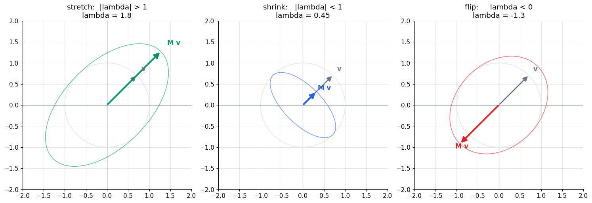

**Output**

```text
In every panel the output lies on the SAME LINE as the input.
Only the length changed -- and, in the third, the direction along it.
```

### Cell 232

```python
# ============================================================
#  A rotation: every direction turns, so no real eigenvector exists.
# ============================================================
theta = np.radians(50.0)
R = np.array([[np.cos(theta), -np.sin(theta)],
              [np.sin(theta),  np.cos(theta)]])
print(f"rotation by 50 degrees, R =\n{R.round(4)}")
print(f"det(R) = {np.linalg.det(R):.6f}  (area preserved -- rotations do not squash)")

# The same experiment as the very first figure of this part.
ins_r = np.stack([np.cos(angles), np.sin(angles)])
outs_r = R @ ins_r
cos_r = np.clip(np.sum(ins_r * (outs_r / np.linalg.norm(outs_r, axis=0)), axis=0),
                -1.0, 1.0)
turn_r = np.degrees(np.arccos(np.abs(cos_r)))
print(f"\nsmallest turn over {ins_r.shape[1]} directions tried: {turn_r.min():.4f} deg")
print(f"largest turn:  {turn_r.max():.4f} deg")
print("Not one direction stayed put. There is nothing for us to find.")

print("\n--- the characteristic equation, all the same ---")
tr_r, dt_r = np.trace(R), np.linalg.det(R)
disc_r = tr_r ** 2 - 4 * dt_r
print(f"trace = {tr_r:.4f},  det = {dt_r:.4f}")
print(f"discriminant = {disc_r:.4f}  -> NEGATIVE, so the roots are not real")

lam_r, vec_r = np.linalg.eig(R)
print(f"\nnp.linalg.eig eigenvalues: {np.round(lam_r, 4)}")
print(f"their magnitudes |lambda|: {np.round(np.abs(lam_r), 6)}  "
      f"<- exactly 1: a rotation changes no lengths")
print(f"their angles, in degrees : {np.round(np.degrees(np.angle(lam_r)), 4)}  "
      f"<- the rotation angle, plus and minus")
print(f"\nare the eigenvectors real? {np.allclose(vec_r.imag, 0)}   "
      f"(imaginary parts up to {np.abs(vec_r.imag).max():.4f})")

fig, ax = plt.subplots(figsize=(6.0, 5.6))
for i in range(0, ins_r.shape[1], 3):
    ax.annotate("", xy=ins_r[:, i], xytext=(0, 0),
                arrowprops=dict(arrowstyle="-|>", lw=1.0, color=C_SOFT,
                                mutation_scale=11))
    ax.annotate("", xy=outs_r[:, i], xytext=(0, 0),
                arrowprops=dict(arrowstyle="-|>", lw=1.4, color=C_SLOPE,
                                alpha=0.75, mutation_scale=11))
ax.plot(*ins_r, color=C_GREY, lw=1.4)
ax.axhline(0, color=C_GREY, lw=0.8); ax.axvline(0, color=C_GREY, lw=0.8)
ax.set_title("A rotation: EVERY direction turns\n(grey = in, red = out)")
ax.set_aspect("equal"); ax.set_xlim(-1.5, 1.5); ax.set_ylim(-1.5, 1.5)
fig.tight_layout(); plt.show()
```

**Output**

```text
rotation by 50 degrees, R =
[[ 0.6428 -0.766 ]
 [ 0.766   0.6428]]
det(R) = 1.000000  (area preserved -- rotations do not squash)

smallest turn over 72 directions tried: 50.0000 deg
largest turn:  50.0000 deg
Not one direction stayed put. There is nothing for us to find.

--- the characteristic equation, all the same ---
trace = 1.2856,  det = 1.0000
discriminant = -2.3473  -> NEGATIVE, so the roots are not real

np.linalg.eig eigenvalues: [0.6428+0.766j 0.6428-0.766j]
their magnitudes |lambda|: [1. 1.]  <- exactly 1: a rotation changes no lengths
their angles, in degrees : [ 50. -50.]  <- the rotation angle, plus and minus

are the eigenvectors real? False   (imaginary parts up to 0.7071)
```

**Output**

```text
<Figure size 600x560 with 1 Axes>
```

**Figure**

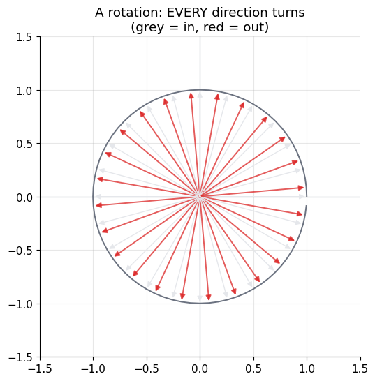

### Cell 236

```python
# ============================================================
#  Symmetric: real eigenvalues, perpendicular eigenvectors.
# ============================================================
Sym = np.array([[2.0, 1.0],
                [1.0, 3.0]])
print("Sym =\n", Sym)
print(f"is it symmetric?  Sym == Sym.T  ->  {np.array_equal(Sym, Sym.T)}")

lam_s, vec_s = np.linalg.eig(Sym)
print(f"\neigenvalues: {lam_s.round(6)}")
print(f"complex?     {np.iscomplexobj(lam_s)}   <- guarantee 1: always real")

v1s, v2s = vec_s[:, 0], vec_s[:, 1]
print(f"\neigenvector 1: {v1s.round(6)}   (lambda = {lam_s[0]:.4f})")
print(f"eigenvector 2: {v2s.round(6)}   (lambda = {lam_s[1]:.4f})")
dot = v1s @ v2s
print(f"\ntheir dot product: {dot:.2e}   <- zero, so PERPENDICULAR (guarantee 2)")
print(f"angle between them: {np.degrees(np.arccos(np.clip(dot, -1, 1))):.6f} degrees")

print("\n--- and for contrast, the NON-symmetric matrix from earlier ---")
d_ns = vec_np[:, 0] @ vec_np[:, 1]
print(f"A8 symmetric? {np.array_equal(A8, A8.T)}")
print(f"its eigenvectors' dot product: {d_ns:.4f}  -> NOT zero")
print(f"angle between them: {np.degrees(np.arccos(np.clip(abs(d_ns), -1, 1))):.2f} degrees")
print("Real eigenvalues, but not perpendicular. Symmetry is what buys the right angle.")

fig, ax = plt.subplots(figsize=(5.8, 5.4))
for v, lam, col in [(v1s, lam_s[0], C_F), (v2s, lam_s[1], C_SLOPE)]:
    ax.annotate("", xy=v, xytext=(0, 0),
                arrowprops=dict(arrowstyle="-|>", lw=2.6, color=col, mutation_scale=18))
    ax.annotate("", xy=Sym @ v, xytext=(0, 0),
                arrowprops=dict(arrowstyle="-|>", lw=1.6, color=col, alpha=0.45,
                                linestyle="--", mutation_scale=15))
    ax.text(*(v * 1.15), f"lambda={lam:.2f}", color=col, fontsize=10, fontweight="bold")
th = np.linspace(0, 2 * np.pi, 200)
ax.plot(np.cos(th), np.sin(th), color=C_SOFT, lw=1.2)
ax.axhline(0, color=C_GREY, lw=0.8); ax.axvline(0, color=C_GREY, lw=0.8)
ax.set_title("Symmetric matrix: eigenvectors at right angles\n(solid = v, dashed = Sym v)")
ax.set_aspect("equal"); ax.set_xlim(-4, 4); ax.set_ylim(-4, 4)
fig.tight_layout(); plt.show()
```

**Output**

```text
Sym =
 [[2. 1.]
 [1. 3.]]
is it symmetric?  Sym == Sym.T  ->  True

eigenvalues: [1.381966 3.618034]
complex?     False   <- guarantee 1: always real

eigenvector 1: [-0.850651  0.525731]   (lambda = 1.3820)
eigenvector 2: [-0.525731 -0.850651]   (lambda = 3.6180)

their dot product: 0.00e+00   <- zero, so PERPENDICULAR (guarantee 2)
angle between them: 90.000000 degrees

--- and for contrast, the NON-symmetric matrix from earlier ---
A8 symmetric? False
its eigenvectors' dot product: 0.3162  -> NOT zero
angle between them: 71.57 degrees
Real eigenvalues, but not perpendicular. Symmetry is what buys the right angle.
```

**Output**

```text
<Figure size 580x540 with 1 Axes>
```

**Figure**

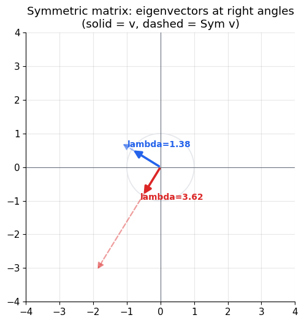

### Cell 240

```python
# ============================================================
#  Covariance of the flowers, and its eigenvectors, drawn.
# ============================================================
Xc = X - X.mean(axis=0)              # the mean-centring from Part 4
print(f"X.mean(axis=0)  = {X.mean(axis=0).round(4)}")
print(f"Xc.mean(axis=0) = {Xc.mean(axis=0).round(12)}   <- centred, to within rounding")

nrows = Xc.shape[0]
C = (Xc.T @ Xc) / (nrows - 1)
print(f"\nC = Xc.T @ Xc / (n - 1) =\n{C.round(6)}")
print(f"same as np.cov(X, rowvar=False)? "
      f"{np.allclose(C, np.cov(X, rowvar=False))}")
print(f"symmetric? C == C.T -> {np.allclose(C, C.T)}   "
      f"(off-diagonals differ by {abs(C[0,1] - C[1,0]):.2e})")

lam_c, vec_c = np.linalg.eigh(C)      # eigh: for symmetric matrices
order = np.argsort(lam_c)[::-1]       # largest eigenvalue first
lam_c, vec_c = lam_c[order], vec_c[:, order]

print(f"\neigenvalues : {lam_c.round(6)}")
print(f"both real and non-negative? "
      f"{(not np.iscomplexobj(lam_c)) and bool((lam_c >= 0).all())}")
print(f"eigenvectors (columns):\n{vec_c.round(6)}")
print(f"perpendicular? dot = {vec_c[:, 0] @ vec_c[:, 1]:.2e}")
for i in range(2):
    print(f"  check C @ v{i+1} == lambda{i+1} * v{i+1}:  "
          f"{np.allclose(C @ vec_c[:, i], lam_c[i] * vec_c[:, i])}")

fig, ax = plt.subplots(figsize=(6.6, 5.8))
ax.scatter(*X[species == 0].T, s=22, c=C_F,     alpha=0.45, label="species A")
ax.scatter(*X[species == 1].T, s=22, c=C_SLOPE, alpha=0.45, label="species B")

centre = X.mean(axis=0)
for i, col in enumerate([C_EXACT, C_AREA]):
    v = vec_c[:, i] * np.sqrt(lam_c[i]) * 2.2       # scaled by spread, to be visible
    ax.annotate("", xy=centre + v, xytext=centre,
                arrowprops=dict(arrowstyle="-|>", lw=3.2, color=col, mutation_scale=20))
    ax.annotate("", xy=centre - v, xytext=centre,
                arrowprops=dict(arrowstyle="-|>", lw=3.2, color=col, mutation_scale=20))
    ax.text(*(centre + v * 1.16), f"eigenvector {i+1}\nlambda = {lam_c[i]:.3f}",
            color=col, fontsize=10, fontweight="bold", ha="center")

ax.plot(*centre, "o", ms=9, color="black", zorder=6)
ax.set_xlabel(FEATURES[0]); ax.set_ylabel(FEATURES[1])
ax.set_title("Eigenvectors of the covariance matrix, on the data")
ax.set_aspect("equal"); ax.legend(frameon=False, loc="upper left")
fig.tight_layout(); plt.show()

ang = np.degrees(np.arctan2(vec_c[1, 0], vec_c[0, 0]))
print(f"\nthe first eigenvector points at {ang:.2f} degrees from horizontal.")
print(f"the two eigenvalues are {lam_c[0]:.4f} and {lam_c[1]:.4f}, "
      f"a ratio of {lam_c[0] / lam_c[1]:.2f} to 1.")
```

**Output**

```text
X.mean(axis=0)  = [5.7813 3.1492]
Xc.mean(axis=0) = [0. 0.]   <- centred, to within rounding

C = Xc.T @ Xc / (n - 1) =
[[1.045128 0.071331]
 [0.071331 0.361713]]
same as np.cov(X, rowvar=False)? True
symmetric? C == C.T -> True   (off-diagonals differ by 0.00e+00)

eigenvalues : [1.052494 0.354347]
both real and non-negative? True
eigenvectors (columns):
[[-0.994711  0.102716]
 [-0.102716 -0.994711]]
perpendicular? dot = 0.00e+00
  check C @ v1 == lambda1 * v1:  True
  check C @ v2 == lambda2 * v2:  True
```

**Output**

```text
<Figure size 660x580 with 1 Axes>
```

**Figure**

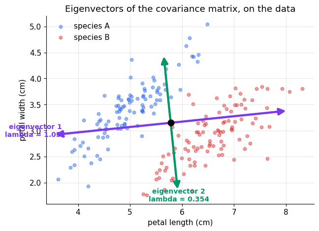

**Output**

```text
the first eigenvector points at -174.10 degrees from horizontal.
the two eigenvalues are 1.0525 and 0.3543, a ratio of 2.97 to 1.
```

### Cell 246

```python
# ============================================================
#  ONE LAYER, BY HAND, ON ONE FLOWER
#  2 measurements in  ->  3 numbers out.  So W is 3 x 2.
# ============================================================
W1 = np.array([[ 0.60, -0.90],      # row 0: how output 0 reads the input
               [ 1.20,  0.40],      # row 1
               [-0.30,  0.80]])     # row 2
b1 = np.array([0.10, -0.20, 0.50])

x = X[0]                            # one flower -- the input vector

print("SHAPES, step by step")
print(f"  x   {str(x.shape):8s}  <- {x.shape[0]} numbers in  (one flower)")
print(f"  W1  {str(W1.shape):8s}  <- {W1.shape[0]} rows (outputs) x {W1.shape[1]} cols (inputs)")
print(f"  b1  {str(b1.shape):8s}  <- one number per output")

Wx = W1 @ x
y  = Wx + b1
print(f"  Wx  {str(Wx.shape):8s}  <- {W1.shape[0]}x{W1.shape[1]} times {x.shape[0]}x1 gives {W1.shape[0]}x1")
print(f"  y   {str(y.shape):8s}  <- same shape as b1, so the addition is legal")

print("\nTHE ARITHMETIC, spelled out (Part 3's dot product, three times)")
for i in range(W1.shape[0]):
    terms = " + ".join(f"({W1[i, j]:+.2f})({x[j]:.2f})" for j in range(W1.shape[1]))
    print(f"  y[{i}] = W1[{i}]  .  x  + b1[{i}] = {terms} + ({b1[i]:+.2f}) = {y[i]:+.4f}")

print(f"\ny = {y.round(4)}")
print(f"matches W1 @ x + b1 : {np.allclose(y, W1 @ x + b1)}")
```

**Output**

```text
SHAPES, step by step
  x   (2,)      <- 2 numbers in  (one flower)
  W1  (3, 2)    <- 3 rows (outputs) x 2 cols (inputs)
  b1  (3,)      <- one number per output
  Wx  (3,)      <- 3x2 times 2x1 gives 3x1
  y   (3,)      <- same shape as b1, so the addition is legal

THE ARITHMETIC, spelled out (Part 3's dot product, three times)
  y[0] = W1[0]  .  x  + b1[0] = (+0.60)(4.19) + (-0.90)(1.93) + (+0.10) = +0.8741
  y[1] = W1[1]  .  x  + b1[1] = (+1.20)(4.19) + (+0.40)(1.93) + (-0.20) = +5.5997
  y[2] = W1[2]  .  x  + b1[2] = (-0.30)(4.19) + (+0.80)(1.93) + (+0.50) = +0.7894

y = [0.8741 5.5997 0.7894]
matches W1 @ x + b1 : True
```

### Cell 248

```python
# ============================================================
#  WHY SHAPES ARE THE WHOLE BATTLE
#  Get it wrong on purpose, read the error, then fix it.
# ============================================================
print("ATTEMPT 1 -- X @ W1, which 'looks right' and is not")
print(f"  X  is {X.shape},  W1 is {W1.shape}")
try:
    _ = X @ W1
    print("  ...it worked?!")
except ValueError as e:
    print(f"  ValueError: {e}")
    print("  Reason: '@' needs the INNER dimensions to agree.")
    print(f"    ({X.shape[0]} x {X.shape[1]}) @ ({W1.shape[0]} x {W1.shape[1]})"
          f"  ->  inner pair is {X.shape[1]} and {W1.shape[0]}: not equal, so no.")

print("\nATTEMPT 2 -- transpose W1 so the inner dimensions meet")
H = X @ W1.T + b1
print(f"  X @ W1.T   ({X.shape[0]}x{X.shape[1]}) @ ({W1.T.shape[0]}x{W1.T.shape[1]})"
      f"  ->  inner pair is {X.shape[1]} and {W1.T.shape[0]}: equal. Result {H.shape}.")
print(f"  + b1 broadcasts across all {H.shape[0]} rows -> {H.shape}")

# --- a full two-layer network:  2 -> 3 -> 1 ---------------------------
W2 = np.array([[0.70, -1.10, 0.50]])     # 1 output, 3 inputs
b2 = np.array([0.25])

rows = [
    ("input",          "X",     X.shape,     "200 flowers, 2 measurements each"),
    ("layer 1 weight", "W1",    W1.shape,    "3 outputs <- 2 inputs"),
    ("layer 1 bias",   "b1",    b1.shape,    "one per layer-1 output"),
    ("hidden",         "H",     H.shape,     "200 flowers, 3 hidden numbers"),
    ("layer 2 weight", "W2",    W2.shape,    "1 output <- 3 inputs"),
    ("layer 2 bias",   "b2",    b2.shape,    "one per layer-2 output"),
    ("output",         "OUT",   (X.shape[0], W2.shape[0]), "200 flowers, 1 number each"),
]
print("\nSHAPE TABLE for the 2 -> 3 -> 1 network")
print(f"  {'what':16s} {'name':5s} {'shape':10s}  meaning")
print("  " + "-" * 66)
for what, name, shp, why in rows:
    print(f"  {what:16s} {name:5s} {str(shp):10s}  {why}")

OUT = H @ W2.T + b2
print(f"\nOUT.shape = {OUT.shape}  (predicted, and produced)")
print(f"The chain of inner dimensions that had to line up: "
      f"{X.shape[1]} = {W1.T.shape[0]}, then {H.shape[1]} = {W2.T.shape[0]}.")
```

**Output**

```text
ATTEMPT 1 -- X @ W1, which 'looks right' and is not
  X  is (200, 2),  W1 is (3, 2)
  ValueError: matmul: Input operand 1 has a mismatch in its core dimension 0, with gufunc signature (n?,k),(k,m?)->(n?,m?) (size 3 is different from 2)
  Reason: '@' needs the INNER dimensions to agree.
    (200 x 2) @ (3 x 2)  ->  inner pair is 2 and 3: not equal, so no.

ATTEMPT 2 -- transpose W1 so the inner dimensions meet
  X @ W1.T   (200x2) @ (2x3)  ->  inner pair is 2 and 2: equal. Result (200, 3).
  + b1 broadcasts across all 200 rows -> (200, 3)

SHAPE TABLE for the 2 -> 3 -> 1 network
  what             name  shape       meaning
  ------------------------------------------------------------------
  input            X     (200, 2)    200 flowers, 2 measurements each
  layer 1 weight   W1    (3, 2)      3 outputs <- 2 inputs
  layer 1 bias     b1    (3,)        one per layer-1 output
  hidden           H     (200, 3)    200 flowers, 3 hidden numbers
  layer 2 weight   W2    (1, 3)      1 output <- 3 inputs
  layer 2 bias     b2    (1,)        one per layer-2 output
  output           OUT   (200, 1)    200 flowers, 1 number each

OUT.shape = (200, 1)  (predicted, and produced)
The chain of inner dimensions that had to line up: 2 = 2, then 3 = 3.
```

### Cell 250

```python
# ============================================================
#  BATCHING: one '@' instead of a loop over 200 flowers
# ============================================================
import time

def forward_loop(X, W, b):
    """One flower at a time -- literally the maths, one row per iteration."""
    out = np.empty((X.shape[0], W.shape[0]))
    for i in range(X.shape[0]):
        out[i] = W @ X[i] + b
    return out

def forward_batch(X, W, b):
    """All 200 flowers in one matrix multiplication."""
    return X @ W.T + b

Y_loop  = forward_loop(X, W1, b1)
Y_batch = forward_batch(X, W1, b1)

REPS = 200
t0 = time.perf_counter()
for _ in range(REPS):
    forward_loop(X, W1, b1)
t_loop = (time.perf_counter() - t0) / REPS

t0 = time.perf_counter()
for _ in range(REPS):
    forward_batch(X, W1, b1)
t_batch = (time.perf_counter() - t0) / REPS

SPEEDUP = t_loop / t_batch
print(f"identical results?          {np.allclose(Y_loop, Y_batch)}")
print(f"largest disagreement:       {np.abs(Y_loop - Y_batch).max():.3e}")
print(f"loop  over {X.shape[0]} flowers:  {t_loop * 1e6:9.1f} microseconds")
print(f"one matrix multiplication:  {t_batch * 1e6:9.1f} microseconds")
print(f"SPEEDUP:                    {SPEEDUP:9.1f} x")

fig, ax = plt.subplots(figsize=(7.4, 2.8))
ax.barh(["python loop\n(200 iterations)", "one @\n(1 matrix multiply)"],
        [t_loop * 1e6, t_batch * 1e6], color=[C_SLOPE, C_AREA], height=0.55)
for yi, t in enumerate([t_loop * 1e6, t_batch * 1e6]):
    ax.text(t * 1.05, yi, f"{t:.1f} us", va="center", fontsize=10)
ax.set_xscale("log")
ax.set_xlabel("microseconds per forward pass (log scale)")
ax.set_title(f"Same arithmetic, same answer, {SPEEDUP:.0f}x apart")
ax.grid(axis="y", alpha=0)
fig.tight_layout(); plt.show()
```

**Output**

```text
identical results?          True
largest disagreement:       1.776e-15
loop  over 200 flowers:     1541.6 microseconds
one matrix multiplication:       17.3 microseconds
SPEEDUP:                         89.1 x
```

**Output**

```text
<Figure size 740x280 with 1 Axes>
```

**Figure**

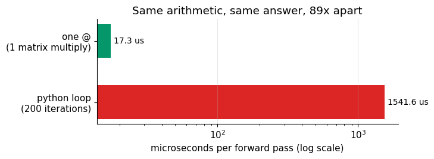

### Cell 253

```python
# ============================================================
#  COMPOSITION WITHOUT A NONLINEARITY COLLAPSES
#  Two layers stacked = one layer. Show it, don't assert it.
# ============================================================
Wa = np.array([[ 0.60, -0.90],
               [ 1.20,  0.40],
               [-0.30,  0.80]])          # 2 -> 3
ba = np.array([0.10, -0.20, 0.50])

Wb = np.array([[ 1.00,  0.50, -0.70],
               [ 0.20, -1.10,  0.90]])   # 3 -> 2
bb = np.array([-0.40, 0.30])

two_layers = (X @ Wa.T + ba) @ Wb.T + bb      # honestly, in two steps

# Collapse it algebraically:  Wb(Wa x + ba) + bb = (Wb Wa) x + (Wb ba + bb)
W_eq = Wb @ Wa                                 # 2x3 @ 3x2 -> 2x2
b_eq = Wb @ ba + bb
one_layer = X @ W_eq.T + b_eq

print("The two-layer network, 2 -> 3 -> 2, is EQUIVALENT to this single matrix:")
print("  W_eq = Wb @ Wa =")
print("    " + np.array2string(W_eq, precision=4).replace("\n", "\n    "))
print(f"  b_eq = Wb @ ba + bb = {b_eq.round(4)}")
print(f"\nW_eq.shape = {W_eq.shape}  -- a plain 2 -> 2 layer. The 3 hidden units vanished.")
print(f"\nsame outputs?               {np.allclose(two_layers, one_layer)}")
print(f"largest disagreement:       {np.abs(two_layers - one_layer).max():.3e}")

# ...and the moment a nonlinearity is inserted, it stops being true.
relu = lambda z: np.maximum(z, 0.0)
with_relu = relu(X @ Wa.T + ba) @ Wb.T + bb
gap = np.abs(with_relu - one_layer).max()
print(f"\nnow put a ReLU between the layers:")
print(f"  largest disagreement with ANY single linear layer's input: {gap:.4f}")
print(f"  still equal to one matrix? {np.allclose(with_relu, one_layer)}")
print(f"  -> the ReLU output is not reachable by x -> Wx + b for this W_eq.")
```

**Output**

```text
The two-layer network, 2 -> 3 -> 2, is EQUIVALENT to this single matrix:
  W_eq = Wb @ Wa =
    [[ 1.41 -1.26]
     [-1.47  0.1 ]]
  b_eq = Wb @ ba + bb = [-0.75  0.99]

W_eq.shape = (2, 2)  -- a plain 2 -> 2 layer. The 3 hidden units vanished.

same outputs?               True
largest disagreement:       4.441e-15

now put a ReLU between the layers:
  largest disagreement with ANY single linear layer's input: 0.8152
  still equal to one matrix? False
  -> the ReLU output is not reachable by x -> Wx + b for this W_eq.
```

### Cell 257

```python
# ============================================================
#  PCA STEP 1 -- mean-centre    (Part 4: a column mean of the data matrix)
#  PCA STEP 2 -- covariance     (Part 5: X^T X is a matrix product)
#
#  Step 1 needs no new code: Part 4 already built col_means and Xc, and
#  said they would be used here. We re-use them rather than redefining
#  them, and confirm they are still what Part 4 claimed.
# ============================================================
n_obs = X.shape[0]
mu    = col_means                 # Part 4's column means: the centre of the cloud
assert np.allclose(Xc, X - mu), "Xc is not Part 4's mean-centred matrix"

print(f"column means mu          = {mu.round(4)}   {FEATURES}")
print(f"means of Xc (must be ~0) = {Xc.mean(axis=0).round(12)}")
print(f"Xc is Part 4's matrix, unchanged: {Xc.shape} -- step 1 is already done")

C = (Xc.T @ Xc) / (n_obs - 1)
print(f"\ncovariance matrix C ({C.shape[0]}x{C.shape[1]}):")
print("  " + np.array2string(C, precision=4).replace("\n", "\n  "))

print(f"\nis C symmetric?  C == C.T elementwise: {np.array_equal(C, C.T)}")
print(f"  largest |C - C.T| = {np.abs(C - C.T).max():.3e}")
print(f"  It must be: entry (i,j) is column i dotted with column j, and the")
print(f"  dot product does not care about order (Part 3). So C[0,1] == C[1,0]:")
print(f"    C[0,1] = {C[0, 1]:.6f}")
print(f"    C[1,0] = {C[1, 0]:.6f}")

print(f"\nthe diagonal is just the variance of each measurement:")
for j, name in enumerate(FEATURES):
    print(f"  C[{j},{j}] = {C[j, j]:.4f}   vs np.var(X[:,{j}], ddof=1) = {np.var(X[:, j], ddof=1):.4f}")
```

**Output**

```text
column means mu          = [5.7813 3.1492]   ['petal length (cm)', 'petal width (cm)']
means of Xc (must be ~0) = [0. 0.]
Xc is Part 4's matrix, unchanged: (200, 2) -- step 1 is already done

covariance matrix C (2x2):
  [[1.0451 0.0713]
   [0.0713 0.3617]]

is C symmetric?  C == C.T elementwise: True
  largest |C - C.T| = 0.000e+00
  It must be: entry (i,j) is column i dotted with column j, and the
  dot product does not care about order (Part 3). So C[0,1] == C[1,0]:
    C[0,1] = 0.071331
    C[1,0] = 0.071331

the diagonal is just the variance of each measurement:
  C[0,0] = 1.0451   vs np.var(X[:,0], ddof=1) = 1.0451
  C[1,1] = 0.3617   vs np.var(X[:,1], ddof=1) = 0.3617
```

### Cell 259

```python
# ============================================================
#  PCA STEP 3 -- eigen-decompose C, sort by eigenvalue    (Part 8)
#  np.linalg.eigh is the symmetric-matrix version: guaranteed real
#  eigenvalues and orthonormal eigenvectors, which C earns by being symmetric.
# ============================================================
evals_raw, evecs_raw = np.linalg.eigh(C)

order = np.argsort(evals_raw)[::-1]        # largest first
evals = evals_raw[order]
evecs = evecs_raw[:, order]                # eigenvectors are COLUMNS

# An eigenvector's sign is arbitrary (see the warning below this figure), so
# eigh's choice is as good as any -- but an arbitrary choice makes plots and
# printouts flip between runs. Pin it down: make the largest-magnitude entry
# of each column positive. This changes NO mathematics, only the bookkeeping.
for k in range(evecs.shape[1]):
    if evecs[np.argmax(np.abs(evecs[:, k])), k] < 0:
        evecs[:, k] *= -1

pc1, pc2 = evecs[:, 0], evecs[:, 1]
lam1, lam2 = evals[0], evals[1]

print(f"eigenvalues (sorted, largest first): {evals.round(6)}")
print(f"PC1 (top eigenvector)  = {pc1.round(4)}   eigenvalue {lam1:.6f}")
print(f"PC2 (second)           = {pc2.round(4)}   eigenvalue {lam2:.6f}")

print("\nVERIFY the eigen equation C v = lambda v, one column at a time:")
for k in range(2):
    v = evecs[:, k]
    lhs, rhs = C @ v, evals[k] * v
    print(f"  PC{k+1}:  C@v = {lhs.round(6)}   lambda*v = {rhs.round(6)}"
          f"   max gap {np.abs(lhs - rhs).max():.3e}")

print("\nVERIFY the eigenvectors are unit length and perpendicular (Parts 2, 3):")
print(f"  |PC1| = {np.linalg.norm(pc1):.10f}    |PC2| = {np.linalg.norm(pc2):.10f}")
print(f"  PC1 . PC2 = {pc1 @ pc2:.3e}   (zero: perpendicular, as Part 8 promised")
print(f"                                 for a symmetric matrix)")

print("\nAn INDEPENDENT check that does not use eigenvectors at all:")
print(f"  trace(C) = sum of diagonal      = {np.trace(C):.6f}")
print(f"  sum of the eigenvalues          = {evals.sum():.6f}")
print(f"  These must agree for any matrix, and do. It means the eigenvalues")
print(f"  have re-divided the SAME total variance, not invented any.")
print(f"  det(C) = {np.linalg.det(C):.8f}  vs  product of eigenvalues"
      f" = {np.prod(evals):.8f}")
```

**Output**

```text
eigenvalues (sorted, largest first): [1.052494 0.354347]
PC1 (top eigenvector)  = [0.9947 0.1027]   eigenvalue 1.052494
PC2 (second)           = [-0.1027  0.9947]   eigenvalue 0.354347

VERIFY the eigen equation C v = lambda v, one column at a time:
  PC1:  C@v = [1.046927 0.108108]   lambda*v = [1.046927 0.108108]   max gap 0.000e+00
  PC2:  C@v = [-0.036397  0.352473]   lambda*v = [-0.036397  0.352473]   max gap 6.939e-18

VERIFY the eigenvectors are unit length and perpendicular (Parts 2, 3):
  |PC1| = 1.0000000000    |PC2| = 1.0000000000
  PC1 . PC2 = 0.000e+00   (zero: perpendicular, as Part 8 promised
                                 for a symmetric matrix)

An INDEPENDENT check that does not use eigenvectors at all:
  trace(C) = sum of diagonal      = 1.406841
  sum of the eigenvalues          = 1.406841
  These must agree for any matrix, and do. It means the eigenvalues
  have re-divided the SAME total variance, not invented any.
  det(C) = 0.37294821  vs  product of eigenvalues = 0.37294821
```

### Cell 261

```python
# ============================================================
#  PCA STEP 4 -- INTERPRET. This is the picture Part 8 drew and
#  refused to explain. Arrows scaled by sqrt(eigenvalue), because
#  eigenvalues are variances and sqrt(variance) is a LENGTH.
# ============================================================
def pca_of(D):
    """The whole of steps 1-3, as a function, so we can point it at any data."""
    m  = D.mean(axis=0)
    Dc = D - m
    Cd = (Dc.T @ Dc) / (D.shape[0] - 1)
    w, V = np.linalg.eigh(Cd)
    o = np.argsort(w)[::-1]
    w, V = w[o], V[:, o]
    for k in range(V.shape[1]):                      # same sign convention
        if V[np.argmax(np.abs(V[:, k])), k] < 0:
            V[:, k] *= -1
    return m, w, V

def draw_axes(ax, m, w, V, cols, labels):
    for v, lam, col, lab in zip(V.T, w, cols, labels):
        L = 2.0 * np.sqrt(lam)                       # 2 standard deviations
        for s in (+1, -1):
            ax.annotate("", xy=m + s * L * v, xytext=m,
                        arrowprops=dict(arrowstyle="-|>", lw=3.0, color=col,
                                        mutation_scale=22))
        ax.text(*(m + L * v * 1.22), f"{lab}\nspread {np.sqrt(lam):.3f} cm",
                color=col, fontsize=9.5, ha="center", va="center", weight="bold")

XA = X[species == 0]                                 # species A on its own
muA, evalsA, evecsA = pca_of(XA)
pcA1 = evecsA[:, 0]

ang_pc1  = np.degrees(np.arctan2(pc1[1],  pc1[0]))
ang_pcA1 = np.degrees(np.arctan2(pcA1[1], pcA1[0]))

fig, (axL, axR) = plt.subplots(1, 2, figsize=(12.0, 5.8))

axL.scatter(*X[species == 0].T, s=20, c=C_F,     alpha=0.40, label="species A")
axL.scatter(*X[species == 1].T, s=20, c=C_SLOPE, alpha=0.40, label="species B")
axL.scatter(*mu, s=150, c=C_EXACT, marker="X", zorder=5, label="mean of all 200")
draw_axes(axL, mu, evals, evecs, [C_EXACT, C_AREA], ["PC1", "PC2"])
axL.set_title(f"all 200 flowers: PC1 lies {ang_pc1:.1f} deg above horizontal")

axR.scatter(*XA.T, s=20, c=C_F, alpha=0.55, label="species A only")
axR.scatter(*muA, s=150, c=C_EXACT, marker="X", zorder=5, label="mean of species A")
draw_axes(axR, muA, evalsA, evecsA, [C_EXACT, C_AREA], ["PC1", "PC2"])
axR.set_title(f"species A alone: PC1 lies {ang_pcA1:.1f} deg above horizontal")

for ax in (axL, axR):
    ax.set_xlabel(FEATURES[0]); ax.set_ylabel(FEATURES[1])
    ax.set_aspect("equal"); ax.legend(frameon=False, loc="upper left", fontsize=9)
fig.tight_layout(); plt.show()

print(f"POOLED (all 200 flowers)")
print(f"  PC1 {pc1.round(4)}  spread sqrt({lam1:.5f}) = {np.sqrt(lam1):.4f} cm"
      f"   {ang_pc1:6.2f} deg above horizontal")
print(f"  PC2 {pc2.round(4)}  spread sqrt({lam2:.5f}) = {np.sqrt(lam2):.4f} cm")
print(f"  PC1 is {np.sqrt(lam1) / np.sqrt(lam2):.2f}x wider than PC2.")
print(f"  correlation between the two measurements = "
      f"{C[0, 1] / np.sqrt(C[0, 0] * C[1, 1]):.4f}  (weak)")

print(f"\nSPECIES A ALONE")
print(f"  PC1 {pcA1.round(4)}   {ang_pcA1:6.2f} deg above horizontal")
CA = np.cov(XA, rowvar=False, ddof=1)
print(f"  correlation between the two measurements = "
      f"{CA[0, 1] / np.sqrt(CA[0, 0] * CA[1, 1]):.4f}  (strong -- THIS is the lean)")
print(f"  angle between pooled PC1 and species-A PC1 = "
      f"{np.degrees(np.arccos(np.clip(abs(pc1 @ pcA1), -1, 1))):.2f} degrees")

# Is PC1 really the widest direction? Brute-force it: try every angle.
angles = np.linspace(0, np.pi, 3601)
dirs   = np.column_stack([np.cos(angles), np.sin(angles)])
spread = np.var(Xc @ dirs.T, axis=0, ddof=1)         # variance along each direction
best   = dirs[np.argmax(spread)]
print(f"\nBRUTE FORCE over {len(angles)} directions, no eigenvectors used:")
print(f"  widest direction found = {best.round(4)}   variance {spread.max():.6f}")
print(f"  PC1 from eigh          = {pc1.round(4)}   eigenvalue {lam1:.6f}")
print(f"  angle between them     = "
      f"{np.degrees(np.arccos(min(1.0, abs(best @ pc1)))):.4f} degrees")
```

**Output**

```text
<Figure size 1200x580 with 2 Axes>
```

**Figure**

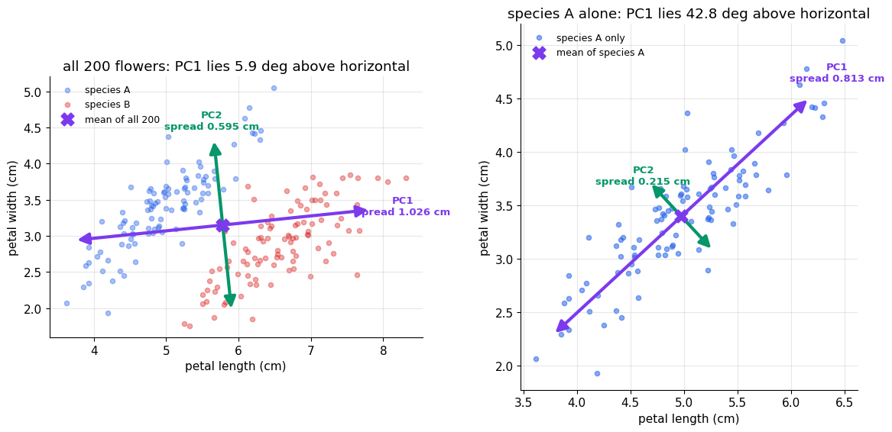

**Output**

```text
POOLED (all 200 flowers)
  PC1 [0.9947 0.1027]  spread sqrt(1.05249) = 1.0259 cm     5.90 deg above horizontal
  PC2 [-0.1027  0.9947]  spread sqrt(0.35435) = 0.5953 cm
  PC1 is 1.72x wider than PC2.
  correlation between the two measurements = 0.1160  (weak)

SPECIES A ALONE
  PC1 [0.734  0.6791]    42.78 deg above horizontal
  correlation between the two measurements = 0.8688  (strong -- THIS is the lean)
  angle between pooled PC1 and species-A PC1 = 36.88 degrees

BRUTE FORCE over 3601 directions, no eigenvectors used:
  widest direction found = [0.9947 0.1028]   variance 1.052494
  PC1 from eigh          = [0.9947 0.1027]   eigenvalue 1.052494
  angle between them     = 0.0044 degrees
```

### Cell 264

```python
# ============================================================
#  PCA STEP 5 -- PROJECT onto PC1        (Part 3: projection)
#  PCA STEP 6 -- EXPLAINED VARIANCE RATIO
# ============================================================
# Part 3: the projection of xc onto v is  (xc . v)/(v . v) * v.
# Here |v| = 1, so v . v = 1 and the scalar is just the dot product.
print(f"pc1 . pc1 = {pc1 @ pc1:.10f}  -> unit length, so the denominator is 1")

scores = Xc @ pc1                 # one number per flower: position along PC1
print(f"scores.shape = {scores.shape}  -- 200 flowers, ONE number each. "
      f"2D data, now 1D.")
print(f"first five scores: {scores[:5].round(4)}")

# the same thing done the long way, for one flower, straight from Part 3:
i = 0
long_way = (Xc[i] @ pc1) / (pc1 @ pc1)
print(f"\nflower 0 the long way: (Xc[0].pc1)/(pc1.pc1) = {long_way:.6f}")
print(f"flower 0 from the batch:                       = {scores[i]:.6f}")

# --- explained variance ratio -----------------------------------------
EVR = evals / evals.sum()
print(f"\nEXPLAINED VARIANCE RATIO")
print(f"  total variance in the data (trace of C) = {evals.sum():.6f}")
for k in range(2):
    print(f"  PC{k+1}: eigenvalue {evals[k]:.6f}  ->  {EVR[k] * 100:6.2f}% of the total")
print(f"  they sum to {EVR.sum():.10f}")
print(f"\n  Keeping only PC1 keeps {EVR[0] * 100:.2f}% of the variance.")
print(f"  Dropping PC2 throws away  {EVR[1] * 100:.2f}%.")

fig, (axL, axR) = plt.subplots(1, 2, figsize=(11.0, 3.6))
for s, col, lab in [(0, C_F, "species A"), (1, C_SLOPE, "species B")]:
    m = species == s
    axL.scatter(scores[m], np.zeros(m.sum()) + (0.06 if s else -0.06),
                s=26, c=col, alpha=0.7, label=lab)
    axR.hist(scores[m], bins=26, color=col, alpha=0.6, label=lab)
axL.axhline(0, color=C_GREY, lw=1.2, zorder=0)
axL.set_yticks([]); axL.set_ylim(-0.35, 0.35)
axL.set_xlabel("position along PC1 (cm)")
axL.set_title("200 flowers on one number line")
axL.legend(frameon=False, fontsize=9)
axR.set_xlabel("position along PC1 (cm)"); axR.set_ylabel("count")
axR.set_title(f"the same scores as a histogram ({EVR[0] * 100:.1f}% of the variance)")
axR.legend(frameon=False, fontsize=9)
fig.tight_layout(); plt.show()
```

**Output**

```text
pc1 . pc1 = 1.0000000000  -> unit length, so the denominator is 1
scores.shape = (200,)  -- 200 flowers, ONE number each. 2D data, now 1D.
first five scores: [-1.7089 -0.942  -0.4414  0.5408 -0.6249]

flower 0 the long way: (Xc[0].pc1)/(pc1.pc1) = -1.708915
flower 0 from the batch:                       = -1.708915

EXPLAINED VARIANCE RATIO
  total variance in the data (trace of C) = 1.406841
  PC1: eigenvalue 1.052494  ->   74.81% of the total
  PC2: eigenvalue 0.354347  ->   25.19% of the total
  they sum to 1.0000000000

  Keeping only PC1 keeps 74.81% of the variance.
  Dropping PC2 throws away  25.19%.
```

**Output**

```text
<Figure size 1100x360 with 2 Axes>
```

**Figure**

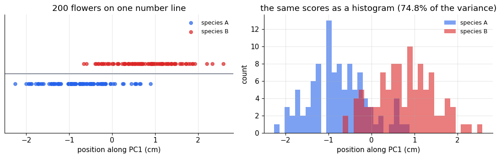

### Cell 267

```python
# ============================================================
#  PCA STEP 7 -- RECONSTRUCT from 1D, and measure what was lost
# ============================================================
# Does the eigenvalue really equal the variance of the scores?
scores2 = Xc @ pc2
print("IS THE EIGENVALUE THE VARIANCE ALONG THAT DIRECTION?")
print(f"  var(scores along PC1, ddof=1) = {np.var(scores,  ddof=1):.8f}")
print(f"  eigenvalue lambda_1           = {lam1:.8f}")
print(f"  var(scores along PC2, ddof=1) = {np.var(scores2, ddof=1):.8f}")
print(f"  eigenvalue lambda_2           = {lam2:.8f}")
print(f"  covariance of the two score sets = "
      f"{np.cov(scores, scores2, ddof=1)[0, 1]:.3e}  (zero: PCA de-correlated the data)")

# --- reconstruct: put each flower back at its point ON the PC1 line ---
Xc_hat = np.outer(scores, pc1)      # score * direction  (Part 3's projection vector)
X_hat  = Xc_hat + mu                # undo the centring (Part 4)

resid = X - X_hat
RMSE  = np.sqrt((resid ** 2).sum(axis=1).mean())
print(f"\nRECONSTRUCTION from 1 dimension back to 2")
print(f"  X_hat.shape = {X_hat.shape}  (2D again, but every point lies on one line)")
print(f"  mean distance from a flower to its reconstruction = "
      f"{np.linalg.norm(resid, axis=1).mean():.4f} cm")
print(f"  RMSE (root mean squared distance)                 = {RMSE:.4f} cm")
print(f"  worst single flower                               = "
      f"{np.linalg.norm(resid, axis=1).max():.4f} cm")

print(f"\n  The error is not arbitrary -- it is exactly the variance we dropped:")
print(f"    sum of squared residuals / (n-1) = {(resid ** 2).sum() / (n_obs - 1):.8f}")
print(f"    lambda_2                          = {lam2:.8f}")

fig, ax = plt.subplots(figsize=(6.6, 6.0))
for i in range(0, n_obs, 3):                       # every 3rd residual, for legibility
    ax.plot([X[i, 0], X_hat[i, 0]], [X[i, 1], X_hat[i, 1]],
            color=C_GREY, lw=0.7, alpha=0.6, zorder=1)
ax.scatter(*X.T,     s=20, c=C_SOFT,  edgecolors=C_GREY, linewidths=0.4,
           zorder=2, label="original flowers (2D)")
ax.scatter(*X_hat.T, s=20, c=C_EXACT, alpha=0.85, zorder=3,
           label="reconstructed from 1 number each")
ax.set_xlabel(FEATURES[0]); ax.set_ylabel(FEATURES[1])
ax.set_title(f"1D reconstruction: {EVR[0] * 100:.1f}% kept, RMSE {RMSE:.3f} cm")
ax.set_aspect("equal"); ax.legend(frameon=False, loc="upper left")
fig.tight_layout(); plt.show()
```

**Output**

```text
IS THE EIGENVALUE THE VARIANCE ALONG THAT DIRECTION?
  var(scores along PC1, ddof=1) = 1.05249425
  eigenvalue lambda_1           = 1.05249425
  var(scores along PC2, ddof=1) = 0.35434703
  eigenvalue lambda_2           = 0.35434703
  covariance of the two score sets = -3.345e-17  (zero: PCA de-correlated the data)

RECONSTRUCTION from 1 dimension back to 2
  X_hat.shape = (200, 2)  (2D again, but every point lies on one line)
  mean distance from a flower to its reconstruction = 0.4834 cm
  RMSE (root mean squared distance)                 = 0.5938 cm
  worst single flower                               = 1.8130 cm

  The error is not arbitrary -- it is exactly the variance we dropped:
    sum of squared residuals / (n-1) = 0.35434703
    lambda_2                          = 0.35434703
```

**Output**

```text
<Figure size 660x600 with 1 Axes>
```

**Figure**

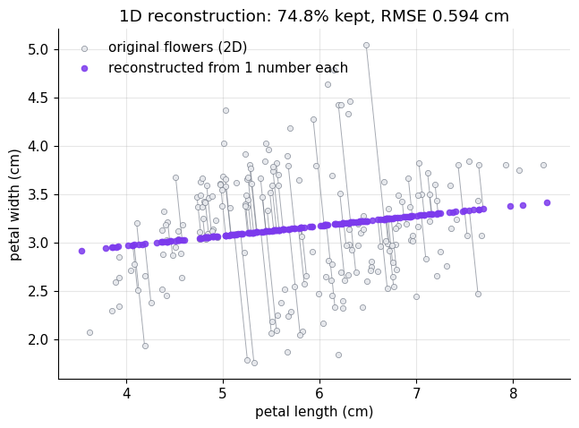

### Cell 269

```python
# ============================================================
#  THE MISTAKE EVERYONE MAKES: skipping the mean-centring.
#  If you eigen-decompose X^T X on RAW data, the top direction
#  points at the MEAN, not along the spread.
# ============================================================
C_raw = (X.T @ X) / (n_obs - 1)          # NOT centred -- deliberately wrong
ev_raw, V_raw = np.linalg.eigh(C_raw)
o = np.argsort(ev_raw)[::-1]
pc1_raw = V_raw[:, o[0]]
if pc1_raw @ mu < 0:                     # fix the arbitrary sign for the picture
    pc1_raw = -pc1_raw

mu_hat = mu / np.linalg.norm(mu)         # the direction of the mean, unit length
ang_to_mean = np.degrees(np.arccos(np.clip(abs(pc1_raw @ mu_hat), -1, 1)))
ang_to_pc1  = np.degrees(np.arccos(np.clip(abs(pc1_raw @ pc1),    -1, 1)))

print("UNCENTRED 'PCA' -- eigenvectors of X^T X without subtracting the mean")
print(f"  top direction, uncentred = {pc1_raw.round(4)}")
print(f"  direction of the mean    = {mu_hat.round(4)}")
print(f"  the real PC1 (centred)   = {pc1.round(4)}")
print(f"\n  angle from the uncentred direction to THE MEAN : {ang_to_mean:6.2f} degrees")
print(f"  angle from the uncentred direction to REAL PC1 : {ang_to_pc1:6.2f} degrees")
print(f"\n  It is pointing at the mean, not along the spread.")

fig, ax = plt.subplots(figsize=(6.4, 6.0))
ax.scatter(*X.T, s=18, c=C_SOFT, edgecolors=C_GREY, linewidths=0.4, label="flowers")
ax.scatter(0, 0, s=90, c="black", marker="s", zorder=5, label="origin (0, 0)")
ax.scatter(*mu, s=140, c=C_EXACT, marker="X", zorder=5, label="mean")
ax.annotate("", xy=8.0 * pc1_raw, xytext=(0, 0),
            arrowprops=dict(arrowstyle="-|>", lw=3, color=C_SLOPE, mutation_scale=20))
ax.text(*(8.3 * pc1_raw), "uncentred\ntop direction", color=C_SLOPE,
        fontsize=10, weight="bold", ha="center")
ax.annotate("", xy=mu + 1.7 * np.sqrt(lam1) * pc1, xytext=mu - 1.7 * np.sqrt(lam1) * pc1,
            arrowprops=dict(arrowstyle="<|-|>", lw=3, color=C_AREA, mutation_scale=18))
ax.text(*(mu + 2.1 * np.sqrt(lam1) * pc1), "real PC1\n(centred)", color=C_AREA,
        fontsize=10, weight="bold", ha="center")
ax.set_xlim(-0.6, 9.0); ax.set_ylim(-0.6, 6.2)
ax.set_xlabel(FEATURES[0]); ax.set_ylabel(FEATURES[1])
ax.set_title("Skip the centring and you measure position, not spread")
ax.set_aspect("equal"); ax.legend(frameon=False, loc="upper left", fontsize=9)
fig.tight_layout(); plt.show()
```

**Output**

```text
UNCENTRED 'PCA' -- eigenvectors of X^T X without subtracting the mean
  top direction, uncentred = [0.8809 0.4734]
  direction of the mean    = [0.8782 0.4784]
  the real PC1 (centred)   = [0.9947 0.1027]

  angle from the uncentred direction to THE MEAN :   0.32 degrees
  angle from the uncentred direction to REAL PC1 :  22.36 degrees

  It is pointing at the mean, not along the spread.
```

**Output**

```text
<Figure size 640x600 with 1 Axes>
```

**Figure**

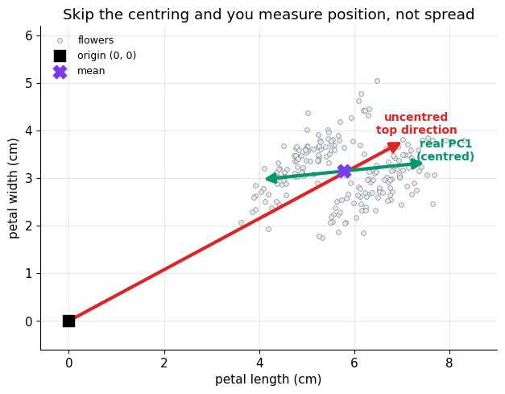

### Cell 271

```python
# ============================================================
#  VERIFY THE WHOLE THING against machinery we did not write.
#  SVD always (it is fast and always available); sklearn too if
#  it imports -- guarded, because importing it is slow and it may
#  not be installed. A failure here must not break the notebook.
# ============================================================
# --- independent route 1: the SVD of the centred data -----------------
U, S, Vt = np.linalg.svd(Xc, full_matrices=False)
svd_evals = S ** 2 / (n_obs - 1)
svd_pc1   = Vt[0]
print("CHECK 1 -- np.linalg.svd on the centred data (no covariance matrix built)")
print(f"  eigenvalues from eigh : {evals.round(8)}")
print(f"  s^2/(n-1) from svd    : {svd_evals.round(8)}")
print(f"  max difference        : {np.abs(evals - svd_evals).max():.3e}")
print(f"  |PC1_eigh . PC1_svd|  : {abs(pc1 @ svd_pc1):.10f}   (1 = same line;"
      f" sign is arbitrary)")

# --- independent route 2: scikit-learn, if it is here -----------------
print("\nCHECK 2 -- scikit-learn's PCA")
try:
    from sklearn.decomposition import PCA as SKPCA
    sk = SKPCA(n_components=2).fit(X)                # sklearn centres internally
    print(f"  sklearn explained_variance_       : {sk.explained_variance_.round(8)}")
    print(f"  ours (eigenvalues)                : {evals.round(8)}")
    print(f"  sklearn explained_variance_ratio_ : {sk.explained_variance_ratio_.round(8)}")
    print(f"  ours (EVR)                        : {EVR.round(8)}")
    print(f"  |PC1_ours . PC1_sklearn|          : {abs(pc1 @ sk.components_[0]):.10f}")
    sk_scores = sk.transform(X)[:, 0]
    print(f"  scores agree (up to sign)         : "
          f"{np.allclose(np.abs(sk_scores), np.abs(scores))}")
    print(f"  largest score disagreement        : "
          f"{np.abs(np.abs(sk_scores) - np.abs(scores)).max():.3e}")
    SKLEARN_OK = True
except Exception as e:
    SKLEARN_OK = False
    print(f"  scikit-learn is not usable here ({type(e).__name__}: {e}).")
    print(f"  SKIPPED -- the SVD check above is independent of our eigh route")
    print(f"  and already confirms the result, so nothing is left unverified.")

print(f"\nsklearn cross-check performed: {SKLEARN_OK}")
print(f"\nFINAL PCA SUMMARY")
print(f"  PC1                        = {pc1.round(4)}")
print(f"  explained variance ratio   = {EVR[0] * 100:.2f}% (PC1), {EVR[1] * 100:.2f}% (PC2)")
print(f"  reconstruction RMSE from 1D = {RMSE:.4f} cm")
```

**Output**

```text
CHECK 1 -- np.linalg.svd on the centred data (no covariance matrix built)
  eigenvalues from eigh : [1.05249425 0.35434703]
  s^2/(n-1) from svd    : [1.05249425 0.35434703]
  max difference        : 6.661e-16
  |PC1_eigh . PC1_svd|  : 1.0000000000   (1 = same line; sign is arbitrary)

CHECK 2 -- scikit-learn's PCA
  sklearn explained_variance_       : [1.05249425 0.35434703]
  ours (eigenvalues)                : [1.05249425 0.35434703]
  sklearn explained_variance_ratio_ : [0.74812579 0.25187421]
  ours (EVR)                        : [0.74812579 0.25187421]
  |PC1_ours . PC1_sklearn|          : 1.0000000000
  scores agree (up to sign)         : True
  largest score disagreement        : 5.440e-15

sklearn cross-check performed: True

FINAL PCA SUMMARY
  PC1                        = [0.9947 0.1027]
  explained variance ratio   = 74.81% (PC1), 25.19% (PC2)
  reconstruction RMSE from 1D = 0.5938 cm
```

