# 07 — Linear Algebra 3

**Status:** Executed successfully

## Code and Output

### Cell 3

```python
# ============================================================
#  Setup — the toolkit and the house style for this series
# ============================================================
# Everything here is pre-installed on Colab. Nothing to download.
import sys, math, json, textwrap, random, warnings
import numpy as np
import matplotlib.pyplot as plt
import matplotlib.patches as mpatches
from matplotlib.patches import FancyBboxPatch, FancyArrowPatch, Circle, Polygon
from matplotlib.colors import LinearSegmentedColormap

warnings.filterwarnings("ignore")

# ---- reproducibility -------------------------------------------------
SEED = 7
rng = np.random.default_rng(SEED)
random.seed(SEED)
np.random.seed(SEED)

# ---- the colour grammar, used identically in all four notebooks ------
# Learn these five and every figure in the series reads at a glance.
C_DATA  = "#2563EB"   # blue    — data, inputs, what we are given
C_MODEL = "#7C3AED"   # purple  — the model, parameters, transformations
C_PRED  = "#EA7317"   # orange  — predictions, what the model says
C_TRUE  = "#15803D"   # green   — ground truth, the target, the right answer
C_ERR   = "#DC2626"   # red     — error, loss, the gap we are closing
C_GREY  = "#64748B"   # slate   — structure, axes, annotation
C_SOFT  = "#F1F5F9"   # near-white fill

plt.rcParams.update({
    "figure.dpi": 110,
    "font.size": 11,
    "axes.titlesize": 13,
    "axes.titleweight": "bold",
    "axes.labelsize": 11,
    "axes.edgecolor": C_GREY,
    "axes.grid": True,
    "grid.alpha": 0.25,
    "grid.linestyle": "-",
    "legend.frameon": True,
    "legend.framealpha": 0.92,
    "figure.facecolor": "white",
})

print("Toolkit ready.")
print(f"NumPy {np.__version__} | Matplotlib {plt.matplotlib.__version__}")
print(f"Random seed pinned to {SEED} — your numbers will match the text exactly.")
```

**Output**

```text
Toolkit ready.
NumPy 2.1.3 | Matplotlib 3.10.0
Random seed pinned to 7 — your numbers will match the text exactly.
```

### Cell 4

```python
# ============================================================
#  Drawing helpers — used by every figure in the series
# ============================================================
# Read these once. After this cell, every diagram is three lines.

def box(ax, x, y, w, h, text, fc=C_SOFT, ec=C_GREY, fs=10, tc="#0F172A",
        lw=1.8, bold=False, alpha=1.0):
    """A rounded label box centred on (x, y). Returns its centre."""
    ax.add_patch(FancyBboxPatch((x - w/2, y - h/2), w, h,
                                boxstyle="round,pad=0.02,rounding_size=0.08",
                                fc=fc, ec=ec, lw=lw, zorder=2, alpha=alpha))
    ax.text(x, y, text, ha="center", va="center", fontsize=fs, color=tc,
            zorder=3, fontweight="bold" if bold else "normal", linespacing=1.4)
    return (x, y)

def arrow(ax, p0, p1, color=C_GREY, rad=0.0, lw=2.0, label=None, ls="-",
          label_off=(0, 0.12), fs=9, style="-|>", ms=16):
    """A (optionally curved, optionally labelled) arrow from p0 to p1."""
    ax.add_patch(FancyArrowPatch(p0, p1, arrowstyle=style, mutation_scale=ms,
                                 color=color, lw=lw, linestyle=ls, zorder=1,
                                 connectionstyle=f"arc3,rad={rad}",
                                 shrinkA=7, shrinkB=9))
    if label:
        mx, my = (p0[0] + p1[0]) / 2, (p0[1] + p1[1]) / 2
        ax.text(mx + label_off[0], my + label_off[1], label, ha="center",
                va="center", fontsize=fs, color=color, style="italic",
                bbox=dict(fc="white", ec="none", alpha=0.88, pad=1.6), zorder=4)

def stage(ax, xlim=(0, 10), ylim=(0, 6), title=None):
    """Turn an Axes into a blank drawing stage."""
    ax.set_xlim(*xlim); ax.set_ylim(*ylim); ax.axis("off")
    if title:
        ax.set_title(title, pad=12)
    return ax

def tidy(ax, xlabel=None, ylabel=None, title=None, legend=False):
    """Consistent finishing touches for a plotted (non-diagram) Axes."""
    if xlabel: ax.set_xlabel(xlabel)
    if ylabel: ax.set_ylabel(ylabel)
    if title:  ax.set_title(title)
    ax.spines[["top", "right"]].set_visible(False)
    if legend: ax.legend(fontsize=9)
    return ax

print("Drawing helpers ready: box(), arrow(), stage(), tidy()")
```

**Output**

```text
Drawing helpers ready: box(), arrow(), stage(), tidy()
```

### Cell 6

```python
# ============================================================
#  The transformation-drawing kit (used by Parts 1-6)
# ============================================================
# The idea: build a grid of straight lines, push every point of every line
# through a matrix, and redraw. Because the transformation is LINEAR, the
# lines stay straight and evenly spaced -- so the picture tells the whole story.

def grid_lines(limit=3, n=61, samples=60):
    """Return a list of (x, y) polylines forming a square grid.

    We build the SOURCE grid over a generously wide range (3x the window we
    display) and sample it finely. A transformation that stretches space
    spreads the lines apart, so a coarse source grid would leave the picture
    looking empty -- this way the visible frame stays filled whether the
    matrix expands or contracts.
    """
    span  = limit * 3
    ticks = np.linspace(-span, span, n)
    fine  = np.linspace(-span, span, samples)
    lines = []
    for t in ticks:
        lines.append(np.c_[fine, np.full_like(fine, t)])   # horizontal
        lines.append(np.c_[np.full_like(fine, t), fine])   # vertical
    return lines

def draw_transform(ax, A, limit=3, title=None, show_basis=True,
                   show_unit_square=True, grid_color=None):
    """Draw the grid AFTER applying the 2x2 matrix A, plus the landed basis vectors."""
    A = np.asarray(A, dtype=float)
    gc = grid_color or C_GREY

    # ── the transformed grid ──
    for line in grid_lines(limit):
        out = line @ A.T                       # apply A to every point on the line
        ax.plot(out[:, 0], out[:, 1], color=gc, lw=0.9, alpha=0.45, zorder=1)

    # ── the unit square, carried along ──
    if show_unit_square:
        square = np.array([[0, 0], [1, 0], [1, 1], [0, 1]], float)
        ax.add_patch(Polygon(square @ A.T, closed=True, fc=C_MODEL,
                             ec=C_MODEL, alpha=0.20, lw=2, zorder=2))

    # ── where the basis vectors landed = the COLUMNS of A ──
    if show_basis:
        for vec, col, name in [(A[:, 0], C_DATA, r"$\hat{\imath}$"),
                               (A[:, 1], C_PRED, r"$\hat{\jmath}$")]:
            ax.annotate("", xy=vec, xytext=(0, 0),
                        arrowprops=dict(arrowstyle="-|>", color=col, lw=3,
                                        mutation_scale=18), zorder=5)
            ax.text(vec[0] * 1.12 + 0.08, vec[1] * 1.12 + 0.08, name,
                    color=col, fontsize=14, fontweight="bold", zorder=6)

    ax.axhline(0, color="#334155", lw=1.1, zorder=3)
    ax.axvline(0, color="#334155", lw=1.1, zorder=3)
    ax.set_aspect("equal")
    ax.set_xlim(-limit, limit); ax.set_ylim(-limit, limit)
    ax.set_xticks([]); ax.set_yticks([]); ax.grid(False)
    if title:
        ax.set_title(title, fontsize=11)
    return ax

print("Transformation kit ready: grid_lines(), draw_transform()")
print("Blue arrow = where î  landed   ·   Orange arrow = where ĵ  landed")
```

**Output**

```text
Transformation kit ready: grid_lines(), draw_transform()
Blue arrow = where î  landed   ·   Orange arrow = where ĵ  landed
```

### Cell 9

```python
# ============================================================
#  The columns ARE the landing spots — checked, not asserted
# ============================================================
A = np.array([[2.0, 0.0],
              [0.0, 3.0]])

i_hat = np.array([1.0, 0.0])
j_hat = np.array([0.0, 1.0])

print("Where do the basis vectors land?")
print("=" * 52)
print(f"  A @ î  = {A @ i_hat}     first  column of A = {A[:, 0]}")
print(f"  A @ ĵ  = {A @ j_hat}     second column of A = {A[:, 1]}")
print(f"\n  identical? {np.allclose(A @ i_hat, A[:, 0]) and np.allclose(A @ j_hat, A[:, 1])}")

x = np.array([3.0, 1.0])
print()
print("And an arbitrary point, two ways:")
print("=" * 52)
print(f"  row-dot-product rule       A @ x           = {A @ x}")
print(f"  weighted sum of columns    3·col1 + 1·col2 = {3 * A[:, 0] + 1 * A[:, 1]}")
print()
print("  Same answer, because they are the same operation seen from two sides.")
```

**Output**

```text
Where do the basis vectors land?
====================================================
  A @ î  = [2. 0.]     first  column of A = [2. 0.]
  A @ ĵ  = [0. 3.]     second column of A = [0. 3.]

  identical? True

And an arbitrary point, two ways:
====================================================
  row-dot-product rule       A @ x           = [6. 3.]
  weighted sum of columns    3·col1 + 1·col2 = [6. 3.]

  Same answer, because they are the same operation seen from two sides.
```

### Cell 11

```python
# ============================================================
#  Figure: the same grid, before and after
# ============================================================
fig, axes = plt.subplots(1, 2, figsize=(11.4, 5.6))

# BOTH panels use the SAME window, so the growth is honestly visible
draw_transform(axes[0], np.eye(2), limit=7.0,
               title="BEFORE — the identity\nî = [1,0]   ĵ = [0,1]")
draw_transform(axes[1], A, limit=7.0,
               title="AFTER — A = [[2,0],[0,3]]\nî → [2,0]   ĵ → [0,3]")

# follow one specific point through the transformation
for ax, pt in [(axes[0], x), (axes[1], A @ x)]:
    ax.scatter(*pt, s=150, color=C_ERR, zorder=7, edgecolor="white", lw=1.8)
    ax.text(pt[0] + 0.22, pt[1] + 0.32, f"({pt[0]:.0f}, {pt[1]:.0f})",
            color=C_ERR, fontsize=10.5, fontweight="bold", zorder=8)

fig.suptitle("A matrix is a function that moves every point at once",
             fontsize=13, fontweight="bold", y=0.99)
plt.tight_layout(); plt.show()
```

**Output**

```text
<Figure size 1254x616 with 2 Axes>
```

**Figure**

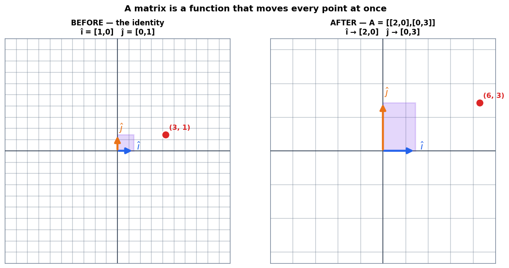

### Cell 14

```python
# ============================================================
#  Figure: scale, rotate, shear, collapse
# ============================================================
transforms = [
    (np.array([[2., 0.], [0., 3.]]),  "SCALE",    "stretch x by 2, y by 3",      C_DATA),
    (np.array([[0., -1.], [1., 0.]]), "ROTATE",   "a quarter turn, no distortion", C_MODEL),
    (np.array([[1., 1.], [0., 1.]]),  "SHEAR",    "verticals tilt, horizontals stay", C_PRED),
    (np.array([[1., 2.], [2., 4.]]),  "COLLAPSE", "column 2 = 2 × column 1",      C_ERR),
]

fig, axes = plt.subplots(1, 4, figsize=(15.2, 4.3))
corner = np.array([1.0, 1.0])
for ax, (M, name, sub, col) in zip(axes, transforms):
    draw_transform(ax, M, limit=4, title=f"{name}\n{sub}")
    landed = M @ corner
    ax.scatter(*landed, s=130, color=C_ERR, zorder=8, edgecolor="white", lw=1.6)
    ax.text(0.03, 0.03, f"[1,1] → [{landed[0]:.0f}, {landed[1]:.0f}]",
            transform=ax.transAxes, fontsize=9.4, color=C_ERR, fontweight="bold")
    ax.set_title(f"{name}\n{sub}", fontsize=10.5, color=col)

plt.tight_layout(); plt.show()

print("The corner [1,1] under each transformation:")
for M, name, _, _ in transforms:
    print(f"   {name:<9} -> {(M @ corner).round(2).tolist()}")
```

**Output**

```text
<Figure size 1672x473 with 4 Axes>
```

**Figure**

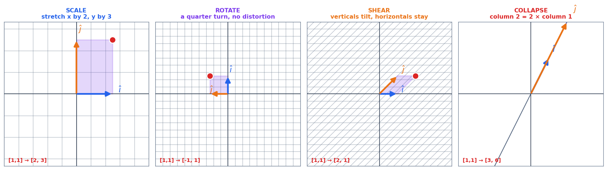

**Output**

```text
The corner [1,1] under each transformation:
   SCALE     -> [2.0, 3.0]
   ROTATE    -> [-1.0, 1.0]
   SHEAR     -> [2.0, 1.0]
   COLLAPSE  -> [3.0, 6.0]
```

### Cell 17

```python
# ============================================================
#  A non-square matrix changes the dimension
# ============================================================
B = np.array([[1.0, 0.0, 2.0],
              [0.0, 1.0, 1.0]])          # 2x3: maps R³ -> R²
x3 = np.array([1.0, 2.0, 3.0])

print(f"B has shape {B.shape}  ->  it maps R^{B.shape[1]} to R^{B.shape[0]}")
print(f"  B @ x = {B @ x3}")
print(f"  weighted columns: 1·{B[:,0]} + 2·{B[:,1]} + 3·{B[:,2]} = {1*B[:,0] + 2*B[:,1] + 3*B[:,2]}")
print()

# Information really is destroyed: find another input with the same output
x3_other = x3 + np.array([2.0, 1.0, -1.0])       # a direction B sends to zero
print("Two DIFFERENT 3-D inputs, one identical 2-D output:")
print(f"   B @ {x3.tolist()}       = {B @ x3}")
print(f"   B @ {x3_other.tolist()}  = {B @ x3_other}")
print(f"   inputs equal? {np.allclose(x3, x3_other)}    outputs equal? {np.allclose(B @ x3, B @ x3_other)}")
print()
print("Given only the output [7,5], you cannot say which input produced it.")
print("That is what 'losing a dimension' costs.")
```

**Output**

```text
B has shape (2, 3)  ->  it maps R^3 to R^2
  B @ x = [7. 5.]
  weighted columns: 1·[1. 0.] + 2·[0. 1.] + 3·[2. 1.] = [7. 5.]

Two DIFFERENT 3-D inputs, one identical 2-D output:
   B @ [1.0, 2.0, 3.0]       = [7. 5.]
   B @ [3.0, 3.0, 2.0]  = [7. 5.]
   inputs equal? False    outputs equal? True

Given only the output [7,5], you cannot say which input produced it.
That is what 'losing a dimension' costs.
```

### Cell 19

```python
# ============================================================
#  Trap 2, demonstrated: rotate-then-shear ≠ shear-then-rotate
# ============================================================
R = np.array([[0., -1.], [1., 0.]])      # rotate 90°
S = np.array([[1., 1.], [0., 1.]])       # shear

print("R @ S  (shear FIRST, then rotate):")
print(R @ S)
print("\nS @ R  (rotate FIRST, then shear):")
print(S @ R)
print(f"\nEqual? {np.allclose(R @ S, S @ R)}")

fig, axes = plt.subplots(1, 3, figsize=(12.6, 4.3))
draw_transform(axes[0], np.eye(2), limit=3, title="start")
draw_transform(axes[1], R @ S, limit=3, title="R @ S\nshear, then rotate")
draw_transform(axes[2], S @ R, limit=3, title="S @ R\nrotate, then shear")
plt.tight_layout(); plt.show()
```

**Output**

```text
R @ S  (shear FIRST, then rotate):
[[ 0. -1.]
 [ 1.  1.]]

S @ R  (rotate FIRST, then shear):
[[ 1. -1.]
 [ 1.  0.]]

Equal? False
```

**Output**

```text
<Figure size 1386x473 with 3 Axes>
```

**Figure**

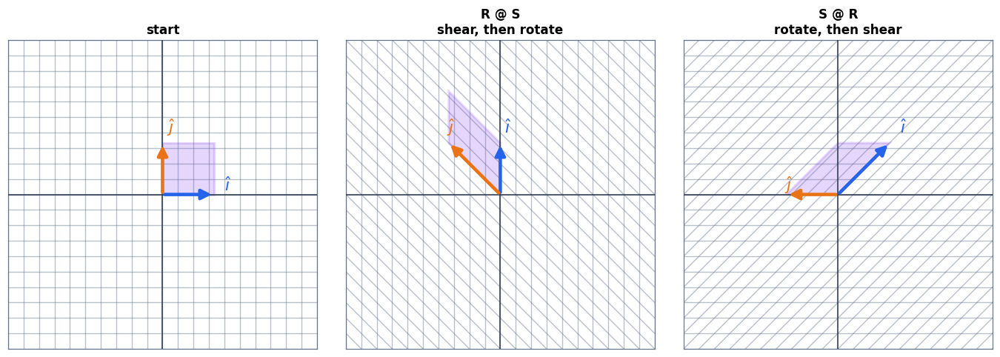

### Cell 24

```python
# ============================================================
#  The dot product, three ways — all the same number
# ============================================================
a = np.array([3.0, 4.0])
xv = np.array([2.0, 1.0])

algebraic = (a * xv).sum()
as_matrix = (a.reshape(1, 2) @ xv.reshape(2, 1)).item()
cos_theta = algebraic / (np.linalg.norm(a) * np.linalg.norm(xv))
geometric = np.linalg.norm(a) * np.linalg.norm(xv) * cos_theta

print("a =", a.tolist(), "   x =", xv.tolist())
print("=" * 56)
print(f"  algebraic   Σ aᵢxᵢ            = {algebraic:.4f}")
print(f"  as a matrix [3 4] @ [2;1]     = {as_matrix:.4f}")
print(f"  geometric   |a||x|cos θ       = {geometric:.4f}")
print(f"\n  angle between them: θ = {np.degrees(np.arccos(cos_theta)):.2f}°")
print()
print(f"  |a| = √(9+16) = {np.linalg.norm(a):.0f}   (a clean 3-4-5 triangle, chosen on purpose)")
print(f"  So the PROJECTION of x onto a's direction = {algebraic}/{np.linalg.norm(a):.0f} = "
      f"{algebraic / np.linalg.norm(a):.1f}")
```

**Output**

```text
a = [3.0, 4.0]    x = [2.0, 1.0]
========================================================
  algebraic   Σ aᵢxᵢ            = 10.0000
  as a matrix [3 4] @ [2;1]     = 10.0000
  geometric   |a||x|cos θ       = 10.0000

  angle between them: θ = 26.57°

  |a| = √(9+16) = 5   (a clean 3-4-5 triangle, chosen on purpose)
  So the PROJECTION of x onto a's direction = 10.0/5 = 2.0
```

### Cell 26

```python
# ============================================================
#  Figure: the dot product as a shadow
# ============================================================
fig, (ax1, ax2) = plt.subplots(1, 2, figsize=(12.6, 5.0))

# ── left: the projection picture ──
a_hat = a / np.linalg.norm(a)
proj_len = algebraic / np.linalg.norm(a)
proj_pt = proj_len * a_hat

ax1.axhline(0, color=C_GREY, lw=1); ax1.axvline(0, color=C_GREY, lw=1)
# the line through a, extended
tt = np.linspace(-0.6, 1.25, 10)
ax1.plot(tt * a[0], tt * a[1], color=C_MODEL, lw=1.2, ls=":", alpha=0.8)
ax1.annotate("", xy=a, xytext=(0, 0),
             arrowprops=dict(arrowstyle="-|>", color=C_MODEL, lw=3.2, mutation_scale=20))
ax1.annotate("", xy=xv, xytext=(0, 0),
             arrowprops=dict(arrowstyle="-|>", color=C_DATA, lw=3.2, mutation_scale=20))
# the shadow
ax1.plot([xv[0], proj_pt[0]], [xv[1], proj_pt[1]], color=C_GREY, lw=1.6, ls="--")
ax1.annotate("", xy=proj_pt, xytext=(0, 0),
             arrowprops=dict(arrowstyle="-|>", color=C_PRED, lw=4.5, mutation_scale=18))
ax1.text(a[0] + 0.12, a[1], "a = [3,4]\n|a| = 5", color=C_MODEL, fontsize=10.5, fontweight="bold")
ax1.text(xv[0] + 0.12, xv[1] + 0.1, "x = [2,1]", color=C_DATA, fontsize=10.5, fontweight="bold")
ax1.text(proj_pt[0] * 0.5 - 0.75, proj_pt[1] * 0.5 + 0.30,
         f"shadow = {proj_len:.0f}", color=C_PRED, fontsize=10.5, fontweight="bold",
         ha="center")
ax1.set_xlim(-1, 4.4); ax1.set_ylim(-1, 4.6); ax1.set_aspect("equal")
tidy(ax1, None, None, "a · x  =  |a| × (the shadow)  =  5 × 2  =  10")

# ── right: sweeping x around, watching the dot product ──
angles = np.linspace(0, 2 * np.pi, 400)
probe = np.c_[np.cos(angles), np.sin(angles)] * 2.5
dots = probe @ a
ax2.plot(np.degrees(angles), dots, color=C_MODEL, lw=2.6)
ax2.axhline(0, color=C_GREY, lw=1.4, ls="--")
ax2.fill_between(np.degrees(angles), 0, dots, where=dots > 0, color=C_TRUE, alpha=0.16)
ax2.fill_between(np.degrees(angles), 0, dots, where=dots < 0, color=C_ERR, alpha=0.16)
theta_a = np.degrees(np.arctan2(a[1], a[0]))
for ang, lab, col in [(theta_a, "aligned\n(max)", C_TRUE),
                      (theta_a + 90, "perpendicular\n(zero)", C_GREY),
                      (theta_a + 180, "opposed\n(min)", C_ERR)]:
    ax2.axvline(ang % 360, color=col, ls=":", lw=1.6)
    ax2.text((ang % 360) + 4, 15.6, lab, color=col, fontsize=8.8, fontweight="bold")
ax2.set_ylim(-16, 21)
tidy(ax2, "angle of a probe vector x (degrees)", "a · x",
     "Sweep x around: the dot product reads alignment")

plt.tight_layout(); plt.show()
```

**Output**

```text
<Figure size 1386x550 with 2 Axes>
```

**Figure**

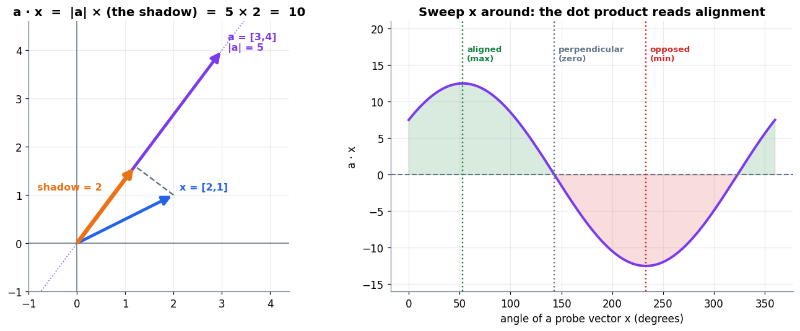

### Cell 29

```python
# ============================================================
#  When the bigger dot product is the WORSE match
# ============================================================
q  = np.array([1.0, 0.0])       # the query
d1 = np.array([1.0, 0.0])       # points exactly along the query
d2 = np.array([10.0, 1.0])      # tilted off-axis, but ten times longer

def cosine(u, v):
    return (u @ v) / (np.linalg.norm(u) * np.linalg.norm(v))

print(f"{'':<6}{'raw dot':>10}{'cosine':>10}{'angle':>10}")
print("-" * 38)
for name, d in [("d1", d1), ("d2", d2)]:
    ang = np.degrees(np.arccos(np.clip(cosine(q, d), -1, 1)))
    print(f"{name:<6}{q @ d:>10.2f}{cosine(q, d):>10.4f}{ang:>9.1f}°")
print("-" * 38)
print("Raw dot product says d2 wins by 10x.")
print("Cosine says d1 is a PERFECT match (angle 0°) and d2 is slightly off.")
print()
print("The raw dot product rewarded SIZE, not agreement.")
print("Cosine similarity divides the lengths out and compares direction alone:")
print("      cos θ = (a·x) / (|a| |x|)      always in [-1, 1]")
```

**Output**

```text
         raw dot    cosine     angle
--------------------------------------
d1          1.00    1.0000      0.0°
d2         10.00    0.9950      5.7°
--------------------------------------
Raw dot product says d2 wins by 10x.
Cosine says d1 is a PERFECT match (angle 0°) and d2 is slightly off.

The raw dot product rewarded SIZE, not agreement.
Cosine similarity divides the lengths out and compares direction alone:
      cos θ = (a·x) / (|a| |x|)      always in [-1, 1]
```

### Cell 31

```python
# ============================================================
#  A neuron, in full: one dot product and a bias
# ============================================================
# Features of a suspicious email: [contains "free", number of links, is ALL CAPS]
feature_names = ["contains 'free'", "number of links", "is ALL CAPS"]
w_neuron = np.array([2.0, 0.5, 1.5])       # the LEARNED pattern
x_email  = np.array([1.0, 4.0, 0.0])       # this particular email

z = w_neuron @ x_email                      # or np.dot(w_neuron, x_email)

print("A single neuron weighing the evidence")
print("=" * 58)
print(f"{'feature':<20}{'w':>8}{'x':>8}{'contribution':>16}")
print("-" * 58)
for name, wi, xi in zip(feature_names, w_neuron, x_email):
    print(f"{name:<20}{wi:>8.1f}{xi:>8.1f}{wi * xi:>16.1f}")
print("-" * 58)
print(f"{'z = w · x':<20}{'':>16}{z:>16.1f}")
print()
print("'free' and the four links both pushed the score up.")
print("ALL CAPS contributed nothing — the feature was off (x = 0).")
print(f"The neuron collapsed a 3-D input to the single alignment score {z}.")
print()
print("Every neuron in every layer of every network does exactly this,")
print("at hardware speed, over vectors with hundreds or thousands of dimensions.")
```

**Output**

```text
A single neuron weighing the evidence
==========================================================
feature                    w       x    contribution
----------------------------------------------------------
contains 'free'          2.0     1.0             2.0
number of links          0.5     4.0             2.0
is ALL CAPS              1.5     0.0             0.0
----------------------------------------------------------
z = w · x                                        4.0

'free' and the four links both pushed the score up.
ALL CAPS contributed nothing — the feature was off (x = 0).
The neuron collapsed a 3-D input to the single alignment score 4.0.

Every neuron in every layer of every network does exactly this,
at hardware speed, over vectors with hundreds or thousands of dimensions.
```

### Cell 35

```python
# ============================================================
#  A 3x3 transformation: read the columns, predict the output
# ============================================================
A3 = np.array([[2.0, 0.0, 0.0],
               [0.0, 1.0, 0.0],
               [0.0, 0.0, 0.5]])       # stretch x, leave y, squash z
v3 = np.array([3.0, 4.0, 10.0])

print("The three columns say where the basis vectors land:")
print(f"   î  → {A3[:, 0]}")
print(f"   ĵ  → {A3[:, 1]}")
print(f"   k̂  → {A3[:, 2]}")
print()
print("So the point (3, 4, 10) must go to  3·col1 + 4·col2 + 10·col3 :")
print(f"   {3 * A3[:, 0]} + {4 * A3[:, 1]} + {10 * A3[:, 2]} = "
      f"{3 * A3[:, 0] + 4 * A3[:, 1] + 10 * A3[:, 2]}")
print(f"   NumPy agrees:  A3 @ v3 = {A3 @ v3}")
print()
print("The three landed arrows span a box (a parallelepiped).")
print(f"Its volume relative to the unit cube is 2 × 1 × 0.5 = {2 * 1 * 0.5}")
print("The cube got wider and flatter, but its VOLUME did not change.")
print("That number has a name, and it is the subject of Part 4.")
```

**Output**

```text
The three columns say where the basis vectors land:
   î  → [2. 0. 0.]
   ĵ  → [0. 1. 0.]
   k̂  → [0.  0.  0.5]

So the point (3, 4, 10) must go to  3·col1 + 4·col2 + 10·col3 :
   [6. 0. 0.] + [0. 4. 0.] + [0. 0. 5.] = [6. 4. 5.]
   NumPy agrees:  A3 @ v3 = [6. 4. 5.]

The three landed arrows span a box (a parallelepiped).
Its volume relative to the unit cube is 2 × 1 × 0.5 = 1.0
The cube got wider and flatter, but its VOLUME did not change.
That number has a name, and it is the subject of Part 4.
```

### Cell 36

```python
# ============================================================
#  Figure: the unit cube, before and after a 3-D transformation
# ============================================================
CUBE = np.array([[0,0,0],[1,0,0],[1,1,0],[0,1,0],
                 [0,0,1],[1,0,1],[1,1,1],[0,1,1]], float)
EDGES = [(0,1),(1,2),(2,3),(3,0),(4,5),(5,6),(6,7),(7,4),(0,4),(1,5),(2,6),(3,7)]

def draw_cube(ax, M, title, limit=2.4):
    pts = CUBE @ np.asarray(M, float).T
    for i, j in EDGES:
        ax.plot(*zip(pts[i], pts[j]), color=C_GREY, lw=1.5, alpha=0.75)
    for col, colr, name in [(0, C_DATA, "î"), (1, C_PRED, "ĵ"), (2, C_TRUE, "k̂")]:
        vec = np.asarray(M, float)[:, col]
        ax.plot(*zip([0, 0, 0], vec), color=colr, lw=3.4)
        ax.text(*(vec * 1.14), name, color=colr, fontsize=13, fontweight="bold")
    ax.set_xlim(-0.4, limit); ax.set_ylim(-0.4, limit); ax.set_zlim(-0.4, limit)
    ax.set_xticks([]); ax.set_yticks([]); ax.set_zticks([])
    ax.set_title(title, fontsize=11)
    ax.grid(False)

fig = plt.figure(figsize=(11.6, 5.2))
ax1 = fig.add_subplot(121, projection="3d")
ax2 = fig.add_subplot(122, projection="3d")
draw_cube(ax1, np.eye(3), "BEFORE — the unit cube\nvolume = 1")
draw_cube(ax2, A3, "AFTER — stretch x by 2, squash z by ½\nvolume = 2 × 1 × 0.5 = 1")
plt.tight_layout(); plt.show()
```

**Output**

```text
<Figure size 1276x572 with 2 Axes>
```

**Figure**

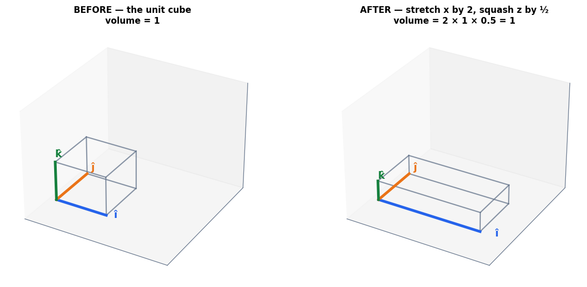

### Cell 39

```python
# ============================================================
#  Shape alone predicts the dimension change
# ============================================================
examples = [
    (np.random.default_rng(1).normal(size=(3, 3)), "square 3×3"),
    (np.random.default_rng(2).normal(size=(2, 3)), "wide 2×3"),
    (np.random.default_rng(3).normal(size=(3, 2)), "tall 3×2"),
]
print(f"{'matrix':<14}{'shape':>10}{'maps':>18}{'effect':>22}")
print("-" * 66)
for M, name in examples:
    m, n = M.shape
    effect = ("preserves dimension" if m == n else
              "LOWERS dimension" if m < n else "raises dimension")
    print(f"{name:<14}{str(M.shape):>10}{f'R^{n} → R^{m}':>18}{effect:>22}")

print()
print("A real network layer, sized like the first layer of an MNIST classifier:")
W_layer = np.zeros((128, 784))
print(f"   W.shape = {W_layer.shape}  ->  R^784 → R^128")
print(f"   a 28×28 image ({28*28} numbers) becomes a {W_layer.shape[0]}-number representation")
print(f"   {784 - 128} dimensions were deliberately discarded. That is the layer's job.")
```

**Output**

```text
matrix             shape              maps                effect
------------------------------------------------------------------
square 3×3        (3, 3)         R^3 → R^3   preserves dimension
wide 2×3          (2, 3)         R^3 → R^2      LOWERS dimension
tall 3×2          (3, 2)         R^2 → R^3      raises dimension

A real network layer, sized like the first layer of an MNIST classifier:
   W.shape = (128, 784)  ->  R^784 → R^128
   a 28×28 image (784 numbers) becomes a 128-number representation
   656 dimensions were deliberately discarded. That is the layer's job.
```

### Cell 41

```python
# ============================================================
#  A square matrix that still collapses — and the proof
# ============================================================
B3 = np.array([[1.0, 0.0, 1.0],
               [0.0, 1.0, 1.0],
               [1.0, 1.0, 2.0]])

print("B is 3×3, so on paper it maps R³ → R³.")
print(f"   column 3 = {B3[:, 2]}")
print(f"   column 1 + column 2 = {B3[:, 0] + B3[:, 1]}")
print(f"   the third column is redundant: {np.allclose(B3[:, 2], B3[:, 0] + B3[:, 1])}")
print()
print(f"   shape says   3 dimensions out")
print(f"   RANK says    {np.linalg.matrix_rank(B3)} dimensions out   <- the truth")
print(f"   determinant  {np.linalg.det(B3):.10f}   (the number Part 4 is about)")
print()

# The direction that gets crushed to nothing: the null space
null_dir = np.array([-1.0, -1.0, 1.0])
print("There is a whole LINE of inputs that B sends to the origin (the null space):")
print(f"   B @ {null_dir.tolist()} = {B3 @ null_dir}")
print()
print("Which means two different inputs collide on one output:")
p = np.array([1.0, 0.0, 0.0])
print(f"   B @ {p.tolist()}          = {B3 @ p}")
print(f"   B @ {(p + null_dir).tolist()}  = {B3 @ (p + null_dir)}")
print(f"   different inputs? {not np.allclose(p, p + null_dir)}"
      f"    identical outputs? {np.allclose(B3 @ p, B3 @ (p + null_dir))}")
print()
print("Once two inputs collide, NO inverse can exist — an inverse would have to")
print("send that one output back to two different places at once.")
```

**Output**

```text
B is 3×3, so on paper it maps R³ → R³.
   column 3 = [1. 1. 2.]
   column 1 + column 2 = [1. 1. 2.]
   the third column is redundant: True

   shape says   3 dimensions out
   RANK says    2 dimensions out   <- the truth
   determinant  0.0000000000   (the number Part 4 is about)

There is a whole LINE of inputs that B sends to the origin (the null space):
   B @ [-1.0, -1.0, 1.0] = [0. 0. 0.]

Which means two different inputs collide on one output:
   B @ [1.0, 0.0, 0.0]          = [1. 0. 1.]
   B @ [0.0, -1.0, 1.0]  = [1. 0. 1.]
   different inputs? True    identical outputs? True

Once two inputs collide, NO inverse can exist — an inverse would have to
send that one output back to two different places at once.
```

### Cell 42

```python
# ============================================================
#  Figure: three arrows that cannot cage any volume
# ============================================================
fig = plt.figure(figsize=(11.8, 5.2))

ax1 = fig.add_subplot(121, projection="3d")
draw_cube(ax1, A3, "HEALTHY — three independent directions\nthe box encloses volume", limit=2.4)

ax2 = fig.add_subplot(122, projection="3d")
pts = CUBE @ B3.T
for i, j in EDGES:
    ax2.plot(*zip(pts[i], pts[j]), color=C_GREY, lw=1.5, alpha=0.75)
for col, colr, name in [(0, C_DATA, "î"), (1, C_PRED, "ĵ"), (2, C_TRUE, "k̂")]:
    vec = B3[:, col]
    ax2.plot(*zip([0, 0, 0], vec), color=colr, lw=3.4)
    ax2.text(*(vec * 1.10), name, color=colr, fontsize=13, fontweight="bold")
# the plane the three arrows are trapped in
uu, vv = np.meshgrid(np.linspace(-0.3, 1.3, 6), np.linspace(-0.3, 1.3, 6))
plane = (uu[..., None] * B3[:, 0] + vv[..., None] * B3[:, 1])
ax2.plot_surface(plane[..., 0], plane[..., 1], plane[..., 2],
                 color=C_ERR, alpha=0.16, edgecolor="none")
ax2.set_xlim(-0.4, 2.4); ax2.set_ylim(-0.4, 2.4); ax2.set_zlim(-0.4, 2.4)
ax2.set_xticks([]); ax2.set_yticks([]); ax2.set_zticks([]); ax2.grid(False)
ax2.set_title("COLLAPSED — k̂ lands on the î / ĵ  plane\nthe box is flat: volume = 0", fontsize=11)

plt.tight_layout(); plt.show()
```

**Output**

```text
<Figure size 1298x572 with 2 Axes>
```

**Figure**

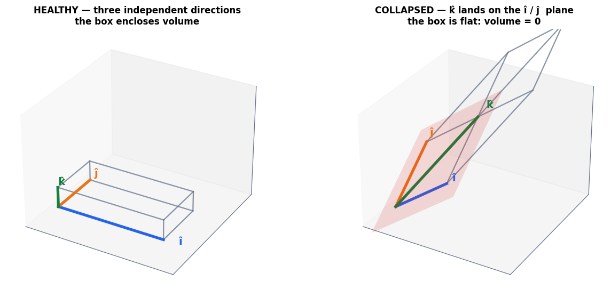

### Cell 47

```python
# ============================================================
#  Figure: three transformations, three area factors
# ============================================================
det_cases = [
    (np.array([[3., 0.], [0., 2.]]), "STRETCH",  "area × 6, orientation kept"),
    (np.array([[1., 1.], [0., 1.]]), "SHEAR",    "area × 1, orientation kept"),
    (np.array([[0., 1.], [1., 0.]]), "SWAP",     "area × 1, orientation FLIPPED"),
]

fig, axes = plt.subplots(1, 3, figsize=(13.6, 4.6))
unit_square = np.array([[0, 0], [1, 0], [1, 1], [0, 1]], float)

for ax, (M, name, sub) in zip(axes, det_cases):
    d = np.linalg.det(M)
    # the original square, faintly
    ax.add_patch(Polygon(unit_square, closed=True, fc=C_GREY, ec=C_GREY,
                         alpha=0.16, lw=1.4, ls="--"))
    # the image
    img = unit_square @ M.T
    face = C_TRUE if d > 0 else C_ERR
    ax.add_patch(Polygon(img, closed=True, fc=face, ec=face, alpha=0.28, lw=2.4))
    for col, colr, nm in [(0, C_DATA, "î"), (1, C_PRED, "ĵ")]:
        vec = M[:, col]
        ax.annotate("", xy=vec, xytext=(0, 0),
                    arrowprops=dict(arrowstyle="-|>", color=colr, lw=3, mutation_scale=17))
        ax.text(vec[0] * 1.1 + 0.06, vec[1] * 1.1 + 0.06, nm, color=colr,
                fontsize=13, fontweight="bold")
    ax.axhline(0, color="#334155", lw=1); ax.axvline(0, color="#334155", lw=1)
    ax.set_xlim(-0.6, 3.4); ax.set_ylim(-0.6, 2.6); ax.set_aspect("equal")
    ax.set_xticks([]); ax.set_yticks([]); ax.grid(False)
    ax.set_title(f"{name}\ndet = {d:+.0f}   ·   {sub}", fontsize=10.5,
                 color=C_TRUE if d > 0 else C_ERR)

fig.suptitle("The determinant is the area of the image of the unit square (signed)",
             fontsize=12.6, fontweight="bold", y=1.02)
plt.tight_layout(); plt.show()

print(f"{'matrix':<10}{'ad − bc':>12}{'np.linalg.det':>16}")
print("-" * 40)
for M, name, _ in det_cases:
    by_hand = M[0, 0] * M[1, 1] - M[0, 1] * M[1, 0]
    print(f"{name:<10}{by_hand:>12.1f}{np.linalg.det(M):>16.4f}")
```

**Output**

```text
<Figure size 1496x506 with 3 Axes>
```

**Figure**

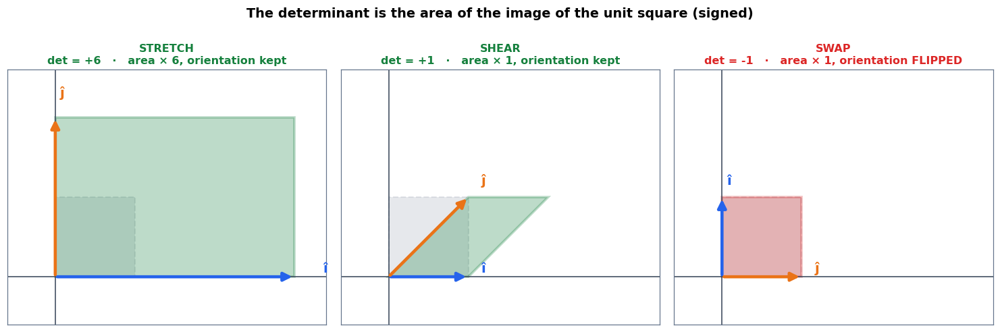

**Output**

```text
matrix         ad − bc   np.linalg.det
----------------------------------------
STRETCH            6.0          6.0000
SHEAR              1.0          1.0000
SWAP              -1.0         -1.0000
```

### Cell 50

```python
# ============================================================
#  det = 0: the plane flattened onto a line
# ============================================================
C = np.array([[2.0, 1.0],
              [4.0, 2.0]])

print(f"det(C) = {np.linalg.det(C):.10f}")
print(f"column 2 = {C[:, 1]}   =   0.5 × column 1 = {0.5 * C[:, 0]}")
print(f"rank = {np.linalg.matrix_rank(C)}  (not 2 — the plane became a line)")
print()
print("Two very different inputs, one identical output:")
for p in [np.array([1.0, 0.0]), np.array([0.0, 2.0])]:
    print(f"   C @ {p.tolist()}  =  {C @ p}")
print()
print("Given the output [2, 4], which input produced it? The question has")
print("infinitely many answers. The information is gone — not hidden, GONE.")

fig, (axL, axR) = plt.subplots(1, 2, figsize=(11.6, 4.8))
draw_transform(axL, np.array([[3., 0.], [0., 2.]]), limit=4,
               title="det = 6 — space survives\nevery output has ONE input")
draw_transform(axR, C, limit=5,
               title="det = 0 — space collapsed onto a line\ninfinitely many inputs per output")
# emphasise the surviving line
tt = np.linspace(-5, 5, 10)
axR.plot(tt, 2 * tt, color=C_ERR, lw=2.6, alpha=0.85, zorder=4)
plt.tight_layout(); plt.show()
```

**Output**

```text
det(C) = 0.0000000000
column 2 = [1. 2.]   =   0.5 × column 1 = [1. 2.]
rank = 1  (not 2 — the plane became a line)

Two very different inputs, one identical output:
   C @ [1.0, 0.0]  =  [2. 4.]
   C @ [0.0, 2.0]  =  [2. 4.]

Given the output [2, 4], which input produced it? The question has
infinitely many answers. The information is gone — not hidden, GONE.
```

**Output**

```text
<Figure size 1276x528 with 2 Axes>
```

**Figure**

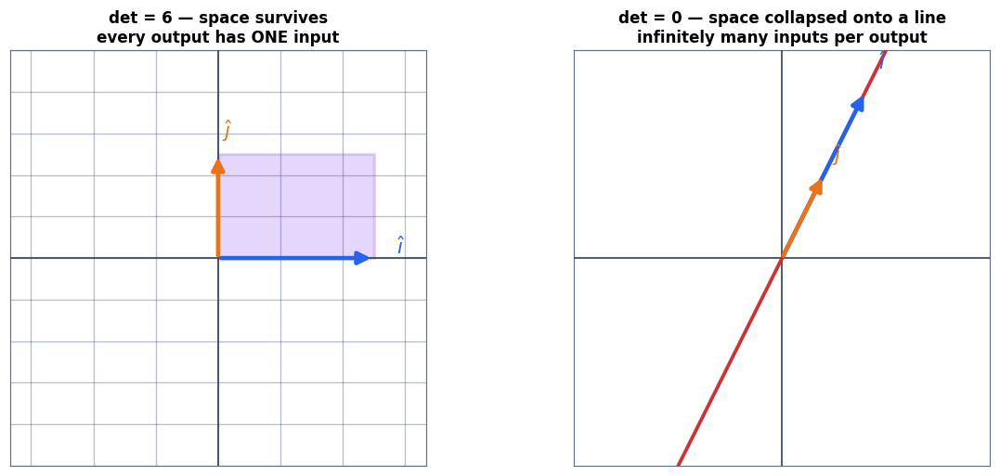

### Cell 53

```python
# ============================================================
#  det(BA) = det(B)·det(A), and one zero poisons the chain
# ============================================================
A_s = np.array([[3., 0.], [0., 2.]])     # det 6
B_s = np.array([[1., 1.], [0., 1.]])     # det 1
print("A stretch (det 6) followed by a shear (det 1):")
print(f"   det(A) × det(B) = {np.linalg.det(A_s):.1f} × {np.linalg.det(B_s):.1f} "
      f"= {np.linalg.det(A_s) * np.linalg.det(B_s):.1f}")
print(f"   det(B @ A)      = {np.linalg.det(B_s @ A_s):.1f}")
print()
print("Now put ONE collapsing stage anywhere in the chain:")
pipeline = [("stretch", A_s), ("collapse", C), ("shear", B_s)]
prod = np.eye(2)
for name, M in pipeline:
    prod = M @ prod
    print(f"   after {name:<9} det = {np.linalg.det(prod):>8.4f}")
print()
print("Once it hits zero it stays zero. No later stage can restore a lost dimension.")
```

**Output**

```text
A stretch (det 6) followed by a shear (det 1):
   det(A) × det(B) = 6.0 × 1.0 = 6.0
   det(B @ A)      = 6.0

Now put ONE collapsing stage anywhere in the chain:
   after stretch   det =   6.0000
   after collapse  det =   0.0000
   after shear     det =   0.0000

Once it hits zero it stays zero. No later stage can restore a lost dimension.
```

### Cell 57

```python
# ============================================================
#  The inverse, by formula and by NumPy — and what it undoes
# ============================================================
def inverse_2x2(M):
    """The closed form, written out so the determinant is visible."""
    (a, b), (c, d) = M
    det = a * d - b * c
    if np.isclose(det, 0):
        raise np.linalg.LinAlgError("det = 0 — this matrix has no inverse")
    return np.array([[d, -b], [-c, a]]) / det

A = np.array([[3.0, 1.0],
              [2.0, 4.0]])
A_inv_hand = inverse_2x2(A)

print(f"A =\n{A}\n")
print(f"det(A) = {np.linalg.det(A):.1f}\n")
print(f"A⁻¹ by the formula =\n{A_inv_hand.round(4)}\n")
print(f"A⁻¹ by NumPy       =\n{np.linalg.inv(A).round(4)}\n")
print(f"A⁻¹ @ A =\n{(A_inv_hand @ A).round(10)}   <- the identity")
print()

v = np.array([1.0, 2.0])
print("Round trip on a point:")
print(f"   start        {v}")
print(f"   after A      {A @ v}")
print(f"   after A⁻¹    {A_inv_hand @ (A @ v)}   <- back exactly where it started")
```

**Output**

```text
A =
[[3. 1.]
 [2. 4.]]

det(A) = 10.0

A⁻¹ by the formula =
[[ 0.4 -0.1]
 [-0.2  0.3]]

A⁻¹ by NumPy       =
[[ 0.4 -0.1]
 [-0.2  0.3]]

A⁻¹ @ A =
[[ 1.  0.]
 [-0.  1.]]   <- the identity

Round trip on a point:
   start        [1. 2.]
   after A      [ 5. 10.]
   after A⁻¹    [1. 2.]   <- back exactly where it started
```

### Cell 59

```python
# ============================================================
#  The collision that makes an inverse impossible
# ============================================================
S = np.array([[1.0, 2.0],
              [2.0, 4.0]])
p1 = np.array([2.0, 0.0])
p2 = np.array([0.0, 1.0])

print(f"det(S) = {np.linalg.det(S):.1f}")
print(f"   S @ {p1.tolist()} = {S @ p1}")
print(f"   S @ {p2.tolist()} = {S @ p2}")
print(f"   different inputs? {not np.allclose(p1, p2)}   same output? {np.allclose(S @ p1, S @ p2)}")
print()
try:
    np.linalg.inv(S)
except np.linalg.LinAlgError as e:
    print(f"np.linalg.inv(S) raises: {type(e).__name__}: {e}")
print()
print("An inverse must recover the input UNIQUELY from the output.")
print("A transformation can be inverted only if it is ONE-TO-ONE.")
print("Collapsing a dimension guarantees the opposite: inputs collide.")
```

**Output**

```text
det(S) = 0.0
   S @ [2.0, 0.0] = [2. 4.]
   S @ [0.0, 1.0] = [2. 4.]
   different inputs? True   same output? True

np.linalg.inv(S) raises: LinAlgError: Singular matrix

An inverse must recover the input UNIQUELY from the output.
A transformation can be inverted only if it is ONE-TO-ONE.
Collapsing a dimension guarantees the opposite: inputs collide.
```

### Cell 61

```python
# ============================================================
#  Figure: five faces of one fact
# ============================================================
fig, ax = plt.subplots(figsize=(11.6, 6.2))
stage(ax, (0, 11.6), (0, 6.4))

centre = box(ax, 5.8, 3.2, 3.1, 1.0, "det(A) ≠ 0", fc="#EDE9FE", ec=C_MODEL,
             fs=15, bold=True)
spokes = [
    (1.9, 5.3, "A is invertible\nA⁻¹ exists", C_TRUE),
    (9.7, 5.3, "columns are\nlinearly independent", C_DATA),
    (1.5, 1.2, "no collapse —\ndimension preserved", C_PRED),
    (10.1, 1.2, "Ax = 0 only\nwhen x = 0", "#0891B2"),
    (5.8, 5.7, "the map is\none-to-one", C_MODEL),
]
for x, y, text, col in spokes:
    box(ax, x, y, 3.0, 1.0, text, fc=C_SOFT, ec=col, fs=9.6)
    arrow(ax, centre, (x, y), color=col, lw=1.9, style="<|-|>", ms=13)

ax.text(5.8, 0.25, "one geometric fact, wearing five faces — det is the cheapest way to check all of them",
        ha="center", fontsize=10.4, color=C_GREY, style="italic")
plt.tight_layout(); plt.show()
```

**Output**

```text
<Figure size 1276x682 with 1 Axes>
```

**Figure**

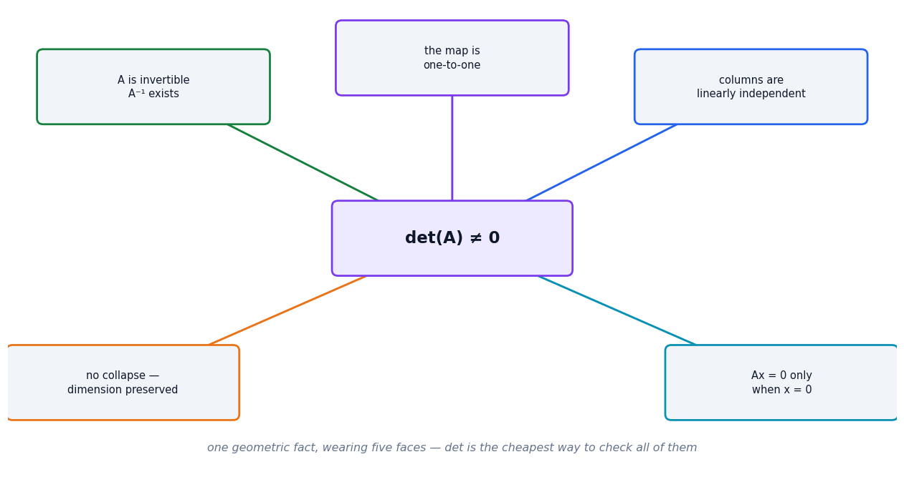

### Cell 63

```python
# ============================================================
#  The failure that actually bites: a redundant feature
# ============================================================
gen = np.random.default_rng(SEED)
n = 200
height_cm = gen.normal(170, 8, n)
weight_kg = gen.normal(70, 12, n)
height_m  = height_cm / 100.0          # <- the SAME feature, different units

y_target = 0.4 * height_cm + 0.9 * weight_kg + gen.normal(0, 2, n)

def try_normal_equations(X, label):
    XtX = X.T @ X
    det = np.linalg.det(XtX)
    cond = np.linalg.cond(XtX)
    print(f"  {label}")
    print(f"     det(XᵀX)  = {det:>12.4e}")
    print(f"     cond(XᵀX) = {cond:>12.4e}", end="")
    try:
        w = np.linalg.inv(XtX) @ X.T @ y_target
        resid = np.linalg.norm(X @ w - y_target)
        print(f"   -> solved, residual {resid:.3f}, ‖w‖ = {np.linalg.norm(w):.3e}")
    except np.linalg.LinAlgError as e:
        print(f"   -> FAILED: {e}")
    print()

print("Fitting w = (XᵀX)⁻¹Xᵀy with and without a redundant feature")
print("=" * 66)
try_normal_equations(np.c_[height_cm, weight_kg], "healthy: [height_cm, weight_kg]")
try_normal_equations(np.c_[height_cm, weight_kg, height_m],
                     "redundant: [height_cm, weight_kg, height_m]  <- height twice")

print("The redundant design matrix is singular in exact arithmetic. In floating")
print("point the determinant is not quite 0, so the inverse 'succeeds' — and")
print("returns enormous, meaningless weights. THAT is why we use lstsq or ridge.")
w_ls, *_ = np.linalg.lstsq(np.c_[height_cm, weight_kg, height_m], y_target, rcond=None)
print(f"\n   np.linalg.lstsq gives a stable answer instead: ‖w‖ = {np.linalg.norm(w_ls):.3f}")
```

**Output**

```text
Fitting w = (XᵀX)⁻¹Xᵀy with and without a redundant feature
==================================================================
  healthy: [height_cm, weight_kg]
     det(XᵀX)  =   1.6298e+11
     cond(XᵀX) =   2.7332e+02   -> solved, residual 25.661, ‖w‖ = 9.690e-01

  redundant: [height_cm, weight_kg, height_m]  <- height twice
     det(XᵀX)  =  -1.8529e-02
     cond(XᵀX) =   3.1325e+20   -> solved, residual 1394.907, ‖w‖ = 1.406e+02

The redundant design matrix is singular in exact arithmetic. In floating
point the determinant is not quite 0, so the inverse 'succeeds' — and
returns enormous, meaningless weights. THAT is why we use lstsq or ridge.

   np.linalg.lstsq gives a stable answer instead: ‖w‖ = 0.969
```

### Cell 67

```python
# ============================================================
#  The hand calculation, checked three ways
# ============================================================
import sympy as sp

Ae = np.array([[2.0, 1.0],
               [0.0, 3.0]])

# --- 1. symbolically, exactly as we did on paper ---
lam = sp.symbols("lambda")
As = sp.Matrix([[2, 1], [0, 3]])
char_poly = sp.factor(sp.det(As - lam * sp.eye(2)))
print("characteristic equation  det(A − λI) = 0")
print(f"   {char_poly} = 0")
print(f"   roots: {sorted(sp.solve(sp.Eq(char_poly, 0), lam))}")
print(f"   sympy eigenvectors: {As.eigenvects()}")
print()

# --- 2. numerically with NumPy ---
vals, vecs = np.linalg.eig(Ae)
print(f"np.linalg.eig eigenvalues : {vals}")
print(f"   eigenvector for λ={vals[0]:.0f}: {vecs[:, 0].round(4)}")
print(f"   eigenvector for λ={vals[1]:.0f}: {vecs[:, 1].round(4)}   (that is (1,1)/√2)")
print()

# --- 3. the defining property, verified directly ---
print("Does A @ v really equal λ · v ?")
for k in range(2):
    v_k, l_k = vecs[:, k], vals[k]
    print(f"   A @ v = {(Ae @ v_k).round(4)}    λ·v = {(l_k * v_k).round(4)}"
          f"    match: {np.allclose(Ae @ v_k, l_k * v_k)}")
print()
print(f"product of eigenvalues = {vals.prod():.4f}   ·   det(A) = {np.linalg.det(Ae):.4f}")
```

**Output**

```text
characteristic equation  det(A − λI) = 0
   (lambda - 3)*(lambda - 2) = 0
   roots: [2, 3]
   sympy eigenvectors: [(2, 1, [Matrix([
[1],
[0]])]), (3, 1, [Matrix([
[1],
[1]])])]

np.linalg.eig eigenvalues : [2. 3.]
   eigenvector for λ=2: [1. 0.]
   eigenvector for λ=3: [0.7071 0.7071]   (that is (1,1)/√2)

Does A @ v really equal λ · v ?
   A @ v = [2. 0.]    λ·v = [2. 0.]    match: True
   A @ v = [2.1213 2.1213]    λ·v = [2.1213 2.1213]    match: True

product of eigenvalues = 6.0000   ·   det(A) = 6.0000
```

### Cell 68

```python
# ============================================================
#  Figure: most arrows get turned; eigenvectors do not
# ============================================================
fig, (ax1, ax2) = plt.subplots(1, 2, figsize=(12.6, 5.4))

# ── left: sweep a probe around and measure how far it was turned ──
angles = np.linspace(0, np.pi, 400)          # half turn is enough (lines, not arrows)
turned = []
for t in angles:
    v_in = np.array([np.cos(t), np.sin(t)])
    v_out = Ae @ v_in
    v_out = v_out / np.linalg.norm(v_out)
    turned.append(np.degrees(np.arccos(np.clip(abs(v_in @ v_out), -1, 1))))
turned = np.array(turned)

ax1.plot(np.degrees(angles), turned, color=C_MODEL, lw=2.6)
ax1.fill_between(np.degrees(angles), 0, turned, color=C_MODEL, alpha=0.12)
for ang, lab, lval in [(0.0, "(1,0)", 2), (45.0, "(1,1)", 3)]:
    ax1.axvline(ang, color=C_TRUE, ls="--", lw=1.8)
    ax1.text(ang + 2.5, 14, f"{lab}\nλ = {lval}", color=C_TRUE,
             fontsize=9.6, fontweight="bold")
ax1.scatter([0.0, 45.0], [0.0, 0.0], s=110, color=C_TRUE, zorder=6,
            edgecolor="white", lw=1.5)
tidy(ax1, "direction of the input vector (degrees)",
     "how far A turned it (degrees)",
     "Two directions are turned by exactly 0°")

# ── right: the eigenvectors drawn on the transformed grid ──
draw_transform(ax2, Ae, limit=3.6, title="A = [[2,1],[0,3]] — the two invariant lines",
               show_unit_square=False)
for vec, lval, col in [(np.array([1.0, 0.0]), 2, C_TRUE),
                       (np.array([1.0, 1.0]) / np.sqrt(2), 3, C_ERR)]:
    tt = np.linspace(-3.6, 3.6, 10)
    ax2.plot(tt * vec[0], tt * vec[1], color=col, lw=2.4, alpha=0.85, zorder=4)
    ax2.annotate("", xy=vec * 1.6, xytext=(0, 0),
                 arrowprops=dict(arrowstyle="-|>", color=col, lw=3.4, mutation_scale=18))
    ax2.annotate("", xy=Ae @ (vec * 1.6), xytext=(0, 0),
                 arrowprops=dict(arrowstyle="-|>", color=col, lw=2.0,
                                 mutation_scale=15, linestyle=":"))
    ax2.text(*(vec * 3.0), f"λ={lval}", color=col, fontsize=11, fontweight="bold", zorder=7)

plt.tight_layout(); plt.show()
```

**Output**

```text
<Figure size 1386x594 with 2 Axes>
```

**Figure**

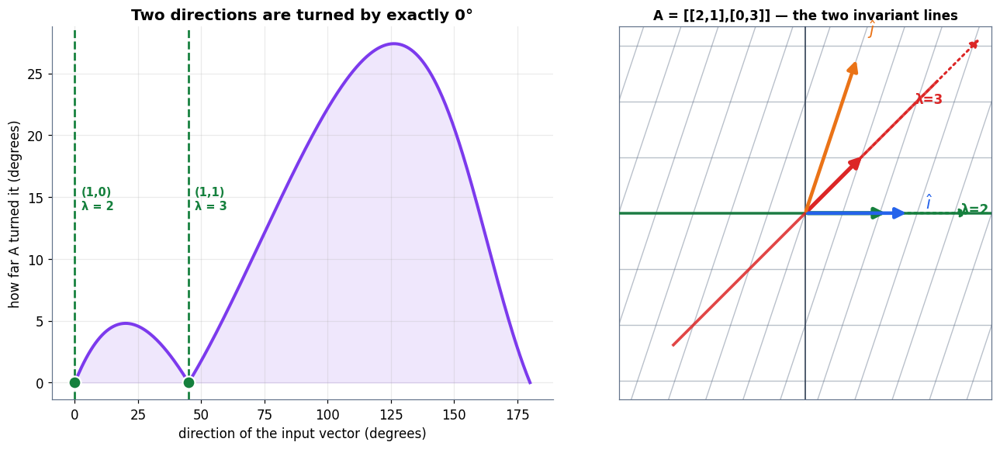

### Cell 71

```python
# ============================================================
#  A rotation has no real eigenvectors — and a symmetric matrix always does
# ============================================================
R = np.array([[0.0, -1.0], [1.0, 0.0]])       # 90° rotation
vals_R = np.linalg.eigvals(R)
print(f"rotation eigenvalues: {vals_R}   <- purely imaginary, no real direction survives")
print(f"   det(R − λI) = λ² + 1 = 0  requires λ² = −1")
print()

Sym = np.array([[4.0, 1.0], [1.0, 3.0]])      # symmetric
vals_S, vecs_S = np.linalg.eigh(Sym)          # eigh, not eig
print(f"symmetric matrix eigenvalues: {vals_S.round(4)}   <- real, guaranteed")
print(f"   eigenvectors are orthogonal? "
      f"{np.isclose(vecs_S[:, 0] @ vecs_S[:, 1], 0)}  "
      f"(their dot product = {vecs_S[:, 0] @ vecs_S[:, 1]:.2e})")
print()
print("Recall Part 2: a dot product of zero means perpendicular.")
print("Symmetric matrices hand you a perpendicular set of axes for free.")
print("Covariance matrices are symmetric — which is the whole basis of PCA.")
```

**Output**

```text
rotation eigenvalues: [0.+1.j 0.-1.j]   <- purely imaginary, no real direction survives
   det(R − λI) = λ² + 1 = 0  requires λ² = −1

symmetric matrix eigenvalues: [2.382 4.618]   <- real, guaranteed
   eigenvectors are orthogonal? True  (their dot product = 0.00e+00)

Recall Part 2: a dot product of zero means perpendicular.
Symmetric matrices hand you a perpendicular set of axes for free.
Covariance matrices are symmetric — which is the whole basis of PCA.
```

### Cell 74

```python
# ============================================================
#  A layer, decomposed into the dot products it really is
# ============================================================
gen = np.random.default_rng(SEED)
n_in, n_out = 6, 3
W = gen.normal(0, 0.6, size=(n_out, n_in))
b_vec = gen.normal(0, 0.2, size=n_out)
x_in = gen.normal(0, 1.0, size=n_in)

z = W @ x_in + b_vec

print(f"W has shape {W.shape}  ->  it maps R^{n_in} → R^{n_out}")
print(f"rank of W = {np.linalg.matrix_rank(W)}  (full rank: no dimension wasted)")
print()
print("Each output is ONE dot product of a row of W with the input:")
print(f"{'unit':>6}{'row · x':>12}{'+ bias':>10}{'= z':>10}")
print("-" * 40)
for k in range(n_out):
    dotp = W[k] @ x_in
    print(f"{k:>6}{dotp:>12.4f}{b_vec[k]:>10.4f}{z[k]:>10.4f}")
print("-" * 40)
print(f"matrix form  W @ x + b = {z.round(4)}")
print(f"identical?   {np.allclose(z, np.array([W[k] @ x_in + b_vec[k] for k in range(n_out)]))}")
print()
print(f"A 6-dimensional input became a 3-dimensional one. {n_in - n_out} dimensions")
print("were discarded — deliberately. That is what the layer is FOR.")
```

**Output**

```text
W has shape (3, 6)  ->  it maps R^6 → R^3
rank of W = 3  (full rank: no dimension wasted)

Each output is ONE dot product of a row of W with the input:
  unit     row · x    + bias       = z
----------------------------------------
     0      1.1927   -0.3802    0.8125
     1     -1.7600   -0.2579   -2.0179
     2      1.5951   -0.3683    1.2268
----------------------------------------
matrix form  W @ x + b = [ 0.8125 -2.0179  1.2268]
identical?   True

A 6-dimensional input became a 3-dimensional one. 3 dimensions
were discarded — deliberately. That is what the layer is FOR.
```

### Cell 76

```python
# ============================================================
#  PCA from scratch: centre, covariance, eigh, project
# ============================================================
# A deliberately tilted, elongated cloud so the axes are visible
gen = np.random.default_rng(SEED)
base = gen.normal(0, 1, size=(300, 2)) * np.array([2.6, 0.55])
theta = np.radians(32)
Rot = np.array([[np.cos(theta), -np.sin(theta)],
                [np.sin(theta),  np.cos(theta)]])
cloud = base @ Rot.T + np.array([4.0, 2.0])

# ── PCA, in four lines ──
centred = cloud - cloud.mean(axis=0)              # 1. centre it
cov = np.cov(centred, rowvar=False)               # 2. covariance matrix (symmetric!)
eigvals, eigvecs = np.linalg.eigh(cov)            # 3. eigh — real, orthogonal, guaranteed
order = np.argsort(eigvals)[::-1]                 # 4. rank by variance, largest first
eigvals, eigvecs = eigvals[order], eigvecs[:, order]

print("covariance matrix (symmetric — check the off-diagonals):")
print(cov.round(4))
print(f"\nis it symmetric? {np.allclose(cov, cov.T)}")
print()
print(f"{'component':>11}{'eigenvalue':>14}{'variance share':>17}{'direction':>22}")
print("-" * 66)
total = eigvals.sum()
for k in range(2):
    print(f"{'PC' + str(k+1):>11}{eigvals[k]:>14.4f}{eigvals[k]/total:>16.1%}"
          f"{str(eigvecs[:, k].round(3).tolist()):>22}")
print("-" * 66)
print(f"the two axes are perpendicular: dot = {eigvecs[:,0] @ eigvecs[:,1]:.2e}")
print()

# ── check against scikit-learn ──
from sklearn.decomposition import PCA
sk = PCA(n_components=2).fit(cloud)
print("scikit-learn agrees:")
print(f"   our eigenvalues      {eigvals.round(4)}")
print(f"   sklearn variances    {sk.explained_variance_.round(4)}")
print(f"   our PC1 direction    {np.abs(eigvecs[:, 0]).round(4)}")
print(f"   sklearn PC1          {np.abs(sk.components_[0]).round(4)}")
print(f"   match (up to sign)?  {np.allclose(np.abs(eigvecs[:,0]), np.abs(sk.components_[0]), atol=1e-6)}")
```

**Output**

```text
covariance matrix (symmetric — check the off-diagonals):
[[4.111  2.4363]
 [2.4363 1.8002]]

is it symmetric? True

  component    eigenvalue   variance share             direction
------------------------------------------------------------------
        PC1        5.6520           95.6%      [-0.845, -0.535]
        PC2        0.2593            4.4%       [0.535, -0.845]
------------------------------------------------------------------
the two axes are perpendicular: dot = 0.00e+00

scikit-learn agrees:
   our eigenvalues      [5.652  0.2593]
   sklearn variances    [5.652  0.2593]
   our PC1 direction    [0.8451 0.5346]
   sklearn PC1          [0.8451 0.5346]
   match (up to sign)?  True
```

### Cell 77

```python
# ============================================================
#  Figure: the data cloud and the axes it is built around
# ============================================================
fig, (ax1, ax2) = plt.subplots(1, 2, figsize=(13, 5.2),
                               gridspec_kw={"width_ratios": [1.25, 1]})

# ── left: the cloud with its principal axes ──
mu = cloud.mean(axis=0)
ax1.scatter(*cloud.T, s=22, color=C_DATA, alpha=0.45, edgecolor="none")
ax1.scatter(*mu, s=150, color="black", marker="+", lw=2.4, zorder=6)
for k, (col, lab) in enumerate([(C_ERR, "PC1"), (C_TRUE, "PC2")]):
    direction = eigvecs[:, k] * np.sqrt(eigvals[k]) * 2.2
    # draw each principal component as a double-headed AXIS through the mean,
    # because an eigenvector describes a LINE, not a one-way arrow
    ax1.annotate("", xy=mu + direction, xytext=mu - direction,
                 arrowprops=dict(arrowstyle="<|-|>", color=col, lw=3.4,
                                 mutation_scale=18))
    ax1.text(*(mu + direction * 1.24),
             lab + " — " + f"{eigvals[k]/total:.0%} of variance",
             color=col, fontsize=10, fontweight="bold", ha="center")
ax1.set_aspect("equal")
tidy(ax1, "feature 1", "feature 2",
     "The eigenvectors of the covariance matrix\nare the axes of the data cloud")

# ── right: variance explained ──
ax2.bar(["PC1", "PC2"], eigvals / total, color=[C_ERR, C_TRUE], alpha=0.88, width=0.55)
for k in range(2):
    ax2.text(k, eigvals[k] / total + 0.02, f"{eigvals[k]/total:.1%}",
             ha="center", fontsize=11, fontweight="bold")
ax2.plot([0, 1], np.cumsum(eigvals / total), "o--", color=C_GREY, lw=1.8,
         ms=7, label="cumulative")
ax2.set_ylim(0, 1.14)
ax2.yaxis.set_major_formatter(lambda v, p: f"{v:.0%}")
tidy(ax2, None, "share of total variance",
     "Keep PC1 alone and you keep most of the data", legend=True)

plt.tight_layout(); plt.show()
```

**Output**

```text
<Figure size 1430x572 with 2 Axes>
```

**Figure**

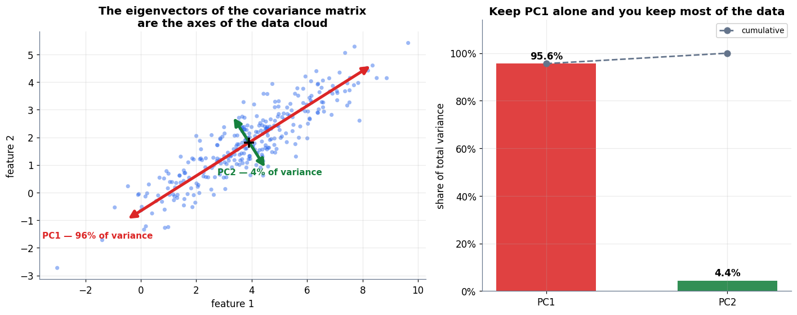

