# 08 — Introduction to Probability

**Status:** Executed successfully

## Code and Output

### Cell 3

```python
# ============================================================
#  Setup -- no installs, no downloads, no network.
# ============================================================
import numpy as np
import matplotlib.pyplot as plt

plt.rcParams["figure.figsize"] = (9, 4.5)
plt.rcParams["axes.grid"]      = True
plt.rcParams["grid.alpha"]     = 0.3
plt.rcParams["axes.spines.top"]   = False
plt.rcParams["axes.spines.right"] = False
plt.rcParams["font.size"] = 11

C_F, C_SLOPE, C_AREA = "#2563EB", "#DC2626", "#059669"
C_APPROX, C_EXACT, C_GREY, C_SOFT = "#D97706", "#7C3AED", "#6B7280", "#E5E7EB"


print(f"numpy {np.__version__}")
```

**Output**

```text
numpy 2.1.3
```

### Cell 5

```python
# ============================================================
#  The running example -- a spam filter's inbox.
#  Every rule in this notebook gets checked by SIMULATION:
#  we state a probability, then generate thousands of emails
#  and count. If the rule is right, the count agrees.
# ============================================================
import numpy as np

RNG = np.random.default_rng(17)

N_EMAILS  = 20_000
P_SPAM    = 0.30                      # 30% of mail is spam
# P(word appears | spam) and P(word appears | not spam)
WORDS = {"free": (0.55, 0.04), "meeting": (0.03, 0.38),
         "winner": (0.42, 0.01), "report": (0.05, 0.31)}

is_spam = RNG.random(N_EMAILS) < P_SPAM
inbox   = {"spam": is_spam}
for w, (p_s, p_h) in WORDS.items():
    p = np.where(is_spam, p_s, p_h)
    inbox[w] = RNG.random(N_EMAILS) < p

print(f"simulated {N_EMAILS:,} emails")
print(f"actually spam        : {is_spam.mean():.4f}   (we set 0.30)")
print(f"contain 'free'       : {inbox['free'].mean():.4f}")
print(f"spam AND 'free'      : {(is_spam & inbox['free']).mean():.4f}")
print()
print("Every probability claimed in this notebook is checked against counts")
print("like these. If the algebra is wrong, the simulation disagrees.")
```

**Output**

```text
simulated 20,000 emails
actually spam        : 0.3008   (we set 0.30)
contain 'free'       : 0.1938
spam AND 'free'      : 0.1664

Every probability claimed in this notebook is checked against counts
like these. If the algebra is wrong, the simulation disagrees.
```

### Cell 12

```python
# ============================================================
#  The sample space, drawn. 100 of the 20,000 emails.
#  Each square is one OUTCOME. Each colour/mark is an EVENT.
# ============================================================
A_spam = inbox["spam"]      # the event "this email is spam"
B_free = inbox["free"]      # the event "this email contains the word free"

print(f"the sample space holds {len(A_spam):,} outcomes (emails)")
print(f"the event 'spam'  is a set of {A_spam.sum():,} of them")
print(f"the event 'free'  is a set of {B_free.sum():,} of them")
print(f"an event is stored as a boolean array: {A_spam.dtype}, "
      f"first five = {A_spam[:5]}")

fig, ax = plt.subplots(figsize=(8, 4.4))
SHOW = 100
for i in range(SHOW):
    r, c = divmod(i, 10)
    ax.add_patch(plt.Rectangle((c, -r), 0.92, 0.92, lw=0,
                               facecolor=C_SLOPE if A_spam[i] else C_SOFT))
    if B_free[i]:
        ax.plot(c + 0.46, -r + 0.46, "o", ms=6, mfc="white",
                mec=C_F if not A_spam[i] else "white", mew=1.6)

ax.set_xlim(-0.4, 10.4); ax.set_ylim(-9.6, 1.4)
ax.set_aspect("equal"); ax.axis("off"); ax.grid(False)
ax.set_title("100 outcomes.  Red = the event 'spam'.  Ringed = the event 'free'.",
             fontsize=11)
handles = [plt.Rectangle((0, 0), 1, 1, facecolor=C_SLOPE, lw=0),
           plt.Rectangle((0, 0), 1, 1, facecolor=C_SOFT,  lw=0)]
ax.legend(handles, ["spam", "not spam"], loc="upper center",
          bbox_to_anchor=(0.5, -0.02), ncol=2, frameon=False)
plt.tight_layout(); plt.show()

print()
print(f"in these {SHOW} squares: spam {A_spam[:SHOW].sum()}, "
      f"'free' {B_free[:SHOW].sum()}, both {(A_spam & B_free)[:SHOW].sum()}")
```

**Output**

```text
the sample space holds 20,000 outcomes (emails)
the event 'spam'  is a set of 6,016 of them
the event 'free'  is a set of 3,875 of them
an event is stored as a boolean array: bool, first five = [False  True False False  True]
```

**Output**

```text
<Figure size 800x440 with 1 Axes>
```

**Figure**

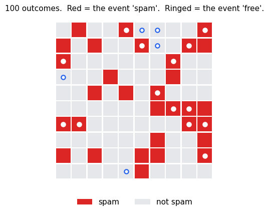

**Output**

```text
in these 100 squares: spam 31, 'free' 19, both 14
```

### Cell 16

```python
# ============================================================
#  One of these can be checked by counting. The other cannot.
# ============================================================
rng = np.random.default_rng(1)

flips = rng.random(10_000) < 0.5          # 10,000 repeats of a repeatable thing
print("CLAIM: P(heads) = 0.5")
print(f"  10,000 flips -> heads {flips.sum():,}  "
      f"share {flips.mean():.4f}   claim survives\n")

print("CLAIM: P(rain here tomorrow) = 0.7")
print("  tomorrows available to count : 1")
print("  share of them that were rainy: 0 or 1, whichever happens")
print("  -> no count can confirm or refute 0.7. Different kind of claim.\n")

print("Both are legitimate. Only the first is the kind this notebook verifies.")
```

**Output**

```text
CLAIM: P(heads) = 0.5
  10,000 flips -> heads 4,953  share 0.4953   claim survives

CLAIM: P(rain here tomorrow) = 0.7
  tomorrows available to count : 1
  share of them that were rainy: 0 or 1, whichever happens
  -> no count can confirm or refute 0.7. Different kind of claim.

Both are legitimate. Only the first is the kind this notebook verifies.
```

### Cell 18

```python
# ============================================================
#  The three axioms, checked on the inbox by counting.
# ============================================================
S = np.ones(N_EMAILS, dtype=bool)          # the sample space: every email

# --- Rule 1: probabilities are never negative -------------------------
events = {"spam": inbox["spam"], "free": inbox["free"],
          "meeting": inbox["meeting"], "spam AND free": inbox["spam"] & inbox["free"],
          "impossible (spam and not spam)": inbox["spam"] & ~inbox["spam"]}
print("RULE 1  P(A) >= 0")
for name, ev in events.items():
    print(f"   P({name:<30s}) = {ev.mean():.4f}")
print(f"   all non-negative: {all(ev.mean() >= 0 for ev in events.values())}\n")

# --- Rule 2: the whole sample space has probability 1 -----------------
print("RULE 2  P(S) = 1")
print(f"   P(the email is spam OR not spam) = {(inbox['spam'] | ~inbox['spam']).mean():.4f}")
print(f"   P(S)                             = {S.mean():.4f}\n")

# --- Rule 3: disjoint events add --------------------------------------
#  'spam AND free' and 'spam AND not free' cannot both happen: disjoint.
#  Together they are exactly 'spam'.
left  = inbox["spam"] & inbox["free"]
right = inbox["spam"] & ~inbox["free"]
print("RULE 3  disjoint events add")
print(f"   can they overlap?  shared outcomes = {(left & right).sum()}   (0 = disjoint)")
print(f"   P(spam and free)      = {left.mean():.4f}")
print(f"   P(spam and not free)  = {right.mean():.4f}")
print(f"   sum                   = {left.mean() + right.mean():.4f}")
print(f"   P(spam) counted direct = {inbox['spam'].mean():.4f}")
print(f"   identical: {np.isclose(left.mean() + right.mean(), inbox['spam'].mean())}")
```

**Output**

```text
RULE 1  P(A) >= 0
   P(spam                          ) = 0.3008
   P(free                          ) = 0.1938
   P(meeting                       ) = 0.2742
   P(spam AND free                 ) = 0.1664
   P(impossible (spam and not spam)) = 0.0000
   all non-negative: True

RULE 2  P(S) = 1
   P(the email is spam OR not spam) = 1.0000
   P(S)                             = 1.0000

RULE 3  disjoint events add
   can they overlap?  shared outcomes = 0   (0 = disjoint)
   P(spam and free)      = 0.1664
   P(spam and not free)  = 0.1343
   sum                   = 0.3008
   P(spam) counted direct = 0.3008
   identical: True
```

### Cell 21

```python
# ============================================================
#  The three tools every later part re-uses. Keep them in mind.
# ============================================================
def estimate_prob(trial, n=200_000, seed=0):
    """Estimate P(event) by simulating n rounds and counting the hits.

    trial(rng, n) -> boolean array of length n, True where the event happened.
    """
    hits = np.asarray(trial(np.random.default_rng(seed), n), dtype=bool)
    return hits.mean()


def running_estimate(trial, n=20_000, seed=0):
    """The same estimate, but after 1 round, 2 rounds, ... n rounds."""
    hits = np.asarray(trial(np.random.default_rng(seed), n), dtype=bool)
    return np.cumsum(hits) / np.arange(1, n + 1)


def confirm(label, by_rule, by_counting, tol=0.01):
    """Print an algebraic answer beside a counted one. Complain if they differ."""
    gap = abs(by_rule - by_counting)
    print(f"{label:<34s} rule {by_rule:7.4f}   counted {by_counting:7.4f}   "
          f"gap {gap:6.4f}   {'agree' if gap < tol else '*** DISAGREE ***'}")
    return gap < tol


# --- a first use: two coins, both heads -------------------------------
two_heads = lambda rng, n: (rng.random(n) < 0.5) & (rng.random(n) < 0.5)
confirm("P(two coins both heads)", 1 / 4, estimate_prob(two_heads, 200_000))

# --- and a deliberately WRONG claim, to show the tool bites -----------
confirm("P(two coins both heads) = 1/2?", 1 / 2, estimate_prob(two_heads, 200_000))
```

**Output**

```text
P(two coins both heads)            rule  0.2500   counted  0.2515   gap 0.0015   agree
P(two coins both heads) = 1/2?     rule  0.5000   counted  0.2515   gap 0.2485   *** DISAGREE ***
```

**Output**

```text
np.False_
```

### Cell 24

```python
# ============================================================
#  Equally likely outcomes: list them, count them, then simulate.
# ============================================================
import itertools

pairs = list(itertools.product(range(1, 7), repeat=2))   # the real sample space
print(f"rolling two dice: {len(pairs)} equally likely ordered pairs")

for target in (7, 2, 11):
    favourable = [p for p in pairs if sum(p) == target]
    by_rule = len(favourable) / len(pairs)
    trial = (lambda t: lambda rng, n:
             rng.integers(1, 7, n) + rng.integers(1, 7, n) == t)(target)
    confirm(f"P(two dice sum to {target:>2d})  {len(favourable):>2d}/{len(pairs)}",
            by_rule, estimate_prob(trial, 200_000, seed=target))

print()
# --- coins: the same logic, a different sample space -------------------
for k in (2, 3):
    seqs = list(itertools.product("HT", repeat=k))
    favourable = [s for s in seqs if all(c == "H" for c in s)]
    by_rule = len(favourable) / len(seqs)
    trial = (lambda kk: lambda rng, n:
             (rng.random((n, kk)) < 0.5).all(axis=1))(k)
    confirm(f"P({k} coins all heads)  {len(favourable)}/{len(seqs)}",
            by_rule, estimate_prob(trial, 200_000, seed=k))
```

**Output**

```text
rolling two dice: 36 equally likely ordered pairs
P(two dice sum to  7)   6/36       rule  0.1667   counted  0.1658   gap 0.0009   agree
P(two dice sum to  2)   1/36       rule  0.0278   counted  0.0276   gap 0.0002   agree
P(two dice sum to 11)   2/36       rule  0.0556   counted  0.0558   gap 0.0002   agree

P(2 coins all heads)  1/4          rule  0.2500   counted  0.2505   gap 0.0005   agree
P(3 coins all heads)  1/8          rule  0.1250   counted  0.1242   gap 0.0008   agree
```

### Cell 27

```python
# ============================================================
#  The complement rule, on the inbox and on dice.
# ============================================================
for name in ("spam", "free", "meeting"):
    ev = inbox[name]
    confirm(f"P(not '{name}')", 1 - ev.mean(), (~ev).mean())

print()
# The rule earns its keep here: "at least one six in four rolls".
# Counting the ways to succeed is fiddly; there is exactly one way to fail.
no_six    = lambda rng, n: (rng.integers(1, 7, (n, 4)) != 6).all(axis=1)
least_one = lambda rng, n: (rng.integers(1, 7, (n, 4)) == 6).any(axis=1)

p_none = (5 / 6) ** 4
confirm("P(no six in four rolls)", p_none, estimate_prob(no_six, 200_000, seed=4))
confirm("P(at least one six)", 1 - p_none, estimate_prob(least_one, 200_000, seed=4))
```

**Output**

```text
P(not 'spam')                      rule  0.6992   counted  0.6992   gap 0.0000   agree
P(not 'free')                      rule  0.8063   counted  0.8063   gap 0.0000   agree
P(not 'meeting')                   rule  0.7258   counted  0.7258   gap 0.0000   agree

P(no six in four rolls)            rule  0.4823   counted  0.4819   gap 0.0004   agree
P(at least one six)                rule  0.5177   counted  0.5181   gap 0.0004   agree
```

**Output**

```text
np.True_
```

### Cell 30

```python
# ============================================================
#  The running estimate, converging on a value we already know.
# ============================================================
sum_seven = lambda rng, n: rng.integers(1, 7, n) + rng.integers(1, 7, n) == 7
TRUE_P = len([p for p in itertools.product(range(1, 7), repeat=2)
              if sum(p) == 7]) / 36
N = 20_000

fig, ax = plt.subplots(figsize=(9.5, 4.6))
for seed, colour in zip(range(5), [C_F, C_SLOPE, C_AREA, C_APPROX, C_GREY]):
    ax.plot(np.arange(1, N + 1), running_estimate(sum_seven, N, seed=seed),
            color=colour, lw=1.1, alpha=0.85)

k = np.arange(1, N + 1)
band = 2 * np.sqrt(TRUE_P * (1 - TRUE_P) / k)          # typical wobble, +/- 2 sd
ax.fill_between(k, TRUE_P - band, TRUE_P + band, color=C_EXACT, alpha=0.13,
                label="where about 95% of runs should sit")
ax.axhline(TRUE_P, color=C_EXACT, lw=2.2, ls="--",
           label=f"the exact answer, 6/36 = {TRUE_P:.4f}")

ax.set_xscale("log")
ax.set_xlabel("number of rolls counted so far (log scale)")
ax.set_ylabel("estimate of P(sum = 7)")
ax.set_ylim(0, 0.45)
ax.set_title("Five independent runs. Same target, shrinking disagreement.")
ax.legend(loc="upper right", framealpha=0.95)
plt.tight_layout(); plt.show()

for n in (10, 100, 1_000, 20_000):
    spread = [running_estimate(sum_seven, n, seed=s)[-1] for s in range(5)]
    print(f"after {n:>6,} rolls   estimates {['%.3f' % v for v in spread]}   "
          f"worst error {max(abs(v - TRUE_P) for v in spread):.4f}")
```

**Output**

```text
<Figure size 950x460 with 1 Axes>
```

**Figure**

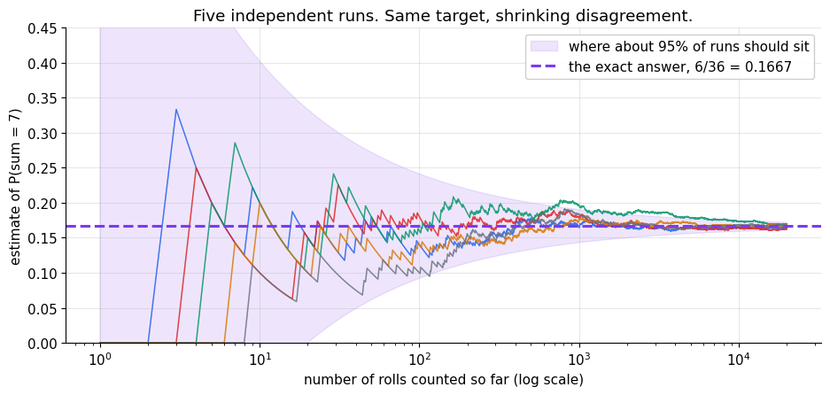

**Output**

```text
after     10 rolls   estimates ['0.000', '0.200', '0.300', '0.100', '0.200']   worst error 0.1667
after    100 rolls   estimates ['0.250', '0.150', '0.210', '0.160', '0.160']   worst error 0.0833
after  1,000 rolls   estimates ['0.182', '0.164', '0.173', '0.152', '0.158']   worst error 0.0153
after 20,000 rolls   estimates ['0.164', '0.163', '0.169', '0.168', '0.168']   worst error 0.0042
```

### Cell 33

```python
# ============================================================
#  "It is due." Is it? Ask the coins, not the intuition.
#  After a run of k heads, how often is the NEXT flip heads?
# ============================================================
rng   = np.random.default_rng(99)
n     = 400_000
flips = rng.random(n) < 0.5                     # a fair coin, 400,000 times

ks, rates, counts = list(range(7)), [], []
for k in ks:
    if k == 0:
        idx = np.arange(n - 1)                  # every position, no condition
    else:
        run = np.ones(n - k, dtype=bool)        # previous k flips all heads
        for j in range(k):
            run &= flips[j:n - k + j]
        idx = np.nonzero(run)[0]
    nxt = flips[idx + k]
    rates.append(nxt.mean()); counts.append(len(idx))

fig, ax = plt.subplots(figsize=(9, 4.3))
ax.bar([str(k) for k in ks], rates, color=C_F, width=0.62)
ax.axhline(0.5, color=C_SLOPE, lw=2.2, ls="--", label="a fair coin: 0.5")
ax.set_ylim(0, 0.75)
ax.set_xlabel("number of heads in a row immediately before this flip")
ax.set_ylabel("share of those next flips that were heads")
ax.set_title("The coin has no memory. Six heads in a row changes nothing.")
ax.legend(loc="upper right")
for x, (r, c) in enumerate(zip(rates, counts)):
    ax.text(x, r + 0.02, f"{r:.3f}\n({c:,} cases)", ha="center", fontsize=8.5)
plt.tight_layout(); plt.show()

print("after k heads in a row, share of next flips that were heads:")
for k, r, c in zip(ks, rates, counts):
    print(f"   k = {k}   {r:.4f}   (from {c:,} such moments)")
print(f"\nlargest departure from 0.5: {max(abs(r - 0.5) for r in rates):.4f}")
```

**Output**

```text
<Figure size 900x430 with 1 Axes>
```

**Figure**

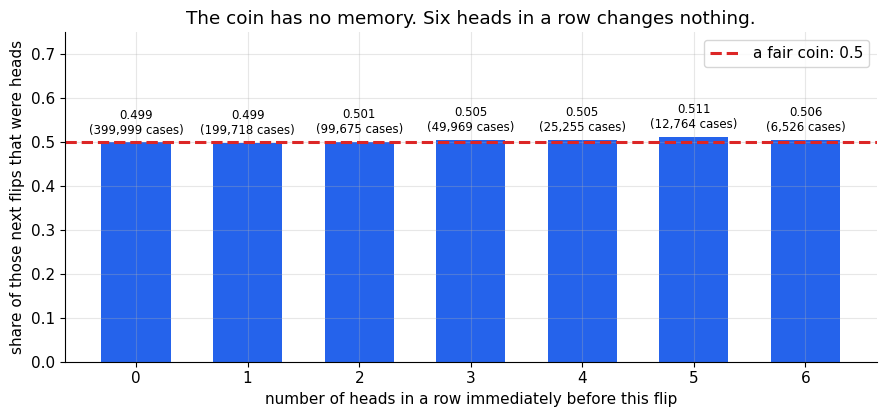

**Output**

```text
after k heads in a row, share of next flips that were heads:
   k = 0   0.4993   (from 399,999 such moments)
   k = 1   0.4991   (from 199,718 such moments)
   k = 2   0.5013   (from 99,675 such moments)
   k = 3   0.5054   (from 49,969 such moments)
   k = 4   0.5054   (from 25,255 such moments)
   k = 5   0.5113   (from 12,764 such moments)
   k = 6   0.5057   (from 6,526 such moments)

largest departure from 0.5: 0.0113
```

### Cell 39

```python
# ============================================================
#  AND: three tests of the multiplication rule.
# ============================================================
# --- (a) dice: independent by construction ----------------------------
both_six = lambda rng, n: (rng.integers(1, 7, n) == 6) & (rng.integers(1, 7, n) == 6)
confirm("P(both dice show a six)", (1 / 6) * (1 / 6),
        estimate_prob(both_six, 400_000, seed=6))

three_h = lambda rng, n: (rng.random((n, 3)) < 0.5).all(axis=1)
confirm("P(three coins all heads)", 0.5 ** 3, estimate_prob(three_h, 400_000, seed=3))

print()
# --- (b) an INDEPENDENT pair inside the inbox --------------------------
#  Whether an email sits at an even position in the inbox has nothing to do
#  with whether it is spam. Independent, and the rule should hold.
even_slot = (np.arange(N_EMAILS) % 2 == 0)
A, B = inbox["spam"], even_slot
confirm("P(spam AND even slot)", A.mean() * B.mean(), (A & B).mean())

print()
# --- (c) a DEPENDENT pair inside the inbox -----------------------------
#  'free' was generated to be far more common in spam. Not independent.
A, B = inbox["spam"], inbox["free"]
prod, actual = A.mean() * B.mean(), (A & B).mean()
confirm("P(spam AND 'free')", prod, actual)
print(f"    the rule is off by a factor of {actual / prod:.2f}  "
      f"({actual:.4f} actually, {prod:.4f} if we had assumed independence)")
```

**Output**

```text
P(both dice show a six)            rule  0.0278   counted  0.0280   gap 0.0003   agree
P(three coins all heads)           rule  0.1250   counted  0.1247   gap 0.0003   agree

P(spam AND even slot)              rule  0.1504   counted  0.1519   gap 0.0015   agree

P(spam AND 'free')                 rule  0.0583   counted  0.1664   gap 0.1082   *** DISAGREE ***
    the rule is off by a factor of 2.86  (0.1664 actually, 0.0583 if we had assumed independence)
```

### Cell 44

```python
# ============================================================
#  Inclusion-exclusion, drawn and then counted.
# ============================================================
A, B = inbox["spam"], inbox["free"]
pA, pB       = A.mean(), B.mean()
p_both       = (A & B).mean()
p_either     = (A | B).mean()
p_naive      = pA + pB

fig, ax = plt.subplots(figsize=(9, 4.8))
ax.add_patch(plt.Circle((-0.55, 0), 1.25, facecolor=C_SLOPE, alpha=0.42, lw=0))
ax.add_patch(plt.Circle(( 0.55, 0), 1.25, facecolor=C_F,     alpha=0.42, lw=0))
ax.add_patch(plt.Circle((-0.55, 0), 1.25, facecolor="none", edgecolor=C_SLOPE, lw=2))
ax.add_patch(plt.Circle(( 0.55, 0), 1.25, facecolor="none", edgecolor=C_F,     lw=2))

ax.text(-1.25, 0.15, "spam only", ha="center", fontsize=10.5, color="white")
ax.text(-1.25, -0.2, f"{(A & ~B).mean():.3f}", ha="center", fontsize=12,
        color="white", weight="bold")
ax.text(1.25, 0.15, "'free' only", ha="center", fontsize=10.5, color="white")
ax.text(1.25, -0.2, f"{(~A & B).mean():.3f}", ha="center", fontsize=12,
        color="white", weight="bold")
ax.text(0, 0.5, "BOTH", ha="center", fontsize=10.5, weight="bold")
ax.text(0, 0.15, f"{p_both:.3f}", ha="center", fontsize=12, weight="bold")
ax.text(0, -0.25, "counted\ntwice if\nyou add", ha="center", fontsize=8.5,
        color="#7f1d1d")
ax.text(0, -1.75, f"neither: {(~A & ~B).mean():.3f}   (everything outside both circles)",
        ha="center", fontsize=10, color=C_GREY)

ax.set_xlim(-2.4, 2.4); ax.set_ylim(-2.1, 1.7)
ax.set_aspect("equal"); ax.axis("off"); ax.grid(False)
ax.set_title("P(spam or 'free') = P(spam) + P('free') - P(both)", fontsize=12)
plt.tight_layout(); plt.show()

print(f"P(spam)                       = {pA:.4f}")
print(f"P('free')                     = {pB:.4f}")
print(f"P(both)                       = {p_both:.4f}")
print(f"naive addition P(A) + P(B)    = {p_naive:.4f}   <- too big")
print(f"minus the overlap             = {p_naive - p_both:.4f}")
print(f"counted directly, P(A or B)   = {p_either:.4f}")
print()
confirm("P(spam or 'free')", p_naive - p_both, p_either)
confirm("naive addition", p_naive, p_either)
```

**Output**

```text
<Figure size 900x480 with 1 Axes>
```

**Figure**

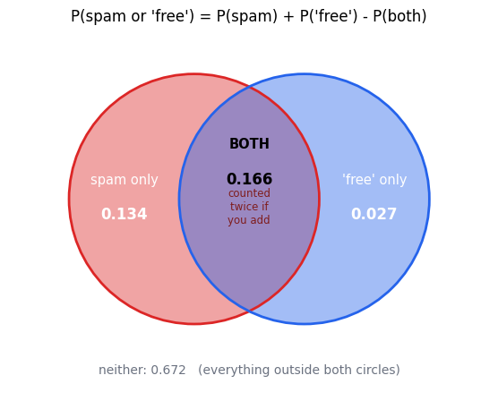

**Output**

```text
P(spam)                       = 0.3008
P('free')                     = 0.1938
P(both)                       = 0.1664
naive addition P(A) + P(B)    = 0.4946   <- too big
minus the overlap             = 0.3281
counted directly, P(A or B)   = 0.3281

P(spam or 'free')                  rule  0.3281   counted  0.3281   gap 0.0000   agree
naive addition                     rule  0.4946   counted  0.3281   gap 0.1665   *** DISAGREE ***
```

**Output**

```text
np.False_
```

### Cell 49

```python
# ============================================================
#  (a) genuinely exclusive: addition is exactly right.
#  (b) not exclusive: addition gives a probability above 1.
# ============================================================
import itertools
pairs = list(itertools.product(range(1, 7), repeat=2))
p7 = len([p for p in pairs if sum(p) == 7]) / 36
p11 = len([p for p in pairs if sum(p) == 11]) / 36
both_at_once = len([p for p in pairs if sum(p) == 7 and sum(p) == 11]) / 36
seven_or_eleven = lambda rng, n: np.isin(rng.integers(1, 7, n) + rng.integers(1, 7, n), [7, 11])

print("(a) EXCLUSIVE -- a roll cannot total both 7 and 11")
print(f"    overlap P(7 and 11) = {both_at_once:.4f}   (empty set)")
confirm("    P(total is 7 or 11)", p7 + p11, estimate_prob(seven_or_eleven, 400_000, seed=7))

print("\n(b) NOT EXCLUSIVE -- seven rolls, at least one six")
ROLLS = 7
naive = ROLLS * (1 / 6)
truth = 1 - (5 / 6) ** ROLLS
any_six = lambda rng, n: (rng.integers(1, 7, (n, ROLLS)) == 6).any(axis=1)
counted = estimate_prob(any_six, 200_000, seed=66)
print(f"    naive addition  {ROLLS} x 1/6 = {naive:.4f}   <-- IMPOSSIBLE, exceeds 1")
confirm("    correct answer", truth, counted)
print(f"    naive addition overstates the truth by {naive - truth:.4f}")
print("    and with fewer rolls the same error lands somewhere plausible:")
for r in (3, 5):
    print(f"       {r} rolls: naive {r / 6:.4f}   truth {1 - (5 / 6) ** r:.4f}"
          f"   still wrong by {r / 6 - (1 - (5 / 6) ** r):.4f}")

print("\n(c) the same disease in the inbox: five overlapping word events")
names = ["spam", "free", "meeting", "winner", "report"]
naive_sum = sum(inbox[k].mean() for k in names)
union = np.zeros(N_EMAILS, dtype=bool)
for k in names:
    union |= inbox[k]
for k in names:
    print(f"       P({k:<8s}) = {inbox[k].mean():.4f}")
print(f"    naive sum of the five     = {naive_sum:.4f}   <-- exceeds 1")
print(f"    P(at least one), counted  = {union.mean():.4f}")
```

**Output**

```text
(a) EXCLUSIVE -- a roll cannot total both 7 and 11
    overlap P(7 and 11) = 0.0000   (empty set)
    P(total is 7 or 11)            rule  0.2222   counted  0.2217   gap 0.0005   agree

(b) NOT EXCLUSIVE -- seven rolls, at least one six
    naive addition  7 x 1/6 = 1.1667   <-- IMPOSSIBLE, exceeds 1
    correct answer                 rule  0.7209   counted  0.7216   gap 0.0007   agree
    naive addition overstates the truth by 0.4457
    and with fewer rolls the same error lands somewhere plausible:
       3 rolls: naive 0.5000   truth 0.4213   still wrong by 0.0787
       5 rolls: naive 0.8333   truth 0.5981   still wrong by 0.2352

(c) the same disease in the inbox: five overlapping word events
       P(spam    ) = 0.3008
       P(free    ) = 0.1938
       P(meeting ) = 0.2742
       P(winner  ) = 0.1313
       P(report  ) = 0.2338
    naive sum of the five     = 1.1340   <-- exceeds 1
    P(at least one), counted  = 0.7149
```

### Cell 52

```python
# ============================================================
#  "At least one" via the complement, on dice.
# ============================================================
for r in (1, 2, 4, 7, 12):
    trial = (lambda rr: lambda rng, n:
             (rng.integers(1, 7, (n, rr)) == 6).any(axis=1))(r)
    confirm(f"P(at least one six in {r:>2d} rolls)",
            1 - (5 / 6) ** r, estimate_prob(trial, 200_000, seed=100 + r))
print("\nEach right-hand column came from counting rolls; each left-hand one")
print("from a single multiplication and a subtraction. No overlaps were needed.")
```

**Output**

```text
P(at least one six in  1 rolls)    rule  0.1667   counted  0.1679   gap 0.0012   agree
P(at least one six in  2 rolls)    rule  0.3056   counted  0.3037   gap 0.0019   agree
P(at least one six in  4 rolls)    rule  0.5177   counted  0.5193   gap 0.0015   agree
P(at least one six in  7 rolls)    rule  0.7209   counted  0.7195   gap 0.0014   agree
P(at least one six in 12 rolls)    rule  0.8878   counted  0.8868   gap 0.0011   agree

Each right-hand column came from counting rolls; each left-hand one
from a single multiplication and a subtraction. No overlaps were needed.
```

### Cell 53

```python
# ============================================================
#  The birthday problem: exact curve vs simulation.
# ============================================================
DAYS, TRIALS = 365, 40_000
sizes = np.arange(2, 61)

# --- exact: 1 - P(all birthdays different) ----------------------------
exact = np.array([1 - np.prod((DAYS - np.arange(k)) / DAYS) for k in sizes])

# --- simulated: fill rooms with random birthdays and count ------------
rng = np.random.default_rng(2718)
def any_shared(k):
    """Fill TRIALS rooms of k people; True where two birthdays coincide."""
    rooms = np.sort(rng.integers(0, DAYS, (TRIALS, k)), axis=1)
    return (np.diff(rooms, axis=1) == 0).any(axis=1)

simulated = np.array([any_shared(k).mean() for k in sizes])

cross_exact = int(sizes[np.argmax(exact >= 0.5)])
cross_sim   = int(sizes[np.argmax(simulated >= 0.5)])

fig, ax = plt.subplots(figsize=(9.5, 4.8))
ax.plot(sizes, exact, color=C_EXACT, lw=2.6, label="exact: 1 - P(all different)")
ax.plot(sizes, simulated, "o", color=C_F, ms=4.2, alpha=0.75,
        label=f"simulated, {TRIALS:,} rooms per size")
ax.axhline(0.5, color=C_GREY, lw=1.2, ls=":")
ax.axvline(cross_exact, color=C_SLOPE, lw=1.8, ls="--",
           label=f"crosses 50% at {cross_exact} people")
ax.set_xlabel("number of people in the room")
ax.set_ylabel("P(at least two share a birthday)")
ax.set_ylim(0, 1.02)
ax.set_title("Two people share a birthday far sooner than intuition allows")
ax.legend(loc="lower right", framealpha=0.95)
plt.tight_layout(); plt.show()

print(f"crossover from the EXACT curve      : {cross_exact} people "
      f"(P = {exact[cross_exact - 2]:.4f})")
print(f"crossover from the SIMULATED curve  : {cross_sim} people "
      f"(P = {simulated[cross_sim - 2]:.4f})")
print(f"largest gap between the two curves  : {np.abs(exact - simulated).max():.4f}")
print()
for k in (10, 23, 30, 50, 60):
    i = k - 2
    print(f"   {k:>2d} people   exact {exact[i]:.4f}   simulated {simulated[i]:.4f}")

# --- why the curve climbs so fast, and the question it is NOT answering ---
from math import comb
print(f"\na room of {cross_exact} people holds {comb(cross_exact, 2)} PAIRS of people,")
print("which is what the probability actually tracks -- not the people.")
mine = 1 - (364 / DAYS) ** np.arange(1, 800)
cross_mine = int(np.argmax(mine >= 0.5)) + 1
print(f"contrast: P(someone shares MY birthday) reaches 50% only at "
      f"{cross_mine} people -- a different, far rarer question.")
print("(that the two numbers above are both 253 is a genuine coincidence, not a bug)")
```

**Output**

```text
<Figure size 950x480 with 1 Axes>
```

**Figure**

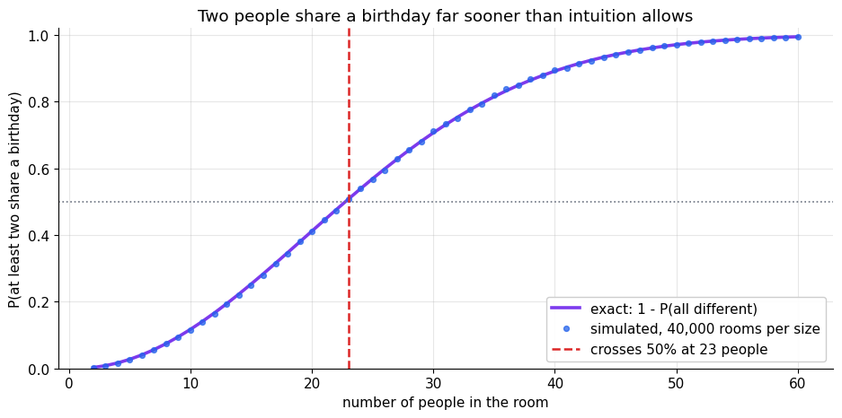

**Output**

```text
crossover from the EXACT curve      : 23 people (P = 0.5073)
crossover from the SIMULATED curve  : 23 people (P = 0.5066)
largest gap between the two curves  : 0.0049

   10 people   exact 0.1169   simulated 0.1160
   23 people   exact 0.5073   simulated 0.5066
   30 people   exact 0.7063   simulated 0.7104
   50 people   exact 0.9704   simulated 0.9698
   60 people   exact 0.9941   simulated 0.9942

a room of 23 people holds 253 PAIRS of people,
which is what the probability actually tracks -- not the people.
contrast: P(someone shares MY birthday) reaches 50% only at 253 people -- a different, far rarer question.
(that the two numbers above are both 253 is a genuine coincidence, not a bug)
```

### Cell 57

```python
# ============================================================
#  Three-event inclusion-exclusion, verified term by term.
# ============================================================
A, B, C = inbox["spam"], inbox["free"], inbox["winner"]

singles = A.mean() + B.mean() + C.mean()
pairs_  = (A & B).mean() + (A & C).mean() + (B & C).mean()
triple  = (A & B & C).mean()
by_rule = singles - pairs_ + triple
counted = (A | B | C).mean()

print(f"  + singles (3 terms)   {singles:+.4f}")
print(f"  - pairs   (3 terms)   {-pairs_:+.4f}")
print(f"  + triple  (1 term)    {triple:+.4f}")
print(f"  {'':22s}--------")
confirm("P(spam or 'free' or 'winner')", by_rule, counted)
confirm("  naive addition instead", singles, counted)

print()
for k in (2, 3, 5, 10, 23):
    print(f"   {k:>2d} events -> {2**k - 1:>10,} terms in inclusion-exclusion")
print("\n...against ONE product for the complement. This is why 'at least one'")
print("is always attacked from the 'none' side.")
```

**Output**

```text
  + singles (3 terms)   +0.6259
  - pairs   (3 terms)   -0.3602
  + triple  (1 term)    +0.0689
                        --------
P(spam or 'free' or 'winner')      rule  0.3347   counted  0.3347   gap 0.0000   agree
  naive addition instead           rule  0.6259   counted  0.3347   gap 0.2913   *** DISAGREE ***

    2 events ->          3 terms in inclusion-exclusion
    3 events ->          7 terms in inclusion-exclusion
    5 events ->         31 terms in inclusion-exclusion
   10 events ->      1,023 terms in inclusion-exclusion
   23 events ->  8,388,607 terms in inclusion-exclusion

...against ONE product for the complement. This is why 'at least one'
is always attacked from the 'none' side.
```

### Cell 60

```python
# ============================================================
#  A two-stage tree, with every number counted from the inbox.
# ============================================================
A, B = inbox["spam"], inbox["free"]
p_spam, p_ham = A.mean(), (~A).mean()
p_free_g_spam = B[A].mean()          # share of 'free' AMONG spam
p_free_g_ham  = B[~A].mean()         # share of 'free' among the rest

paths = [("spam", "free",     p_spam, p_free_g_spam,     A & B,  C_SLOPE),
         ("spam", "no free",  p_spam, 1 - p_free_g_spam, A & ~B, C_SLOPE),
         ("ham",  "free",     p_ham,  p_free_g_ham,      ~A & B, C_F),
         ("ham",  "no free",  p_ham,  1 - p_free_g_ham,  ~A & ~B, C_F)]

fig, ax = plt.subplots(figsize=(10, 5.2))
ys1, ys2 = {"spam": 1.6, "ham": -1.6}, [2.4, 0.8, -0.8, -2.4]
for lab, y in ys1.items():
    ax.plot([0, 1], [0, y], color=C_SLOPE if lab == "spam" else C_F, lw=2.2)
ax.plot(0, 0, "o", ms=11, color=C_GREY)
ax.text(-0.09, 0, "one\nemail", ha="right", va="center", fontsize=10)

ax.text(0.5, 0.95, f"{p_spam:.3f}", ha="center", fontsize=10.5, color=C_SLOPE,
        weight="bold", bbox=dict(fc="white", ec="none", pad=1.5))
ax.text(0.5, -0.95, f"{p_ham:.3f}", ha="center", fontsize=10.5, color=C_F,
        weight="bold", bbox=dict(fc="white", ec="none", pad=1.5))
ax.text(1.06, 1.6, "spam", fontsize=11, color=C_SLOPE, weight="bold", va="center")
ax.text(1.06, -1.6, "not spam", fontsize=11, color=C_F, weight="bold", va="center")

total = 0.0
for (s1, s2, q1, q2, ev, colour), y2 in zip(paths, ys2):
    y1 = ys1["spam" if s1 == "spam" else "ham"]
    ax.plot([1.5, 2.6], [y1, y2], color=colour, lw=2.0, alpha=0.85)
    ax.text(2.05, (y1 + y2) / 2 + 0.14, f"{q2:.3f}", ha="center", fontsize=10,
            color=colour, bbox=dict(fc="white", ec="none", pad=1.2))
    prod = q1 * q2
    total += prod
    ax.text(2.7, y2, f"{s1} + {s2}", fontsize=10, va="center")
    ax.text(4.25, y2, f"{q1:.3f} x {q2:.3f} = {prod:.4f}", fontsize=10,
            va="center", color=colour, weight="bold")
    ax.text(5.75, y2, f"counted {ev.mean():.4f}", fontsize=10, va="center",
            color=C_GREY)

ax.text(4.25, -3.3, f"the four tips sum to {total:.4f}", ha="center",
        fontsize=11, weight="bold", color=C_EXACT)
ax.set_xlim(-0.6, 6.9); ax.set_ylim(-3.8, 3.2)
ax.axis("off"); ax.grid(False)
ax.set_title("Multiply along a path. Add across the tips.", fontsize=12)
plt.tight_layout(); plt.show()

print("every tip: product along the path vs the same event counted directly")
for s1, s2, q1, q2, ev, _ in paths:
    confirm(f"P({s1} and {s2})", q1 * q2, ev.mean())
print(f"\nsum over all four tips = {total:.6f}   (must be exactly 1)")
print(f"branch pair at each fork sums to 1: "
      f"{np.isclose(p_spam + p_ham, 1)} and "
      f"{np.isclose(p_free_g_spam + (1 - p_free_g_spam), 1)}")
```

**Output**

```text
<Figure size 1000x520 with 1 Axes>
```

**Figure**

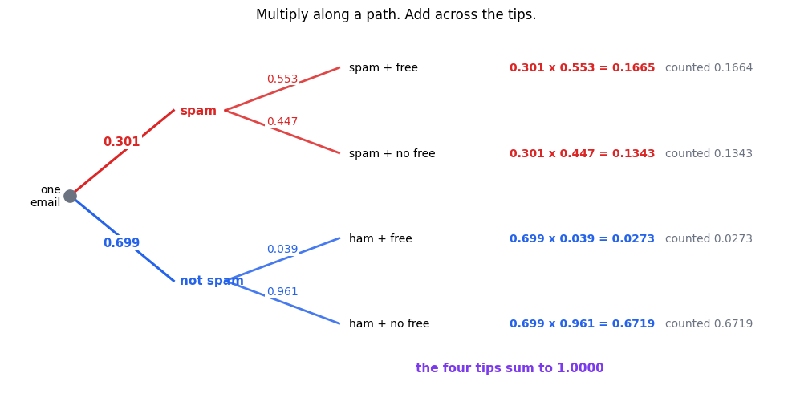

**Output**

```text
every tip: product along the path vs the same event counted directly
P(spam and free)                   rule  0.1665   counted  0.1664   gap 0.0000   agree
P(spam and no free)                rule  0.1343   counted  0.1343   gap 0.0000   agree
P(ham and free)                    rule  0.0273   counted  0.0273   gap 0.0000   agree
P(ham and no free)                 rule  0.6719   counted  0.6719   gap 0.0000   agree

sum over all four tips = 1.000000   (must be exactly 1)
branch pair at each fork sums to 1: True and True
```

### Cell 66

```python
# ============================================================
#  Conditioning is filtering. That is the entire idea.
# ============================================================
free_mask = inbox["free"]          # True where the email contains "free"
survivors = is_spam[free_mask]     # STEP 1: keep only those emails

n_all  = len(is_spam)
n_kept = len(survivors)

print("STEP 1 -- restrict")
print(f"  emails we started with      : {n_all:,}")
print(f"  emails containing 'free'    : {n_kept:,}")
print(f"  emails thrown away          : {n_all - n_kept:,}")
print()
print("STEP 2 -- count, inside what survived")
print(f"  of the survivors, spam      : {int(survivors.sum()):,}")
print(f"  fraction of survivors that are spam = {survivors.mean():.4f}")
print()
print("That fraction IS P(spam | 'free'). We wrote no formula to get it.")
print()
print("For contrast, the same question asked of EVERY email:")
print(f"  fraction of all emails that are spam = {is_spam.mean():.4f}")
print()
print("Knowing the word 'free' is present changed the answer a great deal.")
print("That change is the whole reason conditional probability exists.")
```

**Output**

```text
STEP 1 -- restrict
  emails we started with      : 20,000
  emails containing 'free'    : 3,875
  emails thrown away          : 16,125

STEP 2 -- count, inside what survived
  of the survivors, spam      : 3,329
  fraction of survivors that are spam = 0.8591

That fraction IS P(spam | 'free'). We wrote no formula to get it.

For contrast, the same question asked of EVERY email:
  fraction of all emails that are spam = 0.3008

Knowing the word 'free' is present changed the answer a great deal.
That change is the whole reason conditional probability exists.
```

### Cell 69

```python
# ============================================================
#  p_est -- count (and optionally filter) inside the inbox.
#  Joins estimate_prob / running_estimate / confirm from Part 1
#  as the fourth tool the rest of the notebook re-uses.
# ============================================================
import numpy as np

def p_est(event, given=None):
    """Fraction of emails where `event` is True.

    event : boolean array over the 20,000 emails
    given : optional boolean array. If supplied, we FIRST discard every
            email where `given` is False, then take the fraction among
            what is left -- i.e. this returns P(event | given).
    """
    event = np.asarray(event)
    if given is None:
        return float(event.mean())
    given = np.asarray(given)
    n_kept = int(given.sum())
    if n_kept == 0:
        raise ZeroDivisionError(
            "cannot condition on an event that never happened -- there is "
            "nothing left to count (see the warning box in section 3.6)")
    return float(event[given].mean())


spam, free = inbox["spam"], inbox["free"]

print(f"P(spam)            = {p_est(spam):.4f}")
print(f"P('free')          = {p_est(free):.4f}")
print(f"P(spam AND 'free') = {p_est(spam & free):.4f}")
print(f"P(spam | 'free')   = {p_est(spam, given=free):.4f}")
print(f"P('free' | spam)   = {p_est(free, given=spam):.4f}   <-- a DIFFERENT number")
print()
print("Hold on to those last two lines. Section 3.7 is entirely about them.")
```

**Output**

```text
P(spam)            = 0.3008
P('free')          = 0.1938
P(spam AND 'free') = 0.1664
P(spam | 'free')   = 0.8591
P('free' | spam)   = 0.5534   <-- a DIFFERENT number

Hold on to those last two lines. Section 3.7 is entirely about them.
```

### Cell 71

```python
# ============================================================
#  Filtering and the formula must agree. Check it.
# ============================================================
by_filtering = p_est(spam, given=free)            # restrict, then count
by_formula   = p_est(spam & free) / p_est(free)   # P(A and B) / P(B)

print(f"by filtering the array : {by_filtering:.10f}")
print(f"by the formula         : {by_formula:.10f}")
print(f"difference             : {abs(by_filtering - by_formula):.2e}")
print()
print("Identical to floating-point noise -- not approximately, IDENTICALLY,")
print("because the formula is literally the same two counts rearranged.")
print()

# and it works whichever way round, and for compound conditions too
tests = [("spam",      spam,             "'winner'",          inbox["winner"]),
         ("'meeting'", inbox["meeting"], "not spam",          ~spam),
         ("'free'",    free,             "spam AND 'winner'", spam & inbox["winner"])]

for na, a, nb, b in tests:
    confirm(f"P({na} | {nb})", p_est(a & b) / p_est(b), p_est(a, given=b))
```

**Output**

```text
by filtering the array : 0.8590967742
by the formula         : 0.8590967742
difference             : 1.11e-16

Identical to floating-point noise -- not approximately, IDENTICALLY,
because the formula is literally the same two counts rearranged.

P(spam | 'winner')                 rule  0.9482   counted  0.9482   gap 0.0000   agree
P('meeting' | not spam)            rule  0.3784   counted  0.3784   gap 0.0000   agree
P('free' | spam AND 'winner')      rule  0.5536   counted  0.5536   gap 0.0000   agree
```

### Cell 74

```python
# ============================================================
#  Conditioning = zooming in until B is the whole picture.
# ============================================================
import matplotlib.pyplot as plt
from matplotlib.patches import Rectangle

# geometry: (x, y, width, height) inside a unit square of total area 1
Bx, By, Bw, Bh = 0.10, 0.15, 0.50, 0.70
Ax, Ay, Aw, Ah = 0.40, 0.30, 0.55, 0.45
Ix, Iy = max(Ax, Bx), max(Ay, By)                       # the overlap
Iw, Ih = min(Ax + Aw, Bx + Bw) - Ix, min(Ay + Ah, By + Bh) - Iy

P_A, P_B, P_AB = Aw * Ah, Bw * Bh, Iw * Ih

fig, ax = plt.subplots(1, 2, figsize=(11, 4.8))

# ---- left: the whole sample space
ax[0].add_patch(Rectangle((0, 0), 1, 1, fc="white", ec=C_GREY, lw=2))
ax[0].add_patch(Rectangle((Bx, By), Bw, Bh, fc=C_F,     alpha=.28, ec=C_F,     lw=2))
ax[0].add_patch(Rectangle((Ax, Ay), Aw, Ah, fc=C_SLOPE, alpha=.28, ec=C_SLOPE, lw=2))
ax[0].add_patch(Rectangle((Ix, Iy), Iw, Ih, fc=C_EXACT, alpha=.75, ec="none"))
ax[0].text(0.16, 0.80, "B", color=C_F,     fontsize=17, weight="bold")
ax[0].text(0.90, 0.68, "A", color=C_SLOPE, fontsize=17, weight="bold")
ax[0].text(0.02, 1.03, "everything (area = 1)", color=C_GREY, fontsize=10)
ax[0].set_title(f"BEFORE: P(A) = {P_A:.4f},  P(B) = {P_B:.4f}\n"
                f"purple overlap = P(A and B) = {P_AB:.4f}", fontsize=11)

# ---- right: zoom until B fills the frame
ax[1].add_patch(Rectangle((Bx, By), Bw, Bh, fc=C_F, alpha=.28, ec=C_F, lw=2))
ax[1].add_patch(Rectangle((Ix, Iy), Iw, Ih, fc=C_EXACT, alpha=.75, ec="none"))
ax[1].text(Bx + .03, By + Bh - .05, "B is now\neverything", color=C_F,
           fontsize=13, weight="bold", va="top")
ax[1].text(Ix + .015, Iy + .06, "A", color=C_EXACT, fontsize=15, weight="bold")
ax[1].set_xlim(Bx - .01, Bx + Bw + .01)
ax[1].set_ylim(By - .01, By + Bh + .01)
ax[1].set_title(f"AFTER conditioning on B\n"
                f"P(A | B) = {P_AB:.4f} / {P_B:.4f} = {P_AB / P_B:.4f}", fontsize=11)

for a in ax:
    a.set_xticks([]); a.set_yticks([]); a.grid(False); a.set_aspect("equal")
    for s in a.spines.values():
        s.set_visible(False)
plt.tight_layout(); plt.show()

print(f"P(A and B) = {P_AB:.4f}   measured against everything")
print(f"P(A | B)   = {P_AB / P_B:.4f}   the SAME purple patch, re-measured against B")
print()
print("The purple region never changed size. Only the ruler changed.")
```

**Output**

```text
<Figure size 1100x480 with 2 Axes>
```

**Figure**

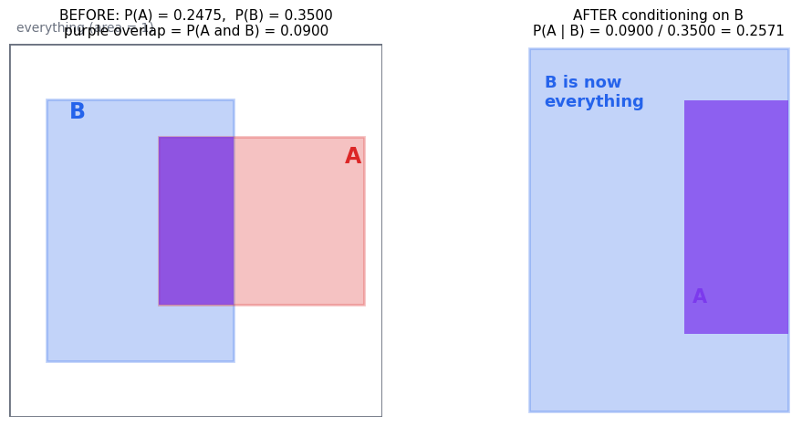

**Output**

```text
P(A and B) = 0.0900   measured against everything
P(A | B)   = 0.2571   the SAME purple patch, re-measured against B

The purple region never changed size. Only the ruler changed.
```

### Cell 78

```python
# ============================================================
#  Multiplication rule and chain rule, checked by counting.
# ============================================================
winner, meeting = inbox["winner"], inbox["meeting"]

print("MULTIPLICATION RULE      P(A and B) = P(A|B) P(B)")
confirm("  P(spam|'free') P('free')", p_est(spam, given=free) * p_est(free),
        p_est(spam & free))
confirm("  P('free'|spam) P(spam)", p_est(free, given=spam) * p_est(spam),
        p_est(spam & free))
print()

print("CHAIN RULE               P(A and B and C) = P(A|B,C) P(B|C) P(C)")
confirm("  three-step chain",
        (p_est(spam, given=free & winner) * p_est(free, given=winner)
         * p_est(winner)),
        p_est(spam & free & winner))
print()

# the order really is free: all 6 orderings of the same three events
import itertools
named = {"spam": spam, "'free'": free, "'winner'": winner}
print("  all 6 orderings of the chain rule give the same product:")
for order in itertools.permutations(named):
    a, b, c = (named[k] for k in order)
    print(f"    {' , '.join(order):<34} -> "
          f"{p_est(a, given=b & c) * p_est(b, given=c) * p_est(c):.6f}")
```

**Output**

```text
MULTIPLICATION RULE      P(A and B) = P(A|B) P(B)
  P(spam|'free') P('free')         rule  0.1664   counted  0.1664   gap 0.0000   agree
  P('free'|spam) P(spam)           rule  0.1665   counted  0.1664   gap 0.0000   agree

CHAIN RULE               P(A and B and C) = P(A|B,C) P(B|C) P(C)
  three-step chain                 rule  0.0689   counted  0.0689   gap 0.0000   agree

  all 6 orderings of the chain rule give the same product:
    spam , 'free' , 'winner'           -> 0.068950
    spam , 'winner' , 'free'           -> 0.068950
    'free' , spam , 'winner'           -> 0.068950
    'free' , 'winner' , spam           -> 0.068950
    'winner' , spam , 'free'           -> 0.068950
    'winner' , 'free' , spam           -> 0.068950
```

### Cell 81

```python
# ============================================================
#  Test pairs for independence -- by BOTH definitions, with an
#  honest tolerance, because these are estimates from a sample.
# ============================================================
RNG3 = np.random.default_rng(303)

# A control event, built to be independent of everything else: nothing about
# spam or wording has any say in which weekday an email happened to arrive.
tuesday = RNG3.random(N_EMAILS) < 1 / 7

pairs = [("spam",      spam,    "'free'",   free),
         ("'free'",    free,    "'winner'", winner),
         ("'meeting'", meeting, "'report'", inbox["report"]),
         ("spam",      spam,    "Tuesday",  tuesday),
         ("'free'",    free,    "Tuesday",  tuesday)]

print(f"{'A':<11}{'B':<11}{'P(A)':>9}{'P(A|B)':>9}{'P(A)P(B)':>11}"
      f"{'P(A,B)':>9}{'z':>8}  verdict")
print("-" * 80)
for na, a, nb, b in pairs:
    pa, pb = p_est(a), p_est(b)
    pa_g_b = p_est(a, given=b)
    n_b    = int(np.asarray(b).sum())
    se     = np.sqrt(pa_g_b * (1 - pa_g_b) / n_b)   # noise in P(A|B) at this n
    z      = (pa_g_b - pa) / se                     # how many std errors apart
    print(f"{na:<11}{nb:<11}{pa:>9.4f}{pa_g_b:>9.4f}{pa * pb:>11.4f}"
          f"{p_est(a & b):>9.4f}{z:>8.1f}  "
          f"{'independent' if abs(z) < 3 else 'DEPENDENT'}")

print()
print("Read the table as two independent confirmations of the same thing:")
print("  * P(A) vs P(A|B)      -- did filtering on B move the answer?")
print("  * P(A)P(B) vs P(A,B)  -- does the product form hold?")
print("They agree on every row, because the two definitions ARE one definition.")
print()
print("'Tuesday' was constructed to be unrelated to everything, and the test")
print("finds it so. Every genuine word pair comes out DEPENDENT -- and for a")
print("reason worth naming: both words lean on whether the email is spam, so")
print("each one carries news about the other. Shared causes create dependence.")
```

**Output**

```text
A          B               P(A)   P(A|B)   P(A)P(B)   P(A,B)       z  verdict
--------------------------------------------------------------------------------
spam       'free'        0.3008   0.8591     0.0583   0.1664    99.9  DEPENDENT
'free'     'winner'      0.1938   0.5268     0.0254   0.0692    34.2  DEPENDENT
'meeting'  'report'      0.2742   0.3556     0.0641   0.0832    11.6  DEPENDENT
spam       Tuesday       0.3008   0.3181     0.0420   0.0445     2.0  independent
'free'     Tuesday       0.1938   0.2047     0.0271   0.0286     1.4  independent

Read the table as two independent confirmations of the same thing:
  * P(A) vs P(A|B)      -- did filtering on B move the answer?
  * P(A)P(B) vs P(A,B)  -- does the product form hold?
They agree on every row, because the two definitions ARE one definition.

'Tuesday' was constructed to be unrelated to everything, and the test
finds it so. Every genuine word pair comes out DEPENDENT -- and for a
reason worth naming: both words lean on whether the email is spam, so
each one carries news about the other. Shared causes create dependence.
```

### Cell 83

```python
# ============================================================
#  'free' and 'winner': dependent overall, independent WITHIN spam.
# ============================================================
worlds = [("all emails", np.ones(N_EMAILS, bool)),
          ("spam only",  spam),
          ("ham only",   ~spam)]

print(f"{'restricted to':<14}{'P(free)':>10}{'P(free|winner)':>16}{'gap':>9}")
print("-" * 49)
for label, world in worlds:
    p_f  = p_est(free, given=world)
    p_fw = p_est(free, given=world & winner)
    print(f"{label:<14}{p_f:>10.4f}{p_fw:>16.4f}{p_fw - p_f:>9.4f}")

print()
print("Row 1: a big gap -- knowing 'winner' appeared DOES change the odds of")
print("       'free' appearing, so overall the two words are dependent.")
print("Rows 2 and 3: the gap collapses to noise. Once you have been told")
print("       whether the email is spam, 'winner' adds nothing about 'free'.")
print()
print("So the words are dependent, but CONDITIONALLY INDEPENDENT given spam.")
print("Part 9's naive Bayes classifier assumes exactly this -- and here it is")
print("literally true, because that is how the inbox was generated.")
```

**Output**

```text
restricted to    P(free)  P(free|winner)      gap
-------------------------------------------------
all emails        0.1938          0.5268   0.3331
spam only         0.5534          0.5536   0.0002
ham only          0.0390          0.0368  -0.0023

Row 1: a big gap -- knowing 'winner' appeared DOES change the odds of
       'free' appearing, so overall the two words are dependent.
Rows 2 and 3: the gap collapses to noise. Once you have been told
       whether the email is spam, 'winner' adds nothing about 'free'.

So the words are dependent, but CONDITIONALLY INDEPENDENT given spam.
Part 9's naive Bayes classifier assumes exactly this -- and here it is
literally true, because that is how the inbox was generated.
```

### Cell 86

```python
# ============================================================
#  Conditioning on an impossible event: watch it fail.
# ============================================================
impossible = free & ~free      # "contains 'free' AND does not" -- never true

print(f"emails satisfying the impossible condition: {int(impossible.sum())}")
try:
    p_est(spam, given=impossible)
except ZeroDivisionError as e:
    print(f"p_est refused, correctly: {e}")

print()
print("Numpy, left to itself, is less principled about it:")
with np.errstate(invalid="ignore", divide="ignore"):
    print(f"  is_spam[impossible].mean() = {np.mean(is_spam[impossible])}")
print()
print("  ...a nan, out of 0/0. If that nan reaches a report as '0.0', or gets")
print("  quietly dropped by a mean() somewhere downstream, you have invented a")
print("  probability for a group that does not exist -- and nothing warned you.")
```

**Output**

```text
emails satisfying the impossible condition: 0
p_est refused, correctly: cannot condition on an event that never happened -- there is nothing left to count (see the warning box in section 3.6)

Numpy, left to itself, is less principled about it:
  is_spam[impossible].mean() = nan

  ...a nan, out of 0/0. If that nan reaches a report as '0.0', or gets
  quietly dropped by a mean() somewhere downstream, you have invented a
  probability for a group that does not exist -- and nothing warned you.
```

**Output**

```text
/usr/local/lib/python3.13/dist-packages/numpy/_core/fromnumeric.py:3904: RuntimeWarning: Mean of empty slice.
  return _methods._mean(a, axis=axis, dtype=dtype,
```

### Cell 88

```python
# ============================================================
#  Both directions, for every word, side by side.
# ============================================================
print(f"{'word':<10}{'P(word | spam)':>16}{'P(spam | word)':>16}{'ratio':>9}")
print("-" * 51)
for w in ["free", "meeting", "winner", "report"]:
    a = p_est(inbox[w], given=spam)      # of the spam, how much says the word
    b = p_est(spam, given=inbox[w])      # of the mail saying it, how much is spam
    print(f"{w:<10}{a:>16.4f}{b:>16.4f}{b / a:>8.2f}x")

print()
print("Not one row has the two columns equal. Every word is more telling as")
print("evidence than it is common in spam -- the right column beats the left")
print("on all four rows -- and 'winner' by more than a factor of two.")
print()
print("Now a deliberately extreme case. Suppose a word appears in 20% of spam")
print("and NEVER in legitimate mail:")

RNG3B = np.random.default_rng(3007)
smoking_gun = spam & (RNG3B.random(N_EMAILS) < 0.20)     # only ever inside spam

print(f"  P(word | spam) = {p_est(smoking_gun, given=spam):.4f}"
      "    <- most spam does NOT contain it")
print(f"  P(spam | word) = {p_est(spam, given=smoking_gun):.4f}"
      "    <- but if it IS there, the email is certainly spam")
print()
print("One fifth, and one. Same two events, same 20,000 emails, and the two")
print("conditional probabilities are about as far apart as they can get.")
print()
print("Why? Because the denominators are enormously different in size:")
print(f"  emails that are spam       : {int(spam.sum()):,}")
print(f"  emails containing the word : {int(smoking_gun.sum()):,}")
print("Dividing the same overlap by these two cannot give the same answer.")
```

**Output**

```text
word        P(word | spam)  P(spam | word)    ratio
---------------------------------------------------
free                0.5534          0.8591    1.55x
meeting             0.0322          0.0354    1.10x
winner              0.4141          0.9482    2.29x
report              0.0495          0.0637    1.29x

Not one row has the two columns equal. Every word is more telling as
evidence than it is common in spam -- the right column beats the left
on all four rows -- and 'winner' by more than a factor of two.

Now a deliberately extreme case. Suppose a word appears in 20% of spam
and NEVER in legitimate mail:
  P(word | spam) = 0.1898    <- most spam does NOT contain it
  P(spam | word) = 1.0000    <- but if it IS there, the email is certainly spam

One fifth, and one. Same two events, same 20,000 emails, and the two
conditional probabilities are about as far apart as they can get.

Why? Because the denominators are enormously different in size:
  emails that are spam       : 6,016
  emails containing the word : 1,142
Dividing the same overlap by these two cannot give the same answer.
```

### Cell 94

```python
# ============================================================
#  Law of total probability -- two-part and three-part
#  partitions, both verified against a straight count.
# ============================================================
print("TWO-PART PARTITION:  spam / not spam")
confirm("  P('free') from the 2 pieces",
        (p_est(free, given=spam) * p_est(spam)
         + p_est(free, given=~spam) * p_est(~spam)),
        p_est(free))
print()
print("  the two contributions, so you can watch the weighting do its work:")
for label, grp in [("spam", spam), ("ham ", ~spam)]:
    print(f"    {label}: rate {p_est(free, given=grp):.4f}  x  weight "
          f"{p_est(grp):.4f}  =  {p_est(free, given=grp) * p_est(grp):.4f}")
print()

print("THREE-PART PARTITION:  how many of the four words the email contains")
n_words = (free.astype(int) + winner.astype(int)
           + meeting.astype(int) + inbox["report"].astype(int))
parts = [("0 words", n_words == 0), ("1 word", n_words == 1), ("2+ words", n_words >= 2)]

# a partition must cover every email exactly once -- check that FIRST
cover = sum(g.astype(int) for _, g in parts)
print(f"  is every email in exactly one group? {bool((cover == 1).all())}")

confirm("  P(spam) from the 3 pieces",
        sum(p_est(spam, given=g) * p_est(g) for _, g in parts), p_est(spam))
print()
print(f"  {'group':<10}{'size P(Bi)':>12}{'P(spam|Bi)':>13}{'product':>10}")
print("  " + "-" * 45)
for label, g in parts:
    print(f"  {label:<10}{p_est(g):>12.4f}{p_est(spam, given=g):>13.4f}"
          f"{p_est(spam, given=g) * p_est(g):>10.4f}")
```

**Output**

```text
TWO-PART PARTITION:  spam / not spam
  P('free') from the 2 pieces      rule  0.1938   counted  0.1938   gap 0.0000   agree

  the two contributions, so you can watch the weighting do its work:
    spam: rate 0.5534  x  weight 0.3008  =  0.1665
    ham : rate 0.0390  x  weight 0.6992  =  0.0273

THREE-PART PARTITION:  how many of the four words the email contains
  is every email in exactly one group? True
  P(spam) from the 3 pieces        rule  0.3008   counted  0.3008   gap 0.0000   agree

  group       size P(Bi)   P(spam|Bi)   product
  ---------------------------------------------
  0 words         0.3580       0.2038    0.0730
  1 word          0.4609       0.3179    0.1465
  2+ words        0.1811       0.4492    0.0814
```

### Cell 96

```python
# ============================================================
#  The picture: a partition tiles the space, and A is the sum
#  of its slices.
# ============================================================
weights = [0.30, 0.45, 0.25]      # sizes of B1, B2, B3 -- they sum to 1
rates   = [0.70, 0.30, 0.10]      # P(A | Bi) inside each group

fig, ax = plt.subplots(1, 2, figsize=(11, 4.4),
                       gridspec_kw={"width_ratios": [1.3, 1]})

# ---- left: the partition, with A as the shaded lower portion of each strip
x, cols = 0.0, [C_F, C_AREA, C_APPROX]
for i, (w, r, c) in enumerate(zip(weights, rates, cols)):
    ax[0].add_patch(Rectangle((x, 0), w, 1, fc=c, alpha=.16, ec=c, lw=2))
    ax[0].add_patch(Rectangle((x, 0), w, r, fc=c, alpha=.70, ec="none"))
    ax[0].text(x + w / 2, 1.06, f"B{i + 1}", ha="center", color=c,
               fontsize=14, weight="bold")
    ax[0].text(x + w / 2, -0.10, f"width = {w:.2f}", ha="center",
               color=C_GREY, fontsize=9)
    ax[0].text(x + w / 2, r / 2, f"P(A|Bi)\n{r:.2f}", ha="center", va="center",
               fontsize=9, color="white", weight="bold")
    x += w
ax[0].set_xlim(-0.02, 1.02); ax[0].set_ylim(-0.18, 1.20)
ax[0].set_xticks([]); ax[0].set_yticks([]); ax[0].grid(False)
for s in ax[0].spines.values():
    s.set_visible(False)
ax[0].set_title("A partition tiles everything.\n"
                "Shaded = A. Its slices overlap nowhere and miss nothing.",
                fontsize=11)

# ---- right: the same total, as a stack of weighted contributions
contrib, bottom = [w * r for w, r in zip(weights, rates)], 0.0
for i, (c, col) in enumerate(zip(contrib, cols)):
    ax[1].bar(0, c, bottom=bottom, width=.5, color=col, alpha=.80,
              edgecolor="white", lw=2,
              label=f"B{i + 1}:  {weights[i]:.2f} x {rates[i]:.2f} = {c:.3f}")
    bottom += c
ax[1].axhline(bottom, color=C_EXACT, lw=2.5, ls="--")
ax[1].text(0.30, bottom + .010, f"P(A) = {bottom:.3f}", color=C_EXACT,
           fontsize=12, weight="bold")
ax[1].set_xlim(-.62, 1.42); ax[1].set_ylim(0, bottom * 1.38)
ax[1].set_xticks([]); ax[1].set_ylabel("probability")
ax[1].legend(fontsize=8.5, loc="lower right", frameon=False)
ax[1].set_title("P(A) is the sum of the slices:\nrate inside each group, "
                "weighted by group size", fontsize=11)
plt.tight_layout(); plt.show()

biggest_rate = rates.index(max(rates))
print(f"contributions : {[round(c, 4) for c in contrib]}")
print(f"total P(A)    : {sum(contrib):.4f}")
print(f"the highest per-group rate was {max(rates):.2f}, inside a group of "
      f"width {weights[biggest_rate]:.2f},")
print(f"contributing {contrib[biggest_rate]:.3f} of the {sum(contrib):.3f} total.")
print("A high rate inside a small group moves the total very little.")
```

**Output**

```text
<Figure size 1100x440 with 2 Axes>
```

**Figure**

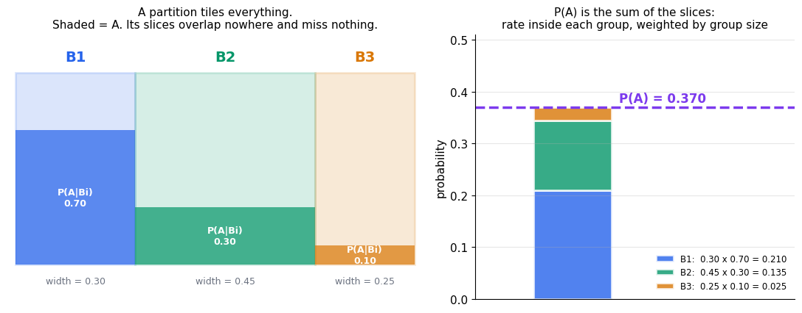

**Output**

```text
contributions : [0.21, 0.135, 0.025]
total P(A)    : 0.3700
the highest per-group rate was 0.70, inside a group of width 0.30,
contributing 0.210 of the 0.370 total.
A high rate inside a small group moves the total very little.
```

### Cell 101

```python
# ============================================================
#  Derived, so it must hold on the inbox. Check every word,
#  both against direct counting and against the long form.
# ============================================================
for w in ["free", "meeting", "winner", "report"]:
    b = inbox[w]

    counted = p_est(spam, given=b)                              # filter and count
    bayes   = p_est(b, given=spam) * p_est(spam) / p_est(b)     # the boxed form
    long    = (p_est(b, given=spam) * p_est(spam)               # with P(B) expanded
               / (p_est(b, given=spam) * p_est(spam)
                  + p_est(b, given=~spam) * p_est(~spam)))

    confirm(f"P(spam | '{w}')  short form", bayes, counted)
    confirm(f"P(spam | '{w}')  long form",  long,  counted)

print()
print("All three routes agree to floating-point noise on every word. They must:")
print("the derivation was two substitutions, and substitutions do not make new")
print("claims about the world.")
```

**Output**

```text
P(spam | 'free')  short form       rule  0.8591   counted  0.8591   gap 0.0000   agree
P(spam | 'free')  long form        rule  0.8591   counted  0.8591   gap 0.0000   agree
P(spam | 'meeting')  short form    rule  0.0354   counted  0.0354   gap 0.0000   agree
P(spam | 'meeting')  long form     rule  0.0354   counted  0.0354   gap 0.0000   agree
P(spam | 'winner')  short form     rule  0.9482   counted  0.9482   gap 0.0000   agree
P(spam | 'winner')  long form      rule  0.9482   counted  0.9482   gap 0.0000   agree
P(spam | 'report')  short form     rule  0.0637   counted  0.0637   gap 0.0000   agree
P(spam | 'report')  long form      rule  0.0637   counted  0.0637   gap 0.0000   agree

All three routes agree to floating-point noise on every word. They must:
the derivation was two substitutions, and substitutions do not make new
claims about the world.
```

### Cell 106

```python
# ============================================================
#  Part 0's question, computed. Every step printed.
# ============================================================
prevalence  = 0.001     # P(ill)              -- the PRIOR / base rate
sensitivity = 0.99      # P(+ | ill)          -- the LIKELIHOOD
specificity = 0.99      # P(- | healthy)
fpr         = 1 - specificity   # P(+ | healthy) -- the false positive rate

# --- numerator: the two ways to test positive, weighted by how common each is
ill_and_pos     = sensitivity * prevalence               # ill, correctly flagged
healthy_and_pos = fpr * (1 - prevalence)                 # healthy, wrongly flagged
p_positive      = ill_and_pos + healthy_and_pos          # the EVIDENCE, P(+)

posterior = ill_and_pos / p_positive                     # the POSTERIOR

print("The two routes to a positive test, per 1 person:")
print(f"  ill AND positive     = P(+|ill) P(ill)         "
      f"= {sensitivity:.2f} x {prevalence:.4f}   = {ill_and_pos:.6f}")
print(f"  healthy AND positive = P(+|healthy) P(healthy) "
      f"= {fpr:.2f} x {1 - prevalence:.4f}   = {healthy_and_pos:.6f}")
print(f"  -------------------------------------------------------------------")
print(f"  P(+) = anyone positive                                = {p_positive:.6f}")
print()
print(f"P(ill | +) = {ill_and_pos:.6f} / {p_positive:.6f} = "
      f"{posterior:.6f}   ->  {posterior * 100:.1f}%")
print()
print(f"So a positive result on a 99%-accurate test leaves you about "
      f"{posterior * 100:.0f}% likely to be ill,")
print(f"and about {(1 - posterior) * 100:.0f}% likely to be perfectly healthy.")
print()
print("Look at which of the two numerator lines is bigger. The false positives")
print(f"outnumber the true positives {healthy_and_pos / ill_and_pos:.1f} to 1 --")
print("not because the test is bad, but because healthy people are 999 times")
print("more numerous, and 1% of a huge group beats 99% of a tiny one.")
```

**Output**

```text
The two routes to a positive test, per 1 person:
  ill AND positive     = P(+|ill) P(ill)         = 0.99 x 0.0010   = 0.000990
  healthy AND positive = P(+|healthy) P(healthy) = 0.01 x 0.9990   = 0.009990
  -------------------------------------------------------------------
  P(+) = anyone positive                                = 0.010980

P(ill | +) = 0.000990 / 0.010980 = 0.090164   ->  9.0%

So a positive result on a 99%-accurate test leaves you about 9% likely to be ill,
and about 91% likely to be perfectly healthy.

Look at which of the two numerator lines is bigger. The false positives
outnumber the true positives 10.1 to 1 --
not because the test is bad, but because healthy people are 999 times
more numerous, and 1% of a huge group beats 99% of a tiny one.
```

### Cell 108

```python
# ============================================================
#  A million people. Test every one. Count. No formulas.
# ============================================================
import numpy as np

RNG4 = np.random.default_rng(404)
N_PEOPLE = 1_000_000

ill = RNG4.random(N_PEOPLE) < prevalence              # who is actually ill
p_pos_each = np.where(ill, sensitivity, fpr)          # each person's chance of +
tested_pos = RNG4.random(N_PEOPLE) < p_pos_each       # who tests positive

n_ill      = int(ill.sum())
n_pos      = int(tested_pos.sum())
n_true_pos = int((ill & tested_pos).sum())
n_false_pos = n_pos - n_true_pos

print(f"people simulated              : {N_PEOPLE:,}")
print(f"  actually ill                : {n_ill:,}")
print(f"  tested positive             : {n_pos:,}")
print(f"     of those, truly ill      : {n_true_pos:,}   (true positives)")
print(f"     of those, perfectly fine : {n_false_pos:,}   (false positives)")
print()

simulated = n_true_pos / n_pos
confirm("P(ill | positive test)", posterior, simulated)
print(f"  Bayes says {posterior * 100:.2f}%, the headcount says {simulated * 100:.2f}%")
print()
print("Nobody applied a formula to those people. We generated them, tested")
print("them, and counted the ones who were both positive and ill. The answer")
print("is the same. The 9% is not an artefact of the algebra -- it is what")
print("actually happens.")
```

**Output**

```text
people simulated              : 1,000,000
  actually ill                : 977
  tested positive             : 10,813
     of those, truly ill      : 964   (true positives)
     of those, perfectly fine : 9,849   (false positives)

P(ill | positive test)             rule  0.0902   counted  0.0892   gap 0.0010   agree
  Bayes says 9.02%, the headcount says 8.92%

Nobody applied a formula to those people. We generated them, tested
them, and counted the ones who were both positive and ill. The answer
is the same. The 9% is not an artefact of the algebra -- it is what
actually happens.
```

### Cell 111

```python
# ============================================================
#  10,000 people, one square each, coloured by outcome.
# ============================================================
import matplotlib.pyplot as plt
from matplotlib.colors import ListedColormap
from matplotlib.patches import Patch

RNG4B = np.random.default_rng(4040)
N_GRID = 10_000

g_ill = RNG4B.random(N_GRID) < prevalence
g_pos = RNG4B.random(N_GRID) < np.where(g_ill, sensitivity, fpr)

# 0 healthy & negative | 1 healthy & POSITIVE | 2 ill & POSITIVE | 3 ill & negative
cat = np.where(g_ill, np.where(g_pos, 2, 3), np.where(g_pos, 1, 0))
counts = [int((cat == k).sum()) for k in range(4)]

# group them so the blocks can be compared by eye (drawing order: 0,1,2,3)
grid = np.sort(cat).reshape(100, 100)

cmap = ListedColormap([C_SOFT, C_APPROX, C_SLOPE, C_F])
fig, ax = plt.subplots(figsize=(7.6, 7.6))
ax.imshow(grid, cmap=cmap, vmin=0, vmax=3, interpolation="nearest")
ax.set_xticks([]); ax.set_yticks([]); ax.grid(False)
ax.set_title("10,000 people. 1 in 1,000 is ill. Everybody is tested.\n"
             "Squares are grouped by outcome so the blocks can be compared.",
             fontsize=12)
ax.legend(handles=[
    Patch(fc=C_SOFT,   label=f"healthy, negative  ({counts[0]:,})"),
    Patch(fc=C_APPROX, label=f"healthy, POSITIVE  ({counts[1]:,})  <- false alarms"),
    Patch(fc=C_SLOPE,  label=f"ill, POSITIVE      ({counts[2]:,})  <- true alarms"),
    Patch(fc=C_F,      label=f"ill, negative      ({counts[3]:,})  <- missed"),
], loc="upper center", bbox_to_anchor=(0.5, -0.02), frameon=False, fontsize=10)
plt.tight_layout(); plt.show()

n_alarm = counts[1] + counts[2]
print(f"squares that lit up positive : {n_alarm:,}")
print(f"  of which genuinely ill     : {counts[2]:,}")
print(f"  of which false alarms      : {counts[1]:,}")
print(f"P(ill | +) in this grid      = {counts[2]} / {n_alarm} = "
      f"{counts[2] / n_alarm:.4f}")
print(f"Bayes said                   = {posterior:.4f}")
```

**Output**

```text
<Figure size 760x760 with 1 Axes>
```

**Figure**

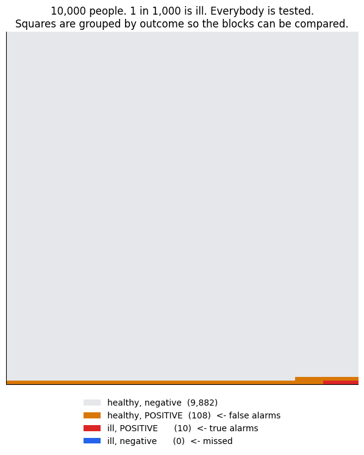

**Output**

```text
squares that lit up positive : 118
  of which genuinely ill     : 10
  of which false alarms      : 108
P(ill | +) in this grid      = 10 / 118 = 0.0847
Bayes said                   = 0.0902
```

### Cell 115

```python
# ============================================================
#  Sweep the base rate. Same test throughout -- only the
#  prevalence changes.
# ============================================================
prev = np.logspace(-5, -1, 400)          # 1 in 100,000  ...  1 in 10
post = (sensitivity * prev) / (sensitivity * prev + fpr * (1 - prev))

fig, ax = plt.subplots(figsize=(9.5, 5))
ax.semilogx(prev, post, color=C_EXACT, lw=3)
ax.axhline(0.5, color=C_GREY, ls=":", lw=1.5)
ax.text(1.2e-5, 0.52, "coin flip -- above this line a positive result\n"
                      "means you are more likely ill than not",
        color=C_GREY, fontsize=9)

# mark the case we solved
ax.plot([prevalence], [posterior], "o", ms=11, color=C_SLOPE, zorder=5)
ax.annotate(f"1 in 1,000\nP(ill | +) = {posterior:.3f}",
            xy=(prevalence, posterior), xytext=(2.2e-4, 0.36),
            color=C_SLOPE, fontsize=11, weight="bold",
            arrowprops=dict(arrowstyle="->", color=C_SLOPE, lw=1.8))

# the prevalence at which a positive becomes more likely right than wrong
breakeven = fpr / (sensitivity + fpr)
ax.plot([breakeven], [0.5], "s", ms=9, color=C_AREA, zorder=5)
ax.annotate(f"break-even at 1 in {1 / breakeven:.0f}",
            xy=(breakeven, 0.5), xytext=(6e-3, 0.68),
            color=C_AREA, fontsize=10, weight="bold",
            arrowprops=dict(arrowstyle="->", color=C_AREA, lw=1.6))

ax.set_xlabel("how common the disease is  (prevalence, log scale)")
ax.set_ylabel("P(ill | positive test)")
ax.set_title("Identical test, sensitivity 99% and specificity 99%, throughout.\n"
             "The only thing changing is how common the disease is.", fontsize=12)
ax.set_ylim(0, 1)
plt.tight_layout(); plt.show()

print("same test, same positive result, different populations:")
print(f"{'prevalence':>14}{'P(ill | +)':>14}")
print("-" * 28)
for p in [1e-5, 1e-4, 1e-3, 1e-2, 5e-2, 1e-1]:
    q = sensitivity * p / (sensitivity * p + fpr * (1 - p))
    print(f"{'1 in ' + format(int(round(1 / p)), ','):>14}{q:>14.4f}")
print()
print(f"break-even prevalence (where P(ill|+) hits 0.5) = "
      f"1 in {1 / breakeven:.0f}")
print()
print("The test never changed. Everything you should conclude from a positive")
print("result did. THAT is the base rate doing all the work.")
```

**Output**

```text
<Figure size 950x500 with 1 Axes>
```

**Figure**

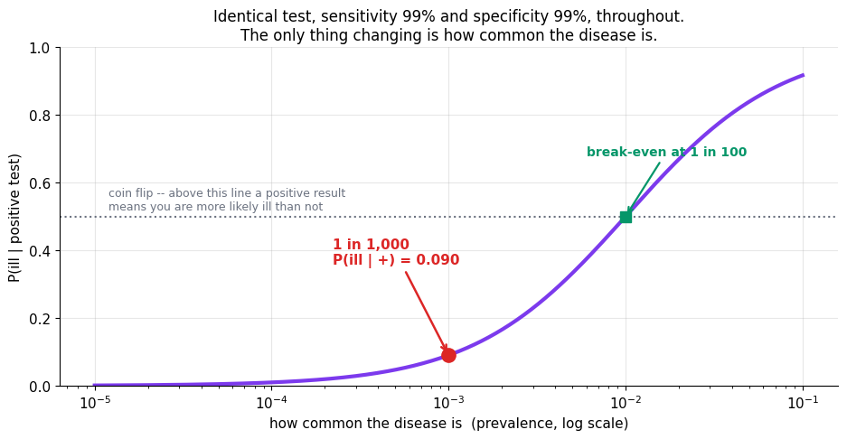

**Output**

```text
same test, same positive result, different populations:
    prevalence    P(ill | +)
----------------------------
  1 in 100,000        0.0010
   1 in 10,000        0.0098
    1 in 1,000        0.0902
      1 in 100        0.5000
       1 in 20        0.8390
       1 in 10        0.9167

break-even prevalence (where P(ill|+) hits 0.5) = 1 in 100

The test never changed. Everything you should conclude from a positive
result did. THAT is the base rate doing all the work.
```

### Cell 118

```python
# ============================================================
#  A 99.9%-accurate classifier that has never been right.
# ============================================================
n_test = 100_000
RNG4C  = np.random.default_rng(4041)
fraud  = RNG4C.random(n_test) < 0.001            # 1 in 1,000 is fraud

lazy = np.zeros(n_test, bool)                    # "nothing is ever fraud"
print("MODEL A -- always predicts 'not fraud'")
print(f"  accuracy          : {(lazy == fraud).mean():.5f}  <- looks superb")
print(f"  frauds caught     : {int((lazy & fraud).sum())} of {int(fraud.sum())}")
print(f"  recall            : 0.00000")
print("  precision         : undefined -- it never flags anything")
print()

# a real, genuinely good detector: 90% sensitivity, 1% false positive rate
flag = RNG4C.random(n_test) < np.where(fraud, 0.90, 0.01)
tp, fp = int((flag & fraud).sum()), int((flag & ~fraud).sum())
print("MODEL B -- a real detector: catches 90% of fraud, 1% false alarm rate")
print(f"  accuracy          : {(flag == fraud).mean():.5f}  <- LOWER than model A")
print(f"  frauds caught     : {tp} of {int(fraud.sum())}")
print(f"  recall            : {tp / int(fraud.sum()):.4f}")
print(f"  precision         : {tp / (tp + fp):.4f}   <- the posterior, P(fraud|flagged)")
print()
print("Model B is worse on accuracy and incomparably more useful. Its precision")
print("is the SAME arithmetic as the medical test: a small prior multiplied in.")
print(f"Low, but not useless -- an analyst works through about "
      f"{(tp + fp) / tp:.0f} flags per real")
print("fraud found, which is a working process. Reporting model A's accuracy")
print("instead would be reporting the base rate and calling it skill.")
```

**Output**

```text
MODEL A -- always predicts 'not fraud'
  accuracy          : 0.99894  <- looks superb
  frauds caught     : 0 of 106
  recall            : 0.00000
  precision         : undefined -- it never flags anything

MODEL B -- a real detector: catches 90% of fraud, 1% false alarm rate
  accuracy          : 0.98942  <- LOWER than model A
  frauds caught     : 93 of 106
  recall            : 0.8774
  precision         : 0.0817   <- the posterior, P(fraud|flagged)

Model B is worse on accuracy and incomparably more useful. Its precision
is the SAME arithmetic as the medical test: a small prior multiplied in.
Low, but not useless -- an analyst works through about 12 flags per real
fraud found, which is a working process. Reporting model A's accuracy
instead would be reporting the base rate and calling it skill.
```

### Cell 120

```python
# ============================================================
#  P(spam | word) from prior + likelihoods, vs direct counting.
# ============================================================
prior_spam = p_est(spam)          # the base rate of spam, estimated from the inbox

print(f"prior  P(spam) = {prior_spam:.4f}")
print()
posts = {}
print(f"{'word':<9}{'P(w|spam)':>12}{'P(w|ham)':>11}{'-> P(spam|w)':>15}")
print("-" * 47)
for w in ["free", "meeting", "winner", "report"]:
    b = inbox[w]
    lik_s = p_est(b, given=spam)        # likelihood under spam
    lik_h = p_est(b, given=~spam)       # likelihood under ham

    num = lik_s * prior_spam
    posts[w] = num / (num + lik_h * (1 - prior_spam))
    print(f"{w:<9}{lik_s:>12.4f}{lik_h:>11.4f}{posts[w]:>15.4f}")

print()
print("and each of those posteriors against a straight filter-and-count:")
for w, post in posts.items():
    confirm(f"  P(spam | '{w}')", post, p_est(spam, given=inbox[w]))

print()
print("Read the 'free' row across, because it is section 3.7's pair sitting")
print("in one line: the likelihood P('free'|spam) and the posterior")
print("P(spam|'free') are different numbers, and Bayes is what converts one")
print("into the other by folding in the prior.")
print()
print("'meeting' and 'report' go the other way: both are commoner in legitimate")
print("mail, so seeing them pushes the posterior BELOW the 0.30 prior. Evidence")
print("can lower a belief as well as raise it.")
```

**Output**

```text
prior  P(spam) = 0.3008

word        P(w|spam)   P(w|ham)   -> P(spam|w)
-----------------------------------------------
free           0.5534     0.0390         0.8591
meeting        0.0322     0.3784         0.0354
winner         0.4141     0.0097         0.9482
report         0.0495     0.3131         0.0637

and each of those posteriors against a straight filter-and-count:
  P(spam | 'free')                 rule  0.8591   counted  0.8591   gap 0.0000   agree
  P(spam | 'meeting')              rule  0.0354   counted  0.0354   gap 0.0000   agree
  P(spam | 'winner')               rule  0.9482   counted  0.9482   gap 0.0000   agree
  P(spam | 'report')               rule  0.0637   counted  0.0637   gap 0.0000   agree

Read the 'free' row across, because it is section 3.7's pair sitting
in one line: the likelihood P('free'|spam) and the posterior
P(spam|'free') are different numbers, and Bayes is what converts one
into the other by folding in the prior.

'meeting' and 'report' go the other way: both are commoner in legitimate
mail, so seeing them pushes the posterior BELOW the 0.30 prior. Evidence
can lower a belief as well as raise it.
```

### Cell 123

```python
# ============================================================
#  Update twice, one word at a time, and check the result
#  against counting both words at once.
# ============================================================
def bayes_step(prior, lik_spam, lik_ham):
    """One Bayesian update. Returns the posterior."""
    num = lik_spam * prior
    return num / (num + lik_ham * (1 - prior))


belief = p_est(spam)                       # start from the base rate
print(f"start                        belief = {belief:.4f}   (the prior)")

for w in ["free", "winner"]:
    b = inbox[w]
    prev = belief
    belief = bayes_step(belief, p_est(b, given=spam), p_est(b, given=~spam))
    print(f"after seeing '{w}':".ljust(29)
          + f"belief = {belief:.4f}   (was {prev:.4f})")

print()
both = inbox["free"] & inbox["winner"]     # filter on BOTH words at once
confirm("P(spam | 'free' and 'winner')", belief, p_est(spam, given=both))
print(f"  (the direct count is over {int(both.sum()):,} emails containing both)")
print()

# order must not matter -- evidence is evidence
belief_rev = p_est(spam)
for w in ["winner", "free"]:
    b = inbox[w]
    belief_rev = bayes_step(belief_rev, p_est(b, given=spam), p_est(b, given=~spam))
print(f"same two words, opposite order : {belief_rev:.6f}")
print()
print("Two words took the belief from the base rate to near-certainty, and the")
print("order they arrived in made no difference.")
print()
print("The agreement with direct counting is NOT automatic -- it works because")
print("'free' and 'winner' are conditionally independent given spam, which")
print("section 3.6 measured. The next cell breaks that assumption on purpose.")
```

**Output**

```text
start                        belief = 0.3008   (the prior)
after seeing 'free':         belief = 0.8591   (was 0.3008)
after seeing 'winner':       belief = 0.9962   (was 0.8591)

P(spam | 'free' and 'winner')      rule  0.9962   counted  0.9964   gap 0.0002   agree
  (the direct count is over 1,384 emails containing both)

same two words, opposite order : 0.996162

Two words took the belief from the base rate to near-certainty, and the
order they arrived in made no difference.

The agreement with direct counting is NOT automatic -- it works because
'free' and 'winner' are conditionally independent given spam, which
section 3.6 measured. The next cell breaks that assumption on purpose.
```

### Cell 124

```python
# ============================================================
#  What the independence assumption is actually buying us:
#  break it and watch sequential updating go wrong.
# ============================================================
RNG4D = np.random.default_rng(4042)

# a near-duplicate of 'free' -- same word, essentially, seen twice
free_echo = np.where(inbox["free"], RNG4D.random(N_EMAILS) < 0.95,
                                    RNG4D.random(N_EMAILS) < 0.05)

print("Is the echo conditionally independent of 'free' given spam?")
print(f"  P(echo | spam)            = {p_est(free_echo, given=spam):.4f}")
print(f"  P(echo | spam and 'free') = {p_est(free_echo, given=spam & inbox['free']):.4f}")
print("  -> nowhere near equal, so NO: the assumption fails badly here.")
print()

belief = p_est(spam)
for name, b in [("'free'", inbox["free"]), ("echo", free_echo)]:
    belief = bayes_step(belief, p_est(b, given=spam), p_est(b, given=~spam))
    print(f"  after {name:<8} belief = {belief:.4f}")

truth = p_est(spam, given=inbox["free"] & free_echo)
print()
confirm("P(spam | 'free' and echo)", belief, truth)      # this one should NOT agree
print(f"  sequential updating is overconfident by {belief - truth:+.4f}")
print()
print("The second word was almost a copy of the first, so it carried barely any")
print("new information -- but naive updating counted it as a fresh, full-strength")
print("piece of evidence and pushed the belief too far. This is the characteristic")
print("failure of naive Bayes: correlated features get double-counted, and the")
print("posterior comes out overconfident. It often still RANKS cases correctly,")
print("which is why the method survives, but the probabilities are not trustworthy.")
```

**Output**

```text
Is the echo conditionally independent of 'free' given spam?
  P(echo | spam)            = 0.5427
  P(echo | spam and 'free') = 0.9444
  -> nowhere near equal, so NO: the assumption fails badly here.

  after 'free'   belief = 0.8591
  after echo     belief = 0.9747

P(spam | 'free' and echo)          rule  0.9747   counted  0.8569   gap 0.1178   *** DISAGREE ***
  sequential updating is overconfident by +0.1178

The second word was almost a copy of the first, so it carried barely any
new information -- but naive updating counted it as a fresh, full-strength
piece of evidence and pushed the belief too far. This is the characteristic
failure of naive Bayes: correlated features get double-counted, and the
posterior comes out overconfident. It often still RANKS cases correctly,
which is why the method survives, but the probabilities are not trustworthy.
```

### Cell 129

```python
# ============================================================
#  Define a random variable on the inbox.
#
#  X = the number of the four flag words present in an email.
#      Input : one email (an outcome)
#      Output: an integer in 0, 1, 2, 3, 4
#
#  Nothing random happens in this cell. X is a fixed rule.
#  The randomness was already in the inbox.
# ============================================================
import numpy as np

WORD_LIST = list(WORDS)                      # ['free', 'meeting', 'winner', 'report']
print("flag words:", WORD_LIST)

# apply the rule to all 20,000 emails at once
X_flag = np.zeros(N_EMAILS, dtype=int)
for w in WORD_LIST:
    X_flag += inbox[w].astype(int)

# look at the first eight emails: the outcome, then the number X assigns to it
print()
print(f"{'email':>6} | {'spam?':>6} | " + " | ".join(f"{w:>8}" for w in WORD_LIST) + " |  X")
print("-" * 62)
for i in range(8):
    flags = " | ".join(f"{str(bool(inbox[w][i])):>8}" for w in WORD_LIST)
    print(f"{i:>6} | {str(bool(is_spam[i])):>6} | {flags} | {X_flag[i]:>2}")

print()
print(f"X takes the values {sorted(set(X_flag.tolist()))}")
print(f"smallest X seen: {X_flag.min()}   largest X seen: {X_flag.max()}")
```

**Output**

```text
flag words: ['free', 'meeting', 'winner', 'report']

 email |  spam? |     free |  meeting |   winner |   report |  X
--------------------------------------------------------------
     0 |  False |    False |    False |    False |    False |  0
     1 |   True |    False |    False |    False |    False |  0
     2 |  False |    False |    False |    False |    False |  0
     3 |  False |    False |     True |    False |    False |  1
     4 |   True |     True |    False |    False |    False |  1
     5 |  False |     True |     True |    False |    False |  2
     6 |  False |     True |    False |    False |     True |  2
     7 |  False |    False |    False |    False |    False |  0

X takes the values [0, 1, 2, 3, 4]
smallest X seen: 0   largest X seen: 4
```

### Cell 132

```python
# ============================================================
#  The PMF: probability MASS function.
#  pmf(k) = P(X = k) = the fraction of emails with exactly k flag words.
#
#  Two ways to get it, and we insist they agree:
#    (1) COUNT   -- tally the 20,000 simulated emails
#    (2) DERIVE  -- work it out from the generating rules in Part 0
# ============================================================
import numpy as np

K = np.arange(0, len(WORD_LIST) + 1)          # possible values 0..4

# ---- (1) counted from the simulation
pmf_counted = np.array([(X_flag == k).mean() for k in K])

# ---- (2) derived from the true generating probabilities.
#      Within spam the four words appear independently with probabilities p_s.
#      "How many of n independent yes/no events happen" is obtained by
#      convolving [1-p, p] once per event -- polynomial multiplication.
def count_pmf(ps):
    """PMF of 'how many of these independent events occur'."""
    dist = np.array([1.0])
    for p in ps:
        dist = np.convolve(dist, [1.0 - p, p])
    return dist

p_given_spam = [WORDS[w][0] for w in WORD_LIST]
p_given_ham  = [WORDS[w][1] for w in WORD_LIST]

pmf_derived = (P_SPAM * count_pmf(p_given_spam)
               + (1 - P_SPAM) * count_pmf(p_given_ham))

print(f"{'k':>3} | {'counted P(X=k)':>15} | {'derived P(X=k)':>15} | {'gap':>9}")
print("-" * 52)
for k in K:
    print(f"{k:>3} | {pmf_counted[k]:>15.5f} | {pmf_derived[k]:>15.5f} "
          f"| {pmf_counted[k]-pmf_derived[k]:>9.5f}")

print()
print(f"counted PMF sums to : {pmf_counted.sum():.10f}")
print(f"derived PMF sums to : {pmf_derived.sum():.10f}")
print(f"largest gap between the two columns: {np.abs(pmf_counted-pmf_derived).max():.5f}")
```

**Output**

```text
  k |  counted P(X=k) |  derived P(X=k) |       gap
----------------------------------------------------
  0 |         0.35800 |         0.35676 |   0.00124
  1 |         0.46090 |         0.46350 |  -0.00260
  2 |         0.17115 |         0.16985 |   0.00130
  3 |         0.00985 |         0.00975 |   0.00010
  4 |         0.00010 |         0.00014 |  -0.00004

counted PMF sums to : 1.0000000000
derived PMF sums to : 1.0000000000
largest gap between the two columns: 0.00260
```

### Cell 134

```python
# ============================================================
#  PMF and CDF, side by side.
#    PMF: P(X = k)     -- the height of one bar
#    CDF: P(X <= k)    -- everything at or below k, added up
# ============================================================
import numpy as np
import matplotlib.pyplot as plt

cdf_counted = np.cumsum(pmf_counted)

fig, ax = plt.subplots(1, 2, figsize=(12, 4.2))

ax[0].bar(K, pmf_counted, width=0.6, color=C_F, edgecolor="white")
for k in K:
    ax[0].text(k, pmf_counted[k] + 0.012, f"{pmf_counted[k]:.3f}",
               ha="center", fontsize=9, color=C_GREY)
ax[0].set_title("PMF: P(X = k) -- mass at each value")
ax[0].set_xlabel("k = number of flag words")
ax[0].set_ylabel("probability")
ax[0].set_ylim(0, pmf_counted.max() * 1.22)

ax[1].step(np.append(K, K[-1] + 1), np.append(cdf_counted, 1.0),
           where="post", color=C_EXACT, lw=2.5)
ax[1].plot(K, cdf_counted, "o", color=C_EXACT, ms=7)
ax[1].axhline(1.0, color=C_GREY, ls="--", lw=1)
ax[1].set_title("CDF: P(X <= k) -- mass accumulated")
ax[1].set_xlabel("k")
ax[1].set_ylabel("probability")
ax[1].set_ylim(0, 1.1)

plt.tight_layout()
plt.show()

# the relationship, numerically: each jump in the CDF is exactly one PMF bar
jumps = np.diff(np.concatenate([[0.0], cdf_counted]))
print(f"{'k':>3} | {'PMF bar':>9} | {'CDF jump at k':>14} | {'equal?':>7}")
print("-" * 42)
for k in K:
    print(f"{k:>3} | {pmf_counted[k]:>9.5f} | {jumps[k]:>14.5f} "
          f"| {str(np.isclose(pmf_counted[k], jumps[k])):>7}")
print()
print(f"CDF ends at {cdf_counted[-1]:.10f}")
```

**Output**

```text
<Figure size 1200x420 with 2 Axes>
```

**Figure**

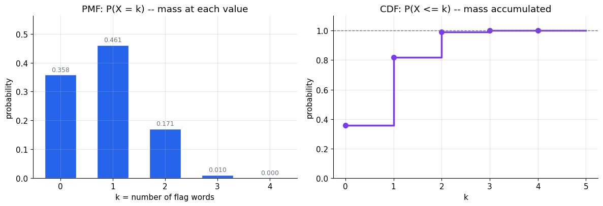

**Output**

```text
  k |   PMF bar |  CDF jump at k |  equal?
------------------------------------------
  0 |   0.35800 |        0.35800 |    True
  1 |   0.46090 |        0.46090 |    True
  2 |   0.17115 |        0.17115 |    True
  3 |   0.00985 |        0.00985 |    True
  4 |   0.00010 |        0.00010 |    True

CDF ends at 1.0000000000
```

### Cell 137

```python
# ============================================================
#  Watch a histogram turn into a density.
#  Same underlying variable each time -- only the sample size
#  and the bin width change.
# ============================================================
import numpy as np
import matplotlib.pyplot as plt
from scipy import stats

RNG5 = np.random.default_rng(505)      # our own stream; Part 0's RNG is untouched

settings = [(200, 8), (5_000, 30), (200_000, 120)]
grid = np.linspace(-4, 4, 400)
true_pdf = stats.norm.pdf(grid, loc=0.0, scale=1.0)

fig, ax = plt.subplots(1, 3, figsize=(13.5, 3.9), sharey=True)
for a, (n, bins) in zip(ax, settings):
    sample = RNG5.normal(0.0, 1.0, size=n)
    a.hist(sample, bins=bins, range=(-4, 4), density=True,
           color=C_SOFT, edgecolor=C_GREY, linewidth=0.4)
    a.plot(grid, true_pdf, color=C_EXACT, lw=2.5)
    a.set_title(f"n = {n:,}   bins = {bins}")
    a.set_xlabel("x")
ax[0].set_ylabel("density (not probability)")
plt.tight_layout()
plt.show()

# ---- the exact-value probability, checked by counting
big = RNG5.normal(0.0, 1.0, size=2_000_000)
print(f"drew {big.size:,} continuous values")
print(f"how many equal exactly 0.5 ............. {int((big == 0.5).sum())}")
print(f"how many equal exactly 0.0 ............. {int((big == 0.0).sum())}")
print(f"how many repeat any earlier value ...... {big.size - np.unique(big).size}")

# ---- but an INTERVAL has real probability: area matches the count
lo, hi = 0.5, 0.7
area = stats.norm.cdf(hi) - stats.norm.cdf(lo)     # the integral of f from lo to hi
frac = ((big >= lo) & (big <= hi)).mean()          # the honest count
print()
print(f"area under the density from {lo} to {hi} : {area:.5f}")
print(f"fraction of samples in that interval   : {frac:.5f}")
print(f"gap                                    : {abs(area-frac):.5f}")

# ---- a density can exceed 1 without anything being wrong
peak = stats.norm.pdf(0.0, loc=0.0, scale=0.2)
print()
print(f"peak density of a normal with sd 0.2   : {peak:.4f}   (> 1, and legal)")
```

**Output**

```text
<Figure size 1350x390 with 3 Axes>
```

**Figure**

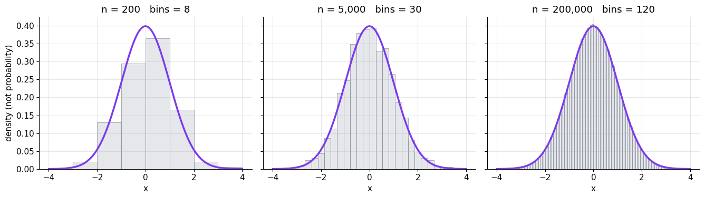

**Output**

```text
drew 2,000,000 continuous values
how many equal exactly 0.5 ............. 0
how many equal exactly 0.0 ............. 0
how many repeat any earlier value ...... 0

area under the density from 0.5 to 0.7 : 0.06657
fraction of samples in that interval   : 0.06645
gap                                    : 0.00012

peak density of a normal with sd 0.2   : 1.9947   (> 1, and legal)
```

### Cell 141

```python
# ============================================================
#  E[X], three ways. They must agree.
#    (1) by hand from the derived PMF     -- the definition
#    (2) the sample mean of 20,000 emails -- the long-run average
#    (3) a shortcut using linearity       -- previewing the next section
# ============================================================
import numpy as np

# (1) the definition: sum over k of  k * P(X = k)
E_by_definition = 0.0
print("E[X] = sum of k * P(X = k):")
for k in K:
    term = k * pmf_derived[k]
    E_by_definition += term
    print(f"    k={k}:  {k} * {pmf_derived[k]:.5f} = {term:.5f}")
print(f"    ----------------------------  total = {E_by_definition:.5f}")

# (2) the long-run average: just average the 20,000 numbers
E_sample = X_flag.mean()

# (3) X is the sum of four yes/no indicators, one per word.
#     The expectation of a yes/no indicator is just its probability.
E_linearity = sum(P_SPAM * p_s + (1 - P_SPAM) * p_h
                  for p_s, p_h in (WORDS[w] for w in WORD_LIST))

print()
print(f"(1) from the PMF, by hand   : {E_by_definition:.5f}")
print(f"(2) sample mean of {N_EMAILS:,} : {E_sample:.5f}")
print(f"(3) shortcut via linearity  : {E_linearity:.5f}")
print()
print(f"definition vs shortcut  gap : {abs(E_by_definition - E_linearity):.10f}")
print(f"definition vs sample    gap : {abs(E_by_definition - E_sample):.5f}")
print()
print(f"emails that actually have {E_sample:.2f} flag words: "
      f"{int((X_flag == E_sample).sum())}")
```

**Output**

```text
E[X] = sum of k * P(X = k):
    k=0:  0 * 0.35676 = 0.00000
    k=1:  1 * 0.46350 = 0.46350
    k=2:  2 * 0.16985 = 0.33970
    k=3:  3 * 0.00975 = 0.02925
    k=4:  4 * 0.00014 = 0.00055
    ----------------------------  total = 0.83300

(1) from the PMF, by hand   : 0.83300
(2) sample mean of 20,000 : 0.83315
(3) shortcut via linearity  : 0.83300

definition vs shortcut  gap : 0.0000000000
definition vs sample    gap : 0.00015

emails that actually have 0.83 flag words: 0
```

### Cell 144

```python
# ============================================================
#  Linearity, checked twice: once for aX + b, once for X + Y
#  with a deliberately DEPENDENT pair.
#
#    X = number of all four flag words present   (from before)
#    Y = number of the two SPAMMY words present  (free, winner)
#  Y is literally part of X, so they are about as dependent as
#  two variables get. Linearity should not care.
# ============================================================
import numpy as np

# ---------- Fact 1: E[aX + b] = a E[X] + b
a, b = 3.0, -1.5
lhs1 = (a * X_flag + b).mean()
rhs1 = a * X_flag.mean() + b
print("Fact 1:  E[aX + b] = a E[X] + b      with a = 3.0, b = -1.5")
print(f"    E[aX + b] computed directly : {lhs1:.8f}")
print(f"    a*E[X] + b                  : {rhs1:.8f}")
print(f"    gap                         : {abs(lhs1 - rhs1):.2e}")

# ---------- Fact 2: E[X + Y] = E[X] + E[Y], with X and Y dependent
SPAMMY = ["free", "winner"]
Y_spammy = np.zeros(N_EMAILS, dtype=int)
for w in SPAMMY:
    Y_spammy += inbox[w].astype(int)

corr_XY = np.corrcoef(X_flag, Y_spammy)[0, 1]
print()
print(f"Are X and Y dependent? correlation = {corr_XY:.4f}  (0 would mean uncorrelated)")
print(f"P(Y = 2)         = {(Y_spammy == 2).mean():.4f}")
print(f"P(Y = 2 | X = 2) = {(Y_spammy[X_flag == 2] == 2).mean():.4f}   "
      f"<- different, so knowing X changes Y")

lhs2 = (X_flag + Y_spammy).mean()
rhs2 = X_flag.mean() + Y_spammy.mean()
print()
print("Fact 2:  E[X + Y] = E[X] + E[Y]      with X and Y strongly dependent")
print(f"    E[X + Y] computed directly  : {lhs2:.8f}")
print(f"    E[X] + E[Y]                 : {rhs2:.8f}")
print(f"    gap                         : {abs(lhs2 - rhs2):.2e}")

# ---------- and against the TRUE values, not just the sample
E_Y_true = sum(P_SPAM * WORDS[w][0] + (1 - P_SPAM) * WORDS[w][1] for w in SPAMMY)
print()
print(f"    true E[X] + true E[Y]       : {E_linearity + E_Y_true:.5f}")
print(f"    sample E[X + Y]             : {lhs2:.5f}")
print(f"    gap                         : {abs(E_linearity + E_Y_true - lhs2):.5f}")
```

**Output**

```text
Fact 1:  E[aX + b] = a E[X] + b      with a = 3.0, b = -1.5
    E[aX + b] computed directly : 0.99945000
    a*E[X] + b                  : 0.99945000
    gap                         : 0.00e+00

Are X and Y dependent? correlation = 0.5488  (0 would mean uncorrelated)
P(Y = 2)         = 0.0692
P(Y = 2 | X = 2) = 0.3681   <- different, so knowing X changes Y

Fact 2:  E[X + Y] = E[X] + E[Y]      with X and Y strongly dependent
    E[X + Y] computed directly  : 1.15825000
    E[X] + E[Y]                 : 1.15825000
    gap                         : 0.00e+00

    true E[X] + true E[Y]       : 1.15900
    sample E[X + Y]             : 1.15825
    gap                         : 0.00075
```

### Cell 147

```python
# ============================================================
#  Square first, then average  vs  average first, then square.
#  Same data. Different answers.
# ============================================================
import numpy as np

E_X   = X_flag.mean()
E_X2  = (X_flag ** 2).mean()          # E[g(X)]  -- square each, then average
g_E_X = E_X ** 2                      # g(E[X])  -- average, then square

print("g(x) = x squared")
print(f"    E[X]                            = {E_X:.6f}")
print(f"    E[X^2]   (square, then average) = {E_X2:.6f}")
print(f"    (E[X])^2 (average, then square) = {g_E_X:.6f}")
print(f"    difference E[X^2] - (E[X])^2    = {E_X2 - g_E_X:.6f}")
print(f"    ratio E[X^2] / (E[X])^2         = {E_X2 / g_E_X:.4f}x")

# the same failure with a logarithm, which bends the other way
Z = 1.0 + X_flag                      # shift so the log is defined everywhere
print()
print("g(x) = log(x),  applied to 1 + X so it is always defined")
print(f"    E[log Z]   = {np.log(Z).mean():.6f}")
print(f"    log(E[Z])  = {np.log(Z.mean()):.6f}")
print(f"    difference = {np.log(Z).mean() - np.log(Z.mean()):.6f}   (negative)")

# and one where the practical stakes are obvious: averaging probabilities
p_hat = np.array([0.01, 0.99])
print()
print("Two model predictions, scored with a loss that is NOT linear:")
print(f"    predictions          : {p_hat}")
print(f"    E[-log p]  (correct) : {(-np.log(p_hat)).mean():.4f}")
print(f"    -log(E[p]) (wrong)   : {-np.log(p_hat.mean()):.4f}")
print(f"    understated by       : "
      f"{(-np.log(p_hat)).mean() + np.log(p_hat.mean()):.4f}")
```

**Output**

```text
g(x) = x squared
    E[X]                            = 0.833150
    E[X^2]   (square, then average) = 1.235750
    (E[X])^2 (average, then square) = 0.694139
    difference E[X^2] - (E[X])^2    = 0.541611
    ratio E[X^2] / (E[X])^2         = 1.7803x

g(x) = log(x),  applied to 1 + X so it is always defined
    E[log Z]   = 0.521315
    log(E[Z])  = 0.606036
    difference = -0.084721   (negative)

Two model predictions, scored with a loss that is NOT linear:
    predictions          : [0.01 0.99]
    E[-log p]  (correct) : 2.3076
    -log(E[p]) (wrong)   : 0.6931
    understated by       : 1.6145
```

### Cell 151

```python
# ============================================================
#  Running average of X, watched as the sample grows.
# ============================================================
import numpy as np
import matplotlib.pyplot as plt

def running_mean(v):
    return np.cumsum(v) / np.arange(1, v.size + 1)

fig, ax = plt.subplots(figsize=(10, 4.4))
shuffler = np.random.default_rng(506)
for i, colr in enumerate([C_F, C_APPROX, C_AREA]):
    order = shuffler.permutation(N_EMAILS)          # a different arrival order
    ax.plot(np.arange(1, N_EMAILS + 1), running_mean(X_flag[order]),
            color=colr, lw=1.2, alpha=0.85, label=f"arrival order {i+1}")

ax.axhline(E_linearity, color=C_EXACT, ls="--", lw=2,
           label=f"true E[X] = {E_linearity:.3f}")
ax.set_xscale("log")
ax.set_xlim(1, N_EMAILS)
ax.set_ylim(0, 2.2)
ax.set_xlabel("emails seen so far (log scale)")
ax.set_ylabel("running average of X")
ax.set_title("The sample mean converges to the expectation")
ax.legend(loc="upper right", fontsize=9)
plt.tight_layout()
plt.show()

for n in [10, 100, 1_000, 10_000, N_EMAILS]:
    m = X_flag[:n].mean()
    print(f"after {n:>6,} emails: running average = {m:.4f}   "
          f"off by {abs(m - E_linearity):.4f}")
```

**Output**

```text
<Figure size 1000x440 with 1 Axes>
```

**Figure**

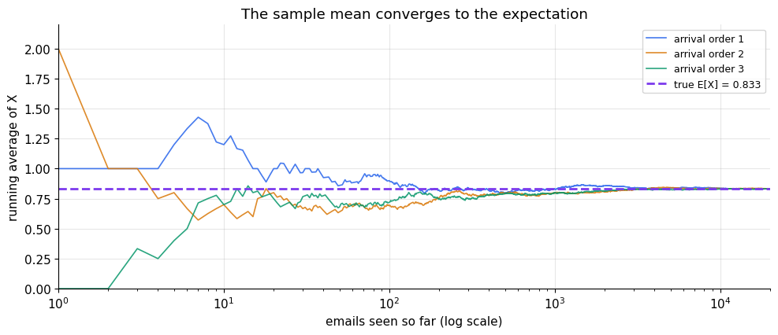

**Output**

```text
after     10 emails: running average = 0.8000   off by 0.0330
after    100 emails: running average = 0.8700   off by 0.0370
after  1,000 emails: running average = 0.8560   off by 0.0230
after 10,000 emails: running average = 0.8364   off by 0.0034
after 20,000 emails: running average = 0.8331   off by 0.0001
```

### Cell 155

```python
# ============================================================
#  Three variables. Same mean. Nothing else in common.
# ============================================================
import numpy as np
import matplotlib.pyplot as plt

RNG6 = np.random.default_rng(606)
n = 60_000
TARGET = 50.0

tight  = RNG6.normal(TARGET, 2.0,  size=n)                  # clustered
loose  = RNG6.normal(TARGET, 12.0, size=n)                  # spread out
split   = TARGET + np.where(RNG6.random(n) < 0.5, -25.0, 25.0) \
          + RNG6.normal(0.0, 2.0, size=n)                   # two lumps, no middle

sets = [("tight",  tight,  C_F),
        ("loose",  loose,  C_APPROX),
        ("split",  split,  C_SLOPE)]

fig, ax = plt.subplots(1, 3, figsize=(13.5, 3.9), sharex=True, sharey=True)
for a, (name, v, colr) in zip(ax, sets):
    a.hist(v, bins=90, range=(0, 100), color=colr, alpha=0.75)
    a.axvline(v.mean(), color=C_EXACT, ls="--", lw=2)
    a.set_title(f"{name}: mean = {v.mean():.3f}")
    a.set_xlabel("value")
ax[0].set_ylabel("count")
plt.tight_layout()
plt.show()

print(f"{'set':>7} | {'mean':>8} | {'min':>8} | {'max':>8} | {'within 5 of mean':>17}")
print("-" * 62)
for name, v, _ in sets:
    near = (np.abs(v - v.mean()) <= 5.0).mean()
    print(f"{name:>7} | {v.mean():>8.3f} | {v.min():>8.2f} | {v.max():>8.2f} "
          f"| {near:>16.1%}")
```

**Output**

```text
<Figure size 1350x390 with 3 Axes>
```

**Figure**

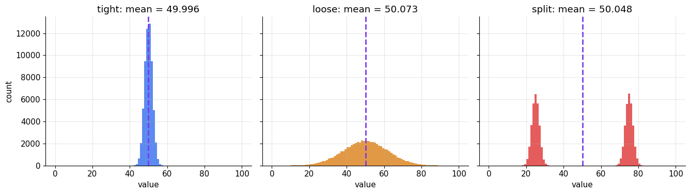

**Output**

```text
    set |     mean |      min |      max |  within 5 of mean
--------------------------------------------------------------
  tight |   49.996 |    42.10 |    58.43 |            98.8%
  loose |   50.073 |     1.07 |   104.14 |            32.6%
  split |   50.048 |    16.56 |    82.42 |             0.0%
```

### Cell 158

```python
# ============================================================
#  Why not just average the deviations? Because they cancel.
#  Then: the variance, computed exactly as its definition reads.
# ============================================================
import numpy as np

for name, v, _ in sets:
    mu   = v.mean()
    dev  = v - mu                       # the deviations
    print(f"{name:>7}: average deviation E[X - mu] = {dev.mean():+.2e}   "
          f"(and mean |deviation| = {np.abs(dev).mean():.3f})")

print()
print("Squaring stops the cancelling. Var(X) = E[(X - mu)^2]:")
print(f"{'set':>7} | {'Var by definition':>18} | {'numpy var':>11} | {'gap':>9}")
print("-" * 54)
for name, v, _ in sets:
    var_by_hand = ((v - v.mean()) ** 2).mean()      # the definition, literally
    print(f"{name:>7} | {var_by_hand:>18.5f} | {v.var():>11.5f} "
          f"| {abs(var_by_hand - v.var()):>9.2e}")

# and on the discrete inbox variable from Part 5
mu_X   = X_flag.mean()
var_X  = ((X_flag - mu_X) ** 2).mean()
print()
print(f"flag-word count X: mean = {mu_X:.5f}, Var(X) = {var_X:.5f}")
```

**Output**

```text
  tight: average deviation E[X - mu] = -5.44e-15   (and mean |deviation| = 1.591)
  loose: average deviation E[X - mu] = +8.70e-16   (and mean |deviation| = 9.566)
  split: average deviation E[X - mu] = +1.02e-14   (and mean |deviation| = 25.009)

Squaring stops the cancelling. Var(X) = E[(X - mu)^2]:
    set |  Var by definition |   numpy var |       gap
------------------------------------------------------
  tight |            3.95828 |     3.95828 |  0.00e+00
  loose |          144.39898 |   144.39898 |  0.00e+00
  split |          629.48615 |   629.48615 |  0.00e+00

flag-word count X: mean = 0.83315, Var(X) = 0.54161
```

### Cell 161

```python
# ============================================================
#  Variance vs standard deviation: same information, one of
#  them readable.
# ============================================================
import numpy as np

print(f"{'set':>7} | {'mean':>8} | {'Var (units^2)':>14} | {'sd (units)':>11} "
      f"| {'% within 1 sd':>14}")
print("-" * 68)
for name, v, _ in sets:
    mu, sd = v.mean(), v.std()
    within = (np.abs(v - mu) <= sd).mean()
    print(f"{name:>7} | {mu:>8.3f} | {v.var():>14.3f} | {sd:>11.3f} "
          f"| {within:>13.1%}")

print()
print("Read the 'loose' row aloud two ways:")
lo = sets[1][1]
print(f"  variance is {lo.var():.1f}  -- squared units; means nothing to a human")
print(f"  sd is {lo.std():.1f}        -- 'values typically sit about "
      f"{lo.std():.0f} away from {lo.mean():.0f}'")
print()
print(f"  values actually between {lo.mean()-lo.std():.1f} and "
      f"{lo.mean()+lo.std():.1f}: {(np.abs(lo-lo.mean())<=lo.std()).mean():.1%}")
```

**Output**

```text
    set |     mean |  Var (units^2) |  sd (units) |  % within 1 sd
--------------------------------------------------------------------
  tight |   49.996 |          3.958 |       1.990 |         68.3%
  loose |   50.073 |        144.399 |      12.017 |         68.4%
  split |   50.048 |        629.486 |      25.090 |         51.5%

Read the 'loose' row aloud two ways:
  variance is 144.4  -- squared units; means nothing to a human
  sd is 12.0        -- 'values typically sit about 12 away from 50'

  values actually between 38.1 and 62.1: 68.4%
```

### Cell 164

```python
# ============================================================
#  Var(X) = E[X^2] - (E[X])^2, checked against the definition.
# ============================================================
import numpy as np

print(f"{'set':>7} | {'E[(X-mu)^2]':>13} | {'E[X^2]':>12} | {'(E[X])^2':>12} "
      f"| {'E[X^2]-(E[X])^2':>16} | {'gap':>9}")
print("-" * 84)
for name, v, _ in sets:
    definition = ((v - v.mean()) ** 2).mean()
    shortcut   = (v ** 2).mean() - v.mean() ** 2
    print(f"{name:>7} | {definition:>13.5f} | {(v**2).mean():>12.4f} "
          f"| {v.mean()**2:>12.4f} | {shortcut:>16.5f} "
          f"| {abs(definition-shortcut):>9.2e}")

# ---- and the Part 5 numbers, revisited
print()
print("The Part 5 'E[g(X)] != g(E[X])' demonstration, re-read:")
print(f"    E[X^2]   for the flag-word count = {(X_flag**2).mean():.6f}")
print(f"    (E[X])^2 for the flag-word count = {X_flag.mean()**2:.6f}")
print(f"    their difference                 = "
      f"{(X_flag**2).mean() - X_flag.mean()**2:.6f}")
print(f"    Var(X) computed from definition  = "
      f"{((X_flag - X_flag.mean())**2).mean():.6f}")
print(f"    same number?  "
      f"{np.isclose((X_flag**2).mean() - X_flag.mean()**2, X_flag.var())}")
```

**Output**

```text
    set |   E[(X-mu)^2] |       E[X^2] |     (E[X])^2 |  E[X^2]-(E[X])^2 |       gap
------------------------------------------------------------------------------------
  tight |       3.95828 |    2503.5947 |    2499.6364 |          3.95828 |  1.19e-12
  loose |     144.39898 |    2651.7134 |    2507.3144 |        144.39898 |  2.84e-14
  split |     629.48615 |    3134.2900 |    2504.8039 |        629.48615 |  2.27e-13

The Part 5 'E[g(X)] != g(E[X])' demonstration, re-read:
    E[X^2]   for the flag-word count = 1.235750
    (E[X])^2 for the flag-word count = 0.694139
    their difference                 = 0.541611
    Var(X) computed from definition  = 0.541611
    same number?  True
```

### Cell 167

```python
# ============================================================
#  Shift, then scale, then both. Verify a^2 and the vanishing b.
# ============================================================
import numpy as np
import matplotlib.pyplot as plt

base = sets[0][1]                      # the 'tight' set
a, b = -3.0, 1000.0

cases = [("X",           base,             1.0, 0.0),
         ("X + 1000",    base + b,         1.0, b),
         ("-3X",         a * base,         a,   0.0),
         ("-3X + 1000",  a * base + b,     a,   b)]

print(f"{'variable':>12} | {'mean':>10} | {'Var':>10} | {'a^2 Var(X)':>11} "
      f"| {'sd':>8} | {'|a| sd(X)':>10}")
print("-" * 76)
for name, v, aa, bb in cases:
    print(f"{name:>12} | {v.mean():>10.3f} | {v.var():>10.4f} "
          f"| {aa**2 * base.var():>11.4f} | {v.std():>8.4f} "
          f"| {abs(aa) * base.std():>10.4f}")

print()
print(f"shifting by {b:.0f} changed the variance by: "
      f"{abs((base + b).var() - base.var()):.2e}   (i.e. not at all)")
print(f"scaling by {a:.0f} multiplied the variance by: "
      f"{(a * base).var() / base.var():.4f}   (a^2 = {a**2:.1f})")
print(f"scaling by {a:.0f} multiplied the sd by:       "
      f"{(a * base).std() / base.std():.4f}   (|a| = {abs(a):.1f})")

fig, ax = plt.subplots(figsize=(10, 3.8))
for (name, v, _, _), colr in zip(cases, [C_F, C_AREA, C_APPROX, C_SLOPE]):
    ax.hist(v, bins=120, range=(-160, 1060), alpha=0.6, color=colr, label=name)
ax.set_xlabel("value")
ax.set_ylabel("count")
ax.set_title("Shifting moves the distribution; scaling widens it")
ax.legend(fontsize=9)
plt.tight_layout()
plt.show()
```

**Output**

```text
    variable |       mean |        Var |  a^2 Var(X) |       sd |  |a| sd(X)
----------------------------------------------------------------------------
           X |     49.996 |     3.9583 |      3.9583 |   1.9895 |     1.9895
    X + 1000 |   1049.996 |     3.9583 |      3.9583 |   1.9895 |     1.9895
         -3X |   -149.989 |    35.6245 |     35.6245 |   5.9686 |     5.9686
  -3X + 1000 |    850.011 |    35.6245 |     35.6245 |   5.9686 |     5.9686

shifting by 1000 changed the variance by: 8.88e-16   (i.e. not at all)
scaling by -3 multiplied the variance by: 9.0000   (a^2 = 9.0)
scaling by -3 multiplied the sd by:       3.0000   (|a| = 3.0)
```

**Output**

```text
<Figure size 1000x380 with 1 Axes>
```

**Figure**

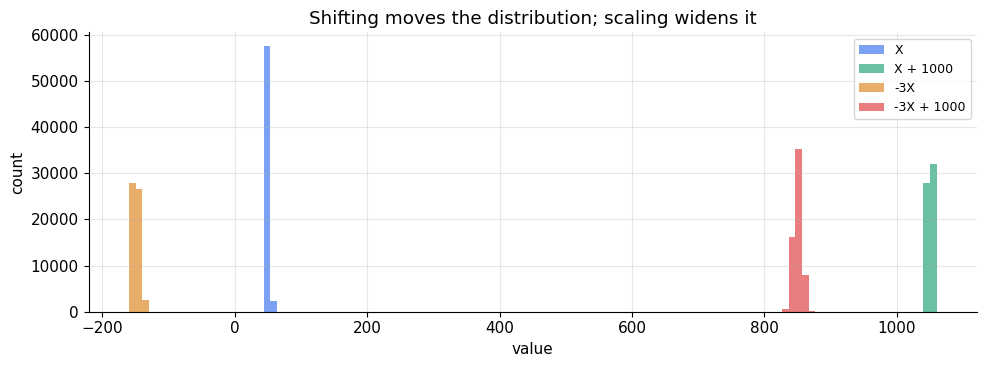

### Cell 170

```python
# ============================================================
#  Do variances add? Three pairs: independent, positively
#  dependent, negatively dependent.
# ============================================================
import numpy as np

RNG6b = np.random.default_rng(607)
m = 200_000

A = RNG6b.normal(0.0, 3.0, size=m)
noise = RNG6b.normal(0.0, 1.0, size=m)

pairs = [
    ("independent      ", A, RNG6b.normal(0.0, 4.0, size=m)),
    ("positively dep.   ", A, 1.5 * A + noise),          # Y follows X up
    ("negatively dep.   ", A, -1.5 * A + noise),         # Y moves against X
    ("inbox X and Y     ", X_flag.astype(float), Y_spammy.astype(float)),
]

print(f"{'pair':>18} | {'corr':>7} | {'Var(X)+Var(Y)':>14} | {'Var(X+Y)':>11} "
      f"| {'discrepancy':>12} | {'2*Cov':>10}")
print("-" * 88)
for name, U, V in pairs:
    lhs  = U.var() + V.var()
    rhs  = (U + V).var()
    cov  = ((U - U.mean()) * (V - V.mean())).mean()
    print(f"{name:>18} | {np.corrcoef(U, V)[0,1]:>7.4f} | {lhs:>14.4f} "
          f"| {rhs:>11.4f} | {rhs - lhs:>12.4f} | {2*cov:>10.4f}")

print()
print("The discrepancy column IS the 2*Cov column, in every row:")
for name, U, V in pairs:
    disc = (U + V).var() - (U.var() + V.var())
    cov2 = 2 * ((U - U.mean()) * (V - V.mean())).mean()
    print(f"    {name}: {disc:>10.4f} vs {cov2:>10.4f}   "
          f"match: {np.isclose(disc, cov2)}")
```

**Output**

```text
              pair |    corr |  Var(X)+Var(Y) |    Var(X+Y) |  discrepancy |      2*Cov
----------------------------------------------------------------------------------------
 independent       | -0.0003 |        24.9473 |     24.9407 |      -0.0065 |    -0.0065
positively dep.    |  0.9761 |        30.2001 |     57.1436 |      26.9435 |    26.9435
negatively dep.    | -0.9760 |        30.1284 |      3.2327 |     -26.8956 |   -26.8956
inbox X and Y      |  0.5488 |         0.8994 |      1.3826 |       0.4832 |     0.4832

The discrepancy column IS the 2*Cov column, in every row:
    independent      :    -0.0065 vs    -0.0065   match: True
    positively dep.   :    26.9435 vs    26.9435   match: True
    negatively dep.   :   -26.8956 vs   -26.8956   match: True
    inbox X and Y     :     0.4832 vs     0.4832   match: True
```

### Cell 174

```python
# ============================================================
#  Standardise two features on wildly different scales.
#  Note what changes -- and what does not.
# ============================================================
import numpy as np
import matplotlib.pyplot as plt

RNG6c = np.random.default_rng(608)
k = 40_000
age    = RNG6c.normal(44.0, 11.0, size=k)
income = RNG6c.normal(78_000.0, 26_000.0, size=k)

def standardise(v):
    return (v - v.mean()) / v.std()

age_z, income_z = standardise(age), standardise(income)

print(f"{'feature':>12} | {'mean':>12} | {'sd':>12} | {'variance':>16}")
print("-" * 62)
for nm, v in [("age", age), ("income", income),
              ("age (z)", age_z), ("income (z)", income_z)]:
    print(f"{nm:>12} | {v.mean():>12.6f} | {v.std():>12.6f} | {v.var():>16.6f}")

print()
print(f"variance ratio BEFORE standardising: "
      f"{income.var() / age.var():,.0f} : 1")
print(f"variance ratio AFTER  standardising: "
      f"{income_z.var() / age_z.var():.6f} : 1")
print()
print(f"correlation before : {np.corrcoef(age, income)[0,1]:+.6f}")
print(f"correlation after  : {np.corrcoef(age_z, income_z)[0,1]:+.6f}   "
      f"(unchanged -- standardising is a relabelling, not a transformation "
      f"of the relationship)")

fig, ax = plt.subplots(1, 2, figsize=(12, 3.9))
ax[0].hist(age, bins=70, color=C_F, alpha=0.75, label="age (years)")
ax[0].hist(income, bins=70, color=C_APPROX, alpha=0.75, label="income (dollars)")
ax[0].set_xscale("symlog")
ax[0].set_title("Before: not remotely comparable")
ax[0].set_xlabel("raw value (symlog scale, or nothing would be visible)")
ax[0].legend(fontsize=9)

ax[1].hist(age_z, bins=70, color=C_F, alpha=0.75, label="age (z)")
ax[1].hist(income_z, bins=70, color=C_APPROX, alpha=0.75, label="income (z)")
ax[1].set_title("After: mean 0, sd 1, same axis")
ax[1].set_xlabel("standard deviations from the mean")
ax[1].legend(fontsize=9)
plt.tight_layout()
plt.show()
```

**Output**

```text
     feature |         mean |           sd |         variance
--------------------------------------------------------------
         age |    43.994129 |    10.934632 |       119.566167
      income | 78065.381204 | 25930.218568 | 672376235.001606
     age (z) |    -0.000000 |     1.000000 |         1.000000
  income (z) |    -0.000000 |     1.000000 |         1.000000

variance ratio BEFORE standardising: 5,623,466 : 1
variance ratio AFTER  standardising: 1.000000 : 1

correlation before : +0.010150
correlation after  : +0.010150   (unchanged -- standardising is a relabelling, not a transformation of the relationship)
```

**Output**

```text
<Figure size 1200x390 with 2 Axes>
```

**Figure**

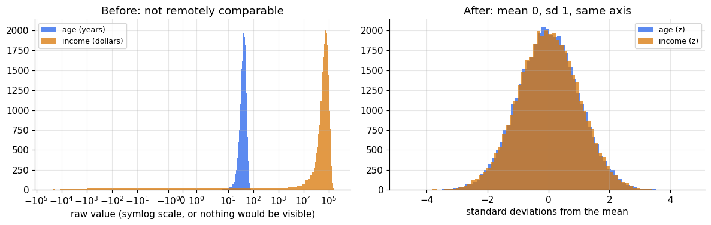

### Cell 179

```python
# ============================================================
#  Chebyshev, checked against four very different shapes.
#  The bound must hold for all of them, or the theorem is wrong.
# ============================================================
import numpy as np

RNG6d = np.random.default_rng(609)
q = 400_000

shapes = [
    ("normal",       RNG6d.normal(0.0, 1.0, size=q)),
    ("uniform",      RNG6d.uniform(-1.0, 1.0, size=q)),
    ("exponential",  RNG6d.exponential(1.0, size=q)),          # heavily skewed
    ("bimodal",      np.where(RNG6d.random(q) < 0.5, -4.0, 4.0)
                     + RNG6d.normal(0.0, 0.5, size=q)),
    ("heavy-tailed", RNG6d.standard_t(df=4, size=q)),          # fat tails
    ("flag words X", X_flag.astype(float)),                    # discrete, skewed
]

for k in [1.5, 2.0, 3.0]:
    print(f"--- k = {k}   Chebyshev bound = 1/k^2 = {1/k**2:.4f}")
    print(f"{'distribution':>14} | {'actual P(|X-mu| >= k sd)':>25} | {'holds?':>7}")
    print("-" * 52)
    for nm, v in shapes:
        mu, sd = v.mean(), v.std()
        actual = (np.abs(v - mu) >= k * sd).mean()
        print(f"{nm:>14} | {actual:>25.5f} | "
              f"{str(actual <= 1/k**2 + 1e-12):>7}")
    print()

print("How much slack does the bound leave? (k = 2)")
for nm, v in shapes:
    actual = (np.abs(v - v.mean()) >= 2 * v.std()).mean()
    print(f"    {nm:>14}: bound 0.2500, actual {actual:.4f}   "
          f"-> bound is {0.25/max(actual,1e-9):>6.1f}x too generous")
```

**Output**

```text
--- k = 1.5   Chebyshev bound = 1/k^2 = 0.4444
  distribution |  actual P(|X-mu| >= k sd) |  holds?
----------------------------------------------------
        normal |                   0.13368 |    True
       uniform |                   0.13435 |    True
   exponential |                   0.08221 |    True
       bimodal |                   0.00002 |    True
  heavy-tailed |                   0.10190 |    True
  flag words X |                   0.18110 |    True

--- k = 2.0   Chebyshev bound = 1/k^2 = 0.2500
  distribution |  actual P(|X-mu| >= k sd) |  holds?
----------------------------------------------------
        normal |                   0.04582 |    True
       uniform |                   0.00000 |    True
   exponential |                   0.04963 |    True
       bimodal |                   0.00000 |    True
  heavy-tailed |                   0.04778 |    True
  flag words X |                   0.00995 |    True

--- k = 3.0   Chebyshev bound = 1/k^2 = 0.1111
  distribution |  actual P(|X-mu| >= k sd) |  holds?
----------------------------------------------------
        normal |                   0.00263 |    True
       uniform |                   0.00000 |    True
   exponential |                   0.01854 |    True
       bimodal |                   0.00000 |    True
  heavy-tailed |                   0.01341 |    True
  flag words X |                   0.00010 |    True

How much slack does the bound leave? (k = 2)
            normal: bound 0.2500, actual 0.0458   -> bound is    5.5x too generous
           uniform: bound 0.2500, actual 0.0000   -> bound is 250000000.0x too generous
       exponential: bound 0.2500, actual 0.0496   -> bound is    5.0x too generous
           bimodal: bound 0.2500, actual 0.0000   -> bound is 250000000.0x too generous
      heavy-tailed: bound 0.2500, actual 0.0478   -> bound is    5.2x too generous
      flag words X: bound 0.2500, actual 0.0100   -> bound is   25.1x too generous
```

### Cell 183

```python
# ============================================================
#  Part 7 setup. Its own generator, so this part reproduces
#  identically no matter how much randomness earlier parts used.
# ============================================================
import numpy as np
import matplotlib.pyplot as plt

RNG7 = np.random.default_rng(707)


def mv_report(name, mean_formula, var_formula, theory_mean, theory_var, samples):
    """Print the textbook mean/variance beside the simulated ones.

    Nothing here is asserted: the right-hand column is a count from
    `samples`, so if the formula is wrong the two columns disagree.
    """
    m, v = samples.mean(), samples.var()
    print(f"{name}   ({samples.size:,} simulated draws)")
    print(f"  mean      formula {mean_formula:<18} = {theory_mean:10.4f}   simulated = {m:10.4f}")
    print(f"  variance  formula {var_formula:<18} = {theory_var:10.4f}   simulated = {v:10.4f}")
    print(f"  gap: mean {abs(m - theory_mean):.4f},  variance {abs(v - theory_var):.4f}")
    return m, v


print("Part 7 ready.")
```

**Output**

```text
Part 7 ready.
```

### Cell 185

```python
# Is this email spam? One Bernoulli trial per email -- and Part 0 already
# generated 20,000 of them, so we can simply count.
p = P_SPAM
bern = is_spam.astype(float)

fig, ax = plt.subplots(1, 2, figsize=(11, 4))

ax[0].bar([0, 1], [1 - p, p], width=0.5, color=[C_SOFT, C_F],
          edgecolor="black", label="formula")
ax[0].plot([0, 1], [(bern == 0).mean(), (bern == 1).mean()], "o",
           color=C_SLOPE, markersize=11, label="counted in the inbox")
ax[0].set_xticks([0, 1]); ax[0].set_xticklabels(["not spam (0)", "spam (1)"])
ax[0].set_ylabel("probability"); ax[0].set_title("Bernoulli PMF, p = 0.30")
ax[0].legend()

# Variance of a Bernoulli as p varies -- biggest where you are least sure.
grid = np.linspace(0, 1, 200)
ax[1].plot(grid, grid * (1 - grid), color=C_SLOPE, lw=2)
ax[1].axvline(0.5, color=C_GREY, ls=":")
ax[1].plot([p], [p * (1 - p)], "o", color=C_F, markersize=10)
ax[1].set_xlabel("p"); ax[1].set_ylabel("variance p(1-p)")
ax[1].set_title("uncertainty peaks at p = 0.5")

plt.tight_layout(); plt.show()

mv_report("Bernoulli(p=0.30)", "p", "p(1-p)", p, p * (1 - p), bern)
```

**Output**

```text
<Figure size 1100x400 with 2 Axes>
```

**Figure**

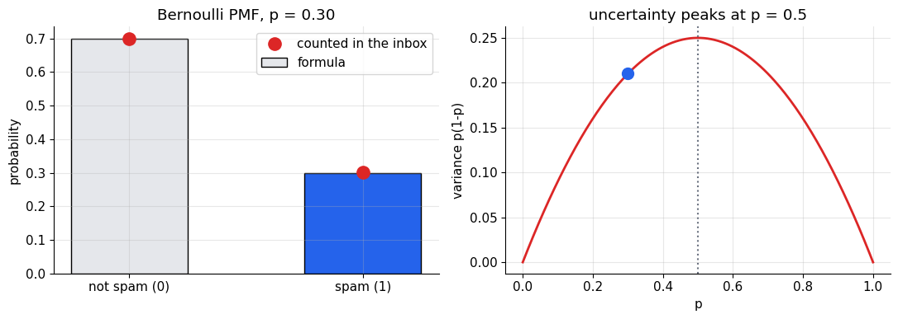

**Output**

```text
Bernoulli(p=0.30)   (20,000 simulated draws)
  mean      formula p                  =     0.3000   simulated =     0.3008
  variance  formula p(1-p)             =     0.2100   simulated =     0.2103
  gap: mean 0.0008,  variance 0.0003
```

**Output**

```text
(np.float64(0.3008), np.float64(0.21031936000000004))
```

### Cell 189

```python
from itertools import product
from math import comb, factorial

# ---- Step 1: is "n choose k" really just counting arrangements?
# Enumerate every spam/not pattern for a small batch and count them by hand.
n_small = 5
patterns = list(product([0, 1], repeat=n_small))
print(f"all {len(patterns)} spam/not patterns for a batch of {n_small}:")
print(f"{'k':>3} {'counted by hand':>16} {'n!/(k!(n-k)!)':>16}")
for k in range(n_small + 1):
    by_hand = sum(1 for pat in patterns if sum(pat) == k)
    by_formula = factorial(n_small) // (factorial(k) * factorial(n_small - k))
    flag = "OK" if by_hand == by_formula else "MISMATCH"
    print(f"{k:>3} {by_hand:>16} {by_formula:>16}   {flag}")

# ---- Step 2: the PMF itself, formula vs simulated batches.
n, p = 10, P_SPAM
ks = np.arange(n + 1)
pmf = np.array([comb(n, k) * p**k * (1 - p)**(n - k) for k in ks])

N_BATCH = 200_000
batches = (RNG7.random((N_BATCH, n)) < p).sum(axis=1)   # spam per batch of 10
sim_pmf = np.array([(batches == k).mean() for k in ks])

fig, ax = plt.subplots(1, 2, figsize=(11, 4))
ax[0].bar(ks - 0.19, pmf, width=0.38, color=C_F, label="formula")
ax[0].bar(ks + 0.19, sim_pmf, width=0.38, color=C_APPROX, label="simulated")
ax[0].set_xticks(ks); ax[0].set_xlabel("k = spam in a batch of 10")
ax[0].set_ylabel("probability"); ax[0].set_title("Binomial PMF")
ax[0].legend()

ax[1].step(ks, pmf.cumsum(), where="post", color=C_F, lw=2, label="formula")
ax[1].step(ks, sim_pmf.cumsum(), where="post", color=C_APPROX, lw=2, ls="--",
           label="simulated")
ax[1].set_xticks(ks); ax[1].set_xlabel("k")
ax[1].set_ylabel("P(X <= k)"); ax[1].set_title("Binomial CDF")
ax[1].legend()
plt.tight_layout(); plt.show()

print(f"\nlargest PMF disagreement over all 11 values: {np.abs(pmf - sim_pmf).max():.5f}")
print(f"probabilities sum to {pmf.sum():.10f}\n")
mv_report("Binomial(n=10, p=0.30)", "n*p", "n*p*(1-p)",
          n * p, n * p * (1 - p), batches.astype(float))
```

**Output**

```text
all 32 spam/not patterns for a batch of 5:
  k  counted by hand    n!/(k!(n-k)!)
  0                1                1   OK
  1                5                5   OK
  2               10               10   OK
  3               10               10   OK
  4                5                5   OK
  5                1                1   OK
```

**Output**

```text
<Figure size 1100x400 with 2 Axes>
```

**Figure**

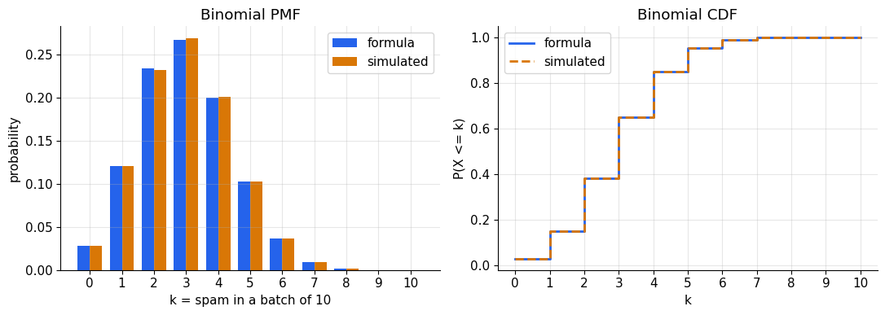

**Output**

```text
largest PMF disagreement over all 11 values: 0.00242
probabilities sum to 1.0000000000

Binomial(n=10, p=0.30)   (200,000 simulated draws)
  mean      formula n*p                =     3.0000   simulated =     3.0040
  variance  formula n*p*(1-p)          =     2.1000   simulated =     2.0896
  gap: mean 0.0040,  variance 0.0104
```

**Output**

```text
(np.float64(3.003965), np.float64(2.0895892787749997))
```

### Cell 192

```python
p = P_SPAM
ks = np.arange(1, 21)
pmf = (1 - p)**(ks - 1) * p


def first_spam_wait(size, prob, rng):
    """Trials until (and including) the first success. Vectorised, no loops."""
    u = rng.random(size)
    return np.floor(np.log(u) / np.log(1 - prob)).astype(int) + 1


waits = first_spam_wait(300_000, p, RNG7)
sim_pmf = np.array([(waits == k).mean() for k in ks])

fig, ax = plt.subplots(1, 2, figsize=(11, 4))
ax[0].bar(ks - 0.19, pmf, width=0.38, color=C_F, label="formula")
ax[0].bar(ks + 0.19, sim_pmf, width=0.38, color=C_APPROX, label="simulated")
ax[0].set_xlabel("k = emails read up to and including the first spam")
ax[0].set_ylabel("probability"); ax[0].set_title("Geometric PMF, p = 0.30")
ax[0].legend()

ax[1].step(ks, pmf.cumsum(), where="post", color=C_F, lw=2, label="formula")
ax[1].step(ks, sim_pmf.cumsum(), where="post", color=C_APPROX, lw=2, ls="--",
           label="simulated")
ax[1].axhline(0.5, color=C_GREY, ls=":")
ax[1].set_xlabel("k"); ax[1].set_ylabel("P(X <= k)")
ax[1].set_title("Geometric CDF"); ax[1].legend()
plt.tight_layout(); plt.show()

mv_report("Geometric(p=0.30)", "1/p", "(1-p)/p^2",
          1 / p, (1 - p) / p**2, waits.astype(float))

# ---- Memorylessness, tested rather than argued.
print("\nMemorylessness: does having waited already change what is left to wait?")
print(f"{'already waited s':>17} {'P(X > s+3 | X > s)':>20} {'P(X > 3)':>12}")
base = (waits > 3).mean()
for s in [0, 2, 5, 10]:
    survived = waits > s
    cond = (waits > s + 3)[survived].mean()
    print(f"{s:>17} {cond:>20.4f} {base:>12.4f}")
print("\nThe middle column does not drift as s grows. The wait resets.")
```

**Output**

```text
<Figure size 1100x400 with 2 Axes>
```

**Figure**

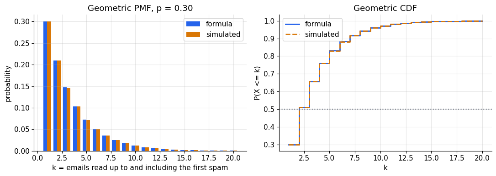

**Output**

```text
Geometric(p=0.30)   (300,000 simulated draws)
  mean      formula 1/p                =     3.3333   simulated =     3.3359
  variance  formula (1-p)/p^2          =     7.7778   simulated =     7.7922
  gap: mean 0.0026,  variance 0.0144

Memorylessness: does having waited already change what is left to wait?
 already waited s   P(X > s+3 | X > s)     P(X > 3)
                0               0.3435       0.3435
                2               0.3458       0.3435
                5               0.3428       0.3435
               10               0.3435       0.3435

The middle column does not drift as s grows. The wait resets.
```

### Cell 196

```python
from math import comb, factorial

LAM = 3.0                       # expected spam per hour
ks = np.arange(0, 13)
poisson_pmf = np.array([LAM**k * np.exp(-LAM) / factorial(k) for k in ks])

fig, ax = plt.subplots(1, 2, figsize=(11, 4))

# ---- Binomial approaching Poisson as the time slices get finer.
for n_slices, shade in [(10, "#BFDBFE"), (50, "#93C5FD"), (1000, C_F)]:
    p_slice = LAM / n_slices
    binom_pmf = np.array([comb(n_slices, k) * p_slice**k * (1 - p_slice)**(n_slices - k)
                          if k <= n_slices else 0.0 for k in ks])
    ax[0].plot(ks, binom_pmf, "o-", color=shade, lw=1.6, markersize=5,
               label=f"Binomial(n={n_slices}, p={p_slice:.4g})")
    print(f"n = {n_slices:>4}  ->  largest gap from Poisson: "
          f"{np.abs(binom_pmf - poisson_pmf).max():.6f}")

ax[0].plot(ks, poisson_pmf, "s--", color=C_SLOPE, lw=2, markersize=6,
           label="Poisson(lambda=3)")
ax[0].set_xlabel("k = spam arriving in the hour"); ax[0].set_ylabel("probability")
ax[0].set_title("the binomial becomes the Poisson"); ax[0].legend(fontsize=8)

# ---- Poisson PMF and CDF against a direct simulation.
draws = RNG7.poisson(LAM, size=300_000)
sim_pmf = np.array([(draws == k).mean() for k in ks])
ax[1].bar(ks - 0.19, poisson_pmf, width=0.38, color=C_F, label="formula")
ax[1].bar(ks + 0.19, sim_pmf, width=0.38, color=C_APPROX, label="simulated")
ax[1].step(ks, poisson_pmf.cumsum(), where="mid", color=C_EXACT, lw=2,
           label="CDF (formula)")
ax[1].set_xlabel("k"); ax[1].set_ylabel("probability")
ax[1].set_title("Poisson PMF and CDF"); ax[1].legend(fontsize=8)
plt.tight_layout(); plt.show()

print(f"\nPMF vs simulation, largest gap: {np.abs(poisson_pmf - sim_pmf).max():.5f}")
mv_report("Poisson(lambda=3)", "lambda", "lambda", LAM, LAM, draws.astype(float))
```

**Output**

```text
n =   10  ->  largest gap from Poisson: 0.042786
n =   50  ->  largest gap from Poisson: 0.007015
n = 1000  ->  largest gap from Poisson: 0.000337
```

**Output**

```text
<Figure size 1100x400 with 2 Axes>
```

**Figure**

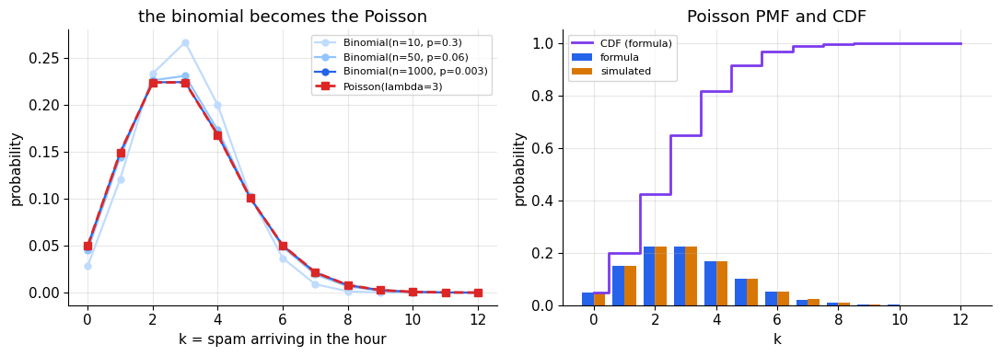

**Output**

```text
PMF vs simulation, largest gap: 0.00086
Poisson(lambda=3)   (300,000 simulated draws)
  mean      formula lambda             =     3.0000   simulated =     3.0058
  variance  formula lambda             =     3.0000   simulated =     3.0135
  gap: mean 0.0058,  variance 0.0135
```

**Output**

```text
(np.float64(3.00581), np.float64(3.0135362438999995))
```

### Cell 199

```python
a, b = 0.0, 60.0                        # minutes past the hour
draws = RNG7.uniform(a, b, size=300_000)

grid = np.linspace(a - 10, b + 10, 600)
pdf = np.where((grid >= a) & (grid <= b), 1 / (b - a), 0.0)
cdf = np.clip((grid - a) / (b - a), 0, 1)

fig, ax = plt.subplots(1, 2, figsize=(11, 4))
ax[0].hist(draws, bins=40, range=(a, b), density=True, color=C_SOFT,
           edgecolor="white", label="simulated arrivals")
ax[0].plot(grid, pdf, color=C_F, lw=2.5, label="formula 1/(b-a)")
ax[0].set_xlabel("minute of the hour"); ax[0].set_ylabel("density")
ax[0].set_title("Uniform PDF"); ax[0].legend(fontsize=9)

ax[1].plot(grid, cdf, color=C_F, lw=2.5, label="formula")
ax[1].plot(np.sort(draws)[::300], np.linspace(0, 1, draws[::300].size),
           color=C_APPROX, lw=2, ls="--", label="simulated")
ax[1].set_xlabel("minute of the hour"); ax[1].set_ylabel("P(X <= x)")
ax[1].set_title("Uniform CDF"); ax[1].legend(fontsize=9)
plt.tight_layout(); plt.show()

heights = np.histogram(draws, bins=40, range=(a, b), density=True)[0]
print(f"density height 1/(b-a) = {1/(b-a):.6f}"
      f"   average histogram height = {heights.mean():.6f}")
print(f"P(arrived in the first 15 min): formula {(15-a)/(b-a):.4f}"
      f"   counted {(draws < 15).mean():.4f}\n")
mv_report("Uniform(0, 60)", "(a+b)/2", "(b-a)^2/12",
          (a + b) / 2, (b - a)**2 / 12, draws)
```

**Output**

```text
<Figure size 1100x400 with 2 Axes>
```

**Figure**

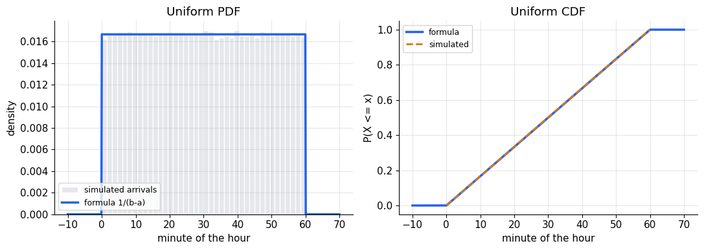

**Output**

```text
density height 1/(b-a) = 0.016667   average histogram height = 0.016667
P(arrived in the first 15 min): formula 0.2500   counted 0.2503

Uniform(0, 60)   (300,000 simulated draws)
  mean      formula (a+b)/2            =    30.0000   simulated =    29.9797
  variance  formula (b-a)^2/12         =   300.0000   simulated =   299.5378
  gap: mean 0.0203,  variance 0.4622
```

**Output**

```text
(np.float64(29.97966889929484), np.float64(299.5377932743097))
```

### Cell 203

```python
from math import erf

MU, SIGMA = 0.0, 1.0
draws = RNG7.normal(MU, SIGMA, size=400_000)

grid = np.linspace(MU - 4.2 * SIGMA, MU + 4.2 * SIGMA, 600)
pdf = np.exp(-0.5 * ((grid - MU) / SIGMA)**2) / (SIGMA * np.sqrt(2 * np.pi))
# The normal CDF without scipy: the error function, straight from math.
cdf = np.array([0.5 * (1 + erf((g - MU) / (SIGMA * np.sqrt(2)))) for g in grid])

fig, ax = plt.subplots(1, 2, figsize=(11, 4))
ax[0].hist(draws, bins=120, density=True, color=C_SOFT, edgecolor="none",
           label="400,000 simulated draws")
for k, shade in [(2, "#EFF6FF"), (1, "#DBEAFE")]:
    band = (grid >= MU - k * SIGMA) & (grid <= MU + k * SIGMA)
    ax[0].fill_between(grid[band], 0, pdf[band], color=shade, zorder=0)
ax[0].plot(grid, pdf, color=C_F, lw=2.5, label="formula")
for k in (1, 2, 3):
    ax[0].axvline(MU + k * SIGMA, color=C_GREY, ls=":")
    ax[0].axvline(MU - k * SIGMA, color=C_GREY, ls=":")
ax[0].set_xlabel("x (in standard deviations from the mean)")
ax[0].set_ylabel("density"); ax[0].set_title("Normal PDF, with 1 / 2 / 3 sd marked")
ax[0].legend(fontsize=9)

ax[1].plot(grid, cdf, color=C_F, lw=2.5, label="formula")
ax[1].plot(np.sort(draws)[::400], np.linspace(0, 1, draws[::400].size),
           color=C_APPROX, lw=2, ls="--", label="simulated")
ax[1].set_xlabel("x"); ax[1].set_ylabel("P(X <= x)")
ax[1].set_title("Normal CDF"); ax[1].legend(fontsize=9)
plt.tight_layout(); plt.show()

# ---- The 68/95/99.7 rule, measured.
print("The 68 / 95 / 99.7 rule, checked by counting 400,000 draws:")
print(f"{'within k sd':>12} {'rule of thumb':>15} {'measured':>12} {'exact (erf)':>13}")
for k, thumb in [(1, 0.68), (2, 0.95), (3, 0.997)]:
    measured = (np.abs(draws - MU) <= k * SIGMA).mean()
    print(f"{k:>12} {thumb:>15.4f} {measured:>12.4f} {erf(k/np.sqrt(2)):>13.4f}")
print()
mv_report("Normal(0, 1)", "mu", "sigma^2", MU, SIGMA**2, draws)
```

**Output**

```text
<Figure size 1100x400 with 2 Axes>
```

**Figure**

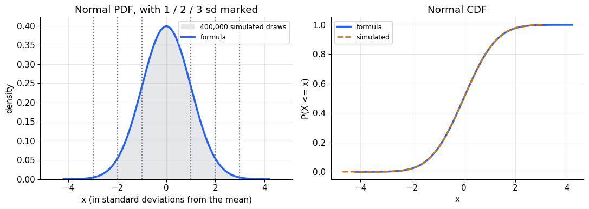

**Output**

```text
The 68 / 95 / 99.7 rule, checked by counting 400,000 draws:
 within k sd   rule of thumb     measured   exact (erf)
           1          0.6800       0.6823        0.6827
           2          0.9500       0.9544        0.9545
           3          0.9970       0.9974        0.9973

Normal(0, 1)   (400,000 simulated draws)
  mean      formula mu                 =     0.0000   simulated =     0.0008
  variance  formula sigma^2            =     1.0000   simulated =     1.0006
  gap: mean 0.0008,  variance 0.0006
```

**Output**

```text
(np.float64(0.0008157396268263338), np.float64(1.000601021721))
```

### Cell 207

```python
from math import factorial

LAM = 3.0                                # spam per hour
gaps = RNG7.exponential(1 / LAM, size=300_000)

grid = np.linspace(0, 2.2, 500)
pdf = LAM * np.exp(-LAM * grid)
cdf = 1 - np.exp(-LAM * grid)

fig, ax = plt.subplots(1, 2, figsize=(11, 4))
ax[0].hist(gaps, bins=120, range=(0, 2.2), density=True, color=C_SOFT,
           edgecolor="none", label="simulated gaps")
ax[0].plot(grid, pdf, color=C_F, lw=2.5, label="formula")
ax[0].axvline(1 / LAM, color=C_SLOPE, ls="--", lw=2, label="mean = 1/lambda")
ax[0].set_xlabel("hours until the next spam"); ax[0].set_ylabel("density")
ax[0].set_title("Exponential PDF"); ax[0].legend(fontsize=9)

trimmed = np.sort(gaps[gaps < 2.2])[::200]
ax[1].plot(grid, cdf, color=C_F, lw=2.5, label="formula")
ax[1].plot(trimmed, np.linspace(0, (gaps < 2.2).mean(), trimmed.size),
           color=C_APPROX, lw=2, ls="--", label="simulated")
ax[1].set_xlabel("hours"); ax[1].set_ylabel("P(wait <= x)")
ax[1].set_title("Exponential CDF"); ax[1].legend(fontsize=9)
plt.tight_layout(); plt.show()

mv_report("Exponential(lambda=3)", "1/lambda", "1/lambda^2",
          1 / LAM, 1 / LAM**2, gaps)

# ---- Memoryless, checked.
print("\nMemorylessness of the wait (half an hour more):")
print(f"{'waited s hours':>15} {'P(X > s+0.5 | X > s)':>22} {'P(X > 0.5)':>12}")
base = (gaps > 0.5).mean()
for s in [0.0, 0.25, 0.5, 1.0]:
    survived = gaps > s
    print(f"{s:>15.2f} {(gaps > s + 0.5)[survived].mean():>22.4f} {base:>12.4f}")

# ---- Exponential gaps and Poisson counts are one process seen two ways.
arrival_times = np.cumsum(RNG7.exponential(1 / LAM, size=60_000))
counts = np.histogram(arrival_times,
                      bins=np.arange(0, np.ceil(arrival_times[-1]) + 1))[0]
print(f"\nCounting arrivals per 1-hour window, over {counts.size:,} windows:")
print(f"{'k':>3} {'observed':>10} {'Poisson(3)':>12}")
for k in range(9):
    print(f"{k:>3} {(counts == k).mean():>10.4f} "
          f"{LAM**k * np.exp(-LAM) / factorial(k):>12.4f}")
print(f"\nmean count per hour = {counts.mean():.4f}   (lambda = {LAM})")
```

**Output**

```text
<Figure size 1100x400 with 2 Axes>
```

**Figure**

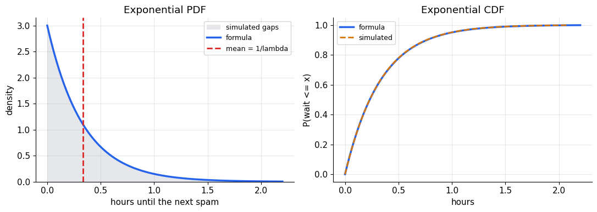

**Output**

```text
Exponential(lambda=3)   (300,000 simulated draws)
  mean      formula 1/lambda           =     0.3333   simulated =     0.3327
  variance  formula 1/lambda^2         =     0.1111   simulated =     0.1110
  gap: mean 0.0006,  variance 0.0002

Memorylessness of the wait (half an hour more):
 waited s hours   P(X > s+0.5 | X > s)   P(X > 0.5)
           0.00                 0.2216       0.2216
           0.25                 0.2211       0.2216
           0.50                 0.2230       0.2216
           1.00                 0.2278       0.2216

Counting arrivals per 1-hour window, over 20,103 windows:
  k   observed   Poisson(3)
  0     0.0488       0.0498
  1     0.1563       0.1494
  2     0.2232       0.2240
  3     0.2227       0.2240
  4     0.1641       0.1680
  5     0.1007       0.1008
  6     0.0516       0.0504
  7     0.0213       0.0216
  8     0.0082       0.0081

mean count per hour = 2.9846   (lambda = 3.0)
```

### Cell 209

```python
# ============================================================
#  All seven at once: the formula for the mean and variance,
#  beside a fresh simulation of each. Nothing is asserted.
# ============================================================
p, n, LAM, MU, SIGMA, a, b = 0.30, 10, 3.0, 0.0, 1.0, 0.0, 60.0
M_DRAWS = 400_000
R = np.random.default_rng(7777)

rows = [
    ("Bernoulli(0.3)",    "p",         "p(1-p)",     p,           p * (1 - p),
     (R.random(M_DRAWS) < p).astype(float)),
    ("Binomial(10, 0.3)", "np",        "np(1-p)",    n * p,       n * p * (1 - p),
     R.binomial(n, p, M_DRAWS).astype(float)),
    ("Geometric(0.3)",    "1/p",       "(1-p)/p^2",  1 / p,       (1 - p) / p**2,
     R.geometric(p, M_DRAWS).astype(float)),
    ("Poisson(3)",        "lambda",    "lambda",     LAM,         LAM,
     R.poisson(LAM, M_DRAWS).astype(float)),
    ("Uniform(0, 60)",    "(a+b)/2",   "(b-a)^2/12", (a + b) / 2, (b - a)**2 / 12,
     R.uniform(a, b, M_DRAWS)),
    ("Normal(0, 1)",      "mu",        "sigma^2",    MU,          SIGMA**2,
     R.normal(MU, SIGMA, M_DRAWS)),
    ("Exponential(3)",    "1/lambda",  "1/lambda^2", 1 / LAM,     1 / LAM**2,
     R.exponential(1 / LAM, M_DRAWS)),
]

hdr = (f"{'distribution':<20}{'mean fmla':<11}{'theory':>9}{'simulated':>11}   "
       f"{'var fmla':<12}{'theory':>9}{'simulated':>11}")
print(hdr); print("-" * len(hdr))
worst_mean, worst_var = 0.0, 0.0
for name, mf, vf, tm, tv, s in rows:
    sm, sv = s.mean(), s.var()
    # A mean of 0 makes a relative gap meaningless, so measure the mean's gap
    # in units of the distribution's own standard deviation instead.
    worst_mean = max(worst_mean, abs(sm - tm) / np.sqrt(tv))
    worst_var = max(worst_var, abs(sv - tv) / tv)
    print(f"{name:<20}{mf:<11}{tm:>9.4f}{sm:>11.4f}   {vf:<12}{tv:>9.4f}{sv:>11.4f}")
print("-" * len(hdr))
print(f"worst mean gap, in units of that distribution's own sd : {worst_mean:.4f}")
print(f"worst variance gap, as a fraction of the variance      : {worst_var:.4%}")
print(f"({M_DRAWS:,} draws each -- these gaps shrink like 1/sqrt(M).)")
```

**Output**

```text
distribution        mean fmla     theory  simulated   var fmla       theory  simulated
--------------------------------------------------------------------------------------
Bernoulli(0.3)      p             0.3000     0.3015   p(1-p)         0.2100     0.2106
Binomial(10, 0.3)   np            3.0000     3.0047   np(1-p)        2.1000     2.1005
Geometric(0.3)      1/p           3.3333     3.3330   (1-p)/p^2      7.7778     7.7673
Poisson(3)          lambda        3.0000     3.0058   lambda         3.0000     3.0035
Uniform(0, 60)      (a+b)/2      30.0000    29.9960   (b-a)^2/12   300.0000   299.9929
Normal(0, 1)        mu            0.0000     0.0022   sigma^2        1.0000     0.9997
Exponential(3)      1/lambda      0.3333     0.3322   1/lambda^2     0.1111     0.1101
--------------------------------------------------------------------------------------
worst mean gap, in units of that distribution's own sd : 0.0035
worst variance gap, as a fraction of the variance      : 0.9016%
(400,000 draws each -- these gaps shrink like 1/sqrt(M).)
```

### Cell 212

```python
from scipy import stats
from math import comb

# ---- The same binomial, two ways.
n, p = 10, 0.30
B = stats.binom(n, p)                       # a "frozen" distribution object
ks = np.arange(n + 1)

by_hand = np.array([comb(n, k) * p**k * (1 - p)**(n - k) for k in ks])
by_scipy = B.pmf(ks)
print("Binomial(10, 0.3) PMF")
print(f"{'k':>3} {'by hand':>12} {'scipy .pmf':>12} {'difference':>13}")
for k in ks[:6]:
    print(f"{k:>3} {by_hand[k]:>12.8f} {by_scipy[k]:>12.8f} "
          f"{abs(by_hand[k] - by_scipy[k]):>13.2e}")
print(f"largest difference over all {n+1} values: {np.abs(by_hand - by_scipy).max():.2e}")

# ---- The other methods.
q90 = B.ppf(0.9)
print(f"\n.cdf(3)   P(at most 3 spam in 10)    = {B.cdf(3):.6f}"
      f"   (by hand: {by_hand[:4].sum():.6f})")
print(f".ppf(0.9) fewest spam covering 90%   = {q90:.0f}"
      f"   (cdf there = {B.cdf(q90):.4f}, one below = {B.cdf(q90 - 1):.4f})")
print(f".mean()                              = {B.mean():.4f}   (n*p = {n*p:.4f})")
print(f".var()                               = {B.var():.4f}   (n*p*(1-p) = {n*p*(1-p):.4f})")
print(f".rvs(200000).mean()                  = "
      f"{B.rvs(size=200_000, random_state=99).mean():.4f}")

# ---- Continuous: the normal, and the 68/95/99.7 numbers exactly.
Z = stats.norm(0, 1)
print("\nNormal(0,1) via scipy -- where the rule of thumb comes from:")
for k in (1, 2, 3):
    print(f"  within {k} sd: {Z.cdf(k) - Z.cdf(-k):.6f}")
print(f"  .ppf(0.975) = {Z.ppf(0.975):.6f}   <- the 1.96 everyone quotes")

# ---- All seven, scipy's own mean and variance against ours.
print("\nthe same seven distributions, scipy's mean and variance vs ours:")
for name, dist, tm, tv in [
        ("bernoulli(0.3)",   stats.bernoulli(0.3),   0.30,      0.21),
        ("binom(10,0.3)",    stats.binom(10, 0.3),   3.00,      2.10),
        ("geom(0.3)",        stats.geom(0.3),        1 / 0.3,   0.7 / 0.09),
        ("poisson(3)",       stats.poisson(3),       3.00,      3.00),
        ("uniform(0,60)",    stats.uniform(0, 60),   30.0,      3600 / 12),
        ("norm(0,1)",        stats.norm(0, 1),       0.00,      1.00),
        ("expon(scale=1/3)", stats.expon(scale=1/3), 1 / 3,     1 / 9)]:
    print(f"  {name:<18} mean {dist.mean():>9.4f} (ours {tm:>9.4f})"
          f"   var {dist.var():>9.4f} (ours {tv:>9.4f})")
```

**Output**

```text
Binomial(10, 0.3) PMF
  k      by hand   scipy .pmf    difference
  0   0.02824752   0.02824752      1.73e-17
  1   0.12106082   0.12106082      4.16e-17
  2   0.23347444   0.23347444      2.22e-16
  3   0.26682793   0.26682793      5.55e-17
  4   0.20012095   0.20012095      0.00e+00
  5   0.10291935   0.10291935      5.55e-17
largest difference over all 11 values: 2.22e-16

.cdf(3)   P(at most 3 spam in 10)    = 0.649611   (by hand: 0.649611)
.ppf(0.9) fewest spam covering 90%   = 5   (cdf there = 0.9527, one below = 0.8497)
.mean()                              = 3.0000   (n*p = 3.0000)
.var()                               = 2.1000   (n*p*(1-p) = 2.1000)
.rvs(200000).mean()                  = 3.0006

Normal(0,1) via scipy -- where the rule of thumb comes from:
  within 1 sd: 0.682689
  within 2 sd: 0.954500
  within 3 sd: 0.997300
  .ppf(0.975) = 1.959964   <- the 1.96 everyone quotes

the same seven distributions, scipy's mean and variance vs ours:
  bernoulli(0.3)     mean    0.3000 (ours    0.3000)   var    0.2100 (ours    0.2100)
  binom(10,0.3)      mean    3.0000 (ours    3.0000)   var    2.1000 (ours    2.1000)
  geom(0.3)          mean    3.3333 (ours    3.3333)   var    7.7778 (ours    7.7778)
  poisson(3)         mean    3.0000 (ours    3.0000)   var    3.0000 (ours    3.0000)
  uniform(0,60)      mean   30.0000 (ours   30.0000)   var  300.0000 (ours  300.0000)
  norm(0,1)          mean    0.0000 (ours    0.0000)   var    1.0000 (ours    1.0000)
  expon(scale=1/3)   mean    0.3333 (ours    0.3333)   var    0.1111 (ours    0.1111)
```

### Cell 216

```python
# ============================================================
#  Part 8 setup. Its own generator, and one extra variable
#  that is independent of everything by construction -- we
#  will need a genuine negative when we test for independence.
# ============================================================
import numpy as np
import matplotlib.pyplot as plt

RNG8 = np.random.default_rng(808)

F = inbox["free"]          # does the email contain 'free'?
W = inbox["winner"]        # ... 'winner'?
M = inbox["meeting"]       # ... 'meeting'?
Rp = inbox["report"]       # ... 'report'?
TUE = RNG8.random(N_EMAILS) < 0.5    # was it sent on a Tuesday? (unrelated to all of it)


def joint_table(x, y):
    """The 2x2 joint distribution of two yes/no variables: P(X = i, Y = j)."""
    T = np.zeros((2, 2))
    for i in (0, 1):
        for j in (0, 1):
            T[i, j] = ((x == i) & (y == j)).mean()
    return T


def show_joint(T, xname, yname):
    print(f"          P({xname} = i, {yname} = j)")
    print(f"{'':>14}{yname + ' = no':>15}{yname + ' = yes':>15}{'row total':>13}")
    for i, lab in enumerate([xname + " = no", xname + " = yes"]):
        print(f"{lab:>14}{T[i,0]:>15.4f}{T[i,1]:>15.4f}{T[i].sum():>13.4f}")
    print(f"{'col total':>14}{T[:,0].sum():>15.4f}{T[:,1].sum():>15.4f}{T.sum():>13.4f}")


J = joint_table(F, W)
show_joint(J, "free", "winner")
print(f"\nthe four cells sum to {J.sum():.10f}  -- every email lands in exactly one")
print(f"and there are {N_EMAILS:,} emails, so each cell is a count divided by that.")
```

**Output**

```text
          P(free = i, winner = j)
                  winner = no   winner = yes    row total
     free = no         0.7441         0.0621       0.8063
    free = yes         0.1245         0.0692       0.1937
     col total         0.8686         0.1313       1.0000

the four cells sum to 1.0000000000  -- every email lands in exactly one
and there are 20,000 emails, so each cell is a count divided by that.
```

### Cell 219

```python
p_free = J.sum(axis=1)          # sum along each row  -> the 'free' marginal
p_winner = J.sum(axis=0)        # sum down each column -> the 'winner' marginal

# ---- Left panel: the joint table with its margins literally in the margins.
aug = np.zeros((3, 3))
aug[:2, :2] = J
aug[:2, 2] = p_free
aug[2, :2] = p_winner
aug[2, 2] = J.sum()

inner = np.full((3, 3), np.nan)
inner[:2, :2] = J                       # colour only the joint cells

fig, ax = plt.subplots(1, 2, figsize=(11, 4.4))
cmap = plt.get_cmap("Blues").copy(); cmap.set_bad("#F3F4F6")
ax[0].imshow(inner, cmap=cmap, vmin=0, vmax=J.max() * 1.25)
for i in range(3):
    for j in range(3):
        edge = (i == 2) or (j == 2)
        ax[0].text(j, i, f"{aug[i, j]:.4f}", ha="center", va="center",
                   color=C_GREY if edge else "black",
                   fontweight="bold" if edge else "normal", fontsize=11)
ax[0].axhline(1.5, color="black", lw=2); ax[0].axvline(1.5, color="black", lw=2)
ax[0].set_xticks([0, 1, 2]); ax[0].set_yticks([0, 1, 2])
ax[0].set_xticklabels(["winner: no", "winner: yes", "ROW SUM"])
ax[0].set_yticklabels(["free: no", "free: yes", "COL SUM"])
ax[0].set_title("the joint, with its margins in the margins")
ax[0].grid(False)

# ---- Right panel: those margins, checked against a direct count.
x = np.arange(2)
ax[1].bar(x - 0.19, p_free, width=0.38, color=C_F, label="from the joint (row sums)")
ax[1].bar(x + 0.19, [(F == 0).mean(), (F == 1).mean()], width=0.38,
          color=C_APPROX, label="counted directly")
ax[1].bar(x + 2.5 - 0.19, p_winner, width=0.38, color=C_F)
ax[1].bar(x + 2.5 + 0.19, [(W == 0).mean(), (W == 1).mean()], width=0.38, color=C_APPROX)
ax[1].set_xticks([0, 1, 2.5, 3.5])
ax[1].set_xticklabels(["free: no", "free: yes", "winner: no", "winner: yes"],
                      fontsize=9)
ax[1].set_ylabel("probability"); ax[1].set_title("marginals: summed vs counted")
ax[1].legend(fontsize=9)
plt.tight_layout(); plt.show()

print(f"P(free)   from row sums {p_free[1]:.4f}   counted directly {F.mean():.4f}")
print(f"P(winner) from col sums {p_winner[1]:.4f}   counted directly {W.mean():.4f}")
print(f"both marginals sum to 1: {p_free.sum():.6f} and {p_winner.sum():.6f}")
```

**Output**

```text
<Figure size 1100x440 with 2 Axes>
```

**Figure**

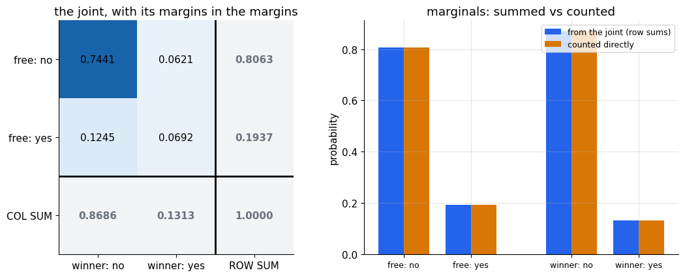

**Output**

```text
P(free)   from row sums 0.1937   counted directly 0.1938
P(winner) from col sums 0.1313   counted directly 0.1313
both marginals sum to 1: 1.000000 and 1.000000
```

### Cell 222

```python
# ---- P(winner | free = yes): the 'free = yes' row, divided by its own total.
row = J[1]                       # [ P(F=1,W=0), P(F=1,W=1) ]
cond_from_joint = row / row.sum()

# ---- The same thing computed by actually restricting to those emails.
cond_direct = np.array([(W[F] == 0).mean(), (W[F] == 1).mean()])

print("P(winner | free = yes)")
print(f"{'':>14}{'from the joint':>17}{'by restricting':>16}")
for j, lab in enumerate(["winner = no", "winner = yes"]):
    print(f"{lab:>14}{cond_from_joint[j]:>17.4f}{cond_direct[j]:>16.4f}")
print(f"{'sums to':>14}{cond_from_joint.sum():>17.4f}{cond_direct.sum():>16.4f}"
      f"   <- renormalised: the row is now the whole world")

# ---- And the other direction, which is a different question.
col = J[:, 1]
print(f"\nP(free | winner = yes)  = {col[1] / col.sum():.4f}")
print(f"P(winner | free = yes)  = {cond_from_joint[1]:.4f}")
print("Different numbers from the same four cells. The bar does not flip for free")
print("-- that asymmetry is exactly what Bayes' theorem in Part 4 repairs.")

# ---- Every conditional, both directions, from one table.
print("\nthe complete conditional picture, all from J:")
for i, lab in enumerate(["free = no ", "free = yes"]):
    r = J[i] / J[i].sum()
    print(f"  P(winner = yes | {lab}) = {r[1]:.4f}")
for j, lab in enumerate(["winner = no ", "winner = yes"]):
    c = J[:, j] / J[:, j].sum()
    print(f"  P(free = yes | {lab}) = {c[1]:.4f}")
```

**Output**

```text
P(winner | free = yes)
                 from the joint  by restricting
   winner = no           0.6428          0.6428
  winner = yes           0.3572          0.3572
       sums to           1.0000          1.0000   <- renormalised: the row is now the whole world

P(free | winner = yes)  = 0.5268
P(winner | free = yes)  = 0.3572
Different numbers from the same four cells. The bar does not flip for free
-- that asymmetry is exactly what Bayes' theorem in Part 4 repairs.

the complete conditional picture, all from J:
  P(winner = yes | free = no ) = 0.0771
  P(winner = yes | free = yes) = 0.3572
  P(free = yes | winner = no ) = 0.1434
  P(free = yes | winner = yes) = 0.5268
```

### Cell 225

```python
from scipy import stats

VARS = {"free": F, "winner": W, "meeting": M, "report": Rp, "tuesday": TUE}
pairs = [(a, b) for i, a in enumerate(VARS) for b in list(VARS)[i + 1:]]

print("Does the joint table factorise into the product of its margins?\n")
hdr = (f"{'pair':<22}{'largest |joint - product|':>26}{'chi-sq p-value':>16}"
       f"{'verdict':>16}")
print(hdr); print("-" * len(hdr))
for a, b in pairs:
    x, y = VARS[a], VARS[b]
    T = joint_table(x, y)
    product = np.outer(T.sum(axis=1), T.sum(axis=0))
    counts = (T * N_EMAILS).round().astype(int)
    p_value = stats.chi2_contingency(counts)[1]
    verdict = "factorises" if p_value > 0.01 else "does NOT"
    print(f"{a + ' & ' + b:<22}{np.abs(T - product).max():>26.5f}"
          f"{p_value:>16.4f}{verdict:>16}")
print("-" * len(hdr))
print("'tuesday' was generated independently of everything, and it is the only")
print("variable that factorises with the others. Every pair of words fails --")
print("because every word depends on whether the email is spam.\n")

# ---- But look inside one value of spam: the words come apart.
print("Now hold 'spam' fixed and repeat the test on 'free' and 'winner':")
for label, mask in [("spam only    ", is_spam), ("not spam only", ~is_spam)]:
    T = joint_table(F[mask], W[mask])
    product = np.outer(T.sum(axis=1), T.sum(axis=0))
    counts = (T * mask.sum()).round().astype(int)
    print(f"  {label}: largest gap {np.abs(T - product).max():.5f}, "
          f"p = {stats.chi2_contingency(counts)[1]:.4f}")
print("\nWithin a single class the two words are independent -- they were")
print("generated that way. That is 'conditional independence', and it is the")
print("assumption the naive Bayes classifier in Part 9 is built on.")
```

**Output**

```text
Does the joint table factorise into the product of its margins?

pair                   largest |joint - product|  chi-sq p-value         verdict
--------------------------------------------------------------------------------
free & winner                            0.04375          0.0000        does NOT
free & meeting                           0.03684          0.0000        does NOT
free & report                            0.02890          0.0000        does NOT
free & tuesday                           0.00129          0.3663      factorises
winner & meeting                         0.02887          0.0000        does NOT
winner & report                          0.02161          0.0000        does NOT
winner & tuesday                         0.00016          0.9085      factorises
meeting & report                         0.01903          0.0000        does NOT
meeting & tuesday                        0.00198          0.2160      factorises
report & tuesday                         0.00012          0.9507      factorises
--------------------------------------------------------------------------------
'tuesday' was generated independently of everything, and it is the only
variable that factorises with the others. Every pair of words fails --
because every word depends on whether the email is spam.

Now hold 'spam' fixed and repeat the test on 'free' and 'winner':
  spam only    : largest gap 0.00010, p = 0.9964
  not spam only: largest gap 0.00002, p = 1.0000

Within a single class the two words are independent -- they were
generated that way. That is 'conditional independence', and it is the
assumption the naive Bayes classifier in Part 9 is built on.
```

### Cell 229

```python
# ---- Covariance by hand, then against numpy, on pairs whose sign we can predict.
def cov_by_hand(x, y):
    x, y = np.asarray(x, float), np.asarray(y, float)
    return np.mean((x - x.mean()) * (y - y.mean()))


print("Covariance: by hand, and by numpy (which should agree exactly)\n")
hdr = f"{'pair':<20}{'by hand':>11}{'np.cov':>11}    {'why the sign comes out that way'}"
print(hdr); print("-" * len(hdr))
tested = [
    ("free & winner", F, W, "both are spam words: move together"),
    ("free & meeting", F, M, "spam word vs work word: move apart"),
    ("meeting & report", M, Rp, "both are work words: move together"),
    ("free & tuesday", F, TUE, "unrelated: should be about zero"),
    ("free & spam", F, is_spam, "the cause of it all"),
]
covs = {}
for name, x, y, note in tested:
    c_hand = cov_by_hand(x, y)
    c_np = np.cov(np.asarray(x, float), np.asarray(y, float), ddof=0)[0, 1]
    covs[name] = c_hand
    print(f"{name:<20}{c_hand:>11.5f}{c_np:>11.5f}    {note}")
print("-" * len(hdr))

# ---- Covariance with yourself is the variance.
print(f"\nCov(free, free) = {cov_by_hand(F, F):.6f}"
      f"   Var(free) = {np.asarray(F, float).var():.6f}   <- the same thing")

# ---- The variance-of-a-sum identity, with its missing term restored.
x, y = np.asarray(F, float), np.asarray(M, float)
print(f"\nVar(free + meeting)                      = {(x + y).var():.6f}")
print(f"Var(free) + Var(meeting)                 = {x.var() + y.var():.6f}   <- Part 6's rule")
print(f"Var(free) + Var(meeting) + 2*Cov         = "
      f"{x.var() + y.var() + 2 * cov_by_hand(x, y):.6f}   <- the whole truth")

fig, ax = plt.subplots(figsize=(9, 3.6))
names = list(covs)
vals = [covs[n] for n in names]
ax.bar(names, vals, color=[C_AREA if v > 0 else C_SLOPE for v in vals])
ax.axhline(0, color="black", lw=1)
ax.set_ylabel("covariance"); ax.set_title("sign of the covariance, five pairs")
plt.xticks(rotation=12, fontsize=9); plt.tight_layout(); plt.show()
```

**Output**

```text
Covariance: by hand, and by numpy (which should agree exactly)

pair                    by hand     np.cov    why the sign comes out that way
-----------------------------------------------------------------------------
free & winner           0.04375    0.04375    both are spam words: move together
free & meeting         -0.03684   -0.03684    spam word vs work word: move apart
meeting & report        0.01903    0.01903    both are work words: move together
free & tuesday         -0.00129   -0.00129    unrelated: should be about zero
free & spam             0.10817    0.10817    the cause of it all
-----------------------------------------------------------------------------

Cov(free, free) = 0.156211   Var(free) = 0.156211   <- the same thing

Var(free + meeting)                      = 0.281576
Var(free) + Var(meeting)                 = 0.355248   <- Part 6's rule
Var(free) + Var(meeting) + 2*Cov         = 0.281576   <- the whole truth
```

**Output**

```text
<Figure size 900x360 with 1 Axes>
```

**Figure**

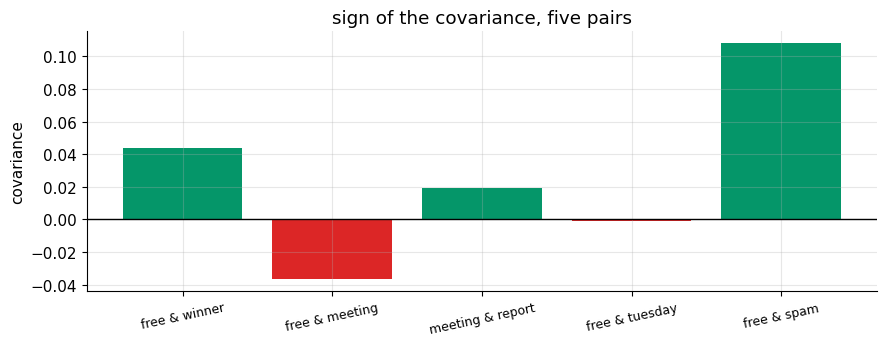

### Cell 231

```python
# ---- Two continuous features, and the same relationship in three unit systems.
n_words = RNG8.lognormal(mean=5.2, sigma=0.45, size=N_EMAILS)      # words
read_min = n_words / 200 + RNG8.normal(0, 0.12, N_EMAILS)          # minutes
read_min = np.maximum(read_min, 0.02)

variants = [
    ("words  vs  minutes", n_words,          read_min),
    ("words  vs  SECONDS", n_words,          read_min * 60),
    ("THOUSANDS of words  vs  minutes", n_words / 1000, read_min),
    ("THOUSANDS of words  vs  seconds", n_words / 1000, read_min * 60),
]

print("The SAME relationship between length and reading time, four ways:\n")
hdr = f"{'units':<34}{'covariance':>14}{'correlation':>14}"
print(hdr); print("-" * len(hdr))
seen = []
for label, x, y in variants:
    c = cov_by_hand(x, y)
    r = c / (x.std() * y.std())
    seen.append((c, r))
    print(f"{label:<34}{c:>14.5f}{r:>14.6f}")
print("-" * len(hdr))
cs = [abs(c) for c, _ in seen]
rs = [r for _, r in seen]
print(f"\ncovariance:  largest / smallest = {max(cs) / min(cs):,.0f} times")
print(f"correlation: largest - smallest = {max(rs) - min(rs):.2e}")
print("\nNothing about the emails changed between those four rows -- only the")
print("units. The covariance is a different number every time; the correlation")
print("is the same number every time.")
```

**Output**

```text
The SAME relationship between length and reading time, four ways:

units                                 covariance   correlation
--------------------------------------------------------------
words  vs  minutes                      46.41766      0.970173
words  vs  SECONDS                    2785.05944      0.970173
THOUSANDS of words  vs  minutes          0.04642      0.970173
THOUSANDS of words  vs  seconds          2.78506      0.970173
--------------------------------------------------------------

covariance:  largest / smallest = 60,000 times
correlation: largest - smallest = 1.11e-16

Nothing about the emails changed between those four rows -- only the
units. The covariance is a different number every time; the correlation
is the same number every time.
```

### Cell 235

```python
def corr_by_hand(x, y):
    x, y = np.asarray(x, float), np.asarray(y, float)
    return cov_by_hand(x, y) / (x.std() * y.std())


def corr_via_standardising(x, y):
    """The other route: standardise both, then take the plain covariance."""
    x, y = np.asarray(x, float), np.asarray(y, float)
    zx = (x - x.mean()) / x.std()
    zy = (y - y.mean()) / y.std()
    return cov_by_hand(zx, zy)


print("Correlation three ways, and the covariance beside it for contrast\n")
hdr = (f"{'pair':<30}{'covariance':>12}{'corr (hand)':>13}"
       f"{'corr (standardised)':>21}{'np.corrcoef':>13}")
print(hdr); print("-" * len(hdr))
show = [("free & winner", F, W), ("free & meeting", F, M),
        ("meeting & report", M, Rp), ("free & tuesday", F, TUE),
        ("free & spam", F, is_spam),
        ("n_words & reading time", n_words, read_min),
        ("n_words & reading SECONDS", n_words, read_min * 60)]
for name, x, y in show:
    xf, yf = np.asarray(x, float), np.asarray(y, float)
    print(f"{name:<30}{cov_by_hand(xf, yf):>12.5f}{corr_by_hand(xf, yf):>13.5f}"
          f"{corr_via_standardising(xf, yf):>21.5f}"
          f"{np.corrcoef(xf, yf)[0, 1]:>13.5f}")
print("-" * len(hdr))
print("\nThe last two rows are the same pair in different units: the covariance")
print("column changes, all three correlation columns do not.")

# ---- The bound, and what different correlations look like.
fig, ax = plt.subplots(1, 4, figsize=(13, 3.4))
base = RNG8.normal(0, 1, 700)
for k, (target, a) in enumerate([(0.95, ax[0]), (0.55, ax[1]),
                                 (0.0, ax[2]), (-0.85, ax[3])]):
    noise = RNG8.normal(0, 1, 700)
    y = target * base + np.sqrt(max(1 - target**2, 0)) * noise
    a.scatter(base, y, s=6, alpha=0.4, color=C_F)
    a.set_title(f"measured r = {corr_by_hand(base, y):+.2f}", fontsize=10)
    a.set_xticks([]); a.set_yticks([])
plt.tight_layout(); plt.show()

print(f"\nlargest correlation seen anywhere above: "
      f"{max(abs(corr_by_hand(np.asarray(x, float), np.asarray(y, float))) for _, x, y in show):.4f}"
      f"   (the bound is 1)")
```

**Output**

```text
Correlation three ways, and the covariance beside it for contrast

pair                            covariance  corr (hand)  corr (standardised)  np.corrcoef
-----------------------------------------------------------------------------------------
free & winner                      0.04375      0.32771              0.32771      0.32771
free & meeting                    -0.03684     -0.20891             -0.20891     -0.20891
meeting & report                   0.01903      0.10078              0.10078      0.10078
free & tuesday                    -0.00129     -0.00652             -0.00652     -0.00652
free & spam                        0.10817      0.59678              0.59678      0.59678
n_words & reading time            46.41766      0.97017              0.97017      0.97017
n_words & reading SECONDS       2785.05944      0.97017              0.97017      0.97017
-----------------------------------------------------------------------------------------

The last two rows are the same pair in different units: the covariance
column changes, all three correlation columns do not.
```

**Output**

```text
<Figure size 1300x340 with 4 Axes>
```

**Figure**

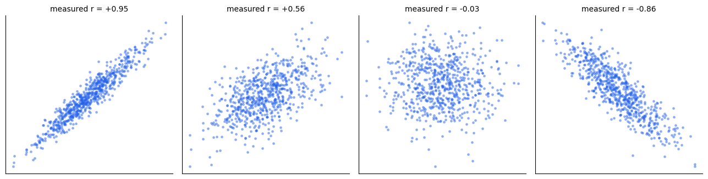

**Output**

```text
largest correlation seen anywhere above: 0.9702   (the bound is 1)
```

### Cell 238

```python
# ---- y is completely determined by x. No noise at all.
x_q = RNG8.uniform(-3, 3, 5000)
y_q = x_q**2

r_quad = corr_by_hand(x_q, y_q)
print(f"y = x^2 exactly, with no noise whatsoever.")
print(f"  correlation r      = {r_quad:+.5f}")
print(f"  covariance         = {cov_by_hand(x_q, y_q):+.5f}")
print(f"  is y determined by x? knowing x gives y to within "
      f"{np.abs(y_q - x_q**2).max():.1e}\n")

# But the two are wildly dependent: knowing x kills almost all of y's variance.
lo, hi = np.abs(x_q) < 1.0, np.abs(x_q) >= 1.0
print(f"  Var(y) overall                        = {y_q.var():.4f}")
print(f"  Var(y) among emails with |x| < 1      = {y_q[lo].var():.4f}")
print(f"  Var(y) among emails with |x| >= 1     = {y_q[hi].var():.4f}")
print("  Knowing something about x changes y's spread enormously -- that is")
print("  dependence, and the correlation is blind to all of it.")

# The correlation is not merely small here; it is heading to zero as we look
# at more points, which is what "the true correlation is 0" looks like.
print("\n  the measured correlation as the sample grows:")
for m in (500, 5_000, 50_000, 500_000):
    xm = RNG8.uniform(-3, 3, m)
    print(f"    n = {m:>7,}   r = {corr_by_hand(xm, xm**2):+.5f}")

fig, ax = plt.subplots(1, 2, figsize=(11, 4))
ax[0].scatter(x_q, y_q, s=6, alpha=0.35, color=C_F)
fit = np.polyfit(x_q, y_q, 1)
xx = np.linspace(-3, 3, 50)
ax[0].plot(xx, fit[0] * xx + fit[1], color=C_SLOPE, lw=2.5,
           label="best straight line")
ax[0].set_xlabel("x"); ax[0].set_ylabel("y = x squared")
ax[0].set_title(f"perfect dependence, r = {r_quad:+.4f}")
ax[0].legend(fontsize=9)

# For contrast: a genuinely unrelated pair, which looks quite different.
y_indep = RNG8.uniform(0, 9, 5000)
ax[1].scatter(x_q, y_indep, s=6, alpha=0.35, color=C_GREY)
ax[1].set_xlabel("x"); ax[1].set_ylabel("y, drawn independently")
ax[1].set_title(f"genuinely independent, r = {corr_by_hand(x_q, y_indep):+.4f}")
plt.tight_layout(); plt.show()

print(f"\nBoth panels have a correlation near zero. Only the right one has")
print(f"independence. Correlation cannot tell them apart; your eyes can.")
```

**Output**

```text
y = x^2 exactly, with no noise whatsoever.
  correlation r      = -0.01438
  covariance         = -0.06571
  is y determined by x? knowing x gives y to within 0.0e+00

  Var(y) overall                        = 7.0915
  Var(y) among emails with |x| < 1      = 0.0859
  Var(y) among emails with |x| >= 1     = 5.2819
  Knowing something about x changes y's spread enormously -- that is
  dependence, and the correlation is blind to all of it.

  the measured correlation as the sample grows:
    n =     500   r = -0.08175
    n =   5,000   r = -0.00544
    n =  50,000   r = +0.00288
    n = 500,000   r = -0.00287
```

**Output**

```text
<Figure size 1100x400 with 2 Axes>
```

**Figure**

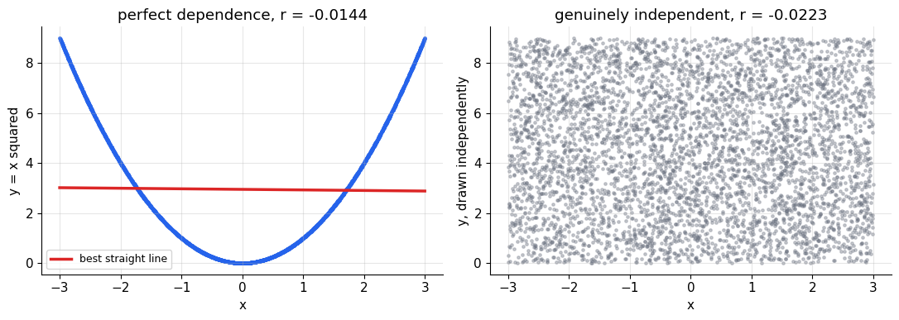

**Output**

```text
Both panels have a correlation near zero. Only the right one has
independence. Correlation cannot tell them apart; your eyes can.
```

### Cell 243

```python
# Anscombe's four datasets (1973). The first three share the same x values.
x_common = np.array([10, 8, 13, 9, 11, 14, 6, 4, 12, 7, 5], float)
quartet = [
    ("I",   x_common,
     np.array([8.04, 6.95, 7.58, 8.81, 8.33, 9.96, 7.24, 4.26, 10.84, 4.82, 5.68])),
    ("II",  x_common,
     np.array([9.14, 8.14, 8.74, 8.77, 9.26, 8.10, 6.13, 3.10, 9.13, 7.26, 4.74])),
    ("III", x_common,
     np.array([7.46, 6.77, 12.74, 7.11, 7.81, 8.84, 6.08, 5.39, 8.15, 6.42, 5.73])),
    ("IV",  np.array([8, 8, 8, 8, 8, 8, 8, 19, 8, 8, 8], float),
     np.array([6.58, 5.76, 7.71, 8.84, 8.47, 7.04, 5.25, 12.50, 5.56, 7.91, 6.89])),
]

hdr = (f"{'set':<6}{'mean x':>9}{'mean y':>9}{'var x':>9}{'var y':>9}"
       f"{'corr':>9}{'fit slope':>11}{'intercept':>11}")
print(hdr); print("-" * len(hdr))
stats_rows = []
for name, x, y in quartet:
    slope, intercept = np.polyfit(x, y, 1)
    row = (x.mean(), y.mean(), x.var(ddof=1), y.var(ddof=1),
           corr_by_hand(x, y), slope, intercept)
    stats_rows.append(row)
    print(f"{name:<6}" + "".join(f"{v:>9.3f}" if i < 5 else f"{v:>11.3f}"
                                 for i, v in enumerate(row)))
print("-" * len(hdr))
spread = np.array(stats_rows).max(axis=0) - np.array(stats_rows).min(axis=0)
print("largest disagreement between the four sets, column by column:")
print("  " + "  ".join(f"{v:.4f}" for v in spread))
print(f"  every summary statistic agrees to within {spread.max():.4f}\n")

fig, axes = plt.subplots(2, 2, figsize=(10, 7))
for (name, x, y), a, row in zip(quartet, axes.ravel(), stats_rows):
    a.scatter(x, y, s=55, color=C_F, zorder=3, edgecolor="white")
    xx = np.linspace(3, 20, 30)
    a.plot(xx, row[5] * xx + row[6], color=C_SLOPE, lw=2)
    a.set_title(f"set {name}   (r = {row[4]:.3f})", fontsize=11)
    a.set_xlim(2, 20); a.set_ylim(2, 14)
plt.suptitle("identical summary statistics, four different worlds", fontsize=13)
plt.tight_layout(); plt.show()
```

**Output**

```text
set      mean x   mean y    var x    var y     corr  fit slope  intercept
-------------------------------------------------------------------------
I         9.000    7.501   11.000    4.127    0.816      0.500      3.000
II        9.000    7.501   11.000    4.128    0.816      0.500      3.001
III       9.000    7.500   11.000    4.123    0.816      0.500      3.002
IV        9.000    7.501   11.000    4.123    0.817      0.500      3.002
-------------------------------------------------------------------------
largest disagreement between the four sets, column by column:
  0.0000  0.0009  0.0000  0.0050  0.0003  0.0004  0.0024
  every summary statistic agrees to within 0.0050
```

**Output**

```text
<Figure size 1000x700 with 4 Axes>
```

**Figure**

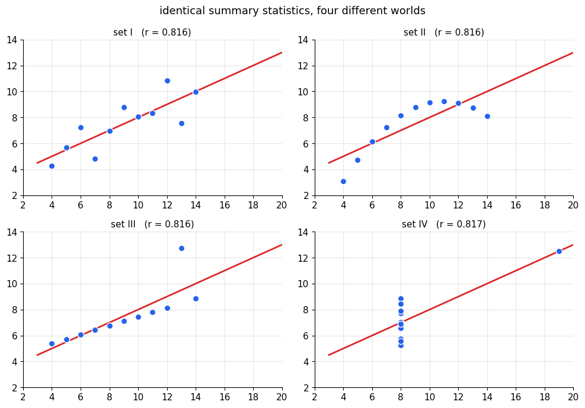

### Cell 246

```python
# ---- Five features of an email, several of them driven by whether it is spam.
n_links = RNG8.poisson(0.6 + 3.2 * is_spam)
n_caps = RNG8.poisson(2.0 + 9.0 * is_spam)
features = np.column_stack([n_words, read_min, n_links, n_caps,
                            is_spam.astype(float)])
feat_names = ["n_words", "read_min", "n_links", "n_caps", "is_spam"]

Sigma = np.cov(features, rowvar=False, ddof=0)
Corr = np.corrcoef(features, rowvar=False)

# Checks: the diagonal is the variances, and the matrix is symmetric.
print("diagonal of Sigma vs the variances computed one at a time:")
for k, lab in enumerate(feat_names):
    print(f"  {lab:<10} Sigma[{k},{k}] = {Sigma[k,k]:>10.4f}"
          f"    var = {features[:, k].var():>10.4f}")
print(f"\nsymmetric? largest |Sigma - Sigma transposed| = "
      f"{np.abs(Sigma - Sigma.T).max():.2e}")
print(f"correlation diagonal is all ones: {np.allclose(np.diag(Corr), 1)}")
print(f"one entry checked by hand: Corr[n_links, is_spam] = {Corr[2,4]:.5f}"
      f"   corr_by_hand = {corr_by_hand(features[:,2], features[:,4]):.5f}")

fig, ax = plt.subplots(1, 2, figsize=(12, 4.6))
im0 = ax[0].imshow(Sigma, cmap="RdBu_r",
                   vmin=-np.abs(Sigma).max(), vmax=np.abs(Sigma).max())
ax[1].imshow(Corr, cmap="RdBu_r", vmin=-1, vmax=1)
for a, Mx, title, fmt in [(ax[0], Sigma, "covariance matrix (mixed units)", "{:.2f}"),
                          (ax[1], Corr, "correlation matrix (unitless)", "{:.2f}")]:
    for i in range(len(feat_names)):
        for j in range(len(feat_names)):
            a.text(j, i, fmt.format(Mx[i, j]), ha="center", va="center", fontsize=9)
    a.set_xticks(range(len(feat_names))); a.set_yticks(range(len(feat_names)))
    a.set_xticklabels(feat_names, rotation=35, fontsize=9)
    a.set_yticklabels(feat_names, fontsize=9)
    a.set_title(title, fontsize=11); a.grid(False)
plt.colorbar(im0, ax=ax[0], fraction=0.046)
plt.tight_layout(); plt.show()

bi, bj = np.unravel_index(np.abs(Sigma).argmax(), Sigma.shape)
ci, cj = np.unravel_index(np.abs(Corr - np.eye(len(feat_names))).argmax(), Corr.shape)
print(f"\nlargest entry of Sigma : {Sigma[bi, bj]:>10.2f}   at "
      f"({feat_names[bi]}, {feat_names[bj]}) -- carries that feature's units, squared")
print(f"largest off-diagonal of Corr: {Corr[ci, cj]:>6.4f}   at "
      f"({feat_names[ci]}, {feat_names[cj]}) -- no units at all")
```

**Output**

```text
diagonal of Sigma vs the variances computed one at a time:
  n_words    Sigma[0,0] =  9279.3741    var =  9279.3741
  read_min   Sigma[1,1] =     0.2467    var =     0.2467
  n_links    Sigma[2,2] =     3.7195    var =     3.7195
  n_caps     Sigma[3,3] =    21.6995    var =    21.6995
  is_spam    Sigma[4,4] =     0.2103    var =     0.2103

symmetric? largest |Sigma - Sigma transposed| = 0.00e+00
correlation diagonal is all ones: True
one entry checked by hand: Corr[n_links, is_spam] = 0.76348   corr_by_hand = 0.76348
```

**Output**

```text
<Figure size 1200x460 with 3 Axes>
```

**Figure**

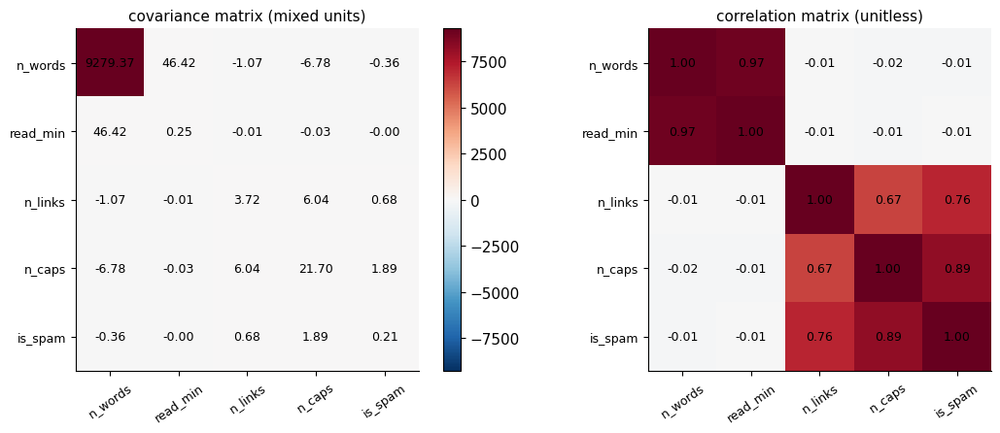

**Output**

```text
largest entry of Sigma :    9279.37   at (n_words, n_words) -- carries that feature's units, squared
largest off-diagonal of Corr: 0.9702   at (read_min, n_words) -- no units at all
```

### Cell 253

```python
# ============================================================
#  9.1  One formula, two readings
#       Left  : p held fixed, k varies  -> a probability distribution
#       Right : k held fixed, p varies  -> a likelihood function
# ============================================================
import numpy as np
import matplotlib.pyplot as plt
from scipy.special import comb

RNG9 = np.random.default_rng(1)

N_FLIPS, P_TRUE = 40, 0.65
flips   = RNG9.random(N_FLIPS) < P_TRUE
K_HEADS = int(flips.sum())

print(f"We tossed a coin {N_FLIPS} times and saw {K_HEADS} heads.")
print(f"(We built it with bias {P_TRUE}. In real life that number is exactly")
print(" what you do not have, which is why we are here.)")
print()


def binom_pmf(k, n, p):
    """Part 7's binomial. Works if k is an array, or if p is an array."""
    return comb(n, k) * p ** k * (1 - p) ** (n - k)


# --- reading 1: p fixed, k varies ------------------------------------
k_grid  = np.arange(N_FLIPS + 1)
P_FIXED = 0.5
bars    = binom_pmf(k_grid, N_FLIPS, P_FIXED)

# --- reading 2: k fixed, p varies ------------------------------------
p_grid = np.linspace(0.0, 1.0, 1001)
lik    = binom_pmf(K_HEADS, N_FLIPS, p_grid)

trapz = np.trapezoid if hasattr(np, "trapezoid") else np.trapz
area  = trapz(lik, p_grid)

print(f"PROBABILITY  (bias fixed at {P_FIXED}, count varies)")
print(f"    the bars sum to            {bars.sum():.6f}   <- must be 1")
print()
print(f"LIKELIHOOD   (count fixed at {K_HEADS}, bias varies)")
print(f"    the area under it is       {area:.6f}")
print(f"    for comparison, 1/(n+1) =  {1 / (N_FLIPS + 1):.6f}")
print("    ...not 1, and it never had to be. It is a score, not a distribution.")

fig, ax = plt.subplots(1, 2, figsize=(12.5, 4.3))

ax[0].bar(k_grid, bars, color=C_F, alpha=0.85, width=0.85)
ax[0].axvline(K_HEADS, color=C_SLOPE, lw=2, ls="--")
ax[0].text(K_HEADS + 0.8, bars.max() * 0.85, "what we\nactually saw",
           color=C_SLOPE, fontsize=10)
ax[0].set_xlabel("number of heads, k")
ax[0].set_ylabel("probability")
ax[0].set_title(f"PROBABILITY: bias fixed at {P_FIXED}, outcome varies",
                fontsize=11)

ax[1].plot(p_grid, lik, color=C_EXACT, lw=2.5)
ax[1].fill_between(p_grid, lik, color=C_EXACT, alpha=0.15)
ax[1].axvline(K_HEADS / N_FLIPS, color=C_SLOPE, lw=2, ls="--")
ax[1].text(K_HEADS / N_FLIPS + 0.02, lik.max() * 0.55,
           f"peak at k/n = {K_HEADS / N_FLIPS:.3f}", color=C_SLOPE, fontsize=10)
ax[1].set_xlabel("candidate bias, p")
ax[1].set_ylabel("likelihood L(p)")
ax[1].set_title(f"LIKELIHOOD: outcome fixed at {K_HEADS} heads, bias varies",
                fontsize=11)

plt.tight_layout()
plt.show()
```

**Output**

```text
We tossed a coin 40 times and saw 28 heads.
(We built it with bias 0.65. In real life that number is exactly
 what you do not have, which is why we are here.)

PROBABILITY  (bias fixed at 0.5, count varies)
    the bars sum to            1.000000   <- must be 1

LIKELIHOOD   (count fixed at 28, bias varies)
    the area under it is       0.024390
    for comparison, 1/(n+1) =  0.024390
    ...not 1, and it never had to be. It is a score, not a distribution.
```

**Output**

```text
<Figure size 1250x430 with 2 Axes>
```

**Figure**

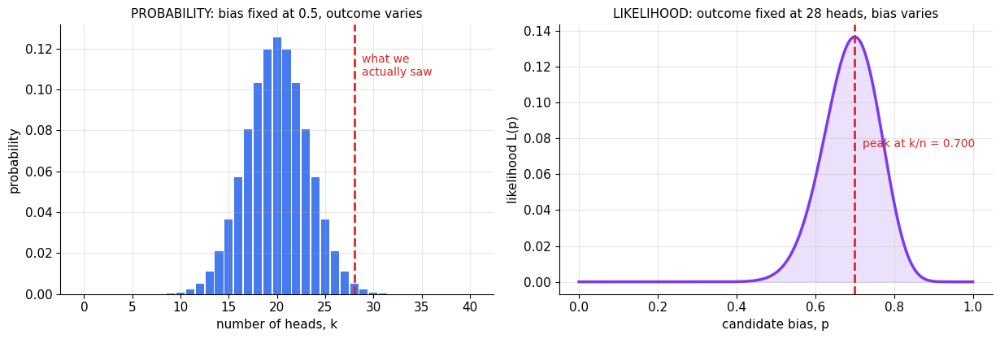

### Cell 256

```python
# ============================================================
#  9.1b  Maximum likelihood: find the peak, numerically
# ============================================================
from scipy.optimize import minimize_scalar

def neg_log_lik(p):
    """Negative log-likelihood of K_HEADS in N_FLIPS tosses, at bias p.
    The binomial coefficient does not depend on p, so it cannot move the
    peak -- we drop it. (It shifts the curve up or down, never sideways.)"""
    if p <= 0.0 or p >= 1.0:
        return np.inf
    return -(K_HEADS * np.log(p) + (N_FLIPS - K_HEADS) * np.log(1.0 - p))


opt = minimize_scalar(neg_log_lik, bounds=(1e-9, 1 - 1e-9), method="bounded")
p_hat_numeric = opt.x
p_hat_sample  = K_HEADS / N_FLIPS

print("MAXIMUM LIKELIHOOD, found by search")
print(f"    peak of the likelihood   p_hat = {p_hat_numeric:.8f}")
print(f"    the sample proportion     k/n  = {p_hat_sample:.8f}")
print(f"    they differ by                   {abs(p_hat_numeric - p_hat_sample):.2e}")
print()
print("The search knew nothing about 'proportions'. It walked a curve and")
print("found its top. It landed on the fraction of tosses that came up heads.")
print("That is not a coincidence, and 9.1c shows it is not one.")

ll = np.array([-neg_log_lik(p) for p in p_grid[1:-1]])

fig, ax = plt.subplots(figsize=(9.5, 4.3))
ax.plot(p_grid[1:-1], ll, color=C_EXACT, lw=2.5, label="log-likelihood")
ax.axvline(p_hat_numeric, color=C_SLOPE, lw=2, ls="--",
           label=f"numeric peak  {p_hat_numeric:.4f}")
ax.axvline(P_TRUE, color=C_GREY, lw=2, ls=":",
           label=f"the true bias  {P_TRUE}")
ax.set_ylim(ll.max() - 30, ll.max() + 2)
ax.set_xlabel("candidate bias, p")
ax.set_ylabel("log-likelihood")
ax.set_title("Maximum likelihood is a hill-climb over explanations", fontsize=11)
ax.legend(loc="lower center", fontsize=9)
plt.tight_layout()
plt.show()
```

**Output**

```text
MAXIMUM LIKELIHOOD, found by search
    peak of the likelihood   p_hat = 0.70000037
    the sample proportion     k/n  = 0.70000000
    they differ by                   3.72e-07

The search knew nothing about 'proportions'. It walked a curve and
found its top. It landed on the fraction of tosses that came up heads.
That is not a coincidence, and 9.1c shows it is not one.
```

**Output**

```text
<Figure size 950x430 with 1 Axes>
```

**Figure**

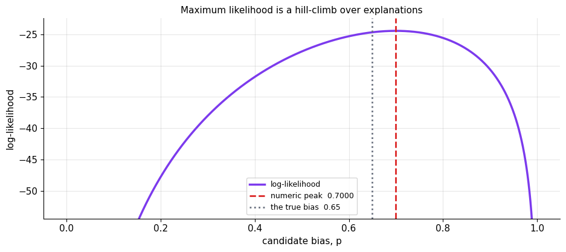

### Cell 259

```python
# ============================================================
#  9.1c  Analytic answer vs the search  --  and the underflow
# ============================================================
p_hat_analytic = K_HEADS / N_FLIPS


def dll(p):
    """d(log-likelihood)/dp, derived above:  k/p - (n-k)/(1-p)."""
    return K_HEADS / p - (N_FLIPS - K_HEADS) / (1.0 - p)


h  = 1e-6
fd = (-neg_log_lik(p_hat_analytic + h) + neg_log_lik(p_hat_analytic - h)) / (2 * h)

print("DOES THE PAPER AGREE WITH THE SEARCH?")
print(f"    analytic   k/n            = {p_hat_analytic:.10f}")
print(f"    numeric peak              = {p_hat_numeric:.10f}")
print(f"    difference                = {abs(p_hat_analytic - p_hat_numeric):.2e}")
print()
print("IS THE SLOPE REALLY ZERO THERE?")
print(f"    our formula  k/p-(n-k)/(1-p) = {dll(p_hat_analytic): .3e}")
print(f"    finite difference of the log = {fd: .3e}")
print("    (both zero to floating-point noise: the formula is the slope)")
print()

# ---------------- the underflow, done to ourselves on purpose ----------
N_TERMS = 2000
probs   = RNG9.uniform(0.05, 0.60, size=N_TERMS)   # 2000 innocent probabilities

raw_product = np.prod(probs)
log_total   = np.log(probs).sum()

cum        = np.cumprod(probs)
died_at    = int(np.argmax(cum == 0.0)) + 1        # 1-based term where it hit 0

print(f"MULTIPLYING {N_TERMS} PROBABILITIES TOGETHER")
print(f"    np.prod(probs)                = {raw_product}")
print(f"    ...is it exactly zero?          {raw_product == 0.0}")
print(f"    it hit exactly 0.0 at term     #{died_at} of {N_TERMS}")
print(f"    smallest positive float64      = {np.nextafter(0.0, 1.0)}")
print()
print("THE SAME QUANTITY, IN LOGS")
print(f"    np.log(probs).sum()           = {log_total:.4f}      <- finite, fine")
print(f"    which says the product is e^  = {log_total:.1f}")
print(f"    i.e. about 10^{log_total / np.log(10):.0f}")
print(f"    exp() of it, back on the raw scale = {np.exp(log_total)}  <- gone again")
print()
print("The information was never destroyed by the mathematics. It was destroyed")
print(f"by asking float64 to hold 10^{log_total / np.log(10):.0f}. In logs the same fact is a")
print("comfortable four-digit number. This is why every real likelihood, every")
print("loss function, and every naive Bayes classifier in 9.3 lives in log space.")
```

**Output**

```text
DOES THE PAPER AGREE WITH THE SEARCH?
    analytic   k/n            = 0.7000000000
    numeric peak              = 0.7000003717
    difference                = 3.72e-07

IS THE SLOPE REALLY ZERO THERE?
    our formula  k/p-(n-k)/(1-p) =  7.105e-15
    finite difference of the log =  0.000e+00
    (both zero to floating-point noise: the formula is the slope)

MULTIPLYING 2000 PROBABILITIES TOGETHER
    np.prod(probs)                = 0.0
    ...is it exactly zero?          True
    it hit exactly 0.0 at term     #579 of 2000
    smallest positive float64      = 5e-324

THE SAME QUANTITY, IN LOGS
    np.log(probs).sum()           = -2558.9084      <- finite, fine
    which says the product is e^  = -2558.9
    i.e. about 10^-1111
    exp() of it, back on the raw scale = 0.0  <- gone again

The information was never destroyed by the mathematics. It was destroyed
by asking float64 to hold 10^-1111. In logs the same fact is a
comfortable four-digit number. This is why every real likelihood, every
loss function, and every naive Bayes classifier in 9.3 lives in log space.
```

### Cell 263

```python
# ============================================================
#  9.2  Same ranking: highest log-likelihood == lowest cross-entropy
#       Six candidate models, scored both ways.
# ============================================================
words   = list(WORDS.keys())
X_all   = np.column_stack([inbox[w] for w in words]).astype(float)
y_all   = is_spam.astype(int)

# The TRUE posterior. We know the generator, so Part 4's theorem gives the
# exact P(spam | words) -- and the words really are conditionally independent
# given the class here, because that is how Part 0 built them.
p_s_true = np.array([WORDS[w][0] for w in words])
p_h_true = np.array([WORDS[w][1] for w in words])

def log_scores(Xq, prior, p_spam_w, p_ham_w):
    """log P(class) + log P(words | class), for both classes. Log space (9.1c)."""
    s = (np.log(prior)     + Xq @ np.log(p_spam_w) + (1 - Xq) @ np.log(1 - p_spam_w))
    h = (np.log(1 - prior) + Xq @ np.log(p_ham_w)  + (1 - Xq) @ np.log(1 - p_ham_w))
    return s, h

s_true, h_true = log_scores(X_all, P_SPAM, p_s_true, p_h_true)
post_true = np.exp(s_true - np.logaddexp(s_true, h_true))   # stable softmax of 2

candidates = {
    "the true posterior":      post_true,
    "true, but blurred halfway toward 0.5": 0.5 + 0.5 * (post_true - 0.5),
    "everyone gets the base rate": np.full(N_EMAILS, P_SPAM),
    "a coin flip for every email": np.full(N_EMAILS, 0.5),
    "true, over-sharpened":    np.clip(2.5 * (post_true - 0.5) + 0.5, 1e-4, 1 - 1e-4),
    "confidently backwards":   1.0 - post_true,
}

EPS = 1e-12
rows = []
for name, p in candidates.items():
    p  = np.clip(p, EPS, 1 - EPS)
    ll = np.sum(y_all * np.log(p) + (1 - y_all) * np.log(1 - p))
    ce = -ll / N_EMAILS
    rows.append((name, ll, ce))

print(f"{'model':<40}{'log-likelihood':>18}{'cross-entropy':>16}")
print("-" * 74)
for name, ll, ce in sorted(rows, key=lambda r: -r[1]):
    print(f"{name:<40}{ll:>18,.1f}{ce:>16.5f}")
print()

lls = np.array([r[1] for r in rows])
ces = np.array([r[2] for r in rows])
order_by_ll = np.argsort(-lls)      # best log-likelihood first
order_by_ce = np.argsort(ces)       # best (lowest) cross-entropy first

print(f"ranking by log-likelihood, best first : {order_by_ll}")
print(f"ranking by cross-entropy,  best first : {order_by_ce}")
print(f"identical?                              {np.array_equal(order_by_ll, order_by_ce)}")
print(f"and is cross-entropy exactly -ll/N?     "
      f"{np.allclose(ces, -lls / N_EMAILS)}")
```

**Output**

```text
model                                       log-likelihood   cross-entropy
--------------------------------------------------------------------------
the true posterior                                -5,499.6         0.27498
true, but blurred halfway toward 0.5              -8,541.3         0.42707
everyone gets the base rate                      -12,230.8         0.61154
a coin flip for every email                      -13,862.9         0.69315
true, over-sharpened                             -17,827.6         0.89138
confidently backwards                            -59,869.8         2.99349

ranking by log-likelihood, best first : [0 1 2 3 4 5]
ranking by cross-entropy,  best first : [0 1 2 3 4 5]
identical?                              True
and is cross-entropy exactly -ll/N?     True
```

### Cell 265

```python
# ============================================================
#  9.2b  What the loss actually charges you  --  and the infinity
# ============================================================
p = np.linspace(1e-4, 1 - 1e-4, 2000)

fig, ax = plt.subplots(figsize=(9.5, 4.5))
ax.plot(p, -np.log(p),     color=C_SLOPE, lw=2.5, label="truth is SPAM (y = 1)")
ax.plot(p, -np.log(1 - p), color=C_F,     lw=2.5, label="truth is NOT spam (y = 0)")
ax.axhline(0, color=C_GREY, lw=1)
ax.axvline(0.5, color=C_GREY, lw=1, ls=":")
ax.set_ylim(0, 8)
ax.set_xlabel("the probability the model said, p-hat")
ax.set_ylabel("cross-entropy loss for this one example")
ax.set_title("The penalty for the truth is minus the log of the probability you gave it",
             fontsize=11)
ax.legend(fontsize=10)
plt.tight_layout()
plt.show()

print("TRUTH IS SPAM (y = 1). What does one example cost?")
for phat in (0.99, 0.5, 0.01, 0.001):
    print(f"    model said {phat:<7} ->  loss = {-np.log(phat):.5f}")
print()
print("Note the shape of that: being confidently right is nearly free, being")
print("undecided costs a fixed toll, and being confidently wrong costs more")
print("than being undecided by a wide and accelerating margin.")
print()

with np.errstate(divide="ignore"):
    disaster = -np.log(0.0)
print("AND IF THE MODEL SAYS 0.0 AND THE TRUTH IS SPAM:")
print(f"    loss = {disaster}")
print()

# one poisoned example destroys the whole batch average
y_batch = np.ones(1000, dtype=int)
p_batch = np.full(1000, 0.9)
p_batch[0] = 0.0                      # one confident, wrong prediction
with np.errstate(divide="ignore"):
    bad_mean = -np.mean(y_batch * np.log(p_batch)
                        + (1 - y_batch) * np.log(1 - p_batch))
print(f"    mean loss over {len(y_batch)} examples, one of them 0.0 : {bad_mean}")

EPS_CLIP = 1e-15
p_fixed_batch = np.clip(p_batch, EPS_CLIP, 1 - EPS_CLIP)
good_mean = -np.mean(y_batch * np.log(p_fixed_batch)
                     + (1 - y_batch) * np.log(1 - p_fixed_batch))
print(f"    the same batch, predictions clipped to [{EPS_CLIP}, 1-{EPS_CLIP}]:")
print(f"    worst single loss = {-np.log(EPS_CLIP):.4f},  mean loss = {good_mean:.5f}")
print()
print("The clip is not a fudge to hide a mistake. It is a statement that no")
print("finite amount of evidence justifies literal certainty -- which is a")
print("modelling claim, and a correct one.")
```

**Output**

```text
<Figure size 950x450 with 1 Axes>
```

**Figure**

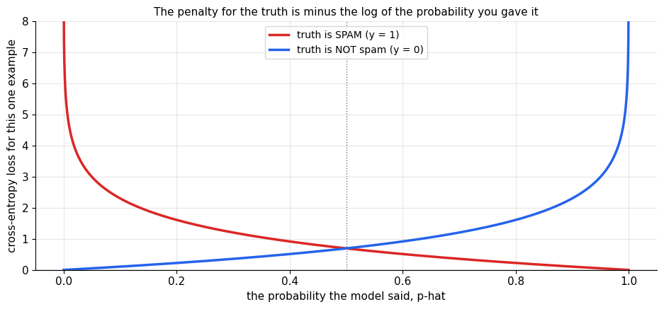

**Output**

```text
TRUTH IS SPAM (y = 1). What does one example cost?
    model said 0.99    ->  loss = 0.01005
    model said 0.5     ->  loss = 0.69315
    model said 0.01    ->  loss = 4.60517
    model said 0.001   ->  loss = 6.90776

Note the shape of that: being confidently right is nearly free, being
undecided costs a fixed toll, and being confidently wrong costs more
than being undecided by a wide and accelerating margin.

AND IF THE MODEL SAYS 0.0 AND THE TRUTH IS SPAM:
    loss = inf

    mean loss over 1000 examples, one of them 0.0 : inf
    the same batch, predictions clipped to [1e-15, 1-1e-15]:
    worst single loss = 34.5388,  mean loss = 0.13979

The clip is not a fudge to hide a mistake. It is a statement that no
finite amount of evidence justifies literal certainty -- which is a
modelling claim, and a correct one.
```

### Cell 270

```python
# ============================================================
#  9.3a  Split the inbox, then estimate every number by COUNTING
# ============================================================
N_TRAIN = 15_000
perm    = np.random.default_rng(2026).permutation(N_EMAILS)
tr, te  = perm[:N_TRAIN], perm[N_TRAIN:]

X_tr, y_tr = X_all[tr], y_all[tr]
X_te, y_te = X_all[te], y_all[te]

print(f"train: {len(tr):,} emails   ({y_tr.mean():.3f} of them spam)")
print(f"test : {len(te):,} emails   ({y_te.mean():.3f} of them spam)")
print("The test set is never touched until we predict on it.")
print()

# --- the prior: one count (Part 1) ------------------------------------
prior_spam = y_tr.mean()

# --- the likelihoods: one count per word per class ---------------------
lik_spam = X_tr[y_tr == 1].mean(axis=0)      # P(word present | spam)
lik_ham  = X_tr[y_tr == 0].mean(axis=0)      # P(word present | not spam)

print(f"P(spam) estimated by counting = {prior_spam:.4f}"
      f"   (Part 0 generated it with {P_SPAM})")
print()
print(f"{'word':<10}{'P(w|spam)':>12}{'true':>8}{'P(w|ham)':>12}{'true':>8}"
      f"{'log-odds':>11}")
print("-" * 61)
for j, w in enumerate(words):
    lo = np.log(lik_spam[j] / lik_ham[j])
    print(f"{w:<10}{lik_spam[j]:>12.4f}{WORDS[w][0]:>8}"
          f"{lik_ham[j]:>12.4f}{WORDS[w][1]:>8}{lo:>11.2f}")
print()
print("Left column of each pair: estimated from 15,000 emails by counting.")
print("Right column: the value Part 0 actually used. Counting works.")
print()
print("The last column is the evidence each word carries: how many units of")
print("log-odds seeing it adds to the spam score. A positive number argues for")
print("spam, a negative one argues against, and the size is how loudly.")
```

**Output**

```text
train: 15,000 emails   (0.299 of them spam)
test : 5,000 emails   (0.306 of them spam)
The test set is never touched until we predict on it.

P(spam) estimated by counting = 0.2991   (Part 0 generated it with 0.3)

word         P(w|spam)    true    P(w|ham)    true   log-odds
-------------------------------------------------------------
free            0.5546    0.55      0.0384    0.04       2.67
meeting         0.0325    0.03      0.3764    0.38      -2.45
winner          0.4137    0.42      0.0101    0.01       3.71
report          0.0517    0.05      0.3139    0.31      -1.80

Left column of each pair: estimated from 15,000 emails by counting.
Right column: the value Part 0 actually used. Counting works.

The last column is the evidence each word carries: how many units of
log-odds seeing it adds to the spam score. A positive number argues for
spam, a negative one argues against, and the size is how loudly.
```

### Cell 271

```python
# ============================================================
#  9.3b  Classify, and score it honestly
# ============================================================
def nb_predict(Xq, prior, ls, lh):
    """Naive Bayes posterior P(spam | words), computed in log space."""
    s, h = log_scores(Xq, prior, ls, lh)
    return np.exp(s - np.logaddexp(s, h))


post_te = nb_predict(X_te, prior_spam, lik_spam, lik_ham)
pred_te = (post_te > 0.5).astype(int)

acc      = (pred_te == y_te).mean()
majority = 1 - y_te.mean() if y_te.mean() < 0.5 else y_te.mean()

tp = int(((pred_te == 1) & (y_te == 1)).sum())
fp = int(((pred_te == 1) & (y_te == 0)).sum())
fn = int(((pred_te == 0) & (y_te == 1)).sum())
tn = int(((pred_te == 0) & (y_te == 0)).sum())
cm = np.array([[tn, fp], [fn, tp]])

print(f"NAIVE BAYES on {len(te):,} unseen emails")
print(f"    accuracy                     = {acc:.4f}")
print(f"    always-guess-the-common-class= {majority:.4f}   <- the baseline")
print(f"    errors it removed vs baseline= {(acc - majority):.4f}")
print()
print(f"    recall on spam (caught)      = {tp / (tp + fn):.4f}")
print(f"    precision on spam            = {tp / (tp + fp):.4f}")
print(f"    real mail wrongly binned     = {fp} of {tn + fp}")
print()

fig, ax = plt.subplots(figsize=(5.6, 4.6))
ax.imshow(cm, cmap="Blues", alpha=0.75)
for i in range(2):
    for j in range(2):
        ax.text(j, i, f"{cm[i, j]:,}", ha="center", va="center",
                fontsize=16, fontweight="bold",
                color="white" if cm[i, j] > cm.max() / 2 else "black")
ax.set_xticks([0, 1]); ax.set_xticklabels(["said: not spam", "said: SPAM"])
ax.set_yticks([0, 1]); ax.set_yticklabels(["really not spam", "really SPAM"])
ax.set_title(f"Confusion matrix  --  accuracy {acc:.3f}", fontsize=11)
ax.grid(False)
plt.tight_layout()
plt.show()
```

**Output**

```text
NAIVE BAYES on 5,000 unseen emails
    accuracy                     = 0.8962
    always-guess-the-common-class= 0.6940   <- the baseline
    errors it removed vs baseline= 0.2022

    recall on spam (caught)      = 0.7098
    precision on spam            = 0.9354
    real mail wrongly binned     = 75 of 3470
```

**Output**

```text
<Figure size 560x460 with 1 Axes>
```

**Figure**

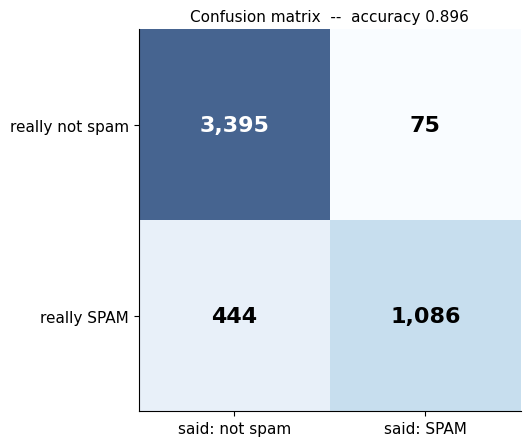

### Cell 274

```python
# ============================================================
#  9.3c  Interrogating the naive assumption with Part 8's tools
# ============================================================
def corr_matrix(M):
    """Part 8's correlation, on the columns of M."""
    return np.corrcoef(M, rowvar=False)


print("MARGINAL correlations between words -- ignoring the class entirely:")
print(f"{'':<10}" + "".join(f"{w:>10}" for w in words))
Cm = corr_matrix(X_all)
for i, w in enumerate(words):
    print(f"{w:<10}" + "".join(f"{Cm[i, j]:>10.3f}" for j in range(len(words))))
print()
print("Strongly dependent, exactly as Part 8 measured: 'free' and 'winner' turn")
print("up together, 'free' and 'meeting' avoid each other. Naive Bayes would be")
print("dead on arrival if THIS were the independence it assumed. It is not.")
print()

Cs = corr_matrix(X_all[y_all == 1])
Ch = corr_matrix(X_all[y_all == 0])
off = ~np.eye(len(words), dtype=bool)
print("CONDITIONAL correlations -- within spam only, and within ham only:")
print(f"    largest off-diagonal correlation inside spam = {np.abs(Cs[off]).max():.4f}")
print(f"    largest off-diagonal correlation inside ham  = {np.abs(Ch[off]).max():.4f}")
print()
print("Near zero. The dependence in the first table was entirely explained by")
print("the hidden cause -- being spam. That is Part 3's lesson restated: two")
print("things can be dependent and yet independent GIVEN a third.")
print()
print("So on THIS data the naive assumption is not merely tolerable, it is TRUE,")
print("because Part 0 generated the words that way. Which makes it useless as a")
print("test of what the assumption costs. So let us break it deliberately.")
print()

# --- break it: a duplicated feature is perfectly dependent, given the class
X_dup_tr = np.column_stack([X_tr, X_tr[:, 0]])     # 'free' counted twice
X_dup_te = np.column_stack([X_te, X_te[:, 0]])
lik_spam_d = X_dup_tr[y_tr == 1].mean(axis=0)
lik_ham_d  = X_dup_tr[y_tr == 0].mean(axis=0)

post_dup = nb_predict(X_dup_te, prior_spam, lik_spam_d, lik_ham_d)
pred_dup = (post_dup > 0.5).astype(int)

conf_honest = np.maximum(post_te,  1 - post_te).mean()
conf_dup    = np.maximum(post_dup, 1 - post_dup).mean()

print("WHAT DOUBLE-COUNTING ONE WORD DOES")
print(f"{'':<26}{'honest model':>15}{'duplicated word':>18}")
print(f"{'accuracy':<26}{acc:>15.4f}{(pred_dup == y_te).mean():>18.4f}")
print(f"{'mean confidence':<26}{conf_honest:>15.4f}{conf_dup:>18.4f}")
print(f"{'predictions above 0.99':<26}"
      f"{(np.maximum(post_te, 1 - post_te) > 0.99).mean():>15.4f}"
      f"{(np.maximum(post_dup, 1 - post_dup) > 0.99).mean():>18.4f}")
print(f"{'they disagree on':<26}{(pred_dup != pred_te).sum():>15,d} emails")
print()
print("The verdicts barely move. The CONFIDENCE moves a lot -- the same evidence")
print("was entered twice, so the model believes it twice as hard. That is the")
print("cost of the naive assumption in one line: it distorts the probabilities")
print("while usually leaving the winner alone.")
```

**Output**

```text
MARGINAL correlations between words -- ignoring the class entirely:
                free   meeting    winner    report
free           1.000    -0.209     0.328    -0.173
meeting       -0.209     1.000    -0.192     0.101
winner         0.328    -0.192     1.000    -0.151
report        -0.173     0.101    -0.151     1.000

Strongly dependent, exactly as Part 8 measured: 'free' and 'winner' turn
up together, 'free' and 'meeting' avoid each other. Naive Bayes would be
dead on arrival if THIS were the independence it assumed. It is not.

CONDITIONAL correlations -- within spam only, and within ham only:
    largest off-diagonal correlation inside spam = 0.0274
    largest off-diagonal correlation inside ham  = 0.0128

Near zero. The dependence in the first table was entirely explained by
the hidden cause -- being spam. That is Part 3's lesson restated: two
things can be dependent and yet independent GIVEN a third.

So on THIS data the naive assumption is not merely tolerable, it is TRUE,
because Part 0 generated the words that way. Which makes it useless as a
test of what the assumption costs. So let us break it deliberately.

WHAT DOUBLE-COUNTING ONE WORD DOES
                             honest model   duplicated word
accuracy                           0.8962            0.8860
mean confidence                    0.8961            0.9465
predictions above 0.99             0.1484            0.4286
they disagree on                      131 emails

The verdicts barely move. The CONFIDENCE moves a lot -- the same evidence
was entered twice, so the model believes it twice as hard. That is the
cost of the naive assumption in one line: it distorts the probabilities
while usually leaving the winner alone.
```

### Cell 276

```python
# ============================================================
#  9.3d  The zero-probability catastrophe, and Laplace's fix
# ============================================================
# Zeros appear when a class never happened to contain a word IN YOUR SAMPLE.
# With 15,000 emails that is rare. With 200 -- the realistic case when you are
# hand-labelling -- it is routine. Find the first seed where it bites:
SMALL = 200
for seed in range(100):
    idx  = np.random.default_rng(seed).choice(tr, SMALL, replace=False)
    Xs, ys = X_all[idx], y_all[idx]
    ls_s = Xs[ys == 1].mean(axis=0)
    lh_s = Xs[ys == 0].mean(axis=0)
    if (ls_s == 0).any() or (lh_s == 0).any():
        break

zero_cls, zero_j = (("spam", int(np.argmax(ls_s == 0))) if (ls_s == 0).any()
                    else ("not spam", int(np.argmax(lh_s == 0))))
print(f"Training on only {SMALL} labelled emails (seed {seed}):")
print(f"    the word '{words[zero_j]}' never appeared in a single "
      f"'{zero_cls}' email of the {SMALL}.")
print(f"    so the model estimates P('{words[zero_j]}' | {zero_cls}) = 0.0000")
print("    -- it has concluded that something it merely has not seen is IMPOSSIBLE.")
print()

# Build the most favourable possible email FOR that class: it carries the
# zeroed word, plus every other word that argues for the same class.
favours_zero_cls = (lik_spam > lik_ham) if zero_cls == "spam" else (lik_ham > lik_spam)
probe = np.where(favours_zero_cls, 1.0, 0.0)
probe[zero_j] = 1.0
others = [w for j, w in enumerate(words) if probe[j] == 1 and j != zero_j]
print(f"    Now build the email that argues hardest for '{zero_cls}': every other")
print(f"    word that favours it, plus the zeroed word itself.")
print(f"        arguing for {zero_cls}: {', '.join(others)}")
print(f"        plus the zeroed word: {words[zero_j]}")
print()

with np.errstate(divide="ignore", invalid="ignore"):
    s0, h0 = log_scores(probe[None, :], ys.mean(), ls_s, lh_s)
    post0  = np.exp(s0 - np.logaddexp(s0, h0))
post0_zero = post0[0] if zero_cls == "spam" else 1.0 - post0[0]

print("UNSMOOTHED")
print(f"    log-score for spam       = {s0[0]}")
print(f"    log-score for not spam   = {h0[0]}")
print(f"    P({zero_cls} | this email) = {post0_zero}")
print(f"    ...is it exactly zero?     {post0_zero == 0.0}")
print("    One zero count annihilated every other word in the email. No amount")
print("    of contrary evidence can ever recover, because it is multiplied by 0.")
print()

# --- Laplace (add-one) smoothing: pretend you saw one of each outcome ---
def laplace(Xc, alpha=1.0):
    """(count + alpha) / (n + 2*alpha) -- 2 because present/absent."""
    return (Xc.sum(axis=0) + alpha) / (Xc.shape[0] + 2 * alpha)


ls_lap = laplace(Xs[ys == 1])
lh_lap = laplace(Xs[ys == 0])

s1, h1 = log_scores(probe[None, :], ys.mean(), ls_lap, lh_lap)
post1  = np.exp(s1 - np.logaddexp(s1, h1))
post1_zero = post1[0] if zero_cls == "spam" else 1.0 - post1[0]
print("WITH LAPLACE SMOOTHING (add one to every count)")
print(f"    P('{words[zero_j]}' | {zero_cls}) = 0.0000  ->  "
      f"{(ls_lap if zero_cls == 'spam' else lh_lap)[zero_j]:.4f}")
print(f"    P({zero_cls} | this email) = {post1_zero:.4f}")
print("    Now the other words get a vote again.")
print()

# --- and on the whole test set -----------------------------------------
with np.errstate(divide="ignore", invalid="ignore"):
    acc_small_raw = ((nb_predict(X_te, ys.mean(), ls_s, lh_s) > 0.5)
                     .astype(int) == y_te).mean()
acc_small_lap = ((nb_predict(X_te, ys.mean(), ls_lap, lh_lap) > 0.5)
                 .astype(int) == y_te).mean()

lik_spam_lap = laplace(X_tr[y_tr == 1])
lik_ham_lap  = laplace(X_tr[y_tr == 0])
acc_big_lap  = ((nb_predict(X_te, prior_spam, lik_spam_lap, lik_ham_lap) > 0.5)
                .astype(int) == y_te).mean()

print(f"ACCURACY ON THE {len(te):,} TEST EMAILS")
print(f"    trained on {SMALL:>6,}, no smoothing = {acc_small_raw:.4f}")
print(f"    trained on {SMALL:>6,}, Laplace      = {acc_small_lap:.4f}")
print(f"    trained on {N_TRAIN:>6,}, no smoothing = {acc:.4f}")
print(f"    trained on {N_TRAIN:>6,}, Laplace      = {acc_big_lap:.4f}")
print()
print("Smoothing rescues the small-sample model and does essentially nothing to")
print("the large-sample one -- which is the correct behaviour. It is a claim")
print("that you have not seen everything yet, and with enough data that claim")
print("stops mattering.")
```

**Output**

```text
Training on only 200 labelled emails (seed 11):
    the word 'winner' never appeared in a single 'not spam' email of the 200.
    so the model estimates P('winner' | not spam) = 0.0000
    -- it has concluded that something it merely has not seen is IMPOSSIBLE.

    Now build the email that argues hardest for 'not spam': every other
    word that favours it, plus the zeroed word itself.
        arguing for not spam: meeting, report
        plus the zeroed word: winner

UNSMOOTHED
    log-score for spam       = -10.721026318885595
    log-score for not spam   = -inf
    P(not spam | this email) = 0.0
    ...is it exactly zero?     True
    One zero count annihilated every other word in the email. No amount
    of contrary evidence can ever recover, because it is multiplied by 0.

WITH LAPLACE SMOOTHING (add one to every count)
    P('winner' | not spam) = 0.0000  ->  0.0072
    P(not spam | this email) = 0.8961
    Now the other words get a vote again.

ACCURACY ON THE 5,000 TEST EMAILS
    trained on    200, no smoothing = 0.8150
    trained on    200, Laplace      = 0.8958
    trained on 15,000, no smoothing = 0.8962
    trained on 15,000, Laplace      = 0.8962

Smoothing rescues the small-sample model and does essentially nothing to
the large-sample one -- which is the correct behaviour. It is a claim
that you have not seen everything yet, and with enough data that claim
stops mattering.
```

### Cell 279

```python
# ============================================================
#  9.4  Reliability diagram -- honest model vs the double-counting one
# ============================================================
def reliability(post, y_true, n_bins=10):
    """Bin predictions; return (mean predicted, actual fraction, count) per bin."""
    edges = np.linspace(0.0, 1.0, n_bins + 1)
    which = np.clip(np.digitize(post, edges) - 1, 0, n_bins - 1)
    conf, freq, cnt = [], [], []
    for b in range(n_bins):
        m = which == b
        cnt.append(int(m.sum()))
        conf.append(post[m].mean() if m.any() else np.nan)
        freq.append(y_true[m].mean() if m.any() else np.nan)
    return np.array(conf), np.array(freq), np.array(cnt)


def ece(post, y_true, n_bins=10):
    c, f, n = reliability(post, y_true, n_bins)
    ok = n > 0
    return float(np.sum(n[ok] / n.sum() * np.abs(f[ok] - c[ok])))


c_h, f_h, n_h = reliability(post_te, y_te)
c_d, f_d, n_d = reliability(post_dup, y_te)
ece_h, ece_d  = ece(post_te, y_te), ece(post_dup, y_te)

fig, ax = plt.subplots(1, 2, figsize=(12.5, 4.6))

ax[0].plot([0, 1], [0, 1], color=C_GREY, ls="--", lw=2, label="perfect calibration")
ok = n_h > 0
ax[0].plot(c_h[ok], f_h[ok], "o-", color=C_AREA, lw=2.5, ms=8,
           label=f"honest model, ECE {ece_h:.4f}")
ok = n_d > 0
ax[0].plot(c_d[ok], f_d[ok], "s-", color=C_SLOPE, lw=2.5, ms=7,
           label=f"duplicated word, ECE {ece_d:.4f}")
ax[0].set_xlabel("probability the model announced")
ax[0].set_ylabel("fraction that really were spam")
ax[0].set_title("Reliability diagram", fontsize=11)
ax[0].legend(fontsize=9, loc="upper left")
ax[0].set_xlim(-0.03, 1.03); ax[0].set_ylim(-0.03, 1.03)

w = 0.045
ax[1].bar(np.arange(10) / 10 + 0.05 - w / 2, n_h, width=w, color=C_AREA,
          label="honest model", alpha=0.85)
ax[1].bar(np.arange(10) / 10 + 0.05 + w / 2, n_d, width=w, color=C_SLOPE,
          label="duplicated word", alpha=0.85)
ax[1].set_xlabel("probability the model announced")
ax[1].set_ylabel("how many test emails")
ax[1].set_title("Where the predictions actually live", fontsize=11)
ax[1].legend(fontsize=9)

plt.tight_layout()
plt.show()

print(f"{'bin':>12}{'n':>8}{'mean predicted':>17}{'actually spam':>16}{'gap':>9}")
print("-" * 62)
for b in range(10):
    if n_h[b] == 0:
        continue
    print(f"{b / 10:.1f} - {(b + 1) / 10:.1f}{n_h[b]:>8,d}"
          f"{c_h[b]:>17.4f}{f_h[b]:>16.4f}{f_h[b] - c_h[b]:>9.4f}")
print()
print(f"expected calibration error, honest model    = {ece_h:.4f}")
print(f"expected calibration error, duplicated word = {ece_d:.4f}")
print(f"ratio                                       = {ece_d / ece_h:.1f}x worse")
print()
verdict = ("WELL calibrated" if ece_h < 0.02 else
           "NOT well calibrated" if ece_h > 0.05 else "BORDERLINE")
print(f"VERDICT on the honest model: {verdict} on this data.")
print("And it should be. Part 0 generated the words to be conditionally")
print("independent given the class, so naive Bayes' assumption is exactly true")
print("here and its posterior is the real one. That is a luxury of simulated")
print("data. The duplicated-word model is what real text looks like:")
print(f"    accuracy differs by only {abs((pred_dup == y_te).mean() - acc):.4f}")
print(f"    calibration error is     {ece_d / ece_h:.1f}x worse")
print("Accuracy could not see the difference. Calibration could.")
```

**Output**

```text
<Figure size 1250x460 with 2 Axes>
```

**Figure**

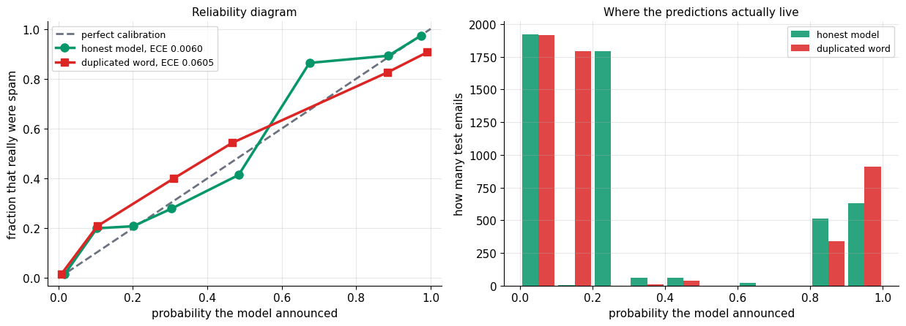

**Output**

```text
         bin       n   mean predicted   actually spam      gap
--------------------------------------------------------------
0.0 - 0.1   1,924           0.0164          0.0151  -0.0013
0.1 - 0.2       5           0.1036          0.2000   0.0964
0.2 - 0.3   1,791           0.2006          0.2083   0.0077
0.3 - 0.4      61           0.3036          0.2787  -0.0249
0.4 - 0.5      58           0.4842          0.4138  -0.0704
0.6 - 0.7      22           0.6746          0.8636   0.1891
0.8 - 0.9     511           0.8866          0.8924   0.0058
0.9 - 1.0     628           0.9741          0.9729  -0.0012

expected calibration error, honest model    = 0.0060
expected calibration error, duplicated word = 0.0605
ratio                                       = 10.0x worse

VERDICT on the honest model: WELL calibrated on this data.
And it should be. Part 0 generated the words to be conditionally
independent given the class, so naive Bayes' assumption is exactly true
here and its posterior is the real one. That is a luxury of simulated
data. The duplicated-word model is what real text looks like:
    accuracy differs by only 0.0102
    calibration error is     10.0x worse
Accuracy could not see the difference. Calibration could.
```

