# 09 — Introduction to Statistics

**Status:** Executed successfully

## Code and Output

### Cell 3

```python
# ============================================================
#  Setup -- no installs, no downloads, no network.
# ============================================================
import numpy as np
import matplotlib.pyplot as plt

plt.rcParams["figure.figsize"] = (9, 4.5)
plt.rcParams["axes.grid"]      = True
plt.rcParams["grid.alpha"]     = 0.3
plt.rcParams["axes.spines.top"]   = False
plt.rcParams["axes.spines.right"] = False
plt.rcParams["font.size"] = 11

C_F, C_SLOPE, C_AREA = "#2563EB", "#DC2626", "#059669"
C_APPROX, C_EXACT, C_GREY, C_SOFT = "#D97706", "#7C3AED", "#6B7280", "#E5E7EB"


print(f"numpy {np.__version__}")
```

**Output**

```text
numpy 2.1.3
```

### Cell 5

```python
# ============================================================
#  The running example -- a population we can actually SEE.
#  Statistics is about guessing a population from a sample.
#  Normally you never see the population. Here we simulate it,
#  so every estimate can be checked against the truth.
# ============================================================
import numpy as np

RNG = np.random.default_rng(23)

# THE POPULATION: reaction times (ms) of 200,000 people. We know these
# numbers exactly. A real study never would -- that is the whole problem.
POP_N   = 200_000
POP     = RNG.lognormal(mean=np.log(280), sigma=0.28, size=POP_N)
POP_MU  = POP.mean()
POP_SD  = POP.std(ddof=0)

# A SAMPLE: what a real study actually collects.
SAMPLE_N = 40
sample   = RNG.choice(POP, SAMPLE_N, replace=False)

print(f"population : {POP_N:,} people")
print(f"  true mean          mu = {POP_MU:8.2f} ms   <- normally UNKNOWABLE")
print(f"  true sd         sigma = {POP_SD:8.2f} ms")
print()
print(f"one sample of {SAMPLE_N}:")
print(f"  sample mean     x-bar = {sample.mean():8.2f} ms")
print(f"  sample sd           s = {sample.std(ddof=1):8.2f} ms")
print(f"  off by                {sample.mean() - POP_MU:+8.2f} ms")
```

**Output**

```text
population : 200,000 people
  true mean          mu =   290.99 ms   <- normally UNKNOWABLE
  true sd         sigma =    83.01 ms

one sample of 40:
  sample mean     x-bar =   280.85 ms
  sample sd           s =    74.36 ms
  off by                  -10.14 ms
```

### Cell 6

```python
fig, (ax1, ax2) = plt.subplots(1, 2, figsize=(12, 4.2))

ax1.hist(POP, bins=90, color=C_F, alpha=0.85)
ax1.axvline(POP_MU, color=C_SLOPE, lw=2.2, label=f"true mean {POP_MU:.1f} ms")
ax1.axvline(np.median(POP), color=C_AREA, lw=2.2, ls="--",
            label=f"true median {np.median(POP):.1f} ms")
ax1.set_title(f"The POPULATION -- all {POP_N:,} people")
ax1.set_xlabel("reaction time (ms)"); ax1.set_ylabel("people")
ax1.legend(frameon=False)

ax2.hist(sample, bins=14, color=C_APPROX, alpha=0.9, edgecolor="white")
ax2.axvline(sample.mean(), color=C_SLOPE, lw=2.2,
            label=f"sample mean {sample.mean():.1f} ms")
ax2.axvline(POP_MU, color=C_GREY, lw=2.0, ls=":", label="true mean")
ax2.set_title(f"One SAMPLE -- {SAMPLE_N} people")
ax2.set_xlabel("reaction time (ms)"); ax2.set_ylabel("people")
ax2.legend(frameon=False)

fig.tight_layout(); plt.show()

print(f"true mean   mu    = {POP_MU:8.2f} ms")
print(f"sample mean x-bar = {sample.mean():8.2f} ms")
print(f"error             = {sample.mean() - POP_MU:+8.2f} ms "
      f"({abs(sample.mean() - POP_MU) / POP_MU:.2%} off)")
print()
print("Take another sample and you get a different answer. That variability")
print("is not a flaw in the method -- it IS the subject.")
```

**Output**

```text
<Figure size 1200x420 with 2 Axes>
```

**Figure**

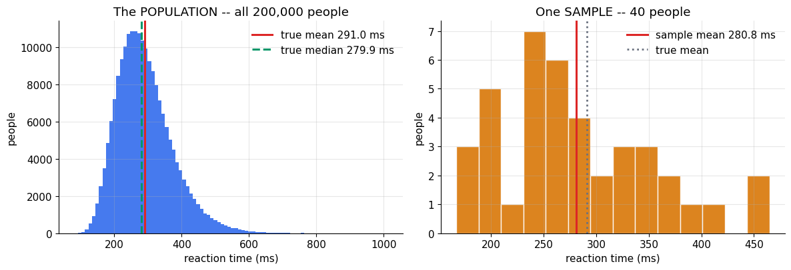

**Output**

```text
true mean   mu    =   290.99 ms
sample mean x-bar =   280.85 ms
error             =   -10.14 ms (3.48% off)

Take another sample and you get a different answer. That variability
is not a flaw in the method -- it IS the subject.
```

### Cell 12

```python
# ---- the three centres, written out from the definition -------------------

def mean_by_hand(x):
    total = 0.0
    for v in x:                 # deliberately the slow, literal version
        total += v
    return total / len(x)

def median_by_hand(x):
    s = sorted(x)
    n = len(s)
    mid = n // 2
    if n % 2 == 1:              # odd: there IS a middle value
        return s[mid]
    return (s[mid - 1] + s[mid]) / 2   # even: average the two middles

def mode_by_hand(x, bins=60):
    # Continuous measurements essentially never repeat, so "most common value"
    # is meaningless as stated. The usable version: which BIN is fullest?
    counts, edges = np.histogram(x, bins=bins)
    k = counts.argmax()
    return (edges[k] + edges[k + 1]) / 2

print("on the sample of 40")
print(f"  mean   by hand {mean_by_hand(sample):8.3f}   numpy {np.mean(sample):8.3f}")
print(f"  median by hand {median_by_hand(sample):8.3f}   numpy {np.median(sample):8.3f}")
print(f"  mode   (binned){mode_by_hand(sample):8.3f}")
print()
print("agreement with numpy:",
      np.isclose(mean_by_hand(sample), np.mean(sample)),
      np.isclose(median_by_hand(sample), np.median(sample)))
```

**Output**

```text
on the sample of 40
  mean   by hand  280.850   numpy  280.850
  median by hand  269.296   numpy  269.296
  mode   (binned) 243.878

agreement with numpy: True True
```

### Cell 15

```python
pop_mean   = POP.mean()
pop_median = np.median(POP)
gap        = pop_mean - pop_median

print("THE WHOLE POPULATION (200,000 people)")
print(f"  mean   = {pop_mean:8.2f} ms")
print(f"  median = {pop_median:8.2f} ms")
print(f"  gap    = {gap:+8.2f} ms   (mean sits {gap / pop_median:.2%} above the median)")
print()

# How many people are actually BELOW the mean? On a symmetric distribution
# it would be half. Here it is not, and that is the whole objection to the mean.
below = (POP < pop_mean).mean()
print(f"  fraction of people FASTER than the mean   : {below:.3%}")
print(f"  fraction of people FASTER than the median : {(POP < pop_median).mean():.3%}")
print()
print("The median is the value that splits the population in half, by")
print("construction. The mean makes no such promise -- and here it breaks it")
print(f"by {abs(below - 0.5) * 100:.1f} percentage points.")
```

**Output**

```text
THE WHOLE POPULATION (200,000 people)
  mean   =   290.99 ms
  median =   279.95 ms
  gap    =   +11.04 ms   (mean sits 3.94% above the median)

  fraction of people FASTER than the mean   : 55.489%
  fraction of people FASTER than the median : 50.000%

The median is the value that splits the population in half, by
construction. The mean makes no such promise -- and here it breaks it
by 5.5 percentage points.
```

### Cell 18

```python
OUTLIER = 10_000.0
contaminated = np.append(sample, OUTLIER)

rows = [
    ("mean",   np.mean(sample),        np.mean(contaminated)),
    ("median", np.median(sample),      np.median(contaminated)),
    ("mode",   mode_by_hand(sample),   mode_by_hand(contaminated)),
]

print(f"one value of {OUTLIER:,.0f} ms added to {SAMPLE_N} clean measurements\n")
print(f"{'statistic':<10}{'before':>12}{'after':>12}{'moved by':>12}{'  as % of before':>18}")
print("-" * 64)
for name, before, after in rows:
    print(f"{name:<10}{before:>12.2f}{after:>12.2f}{after - before:>+12.2f}"
          f"{(after - before) / before:>17.2%}")

print()
print(f"true population mean : {POP_MU:.2f} ms")
print(f"contaminated mean    : {np.mean(contaminated):.2f} ms  "
      f"-> off by {np.mean(contaminated) - POP_MU:+.2f} ms")
print(f"contaminated median  : {np.median(contaminated):.2f} ms  "
      f"-> off by {np.median(contaminated) - np.median(POP):+.2f} ms from the true median")
```

**Output**

```text
one value of 10,000 ms added to 40 clean measurements

statistic       before       after    moved by    as % of before
----------------------------------------------------------------
mean            280.85      517.90     +237.05           84.41%
median          269.30      270.05       +0.75            0.28%
mode            243.88      248.92       +5.04            2.07%

true population mean : 290.99 ms
contaminated mean    : 517.90 ms  -> off by +226.91 ms
contaminated median  : 270.05 ms  -> off by -9.90 ms from the true median
```

### Cell 21

```python
# ---- spread, from the definitions ----------------------------------------

def variance_by_hand(x, ddof=0):
    m = mean_by_hand(x)
    squared_gaps = [(v - m) ** 2 for v in x]
    return sum(squared_gaps) / (len(x) - ddof)

x = sample
q25, q75 = np.percentile(x, [25, 75])

print(f"{'range':<26}{x.max() - x.min():10.3f} ms")
print(f"{'IQR (q75 - q25)':<26}{q75 - q25:10.3f} ms")
print(f"{'variance, ddof=0':<26}{variance_by_hand(x, 0):10.3f} ms^2   "
      f"numpy {np.var(x, ddof=0):10.3f}")
print(f"{'variance, ddof=1':<26}{variance_by_hand(x, 1):10.3f} ms^2   "
      f"numpy {np.var(x, ddof=1):10.3f}")
print(f"{'std dev, ddof=1':<26}{variance_by_hand(x, 1) ** 0.5:10.3f} ms     "
      f"numpy {np.std(x, ddof=1):10.3f}")
print()
print("by hand == numpy :",
      np.isclose(variance_by_hand(x, 0), np.var(x, ddof=0)),
      np.isclose(variance_by_hand(x, 1), np.var(x, ddof=1)))
```

**Output**

```text
range                        297.668 ms
IQR (q75 - q25)               89.508 ms
variance, ddof=0            5391.423 ms^2   numpy   5391.423
variance, ddof=1            5529.665 ms^2   numpy   5529.665
std dev, ddof=1               74.362 ms     numpy     74.362

by hand == numpy : True True
```

### Cell 24

```python
# ============================================================
#  Does ddof=1 actually remove the bias? Simulate and find out.
#  Small samples (n=6) so the effect is large and unmistakable.
# ============================================================
rng_ddof = np.random.default_rng(101)

N_SIM, n = 200_000, 6
draws = POP[rng_ddof.integers(0, POP_N, size=(N_SIM, n))]   # 200k samples of 6

var_n     = draws.var(axis=1, ddof=0).mean()   # divide by n
var_nm1   = draws.var(axis=1, ddof=1).mean()   # divide by n-1
true_var  = POP.var(ddof=0)                    # the answer we are chasing

print(f"{N_SIM:,} independent samples of n = {n}, drawn from the real population\n")
print(f"  TRUE population variance          {true_var:12.2f} ms^2")
print(f"  average of ddof=0 estimates       {var_n:12.2f} ms^2   "
      f"({var_n / true_var - 1:+.2%})")
print(f"  average of ddof=1 estimates       {var_nm1:12.2f} ms^2   "
      f"({var_nm1 / true_var - 1:+.2%})")
print()
print(f"  ddof=0 is low by a factor of      {var_n / true_var:.4f}")
print(f"  theory says it should be (n-1)/n = {(n - 1) / n:.4f}")
print()
print("Not approximately. Exactly the predicted factor -- because the shrinkage")
print("is not random bad luck, it is a fixed geometric consequence of measuring")
print("distances from a centre that was fitted to the data.")
print()

# The bias shrinks as n grows -- which is why nobody notices it on big data.
ns = [3, 5, 10, 25, 100, 500]
ratios_0, ratios_1 = [], []
rng_s = np.random.default_rng(202)

print(f"{'n':>6}{'ddof=0 / truth':>18}{'ddof=1 / truth':>18}{'(n-1)/n':>12}")
print("-" * 54)
for nn in ns:
    d = POP[rng_s.integers(0, POP_N, size=(40_000, nn))]
    r0 = d.var(axis=1, ddof=0).mean() / true_var
    r1 = d.var(axis=1, ddof=1).mean() / true_var
    ratios_0.append(r0); ratios_1.append(r1)
    print(f"{nn:>6}{r0:>18.4f}{r1:>18.4f}{(nn - 1) / nn:>12.4f}")

fig, ax = plt.subplots(figsize=(9, 4.2))
ax.axhline(1.0, color=C_GREY, lw=1.6, ls="--", label="the truth")
ax.plot(ns, ratios_0, "o-", color=C_SLOPE, lw=2.2, label="ddof=0  (divide by n)")
ax.plot(ns, ratios_1, "o-", color=C_AREA,  lw=2.2, label="ddof=1  (divide by n-1)")
ax.set_xscale("log")
ax.set_xlabel("sample size n  (log scale)")
ax.set_ylabel("estimated variance / true variance")
ax.set_title("Only one of these is centred on the right answer")
ax.legend(frameon=False)
fig.tight_layout(); plt.show()
```

**Output**

```text
200,000 independent samples of n = 6, drawn from the real population

  TRUE population variance               6890.99 ms^2
  average of ddof=0 estimates            5752.31 ms^2   (-16.52%)
  average of ddof=1 estimates            6902.78 ms^2   (+0.17%)

  ddof=0 is low by a factor of      0.8348
  theory says it should be (n-1)/n = 0.8333

Not approximately. Exactly the predicted factor -- because the shrinkage
is not random bad luck, it is a fixed geometric consequence of measuring
distances from a centre that was fitted to the data.

     n    ddof=0 / truth    ddof=1 / truth     (n-1)/n
------------------------------------------------------
     3            0.6716            1.0073      0.6667
     5            0.8000            1.0000      0.8000
    10            0.9037            1.0041      0.9000
    25            0.9622            1.0023      0.9600
   100            0.9898            0.9998      0.9900
   500            0.9975            0.9995      0.9980
```

**Output**

```text
<Figure size 900x420 with 1 Axes>
```

**Figure**

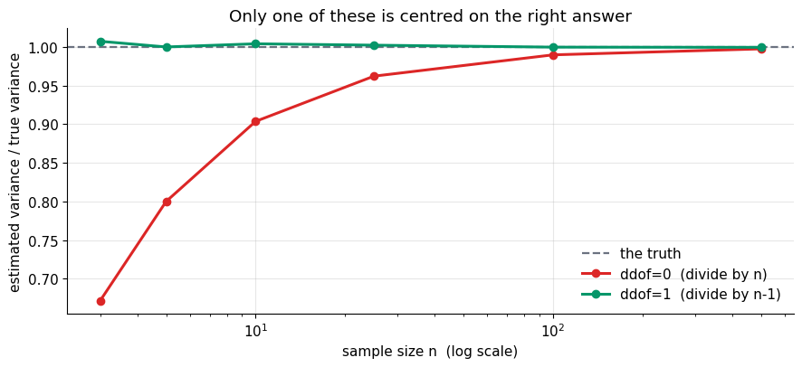

### Cell 29

```python
from scipy import stats

def skew_by_hand(x):
    m, s = np.mean(x), np.std(x, ddof=0)
    return np.mean(((x - m) / s) ** 3)

def excess_kurtosis_by_hand(x):
    m, s = np.mean(x), np.std(x, ddof=0)
    return np.mean(((x - m) / s) ** 4) - 3.0     # -3 makes a normal score 0

print("POPULATION shape")
print(f"  skewness         by hand {skew_by_hand(POP):8.4f}   "
      f"scipy {stats.skew(POP):8.4f}")
print(f"  excess kurtosis  by hand {excess_kurtosis_by_hand(POP):8.4f}   "
      f"scipy {stats.kurtosis(POP):8.4f}")
print()

# What does a symmetric bell curve score? Same code, different data.
bell = np.random.default_rng(5).normal(POP_MU, POP_SD, POP_N)
print("a NORMAL distribution with the same mean and sd, for comparison")
print(f"  skewness         {skew_by_hand(bell):8.4f}")
print(f"  excess kurtosis  {excess_kurtosis_by_hand(bell):8.4f}")
print()
print(f"mean - median, our population : {POP_MU - np.median(POP):+8.2f} ms")
print(f"mean - median, the bell curve : {bell.mean() - np.median(bell):+8.2f} ms")
print()
print("Positive skew and a positive mean-minus-median gap are the same fact,")
print("measured two ways.")
```

**Output**

```text
POPULATION shape
  skewness         by hand   0.8804   scipy   0.8804
  excess kurtosis  by hand   1.4069   scipy   1.4069

a NORMAL distribution with the same mean and sd, for comparison
  skewness           0.0055
  excess kurtosis   -0.0110

mean - median, our population :   +11.04 ms
mean - median, the bell curve :    +0.06 ms

Positive skew and a positive mean-minus-median gap are the same fact,
measured two ways.
```

### Cell 30

```python
q25p, q50p, q75p = np.percentile(POP, [25, 50, 75])

fig, ax = plt.subplots(figsize=(11, 4.6))
ax.hist(POP, bins=140, color=C_F, alpha=0.75)
ax.axvspan(q25p, q75p, color=C_AREA, alpha=0.13,
           label=f"middle 50% (IQR = {q75p - q25p:.0f} ms)")
ax.axvline(q50p,   color=C_AREA,  lw=2.4, ls="--", label=f"median {q50p:.1f} ms")
ax.axvline(POP_MU, color=C_SLOPE, lw=2.4,          label=f"mean {POP_MU:.1f} ms")
ax.axvline(q25p, color=C_AREA, lw=1.2, alpha=0.7)
ax.axvline(q75p, color=C_AREA, lw=1.2, alpha=0.7)
ax.annotate("the long right tail\nthat drags the mean",
            xy=(POP_MU + 2.6 * POP_SD, 900), xytext=(POP_MU + 2.7 * POP_SD, 5200),
            color=C_GREY, ha="center",
            arrowprops=dict(arrowstyle="->", color=C_GREY))
ax.set_xlabel("reaction time (ms)"); ax.set_ylabel("people")
ax.set_title(f"The population, with its centre and middle half marked "
             f"(skew = {stats.skew(POP):.2f})")
ax.legend(frameon=False)
fig.tight_layout(); plt.show()
```

**Output**

```text
<Figure size 1100x460 with 1 Axes>
```

**Figure**

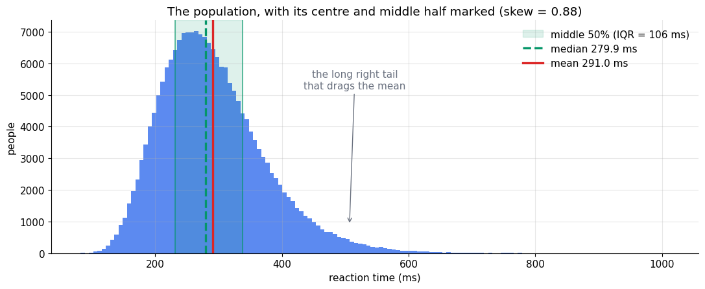

### Cell 33

```python
levels = [0, 1, 5, 10, 25, 50, 75, 90, 95, 99, 100]
pop_q  = np.percentile(POP, levels)
smp_q  = np.percentile(sample, levels)

print(f"{'pct':>6}{'population':>14}{'sample of 40':>16}{'sample error':>16}")
print("-" * 52)
for lv, pq, sq in zip(levels, pop_q, smp_q):
    print(f"{lv:>5}%{pq:>14.2f}{sq:>16.2f}{sq - pq:>+16.2f}")
print()
print(f"IQR, population : {pop_q[6] - pop_q[4]:8.2f} ms")
print(f"IQR, sample     : {smp_q[6] - smp_q[4]:8.2f} ms")
print()
print("Middle percentiles are estimated well from 40 people. The extremes are")
print("not -- a sample of 40 has almost no information about the top 1%,")
print("because it contains at most a handful of people from there.")
print()

fig, (axL, axR) = plt.subplots(1, 2, figsize=(12, 4.4),
                               gridspec_kw={"width_ratios": [2, 1]})

axL.hist(POP, bins=140, color=C_SOFT)
for lv, col in [(25, C_AREA), (50, C_SLOPE), (75, C_AREA), (90, C_APPROX),
                (99, C_EXACT)]:
    v = np.percentile(POP, lv)
    axL.axvline(v, color=col, lw=2.0)
    axL.text(v, axL.get_ylim()[1] * 0.93, f" {lv}%", color=col,
             fontsize=9, rotation=90, va="top")
axL.set_xlabel("reaction time (ms)"); axL.set_ylabel("people")
axL.set_title("Percentiles cut the population into slices of known SIZE")

bp = axR.boxplot([POP], widths=0.5, patch_artist=True,
                 showfliers=False)
bp["boxes"][0].set_facecolor(C_F); bp["boxes"][0].set_alpha(0.35)
bp["medians"][0].set_color(C_SLOPE); bp["medians"][0].set_linewidth(2.4)
axR.set_xticks([1]); axR.set_xticklabels(["population"])
axR.set_ylabel("reaction time (ms)")
axR.set_title("The same numbers, as a box plot")
fig.tight_layout(); plt.show()

lo_w = np.percentile(POP, 25) - 1.5 * (np.percentile(POP, 75) - np.percentile(POP, 25))
hi_w = np.percentile(POP, 75) + 1.5 * (np.percentile(POP, 75) - np.percentile(POP, 25))
print("what the box plot is drawing, in numbers:")
print(f"  box bottom  = Q1     = {np.percentile(POP, 25):8.2f} ms")
print(f"  red line    = median = {np.percentile(POP, 50):8.2f} ms")
print(f"  box top     = Q3     = {np.percentile(POP, 75):8.2f} ms")
print(f"  whiskers reach to the furthest points within 1.5 x IQR of the box:")
print(f"      lower fence {lo_w:8.2f} ms      upper fence {hi_w:8.2f} ms")
print(f"  people beyond the upper fence: {(POP > hi_w).mean():.2%} of the population")
```

**Output**

```text
   pct    population    sample of 40    sample error
----------------------------------------------------
    0%         82.37          166.98          +84.61
    1%        145.83          172.55          +26.71
    5%        176.61          183.72           +7.11
   10%        195.46          194.12           -1.34
   25%        231.81          235.39           +3.58
   50%        279.95          269.30          -10.65
   75%        337.61          324.89          -12.71
   90%        400.13          377.44          -22.69
   95%        443.40          410.40          -33.00
   99%        537.50          460.48          -77.01
  100%       1011.29          464.65         -546.64

IQR, population :   105.80 ms
IQR, sample     :    89.51 ms

Middle percentiles are estimated well from 40 people. The extremes are
not -- a sample of 40 has almost no information about the top 1%,
because it contains at most a handful of people from there.
```

**Output**

```text
<Figure size 1200x440 with 2 Axes>
```

**Figure**

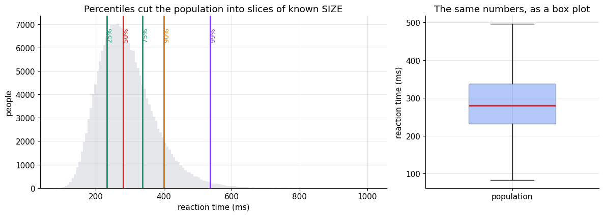

**Output**

```text
what the box plot is drawing, in numbers:
  box bottom  = Q1     =   231.81 ms
  red line    = median =   279.95 ms
  box top     = Q3     =   337.61 ms
  whiskers reach to the furthest points within 1.5 x IQR of the box:
      lower fence    73.10 ms      upper fence   496.31 ms
  people beyond the upper fence: 2.08% of the population
```

### Cell 36

```python
rng_rob   = np.random.default_rng(77)
base      = rng_rob.choice(POP, 200, replace=False)
fractions = [0.00, 0.01, 0.02, 0.05, 0.10, 0.20, 0.30]
BAD       = 8_000.0          # the value each corrupted point takes

res = []
for f in fractions:
    k   = int(round(f * len(base)))
    con = base.copy()
    con[:k] = BAD                       # replace k points with garbage
    res.append((f, k, con.mean(), np.median(con),
                con.std(ddof=1),
                np.percentile(con, 75) - np.percentile(con, 25)))

print(f"200 clean measurements; the first k replaced by {BAD:,.0f} ms\n")
print(f"{'corrupt':>9}{'k':>5}{'mean':>11}{'median':>11}{'sd':>11}{'IQR':>11}")
print("-" * 58)
for f, k, m, med, sd, iqr in res:
    print(f"{f:>8.0%}{k:>5}{m:>11.1f}{med:>11.1f}{sd:>11.1f}{iqr:>11.1f}")

clean = res[0]
print()
print("change from clean, at 10% contamination:")
r10 = [r for r in res if r[0] == 0.10][0]
print(f"  mean   {clean[2]:8.1f} -> {r10[2]:8.1f}   ({r10[2] / clean[2] - 1:+.1%})")
print(f"  median {clean[3]:8.1f} -> {r10[3]:8.1f}   ({r10[3] / clean[3] - 1:+.1%})")
print(f"  sd     {clean[4]:8.1f} -> {r10[4]:8.1f}   ({r10[4] / clean[4] - 1:+.1%})")
print(f"  IQR    {clean[5]:8.1f} -> {r10[5]:8.1f}   ({r10[5] / clean[5] - 1:+.1%})")

fs = [r[0] for r in res]
fig, (a1, a2) = plt.subplots(1, 2, figsize=(12, 4.2))

a1.plot(fs, [r[2] for r in res], "o-", color=C_SLOPE, lw=2.2, label="mean")
a1.plot(fs, [r[3] for r in res], "o-", color=C_AREA,  lw=2.2, label="median")
a1.axhline(POP_MU, color=C_GREY, ls=":", lw=1.8, label="true mean")
a1.set_xlabel("fraction of data corrupted"); a1.set_ylabel("estimate (ms)")
a1.set_title("Centre under contamination"); a1.legend(frameon=False)

a2.plot(fs, [r[4] for r in res], "o-", color=C_SLOPE, lw=2.2, label="std dev")
a2.plot(fs, [r[5] for r in res], "o-", color=C_AREA,  lw=2.2, label="IQR")
a2.axhline(POP_SD, color=C_GREY, ls=":", lw=1.8, label="true sd")
a2.set_xlabel("fraction of data corrupted"); a2.set_ylabel("estimate (ms)")
a2.set_title("Spread under contamination"); a2.legend(frameon=False)

fig.tight_layout(); plt.show()
```

**Output**

```text
200 clean measurements; the first k replaced by 8,000 ms

  corrupt    k       mean     median         sd        IQR
----------------------------------------------------------
      0%    0      295.0      292.6       81.7      108.9
      1%    2      372.3      293.9      772.9      111.2
      2%    4      449.5      295.2     1084.4      114.3
      5%   10      681.6      297.7     1685.1      121.5
     10%   20     1068.7      302.3     2317.6      131.8
     20%   40     1843.8      319.6     3086.7      177.9
     30%   60     2613.9      349.1     3535.6     7736.4

change from clean, at 10% contamination:
  mean      295.0 ->   1068.7   (+262.2%)
  median    292.6 ->    302.3   (+3.3%)
  sd         81.7 ->   2317.6   (+2737.5%)
  IQR       108.9 ->    131.8   (+21.0%)
```

**Output**

```text
<Figure size 1200x420 with 2 Axes>
```

**Figure**

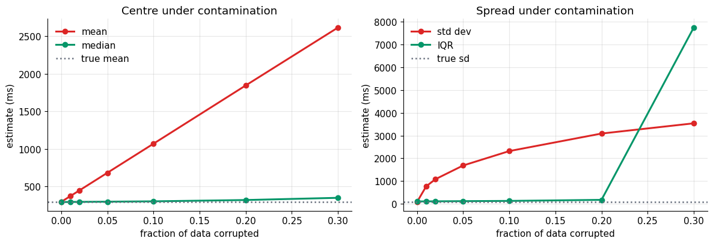

### Cell 39

```python
rng_same = np.random.default_rng(31)
M, S, N3 = POP_MU, POP_SD, 6_000

def force(x, m=M, s=S):
    """Shift and scale x so its mean is exactly m and its sd exactly s."""
    return (x - x.mean()) / x.std(ddof=0) * s + m

skewed  = force(rng_same.lognormal(np.log(280), 0.28, N3))
bimodal = force(np.concatenate([rng_same.normal(-1, 0.28, N3 // 2),
                                rng_same.normal(+1, 0.28, N3 // 2)]))
uniform = force(rng_same.uniform(0, 1, N3))

sets = [("skewed",  skewed,  C_F),
        ("bimodal", bimodal, C_APPROX),
        ("uniform", uniform, C_EXACT)]

print(f"{'dataset':<10}{'mean':>12}{'std dev':>12}{'median':>12}"
      f"{'skew':>10}{'ex.kurt':>10}")
print("-" * 66)
for name, d, _ in sets:
    print(f"{name:<10}{d.mean():>12.4f}{d.std(ddof=0):>12.4f}"
          f"{np.median(d):>12.2f}{stats.skew(d):>10.3f}"
          f"{stats.kurtosis(d):>10.3f}")
print()
print("The first two columns match to four decimal places. Everything after")
print("them does not, and neither do the pictures below.")

fig, axes = plt.subplots(1, 3, figsize=(13, 3.8), sharex=True, sharey=True)
for ax, (name, d, col) in zip(axes, sets):
    ax.hist(d, bins=70, color=col, alpha=0.85)
    ax.axvline(d.mean(), color=C_SLOPE, lw=2.0)
    ax.axvline(np.median(d), color=C_AREA, lw=2.0, ls="--")
    ax.set_title(f"{name}\nmean {d.mean():.1f}, sd {d.std(ddof=0):.1f}")
    ax.set_xlabel("reaction time (ms)")
axes[0].set_ylabel("count")
fig.suptitle("Same mean. Same standard deviation. Three different worlds.",
             y=1.04, fontsize=12)
fig.tight_layout(); plt.show()
```

**Output**

```text
dataset           mean     std dev      median      skew   ex.kurt
------------------------------------------------------------------
skewed        290.9890     83.0120      279.96     0.844     1.137
bimodal       290.9890     83.0120      301.32    -0.006    -1.725
uniform       290.9890     83.0120      289.66     0.029    -1.192

The first two columns match to four decimal places. Everything after
them does not, and neither do the pictures below.
```

**Output**

```text
<Figure size 1300x380 with 3 Axes>
```

**Figure**

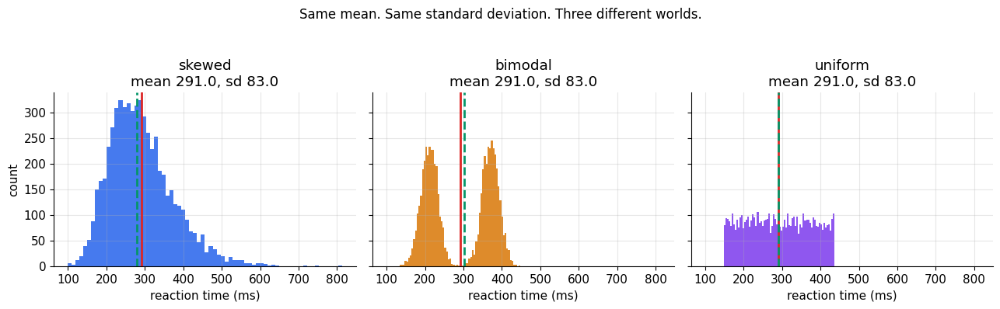

### Cell 44

```python
# The same six quantities, computed on the population and on the sample.
# In real work the left column does not exist.
pairs = [
    ("mean",              POP.mean(),            sample.mean()),
    ("standard deviation", POP.std(ddof=0),      sample.std(ddof=1)),
    ("median",            np.median(POP),        np.median(sample)),
    ("25th percentile",   np.percentile(POP, 25), np.percentile(sample, 25)),
    ("75th percentile",   np.percentile(POP, 75), np.percentile(sample, 75)),
    ("size",              float(POP_N),          float(SAMPLE_N)),
]

print(f"{'quantity':<20}{'PARAMETER':>14}{'STATISTIC':>14}{'error':>12}{'  % off':>10}")
print(f"{'':<20}{'(population)':>14}{'(n=40)':>14}")
print("-" * 70)
for name, par, stat in pairs[:-1]:
    print(f"{name:<20}{par:>14.2f}{stat:>14.2f}{stat - par:>+12.2f}"
          f"{(stat - par) / par:>10.2%}")
print(f"{'size':<20}{POP_N:>14,}{SAMPLE_N:>14,}")
print()
print("Left column: fixed, true, and in any real study invisible.")
print("Right column: visible, computable, and different every time you sample.")
```

**Output**

```text
quantity                 PARAMETER     STATISTIC       error     % off
                      (population)        (n=40)
----------------------------------------------------------------------
mean                        290.99        280.85      -10.14    -3.48%
standard deviation           83.01         74.36       -8.65   -10.42%
median                      279.95        269.30      -10.65    -3.81%
25th percentile             231.81        235.39       +3.58     1.54%
75th percentile             337.61        324.89      -12.71    -3.77%
size                       200,000            40

Left column: fixed, true, and in any real study invisible.
Right column: visible, computable, and different every time you sample.
```

### Cell 47

```python
rng_var = np.random.default_rng(1234)

K = 12
samples = [rng_var.choice(POP, SAMPLE_N, replace=False) for _ in range(K)]
means   = np.array([s.mean() for s in samples])

print(f"{K} independent, correctly-taken samples of {SAMPLE_N} people\n")
print(f"{'study':>7}{'sample mean':>14}{'error vs mu':>14}{'  ':>2}")
print("-" * 40)
for i, m in enumerate(means, 1):
    bar = "#" * int(abs(m - POP_MU) / 2)
    side = "slow" if m > POP_MU else "fast"
    print(f"{i:>7}{m:>14.2f}{m - POP_MU:>+14.2f}   {bar} {side}")
print("-" * 40)
print(f"{'truth':>7}{POP_MU:>14.2f}")
print()
print(f"lowest  answer : {means.min():.2f} ms")
print(f"highest answer : {means.max():.2f} ms")
print(f"spread between them : {means.max() - means.min():.2f} ms")
print(f"every one of these studies did everything right.")

fig, ax = plt.subplots(figsize=(10, 4.0))
ax.scatter(means, np.arange(1, K + 1), s=90, color=C_F, zorder=3,
           label="one study's sample mean")
ax.hlines(np.arange(1, K + 1), np.minimum(means, POP_MU),
          np.maximum(means, POP_MU), color=C_SOFT, lw=3, zorder=1)
ax.axvline(POP_MU, color=C_SLOPE, lw=2.4, zorder=2,
           label=f"the truth: mu = {POP_MU:.1f} ms")
ax.set_yticks(np.arange(1, K + 1))
ax.set_ylabel("study number"); ax.set_xlabel("estimated mean reaction time (ms)")
ax.set_title("Twelve correct studies, twelve different answers")
ax.legend(frameon=False, loc="lower right")
fig.tight_layout(); plt.show()
```

**Output**

```text
12 independent, correctly-taken samples of 40 people

  study   sample mean   error vs mu  
----------------------------------------
      1        302.33        +11.34   ##### slow
      2        279.64        -11.35   ##### fast
      3        296.67         +5.68   ## slow
      4        285.27         -5.72   ## fast
      5        276.17        -14.82   ####### fast
      6        281.44         -9.55   #### fast
      7        299.74         +8.75   #### slow
      8        266.72        -24.27   ############ fast
      9        279.40        -11.59   ##### fast
     10        268.68        -22.31   ########### fast
     11        303.80        +12.82   ###### slow
     12        313.93        +22.94   ########### slow
----------------------------------------
  truth        290.99

lowest  answer : 266.72 ms
highest answer : 313.93 ms
spread between them : 47.22 ms
every one of these studies did everything right.
```

**Output**

```text
<Figure size 1000x400 with 1 Axes>
```

**Figure**

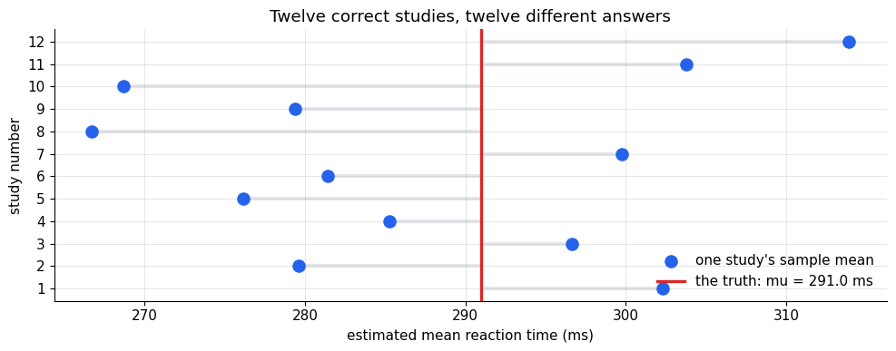

### Cell 51

```python
# ============================================================
#  Is the sample mean centred on the truth? 10,000 studies.
# ============================================================
rng_bias = np.random.default_rng(404)
N_STUDIES = 10_000

draws   = POP[rng_bias.integers(0, POP_N, size=(N_STUDIES, SAMPLE_N))]
x_bars  = draws.mean(axis=1)      # estimator 1: the sample mean
x_meds  = np.median(draws, axis=1)  # estimator 2: the sample median

POP_MED = np.median(POP)

print(f"{N_STUDIES:,} studies, each of {SAMPLE_N} people\n")
print(f"{'estimator':<16}{'aimed at':<18}{'target':>10}{'average':>11}"
      f"{'bias':>10}{'spread':>10}")
print("-" * 76)
print(f"{'sample mean':<16}{'population mean':<18}{POP_MU:>10.2f}"
      f"{x_bars.mean():>11.2f}{x_bars.mean() - POP_MU:>+10.3f}{x_bars.std():>10.2f}")
print(f"{'sample median':<16}{'population median':<18}{POP_MED:>10.2f}"
      f"{x_meds.mean():>11.2f}{x_meds.mean() - POP_MED:>+10.3f}{x_meds.std():>10.2f}")
print(f"{'sample median':<16}{'population MEAN':<18}{POP_MU:>10.2f}"
      f"{x_meds.mean():>11.2f}{x_meds.mean() - POP_MU:>+10.3f}{x_meds.std():>10.2f}")
print()
print(f"The sample mean is off by {abs(x_bars.mean() - POP_MU):.3f} ms on average "
      f"-- that is {abs(x_bars.mean() - POP_MU) / x_bars.std() * 100:.1f}% of one")
print("study's typical error, i.e. indistinguishable from zero. UNBIASED.")
print()
print("The sample median is unbiased for the population MEDIAN (line 2) and")
print(f"badly biased for the population MEAN (line 3, off by "
      f"{x_meds.mean() - POP_MU:+.2f} ms).")
print("Same recipe, same data. Whether it is 'biased' depends entirely on what")
print("you claim it estimates.")
```

**Output**

```text
10,000 studies, each of 40 people

estimator       aimed at              target    average      bias    spread
----------------------------------------------------------------------------
sample mean     population mean       290.99     290.81    -0.182     13.14
sample median   population median     279.95     280.28    +0.327     15.16
sample median   population MEAN       290.99     280.28   -10.713     15.16

The sample mean is off by 0.182 ms on average -- that is 1.4% of one
study's typical error, i.e. indistinguishable from zero. UNBIASED.

The sample median is unbiased for the population MEDIAN (line 2) and
badly biased for the population MEAN (line 3, off by -10.71 ms).
Same recipe, same data. Whether it is 'biased' depends entirely on what
you claim it estimates.
```

### Cell 54

```python
rng_n = np.random.default_rng(2024)
SIZES, REPS = [10, 40, 200, 1000], 4_000

spreads, by_n = [], {}
for n in SIZES:
    est = POP[rng_n.integers(0, POP_N, size=(REPS, n))].mean(axis=1)
    by_n[n] = est
    spreads.append(est.std())

print(f"{REPS:,} studies at each sample size\n")
print(f"{'n':>7}{'avg estimate':>15}{'bias':>10}{'spread of estimates':>22}"
      f"{'spread x sqrt(n)':>20}")
print("-" * 76)
for n, sp in zip(SIZES, spreads):
    e = by_n[n]
    print(f"{n:>7}{e.mean():>15.2f}{e.mean() - POP_MU:>+10.2f}{sp:>22.3f}"
          f"{sp * np.sqrt(n):>20.2f}")
print("-" * 76)
print(f"{'truth':>7}{POP_MU:>15.2f}")
print(f"\npopulation sd for comparison: {POP_SD:.2f} ms")
print()
print("Read the last two columns together. The spread falls as n grows -- but")
print("the last column, spread times the square root of n, barely moves at all.")
print("Something specific is going on. Part 3 says what.")

fig, (a1, a2) = plt.subplots(1, 2, figsize=(12.5, 4.3))
cols = [C_SLOPE, C_APPROX, C_F, C_EXACT]
for n, c in zip(SIZES, cols):
    a1.hist(by_n[n], bins=60, density=True, alpha=0.55, color=c, label=f"n = {n}")
a1.axvline(POP_MU, color="black", lw=2.0, ls="--", label="the truth")
a1.set_xlim(POP_MU - 90, POP_MU + 110)
a1.set_xlabel("estimated mean (ms)"); a1.set_ylabel("density of studies")
a1.set_title("Where 4,000 studies land, by sample size")
a1.legend(frameon=False)

a2.loglog(SIZES, spreads, "o-", color=C_F, lw=2.4, label="measured spread")
a2.loglog(SIZES, [POP_SD / np.sqrt(n) for n in SIZES], "s--", color=C_GREY,
          lw=1.8, label="population sd / sqrt(n)")
a2.set_xlabel("sample size n"); a2.set_ylabel("spread of estimates (ms)")
a2.set_title("Both axes log: a straight line means a power law")
a2.legend(frameon=False)
fig.tight_layout(); plt.show()
```

**Output**

```text
4,000 studies at each sample size

      n   avg estimate      bias   spread of estimates    spread x sqrt(n)
----------------------------------------------------------------------------
     10         291.15     +0.16                26.157               82.72
     40         290.91     -0.08                12.878               81.45
    200         291.10     +0.11                 5.807               82.12
   1000         291.01     +0.02                 2.660               84.13
----------------------------------------------------------------------------
  truth         290.99

population sd for comparison: 83.01 ms

Read the last two columns together. The spread falls as n grows -- but
the last column, spread times the square root of n, barely moves at all.
Something specific is going on. Part 3 says what.
```

**Output**

```text
<Figure size 1250x430 with 2 Axes>
```

**Figure**

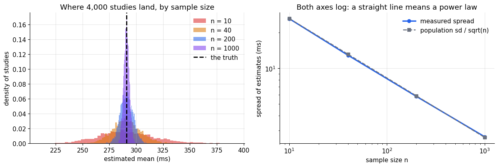

### Cell 57

```python
# ============================================================
#  SELECTION BIAS: your recruiting only reaches quick responders.
#  Concretely: only the fastest 60% of the population can enter.
# ============================================================
rng_sel = np.random.default_rng(555)

cutoff   = np.percentile(POP, 60)
reachable = POP[POP <= cutoff]          # the sub-population you can actually reach

biased_sample = rng_sel.choice(reachable, SAMPLE_N, replace=False)
fair_sample   = rng_sel.choice(POP,       SAMPLE_N, replace=False)

print(f"you can only reach people faster than {cutoff:.1f} ms")
print(f"that is {len(reachable):,} of {POP_N:,} people "
      f"({len(reachable) / POP_N:.0%} of the population)\n")
print(f"{'':<26}{'estimate':>12}{'error vs mu':>14}")
print("-" * 52)
print(f"{'fair sample of 40':<26}{fair_sample.mean():>12.2f}"
      f"{fair_sample.mean() - POP_MU:>+14.2f}")
print(f"{'biased sample of 40':<26}{biased_sample.mean():>12.2f}"
      f"{biased_sample.mean() - POP_MU:>+14.2f}")
print(f"{'the truth (mu)':<26}{POP_MU:>12.2f}")
print()
print(f"the biased sample is centred on {reachable.mean():.2f} ms -- the mean of")
print(f"the people it can reach -- which sits {reachable.mean() - POP_MU:+.2f} ms "
      f"from the truth,")
print(f"an error of {abs(reachable.mean() - POP_MU) / POP_MU:.1%}. That number is a "
      f"property of the")
print("recruiting method, not of this particular sample.")

fig, ax = plt.subplots(figsize=(10.5, 4.3))
ax.hist(POP, bins=140, color=C_SOFT, label="the population you want")
ax.hist(reachable, bins=90, color=C_APPROX, alpha=0.75,
        label="the people you can actually reach")
ax.axvline(POP_MU, color=C_SLOPE, lw=2.6, label=f"truth  {POP_MU:.1f} ms")
ax.axvline(reachable.mean(), color=C_EXACT, lw=2.6, ls="--",
           label=f"what you will converge to  {reachable.mean():.1f} ms")
ax.set_xlabel("reaction time (ms)"); ax.set_ylabel("people")
ax.set_title("Selection bias: sampling perfectly, from the wrong population")
ax.legend(frameon=False)
fig.tight_layout(); plt.show()
```

**Output**

```text
you can only reach people faster than 300.4 ms
that is 120,000 of 200,000 people (60% of the population)

                              estimate   error vs mu
----------------------------------------------------
fair sample of 40               285.42         -5.57
biased sample of 40             241.45        -49.54
the truth (mu)                  290.99

the biased sample is centred on 237.45 ms -- the mean of
the people it can reach -- which sits -53.54 ms from the truth,
an error of 18.4%. That number is a property of the
recruiting method, not of this particular sample.
```

**Output**

```text
<Figure size 1050x430 with 1 Axes>
```

**Figure**

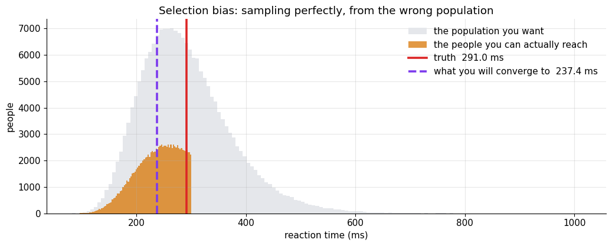

### Cell 60

```python
rng_more = np.random.default_rng(909)
REPS2 = 2_000

print(f"{REPS2:,} studies at each setting; 'reach' = which people can enter\n")
print(f"{'reach':<12}{'n':>7}{'avg estimate':>15}{'bias':>10}"
      f"{'spread':>10}{'closest miss':>15}")
print("-" * 70)
for label, pool in [("everyone", POP), ("fastest 60%", reachable)]:
    for n in [40, 4000]:
        est = pool[rng_more.integers(0, len(pool), size=(REPS2, n))].mean(axis=1)
        print(f"{label:<12}{n:>7}{est.mean():>15.2f}{est.mean() - POP_MU:>+10.2f}"
              f"{est.std():>10.3f}{np.abs(est - POP_MU).min():>15.2f}")
print("-" * 70)
print(f"{'truth':<12}{'':>7}{POP_MU:>15.2f}")
print()
print("Read the last two columns on the biased rows. Going from n=40 to n=4000")
print("shrank the spread roughly tenfold -- and the CLOSEST that any of the")
print(f"{REPS2:,} large biased studies got to the truth got WORSE, not better.")
print()
print("At n=40 a lucky biased study can stumble near the right answer.")
print("At n=4000 not one of them can. The bias is now the only thing left.")
```

**Output**

```text
2,000 studies at each setting; 'reach' = which people can enter

reach             n   avg estimate      bias    spread   closest miss
----------------------------------------------------------------------
everyone         40         291.08     +0.10    13.153           0.01
everyone       4000         290.97     -0.02     1.306           0.00
fastest 60%      40         237.58    -53.41     6.404          32.03
fastest 60%    4000         237.44    -53.55     0.622          51.56
----------------------------------------------------------------------
truth                       290.99

Read the last two columns on the biased rows. Going from n=40 to n=4000
shrank the spread roughly tenfold -- and the CLOSEST that any of the
2,000 large biased studies got to the truth got WORSE, not better.

At n=40 a lucky biased study can stumble near the right answer.
At n=4000 not one of them can. The bias is now the only thing left.
```

### Cell 63

```python
# ============================================================
#  NON-RESPONSE: probability of finishing falls with reaction time.
# ============================================================
rng_nr = np.random.default_rng(606)

p_respond = 1.0 / (1.0 + np.exp((POP - 280.0) / 60.0))   # ~96% fastest, ~0% slowest

invited   = rng_nr.integers(0, POP_N, size=120_000)      # 120k people invited
responded = invited[rng_nr.random(invited.size) < p_respond[invited]]
answers   = POP[responded]

print(f"invited   : {invited.size:,} people")
print(f"responded : {answers.size:,} people  "
      f"(response rate {answers.size / invited.size:.1%})\n")
print(f"{'':<30}{'value':>12}{'error vs mu':>14}")
print("-" * 56)
print(f"{'true population mean (mu)':<30}{POP_MU:>12.2f}")
print(f"{'mean of the responders':<30}{answers.mean():>12.2f}"
      f"{answers.mean() - POP_MU:>+14.2f}")
print()
print(f"With {answers.size:,} responses -- a huge study by any standard -- the")
print(f"estimate is off by {answers.mean() - POP_MU:+.2f} ms, "
      f"{abs(answers.mean() - POP_MU) / POP_MU:.1%} of the truth.")
print(f"Its standard error is around "
      f"{answers.std(ddof=1) / np.sqrt(answers.size):.3f} ms, so it would be")
print("reported with an error bar far too narrow to contain the right answer.")

fig, (b1, b2) = plt.subplots(1, 2, figsize=(12.5, 4.2))
order = np.argsort(POP[:4000])
b1.plot(POP[:4000][order], p_respond[:4000][order], color=C_EXACT, lw=2.4)
b1.set_xlabel("reaction time (ms)"); b1.set_ylabel("probability of responding")
b1.set_title("Who answers depends on the answer")

b2.hist(POP, bins=140, density=True, color=C_SOFT, label="everyone (invited)")
b2.hist(answers, bins=140, density=True, color=C_AREA, alpha=0.6,
        label="who actually responded")
b2.axvline(POP_MU, color=C_SLOPE, lw=2.4, label=f"truth {POP_MU:.1f} ms")
b2.axvline(answers.mean(), color=C_EXACT, lw=2.4, ls="--",
           label=f"responders {answers.mean():.1f} ms")
b2.set_xlabel("reaction time (ms)"); b2.set_ylabel("density")
b2.set_title("The responding sample is a different population")
b2.legend(frameon=False)
fig.tight_layout(); plt.show()
```

**Output**

```text
invited   : 120,000 people
responded : 57,832 people  (response rate 48.2%)

                                     value   error vs mu
--------------------------------------------------------
true population mean (mu)           290.99
mean of the responders              249.29        -41.70

With 57,832 responses -- a huge study by any standard -- the
estimate is off by -41.70 ms, 14.3% of the truth.
Its standard error is around 0.241 ms, so it would be
reported with an error bar far too narrow to contain the right answer.
```

**Output**

```text
<Figure size 1250x420 with 2 Axes>
```

**Figure**

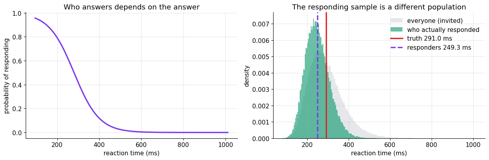

### Cell 71

```python
# ============================================================
#  The machine: run the study many times.
#  Each "study" = draw n people, compute their mean, write it down.
# ============================================================
import numpy as np
from scipy import stats

RNG3 = np.random.default_rng(31415)


def sample_means(n, reps, rng=RNG3, pop=None):
    """Run `reps` studies of size `n` and return the `reps` sample means.

    Drawing with replacement from 200,000 people is indistinguishable from
    drawing without, and is much faster, so we index at random.
    """
    pop = POP if pop is None else pop
    draws = pop[rng.integers(0, pop.size, size=(reps, n))]   # shape (reps, n)
    return draws.mean(axis=1)


# Five studies, one at a time, so you can see what one "dot" costs.
for study in range(1, 6):
    one = POP[RNG3.integers(0, POP_N, size=SAMPLE_N)]
    print(f"study {study}:  n = {SAMPLE_N},  sample mean = {one.mean():7.2f} ms")

print()
print(f"the truth we are chasing:  mu = {POP_MU:7.2f} ms")
print()
print("Five studies, five different answers. Those five numbers are five draws")
print("from the SAMPLING DISTRIBUTION. Let us draw 20,000 of them.")
```

**Output**

```text
study 1:  n = 40,  sample mean =  290.96 ms
study 2:  n = 40,  sample mean =  284.40 ms
study 3:  n = 40,  sample mean =  268.82 ms
study 4:  n = 40,  sample mean =  293.95 ms
study 5:  n = 40,  sample mean =  297.79 ms

the truth we are chasing:  mu =  290.99 ms

Five studies, five different answers. Those five numbers are five draws
from the SAMPLING DISTRIBUTION. Let us draw 20,000 of them.
```

### Cell 73

```python
# ============================================================
#  20,000 studies of 40 people each. 800,000 measurements,
#  boiled down to 20,000 sample means.
# ============================================================
REPS = 20_000
means40 = sample_means(SAMPLE_N, REPS)

print(f"{REPS:,} studies of n = {SAMPLE_N}")
print(f"  first five sample means : {np.round(means40[:5], 2)}")
print()
print(f"  centre of the 20,000 means : {means40.mean():8.3f} ms")
print(f"  the true population mean   : {POP_MU:8.3f} ms")
print(f"  difference                 : {means40.mean() - POP_MU:+8.3f} ms")
print()
print(f"  spread of the POPULATION   : {POP_SD:8.3f} ms   (sd of individuals)")
print(f"  spread of the SAMPLE MEANS : {means40.std(ddof=0):8.3f} ms   (sd of means)")
print(f"  the means are {POP_SD / means40.std(ddof=0):.2f}x tighter than the people.")
```

**Output**

```text
20,000 studies of n = 40
  first five sample means : [317.24 284.62 291.25 293.66 286.4 ]

  centre of the 20,000 means :  290.960 ms
  the true population mean   :  290.989 ms
  difference                 :   -0.029 ms

  spread of the POPULATION   :   83.012 ms   (sd of individuals)
  spread of the SAMPLE MEANS :   13.126 ms   (sd of means)
  the means are 6.32x tighter than the people.
```

### Cell 76

```python
fig, (ax1, ax2) = plt.subplots(1, 2, figsize=(12, 4.3))

# ---- left: the population, in all its skewed glory
ax1.hist(POP, bins=90, color=C_F, alpha=0.85, density=True)
ax1.axvline(POP_MU, color=C_SLOPE, lw=2.2, label=f"mu = {POP_MU:.1f}")
ax1.set_title(f"POPULATION -- {POP_N:,} individual people", fontsize=11)
ax1.set_xlabel("reaction time (ms)"); ax1.set_ylabel("density")
ax1.legend(frameon=False)
ax1.text(0.62, 0.55, f"skewness = {stats.skew(POP):+.2f}\n(0 would be symmetric)",
         transform=ax1.transAxes, fontsize=10, color=C_GREY)

# ---- right: the sampling distribution of the mean, same x-axis scale span
ax2.hist(means40, bins=70, color=C_EXACT, alpha=0.85, density=True)
ax2.axvline(POP_MU, color=C_SLOPE, lw=2.2, label=f"mu = {POP_MU:.1f}")

# overlay the normal curve nobody asked for and yet it fits
grid = np.linspace(means40.min(), means40.max(), 400)
ax2.plot(grid, stats.norm.pdf(grid, means40.mean(), means40.std(ddof=0)),
         color=C_APPROX, lw=2.6, ls="--", label="normal curve (not fitted by eye)")
ax2.set_title(f"SAMPLING DISTRIBUTION -- {REPS:,} means of {SAMPLE_N}", fontsize=11)
ax2.set_xlabel("sample mean reaction time (ms)"); ax2.set_ylabel("density")
ax2.legend(frameon=False, fontsize=9)
ax2.text(0.03, 0.62, f"skewness = {stats.skew(means40):+.2f}",
         transform=ax2.transAxes, fontsize=10, color=C_GREY)

fig.tight_layout(); plt.show()

print(f"population skewness      : {stats.skew(POP):+.3f}")
print(f"sampling-dist skewness   : {stats.skew(means40):+.3f}")
print(f"  -> averaging 40 values removed {1 - abs(stats.skew(means40)) / abs(stats.skew(POP)):.1%}"
      f" of the skew.")
```

**Output**

```text
<Figure size 1200x430 with 2 Axes>
```

**Figure**

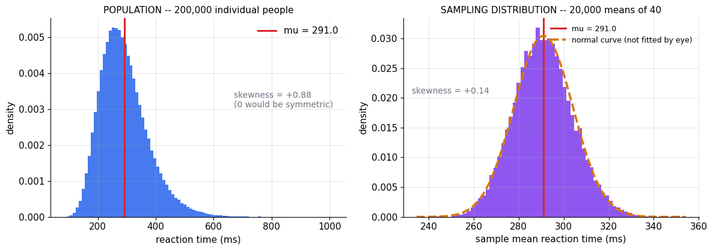

**Output**

```text
population skewness      : +0.880
sampling-dist skewness   : +0.144
  -> averaging 40 values removed 83.6% of the skew.
```

### Cell 80

```python
# ============================================================
#  The same experiment at five sample sizes.
# ============================================================
NS = [1, 2, 5, 30, 100]
REPS_GRID = 20_000

grids = {n: sample_means(n, REPS_GRID) for n in NS}

fig, axes = plt.subplots(1, len(NS), figsize=(15, 3.4), sharey=False)
rows = []

for ax, n in zip(axes, NS):
    m = grids[n]
    ax.hist(m, bins=60, color=C_EXACT, alpha=0.85, density=True)

    g = np.linspace(m.min(), m.max(), 300)
    ax.plot(g, stats.norm.pdf(g, m.mean(), m.std(ddof=0)),
            color=C_APPROX, lw=2.0, ls="--")
    ax.axvline(POP_MU, color=C_SLOPE, lw=1.6)
    ax.set_title(f"n = {n}", fontsize=11)
    ax.set_xlabel("sample mean (ms)")
    ax.set_yticks([])

    z = (m - m.mean()) / m.std(ddof=0)          # standardise, then compare
    ks = stats.kstest(z, "norm").statistic
    rows.append((n, stats.skew(m), stats.kurtosis(m), m.std(ddof=0), ks))

axes[0].set_ylabel("density")
fig.suptitle("Sampling distribution of the mean, as n grows", y=1.04, fontsize=12)
fig.tight_layout(); plt.show()

print(f"{'n':>5} | {'skewness':>9} | {'excess kurt':>11} | {'sd of means':>11} | {'KS dist to normal':>18}")
print("-" * 68)
for n, sk, ku, sd, ks in rows:
    print(f"{n:>5} | {sk:>+9.3f} | {ku:>+11.3f} | {sd:>11.3f} | {ks:>18.4f}")
print()
print("Every column marches toward normal: skewness toward 0, excess kurtosis")
print("toward 0, KS distance toward 0. Nothing here was asserted -- it was measured.")
```

**Output**

```text
<Figure size 1500x340 with 5 Axes>
```

**Figure**

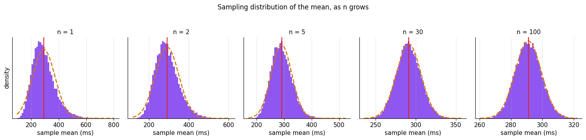

**Output**

```text
    n |  skewness | excess kurt | sd of means |  KS dist to normal
--------------------------------------------------------------------
    1 |    +0.858 |      +1.263 |      82.059 |             0.0554
    2 |    +0.620 |      +0.664 |      59.125 |             0.0440
    5 |    +0.430 |      +0.383 |      37.145 |             0.0295
   30 |    +0.168 |      +0.090 |      15.205 |             0.0136
  100 |    +0.071 |      -0.008 |       8.273 |             0.0065

Every column marches toward normal: skewness toward 0, excess kurtosis
toward 0, KS distance toward 0. Nothing here was asserted -- it was measured.
```

### Cell 85

```python
# ============================================================
#  Does sigma/sqrt(n) actually predict the width we measured?
#  We have 20,000 real sample means at each n. Compare.
# ============================================================
print(f"{'n':>5} | {'formula sigma/sqrt(n)':>21} | {'measured sd of means':>21} | {'off by':>9}")
print("-" * 66)
for n in NS:
    formula  = POP_SD / np.sqrt(n)
    measured = grids[n].std(ddof=0)
    print(f"{n:>5} | {formula:>21.4f} | {measured:>21.4f} | "
          f"{100 * (measured - formula) / formula:>+8.2f}%")

print()
print("And at the sample size this notebook actually uses:")
se_formula  = POP_SD / np.sqrt(SAMPLE_N)
se_measured = means40.std(ddof=0)
print(f"  n = {SAMPLE_N}")
print(f"  formula   sigma/sqrt(n) = {se_formula:8.4f} ms")
print(f"  measured  sd of {REPS:,} sample means = {se_measured:8.4f} ms")
print(f"  discrepancy             = {se_measured - se_formula:+8.4f} ms "
      f"({100 * (se_measured - se_formula) / se_formula:+.3f}%)")
print()
print("The remaining gap is Monte-Carlo noise: 20,000 studies is a lot, but it")
print("is not infinity. Raise REPS and the gap shrinks -- it does not converge")
print("to some other number.")
```

**Output**

```text
    n | formula sigma/sqrt(n) |  measured sd of means |    off by
------------------------------------------------------------------
    1 |               83.0120 |               82.0588 |    -1.15%
    2 |               58.6983 |               59.1246 |    +0.73%
    5 |               37.1241 |               37.1454 |    +0.06%
   30 |               15.1558 |               15.2046 |    +0.32%
  100 |                8.3012 |                8.2731 |    -0.34%

And at the sample size this notebook actually uses:
  n = 40
  formula   sigma/sqrt(n) =  13.1253 ms
  measured  sd of 20,000 sample means =  13.1259 ms
  discrepancy             =  +0.0006 ms (+0.004%)

The remaining gap is Monte-Carlo noise: 20,000 studies is a lot, but it
is not infinity. Raise REPS and the gap shrinks -- it does not converge
to some other number.
```

### Cell 88

```python
# ============================================================
#  What each additional order of magnitude of data buys you.
# ============================================================
sizes = [10, 40, 160, 640, 2560, 10240]

print(f"{'n':>7} | {'SE = sigma/sqrt(n)':>19} | {'vs n=10':>9} | {'n needed to halve this SE':>26}")
print("-" * 72)
base = POP_SD / np.sqrt(10)
for n in sizes:
    se = POP_SD / np.sqrt(n)
    print(f"{n:>7} | {se:>19.3f} | {se / base:>8.2f}x | {4 * n:>26,}")

fig, (axL, axR) = plt.subplots(1, 2, figsize=(12, 4.0))

nn = np.arange(2, 2001)
axL.plot(nn, POP_SD / np.sqrt(nn), color=C_EXACT, lw=2.4)
for n in [10, 40, 160, 640]:
    axL.plot(n, POP_SD / np.sqrt(n), "o", color=C_SLOPE, ms=7)
    axL.annotate(f"n={n}", (n, POP_SD / np.sqrt(n)),
                 textcoords="offset points", xytext=(8, 8), fontsize=9, color=C_GREY)
axL.set_title("Standard error falls -- but it flattens out")
axL.set_xlabel("sample size n"); axL.set_ylabel("standard error (ms)")

axR.plot(nn, POP_SD / np.sqrt(nn), color=C_EXACT, lw=2.4)
axR.set_xscale("log"); axR.set_yscale("log")
axR.set_title("Same curve, log-log: a straight line of slope -1/2")
axR.set_xlabel("sample size n (log)"); axR.set_ylabel("standard error (log)")

fig.tight_layout(); plt.show()

print()
print(f"Going from n=10 to n=40 buys you {(POP_SD/np.sqrt(10)) / (POP_SD/np.sqrt(40)):.2f}x precision for 30 more people.")
print(f"Going from n=2560 to n=10240 buys the same {(POP_SD/np.sqrt(2560)) / (POP_SD/np.sqrt(10240)):.2f}x for 7,680 more.")
```

**Output**

```text
      n |  SE = sigma/sqrt(n) |   vs n=10 |  n needed to halve this SE
------------------------------------------------------------------------
     10 |              26.251 |     1.00x |                         40
     40 |              13.125 |     0.50x |                        160
    160 |               6.563 |     0.25x |                        640
    640 |               3.281 |     0.12x |                      2,560
   2560 |               1.641 |     0.06x |                     10,240
  10240 |               0.820 |     0.03x |                     40,960
```

**Output**

```text
<Figure size 1200x400 with 2 Axes>
```

**Figure**

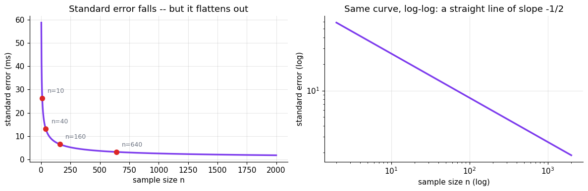

**Output**

```text
Going from n=10 to n=40 buys you 2.00x precision for 30 more people.
Going from n=2560 to n=10240 buys the same 2.00x for 7,680 more.
```

### Cell 92

```python
# ============================================================
#  FAILURE 1 -- heavy skew, small n.
#  Same lognormal family as our population, but far more skewed.
# ============================================================
RNG_HS = np.random.default_rng(9091)
POP_SKEW = RNG_HS.lognormal(mean=0.0, sigma=1.0, size=200_000)   # far more skewed

print(f"gentle population (ours) skewness : {stats.skew(POP):+8.2f}")
print(f"heavy population         skewness : {stats.skew(POP_SKEW):+8.2f}")
print()

fig, axes = plt.subplots(1, 4, figsize=(15, 3.4))
axes[0].hist(POP_SKEW[POP_SKEW < np.quantile(POP_SKEW, 0.99)], bins=80,
             color=C_F, alpha=0.85, density=True)
axes[0].set_title("heavy population\n(99th pct clipped for display)", fontsize=10)
axes[0].set_yticks([])

print(f"{'n':>6} | {'skewness of sample means':>25} | {'KS dist to normal':>18}")
print("-" * 56)
heavy_ks = {}
for ax, n in zip(axes[1:], [5, 30, 500]):
    m = sample_means(n, 20_000, rng=RNG_HS, pop=POP_SKEW)
    ax.hist(m, bins=70, color=C_EXACT, alpha=0.85, density=True)
    g = np.linspace(m.min(), m.max(), 300)
    ax.plot(g, stats.norm.pdf(g, m.mean(), m.std(ddof=0)),
            color=C_APPROX, lw=2.0, ls="--")
    ax.set_title(f"means of n = {n}", fontsize=10)
    ax.set_yticks([])
    z = (m - m.mean()) / m.std(ddof=0)
    heavy_ks[n] = stats.kstest(z, "norm").statistic
    print(f"{n:>6} | {stats.skew(m):>+25.3f} | {heavy_ks[n]:>18.4f}")

fig.suptitle("Failure 1: the CLT still works -- it just works slowly", y=1.05, fontsize=12)
fig.tight_layout(); plt.show()

z30 = (grids[30] - grids[30].mean()) / grids[30].std(ddof=0)
gentle_ks30 = stats.kstest(z30, "norm").statistic
print()
print("Now the comparison that matters -- our own gentler population at n = 30:")
print(f"  gentle population, n =  30 : skew {stats.skew(grids[30]):+.3f}, KS {gentle_ks30:.4f}")
print(f"  heavy  population, n =  30 : KS {heavy_ks[30]:.4f}   "
      f"-> {heavy_ks[30]/gentle_ks30:.1f}x further from normal")
print(f"  heavy  population, n = 500 : KS {heavy_ks[500]:.4f}   "
      f"-> only HERE is it comparable to the gentle one at n = 30")
print()
print("Same theorem, same rule of thumb, roughly 16x the data needed to reach")
print("the same quality of approximation. 'n >= 30' is not a property of n.")
```

**Output**

```text
gentle population (ours) skewness :    +0.88
heavy population         skewness :    +7.30

     n |  skewness of sample means |  KS dist to normal
--------------------------------------------------------
     5 |                    +3.173 |             0.1160
    30 |                    +1.293 |             0.0622
   500 |                    +0.324 |             0.0213
```

**Output**

```text
<Figure size 1500x340 with 4 Axes>
```

**Figure**

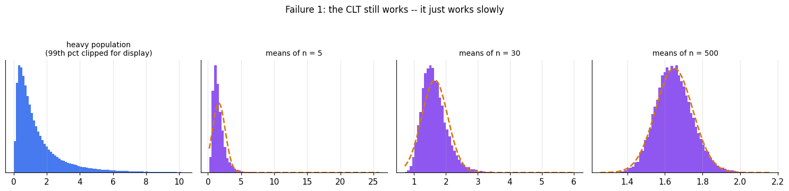

**Output**

```text
Now the comparison that matters -- our own gentler population at n = 30:
  gentle population, n =  30 : skew +0.168, KS 0.0136
  heavy  population, n =  30 : KS 0.0622   -> 4.6x further from normal
  heavy  population, n = 500 : KS 0.0213   -> only HERE is it comparable to the gentle one at n = 30

Same theorem, same rule of thumb, roughly 16x the data needed to reach
the same quality of approximation. 'n >= 30' is not a property of n.
```

### Cell 94

```python
# ============================================================
#  FAILURE 2 -- the Cauchy distribution. Infinite variance.
#  Averaging does literally nothing. Watch the running mean wander.
# ============================================================
RNG_C = np.random.default_rng(271828)
N_WALK = 100_000

cauchy = RNG_C.standard_cauchy(N_WALK)
normal = RNG_C.normal(0, 1, N_WALK)

run_c = np.cumsum(cauchy) / np.arange(1, N_WALK + 1)
run_n = np.cumsum(normal) / np.arange(1, N_WALK + 1)

fig, (axL, axR) = plt.subplots(1, 2, figsize=(12, 4.0), sharex=True)

axL.plot(np.arange(1, N_WALK + 1), run_n, color=C_AREA, lw=1.1)
axL.axhline(0.0, color=C_SLOPE, lw=1.8, ls="--", label="true centre = 0")
axL.set_xscale("log"); axL.set_ylim(-1.2, 1.2)
axL.set_title("Well-behaved (normal): the running mean settles")
axL.set_xlabel("observations so far (log)"); axL.set_ylabel("running mean")
axL.legend(frameon=False)

axR.plot(np.arange(1, N_WALK + 1), run_c, color=C_SLOPE, lw=1.1)
axR.axhline(0.0, color=C_GREY, lw=1.8, ls="--", label="true centre = 0")
axR.set_xscale("log")
axR.set_title("Cauchy: the running mean never settles")
axR.set_xlabel("observations so far (log)"); axR.set_ylabel("running mean")
axR.legend(frameon=False)

fig.tight_layout(); plt.show()

print(f"{'after n obs':>12} | {'normal running mean':>20} | {'Cauchy running mean':>20}")
print("-" * 60)
for n in [10, 100, 1_000, 10_000, 100_000]:
    print(f"{n:>12,} | {run_n[n-1]:>20.4f} | {run_c[n-1]:>20.4f}")

print()
# The killer comparison: does averaging tighten a Cauchy at all?
one   = RNG_C.standard_cauchy(20_000)
avg500 = RNG_C.standard_cauchy((20_000, 500)).mean(axis=1)
iqr = lambda a: np.quantile(a, 0.75) - np.quantile(a, 0.25)
print(f"IQR of ONE Cauchy draw            : {iqr(one):8.4f}")
print(f"IQR of the MEAN of 500 Cauchy draws: {iqr(avg500):8.4f}")
print(f"ratio                              : {iqr(one) / iqr(avg500):8.4f}  (1.00 = averaging bought nothing)")
print()
print("For a well-behaved population, averaging 500 would have tightened the")
print(f"spread by sqrt(500) = {np.sqrt(500):.2f}x. Here it tightened it by essentially nothing.")
```

**Output**

```text
<Figure size 1200x400 with 2 Axes>
```

**Figure**

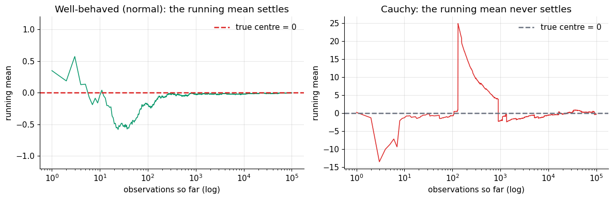

**Output**

```text
 after n obs |  normal running mean |  Cauchy running mean
------------------------------------------------------------
          10 |              -0.0433 |              -1.2841
         100 |              -0.1921 |              -0.7566
       1,000 |              -0.0261 |              -2.0922
      10,000 |              -0.0220 |              -0.6148
     100,000 |              -0.0035 |              -0.3024

IQR of ONE Cauchy draw            :   2.0218
IQR of the MEAN of 500 Cauchy draws:   2.0064
ratio                              :   1.0076  (1.00 = averaging bought nothing)

For a well-behaved population, averaging 500 would have tightened the
spread by sqrt(500) = 22.36x. Here it tightened it by essentially nothing.
```

### Cell 100

```python
# ============================================================
#  One confidence interval, built from the sample in Part 0.
# ============================================================
import numpy as np
from scipy import stats

CONF = 0.95
alpha = 1 - CONF                       # total probability left OUTSIDE the interval

# The critical value: computed, not quoted.
z_crit = stats.norm.ppf(1 - alpha / 2)
print(f"confidence level        = {CONF:.0%}")
print(f"alpha (outside)         = {alpha:.3f}  -> {alpha/2:.3f} in each tail")
print(f"z critical value        = norm.ppf({1 - alpha/2:.3f}) = {z_crit:.6f}")
print(f"  (this is where '1.96' comes from -- it is {z_crit:.4f}, rounded)")
print()

x_bar = sample.mean()
s     = sample.std(ddof=1)             # sample sd: divide by n-1
se    = s / np.sqrt(SAMPLE_N)
half  = z_crit * se

lo, hi = x_bar - half, x_bar + half

print(f"sample mean       x-bar = {x_bar:8.3f} ms")
print(f"sample sd             s = {s:8.3f} ms")
print(f"standard error s/sqrt(n)= {se:8.3f} ms   (n = {SAMPLE_N})")
print(f"margin of error 1.96*SE = {half:8.3f} ms")
print()
print(f"95% CI = [{lo:.3f}, {hi:.3f}]  ms      width = {hi - lo:.3f} ms")
print()
print(f"the truth  mu           = {POP_MU:8.3f} ms")
print(f"contained?                {'YES' if lo <= POP_MU <= hi else 'NO'}")
print()
print("We can print that last line only because we built the population.")
print("A real study reaches this point and stops, never knowing.")
```

**Output**

```text
confidence level        = 95%
alpha (outside)         = 0.050  -> 0.025 in each tail
z critical value        = norm.ppf(0.975) = 1.959964
  (this is where '1.96' comes from -- it is 1.9600, rounded)

sample mean       x-bar =  280.850 ms
sample sd             s =   74.362 ms
standard error s/sqrt(n)=   11.758 ms   (n = 40)
margin of error 1.96*SE =   23.045 ms

95% CI = [257.805, 303.894]  ms      width = 46.089 ms

the truth  mu           =  290.989 ms
contained?                YES

We can print that last line only because we built the population.
A real study reaches this point and stops, never knowing.
```

### Cell 103

```python
# ============================================================
#  100 studies -> 100 confidence intervals -> count the misses.
# ============================================================
RNG4 = np.random.default_rng(1848)
N_STUDIES = 100

los, his, centres = [], [], []
for _ in range(N_STUDIES):
    s_i    = POP[RNG4.integers(0, POP_N, size=SAMPLE_N)]
    xb     = s_i.mean()
    se_i   = s_i.std(ddof=1) / np.sqrt(SAMPLE_N)
    centres.append(xb)
    los.append(xb - z_crit * se_i)
    his.append(xb + z_crit * se_i)

los, his, centres = np.array(los), np.array(his), np.array(centres)
hits   = (los <= POP_MU) & (POP_MU <= his)
n_miss = int((~hits).sum())

fig, ax = plt.subplots(figsize=(9.5, 8.5))
for i in range(N_STUDIES):
    col = C_AREA if hits[i] else C_SLOPE
    ax.plot([los[i], his[i]], [i, i], color=col, lw=1.9,
            alpha=0.95 if not hits[i] else 0.7, solid_capstyle="butt")
    ax.plot(centres[i], i, "o", color=col, ms=3.2)

ax.axvline(POP_MU, color="black", lw=2.4, zorder=5)
ax.text(POP_MU, N_STUDIES + 1.5, f"  the truth: mu = {POP_MU:.1f} ms",
        fontsize=11, va="bottom", ha="left")
ax.set_ylim(-2, N_STUDIES + 6)
ax.set_xlabel("reaction time (ms)")
ax.set_ylabel("study number")
ax.set_title(f"100 studies, 100 x 95% confidence intervals  "
             f"({N_STUDIES - n_miss} hit, {n_miss} missed)", fontsize=12)
ax.grid(axis="y", alpha=0.12)
fig.tight_layout(); plt.show()

print(f"intervals built     : {N_STUDIES}")
print(f"containing the truth: {N_STUDIES - n_miss}")
print(f"missing the truth   : {n_miss}   (red)")
print(f"coverage            : {100 * hits.mean():.1f}%   <- nominal was {CONF:.0%}")
print()
print("Every red interval was built by exactly the same correct procedure as")
print("every green one. Nothing went wrong in those studies -- those samples")
print("just happened to be unusual. Missing sometimes is not a bug in the")
print("method; it is the failure rate the method openly advertises.")
print()
print(f"With only {N_STUDIES} studies the count is itself noisy: +/- "
      f"{100*2*np.sqrt(0.95*0.05/N_STUDIES):.1f} points is ordinary variation,")
print("so do not read too much into the exact number. The next cell settles it")
print("with 40,000 studies.")
```

**Output**

```text
<Figure size 950x850 with 1 Axes>
```

**Figure**

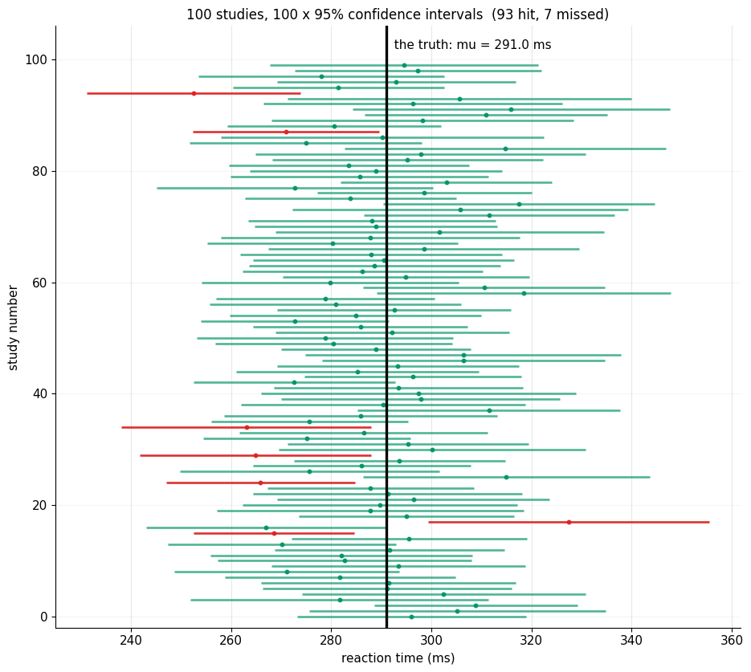

**Output**

```text
intervals built     : 100
containing the truth: 93
missing the truth   : 7   (red)
coverage            : 93.0%   <- nominal was 95%

Every red interval was built by exactly the same correct procedure as
every green one. Nothing went wrong in those studies -- those samples
just happened to be unusual. Missing sometimes is not a bug in the
method; it is the failure rate the method openly advertises.

With only 100 studies the count is itself noisy: +/- 4.4 points is ordinary variation,
so do not read too much into the exact number. The next cell settles it
with 40,000 studies.
```

### Cell 105

```python
# ============================================================
#  100 was a demonstration. 40,000 is a measurement.
#  Vectorised: build every interval at once.
# ============================================================
RNG4B = np.random.default_rng(20250905)
TRIALS = 40_000

draws = POP[RNG4B.integers(0, POP_N, size=(TRIALS, SAMPLE_N))]
xb    = draws.mean(axis=1)
se_v  = draws.std(axis=1, ddof=1) / np.sqrt(SAMPLE_N)

lo_v  = xb - z_crit * se_v
hi_v  = xb + z_crit * se_v
cov   = ((lo_v <= POP_MU) & (POP_MU <= hi_v)).mean()

# how precisely do we know the coverage itself? (a standard error, on a coverage)
mc_se = np.sqrt(cov * (1 - cov) / TRIALS)

print(f"trials                  : {TRIALS:,}")
print(f"nominal coverage        : {CONF:.2%}")
print(f"measured coverage       : {cov:.2%}  +/- {2*mc_se:.2%}  (2 Monte-Carlo SEs)")
print(f"shortfall               : {cov - CONF:+.2%}")
print()
print(f"mean interval width     : {(hi_v - lo_v).mean():.3f} ms")
print(f"widest interval built   : {(hi_v - lo_v).max():.3f} ms")
print(f"narrowest interval built: {(hi_v - lo_v).min():.3f} ms")
print()
print("The measured coverage sits close to 95% but slightly under it. That is")
print("not noise -- the gap survives more trials. Section 4.5 finds the cause.")
```

**Output**

```text
trials                  : 40,000
nominal coverage        : 95.00%
measured coverage       : 94.01%  +/- 0.24%  (2 Monte-Carlo SEs)
shortfall               : -0.99%

mean interval width     : 50.935 ms
widest interval built   : 93.921 ms
narrowest interval built: 28.131 ms

The measured coverage sits close to 95% but slightly under it. That is
not noise -- the gap survives more trials. Section 4.5 finds the cause.
```

### Cell 110

```python
# ============================================================
#  All three levers, each measured on real simulated samples.
# ============================================================
RNG4C = np.random.default_rng(555)

def mean_ci_width(pop, n, conf, reps=4000, rng=RNG4C):
    """Average 95%-style CI width over `reps` studies. Also returns one realised CI."""
    zc = stats.norm.ppf(1 - (1 - conf) / 2)
    d  = pop[rng.integers(0, pop.size, size=(reps, n))]
    w  = 2 * zc * d.std(axis=1, ddof=1) / np.sqrt(n)
    xb0, se0 = d[0].mean(), d[0].std(ddof=1) / np.sqrt(n)
    return w.mean(), (xb0 - zc * se0, xb0 + zc * se0)

# a second population: same centre, twice the spread
POP_WIDE = POP_MU + 2.0 * (POP - POP_MU)

fig, axes = plt.subplots(1, 3, figsize=(15, 4.0))

# ---- lever 1: sample size
ns = [10, 40, 160, 640]
print("LEVER 1 -- sample size (95% confidence, our population)")
print(f"{'n':>6} | {'mean CI width (ms)':>19} | {'vs n=10':>8}")
print("-" * 40)
w10 = None
for i, n in enumerate(ns):
    w, (a, b) = mean_ci_width(POP, n, 0.95)
    w10 = w if w10 is None else w10
    axes[0].plot([a, b], [i, i], color=C_EXACT, lw=3.0, solid_capstyle="butt")
    axes[0].plot((a + b) / 2, i, "o", color=C_EXACT, ms=5)
    print(f"{n:>6} | {w:>19.3f} | {w/w10:>7.2f}x")
axes[0].set_yticks(range(len(ns))); axes[0].set_yticklabels([f"n = {n}" for n in ns])
axes[0].set_title("more data -> narrower"); axes[0].set_xlabel("ms")

# ---- lever 2: confidence level
confs = [0.80, 0.90, 0.95, 0.99]
print()
print(f"LEVER 2 -- confidence level (n = {SAMPLE_N}, our population)")
print(f"{'level':>7} | {'z crit':>8} | {'mean CI width (ms)':>19}")
print("-" * 40)
for i, c in enumerate(confs):
    w, (a, b) = mean_ci_width(POP, SAMPLE_N, c)
    axes[1].plot([a, b], [i, i], color=C_APPROX, lw=3.0, solid_capstyle="butt")
    axes[1].plot((a + b) / 2, i, "o", color=C_APPROX, ms=5)
    print(f"{c:>7.0%} | {stats.norm.ppf(1-(1-c)/2):>8.4f} | {w:>19.3f}")
axes[1].set_yticks(range(len(confs))); axes[1].set_yticklabels([f"{c:.0%}" for c in confs])
axes[1].set_title("more confidence -> wider"); axes[1].set_xlabel("ms")

# ---- lever 3: population spread
print()
print(f"LEVER 3 -- population spread (n = {SAMPLE_N}, 95% confidence)")
print(f"{'population':>22} | {'true sd':>9} | {'mean CI width (ms)':>19}")
print("-" * 56)
for i, (label, pp) in enumerate([("ours", POP), ("2x as variable", POP_WIDE)]):
    w, (a, b) = mean_ci_width(pp, SAMPLE_N, 0.95)
    axes[2].plot([a, b], [i, i], color=C_SLOPE, lw=3.0, solid_capstyle="butt")
    axes[2].plot((a + b) / 2, i, "o", color=C_SLOPE, ms=5)
    print(f"{label:>22} | {pp.std(ddof=0):>9.2f} | {w:>19.3f}")
axes[2].set_yticks([0, 1]); axes[2].set_yticklabels(["sigma", "2 x sigma"])
axes[2].set_title("messier world -> wider"); axes[2].set_xlabel("ms")

for ax in axes:
    ax.axvline(POP_MU, color=C_GREY, lw=1.6, ls=":")
    ax.grid(axis="y", alpha=0.15)
fig.tight_layout(); plt.show()
```

**Output**

```text
LEVER 1 -- sample size (95% confidence, our population)
     n |  mean CI width (ms) |  vs n=10
----------------------------------------
    10 |              98.413 |    1.00x
    40 |              51.079 |    0.52x
   160 |              25.668 |    0.26x
   640 |              12.861 |    0.13x

LEVER 2 -- confidence level (n = 40, our population)
  level |   z crit |  mean CI width (ms)
----------------------------------------
    80% |   1.2816 |              33.274
    90% |   1.6449 |              42.857
    95% |   1.9600 |              50.918
    99% |   2.5758 |              66.873

LEVER 3 -- population spread (n = 40, 95% confidence)
            population |   true sd |  mean CI width (ms)
--------------------------------------------------------
                  ours |     83.01 |              50.857
        2x as variable |    166.02 |             101.767
```

**Output**

```text
<Figure size 1500x400 with 3 Axes>
```

**Figure**

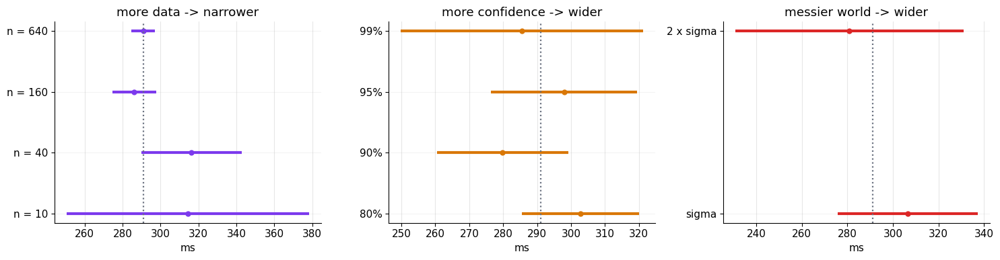

### Cell 114

```python
# ============================================================
#  How much fatter? Compare the multipliers.
# ============================================================
print(f"{'n':>5} | {'df = n-1':>9} | {'t multiplier':>13} | {'z multiplier':>13} | {'t is wider by':>14}")
print("-" * 70)
for n in [5, 15, 40, 100, 1000]:
    t_c = stats.t.ppf(0.975, df=n - 1)
    print(f"{n:>5} | {n-1:>9} | {t_c:>13.4f} | {z_crit:>13.4f} | "
          f"{100*(t_c/z_crit - 1):>13.2f}%")

print()
print("At n = 5 the correction is large. At n = 1000 it has essentially vanished:")
print(f"  t(df=999) = {stats.t.ppf(0.975, df=999):.4f}   vs   z = {z_crit:.4f}")

fig, (axL, axR) = plt.subplots(1, 2, figsize=(12, 4.0))

g = np.linspace(-5, 5, 700)
axL.plot(g, stats.norm.pdf(g), color=C_EXACT, lw=2.6, label="normal (z)")
for df, c in [(4, C_SLOPE), (14, C_APPROX), (39, C_AREA)]:
    axL.plot(g, stats.t.pdf(g, df), lw=2.0, color=c, ls="--", label=f"t, df = {df}")
axL.set_title("t has fatter tails than the normal")
axL.set_xlabel("standard errors from the estimate"); axL.set_ylabel("density")
axL.legend(frameon=False, fontsize=9)

axR.plot(g, stats.norm.pdf(g), color=C_EXACT, lw=2.6)
for df, c in [(4, C_SLOPE), (14, C_APPROX), (39, C_AREA)]:
    axR.plot(g, stats.t.pdf(g, df), lw=2.0, color=c, ls="--")
axR.set_xlim(2.0, 5.0); axR.set_ylim(0, 0.06)
axR.set_title("the same curves, zoomed into the right tail")
axR.set_xlabel("standard errors from the estimate"); axR.set_ylabel("density")

fig.tight_layout(); plt.show()
```

**Output**

```text
    n |  df = n-1 |  t multiplier |  z multiplier |  t is wider by
----------------------------------------------------------------------
    5 |         4 |        2.7764 |        1.9600 |         41.66%
   15 |        14 |        2.1448 |        1.9600 |          9.43%
   40 |        39 |        2.0227 |        1.9600 |          3.20%
  100 |        99 |        1.9842 |        1.9600 |          1.24%
 1000 |       999 |        1.9623 |        1.9600 |          0.12%

At n = 5 the correction is large. At n = 1000 it has essentially vanished:
  t(df=999) = 1.9623   vs   z = 1.9600
```

**Output**

```text
<Figure size 1200x400 with 2 Axes>
```

**Figure**

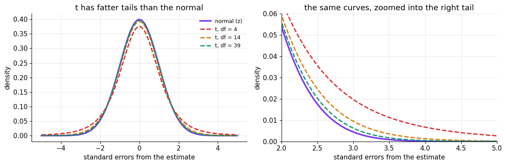

### Cell 117

```python
# ============================================================
#  Does it actually fix the coverage? Simulate and count.
#  Three procedures at three sample sizes, 40,000 studies each.
# ============================================================
RNG4D = np.random.default_rng(1908)          # Gosset's year
TR = 40_000

print(f"Measured coverage of nominal-95% intervals, {TR:,} studies each")
print()
print(f"{'n':>5} | {'z with true sigma':>18} | {'z with s (wrong)':>17} | {'t with s (right)':>17}")
print("-" * 66)

cov_table = {}
for n in [5, 15, 40, 100]:
    d  = POP[RNG4D.integers(0, POP_N, size=(TR, n))]
    xb_ = d.mean(axis=1)
    s_  = d.std(axis=1, ddof=1)

    # (a) the idealised interval nobody can build: uses the TRUE sigma
    h_true = z_crit * POP_SD / np.sqrt(n)
    c_true = ((xb_ - h_true <= POP_MU) & (POP_MU <= xb_ + h_true)).mean()

    # (b) what people actually do wrong: z multiplier with the estimated s
    h_z = z_crit * s_ / np.sqrt(n)
    c_z = ((xb_ - h_z <= POP_MU) & (POP_MU <= xb_ + h_z)).mean()

    # (c) the correct small-sample interval: t multiplier with the estimated s
    t_c = stats.t.ppf(0.975, df=n - 1)
    h_t = t_c * s_ / np.sqrt(n)
    c_t = ((xb_ - h_t <= POP_MU) & (POP_MU <= xb_ + h_t)).mean()

    cov_table[n] = (c_true, c_z, c_t)
    print(f"{n:>5} | {c_true:>17.2%} | {c_z:>16.2%} | {c_t:>16.2%}")

print()
print("Read the middle column downward: using z with an estimated s UNDER-COVERS,")
print("badly at n = 5 and less so as n grows. The right-hand column fixes most of it.")
print()
print(f"at n = 5 : z gives {cov_table[5][1]:.2%}, t gives {cov_table[5][2]:.2%} "
      f"-- a gap of {100*(cov_table[5][2] - cov_table[5][1]):.2f} points")
print(f"at n = 40: z gives {cov_table[40][1]:.2%}, t gives {cov_table[40][2]:.2%} "
      f"-- a gap of {100*(cov_table[40][2] - cov_table[40][1]):.2f} points")
print()
print("Note the t column at n = 5 is still not 95%. t assumes the POPULATION is")
print("normal, and ours is skewed. At n = 5 the CLT (section 3.3) has barely started.")
print("Two separate approximations, two separate shortfalls.")
```

**Output**

```text
Measured coverage of nominal-95% intervals, 40,000 studies each

    n |  z with true sigma |  z with s (wrong) |  t with s (right)
------------------------------------------------------------------
    5 |            95.08% |           86.60% |           94.01%
   15 |            95.10% |           92.34% |           94.44%
   40 |            94.91% |           93.79% |           94.58%
  100 |            94.95% |           94.49% |           94.84%

Read the middle column downward: using z with an estimated s UNDER-COVERS,
badly at n = 5 and less so as n grows. The right-hand column fixes most of it.

at n = 5 : z gives 86.60%, t gives 94.01% -- a gap of 7.41 points
at n = 40: z gives 93.79%, t gives 94.58% -- a gap of 0.79 points

Note the t column at n = 5 is still not 95%. t assumes the POPULATION is
normal, and ours is skewed. At n = 5 the CLT (section 3.3) has barely started.
Two separate approximations, two separate shortfalls.
```

### Cell 121

```python
# ============================================================
#  The bootstrap, implemented directly. Nine lines of actual work.
# ============================================================
RNG_B = np.random.default_rng(1979)          # Efron's paper
B = 20_000


def bootstrap_ci(data, statistic=np.mean, B=B, conf=0.95, rng=RNG_B):
    """Percentile bootstrap CI for any statistic. No distributional assumption."""
    n    = len(data)
    idx  = rng.integers(0, n, size=(B, n))       # resample WITH replacement
    reps = statistic(data[idx], axis=1)          # the statistic, B times over
    a    = (1 - conf) / 2
    return np.quantile(reps, [a, 1 - a]), reps


(b_lo, b_hi), boot_means = bootstrap_ci(sample)

# what one resample looks like, to demystify it
one_idx = RNG_B.integers(0, SAMPLE_N, size=SAMPLE_N)
print(f"original sample (first 8, sorted): {np.round(np.sort(sample)[:8], 1)}")
print(f"one resample    (first 8, sorted): {np.round(np.sort(sample[one_idx])[:8], 1)}")
print(f"  of the {SAMPLE_N} original observations, "
      f"{len(np.unique(one_idx))} appear in this resample and "
      f"{SAMPLE_N - len(np.unique(one_idx))} are left out.")
print(f"  (about 1/e = {1/np.e:.1%} get left out every time -- that is the mechanism)")
print()

t_crit40 = stats.t.ppf(0.975, df=SAMPLE_N - 1)
t_lo, t_hi = x_bar - t_crit40 * se, x_bar + t_crit40 * se

print(f"{'method':>26} | {'interval (ms)':>26} | {'width':>7} | {'contains mu?':>12}")
print("-" * 82)
for name, (a, b) in [("z formula (1.96)", (lo, hi)),
                     ("t formula (correct)", (t_lo, t_hi)),
                     (f"bootstrap ({B:,} resamples)", (b_lo, b_hi))]:
    print(f"{name:>26} | [{a:>10.3f}, {b:>10.3f}] | {b-a:>7.3f} | "
          f"{'YES' if a <= POP_MU <= b else 'NO':>12}")
print()
print(f"true mu = {POP_MU:.3f} ms")
print()
print("Three routes, three near-identical answers -- and the bootstrap got there")
print("without ever using sigma, the CLT, or a table of critical values.")
```

**Output**

```text
original sample (first 8, sorted): [167.  181.2 183.8 193.7 194.2 194.9 199.8 203.7]
one resample    (first 8, sorted): [167.  183.8 183.8 193.7 194.2 199.8 203.7 223.3]
  of the 40 original observations, 25 appear in this resample and 15 are left out.
  (about 1/e = 36.8% get left out every time -- that is the mechanism)

                    method |              interval (ms) |   width | contains mu?
----------------------------------------------------------------------------------
          z formula (1.96) | [   257.805,    303.894] |  46.089 |          YES
       t formula (correct) | [   257.068,    304.632] |  47.564 |          YES
bootstrap (20,000 resamples) | [   258.731,    304.520] |  45.788 |          YES

true mu = 290.989 ms

Three routes, three near-identical answers -- and the bootstrap got there
without ever using sigma, the CLT, or a table of critical values.
```

### Cell 122

```python
fig, (axL, axR) = plt.subplots(1, 2, figsize=(12, 4.2))

# left: the bootstrap distribution, with the interval marked
axL.hist(boot_means, bins=70, color=C_AREA, alpha=0.85, density=True)
axL.axvline(b_lo, color=C_SLOPE, lw=2.2, ls="--")
axL.axvline(b_hi, color=C_SLOPE, lw=2.2, ls="--", label="bootstrap 95% CI")
axL.axvline(x_bar, color=C_EXACT, lw=2.2, label=f"our sample mean {x_bar:.1f}")
axL.axvline(POP_MU, color="black", lw=2.0, ls=":", label=f"true mu {POP_MU:.1f}")
axL.set_title(f"BOOTSTRAP distribution\n({B:,} resamples of our ONE sample)", fontsize=11)
axL.set_xlabel("resample mean (ms)"); axL.set_ylabel("density")
axL.legend(frameon=False, fontsize=9)

# right: the real sampling distribution from Part 3, recentred for comparison
axR.hist(means40 - POP_MU, bins=70, color=C_EXACT, alpha=0.55, density=True,
         label="TRUE sampling dist (20,000 real studies)")
axR.hist(boot_means - x_bar, bins=70, color=C_AREA, alpha=0.55, density=True,
         label="BOOTSTRAP dist (1 study, resampled)")
axR.axvline(0, color="black", lw=1.6, ls=":")
axR.set_title("the bootstrap reconstructs the right shape\n(both centred at 0 to compare)",
              fontsize=11)
axR.set_xlabel("deviation from centre (ms)"); axR.set_ylabel("density")
axR.legend(frameon=False, fontsize=9)

fig.tight_layout(); plt.show()

print(f"sd of the TRUE sampling distribution (20,000 real studies)   : {means40.std(ddof=0):8.4f} ms")
print(f"   which the formula predicts as sigma/sqrt(n)               : {POP_SD/np.sqrt(SAMPLE_N):8.4f} ms")
print()
print(f"sd of the BOOTSTRAP distribution ({B:,} resamples of ONE study): {boot_means.std(ddof=0):8.4f} ms")
print(f"   which our own sample's s/sqrt(n) predicts                 : {se:8.4f} ms")
print()
print(f"the bootstrap is {100*(boot_means.std(ddof=0)/means40.std(ddof=0) - 1):+.1f}% off the TRUE sampling-distribution width.")
print()
print("Read that carefully. The bootstrap agrees almost exactly with s/sqrt(n),")
print("because both are built from the same 40 numbers. It sits below the true")
print(f"width because this particular sample's s = {s:.2f} undershot the true")
print(f"sigma = {POP_SD:.2f}. That is not a flaw in the bootstrap: the t-interval")
print("has the same problem for the same reason, which is section 4.5.")
print()
print("The bootstrap reconstructed the SHAPE and the SCALE of a distribution it")
print("never saw, from 40 numbers, and is wrong only where those 40 numbers were.")
```

**Output**

```text
<Figure size 1200x420 with 2 Axes>
```

**Figure**

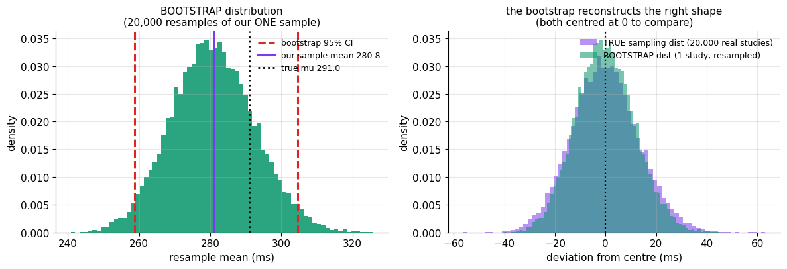

**Output**

```text
sd of the TRUE sampling distribution (20,000 real studies)   :  13.1259 ms
   which the formula predicts as sigma/sqrt(n)               :  13.1253 ms

sd of the BOOTSTRAP distribution (20,000 resamples of ONE study):  11.6423 ms
   which our own sample's s/sqrt(n) predicts                 :  11.7576 ms

the bootstrap is -11.3% off the TRUE sampling-distribution width.

Read that carefully. The bootstrap agrees almost exactly with s/sqrt(n),
because both are built from the same 40 numbers. It sits below the true
width because this particular sample's s = 74.36 undershot the true
sigma = 83.01. That is not a flaw in the bootstrap: the t-interval
has the same problem for the same reason, which is section 4.5.

The bootstrap reconstructed the SHAPE and the SCALE of a distribution it
never saw, from 40 numbers, and is wrong only where those 40 numbers were.
```

### Cell 124

```python
# ============================================================
#  Bootstrap intervals are only trustworthy if they COVER.
#  Same test as section 4.2: build many, count the hits.
# ============================================================
RNG_BC = np.random.default_rng(4242)
TRIALS_B, B_INNER = 1_500, 600

hits_boot, hits_t = 0, 0
widths_boot, widths_t = [], []
t_c40 = stats.t.ppf(0.975, df=SAMPLE_N - 1)

for _ in range(TRIALS_B):
    s_i  = POP[RNG_BC.integers(0, POP_N, size=SAMPLE_N)]

    idx  = RNG_BC.integers(0, SAMPLE_N, size=(B_INNER, SAMPLE_N))
    reps = s_i[idx].mean(axis=1)
    blo, bhi = np.quantile(reps, [0.025, 0.975])
    hits_boot += (blo <= POP_MU <= bhi)
    widths_boot.append(bhi - blo)

    h = t_c40 * s_i.std(ddof=1) / np.sqrt(SAMPLE_N)
    tlo, thi = s_i.mean() - h, s_i.mean() + h
    hits_t += (tlo <= POP_MU <= thi)
    widths_t.append(thi - tlo)

cb, ct = hits_boot / TRIALS_B, hits_t / TRIALS_B
mc = lambda p: 2 * np.sqrt(p * (1 - p) / TRIALS_B)

print(f"{TRIALS_B:,} studies of n = {SAMPLE_N}, {B_INNER} resamples inside each")
print()
print(f"{'method':>22} | {'coverage':>10} | {'+/- 2 MC SE':>12} | {'mean width (ms)':>16}")
print("-" * 68)
print(f"{'t formula':>22} | {ct:>10.2%} | {mc(ct):>11.2%} | {np.mean(widths_t):>16.3f}")
print(f"{'percentile bootstrap':>22} | {cb:>10.2%} | {mc(cb):>11.2%} | {np.mean(widths_boot):>16.3f}")
print(f"{'nominal':>22} | {0.95:>10.2%} |")
print()
print("Both land near 95%. The bootstrap is very slightly narrower and so covers")
print("very slightly less -- a known small-sample bias of the plain percentile")
print("method, fixable with the BCa variant (scipy.stats.bootstrap does it).")
print()
print("The point stands: the bootstrap assumed NOTHING about the population's")
print("shape and delivered essentially the same interval as the formula that did.")
```

**Output**

```text
1,500 studies of n = 40, 600 resamples inside each

                method |   coverage |  +/- 2 MC SE |  mean width (ms)
--------------------------------------------------------------------
             t formula |     95.27% |       1.10% |           52.714
  percentile bootstrap |     94.00% |       1.23% |           49.957
               nominal |     95.00% |

Both land near 95%. The bootstrap is very slightly narrower and so covers
very slightly less -- a known small-sample bias of the plain percentile
method, fixable with the BCa variant (scipy.stats.bootstrap does it).

The point stands: the bootstrap assumed NOTHING about the population's
shape and delivered essentially the same interval as the formula that did.
```

### Cell 131

```python
# ============================================================
#  5.1  The claim, and the sample we will judge it with.
# ============================================================
from scipy import stats

CLAIM  = 270.0        # H0: the population mean is exactly this
N_TEST = 100          # how many people we measure

# A dedicated generator, so this sample never changes no matter what
# earlier parts happened to draw from RNG.
rng_obs = np.random.default_rng(505)
obs = rng_obs.choice(POP, N_TEST, replace=False)

obs_mean = obs.mean()
obs_gap  = abs(obs_mean - CLAIM)      # our statistic: distance from the claim

print(f"H0 says the population mean is   {CLAIM:8.1f} ms")
print(f"our {N_TEST} people averaged        {obs_mean:8.2f} ms")
print(f"so our sample sits               {obs_gap:8.2f} ms away from the claim")
print()
print("Is that a lot? On its own the number means nothing at all. It only")
print("means something next to the spread of gaps you would SEE in a world")
print("where H0 is true. So let us go and build that world.")
print()
print(f"(peeking, which you could never do in real life: the truth is "
      f"{POP_MU:.2f} ms,")
print(f" so H0 is FALSE, and wrong by {POP_MU - CLAIM:.2f} ms)")
```

**Output**

```text
H0 says the population mean is      270.0 ms
our 100 people averaged          288.12 ms
so our sample sits                  18.12 ms away from the claim

Is that a lot? On its own the number means nothing at all. It only
means something next to the spread of gaps you would SEE in a world
where H0 is true. So let us go and build that world.

(peeking, which you could never do in real life: the truth is 290.99 ms,
 so H0 is FALSE, and wrong by 20.99 ms)
```

### Cell 133

```python
# ============================================================
#  5.2  The p-value, by simulation. No formula, no table.
# ============================================================
rng5 = np.random.default_rng(5050)

POP_H0 = POP - POP_MU + CLAIM         # same shape, mean slid to exactly the claim
print(f"null population mean = {POP_H0.mean():.6f} ms   (exactly the claim)")
print(f"null population sd   = {POP_H0.std(ddof=0):.3f} ms   (unchanged)")
print()

N_NULL_STUDIES = 20_000
idx        = rng5.integers(0, len(POP_H0), size=(N_NULL_STUDIES, N_TEST))
null_means = POP_H0[idx].mean(axis=1)       # 20,000 studies in the boring world

null_gaps  = np.abs(null_means - CLAIM)
as_extreme = null_gaps >= obs_gap
p_sim      = as_extreme.mean()

print(f"ran {N_NULL_STUDIES:,} studies in a world where H0 is TRUE")
print(f"  their sample means ranged {null_means.min():.1f} .. {null_means.max():.1f} ms")
print(f"  {as_extreme.sum():,} of them landed at least {obs_gap:.2f} ms "
      f"from {CLAIM:.0f}")
print()
print(f"  p (simulated) = {as_extreme.sum():,} / {N_NULL_STUDIES:,} = {p_sim:.4f}")
print()
print("That is a p-value. Nothing was assumed about bell curves; we simply")
print("counted how often the boring world produces data as odd as ours.")
```

**Output**

```text
null population mean = 270.000000 ms   (exactly the claim)
null population sd   = 83.012 ms   (unchanged)

ran 20,000 studies in a world where H0 is TRUE
  their sample means ranged 239.5 .. 305.0 ms
  584 of them landed at least 18.12 ms from 270

  p (simulated) = 584 / 20,000 = 0.0292

That is a p-value. Nothing was assumed about bell curves; we simply
counted how often the boring world produces data as odd as ours.
```

### Cell 134

```python
fig, ax = plt.subplots(figsize=(11, 4.6))

counts, bins, patches = ax.hist(null_means, bins=70, color=C_SOFT,
                                edgecolor="white",
                                label="20,000 studies in the null world")
half = (bins[1] - bins[0]) / 2
for pat, left in zip(patches, bins[:-1]):          # shade the extreme tails
    if abs(left + half - CLAIM) >= obs_gap:
        pat.set_facecolor(C_SLOPE); pat.set_alpha(0.85)

ax.axvline(CLAIM, color=C_GREY, lw=2.0, ls="--",
           label=f"H0 says the mean is {CLAIM:.0f}")
ax.axvline(obs_mean, color=C_EXACT, lw=2.6, label=f"our study: {obs_mean:.1f} ms")
ax.axvline(2 * CLAIM - obs_mean, color=C_EXACT, lw=1.4, ls=":",
           label="its mirror image (two-sided)")

ax.set_title("What the boring world produces -- and where our study landed")
ax.set_xlabel("sample mean of 100 people (ms)")
ax.set_ylabel("number of studies")
ax.legend(frameon=False, fontsize=9)
ax.text(0.02, 0.95, f"red area = {p_sim:.1%} of all studies",
        transform=ax.transAxes, va="top", fontsize=11,
        color=C_SLOPE, weight="bold")
fig.tight_layout(); plt.show()

print(f"p = {p_sim:.4f}  =  the red fraction of the grey histogram")
```

**Output**

```text
<Figure size 1100x460 with 1 Axes>
```

**Figure**

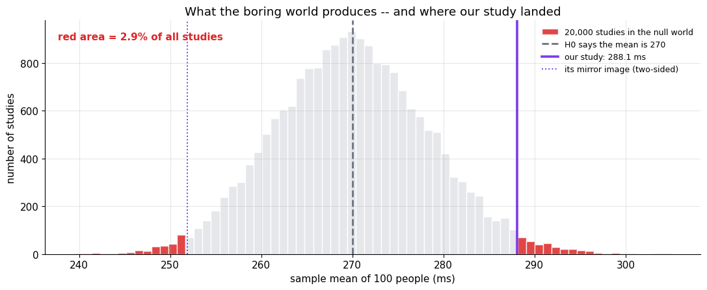

**Output**

```text
p = 0.0292  =  the red fraction of the grey histogram
```

### Cell 137

```python
# ============================================================
#  5.3  The same p-value from a formula -- do they agree?
#
#  The one-sample t-test replaces our 20,000 simulated studies with an
#  algebraic stand-in for the same histogram: the t distribution.
#
#      t = (x-bar - claim) / (s / sqrt(n))
#
#  i.e. "how many standard errors is my sample mean from the claim?"
# ============================================================
t_hand       = (obs_mean - CLAIM) / (obs.std(ddof=1) / np.sqrt(N_TEST))
t_sci, p_sci = stats.ttest_1samp(obs, CLAIM)

print(f"t by hand    = {t_hand:.6f}")
print(f"t from scipy = {t_sci:.6f}")
print()
mc_se = np.sqrt(p_sim * (1 - p_sim) / N_NULL_STUDIES)
print(f"p from SIMULATION (20,000 null studies) = {p_sim:.4f}")
print(f"p from scipy ttest_1samp                = {p_sci:.4f}")
print(f"absolute difference                     = {abs(p_sim - p_sci):.4f}")
print(f"expected wobble of the simulated p      = {mc_se:.4f}   "
      f"(sqrt(p(1-p)/20000))")
print()
print("Same number, two roads. The formula is faster; the simulation is the")
print("one that tells you what the number MEANS.")
print()
print(f"Verdict at the usual 0.05 line: "
      f"{'REJECT H0' if p_sci < 0.05 else 'do not reject H0'}")
print(f"Correct answer (we are allowed to peek): H0 is false, mu = {POP_MU:.2f} ms,")
print("so rejecting it is the RIGHT call. The test got this one right.")
```

**Output**

```text
t by hand    = 2.229751
t from scipy = 2.229751

p from SIMULATION (20,000 null studies) = 0.0292
p from scipy ttest_1samp                = 0.0280
absolute difference                     = 0.0012
expected wobble of the simulated p      = 0.0012   (sqrt(p(1-p)/20000))

Same number, two roads. The formula is faster; the simulation is the
one that tells you what the number MEANS.

Verdict at the usual 0.05 line: REJECT H0
Correct answer (we are allowed to peek): H0 is false, mu = 290.99 ms,
so rejecting it is the RIGHT call. The test got this one right.
```

### Cell 142

```python
# ============================================================
#  5.4  A whole research field, simulated.
#       90% of the hypotheses are duds. Everyone tests honestly.
#       What fraction of the SIGNIFICANT results are false?
# ============================================================
N_STUDIES  = 20_000
FRAC_REAL  = 0.10        # 1 hypothesis in 10 is actually true
REAL_SHIFT = 25.0        # when an effect exists, it is 25 ms
N_PER      = 40          # each study measures 40 people

rng_field = np.random.default_rng(6060)
is_real   = rng_field.random(N_STUDIES) < FRAC_REAL

POP_REAL = POP - POP_MU + (CLAIM + REAL_SHIFT)   # a world with a genuine effect

pvals = np.empty(N_STUDIES)
for real, src in ((False, POP_H0), (True, POP_REAL)):
    where = np.where(is_real == real)[0]
    draws = src[rng_field.integers(0, len(src), size=(len(where), N_PER))]
    pvals[where] = stats.ttest_1samp(draws, CLAIM, axis=1).pvalue

sig       = pvals < 0.05
false_pos = sig & ~is_real
true_pos  = sig & is_real

print(f"{N_STUDIES:,} studies run. {is_real.sum():,} chased a real effect, "
      f"{(~is_real).sum():,} chased nothing.")
print()
print(f"  published (p < 0.05) : {sig.sum():,}")
print(f"     of which REAL     : {true_pos.sum():,}")
print(f"     of which NOTHING  : {false_pos.sum():,}")
print()
print(f"  ==> {false_pos.sum() / sig.sum():.1%} of the published findings are "
      f"false,")
print(f"      every one of them reported with a p-value below 0.05.")
print()
print(f"  false-positive rate among true nulls : "
      f"{false_pos.sum() / (~is_real).sum():.1%}"
      f"   <- this is alpha, working exactly as designed")
print(f"  power (detection rate) among real    : "
      f"{true_pos.sum() / is_real.sum():.1%}"
      f"   <- this is why so many real effects were missed")
```

**Output**

```text
20,000 studies run. 1,941 chased a real effect, 18,059 chased nothing.

  published (p < 0.05) : 1,793
     of which REAL     : 888
     of which NOTHING  : 905

  ==> 50.5% of the published findings are false,
      every one of them reported with a p-value below 0.05.

  false-positive rate among true nulls : 5.0%   <- this is alpha, working exactly as designed
  power (detection rate) among real    : 45.7%   <- this is why so many real effects were missed
```

### Cell 146

```python
# ============================================================
#  5.4  One effect, three sample sizes, three verdicts.
#       The world is IDENTICAL in all three rows -- only the
#       budget changes. We run 400 studies at each size and
#       report the median, so one lucky sample cannot mislead us.
# ============================================================
rng_n = np.random.default_rng(7070)
SHIFT = 12.0                                  # the real effect, in ms
POP_S = POP - POP_MU + (CLAIM + SHIFT)        # a world where the truth is 282

print(f"In all three rows the truth is identical: mean = {CLAIM + SHIFT:.0f} ms,")
print(f"so the real effect is always {SHIFT:.0f} ms away from the claim of "
      f"{CLAIM:.0f}.")
print()
print(f"{'n':>8}  {'median effect (ms)':>19}  {'median p':>12}   typical verdict")
print("-" * 66)
for n in (25, 250, 2500):
    draws_n = POP_S[rng_n.integers(0, len(POP_S), size=(400, n))]
    eff = draws_n.mean(axis=1) - CLAIM
    pv_n = stats.ttest_1samp(draws_n, CLAIM, axis=1).pvalue
    print(f"{n:>8,}  {np.median(eff):>19.2f}  {np.median(pv_n):>12.3g}   "
          f"{'significant' if np.median(pv_n) < 0.05 else 'not significant'}")

print()
print("The effect column does not move -- it is estimating a fixed truth.")
print("The p column moves by orders of magnitude.")
print("So p is a statement about your EVIDENCE, not about the world.")
print("Part 6 gives the world its own number, and it is called effect size.")
```

**Output**

```text
In all three rows the truth is identical: mean = 282 ms,
so the real effect is always 12 ms away from the claim of 270.

       n   median effect (ms)      median p   typical verdict
------------------------------------------------------------------
      25                10.93         0.393   not significant
     250                11.23        0.0289   significant
   2,500                11.77      1.56e-12   significant

The effect column does not move -- it is estimating a fixed truth.
The p column moves by orders of magnitude.
So p is a statement about your EVIDENCE, not about the world.
Part 6 gives the world its own number, and it is called effect size.
```

### Cell 148

```python
# ============================================================
#  5.5  Does alpha do what it says on the tin? Run 20,000 studies
#       in a world where H0 is TRUE and count the wrong rejections.
# ============================================================
rng_a  = np.random.default_rng(8080)
N_CAL  = 20_000
mc_tol = 2 * np.sqrt(0.05 * 0.95 / N_CAL)     # 2 Monte-Carlo SEs on a 5% rate

print(f"{N_CAL:,} studies at each n. A measured rate is only meaningful to")
print(f"within about +/- {mc_tol:.4f} (two Monte-Carlo standard errors).")
print()
print(f"{'n':>6}  {'P(p < 0.05)':>12}  {'P(p < 0.01)':>12}   verdict")
print("-" * 58)
p_by_n = {}
for n in (10, 25, 100, 400):
    draws = POP_H0[rng_a.integers(0, len(POP_H0), size=(N_CAL, n))]
    pv = stats.ttest_1samp(draws, CLAIM, axis=1).pvalue
    p_by_n[n] = pv
    rate = np.mean(pv < 0.05)
    note = "on target" if abs(rate - 0.05) <= mc_tol else "too eager -- skew biting"
    print(f"{n:>6}  {rate:>12.4f}  {np.mean(pv < 0.01):>12.4f}   {note}")

print()
print("The promise is 0.0500 and 0.0100. At small n the t-test is genuinely OFF,")
print("by more than simulation noise can explain: our population is skewed and")
print("the t-test was derived assuming it is not. As n grows the CLT from Part 3")
print("rescues it and the rates settle onto their promise.")
print("This is the sort of thing you can only see because we own the population.")

fig, (ax1, ax2) = plt.subplots(1, 2, figsize=(12, 4.2))

ax1.hist(p_by_n[400], bins=40, range=(0, 1), color=C_F, alpha=0.85,
         edgecolor="white")
ax1.axhline(N_CAL / 40, color=C_SLOPE, lw=2, ls="--", label="perfectly flat")
ax1.set_title("p-values when H0 is TRUE (n = 400)")
ax1.set_xlabel("p-value"); ax1.set_ylabel("studies")
ax1.legend(frameon=False)

ns = sorted(p_by_n)
rates = np.array([np.mean(p_by_n[n] < 0.05) for n in ns])
ax2.fill_between([min(ns), max(ns)], 0.05 - mc_tol, 0.05 + mc_tol,
                 color=C_SOFT, label="simulation noise band")
ax2.plot(ns, rates, "o-", color=C_SLOPE, lw=2, label="measured rejection rate")
ax2.axhline(0.05, color=C_GREY, lw=2, ls="--", label="promised alpha = 0.05")
ax2.set_xscale("log"); ax2.set_ylim(0, 0.10)
ax2.set_title("Type I error rate vs sample size")
ax2.set_xlabel("n (log scale)"); ax2.set_ylabel("P(reject a TRUE null)")
ax2.legend(frameon=False)

fig.tight_layout(); plt.show()
```

**Output**

```text
20,000 studies at each n. A measured rate is only meaningful to
within about +/- 0.0031 (two Monte-Carlo standard errors).

     n   P(p < 0.05)   P(p < 0.01)   verdict
----------------------------------------------------------
    10        0.0607        0.0158   too eager -- skew biting
    25        0.0543        0.0137   too eager -- skew biting
   100        0.0502        0.0115   on target
   400        0.0519        0.0100   on target

The promise is 0.0500 and 0.0100. At small n the t-test is genuinely OFF,
by more than simulation noise can explain: our population is skewed and
the t-test was derived assuming it is not. As n grows the CLT from Part 3
rescues it and the rates settle onto their promise.
This is the sort of thing you can only see because we own the population.
```

**Output**

```text
<Figure size 1200x420 with 2 Axes>
```

**Figure**

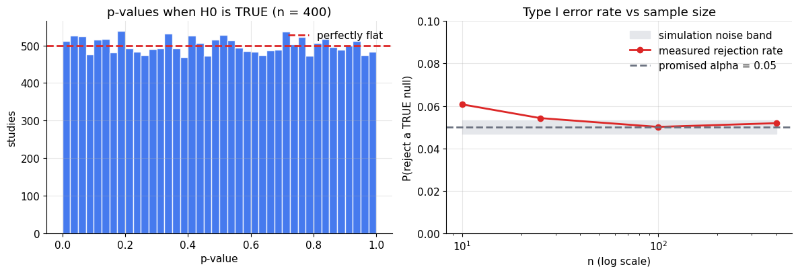

### Cell 151

```python
# ============================================================
#  5.6  A real effect that the test almost always misses.
# ============================================================
rng_p = np.random.default_rng(9090)

SMALL   = 12.0     # a REAL effect: the truth is 282, the claim under test is 270
N_SMALL = 40       # a perfectly ordinary sample size
POP_SMALL = POP - POP_MU + (CLAIM + SMALL)

draws = POP_SMALL[rng_p.integers(0, len(POP_SMALL), size=(20_000, N_SMALL))]
pv    = stats.ttest_1samp(draws, CLAIM, axis=1).pvalue
power = np.mean(pv < 0.05)

print(f"The effect is REAL -- we built it. The true mean is {CLAIM + SMALL:.0f} ms,")
print(f"the claim under test is {CLAIM:.0f} ms, so H0 is definitely false.")
print()
print(f"Ran 20,000 studies of n = {N_SMALL}, each testing H0 correctly:")
print(f"  detected it (p < 0.05) : {np.sum(pv < 0.05):>6,}   ->  "
      f"power = {power:.1%}")
print(f"  MISSED it  (p >= 0.05) : {np.sum(pv >= 0.05):>6,}   ->  "
      f"Type II error rate = {1 - power:.1%}")
print()
print(f"So {1 - power:.0%} of the time an honest researcher measuring a REAL "
      f"{SMALL:.0f} ms effect")
print("walks away and writes 'no significant difference was found'.")
print()
print(f"median p-value across those 20,000 studies: {np.median(pv):.3f}")
print("Half of all correctly-run studies of this real effect land above that.")
```

**Output**

```text
The effect is REAL -- we built it. The true mean is 282 ms,
the claim under test is 270 ms, so H0 is definitely false.

Ran 20,000 studies of n = 40, each testing H0 correctly:
  detected it (p < 0.05) :  2,324   ->  power = 11.6%
  MISSED it  (p >= 0.05) : 17,676   ->  Type II error rate = 88.4%

So 88% of the time an honest researcher measuring a REAL 12 ms effect
walks away and writes 'no significant difference was found'.

median p-value across those 20,000 studies: 0.332
Half of all correctly-run studies of this real effect land above that.
```

### Cell 153

```python
# ============================================================
#  5.6  Power curves -- what could this study actually have found?
# ============================================================
rng_c = np.random.default_rng(1212)
REPS  = 4_000

shifts = np.array([0, 3, 6, 9, 12, 16, 20, 25, 30, 33, 36, 40, 45, 50], float)
pow_by_shift = []
for sh in shifts:
    src = POP - POP_MU + (CLAIM + sh)
    d   = src[rng_c.integers(0, len(src), size=(REPS, 40))]
    pow_by_shift.append(np.mean(stats.ttest_1samp(d, CLAIM, axis=1).pvalue < 0.05))
pow_by_shift = np.array(pow_by_shift)

sizes    = np.array([10, 20, 40, 80, 160, 320, 640, 1280])
src12    = POP - POP_MU + (CLAIM + 12.0)
pow_by_n = []
for n in sizes:
    d = src12[rng_c.integers(0, len(src12), size=(REPS, n))]
    pow_by_n.append(np.mean(stats.ttest_1samp(d, CLAIM, axis=1).pvalue < 0.05))
pow_by_n = np.array(pow_by_n)

fig, (ax1, ax2) = plt.subplots(1, 2, figsize=(12, 4.3))

ax1.plot(shifts, pow_by_shift, "o-", color=C_SLOPE, lw=2.2)
ax1.axhline(0.05, color=C_GREY, ls=":", lw=1.8, label="alpha = 0.05 (no effect)")
ax1.axhline(0.80, color=C_AREA, ls="--", lw=1.8, label="0.80, the usual target")
ax1.axvline(12, color=C_EXACT, ls="--", lw=1.6, label="the 12 ms effect above")
ax1.set_title("Power vs effect size  (n = 40 fixed)")
ax1.set_xlabel("true effect (ms away from the claim)")
ax1.set_ylabel("P(detect)")
ax1.set_ylim(0, 1.02); ax1.legend(frameon=False, fontsize=9)

ax2.plot(sizes, pow_by_n, "o-", color=C_F, lw=2.2)
ax2.axhline(0.80, color=C_AREA, ls="--", lw=1.8, label="0.80, the usual target")
ax2.axhline(0.05, color=C_GREY, ls=":", lw=1.8)
ax2.set_xscale("log")
ax2.set_title("Power vs sample size  (12 ms effect fixed)")
ax2.set_xlabel("n (log scale)"); ax2.set_ylabel("P(detect)")
ax2.set_ylim(0, 1.02); ax2.legend(frameon=False, fontsize=9)

fig.tight_layout(); plt.show()

big_enough = shifts[pow_by_shift >= 0.80]
n_enough   = sizes[pow_by_n >= 0.80]
print(f"At n = 40, an effect must reach about {big_enough[0]:.0f} ms before this "
      f"test finds it 80% of the time.")
print(f"To find the 12 ms effect 80% of the time you need roughly n = {n_enough[0]}.")
print()
print("Both curves start at 0.05, not at 0. With no effect at all you still")
print("'detect' one 5% of the time -- that is alpha, drawn as a floor.")
print()

# ---- the same arithmetic, on a machine-learning scoreboard ----------------
# An accuracy is a proportion, so its standard error is sqrt(a(1-a)/n_rows).
ACC, N_ROWS = 0.93, 2_000
se_acc  = np.sqrt(ACC * (1 - ACC) / N_ROWS)
se_gap  = se_acc * np.sqrt(2)                 # comparing two such scores
print(f"ML footnote: accuracy {ACC:.0%} on {N_ROWS:,} test rows has "
      f"SE = {se_acc:.4f} ({100 * se_acc:.2f} points).")
print(f"  a gap between two such scores has SE = {100 * se_gap:.2f} points, so an")
print(f"  80%-power comparison needs a gap of about "
      f"{100 * 2.8 * se_gap:.1f} points. A 0.3-point win is far below that.")
```

**Output**

```text
<Figure size 1200x430 with 2 Axes>
```

**Figure**

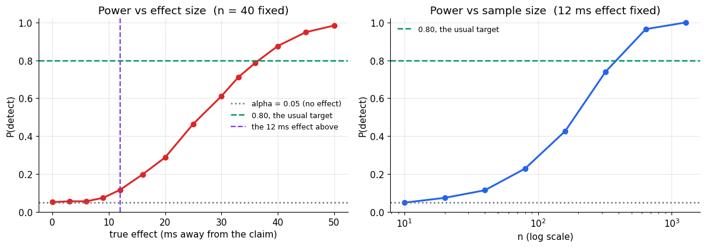

**Output**

```text
At n = 40, an effect must reach about 40 ms before this test finds it 80% of the time.
To find the 12 ms effect 80% of the time you need roughly n = 640.

Both curves start at 0.05, not at 0. With no effect at all you still
'detect' one 5% of the time -- that is alpha, drawn as a floor.

ML footnote: accuracy 93% on 2,000 test rows has SE = 0.0057 (0.57 points).
  a gap between two such scores has SE = 0.81 points, so an
  80%-power comparison needs a gap of about 2.3 points. A 0.3-point win is far below that.
```

### Cell 158

```python
# ============================================================
#  6.1  Two populations. We build the difference, so we know it.
# ============================================================
from scipy import stats

TRUE_EFFECT = 35.0        # the treatment really does speed people up by this
N_GROUP     = 60          # participants per group

POP_CTRL  = POP                     # control: the population from Part 0
POP_TREAT = POP - TRUE_EFFECT       # treatment: identical shape, shifted faster

rng6 = np.random.default_rng(605)
ctrl  = rng6.choice(POP_CTRL,  N_GROUP, replace=False)
treat = rng6.choice(POP_TREAT, N_GROUP, replace=False)

print("THE TRUTH (visible only because we simulated it):")
print(f"  control population mean   = {POP_CTRL.mean():8.2f} ms")
print(f"  treatment population mean = {POP_TREAT.mean():8.2f} ms")
print(f"  true difference           = {TRUE_EFFECT:8.2f} ms")
print()
print(f"WHAT A REAL STUDY SEES ({N_GROUP} people per group):")
print(f"  control  mean = {ctrl.mean():8.2f} ms   sd = {ctrl.std(ddof=1):6.2f}")
print(f"  treatment mean = {treat.mean():7.2f} ms   sd = {treat.std(ddof=1):6.2f}")
print(f"  observed difference = {ctrl.mean() - treat.mean():.2f} ms")
print()
print(f"The observed difference misses the truth by "
      f"{ctrl.mean() - treat.mean() - TRUE_EFFECT:+.2f} ms.")
print("Nothing went wrong. That is what 60-per-group looks like.")
```

**Output**

```text
THE TRUTH (visible only because we simulated it):
  control population mean   =   290.99 ms
  treatment population mean =   255.99 ms
  true difference           =    35.00 ms

WHAT A REAL STUDY SEES (60 people per group):
  control  mean =   298.27 ms   sd = 100.44
  treatment mean =  262.81 ms   sd =  82.57
  observed difference = 35.46 ms

The observed difference misses the truth by +0.46 ms.
Nothing went wrong. That is what 60-per-group looks like.
```

### Cell 160

```python
# ============================================================
#  6.1  The statistic by hand, then from scipy.
# ============================================================
diff = ctrl.mean() - treat.mean()
se_diff = np.sqrt(ctrl.var(ddof=1) / N_GROUP + treat.var(ddof=1) / N_GROUP)
t_hand2 = diff / se_diff

print(f"observed difference      = {diff:8.3f} ms")
print(f"SE of that difference    = {se_diff:8.3f} ms   "
      f"(sqrt of the two squared SEs added)")
print(f"t = difference / SE      = {t_hand2:8.4f}   "
      f"standard errors away from zero")
print()

t_stu, p_stu = stats.ttest_ind(ctrl, treat, equal_var=True)    # Student
t_wel, p_wel = stats.ttest_ind(ctrl, treat, equal_var=False)   # Welch

print(f"scipy, Student (equal variances assumed) : t = {t_stu:.4f}, p = {p_stu:.4f}")
print(f"scipy, Welch   (variances free to differ): t = {t_wel:.4f}, p = {p_wel:.4f}")
print(f"our hand-rolled t matches Welch's to      {abs(t_hand2 - t_wel):.2e}")
print()
print(f"Verdict at 0.05: {'REJECT H0' if p_wel < 0.05 else 'do not reject H0'}")
print(f"Correct answer: the groups DO differ, by {TRUE_EFFECT:.0f} ms. "
      f"{'Right call.' if p_wel < 0.05 else 'The test missed it.'}")
```

**Output**

```text
observed difference      =   35.462 ms
SE of that difference    =   16.786 ms   (sqrt of the two squared SEs added)
t = difference / SE      =   2.1126   standard errors away from zero

scipy, Student (equal variances assumed) : t = 2.1126, p = 0.0367
scipy, Welch   (variances free to differ): t = 2.1126, p = 0.0368
our hand-rolled t matches Welch's to      0.00e+00

Verdict at 0.05: REJECT H0
Correct answer: the groups DO differ, by 35 ms. Right call.
```

### Cell 162

```python
# ============================================================
#  6.2  The same p-value with almost no assumptions: PERMUTATION.
#
#  If the treatment did nothing, then every person's reaction time
#  would be the number it is regardless of which group they landed in.
#  The labels "control"/"treatment" would be pure decoration.
#
#  So: pool all 120 people, deal the labels out at random, recompute
#  the difference. Do it 20,000 times. That IS the null distribution --
#  no bell curve, no equal-variance assumption, no formula.
# ============================================================
rng_perm = np.random.default_rng(6161)
N_PERM   = 20_000

pool = np.concatenate([ctrl, treat])
shuffled = rng_perm.permuted(np.tile(pool, (N_PERM, 1)), axis=1)
perm_diffs = shuffled[:, :N_GROUP].mean(axis=1) - shuffled[:, N_GROUP:].mean(axis=1)

p_perm = np.mean(np.abs(perm_diffs) >= abs(diff))

print(f"pooled {len(pool)} people, re-dealt the group labels {N_PERM:,} times")
print(f"  differences produced by pure label-shuffling ranged "
      f"{perm_diffs.min():.1f} .. {perm_diffs.max():.1f} ms")
print(f"  {np.sum(np.abs(perm_diffs) >= abs(diff)):,} of them were at least as "
      f"big as our real {diff:.2f} ms")
print()
print(f"  p (permutation) = {p_perm:.4f}")

fig, ax = plt.subplots(figsize=(11, 4.4))
counts, bins, patches = ax.hist(perm_diffs, bins=70, color=C_SOFT,
                                edgecolor="white",
                                label="20,000 random re-labellings")
half = (bins[1] - bins[0]) / 2
for pat, left in zip(patches, bins[:-1]):
    if abs(left + half) >= abs(diff):
        pat.set_facecolor(C_SLOPE); pat.set_alpha(0.85)

ax.axvline(0, color=C_GREY, lw=2.0, ls="--", label="H0: the labels mean nothing")
ax.axvline(diff, color=C_EXACT, lw=2.6, label=f"our study: {diff:.1f} ms")
ax.axvline(-diff, color=C_EXACT, lw=1.4, ls=":", label="mirror image")
ax.axvline(TRUE_EFFECT, color=C_AREA, lw=2.0, ls="-.",
           label=f"the TRUE effect: {TRUE_EFFECT:.0f} ms")
ax.set_title("Differences you get by shuffling the group labels")
ax.set_xlabel("control mean minus treatment mean (ms)")
ax.set_ylabel("number of shuffles")
ax.legend(frameon=False, fontsize=9)
fig.tight_layout(); plt.show()
```

**Output**

```text
pooled 120 people, re-dealt the group labels 20,000 times
  differences produced by pure label-shuffling ranged -59.5 .. 61.9 ms
  741 of them were at least as big as our real 35.46 ms

  p (permutation) = 0.0370
```

**Output**

```text
<Figure size 1100x440 with 1 Axes>
```

**Figure**

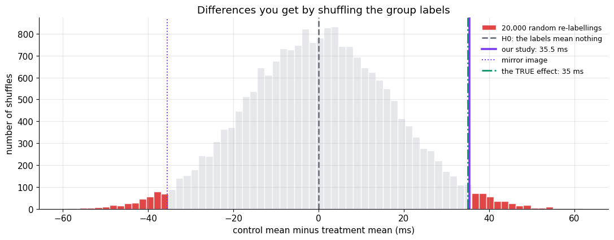

### Cell 166

```python
# ============================================================
#  6.2  Same experiment, two analyses: unpaired vs paired.
# ============================================================
rng_pair = np.random.default_rng(707)

N_SUBJ       = 30
WITHIN_GAIN  = 14.0    # the nudge really does save this many ms, per person
MEASURE_NOISE = 10.0   # each individual measurement is noisy by this much

baseline = rng_pair.choice(POP, N_SUBJ, replace=False)      # who is fast or slow
before   = baseline + rng_pair.normal(0, MEASURE_NOISE, N_SUBJ)
after    = baseline - WITHIN_GAIN + rng_pair.normal(0, MEASURE_NOISE, N_SUBJ)
gains    = before - after

p_unpaired = stats.ttest_ind(before, after, equal_var=False).pvalue
p_paired   = stats.ttest_rel(before, after).pvalue
p_paired_1samp = stats.ttest_1samp(gains, 0.0).pvalue

print(f"person-to-person spread (sd of 'before') : {before.std(ddof=1):7.2f} ms")
print(f"spread of the per-person CHANGES         : {gains.std(ddof=1):7.2f} ms  "
      f"<- far smaller")
print(f"mean change                              : {gains.mean():7.2f} ms  "
      f"(truth: {WITHIN_GAIN:.0f} ms)")
print()
print(f"  UNPAIRED test (throws the pairing away) : p = {p_unpaired:.6f}   "
      f"{'significant' if p_unpaired < 0.05 else 'NOT significant -- effect MISSED'}")
print(f"  PAIRED test   (uses it)                 : p = {p_paired:.3e}   "
      f"{'significant -- effect FOUND' if p_paired < 0.05 else 'not significant'}")
print()
print(f"  paired t-test == one-sample t-test on the changes: "
      f"p = {p_paired_1samp:.3e}  (identical)")
print()
print("Same 60 measurements. Same real effect. Opposite conclusions.")
print("The difference is entirely in the DESIGN, not in the data collection.")

fig, (ax1, ax2) = plt.subplots(1, 2, figsize=(12, 4.4))

for b, a in zip(before, after):
    ax1.plot([0, 1], [b, a], "-o", color=C_GREY, alpha=0.45, ms=4, lw=1.2)
ax1.plot([0, 1], [before.mean(), after.mean()], "-o", color=C_SLOPE, lw=3, ms=9,
         label="group means")
ax1.set_xticks([0, 1]); ax1.set_xticklabels(["before", "after"])
ax1.set_xlim(-0.25, 1.25)
ax1.set_ylabel("reaction time (ms)")
ax1.set_title("Each line is one person -- look how spread out they are")
ax1.legend(frameon=False)

ax2.hist(gains, bins=12, color=C_AREA, alpha=0.85, edgecolor="white")
ax2.axvline(0, color=C_GREY, lw=2.2, ls="--", label="H0: no change")
ax2.axvline(gains.mean(), color=C_SLOPE, lw=2.6,
            label=f"mean change {gains.mean():.1f} ms")
ax2.set_xlabel("that person's change, before minus after (ms)")
ax2.set_ylabel("people")
ax2.set_title("The same data, one number per person")
ax2.legend(frameon=False, fontsize=9)

fig.tight_layout(); plt.show()
```

**Output**

```text
person-to-person spread (sd of 'before') :   84.54 ms
spread of the per-person CHANGES         :   14.23 ms  <- far smaller
mean change                              :   17.98 ms  (truth: 14 ms)

  UNPAIRED test (throws the pairing away) : p = 0.406645   NOT significant -- effect MISSED
  PAIRED test   (uses it)                 : p = 1.328e-07   significant -- effect FOUND

  paired t-test == one-sample t-test on the changes: p = 1.328e-07  (identical)

Same 60 measurements. Same real effect. Opposite conclusions.
The difference is entirely in the DESIGN, not in the data collection.
```

**Output**

```text
<Figure size 1200x440 with 2 Axes>
```

**Figure**

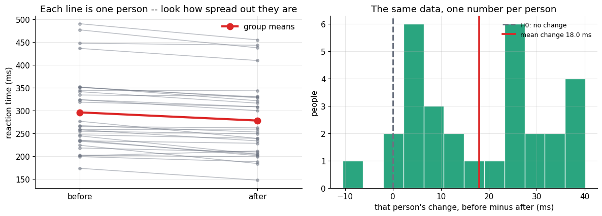

### Cell 170

```python
# ============================================================
#  6.3  Both groups have the SAME true mean. Every rejection is wrong.
# ============================================================
rng_w = np.random.default_rng(808)
NSIM_W = 20_000

# Same mean as POP, same shape, three times the spread.
POP_WIDE = POP_MU + 3.0 * (POP - POP_MU)
print(f"narrow population: mean {POP.mean():.2f}, sd {POP.std(ddof=0):.2f}")
print(f"wide   population: mean {POP_WIDE.mean():.2f}, sd {POP_WIDE.std(ddof=0):.2f}")
print("Identical means -- so H0 is TRUE and every rejection is a false alarm.\n")

N_SMALL_G, N_BIG_G = 10, 50

print(f"{'setup':<44}{'Student':>10}{'Welch':>10}")
print("-" * 64)
for label, small_pop, big_pop in (
        ("small group is the WIDE one  (10 wide vs 50 narrow)", POP_WIDE, POP),
        ("small group is the NARROW one (10 narrow vs 50 wide)", POP, POP_WIDE)):
    a = small_pop[rng_w.integers(0, len(small_pop), (NSIM_W, N_SMALL_G))]
    b = big_pop[rng_w.integers(0, len(big_pop),   (NSIM_W, N_BIG_G))]
    ps = stats.ttest_ind(a, b, axis=1, equal_var=True).pvalue
    pw = stats.ttest_ind(a, b, axis=1, equal_var=False).pvalue
    print(f"{label:<44}{np.mean(ps < 0.05):>10.3f}{np.mean(pw < 0.05):>10.3f}")

print()
print("Both rows should read 0.050 in both columns. Welch does. Student does not:")
print("it is wildly too eager in one direction and far too timid in the other,")
print("and which one you get depends on an accident of which group was bigger.")
```

**Output**

```text
narrow population: mean 290.99, sd 83.01
wide   population: mean 290.99, sd 249.04
Identical means -- so H0 is TRUE and every rejection is a false alarm.

setup                                          Student     Welch
----------------------------------------------------------------
small group is the WIDE one  (10 wide vs 50 narrow)     0.292     0.057
small group is the NARROW one (10 narrow vs 50 wide)     0.001     0.051

Both rows should read 0.050 in both columns. Welch does. Student does not:
it is wildly too eager in one direction and far too timid in the other,
and which one you get depends on an accident of which group was bigger.
```

### Cell 174

```python
# ============================================================
#  6.4  Cohen's d for our study -- and then the demonstration
#       that matters: a TRIVIAL effect made "highly significant"
#       purely by collecting a lot of data.
# ============================================================
s_pooled = np.sqrt((ctrl.var(ddof=1) + treat.var(ddof=1)) / 2)
d_obs    = diff / s_pooled
d_true   = TRUE_EFFECT / POP.std(ddof=0)

print("OUR STUDY")
print(f"  difference      = {diff:.2f} ms")
print(f"  pooled sd       = {s_pooled:.2f} ms")
print(f"  Cohen's d       = {d_obs:.3f}   (true value {d_true:.3f})")
print(f"  p               = {p_wel:.4f}")
print(f"  -> a real, statistically detectable, but SMALL effect: {d_obs:.2f} of "
      f"one standard deviation.")
print()

# ---- now: a 2 ms difference. Nobody could care. Watch p collapse. ----
rng_big = np.random.default_rng(909)
TINY = 2.0                       # two milliseconds. Truly irrelevant.
grid = [(100, 200), (1_000, 200), (10_000, 100), (100_000, 30), (1_000_000, 4)]

print(f"A TRIVIAL {TINY:.0f} ms DIFFERENCE, MEASURED HARDER AND HARDER")
print(f"{'n per group':>13}  {'median p':>12}  {'median d':>10}   verdict at 0.05")
print("-" * 62)
ns_big, ps_big, ds_big = [], [], []
for n, reps in grid:
    pv, dv = [], []
    for _ in range(reps):
        x = POP[rng_big.integers(0, len(POP), n)]
        y = POP[rng_big.integers(0, len(POP), n)] - TINY
        pv.append(stats.ttest_ind(x, y, equal_var=False).pvalue)
        sp = np.sqrt((x.var(ddof=1) + y.var(ddof=1)) / 2)
        dv.append((x.mean() - y.mean()) / sp)
    mp, mdd = float(np.median(pv)), float(np.median(dv))
    ns_big.append(n); ps_big.append(mp); ds_big.append(mdd)
    print(f"{n:>13,}  {mp:>12.3g}  {mdd:>10.4f}   "
          f"{'SIGNIFICANT' if mp < 0.05 else 'not significant'}")

print()
print(f"p travels from {ps_big[0]:.3g} down to {ps_big[-1]:.3g}.")
print(f"d never moves: it stays around {np.median(ds_big):.3f} -- negligible, which "
      f"is the truth.")
print("Same two-millisecond world throughout. Only the budget changed.")

fig, (ax1, ax2) = plt.subplots(1, 2, figsize=(12, 4.3))
ax1.plot(ns_big, ps_big, "o-", color=C_SLOPE, lw=2.2)
ax1.axhline(0.05, color=C_GREY, ls="--", lw=1.8, label="0.05")
ax1.set_xscale("log"); ax1.set_yscale("log")
ax1.set_title("p-value vs sample size (effect fixed at 2 ms)")
ax1.set_xlabel("n per group (log)"); ax1.set_ylabel("median p (log)")
ax1.legend(frameon=False)

ax2.plot(ns_big, np.abs(ds_big), "o-", color=C_AREA, lw=2.2, label="measured d")
ax2.axhline(TINY / POP.std(ddof=0), color=C_EXACT, ls="--", lw=1.8,
            label="true d")
ax2.axhline(0.2, color=C_GREY, ls=":", lw=1.8, label="0.2 = 'small'")
ax2.set_xscale("log"); ax2.set_ylim(0, 0.25)
ax2.set_title("Cohen's d vs sample size (same data)")
ax2.set_xlabel("n per group (log)"); ax2.set_ylabel("effect size d")
ax2.legend(frameon=False, fontsize=9)

fig.tight_layout(); plt.show()
```

**Output**

```text
OUR STUDY
  difference      = 35.46 ms
  pooled sd       = 91.94 ms
  Cohen's d       = 0.386   (true value 0.422)
  p               = 0.0368
  -> a real, statistically detectable, but SMALL effect: 0.39 of one standard deviation.

A TRIVIAL 2 ms DIFFERENCE, MEASURED HARDER AND HARDER
  n per group      median p    median d   verdict at 0.05
--------------------------------------------------------------
          100         0.518      0.0260   not significant
        1,000         0.408      0.0275   not significant
       10,000        0.0993      0.0233   not significant
      100,000      5.47e-07      0.0224   SIGNIFICANT
    1,000,000      4.66e-58      0.0235   SIGNIFICANT

p travels from 0.518 down to 4.66e-58.
d never moves: it stays around 0.024 -- negligible, which is the truth.
Same two-millisecond world throughout. Only the budget changed.
```

**Output**

```text
<Figure size 1200x430 with 2 Axes>
```

**Figure**

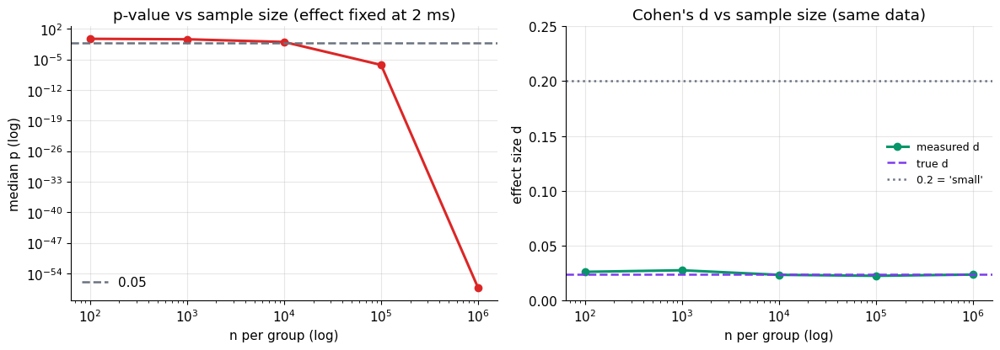

### Cell 177

```python
# ============================================================
#  6.5  The interval on the difference -- what you should
#       actually be reporting. Built exactly as in Part 4,
#       but around the DIFFERENCE instead of a single mean.
# ============================================================
dof   = 2 * N_GROUP - 2
t_crit = stats.t.ppf(0.975, dof)
lo, hi = diff - t_crit * se_diff, diff + t_crit * se_diff

print(f"observed difference : {diff:.2f} ms")
print(f"95% CI              : [{lo:.2f}, {hi:.2f}] ms   (width {hi - lo:.1f} ms)")
print(f"true difference     : {TRUE_EFFECT:.2f} ms -> "
      f"{'INSIDE the interval' if lo <= TRUE_EFFECT <= hi else 'OUTSIDE'}")
print(f"does the interval exclude zero? {'yes' if lo > 0 else 'no'}  "
      f"(equivalent to p < 0.05: {p_wel < 0.05})")
print()

# Does the interval keep its 95% promise? Build 5,000 of them and count.
rng_ci = np.random.default_rng(1111)
NSIM_CI = 5_000
A = POP_CTRL[rng_ci.integers(0, len(POP_CTRL),  (NSIM_CI, N_GROUP))]
B = POP_TREAT[rng_ci.integers(0, len(POP_TREAT), (NSIM_CI, N_GROUP))]
dd  = A.mean(axis=1) - B.mean(axis=1)
sed = np.sqrt(A.var(axis=1, ddof=1) / N_GROUP + B.var(axis=1, ddof=1) / N_GROUP)
los, his = dd - t_crit * sed, dd + t_crit * sed

print(f"built {NSIM_CI:,} such intervals from fresh studies:")
print(f"  contained the true {TRUE_EFFECT:.0f} ms : {np.mean((los <= TRUE_EFFECT) & (TRUE_EFFECT <= his)):.1%}"
      f"   (promised 95%)")
print(f"  excluded zero (i.e. p < 0.05)  : {np.mean(los > 0):.1%}"
      f"   <- this is the POWER of the study")
print(f"  average width                  : {np.mean(his - los):.1f} ms")
print()
print("Read that width. Even when this study 'works', it pins the effect down")
print("only to within tens of milliseconds. A p-value would never have told you.")
print()

# ---- the same interval, on a model comparison --------------------------
# Accuracy is a proportion: SE = sqrt(a(1-a)/rows). Two models scored on the
# SAME rows, compared the crude way (as if the test sets were independent).
ACC_A, ACC_B, ROWS = 0.934, 0.931, 2_000
se_pair = np.sqrt(ACC_A * (1 - ACC_A) / ROWS + ACC_B * (1 - ACC_B) / ROWS)
gap     = ACC_A - ACC_B
z       = 1.96
print(f"MODEL COMPARISON: {ACC_A:.1%} vs {ACC_B:.1%} on {ROWS:,} test rows")
print(f"  observed gap : {100 * gap:+.2f} points")
print(f"  SE of the gap: {100 * se_pair:.2f} points")
print(f"  95% CI       : [{100 * (gap - z * se_pair):+.2f}, "
      f"{100 * (gap + z * se_pair):+.2f}] points -> "
      f"{'excludes' if gap - z * se_pair > 0 else 'comfortably includes'} zero")
print("  So that 0.3-point 'win' is indistinguishable from a coin flip.")
```

**Output**

```text
observed difference : 35.46 ms
95% CI              : [2.22, 68.70] ms   (width 66.5 ms)
true difference     : 35.00 ms -> INSIDE the interval
does the interval exclude zero? yes  (equivalent to p < 0.05: True)

built 5,000 such intervals from fresh studies:
  contained the true 35 ms : 95.5%   (promised 95%)
  excluded zero (i.e. p < 0.05)  : 64.3%   <- this is the POWER of the study
  average width                  : 59.9 ms

Read that width. Even when this study 'works', it pins the effect down
only to within tens of milliseconds. A p-value would never have told you.

MODEL COMPARISON: 93.4% vs 93.1% on 2,000 test rows
  observed gap : +0.30 points
  SE of the gap: 0.79 points
  95% CI       : [-1.25, +1.85] points -> comfortably includes zero
  So that 0.3-point 'win' is indistinguishable from a coin flip.
```

### Cell 180

```python
# ============================================================
#  6.6  Three tests, one dataset -- plus what happens at tiny n
#       with a long tail, which is where the choice starts to matter.
# ============================================================
u_stat, p_mw = stats.mannwhitneyu(ctrl, treat, alternative="two-sided")

print("OUR STUDY (n = 60 per group, CLT comfortably in charge)")
print(f"  Welch t-test  : p = {p_wel:.4f}")
print(f"  permutation   : p = {p_perm:.4f}")
print(f"  Mann-Whitney  : p = {p_mw:.4f}")
print()
print("  The two mean-based tests are all but identical. Mann-Whitney lands in")
print("  the same neighbourhood but not on the same side of 0.05 -- it is")
print("  answering a question about ranks, not about means, and it discards the")
print("  actual millisecond values in the process. A good reminder that 'p < .05'")
print("  is a line drawn across a continuum, not a fact about the world.\n")

# Now the regime where it does matter: tiny groups, heavy tail, H0 TRUE.
rng_mw = np.random.default_rng(1313)
POP_HEAVY = POP_MU + (POP - POP_MU) ** 3 / POP.std(ddof=0) ** 2   # much longer tail
POP_HEAVY = POP_HEAVY - POP_HEAVY.mean() + POP_MU

NSIM_MW, N_TINY = 10_000, 8
X = POP_HEAVY[rng_mw.integers(0, len(POP_HEAVY), (NSIM_MW, N_TINY))]
Y = POP_HEAVY[rng_mw.integers(0, len(POP_HEAVY), (NSIM_MW, N_TINY))]

p_t  = stats.ttest_ind(X, Y, axis=1, equal_var=False).pvalue
p_u  = stats.mannwhitneyu(X, Y, axis=1, alternative="two-sided").pvalue

print(f"H0 TRUE by construction; {N_TINY} per group from a very heavy-tailed "
      f"population.")
print(f"Both tests promise a 5% false-alarm rate. Over {NSIM_MW:,} studies:")
print(f"  Welch t-test  false alarms : {np.mean(p_t < 0.05):.3f}")
print(f"  Mann-Whitney  false alarms : {np.mean(p_u < 0.05):.3f}")
print()
print("Neither is a disaster here, but the rank test is the steadier of the two")
print("when the tail is long and n is small -- which is exactly the situation it")
print("was invented for. At n = 60 above, the distinction had vanished.")
```

**Output**

```text
OUR STUDY (n = 60 per group, CLT comfortably in charge)
  Welch t-test  : p = 0.0368
  permutation   : p = 0.0370
  Mann-Whitney  : p = 0.0578

  The two mean-based tests are all but identical. Mann-Whitney lands in
  the same neighbourhood but not on the same side of 0.05 -- it is
  answering a question about ranks, not about means, and it discards the
  actual millisecond values in the process. A good reminder that 'p < .05'
  is a line drawn across a continuum, not a fact about the world.

H0 TRUE by construction; 8 per group from a very heavy-tailed population.
Both tests promise a 5% false-alarm rate. Over 10,000 studies:
  Welch t-test  false alarms : 0.013
  Mann-Whitney  false alarms : 0.038

Neither is a disaster here, but the rank test is the steadier of the two
when the tail is long and n is small -- which is exactly the situation it
was invented for. At n = 60 above, the distinction had vanished.
```

### Cell 182

```python
# ============================================================
#  6.7  k identical groups. Every finding is a false finding.
# ============================================================
import itertools

rng_mc = np.random.default_rng(1010)
N_EXP, N_EACH = 4_000, 30

print(f"{N_EXP:,} experiments. In each, k groups of {N_EACH} drawn from the "
      f"SAME population,")
print("so every true difference is exactly zero and every 'discovery' is false.\n")
print(f"{'k groups':>9}{'pairwise tests':>16}{'P(at least one p<0.05)':>26}"
      f"{'if independent':>17}")
print("-" * 70)
for k in (2, 3, 4, 5, 6, 8, 10):
    G = POP[rng_mc.integers(0, len(POP), (N_EXP, k, N_EACH))]
    any_sig = np.zeros(N_EXP, dtype=bool)
    for i, j in itertools.combinations(range(k), 2):
        any_sig |= stats.ttest_ind(G[:, i, :], G[:, j, :], axis=1,
                                   equal_var=False).pvalue < 0.05
    m = k * (k - 1) // 2
    print(f"{k:>9}{m:>16}{any_sig.mean():>26.3f}{1 - 0.95 ** m:>17.3f}")

print()
print("With ten identical groups you will 'find' something most of the time,")
print("having done nothing wrong except run the obvious analysis.")
print("The measured rate sits below the independent-tests column because")
print("pairwise comparisons share groups, so their errors are correlated.")
print()
print("The fixes -- Bonferroni, Holm, false discovery rate, and running a")
print("single omnibus test first -- belong to Part 8, which is entirely")
print("about the ways a well-intentioned analysis goes wrong.")
```

**Output**

```text
4,000 experiments. In each, k groups of 30 drawn from the SAME population,
so every true difference is exactly zero and every 'discovery' is false.

 k groups  pairwise tests    P(at least one p<0.05)   if independent
----------------------------------------------------------------------
        2               1                     0.044            0.050
        3               3                     0.114            0.143
        4               6                     0.203            0.265
        5              10                     0.285            0.401
        6              15                     0.364            0.537
        8              28                     0.509            0.762
       10              45                     0.626            0.901

With ten identical groups you will 'find' something most of the time,
having done nothing wrong except run the obvious analysis.
The measured rate sits below the independent-tests column because
pairwise comparisons share groups, so their errors are correlated.

The fixes -- Bonferroni, Holm, false discovery rate, and running a
single omnibus test first -- belong to Part 8, which is entirely
about the ways a well-intentioned analysis goes wrong.
```

### Cell 187

```python
# ============================================================
#  Part 7's dataset: sleep (hours) vs reaction time (ms).
#  We build it, so we know the truth every fit below is chasing.
# ============================================================
import numpy as np
import matplotlib.pyplot as plt
from scipy import stats

RNG7 = np.random.default_rng(707)

N7         = 80
TRUE_SLOPE = -22.0     # ms of reaction time per extra hour of sleep
TRUE_INTER = 430.0     # ms at zero hours -- far outside the data (see 7.7)
NOISE_SD   = 18.0

sleep = RNG7.uniform(4.0, 9.0, N7)
rt    = TRUE_INTER + TRUE_SLOPE * sleep + RNG7.normal(0, NOISE_SD, N7)

# ---- Pearson's r, by hand, straight from the formula above ----
dx, dy = sleep - sleep.mean(), rt - rt.mean()
r_hand = (dx * dy).sum() / np.sqrt((dx ** 2).sum() * (dy ** 2).sum())

r_numpy = np.corrcoef(sleep, rt)[0, 1]
r_scipy = stats.pearsonr(sleep, rt).statistic

fig, ax = plt.subplots(figsize=(7.2, 4.6))
ax.scatter(sleep, rt, s=34, color=C_F, alpha=0.8, edgecolor="white")
ax.set_xlabel("hours of sleep"); ax.set_ylabel("reaction time (ms)")
ax.set_title(f"80 people      r = {r_hand:+.3f}")
plt.show()

print(f"r by hand (formula) = {r_hand:+.6f}")
print(f"r from np.corrcoef  = {r_numpy:+.6f}")
print(f"r from scipy        = {r_scipy:+.6f}")
print(f"all three agree     = {np.allclose([r_hand, r_numpy], r_scipy)}")
print()
print(f"r squared           = {r_hand ** 2:.4f}   <- we meet this again in 7.5")
```

**Output**

```text
<Figure size 720x460 with 1 Axes>
```

**Figure**

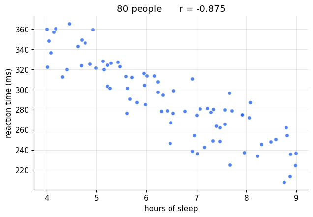

**Output**

```text
r by hand (formula) = -0.875146
r from np.corrcoef  = -0.875146
r from scipy        = -0.875146
all three agree     = True

r squared           = 0.7659   <- we meet this again in 7.5
```

### Cell 191

```python
# ============================================================
#  Four datasets. Look at the pictures BEFORE reading the r values.
# ============================================================
rng = np.random.default_rng(71)

# A: an honest linear relationship
xa = rng.uniform(0, 10, 60);  ya = 2.0 * xa + rng.normal(0, 3.0, 60)

# B: a near-perfect, deterministic relationship -- but a curved one
xb = rng.uniform(-5, 5, 60);  yb = xb ** 2 + rng.normal(0, 0.8, 60)

# C: no relationship at all, plus ONE far-away point
xc = np.concatenate([rng.uniform(0, 3, 59), [18.0]])
yc = np.concatenate([rng.normal(0, 1, 59), [36.0]])

# D: two separate clusters, no relationship inside either one
xd = np.concatenate([rng.normal(0, 1, 30), rng.normal(9, 1, 30)])
yd = np.concatenate([rng.normal(0, 1, 30), rng.normal(9, 1, 30)])

sets = [("A  linear", xa, ya), ("B  perfect but curved", xb, yb),
        ("C  one outlier", xc, yc), ("D  two clusters", xd, yd)]

fig, axes = plt.subplots(1, 4, figsize=(15, 3.6))
for ax, (name, x, y) in zip(axes, sets):
    rr = np.corrcoef(x, y)[0, 1]
    ax.scatter(x, y, s=26, color=C_F, alpha=0.8, edgecolor="white")
    ax.set_title(f"{name}\nr = {rr:+.3f}", fontsize=10)
    ax.set_xticks([]); ax.set_yticks([])
fig.tight_layout(); plt.show()

for name, x, y in sets:
    print(f"{name:24s} r = {np.corrcoef(x, y)[0, 1]:+.3f}")

print()
print(f"C with that one outlier removed    r = {np.corrcoef(xc[:-1], yc[:-1])[0, 1]:+.3f}")
print(f"D inside the left cluster only     r = {np.corrcoef(xd[:30], yd[:30])[0, 1]:+.3f}")
print(f"D inside the right cluster only    r = {np.corrcoef(xd[30:], yd[30:])[0, 1]:+.3f}")
```

**Output**

```text
<Figure size 1500x360 with 4 Axes>
```

**Figure**

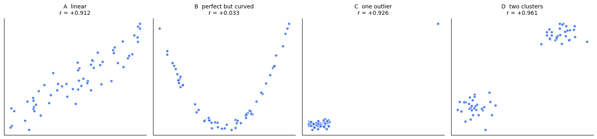

**Output**

```text
A  linear                r = +0.912
B  perfect but curved    r = +0.033
C  one outlier           r = +0.926
D  two clusters          r = +0.961

C with that one outlier removed    r = +0.164
D inside the left cluster only     r = -0.024
D inside the right cluster only    r = +0.154
```

### Cell 196

```python
# ============================================================
#  The derivation, implemented literally, then checked four ways.
# ============================================================
def fit_line_from_derivation(x, y):
    """Slope and intercept, straight from the boxed formulas in 7.2."""
    xbar, ybar = x.mean(), y.mean()
    Sxy = ((x - xbar) * (y - ybar)).sum()
    Sxx = ((x - xbar) ** 2).sum()
    b = Sxy / Sxx                 # Step 3
    a = ybar - b * xbar           # Step 1
    return a, b

a_hand, b_hand = fit_line_from_derivation(sleep, rt)

# check 1 -- numpy's own least-squares fit
b_np, a_np = np.polyfit(sleep, rt, 1)

# check 2 -- the  b = r * (sy/sx)  identity from Step 4
b_via_r = r_hand * rt.std(ddof=1) / sleep.std(ddof=1)

# check 3 -- both derivative conditions really are zero at (a_hand, b_hand)
resid  = rt - (a_hand + b_hand * sleep)
cond_a = resid.sum()               # dSSE/da = 0  ->  residuals sum to zero
cond_b = (sleep * resid).sum()     # dSSE/db = 0  ->  x . residuals = zero

# check 4 -- is it really the MINIMUM? rotate the line and watch SSE rise.
def sse(a, b):
    return ((rt - a - b * sleep) ** 2).sum()

base = sse(a_hand, b_hand)

fig, ax = plt.subplots(figsize=(7.6, 4.8))
grid = np.linspace(sleep.min() - 0.2, sleep.max() + 0.2, 50)
for db in (-4, -2, 2, 4):
    a_alt = a_hand - db * sleep.mean()        # rotate about (x-bar, y-bar)
    ax.plot(grid, a_alt + (b_hand + db) * grid, color=C_SOFT, lw=1.6, zorder=1)
ax.scatter(sleep, rt, s=34, color=C_F, alpha=0.8, edgecolor="white", zorder=2)
ax.plot(grid, a_hand + b_hand * grid, color=C_SLOPE, lw=2.6, zorder=3,
        label=f"least squares: y = {a_hand:.1f} + ({b_hand:.2f}) x")
ax.scatter([sleep.mean()], [rt.mean()], s=150, marker="X", color=C_EXACT,
           zorder=4, label="the point (x-bar, y-bar)")
ax.set_xlabel("hours of sleep"); ax.set_ylabel("reaction time (ms)")
ax.set_title("The fitted line, and four rivals rotated about the centre")
ax.legend(frameon=False, fontsize=9)
plt.show()

print(f"from the derivation :  a = {a_hand:9.4f}   b = {b_hand:8.4f}")
print(f"from np.polyfit     :  a = {a_np:9.4f}   b = {b_np:8.4f}")
print(f"from  r * sy/sx     :                b = {b_via_r:8.4f}")
print(f"identical?             {np.allclose([a_hand, b_hand], [a_np, b_np])} "
      f"and {np.isclose(b_hand, b_via_r)}")
print()
print(f"dSSE/da condition   :  sum(residuals)   = {cond_a:+.3e}   (want 0)")
print(f"dSSE/db condition   :  sum(x*residuals) = {cond_b:+.3e}   (want 0)")
print()
print(f"SSE at the least-squares fit      = {base:12.2f}")
for db in (-4, -2, 2, 4):
    a_alt = a_hand - db * sleep.mean()
    alt = sse(a_alt, b_hand + db)
    print(f"SSE with slope {b_hand + db:+7.2f}           = {alt:12.2f}"
          f"   ({alt / base:5.2f}x worse)")
print()
print(f"true slope used to build the data  = {TRUE_SLOPE:.2f}")
print(f"slope estimated from 80 people     = {b_hand:.2f}   "
      f"(off by {b_hand - TRUE_SLOPE:+.2f})")
```

**Output**

```text
<Figure size 760x480 with 1 Axes>
```

**Figure**

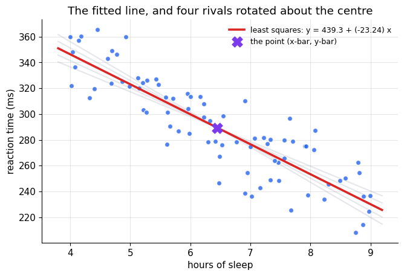

**Output**

```text
from the derivation :  a =  439.2916   b = -23.2430
from np.polyfit     :  a =  439.2916   b = -23.2430
from  r * sy/sx     :                b = -23.2430
identical?             True and True

dSSE/da condition   :  sum(residuals)   = +2.728e-12   (want 0)
dSSE/db condition   :  sum(x*residuals) = +1.728e-11   (want 0)

SSE at the least-squares fit      =     27266.17
SSE with slope  -27.24           =     29907.86   ( 1.10x worse)
SSE with slope  -25.24           =     27926.59   ( 1.02x worse)
SSE with slope  -21.24           =     27926.59   ( 1.02x worse)
SSE with slope  -19.24           =     29907.86   ( 1.10x worse)

true slope used to build the data  = -22.00
slope estimated from 80 people     = -23.24   (off by -1.24)
```

### Cell 199

```python
# ============================================================
#  Say it in units, with every number computed rather than typed.
# ============================================================
lo, hi = sleep.min(), sleep.max()

print("THE INTERPRETATION SENTENCE")
print("-" * 68)
print(f"Each additional hour of sleep is ASSOCIATED WITH a change of")
print(f"{b_hand:+.2f} ms in reaction time, among people sleeping between")
print(f"{lo:.1f} and {hi:.1f} hours.")
print("-" * 68)
print()
print("Rescaled, because 'per hour' is not always the useful unit:")
print(f"  per extra hour        : {b_hand:+8.2f} ms")
print(f"  per extra 30 minutes  : {b_hand * 0.5:+8.2f} ms")
print(f"  per extra 2 hours     : {b_hand * 2.0:+8.2f} ms")
print()
print("The intercept, and why it is usually meaningless here:")
print(f"  a = {a_hand:.2f} ms is the prediction at sleep = 0 hours,")
print(f"  which is {lo:.1f} hours below anything we observed. It is a")
print(f"  bookkeeping number that positions the line, not a finding.")
print()
print("Predictions INSIDE the data, which are the honest kind:")
for s in (5.0, 6.5, 8.0):
    print(f"  sleep = {s:.1f} h  ->  predicted reaction time "
          f"= {a_hand + b_hand * s:.1f} ms")
```

**Output**

```text
THE INTERPRETATION SENTENCE
--------------------------------------------------------------------
Each additional hour of sleep is ASSOCIATED WITH a change of
-23.24 ms in reaction time, among people sleeping between
4.0 and 9.0 hours.
--------------------------------------------------------------------

Rescaled, because 'per hour' is not always the useful unit:
  per extra hour        :   -23.24 ms
  per extra 30 minutes  :   -11.62 ms
  per extra 2 hours     :   -46.49 ms

The intercept, and why it is usually meaningless here:
  a = 439.29 ms is the prediction at sleep = 0 hours,
  which is 4.0 hours below anything we observed. It is a
  bookkeeping number that positions the line, not a finding.

Predictions INSIDE the data, which are the honest kind:
  sleep = 5.0 h  ->  predicted reaction time = 323.1 ms
  sleep = 6.5 h  ->  predicted reaction time = 288.2 ms
  sleep = 8.0 h  ->  predicted reaction time = 253.3 ms
```

### Cell 201

```python
# ============================================================
#  Same fitting procedure, two datasets. One is a line plus noise.
#  The other is genuinely CURVED -- and we fit a straight line anyway.
# ============================================================
rngc = np.random.default_rng(7411)

# LEFT: our sleep data -- honestly linear.
fit_ok = fit_line_from_derivation(sleep, rt)
res_ok = rt - (fit_ok[0] + fit_ok[1] * sleep)

# RIGHT: dose vs response, genuinely quadratic. A straight line forced on it.
dose = rngc.uniform(0, 10, 80)
resp = 5.0 + 1.5 * dose + 0.85 * dose ** 2 + rngc.normal(0, 4.0, 80)
fit_bad = fit_line_from_derivation(dose, resp)
res_bad = resp - (fit_bad[0] + fit_bad[1] * dose)

def r_squared(y, e):
    return 1 - (e ** 2).sum() / ((y - y.mean()) ** 2).sum()

fig, axes = plt.subplots(2, 2, figsize=(12, 7))

axes[0, 0].scatter(sleep, rt, s=26, color=C_F, alpha=0.8, edgecolor="white")
gg = np.linspace(sleep.min(), sleep.max(), 40)
axes[0, 0].plot(gg, fit_ok[0] + fit_ok[1] * gg, color=C_SLOPE, lw=2.4)
axes[0, 0].set_title(f"WELL BEHAVED   R-squared = {r_squared(rt, res_ok):.3f}")
axes[0, 0].set_xlabel("hours of sleep"); axes[0, 0].set_ylabel("reaction time (ms)")

axes[0, 1].scatter(dose, resp, s=26, color=C_APPROX, alpha=0.8, edgecolor="white")
gd = np.linspace(dose.min(), dose.max(), 40)
axes[0, 1].plot(gd, fit_bad[0] + fit_bad[1] * gd, color=C_SLOPE, lw=2.4)
axes[0, 1].set_title(f"WRONG MODEL    R-squared = {r_squared(resp, res_bad):.3f}")
axes[0, 1].set_xlabel("dose"); axes[0, 1].set_ylabel("response")

axes[1, 0].axhline(0, color=C_GREY, lw=1.4, ls="--")
axes[1, 0].scatter(sleep, res_ok, s=26, color=C_F, alpha=0.8, edgecolor="white")
axes[1, 0].set_title("residuals: a formless band -- good")
axes[1, 0].set_xlabel("hours of sleep"); axes[1, 0].set_ylabel("residual (ms)")

axes[1, 1].axhline(0, color=C_GREY, lw=1.4, ls="--")
axes[1, 1].scatter(dose, res_bad, s=26, color=C_APPROX, alpha=0.8, edgecolor="white")
axes[1, 1].set_title("residuals: an unmistakable smile -- bad")
axes[1, 1].set_xlabel("dose"); axes[1, 1].set_ylabel("residual")

fig.tight_layout(); plt.show()

print(f"LEFT  (linear data, right model) : R-squared = {r_squared(rt, res_ok):.3f}")
print(f"RIGHT (curved data, wrong model) : R-squared = {r_squared(resp, res_bad):.3f}   <-- HIGHER")
print()
print("The higher R-squared belongs to the WRONG model. A single goodness number")
print("cannot tell you the SHAPE is wrong; the residual plot says it at a glance.")
print()
print("Turning the smile into a number -- correlation of residual with x squared:")
print(f"  well behaved : {np.corrcoef(res_ok, sleep ** 2)[0, 1]:+.3f}")
print(f"  wrong model  : {np.corrcoef(res_bad, dose ** 2)[0, 1]:+.3f}")
```

**Output**

```text
<Figure size 1200x700 with 4 Axes>
```

**Figure**

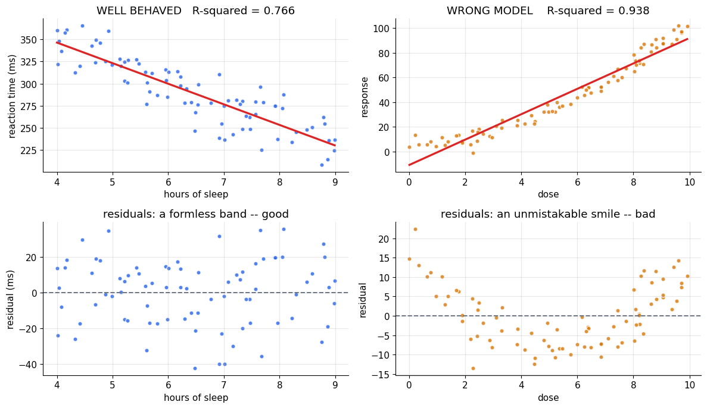

**Output**

```text
LEFT  (linear data, right model) : R-squared = 0.766
RIGHT (curved data, wrong model) : R-squared = 0.938   <-- HIGHER

The higher R-squared belongs to the WRONG model. A single goodness number
cannot tell you the SHAPE is wrong; the residual plot says it at a glance.

Turning the smile into a number -- correlation of residual with x squared:
  well behaved : +0.016
  wrong model  : +0.195
```

### Cell 204

```python
# ============================================================
#  R-squared by hand, three routes, on the sleep data.
# ============================================================
y_hat = a_hand + b_hand * sleep
SSE   = ((rt - y_hat) ** 2).sum()
SST   = ((rt - rt.mean()) ** 2).sum()
SSR   = ((y_hat - rt.mean()) ** 2).sum()      # the part the line explains

R2_hand = 1 - SSE / SST
R2_frac = SSR / SST
R2_r2   = r_hand ** 2

print(f"SST  (total variation)      = {SST:12.2f}")
print(f"SSR  (explained by line)    = {SSR:12.2f}")
print(f"SSE  (left over)            = {SSE:12.2f}")
print(f"SSR + SSE                   = {SSR + SSE:12.2f}   (equals SST? "
      f"{np.isclose(SSR + SSE, SST)})")
print()
print(f"R-squared = 1 - SSE/SST     = {R2_hand:.6f}")
print(f"R-squared = SSR/SST         = {R2_frac:.6f}")
print(f"R-squared = r * r           = {R2_r2:.6f}")
print(f"all three agree             = {np.allclose([R2_hand, R2_frac], R2_r2)}")
print()
print(f"So the line accounts for {100 * R2_hand:.1f}% of the variation in reaction")
print(f"time, and {100 * (1 - R2_hand):.1f}% is variation between people that sleep")
print("does not touch at all.")
```

**Output**

```text
SST  (total variation)      =    116462.45
SSR  (explained by line)    =     89196.27
SSE  (left over)            =     27266.17
SSR + SSE                   =    116462.45   (equals SST? True)

R-squared = 1 - SSE/SST     = 0.765880
R-squared = SSR/SST         = 0.765880
R-squared = r * r           = 0.765880
all three agree             = True

So the line accounts for 76.6% of the variation in reaction
time, and 23.4% is variation between people that sleep
does not touch at all.
```

### Cell 206

```python
# ============================================================
#  Now break it. Add columns of PURE NOISE and watch R-squared climb.
#  The noise is generated with no reference to rt whatsoever. It cannot
#  contain information about reaction time. R-squared rises anyway.
# ============================================================
rngn = np.random.default_rng(7555)

def r2_multi(X, y):
    """R-squared of the least-squares fit of y on design matrix X."""
    beta, *_ = np.linalg.lstsq(X, y, rcond=None)
    e = y - X @ beta
    return 1 - (e ** 2).sum() / ((y - y.mean()) ** 2).sum()

MAX_JUNK = 60                                       # against N7 = 80 rows
junk     = rngn.normal(0, 1, size=(N7, MAX_JUNK))   # nothing to do with rt

ks, r2s, adj = [], [], []
for k in range(0, MAX_JUNK + 1, 2):
    X = np.column_stack([np.ones(N7), sleep, junk[:, :k]])
    v = r2_multi(X, rt)
    p = X.shape[1] - 1                              # predictors, minus intercept
    ks.append(k); r2s.append(v)
    adj.append(1 - (1 - v) * (N7 - 1) / (N7 - p - 1))

fig, ax = plt.subplots(figsize=(8.6, 4.4))
ax.plot(ks, r2s, "-o", ms=4, color=C_SLOPE, label="R-squared")
ax.plot(ks, adj, "-s", ms=4, color=C_AREA, label="adjusted R-squared")
ax.axhline(R2_hand, color=C_GREY, ls="--", lw=1.4,
           label=f"sleep alone ({R2_hand:.3f})")
ax.axhline(0, color="black", lw=1.0)
ax.set_xlabel("number of PURE NOISE predictors added")
ax.set_ylabel("goodness of fit")
ax.set_title("R-squared can never go down. That is the problem.")
ax.legend(frameon=False, fontsize=9)
plt.show()

print(f"predictors: sleep only            R-squared = {r2s[0]:.4f}")
for k in (10, 20, 40, 60):
    i = ks.index(k)
    print(f"predictors: sleep + {k:2d} noise        R-squared = {r2s[i]:.4f}"
          f"      adjusted = {adj[i]:+.4f}")
print()
print(f"never once decreased? "
      f"{all(v >= u - 1e-12 for u, v in zip(r2s, r2s[1:]))}")
print()
print("With 60 noise columns against 80 rows the fit is nearly perfect on THIS")
print("data and worth nothing on any other. Adjusted R-squared, which charges")
print("rent for every predictor, goes NEGATIVE -- the only one of the two telling")
print("the truth. Part 9 replaces both with the real answer: held-out data.")
```

**Output**

```text
<Figure size 860x440 with 1 Axes>
```

**Figure**

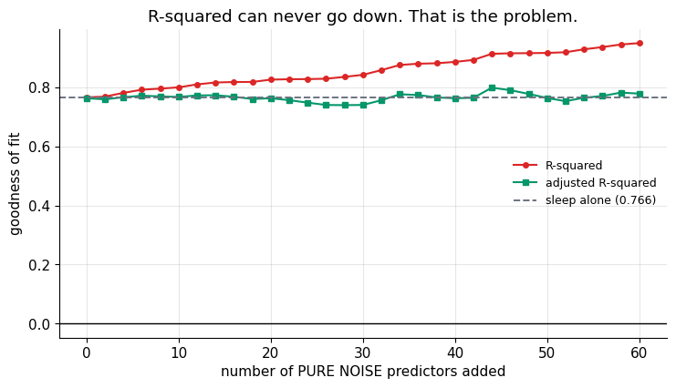

**Output**

```text
predictors: sleep only            R-squared = 0.7659
predictors: sleep + 10 noise        R-squared = 0.7998      adjusted = +0.7674
predictors: sleep + 20 noise        R-squared = 0.8259      adjusted = +0.7629
predictors: sleep + 40 noise        R-squared = 0.8859      adjusted = +0.7629
predictors: sleep + 60 noise        R-squared = 0.9495      adjusted = +0.7785

never once decreased? True

With 60 noise columns against 80 rows the fit is nearly perfect on THIS
data and worth nothing on any other. Adjusted R-squared, which charges
rent for every predictor, goes NEGATIVE -- the only one of the two telling
the truth. Part 9 replaces both with the real answer: held-out data.
```

### Cell 210

```python
# ============================================================
#  The slope's uncertainty, by formula and by bootstrap.
# ============================================================
n_reg  = N7
dof    = n_reg - 2
Sxx    = ((sleep - sleep.mean()) ** 2).sum()
s_e    = np.sqrt(SSE / dof)
se_b   = s_e / np.sqrt(Sxx)

t_crit     = stats.t.ppf(0.975, dof)
ci_formula = (b_hand - t_crit * se_b, b_hand + t_crit * se_b)

t_stat  = b_hand / se_b
p_slope = 2 * stats.t.sf(abs(t_stat), dof)

# ---- bootstrap: resample PAIRS, refit, 10,000 times ----
rngb = np.random.default_rng(7666)
B    = 10_000
boot = np.empty(B)
for i in range(B):
    idx     = rngb.integers(0, n_reg, n_reg)
    boot[i] = fit_line_from_derivation(sleep[idx], rt[idx])[1]
ci_boot = np.percentile(boot, [2.5, 97.5])

fig, ax = plt.subplots(figsize=(8.6, 4.4))
ax.hist(boot, bins=60, color=C_F, alpha=0.85, edgecolor="white")
ax.axvline(b_hand, color=C_SLOPE, lw=2.4, label=f"our slope {b_hand:.2f}")
ax.axvline(TRUE_SLOPE, color=C_EXACT, lw=2.2, ls=":",
           label=f"true slope {TRUE_SLOPE:.2f}")
for v in ci_boot:
    ax.axvline(v, color=C_AREA, lw=2.0, ls="--")
ax.set_xlabel("slope from a bootstrap resample (ms per hour)")
ax.set_ylabel("resamples")
ax.set_title(f"{B:,} bootstrap slopes; dashed green = middle 95%")
ax.legend(frameon=False, fontsize=9)
plt.show()

print(f"slope                     b  = {b_hand:8.3f} ms per hour")
print(f"residual sd              s_e = {s_e:8.3f} ms")
print(f"spread of x              Sxx = {Sxx:8.3f}")
print(f"standard error         SE(b) = {se_b:8.3f}")
print()
print(f"95% CI, formula   : [{ci_formula[0]:7.3f}, {ci_formula[1]:7.3f}]"
      f"   width {ci_formula[1] - ci_formula[0]:.3f}")
print(f"95% CI, bootstrap : [{ci_boot[0]:7.3f}, {ci_boot[1]:7.3f}]"
      f"   width {ci_boot[1] - ci_boot[0]:.3f}")
print(f"true slope inside both? formula={ci_formula[0] <= TRUE_SLOPE <= ci_formula[1]}, "
      f"bootstrap={ci_boot[0] <= TRUE_SLOPE <= ci_boot[1]}")
print()
print(f"t = b / SE(b)   = {t_stat:8.3f}   on {dof} degrees of freedom")
print(f"p (slope = 0)   = {p_slope:.3e}")
print(f"is 0 inside the 95% interval? {ci_formula[0] <= 0 <= ci_formula[1]}")
print()
print("Zero is far outside the interval, so the slope IS distinguishable from")
print("zero: there is a relationship. Note carefully what that does NOT say --")
print("nothing about the direction of causation, and nothing about whether a")
print(f"change of {abs(b_hand):.0f} ms per hour matters to anyone. That is effect size.")
```

**Output**

```text
<Figure size 860x440 with 1 Axes>
```

**Figure**

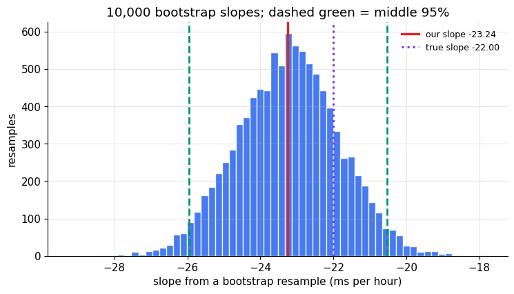

**Output**

```text
slope                     b  =  -23.243 ms per hour
residual sd              s_e =   18.697 ms
spread of x              Sxx =  165.105
standard error         SE(b) =    1.455

95% CI, formula   : [-26.140, -20.346]   width 5.794
95% CI, bootstrap : [-25.945, -20.528]   width 5.416
true slope inside both? formula=True, bootstrap=True

t = b / SE(b)   =  -15.974   on 78 degrees of freedom
p (slope = 0)   = 2.623e-26
is 0 inside the 95% interval? False

Zero is far outside the interval, so the slope IS distinguishable from
zero: there is a relationship. Note carefully what that does NOT say --
nothing about the direction of causation, and nothing about whether a
change of 23 ms per hour matters to anyone. That is effect size.
```

### Cell 213

```python
# ============================================================
#  Truth: a decaying curve with a floor. Observation: a narrow window.
#  Model: a straight line, fitted honestly, extrapolated recklessly.
# ============================================================
rnge = np.random.default_rng(7777)

def truth(s):
    """True mean reaction time (ms) at s hours of sleep: floor + decaying excess."""
    return 210.0 + 900.0 * np.exp(-0.42 * s)

OBS_LO, OBS_HI = 5.0, 8.0
s_obs = rnge.uniform(OBS_LO, OBS_HI, 60)
y_obs = truth(s_obs) + rnge.normal(0, 8.0, 60)

a_e, b_e = fit_line_from_derivation(s_obs, y_obs)
r2_inside = 1 - ((y_obs - (a_e + b_e * s_obs)) ** 2).sum() / \
                ((y_obs - y_obs.mean()) ** 2).sum()

grid_all = np.linspace(0.5, 16, 300)
fig, ax = plt.subplots(figsize=(9.4, 4.8))
ax.axvspan(OBS_LO, OBS_HI, color=C_SOFT, alpha=0.8, zorder=0)
ax.plot(grid_all, truth(grid_all), color=C_EXACT, lw=2.6, label="the TRUTH")
ax.plot(grid_all, a_e + b_e * grid_all, color=C_SLOPE, lw=2.4, ls="--",
        label="fitted straight line, extended")
ax.scatter(s_obs, y_obs, s=28, color=C_F, alpha=0.85, edgecolor="white",
           zorder=3, label="the data we actually have")
ax.axhline(0, color="black", lw=1.0)
ax.text((OBS_LO + OBS_HI) / 2, ax.get_ylim()[1] * 0.92, "observed range",
        ha="center", fontsize=9, color=C_GREY)
ax.set_xlabel("hours of sleep"); ax.set_ylabel("reaction time (ms)")
ax.set_title("Inside the grey band the line is excellent. Outside, it is fiction.")
ax.legend(frameon=False, fontsize=9)
plt.show()

print(f"fitted using only {OBS_LO}-{OBS_HI} h :  y = {a_e:.1f} + ({b_e:.2f}) x")
print(f"R-squared inside that window   :  {r2_inside:.3f}")
print()
print(f"{'sleep':>7} {'outside by':>11} {'TRUTH':>10} {'LINE SAYS':>11} "
      f"{'ERROR':>10} {'% off':>8}")
print("-" * 62)
for s in (6.5, 8.0, 9.0, 10.0, 12.0, 14.0, 16.0):
    t_, p_ = truth(s), a_e + b_e * s
    dist = 0.0 if OBS_LO <= s <= OBS_HI else min(abs(s - OBS_LO), abs(s - OBS_HI))
    print(f"{s:7.1f} {dist:11.1f} {t_:10.1f} {p_:11.1f} {p_ - t_:+10.1f} "
          f"{100 * (p_ - t_) / t_:+7.1f}%")
print()
zero_at = -a_e / b_e
print(f"The line crosses ZERO reaction time at {zero_at:.1f} hours of sleep,")
print(f"and predicts {a_e + b_e * 16:.1f} ms at 16 hours -- a negative duration.")
print()
print("Nothing in the fit warned us. The R-squared printed above was computed")
print("entirely inside the grey band and is completely silent about 14 hours.")
```

**Output**

```text
<Figure size 940x480 with 1 Axes>
```

**Figure**

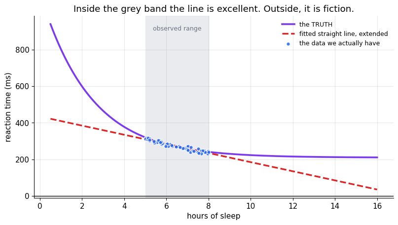

**Output**

```text
fitted using only 5.0-8.0 h :  y = 434.5 + (-24.93) x
R-squared inside that window   :  0.922

  sleep  outside by      TRUTH   LINE SAYS      ERROR    % off
--------------------------------------------------------------
    6.5         0.0      268.7       272.5       +3.8    +1.4%
    8.0         0.0      241.3       235.1       -6.2    -2.6%
    9.0         1.0      230.5       210.1      -20.4    -8.9%
   10.0         2.0      223.5       185.2      -38.3   -17.1%
   12.0         4.0      215.8       135.3      -80.5   -37.3%
   14.0         6.0      212.5        85.5     -127.0   -59.8%
   16.0         8.0      211.1        35.6     -175.5   -83.1%

The line crosses ZERO reaction time at 17.4 hours of sleep,
and predicts 35.6 ms at 16 hours -- a negative duration.

Nothing in the fit warned us. The R-squared printed above was computed
entirely inside the grey band and is completely silent about 14 hours.
```

### Cell 216

```python
# ============================================================
#  2,000 trainee pilots. Two landings each. Ability NEVER changes.
#  Any apparent improvement or decline is manufactured entirely by noise.
# ============================================================
rngr = np.random.default_rng(7888)
M    = 2000

ability = rngr.normal(500, 60, M)             # fixed; identical for both landings
land1   = ability + rngr.normal(0, 60, M)
land2   = ability + rngr.normal(0, 60, M)     # SAME ability, fresh luck

r_12       = np.corrcoef(land1, land2)[0, 1]
a_rt, b_rt = fit_line_from_derivation(land1, land2)

top    = land1 >= np.percentile(land1, 90)    # praised after landing 1
bottom = land1 <= np.percentile(land1, 10)    # shouted at after landing 1

fig, (ax1, ax2) = plt.subplots(1, 2, figsize=(12.6, 4.8))

ax1.scatter(land1, land2, s=8, color=C_GREY, alpha=0.3)
ax1.scatter(land1[top], land2[top], s=15, color=C_SLOPE, alpha=0.85,
            label="praised (top 10% on landing 1)")
ax1.scatter(land1[bottom], land2[bottom], s=15, color=C_F, alpha=0.85,
            label="rebuked (bottom 10% on landing 1)")
gl = np.linspace(land1.min(), land1.max(), 40)
ax1.plot(gl, gl, color="black", lw=1.6, ls=":", label="no change (slope 1)")
ax1.plot(gl, a_rt + b_rt * gl, color=C_EXACT, lw=2.6,
         label=f"fitted slope {b_rt:.2f}")
ax1.set_xlabel("landing 1 score"); ax1.set_ylabel("landing 2 score")
ax1.set_title("Same ability both times. The fitted slope is below 1.")
ax1.legend(frameon=False, fontsize=8)

ax2.bar([0.0], [land1[top].mean()], width=0.7, color=C_SLOPE, alpha=0.95)
ax2.bar([1.0], [land2[top].mean()], width=0.7, color=C_SLOPE, alpha=0.5)
ax2.bar([2.4], [land1[bottom].mean()], width=0.7, color=C_F, alpha=0.95)
ax2.bar([3.4], [land2[bottom].mean()], width=0.7, color=C_F, alpha=0.5)
ax2.axhline(ability.mean(), color=C_AREA, lw=2.0, ls="--",
            label=f"overall mean {ability.mean():.0f}")
ax2.set_xticks([0.0, 1.0, 2.4, 3.4])
ax2.set_xticklabels(["praised\nlanding 1", "praised\nlanding 2",
                     "rebuked\nlanding 1", "rebuked\nlanding 2"], fontsize=9)
ax2.set_ylabel("mean score"); ax2.set_ylim(300, 700)
ax2.set_title("Praise 'backfires'. Criticism 'works'. Neither happened.")
ax2.legend(frameon=False, fontsize=8)

fig.tight_layout(); plt.show()

print(f"correlation between the two landings   r = {r_12:.3f}")
print(f"slope of landing 2 on landing 1        b = {b_rt:.3f}")
print(f"r * (sd2 / sd1)                          = "
      f"{r_12 * land2.std(ddof=1) / land1.std(ddof=1):.3f}   <- the same number")
print(f"slope below 1?                           {b_rt < 1}")
print()
print("TOP 10% after landing 1 (these pilots were PRAISED):")
print(f"   landing 1 mean = {land1[top].mean():7.1f}")
print(f"   landing 2 mean = {land2[top].mean():7.1f}   "
      f"({land2[top].mean() - land1[top].mean():+.1f})   <- they got WORSE")
print("BOTTOM 10% after landing 1 (these pilots were REBUKED):")
print(f"   landing 1 mean = {land1[bottom].mean():7.1f}")
print(f"   landing 2 mean = {land2[bottom].mean():7.1f}   "
      f"({land2[bottom].mean() - land1[bottom].mean():+.1f})   <- they got BETTER")
print()
print(f"True ability of the praised group  = {ability[top].mean():.1f}")
print(f"True ability of the rebuked group  = {ability[bottom].mean():.1f}")
print("Ability was FIXED in the code above. No praise, no criticism, no training")
print("and no learning happened at all. An instructor who concludes 'criticism")
print("works, praise backfires' has drawn a causal conclusion from arithmetic.")
```

**Output**

```text
<Figure size 1260x480 with 2 Axes>
```

**Figure**

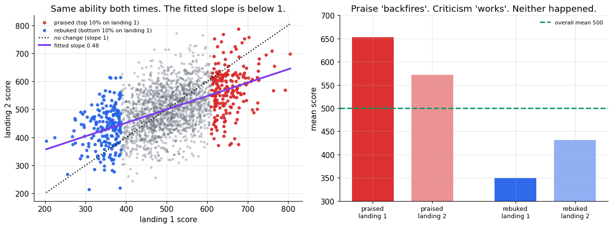

**Output**

```text
correlation between the two landings   r = 0.486
slope of landing 2 on landing 1        b = 0.478
r * (sd2 / sd1)                          = 0.478   <- the same number
slope below 1?                           True

TOP 10% after landing 1 (these pilots were PRAISED):
   landing 1 mean =   652.8
   landing 2 mean =   571.7   (-81.1)   <- they got WORSE
BOTTOM 10% after landing 1 (these pilots were REBUKED):
   landing 1 mean =   349.3
   landing 2 mean =   431.7   (+82.4)   <- they got BETTER

True ability of the praised group  = 575.5
True ability of the rebuked group  = 425.4
Ability was FIXED in the code above. No praise, no criticism, no training
and no learning happened at all. An instructor who concludes 'criticism
works, praise backfires' has drawn a causal conclusion from arithmetic.
```

### Cell 222

```python
# ============================================================
#  A study with 40 candidate variables and an outcome.
#  EVERY variable is pure noise. The outcome is pure noise.
#  There is nothing to find. We go looking anyway.
# ============================================================
import numpy as np
import matplotlib.pyplot as plt
from scipy import stats

RNG8 = np.random.default_rng(808)

N_SUBJ = 50      # people in the study
N_VARS = 40      # things measured about each of them
ALPHA  = 0.05

# We are about to run millions of tests, so we compute the two p-values we need
# directly instead of calling scipy once per test. Both are checked against
# scipy immediately below, so nothing here is taken on trust.

def corr_pvals(X, y):
    """p-values for the correlation of every column of X with y."""
    n  = len(y)
    Xc = X - X.mean(axis=0)
    yc = y - y.mean()
    r  = (Xc * yc[:, None]).sum(0) / np.sqrt((Xc ** 2).sum(0) * (yc ** 2).sum())
    t  = r * np.sqrt((n - 2) / np.maximum(1 - r ** 2, 1e-300))
    return 2 * stats.t.sf(np.abs(t), n - 2)

def welch_p(a, b):
    """Welch (unequal-variance) two-sample t-test p-value."""
    na, nb = len(a), len(b)
    va, vb = a.var(ddof=1) / na, b.var(ddof=1) / nb
    se = np.sqrt(va + vb)
    if not np.isfinite(se) or se == 0:
        return 1.0
    t  = (a.mean() - b.mean()) / se
    df = (va + vb) ** 2 / (va ** 2 / (na - 1) + vb ** 2 / (nb - 1))
    return float(2 * stats.t.sf(abs(t), df))

def one_null_study(rng, n=N_SUBJ, k=N_VARS):
    """k independent noise variables, one independent noise outcome.
    Returns the k p-values from correlating each variable with the outcome."""
    X = rng.normal(0, 1, size=(n, k))
    y = rng.normal(0, 1, size=n)          # generated with NO reference to X
    return corr_pvals(X, y)

# ---- confirm our fast versions against scipy before relying on them ----
_chk = np.random.default_rng(0)
_X, _y = _chk.normal(0, 1, (30, 4)), _chk.normal(0, 1, 30)
_a, _b = _chk.normal(0, 1, 25), _chk.normal(0.4, 1.3, 31)
print("fast p-values agree with scipy?")
print("  correlations :",
      np.allclose(corr_pvals(_X, _y),
                  [stats.pearsonr(_X[:, j], _y).pvalue for j in range(4)]))
print("  Welch t-test :",
      np.isclose(welch_p(_a, _b),
                 stats.ttest_ind(_a, _b, equal_var=False).pvalue))
print()

pvals = one_null_study(RNG8)
hits  = np.where(pvals < ALPHA)[0]

fig, ax = plt.subplots(figsize=(9.4, 4.0))
cols = [C_SLOPE if p < ALPHA else C_SOFT for p in pvals]
ax.bar(np.arange(N_VARS), pvals, color=cols, edgecolor=C_GREY, linewidth=0.5)
ax.axhline(ALPHA, color=C_AREA, lw=2.0, ls="--", label="alpha = 0.05")
ax.set_xlabel("variable number (all 40 are pure noise)")
ax.set_ylabel("p-value")
ax.set_title("One study, 40 tests, zero real effects")
ax.legend(frameon=False)
plt.show()

print(f"variables tested                 : {N_VARS}")
print(f"real effects present             : 0")
print(f"'significant' at p < {ALPHA}       : {len(hits)}")
print(f"which ones                       : {list(hits)}")
print()
for j in hits:
    print(f"  variable {j:2d}:  p = {pvals[j]:.4f}   <- entirely a false positive")
print()
print(f"smallest p-value in the study    : {pvals.min():.4f}")
print()
print("A paper reporting only the winning variable would be reporting a p-value")
print("that is correct for a single test and meaningless for this study.")
```

**Output**

```text
fast p-values agree with scipy?
  correlations : True
  Welch t-test : True
```

**Output**

```text
<Figure size 940x400 with 1 Axes>
```

**Figure**

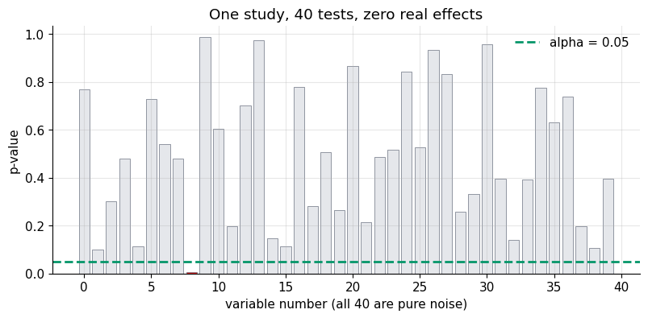

**Output**

```text
variables tested                 : 40
real effects present             : 0
'significant' at p < 0.05       : 1
which ones                       : [np.int64(8)]

  variable  8:  p = 0.0048   <- entirely a false positive

smallest p-value in the study    : 0.0048

A paper reporting only the winning variable would be reporting a p-value
that is correct for a single test and meaningless for this study.
```

### Cell 224

```python
# ============================================================
#  One study proves nothing. Run 2,000 of them.
# ============================================================
rng_many = np.random.default_rng(8181)
N_STUDIES = 2000

counts = np.empty(N_STUDIES, dtype=int)
minp   = np.empty(N_STUDIES)
for s in range(N_STUDIES):
    p = one_null_study(rng_many)
    counts[s] = (p < ALPHA).sum()
    minp[s]   = p.min()

fwer_measured = (counts >= 1).mean()
fwer_theory   = 1 - (1 - ALPHA) ** N_VARS

fig, (ax1, ax2) = plt.subplots(1, 2, figsize=(12.4, 4.2))

vals, cts = np.unique(counts, return_counts=True)
ax1.bar(vals, cts / N_STUDIES, color=C_F, alpha=0.9, edgecolor="white")
ax1.axvline(counts.mean(), color=C_SLOPE, lw=2.2,
            label=f"mean {counts.mean():.2f} false positives")
ax1.axvline(N_VARS * ALPHA, color=C_EXACT, lw=2.0, ls=":",
            label=f"predicted 40 x 0.05 = {N_VARS * ALPHA:.1f}")
ax1.set_xlabel("'significant' results in one all-noise study")
ax1.set_ylabel("fraction of studies")
ax1.set_title(f"{N_STUDIES:,} studies, no real effects anywhere")
ax1.legend(frameon=False, fontsize=9)

ax2.hist(minp, bins=50, color=C_APPROX, alpha=0.9, edgecolor="white")
ax2.axvline(ALPHA, color=C_AREA, lw=2.2, ls="--", label="0.05")
ax2.set_xlabel("smallest p-value found in the study")
ax2.set_ylabel("studies")
ax2.set_title("The 'best' p-value, when nothing is there")
ax2.legend(frameon=False, fontsize=9)

fig.tight_layout(); plt.show()

print(f"mean false positives per study        = {counts.mean():.3f}"
      f"   (expected {N_VARS * ALPHA:.1f})")
print(f"studies with AT LEAST one 'finding'   = {fwer_measured:.1%}")
print(f"theory: 1 - 0.95^40                   = {fwer_theory:.1%}")
print(f"studies with 4 or more 'findings'     = {(counts >= 4).mean():.1%}")
print(f"studies that found NOTHING            = {(counts == 0).mean():.1%}")
print()
print(f"median of the smallest p-value        = {np.median(minp):.4f}")
print(f"studies whose best p was below 0.01   = {(minp < 0.01).mean():.1%}")
print()
print("Read the last two lines slowly. In a study with nothing in it, the best")
print("p-value is typically around 0.001-0.01. 'p < 0.01' is not impressive when")
print("it is the minimum of forty tries -- and the reader is never told it was.")
```

**Output**

```text
<Figure size 1240x420 with 2 Axes>
```

**Figure**

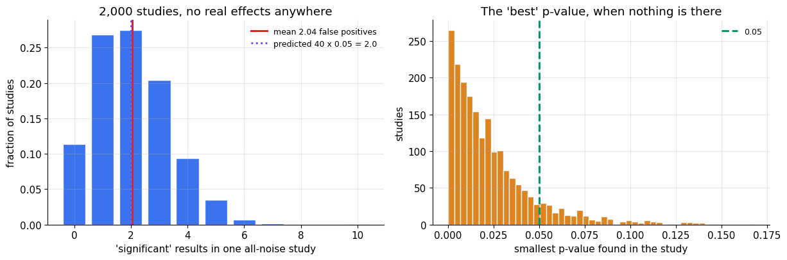

**Output**

```text
mean false positives per study        = 2.042   (expected 2.0)
studies with AT LEAST one 'finding'   = 88.6%
theory: 1 - 0.95^40                   = 87.1%
studies with 4 or more 'findings'     = 13.9%
studies that found NOTHING            = 11.4%

median of the smallest p-value        = 0.0167
studies whose best p was below 0.01   = 33.8%

Read the last two lines slowly. In a study with nothing in it, the best
p-value is typically around 0.001-0.01. 'p < 0.01' is not impressive when
it is the minimum of forty tries -- and the reader is never told it was.
```

### Cell 227

```python
# ============================================================
#  40 variables: 5 REAL effects, 35 pure noise. We know which is which.
#  Measure, over many studies: false positives, true discoveries, FWER, FDR.
# ============================================================
rng_c   = np.random.default_rng(8282)
N_TRUE  = 5
N_NULL  = N_VARS - N_TRUE
EFFECT  = 0.45          # correlation of each real variable with the outcome
REPS    = 1000

def study_with_real_effects(rng, n=N_SUBJ):
    """Return p-values; the first N_TRUE variables are genuinely related to y."""
    y = rng.normal(0, 1, n)
    cols = []
    for j in range(N_VARS):
        if j < N_TRUE:
            cols.append(EFFECT * y + np.sqrt(1 - EFFECT ** 2) * rng.normal(0, 1, n))
        else:
            cols.append(rng.normal(0, 1, n))       # unrelated to y
    return corr_pvals(np.column_stack(cols), y)

def benjamini_hochberg(p, alpha=ALPHA):
    """Return a boolean array: which hypotheses BH rejects."""
    m = len(p)
    order = np.argsort(p)
    thresh = (np.arange(1, m + 1) / m) * alpha
    passed = p[order] <= thresh
    rej = np.zeros(m, dtype=bool)
    if passed.any():
        kmax = np.max(np.where(passed)[0])         # largest i that passes
        rej[order[:kmax + 1]] = True
    return rej

is_real = np.arange(N_VARS) < N_TRUE
res = {k: {"fp": [], "tp": [], "any_fp": []} for k in ("none", "bonferroni", "bh")}

for _ in range(REPS):
    p = study_with_real_effects(rng_c)
    decisions = {
        "none":       p < ALPHA,
        "bonferroni": p < ALPHA / N_VARS,
        "bh":         benjamini_hochberg(p),
    }
    for k, d in decisions.items():
        fp = int((d & ~is_real).sum())
        tp = int((d & is_real).sum())
        res[k]["fp"].append(fp)
        res[k]["tp"].append(tp)
        res[k]["any_fp"].append(fp >= 1)

print(f"{REPS} studies. Each has {N_TRUE} REAL effects and {N_NULL} pure-noise variables.")
print()
print(f"{'method':<14}{'false pos':>11}{'true pos':>10}{'FWER':>9}{'FDR':>9}{'power':>8}")
print("-" * 61)
label = {"none": "no correction", "bonferroni": "Bonferroni", "bh": "BH (FDR)"}
summary = {}
for k in ("none", "bonferroni", "bh"):
    fp = np.array(res[k]["fp"]); tp = np.array(res[k]["tp"])
    disc = fp + tp
    fdr = np.where(disc > 0, fp / np.maximum(disc, 1), 0.0).mean()
    fwer = np.mean(res[k]["any_fp"])
    power = tp.mean() / N_TRUE
    summary[k] = (fp.mean(), tp.mean(), fwer, fdr, power)
    print(f"{label[k]:<14}{fp.mean():11.2f}{tp.mean():10.2f}"
          f"{fwer:9.1%}{fdr:9.1%}{power:8.1%}")
print()
print(f"Uncorrected: {summary['none'][0]:.2f} false positives per study on average,")
print(f"and {summary['none'][2]:.0%} of studies report at least one thing that is not there.")
print(f"Bonferroni:  FWER cut to {summary['bonferroni'][2]:.1%}, but power falls from")
print(f"             {summary['none'][4]:.0%} to {summary['bonferroni'][4]:.0%} -- real effects are now missed.")
print(f"BH:          FDR held near {summary['bh'][3]:.1%} while keeping {summary['bh'][4]:.0%} power.")
print()
print("There is no free lunch here. Every correction trades sensitivity for")
print("credibility. Choosing NOT to correct is also a trade -- just an unstated one.")
```

**Output**

```text
1000 studies. Each has 5 REAL effects and 35 pure-noise variables.

method          false pos  true pos     FWER      FDR   power
-------------------------------------------------------------
no correction        1.70      4.61    82.3%    24.3%   92.1%
Bonferroni           0.04      2.70     4.4%     1.2%   54.1%
BH (FDR)             0.20      3.48    17.1%     4.0%   69.6%

Uncorrected: 1.70 false positives per study on average,
and 82% of studies report at least one thing that is not there.
Bonferroni:  FWER cut to 4.4%, but power falls from
             92% to 54% -- real effects are now missed.
BH:          FDR held near 4.0% while keeping 70% power.

There is no free lunch here. Every correction trades sensitivity for
credibility. Choosing NOT to correct is also a trade -- just an unstated one.
```

### Cell 230

```python
# ============================================================
#  ONE dataset. No treatment effect: outcome does not depend on group.
#  Then a systematic hunt through defensible analysis choices.
# ============================================================
rngh = np.random.default_rng(8383)

def make_null_trial(rng, n=120):
    """A 'trial' with NO treatment effect at all, plus harmless covariates."""
    d = {
        "group":  rng.integers(0, 2, n),                 # 0 = control, 1 = treated
        "sex":    rng.integers(0, 2, n),
        "age":    rng.integers(18, 70, n),
        "site":   rng.integers(0, 3, n),
    }
    d["score"] = rng.normal(100, 15, n)   # <-- does NOT use d['group']. No effect.
    return d

trial = make_null_trial(rngh)

# ---- the garden of choices: subgroups x outcome definitions x outlier rules ----
subgroups = {
    "everyone":        np.ones(len(trial["score"]), dtype=bool),
    "women":           trial["sex"] == 0,
    "men":             trial["sex"] == 1,
    "under 40":        trial["age"] < 40,
    "40 and over":     trial["age"] >= 40,
    "site A":          trial["site"] == 0,
    "site B":          trial["site"] == 1,
    "women under 40":  (trial["sex"] == 0) & (trial["age"] < 40),
}
outcomes = {
    "raw score":        lambda s: s,
    "log score":        lambda s: np.log(np.clip(s, 1, None)),
    "score squared":    lambda s: s ** 2,
    "rank of score":    lambda s: stats.rankdata(s),
}
outlier_rules = {
    "keep all":     None,
    "drop |z| > 3": 3.0,
    "drop |z| > 2": 2.0,
}

attempts, first_win = [], None
for sg_name, sg in subgroups.items():
    for out_name, f in outcomes.items():
        for or_name, z in outlier_rules.items():
            g, s = trial["group"][sg], f(trial["score"][sg])
            if z is not None and s.std() > 0:
                keep = np.abs((s - s.mean()) / s.std()) <= z
                g, s = g[keep], s[keep]
            if (g == 0).sum() < 5 or (g == 1).sum() < 5:
                continue
            p = welch_p(s[g == 1], s[g == 0])
            attempts.append((sg_name, out_name, or_name, p))
            if p < ALPHA and first_win is None:
                first_win = (len(attempts), sg_name, out_name, or_name, p)

all_p = np.array([a[3] for a in attempts])

print("THE HONEST ANALYSIS -- decided before looking at anything:")
g0 = trial["score"][trial["group"] == 0]
g1 = trial["score"][trial["group"] == 1]
p_honest = welch_p(g1, g0)
print(f"   whole sample, raw score, no exclusions:  p = {p_honest:.4f}"
      f"   -> {'significant' if p_honest < ALPHA else 'nothing to report'}")
print()
print(f"THE GARDEN: {len(subgroups)} subgroups x {len(outcomes)} outcome definitions"
      f" x {len(outlier_rules)} outlier rules")
print(f"   analyses actually run           : {len(attempts)}")
print(f"   of those with p < {ALPHA}          : {(all_p < ALPHA).sum()}")
print(f"   smallest p-value anywhere       : {all_p.min():.4f}")
print()
if first_win:
    i, sg, out, orr, p = first_win
    print(f"FIRST 'SIGNIFICANT' RESULT, on attempt {i} of {len(attempts)}:")
    print(f"   subgroup      : {sg}")
    print(f"   outcome       : {out}")
    print(f"   outlier rule  : {orr}")
    print(f"   p-value       : {p:.4f}")
    print()
    print(f'   Write-up: "Among {sg}, the treatment significantly improved')
    print(f'   {out} (p = {p:.3f})." Every word of that sentence is true.')
else:
    print("No subgroup reached significance in this particular dataset.")
print()
print("Reminder of what is in the data: the outcome was generated on a line that")
print("never mentions the group. The true effect is EXACTLY ZERO.")
```

**Output**

```text
THE HONEST ANALYSIS -- decided before looking at anything:
   whole sample, raw score, no exclusions:  p = 0.7466   -> nothing to report

THE GARDEN: 8 subgroups x 4 outcome definitions x 3 outlier rules
   analyses actually run           : 96
   of those with p < 0.05          : 0
   smallest p-value anywhere       : 0.1072

No subgroup reached significance in this particular dataset.

Reminder of what is in the data: the outcome was generated on a line that
never mentions the group. The true effect is EXACTLY ZERO.
```

### Cell 232

```python
# ============================================================
#  Does it work reliably, or did we get lucky? Run 400 null trials,
#  and let each one search the garden until it finds something.
# ============================================================
rngh2 = np.random.default_rng(8484)
N_TRIALS = 400

def welch_t_df(a, b):
    """The Welch t statistic and its degrees of freedom, without the p-value.
    Collecting these and converting them all at once is what keeps this cell
    fast -- it is the same test as welch_p, split in two."""
    na, nb = len(a), len(b)
    va, vb = a.var(ddof=1) / na, b.var(ddof=1) / nb
    se = np.sqrt(va + vb)
    if not np.isfinite(se) or se == 0:
        return 0.0, 1.0
    return ((a.mean() - b.mean()) / se,
            (va + vb) ** 2 / (va ** 2 / (na - 1) + vb ** 2 / (nb - 1)))

def search_garden(rng):
    """Run one null trial through the same garden. Return (honest p, best p, attempts)."""
    t = make_null_trial(rng)
    sc, gp, sx, ag, st = t["score"], t["group"], t["sex"], t["age"], t["site"]
    p_hon = welch_p(sc[gp == 1], sc[gp == 0])
    sgs = [np.ones(len(sc), bool), sx == 0, sx == 1, ag < 40, ag >= 40,
           st == 0, st == 1, (sx == 0) & (ag < 40)]
    outs = [lambda s: s, lambda s: np.log(np.clip(s, 1, None)),
            lambda s: s ** 2, lambda s: stats.rankdata(s)]
    ts, dfs = [], []
    for sg in sgs:
        for f in outs:
            for z in (None, 3.0, 2.0):
                g, s = gp[sg], f(sc[sg])
                if z is not None and s.std() > 0:
                    keep = np.abs((s - s.mean()) / s.std()) <= z
                    g, s = g[keep], s[keep]
                if (g == 0).sum() < 5 or (g == 1).sum() < 5:
                    continue
                tt, dd = welch_t_df(s[g == 1], s[g == 0])
                ts.append(tt); dfs.append(dd)
    ps = 2 * stats.t.sf(np.abs(ts), dfs)        # every attempt, in order
    win = np.where(ps < ALPHA)[0]
    return p_hon, ps.min(), (int(win[0]) + 1 if len(win) else None)

hon, best, until = [], [], []
for _ in range(N_TRIALS):
    h, b, u = search_garden(rngh2)
    hon.append(h); best.append(b); until.append(u)
hon, best = np.array(hon), np.array(best)
found = np.array([u is not None for u in until])
tries = np.array([u for u in until if u is not None])

fig, (ax1, ax2) = plt.subplots(1, 2, figsize=(12.4, 4.2))
ax1.hist(hon, bins=25, color=C_F, alpha=0.85, edgecolor="white",
         label="honest, pre-declared analysis")
ax1.hist(best, bins=25, color=C_SLOPE, alpha=0.7, edgecolor="white",
         label="best p found by searching")
ax1.axvline(ALPHA, color=C_AREA, lw=2.2, ls="--", label="0.05")
ax1.set_xlabel("p-value"); ax1.set_ylabel("trials")
ax1.set_title("Same null data, two analysis strategies")
ax1.legend(frameon=False, fontsize=8)

ax2.hist(tries, bins=25, color=C_APPROX, alpha=0.9, edgecolor="white")
ax2.axvline(np.median(tries), color=C_SLOPE, lw=2.2,
            label=f"median {np.median(tries):.0f} attempts")
ax2.set_xlabel("analyses run before the first p < 0.05")
ax2.set_ylabel("trials")
ax2.set_title("How long the hunt takes when nothing is there")
ax2.legend(frameon=False, fontsize=8)

fig.tight_layout(); plt.show()

print(f"{N_TRIALS} trials, every one with a TRUE EFFECT OF ZERO.")
print()
print(f"honest analysis 'significant'      : {(hon < ALPHA).mean():.1%}"
      f"   <- this is alpha, working correctly")
print(f"search found SOMETHING significant : {found.mean():.1%}")
print()
print(f"median attempts before the first win : {np.median(tries):.0f}")
print(f"25th / 75th percentile               : {np.percentile(tries, 25):.0f}"
      f" / {np.percentile(tries, 75):.0f}")
print(f"median of the best p-value found     : {np.median(best):.4f}")
print()
print(f"The honest rate is {(hon < ALPHA).mean():.0%}, right where it should be.")
print(f"The searched rate is {found.mean():.0%}. Same data, same tests, same maths --")
print("the only difference is that one analyst stopped and the other kept going.")
```

**Output**

```text
<Figure size 1240x420 with 2 Axes>
```

**Figure**

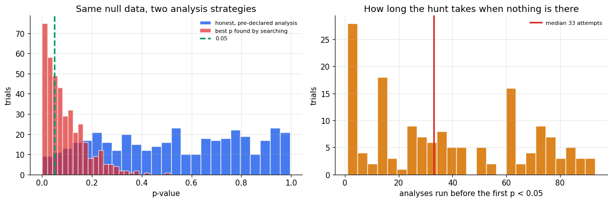

**Output**

```text
400 trials, every one with a TRUE EFFECT OF ZERO.

honest analysis 'significant'      : 4.0%   <- this is alpha, working correctly
search found SOMETHING significant : 38.8%

median attempts before the first win : 33
25th / 75th percentile               : 13 / 62
median of the best p-value found     : 0.0702

The honest rate is 4%, right where it should be.
The searched rate is 39%. Same data, same tests, same maths --
the only difference is that one analyst stopped and the other kept going.
```

### Cell 235

```python
# ============================================================
#  Two groups drawn from the SAME distribution. No difference exists.
#  Protocol: test after every new pair of observations; stop at p < 0.05.
# ============================================================
rngs = np.random.default_rng(8585)

N_MIN, N_MAX = 10, 200
N_SIMS = 2000

def running_welch_p(A, B, n_min=N_MIN):
    """p-value after EVERY observation, for many experiments at once.

    A and B are (sims, n_max). Returns (sims, n_max - n_min + 1): the Welch
    p-value using the first n columns, for every n from n_min to n_max.
    Running means and variances come from cumulative sums, so the whole
    peeking experiment is one array computation instead of a million tests."""
    ns  = np.arange(n_min, A.shape[1] + 1)
    out = []
    for X in (A, B):
        c1 = np.cumsum(X, axis=1)[:, n_min - 1:]
        c2 = np.cumsum(X ** 2, axis=1)[:, n_min - 1:]
        mean = c1 / ns
        var  = (c2 - ns * mean ** 2) / (ns - 1)        # sample variance, ddof=1
        out.append((mean, var / ns))                    # (mean, variance of mean)
    (mA, vA), (mB, vB) = out
    se = np.sqrt(vA + vB)
    t  = (mA - mB) / se
    df = (vA + vB) ** 2 / (vA ** 2 / (ns - 1) + vB ** 2 / (ns - 1))
    return ns, 2 * stats.t.sf(np.abs(t), df)

# ---- the peeking protocol: look after every observation, stop at p < 0.05 ----
A = rngs.normal(0, 1, (N_SIMS, N_MAX))
B = rngs.normal(0, 1, (N_SIMS, N_MAX))      # SAME distribution. No difference.
n_grid, P = running_welch_p(A, B)

# confirm the vectorised version against scipy at a couple of spot checks
spot = [(0, 37), (5, 120), (11, 200)]
print("running p-values agree with scipy?",
      all(np.isclose(P[i, n - N_MIN],
                     stats.ttest_ind(A[i, :n], B[i, :n], equal_var=False).pvalue)
          for i, n in spot))
print()

below   = P < ALPHA
stopped = below.any(axis=1)
first   = np.argmax(below, axis=1)                    # first peek that dips
ns      = np.where(stopped, n_grid[first], N_MAX)
peek_rate = stopped.mean()

# ---- the honest comparison: ONE test, at n = N_MAX, fixed in advance ----
fixed_rate = (P[:, -1] < ALPHA).mean()

fig, (ax1, ax2) = plt.subplots(1, 2, figsize=(12.6, 4.4))
for i in range(14):
    stop_i = stopped[i]
    end = first[i] + 1 if stop_i else len(n_grid)
    ax1.plot(n_grid[:end], P[i, :end], lw=1.2, alpha=0.8,
             color=C_SLOPE if stop_i else C_GREY)
    if stop_i:
        ax1.scatter([n_grid[first[i]]], [P[i, first[i]]], s=40,
                    color=C_SLOPE, zorder=5)
ax1.axhline(ALPHA, color=C_AREA, lw=2.2, ls="--", label="0.05")
ax1.set_xlabel("sample size per group"); ax1.set_ylabel("p-value so far")
ax1.set_title("14 null experiments watched as they run\n(red = dipped below 0.05)")
ax1.set_ylim(0, 1); ax1.legend(frameon=False, fontsize=9)

ax2.bar([0, 1], [fixed_rate, peek_rate], width=0.55,
        color=[C_AREA, C_SLOPE], alpha=0.9)
ax2.axhline(ALPHA, color="black", lw=1.8, ls=":", label="the 5% we were promised")
ax2.set_xticks([0, 1])
ax2.set_xticklabels([f"one test at n={N_MAX}\n(fixed in advance)",
                     f"peek after every n\nfrom {N_MIN} to {N_MAX}"], fontsize=9)
ax2.set_ylabel("false positive rate")
ax2.set_title("Same null data. Same test. Different stopping rule.")
for i, v in enumerate([fixed_rate, peek_rate]):
    ax2.text(i, v + 0.012, f"{v:.1%}", ha="center", fontsize=12, weight="bold")
ax2.legend(frameon=False, fontsize=9)

fig.tight_layout(); plt.show()

print(f"{N_SIMS:,} experiments. In every one the two groups are drawn from the")
print("SAME distribution -- the true difference is exactly zero.")
print()
print(f"fixed n = {N_MAX}, tested once   : false positive rate = {fixed_rate:.1%}"
      f"   <- as promised")
print(f"peeking from n={N_MIN} to n={N_MAX}  : false positive rate = {peek_rate:.1%}"
      f"   <- {peek_rate / ALPHA:.1f}x the promise")
print()
print(f"among the experiments that 'won', median stopping n = "
      f"{np.median(ns[stopped]):.0f}")
print(f"fraction that stopped before n = 50            = "
      f"{(stopped & (ns < 50)).mean():.1%}")
print()
print("Note the second line especially: most false positives are harvested EARLY,")
print("when the sample is small and the p-value is most volatile. 'We stopped")
print("because it was already significant' is the tell.")
```

**Output**

```text
running p-values agree with scipy? True
```

**Output**

```text
<Figure size 1260x440 with 2 Axes>
```

**Figure**

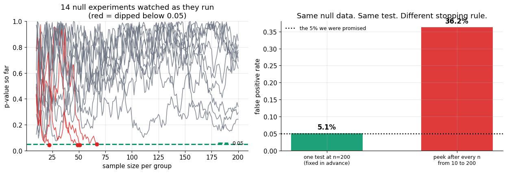

**Output**

```text
2,000 experiments. In every one the two groups are drawn from the
SAME distribution -- the true difference is exactly zero.

fixed n = 200, tested once   : false positive rate = 5.1%   <- as promised
peeking from n=10 to n=200  : false positive rate = 36.2%   <- 7.2x the promise

among the experiments that 'won', median stopping n = 32
fraction that stopped before n = 50            = 22.6%

Note the second line especially: most false positives are harvested EARLY,
when the sample is small and the p-value is most volatile. 'We stopped
because it was already significant' is the tell.
```

### Cell 241

```python
# ============================================================
#  Constructed so the reversal is guaranteed, not hoped for.
#  Within every age band: MORE exercise -> LOWER cholesterol.
#  Between age bands:     older -> more exercise AND higher cholesterol.
# ============================================================
rngsp = np.random.default_rng(8686)

BANDS = [("age 30-39", 2.0, 170.0, C_F),
         ("age 50-59", 5.0, 200.0, C_AREA),
         ("age 70-79", 8.0, 230.0, C_SLOPE)]
WITHIN_SLOPE = -4.0       # the TRUE within-band effect: negative
PER_BAND     = 150

ex_all, ch_all, band_all = [], [], []
for i, (name, ex_mean, ch_base, _) in enumerate(BANDS):
    ex = rngsp.normal(ex_mean, 0.9, PER_BAND)
    ch = ch_base + WITHIN_SLOPE * (ex - ex_mean) + rngsp.normal(0, 6.0, PER_BAND)
    ex_all.append(ex); ch_all.append(ch); band_all.append(np.full(PER_BAND, i))
exercise = np.concatenate(ex_all)
chol     = np.concatenate(ch_all)
band     = np.concatenate(band_all)

def slope_of(x, y):
    xb, yb = x.mean(), y.mean()
    return ((x - xb) * (y - yb)).sum() / ((x - xb) ** 2).sum()

pooled_slope = slope_of(exercise, chol)
pooled_r     = np.corrcoef(exercise, chol)[0, 1]

fig, (ax1, ax2) = plt.subplots(1, 2, figsize=(12.6, 4.8))

ax1.scatter(exercise, chol, s=12, color=C_GREY, alpha=0.55)
gx = np.linspace(exercise.min(), exercise.max(), 40)
ax1.plot(gx, chol.mean() + pooled_slope * (gx - exercise.mean()),
         color=C_SLOPE, lw=3.0)
ax1.set_xlabel("hours of exercise per week"); ax1.set_ylabel("cholesterol")
ax1.set_title(f"POOLED: slope {pooled_slope:+.2f}   (exercise looks HARMFUL)")

within = []
for i, (name, ex_mean, ch_base, col) in enumerate(BANDS):
    m = band == i
    s = slope_of(exercise[m], chol[m])
    within.append(s)
    ax2.scatter(exercise[m], chol[m], s=12, color=col, alpha=0.6, label=name)
    gxi = np.linspace(exercise[m].min(), exercise[m].max(), 20)
    ax2.plot(gxi, chol[m].mean() + s * (gxi - exercise[m].mean()),
             color=col, lw=3.0)
ax2.plot(gx, chol.mean() + pooled_slope * (gx - exercise.mean()),
         color=C_GREY, lw=2.0, ls="--", label="pooled line")
ax2.set_xlabel("hours of exercise per week"); ax2.set_ylabel("cholesterol")
ax2.set_title("SPLIT BY AGE: every band slopes DOWN")
ax2.legend(frameon=False, fontsize=8)

fig.tight_layout(); plt.show()

print(f"{'analysis':<26}{'slope':>10}{'r':>10}")
print("-" * 46)
print(f"{'POOLED (ignoring age)':<26}{pooled_slope:+10.2f}{pooled_r:+10.3f}")
for i, ((name, _, _, _), s) in enumerate(zip(BANDS, within)):
    m = band == i
    print(f"{'within ' + name:<26}{s:+10.2f}"
          f"{np.corrcoef(exercise[m], chol[m])[0, 1]:+10.3f}")
print()
print(f"true within-band slope, written into the code above = {WITHIN_SLOPE:+.2f}")
print()
print(f"The pooled slope is {pooled_slope:+.2f}. Every within-age slope is negative.")
print(f"Sign reversal? {pooled_slope > 0 and all(s < 0 for s in within)}")
print()
print("Two contradictory sentences, both true of the same 450 rows:")
print(f'  "More exercise is associated with HIGHER cholesterol (slope '
      f'{pooled_slope:+.2f})."')
print(f'  "More exercise is associated with LOWER cholesterol, in every age band'
      f' (slopes {", ".join(f"{s:+.2f}" for s in within)})."')
```

**Output**

```text
<Figure size 1260x480 with 2 Axes>
```

**Figure**

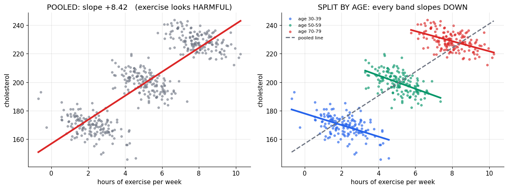

**Output**

```text
analysis                       slope         r
----------------------------------------------
POOLED (ignoring age)          +8.42    +0.845
within age 30-39               -4.05    -0.512
within age 50-59               -4.68    -0.518
within age 70-79               -3.53    -0.494

true within-band slope, written into the code above = -4.00

The pooled slope is +8.42. Every within-age slope is negative.
Sign reversal? True

Two contradictory sentences, both true of the same 450 rows:
  "More exercise is associated with HIGHER cholesterol (slope +8.42)."
  "More exercise is associated with LOWER cholesterol, in every age band (slopes -4.05, -4.68, -3.53)."
```

### Cell 245

```python
# ============================================================
#  LEFT : 600 funds over 10 years. Weak ones close. We see the survivors.
#  RIGHT: two INDEPENDENT abilities. Admission needs a high sum.
# ============================================================
rngsel = np.random.default_rng(8787)

# ---------- survivorship ----------
N_FUNDS, YEARS = 600, 10
true_skill = rngsel.normal(0.0, 0.01, N_FUNDS)      # tiny, mostly zero
alive = np.ones(N_FUNDS, dtype=bool)
cumret = np.zeros(N_FUNDS)
for _ in range(YEARS):
    r = true_skill + rngsel.normal(0.06, 0.18, N_FUNDS)   # yearly return
    cumret = np.where(alive, cumret + r, cumret)
    alive = alive & (cumret > -0.25)                # a bad run closes the fund

mean_all      = cumret.mean() / YEARS
mean_survivor = cumret[alive].mean() / YEARS

# ---------- collider selection ----------
N_APP = 3000
maths = rngsel.normal(0, 1, N_APP)
music = rngsel.normal(0, 1, N_APP)                  # independent of maths
r_before = np.corrcoef(maths, music)[0, 1]
admitted = (maths + music) > 1.6                    # the filter
r_after  = np.corrcoef(maths[admitted], music[admitted])[0, 1]

fig, (ax1, ax2) = plt.subplots(1, 2, figsize=(12.6, 4.6))

ax1.hist(cumret / YEARS, bins=45, color=C_SOFT, edgecolor=C_GREY,
         label=f"all {N_FUNDS} funds launched")
ax1.hist(cumret[alive] / YEARS, bins=45, color=C_AREA, alpha=0.85,
         edgecolor="white", label=f"the {alive.sum()} still open")
ax1.axvline(mean_all, color=C_GREY, lw=2.4, ls="--",
            label=f"all funds: {mean_all:+.1%}/yr")
ax1.axvline(mean_survivor, color=C_SLOPE, lw=2.4,
            label=f"survivors: {mean_survivor:+.1%}/yr")
ax1.set_xlabel("average annual return"); ax1.set_ylabel("funds")
ax1.set_title("SURVIVORSHIP: the database only holds the winners")
ax1.legend(frameon=False, fontsize=8)

ax2.scatter(maths[~admitted], music[~admitted], s=8, color=C_SOFT, alpha=0.7,
            label=f"rejected  (r = {r_before:+.3f} overall)")
ax2.scatter(maths[admitted], music[admitted], s=12, color=C_SLOPE, alpha=0.75,
            label=f"admitted  (r = {r_after:+.3f})")
gm = np.linspace(-3, 3, 20)
ax2.plot(gm, 1.6 - gm, color="black", lw=1.8, ls=":", label="admission cutoff")
sl = ((maths[admitted] - maths[admitted].mean()) *
      (music[admitted] - music[admitted].mean())).sum() / \
     ((maths[admitted] - maths[admitted].mean()) ** 2).sum()
ax2.plot(gm, music[admitted].mean() + sl * (gm - maths[admitted].mean()),
         color=C_EXACT, lw=2.6)
ax2.set_xlim(-3.2, 3.2); ax2.set_ylim(-3.2, 3.2)
ax2.set_xlabel("maths ability"); ax2.set_ylabel("music ability")
ax2.set_title("SELECTION: independent, until you filter on their sum")
ax2.legend(frameon=False, fontsize=8, loc="lower left")

fig.tight_layout(); plt.show()

print("SURVIVORSHIP BIAS")
print(f"  funds launched                    : {N_FUNDS}")
print(f"  funds still open after {YEARS} years  : {alive.sum()}"
      f"   ({alive.mean():.1%})")
print(f"  mean annual return, ALL funds     : {mean_all:+.2%}")
print(f"  mean annual return, SURVIVORS     : {mean_survivor:+.2%}")
print(f"  the bias                          : {mean_survivor - mean_all:+.2%} per year")
print(f"  true mean skill written into code : {true_skill.mean():+.4f} per year")
print("  A brochure quoting the survivor number is not lying about arithmetic.")
print("  It is quoting a number computed on a set defined by good outcomes.")
print()
print("SELECTION ON A COLLIDER")
print(f"  correlation of maths and music, everyone  : {r_before:+.4f}"
      f"   <- independent, as built")
print(f"  correlation among the {admitted.sum()} ADMITTED       : {r_after:+.4f}"
      f"   <- negative, from nothing")
print(f"  slope within the admitted group           : {sl:+.3f}")
print()
print("  Nothing in the world connects maths and music here -- the two arrays")
print("  were drawn independently. Conditioning on their sum MANUFACTURED the")
print("  relationship. Inside a selective school, 'the good mathematicians are")
print("  worse musicians' is true and tells you only about the admissions rule.")
```

**Output**

```text
<Figure size 1260x460 with 2 Axes>
```

**Figure**

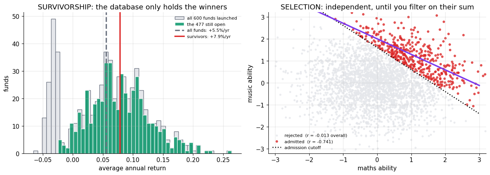

**Output**

```text
SURVIVORSHIP BIAS
  funds launched                    : 600
  funds still open after 10 years  : 477   (79.5%)
  mean annual return, ALL funds     : +5.54%
  mean annual return, SURVIVORS     : +7.86%
  the bias                          : +2.31% per year
  true mean skill written into code : +0.0004 per year
  A brochure quoting the survivor number is not lying about arithmetic.
  It is quoting a number computed on a set defined by good outcomes.

SELECTION ON A COLLIDER
  correlation of maths and music, everyone  : -0.0130   <- independent, as built
  correlation among the 406 ADMITTED       : -0.7407   <- negative, from nothing
  slope within the admitted group           : -0.705

  Nothing in the world connects maths and music here -- the two arrays
  were drawn independently. Conditioning on their sum MANUFACTURED the
  relationship. Inside a selective school, 'the good mathematicians are
  worse musicians' is true and tells you only about the admissions rule.
```

### Cell 249

```python
# ============================================================
#  CASE 1 (confounder)  : temperature -> ice cream, temperature -> drownings.
#                         Adjusting for temperature is CORRECT and fixes it.
#  CASE 2 (collider)    : two independent causes of one outcome.
#                         Adjusting for the outcome is WRONG and breaks it.
# ============================================================
rngcf = np.random.default_rng(8888)
NC = 1200

def ols(X, y):
    """Least-squares coefficients for design matrix X (first column = ones)."""
    beta, *_ = np.linalg.lstsq(X, y, rcond=None)
    return beta

# ---------- CASE 1: a genuine confounder ----------
temp      = rngcf.normal(20, 7, NC)                       # degrees C
icecream  = 30 + 4.0 * temp + rngcf.normal(0, 12, NC)     # caused by temp
drownings = 2 + 0.55 * temp + rngcf.normal(0, 3.0, NC)    # caused by temp ONLY
# NOTE: drownings does NOT reference icecream. True effect = 0.

naive_1 = ols(np.column_stack([np.ones(NC), icecream]), drownings)[1]
adj_1   = ols(np.column_stack([np.ones(NC), icecream, temp]), drownings)[1]

# ---------- CASE 2: a collider ----------
talent  = rngcf.normal(0, 1, NC)
looks   = rngcf.normal(0, 1, NC)                          # independent of talent
famous  = talent + looks + rngcf.normal(0, 0.5, NC)       # CAUSED BY both

naive_2 = ols(np.column_stack([np.ones(NC), talent]), looks)[1]
adj_2   = ols(np.column_stack([np.ones(NC), talent, famous]), looks)[1]

fig, (ax1, ax2) = plt.subplots(1, 2, figsize=(12.6, 4.4))

sc = ax1.scatter(icecream, drownings, c=temp, s=10, cmap="coolwarm", alpha=0.75)
gi = np.linspace(icecream.min(), icecream.max(), 20)
ax1.plot(gi, drownings.mean() + naive_1 * (gi - icecream.mean()),
         color="black", lw=2.6, label=f"unadjusted slope {naive_1:+.4f}")
ax1.set_xlabel("ice cream sales"); ax1.set_ylabel("drownings")
ax1.set_title("CONFOUNDER: colour is temperature")
ax1.legend(frameon=False, fontsize=9)
fig.colorbar(sc, ax=ax1, label="temperature (C)")

ax2.bar([0, 1], [naive_1, adj_1], width=0.5, color=[C_SLOPE, C_AREA], alpha=0.9)
ax2.bar([2.6, 3.6], [naive_2, adj_2], width=0.5, color=[C_AREA, C_SLOPE], alpha=0.9)
ax2.axhline(0, color="black", lw=1.6)
ax2.set_xticks([0, 1, 2.6, 3.6])
ax2.set_xticklabels(["case 1\nunadjusted", "case 1\n+ temperature",
                     "case 2\nunadjusted", "case 2\n+ fame"], fontsize=9)
ax2.set_ylim(-0.68, 0.26)
ax2.set_ylabel("estimated effect (truth = 0 in both cases)")
ax2.set_title("Green = closer to the truth. Adjusting helps, then hurts.")
for i, v in zip([0, 1, 2.6, 3.6], [naive_1, adj_1, naive_2, adj_2]):
    ax2.text(i, v + (0.02 if v >= 0 else -0.05), f"{v:+.3f}",
             ha="center", fontsize=9)

fig.tight_layout(); plt.show()

print("CASE 1 -- temperature is a genuine CONFOUNDER of ice cream and drownings.")
print(f"  true effect of ice cream on drownings   :  0.0000  (by construction)")
print(f"  unadjusted regression coefficient       : {naive_1:+8.4f}   <- spurious")
print(f"  adjusted for temperature                : {adj_1:+8.4f}   <- fixed")
print(f"  correlation of ice cream and drownings  : "
      f"{np.corrcoef(icecream, drownings)[0, 1]:+.3f}")
print()
print("CASE 2 -- fame is a COLLIDER: talent and looks both cause it.")
print(f"  true relationship of talent and looks   :  0.0000  (independent draws)")
print(f"  unadjusted regression coefficient       : {naive_2:+8.4f}   <- correct")
print(f"  adjusted for fame                       : {adj_2:+8.4f}   <- BROKEN")
print()
print("Same phrase, opposite consequences. 'We controlled for fame' would sound")
print("more careful in a paper, and would have introduced the entire error.")
print()
print("The two cases are indistinguishable from the numbers alone: both involve")
print("three correlated variables. Only knowledge of what causes what separates")
print("them -- and that knowledge comes from outside the dataset.")
```

**Output**

```text
<Figure size 1260x440 with 3 Axes>
```

**Figure**

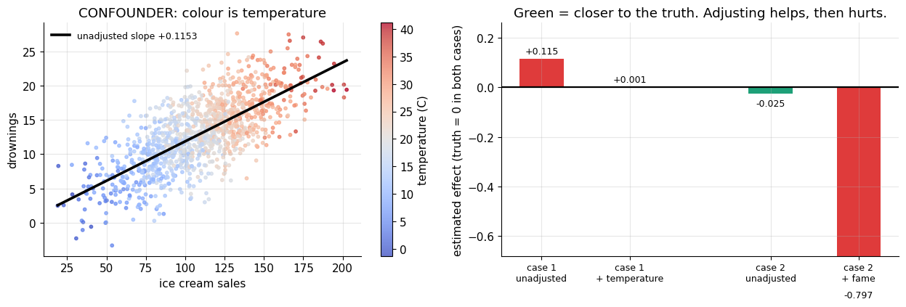

**Output**

```text
CASE 1 -- temperature is a genuine CONFOUNDER of ice cream and drownings.
  true effect of ice cream on drownings   :  0.0000  (by construction)
  unadjusted regression coefficient       :  +0.1153   <- spurious
  adjusted for temperature                :  +0.0005   <- fixed
  correlation of ice cream and drownings  : +0.722

CASE 2 -- fame is a COLLIDER: talent and looks both cause it.
  true relationship of talent and looks   :  0.0000  (independent draws)
  unadjusted regression coefficient       :  -0.0253   <- correct
  adjusted for fame                       :  -0.7972   <- BROKEN

Same phrase, opposite consequences. 'We controlled for fame' would sound
more careful in a paper, and would have introduced the entire error.

The two cases are indistinguishable from the numbers alone: both involve
three correlated variables. Only knowledge of what causes what separates
them -- and that knowledge comes from outside the dataset.
```

### Cell 252

```python
# ============================================================
#  LEFT : 400 studies of an effect that is EXACTLY ZERO. Only p<0.05 publishes.
#  RIGHT: 40 training seeds of two models that are GENUINELY IDENTICAL.
# ============================================================
rngpb = np.random.default_rng(8989)

# ---------- publication bias ----------
N_ST, N_PER = 400, 40
est, pv = [], []
for _ in range(N_ST):
    a = rngpb.normal(0, 1, N_PER)
    b = rngpb.normal(0, 1, N_PER)          # SAME distribution. True effect = 0.
    est.append(b.mean() - a.mean())
    pv.append(welch_p(a, b))
est, pv = np.array(est), np.array(pv)
published = pv < ALPHA

# ---------- the ML twin: best of many seeds ----------
N_SEEDS, TRUE_ACC = 40, 0.900
acc_A = rngpb.normal(TRUE_ACC, 0.012, N_SEEDS)
acc_B = rngpb.normal(TRUE_ACC, 0.012, N_SEEDS)   # identical model, new name
best_A, best_B = acc_A.max(), acc_B.max()

fig, (ax1, ax2) = plt.subplots(1, 2, figsize=(12.6, 4.4))

ax1.hist(est, bins=40, color=C_SOFT, edgecolor=C_GREY,
         label=f"all {N_ST} studies run")
ax1.hist(est[published], bins=40, color=C_SLOPE, alpha=0.85, edgecolor="white",
         label=f"the {published.sum()} that got published")
ax1.axvline(0, color="black", lw=2.0, label="the truth (zero)")
ax1.axvline(np.abs(est[published]).mean(), color=C_EXACT, lw=2.2, ls="--",
            label=f"mean |published effect| {np.abs(est[published]).mean():.3f}")
ax1.set_xlabel("estimated effect"); ax1.set_ylabel("studies")
ax1.set_title("PUBLICATION BIAS: the drawer holds the zeroes")
ax1.legend(frameon=False, fontsize=8)

ax2.scatter(np.zeros(N_SEEDS) + rngpb.normal(0, 0.03, N_SEEDS), acc_A,
            s=26, color=C_F, alpha=0.8, label="model A, 40 seeds")
ax2.scatter(np.ones(N_SEEDS) + rngpb.normal(0, 0.03, N_SEEDS), acc_B,
            s=26, color=C_AREA, alpha=0.8, label="model B, 40 seeds")
ax2.scatter([0], [best_A], s=150, marker="*", color=C_SLOPE, zorder=5)
ax2.scatter([1], [best_B], s=150, marker="*", color=C_SLOPE, zorder=5,
            label="the number that gets reported")
ax2.axhline(TRUE_ACC, color="black", lw=1.6, ls=":", label="true accuracy of both")
ax2.set_xticks([0, 1]); ax2.set_xticklabels(["model A", "model B"])
ax2.set_ylabel("test accuracy")
ax2.set_title("BEST OF 40 SEEDS: two identical models")
ax2.legend(frameon=False, fontsize=8)

fig.tight_layout(); plt.show()

print("PUBLICATION BIAS")
print(f"  studies run                       : {N_ST}   (true effect = 0.000)")
print(f"  studies published (p < {ALPHA})       : {published.sum()}"
      f"   ({published.mean():.1%})")
print(f"  mean effect across ALL studies    : {est.mean():+.4f}   <- correct")
print(f"  mean |effect| among PUBLISHED     : {np.abs(est[published]).mean():+.4f}")
print(f"  mean |effect| among UNPUBLISHED   : {np.abs(est[~published]).mean():+.4f}")
print(f"  inflation factor                  : "
      f"{np.abs(est[published]).mean() / np.abs(est[~published]).mean():.2f}x")
print("  Every published study is individually correct. The literature is not.")
print()
print("THE ML TWIN -- reporting the best of many runs")
print(f"  true accuracy of BOTH models      : {TRUE_ACC:.4f}")
print(f"  model A: mean {acc_A.mean():.4f}   best of {N_SEEDS} = {best_A:.4f}")
print(f"  model B: mean {acc_B.mean():.4f}   best of {N_SEEDS} = {best_B:.4f}")
print(f"  headline gap if both report their best : "
      f"{abs(best_A - best_B) * 100:.2f} percentage points")
print(f"  headline gap if both report their mean : "
      f"{abs(acc_A.mean() - acc_B.mean()) * 100:.2f} percentage points")
print(f"  optimism of 'best of {N_SEEDS}' over the truth : "
      f"{(max(best_A, best_B) - TRUE_ACC) * 100:+.2f} points")
print()
print("  Both models were drawn from the SAME distribution. Any gap between the")
print("  starred points is the maximum of 40 draws talking. Reporting a single")
print("  best run without saying how many were tried is publication bias with")
print("  a smaller file drawer.")
```

**Output**

```text
<Figure size 1260x440 with 2 Axes>
```

**Figure**

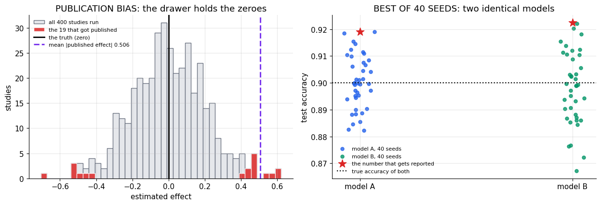

**Output**

```text
PUBLICATION BIAS
  studies run                       : 400   (true effect = 0.000)
  studies published (p < 0.05)       : 19   (4.8%)
  mean effect across ALL studies    : -0.0000   <- correct
  mean |effect| among PUBLISHED     : +0.5065
  mean |effect| among UNPUBLISHED   : +0.1471
  inflation factor                  : 3.44x
  Every published study is individually correct. The literature is not.

THE ML TWIN -- reporting the best of many runs
  true accuracy of BOTH models      : 0.9000
  model A: mean 0.9003   best of 40 = 0.9190
  model B: mean 0.8986   best of 40 = 0.9225
  headline gap if both report their best : 0.35 percentage points
  headline gap if both report their mean : 0.17 percentage points
  optimism of 'best of 40' over the truth : +2.25 points

  Both models were drawn from the SAME distribution. Any gap between the
  starred points is the maximum of 40 draws talking. Reporting a single
  best run without saying how many were tried is publication bias with
  a smaller file drawer.
```

### Cell 257

```python
# ============================================================
#  A classification problem, and a logistic regression fitted BY HAND.
#  Two features. The true boundary is a circle: points near the origin
#  are class 1, points far out are class 0, with genuine noise on top --
#  so even a perfect model cannot score 100%.
# ============================================================
from scipy import stats            # already imported earlier; harmless here

RNG9 = np.random.default_rng(90909)


def make_problem(n, rng):
    """n examples with 2 features and a noisy circular decision boundary."""
    X     = rng.normal(0.0, 1.0, size=(n, 2))
    r2    = X[:, 0] ** 2 + X[:, 1] ** 2
    score = 3.4 * (1.8 - r2) + 1.2 * X[:, 0]     # the TRUE signal
    p     = 1.0 / (1.0 + np.exp(-score))          # true P(class 1 | x)
    y     = (rng.random(n) < p).astype(float)     # the coin flip -- the noise
    return X, y


def poly_features(X, degree):
    """All monomials x1^a * x2^b with 1 <= a+b <= degree. Flexibility knob."""
    cols = []
    for d in range(1, degree + 1):
        for k in range(d + 1):
            cols.append((X[:, 0] ** (d - k)) * (X[:, 1] ** k))
    return np.column_stack(cols)


def design(X, degree, mu=None, sd=None):
    """Features, standardised, with an intercept column glued on the front.
    mu/sd are computed on TRAINING data only and reused everywhere else."""
    Z = poly_features(X, degree)
    if mu is None:
        mu, sd = Z.mean(axis=0), Z.std(axis=0)
        sd = np.where(sd == 0, 1.0, sd)
    Zs = (Z - mu) / sd
    return np.column_stack([np.ones(len(Z)), Zs]), mu, sd


def fit_logistic(Z, y, lr=0.6, iters=1500, l2=1e-3):
    """Gradient descent on the logistic loss. Ten lines, no library."""
    w = np.zeros(Z.shape[1])
    for _ in range(iters):
        p    = 1.0 / (1.0 + np.exp(-Z @ w))                 # predicted P(y=1)
        grad = Z.T @ (p - y) / len(y) + l2 * np.r_[0.0, w[1:]]
        w   -= lr * grad
    return w


def correct_flags(w, Z, y):
    """A 0/1 array: was each example classified correctly? THE key object."""
    return ((Z @ w > 0).astype(float) == y).astype(float)


# ---- the three datasets ------------------------------------------------
N_TRAIN, N_TEST = 400, 200
X_tr, y_tr   = make_problem(N_TRAIN, RNG9)
X_te, y_te   = make_problem(N_TEST,  RNG9)
X_or, y_or   = make_problem(40_000,  RNG9)   # the ORACLE set: stands in for
                                             # the population. In real life it
                                             # does not exist.

DEG = 2
Z_tr, MU, SD = design(X_tr, DEG)
Z_te, _, _   = design(X_te, DEG, MU, SD)
Z_or, _, _   = design(X_or, DEG, MU, SD)

w_A = fit_logistic(Z_tr, y_tr)

corr_tr = correct_flags(w_A, Z_tr, y_tr)
corr_te = correct_flags(w_A, Z_te, y_te)
corr_or = correct_flags(w_A, Z_or, y_or)

acc_tr, acc_te, ACC_TRUE = corr_tr.mean(), corr_te.mean(), corr_or.mean()

print(f"model: logistic regression, degree-{DEG} features, "
      f"{Z_tr.shape[1]} weights, fitted by gradient descent")
print()
print(f"  training accuracy  ({N_TRAIN:>5} examples) = {acc_tr:.4f}")
print(f"  TEST accuracy      ({N_TEST:>5} examples) = {acc_te:.4f}   <- what gets reported")
print(f"  TRUE accuracy      ({len(y_or):>5} examples) = {ACC_TRUE:.4f}   <- normally UNKNOWABLE")
print()
print(f"  test score minus truth = {acc_te - ACC_TRUE:+.4f}")
print()
print("The test score missed the truth. Not by much, and not because anything")
print("went wrong -- 200 examples is a sample, and samples wobble. Part 3.")
```

**Output**

```text
model: logistic regression, degree-2 features, 6 weights, fitted by gradient descent

  training accuracy  (  400 examples) = 0.9350
  TEST accuracy      (  200 examples) = 0.8950   <- what gets reported
  TRUE accuracy      (40000 examples) = 0.9128   <- normally UNKNOWABLE

  test score minus truth = -0.0178

The test score missed the truth. Not by much, and not because anything
went wrong -- 200 examples is a sample, and samples wobble. Part 3.
```

### Cell 259

```python
# ============================================================
#  Turn the flexibility knob and watch the two curves separate.
#  Small training set (50), so the effect is unmistakable.
# ============================================================
RNG_OF = np.random.default_rng(77)
X_small, y_small = make_problem(50,   RNG_OF)     # a realistically small study
X_eval,  y_eval  = make_problem(4000, RNG_OF)     # a big honest test set

degrees, tr_curve, te_curve, n_params = [], [], [], []
for deg in range(1, 9):
    Zs, mu_s, sd_s = design(X_small, deg)
    Ze, _, _       = design(X_eval,  deg, mu_s, sd_s)
    w              = fit_logistic(Zs, y_small, lr=0.6, iters=4000, l2=1e-6)
    degrees.append(deg)
    n_params.append(Zs.shape[1])
    tr_curve.append(correct_flags(w, Zs, y_small).mean())
    te_curve.append(correct_flags(w, Ze, y_eval).mean())

fig, ax = plt.subplots(figsize=(9, 4.6))
ax.plot(degrees, tr_curve, "o-", color=C_SLOPE, lw=2.2, label="training accuracy")
ax.plot(degrees, te_curve, "s-", color=C_F,     lw=2.2, label="test accuracy")
best = int(np.argmax(te_curve))
ax.axvline(degrees[best], color=C_GREY, ls=":", lw=1.6)
ax.annotate("best test score", xy=(degrees[best], te_curve[best]),
            xytext=(degrees[best] + 1.2, te_curve[best] - 0.13),
            arrowprops=dict(arrowstyle="->", color=C_GREY), color=C_GREY)
ax.set_xlabel("polynomial degree  (model flexibility)")
ax.set_ylabel("accuracy")
ax.set_title("Training accuracy always improves. Test accuracy does not.")
ax.legend(frameon=False); fig.tight_layout(); plt.show()

print(" degree  weights   train    test     gap")
for d, k, a, b in zip(degrees, n_params, tr_curve, te_curve):
    print(f" {d:6d} {k:8d}   {a:.3f}   {b:.3f}   {a - b:+.3f}")
print()
print(f"training accuracy from degree 1 to 8: {tr_curve[0]:.3f} -> {tr_curve[-1]:.3f}")
print(f"test     accuracy from degree 1 to 8: {te_curve[0]:.3f} -> {te_curve[-1]:.3f}")
print(f"best test score at degree {degrees[best]}; "
      f"the most flexible model is {te_curve[best] - te_curve[-1]:.3f} worse.")
```

**Output**

```text
<Figure size 900x460 with 1 Axes>
```

**Figure**

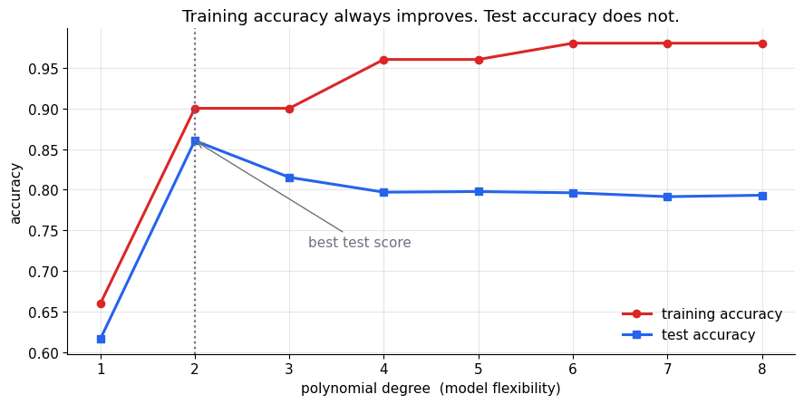

**Output**

```text
 degree  weights   train    test     gap
      1        3   0.660   0.617   +0.043
      2        6   0.900   0.860   +0.040
      3       10   0.900   0.815   +0.085
      4       15   0.960   0.797   +0.163
      5       21   0.960   0.798   +0.162
      6       28   0.980   0.796   +0.184
      7       36   0.980   0.791   +0.189
      8       45   0.980   0.793   +0.187

training accuracy from degree 1 to 8: 0.660 -> 0.980
test     accuracy from degree 1 to 8: 0.617 -> 0.793
best test score at degree 2; the most flexible model is 0.067 worse.
```

### Cell 262

```python
# ============================================================
#  A confidence interval on a model score -- two ways.
#  corr_te is a 0/1 array of length 200. Accuracy is its mean.
#  This is Part 4 applied to a machine-learning number, unaltered.
# ============================================================
p_hat = corr_te.mean()
n_t   = len(corr_te)

# --- 1. normal approximation (Part 4, formula route) -------------------
se_acc  = np.sqrt(p_hat * (1 - p_hat) / n_t)
z       = stats.norm.ppf(0.975)                 # = z_crit from Part 4
lo_n, hi_n = p_hat - z * se_acc, p_hat + z * se_acc

# --- 2. bootstrap (Part 4, no-assumptions route) -----------------------
(lo_b, hi_b), boot_acc = bootstrap_ci(corr_te, statistic=np.mean,
                                      B=10_000, conf=0.95, rng=RNG9)

print(f"test set of n = {n_t}, {int(corr_te.sum())} correct")
print(f"accuracy  p-hat = {p_hat:.4f}")
print(f"standard error  = {se_acc:.4f}   (= sqrt(p(1-p)/n))")
print()
print(f"  95% CI, normal approximation : [{lo_n:.4f}, {hi_n:.4f}]   "
      f"width {100 * (hi_n - lo_n):5.2f} percentage points")
print(f"  95% CI, percentile bootstrap : [{lo_b:.4f}, {hi_b:.4f}]   "
      f"width {100 * (hi_b - lo_b):5.2f} percentage points")
print()
print(f"the model's TRUE accuracy is {ACC_TRUE:.4f}")
print(f"  inside the normal interval?    {bool(lo_n <= ACC_TRUE <= hi_n)}")
print(f"  inside the bootstrap interval? {bool(lo_b <= ACC_TRUE <= hi_b)}")
print()
print("Two completely different arguments -- an algebraic one and a")
print("resampling one -- landing in the same place. That agreement is the")
print("evidence that neither is an artefact of its own assumptions.")
```

**Output**

```text
test set of n = 200, 179 correct
accuracy  p-hat = 0.8950
standard error  = 0.0217   (= sqrt(p(1-p)/n))

  95% CI, normal approximation : [0.8525, 0.9375]   width  8.50 percentage points
  95% CI, percentile bootstrap : [0.8500, 0.9350]   width  8.50 percentage points

the model's TRUE accuracy is 0.9128
  inside the normal interval?    True
  inside the bootstrap interval? True

Two completely different arguments -- an algebraic one and a
resampling one -- landing in the same place. That agreement is the
evidence that neither is an artefact of its own assumptions.
```

### Cell 264

```python
# ============================================================
#  Does the interval actually work? Part 4's coverage check,
#  run on a model score. We can do this because we can draw
#  fresh test sets from the oracle pool all day.
# ============================================================
TRIALS9 = 2_000
scores_v = np.empty(TRIALS9)
lo_v = np.empty(TRIALS9); hi_v = np.empty(TRIALS9)      # the usual ("Wald") one
lo_w = np.empty(TRIALS9); hi_w = np.empty(TRIALS9)      # Wilson

for i in range(TRIALS9):
    idx  = RNG9.choice(len(corr_or), n_t, replace=False)   # a fresh test set
    ph   = corr_or[idx].mean()
    scores_v[i] = ph

    s = np.sqrt(ph * (1 - ph) / n_t)                       # the usual formula
    lo_v[i], hi_v[i] = ph - z * s, ph + z * s

    # Wilson: ask which values of p the data would NOT reject, instead of
    # pacing out a fixed distance either side of p-hat.
    denom  = 1 + z ** 2 / n_t
    centre = (ph + z ** 2 / (2 * n_t)) / denom
    hw     = z * np.sqrt(ph * (1 - ph) / n_t + z ** 2 / (4 * n_t ** 2)) / denom
    lo_w[i], hi_w[i] = centre - hw, centre + hw

cov_wald   = float(((lo_v <= ACC_TRUE) & (ACC_TRUE <= hi_v)).mean())
cov_wilson = float(((lo_w <= ACC_TRUE) & (ACC_TRUE <= hi_w)).mean())
mc_se9     = np.sqrt(cov_wald * (1 - cov_wald) / TRIALS9)

print(f"{TRIALS9:,} independent test sets of {n_t}, one 95% interval each.")
print(f"  the model's true accuracy                 = {ACC_TRUE:.4f}")
print(f"  nominal claim                             = 95.000%")
print(f"  Monte-Carlo uncertainty on a coverage     = +/- {1.96 * mc_se9:.3%}")
print()
print(f"  coverage of the normal ('Wald') interval  = {cov_wald:.3%}")
print(f"  coverage of the Wilson interval           = {cov_wilson:.3%}")
print()
print(f"  spread of the {TRIALS9:,} test scores (sd)      = {scores_v.std(ddof=1):.4f}")
print(f"  our one test set's formula SE             = {se_acc:.4f}")
print(f"  the same formula at the TRUE accuracy     = "
      f"{np.sqrt(ACC_TRUE * (1 - ACC_TRUE) / n_t):.4f}")
print()
if abs(cov_wald - 0.95) < 1.96 * mc_se9:
    print("The Wald interval's coverage matches its claim within Monte-Carlo")
    print("error. It does what it says on the tin.")
else:
    print(f"The Wald interval caught the truth {cov_wald:.1%} of the time, not 95%,")
    print("and the shortfall is bigger than Monte-Carlo error. This is a known")
    print("defect rather than a bug in this cell: centring an interval on p-hat")
    print("misbehaves when p is close to 0 or 1, and a 91% accuracy is close")
    print("enough for it to show. The Wilson interval's coverage above is the")
    print("evidence that the fix works.")
print()
print("Which is exactly why the check is worth running. The interval everyone")
print("is taught first is mildly optimistic precisely where model scores live.")
```

**Output**

```text
2,000 independent test sets of 200, one 95% interval each.
  the model's true accuracy                 = 0.9128
  nominal claim                             = 95.000%
  Monte-Carlo uncertainty on a coverage     = +/- 1.092%

  coverage of the normal ('Wald') interval  = 93.350%
  coverage of the Wilson interval           = 96.550%

  spread of the 2,000 test scores (sd)      = 0.0195
  our one test set's formula SE             = 0.0217
  the same formula at the TRUE accuracy     = 0.0200

The Wald interval caught the truth 93.3% of the time, not 95%,
and the shortfall is bigger than Monte-Carlo error. This is a known
defect rather than a bug in this cell: centring an interval on p-hat
misbehaves when p is close to 0 or 1, and a 91% accuracy is close
enough for it to show. The Wilson interval's coverage above is the
evidence that the fix works.

Which is exactly why the check is worth running. The interval everyone
is taught first is mildly optimistic precisely where model scores live.
```

### Cell 266

```python
# ============================================================
#  How wide is that interval, really? The answer people find
#  uncomfortable. Held at 90% accuracy, varying test-set size.
# ============================================================
P_REF = 0.90
ns    = np.array([25, 50, 100, 200, 500, 1_000, 2_000, 5_000, 20_000])
half  = z * np.sqrt(P_REF * (1 - P_REF) / ns)

print(f"a model that scores {P_REF:.0%} on a test set of n examples:")
print()
print("      n     95% interval          width (pct points)")
for n_i, h in zip(ns, half):
    mark = "   <-- the usual size" if n_i == 200 else ""
    print(f" {n_i:6,}    [{P_REF - h:.3f}, {P_REF + h:.3f}]      "
          f"{200 * h:6.2f}{mark}")

h200 = z * np.sqrt(P_REF * (1 - P_REF) / 200)
print()
print("=" * 62)
print(f" 90% accuracy on 200 test examples")
print(f"   95% CI    = [{P_REF - h200:.4f}, {P_REF + h200:.4f}]")
print(f"   width     = {200 * h200:.2f} percentage points")
print("=" * 62)
print()
print("So on 200 examples, 90% and 86% are not distinguishable, and neither")
print("are 90% and 94%. A leaderboard reporting three decimal places on a")
print("test set this size is reporting two decimal places of noise.")
print()
n_for = int(np.ceil(P_REF * (1 - P_REF) * (z / 0.01) ** 2))
print(f"To pin {P_REF:.0%} accuracy to +/- 1 percentage point you need "
      f"n = {n_for:,} test examples.")
print()
print(f"Look at the top row: its upper end is {P_REF + half[0]:.3f}, i.e. above")
print("100% accuracy, which is impossible. That is the same defect the coverage")
print("check just found, showing itself more crudely. At small n use the Wilson")
print("interval, which cannot leave the range 0 to 1.")

fig, (axL, axR) = plt.subplots(1, 2, figsize=(12, 4.2))

axL.plot(ns, 200 * half, "o-", color=C_F, lw=2.2)
axL.set_xscale("log"); axL.set_yscale("log")
axL.axvline(200, color=C_SLOPE, ls="--", lw=1.8)
axL.text(215, 200 * half[0] * 0.6, "n = 200", color=C_SLOPE)
axL.set_xlabel("test set size n (log scale)")
axL.set_ylabel("CI width, percentage points (log)")
axL.set_title("Halving the interval costs 4x the test data")

order = np.argsort(ns)
axR.errorbar(np.arange(len(ns)), np.full(len(ns), P_REF), yerr=half[order],
             fmt="o", color=C_EXACT, ecolor=C_APPROX, elinewidth=3, capsize=6)
axR.set_xticks(np.arange(len(ns)))
axR.set_xticklabels([f"{v:,}" for v in ns[order]], rotation=45, ha="right")
axR.axhline(P_REF, color=C_GREY, ls=":", lw=1.5)
axR.set_ylabel("accuracy")
axR.set_xlabel("test set size n")
axR.set_title("The same 90% score, honestly drawn")

fig.tight_layout(); plt.show()
```

**Output**

```text
a model that scores 90% on a test set of n examples:

      n     95% interval          width (pct points)
     25    [0.782, 1.018]       23.52
     50    [0.817, 0.983]       16.63
    100    [0.841, 0.959]       11.76
    200    [0.858, 0.942]        8.32   <-- the usual size
    500    [0.874, 0.926]        5.26
  1,000    [0.881, 0.919]        3.72
  2,000    [0.887, 0.913]        2.63
  5,000    [0.892, 0.908]        1.66
 20,000    [0.896, 0.904]        0.83

==============================================================
 90% accuracy on 200 test examples
   95% CI    = [0.8584, 0.9416]
   width     = 8.32 percentage points
==============================================================

So on 200 examples, 90% and 86% are not distinguishable, and neither
are 90% and 94%. A leaderboard reporting three decimal places on a
test set this size is reporting two decimal places of noise.

To pin 90% accuracy to +/- 1 percentage point you need n = 3,458 test examples.

Look at the top row: its upper end is 1.018, i.e. above
100% accuracy, which is impossible. That is the same defect the coverage
check just found, showing itself more crudely. At small n use the Wilson
interval, which cannot leave the range 0 to 1.
```

**Output**

```text
<Figure size 1200x420 with 2 Axes>
```

**Figure**

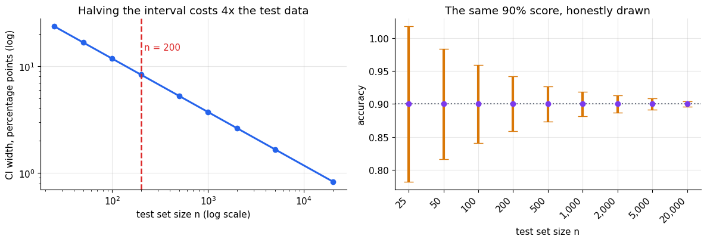

### Cell 270

```python
# ============================================================
#  k-fold cross-validation, written out by hand. No library.
# ============================================================
K_FOLDS = 5


def cross_val_scores(X, y, degree=2, k=K_FOLDS, rng=None, iters=600):
    """Return the k held-out accuracies. Each fold: train on k-1, score on 1."""
    n     = len(y)
    order = rng.permutation(n)                 # shuffle, or folds inherit order
    folds = np.array_split(order, k)
    out   = []
    for f in folds:
        held         = np.zeros(n, dtype=bool); held[f] = True
        Zt, mu_f, sd_f = design(X[~held], degree)          # fit scaling on TRAIN
        Zh, _, _       = design(X[held],  degree, mu_f, sd_f)
        w              = fit_logistic(Zt, y[~held], iters=iters)
        out.append(correct_flags(w, Zh, y[held]).mean())
    return np.array(out)


RNG_CV = np.random.default_rng(2024)
fold_scores = cross_val_scores(X_tr, y_tr, degree=DEG, rng=RNG_CV)

cv_mean = fold_scores.mean()
cv_sd   = fold_scores.std(ddof=1)

print(f"{K_FOLDS}-fold cross-validation on the {N_TRAIN} training examples")
print(f"(each fold holds out {N_TRAIN // K_FOLDS} examples)")
print()
for i, s in enumerate(fold_scores, 1):
    bar = "#" * int(round(s * 50))
    print(f"  fold {i}:  {s:.4f}  {bar}")
print()
print(f"  mean across folds     = {cv_mean:.4f}")
print(f"  sd   across folds     = {cv_sd:.4f}")
print(f"  worst fold            = {fold_scores.min():.4f}")
print(f"  best  fold            = {fold_scores.max():.4f}")
print(f"  spread (best - worst) = {fold_scores.max() - fold_scores.min():.4f}")
print()
print(f"  single-split test score (Part 9.1) = {acc_te:.4f}")
print(f"  true accuracy                      = {ACC_TRUE:.4f}")

fig, ax = plt.subplots(figsize=(9, 4.4))
ax.bar(np.arange(1, K_FOLDS + 1), fold_scores, color=C_F, alpha=0.85,
       edgecolor="white", width=0.6)
ax.axhline(cv_mean, color=C_SLOPE, lw=2.2, label=f"CV mean {cv_mean:.3f}")
ax.axhline(ACC_TRUE, color=C_AREA, lw=2.0, ls="--",
           label=f"true accuracy {ACC_TRUE:.3f}")
ax.set_ylim(min(fold_scores.min(), ACC_TRUE) - 0.06, 1.0)
ax.set_xlabel("fold"); ax.set_ylabel("held-out accuracy")
ax.set_title(f"{K_FOLDS}-fold cross-validation: the folds disagree, and that matters")
ax.legend(frameon=False, loc="lower right")
fig.tight_layout(); plt.show()
```

**Output**

```text
5-fold cross-validation on the 400 training examples
(each fold holds out 80 examples)

  fold 1:  0.9500  ################################################
  fold 2:  0.9250  ##############################################
  fold 3:  0.9375  ###############################################
  fold 4:  0.8875  ############################################
  fold 5:  0.9500  ################################################

  mean across folds     = 0.9300
  sd   across folds     = 0.0259
  worst fold            = 0.8875
  best  fold            = 0.9500
  spread (best - worst) = 0.0625

  single-split test score (Part 9.1) = 0.8950
  true accuracy                      = 0.9128
```

**Output**

```text
<Figure size 900x440 with 1 Axes>
```

**Figure**

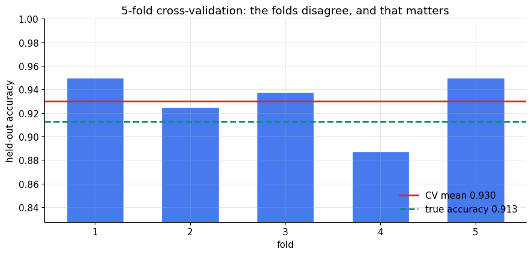

### Cell 273

```python
# ============================================================
#  Is sd_folds / sqrt(k) a standard error? Let us find out
#  the only honest way: repeat the whole exercise on many
#  fresh datasets and look at how much the CV estimate really
#  moves. That is the true standard error, by definition.
# ============================================================
N_DATASETS = 120
N_EACH     = 300
RNG_HON    = np.random.default_rng(31)

cv_means, naive_ses = [], []
for _ in range(N_DATASETS):
    Xd, yd = make_problem(N_EACH, RNG_HON)              # a brand-new dataset
    sc     = cross_val_scores(Xd, yd, degree=DEG, rng=RNG_HON, iters=600)
    cv_means.append(sc.mean())
    naive_ses.append(sc.std(ddof=1) / np.sqrt(K_FOLDS))  # the tempting formula

cv_means  = np.array(cv_means)
naive_ses = np.array(naive_ses)

true_se  = cv_means.std(ddof=1)      # how much the CV estimate ACTUALLY moves
naive_se = naive_ses.mean()          # what the fold sd would have told you

print(f"{N_DATASETS} independent datasets of {N_EACH}, "
      f"{K_FOLDS}-fold CV on each.")
print()
print(f"  TRUE standard error of the CV estimate")
print(f"    = sd of the {N_DATASETS} CV means            = {true_se:.4f}")
print(f"  NAIVE standard error from within one dataset")
print(f"    = average of sd(folds)/sqrt(k)          = {naive_se:.4f}")
print()
print(f"  ratio naive / true = {naive_se / true_se:.2f}")
print()
if naive_se < true_se:
    print(f"The naive formula UNDERSTATES the real uncertainty by "
          f"{100 * (1 - naive_se / true_se):.0f}%.")
    print("Intervals built from it would be too narrow, and would catch the")
    print("truth less often than they claim to.")
else:
    print("On this problem the naive formula did not come out smaller.")
    print("Reported as measured. The theoretical objection below still stands:")
    print("there is no general guarantee in either direction.")
print()
print("WHY: the k training sets overlap heavily -- with k = 5 any two of them")
print("share 3/4 of their examples -- so the fold scores are correlated, not")
print("independent. Dividing by sqrt(k) is a move that only works for")
print("independent things (Part 3). Here it is not licensed.")

fig, ax = plt.subplots(figsize=(9, 4.4))
ax.hist(cv_means, bins=24, color=C_F, alpha=0.85, edgecolor="white",
        label=f"{N_DATASETS} CV estimates, one per dataset")
ax.axvline(cv_means.mean(), color=C_SLOPE, lw=2.2, label="their mean")
ymax = ax.get_ylim()[1]
ax.annotate("", xy=(cv_means.mean() - true_se, ymax * 0.86),
            xytext=(cv_means.mean() + true_se, ymax * 0.86),
            arrowprops=dict(arrowstyle="<->", color=C_EXACT, lw=2.4))
ax.text(cv_means.mean(), ymax * 0.90, "+/- TRUE standard error",
        color=C_EXACT, ha="center")
ax.annotate("", xy=(cv_means.mean() - naive_se, ymax * 0.62),
            xytext=(cv_means.mean() + naive_se, ymax * 0.62),
            arrowprops=dict(arrowstyle="<->", color=C_APPROX, lw=2.4))
ax.text(cv_means.mean(), ymax * 0.66, "+/- naive fold-based SE",
        color=C_APPROX, ha="center")
ax.set_xlabel("cross-validated accuracy estimate")
ax.set_ylabel("datasets")
ax.set_title("What the fold spread claims, against what actually happens")
ax.legend(frameon=False, loc="upper left")
fig.tight_layout(); plt.show()
```

**Output**

```text
120 independent datasets of 300, 5-fold CV on each.

  TRUE standard error of the CV estimate
    = sd of the 120 CV means            = 0.0187
  NAIVE standard error from within one dataset
    = average of sd(folds)/sqrt(k)          = 0.0156

  ratio naive / true = 0.83

The naive formula UNDERSTATES the real uncertainty by 17%.
Intervals built from it would be too narrow, and would catch the
truth less often than they claim to.

WHY: the k training sets overlap heavily -- with k = 5 any two of them
share 3/4 of their examples -- so the fold scores are correlated, not
independent. Dividing by sqrt(k) is a move that only works for
independent things (Part 3). Here it is not licensed.
```

**Output**

```text
<Figure size 900x440 with 1 Axes>
```

**Figure**

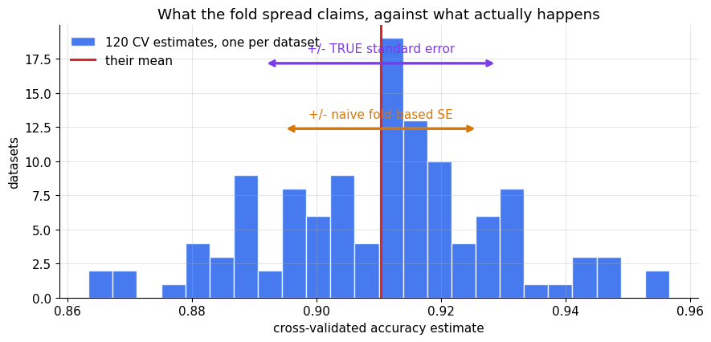

### Cell 277

```python
# ============================================================
#  Model A: degree-2 logistic on all 400 training examples.
#  Model B: the same recipe on only 100 of them -- genuinely
#           a bit worse, but only a bit. A realistic close call.
#  Model C: heavily over-regularised. Genuinely much worse.
# ============================================================
RNG_AB = np.random.default_rng(4)

idx_B  = RNG_AB.choice(N_TRAIN, 100, replace=False)
Z_B, mu_B, sd_B = design(X_tr[idx_B], DEG)
w_B    = fit_logistic(Z_B, y_tr[idx_B])

Z_C, mu_C, sd_C = design(X_tr, DEG)
w_C    = fit_logistic(Z_C, y_tr, l2=1.0)          # crushed by regularisation

def flags_on(w, mu_, sd_, X, y, degree=DEG):
    Z, _, _ = design(X, degree, mu_, sd_)
    return correct_flags(w, Z, y)

cor_A = corr_te                                          # already computed
cor_B = flags_on(w_B, mu_B, sd_B, X_te, y_te)
cor_C = flags_on(w_C, mu_C, sd_C, X_te, y_te)

true_A = ACC_TRUE
true_B = flags_on(w_B, mu_B, sd_B, X_or, y_or).mean()
true_C = flags_on(w_C, mu_C, sd_C, X_or, y_or).mean()

print(f"on the SAME test set of {n_t} examples")
print(f"  model A  test {cor_A.mean():.4f}   (true {true_A:.4f})")
print(f"  model B  test {cor_B.mean():.4f}   (true {true_B:.4f})")
print(f"  model C  test {cor_C.mean():.4f}   (true {true_C:.4f})")
print()
print(f"  A - B on the test set = {100 * (cor_A.mean() - cor_B.mean()):+.2f} percentage points")
print(f"  A - B in TRUTH        = {100 * (true_A - true_B):+.2f} percentage points")
print()

# --- the paired 2x2 table: this is the whole comparison ---------------
both  = int(((cor_A == 1) & (cor_B == 1)).sum())
onlyA = int(((cor_A == 1) & (cor_B == 0)).sum())
onlyB = int(((cor_A == 0) & (cor_B == 1)).sum())
neither = int(((cor_A == 0) & (cor_B == 0)).sum())

print("  the paired table for A vs B (every test example lands in one box):")
print("                          B right   B wrong")
print(f"      A right          {both:8d}  {onlyA:8d}")
print(f"      A wrong          {onlyB:8d}  {neither:8d}")
print()
print(f"  agreements (carry NO information about which is better): {both + neither}")
print(f"  disagreements (carry ALL of it):                         {onlyA + onlyB}")
print()
print("Out of 200 test examples, the comparison rests on the handful in the")
print("off-diagonal. That is why these differences are so hard to establish.")
```

**Output**

```text
on the SAME test set of 200 examples
  model A  test 0.8950   (true 0.9128)
  model B  test 0.8800   (true 0.9046)
  model C  test 0.8150   (true 0.7742)

  A - B on the test set = +1.50 percentage points
  A - B in TRUTH        = +0.82 percentage points

  the paired table for A vs B (every test example lands in one box):
                          B right   B wrong
      A right               175         4
      A wrong                 1        20

  agreements (carry NO information about which is better): 195
  disagreements (carry ALL of it):                         5

Out of 200 test examples, the comparison rests on the handful in the
off-diagonal. That is why these differences are so hard to establish.
```

### Cell 279

```python
# ============================================================
#  A PAIRED PERMUTATION TEST on per-example correctness.
#  Null hypothesis: the two models are interchangeable, so for
#  each example it is a coin flip which model's result is which.
#  Simulate that null directly: flip the sign of each paired
#  difference at random, many times. Part 5's logic, Part 6's pairing.
# ============================================================
N_PERM = 20_000


def paired_permutation_test(c1, c2, n_perm=N_PERM, rng=None):
    """Two-sided p-value for a difference in paired 0/1 correctness."""
    d       = c1 - c2                       # each entry is -1, 0, or +1
    obs     = d.mean()
    signs   = rng.choice([-1.0, 1.0], size=(n_perm, len(d)))
    null    = (signs * d).mean(axis=1)      # the null distribution, simulated
    p_value = float((np.abs(null) >= abs(obs) - 1e-12).mean())
    return obs, p_value, null


def cohens_dz(c1, c2):
    """Effect size for a paired comparison: mean difference in sd units."""
    d = c1 - c2
    s = d.std(ddof=1)
    return float(d.mean() / s) if s > 0 else 0.0


obs_AB, p_AB, null_AB = paired_permutation_test(cor_A, cor_B, rng=RNG_AB)
obs_AC, p_AC, null_AC = paired_permutation_test(cor_A, cor_C, rng=RNG_AB)

print("=" * 66)
print(" A vs B  -- the close call")
print("=" * 66)
print(f"  observed difference   = {100 * obs_AB:+.2f} percentage points")
print(f"  disagreements         = {onlyA} for A, {onlyB} for B")
print(f"  permutation p-value   = {p_AB:.4f}")
print(f"  effect size Cohen's dz= {cohens_dz(cor_A, cor_B):+.3f}")
print()
print("=" * 66)
print(" A vs C  -- the obvious case, as a control")
print("=" * 66)
d_AC1 = int(((cor_A == 1) & (cor_C == 0)).sum())
d_AC2 = int(((cor_A == 0) & (cor_C == 1)).sum())
print(f"  observed difference   = {100 * obs_AC:+.2f} percentage points")
print(f"  disagreements         = {d_AC1} for A, {d_AC2} for C")
print(f"  permutation p-value   = {p_AC:.4f}")
print(f"  effect size Cohen's dz= {cohens_dz(cor_A, cor_C):+.3f}")
print()
print("-" * 66)
verdict = ("NOT distinguishable from noise" if p_AB > 0.05
           else "distinguishable from noise")
print(f" VERDICT on A vs B: {verdict} (p = {p_AB:.3f}).")
print(f" And yet in TRUTH A really is better than B, by "
      f"{100 * (true_A - true_B):.2f} points.")
print(" The difference is real. This test set is simply too small to see it.")
print(" 'Not significant' means 'not established', never 'not there'. Part 5.")
print("-" * 66)

fig, (ax1, ax2) = plt.subplots(1, 2, figsize=(12, 4.2))
for ax, null, obs, ttl, pv in [
        (ax1, null_AB, obs_AB, "A vs B: the close call", p_AB),
        (ax2, null_AC, obs_AC, "A vs C: a real difference", p_AC)]:
    ax.hist(100 * null, bins=45, color=C_SOFT, edgecolor="white")
    ax.axvline(100 * obs, color=C_SLOPE, lw=2.6,
               label=f"observed {100 * obs:+.2f} pts")
    ax.set_xlabel("difference in accuracy under the null (pct points)")
    ax.set_ylabel("permutations")
    ax.set_title(f"{ttl}   p = {pv:.3f}")
    ax.legend(frameon=False)
fig.tight_layout(); plt.show()
```

**Output**

```text
==================================================================
 A vs B  -- the close call
==================================================================
  observed difference   = +1.50 percentage points
  disagreements         = 4 for A, 1 for B
  permutation p-value   = 0.3804
  effect size Cohen's dz= +0.095

==================================================================
 A vs C  -- the obvious case, as a control
==================================================================
  observed difference   = +8.00 percentage points
  disagreements         = 28 for A, 12 for C
  permutation p-value   = 0.0167
  effect size Cohen's dz= +0.181

------------------------------------------------------------------
 VERDICT on A vs B: NOT distinguishable from noise (p = 0.380).
 And yet in TRUTH A really is better than B, by 0.82 points.
 The difference is real. This test set is simply too small to see it.
 'Not significant' means 'not established', never 'not there'. Part 5.
------------------------------------------------------------------
```

**Output**

```text
<Figure size 1200x420 with 2 Axes>
```

**Figure**

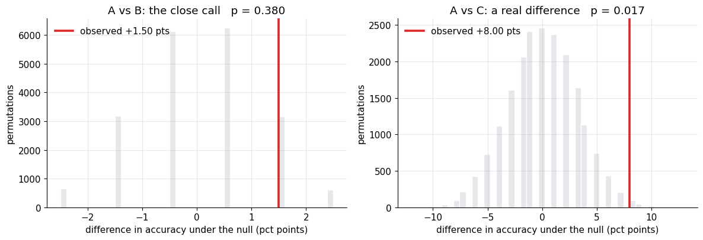

### Cell 282

```python
# ============================================================
#  The exact version of the same test (McNemar), from scratch.
#  Only the disagreements matter; under the null each one is a
#  fair coin. So the p-value is a two-sided binomial tail.
# ============================================================
def mcnemar_exact(c1, c2):
    n10 = int(((c1 == 1) & (c2 == 0)).sum())
    n01 = int(((c1 == 0) & (c2 == 1)).sum())
    m   = n10 + n01
    if m == 0:
        return n10, n01, 1.0
    k   = min(n10, n01)
    # two-sided: both tails of Binomial(m, 1/2), capped at 1
    p   = min(1.0, 2.0 * stats.binom.cdf(k, m, 0.5))
    return n10, n01, float(p)


mc_se_perm = np.sqrt(max(p_AB, 1e-9) * (1 - p_AB) / N_PERM)

print(f"{'comparison':<12}{'n(1st)':>8}{'n(2nd)':>8}"
      f"{'exact p':>11}{'permutation p':>16}")
print("-" * 55)
for nm, c1, c2, pperm in [("A vs B", cor_A, cor_B, p_AB),
                          ("A vs C", cor_A, cor_C, p_AC)]:
    a, b, pex = mcnemar_exact(c1, c2)
    print(f"{nm:<12}{a:>8}{b:>8}{pex:>11.4f}{pperm:>16.4f}")
print()
_, _, p_exact_AB = mcnemar_exact(cor_A, cor_B)
gap = abs(p_exact_AB - p_AB)
print(f"A vs B: exact and simulated p differ by {gap:.4f}")
print(f"        Monte-Carlo noise on {N_PERM:,} permutations is about "
      f"{2 * mc_se_perm:.4f}")
if gap <= 3 * mc_se_perm + 0.01:
    print("        -> agreement within simulation error. Both are right.")
else:
    print("        -> larger than simulation error. Reported as measured;")
    print("           the two tests are not identical in their tie-handling.")
print()
print("Two independent routes to the same number. The simulation needed no")
print("combinatorics; the exact test needed no computer. Neither was assumed.")
```

**Output**

```text
comparison    n(1st)  n(2nd)    exact p   permutation p
-------------------------------------------------------
A vs B             4       1     0.3750          0.3804
A vs C            28      12     0.0166          0.0167

A vs B: exact and simulated p differ by 0.0054
        Monte-Carlo noise on 20,000 permutations is about 0.0069
        -> agreement within simulation error. Both are right.

Two independent routes to the same number. The simulation needed no
combinatorics; the exact test needed no computer. Neither was assumed.
```

### Cell 284

```python
# ============================================================
#  The winner's curse, measured. Two experiments, one figure.
#
#  LEFT   idealised: 20 variants that are all EXACTLY equally good
#         (true accuracy 90%), each scored on 200 fresh examples.
#         Pick the best score. Any excess over 90% is pure luck.
#
#  RIGHT  real: 20 genuinely-fitted variants per run. Pick the best
#         by score on a 200-example set, then measure that same
#         model on 6,000 fresh examples. The gap is the optimism.
#         The fix -- select on a VALIDATION set and report on a
#         separate TEST set -- is measured in the same loop.
# ============================================================
N_VARIANTS = 20
TRUE_ACC   = 0.90

# ---------- LEFT: idealised, vectorised, instant ----------------------
SIMS_IDEAL = 20_000
scores_ideal = RNG9.binomial(n_t, TRUE_ACC, size=(SIMS_IDEAL, N_VARIANTS)) / n_t
winner_ideal = scores_ideal.max(axis=1)
single_ideal = scores_ideal[:, 0]

print("IDEALISED: 20 variants, all with true accuracy "
      f"{TRUE_ACC:.0%}, test set of {n_t}")
print(f"  score of ONE variant, on average          = {single_ideal.mean():.4f}")
print(f"  score of the BEST of {N_VARIANTS}, on average      = {winner_ideal.mean():.4f}")
print(f"  optimism bias                             = "
      f"{100 * (winner_ideal.mean() - TRUE_ACC):+.2f} percentage points")
print(f"  best-of-{N_VARIANTS} exceeded {TRUE_ACC:.0%} in "
      f"{100 * (winner_ideal > TRUE_ACC).mean():.1f}% of runs")
print("  (every one of those 'wins' is noise: the variants are identical.)")
print()

# ---------- RIGHT: real models, plus the fix --------------------------
SIMS_REAL, N_SUB, DEG_V = 80, 80, 3
RNG_WC = np.random.default_rng(5)
bias_test_sel, bias_val_sel, bias_heldout = [], [], []

for _ in range(SIMS_REAL):
    Xp, yp = make_problem(300,   RNG_WC)      # pool to train variants on
    Xv, yv = make_problem(n_t,   RNG_WC)      # validation set (200)
    Xs, ys = make_problem(n_t,   RNG_WC)      # separate test set (200)
    Xf, yf = make_problem(6_000, RNG_WC)      # stand-in for the truth

    va, te, tr_ = [], [], []
    for _v in range(N_VARIANTS):
        sub          = RNG_WC.choice(300, N_SUB, replace=False)
        Zv, mv, sv   = design(Xp[sub], DEG_V)
        w            = fit_logistic(Zv, yp[sub], iters=400, l2=1e-2)
        va.append(flags_on(w, mv, sv, Xv, yv, DEG_V).mean())
        te.append(flags_on(w, mv, sv, Xs, ys, DEG_V).mean())
        tr_.append(flags_on(w, mv, sv, Xf, yf, DEG_V).mean())
    va, te, tr_ = np.array(va), np.array(te), np.array(tr_)

    j_bad  = int(np.argmax(te))        # WRONG: select and report on one set
    bias_test_sel.append(te[j_bad] - tr_[j_bad])

    j_good = int(np.argmax(va))        # RIGHT: select on validation...
    bias_val_sel.append(va[j_good] - tr_[j_good])   # validation score is biased
    bias_heldout.append(te[j_good] - tr_[j_good])   # test score is not

bias_test_sel = np.array(bias_test_sel)
bias_val_sel  = np.array(bias_val_sel)
bias_heldout  = np.array(bias_heldout)

def pm(a):
    """mean +/- 95% Monte-Carlo uncertainty, in percentage points."""
    m  = 100 * a.mean()
    se = 100 * a.std(ddof=1) / np.sqrt(len(a))
    return f"{m:+.2f} +/- {1.96 * se:.2f}"


print(f"REAL MODELS: {SIMS_REAL} runs, {N_VARIANTS} fitted variants each")
print("  (percentage points of optimism, each with its own 95% Monte-Carlo")
print("   uncertainty, so you can tell a real bias from simulation noise)")
print()
print(f"  select on the test set, report that same score :  {pm(bias_test_sel)}")
print(f"  select on validation, report the val score     :  {pm(bias_val_sel)}")
print(f"  select on validation, report the TEST score    :  {pm(bias_heldout)}   <- the fix")
print()
print("The first two lines estimate the SAME quantity by two routes -- in both,")
print("the score reported is the score that was selected on -- so they ought to")
print("agree, and their overlap is a check that this loop does what it claims.")
print()
se_fix  = bias_heldout.std(ddof=1) / np.sqrt(SIMS_REAL)
zero_ok = bool(abs(bias_heldout.mean()) < 1.96 * se_fix)
print(f"  is the third line consistent with ZERO bias? {zero_ok}")
print()
print("The bias with real models is smaller than the idealised one, for two")
print("honest reasons: the variants are not equally good (so some winning is")
print("merit rather than luck), and their predictions are correlated, so their")
print("scores cannot wander independently. Smaller is not zero.")

fig, (axL, axR) = plt.subplots(1, 2, figsize=(12, 4.3))

axL.hist(100 * single_ideal, bins=40, color=C_SOFT, edgecolor="white",
         label="one variant's score")
axL.hist(100 * winner_ideal, bins=40, color=C_APPROX, alpha=0.8,
         edgecolor="white", label=f"best of {N_VARIANTS}")
axL.axvline(100 * TRUE_ACC, color=C_SLOPE, lw=2.4,
            label=f"true accuracy of all of them ({TRUE_ACC:.0%})")
axL.set_xlabel("reported accuracy (%)"); axL.set_ylabel("runs")
axL.set_title("Idealised: 20 identical models, one leaderboard")
axL.legend(frameon=False, fontsize=9)

axR.hist(100 * bias_test_sel, bins=18, color=C_SLOPE, alpha=0.7,
         edgecolor="white", label="selected AND reported on the same set")
axR.hist(100 * bias_heldout, bins=18, color=C_AREA, alpha=0.7,
         edgecolor="white", label="selected on validation, reported on test")
axR.axvline(0, color=C_GREY, lw=2.0, ls="--", label="no bias")
axR.set_xlabel("reported score minus true accuracy (pct points)")
axR.set_ylabel("runs")
axR.set_title("Real models: the bias, and the fix")
axR.legend(frameon=False, fontsize=9)

fig.tight_layout(); plt.show()
```

**Output**

```text
IDEALISED: 20 variants, all with true accuracy 90%, test set of 200
  score of ONE variant, on average          = 0.8999
  score of the BEST of 20, on average      = 0.9376
  optimism bias                             = +3.76 percentage points
  best-of-20 exceeded 90% in 100.0% of runs
  (every one of those 'wins' is noise: the variants are identical.)

REAL MODELS: 80 runs, 20 fitted variants each
  (percentage points of optimism, each with its own 95% Monte-Carlo
   uncertainty, so you can tell a real bias from simulation noise)

  select on the test set, report that same score :  +1.60 +/- 0.39
  select on validation, report the val score     :  +2.01 +/- 0.39
  select on validation, report the TEST score    :  +0.14 +/- 0.47   <- the fix

The first two lines estimate the SAME quantity by two routes -- in both,
the score reported is the score that was selected on -- so they ought to
agree, and their overlap is a check that this loop does what it claims.

  is the third line consistent with ZERO bias? True

The bias with real models is smaller than the idealised one, for two
honest reasons: the variants are not equally good (so some winning is
merit rather than luck), and their predictions are correlated, so their
scores cannot wander independently. Smaller is not zero.
```

**Output**

```text
<Figure size 1200x430 with 2 Axes>
```

**Figure**

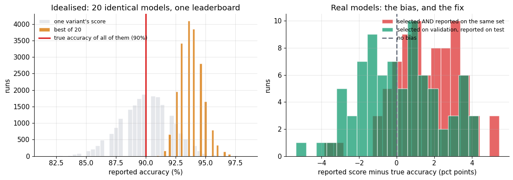

