# 10 — Data Science Probability Statistics 1

**Status:** Executed successfully

## Code and Output

### Cell 2

```python
# Complete Classification Pipeline

import numpy as np
import matplotlib.pyplot as plt

def softmax(logits):
    exp_logits = np.exp(logits - np.max(logits))
    return exp_logits / np.sum(exp_logits)

def cross_entropy_loss(y_true, y_pred):
    return -np.sum(y_true * np.log(y_pred + 1e-15))

# Simulate neural network
np.random.seed(42)
logits = np.array([2.5, 1.0, 0.5, -0.5])
classes = ['Cat', 'Dog', 'Bird', 'Fish']
y_true = np.array([1, 0, 0, 0])  # True: Cat
y_pred = softmax(logits)
loss = cross_entropy_loss(y_true, y_pred)

fig, axes = plt.subplots(2, 2, figsize=(14, 10))
colors = ['#e74c3c', '#3498db', '#2ecc71', '#9b59b6']

# Step 1: Logits
axes[0,0].bar(classes, logits, color=colors, edgecolor='black', alpha=0.7)
axes[0,0].axhline(y=0, color='black', linewidth=0.5)
axes[0,0].set_title('Step 1: Network Output (Logits)\nNOT probabilities!', fontsize=11, fontweight='bold')

# Step 2: Softmax
axes[0,1].bar(classes, y_pred, color=colors, edgecolor='black', alpha=0.7)
axes[0,1].set_ylim(0, 1)
axes[0,1].set_title(f'Step 2: Softmax → P(class|input)\nSum = {y_pred.sum():.2f}', fontsize=11, fontweight='bold')
for i, p in enumerate(y_pred):
    axes[0,1].text(i, p + 0.02, f'{p:.1%}', ha='center')

# Step 3: True label
axes[1,0].bar(classes, y_true, color=colors, edgecolor='black', alpha=0.5)
axes[1,0].set_title('Step 3: True Label (One-Hot)\n"The answer is Cat"', fontsize=11, fontweight='bold')

# Step 4: Loss
loss_contrib = -y_true * np.log(y_pred + 1e-15)
axes[1,1].bar(classes, loss_contrib, color=colors, edgecolor='black', alpha=0.7)
axes[1,1].axhline(y=loss, color='red', linewidth=2, linestyle='--', label=f'Loss = {loss:.3f}')
axes[1,1].set_title('Step 4: Cross-Entropy Loss\n-Σ y·log(ŷ)', fontsize=11, fontweight='bold')
axes[1,1].legend()

plt.suptitle('Complete Classification Pipeline: Probability in Action!', fontsize=14, fontweight='bold', y=1.02)
plt.tight_layout()
plt.show()

print("COMPLETE SUMMARY")
print("="*60)
print(f"1. Logits (raw):     {logits}")
print(f"2. Softmax (PMF):    {y_pred.round(3)} → Categorical Distribution!")
print(f"3. True label:       {y_true}")
print(f"4. Cross-entropy:    {loss:.4f}")
print(f"\nPrediction: {classes[np.argmax(y_pred)]} ({y_pred.max():.1%} confidence)")
```

**Output**

```text
<Figure size 1400x1000 with 4 Axes>
```

**Figure**

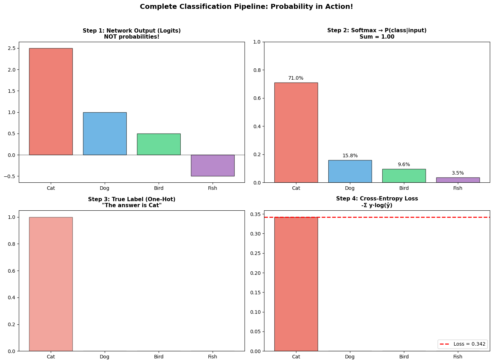

**Output**

```text
COMPLETE SUMMARY
============================================================
1. Logits (raw):     [ 2.5  1.   0.5 -0.5]
2. Softmax (PMF):    [0.71  0.158 0.096 0.035] → Categorical Distribution!
3. True label:       [1 0 0 0]
4. Cross-entropy:    0.3423

Prediction: Cat (71.0% confidence)
```

### Cell 4

```python
# Entropy: Measuring Prediction Confidence

def entropy(p):
    p = np.array(p)
    p = p[p > 0]
    return -np.sum(p * np.log2(p))

distributions = {
    'Certain [1,0,0,0]': [1, 0, 0, 0],
    'Confident [0.9,0.05,0.03,0.02]': [0.9, 0.05, 0.03, 0.02],
    'Uncertain [0.4,0.3,0.2,0.1]': [0.4, 0.3, 0.2, 0.1],
    'Maximum [0.25,0.25,0.25,0.25]': [0.25, 0.25, 0.25, 0.25]
}

fig, ax = plt.subplots(figsize=(10, 5))
entropies = [entropy(d) for d in distributions.values()]
colors = ['#e74c3c', '#f39c12', '#3498db', '#2ecc71']
bars = ax.bar(list(distributions.keys()), entropies, color=colors, edgecolor='black')
ax.set_ylabel('Entropy (bits)')
ax.set_title('Entropy: Higher = More Uncertain', fontsize=14, fontweight='bold')

for bar, h in zip(bars, entropies):
    ax.text(bar.get_x() + bar.get_width()/2, h + 0.05, f'{h:.2f}', ha='center', fontweight='bold')

plt.xticks(rotation=15)
plt.tight_layout()
plt.show()

print("Entropy Interpretation:")
print("• Certain (H=0): No uncertainty")
print("• Maximum (H=2): Maximum uncertainty for 4 classes")
print("\nIn neural networks: Low entropy = confident prediction")
```

**Output**

```text
<Figure size 1000x500 with 1 Axes>
```

**Figure**

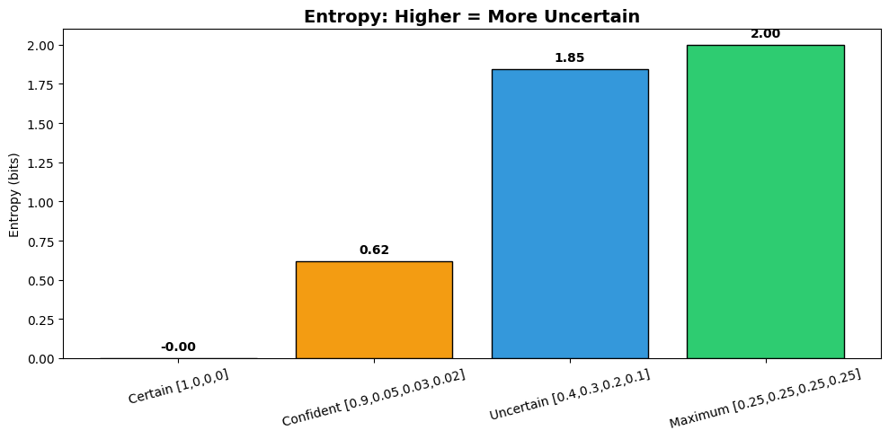

**Output**

```text
Entropy Interpretation:
• Certain (H=0): No uncertainty
• Maximum (H=2): Maximum uncertainty for 4 classes

In neural networks: Low entropy = confident prediction
```

### Cell 6

```python
# The Connection: Cross-Entropy = Negative Log-Likelihood

# True labels
y_true = np.array([1, 0, 1, 1, 0, 1, 0, 0, 1, 1])  # 6 ones, 4 zeros

# Try different prediction probabilities
p_values = np.linspace(0.1, 0.9, 50)
cross_entropies = []
log_likelihoods = []

for p in p_values:
    ce = -np.mean(y_true * np.log(p) + (1 - y_true) * np.log(1 - p))
    cross_entropies.append(ce)
    ll = np.sum(y_true * np.log(p) + (1 - y_true) * np.log(1 - p))
    log_likelihoods.append(ll)

p_mle = y_true.mean()

fig, axes = plt.subplots(1, 2, figsize=(14, 5))

axes[0].plot(p_values, cross_entropies, 'r-', linewidth=2)
axes[0].axvline(x=p_mle, color='green', linewidth=2, linestyle='--', label=f'Optimal: p = {p_mle}')
axes[0].set_xlabel('Predicted Probability')
axes[0].set_ylabel('Cross-Entropy Loss')
axes[0].set_title('Cross-Entropy (MINIMIZE)', fontsize=12, fontweight='bold')
axes[0].legend()

axes[1].plot(p_values, log_likelihoods, 'b-', linewidth=2)
axes[1].axvline(x=p_mle, color='green', linewidth=2, linestyle='--', label=f'MLE: p = {p_mle}')
axes[1].set_xlabel('Predicted Probability')
axes[1].set_ylabel('Log-Likelihood')
axes[1].set_title('Log-Likelihood (MAXIMIZE)', fontsize=12, fontweight='bold')
axes[1].legend()

plt.suptitle('Cross-Entropy Loss = Negative Log-Likelihood', fontsize=14, fontweight='bold', y=1.02)
plt.tight_layout()
plt.show()

print("THE KEY INSIGHT:")
print("="*50)
print("Minimizing Cross-Entropy = Maximizing Log-Likelihood")
print("\nTherefore: Training with cross-entropy = Maximum Likelihood Estimation!")
```

**Output**

```text
<Figure size 1400x500 with 2 Axes>
```

**Figure**

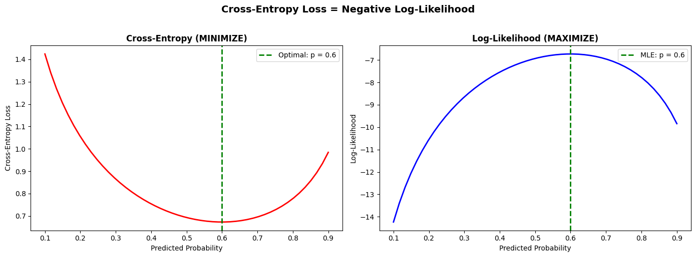

**Output**

```text
THE KEY INSIGHT:
==================================================
Minimizing Cross-Entropy = Maximizing Log-Likelihood

Therefore: Training with cross-entropy = Maximum Likelihood Estimation!
```

### Cell 8

```python
# Batch Normalization uses Mean and Variance

np.random.seed(42)

# Simulate activations before batch norm
activations = np.random.randn(1000) * 3 + 5  # Mean≈5, Std≈3

# Batch normalization: (x - mean) / std
mean = np.mean(activations)
std = np.std(activations)
normalized = (activations - mean) / std

fig, axes = plt.subplots(1, 2, figsize=(14, 5))

axes[0].hist(activations, bins=40, color='#e74c3c', edgecolor='black', alpha=0.7, density=True)
axes[0].axvline(x=mean, color='black', linewidth=2, linestyle='--', label=f'Mean = {mean:.2f}')
axes[0].set_title(f'Before Batch Norm\nMean={mean:.2f}, Std={std:.2f}', fontsize=12, fontweight='bold')
axes[0].legend()

axes[1].hist(normalized, bins=40, color='#2ecc71', edgecolor='black', alpha=0.7, density=True)
axes[1].axvline(x=0, color='black', linewidth=2, linestyle='--', label=f'Mean = {np.mean(normalized):.2f}')
axes[1].set_title(f'After Batch Norm\nMean={np.mean(normalized):.2f}, Std={np.std(normalized):.2f}', fontsize=12, fontweight='bold')
axes[1].legend()

plt.suptitle('Batch Normalization: x_norm = (x - μ) / σ', fontsize=14, fontweight='bold', y=1.02)
plt.tight_layout()
plt.show()

print("Why Batch Normalization helps:")
print("• Centers data (mean=0) and scales it (std=1)")
print("• Training becomes faster and more stable")
print("• Acts as regularization")
```

**Output**

```text
<Figure size 1400x500 with 2 Axes>
```

**Figure**

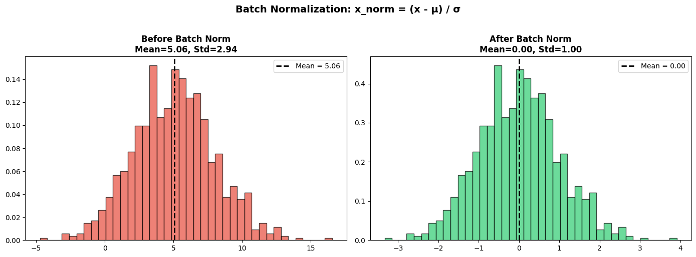

**Output**

```text
Why Batch Normalization helps:
• Centers data (mean=0) and scales it (std=1)
• Training becomes faster and more stable
• Acts as regularization
```

### Cell 10

```python
# The Gaussian (Normal) Distribution - Most important for deep learning

import numpy as np
import matplotlib.pyplot as plt
from scipy import stats

fig, axes = plt.subplots(1, 3, figsize=(15, 4))
x = np.linspace(-6, 6, 1000)

# Standard Normal
ax = axes[0]
y = stats.norm.pdf(x, 0, 1)
ax.plot(x, y, 'b-', linewidth=2)
ax.fill_between(x, y, alpha=0.3)
ax.axvline(x=0, color='red', linestyle='--', label='μ = 0')
ax.set_title('Standard Normal N(0, 1)', fontsize=11, fontweight='bold')
ax.set_xlabel('x')
ax.set_ylabel('Density')
ax.legend()

# Different means
ax = axes[1]
for mu, color in [(-2, '#e74c3c'), (0, '#3498db'), (2, '#2ecc71')]:
    y = stats.norm.pdf(x, mu, 1)
    ax.plot(x, y, color=color, linewidth=2, label=f'μ={mu}')
    ax.fill_between(x, y, alpha=0.2, color=color)
ax.set_title('Different Means (μ)\nShifts the center', fontsize=11, fontweight='bold')
ax.legend()

# Different standard deviations
ax = axes[2]
for sigma, color in [(0.5, '#e74c3c'), (1, '#3498db'), (2, '#2ecc71')]:
    y = stats.norm.pdf(x, 0, sigma)
    ax.plot(x, y, color=color, linewidth=2, label=f'σ={sigma}')
    ax.fill_between(x, y, alpha=0.2, color=color)
ax.set_title('Different Std Devs (σ)\nControls spread', fontsize=11, fontweight='bold')
ax.legend()

plt.suptitle('Gaussian Distribution: X ~ N(μ, σ²)', fontsize=14, fontweight='bold', y=1.02)
plt.tight_layout()
plt.show()

print("Why Gaussian is everywhere in deep learning:")
print("• Weight initialization: W ~ N(0, σ²)")
print("• VAE latent space: z ~ N(μ, σ²)")
print("• Regression: assumes Gaussian errors")
```

**Output**

```text
<Figure size 1500x400 with 3 Axes>
```

**Figure**

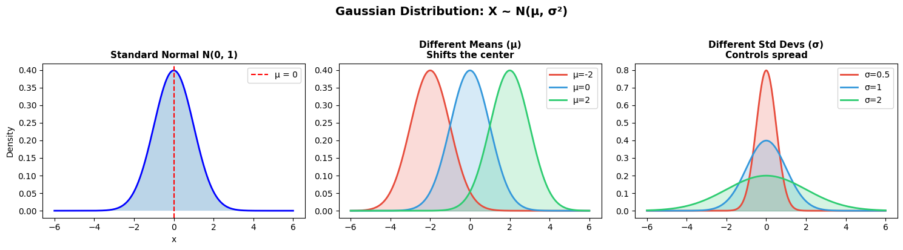

**Output**

```text
Why Gaussian is everywhere in deep learning:
• Weight initialization: W ~ N(0, σ²)
• VAE latent space: z ~ N(μ, σ²)
• Regression: assumes Gaussian errors
```

### Cell 12

```python
# Softmax creates a PMF (Probability Mass Function)

def softmax(logits):
    """Convert raw scores to probabilities (a PMF)"""
    exp_logits = np.exp(logits - np.max(logits))
    return exp_logits / np.sum(exp_logits)

# Neural network outputs (logits)
logits = np.array([2.0, 1.0, 0.5, -1.0, 0.0])
classes = ['Cat', 'Dog', 'Bird', 'Fish', 'Other']

# Convert to PMF
pmf = softmax(logits)

# Visualize
fig, axes = plt.subplots(1, 2, figsize=(14, 5))

colors = ['#e74c3c', '#3498db', '#2ecc71', '#9b59b6', '#95a5a6']
axes[0].bar(classes, logits, color=colors, edgecolor='black', alpha=0.7)
axes[0].axhline(y=0, color='black', linewidth=0.5)
axes[0].set_ylabel('Logit Value')
axes[0].set_title(f'Raw Network Output (Logits)\nSum = {logits.sum():.2f} (NOT a PMF!)',
                  fontsize=12, fontweight='bold')

axes[1].bar(classes, pmf, color=colors, edgecolor='black', alpha=0.7)
axes[1].set_ylabel('Probability P(Class = x)')
axes[1].set_title(f'After Softmax (PMF)\nSum = {pmf.sum():.2f} (Valid PMF!)',
                  fontsize=12, fontweight='bold')
axes[1].set_ylim(0, 1)

for i, p in enumerate(pmf):
    axes[1].text(i, p + 0.02, f'{p:.1%}', ha='center', fontsize=10)

plt.tight_layout()
plt.show()

print("The random variable X = 'predicted class' has PMF:")
for cls, prob in zip(classes, pmf):
    print(f"  P(X = {cls}) = {prob:.4f}")
print(f"\nSum of probabilities: {pmf.sum():.4f} = 1 ✓")
```

**Output**

```text
<Figure size 1400x500 with 2 Axes>
```

**Figure**

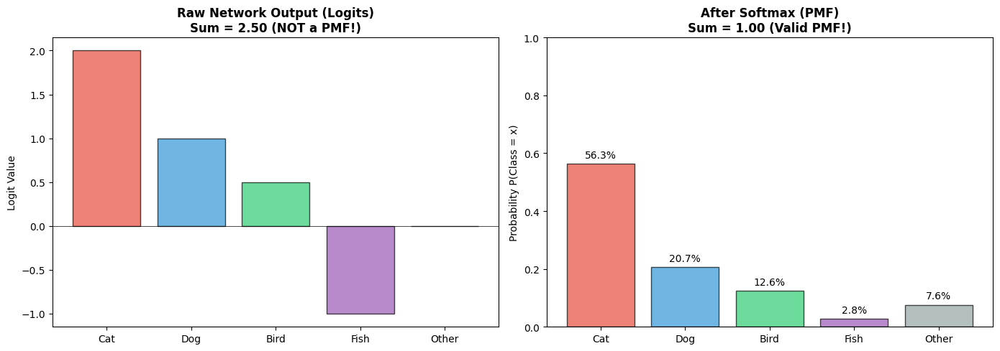

**Output**

```text
The random variable X = 'predicted class' has PMF:
  P(X = Cat) = 0.5630
  P(X = Dog) = 0.2071
  P(X = Bird) = 0.1256
  P(X = Fish) = 0.0280
  P(X = Other) = 0.0762

Sum of probabilities: 1.0000 = 1 ✓
```

### Cell 14

```python
# Visualizing discrete vs continuous random variables

fig, axes = plt.subplots(1, 2, figsize=(14, 5))

# Discrete: Sum of two dice
ax = axes[0]
dice_sums = []
for d1 in range(1, 7):
    for d2 in range(1, 7):
        dice_sums.append(d1 + d2)

values, counts = np.unique(dice_sums, return_counts=True)
probabilities = counts / 36

ax.bar(values, probabilities, color='#3498db', edgecolor='black', alpha=0.7)
ax.set_xlabel('Sum of Two Dice (X)', fontsize=12)
ax.set_ylabel('Probability P(X = x)', fontsize=12)
ax.set_title('DISCRETE Random Variable\n(Only specific values possible)', fontsize=12, fontweight='bold')
ax.set_xticks(values)

# Continuous: Height
ax = axes[1]
x = np.linspace(140, 200, 1000)
mean_height, std_height = 170, 10
pdf = stats.norm.pdf(x, mean_height, std_height)

ax.plot(x, pdf, 'b-', linewidth=2)
ax.fill_between(x, pdf, alpha=0.3, color='#3498db')
ax.axvline(x=mean_height, color='red', linestyle='--', label=f'Mean = {mean_height} cm')
ax.set_xlabel('Height in cm (X)', fontsize=12)
ax.set_ylabel('Probability Density f(x)', fontsize=12)
ax.set_title('CONTINUOUS Random Variable\n(Any value in range possible)', fontsize=12, fontweight='bold')
ax.legend()

plt.tight_layout()
plt.show()

print("Key Difference:")
print("• Discrete: We ask P(X = x) - probability of exact value")
print("• Continuous: We ask P(a < X < b) - probability of range")
print("  (For continuous, P(X = exact value) = 0!)")
```

**Output**

```text
<Figure size 1400x500 with 2 Axes>
```

**Figure**

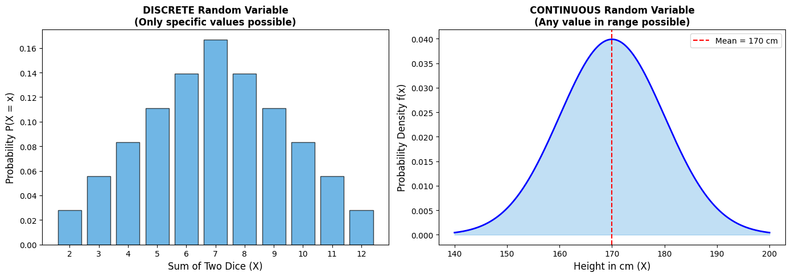

**Output**

```text
Key Difference:
• Discrete: We ask P(X = x) - probability of exact value
• Continuous: We ask P(a < X < b) - probability of range
  (For continuous, P(X = exact value) = 0!)
```

### Cell 18

```python
# Core libraries
import numpy as np
import matplotlib.pyplot as plt
from scipy import stats
import warnings
warnings.filterwarnings('ignore')

# Beautiful visualizations
plt.style.use('seaborn-v0_8-whitegrid')
plt.rcParams['figure.figsize'] = [10, 6]
plt.rcParams['font.size'] = 12
plt.rcParams['axes.titlesize'] = 14
plt.rcParams['axes.labelsize'] = 12

# For reproducibility
np.random.seed(42)

print("Setup complete! Let's learn probability.")
```

**Output**

```text
Setup complete! Let's learn probability.
```

### Cell 20

```python
# A neural network's output for an image classification
# The network is shown a picture and outputs its "beliefs"

classes = ['Cat', 'Dog', 'Bird', 'Fish', 'Other']
probabilities = [0.85, 0.08, 0.04, 0.02, 0.01]  # Must sum to 1!

# Create a nice visualization
fig, ax = plt.subplots(figsize=(10, 5))

colors = ['#e74c3c', '#3498db', '#2ecc71', '#9b59b6', '#95a5a6']
bars = ax.barh(classes, probabilities, color=colors, edgecolor='black', height=0.6)

# Add percentage labels
for bar, prob in zip(bars, probabilities):
    ax.text(prob + 0.02, bar.get_y() + bar.get_height()/2,
            f'{prob:.0%}', va='center', fontsize=12, fontweight='bold')

ax.set_xlabel('Probability (Confidence)', fontsize=12)
ax.set_title('Neural Network Output: "What animal is in this image?"', fontsize=14, fontweight='bold')
ax.set_xlim(0, 1.1)

# Add annotation
ax.annotate('The network is 85% confident\nthis is a cat!',
            xy=(0.85, 0), xytext=(0.6, 1.5),
            fontsize=11, ha='center',
            arrowprops=dict(arrowstyle='->', color='black'))

plt.tight_layout()
plt.show()

print(f"Sum of all probabilities: {sum(probabilities):.2f}")
print("\nThis is a PROBABILITY DISTRIBUTION - all options sum to 1!")
```

**Output**

```text
<Figure size 1000x500 with 1 Axes>
```

**Figure**

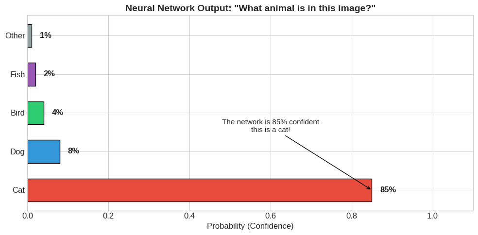

**Output**

```text
Sum of all probabilities: 1.00

This is a PROBABILITY DISTRIBUTION - all options sum to 1!
```

### Cell 23

```python
# Simulating coin flips to understand probability

def simulate_coin_flips(n_flips, true_prob_heads=0.5):
    """Flip a coin n times and track the running proportion of heads"""
    flips = np.random.random(n_flips) < true_prob_heads  # True = Heads
    cumulative_heads = np.cumsum(flips)
    flip_numbers = np.arange(1, n_flips + 1)
    running_proportion = cumulative_heads / flip_numbers
    return running_proportion

# Run multiple experiments
n_flips = 1000
n_experiments = 5

fig, ax = plt.subplots(figsize=(12, 6))

colors = plt.cm.viridis(np.linspace(0, 0.8, n_experiments))
for i in range(n_experiments):
    proportions = simulate_coin_flips(n_flips)
    ax.plot(proportions, color=colors[i], alpha=0.7, linewidth=1.5, label=f'Experiment {i+1}')

# Add the true probability line
ax.axhline(y=0.5, color='red', linestyle='--', linewidth=2, label='True probability (0.5)')

ax.set_xlabel('Number of Coin Flips', fontsize=12)
ax.set_ylabel('Proportion of Heads', fontsize=12)
ax.set_title('The Law of Large Numbers: Proportion Converges to True Probability',
             fontsize=14, fontweight='bold')
ax.set_ylim(0.3, 0.7)
ax.legend(loc='upper right')

# Add annotations
ax.annotate('Early: High variability', xy=(50, 0.65), fontsize=10,
            bbox=dict(boxstyle='round', facecolor='wheat', alpha=0.5))
ax.annotate('Later: Converges to 0.5', xy=(800, 0.52), fontsize=10,
            bbox=dict(boxstyle='round', facecolor='wheat', alpha=0.5))

plt.tight_layout()
plt.show()

print("Observe how the proportion stabilizes around 0.5 as we flip more coins!")
print("This is the 'Law of Large Numbers' in action.")
```

**Output**

```text
<Figure size 1200x600 with 1 Axes>
```

**Figure**

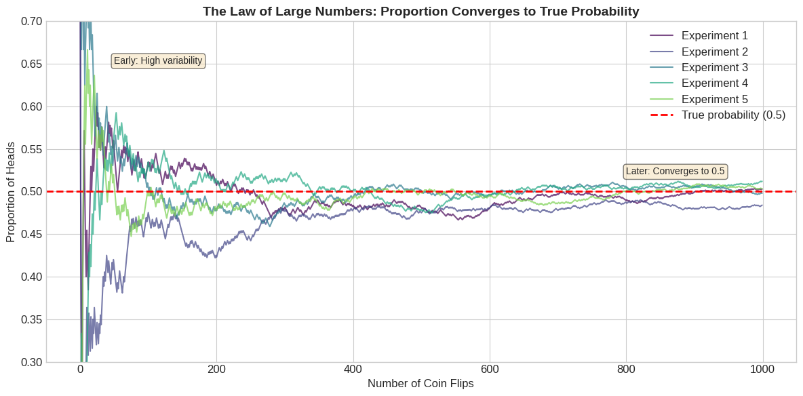

**Output**

```text
Observe how the proportion stabilizes around 0.5 as we flip more coins!
This is the 'Law of Large Numbers' in action.
```

### Cell 27

```python
# Visualizing the sample space of a die roll

fig, axes = plt.subplots(1, 3, figsize=(15, 4))

# Colors for each die face
die_colors = ['#e74c3c', '#e67e22', '#f1c40f', '#2ecc71', '#3498db', '#9b59b6']

# 1. The Sample Space (all possible outcomes)
ax = axes[0]
for i, (face, color) in enumerate(zip(range(1, 7), die_colors)):
    ax.add_patch(plt.Rectangle((i, 0), 0.8, 0.8, color=color, ec='black', lw=2))
    ax.text(i + 0.4, 0.4, str(face), ha='center', va='center', fontsize=20, fontweight='bold', color='white')
ax.set_xlim(-0.5, 6.5)
ax.set_ylim(-0.5, 1.5)
ax.set_aspect('equal')
ax.axis('off')
ax.set_title('Sample Space S = {1, 2, 3, 4, 5, 6}\n(All possible outcomes)', fontsize=12, fontweight='bold')

# 2. Event A: Rolling a 6 (simple event)
ax = axes[1]
for i, (face, color) in enumerate(zip(range(1, 7), die_colors)):
    alpha = 1.0 if face == 6 else 0.2
    ax.add_patch(plt.Rectangle((i, 0), 0.8, 0.8, color=color, ec='black', lw=2, alpha=alpha))
    ax.text(i + 0.4, 0.4, str(face), ha='center', va='center', fontsize=20, fontweight='bold',
            color='white' if face == 6 else 'gray')
ax.set_xlim(-0.5, 6.5)
ax.set_ylim(-0.5, 1.5)
ax.set_aspect('equal')
ax.axis('off')
ax.set_title('Event A: "Roll a 6"\n(1 outcome out of 6)', fontsize=12, fontweight='bold')

# 3. Event B: Rolling an even number (compound event)
ax = axes[2]
for i, (face, color) in enumerate(zip(range(1, 7), die_colors)):
    alpha = 1.0 if face % 2 == 0 else 0.2
    ax.add_patch(plt.Rectangle((i, 0), 0.8, 0.8, color=color, ec='black', lw=2, alpha=alpha))
    ax.text(i + 0.4, 0.4, str(face), ha='center', va='center', fontsize=20, fontweight='bold',
            color='white' if face % 2 == 0 else 'gray')
ax.set_xlim(-0.5, 6.5)
ax.set_ylim(-0.5, 1.5)
ax.set_aspect('equal')
ax.axis('off')
ax.set_title('Event B: "Roll an even number"\n(3 outcomes out of 6)', fontsize=12, fontweight='bold')

plt.tight_layout()
plt.show()

print("Sample Space: S = {1, 2, 3, 4, 5, 6}")
print("Event A (Roll a 6): {6}           -> P(A) = 1/6")
print("Event B (Even number): {2, 4, 6}  -> P(B) = 3/6 = 1/2")
```

**Output**

```text
<Figure size 1500x400 with 3 Axes>
```

**Figure**

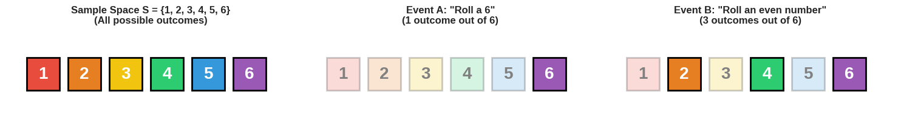

**Output**

```text
Sample Space: S = {1, 2, 3, 4, 5, 6}
Event A (Roll a 6): {6}           -> P(A) = 1/6
Event B (Even number): {2, 4, 6}  -> P(B) = 3/6 = 1/2
```

### Cell 29

```python
# Sample space for rolling two dice

fig, ax = plt.subplots(figsize=(10, 10))

# Create a grid for all possible outcomes
for die1 in range(1, 7):
    for die2 in range(1, 7):
        total = die1 + die2

        # Color by sum: highlight sum of 7
        if total == 7:
            color = '#e74c3c'  # Red for sum of 7
            alpha = 1.0
        else:
            color = '#3498db'  # Blue for others
            alpha = 0.3

        # Draw the outcome
        ax.add_patch(plt.Rectangle((die1 - 0.4, die2 - 0.4), 0.8, 0.8,
                                    color=color, ec='black', lw=1, alpha=alpha))
        ax.text(die1, die2, f'{total}', ha='center', va='center',
                fontsize=12, fontweight='bold', color='white' if total == 7 else 'gray')

ax.set_xlim(0, 7)
ax.set_ylim(0, 7)
ax.set_xlabel('Die 1', fontsize=14)
ax.set_ylabel('Die 2', fontsize=14)
ax.set_xticks(range(1, 7))
ax.set_yticks(range(1, 7))
ax.set_aspect('equal')
ax.set_title('Sample Space: All Possible Outcomes of Rolling Two Dice\n(Red = Sum of 7)',
             fontsize=14, fontweight='bold')
ax.grid(True, alpha=0.3)

plt.tight_layout()
plt.show()

# Count outcomes
total_outcomes = 36  # 6 x 6
sum_7_outcomes = 6   # (1,6), (2,5), (3,4), (4,3), (5,2), (6,1)

print(f"Total outcomes in sample space: {total_outcomes}")
print(f"Outcomes that sum to 7: {sum_7_outcomes}")
print(f"\nP(sum = 7) = {sum_7_outcomes}/{total_outcomes} = {sum_7_outcomes/total_outcomes:.4f} = {sum_7_outcomes/total_outcomes*100:.1f}%")
print("\nThe combinations that give 7: (1,6), (2,5), (3,4), (4,3), (5,2), (6,1)")
```

**Output**

```text
<Figure size 1000x1000 with 1 Axes>
```

**Figure**

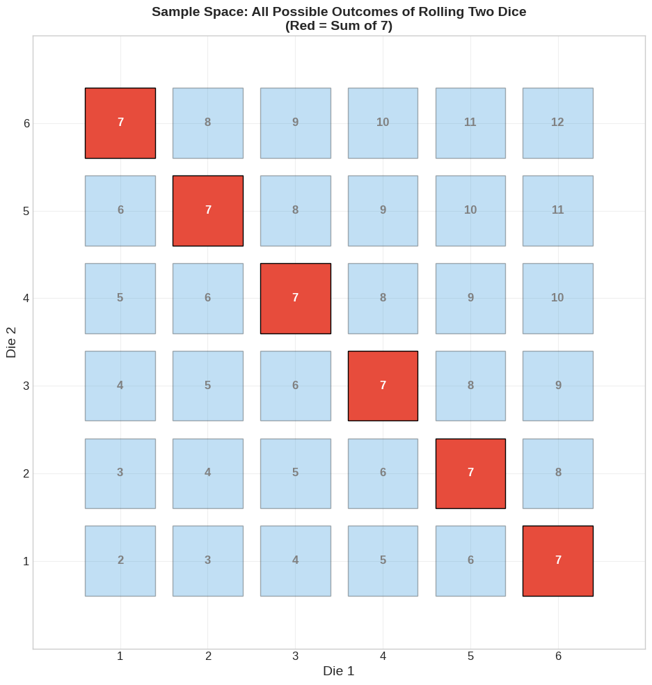

**Output**

```text
Total outcomes in sample space: 36
Outcomes that sum to 7: 6

P(sum = 7) = 6/36 = 0.1667 = 16.7%

The combinations that give 7: (1,6), (2,5), (3,4), (4,3), (5,2), (6,1)
```

### Cell 32

```python
# Visualizing complementary events

fig, axes = plt.subplots(1, 2, figsize=(12, 4))

# Event A and its complement
event_A = {6}  # Rolling a 6
complement_A = {1, 2, 3, 4, 5}  # NOT rolling a 6

for ax, event, title, color in zip(
    axes,
    [event_A, complement_A],
    ['Event A: Roll a 6\nP(A) = 1/6', 'Complement A\': NOT Roll a 6\nP(A\') = 5/6'],
    ['#e74c3c', '#3498db']
):
    for i, face in enumerate(range(1, 7)):
        alpha = 1.0 if face in event else 0.2
        ax.add_patch(plt.Rectangle((i, 0), 0.8, 0.8, color=color, ec='black', lw=2, alpha=alpha))
        ax.text(i + 0.4, 0.4, str(face), ha='center', va='center', fontsize=20, fontweight='bold',
                color='white' if face in event else 'lightgray')
    ax.set_xlim(-0.5, 6.5)
    ax.set_ylim(-0.5, 1.5)
    ax.set_aspect('equal')
    ax.axis('off')
    ax.set_title(title, fontsize=12, fontweight='bold')

plt.suptitle('The Complement Rule: P(A) + P(A\') = 1', fontsize=14, fontweight='bold', y=1.05)
plt.tight_layout()
plt.show()

print("The Complement Rule:")
print("P(A) + P(NOT A) = 1")
print(f"P(6) + P(NOT 6) = 1/6 + 5/6 = 1")
print("\nThis is useful! If it's hard to calculate P(A), calculate P(NOT A) and subtract from 1.")
```

**Output**

```text
<Figure size 1200x400 with 2 Axes>
```

**Figure**

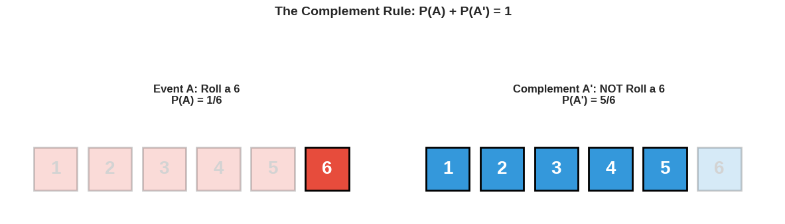

**Output**

```text
The Complement Rule:
P(A) + P(NOT A) = 1
P(6) + P(NOT 6) = 1/6 + 5/6 = 1

This is useful! If it's hard to calculate P(A), calculate P(NOT A) and subtract from 1.
```

### Cell 36

```python
# Visualizing the Addition Rule with a Venn Diagram

fig, axes = plt.subplots(1, 2, figsize=(14, 5))

# Left: Venn diagram
ax = axes[0]

# Draw circles
circle1 = plt.Circle((0.35, 0.5), 0.3, color='#e74c3c', alpha=0.5, label='Hearts (13 cards)')
circle2 = plt.Circle((0.65, 0.5), 0.3, color='#3498db', alpha=0.5, label='Kings (4 cards)')

ax.add_patch(circle1)
ax.add_patch(circle2)

# Labels
ax.text(0.2, 0.5, '12\nHearts\n(not King)', ha='center', va='center', fontsize=10, fontweight='bold')
ax.text(0.5, 0.5, '1\nKing of\nHearts', ha='center', va='center', fontsize=10, fontweight='bold')
ax.text(0.8, 0.5, '3\nKings\n(not Hearts)', ha='center', va='center', fontsize=10, fontweight='bold')

ax.set_xlim(-0.1, 1.1)
ax.set_ylim(0, 1)
ax.set_aspect('equal')
ax.axis('off')
ax.legend(loc='upper center', bbox_to_anchor=(0.5, 1.15), ncol=2)
ax.set_title('Venn Diagram: Hearts OR Kings', fontsize=12, fontweight='bold', pad=30)

# Right: The calculation
ax = axes[1]
ax.text(0.5, 0.9, 'The Addition Rule', fontsize=14, fontweight='bold', ha='center', transform=ax.transAxes)
ax.text(0.5, 0.75, 'P(Heart OR King) = P(Heart) + P(King) - P(Heart AND King)',
        fontsize=11, ha='center', transform=ax.transAxes,
        bbox=dict(boxstyle='round', facecolor='wheat', alpha=0.5))
ax.text(0.5, 0.55, 'P(Heart OR King) = 13/52 + 4/52 - 1/52',
        fontsize=12, ha='center', transform=ax.transAxes)
ax.text(0.5, 0.40, 'P(Heart OR King) = 16/52 = 4/13',
        fontsize=12, ha='center', transform=ax.transAxes, fontweight='bold')
ax.text(0.5, 0.20, f'P(Heart OR King) ≈ {16/52:.1%}',
        fontsize=14, ha='center', transform=ax.transAxes, fontweight='bold',
        bbox=dict(boxstyle='round', facecolor='lightgreen', alpha=0.5))
ax.axis('off')

plt.tight_layout()
plt.show()

print("Why do we subtract P(A and B)?")
print("Because the King of Hearts is in BOTH sets - we counted it twice!")
print("\nFinal answer: 12 + 1 + 3 = 16 cards out of 52")
```

**Output**

```text
<Figure size 1400x500 with 2 Axes>
```

**Figure**

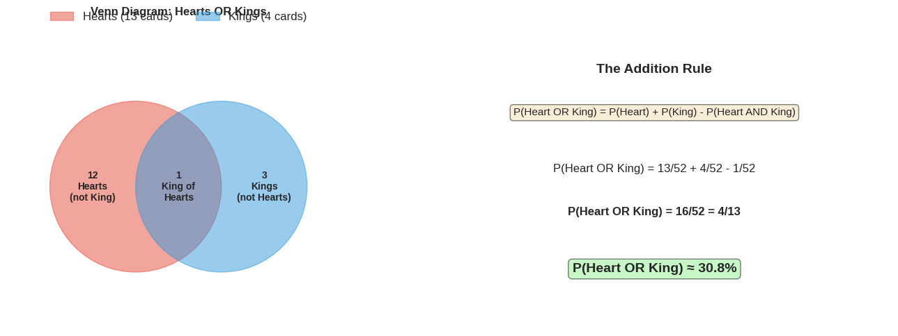

**Output**

```text
Why do we subtract P(A and B)?
Because the King of Hearts is in BOTH sets - we counted it twice!

Final answer: 12 + 1 + 3 = 16 cards out of 52
```

### Cell 39

```python
# Visualizing the Multiplication Rule

fig, ax = plt.subplots(figsize=(12, 6))

# Create a tree diagram
# Coin flip outcomes
ax.annotate('', xy=(0.3, 0.7), xytext=(0.1, 0.5),
            arrowprops=dict(arrowstyle='->', color='black', lw=2))
ax.annotate('', xy=(0.3, 0.3), xytext=(0.1, 0.5),
            arrowprops=dict(arrowstyle='->', color='black', lw=2))

# Labels
ax.text(0.1, 0.5, 'Start', fontsize=12, ha='center', va='center',
        bbox=dict(boxstyle='round', facecolor='lightblue', alpha=0.8))
ax.text(0.2, 0.65, 'P=0.5', fontsize=10, ha='center')
ax.text(0.2, 0.35, 'P=0.5', fontsize=10, ha='center')

ax.text(0.3, 0.7, 'Heads', fontsize=11, ha='center', va='center',
        bbox=dict(boxstyle='round', facecolor='#e74c3c', alpha=0.8))
ax.text(0.3, 0.3, 'Tails', fontsize=11, ha='center', va='center',
        bbox=dict(boxstyle='round', facecolor='#3498db', alpha=0.8))

# Die outcomes from Heads
die_faces = [1, 2, 3, 4, 5, 6]
y_positions = np.linspace(0.9, 0.5, 6)

for face, y in zip(die_faces, y_positions):
    ax.annotate('', xy=(0.6, y), xytext=(0.35, 0.7),
                arrowprops=dict(arrowstyle='->', color='gray', lw=1, alpha=0.5))
    color = '#2ecc71' if face == 6 else 'lightgray'
    ax.text(0.6, y, f'{face}', fontsize=10, ha='center', va='center',
            bbox=dict(boxstyle='round', facecolor=color, alpha=0.8))

# Highlight the winning path
ax.annotate('', xy=(0.6, 0.5), xytext=(0.35, 0.7),
            arrowprops=dict(arrowstyle='->', color='green', lw=3))

# Result annotation
ax.text(0.75, 0.5, 'Heads AND 6\nP = 0.5 × (1/6)\nP = 1/12 ≈ 8.3%',
        fontsize=11, ha='left', va='center',
        bbox=dict(boxstyle='round', facecolor='#2ecc71', alpha=0.8))

ax.text(0.5, 0.15, 'Multiplication Rule: P(Heads AND 6) = P(Heads) × P(6)',
        fontsize=12, ha='center', fontweight='bold',
        bbox=dict(boxstyle='round', facecolor='wheat', alpha=0.8))

ax.set_xlim(0, 1)
ax.set_ylim(0, 1)
ax.axis('off')
ax.set_title('Tree Diagram: Coin Flip then Die Roll', fontsize=14, fontweight='bold')

plt.tight_layout()
plt.show()

print("For independent events:")
print("P(A AND B) = P(A) × P(B)")
print(f"P(Heads AND 6) = 0.5 × (1/6) = {0.5 * (1/6):.4f} = 1/12")
```

**Output**

```text
<Figure size 1200x600 with 1 Axes>
```

**Figure**

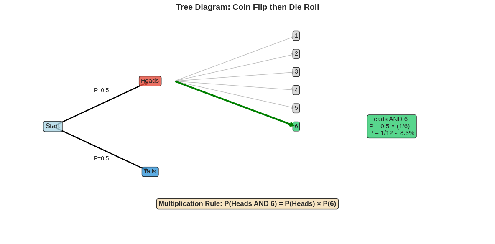

**Output**

```text
For independent events:
P(A AND B) = P(A) × P(B)
P(Heads AND 6) = 0.5 × (1/6) = 0.0833 = 1/12
```

### Cell 42

```python
# Practice: Let's verify these rules with simulation

n_trials = 100000

# Simulate coin flips and die rolls
coins = np.random.choice(['H', 'T'], n_trials)
dice = np.random.randint(1, 7, n_trials)

# Count outcomes
heads_and_6 = np.sum((coins == 'H') & (dice == 6))
heads_or_6 = np.sum((coins == 'H') | (dice == 6))

# Calculate probabilities
p_heads = np.sum(coins == 'H') / n_trials
p_six = np.sum(dice == 6) / n_trials

print(f"Simulation with {n_trials:,} trials:")
print("="*50)
print(f"P(Heads) = {p_heads:.4f} (expected: 0.5000)")
print(f"P(6) = {p_six:.4f} (expected: 0.1667)")
print()
print(f"P(Heads AND 6):")
print(f"  Simulated: {heads_and_6/n_trials:.4f}")
print(f"  Calculated: {0.5 * (1/6):.4f}")
print()
print(f"P(Heads OR 6):")
print(f"  Simulated: {heads_or_6/n_trials:.4f}")
print(f"  Calculated: {0.5 + 1/6 - 0.5*(1/6):.4f}")
```

**Output**

```text
Simulation with 100,000 trials:
==================================================
P(Heads) = 0.4984 (expected: 0.5000)
P(6) = 0.1652 (expected: 0.1667)

P(Heads AND 6):
  Simulated: 0.0828
  Calculated: 0.0833

P(Heads OR 6):
  Simulated: 0.5808
  Calculated: 0.5833
```

### Cell 46

```python
# Visualizing conditional probability with cards

fig, axes = plt.subplots(1, 2, figsize=(14, 5))

# Left: All cards
ax = axes[0]
# Represent deck as grid
kings = 4
other_face = 8  # Jacks and Queens
non_face = 40

# Create visual
cards = ['K']*kings + ['F']*other_face + ['·']*non_face
colors = ['#e74c3c']*kings + ['#f39c12']*other_face + ['#bdc3c7']*non_face

for i, (card, color) in enumerate(zip(cards, colors)):
    row, col = i // 13, i % 13
    ax.add_patch(plt.Rectangle((col, 3-row), 0.9, 0.9, color=color, ec='black', lw=0.5))
    if card != '·':
        ax.text(col + 0.45, 3-row + 0.45, card, ha='center', va='center', fontsize=8, fontweight='bold')

ax.set_xlim(-0.5, 13.5)
ax.set_ylim(-0.5, 4.5)
ax.set_aspect('equal')
ax.axis('off')
ax.set_title(f'Full Deck (52 cards)\nP(King) = 4/52 = {4/52:.1%}', fontsize=12, fontweight='bold')

# Legend
ax.text(14, 3, 'K = King', fontsize=9, color='#e74c3c')
ax.text(14, 2.5, 'F = Other Face', fontsize=9, color='#f39c12')
ax.text(14, 2, '· = Non-face', fontsize=9, color='#bdc3c7')

# Right: Only face cards
ax = axes[1]
face_cards = ['K']*kings + ['F']*other_face
face_colors = ['#e74c3c']*kings + ['#f39c12']*other_face

for i, (card, color) in enumerate(zip(face_cards, face_colors)):
    row, col = i // 6, i % 6
    ax.add_patch(plt.Rectangle((col, 1-row), 0.9, 0.9, color=color, ec='black', lw=1))
    ax.text(col + 0.45, 1-row + 0.45, card, ha='center', va='center', fontsize=12, fontweight='bold', color='white')

ax.set_xlim(-0.5, 6.5)
ax.set_ylim(-0.5, 2.5)
ax.set_aspect('equal')
ax.axis('off')
ax.set_title(f'Given: Face Card (12 cards)\nP(King | Face) = 4/12 = {4/12:.1%}', fontsize=12, fontweight='bold')

plt.suptitle('Conditional Probability: How Information Shrinks the Sample Space',
             fontsize=14, fontweight='bold', y=1.02)
plt.tight_layout()
plt.show()

print("Key Insight:")
print("When we know the card is a face card, we're only considering 12 cards, not 52!")
print(f"P(King) = {4/52:.1%} → P(King | Face Card) = {4/12:.1%}")
print("\nThe condition SHRINKS our sample space.")
```

**Output**

```text
<Figure size 1400x500 with 2 Axes>
```

**Figure**

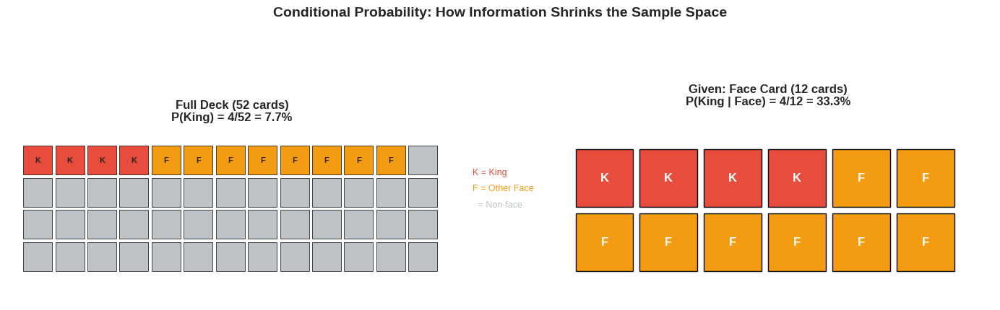

**Output**

```text
Key Insight:
When we know the card is a face card, we're only considering 12 cards, not 52!
P(King) = 7.7% → P(King | Face Card) = 33.3%

The condition SHRINKS our sample space.
```

### Cell 48

```python
# Verify the formula with our card example

# P(King and Face Card) = P(King) because all Kings are face cards
p_king_and_face = 4/52  # 4 kings out of 52

# P(Face Card)
p_face = 12/52  # 12 face cards out of 52

# P(King | Face Card) using the formula
p_king_given_face = p_king_and_face / p_face

print("Verifying the Conditional Probability Formula")
print("="*50)
print(f"P(King and Face) = {p_king_and_face:.4f} = {4}/52")
print(f"P(Face Card) = {p_face:.4f} = {12}/52")
print()
print(f"P(King | Face) = P(King and Face) / P(Face)")
print(f"              = ({4}/52) / ({12}/52)")
print(f"              = {4}/{12}")
print(f"              = {p_king_given_face:.4f}")
print(f"              = {p_king_given_face:.1%}")
```

**Output**

```text
Verifying the Conditional Probability Formula
==================================================
P(King and Face) = 0.0769 = 4/52
P(Face Card) = 0.2308 = 12/52

P(King | Face) = P(King and Face) / P(Face)
              = (4/52) / (12/52)
              = 4/12
              = 0.3333
              = 33.3%
```

### Cell 50

```python
# Medical testing example - visualizing with a population

# Imagine 10,000 people
population = 10000
disease_rate = 0.01  # 1% have disease
sensitivity = 0.95   # P(+|disease)
false_positive = 0.05  # P(+|no disease)

# Calculate groups
have_disease = int(population * disease_rate)  # 100 people
no_disease = population - have_disease  # 9,900 people

# Test results
true_positives = int(have_disease * sensitivity)  # 95
false_negatives = have_disease - true_positives  # 5
false_positives = int(no_disease * false_positive)  # 495
true_negatives = no_disease - false_positives  # 9,405

# Total positive tests
total_positives = true_positives + false_positives  # 590

# P(disease | positive)
p_disease_given_positive = true_positives / total_positives

# Visualize
fig, axes = plt.subplots(1, 3, figsize=(15, 5))

# 1. Population breakdown
ax = axes[0]
ax.pie([have_disease, no_disease], labels=['Have Disease', 'No Disease'],
       colors=['#e74c3c', '#2ecc71'], autopct='%1.1f%%', startangle=90,
       explode=[0.1, 0])
ax.set_title(f'Population: {population:,}', fontsize=12, fontweight='bold')

# 2. Test results breakdown
ax = axes[1]
categories = ['True +\n(Sick, Test +)', 'False +\n(Healthy, Test +)',
              'False -\n(Sick, Test -)', 'True -\n(Healthy, Test -)']
values = [true_positives, false_positives, false_negatives, true_negatives]
colors = ['#e74c3c', '#f39c12', '#9b59b6', '#2ecc71']
ax.bar(categories, values, color=colors, edgecolor='black')
ax.set_ylabel('Number of People')
ax.set_title('Test Results Breakdown', fontsize=12, fontweight='bold')
for i, v in enumerate(values):
    ax.text(i, v + 50, str(v), ha='center', fontweight='bold')

# 3. Among positive tests
ax = axes[2]
ax.pie([true_positives, false_positives],
       labels=[f'Actually Sick\n({true_positives})', f'Actually Healthy\n({false_positives})'],
       colors=['#e74c3c', '#f39c12'], autopct='%1.1f%%', startangle=90)
ax.set_title(f'Among Positive Tests ({total_positives})', fontsize=12, fontweight='bold')

plt.suptitle('The Base Rate Fallacy: Why Positive Tests Can Be Misleading',
             fontsize=14, fontweight='bold', y=1.02)
plt.tight_layout()
plt.show()

print("\nThe Surprising Result:")
print("="*50)
print(f"If you test positive, there's only a {p_disease_given_positive:.1%} chance you actually have the disease!")
print(f"\nWhy? Because:")
print(f"- Only {have_disease} people have the disease")
print(f"- But {false_positives} healthy people also test positive (false positives)")
print(f"- So out of {total_positives} positive tests, only {true_positives} are truly sick")
```

**Output**

```text
<Figure size 1500x500 with 3 Axes>
```

**Figure**

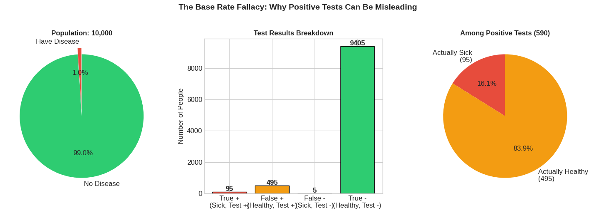

**Output**

```text
The Surprising Result:
==================================================
If you test positive, there's only a 16.1% chance you actually have the disease!

Why? Because:
- Only 100 people have the disease
- But 495 healthy people also test positive (false positives)
- So out of 590 positive tests, only 95 are truly sick
```

### Cell 56

```python
# Bayes' Theorem: Medical Diagnosis Example

def bayes_theorem(prior, likelihood, p_evidence):
    """Calculate posterior using Bayes' theorem"""
    return (likelihood * prior) / p_evidence

# Our medical example
P_disease = 0.01           # Prior: 1% of population has disease
P_positive_given_disease = 0.95   # Likelihood: 95% detection rate
P_positive_given_healthy = 0.05   # False positive rate: 5%

# Calculate P(evidence) using law of total probability
P_positive = (P_positive_given_disease * P_disease +
              P_positive_given_healthy * (1 - P_disease))

# Apply Bayes' theorem
P_disease_given_positive = bayes_theorem(P_disease, P_positive_given_disease, P_positive)

# Visualize the calculation
fig, ax = plt.subplots(figsize=(12, 6))

# Create a visual representation of the formula
ax.text(0.5, 0.9, "Bayes' Theorem", fontsize=20, fontweight='bold', ha='center', transform=ax.transAxes)

# The formula
ax.text(0.5, 0.75, r'$P(Disease|Positive) = \frac{P(Positive|Disease) \times P(Disease)}{P(Positive)}$',
        fontsize=16, ha='center', transform=ax.transAxes)

# The values
formula_text = f'''
P(Disease | Positive) = P(Positive | Disease) × P(Disease)
                        ────────────────────────────────────
                                    P(Positive)

                      = {P_positive_given_disease} × {P_disease}
                        ──────────────────────────────────
                              {P_positive:.4f}

                      = {P_disease_given_positive:.4f}

                      = {P_disease_given_positive:.1%}
'''
ax.text(0.5, 0.35, formula_text, fontsize=12, ha='center', va='center',
        transform=ax.transAxes, family='monospace',
        bbox=dict(boxstyle='round', facecolor='wheat', alpha=0.8))

ax.axis('off')
plt.tight_layout()
plt.show()

print("\nBreaking down the calculation:")
print("="*50)
print(f"Prior P(Disease) = {P_disease:.2%}")
print(f"Likelihood P(+|Disease) = {P_positive_given_disease:.0%}")
print(f"P(+|Healthy) = {P_positive_given_healthy:.0%}")
print(f"\nP(Positive) = P(+|D)×P(D) + P(+|H)×P(H)")
print(f"           = {P_positive_given_disease}×{P_disease} + {P_positive_given_healthy}×{1-P_disease}")
print(f"           = {P_positive:.4f}")
print(f"\nPosterior P(Disease|Positive) = {P_disease_given_positive:.4f} = {P_disease_given_positive:.1%}")
```

**Output**

```text
<Figure size 1200x600 with 1 Axes>
```

**Figure**

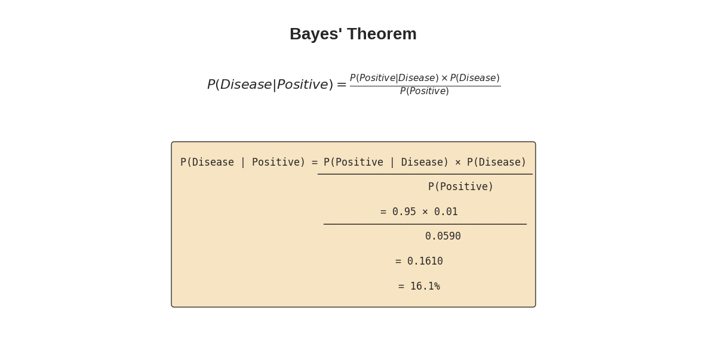

**Output**

```text
Breaking down the calculation:
==================================================
Prior P(Disease) = 1.00%
Likelihood P(+|Disease) = 95%
P(+|Healthy) = 5%

P(Positive) = P(+|D)×P(D) + P(+|H)×P(H)
           = 0.95×0.01 + 0.05×0.99
           = 0.0590

Posterior P(Disease|Positive) = 0.1610 = 16.1%
```

### Cell 58

```python
# Visualizing belief update

fig, axes = plt.subplots(1, 3, figsize=(15, 4))

# 1. Prior belief
ax = axes[0]
ax.bar(['Disease', 'No Disease'], [P_disease, 1-P_disease],
       color=['#e74c3c', '#2ecc71'], edgecolor='black')
ax.set_ylim(0, 1.1)
ax.set_title('PRIOR\n(Before testing)', fontsize=12, fontweight='bold')
ax.set_ylabel('Probability')
for i, v in enumerate([P_disease, 1-P_disease]):
    ax.text(i, v + 0.02, f'{v:.1%}', ha='center', fontsize=11)

# 2. Evidence (the test)
ax = axes[1]
ax.text(0.5, 0.5, 'TEST\nRESULT:\n\nPOSITIVE', fontsize=16, ha='center', va='center',
        transform=ax.transAxes, fontweight='bold',
        bbox=dict(boxstyle='round', facecolor='#f1c40f', alpha=0.8))
ax.text(0.5, 0.15, '(This is our evidence B)', fontsize=10, ha='center',
        transform=ax.transAxes, style='italic')
ax.axis('off')
ax.set_title('EVIDENCE\n(Observation)', fontsize=12, fontweight='bold')

# 3. Posterior belief
ax = axes[2]
ax.bar(['Disease', 'No Disease'], [P_disease_given_positive, 1-P_disease_given_positive],
       color=['#e74c3c', '#2ecc71'], edgecolor='black')
ax.set_ylim(0, 1.1)
ax.set_title('POSTERIOR\n(After positive test)', fontsize=12, fontweight='bold')
ax.set_ylabel('Probability')
for i, v in enumerate([P_disease_given_positive, 1-P_disease_given_positive]):
    ax.text(i, v + 0.02, f'{v:.1%}', ha='center', fontsize=11)

# Add arrows
fig.patches.extend([plt.Arrow(0.32, 0.5, 0.05, 0, width=0.1, transform=fig.transFigure,
                              facecolor='black', edgecolor='black')])
fig.patches.extend([plt.Arrow(0.64, 0.5, 0.05, 0, width=0.1, transform=fig.transFigure,
                              facecolor='black', edgecolor='black')])

plt.suptitle("Bayes' Theorem: Updating Beliefs with Evidence", fontsize=14, fontweight='bold', y=1.05)
plt.tight_layout()
plt.show()

print(f"Belief in disease went from {P_disease:.1%} to {P_disease_given_positive:.1%}")
print(f"That's a {P_disease_given_positive/P_disease:.1f}x increase!")
print("\nBut still, most likely you DON'T have the disease.")
```

**Output**

```text
<Figure size 1500x400 with 3 Axes>
```

**Figure**

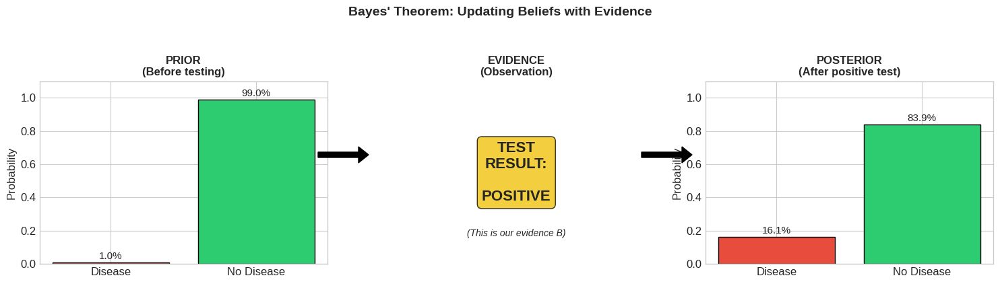

**Output**

```text
Belief in disease went from 1.0% to 16.1%
That's a 16.1x increase!

But still, most likely you DON'T have the disease.
```

### Cell 60

```python
# Sequential Bayesian updating

def update_belief(prior, positive_test=True, sensitivity=0.95, false_positive=0.05):
    """Update belief about disease after a test result"""
    if positive_test:
        likelihood = sensitivity
        likelihood_neg = false_positive
    else:
        likelihood = 1 - sensitivity  # P(-|Disease)
        likelihood_neg = 1 - false_positive  # P(-|No Disease)

    p_evidence = likelihood * prior + likelihood_neg * (1 - prior)
    posterior = (likelihood * prior) / p_evidence
    return posterior

# Start with prior
belief = P_disease
beliefs = [belief]
test_results = ['+', '+', '+', '-', '+']  # Series of test results

print("Sequential Testing:")
print("="*50)
print(f"Initial belief: P(Disease) = {belief:.2%}")

for i, result in enumerate(test_results):
    positive = (result == '+')
    belief = update_belief(belief, positive)
    beliefs.append(belief)
    print(f"After test {i+1} ({result}): P(Disease) = {belief:.2%}")

# Visualize
fig, ax = plt.subplots(figsize=(12, 5))

x = range(len(beliefs))
colors = ['gray'] + ['#e74c3c' if r=='+' else '#2ecc71' for r in test_results]

ax.bar(x, beliefs, color=colors, edgecolor='black', alpha=0.7)
ax.plot(x, beliefs, 'ko-', markersize=8, linewidth=2)

labels = ['Prior'] + [f'Test {i+1}\n({r})' for i, r in enumerate(test_results)]
ax.set_xticks(x)
ax.set_xticklabels(labels)
ax.set_ylabel('P(Disease)')
ax.set_title('Sequential Bayesian Updating\n(Red = Positive Test, Green = Negative Test)',
             fontsize=14, fontweight='bold')
ax.set_ylim(0, 1)

for i, b in enumerate(beliefs):
    ax.text(i, b + 0.02, f'{b:.1%}', ha='center', fontsize=10)

plt.tight_layout()
plt.show()

print("\nNotice how each test updates our belief!")
print("Positive tests increase belief, negative tests decrease it.")
```

**Output**

```text
Sequential Testing:
==================================================
Initial belief: P(Disease) = 1.00%
After test 1 (+): P(Disease) = 16.10%
After test 2 (+): P(Disease) = 78.48%
After test 3 (+): P(Disease) = 98.58%
After test 4 (-): P(Disease) = 78.48%
After test 5 (+): P(Disease) = 98.58%
```

**Output**

```text
<Figure size 1200x500 with 1 Axes>
```

**Figure**

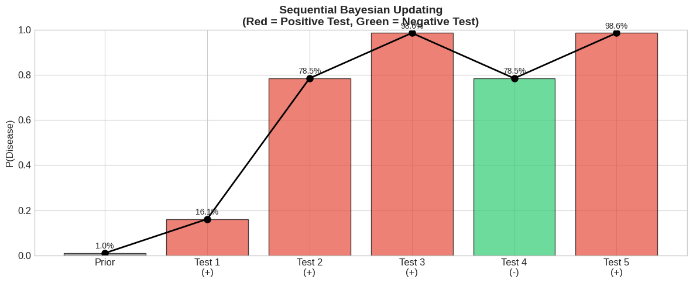

**Output**

```text
Notice how each test updates our belief!
Positive tests increase belief, negative tests decrease it.
```

