# 12 — Data Science Probability Statistics 3

**Status:** Executed successfully

## Code and Output

### Cell 3

```python
# ============================================================
#  Setup — the toolkit and the house style for this series
# ============================================================
# Everything here is pre-installed on Colab. Nothing to download.
import sys, math, json, textwrap, random, warnings
import numpy as np
import matplotlib.pyplot as plt
import matplotlib.patches as mpatches
from matplotlib.patches import FancyBboxPatch, FancyArrowPatch, Circle, Polygon
from matplotlib.colors import LinearSegmentedColormap

warnings.filterwarnings("ignore")

# ---- reproducibility -------------------------------------------------
SEED = 7
rng = np.random.default_rng(SEED)
random.seed(SEED)
np.random.seed(SEED)

# ---- the colour grammar, used identically in all four notebooks ------
# Learn these five and every figure in the series reads at a glance.
C_DATA  = "#2563EB"   # blue    — data, inputs, what we are given
C_MODEL = "#7C3AED"   # purple  — the model, parameters, transformations
C_PRED  = "#EA7317"   # orange  — predictions, what the model says
C_TRUE  = "#15803D"   # green   — ground truth, the target, the right answer
C_ERR   = "#DC2626"   # red     — error, loss, the gap we are closing
C_GREY  = "#64748B"   # slate   — structure, axes, annotation
C_SOFT  = "#F1F5F9"   # near-white fill

plt.rcParams.update({
    "figure.dpi": 110,
    "font.size": 11,
    "axes.titlesize": 13,
    "axes.titleweight": "bold",
    "axes.labelsize": 11,
    "axes.edgecolor": C_GREY,
    "axes.grid": True,
    "grid.alpha": 0.25,
    "grid.linestyle": "-",
    "legend.frameon": True,
    "legend.framealpha": 0.92,
    "figure.facecolor": "white",
})

print("Toolkit ready.")
print(f"NumPy {np.__version__} | Matplotlib {plt.matplotlib.__version__}")
print(f"Random seed pinned to {SEED} — your numbers will match the text exactly.")
```

**Output**

```text
Toolkit ready.
NumPy 2.1.3 | Matplotlib 3.10.0
Random seed pinned to 7 — your numbers will match the text exactly.
```

### Cell 4

```python
# ============================================================
#  Drawing helpers — used by every figure in the series
# ============================================================
# Read these once. After this cell, every diagram is three lines.

def box(ax, x, y, w, h, text, fc=C_SOFT, ec=C_GREY, fs=10, tc="#0F172A",
        lw=1.8, bold=False, alpha=1.0):
    """A rounded label box centred on (x, y). Returns its centre."""
    ax.add_patch(FancyBboxPatch((x - w/2, y - h/2), w, h,
                                boxstyle="round,pad=0.02,rounding_size=0.08",
                                fc=fc, ec=ec, lw=lw, zorder=2, alpha=alpha))
    ax.text(x, y, text, ha="center", va="center", fontsize=fs, color=tc,
            zorder=3, fontweight="bold" if bold else "normal", linespacing=1.4)
    return (x, y)

def arrow(ax, p0, p1, color=C_GREY, rad=0.0, lw=2.0, label=None, ls="-",
          label_off=(0, 0.12), fs=9, style="-|>", ms=16):
    """A (optionally curved, optionally labelled) arrow from p0 to p1."""
    ax.add_patch(FancyArrowPatch(p0, p1, arrowstyle=style, mutation_scale=ms,
                                 color=color, lw=lw, linestyle=ls, zorder=1,
                                 connectionstyle=f"arc3,rad={rad}",
                                 shrinkA=7, shrinkB=9))
    if label:
        mx, my = (p0[0] + p1[0]) / 2, (p0[1] + p1[1]) / 2
        ax.text(mx + label_off[0], my + label_off[1], label, ha="center",
                va="center", fontsize=fs, color=color, style="italic",
                bbox=dict(fc="white", ec="none", alpha=0.88, pad=1.6), zorder=4)

def stage(ax, xlim=(0, 10), ylim=(0, 6), title=None):
    """Turn an Axes into a blank drawing stage."""
    ax.set_xlim(*xlim); ax.set_ylim(*ylim); ax.axis("off")
    if title:
        ax.set_title(title, pad=12)
    return ax

def tidy(ax, xlabel=None, ylabel=None, title=None, legend=False):
    """Consistent finishing touches for a plotted (non-diagram) Axes."""
    if xlabel: ax.set_xlabel(xlabel)
    if ylabel: ax.set_ylabel(ylabel)
    if title:  ax.set_title(title)
    ax.spines[["top", "right"]].set_visible(False)
    if legend: ax.legend(fontsize=9)
    return ax

print("Drawing helpers ready: box(), arrow(), stage(), tidy()")
```

**Output**

```text
Drawing helpers ready: box(), arrow(), stage(), tidy()
```

### Cell 7

```python
# ============================================================
#  Figure: conditioning = shrink the world, then re-measure
# ============================================================
# A population of 100 people. 30 own a dog. 25 own a leash.
# 20 people own both. We will use this same population all through Part 1.

N = 100
people   = np.arange(N)
dog      = set(range(0, 30))                      # 30 dog owners
leash    = set(range(0, 20)) | set(range(30, 35)) # 20 of them + 5 others = 25

# lay the 100 people out on a 20-wide grid
gx = (people % 20).astype(float)
gy = (people // 20).astype(float)

fig, axes = plt.subplots(1, 3, figsize=(14.6, 3.9))
panels = [
    ("① The whole world\n100 people",              None),
    ("② Evidence arrives:\n'this person owns a dog'", "highlight"),
    ("③ Shrink to that world,\nre-measure the leash", "shrink"),
]
for ax, (title, mode) in zip(axes, panels):
    for i in people:
        in_dog, in_leash = i in dog, i in leash
        if mode is None:
            fc, alpha, ec = C_GREY, 0.30, "none"
        elif mode == "highlight":
            fc = C_DATA if in_dog else C_GREY
            alpha, ec = (0.95, "white") if in_dog else (0.14, "none")
        else:  # shrink
            if not in_dog:
                continue                      # thrown away
            fc = C_TRUE if in_leash else C_DATA
            alpha, ec = 0.95, "white"
        ax.scatter(gx[i], -gy[i], s=118, color=fc, alpha=alpha,
                   edgecolor=ec, linewidth=1.1, zorder=3)
    ax.set_xlim(-1, 20); ax.set_ylim(-5.2, 1.0)
    ax.axis("off"); ax.set_title(title, fontsize=11)

axes[1].text(9.5, 0.55, "30 dog owners", ha="center", color=C_DATA,
             fontsize=10.5, fontweight="bold")
axes[2].text(9.5, 0.55, "20 of those 30 own a leash", ha="center", color=C_TRUE,
             fontsize=10.5, fontweight="bold")
axes[2].text(9.5, -3.4, r"$P(\mathrm{leash}\mid\mathrm{dog})=\dfrac{20}{30}\approx 0.67$",
             ha="center", fontsize=14, color="#0F172A")
axes[0].text(9.5, -3.4, r"$P(\mathrm{leash})=\dfrac{25}{100}=0.25$",
             ha="center", fontsize=13, color=C_GREY)
plt.tight_layout(); plt.show()
```

**Output**

```text
<Figure size 1606x429 with 3 Axes>
```

**Figure**

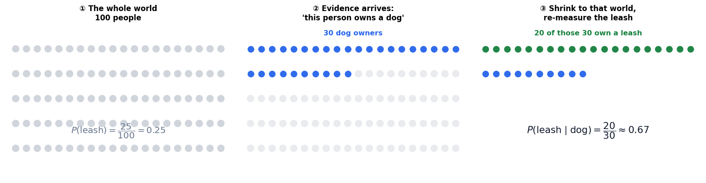

### Cell 10

```python
# ============================================================
#  Conditional probability, computed by counting actual people
# ============================================================
n_dog       = len(dog)
n_leash     = len(leash)
n_both      = len(dog & leash)

p_dog       = n_dog   / N
p_leash     = n_leash / N
p_both      = n_both  / N

p_leash_g_dog = p_both / p_dog          # the definition
count_ratio   = n_both / n_dog          # the same thing, by head-count

print("THE POPULATION")
print("=" * 58)
print(f"  people                       N = {N}")
print(f"  own a dog                      = {n_dog:3d}   ->  P(dog)         = {p_dog:.2f}")
print(f"  own a leash                    = {n_leash:3d}   ->  P(leash)       = {p_leash:.2f}")
print(f"  own BOTH                       = {n_both:3d}   ->  P(leash ∩ dog) = {p_both:.2f}")
print()
print("CONDITIONING ON 'owns a dog'")
print("=" * 58)
print(f"  P(leash | dog) = P(leash ∩ dog) / P(dog) = {p_both:.2f} / {p_dog:.2f} = {p_leash_g_dog:.4f}")
print(f"  by head-count  =            {n_both} / {n_dog}            = {count_ratio:.4f}")
print(f"  identical?  {np.isclose(p_leash_g_dog, count_ratio)}")
print()
print(f"  BEFORE the evidence : P(leash)       = {p_leash:.4f}")
print(f"  AFTER  the evidence : P(leash | dog) = {p_leash_g_dog:.4f}")
print(f"  the evidence multiplied our belief by {p_leash_g_dog / p_leash:.2f}x")
print()
print("Sanity check — inside the shrunken world the probabilities must still sum to 1:")
p_noleash_g_dog = (n_dog - n_both) / n_dog
print(f"  P(leash | dog) + P(no leash | dog) = {p_leash_g_dog:.4f} + {p_noleash_g_dog:.4f} = "
      f"{p_leash_g_dog + p_noleash_g_dog:.4f}")
```

**Output**

```text
THE POPULATION
==========================================================
  people                       N = 100
  own a dog                      =  30   ->  P(dog)         = 0.30
  own a leash                    =  25   ->  P(leash)       = 0.25
  own BOTH                       =  20   ->  P(leash ∩ dog) = 0.20

CONDITIONING ON 'owns a dog'
==========================================================
  P(leash | dog) = P(leash ∩ dog) / P(dog) = 0.20 / 0.30 = 0.6667
  by head-count  =            20 / 30            = 0.6667
  identical?  True

  BEFORE the evidence : P(leash)       = 0.2500
  AFTER  the evidence : P(leash | dog) = 0.6667
  the evidence multiplied our belief by 2.67x

Sanity check — inside the shrunken world the probabilities must still sum to 1:
  P(leash | dog) + P(no leash | dog) = 0.6667 + 0.3333 = 1.0000
```

### Cell 14

```python
# ============================================================
#  The symmetry step, verified by counting
# ============================================================
# Route 1:  P(A∩B) = P(A|B)·P(B)      Route 2:  P(A∩B) = P(B|A)·P(A)
A_is_leash, B_is_dog = leash, dog

p_A = len(A_is_leash) / N
p_B = len(B_is_dog)   / N
p_A_given_B = len(A_is_leash & B_is_dog) / len(B_is_dog)   # P(leash | dog)
p_B_given_A = len(A_is_leash & B_is_dog) / len(A_is_leash) # P(dog | leash)

route1 = p_A_given_B * p_B
route2 = p_B_given_A * p_A
truth  = len(A_is_leash & B_is_dog) / N

print("BOTH ROUTES MUST REACH THE SAME JOINT PROBABILITY")
print("=" * 62)
print(f"  P(leash | dog) = {p_A_given_B:.4f}      P(dog)   = {p_B:.4f}")
print(f"  P(dog | leash) = {p_B_given_A:.4f}      P(leash) = {p_A:.4f}")
print()
print(f"  route 1:  P(leash|dog) · P(dog)   = {route1:.4f}")
print(f"  route 2:  P(dog|leash) · P(leash) = {route2:.4f}")
print(f"  counted:  20 of 100 people        = {truth:.4f}")
print(f"  all three agree?  {np.isclose(route1, route2) and np.isclose(route2, truth)}")
print()
print("Now flip a direction with Bayes, and check it against the direct count:")
bayes_A_given_B = p_B_given_A * p_A / p_B
print(f"  Bayes : P(leash|dog) = P(dog|leash)·P(leash)/P(dog) = {bayes_A_given_B:.4f}")
print(f"  direct: 20/30                                       = {p_A_given_B:.4f}")
print(f"  match?  {np.isclose(bayes_A_given_B, p_A_given_B)}")
print()
print("NOTE the two conditionals are NOT equal to each other:")
print(f"  P(leash | dog) = {p_A_given_B:.4f}   but   P(dog | leash) = {p_B_given_A:.4f}")
print("  Same joint probability on top; different denominators underneath.")
```

**Output**

```text
BOTH ROUTES MUST REACH THE SAME JOINT PROBABILITY
==============================================================
  P(leash | dog) = 0.6667      P(dog)   = 0.3000
  P(dog | leash) = 0.8000      P(leash) = 0.2500

  route 1:  P(leash|dog) · P(dog)   = 0.2000
  route 2:  P(dog|leash) · P(leash) = 0.2000
  counted:  20 of 100 people        = 0.2000
  all three agree?  True

Now flip a direction with Bayes, and check it against the direct count:
  Bayes : P(leash|dog) = P(dog|leash)·P(leash)/P(dog) = 0.6667
  direct: 20/30                                       = 0.6667
  match?  True

NOTE the two conditionals are NOT equal to each other:
  P(leash | dog) = 0.6667   but   P(dog | leash) = 0.8000
  Same joint probability on top; different denominators underneath.
```

### Cell 16

```python
# ============================================================
#  Figure: the anatomy of Bayes' theorem, as a pipeline
# ============================================================
fig, ax = plt.subplots(figsize=(13.2, 4.6))
stage(ax, (0, 13.2), (0, 4.8))

box(ax, 1.75, 3.25, 2.7, 1.25, "PRIOR\n$P(A)$\n\nwhat you believed\nbefore looking",
    fc="#EDE9FE", ec=C_MODEL, fs=9.2, lw=2.2)
box(ax, 5.05, 3.25, 2.7, 1.25, "LIKELIHOOD\n$P(B\\mid A)$\n\nhow well $A$ explains\nwhat you saw",
    fc="#DBEAFE", ec=C_DATA, fs=9.2, lw=2.2)
ax.text(3.40, 3.25, "×", fontsize=26, ha="center", va="center", color=C_GREY)

box(ax, 5.05, 1.15, 2.7, 0.95, "EVIDENCE  $P(B)$\nhow likely $B$ was at all",
    fc="#FEF3C7", ec="#D97706", fs=9.2, lw=2.2)
ax.plot([3.55, 6.55], [2.28, 2.28], color=C_GREY, lw=2.6)
ax.text(6.95, 2.28, "÷", fontsize=24, ha="center", va="center", color=C_GREY)

box(ax, 10.4, 2.28, 3.4, 1.45, "POSTERIOR\n$P(A\\mid B)$\n\nyour updated belief",
    fc="#DCFCE7", ec=C_TRUE, fs=10.2, lw=2.6, bold=True)
arrow(ax, (7.35, 2.28), (8.60, 2.28), color=C_GREY, lw=2.6)

ax.text(6.6, 0.30, "posterior  ∝  likelihood × prior", ha="center",
        fontsize=13, fontweight="bold", color="#0F172A", style="italic")
ax.text(11.9, 0.30, "the ÷ only rescales;\nit cannot change the winner",
        ha="center", fontsize=8.6, color=C_GREY, style="italic")
plt.tight_layout(); plt.show()
```

**Output**

```text
<Figure size 1452x506 with 1 Axes>
```

**Figure**

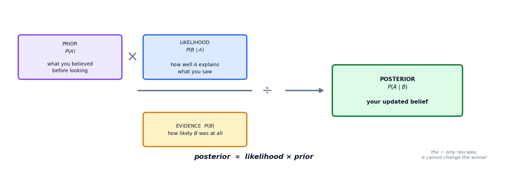

### Cell 19

```python
# ============================================================
#  Figure: the law of total probability as a partition of the world
# ============================================================
fig, (axL, axR) = plt.subplots(1, 2, figsize=(13.6, 4.4),
                               gridspec_kw={"width_ratios": [1.25, 1]})

# ── left: the world, partitioned into three causes, with B cutting across ──
stage(axL, (0, 10), (0, 6), title="The world split into disjoint causes")
widths  = [4.6, 3.2, 2.2]                       # P(A1), P(A2), P(A3) to scale
heights = [0.62, 0.28, 0.10]                    # P(B | A_i)
names   = ["$A_1$", "$A_2$", "$A_3$"]
cols    = [C_MODEL, C_DATA, C_PRED]
x = 0.4
for w, h, nm, cl in zip(widths, heights, names, cols):
    axL.add_patch(FancyBboxPatch((x, 0.9), w, 4.0,
                                 boxstyle="round,pad=0.0,rounding_size=0.06",
                                 fc="white", ec=cl, lw=2.2, zorder=2))
    axL.add_patch(FancyBboxPatch((x, 0.9), w, 4.0 * h,
                                 boxstyle="round,pad=0.0,rounding_size=0.06",
                                 fc=cl, ec=cl, lw=0, alpha=0.55, zorder=3))
    axL.text(x + w / 2, 5.15, nm, ha="center", fontsize=13, color=cl, fontweight="bold")
    axL.text(x + w / 2, 0.55, f"$P(A_i)={w/10:.2f}$", ha="center", fontsize=9, color=cl)
    axL.text(x + w / 2, 0.9 + 4.0 * h / 2, f"$P(B|A_i)$\n$={h:.2f}$",
             ha="center", va="center", fontsize=9, color="white", fontweight="bold")
    x += w + 0.05
axL.text(5.0, 0.05, "shaded area = the part of the world where B happens",
         ha="center", fontsize=9.4, color=C_GREY, style="italic")

# ── right: those shaded areas stacked = P(B) ──
p_A   = np.array(widths) / 10.0
p_BgA = np.array(heights)
contrib = p_A * p_BgA
bottom = 0.0
for c, nm, cl in zip(contrib, names, cols):
    axR.bar([0], [c], bottom=[bottom], width=0.5, color=cl, alpha=0.75,
            edgecolor="white", lw=1.6)
    axR.text(0, bottom + c / 2, f"{nm}:  {c:.3f}", ha="center", va="center",
             fontsize=10, color="white", fontweight="bold")
    bottom += c
axR.set_xlim(-0.7, 1.5); axR.set_ylim(0, bottom * 1.28)
axR.set_xticks([])
axR.axhline(bottom, color=C_ERR, lw=2, ls="--")
axR.text(0.42, bottom * 1.05, f"$P(B) = {bottom:.3f}$", fontsize=13,
         color=C_ERR, fontweight="bold")
tidy(axR, None, "probability", "Add the shaded pieces → the evidence")
plt.tight_layout(); plt.show()

print(f"P(B) = Σ P(B|A_i)·P(A_i) = "
      + " + ".join(f"{h:.2f}×{a:.2f}" for h, a in zip(p_BgA, p_A))
      + f" = {contrib.sum():.3f}")
```

**Output**

```text
<Figure size 1496x484 with 2 Axes>
```

**Figure**

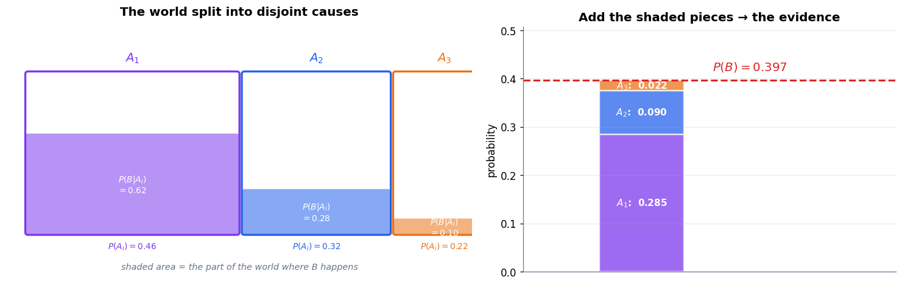

**Output**

```text
P(B) = Σ P(B|A_i)·P(A_i) = 0.62×0.46 + 0.28×0.32 + 0.10×0.22 = 0.397
```

### Cell 24

```python
# ============================================================
#  The rare-disease calculation, in full
# ============================================================
p_sick        = 0.001    # prior: the base rate
p_pos_if_sick = 0.99     # likelihood: sensitivity / true-positive rate
p_pos_if_well = 0.05     # false-positive rate
p_well        = 1 - p_sick

# --- step 1: the evidence, via the law of total probability ---
true_pos_term  = p_pos_if_sick * p_sick
false_pos_term = p_pos_if_well * p_well
p_pos          = true_pos_term + false_pos_term

# --- step 2: Bayes' theorem ---
p_sick_given_pos = true_pos_term / p_pos
p_well_given_pos = false_pos_term / p_pos

print("STEP 1 — the evidence P(+), split into its two sources")
print("=" * 66)
print(f"  sick    and positive : P(+|sick)·P(sick)       = {p_pos_if_sick} × {p_sick}   = {true_pos_term:.5f}")
print(f"  healthy and positive : P(+|healthy)·P(healthy) = {p_pos_if_well} × {p_well}  = {false_pos_term:.5f}")
print(f"  ------------------------------------------------------------------")
print(f"  P(+)                                                       = {p_pos:.5f}")
print(f"  the false-positive term is {false_pos_term / true_pos_term:.1f}x larger than the true-positive term")
print()
print("STEP 2 — Bayes' theorem")
print("=" * 66)
print(f"  P(sick | +) = {true_pos_term:.5f} / {p_pos:.5f} = {p_sick_given_pos:.6f}  =  {p_sick_given_pos:.2%}")
print(f"  P(well | +) = {false_pos_term:.5f} / {p_pos:.5f} = {p_well_given_pos:.6f}  =  {p_well_given_pos:.2%}")
print(f"  they sum to {p_sick_given_pos + p_well_given_pos:.6f}  (they must)")
print()
print("WHAT THE TEST ACTUALLY DID")
print("=" * 66)
print(f"  belief before the test : {p_sick:.4%}")
print(f"  belief after  the test : {p_sick_given_pos:.4%}")
print(f"  the evidence multiplied your belief by {p_sick_given_pos / p_sick:.1f}x  —  a real, large update")
print(f"  ...and it is STILL only {p_sick_given_pos:.1%}, because {p_sick:.1%} × {p_sick_given_pos/p_sick:.0f} is a small number.")
```

**Output**

```text
STEP 1 — the evidence P(+), split into its two sources
==================================================================
  sick    and positive : P(+|sick)·P(sick)       = 0.99 × 0.001   = 0.00099
  healthy and positive : P(+|healthy)·P(healthy) = 0.05 × 0.999  = 0.04995
  ------------------------------------------------------------------
  P(+)                                                       = 0.05094
  the false-positive term is 50.5x larger than the true-positive term

STEP 2 — Bayes' theorem
==================================================================
  P(sick | +) = 0.00099 / 0.05094 = 0.019435  =  1.94%
  P(well | +) = 0.04995 / 0.05094 = 0.980565  =  98.06%
  they sum to 1.000000  (they must)

WHAT THE TEST ACTUALLY DID
==================================================================
  belief before the test : 0.1000%
  belief after  the test : 1.9435%
  the evidence multiplied your belief by 19.4x  —  a real, large update
  ...and it is STILL only 1.9%, because 0.1% × 19 is a small number.
```

### Cell 25

```python
# ============================================================
#  Figure: where every positive result actually comes from
# ============================================================
fig, (ax1, ax2) = plt.subplots(1, 2, figsize=(13.4, 4.5),
                               gridspec_kw={"width_ratios": [1, 1.15]})

# ── left: the two contributions to P(+), to scale ──
labels = ["sick\n& positive", "healthy\n& positive"]
vals   = [true_pos_term, false_pos_term]
colsL  = [C_ERR, C_PRED]
bars = ax1.bar(labels, vals, color=colsL, alpha=0.85, edgecolor="white", lw=2, width=0.55)
for b, v in zip(bars, vals):
    ax1.text(b.get_x() + b.get_width() / 2, v + 0.0016, f"{v:.5f}",
             ha="center", fontsize=11, fontweight="bold", color="#0F172A")
ax1.set_ylim(0, max(vals) * 1.28)
ax1.annotate("", xy=(1, false_pos_term), xytext=(1, true_pos_term),
             arrowprops=dict(arrowstyle="<->", color=C_GREY, lw=2))
ax1.text(1.32, false_pos_term * 0.55, f"{false_pos_term/true_pos_term:.0f}× taller",
         color=C_GREY, fontsize=10.5, fontweight="bold", rotation=90, va="center")
tidy(ax1, None, "contribution to P(+)", "The two sources of a positive result")

# ── right: the positive results, split as a proportion ──
frac_true = p_sick_given_pos
ax2.barh([0], [frac_true], color=C_ERR, alpha=0.9, edgecolor="white", lw=2, height=0.42,
         label=f"actually sick  ({frac_true:.1%})")
ax2.barh([0], [1 - frac_true], left=[frac_true], color=C_PRED, alpha=0.55,
         edgecolor="white", lw=2, height=0.42,
         label=f"actually healthy  ({1-frac_true:.1%})")
ax2.set_xlim(0, 1); ax2.set_ylim(-0.55, 0.75)
ax2.set_yticks([])
ax2.set_xticks(np.linspace(0, 1, 6))
ax2.set_xticklabels([f"{t:.0%}" for t in np.linspace(0, 1, 6)])
ax2.annotate(f"{frac_true:.1%}", xy=(frac_true, 0.23), xytext=(0.20, 0.60),
             fontsize=13, color=C_ERR, fontweight="bold",
             arrowprops=dict(arrowstyle="->", color=C_ERR, lw=2))
ax2.legend(loc="lower center", fontsize=10, ncol=2, frameon=False,
           bbox_to_anchor=(0.5, -0.30))
tidy(ax2, "share of everyone who tested positive", None,
     "Everyone with a positive result")
plt.tight_layout(); plt.show()
```

**Output**

```text
<Figure size 1474x495 with 2 Axes>
```

**Figure**

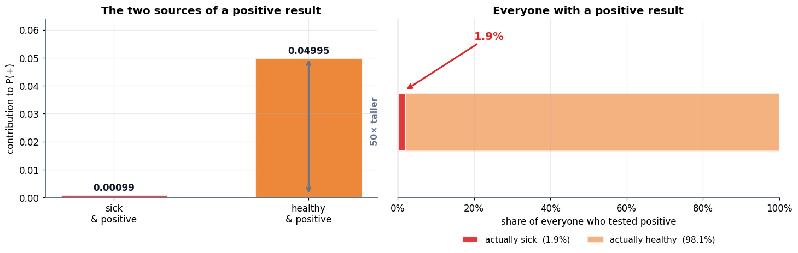

### Cell 28

```python
# ============================================================
#  The natural-frequency version: count whole people
# ============================================================
POP = 100_000

n_sick    = POP * p_sick                   # 100
n_well    = POP - n_sick                   # 99,900
n_tp      = n_sick * p_pos_if_sick         # true positives
n_fn      = n_sick - n_tp                  # false negatives (missed)
n_fp      = n_well * p_pos_if_well         # false positives
n_tn      = n_well - n_fp                  # true negatives
n_pos     = n_tp + n_fp                    # everyone told "positive"

print(f"WALKING {POP:,} PEOPLE THROUGH THE TEST")
print("=" * 68)
print(f"  {POP:>7,.0f} people")
print(f"  ├── {n_sick:>7,.0f} are sick        ({p_sick:.1%})")
print(f"  │   ├── {n_tp:>7,.0f} test POSITIVE   <- true positives")
print(f"  │   └── {n_fn:>7,.0f} test negative   <- missed")
print(f"  └── {n_well:>7,.0f} are healthy     ({1-p_sick:.1%})")
print(f"      ├── {n_fp:>7,.0f} test POSITIVE   <- FALSE ALARMS")
print(f"      └── {n_tn:>7,.0f} test negative")
print()
print(f"  everyone told 'positive' : {n_tp:,.0f} + {n_fp:,.0f} = {n_pos:,.0f}")
print(f"  of those, actually sick  : {n_tp:,.0f}")
print(f"  P(sick | +)              = {n_tp:,.0f} / {n_pos:,.0f} = {n_tp/n_pos:.6f} = {n_tp/n_pos:.2%}")
print()
print(f"  identical to the decimal calculation above?  "
      f"{np.isclose(n_tp / n_pos, p_sick_given_pos)}   "
      f"({n_tp/n_pos:.6f} vs {p_sick_given_pos:.6f})")
print()
print(f"  Put another way: for every 1 correct alarm, the test raises "
      f"{n_fp/n_tp:.1f} false ones.")
```

**Output**

```text
WALKING 100,000 PEOPLE THROUGH THE TEST
====================================================================
  100,000 people
  ├──     100 are sick        (0.1%)
  │   ├──      99 test POSITIVE   <- true positives
  │   └──       1 test negative   <- missed
  └──  99,900 are healthy     (99.9%)
      ├──   4,995 test POSITIVE   <- FALSE ALARMS
      └──  94,905 test negative

  everyone told 'positive' : 99 + 4,995 = 5,094
  of those, actually sick  : 99
  P(sick | +)              = 99 / 5,094 = 0.019435 = 1.94%

  identical to the decimal calculation above?  True   (0.019435 vs 0.019435)

  Put another way: for every 1 correct alarm, the test raises 50.5 false ones.
```

### Cell 29

```python
# ============================================================
#  A tiny person-glyph helper, for the icon array below
# ============================================================
def person(ax, x, y, s=1.0, color=C_GREY, alpha=1.0, zorder=3):
    """Draw a small stick-figure-ish person centred on (x, y)."""
    ax.add_patch(Circle((x, y + 0.30 * s), 0.155 * s, fc=color, ec="none",
                        alpha=alpha, zorder=zorder))
    body = np.array([[-0.24, -0.42], [0.24, -0.42], [0.19, 0.10],
                     [-0.19, 0.10]]) * s + np.array([x, y])
    ax.add_patch(Polygon(body, closed=True, fc=color, ec="none",
                         alpha=alpha, zorder=zorder))
    return ax

print("person() ready — one glyph per person, for icon arrays.")
```

**Output**

```text
person() ready — one glyph per person, for icon arrays.
```

### Cell 30

```python
# ============================================================
#  ★ THE CENTREPIECE ★  natural frequencies, three views
# ============================================================
fig = plt.figure(figsize=(14.4, 9.4))
gs  = fig.add_gridspec(2, 2, height_ratios=[1.0, 1.15], hspace=0.30, wspace=0.22)

# ─────────────────────────── (a) the frequency tree ───────────────────────────
axT = fig.add_subplot(gs[0, :]); stage(axT, (0, 14.4), (0, 5.6))
box(axT, 1.55, 2.8, 2.5, 1.05, f"{POP:,} people\nscreened", fc=C_SOFT, ec=C_GREY,
    fs=10.5, bold=True, lw=2.2)
box(axT, 5.55, 4.35, 2.7, 1.0, f"{n_sick:,.0f} sick\n(0.1%)", fc="#FEE2E2",
    ec=C_ERR, fs=10.5, bold=True, lw=2.2)
box(axT, 5.55, 1.35, 2.7, 1.0, f"{n_well:,.0f} healthy\n(99.9%)", fc="#DCFCE7",
    ec=C_TRUE, fs=10.5, bold=True, lw=2.2)
arrow(axT, (2.85, 3.05), (4.15, 4.20), color=C_ERR,  lw=2.2)
arrow(axT, (2.85, 2.55), (4.15, 1.50), color=C_TRUE, lw=2.2)

leaves = [
    (9.9, 5.05, f"{n_tp:,.0f}  test +",     C_ERR,  "#FEE2E2", "TRUE POSITIVES"),
    (9.9, 3.65, f"{n_fn:,.0f}  test −",     C_GREY, "#F1F5F9", "missed"),
    (9.9, 2.05, f"{n_fp:,.0f}  test +",     C_PRED, "#FFEDD5", "FALSE ALARMS"),
    (9.9, 0.65, f"{n_tn:,.0f}  test −",     C_GREY, "#F1F5F9", "correctly cleared"),
]
for x, y, txt, ec, fc, tag in leaves:
    box(axT, x, y, 3.0, 0.92, txt, fc=fc, ec=ec, fs=10.5, bold=True, lw=2.0)
    axT.text(x + 1.72, y, tag, ha="left", va="center", fontsize=9.2, color=ec,
             fontweight="bold")
arrow(axT, (6.95, 4.6), (8.35, 5.0), color=C_ERR,  lw=1.8)
arrow(axT, (6.95, 4.1), (8.35, 3.7), color=C_GREY, lw=1.8)
arrow(axT, (6.95, 1.6), (8.35, 2.0), color=C_PRED, lw=1.8)
arrow(axT, (6.95, 1.1), (8.35, 0.7), color=C_GREY, lw=1.8)
axT.set_title("(a)  100,000 people, split by truth and then by test result", fontsize=12)

# ─────────────────── (b) the positive column, to scale ────────────────────────
axB = fig.add_subplot(gs[1, 0])
axB.bar([0], [n_tp], color=C_ERR,  alpha=0.9, width=0.5, edgecolor="white", lw=2)
axB.bar([0], [n_fp], bottom=[n_tp], color=C_PRED, alpha=0.65, width=0.5,
        edgecolor="white", lw=2)
axB.text(0, n_tp / 2, f"{n_tp:,.0f}", ha="center", va="center", fontsize=10,
         color="white", fontweight="bold")
axB.text(0, n_tp + n_fp / 2, f"{n_fp:,.0f}\nfalse alarms", ha="center", va="center",
         fontsize=12, color="white", fontweight="bold")
axB.annotate(f"only {n_tp:,.0f} truly sick", xy=(0.26, n_tp / 2), xytext=(0.62, 1500),
             fontsize=11, color=C_ERR, fontweight="bold",
             arrowprops=dict(arrowstyle="->", color=C_ERR, lw=2))
axB.set_xlim(-0.75, 1.55); axB.set_ylim(0, n_pos * 1.12); axB.set_xticks([])
tidy(axB, f"the {n_pos:,.0f} people told 'positive'", "number of people",
     "(b)  What the positive group is made of")

# ────────── (c) icon array: 100 representative positive-testers ───────────────
axI = fig.add_subplot(gs[1, 1]); stage(axI, (-0.7, 20.4), (-6.4, 1.9))
n_sick_icons = int(round(100 * n_tp / n_pos))       # 2 of every 100
for k in range(100):
    col, row = k % 20, k // 20
    sick_icon = k < n_sick_icons
    person(axI, col, -row * 1.22, s=0.86,
           color=C_ERR if sick_icon else C_PRED,
           alpha=1.0 if sick_icon else 0.28)
axI.text(9.5, 1.15, "100 people who all tested POSITIVE",
         ha="center", fontsize=12, fontweight="bold", color="#0F172A")
axI.text(9.5, -6.05,
         f"{n_sick_icons} of them are actually sick   ·   "
         f"{100 - n_sick_icons} are healthy",
         ha="center", fontsize=11.5, color=C_GREY, fontweight="bold")
axI.add_patch(FancyBboxPatch((-0.45, -0.62), 2.35, 1.28,
                             boxstyle="round,pad=0.05,rounding_size=0.15",
                             fc="none", ec=C_ERR, lw=2.4, ls="--", zorder=6))
axI.set_title("(c)  Round up 100 positive results — how many are sick?", fontsize=12)

plt.show()
print(f"exact posterior = {n_tp/n_pos:.4%}   ->   {n_sick_icons} icons in 100 (rounded)")
```

**Output**

```text
<Figure size 1584x1034 with 3 Axes>
```

**Figure**

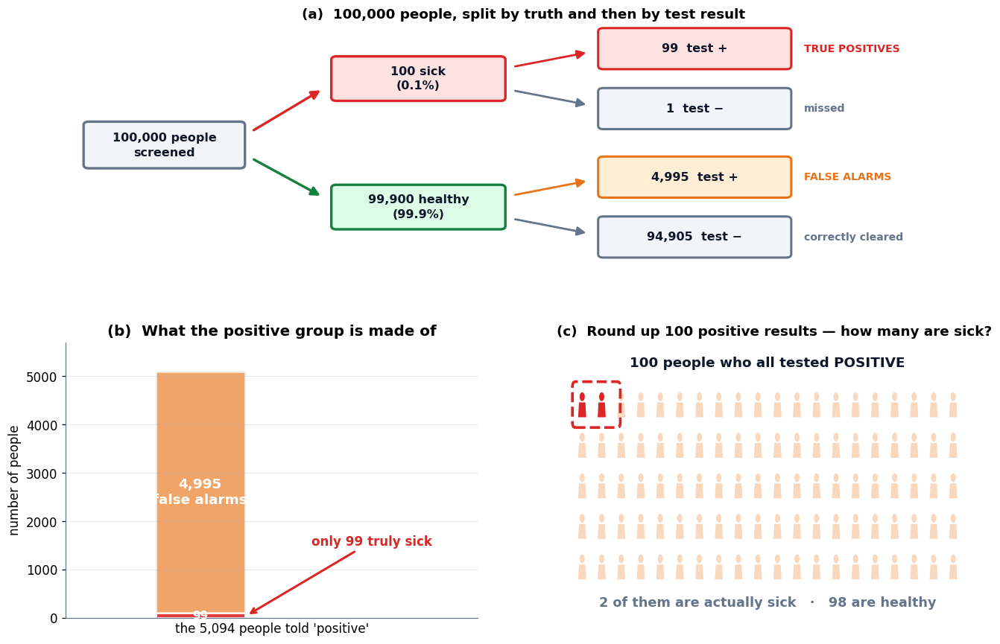

**Output**

```text
exact posterior = 1.9435%   ->   2 icons in 100 (rounded)
```

### Cell 33

```python
# ============================================================
#  Figure: the two directions, side by side, and the bridge between them
# ============================================================
bridge = p_sick / p_pos

fig, (axA, axB2) = plt.subplots(1, 2, figsize=(13.6, 4.6),
                                gridspec_kw={"width_ratios": [1.05, 1]})

# ── left: the two conditionals as bars, same axis ──
names = ["$P(+\\;|\\;\\mathrm{sick})$\nthe test's sensitivity\n(what the lab measured)",
         "$P(\\mathrm{sick}\\;|\\;+)$\nyour actual risk\n(what you wanted)"]
vals2 = [p_pos_if_sick, p_sick_given_pos]
bars = axA.bar(names, vals2, color=[C_DATA, C_ERR], alpha=0.85,
               edgecolor="white", lw=2, width=0.5)
for b, v in zip(bars, vals2):
    axA.text(b.get_x() + b.get_width() / 2, v + 0.028, f"{v:.1%}",
             ha="center", fontsize=14, fontweight="bold", color="#0F172A")
axA.set_ylim(0, 1.16)
axA.text(0.5, 0.72, f"{p_pos_if_sick / p_sick_given_pos:.0f}× apart",
         ha="center", fontsize=13, color=C_GREY, fontweight="bold",
         bbox=dict(fc="white", ec=C_GREY, lw=1.4, boxstyle="round,pad=0.4"))
tidy(axA, None, "probability", "Same two events. Opposite conditioning.")

# ── right: how the posterior depends on the base rate ──
priors = np.logspace(-4, 0, 400)
post   = (p_pos_if_sick * priors) / (p_pos_if_sick * priors + p_pos_if_well * (1 - priors))
axB2.plot(priors, post, color=C_MODEL, lw=2.8)
axB2.set_xscale("log")
axB2.axhline(p_pos_if_sick, color=C_DATA, ls="--", lw=1.8)
axB2.text(1.2e-4, p_pos_if_sick + 0.035, "the 99% people think they heard",
          fontsize=9.6, color=C_DATA, fontweight="bold")
axB2.scatter([p_sick], [p_sick_given_pos], s=190, color=C_ERR, zorder=5,
             edgecolor="white", lw=2)
axB2.annotate(f"our problem\nprior {p_sick:.1%} → posterior {p_sick_given_pos:.1%}",
              xy=(p_sick, p_sick_given_pos), xytext=(2.2e-3, 0.52),
              fontsize=10, color=C_ERR, fontweight="bold",
              arrowprops=dict(arrowstyle="->", color=C_ERR, lw=1.9))
axB2.scatter([0.5], [(p_pos_if_sick * .5) / (p_pos_if_sick * .5 + p_pos_if_well * .5)],
             s=150, color=C_TRUE, zorder=5, edgecolor="white", lw=2)
axB2.text(0.5, 0.70, "prior = 50%" + chr(10) + "(what the fallacy" + chr(10) +
          "silently assumes)", ha="center", va="top",
          fontsize=9.4, color=C_TRUE, fontweight="bold",
          bbox=dict(fc="white", ec=C_TRUE, alpha=0.92, pad=2.4,
                    boxstyle="round,pad=0.3"))
axB2.set_ylim(0, 1.08)
tidy(axB2, "prior  P(sick)   (log scale)", "posterior  P(sick | +)",
     "The posterior is a slave to the base rate")
plt.tight_layout(); plt.show()

print(f"the bridge  P(sick)/P(+) = {p_sick:.4f} / {p_pos:.5f} = {bridge:.4f}")
print(f"check: P(+|sick) × bridge = {p_pos_if_sick:.2f} × {bridge:.4f} = "
      f"{p_pos_if_sick * bridge:.6f}  ==  P(sick|+) = {p_sick_given_pos:.6f}")
```

**Output**

```text
<Figure size 1496x506 with 2 Axes>
```

**Figure**

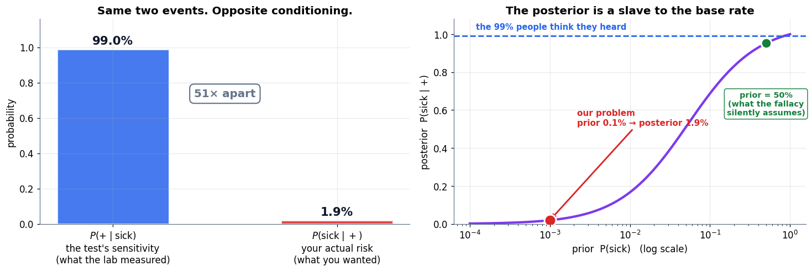

**Output**

```text
the bridge  P(sick)/P(+) = 0.0010 / 0.05094 = 0.0196
check: P(+|sick) × bridge = 0.99 × 0.0196 = 0.019435  ==  P(sick|+) = 0.019435
```

### Cell 36

```python
# ============================================================
#  Bayes in general: many causes at once
# ============================================================
def bayes_posterior(priors, likelihoods):
    """Posterior over causes.  priors[i] = P(cause i);  likelihoods[i] = P(evidence | cause i)."""
    priors      = np.asarray(priors, dtype=float)
    likelihoods = np.asarray(likelihoods, dtype=float)
    assert np.isclose(priors.sum(), 1.0), "priors must sum to 1"
    joint    = likelihoods * priors        # steps 1-2: prior × likelihood
    evidence = joint.sum()                 # step 3:   law of total probability
    return joint / evidence                # step 4:   normalise

# --- the two-cause disease problem, through the general function ---
post = bayes_posterior([p_sick, p_well], [p_pos_if_sick, p_pos_if_well])
print("TWO CAUSES (sick / healthy)")
print("=" * 60)
print(f"  posterior = {post.round(6)}   ->  P(sick | +) = {post[0]:.2%}")
print(f"  agrees with the hand calculation?  {np.isclose(post[0], p_sick_given_pos)}")
print()

# --- three causes: the same machinery, no new ideas ---
causes  = ["common cold", "flu", "rare tropical fever"]
prior3  = np.array([0.900, 0.098, 0.002])          # how common each is
lik3    = np.array([0.100, 0.400, 0.950])          # P(high fever | cause)
post3   = bayes_posterior(prior3, lik3)

print("THREE CAUSES, one symptom: 'high fever'")
print("=" * 60)
print(f"  {'cause':<22}{'prior':>9}{'likelihood':>13}{'posterior':>12}")
for c, pr, lk, po in zip(causes, prior3, lik3, post3):
    print(f"  {c:<22}{pr:>9.3f}{lk:>13.3f}{po:>12.3f}")
print(f"  {'':<22}{prior3.sum():>9.3f}{'':>13}{post3.sum():>12.3f}")
print()
print(f"  The tropical fever explains the symptom best (likelihood {lik3[2]:.2f}),")
print(f"  yet its posterior is only {post3[2]:.1%} — the prior of {prior3[2]:.3f} holds it down.")
print(f"  The winner is '{causes[int(post3.argmax())]}' at {post3.max():.1%}.")
```

**Output**

```text
TWO CAUSES (sick / healthy)
============================================================
  posterior = [0.019435 0.980565]   ->  P(sick | +) = 1.94%
  agrees with the hand calculation?  True

THREE CAUSES, one symptom: 'high fever'
============================================================
  cause                     prior   likelihood   posterior
  common cold               0.900        0.100       0.686
  flu                       0.098        0.400       0.299
  rare tropical fever       0.002        0.950       0.014
                            1.000                    1.000

  The tropical fever explains the symptom best (likelihood 0.95),
  yet its posterior is only 1.4% — the prior of 0.002 holds it down.
  The winner is 'common cold' at 68.6%.
```

### Cell 40

```python
# ============================================================
#  Figure: mass (bars that sum to 1) vs density (area that integrates to 1)
# ============================================================
# `np.trapz` was renamed `np.trapezoid` in NumPy 2. One line so every
# "check the area really is 1" test below runs on either version.
area = np.trapezoid if hasattr(np, "trapezoid") else np.trapz

fig, (axD, axC) = plt.subplots(1, 2, figsize=(13.4, 4.4))

# ── discrete: a PMF over 0..6 ──
k     = np.arange(7)
pmf   = np.array([0.04, 0.11, 0.22, 0.28, 0.20, 0.11, 0.04])
pmf   = pmf / pmf.sum()                       # enforce the hard rule
axD.bar(k, pmf, color=C_DATA, alpha=0.85, edgecolor="white", lw=2, width=0.62)
for kk, p in zip(k, pmf):
    axD.text(kk, p + 0.008, f"{p:.2f}", ha="center", fontsize=9, color=C_DATA,
             fontweight="bold")
axD.set_ylim(0, pmf.max() * 1.30)
axD.text(3, pmf.max() * 1.16, f"the seven bars sum to {pmf.sum():.2f}",
         ha="center", fontsize=11, fontweight="bold", color="#0F172A")
tidy(axD, "outcome  k", "P(X = k)   —  a MASS", "Discrete: a probability mass function")

# ── continuous: a PDF ──
xs  = np.linspace(-4.2, 4.2, 600)
pdf = np.exp(-xs**2 / 2) / np.sqrt(2 * np.pi)
axC.plot(xs, pdf, color=C_MODEL, lw=2.8)
axC.fill_between(xs, 0, pdf, color=C_MODEL, alpha=0.15)
band = (xs >= 0.5) & (xs <= 1.5)
axC.fill_between(xs[band], 0, pdf[band], color=C_PRED, alpha=0.65)
area_band = area(pdf[band], xs[band])
axC.annotate(f"area of this slice\n= P(0.5 < X < 1.5)\n= {area_band:.3f}",
             xy=(1.0, 0.14), xytext=(1.85, 0.30), fontsize=10,
             color=C_PRED, fontweight="bold",
             arrowprops=dict(arrowstyle="->", color=C_PRED, lw=1.9))
axC.axvline(1.0, color=C_ERR, ls="--", lw=1.8)
axC.text(1.06, 0.375, "the HEIGHT here\nis not a probability", fontsize=9.4,
         color=C_ERR, fontweight="bold")
axC.set_ylim(0, 0.46)
axC.text(-2.0, 0.40, f"total area = {area(pdf, xs):.2f}", fontsize=11,
         fontweight="bold", color="#0F172A")
tidy(axC, "value  x", "f(x)   —  a DENSITY", "Continuous: a probability density function")
plt.tight_layout(); plt.show()
```

**Output**

```text
<Figure size 1474x484 with 2 Axes>
```

**Figure**

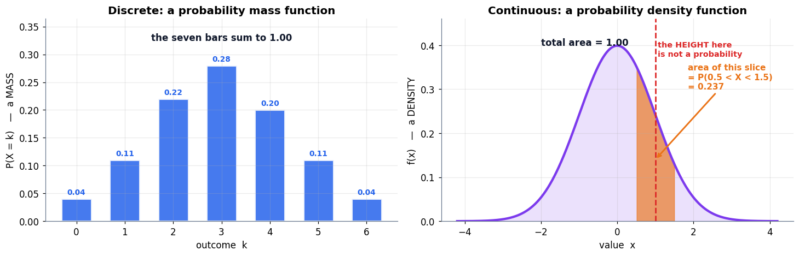

### Cell 43

```python
# ============================================================
#  A density of 2, and the point that has probability zero
# ============================================================
a, b = 0.0, 0.5
height = 1.0 / (b - a)

print("UNIFORM ON [0, 0.5]")
print("=" * 62)
print(f"  width  = {b - a}")
print(f"  height = 1 / width = {height}          <- a DENSITY of {height:.0f}, and that is fine")
print(f"  area   = height × width = {height * (b - a):.1f}   <- the hard rule, satisfied")
print()

# --- the probability of a band: area = height × width ---
lo, hi = 0.2, 0.4
print(f"  P({lo} < X < {hi}) = {height} × {hi - lo:.1f} = {height * (hi - lo):.1f}")

# --- verify by numeric integration, no formula ---
grid = np.linspace(-0.2, 0.7, 200_001)
dens = np.where((grid >= a) & (grid <= b), height, 0.0)
print(f"  numeric ∫ over the whole line       = {area(dens, grid):.6f}")
band = (grid >= lo) & (grid <= hi)
print(f"  numeric ∫ over [{lo}, {hi}]             = {area(dens[band], grid[band]):.6f}")
print()

# --- the exact point: shrink the window and watch it die ---
print("  P(X = 0.3) — shrink a window around 0.3 and watch:")
print(f"    {'half-width ε':>14} {'P(0.3-ε < X < 0.3+ε)':>24}")
for eps in [1e-1, 1e-2, 1e-3, 1e-6, 1e-9, 0.0]:
    print(f"    {eps:>14.0e} {height * 2 * eps:>24.10f}")
print("    the limit is exactly 0 — a point has no width, so it encloses no area")
print()

# --- and empirically: 1,000,000 draws, how many land exactly on 0.3? ---
draws = rng.uniform(a, b, 1_000_000)
print(f"  1,000,000 samples: exactly 0.3 was drawn {int((draws == 0.3).sum())} times")
print(f"                     landed in ({lo}, {hi}) "
      f"{((draws > lo) & (draws < hi)).mean():.4f} of the time  (expected {height*(hi-lo):.4f})")
```

**Output**

```text
UNIFORM ON [0, 0.5]
==============================================================
  width  = 0.5
  height = 1 / width = 2.0          <- a DENSITY of 2, and that is fine
  area   = height × width = 1.0   <- the hard rule, satisfied

  P(0.2 < X < 0.4) = 2.0 × 0.2 = 0.4
  numeric ∫ over the whole line       = 0.999999
  numeric ∫ over [0.2, 0.4]             = 0.399996

  P(X = 0.3) — shrink a window around 0.3 and watch:
      half-width ε     P(0.3-ε < X < 0.3+ε)
             1e-01             0.4000000000
             1e-02             0.0400000000
             1e-03             0.0040000000
             1e-06             0.0000040000
             1e-09             0.0000000040
             0e+00             0.0000000000
    the limit is exactly 0 — a point has no width, so it encloses no area

  1,000,000 samples: exactly 0.3 was drawn 0 times
                     landed in (0.2, 0.4) 0.4005 of the time  (expected 0.4000)
```

### Cell 44

```python
# ============================================================
#  Figure: a density above 1, and the point with probability zero
# ============================================================
fig, (axU, axZ) = plt.subplots(1, 2, figsize=(13.4, 4.3),
                               gridspec_kw={"width_ratios": [1.15, 1]})

# ── left: the uniform block ──
xs = np.linspace(-0.15, 0.65, 500)
ys = np.where((xs >= a) & (xs <= b), height, 0.0)
axU.plot(xs, ys, color=C_MODEL, lw=3)
axU.fill_between(xs, 0, ys, color=C_MODEL, alpha=0.13)
m = (xs >= lo) & (xs <= hi)
axU.fill_between(xs[m], 0, ys[m], color=C_PRED, alpha=0.70)
axU.axhline(1.0, color=C_ERR, ls="--", lw=1.8)
axU.text(-0.13, 1.06, "probability can never go above this line…", fontsize=9.4,
         color=C_ERR, fontweight="bold")
axU.text(-0.13, 2.06, "…but a DENSITY can sit here quite legally", fontsize=9.4,
         color=C_MODEL, fontweight="bold")
axU.annotate("", xy=(0.0, 2.0), xytext=(0.0, 0.0),
             arrowprops=dict(arrowstyle="<->", color=C_GREY, lw=1.6))
axU.text(-0.055, 1.0, "height\n= 2", fontsize=10, color=C_GREY, fontweight="bold",
         ha="center", va="center")
axU.text(0.30, 0.85, f"area\n= 2 × 0.2\n= {height*(hi-lo):.1f}", ha="center",
         fontsize=11, color="white", fontweight="bold")
axU.scatter([0.3], [0], s=140, color=C_ERR, zorder=6, clip_on=False)
axU.text(0.3, -0.34, "P(X = 0.3) = 0", ha="center", fontsize=10.5,
         color=C_ERR, fontweight="bold")
axU.set_ylim(0, 2.45)
tidy(axU, "x", "density  f(x)", "Uniform on [0, 0.5]:  a density of 2")

# ── right: shrink the window ──
eps_grid = np.logspace(-9, -1, 200)
axZ.plot(eps_grid, height * 2 * eps_grid, color=C_MODEL, lw=2.8)
axZ.set_xscale("log"); axZ.set_yscale("log")
axZ.scatter([1e-1], [height * 2e-1], s=130, color=C_PRED, zorder=5,
            edgecolor="white", lw=1.6)
axZ.text(1.1e-1, height * 2e-1, "  a real band", fontsize=9.6, color=C_PRED,
         fontweight="bold", va="center")
axZ.annotate("as the window closes,\nthe probability → 0",
             xy=(1e-8, height * 2e-8), xytext=(3e-7, 2e-3), fontsize=10.5,
             color=C_ERR, fontweight="bold",
             arrowprops=dict(arrowstyle="->", color=C_ERR, lw=1.9))
tidy(axZ, "half-width ε of the window around 0.3  (log)",
     "P(0.3−ε < X < 0.3+ε)  (log)", "A point is a window with no width")
plt.tight_layout(); plt.show()
```

**Output**

```text
<Figure size 1474x473 with 2 Axes>
```

**Figure**

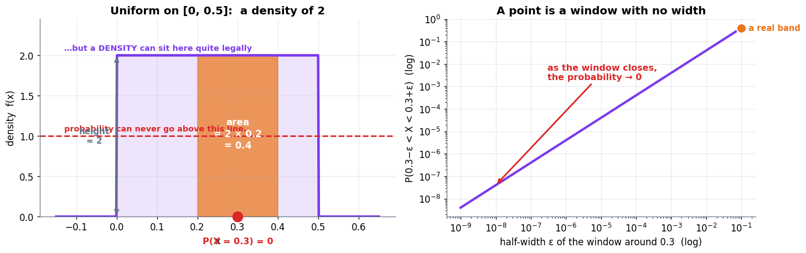

### Cell 47

```python
# ============================================================
#  Bernoulli: one parameter, two probabilities
# ============================================================
def bernoulli_pmf(x, p):
    """P(X = x) for x in {0, 1}."""
    return p if x == 1 else 1 - p

p_spam = 0.2
print("A single email from an inbox where 20% of mail is spam")
print("=" * 58)
print(f"  P(spam)     = P(X=1) = {bernoulli_pmf(1, p_spam):.1f}")
print(f"  P(not spam) = P(X=0) = {bernoulli_pmf(0, p_spam):.1f}")
print(f"  they sum to           {bernoulli_pmf(0, p_spam) + bernoulli_pmf(1, p_spam):.1f}   (the hard rule)")
print()
print(f"  mean     E[X] = p        = {p_spam:.2f}")
print(f"  variance      = p(1-p)   = {p_spam * (1 - p_spam):.2f}")
print()

# empirical check
draws = rng.random(200_000) < p_spam
print(f"  200,000 simulated emails: {draws.mean():.4f} were spam   (expected {p_spam:.4f})")
print(f"                            sample variance {draws.var():.4f}  "
      f"(expected {p_spam*(1-p_spam):.4f})")
```

**Output**

```text
A single email from an inbox where 20% of mail is spam
==========================================================
  P(spam)     = P(X=1) = 0.2
  P(not spam) = P(X=0) = 0.8
  they sum to           1.0   (the hard rule)

  mean     E[X] = p        = 0.20
  variance      = p(1-p)   = 0.16

  200,000 simulated emails: 0.2002 were spam   (expected 0.2000)
                            sample variance 0.1601  (expected 0.1600)
```

### Cell 49

```python
# ============================================================
#  The binomial, verified by brute-force enumeration
# ============================================================
from itertools import product
from math import comb

n_flips, k_target, p_head = 4, 2, 0.5

# --- enumerate all 2^4 = 16 outcomes and count by hand ---
outcomes = ["".join(o) for o in product("HT", repeat=n_flips)]
with_2h  = [o for o in outcomes if o.count("H") == k_target]

print(f"ALL {len(outcomes)} POSSIBLE SEQUENCES OF {n_flips} FLIPS")
print("=" * 62)
for i in range(0, len(outcomes), 8):
    print("   " + "  ".join(outcomes[i:i+8]))
print()
print(f"  those with exactly {k_target} heads: {'  '.join(with_2h)}")
print(f"  that is {len(with_2h)} arrangements   —   C({n_flips},{k_target}) = {comb(n_flips, k_target)}   "
      f"match: {len(with_2h) == comb(n_flips, k_target)}")
print()

per_arrangement = p_head**k_target * (1 - p_head)**(n_flips - k_target)
print(f"  cost of ONE arrangement = {p_head}^{k_target} × {1-p_head}^{n_flips-k_target} = {per_arrangement:.4f}")
print(f"  P(exactly {k_target} heads)  = {len(with_2h)} × {per_arrangement:.4f} = "
      f"{len(with_2h) * per_arrangement:.4f}   =  {len(with_2h)*per_arrangement:.1%}")
print()

def binomial_pmf(k, n, p):
    """comb(n, k) counts the arrangements; the rest is the per-arrangement probability."""
    return comb(n, k) * (p ** k) * ((1 - p) ** (n - k))

print("  via the formula:", f"{binomial_pmf(k_target, n_flips, p_head):.4f}")
print(f"  the book states 0.375  ->  we compute {binomial_pmf(2,4,0.5):.4f}  ✓")
print()

full = np.array([binomial_pmf(k, n_flips, p_head) for k in range(n_flips + 1)])
print(f"  the whole PMF, k = 0..4 : {full.round(4)}")
print(f"  sums to {full.sum():.4f}  (the hard rule)")
print(f"  mean = Σ k·P(k) = {(np.arange(5) * full).sum():.2f}   and   n·p = {n_flips*p_head:.2f}")
```

**Output**

```text
ALL 16 POSSIBLE SEQUENCES OF 4 FLIPS
==============================================================
   HHHH  HHHT  HHTH  HHTT  HTHH  HTHT  HTTH  HTTT
   THHH  THHT  THTH  THTT  TTHH  TTHT  TTTH  TTTT

  those with exactly 2 heads: HHTT  HTHT  HTTH  THHT  THTH  TTHH
  that is 6 arrangements   —   C(4,2) = 6   match: True

  cost of ONE arrangement = 0.5^2 × 0.5^2 = 0.0625
  P(exactly 2 heads)  = 6 × 0.0625 = 0.3750   =  37.5%

  via the formula: 0.3750
  the book states 0.375  ->  we compute 0.3750  ✓

  the whole PMF, k = 0..4 : [0.0625 0.25   0.375  0.25   0.0625]
  sums to 1.0000  (the hard rule)
  mean = Σ k·P(k) = 2.00   and   n·p = 2.00
```

### Cell 50

```python
# ============================================================
#  Figure: the six arrangements, and the bar chart they build
# ============================================================
fig, (axA, axB) = plt.subplots(1, 2, figsize=(13.6, 4.6),
                               gridspec_kw={"width_ratios": [1.05, 1]})

# ── left: the six ways to place 2 heads in 4 flips ──
stage(axA, (0, 10), (0, 7.2), title="(a)  The six arrangements of 2 heads in 4 flips")
for r, seq in enumerate(with_2h):
    y = 6.1 - r * 0.98
    for c, ch in enumerate(seq):
        is_h = ch == "H"
        axA.add_patch(Circle((2.6 + c * 1.05, y), 0.36,
                             fc=C_PRED if is_h else C_SOFT,
                             ec=C_PRED if is_h else C_GREY, lw=1.9, zorder=3))
        axA.text(2.6 + c * 1.05, y, ch, ha="center", va="center", fontsize=11,
                 fontweight="bold", color="white" if is_h else C_GREY, zorder=4)
    axA.text(1.9, y, f"{r+1}.", ha="right", va="center", fontsize=10.5, color=C_GREY)
    axA.text(7.5, y, f"{per_arrangement:.4f}", ha="left", va="center", fontsize=10,
             color=C_GREY)
axA.text(7.5, 6.85, "each costs", fontsize=9.6, color=C_GREY, style="italic")
axA.plot([7.4, 9.3], [0.62, 0.62], color=C_ERR, lw=1.8)
axA.text(7.5, 0.18, f"6 × {per_arrangement:.4f} = {6*per_arrangement:.4f}", fontsize=12,
         color=C_ERR, fontweight="bold")

# ── right: the full binomial PMF ──
ks = np.arange(n_flips + 1)
bars = axB.bar(ks, full, color=C_GREY, alpha=0.45, edgecolor="white", lw=2, width=0.6)
bars[k_target].set_color(C_PRED); bars[k_target].set_alpha(0.92)
for kk, v in zip(ks, full):
    axB.text(kk, v + 0.012, f"{v:.4f}", ha="center", fontsize=9.6,
             fontweight="bold", color=C_PRED if kk == k_target else C_GREY)
axB.axvline(n_flips * p_head, color=C_TRUE, ls="--", lw=2)
axB.text(n_flips * p_head + 0.12, 0.33, f"mean = n·p = {n_flips*p_head:.0f}",
         color=C_TRUE, fontsize=10, fontweight="bold")
axB.set_ylim(0, 0.46); axB.set_xticks(ks)
tidy(axB, "k  (number of heads in 4 flips)", "P(X = k)",
     "(b)  Binomial(n=4, p=0.5)")
plt.tight_layout(); plt.show()
```

**Output**

```text
<Figure size 1496x506 with 2 Axes>
```

**Figure**

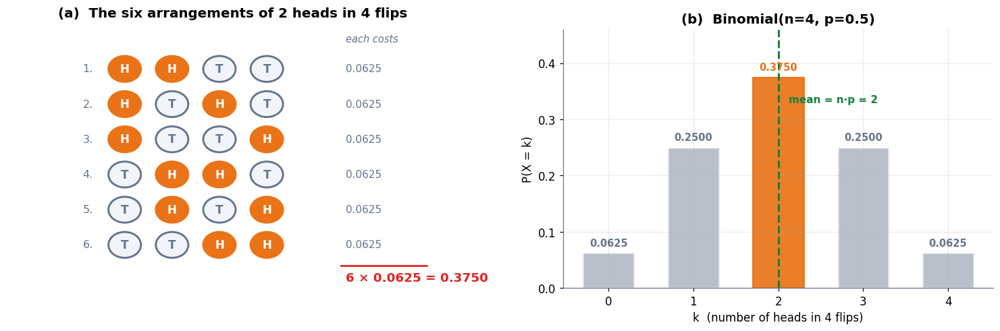

### Cell 53

```python
# ============================================================
#  The Gaussian, its 68-95-99.7 rule, and the heights example
# ============================================================
def gaussian_pdf(x, mu, sigma):
    return np.exp(-0.5 * ((x - mu) / sigma) ** 2) / (sigma * np.sqrt(2 * np.pi))

mu_h, sd_h = 170.0, 7.0        # adult heights, cm

# --- verify 68-95-99.7 by numerical integration, not by quoting it ---
grid = np.linspace(mu_h - 8 * sd_h, mu_h + 8 * sd_h, 400_001)
dens = gaussian_pdf(grid, mu_h, sd_h)
print("THE 68-95-99.7 RULE, INTEGRATED RATHER THAN QUOTED")
print("=" * 62)
print(f"  total area under the curve : {area(dens, grid):.6f}")
print()
print(f"  {'band':>10}{'range (cm)':>22}{'mass':>12}{'rule of thumb':>16}")
for k, quoted in [(1, "68%"), (2, "95%"), (3, "99.7%")]:
    lo_k, hi_k = mu_h - k * sd_h, mu_h + k * sd_h
    m = (grid >= lo_k) & (grid <= hi_k)
    print(f"  {'±' + str(k) + 'σ':>10}{f'{lo_k:.0f} – {hi_k:.0f}':>22}"
          f"{area(dens[m], grid[m]):>12.4f}{quoted:>16}")
print()

print(f"ADULT HEIGHTS:  μ = {mu_h:.0f} cm,  σ = {sd_h:.0f} cm")
print("=" * 62)
print(f"  {'height':>9}{'z':>9}{'P(taller)':>13}{'roughly':>16}")
for h in [170, 177, 184, 191, 200]:
    z = (h - mu_h) / sd_h
    m = grid >= h
    tail = area(dens[m], grid[m])
    print(f"  {h:>6} cm{z:>+8.2f}σ{tail:>13.5f}{f'1 in {1/tail:,.0f}':>16}")
print()
print(f"  the density AT the peak is {gaussian_pdf(mu_h, mu_h, sd_h):.4f} — a density, not a probability")
print(f"  P(height = exactly 170.000... cm) = 0, as always for a continuous variable")
```

**Output**

```text
THE 68-95-99.7 RULE, INTEGRATED RATHER THAN QUOTED
==============================================================
  total area under the curve : 1.000000

        band            range (cm)        mass   rule of thumb
         ±1σ             163 – 177      0.6827             68%
         ±2σ             156 – 184      0.9545             95%
         ±3σ             149 – 191      0.9973           99.7%

ADULT HEIGHTS:  μ = 170 cm,  σ = 7 cm
==============================================================
     height        z    P(taller)         roughly
     170 cm   +0.00σ      0.50000          1 in 2
     177 cm   +1.00σ      0.15866          1 in 6
     184 cm   +2.00σ      0.02275         1 in 44
     191 cm   +3.00σ      0.00135        1 in 741
     200 cm   +4.29σ      0.00001    1 in 109,801

  the density AT the peak is 0.0570 — a density, not a probability
  P(height = exactly 170.000... cm) = 0, as always for a continuous variable
```

### Cell 54

```python
# ============================================================
#  Figure: the two dials, and the 68-95-99.7 bands
# ============================================================
fig, (axM, axS, axR) = plt.subplots(1, 3, figsize=(15.0, 4.2))

xs = np.linspace(140, 200, 700)

# ── (a) μ slides the peak ──
for mu_i, cl in [(160, C_DATA), (170, C_MODEL), (180, C_PRED)]:
    axM.plot(xs, gaussian_pdf(xs, mu_i, 7), color=cl, lw=2.6, label=f"μ = {mu_i}")
    axM.axvline(mu_i, color=cl, ls=":", lw=1.4)
tidy(axM, "height (cm)", "density", "(a)  μ slides the peak", legend=True)

# ── (b) σ sets the width ──
for sd_i, cl in [(3.5, C_TRUE), (7, C_MODEL), (14, C_ERR)]:
    axS.plot(xs, gaussian_pdf(xs, 170, sd_i), color=cl, lw=2.6, label=f"σ = {sd_i}")
tidy(axS, "height (cm)", "density", "(b)  σ sets the width", legend=True)
axS.text(143, 0.100, "same area (1.0)\nunder all three", fontsize=9.4,
         color=C_GREY, style="italic", fontweight="bold")

# ── (c) the 68-95-99.7 bands ──
ys = gaussian_pdf(xs, mu_h, sd_h)
axR.plot(xs, ys, color=C_MODEL, lw=2.8)
shades = [(3, "#EDE9FE", "99.7%"), (2, "#C4B5FD", "95%"), (1, "#8B5CF6", "68%")]
for k, cl, lab in shades:
    m = (xs >= mu_h - k * sd_h) & (xs <= mu_h + k * sd_h)
    axR.fill_between(xs[m], 0, ys[m], color=cl, alpha=0.95, zorder=2)
for k, _, lab in shades:
    axR.text(mu_h, gaussian_pdf(mu_h + (k - 0.55) * sd_h, mu_h, sd_h) * 0.62 + 0.002,
             "", ha="center")
axR.text(mu_h, 0.0155, "68%", ha="center", fontsize=11, color="white", fontweight="bold", zorder=5)
axR.text(mu_h + 1.5 * sd_h, 0.0125, "95%", ha="center", fontsize=10, color="#4C1D95",
         fontweight="bold", zorder=5)
axR.text(mu_h + 2.5 * sd_h, 0.006, "99.7%", ha="center", fontsize=9.4, color="#4C1D95",
         fontweight="bold", zorder=5)
for k in [1, 2, 3]:
    for sgn in [-1, 1]:
        axR.axvline(mu_h + sgn * k * sd_h, color=C_GREY, ls=":", lw=1.1, zorder=3)
axR.scatter([200], [gaussian_pdf(200, mu_h, sd_h)], s=110, color=C_ERR, zorder=6)
axR.annotate("200 cm\n(+4.3σ)", xy=(200, 0.002), xytext=(188, 0.033),
             fontsize=9.6, color=C_ERR, fontweight="bold",
             arrowprops=dict(arrowstyle="->", color=C_ERR, lw=1.7))
axR.set_xticks([mu_h + k * sd_h for k in range(-3, 4)])
axR.set_xticklabels([f"{mu_h + k*sd_h:.0f}\n{k:+d}σ".replace("+0σ", "μ") for k in range(-3, 4)],
                    fontsize=8.6)
tidy(axR, "height (cm)", "density", "(c)  Heights: μ=170, σ=7")
plt.tight_layout(); plt.show()
```

**Output**

```text
<Figure size 1650x462 with 3 Axes>
```

**Figure**

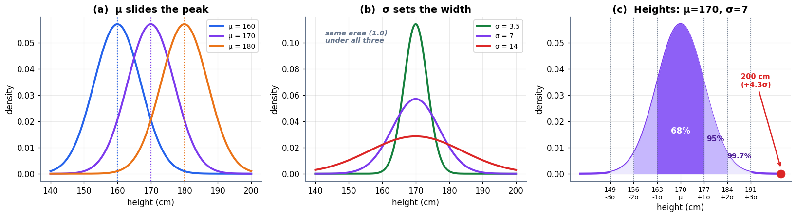

### Cell 57

```python
# ============================================================
#  Poisson: one parameter that is both mean and variance
# ============================================================
from math import factorial, exp

def poisson_pmf(k, lam):
    return lam**k * exp(-lam) / factorial(k)

lam = 3.0     # e.g. an inbox that averages 3 emails per hour
ks  = np.arange(0, 15)
pmf_pois = np.array([poisson_pmf(int(k), lam) for k in ks])

print(f"POISSON WITH λ = {lam}   (say: emails arriving per hour)")
print("=" * 58)
for k in range(0, 8):
    bar = "█" * int(round(poisson_pmf(k, lam) * 90))
    print(f"  P(exactly {k} emails) = {poisson_pmf(k, lam):.4f}  {bar}")
print(f"  ...")
print(f"  P(k ≥ 8)            = {1 - sum(poisson_pmf(k, lam) for k in range(8)):.4f}")
print()
ks_full  = np.arange(0, 60)
pmf_full = np.array([poisson_pmf(int(k), lam) for k in ks_full])
print(f"  sums to (k = 0..59)    {pmf_full.sum():.6f}")
print(f"  mean     Σ k·P(k)      = {(ks_full * pmf_full).sum():.4f}   (= λ)")
print(f"  variance Σ (k−λ)²P(k)  = {(((ks_full - lam)**2) * pmf_full).sum():.4f}   "
      f"(= λ as well — the Poisson signature)")
print()
sim = rng.poisson(lam, 200_000)
print(f"  200,000 simulated hours: mean {sim.mean():.4f}, variance {sim.var():.4f}")
```

**Output**

```text
POISSON WITH λ = 3.0   (say: emails arriving per hour)
==========================================================
  P(exactly 0 emails) = 0.0498  ████
  P(exactly 1 emails) = 0.1494  █████████████
  P(exactly 2 emails) = 0.2240  ████████████████████
  P(exactly 3 emails) = 0.2240  ████████████████████
  P(exactly 4 emails) = 0.1680  ███████████████
  P(exactly 5 emails) = 0.1008  █████████
  P(exactly 6 emails) = 0.0504  █████
  P(exactly 7 emails) = 0.0216  ██
  ...
  P(k ≥ 8)            = 0.0119

  sums to (k = 0..59)    1.000000
  mean     Σ k·P(k)      = 3.0000   (= λ)
  variance Σ (k−λ)²P(k)  = 3.0000   (= λ as well — the Poisson signature)

  200,000 simulated hours: mean 2.9983, variance 3.0052
```

### Cell 58

```python
# ============================================================
#  Figure: the five distributions to know by sight
# ============================================================
fig, axes = plt.subplots(1, 5, figsize=(16.4, 3.7))

# 1. Bernoulli
axes[0].bar([0, 1], [1 - p_spam, p_spam], color=C_DATA, alpha=0.85,
            edgecolor="white", lw=2, width=0.5)
axes[0].set_xticks([0, 1]); axes[0].set_ylim(0, 1.0)
axes[0].text(0.5, 0.92, "p = 0.2", ha="center", fontsize=10, color=C_DATA,
             fontweight="bold")
tidy(axes[0], "outcome", "P", "Bernoulli\none yes/no")

# 2. Binomial
kb = np.arange(0, 21)
pb = np.array([binomial_pmf(int(k), 20, 0.35) for k in kb])
axes[1].bar(kb, pb, color=C_PRED, alpha=0.85, edgecolor="white", lw=1.1, width=0.8)
axes[1].text(13.5, pb.max() * 0.85, "n=20\np=0.35", fontsize=10, color=C_PRED,
             fontweight="bold")
tidy(axes[1], "successes k", "P", "Binomial\nn Bernoullis added")

# 3. Gaussian
xg = np.linspace(-4.5, 4.5, 400)
axes[2].plot(xg, gaussian_pdf(xg, 0, 1), color=C_MODEL, lw=2.8)
axes[2].fill_between(xg, 0, gaussian_pdf(xg, 0, 1), color=C_MODEL, alpha=0.18)
axes[2].text(1.4, 0.33, "μ=0\nσ=1", fontsize=10, color=C_MODEL, fontweight="bold")
tidy(axes[2], "x", "density", "Gaussian\nmany small causes")

# 4. Uniform
xu = np.linspace(-0.35, 1.35, 400)
yu = np.where((xu >= 0) & (xu <= 1), 1.0, 0.0)
axes[3].plot(xu, yu, color=C_TRUE, lw=2.8)
axes[3].fill_between(xu, 0, yu, color=C_TRUE, alpha=0.20)
axes[3].set_ylim(0, 1.5)
axes[3].text(0.5, 1.18, "on [0, 1]", ha="center", fontsize=10, color=C_TRUE,
             fontweight="bold")
tidy(axes[3], "x", "density", "Uniform\nno information")

# 5. Poisson
axes[4].bar(ks, pmf_pois, color=C_ERR, alpha=0.85, edgecolor="white", lw=1.1, width=0.72)
axes[4].text(8.0, pmf_pois.max() * 0.78, "λ = 3", fontsize=10, color=C_ERR,
             fontweight="bold")
tidy(axes[4], "count k", "P", "Poisson\nrare events per window")

plt.tight_layout(); plt.show()
```

**Output**

```text
<Figure size 1804x407 with 5 Axes>
```

**Figure**

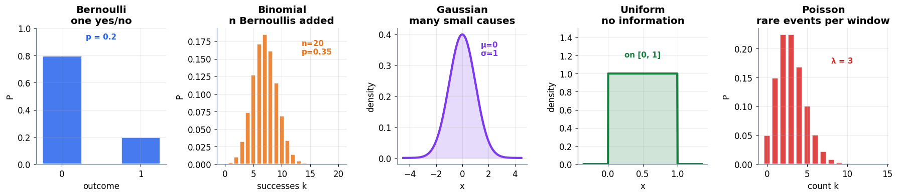

### Cell 61

```python
# ============================================================
#  MLE for the bent coin: 7 heads in 10 flips
# ============================================================
heads, flips = 7, 10
tails = flips - heads

ps = np.linspace(1e-4, 1 - 1e-4, 20_001)
likelihood     = ps**heads * (1 - ps)**tails
log_likelihood = heads * np.log(ps) + tails * np.log(1 - ps)

p_hat_numeric = ps[likelihood.argmax()]
p_hat_formula = heads / flips

print(f"BENT COIN: {heads} heads in {flips} flips")
print("=" * 62)
print(f"  L(p) = p^{heads} (1-p)^{tails}")
print()
print(f"  {'p':>8}{'L(p)':>14}{'log L(p)':>14}")
for p_try in [0.3, 0.5, 0.6, 0.7, 0.8, 0.9]:
    L = p_try**heads * (1 - p_try)**tails
    print(f"  {p_try:>8.2f}{L:>14.6f}{np.log(L):>14.4f}"
          + ("   <- largest" if abs(p_try - 0.7) < 1e-9 else ""))
print()
print(f"  argmax by grid search   : p̂ = {p_hat_numeric:.4f}")
print(f"  argmax by the derivation: p̂ = {heads}/{flips} = {p_hat_formula:.4f}")
print(f"  agree to 3 decimals?      {abs(p_hat_numeric - p_hat_formula) < 5e-4}")
print()
print("  Why 'the obvious fraction' is a RESULT, not a guess:")
print(f"    dℓ/dp = {heads}/p − {tails}/(1−p) = 0   =>   {heads}(1−p) = {tails}p")
print(f"                                       =>   {heads} = {flips}p")
print(f"                                       =>   p = {heads}/{flips} = {p_hat_formula}")
```

**Output**

```text
BENT COIN: 7 heads in 10 flips
==============================================================
  L(p) = p^7 (1-p)^3

         p          L(p)      log L(p)
      0.30      0.000075       -9.4978
      0.50      0.000977       -6.9315
      0.60      0.001792       -6.3247
      0.70      0.002224       -6.1086   <- largest
      0.80      0.001678       -6.3903
      0.90      0.000478       -7.6453

  argmax by grid search   : p̂ = 0.7000
  argmax by the derivation: p̂ = 7/10 = 0.7000
  agree to 3 decimals?      True

  Why 'the obvious fraction' is a RESULT, not a guess:
    dℓ/dp = 7/p − 3/(1−p) = 0   =>   7(1−p) = 3p
                                       =>   7 = 10p
                                       =>   p = 7/10 = 0.7
```

### Cell 62

```python
# ============================================================
#  Figure: the likelihood surface, and why we take the log
# ============================================================
fig, (axL, axG) = plt.subplots(1, 2, figsize=(13.4, 4.4))

axL.plot(ps, likelihood, color=C_MODEL, lw=2.8)
axL.fill_between(ps, 0, likelihood, color=C_MODEL, alpha=0.13)
axL.axvline(p_hat_formula, color=C_ERR, ls="--", lw=2)
axL.scatter([p_hat_formula], [p_hat_formula**heads * (1 - p_hat_formula)**tails],
            s=200, color=C_ERR, zorder=5, edgecolor="white", lw=2)
axL.annotate(f"p̂ = {p_hat_formula}\nL = {p_hat_formula**heads*(1-p_hat_formula)**tails:.5f}",
             xy=(p_hat_formula, p_hat_formula**heads * (1 - p_hat_formula)**tails),
             xytext=(0.30, 0.0018), fontsize=10.5, color=C_ERR, fontweight="bold",
             arrowprops=dict(arrowstyle="->", color=C_ERR, lw=1.9))
axL.axvline(0.5, color=C_GREY, ls=":", lw=1.6)
axL.text(0.505, 0.00025, "a fair coin\nwould score this", fontsize=9, color=C_GREY)
tidy(axL, "candidate p", r"likelihood  $L(p) = p^7(1-p)^3$",
     "How well each p explains 7-of-10")

axG.plot(ps, log_likelihood, color=C_DATA, lw=2.8)
axG.axvline(p_hat_formula, color=C_ERR, ls="--", lw=2)
axG.scatter([p_hat_formula], [heads*np.log(p_hat_formula) + tails*np.log(1-p_hat_formula)],
            s=180, color=C_ERR, zorder=5, edgecolor="white", lw=2)
axG.set_ylim(-24, -4)
axG.text(0.06, -8.4, "same peak,\nsame p̂ —\nlog never\nreorders anything",
         fontsize=10, color=C_DATA, fontweight="bold")
tidy(axG, "candidate p", r"log-likelihood  $\ell(p)$",
     "The log: friendlier to differentiate")
plt.tight_layout(); plt.show()
```

**Output**

```text
<Figure size 1474x484 with 2 Axes>
```

**Figure**

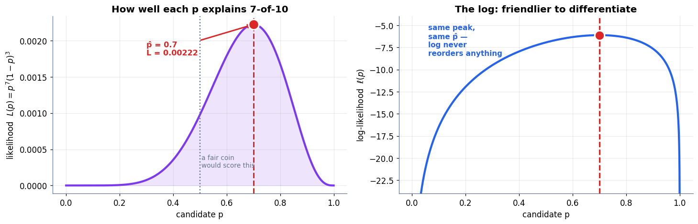

### Cell 65

```python
# ============================================================
#  MLE on a Gaussian, and BCE == Bernoulli negative log-likelihood
# ============================================================
# --- 1. Gaussian MLE recovers the sample mean and (1/n) variance ---
truth_mu, truth_sd = 170.0, 7.0
sample = rng.normal(truth_mu, truth_sd, 5_000)

mu_hat  = sample.mean()
var_mle = ((sample - mu_hat) ** 2).mean()          # the 1/n version — what MLE gives
var_unb = ((sample - mu_hat) ** 2).sum() / (len(sample) - 1)   # the 1/(n-1) correction

# brute-force check: grid-search the log-likelihood over (mu, sigma)
def gauss_ll(x, mu, sd):
    return (-0.5 * np.log(2 * np.pi * sd**2) - (x - mu)**2 / (2 * sd**2)).sum()

mus  = np.linspace(mu_hat - 1.0, mu_hat + 1.0, 201)
sds  = np.linspace(np.sqrt(var_mle) - 0.6, np.sqrt(var_mle) + 0.6, 201)
grid_ll = np.array([[gauss_ll(sample, m, s) for s in sds] for m in mus])
i, j = np.unravel_index(grid_ll.argmax(), grid_ll.shape)

print(f"GAUSSIAN MLE on {len(sample):,} samples  (true μ={truth_mu}, σ={truth_sd})")
print("=" * 66)
print(f"  sample mean            μ̂ = {mu_hat:.5f}")
print(f"  grid-search argmax     μ  = {mus[i]:.5f}")
print(f"  MLE variance (1/n)     σ̂² = {var_mle:.5f}   ->  σ̂ = {np.sqrt(var_mle):.5f}")
print(f"  grid-search argmax     σ  = {sds[j]:.5f}")
print(f"  unbiased    (1/(n-1))  s² = {var_unb:.5f}   (a bias correction, NOT the MLE)")
print(f"  MLE matches the closed form?  μ {abs(mus[i]-mu_hat) < 0.011}   "
      f"σ {abs(sds[j]-np.sqrt(var_mle)) < 0.011}")
print()

# --- 2. Bernoulli NLL is literally binary cross-entropy ---
y      = np.array([1, 1, 0, 1, 0, 0, 1, 1, 1, 0])          # 6 ones, 4 zeros
y_hat  = np.array([.9, .8, .3, .7, .1, .4, .95, .6, .75, .2])

nll = -np.sum(y * np.log(y_hat) + (1 - y) * np.log(1 - y_hat))     # -log L
bce = -np.mean(y * np.log(y_hat) + (1 - y) * np.log(1 - y_hat))    # the usual BCE (mean)

print("BERNOULLI NEGATIVE LOG-LIKELIHOOD  vs  BINARY CROSS-ENTROPY")
print("=" * 66)
print(f"  −log L (summed) = {nll:.6f}")
print(f"  BCE    (mean)   = {bce:.6f}    = {nll:.6f} / {len(y)}")
print(f"  identical up to the 1/n?  {np.isclose(bce, nll / len(y))}")
print()

# --- 3. and MLE on those labels alone recovers the observed fraction ---
grid_p = np.linspace(1e-6, 1 - 1e-6, 100_001)
ll_p   = y.sum() * np.log(grid_p) + (len(y) - y.sum()) * np.log(1 - grid_p)
print(f"  with a single shared p, the maximiser is p̂ = {grid_p[ll_p.argmax()]:.4f}")
print(f"  the observed fraction of 1s              = {y.mean():.4f}   <- the same number")
```

**Output**

```text
GAUSSIAN MLE on 5,000 samples  (true μ=170.0, σ=7.0)
==================================================================
  sample mean            μ̂ = 169.95373
  grid-search argmax     μ  = 169.95373
  MLE variance (1/n)     σ̂² = 50.42762   ->  σ̂ = 7.10124
  grid-search argmax     σ  = 7.10124
  unbiased    (1/(n-1))  s² = 50.43770   (a bias correction, NOT the MLE)
  MLE matches the closed form?  μ True   σ True

BERNOULLI NEGATIVE LOG-LIKELIHOOD  vs  BINARY CROSS-ENTROPY
==================================================================
  −log L (summed) = 2.730985
  BCE    (mean)   = 0.273098    = 2.730985 / 10
  identical up to the 1/n?  True

  with a single shared p, the maximiser is p̂ = 0.6000
  the observed fraction of 1s              = 0.6000   <- the same number
```

### Cell 66

```python
# ============================================================
#  Figure: the loss a Bernoulli implies
# ============================================================
fig, (axB1, axB2) = plt.subplots(1, 2, figsize=(13.2, 4.3))

phat = np.linspace(1e-3, 1 - 1e-3, 500)
axB1.plot(phat, -np.log(phat), color=C_TRUE, lw=2.8, label="true label y = 1")
axB1.plot(phat, -np.log(1 - phat), color=C_ERR, lw=2.8, label="true label y = 0")
axB1.set_ylim(0, 6)
axB1.axhline(0, color=C_GREY, lw=1)
axB1.text(0.52, 4.6, "confident AND wrong\nis punished without limit",
          fontsize=9.8, color=C_GREY, style="italic", fontweight="bold")
tidy(axB1, r"the model's predicted probability  $\hat{y}$", "loss contribution",
     "Binary cross-entropy, one example at a time", legend=True)

ll_curve = y.sum() * np.log(grid_p) + (len(y) - y.sum()) * np.log(1 - grid_p)
axB2.plot(grid_p, -ll_curve / len(y), color=C_MODEL, lw=2.8)
best = grid_p[ll_curve.argmax()]
axB2.axvline(best, color=C_ERR, ls="--", lw=2)
axB2.scatter([best], [-ll_curve.max() / len(y)], s=180, color=C_ERR, zorder=5,
             edgecolor="white", lw=2)
axB2.annotate(f"minimum at p̂ = {best:.2f}\n= the observed fraction of 1s",
              xy=(best, -ll_curve.max() / len(y)), xytext=(0.12, 1.05),
              fontsize=10.5, color=C_ERR, fontweight="bold",
              arrowprops=dict(arrowstyle="->", color=C_ERR, lw=1.9))
axB2.set_ylim(0.6, 1.6)
tidy(axB2, "a single shared p for all 10 labels", "mean BCE  =  −ℓ(p)/n",
     "Minimising BCE = maximising likelihood")
plt.tight_layout(); plt.show()
```

**Output**

```text
<Figure size 1452x473 with 2 Axes>
```

**Figure**

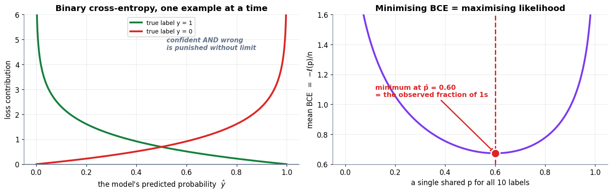

### Cell 71

```python
# ============================================================
#  Why the joint likelihood is unestimable — count the combinations
# ============================================================
V      = 10_000        # vocabulary size
L      = 20            # words in the email
ATOMS  = 7e27          # atoms in a human body, order of magnitude

combos = V ** L        # ordered sequences of L words from a V-word vocabulary

print("THE COMBINATORIAL WALL")
print("=" * 66)
print(f"  vocabulary                       V = {V:,}")
print(f"  words in one short email         L = {L}")
print(f"  possible word combinations   V^L = {V}^{L} = 1e{np.log10(float(combos)):.0f}")
print(f"  atoms in a human body            ≈ 1e{np.log10(ATOMS):.0f}")
print(f"  the email space is  1e{np.log10(float(combos)) - np.log10(ATOMS):.0f}  times larger")
print()
print("  To estimate P(x1,...,x20 | spam) directly we would need to have seen")
print("  each combination many times. Every email ever written is a rounding")
print("  error against that number. There is no dataset large enough — ever.")
print()
print("AFTER THE NAIVE ASSUMPTION")
print("=" * 66)
n_classes = 2
print(f"  numbers to estimate, joint : {combos:.3e} per class")
print(f"  numbers to estimate, naive : {V:,} per class  (one per word)")
print(f"  total with {n_classes} classes      : {n_classes * V:,} — a table that fits in memory")
print()
print("  That trade is the entire idea of this Part.")
```

**Output**

```text
THE COMBINATORIAL WALL
==================================================================
  vocabulary                       V = 10,000
  words in one short email         L = 20
  possible word combinations   V^L = 10000^20 = 1e80
  atoms in a human body            ≈ 1e28
  the email space is  1e52  times larger

  To estimate P(x1,...,x20 | spam) directly we would need to have seen
  each combination many times. Every email ever written is a rounding
  error against that number. There is no dataset large enough — ever.

AFTER THE NAIVE ASSUMPTION
==================================================================
  numbers to estimate, joint : 1.000e+80 per class
  numbers to estimate, naive : 10,000 per class  (one per word)
  total with 2 classes      : 20,000 — a table that fits in memory

  That trade is the entire idea of this Part.
```

### Cell 73

```python
# ============================================================
#  Figure: the naive factorisation, and the classifier as a pipeline
# ============================================================
fig = plt.figure(figsize=(14.0, 7.4))
gs  = fig.add_gridspec(2, 1, height_ratios=[1, 1.25], hspace=0.22)

# ── (a) one unestimable number becomes n countable ones ──
axA = fig.add_subplot(gs[0]); stage(axA, (0, 14), (0, 4.4))
box(axA, 2.6, 2.5, 4.4, 1.6,
    "$P(x_1, x_2, \\ldots, x_n \\mid c)$\n\nONE number.\nnever observed enough\nto estimate",
    fc="#FEE2E2", ec=C_ERR, fs=9.6, lw=2.4)
arrow(axA, (5.0, 2.5), (6.5, 2.5), color=C_MODEL, lw=2.6)
axA.text(5.75, 3.35, "conditional\nindependence", ha="center", fontsize=9.4,
         color=C_MODEL, style="italic", fontweight="bold")
for j, lbl in enumerate(["$P(x_1\\mid c)$", "$P(x_2\\mid c)$", "$\\cdots$", "$P(x_n\\mid c)$"]):
    box(axA, 7.7 + j * 1.75, 2.5, 1.55, 1.0, lbl, fc="#DCFCE7", ec=C_TRUE,
        fs=9.6, lw=2.0)
    if j < 3:
        axA.text(8.58 + j * 1.75, 2.5, "×", ha="center", va="center",
                 fontsize=15, color=C_GREY)
axA.text(10.3, 1.15, "n numbers — each one is just a word count", ha="center",
         fontsize=10, color=C_TRUE, fontweight="bold")
axA.set_title("(a)  The trade: one impossible number for n easy ones", fontsize=12)

# ── (b) the full decision pipeline ──
axB = fig.add_subplot(gs[1]); stage(axB, (0, 14), (0, 5.4))
box(axB, 1.5, 2.7, 2.3, 1.3, "the email\n\n$x_1, x_2, \\ldots, x_n$", fc="#DBEAFE",
    ec=C_DATA, fs=9.6, lw=2.2)
for row, (cname, cy, cl, fcl) in enumerate(
        [("SPAM", 4.05, C_ERR, "#FEE2E2"), ("HAM", 1.35, C_TRUE, "#DCFCE7")]):
    arrow(axB, (2.75, 2.7 + (0.5 if row == 0 else -0.5)), (4.05, cy), color=cl, lw=2.0)
    box(axB, 5.35, cy, 2.4, 1.05, f"$P(\\mathrm{{{cname.lower()}}})$\nthe prior", fc=fcl,
        ec=cl, fs=9.4, lw=2.0)
    axB.text(6.72, cy, "×", ha="center", va="center", fontsize=15, color=C_GREY)
    box(axB, 8.6, cy, 2.6, 1.05, "$\\prod_i P(x_i \\mid c)$\nword likelihoods",
        fc=fcl, ec=cl, fs=9.4, lw=2.0)
    arrow(axB, (9.95, cy), (11.15, cy), color=cl, lw=2.0)
    box(axB, 12.3, cy, 1.9, 1.05, f"score\n({cname.lower()})", fc=fcl, ec=cl,
        fs=9.6, lw=2.0, bold=True)
axB.add_patch(FancyArrowPatch((13.35, 4.05), (13.35, 1.35), arrowstyle="<->",
                              mutation_scale=16, color=C_MODEL, lw=2.2,
                              connectionstyle="arc3,rad=-0.45", zorder=1))
axB.text(13.95, 2.7, "argmax", ha="center", va="center", fontsize=11,
         color=C_MODEL, fontweight="bold", rotation=90)
axB.text(7.0, 0.18, "no P(evidence) anywhere — it is identical for both rows, "
                    "so it cannot change the winner",
         ha="center", fontsize=10, color=C_GREY, style="italic", fontweight="bold")
axB.set_title("(b)  The whole classifier: score each class, then take the argmax", fontsize=12)
plt.show()
```

**Output**

```text
<Figure size 1540x814 with 2 Axes>
```

**Figure**

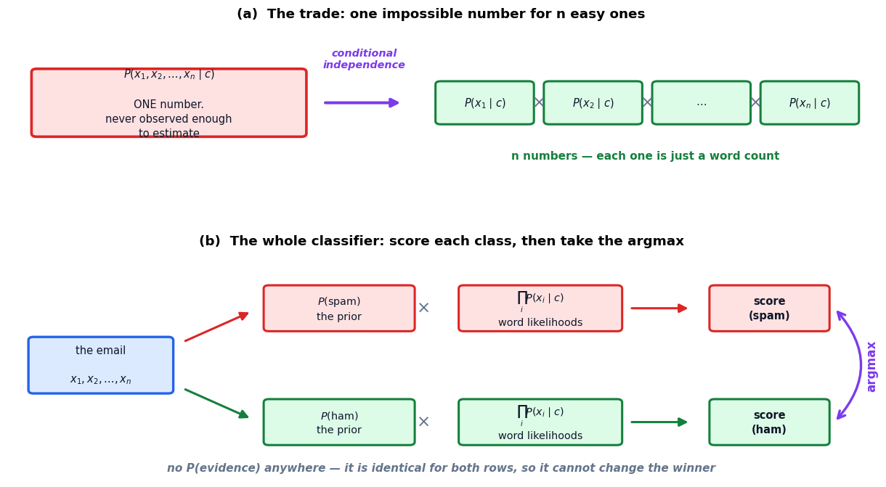

### Cell 76

```python
# ============================================================
#  The spam example, computed rather than quoted
# ============================================================
priors = {"spam": 0.4, "ham": 0.6}
lik    = {                        # P(word | class)
    "free":  {"spam": 0.7, "ham": 0.1},
    "money": {"spam": 0.5, "ham": 0.2},
    "lunch": {"spam": 0.1, "ham": 0.4},
}
email = ["free", "money", "lunch"]

scores = {}
print(f'SCORING THE EMAIL: "{" ".join(email)}"')
print("=" * 70)
for c in ["spam", "ham"]:
    s = priors[c]
    trail = [f"{priors[c]}"]
    for w in email:
        s *= lik[w][c]
        trail.append(f"{lik[w][c]}")
    scores[c] = s
    print(f"  score({c:<4}) = " + " × ".join(trail) + f" = {s:.4f}")
print()
winner = max(scores, key=scores.get)
print(f"  {scores['spam']:.4f} vs {scores['ham']:.4f}  ->  the classifier says '{winner.upper()}'")
print(f"  the book states 0.014 and 0.0048  ->  we compute "
      f"{scores['spam']:.4f} and {scores['ham']:.4f}  ✓")
print()

total = sum(scores.values())
print("  NORMALISING (this is just putting P(evidence) back):")
print(f"    P(evidence) = {scores['spam']:.4f} + {scores['ham']:.4f} = {total:.4f}")
for c in ["spam", "ham"]:
    print(f"    P({c:<4} | email) = {scores[c]:.4f} / {total:.4f} = {scores[c]/total:.4f} "
          f"= {scores[c]/total:.1%}")
print(f"    the book states ≈74.5%  ->  we compute {scores['spam']/total:.1%}  ✓")
print()

print("  THE TUG-OF-WAR, word by word (likelihood ratio spam:ham):")
running = priors["spam"] / priors["ham"]
print(f"    {'':<8}{'spam':>8}{'ham':>8}{'ratio':>10}{'running odds':>16}")
print(f"    {'prior':<8}{priors['spam']:>8.2f}{priors['ham']:>8.2f}"
      f"{priors['spam']/priors['ham']:>10.2f}{running:>16.3f}")
for w in email:
    r = lik[w]["spam"] / lik[w]["ham"]
    running *= r
    arrow_ = "-> spam" if r > 1 else "-> ham "
    print(f"    {w:<8}{lik[w]['spam']:>8.2f}{lik[w]['ham']:>8.2f}{r:>10.2f}"
          f"{running:>16.3f}   {arrow_}")
print(f"    final odds {running:.3f} : 1  ->  P(spam) = {running/(1+running):.1%}  "
      f"(same answer, odds form)")
```

**Output**

```text
SCORING THE EMAIL: "free money lunch"
======================================================================
  score(spam) = 0.4 × 0.7 × 0.5 × 0.1 = 0.0140
  score(ham ) = 0.6 × 0.1 × 0.2 × 0.4 = 0.0048

  0.0140 vs 0.0048  ->  the classifier says 'SPAM'
  the book states 0.014 and 0.0048  ->  we compute 0.0140 and 0.0048  ✓

  NORMALISING (this is just putting P(evidence) back):
    P(evidence) = 0.0140 + 0.0048 = 0.0188
    P(spam | email) = 0.0140 / 0.0188 = 0.7447 = 74.5%
    P(ham  | email) = 0.0048 / 0.0188 = 0.2553 = 25.5%
    the book states ≈74.5%  ->  we compute 74.5%  ✓

  THE TUG-OF-WAR, word by word (likelihood ratio spam:ham):
                spam     ham     ratio    running odds
    prior       0.40    0.60      0.67           0.667
    free        0.70    0.10      7.00           4.667   -> spam
    money       0.50    0.20      2.50          11.667   -> spam
    lunch       0.10    0.40      0.25           2.917   -> ham 
    final odds 2.917 : 1  ->  P(spam) = 74.5%  (same answer, odds form)
```

### Cell 77

```python
# ============================================================
#  Figure: the tug-of-war between words
# ============================================================
fig, (axT, axR) = plt.subplots(1, 2, figsize=(13.8, 4.6),
                               gridspec_kw={"width_ratios": [1.15, 1]})

# ── left: the two columns being multiplied down ──
stage(axT, (0, 10), (0, 6.6), title="(a)  Multiply down each class column")
rows  = ["prior"] + email
sp    = [priors["spam"]] + [lik[w]["spam"] for w in email]
hm    = [priors["ham"]]  + [lik[w]["ham"]  for w in email]
axT.text(3.4, 5.95, "SPAM", ha="center", fontsize=12, color=C_ERR, fontweight="bold")
axT.text(6.6, 5.95, "HAM",  ha="center", fontsize=12, color=C_TRUE, fontweight="bold")
for r, (nm, a, b) in enumerate(zip(rows, sp, hm)):
    y = 5.15 - r * 0.92
    axT.text(1.3, y, nm, ha="right", va="center", fontsize=10.5, color=C_GREY,
             fontweight="bold")
    for x, v, cl in [(3.4, a, C_ERR), (6.6, b, C_TRUE)]:
        w = 1.9 * v / max(sp + hm)
        axT.add_patch(FancyBboxPatch((x - w/2, y - 0.30), w, 0.60,
                                     boxstyle="round,pad=0.01,rounding_size=0.05",
                                     fc=cl, ec="white", lw=1.4, alpha=0.85, zorder=3))
        axT.text(x, y, f"{v:.2f}", ha="center", va="center", fontsize=9.4,
                 color="white", fontweight="bold", zorder=4)
    if r < len(rows) - 1:
        axT.text(3.4, y - 0.46, "×", ha="center", va="center", fontsize=12, color=C_GREY)
        axT.text(6.6, y - 0.46, "×", ha="center", va="center", fontsize=12, color=C_GREY)
axT.plot([2.3, 4.5], [1.20, 1.20], color=C_ERR, lw=2)
axT.plot([5.5, 7.7], [1.20, 1.20], color=C_TRUE, lw=2)
axT.text(3.4, 0.80, f"{scores['spam']:.4f}", ha="center", fontsize=13,
         color=C_ERR, fontweight="bold")
axT.text(6.6, 0.80, f"{scores['ham']:.4f}", ha="center", fontsize=13,
         color=C_TRUE, fontweight="bold")
axT.text(5.0, 0.22, f"spam wins → P(spam | email) = {scores['spam']/total:.1%}",
         ha="center", fontsize=11, color="#0F172A", fontweight="bold")

# ── right: each word's pull, as a log-odds contribution ──
labels_r = ["prior"] + email
ratios   = [priors["spam"] / priors["ham"]] + [lik[w]["spam"] / lik[w]["ham"] for w in email]
logs     = np.log(ratios)
cols_r   = [C_ERR if r > 1 else C_TRUE for r in ratios]
ypos     = np.arange(len(labels_r))[::-1]
axR.barh(ypos, logs, color=cols_r, alpha=0.85, edgecolor="white", lw=2, height=0.55)
for y, l, r in zip(ypos, logs, ratios):
    axR.text(l + (0.10 if l > 0 else -0.10), y, f"×{r:.2f}",
             va="center", ha="left" if l > 0 else "right", fontsize=10,
             fontweight="bold", color="#0F172A")
axR.axvline(0, color=C_GREY, lw=1.6)
axR.set_yticks(ypos); axR.set_yticklabels(labels_r)
axR.set_xlim(-1.9, 2.6)
axR.text(1.5, len(labels_r) - 0.35, "pulls toward SPAM", color=C_ERR, fontsize=10,
         fontweight="bold", ha="center")
axR.text(-1.1, len(labels_r) - 0.35, "toward HAM", color=C_TRUE, fontsize=10,
         fontweight="bold", ha="center")
axR.text(0.05, -0.75, f"total pull = {logs.sum():+.3f}  →  odds {np.exp(logs.sum()):.2f} : 1",
         fontsize=10.5, fontweight="bold", color="#0F172A")
axR.set_ylim(-1.1, len(labels_r) - 0.1)
tidy(axR, "log likelihood ratio  log[ P(w|spam) / P(w|ham) ]", None,
     "(b)  Each word's pull on the verdict")
plt.tight_layout(); plt.show()
```

**Output**

```text
<Figure size 1518x506 with 2 Axes>
```

**Figure**

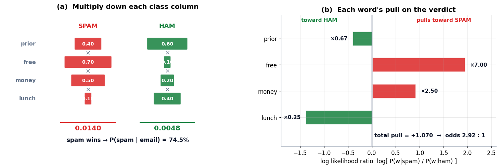

### Cell 80

```python
# ============================================================
#  The zero-probability trap, and add-one smoothing
# ============================================================
# A tiny training corpus, counted by hand.
train = [("free money now",            "spam"),
         ("win a free prize now",      "spam"),
         ("free free blockchain offer","spam"),
         ("lunch meeting at noon",     "ham"),
         ("the project lunch is ready","ham"),
         ("meeting notes attached",    "ham")]

from collections import Counter
counts = {c: Counter() for c in ["spam", "ham"]}
for text, lab in train:
    counts[lab].update(text.split())
vocab   = sorted(set(w for t, _ in train for w in t.split()))
V_size  = len(vocab)
totals  = {c: sum(counts[c].values()) for c in counts}

test = "free blockchain lunch".split()

print(f"vocabulary V = {V_size} words   |   spam tokens {totals['spam']}, ham tokens {totals['ham']}")
print(f'test email: "{" ".join(test)}"')
print()
print("WITHOUT SMOOTHING")
print("=" * 72)
print(f"  {'word':<14}{'count|spam':>12}{'P(w|spam)':>12}{'count|ham':>12}{'P(w|ham)':>12}")
raw = {}
for c in ["spam", "ham"]:
    p = 1.0
    for w in test:
        p *= counts[c][w] / totals[c]
    raw[c] = p
for w in test:
    print(f"  {w:<14}{counts['spam'][w]:>12}{counts['spam'][w]/totals['spam']:>12.4f}"
          f"{counts['ham'][w]:>12}{counts['ham'][w]/totals['ham']:>12.4f}")
print(f"  {'product':<14}{'':>12}{raw['spam']:>12.6f}{'':>12}{raw['ham']:>12.6f}")
print(f"  -> spam score {raw['spam']:.6f}, ham score {raw['ham']:.6f}")
print(f"  BOTH ZERO. 'blockchain' vetoed ham; 'lunch' vetoed spam. The model has no opinion.")
print()

print("WITH LAPLACE (add-one) SMOOTHING:  (count + 1) / (total + V)")
print("=" * 72)
def p_smooth(w, c, alpha=1.0):
    return (counts[c][w] + alpha) / (totals[c] + alpha * V_size)

print(f"  {'word':<14}{'P(w|spam)':>14}{'P(w|ham)':>14}")
sm = {}
for c in ["spam", "ham"]:
    p = 1.0
    for w in test:
        p *= p_smooth(w, c)
    sm[c] = p
for w in test:
    print(f"  {w:<14}{p_smooth(w,'spam'):>14.5f}{p_smooth(w,'ham'):>14.5f}")
print(f"  {'product':<14}{sm['spam']:>14.3e}{sm['ham']:>14.3e}")
print()
win = max(sm, key=sm.get)
print(f"  -> the model now has an opinion: '{win}'  "
      f"(ratio {max(sm.values())/min(sm.values()):.2f}×)")
print()
print("  And the smoothed probabilities still sum to 1 over the vocabulary:")
for c in ["spam", "ham"]:
    print(f"    Σ_w P(w | {c:<4}) = {sum(p_smooth(w, c) for w in vocab):.6f}")
```

**Output**

```text
vocabulary V = 18 words   |   spam tokens 12, ham tokens 12
test email: "free blockchain lunch"

WITHOUT SMOOTHING
========================================================================
  word            count|spam   P(w|spam)   count|ham    P(w|ham)
  free                     4      0.3333           0      0.0000
  blockchain               1      0.0833           0      0.0000
  lunch                    0      0.0000           2      0.1667
  product                       0.000000                0.000000
  -> spam score 0.000000, ham score 0.000000
  BOTH ZERO. 'blockchain' vetoed ham; 'lunch' vetoed spam. The model has no opinion.

WITH LAPLACE (add-one) SMOOTHING:  (count + 1) / (total + V)
========================================================================
  word               P(w|spam)      P(w|ham)
  free                 0.16667       0.03333
  blockchain           0.06667       0.03333
  lunch                0.03333       0.10000
  product            3.704e-04     1.111e-04

  -> the model now has an opinion: 'spam'  (ratio 3.33×)

  And the smoothed probabilities still sum to 1 over the vocabulary:
    Σ_w P(w | spam) = 1.000000
    Σ_w P(w | ham ) = 1.000000
```

### Cell 81

```python
# ============================================================
#  Figure: what smoothing does to an unseen word
# ============================================================
fig, (axZ, axA) = plt.subplots(1, 2, figsize=(13.4, 4.4))

# ── left: raw vs smoothed likelihoods for the three test words ──
xw = np.arange(len(test))
raw_h  = [counts["ham"][w] / totals["ham"] for w in test]
sm_h   = [p_smooth(w, "ham") for w in test]
axZ.bar(xw - 0.19, raw_h, width=0.36, color=C_ERR,  alpha=0.85,
        edgecolor="white", lw=2, label="raw counts")
axZ.bar(xw + 0.19, sm_h,  width=0.36, color=C_TRUE, alpha=0.85,
        edgecolor="white", lw=2, label="add-one smoothed")
for i, (r, s) in enumerate(zip(raw_h, sm_h)):
    axZ.text(i - 0.19, r + 0.004, f"{r:.3f}", ha="center", fontsize=9,
             color=C_ERR, fontweight="bold")
    axZ.text(i + 0.19, s + 0.004, f"{s:.3f}", ha="center", fontsize=9,
             color=C_TRUE, fontweight="bold")
axZ.annotate("0.000 — a veto", xy=(0 - 0.19, 0.002), xytext=(0.25, 0.075),
             fontsize=10, color=C_ERR, fontweight="bold",
             arrowprops=dict(arrowstyle="->", color=C_ERR, lw=1.8))
axZ.set_xticks(xw); axZ.set_xticklabels(test)
axZ.set_ylim(0, 0.115)
tidy(axZ, "word in the test email", "P(word | ham)",
     "A zero becomes a nudge", legend=True)

# ── right: how alpha moves the estimate for an unseen word ──
alphas = np.logspace(-3, 1, 300)
unseen = alphas / (totals["ham"] + alphas * V_size)          # count = 0
seen2  = (2 + alphas) / (totals["ham"] + alphas * V_size)    # a word seen twice
axA.plot(alphas, unseen, color=C_ERR,  lw=2.8, label="an UNSEEN word (count 0)")
axA.plot(alphas, seen2,  color=C_DATA, lw=2.8, label="a word seen twice")
axA.axvline(1.0, color=C_MODEL, ls="--", lw=2)
axA.text(1.12, 0.115, "α = 1\nLaplace\n(sklearn's default)", fontsize=9.6,
         color=C_MODEL, fontweight="bold")
axA.set_xscale("log")
axA.axhline(0, color=C_GREY, lw=1)
tidy(axA, "smoothing strength  α  (log scale)", "P(word | ham)",
     "α trades 'trust the counts' against 'never say zero'", legend=True)
plt.tight_layout(); plt.show()
```

**Output**

```text
<Figure size 1474x484 with 2 Axes>
```

**Figure**

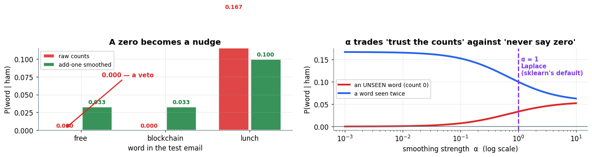

### Cell 84

```python
# ============================================================
#  Underflow, watched happening — and the log-space fix
# ============================================================
rng_u = np.random.default_rng(SEED)
word_probs = rng_u.uniform(0.001, 0.05, 800)     # 800 words, typical likelihoods

print("MULTIPLYING 800 WORD-LIKELIHOODS")
print("=" * 70)
print(f"  {'words used':>12}{'running product':>22}{'log-space sum':>20}")
prod = 1.0
for n in [1, 10, 50, 100, 150, 200, 250, 300, 400, 800]:
    prod  = float(np.prod(word_probs[:n]))
    logsum = float(np.log(word_probs[:n]).sum())
    flag = "   <- UNDERFLOWED to exactly 0.0" if prod == 0.0 else ""
    print(f"  {n:>12}{prod:>22.6e}{logsum:>20.2f}{flag}")
print()
print(f"  smallest positive float64: {np.finfo(float).tiny:.3e}")
print(f"  the true product is about 1e{np.log10(np.e) * np.log(word_probs).sum():.0f} — "
      f"far below anything float64 can hold")
print()

print("DOES THE LOG FORM CHANGE THE DECISION?  (it must not)")
print("=" * 70)
# two classes, short enough that the product still survives
a = rng_u.uniform(0.01, 0.4, 40)
b = rng_u.uniform(0.01, 0.4, 40)
print(f"  product form : spam {np.prod(a):.4e}   ham {np.prod(b):.4e}   "
      f"-> {'spam' if np.prod(a) > np.prod(b) else 'ham'}")
print(f"  log form     : spam {np.log(a).sum():.4f}      ham {np.log(b).sum():.4f}      "
      f"-> {'spam' if np.log(a).sum() > np.log(b).sum() else 'ham'}")
print(f"  same verdict?  {(np.prod(a) > np.prod(b)) == (np.log(a).sum() > np.log(b).sum())}")
print()
print("  And to recover a probability from log-scores, subtract the max first")
print("  (the 'log-sum-exp' trick) so nothing overflows on the way back:")
logs2 = np.array([np.log(a).sum(), np.log(b).sum()])
shift = logs2 - logs2.max()
probs2 = np.exp(shift) / np.exp(shift).sum()
print(f"    log-scores {logs2.round(3)}  ->  probabilities {probs2.round(6)}")
print(f"    sums to {probs2.sum():.6f}")
```

**Output**

```text
MULTIPLYING 800 WORD-LIKELIHOODS
======================================================================
    words used       running product       log-space sum
             1          3.162968e-02               -3.45
            10          2.284551e-17              -38.32
            50          5.681478e-87             -198.59
           100         3.254893e-173             -397.17
           150         7.055716e-255             -585.21
           200          0.000000e+00             -785.66   <- UNDERFLOWED to exactly 0.0
           250          0.000000e+00             -978.48   <- UNDERFLOWED to exactly 0.0
           300          0.000000e+00            -1173.68   <- UNDERFLOWED to exactly 0.0
           400          0.000000e+00            -1564.10   <- UNDERFLOWED to exactly 0.0
           800          0.000000e+00            -3129.50   <- UNDERFLOWED to exactly 0.0

  smallest positive float64: 2.225e-308
  the true product is about 1e-1359 — far below anything float64 can hold

DOES THE LOG FORM CHANGE THE DECISION?  (it must not)
======================================================================
  product form : spam 4.2616e-30   ham 7.8520e-38   -> spam
  log form     : spam -67.6279      ham -85.4375      -> spam
  same verdict?  True

  And to recover a probability from log-scores, subtract the max first
  (the 'log-sum-exp' trick) so nothing overflows on the way back:
    log-scores [-67.628 -85.437]  ->  probabilities [1. 0.]
    sums to 1.000000
```

### Cell 85

```python
# ============================================================
#  Figure: the product dies, the sum does not
# ============================================================
ns    = np.arange(1, 801)
cum_p = np.cumprod(word_probs)
cum_l = np.cumsum(np.log(word_probs))

fig, (axP, axL2) = plt.subplots(1, 2, figsize=(13.4, 4.3))

axP.plot(ns, cum_p, color=C_ERR, lw=2.6)
axP.set_yscale("log")
first_zero = int(np.argmax(cum_p == 0)) if (cum_p == 0).any() else None
axP.axhline(np.finfo(float).tiny, color=C_GREY, ls="--", lw=1.8)
axP.text(20, np.finfo(float).tiny * 3, "smallest float64", fontsize=9.4, color=C_GREY,
         fontweight="bold")
if first_zero:
    axP.axvline(first_zero, color=C_MODEL, ls=":", lw=2)
    axP.text(first_zero + 12, 1e-120,
             f"at word {first_zero}\nthe product is\nexactly 0.0", fontsize=9.6,
             color=C_MODEL, fontweight="bold")
axP.set_ylim(1e-330, 10)
tidy(axP, "words multiplied in", "running product  (log axis)",
     "The product form: falls off the end of float64")

axL2.plot(ns, cum_l, color=C_TRUE, lw=2.6)
axL2.set_ylim(cum_l.min() * 1.06, 40)
axL2.text(120, cum_l.min() * 0.42,
          "an ordinary negative number\nall the way down —\nno special values, no limit",
          fontsize=10, color=C_TRUE, fontweight="bold")
tidy(axL2, "words summed in", "running Σ log p",
     "The log form: a perfectly ordinary sum")
plt.tight_layout(); plt.show()
```

**Output**

```text
<Figure size 1474x473 with 2 Axes>
```

**Figure**

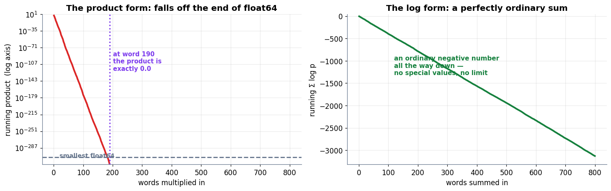

### Cell 88

```python
# ============================================================
#  Multinomial Naive-Bayes, from scratch in NumPy
# ============================================================
class MultinomialNaiveBayes:
    """Laplace-smoothed, log-space multinomial Naive-Bayes. ~15 lines of real work."""

    def __init__(self, alpha=1.0):
        self.alpha = alpha

    def fit(self, X, y):
        X = np.asarray(X, dtype=float)
        self.classes_ = np.unique(y)
        n_docs, n_feat = X.shape

        # --- the prior: how common is each class? ---
        self.log_prior_ = np.log(
            np.array([(y == c).sum() for c in self.classes_]) / n_docs)

        # --- the likelihoods: smoothed word counts, per class ---
        cnt = np.array([X[y == c].sum(axis=0) for c in self.classes_])   # (n_classes, n_feat)
        smoothed = cnt + self.alpha
        self.log_lik_ = np.log(smoothed / smoothed.sum(axis=1, keepdims=True))
        return self

    def joint_log_likelihood(self, X):
        """log P(c) + Σ_w count(w)·log P(w|c)  —  the score, in log space."""
        return np.asarray(X, dtype=float) @ self.log_lik_.T + self.log_prior_

    def predict(self, X):
        return self.classes_[self.joint_log_likelihood(X).argmax(axis=1)]

    def predict_proba(self, X):
        jll   = self.joint_log_likelihood(X)
        shift = jll - jll.max(axis=1, keepdims=True)      # log-sum-exp, for stability
        e     = np.exp(shift)
        return e / e.sum(axis=1, keepdims=True)


# --- a slightly bigger toy corpus ---
texts = ["free money now", "win a free prize", "free free offer claim prize",
         "claim your free money prize now", "win big money now",
         "lunch meeting at noon", "the project lunch is ready",
         "meeting notes attached", "are you free for lunch",
         "project notes for the meeting"]
labels = np.array(["spam"] * 5 + ["ham"] * 5)

# hand-rolled bag of words (so nothing is hidden)
vocab2 = sorted(set(w for t in texts for w in t.split()))
idx    = {w: i for i, w in enumerate(vocab2)}
X_bow  = np.zeros((len(texts), len(vocab2)))
for r, t in enumerate(texts):
    for w in t.split():
        X_bow[r, idx[w]] += 1

nb = MultinomialNaiveBayes(alpha=1.0).fit(X_bow, labels)

test_texts = ["free money prize now", "lunch meeting notes", "free lunch"]
X_test = np.zeros((len(test_texts), len(vocab2)))
for r, t in enumerate(test_texts):
    for w in t.split():
        if w in idx:
            X_test[r, idx[w]] += 1

print(f"vocabulary: {len(vocab2)} words   |   {len(texts)} training documents")
print(f"log priors: " + "  ".join(f"{c}={lp:.4f}" for c, lp in zip(nb.classes_, nb.log_prior_)))
print()
print("FROM-SCRATCH PREDICTIONS")
print("=" * 74)
proba = nb.predict_proba(X_test)
pred  = nb.predict(X_test)
print(f"  {'document':<24}{'log score ham':>15}{'log score spam':>16}{'P(spam)':>10}{'label':>8}")
for t, jll, pr, pd in zip(test_texts, nb.joint_log_likelihood(X_test), proba, pred):
    print(f"  {t:<24}{jll[0]:>15.4f}{jll[1]:>16.4f}{pr[1]:>10.4f}{pd:>8}")
print()
print("  the most spam-indicative words (largest log-likelihood gap):")
gap = nb.log_lik_[1] - nb.log_lik_[0]      # spam minus ham
for i in np.argsort(gap)[::-1][:4]:
    print(f"    {vocab2[i]:<12} log-ratio {gap[i]:+.3f}")
```

**Output**

```text
vocabulary: 23 words   |   10 training documents
log priors: ham=-0.6931  spam=-0.6931

FROM-SCRATCH PREDICTIONS
==========================================================================
  document                  log score ham  log score spam   P(spam)   label
  free money prize now           -15.2266         -9.9692    0.9948    spam
  lunch meeting notes             -8.2419        -12.1131    0.0204     ham
  free lunch                      -6.2270         -6.5147    0.4286     ham

  the most spam-indicative words (largest log-likelihood gap):
    prize        log-ratio +1.386
    money        log-ratio +1.386
    now          log-ratio +1.386
    free         log-ratio +1.099
```

### Cell 89

```python
# ============================================================
#  The same thing with scikit-learn — and a strict agreement check
# ============================================================
from sklearn.feature_extraction.text import CountVectorizer
from sklearn.naive_bayes import MultinomialNB

vec    = CountVectorizer(vocabulary=vocab2,          # same vocabulary, so columns line up
                         token_pattern=r"(?u)\b\w+\b")   # ...and keep 1-letter words like "a"
X_sk   = vec.fit_transform(texts)
clf    = MultinomialNB(alpha=1.0).fit(X_sk, labels)   # alpha=1.0 IS Laplace smoothing
X_sk_t = vec.transform(test_texts)

print("SCIKIT-LEARN vs FROM SCRATCH")
print("=" * 74)
print(f"  {'quantity':<30}{'max abs difference':>22}")
d_prior = np.abs(clf.class_log_prior_ - nb.log_prior_).max()
d_lik   = np.abs(clf.feature_log_prob_ - nb.log_lik_).max()
d_jll   = np.abs(clf._joint_log_likelihood(X_sk_t) - nb.joint_log_likelihood(X_test)).max()
d_prob  = np.abs(clf.predict_proba(X_sk_t) - nb.predict_proba(X_test)).max()
for nm, d in [("class log priors", d_prior), ("feature log probabilities", d_lik),
              ("joint log likelihoods", d_jll), ("predicted probabilities", d_prob)]:
    print(f"  {nm:<30}{d:>22.3e}")
print()
print(f"  classes in the same order? {list(clf.classes_) == list(nb.classes_)}")
print(f"  identical labels on the test set? "
      f"{list(clf.predict(X_sk_t)) == list(nb.predict(X_test))}")
print(f"  every quantity agrees to 1e-12? "
      f"{max(d_prior, d_lik, d_jll, d_prob) < 1e-12}")
print()
print(f"  {'document':<24}{'sklearn P(spam)':>18}{'ours P(spam)':>16}")
for t, a, b in zip(test_texts, clf.predict_proba(X_sk_t)[:, 1], nb.predict_proba(X_test)[:, 1]):
    print(f"  {t:<24}{a:>18.10f}{b:>16.10f}")
print()
print("  Note there was no gradient descent, no iteration, no learning rate.")
print("  .fit() counted words once and stored logarithms. That is the whole training run.")
```

**Output**

```text
SCIKIT-LEARN vs FROM SCRATCH
==========================================================================
  quantity                          max abs difference
  class log priors                           3.331e-16
  feature log probabilities                  4.441e-16
  joint log likelihoods                      0.000e+00
  predicted probabilities                    5.551e-16

  classes in the same order? True
  identical labels on the test set? True
  every quantity agrees to 1e-12? True

  document                   sklearn P(spam)    ours P(spam)
  free money prize now          0.9948186528    0.9948186528
  lunch meeting notes           0.0204081633    0.0204081633
  free lunch                    0.4285714286    0.4285714286

  Note there was no gradient descent, no iteration, no learning rate.
  .fit() counted words once and stored logarithms. That is the whole training run.
```

### Cell 91

```python
# ============================================================
#  Demonstrating the over-confidence: a duplicated feature
# ============================================================
# Generative story for a simulated inbox. An email is spam with probability 0.4,
# and five binary features fire at class-dependent rates:
#     A "free"    0.80 | 0.10      D "now"      0.60 | 0.25
#     C "meeting" 0.30 | 0.50      E "project"  0.15 | 0.45
#                                  F "click"    0.50 | 0.30
# ...and then B "prize" is an EXACT COPY of A: in this world those two words
# always appear together, so B carries no information A has not already given.
rng_c = np.random.default_rng(SEED)
n     = 60_000
pri_s, pri_h = 0.4, 0.6
rates = {"A_free": (0.80, 0.10), "C_meeting": (0.30, 0.50), "D_now": (0.60, 0.25),
         "E_project": (0.15, 0.45), "F_click": (0.50, 0.30)}

y  = (rng_c.random(n) < pri_s).astype(int)                 # 1 = spam
Fx = {k: (rng_c.random(n) < np.where(y == 1, ps, ph)).astype(int)
      for k, (ps, ph) in rates.items()}
B_dup = Fx["A_free"].copy()                                # the duplicate word

def bern(v, p):                 # P(feature takes value v) at per-class rate p
    return np.where(v == 1, p, 1 - p)

# --- the TRUE posterior: B is redundant, so condition on the five real features ---
num_t, den_t = pri_s, pri_h
for k, (ps, ph) in rates.items():
    num_t = num_t * bern(Fx[k], ps)
    den_t = den_t * bern(Fx[k], ph)
post_true = num_t / (num_t + den_t)

# --- what NAIVE BAYES computes: it multiplies B in too, as if independent ---
num_n = num_t * bern(B_dup, rates["A_free"][0])
den_n = den_t * bern(B_dup, rates["A_free"][1])
post_nb = num_n / (num_n + den_n)

pred_true, pred_nb = (post_true > 0.5).astype(int), (post_nb > 0.5).astype(int)
logloss = lambda p, t: -np.mean(t * np.log(p) + (1 - t) * np.log(1 - p))
brier   = lambda p, t: np.mean((p - t) ** 2)

print(f"THE DOUBLE-COUNT, MEASURED ON {n:,} SIMULATED EMAILS")
print("=" * 76)
print(f"  {'':<30}{'true model':>15}{'naive bayes':>15}")
print(f"  {'accuracy':<30}{(pred_true==y).mean():>15.4f}{(pred_nb==y).mean():>15.4f}")
print(f"  {'log loss    (lower better)':<30}{logloss(post_true,y):>15.4f}{logloss(post_nb,y):>15.4f}")
print(f"  {'Brier score (lower better)':<30}{brier(post_true,y):>15.4f}{brier(post_nb,y):>15.4f}")
print(f"  {'share of P > .95 or < .05':<30}"
      f"{((post_true>.95)|(post_true<.05)).mean():>15.2%}"
      f"{((post_nb>.95)|(post_nb<.05)).mean():>15.2%}")
print()
print(f"  RANKING barely moves  : the two models agree on {(pred_true==pred_nb).mean():.2%} of emails,")
print(f"                          and accuracy falls by only "
      f"{100*((pred_true==y).mean() - (pred_nb==y).mean()):.2f} percentage points.")
print(f"  CALIBRATION is wrecked: log loss is {logloss(post_nb,y)/logloss(post_true,y):.2f}x worse, and")
print(f"                          {((post_nb>.95)|(post_nb<.05)).mean():.0%} of its answers are near-certain "
      f"(the honest model: {((post_true>.95)|(post_true<.05)).mean():.0%}).")
print()

print("  WHERE THE INFLATION COMES FROM - the 'free' / 'prize' pair:")
ps_a, ph_a = rates["A_free"]
print(f"    naive bayes uses  P(free|spam) x P(prize|spam) = {ps_a} x {ps_a} = {ps_a**2:.2f}")
print(f"                      P(free|ham)  x P(prize|ham)  = {ph_a} x {ph_a} = {ph_a**2:.2f}")
print(f"    -> a {ps_a**2/ph_a**2:.0f}-to-1 swing out of ONE underlying observation")
print(f"    -> the honest swing is {ps_a/ph_a:.0f}-to-1; the evidence has been counted twice")
print()
m = ((Fx["A_free"] == 1) & (Fx["C_meeting"] == 0) & (Fx["D_now"] == 1)
     & (Fx["E_project"] == 0) & (Fx["F_click"] == 1))
print(f"  One concrete email (free=1, meeting=0, now=1, project=0, click=1) - "
      f"{m.sum():,} of them in the sample:")
print(f"    actually spam, in fact : {y[m].mean():.4f}")
print(f"    true posterior says    : {post_true[m][0]:.4f}")
print(f"    naive bayes says       : {post_nb[m][0]:.4f}   <- same verdict, "
      f"{post_nb[m][0]-post_true[m][0]:+.4f} too confident")
```

**Output**

```text
THE DOUBLE-COUNT, MEASURED ON 60,000 SIMULATED EMAILS
============================================================================
                                     true model    naive bayes
  accuracy                               0.8695         0.8619
  log loss    (lower better)             0.3264         0.4346
  Brier score (lower better)             0.0984         0.1192
  share of P > .95 or < .05              40.72%         78.98%

  RANKING barely moves  : the two models agree on 94.50% of emails,
                          and accuracy falls by only 0.76 percentage points.
  CALIBRATION is wrecked: log loss is 1.33x worse, and
                          79% of its answers are near-certain (the honest model: 41%).

  WHERE THE INFLATION COMES FROM - the 'free' / 'prize' pair:
    naive bayes uses  P(free|spam) x P(prize|spam) = 0.8 x 0.8 = 0.64
                      P(free|ham)  x P(prize|ham)  = 0.1 x 0.1 = 0.01
    -> a 64-to-1 swing out of ONE underlying observation
    -> the honest swing is 8-to-1; the evidence has been counted twice

  One concrete email (free=1, meeting=0, now=1, project=0, click=1) - 3,480 of them in the sample:
    actually spam, in fact : 0.9825
    true posterior says    : 0.9788
    naive bayes says       : 0.9973   <- same verdict, +0.0185 too confident
```

### Cell 92

```python
# ============================================================
#  Figure: right answer, wrong confidence
# ============================================================
fig, (axC1, axC2, axC3) = plt.subplots(1, 3, figsize=(15.2, 4.3))

# -- (a) reliability: stated probability vs observed frequency --
edges = np.linspace(0, 1, 11)
for post_, cl, nm in [(post_true, C_TRUE, "true model"), (post_nb, C_ERR, "naive bayes")]:
    b = np.clip(np.digitize(post_, edges) - 1, 0, 9)
    xs_, ys_ = [], []
    for kk in range(10):
        m2 = b == kk
        if m2.sum() > 200:
            xs_.append(post_[m2].mean()); ys_.append(y[m2].mean())
    axC1.plot(xs_, ys_, "o-", color=cl, lw=2.4, ms=7, label=nm)
axC1.plot([0, 1], [0, 1], color=C_GREY, ls="--", lw=1.8, label="perfect calibration")
axC1.set_xlim(-0.03, 1.03); axC1.set_ylim(-0.03, 1.03)
tidy(axC1, "the model's stated P(spam)", "the fraction that really were spam",
     "(a)  Reliability", legend=True)

# -- (b) where the predictions pile up --
axC2.hist(post_true, bins=np.linspace(0, 1, 26), color=C_TRUE, alpha=0.60,
          label="true model")
axC2.hist(post_nb, bins=np.linspace(0, 1, 26), color=C_ERR, alpha=0.60,
          label="naive bayes")
tidy(axC2, "stated P(spam)", "number of emails",
     "(b)  Naive Bayes crowds the edges", legend=True)

# -- (c) does the verdict actually change? --
sub = slice(None, None, 25)
axC3.scatter(post_true[sub], post_nb[sub], s=10, color=C_MODEL, alpha=0.25)
axC3.plot([0, 1], [0, 1], color=C_GREY, ls="--", lw=1.8)
axC3.axhline(0.5, color=C_DATA, lw=1.6); axC3.axvline(0.5, color=C_DATA, lw=1.6)
disagree = (pred_true != pred_nb).mean()
axC3.text(0.04, 0.92, "both say SPAM", fontsize=9.4, color=C_DATA, fontweight="bold")
axC3.text(0.04, 0.04, "both say HAM", fontsize=9.4, color=C_DATA, fontweight="bold")
axC3.text(0.53, 0.28, f"they disagree on\nonly {disagree:.1%} of emails",
          fontsize=9.6, color=C_GREY, style="italic", fontweight="bold")
axC3.set_xlim(-0.03, 1.03); axC3.set_ylim(-0.03, 1.03)
tidy(axC3, "true posterior", "naive-bayes posterior",
     "(c)  Same verdict, different number")
plt.tight_layout(); plt.show()
```

**Output**

```text
<Figure size 1672x473 with 3 Axes>
```

**Figure**

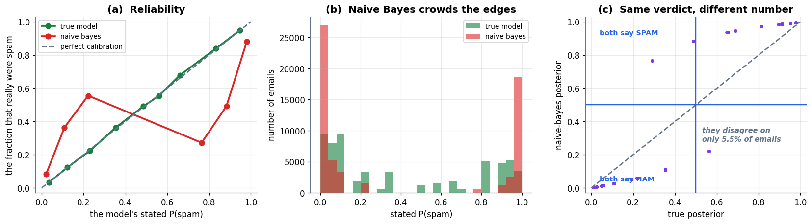

### Cell 97

```python
# ============================================================
#  The 99% trap, run rather than described
# ============================================================
rng_f  = np.random.default_rng(SEED)
N_TX   = 100_000
FRAUD_RATE = 0.01

y_fraud = (rng_f.random(N_TX) < FRAUD_RATE).astype(int)   # 1 = fraud

# Model A: the laziest object in software. It contains no logic.
pred_lazy = np.zeros(N_TX, dtype=int)

# Model B: something that genuinely tries. Catches 70% of fraud, 1% false alarms.
pred_real = np.where(
    y_fraud == 1,
    (rng_f.random(N_TX) < 0.70).astype(int),      # recall 70%
    (rng_f.random(N_TX) < 0.01).astype(int))      # 1% of legit flagged

def confusion(y_true, y_pred):
    tp = int(((y_pred == 1) & (y_true == 1)).sum())
    fn = int(((y_pred == 0) & (y_true == 1)).sum())
    fp = int(((y_pred == 1) & (y_true == 0)).sum())
    tn = int(((y_pred == 0) & (y_true == 0)).sum())
    return tp, fn, fp, tn

print(f"{N_TX:,} TRANSACTIONS, {y_fraud.sum():,} OF THEM FRAUDULENT ({y_fraud.mean():.2%})")
print("=" * 74)
print(f"  {'':<34}{'do-nothing':>16}{'a real model':>16}")
tpl, fnl, fpl, tnl = confusion(y_fraud, pred_lazy)
tpr, fnr, fpr, tnr = confusion(y_fraud, pred_real)
print(f"  {'ACCURACY':<34}{(tpl+tnl)/N_TX:>16.4f}{(tpr+tnr)/N_TX:>16.4f}")
print(f"  {'frauds caught':<34}{tpl:>16,}{tpr:>16,}")
print(f"  {'frauds missed':<34}{fnl:>16,}{fnr:>16,}")
print(f"  {'false alarms raised':<34}{fpl:>16,}{fpr:>16,}")
print()
print(f"  The do-nothing model scores {(tpl+tnl)/N_TX:.2%} accuracy and catches {tpl} frauds.")
print(f"  The real model scores {(tpr+tnr)/N_TX:.2%} — LOWER — and catches {tpr:,}.")
print()
print("  Accuracy ranked the useless model above the useful one. It is not a")
print("  slightly misleading metric here; it is pointing the wrong way entirely.")
```

**Output**

```text
100,000 TRANSACTIONS, 998 OF THEM FRAUDULENT (1.00%)
==========================================================================
                                          do-nothing    a real model
  ACCURACY                                    0.9900          0.9874
  frauds caught                                    0             699
  frauds missed                                  998             299
  false alarms raised                              0             961

  The do-nothing model scores 99.00% accuracy and catches 0 frauds.
  The real model scores 98.74% — LOWER — and catches 699.

  Accuracy ranked the useless model above the useful one. It is not a
  slightly misleading metric here; it is pointing the wrong way entirely.
```

### Cell 98

```python
# ============================================================
#  Figure: why accuracy flatters the model that does nothing
# ============================================================
fig, (axA1, axA2) = plt.subplots(1, 2, figsize=(13.4, 4.3),
                                 gridspec_kw={"width_ratios": [1, 1.2]})

# ── left: accuracy says the wrong thing ──
names_m = ["do-nothing\n(`return 0`)", "a real model"]
accs    = [(tpl + tnl) / N_TX, (tpr + tnr) / N_TX]
bars = axA1.bar(names_m, accs, color=[C_GREY, C_DATA], alpha=0.85,
                edgecolor="white", lw=2, width=0.5)
for b, v in zip(bars, accs):
    axA1.text(b.get_x() + b.get_width() / 2, v + 0.0012, f"{v:.2%}",
              ha="center", fontsize=14, fontweight="bold", color="#0F172A")
axA1.set_ylim(0.97, 1.002)
axA1.axhline(1 - FRAUD_RATE, color=C_ERR, ls="--", lw=1.8)
axA1.text(-0.44, 1 - FRAUD_RATE + 0.0009, "the base rate — free accuracy for doing nothing",
          fontsize=9.2, color=C_ERR, fontweight="bold")
tidy(axA1, None, "accuracy", "Accuracy ranks them the wrong way round")

# ── right: what each one actually does about fraud ──
idx = np.arange(2)
axA2.bar(idx - 0.19, [tpl, tpr], width=0.36, color=C_TRUE, alpha=0.88,
         edgecolor="white", lw=2, label="frauds caught")
axA2.bar(idx + 0.19, [fnl, fnr], width=0.36, color=C_ERR, alpha=0.88,
         edgecolor="white", lw=2, label="frauds missed")
for i, (c, m_) in enumerate([(tpl, fnl), (tpr, fnr)]):
    axA2.text(i - 0.19, c + 14, f"{c:,}", ha="center", fontsize=10.5,
              color=C_TRUE, fontweight="bold")
    axA2.text(i + 0.19, m_ + 14, f"{m_:,}", ha="center", fontsize=10.5,
              color=C_ERR, fontweight="bold")
axA2.set_xticks(idx); axA2.set_xticklabels(names_m)
axA2.set_ylim(0, max(fnl, fnr, tpr) * 1.22)
tidy(axA2, None, "number of fraudulent transactions",
     "The job the model was hired to do", legend=True)
plt.tight_layout(); plt.show()
```

**Output**

```text
<Figure size 1474x473 with 2 Axes>
```

**Figure**

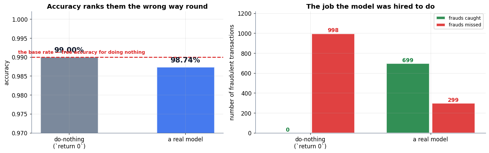

### Cell 101

```python
# ============================================================
#  Figure: the confusion matrix, and what each cell means
# ============================================================
def draw_cm(ax, tp, fn, fp, tn, title=None, show_names=True, highlight=None,
            fs_num=17, note=None):
    """Draw a 2x2 confusion matrix: rows = actual, cols = predicted, positive first."""
    cells_ = [((0, 1), tp, "TP", C_TRUE,  "#DCFCE7"),
              ((1, 1), fn, "FN", C_ERR,   "#FEE2E2"),
              ((0, 0), fp, "FP", C_PRED,  "#FFEDD5"),
              ((1, 0), tn, "TN", C_TRUE,  "#DCFCE7")]
    for (cx, cy), val, nm, ec, fc in cells_:
        lit = (highlight is None) or (nm in highlight)
        ax.add_patch(FancyBboxPatch((cx * 2.1 + 0.06, cy * 2.1 + 0.06), 2.0, 2.0,
                                    boxstyle="round,pad=0.0,rounding_size=0.09",
                                    fc=fc if lit else "#FAFAFA",
                                    ec=ec if lit else "#E2E8F0",
                                    lw=2.6 if lit else 1.4, zorder=2,
                                    alpha=1.0 if lit else 0.55))
        shown = f"{val:,}" if isinstance(val, (int, float, np.integer)) else str(val)
        ax.text(cx * 2.1 + 1.06, cy * 2.1 + 1.32, shown, ha="center", va="center",
                fontsize=fs_num, fontweight="bold", zorder=4,
                color=ec if lit else "#CBD5E1")
        if show_names:
            ax.text(cx * 2.1 + 1.06, cy * 2.1 + 0.60, nm, ha="center", va="center",
                    fontsize=11, fontweight="bold", zorder=4,
                    color=ec if lit else "#CBD5E1")
    ax.text(1.06, 4.55, "Predicted:\nPOSITIVE", ha="center", fontsize=10, color=C_GREY,
            fontweight="bold")
    ax.text(3.16, 4.55, "Predicted:\nNEGATIVE", ha="center", fontsize=10, color=C_GREY,
            fontweight="bold")
    ax.text(-0.30, 3.16, "Actual:\nPOSITIVE", ha="right", va="center", fontsize=10,
            color=C_GREY, fontweight="bold")
    ax.text(-0.30, 1.06, "Actual:\nNEGATIVE", ha="right", va="center", fontsize=10,
            color=C_GREY, fontweight="bold")
    if note:
        ax.text(2.11, -0.45, note, ha="center", fontsize=10.5, color="#0F172A",
                fontweight="bold")
    ax.set_xlim(-2.0, 4.5); ax.set_ylim(-0.95, 5.3); ax.axis("off")
    if title:
        ax.set_title(title, fontsize=12, pad=6)
    return ax

fig, (axM, axN) = plt.subplots(1, 2, figsize=(13.6, 4.9))
draw_cm(axM, "TP", "FN", "FP", "TN", title="(a)  The four cells", show_names=False,
        fs_num=17, note="the two green cells are the correct predictions")
for (cx, cy), lbl, cl in [((0, 1), "a correct alarm", C_TRUE),
                          ((1, 1), "a MISS\n(Type II error)", C_ERR),
                          ((0, 0), "a FALSE ALARM\n(Type I error)", C_PRED),
                          ((1, 0), "a correct all-clear", C_TRUE)]:
    axM.text(cx * 2.1 + 1.06, cy * 2.1 + 0.58, lbl, ha="center", va="center",
             fontsize=9.4, color=cl, fontweight="bold", zorder=4)

# annotate the second panel with the plain-English readings
stage(axN, (0, 10), (0, 6), title="(b)  Said it backwards, and it reads itself")
rows_n = [("True  Positive", "said POSITIVE", "and that was TRUE", C_TRUE),
          ("True  Negative", "said NEGATIVE", "and that was TRUE", C_TRUE),
          ("False Positive", "said POSITIVE", "and that was FALSE  → a false alarm", C_PRED),
          ("False Negative", "said NEGATIVE", "and that was FALSE  → a miss", C_ERR)]
for r, (nm, said, verdict, cl) in enumerate(rows_n):
    yy = 4.9 - r * 1.15
    box(axN, 2.1, yy, 3.6, 0.86, nm, fc="white", ec=cl, fs=11, lw=2.2, bold=True)
    arrow(axN, (4.0, yy), (4.7, yy), color=cl, lw=1.8)
    axN.text(4.9, yy, f"{said}   ·   {verdict}", ha="left", va="center",
             fontsize=10.2, color=cl, fontweight="bold")
axN.text(5.0, 0.28, "second word = what the model SAID   ·   first word = was it RIGHT",
         ha="center", fontsize=10, color=C_GREY, style="italic", fontweight="bold")
plt.tight_layout(); plt.show()
```

**Output**

```text
<Figure size 1496x539 with 2 Axes>
```

**Figure**

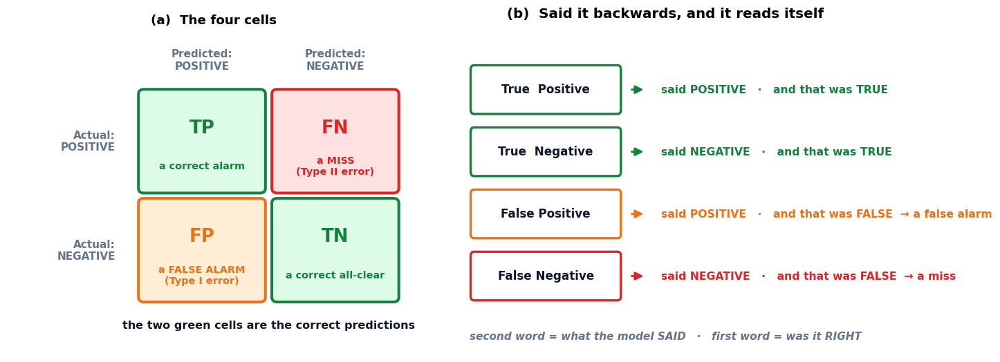

### Cell 104

```python
# ============================================================
#  Every metric, read off one grid of four numbers
# ============================================================
TP, FN, FP, TN = 8, 2, 5, 85
TOTAL = TP + FN + FP + TN

accuracy  = (TP + TN) / TOTAL
precision = TP / (TP + FP)
recall    = TP / (TP + FN)
# F1 blends precision and recall; the next section explains why it uses a
# harmonic mean rather than a plain average.
f1        = 2 * precision * recall / (precision + recall)

print("THE CANCER SCREEN — 100 PATIENTS, 10 WITH CANCER")
print("=" * 70)
print(f"  TP = {TP:<4} caught cancers            FN = {FN:<4} missed cancers")
print(f"  FP = {FP:<4} false alarms              TN = {TN:<4} correctly cleared")
print(f"  total = {TP}+{FN}+{FP}+{TN} = {TOTAL}   (every patient accounted for)")
print()
print(f"  accuracy  = (TP+TN)/total = ({TP}+{TN})/{TOTAL}  = {accuracy:.4f} = {accuracy:.1%}")
print(f"  precision = TP/(TP+FP)    = {TP}/({TP}+{FP})    = {precision:.4f} = {precision:.1%}")
print(f"  recall    = TP/(TP+FN)    = {TP}/({TP}+{FN})    = {recall:.4f} = {recall:.1%}")
print(f"  F1        = 2·P·R/(P+R)   = 2·{precision:.3f}·{recall:.1f}/{precision+recall:.3f} "
      f"= {f1:.4f} = {f1:.1%}")
print()
print(f"  the book states 93%, 61.5%, 80%, 69.6%  ->  we compute "
      f"{accuracy:.0%}, {precision:.1%}, {recall:.0%}, {f1:.1%}  ✓")
print()

print("THE LAZY MODEL: predict 'no cancer' for all 100 patients")
print("=" * 70)
lz_TP, lz_FN, lz_FP, lz_TN = 0, 10, 0, 90
print(f"  TP = {lz_TP}   FN = {lz_FN}   FP = {lz_FP}   TN = {lz_TN}")
print(f"  accuracy  = ({lz_TP}+{lz_TN})/{TOTAL} = {(lz_TP+lz_TN)/TOTAL:.1%}   "
      f"<- only {accuracy - (lz_TP+lz_TN)/TOTAL:.1%} below the real model")
print(f"  recall    = {lz_TP}/({lz_TP}+{lz_FN}) = {lz_TP/(lz_TP+lz_FN):.1%}       "
      f"<- and here is what accuracy was hiding")
print(f"  precision = undefined (it never predicted positive, so 0/0)")
print()
print("THE OPPOSITE LAZY MODEL: predict 'cancer' for all 100 patients")
print("=" * 70)
ev_TP, ev_FN, ev_FP, ev_TN = 10, 0, 90, 0
ev_prec = ev_TP / (ev_TP + ev_FP)
ev_rec  = ev_TP / (ev_TP + ev_FN)
print(f"  TP = {ev_TP}   FN = {ev_FN}   FP = {ev_FP}   TN = {ev_TN}")
print(f"  recall    = {ev_rec:.1%}   <- PERFECT. it misses nobody.")
print(f"  precision = {ev_prec:.1%}   <- and it is useless")
print(f"  accuracy  = {(ev_TP+ev_TN)/TOTAL:.1%}")
print()
print("  Two do-nothing models. One maxes accuracy, the other maxes recall.")
print("  Any single metric can be gamed by a model that has learned nothing.")
```

**Output**

```text
THE CANCER SCREEN — 100 PATIENTS, 10 WITH CANCER
======================================================================
  TP = 8    caught cancers            FN = 2    missed cancers
  FP = 5    false alarms              TN = 85   correctly cleared
  total = 8+2+5+85 = 100   (every patient accounted for)

  accuracy  = (TP+TN)/total = (8+85)/100  = 0.9300 = 93.0%
  precision = TP/(TP+FP)    = 8/(8+5)    = 0.6154 = 61.5%
  recall    = TP/(TP+FN)    = 8/(8+2)    = 0.8000 = 80.0%
  F1        = 2·P·R/(P+R)   = 2·0.615·0.8/1.415 = 0.6957 = 69.6%

  the book states 93%, 61.5%, 80%, 69.6%  ->  we compute 93%, 61.5%, 80%, 69.6%  ✓

THE LAZY MODEL: predict 'no cancer' for all 100 patients
======================================================================
  TP = 0   FN = 10   FP = 0   TN = 90
  accuracy  = (0+90)/100 = 90.0%   <- only 3.0% below the real model
  recall    = 0/(0+10) = 0.0%       <- and here is what accuracy was hiding
  precision = undefined (it never predicted positive, so 0/0)

THE OPPOSITE LAZY MODEL: predict 'cancer' for all 100 patients
======================================================================
  TP = 10   FN = 0   FP = 90   TN = 0
  recall    = 100.0%   <- PERFECT. it misses nobody.
  precision = 10.0%   <- and it is useless
  accuracy  = 10.0%

  Two do-nothing models. One maxes accuracy, the other maxes recall.
  Any single metric can be gamed by a model that has learned nothing.
```

### Cell 105

```python
# ============================================================
#  Figure: the real grid, and the two ways to cheat it
# ============================================================
fig, axes = plt.subplots(1, 3, figsize=(15.4, 4.9))
draw_cm(axes[0], TP, FN, FP, TN, title="(a)  The real model",
        note=f"accuracy {accuracy:.0%}  ·  precision {precision:.1%}  ·  recall {recall:.0%}")
draw_cm(axes[1], lz_TP, lz_FN, lz_FP, lz_TN, title="(b)  'Nobody has cancer'",
        note=f"accuracy {(lz_TP+lz_TN)/TOTAL:.0%}  ·  recall {lz_TP/(lz_TP+lz_FN):.0%}")
draw_cm(axes[2], ev_TP, ev_FN, ev_FP, ev_TN, title="(c)  'Everybody has cancer'",
        note=f"recall {ev_rec:.0%}  ·  precision {ev_prec:.0%}")
axes[1].text(2.11, -0.95, "3 points of accuracy below (a),\nand it catches nothing",
             ha="center", fontsize=9.6, color=C_ERR, fontweight="bold")
axes[2].text(2.11, -0.95, "perfect recall,\nand it is worthless",
             ha="center", fontsize=9.6, color=C_ERR, fontweight="bold")
plt.tight_layout(); plt.show()
```

**Output**

```text
<Figure size 1694x539 with 3 Axes>
```

**Figure**

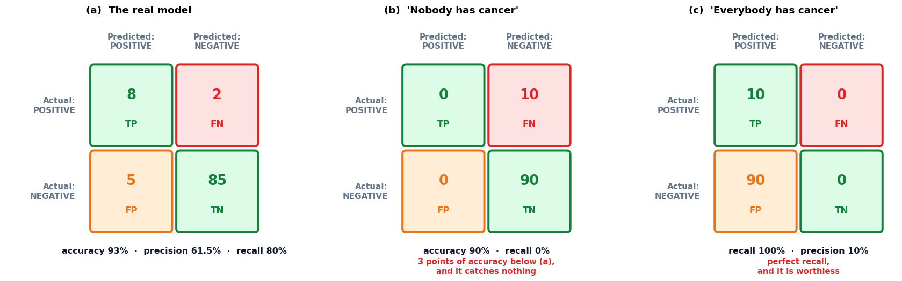

### Cell 108

```python
# ============================================================
#  Figure: precision is a column, recall is a row
# ============================================================
fig, (axP, axR) = plt.subplots(1, 2, figsize=(13.8, 5.2))

draw_cm(axP, TP, FN, FP, TN, highlight={"TP", "FP"},
        title="(a)  PRECISION lives in a COLUMN")
axP.add_patch(FancyBboxPatch((-0.02, -0.02), 2.16, 4.26,
                             boxstyle="round,pad=0.0,rounding_size=0.12",
                             fc="none", ec=C_MODEL, lw=3.4, ls="--", zorder=6))
axP.text(1.06, 5.02, "everything the model FLAGGED", ha="center", fontsize=10.5,
         color=C_MODEL, fontweight="bold")
axP.text(2.11, -1.05,
         f"$\\dfrac{{TP}}{{TP+FP}}=\\dfrac{{{TP}}}{{{TP}+{FP}}}={precision:.3f}$",
         ha="center", fontsize=15, color=C_MODEL)
axP.text(2.11, -1.75, "\"when you sound the alarm, are you right?\"",
         ha="center", fontsize=10.5, color=C_GREY, style="italic", fontweight="bold")

draw_cm(axR, TP, FN, FP, TN, highlight={"TP", "FN"},
        title="(b)  RECALL lives in a ROW")
axR.add_patch(FancyBboxPatch((-0.02, 2.08), 4.26, 2.16,
                             boxstyle="round,pad=0.0,rounding_size=0.12",
                             fc="none", ec=C_TRUE, lw=3.4, ls="--", zorder=6))
axR.text(4.45, 3.16, "everyone who\nreally HAD it", ha="left", va="center",
         fontsize=10.5, color=C_TRUE, fontweight="bold")
axR.text(2.11, -1.05,
         f"$\\dfrac{{TP}}{{TP+FN}}=\\dfrac{{{TP}}}{{{TP}+{FN}}}={recall:.3f}$",
         ha="center", fontsize=15, color=C_TRUE)
axR.text(2.11, -1.75, "\"of everything out there, how much did you catch?\"",
         ha="center", fontsize=10.5, color=C_GREY, style="italic", fontweight="bold")

for ax in (axP, axR):
    ax.set_ylim(-2.2, 5.5); ax.set_xlim(-2.2, 6.4)
plt.tight_layout(); plt.show()
```

**Output**

```text
<Figure size 1518x572 with 2 Axes>
```

**Figure**

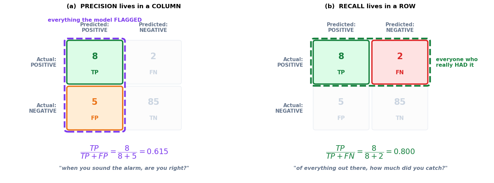

### Cell 111

```python
# ============================================================
#  A real threshold sweep on 100 real scores
# ============================================================
rng_s = np.random.default_rng(SEED)

# 10 cancer patients: 5 score very high, 3 middling, 2 low-ish.
sc_cancer  = np.concatenate([rng_s.uniform(0.91, 0.99, 5),
                             rng_s.uniform(0.55, 0.88, 3),
                             rng_s.uniform(0.22, 0.48, 2)])
# 90 healthy: 1 scores very high, 4 middling, 15 low-ish, 70 near zero.
sc_healthy = np.concatenate([rng_s.uniform(0.91, 0.99, 1),
                             rng_s.uniform(0.52, 0.88, 4),
                             rng_s.uniform(0.21, 0.49, 15),
                             rng_s.uniform(0.00, 0.18, 70)])

scores = np.concatenate([sc_cancer, sc_healthy])
truth  = np.concatenate([np.ones(10, int), np.zeros(90, int)])

def metrics_at(t):
    # f1_ blends precision and recall; it is defined in the next section,
    # and is carried here only so the sweep table is complete.
    pred = (scores >= t).astype(int)
    tp, fn, fp, tn = confusion(truth, pred)
    prec = tp / (tp + fp) if (tp + fp) else float("nan")
    rec  = tp / (tp + fn)
    f1_  = 2 * prec * rec / (prec + rec) if (prec + rec) else float("nan")
    return tp, fn, fp, tn, prec, rec, f1_

print("SWEEPING THE DECISION THRESHOLD OVER 100 PATIENT SCORES")
print("=" * 78)
print(f"  {'thresh':>7}{'flagged':>9}{'TP':>5}{'FP':>5}{'FN':>5}"
      f"{'precision':>18}{'recall':>16}{'F1':>8}")
for t in [0.9, 0.5, 0.2]:
    tp, fn, fp, tn, prec, rec, f1_ = metrics_at(t)
    print(f"  {t:>7.1f}{tp+fp:>9}{tp:>5}{fp:>5}{fn:>5}"
          f"{f'{tp}/{tp+fp} = {prec:.2f}':>18}{f'{tp}/10 = {rec:.2f}':>16}{f1_:>8.3f}")
print()
tp5, fn5, fp5, tn5, p5, r5, f5 = metrics_at(0.5)
print(f"  The 0.5 row reproduces §6.2 exactly: TP={tp5} FN={fn5} FP={fp5} TN={tn5}"
      f"  ->  {(tp5,fn5,fp5,tn5) == (TP,FN,FP,TN)}")
print()
print("  Strict (0.9): speaks rarely, is usually right, misses half the cancers.")
print("  Lenient (0.2): catches every cancer, and 2 in every 3 alarms is false.")
print("  Same model in all three rows. One number moved.")
```

**Output**

```text
SWEEPING THE DECISION THRESHOLD OVER 100 PATIENT SCORES
==============================================================================
   thresh  flagged   TP   FP   FN         precision          recall      F1
      0.9        6    5    1    5        5/6 = 0.83     5/10 = 0.50   0.625
      0.5       13    8    5    2       8/13 = 0.62     8/10 = 0.80   0.696
      0.2       30   10   20    0      10/30 = 0.33    10/10 = 1.00   0.500

  The 0.5 row reproduces §6.2 exactly: TP=8 FN=2 FP=5 TN=85  ->  True

  Strict (0.9): speaks rarely, is usually right, misses half the cancers.
  Lenient (0.2): catches every cancer, and 2 in every 3 alarms is false.
  Same model in all three rows. One number moved.
```

### Cell 112

```python
# ============================================================
#  Figure: the threshold slides both metrics in opposite directions
# ============================================================
from sklearn.metrics import precision_recall_curve, average_precision_score

# the dotted F1 curve below is defined in the next section; shown here for context
ths   = np.linspace(0.01, 0.99, 300)
precs = np.array([metrics_at(t)[4] for t in ths])
recs  = np.array([metrics_at(t)[5] for t in ths])
f1s   = np.array([metrics_at(t)[6] for t in ths])

fig, (axS, axQ, axPR) = plt.subplots(1, 3, figsize=(15.4, 4.3))

# ── (a) the raw scores, and the three cutoffs ──
jit = rng_s.normal(0, 0.055, len(scores))
axS.scatter(scores[truth == 0], jit[truth == 0], s=42, color=C_TRUE, alpha=0.65,
            label="healthy (90)")
axS.scatter(scores[truth == 1], jit[truth == 1] + 0.30, s=68, color=C_ERR, alpha=0.9,
            edgecolor="white", lw=1.1, label="cancer (10)")
for t, cl in [(0.9, C_MODEL), (0.5, C_DATA), (0.2, C_PRED)]:
    axS.axvline(t, color=cl, ls="--", lw=2.2)
    axS.text(t, 0.52, f"{t}", ha="center", fontsize=10, color=cl, fontweight="bold")
axS.set_ylim(-0.30, 0.62); axS.set_yticks([])
tidy(axS, "the model's score for each patient", None,
     "(a)  100 scores and three cutoffs", legend=True)

# ── (b) precision and recall against the threshold ──
axQ.plot(ths, precs, color=C_MODEL, lw=2.8, label="precision")
axQ.plot(ths, recs,  color=C_TRUE,  lw=2.8, label="recall")
axQ.plot(ths, f1s,   color=C_GREY,  lw=2.0, ls=":", label="F1")
for t in [0.2, 0.5, 0.9]:
    axQ.axvline(t, color=C_GREY, ls="--", lw=1.1, alpha=0.7)
axQ.set_ylim(0, 1.06)
axQ.text(0.06, 0.10, "lenient:\ncatch everything,\nbe wrong a lot", fontsize=9,
         color=C_GREY, fontweight="bold")
axQ.text(0.62, 0.10, "strict:\nspeak rarely,\nmiss a lot", fontsize=9,
         color=C_GREY, fontweight="bold")
tidy(axQ, "decision threshold", "metric value",
     "(b)  One dial, two metrics, opposite ways", legend=True)

# ── (c) the precision-recall curve ──
pr_p, pr_r, _ = precision_recall_curve(truth, scores)
ap = average_precision_score(truth, scores)
axPR.plot(pr_r, pr_p, color=C_DATA, lw=2.8)
axPR.fill_between(pr_r, 0, pr_p, color=C_DATA, alpha=0.10)
for t, cl in [(0.9, C_MODEL), (0.5, C_DATA), (0.2, C_PRED)]:
    _, _, _, _, pp, rr, _ = metrics_at(t)
    axPR.scatter([rr], [pp], s=150, color=cl, zorder=5, edgecolor="white", lw=2)
    axPR.annotate(f"t={t}", xy=(rr, pp), xytext=(rr - 0.16, pp + 0.09),
                  fontsize=10, color=cl, fontweight="bold")
axPR.axhline(truth.mean(), color=C_ERR, ls="--", lw=1.8)
axPR.text(0.03, truth.mean() + 0.03, "a coin-flip model sits here (the base rate)",
          fontsize=8.8, color=C_ERR, fontweight="bold")
axPR.set_xlim(-0.03, 1.03); axPR.set_ylim(0, 1.08)
tidy(axPR, "recall", "precision", f"(c)  The PR curve   (avg precision {ap:.2f})")
plt.tight_layout(); plt.show()
```

**Output**

```text
<Figure size 1694x473 with 3 Axes>
```

**Figure**

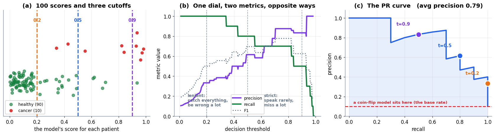

### Cell 115

```python
# ============================================================
#  F1 vs the plain average, on models that try to cheat
# ============================================================
def f1_of(p, r):   return 2 * p * r / (p + r) if (p + r) else 0.0
def avg_of(p, r):  return (p + r) / 2

rows = [("our real model",            precision, recall),
        ("'everybody has cancer'",    ev_prec,   ev_rec),
        ("very strict (t = 0.9)",     metrics_at(0.9)[4], metrics_at(0.9)[5]),
        ("very lenient (t = 0.2)",    metrics_at(0.2)[4], metrics_at(0.2)[5]),
        ("balanced and good",         0.80,      0.80)]

print("HARMONIC MEAN vs PLAIN AVERAGE")
print("=" * 74)
print(f"  {'model':<26}{'precision':>11}{'recall':>9}{'plain avg':>12}{'F1':>9}{'gap':>9}")
for nm, p_, r_ in rows:
    print(f"  {nm:<26}{p_:>11.3f}{r_:>9.3f}{avg_of(p_, r_):>12.3f}"
          f"{f1_of(p_, r_):>9.3f}{avg_of(p_, r_) - f1_of(p_, r_):>9.3f}")
print()
print(f"  our model      : book says F1 = 69.6%  ->  we compute {f1_of(precision, recall):.1%}  ✓")
print(f"  'everybody'    : book says plain avg 0.55 vs F1 0.18  ->  we compute "
      f"{avg_of(ev_prec, ev_rec):.2f} and {f1_of(ev_prec, ev_rec):.2f}  ✓")
print()
print("  Read the 'gap' column: it is near zero when precision and recall are")
print("  balanced, and large when one of them is being carried by the other.")
print("  That gap IS the imbalance the plain average hides.")
print()
best_i = int(np.nanargmax(f1s))
print(f"  Best F1 over the whole threshold sweep: {f1s[best_i]:.3f} at threshold "
      f"{ths[best_i]:.2f}  (precision {precs[best_i]:.3f}, recall {recs[best_i]:.3f})")
```

**Output**

```text
HARMONIC MEAN vs PLAIN AVERAGE
==========================================================================
  model                       precision   recall   plain avg       F1      gap
  our real model                  0.615    0.800       0.708    0.696    0.012
  'everybody has cancer'          0.100    1.000       0.550    0.182    0.368
  very strict (t = 0.9)           0.833    0.500       0.667    0.625    0.042
  very lenient (t = 0.2)          0.333    1.000       0.667    0.500    0.167
  balanced and good               0.800    0.800       0.800    0.800   -0.000

  our model      : book says F1 = 69.6%  ->  we compute 69.6%  ✓
  'everybody'    : book says plain avg 0.55 vs F1 0.18  ->  we compute 0.55 and 0.18  ✓

  Read the 'gap' column: it is near zero when precision and recall are
  balanced, and large when one of them is being carried by the other.
  That gap IS the imbalance the plain average hides.

  Best F1 over the whole threshold sweep: 0.778 at threshold 0.70  (precision 0.875, recall 0.700)
```

### Cell 117

```python
# ============================================================
#  The sklearn one-liners, and the axis-order trap
# ============================================================
from sklearn.metrics import (confusion_matrix, precision_score, recall_score,
                             f1_score, accuracy_score, classification_report)

y_true = np.array([1]*10 + [0]*90)                     # 10 real cancers, 90 healthy
y_pred = np.array([1]*8 + [0]*2 + [1]*5 + [0]*85)      # 8 TP, 2 FN, 5 FP, 85 TN

print("THE ONE-LINERS")
print("=" * 70)
print(f"  {'metric':<14}{'sklearn':>12}{'our by-hand value':>22}{'match':>8}")
for nm, sk, ours in [("accuracy",  accuracy_score(y_true, y_pred),  accuracy),
                     ("precision", precision_score(y_true, y_pred), precision),
                     ("recall",    recall_score(y_true, y_pred),    recall),
                     ("f1",        f1_score(y_true, y_pred),        f1)]:
    print(f"  {nm:<14}{sk:>12.6f}{ours:>22.6f}{str(np.isclose(sk, ours)):>8}")
print()

print("THE AXIS-ORDER TRAP")
print("=" * 70)
cm_default = confusion_matrix(y_true, y_pred)
print("  confusion_matrix(y_true, y_pred)          ->")
print("     " + str(cm_default).replace("\n", "\n     "))
print("     top-left is 85. That is TN — the healthy people correctly cleared.")
print("     Read as TP-first it would claim 85 cancers caught. There were only 10.")
print()
cm_pos_first = confusion_matrix(y_true, y_pred, labels=[1, 0])
print("  confusion_matrix(y_true, y_pred, labels=[1, 0])   ->")
print("     " + str(cm_pos_first).replace("\n", "\n     "))
print("     now top-left is 8 = TP, matching how we drew it in section 6.1.")
print()
tn_, fp_, fn_, tp_ = confusion_matrix(y_true, y_pred).ravel()   # the documented order
print(f"  safest of all — unpack and name them:")
print(f"     tn, fp, fn, tp = confusion_matrix(y_true, y_pred).ravel()")
print(f"     tn={tn_}  fp={fp_}  fn={fn_}  tp={tp_}")
print(f"     matches our hand counts? {(tp_, fn_, fp_, tn_) == (TP, FN, FP, TN)}")
print()
print("THE FULL REPORT")
print("=" * 70)
print(classification_report(y_true, y_pred, target_names=["no cancer", "cancer"],
                            digits=3))
```

**Output**

```text
THE ONE-LINERS
======================================================================
  metric             sklearn     our by-hand value   match
  accuracy          0.930000              0.930000    True
  precision         0.615385              0.615385    True
  recall            0.800000              0.800000    True
  f1                0.695652              0.695652    True

THE AXIS-ORDER TRAP
======================================================================
  confusion_matrix(y_true, y_pred)          ->
     [[85  5]
      [ 2  8]]
     top-left is 85. That is TN — the healthy people correctly cleared.
     Read as TP-first it would claim 85 cancers caught. There were only 10.

  confusion_matrix(y_true, y_pred, labels=[1, 0])   ->
     [[ 8  2]
      [ 5 85]]
     now top-left is 8 = TP, matching how we drew it in section 6.1.

  safest of all — unpack and name them:
     tn, fp, fn, tp = confusion_matrix(y_true, y_pred).ravel()
     tn=85  fp=5  fn=2  tp=8
     matches our hand counts? True

THE FULL REPORT
======================================================================
              precision    recall  f1-score   support

   no cancer      0.977     0.944     0.960        90
      cancer      0.615     0.800     0.696        10

    accuracy                          0.930       100
   macro avg      0.796     0.872     0.828       100
weighted avg      0.941     0.930     0.934       100
```

### Cell 119

```python
# ============================================================
#  Figure: the metric cheat sheet
# ============================================================
fig, (axCS, axF) = plt.subplots(1, 2, figsize=(14.6, 5.0),
                                gridspec_kw={"width_ratios": [1.5, 1]})

stage(axCS, (0, 13), (0, 6.6), title="(a)  Which metric, and when")
hdr = [("metric", 1.5), ("the question it asks", 5.6), ("use it when", 10.6)]
for txt, x in hdr:
    axCS.text(x, 6.05, txt.upper(), ha="center", fontsize=9.6, color=C_GREY,
              fontweight="bold")
axCS.plot([0.2, 12.8], [5.75, 5.75], color=C_GREY, lw=1.4)
rows_cs = [
    ("Accuracy",  "how often am I right overall?",
     "classes are balanced —\nand almost never otherwise", C_GREY),
    ("Precision", "when I sound the alarm,\nam I right?",
     "a FALSE ALARM is expensive\n(spam filter, frozen card)", C_MODEL),
    ("Recall",    "of everything out there,\nhow much did I catch?",
     "a MISS is catastrophic\n(tumour, fraud, security)", C_TRUE),
    ("F1",        "are precision and recall\nBOTH decent?",
     "you need one number and\nboth errors matter", C_DATA),
]
for r, (nm, q, when, cl) in enumerate(rows_cs):
    yy = 5.0 - r * 1.28
    box(axCS, 1.5, yy, 2.5, 1.02, nm, fc="white", ec=cl, fs=11.5, lw=2.4, bold=True)
    axCS.text(5.6, yy, q, ha="center", va="center", fontsize=9.8, color="#0F172A")
    axCS.text(10.6, yy, when, ha="center", va="center", fontsize=9.6, color=cl,
              fontweight="bold")
axCS.text(6.5, 0.15, "⚠  never accuracy alone on imbalanced data",
          ha="center", fontsize=11, color=C_ERR, fontweight="bold")

# ── (b) harmonic vs arithmetic mean, over all (precision, recall) pairs ──
gp = np.linspace(0.01, 1, 220)
P_, R_ = np.meshgrid(gp, gp)
diff = (P_ + R_) / 2 - 2 * P_ * R_ / (P_ + R_)
im = axF.contourf(P_, R_, diff, levels=14, cmap="RdPu")
cs = axF.contour(P_, R_, 2 * P_ * R_ / (P_ + R_), levels=[0.2, 0.4, 0.6, 0.8],
                 colors="white", linewidths=1.4)
axF.clabel(cs, fmt="F1=%.1f", fontsize=8, colors="white")
axF.scatter([precision], [recall], s=170, color=C_TRUE, zorder=5,
            edgecolor="white", lw=2)
axF.annotate(f"our model\nF1={f1:.2f}, avg={avg_of(precision, recall):.2f}",
             xy=(precision, recall), xytext=(0.14, 0.86), fontsize=9.4,
             color=C_TRUE, fontweight="bold",
             arrowprops=dict(arrowstyle="->", color=C_TRUE, lw=1.8))
axF.scatter([ev_prec], [ev_rec], s=170, color=C_ERR, zorder=5,
            edgecolor="white", lw=2)
axF.annotate(f"'everybody has cancer'\nF1={f1_of(ev_prec, ev_rec):.2f}, "
             f"avg={avg_of(ev_prec, ev_rec):.2f}",
             xy=(ev_prec, ev_rec), xytext=(0.20, 0.40), fontsize=9.4,
             color=C_ERR, fontweight="bold",
             arrowprops=dict(arrowstyle="->", color=C_ERR, lw=1.8))
fig.colorbar(im, ax=axF, label="plain average − F1  (the penalty)")
axF.set_xlim(0, 1); axF.set_ylim(0, 1)
tidy(axF, "precision", "recall", "(b)  What F1 punishes that averaging forgives")
plt.tight_layout(); plt.show()
```

**Output**

```text
<Figure size 1606x550 with 3 Axes>
```

**Figure**

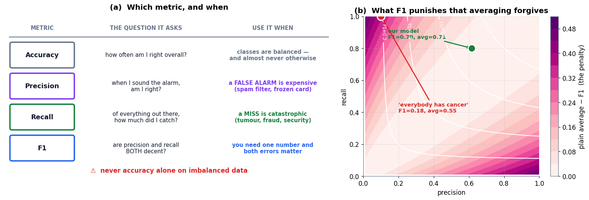

### Cell 127

```python
# ============================================================
#  Final self-check: every headline number in this notebook, recomputed
# ============================================================
checks = []

# --- Part 1: conditioning ---
checks.append(("P(leash | dog) = 20/30",              20/30,        0.6667, 1e-3))
# --- Part 3: the rare disease ---
_pp   = 0.99 * 0.001 + 0.05 * 0.999
checks.append(("P(+)",                                _pp,          0.05094, 1e-6))
checks.append(("P(sick | +)",                         0.99*0.001/_pp, 0.0194, 1e-3))
checks.append(("true positives per 100,000",          100_000*0.001*0.99, 99, 1e-6))
checks.append(("false positives per 100,000",         100_000*0.999*0.05, 4995, 1e-6))
# --- Part 4: distributions and MLE ---
from math import comb
checks.append(("Binomial(4, 0.5) at k=2",             comb(4,2)*0.5**4, 0.375, 1e-9))
checks.append(("uniform[0,0.5] density",              1/0.5,        2.0,    1e-9))
checks.append(("MLE p-hat, 7 of 10 heads",            7/10,         0.7,    1e-9))
# --- Part 5: naive bayes ---
_sp, _hm = 0.4*0.7*0.5*0.1, 0.6*0.1*0.2*0.4
checks.append(("score(spam)",                         _sp,          0.014,  1e-9))
checks.append(("score(ham)",                          _hm,          0.0048, 1e-9))
checks.append(("P(spam | email)",                     _sp/(_sp+_hm), 0.745, 1e-3))
# --- Part 6: evaluation ---
_TP, _FN, _FP, _TN = 8, 2, 5, 85
_pre, _rec = _TP/(_TP+_FP), _TP/(_TP+_FN)
checks.append(("accuracy",                            (_TP+_TN)/100, 0.93,  1e-9))
checks.append(("precision",                           _pre,          0.615, 1e-3))
checks.append(("recall",                              _rec,          0.80,  1e-9))
checks.append(("F1",                                  2*_pre*_rec/(_pre+_rec), 0.696, 1e-3))
checks.append(("'everybody' plain average",           (0.1+1.0)/2,   0.55,  1e-9))
checks.append(("'everybody' F1",                      2*0.1*1.0/1.1, 0.182, 1e-3))

print("EVERY HEADLINE NUMBER IN THIS NOTEBOOK, RECOMPUTED FROM SCRATCH")
print("=" * 76)
print(f"  {'quantity':<34}{'computed':>14}{'book value':>14}{'agrees':>10}")
ok = True
for name, got, book, tol in checks:
    good = abs(got - book) <= tol
    ok &= good
    print(f"  {name:<34}{got:>14.6f}{book:>14.6f}{('yes' if good else 'NO'):>10}")
print("-" * 76)
print(f"  all {len(checks)} values agree with the book: {ok}")
print()
print("  Nothing in this notebook was quoted. Every number above was produced by")
print("  a cell you can edit — change an input and watch the conclusion move.")
```

**Output**

```text
EVERY HEADLINE NUMBER IN THIS NOTEBOOK, RECOMPUTED FROM SCRATCH
============================================================================
  quantity                                computed    book value    agrees
  P(leash | dog) = 20/30                  0.666667      0.666700       yes
  P(+)                                    0.050940      0.050940       yes
  P(sick | +)                             0.019435      0.019400       yes
  true positives per 100,000             99.000000     99.000000       yes
  false positives per 100,000          4995.000000   4995.000000       yes
  Binomial(4, 0.5) at k=2                 0.375000      0.375000       yes
  uniform[0,0.5] density                  2.000000      2.000000       yes
  MLE p-hat, 7 of 10 heads                0.700000      0.700000       yes
  score(spam)                             0.014000      0.014000       yes
  score(ham)                              0.004800      0.004800       yes
  P(spam | email)                         0.744681      0.745000       yes
  accuracy                                0.930000      0.930000       yes
  precision                               0.615385      0.615000       yes
  recall                                  0.800000      0.800000       yes
  F1                                      0.695652      0.696000       yes
  'everybody' plain average               0.550000      0.550000       yes
  'everybody' F1                          0.181818      0.182000       yes
----------------------------------------------------------------------------
  all 17 values agree with the book: True

  Nothing in this notebook was quoted. Every number above was produced by
  a cell you can edit — change an input and watch the conclusion move.
```

