# 13 — Calculus 1

**Status:** Executed successfully

## Code and Output

### Cell 3

```python
# ============================================================
#  Setup -- no installs, no downloads, no network.
# ============================================================
import numpy as np
import matplotlib.pyplot as plt
import sympy as sp

plt.rcParams["figure.figsize"] = (9, 4.5)
plt.rcParams["axes.grid"]      = True
plt.rcParams["grid.alpha"]     = 0.3
plt.rcParams["axes.spines.top"]   = False
plt.rcParams["axes.spines.right"] = False
plt.rcParams["font.size"] = 11

C_F, C_SLOPE, C_AREA = "#2563EB", "#DC2626", "#059669"
C_APPROX, C_EXACT, C_GREY, C_SOFT = "#D97706", "#7C3AED", "#6B7280", "#E5E7EB"

# sympy lets us check by hand-free algebra. We use it as a MARKER, never as a
# substitute for understanding: every symbolic result in this notebook is also
# confirmed with numbers.
x, y, h, t = sp.symbols("x y h t", real=True)

print(f"numpy {np.__version__}   sympy {sp.__version__}")
```

**Output**

```text
numpy 2.1.3   sympy 1.14.0
```

### Cell 5

```python
# ============================================================
#  The running example -- a two-minute car journey.
#  Position is measured every second. From this ONE dataset we
#  will ask both of calculus's questions:
#     "how fast is it going right now?"      -> derivative
#     "how far has it travelled in total?"   -> integral
# ============================================================
import numpy as np

# time in seconds, 0 to 120
t_sec = np.arange(0, 121, 1.0)

# a smooth, realistic drive: accelerate, cruise, slow for a bend, speed up,
# then brake to a stop. Written as a speed profile, then integrated ONCE
# (numerically) to get position -- so position and speed are exactly consistent.
def speed_mps(tt):
    """Speed in metres per second at time tt (seconds)."""
    accel  = 14 / (1 + np.exp(-(tt - 12) / 3.0))        # pull away, settle ~14
    bend   = -6 * np.exp(-((tt - 55) ** 2) / (2 * 7.0 ** 2))   # slow for a bend
    final  = -13 / (1 + np.exp(-(tt - 100) / 4.0))      # brake to a stop
    return np.clip(accel + bend + final, 0, None)

v_true   = speed_mps(t_sec)
pos_m    = np.concatenate([[0.0], np.cumsum((v_true[:-1] + v_true[1:]) / 2)])

print(f"journey: {len(t_sec)} readings, {t_sec[-1]:.0f} seconds")
print(f"total distance : {pos_m[-1]:,.1f} m")
print(f"top speed      : {v_true.max():.2f} m/s  ({v_true.max() * 3.6:.1f} km/h)")
print(f"average speed  : {pos_m[-1] / t_sec[-1]:.2f} m/s")
```

**Output**

```text
journey: 121 readings, 120 seconds
total distance : 1,145.6 m
top speed      : 13.96 m/s  (50.3 km/h)
average speed  : 9.55 m/s
```

### Cell 7

```python
fig, (ax1, ax2) = plt.subplots(1, 2, figsize=(12, 4.2))

ax1.plot(t_sec, pos_m, color=C_F, lw=2.4)
ax1.set_xlabel("time (seconds)")
ax1.set_ylabel("distance travelled (metres)")
ax1.set_title("What we measured: position")

ax2.plot(t_sec, v_true, color=C_SLOPE, lw=2.4)
ax2.set_xlabel("time (seconds)")
ax2.set_ylabel("speed (metres per second)")
ax2.set_title("What we want to know: speed")

for a in (ax1, ax2):
    a.axvspan(48, 62, color=C_SOFT, zorder=0)
    a.axvspan(100, 120, color=C_SOFT, zorder=0)
fig.tight_layout()
plt.show()

print(f"At t = 55 s the car is {pos_m[55]:,.1f} m from the start.")
print(f"Between t = 54 s and t = 56 s it covers "
      f"{pos_m[56] - pos_m[54]:.2f} m in 2.0 s,")
print(f"  which is an AVERAGE speed of {(pos_m[56] - pos_m[54]) / 2:.3f} m/s.")
print(f"The true speed at exactly t = 55 s is {v_true[55]:.3f} m/s.")
print()
print(f"Close, but not equal. Shrinking that 2-second window is the whole")
print(f"idea of Part 3.")
```

**Output**

```text
<Figure size 1200x420 with 2 Axes>
```

**Figure**

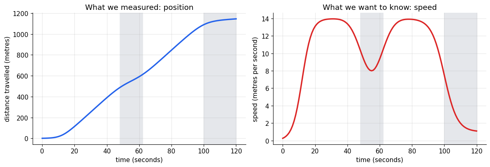

**Output**

```text
At t = 55 s the car is 548.6 m from the start.
Between t = 54 s and t = 56 s it covers 16.06 m in 2.0 s,
  which is an AVERAGE speed of 8.030 m/s.
The true speed at exactly t = 55 s is 8.000 m/s.

Close, but not equal. Shrinking that 2-second window is the whole
idea of Part 3.
```

### Cell 14

```python
fig, (ax1, ax2) = plt.subplots(1, 2, figsize=(12, 4.4))

# --- LEFT: a genuine function. One input, one output, every time. ----------
xs = np.linspace(-5, 5, 400)
ax1.plot(xs, xs ** 2, color=C_F, lw=2.6)
ax1.axvline(2.0, color=C_SLOPE, ls="--", lw=1.8)
ax1.plot([2.0], [4.0], "o", color=C_SLOPE, ms=10, zorder=5)
ax1.annotate("the vertical line at x = 2\nhits the curve ONCE\n-> one answer, f(2) = 4",
             xy=(2.0, 4.0), xytext=(-4.7, 17),
             arrowprops=dict(arrowstyle="->", color=C_SLOPE), color=C_SLOPE)
ax1.set_title("A function:  f(x) = x squared")
ax1.set_xlabel("input  x")
ax1.set_ylabel("output  f(x)")
ax1.set_ylim(-2, 27)

# --- RIGHT: NOT a function. A circle: one input, two outputs. --------------
theta = np.linspace(0, 2 * np.pi, 400)
ax2.plot(5 * np.cos(theta), 5 * np.sin(theta), color=C_GREY, lw=2.6)
ax2.axvline(3.0, color=C_SLOPE, ls="--", lw=1.8)
ax2.plot([3.0, 3.0], [4.0, -4.0], "o", color=C_SLOPE, ms=10, zorder=5)
ax2.annotate("the vertical line at x = 3\nhits it TWICE\n-> y = +4 and y = -4.\nWhich is 'the' answer?",
             xy=(3.0, 4.0), xytext=(-5.8, 6.3),
             arrowprops=dict(arrowstyle="->", color=C_SLOPE), color=C_SLOPE)
ax2.set_title("NOT a function:  the circle  x squared + y squared = 25")
ax2.set_xlabel("input  x")
ax2.set_ylabel("output  y")
ax2.set_ylim(-6.5, 9.5)
ax2.set_aspect("equal", adjustable="box")

fig.tight_layout()
plt.show()

# ---- the failure, in numbers rather than in a picture ----
print("Circle of radius 5, asked for the output when the input is x = 3:")
for sign, lab in [(+1, "upper half"), (-1, "lower half")]:
    print(f"   {lab}: y = {sign * np.sqrt(25 - 3.0 ** 2):+.1f}")
print("Two answers for one input -> not a function.\n")

def f(x):
    """Our first named function. Squares its input."""
    return x ** 2

print("f(x) = x^2")
print(f"   f(2)   = {f(2)}")
print(f"   f(-2)  = {f(-2)}    <- different input, SAME output. Perfectly allowed.")
print(f"   f(0.5) = {f(0.5)}\n")

print("Is f(a + b) the same as f(a) + f(b)?  Take a = 1, b = 2:")
print(f"   f(1 + 2)    = f(3)  = {f(1 + 2)}")
print(f"   f(1) + f(2) = 1 + 4 = {f(1) + f(2)}")
print(f"   equal? {f(1 + 2) == f(1) + f(2)}   <- so f(x) is NOT 'f times x'.\n")

# ---- domain: which inputs is the machine allowed to accept? ----
print("Domain -- inputs that break the machine:")
for name, rule, bad in [("1/x",     lambda z: 1 / z,       0.0),
                        ("sqrt(x)", lambda z: np.sqrt(z), -4.0),
                        ("ln(x)",   lambda z: np.log(z),   0.0)]:
    try:
        with np.errstate(all="raise"):
            out = rule(bad)
        print(f"   {name:9s} at x = {bad:>5.1f} -> {out}")
    except Exception as e:
        print(f"   {name:9s} at x = {bad:>5.1f} -> refused ({type(e).__name__})")

# ---- range: which outputs can actually come out? ----
grid = np.linspace(-6, 6, 2001)
print(f"\nRange of f(x) = x^2 over the inputs -6..6: "
      f"{f(grid).min():.2f} to {f(grid).max():.2f}")
print("   -- never below 0, because no real number squares to a negative.")
```

**Output**

```text
<Figure size 1200x440 with 2 Axes>
```

**Figure**

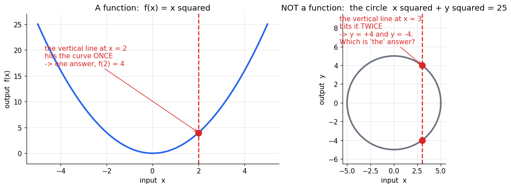

**Output**

```text
Circle of radius 5, asked for the output when the input is x = 3:
   upper half: y = +4.0
   lower half: y = -4.0
Two answers for one input -> not a function.

f(x) = x^2
   f(2)   = 4
   f(-2)  = 4    <- different input, SAME output. Perfectly allowed.
   f(0.5) = 0.25

Is f(a + b) the same as f(a) + f(b)?  Take a = 1, b = 2:
   f(1 + 2)    = f(3)  = 9
   f(1) + f(2) = 1 + 4 = 5
   equal? False   <- so f(x) is NOT 'f times x'.

Domain -- inputs that break the machine:
   1/x       at x =   0.0 -> refused (ZeroDivisionError)
   sqrt(x)   at x =  -4.0 -> refused (FloatingPointError)
   ln(x)     at x =   0.0 -> refused (FloatingPointError)

Range of f(x) = x^2 over the inputs -6..6: 0.00 to 36.00
   -- never below 0, because no real number squares to a negative.
```

### Cell 17

```python
fig, axes = plt.subplots(2, 4, figsize=(15, 6.6))

def panel(ax, xs, ys, title, note):
    ax.plot(xs, ys, color=C_F, lw=2.6)
    ax.axhline(0, color=C_GREY, lw=0.8)
    ax.axvline(0, color=C_GREY, lw=0.8)
    ax.set_title(title, fontsize=11)
    ax.set_xlabel(note, fontsize=9, color=C_GREY)

xs = np.linspace(-4, 4, 400)
panel(axes[0, 0], xs, 2 * xs + 1,       "linear:  2x + 1",        "constant steepness")
panel(axes[0, 1], xs, xs ** 2,          "quadratic:  x squared",  "one lowest point")
panel(axes[0, 2], xs, xs ** 3 - 3 * xs, "cubic:  x cubed - 3x",   "a bump AND a dip")

xe = np.linspace(-3, 3, 400)
panel(axes[0, 3], xe, np.exp(xe),       "exponential:  e to the x", "never negative, explodes")

xl = np.linspace(0.05, 8, 400)
panel(axes[1, 0], xl, np.log(xl),       "logarithm:  ln x",       "only defined for x > 0")

# 1/x must be drawn as two separate branches. It is undefined AT zero, so
# joining the halves would draw a vertical wall that is not part of the graph.
axes[1, 1].plot(np.linspace(-4, -0.12, 300), 1 / np.linspace(-4, -0.12, 300),
                color=C_F, lw=2.6)
axes[1, 1].plot(np.linspace(0.12, 4, 300), 1 / np.linspace(0.12, 4, 300),
                color=C_F, lw=2.6)
axes[1, 1].axhline(0, color=C_GREY, lw=0.8)
axes[1, 1].axvline(0, color=C_SLOPE, lw=1.2, ls=":")
axes[1, 1].set_ylim(-9, 9)
axes[1, 1].set_title("reciprocal:  1 / x", fontsize=11)
axes[1, 1].set_xlabel("undefined at x = 0", fontsize=9, color=C_GREY)

xs2 = np.linspace(-8, 8, 400)
sig  = 1 / (1 + np.exp(-xs2))
panel(axes[1, 2], xs2, sig, "sigmoid:  1 / (1 + e to the -x)", "squashed into 0 .. 1")
axes[1, 2].axhline(1, color=C_SOFT, lw=1.4)

axes[1, 3].axis("off")
fig.tight_layout()
plt.show()

# The claims in the table above, checked with numbers rather than trusted.
print(f"e          = {np.e:.6f}")
print(f"ln(e)      = {np.log(np.e):.6f}   <- 'e to what power gives e?'  Answer: 1.")
print(f"exp(ln(7)) = {np.exp(np.log(7)):.6f}   <- ln and exp undo each other.\n")

sg = lambda z: 1 / (1 + np.exp(-z))
print("The sigmoid squashes EVERYTHING into the interval 0 to 1:")
for z in (-100, -3, 0, 3, 100):
    print(f"   sigmoid({z:>5}) = {sg(float(z)):.8f}")
print(f"\nover the inputs -8..8 it ranges {sig.min():.5f} .. {sig.max():.5f}")
print("-- it approaches 0 and 1 but never actually reaches either.")
```

**Output**

```text
<Figure size 1500x660 with 8 Axes>
```

**Figure**

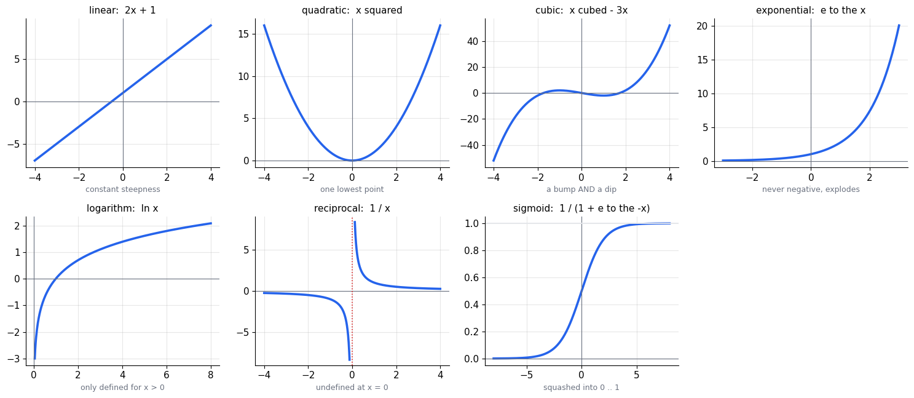

**Output**

```text
e          = 2.718282
ln(e)      = 1.000000   <- 'e to what power gives e?'  Answer: 1.
exp(ln(7)) = 7.000000   <- ln and exp undo each other.

The sigmoid squashes EVERYTHING into the interval 0 to 1:
   sigmoid( -100) = 0.00000000
   sigmoid(   -3) = 0.04742587
   sigmoid(    0) = 0.50000000
   sigmoid(    3) = 0.95257413
   sigmoid(  100) = 1.00000000

over the inputs -8..8 it ranges 0.00034 .. 0.99966
-- it approaches 0 and 1 but never actually reaches either.
```

### Cell 21

```python
def slope(f, a, b):
    """Rise over run between the points (a, f(a)) and (b, f(b))."""
    rise = f(b) - f(a)
    run  = b - a
    return rise / run

line  = lambda z: 3 * z - 2       # a straight line: f(x) = 3x - 2
pairs = [(-4.0, -1.0), (0.0, 5.0), (7.0, 7.001)]

print("f(x) = 3x - 2, measured at three completely different pairs of points")
print("-" * 66)
print(f"{'a':>8} {'b':>8} {'rise':>12} {'run':>10} {'rise/run':>12}")
for a, b in pairs:
    print(f"{a:>8.3f} {b:>8.3f} {line(b) - line(a):>12.5f} "
          f"{b - a:>10.3f} {slope(line, a, b):>12.6f}")
print("-" * 66)

vals = [slope(line, a, b) for a, b in pairs]
print(f"three measurements: {[round(v, 9) for v in vals]}")
print(f"all identical to 9 decimal places? {np.allclose(vals, vals[0], atol=1e-9)}")
print(f"\nOrder does not matter either:")
print(f"   slope(a=0, b=5) = {slope(line, 0.0, 5.0):.6f}")
print(f"   slope(a=5, b=0) = {slope(line, 5.0, 0.0):.6f}   <- same")

fig, ax = plt.subplots(figsize=(9.5, 4.8))
xs = np.linspace(-5, 8, 200)
ax.plot(xs, line(xs), color=C_F, lw=2.6, label="f(x) = 3x - 2")

for (a, b), col in zip(pairs[:2], [C_SLOPE, C_AREA]):
    ax.plot([a, b], [line(a), line(a)], color=col, lw=2, ls="--")   # the run
    ax.plot([b, b], [line(a), line(b)], color=col, lw=2, ls="--")   # the rise
    ax.plot([a, b], [line(a), line(b)], "o", color=col, ms=8, zorder=5)
    ax.text((a + b) / 2, line(a) - 2.8, f"run = {b - a:.0f}",
            color=col, ha="center", fontsize=10)
    ax.text(b + 0.25, (line(a) + line(b)) / 2, f"rise = {line(b) - line(a):.0f}",
            color=col, va="center", fontsize=10)

ax.set_xlabel("input  x")
ax.set_ylabel("output  f(x)")
ax.set_title("Two different right-angled triangles, one slope")
ax.legend(loc="upper left")
fig.tight_layout()
plt.show()

print(f"red triangle  : rise {line(-1.) - line(-4.):.0f} / run 3 = "
      f"{(line(-1.) - line(-4.)) / 3.0:.4f}")
print(f"green triangle: rise {line(5.) - line(0.):.0f} / run 5 = "
      f"{(line(5.) - line(0.)) / 5.0:.4f}")
```

**Output**

```text
f(x) = 3x - 2, measured at three completely different pairs of points
------------------------------------------------------------------
       a        b         rise        run     rise/run
  -4.000   -1.000      9.00000      3.000     3.000000
   0.000    5.000     15.00000      5.000     3.000000
   7.000    7.001      0.00300      0.001     3.000000
------------------------------------------------------------------
three measurements: [3.0, 3.0, 3.0]
all identical to 9 decimal places? True

Order does not matter either:
   slope(a=0, b=5) = 3.000000
   slope(a=5, b=0) = 3.000000   <- same
```

**Output**

```text
<Figure size 950x480 with 1 Axes>
```

**Figure**

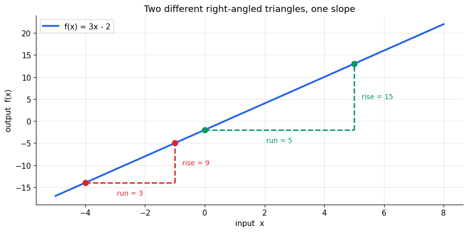

**Output**

```text
red triangle  : rise 9 / run 3 = 3.0000
green triangle: rise 15 / run 5 = 3.0000
```

### Cell 25

```python
def avg_rate(a, b):
    """Average speed of the car between times a and b, in metres per second.

    pos_m[i] is the distance travelled by time i seconds, so this is exactly
    (f(b) - f(a)) / (b - a) with f = position.
    """
    a, b = int(a), int(b)
    return (pos_m[b] - pos_m[a]) / (b - a)

windows = [(0, 120), (50, 60), (54, 56)]

print("Average speed over three windows of the SAME journey")
print("=" * 64)
print(f"{'from (s)':>9} {'to (s)':>8} {'distance (m)':>15} {'time (s)':>10} {'avg speed':>12}")
for a, b in windows:
    print(f"{a:>9} {b:>8} {pos_m[b] - pos_m[a]:>15.4f} "
          f"{b - a:>10} {avg_rate(a, b):>12.4f}")
print("=" * 64)

answers = [avg_rate(a, b) for a, b in windows]
print(f"three answers: {[round(float(v), 4) for v in answers]}  m/s")
print(f"all the same?  {np.allclose(answers, answers[0])}")
print(f"the largest exceeds the smallest by {max(answers) - min(answers):.4f} m/s "
      f"({100 * (max(answers) - min(answers)) / min(answers):.1f}% of the smallest)")
print()
print("Every one of these is a correct average speed. They are averages over")
print("different stretches -- and NONE of them is the speedometer reading.")

fig, ax = plt.subplots(figsize=(10, 4.8))
ax.plot(t_sec, pos_m, color=C_F, lw=2.4, label="position (m)")

for (a, b), col, off in zip(windows, [C_SLOPE, C_AREA, C_EXACT], [60, 130, 200]):
    ax.plot([a, b], [pos_m[a], pos_m[b]], color=col, lw=2.4, ls="--")
    ax.plot([a, b], [pos_m[a], pos_m[b]], "o", color=col, ms=7, zorder=5)
    ax.annotate(f"{a}-{b} s:  {avg_rate(a, b):.2f} m/s",
                xy=((a + b) / 2, (pos_m[a] + pos_m[b]) / 2),
                xytext=(6, off), textcoords="offset points",
                color=col, fontsize=10,
                arrowprops=dict(arrowstyle="->", color=col, lw=1.2))

ax.set_xlabel("time (seconds)")
ax.set_ylabel("distance travelled (metres)")
ax.set_title("Three secants across the same position curve, three different slopes")
ax.legend(loc="upper left")
fig.tight_layout()
plt.show()
```

**Output**

```text
Average speed over three windows of the SAME journey
================================================================
 from (s)   to (s)    distance (m)   time (s)    avg speed
        0      120       1145.6015        120       9.5467
       50       60         84.8110         10       8.4811
       54       56         16.0606          2       8.0303
================================================================
three answers: [9.5467, 8.4811, 8.0303]  m/s
all the same?  False
the largest exceeds the smallest by 1.5164 m/s (18.9% of the smallest)

Every one of these is a correct average speed. They are averages over
different stretches -- and NONE of them is the speedometer reading.
```

**Output**

```text
<Figure size 1000x480 with 1 Axes>
```

**Figure**

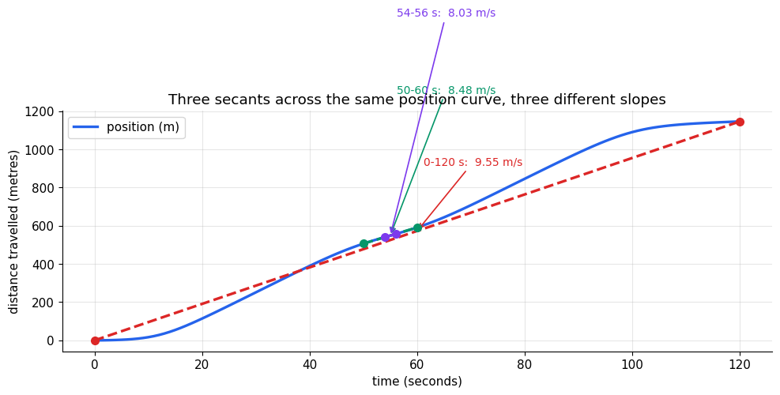

### Cell 28

```python
print(f"{'window':>14} {'average over it':>17} {'speedometer at midpoint':>26} {'gap':>10}")
print("-" * 71)
for a, b in [(40, 70), (0, 120), (50, 60), (54, 56)]:
    mid = (a + b) // 2
    print(f"{a:>5}-{b:<5}s {avg_rate(a, b):>15.4f}   {v_true[mid]:>22.4f}   "
          f"{avg_rate(a, b) - v_true[mid]:>+9.4f}")
print("-" * 71)

a, b = 40, 70
mid = (a + b) // 2
print(f"\nWorst case above: over {a}-{b} s the average is {avg_rate(a, b):.4f} m/s,")
print(f"but at t = {mid} s the car is actually doing {v_true[mid]:.4f} m/s.")
print(f"Off by {avg_rate(a, b) - v_true[mid]:.4f} m/s -- about "
      f"{100 * abs(avg_rate(a, b) - v_true[mid]) / v_true[mid]:.0f}% wrong.")
print("\nBest case: the 2-second window 54-56 s, where the gap nearly vanishes.")
print("Narrower window -> less room for the curve to bend -> closer agreement.")
```

**Output**

```text
        window   average over it    speedometer at midpoint        gap
-----------------------------------------------------------------------
   40-70   s         10.6034                   7.9998     +2.6036
    0-120  s          9.5467                   9.3504     +0.1963
   50-60   s          8.4811                   7.9998     +0.4813
   54-56   s          8.0303                   7.9998     +0.0305
-----------------------------------------------------------------------

Worst case above: over 40-70 s the average is 10.6034 m/s,
but at t = 55 s the car is actually doing 7.9998 m/s.
Off by 2.6036 m/s -- about 33% wrong.

Best case: the 2-second window 54-56 s, where the gap nearly vanishes.
Narrower window -> less room for the curve to bend -> closer agreement.
```

### Cell 31

```python
anchor = 55                        # the point we hold fixed
others = [80, 70, 65, 60, 57, 56]  # second points, creeping towards it

fig, (ax1, ax2) = plt.subplots(1, 2, figsize=(13, 4.8))

zoom = (t_sec >= 45) & (t_sec <= 90)
ax1.plot(t_sec[zoom], pos_m[zoom], color=C_F, lw=2.8, zorder=3)
ax1.plot([anchor], [pos_m[anchor]], "o", color="black", ms=10, zorder=6)
ax1.annotate("fixed point,  t = 55 s", xy=(anchor, pos_m[anchor]),
             xytext=(59, pos_m[anchor] - 105), fontsize=10,
             arrowprops=dict(arrowstyle="->", color="black"))

shades, rows = plt.cm.autumn(np.linspace(0.05, 0.75, len(others))), []
for b, col in zip(others, shades):
    s = (pos_m[b] - pos_m[anchor]) / (b - anchor)
    # draw each secant as a full line across the window rather than just the
    # chord, so what you notice is the change in TILT, not the change in length
    tt = np.linspace(46, 89, 2)
    ax1.plot(tt, pos_m[anchor] + s * (tt - anchor), color=col, lw=1.7, alpha=0.95)
    ax1.plot([b], [pos_m[b]], "o", color=col, ms=7, zorder=5)
    rows.append((b, b - anchor, s))

ax1.set_xlim(45, 90)
ax1.set_ylim(pos_m[45] - 130, pos_m[90] + 40)
ax1.set_xlabel("time (seconds)")
ax1.set_ylabel("distance travelled (metres)")
ax1.set_title("Secants through t = 55 s, second point creeping closer")

gaps, slopes = [r[1] for r in rows], [r[2] for r in rows]
ax2.plot(gaps, slopes, "o-", color=C_APPROX, lw=2.2, ms=8)
ax2.invert_xaxis()
ax2.set_xlabel("gap between the two points (seconds)  ->  shrinking")
ax2.set_ylabel("slope of the secant (m/s)")
ax2.set_title("The slopes are settling somewhere")
for g, s in zip(gaps, slopes):
    ax2.annotate(f"{s:.3f}", xy=(g, s), xytext=(0, 9), textcoords="offset points",
                 ha="center", fontsize=9, color=C_APPROX)

fig.tight_layout()
plt.show()

print(f"{'second point':>14} {'gap (s)':>9} {'secant slope (m/s)':>21}")
print("-" * 47)
for b, gap, s in rows:
    print(f"{b:>12} s {gap:>9} {s:>21.5f}")
print("-" * 47)
print("The slopes are not wandering. They are heading somewhere specific.")
print(f"And the gap can never be set to 0: that would be a run of zero,")
print(f"and pos_m[55] - pos_m[55] = {pos_m[55] - pos_m[55]:.1f} over 0. Nothing at all.")
```

**Output**

```text
<Figure size 1300x480 with 2 Axes>
```

**Figure**

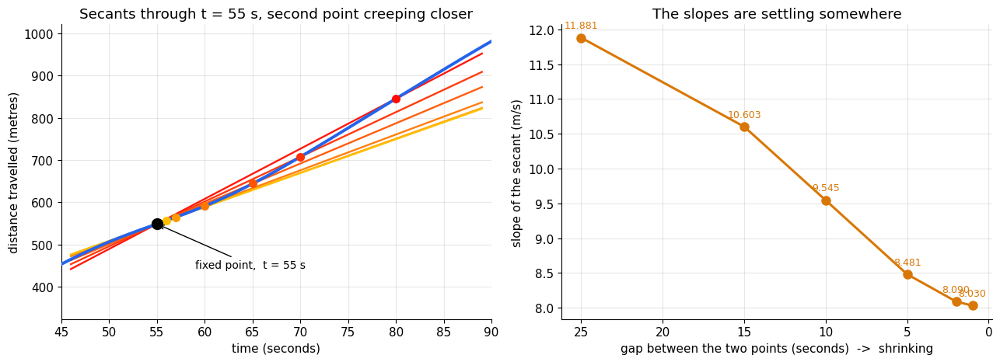

**Output**

```text
  second point   gap (s)    secant slope (m/s)
-----------------------------------------------
          80 s        25              11.88118
          70 s        15              10.60260
          65 s        10               9.54505
          60 s         5               8.48099
          57 s         2               8.09022
          56 s         1               8.03026
-----------------------------------------------
The slopes are not wandering. They are heading somewhere specific.
And the gap can never be set to 0: that would be a run of zero,
and pos_m[55] - pos_m[55] = 0.0 over 0. Nothing at all.
```

### Cell 35

```python
g    = lambda z: 3 * z + 1      # inner machine
f_o  = lambda u: u ** 2         # outer machine
comp = lambda z: f_o(g(z))      # "f of g of x"

print("Composition, traced one step at a time.  f(u) = u^2,  g(x) = 3x + 1")
print("-" * 62)
print(f"{'x':>6} {'g(x) = 3x+1':>14} {'then squared':>15} {'(3x+1)^2':>12}")
for xv in [-1.0, 0.0, 2.0, 3.0]:
    inner = g(xv)
    print(f"{xv:>6.1f} {inner:>14.1f} {f_o(inner):>15.1f} {(3 * xv + 1) ** 2:>12.1f}")
print("-" * 62)

grid = np.linspace(-3, 3, 400)
print(f"does f(g(x)) equal (3x+1)^2 everywhere on -3..3?  "
      f"{np.allclose(comp(grid), (3 * grid + 1) ** 2)}")

other = lambda z: g(f_o(z))     # "g of f of x" = 3x^2 + 1 -- a DIFFERENT function
print(f"\nf(g(2)) = {comp(2.0):.1f}   (7, then squared)")
print(f"g(f(2)) = {other(2.0):.1f}   (4, then tripled and plus one)")
print("Order matters: stacking the machines the other way is a different rule.")

fig, (ax1, ax2) = plt.subplots(1, 2, figsize=(13, 4.6))
xs = np.linspace(-3.2, 3.2, 400)

ax1.plot(xs, xs ** 2,  color=C_GREY, lw=2.2, ls=":", label="f(x) = x^2")
ax1.plot(xs, g(xs),    color=C_AREA, lw=2.2,         label="g(x) = 3x + 1")
ax1.plot(xs, comp(xs), color=C_F,    lw=2.8,         label="f(g(x)) = (3x+1)^2")
ax1.set_ylim(-6, 40)
ax1.set_xlabel("input  x")
ax1.set_title("Composition: g first, then f")
ax1.legend(loc="upper center", fontsize=9)

base = lambda z: z ** 2
ax2.plot(xs, base(xs),       color=C_GREY,  lw=2.6, label="f(x) = x^2  (original)")
ax2.plot(xs, base(xs) + 4,   color=C_AREA,  lw=2.2, label="f(x) + 4   -> up 4")
ax2.plot(xs, base(xs - 1.5), color=C_SLOPE, lw=2.2, label="f(x - 1.5) -> RIGHT 1.5")
ax2.plot(xs, base(2 * xs),   color=C_EXACT, lw=2.2, label="f(2x)      -> squashed")
ax2.set_ylim(-1, 24)
ax2.set_xlabel("input  x")
ax2.set_title("Transformations of one base shape")
ax2.legend(loc="upper center", fontsize=9)

fig.tight_layout()
plt.show()

print("\nChecking the row everyone gets backwards -- MINUS inside moves it RIGHT:")
print(f"   x^2 has its lowest point at x = 0, where it is {base(0.0):.2f}")
print(f"   f(x - 1.5) at x = 1.5 gives {base(1.5 - 1.5):.2f} "
      f"<- the bottom has moved to x = +1.5")
print(f"   f(x - 1.5) at x = 0.0 gives {base(0.0 - 1.5):.2f} "
      f"<- x = 0 is no longer the bottom")
print("Why: to bottom out, the bracket must contain 0, so x must reach 1.5.")
print("Subtracting inside makes x work harder to get there, dragging the")
print("whole shape to the right.")
```

**Output**

```text
Composition, traced one step at a time.  f(u) = u^2,  g(x) = 3x + 1
--------------------------------------------------------------
     x    g(x) = 3x+1    then squared     (3x+1)^2
  -1.0           -2.0             4.0          4.0
   0.0            1.0             1.0          1.0
   2.0            7.0            49.0         49.0
   3.0           10.0           100.0        100.0
--------------------------------------------------------------
does f(g(x)) equal (3x+1)^2 everywhere on -3..3?  True

f(g(2)) = 49.0   (7, then squared)
g(f(2)) = 13.0   (4, then tripled and plus one)
Order matters: stacking the machines the other way is a different rule.
```

**Output**

```text
<Figure size 1300x460 with 2 Axes>
```

**Figure**

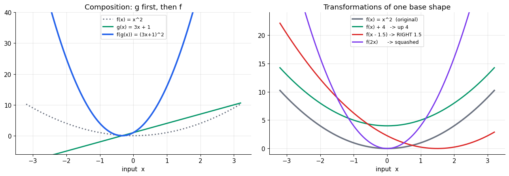

**Output**

```text
Checking the row everyone gets backwards -- MINUS inside moves it RIGHT:
   x^2 has its lowest point at x = 0, where it is 0.00
   f(x - 1.5) at x = 1.5 gives 0.00 <- the bottom has moved to x = +1.5
   f(x - 1.5) at x = 0.0 gives 2.25 <- x = 0 is no longer the bottom
Why: to bottom out, the bracket must contain 0, so x must reach 1.5.
Subtracting inside makes x work harder to get there, dragging the
whole shape to the right.
```

### Cell 41

```python
# ============================================================
#  The function with a hole, evaluated NEAR x = 1 but never AT it.
# ============================================================
def f_hole(xx):
    """(x^2 - 1) / (x - 1).  Undefined at x = 1."""
    return (xx ** 2 - 1) / (xx - 1)

approach = [0.9, 0.99, 0.999, 1.001, 1.01, 1.1]

print("        x     (x^2-1)/(x-1)   approaching 1 ...")
print("  " + "-" * 50)
for xv in approach:
    side = "from below (left)" if xv < 1 else "from above (right)"
    print(f"  {xv:>10.6f}   {f_hole(xv):>13.6f}   {side}")

# And AT the point itself:
try:
    print("  at x = 1 exactly:", f_hole(1.0))
except ZeroDivisionError as err:
    print(f"  {1.0:>10.6f}   {'UNDEFINED':>13}   ZeroDivisionError: {err}")
print("  " + "-" * 50)

print()
print("  The values march towards 2 from BOTH sides.")
print(f"  Closest from the left : {f_hole(0.999):.6f}")
print(f"  Closest from the right: {f_hole(1.001):.6f}")
print(f"  Gap between them      : {f_hole(1.001) - f_hole(0.999):.6f}")

# ---- Why? Because the numerator FACTORS. Do the algebra, then check it. ----
expr = (x ** 2 - 1) / (x - 1)
print()
print("  algebra, via sympy")
print("  " + "-" * 50)
print("  numerator factors to :", sp.factor(x ** 2 - 1))
print("  so the whole thing is:", sp.simplify(expr), "  (for x != 1)")
print("  sympy's limit at x=1 :", sp.limit(expr, x, 1))
print("  ... from the left    :", sp.limit(expr, x, 1, "-"))
print("  ... from the right   :", sp.limit(expr, x, 1, "+"))
print("  the VALUE at x=1     :", expr.subs(x, 1), " <- nan: not a number")

# ---- Numerical check that (x^2-1)/(x-1) really equals x+1 away from 1 ----
probe = np.array([-4.0, -0.7, 0.5, 0.9999, 1.0001, 2.0, 7.3])
worst = np.max(np.abs(f_hole(probe) - (probe + 1)))
print()
print(f"  numeric check: max |f(x) - (x+1)| over 7 probe points = {worst:.2e}")
```

**Output**

```text
        x     (x^2-1)/(x-1)   approaching 1 ...
  --------------------------------------------------
    0.900000        1.900000   from below (left)
    0.990000        1.990000   from below (left)
    0.999000        1.999000   from below (left)
    1.001000        2.001000   from above (right)
    1.010000        2.010000   from above (right)
    1.100000        2.100000   from above (right)
    1.000000       UNDEFINED   ZeroDivisionError: float division by zero
  --------------------------------------------------

  The values march towards 2 from BOTH sides.
  Closest from the left : 1.999000
  Closest from the right: 2.001000
  Gap between them      : 0.002000

  algebra, via sympy
  --------------------------------------------------
  numerator factors to : (x - 1)*(x + 1)
  so the whole thing is: x + 1   (for x != 1)
  sympy's limit at x=1 : 2
  ... from the left    : 2
  ... from the right   : 2
  the VALUE at x=1     : nan  <- nan: not a number

  numeric check: max |f(x) - (x+1)| over 7 probe points = 6.08e-13
```

### Cell 45

```python
# ============================================================
#  Draw it: the line, the hole, and the values marching in.
# ============================================================
xs = np.linspace(-0.6, 2.6, 601)
xs = xs[np.abs(xs - 1.0) > 1e-9]          # never evaluate exactly at the hole

fig, ax = plt.subplots(figsize=(9, 4.6))
ax.plot(xs, f_hole(xs), color=C_F, lw=2.6, label="(x^2 - 1) / (x - 1)", zorder=2)

# the hole itself: an open circle means "this point is NOT on the graph"
ax.plot([1.0], [2.0], marker="o", ms=11, mfc="white",
        mec=C_SLOPE, mew=2.6, zorder=5, label="x = 1: undefined (a hole)")

# the marching values from the table
left  = np.array([0.9, 0.99, 0.999])
right = np.array([1.1, 1.01, 1.001])
ax.plot(left,  f_hole(left),  "o", color=C_APPROX, ms=7, zorder=4,
        label="closing in from the left")
ax.plot(right, f_hole(right), "s", color=C_EXACT,  ms=7, zorder=4,
        label="closing in from the right")

ax.axhline(2.0, color=C_GREY, ls=":", lw=1.4)
ax.annotate("the limit: 2", xy=(2.3, 2.0), xytext=(1.95, 1.05),
            color=C_GREY, fontsize=11,
            arrowprops=dict(arrowstyle="->", color=C_GREY))
ax.axvline(1.0, color=C_SOFT, lw=6, zorder=0)
ax.set_xlabel("x")
ax.set_ylabel("f(x)")
ax.set_title("A function that is undefined at a point it clearly aims at")
ax.legend(loc="upper left", fontsize=9)
fig.tight_layout()
plt.show()

print("height of the open circle (the limit)   : 2.000000")
print("value of the function at x = 1          : undefined")
print(f"value at x = 0.999   (left  neighbour)  : {f_hole(0.999):.6f}")
print(f"value at x = 1.001   (right neighbour)  : {f_hole(1.001):.6f}")
```

**Output**

```text
<Figure size 900x460 with 1 Axes>
```

**Figure**

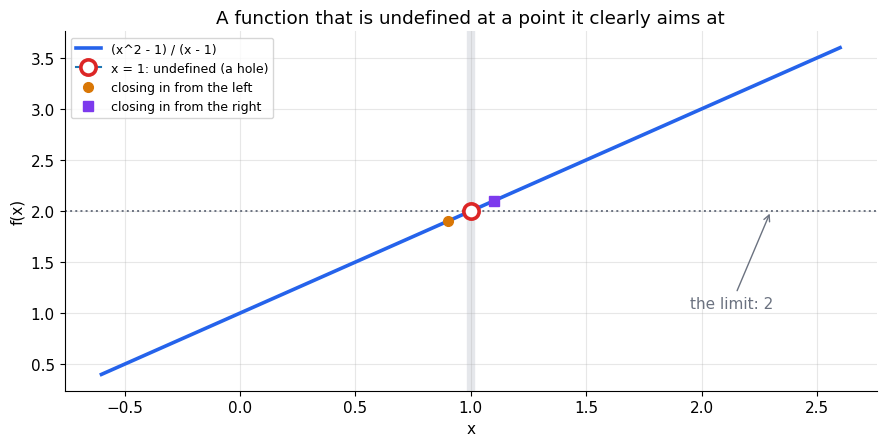

**Output**

```text
height of the open circle (the limit)   : 2.000000
value of the function at x = 1          : undefined
value at x = 0.999   (left  neighbour)  : 1.999000
value at x = 1.001   (right neighbour)  : 2.001000
```

### Cell 49

```python
# ============================================================
#  The three failure modes, drawn and tabulated.
# ============================================================
def step(xx):
    """A jump: 0 below zero, 1 from zero upwards."""
    return np.where(xx < 0, 0.0, 1.0)

def blowup(xx):
    """1/x -- grows without bound on approach to zero."""
    return 1.0 / xx

def wiggle(xx):
    """sin(1/x) -- oscillates faster and faster as x approaches zero."""
    return np.sin(1.0 / xx)

fig, axes = plt.subplots(1, 3, figsize=(13.5, 4.0))

# ---- 1. the jump -------------------------------------------------------
ax = axes[0]
neg = np.linspace(-1.2, -1e-6, 300)
pos = np.linspace(1e-6, 1.2, 300)
ax.plot(neg, step(neg), color=C_F, lw=2.8)
ax.plot(pos, step(pos), color=C_F, lw=2.8)
ax.plot([0], [0], "o", ms=10, mfc="white", mec=C_SLOPE, mew=2.4)   # excluded
ax.plot([0], [1], "o", ms=10, color=C_SLOPE)                       # included
ax.set_ylim(-0.35, 1.35)
ax.set_title("1. A jump\nleft says 0, right says 1")
ax.set_xlabel("x")

# ---- 2. the blow-up ----------------------------------------------------
ax = axes[1]
neg = np.linspace(-1.2, -0.02, 400)
pos = np.linspace(0.02, 1.2, 400)
ax.plot(neg, blowup(neg), color=C_F, lw=2.8)
ax.plot(pos, blowup(pos), color=C_F, lw=2.8)
ax.set_ylim(-55, 55)
ax.axvline(0, color=C_SLOPE, ls="--", lw=1.6)
ax.set_title("2. A blow-up\n1/x runs off without bound")
ax.set_xlabel("x")

# ---- 3. the oscillation ------------------------------------------------
ax = axes[2]
ww = np.concatenate([np.linspace(-0.35, -1e-4, 40000),
                     np.linspace(1e-4, 0.35, 40000)])
ax.plot(ww, wiggle(ww), color=C_F, lw=0.7)
ax.set_ylim(-1.35, 1.35)
ax.axvline(0, color=C_SLOPE, ls="--", lw=1.6)
ax.set_title("3. An oscillation\nsin(1/x) never settles")
ax.set_xlabel("x")

fig.tight_layout()
plt.show()

# ------------------------- the same three, as numbers -------------------
print("1. THE JUMP:  step(x) as x approaches 0")
print("     d        step(-d)     step(+d)")
for d in [0.1, 0.01, 0.001, 1e-6]:
    print(f"   {d:<9.0e}  {float(step(np.array(-d))):>8.4f}     "
          f"{float(step(np.array(d))):>8.4f}")
print("   left-hand limit = 0.0, right-hand limit = 1.0 -> they DISAGREE,")
print("   so the two-sided limit does not exist.")

print()
print("2. THE BLOW-UP:  1/x as x approaches 0")
print("     d          1/(-d)          1/(+d)")
for d in [0.1, 0.01, 0.001, 1e-6, 1e-9]:
    print(f"   {d:<9.0e}  {blowup(-d):>14,.1f}  {blowup(d):>14,.1f}")
print("   Neither side settles on a number -- both run away without bound,")
print("   so neither one-sided limit exists (we write -inf and +inf).")

print()
print("3. THE OSCILLATION:  sin(1/x) at points arbitrarily close to 0")
print("       x                 sin(1/x)")
for k in range(0, 5):
    x_hi = 2.0 / ((4 * k + 1) * np.pi)      # sin(1/x) = +1 exactly here
    x_lo = 2.0 / ((4 * k + 3) * np.pi)      # sin(1/x) = -1 exactly here
    print(f"   {x_hi:>12.3e}      {wiggle(x_hi):>+8.4f}")
    print(f"   {x_lo:>12.3e}      {wiggle(x_lo):>+8.4f}")
print("   Both +1 and -1 occur at x values as small as you like, forever.")
print("   The outputs never settle, so there is no limit -- not even one-sided.")
```

**Output**

```text
<Figure size 1350x400 with 3 Axes>
```

**Figure**

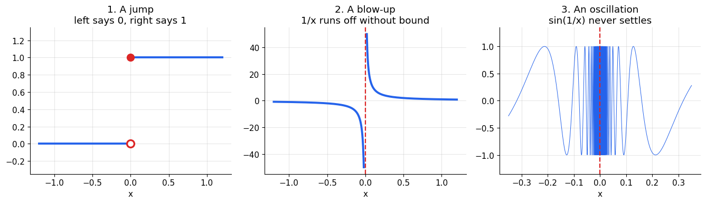

**Output**

```text
1. THE JUMP:  step(x) as x approaches 0
     d        step(-d)     step(+d)
   1e-01        0.0000       1.0000
   1e-02        0.0000       1.0000
   1e-03        0.0000       1.0000
   1e-06        0.0000       1.0000
   left-hand limit = 0.0, right-hand limit = 1.0 -> they DISAGREE,
   so the two-sided limit does not exist.

2. THE BLOW-UP:  1/x as x approaches 0
     d          1/(-d)          1/(+d)
   1e-01               -10.0            10.0
   1e-02              -100.0           100.0
   1e-03            -1,000.0         1,000.0
   1e-06        -1,000,000.0     1,000,000.0
   1e-09      -1,000,000,000.0  1,000,000,000.0
   Neither side settles on a number -- both run away without bound,
   so neither one-sided limit exists (we write -inf and +inf).

3. THE OSCILLATION:  sin(1/x) at points arbitrarily close to 0
       x                 sin(1/x)
      6.366e-01       +1.0000
      2.122e-01       -1.0000
      1.273e-01       +1.0000
      9.095e-02       -1.0000
      7.074e-02       +1.0000
      5.787e-02       -1.0000
      4.897e-02       +1.0000
      4.244e-02       -1.0000
      3.745e-02       +1.0000
      3.351e-02       -1.0000
   Both +1 and -1 occur at x values as small as you like, forever.
   The outputs never settle, so there is no limit -- not even one-sided.
```

### Cell 53

```python
# ============================================================
#  Continuous, versus three ways to fail.
# ============================================================
fig, axes = plt.subplots(1, 4, figsize=(15, 3.8))

# ---- continuous: x^2 at a = 1 ------------------------------------------
ax = axes[0]
xx = np.linspace(-0.4, 2.4, 400)
ax.plot(xx, xx ** 2, color=C_AREA, lw=2.8)
ax.plot([1], [1], "o", ms=9, color=C_AREA)
ax.set_title("CONTINUOUS at x=1\nlimit = 1, value = 1", fontsize=10)

# ---- removable hole ----------------------------------------------------
ax = axes[1]
xx = np.linspace(-0.6, 2.6, 601)
xx = xx[np.abs(xx - 1.0) > 1e-9]
ax.plot(xx, f_hole(xx), color=C_F, lw=2.8)
ax.plot([1], [2], "o", ms=10, mfc="white", mec=C_SLOPE, mew=2.4)
ax.set_title("HOLE (removable)\nlimit = 2, value = none", fontsize=10)

# ---- jump ---------------------------------------------------------------
ax = axes[2]
neg = np.linspace(-1.2, -1e-6, 200); pos = np.linspace(1e-6, 1.2, 200)
ax.plot(neg, step(neg), color=C_F, lw=2.8)
ax.plot(pos, step(pos), color=C_F, lw=2.8)
ax.plot([0], [0], "o", ms=10, mfc="white", mec=C_SLOPE, mew=2.4)
ax.plot([0], [1], "o", ms=10, color=C_SLOPE)
ax.set_ylim(-0.4, 1.4)
ax.set_title("JUMP\nsides disagree: no limit", fontsize=10)

# ---- blow-up ------------------------------------------------------------
ax = axes[3]
neg = np.linspace(-1.2, -0.03, 300); pos = np.linspace(0.03, 1.2, 300)
ax.plot(neg, blowup(neg), color=C_F, lw=2.8)
ax.plot(pos, blowup(pos), color=C_F, lw=2.8)
ax.set_ylim(-40, 40)
ax.set_title("BLOW-UP\nno limit, no value", fontsize=10)

for a_ in axes:
    a_.set_xlabel("x")
fig.tight_layout()
plt.show()

# ---- the three demands, checked as numbers -----------------------------
print("Continuity test at the marked point, demand by demand")
print("-" * 64)
print(f"{'function':<18}{'limit':>12}{'value':>12}   equal?")
print("-" * 64)

g_sq = x ** 2
lim_g, val_g = sp.limit(g_sq, x, 1), g_sq.subs(x, 1)
print(f"{'x^2 at a=1':<18}{str(lim_g):>12}{str(val_g):>12}"
      f"   {bool(lim_g == val_g)}")

lim_hole, val_hole = sp.limit(expr, x, 1), expr.subs(x, 1)
print(f"{'hole at a=1':<18}{str(lim_hole):>12}{str(val_hole):>12}"
      f"   False  (no value)")
print(f"{'jump at a=0':<18}{'none':>12}{1.0:>12}   False  (left 0, right 1)")
print(f"{'1/x at a=0':<18}{'none':>12}{'none':>12}   False")
print("-" * 64)
print("Only the first row satisfies all three demands, so only x^2 is")
print("continuous at its marked point. The other three need the pen lifted.")
```

**Output**

```text
<Figure size 1500x380 with 4 Axes>
```

**Figure**

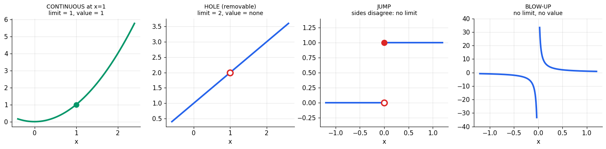

**Output**

```text
Continuity test at the marked point, demand by demand
----------------------------------------------------------------
function                 limit       value   equal?
----------------------------------------------------------------
x^2 at a=1                   1           1   True
hole at a=1                  2         nan   False  (no value)
jump at a=0               none         1.0   False  (left 0, right 1)
1/x at a=0                none        none   False
----------------------------------------------------------------
Only the first row satisfies all three demands, so only x^2 is
continuous at its marked point. The other three need the pen lifted.
```

### Cell 56

```python
# ============================================================
#  The difference quotient for f(x) = x^2 at a = 3, as h shrinks.
# ============================================================
def f_sq(xx):
    """Our concrete function: f(x) = x squared."""
    return xx ** 2

a = 3.0

print("f(x) = x^2,   a = 3")
print()
print("        h        f(a+h)          f(a)      difference        quotient")
print("  " + "-" * 74)
for hh in [1.0, 0.1, 0.01, 0.001, 0.0001]:
    top = f_sq(a + hh) - f_sq(a)
    q   = top / hh
    print(f"  {hh:>8.4f}  {f_sq(a + hh):>12.8f}  {f_sq(a):>12.8f}  "
          f"{top:>14.10f}  {q:>14.10f}")
print("  " + "-" * 74)
print("  at h = 0 exactly: (9 - 9) / 0  ->  0/0, undefined.")
print()
print("  The quotients are marching towards 6.")
print(f"  quotient at h = 0.0001 : {(f_sq(a + 1e-4) - f_sq(a)) / 1e-4:.10f}")
print(f"  distance from 6        : {(f_sq(a + 1e-4) - f_sq(a)) / 1e-4 - 6:.10f}")

# ---- why 6? expand the numerator by hand, then let sympy confirm -------
print()
print("  the algebra:")
print("    (a+h)^2 - a^2  =  a^2 + 2ah + h^2 - a^2  =  2ah + h^2")
print("    divide by h    =  2a + h                  (valid for h != 0)")
print("    let h -> 0     =  2a  =  2 * 3  =  6")
print()
quotient_sym = sp.simplify(((a + h) ** 2 - a ** 2) / h)
print("  sympy simplifies the quotient to :", quotient_sym)
print("  sympy takes the limit as h -> 0  :", sp.limit(quotient_sym, h, 0))

# ---- and the numeric check of that algebra ------------------------------
hs  = np.array([1.0, 0.1, 0.01, 0.001, 0.0001])
num = (f_sq(a + hs) - f_sq(a)) / hs
alg = 2 * a + hs
print(f"  max |numeric quotient - (2a + h)| = {np.max(np.abs(num - alg)):.2e}")
```

**Output**

```text
f(x) = x^2,   a = 3

        h        f(a+h)          f(a)      difference        quotient
  --------------------------------------------------------------------------
    1.0000   16.00000000    9.00000000    7.0000000000    7.0000000000
    0.1000    9.61000000    9.00000000    0.6100000000    6.1000000000
    0.0100    9.06010000    9.00000000    0.0601000000    6.0100000000
    0.0010    9.00600100    9.00000000    0.0060010000    6.0010000000
    0.0001    9.00060001    9.00000000    0.0006000100    6.0001000000
  --------------------------------------------------------------------------
  at h = 0 exactly: (9 - 9) / 0  ->  0/0, undefined.

  The quotients are marching towards 6.
  quotient at h = 0.0001 : 6.0001000000
  distance from 6        : 0.0001000000

  the algebra:
    (a+h)^2 - a^2  =  a^2 + 2ah + h^2 - a^2  =  2ah + h^2
    divide by h    =  2a + h                  (valid for h != 0)
    let h -> 0     =  2a  =  2 * 3  =  6

  sympy simplifies the quotient to : 1.0*h + 6.0
  sympy takes the limit as h -> 0  : 6
  max |numeric quotient - (2a + h)| = 1.21e-11
```

### Cell 59

```python
# ============================================================
#  Push h all the way down and watch the answer fall apart.
# ============================================================
TRUE = 6.0                       # we PROVED this above: 2a = 2*3
eps  = np.finfo(float).eps
print(f"machine epsilon (gap between neighbouring floats near 1) = {eps:.3e}")
print(f"gap between neighbouring floats near 3 (= a)             = "
      f"{np.spacing(3.0):.3e}")
print(f"gap between neighbouring floats near 9 (= f(a))          = "
      f"{np.spacing(9.0):.3e}")
print()

print("        h            quotient          error       what is happening")
print("  " + "-" * 78)
rows = []
for k in range(0, 17):
    hh  = 10.0 ** (-k)
    top = f_sq(a + hh) - f_sq(a)
    q   = top / hh
    err = abs(q - TRUE)
    rows.append((hh, q, err))
    if top == 0.0:
        note = "<-- numerator rounded to EXACTLY ZERO"
    elif k <= 8:
        note = "getting better"
    else:
        note = "<-- getting WORSE"
    print(f"  {hh:<10.0e}  {q:>16.10f}  {err:>13.3e}   {note}")
print("  " + "-" * 78)

hs_all = np.array([r[0] for r in rows])
errs   = np.array([r[2] for r in rows])
best_i = int(np.argmin(errs))
print(f"  BEST h    : {hs_all[best_i]:.0e}   with error {errs[best_i]:.3e}")
print(f"  sqrt(eps) : {np.sqrt(eps):.3e}   <- theory says the sweet spot is here")
print()

# ---- the one practical repair: a CENTRAL difference --------------------
# (f(a+h) - f(a-h)) / (2h) straddles the point instead of leaning one way.
#
# We switch to f(x) = x^3 at a = 2 to demonstrate it, for an honest reason:
# for a PARABOLA the central difference happens to be exactly right at every
# h, so x^2 would flatter it. A cubic is the simplest function that does not
# give it a free pass. (Try it on f_sq if you want to see the free pass.)
def f_cu(xx):
    """f(x) = x cubed. Its rate of change at x=2 turns out to be 12."""
    return xx ** 3

b, TRUE_CU = 2.0, 12.0
print("  central vs one-sided, on f(x) = x^3 at a = 2  (true answer 12)")
print("        h        one-sided error    central error")
c_rows = []
for k in range(2, 13):
    hh  = 10.0 ** (-k)
    one = abs((f_cu(b + hh) - f_cu(b)) / hh - TRUE_CU)
    cen = abs((f_cu(b + hh) - f_cu(b - hh)) / (2 * hh) - TRUE_CU)
    c_rows.append((hh, cen))
    print(f"  {hh:<10.0e}  {one:>15.3e}  {cen:>15.3e}")
c_best = min(c_rows, key=lambda r: r[1])
print(f"  best one-sided h here: 1e-08 ;  best CENTRAL h: {c_best[0]:.0e}, "
      f"error {c_best[1]:.3e}")
print(f"  eps ** (1/3) = {eps ** (1.0 / 3.0):.3e}  <- where theory puts the")
print("  central sweet spot, and the table agrees. Roughly 100x better than")
print("  the one-sided best, but the V is only moved, not removed.")
print()
print(f"  h = 1e-16 : quotient = {rows[16][1]:.6f}, error = {errs[16]:.3e}")
print(f"  Because 3 + 1e-16 rounds to {a + 1e-16!r}, the step VANISHES, the")
print(f"  numerator is exactly {f_sq(a + 1e-16) - f_sq(a)}, and the machine")
print(f"  reports a rate of change of {rows[16][1]:.1f} for a function climbing")
print("  at 6. Not approximately wrong. Wrong -- silently, with no error.")

# ---------------------------- the U-shape, drawn ------------------------
fig, ax = plt.subplots(figsize=(9, 4.8))
safe = errs > 0
ax.loglog(hs_all[safe], errs[safe], "o-", color=C_SLOPE, lw=2.2, ms=7,
          label="actual measured error", zorder=3)
ax.loglog(hs_all, hs_all, "--", color=C_APPROX, lw=1.8,
          label="truncation error (shrinks with h)")
ax.loglog(hs_all, eps * 9.0 / hs_all, "--", color=C_EXACT, lw=1.8,
          label="rounding error (grows as h shrinks)")
ax.axvline(hs_all[best_i], color=C_GREY, ls=":", lw=1.6)
ax.annotate(f"sweet spot\nh = {hs_all[best_i]:.0e}",
            xy=(hs_all[best_i], max(errs[best_i], 1e-12)),
            xytext=(hs_all[best_i] * 40, 1e-4),
            fontsize=10, color=C_GREY,
            arrowprops=dict(arrowstyle="->", color=C_GREY))
ax.set_xlabel("step size h   (h gets smaller towards the right)")
ax.set_ylabel("absolute error in the quotient")
ax.set_title("Smaller h is better -- and then suddenly it is much worse")
ax.invert_xaxis()
ax.legend(fontsize=9, loc="upper center")
fig.tight_layout()
plt.show()
```

**Output**

```text
machine epsilon (gap between neighbouring floats near 1) = 2.220e-16
gap between neighbouring floats near 3 (= a)             = 4.441e-16
gap between neighbouring floats near 9 (= f(a))          = 1.776e-15

        h            quotient          error       what is happening
  ------------------------------------------------------------------------------
  1e+00           7.0000000000      1.000e+00   getting better
  1e-01           6.1000000000      1.000e-01   getting better
  1e-02           6.0100000000      1.000e-02   getting better
  1e-03           6.0010000000      1.000e-03   getting better
  1e-04           6.0001000000      1.000e-04   getting better
  1e-05           6.0000100000      1.000e-05   getting better
  1e-06           6.0000010009      1.001e-06   getting better
  1e-07           6.0000000879      8.788e-08   getting better
  1e-08           5.9999999635      3.646e-08   getting better
  1e-09           6.0000004964      4.964e-07   <-- getting WORSE
  1e-10           6.0000004964      4.964e-07   <-- getting WORSE
  1e-11           6.0000004964      4.964e-07   <-- getting WORSE
  1e-12           6.0005334035      5.334e-04   <-- getting WORSE
  1e-13           5.9863225488      1.368e-02   <-- getting WORSE
  1e-14           6.2172489379      2.172e-01   <-- getting WORSE
  1e-15           5.3290705182      6.709e-01   <-- getting WORSE
  1e-16           0.0000000000      6.000e+00   <-- numerator rounded to EXACTLY ZERO
  ------------------------------------------------------------------------------
  BEST h    : 1e-08   with error 3.646e-08
  sqrt(eps) : 1.490e-08   <- theory says the sweet spot is here

  central vs one-sided, on f(x) = x^3 at a = 2  (true answer 12)
        h        one-sided error    central error
  1e-02             6.010e-02        1.000e-04
  1e-03             6.001e-03        1.000e-06
  1e-04             6.000e-04        1.001e-08
  1e-05             6.000e-05        2.118e-10
  1e-06             6.002e-06        7.892e-10
  1e-07             5.843e-07        6.316e-09
  1e-08             7.293e-08        1.173e-07
  1e-09             9.929e-07        9.929e-07
  1e-10             9.929e-07        9.929e-07
  1e-11             9.929e-07        9.929e-07
  1e-12             1.067e-03        1.067e-03
  best one-sided h here: 1e-08 ;  best CENTRAL h: 1e-05, error 2.118e-10
  eps ** (1/3) = 6.055e-06  <- where theory puts the
  central sweet spot, and the table agrees. Roughly 100x better than
  the one-sided best, but the V is only moved, not removed.

  h = 1e-16 : quotient = 0.000000, error = 6.000e+00
  Because 3 + 1e-16 rounds to 3.0, the step VANISHES, the
  numerator is exactly 0.0, and the machine
  reports a rate of change of 0.0 for a function climbing
  at 6. Not approximately wrong. Wrong -- silently, with no error.
```

**Output**

```text
<Figure size 900x480 with 1 Axes>
```

**Figure**

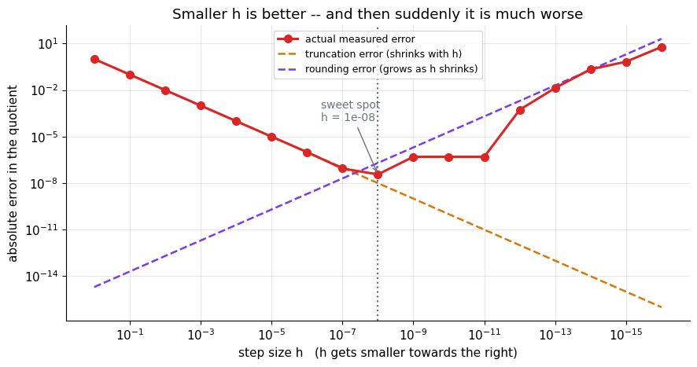

### Cell 64

```python
# ============================================================
#  Two limits at infinity: 1/x heading to 0, sigmoid heading to 0 and 1.
# ============================================================
def sigmoid(xx):
    """1 / (1 + e^-x). Squashes any real number into (0, 1)."""
    return 1.0 / (1.0 + np.exp(-xx))

print("A.  1/x  as x grows")
print("          x           1/x")
for xv in [1.0, 10.0, 1e2, 1e4, 1e8, 1e12]:
    print(f"   {xv:>12.0e}  {1.0 / xv:>12.3e}")
print("   -> heading to 0. sympy agrees:", sp.limit(1 / x, x, sp.oo))

print()
print("B.  sigmoid as x runs both ways")
print("          x       sigmoid(x)     1 - sigmoid(x)")
for xv in [0.0, 2.0, 5.0, 10.0, 20.0, 40.0]:
    print(f"   {xv:>10.1f}  {sigmoid(xv):>13.10f}  {1 - sigmoid(xv):>16.3e}")
sig_sym = 1 / (1 + sp.exp(-x))
print("   -> sympy, limit at +oo:", sp.limit(sig_sym, x, sp.oo),
      "   at -oo:", sp.limit(sig_sym, x, -sp.oo))

print()
print("C.  THE POINT: how much does sigmoid change over a step of 1?")
print("   (this is an average rate of change, exactly as in Part 1)")
print("       from x    to x+1        change")
for xv in [0.0, 2.0, 5.0, 10.0, 20.0]:
    delta = sigmoid(xv + 1) - sigmoid(xv)
    print(f"   {xv:>9.1f}  {xv + 1:>8.1f}  {delta:>12.3e}")
print()
d0, d20 = sigmoid(1) - sigmoid(0), sigmoid(21) - sigmoid(20)
print(f"   At x = 0  a unit step moves the output by {d0:.3e}")
print(f"   At x = 20 a unit step moves the output by {d20:.3e}")
print(f"   That is {d0 / d20:,.0f} times smaller. The function has gone numb.")

# ------------------------------------------------------------ the picture
fig, (ax1, ax2) = plt.subplots(1, 2, figsize=(12.5, 4.3))

xr = np.linspace(0.4, 12, 400)
ax1.plot(xr, 1.0 / xr, color=C_F, lw=2.6)
ax1.axhline(0, color=C_SLOPE, ls="--", lw=1.6)
ax1.annotate("limit = 0, never reached", xy=(11.6, 0.13), fontsize=10,
             color=C_GREY, ha="right")
ax1.set_xlabel("x")
ax1.set_ylabel("1 / x")
ax1.set_title("1/x settles on 0 as x grows")

xs2 = np.linspace(-12, 12, 600)
ax2.plot(xs2, sigmoid(xs2), color=C_F, lw=2.8)
ax2.axhline(1.0, color=C_SLOPE, ls="--", lw=1.5)
ax2.axhline(0.0, color=C_SLOPE, ls="--", lw=1.5)
ax2.axvspan(-12, -5, color=C_SOFT, zorder=0)
ax2.axvspan(5, 12, color=C_SOFT, zorder=0)
ax2.text(-8.5, 0.55, "saturated:\nnearly flat", ha="center", fontsize=9,
         color=C_GREY)
ax2.text(8.5, 0.42, "saturated:\nnearly flat", ha="center", fontsize=9,
         color=C_GREY)
ax2.set_xlabel("x")
ax2.set_ylabel("sigmoid(x)")
ax2.set_title("sigmoid settles on 0 one way and 1 the other")
ax2.set_ylim(-0.12, 1.12)

fig.tight_layout()
plt.show()
```

**Output**

```text
A.  1/x  as x grows
          x           1/x
          1e+00     1.000e+00
          1e+01     1.000e-01
          1e+02     1.000e-02
          1e+04     1.000e-04
          1e+08     1.000e-08
          1e+12     1.000e-12
   -> heading to 0. sympy agrees: 0

B.  sigmoid as x runs both ways
          x       sigmoid(x)     1 - sigmoid(x)
          0.0   0.5000000000         5.000e-01
          2.0   0.8807970780         1.192e-01
          5.0   0.9933071491         6.693e-03
         10.0   0.9999546021         4.540e-05
         20.0   0.9999999979         2.061e-09
         40.0   1.0000000000         0.000e+00
   -> sympy, limit at +oo: 1    at -oo: 0

C.  THE POINT: how much does sigmoid change over a step of 1?
   (this is an average rate of change, exactly as in Part 1)
       from x    to x+1        change
         0.0       1.0     2.311e-01
         2.0       3.0     7.178e-02
         5.0       6.0     4.220e-03
        10.0      11.0     2.870e-05
        20.0      21.0     1.303e-09

   At x = 0  a unit step moves the output by 2.311e-01
   At x = 20 a unit step moves the output by 1.303e-09
   That is 177,342,091 times smaller. The function has gone numb.
```

**Output**

```text
<Figure size 1250x430 with 2 Axes>
```

**Figure**

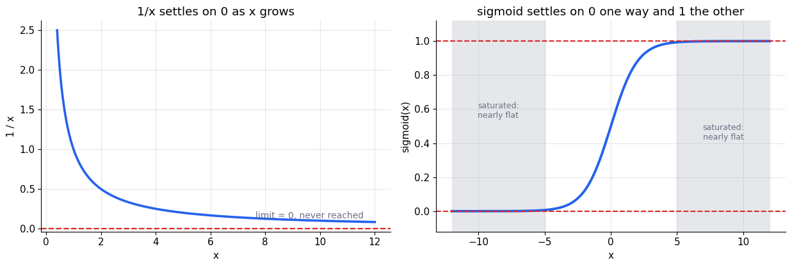

### Cell 69

```python
# ============================================================
#  Part 2's limit, recomputed -- this time at several points.
#  f(x) = x^2. For each base point a we shrink h and watch the
#  difference quotient settle.
# ============================================================
def diff_quotient(f, a, hh):
    """Average rate of change of f over the window [a, a+hh]. Part 1's secant slope."""
    return (f(a + hh) - f(a)) / hh

f_sq = lambda z: z ** 2
h_list = [1.0, 0.1, 0.01, 0.001, 1e-4, 1e-6]
a_list = [1.0, 2.0, 3.0, 4.0]

header = "     a  " + "".join(f"{hh:>12g}" for hh in h_list) + "     settles on"
print(header)
print("-" * len(header))
for a in a_list:
    row = "".join(f"{diff_quotient(f_sq, a, hh):12.6f}" for hh in h_list)
    print(f"{a:6.1f}  {row}   {2 * a:>10.1f}")

print()
print("Read the last column. a=1 -> 2,  a=2 -> 4,  a=3 -> 6,  a=4 -> 8.")
print("The limit is not one number. It is 2a: a number FOR EVERY a.")
```

**Output**

```text
     a             1         0.1        0.01       0.001      0.0001       1e-06     settles on
-----------------------------------------------------------------------------------------------
   1.0      3.000000    2.100000    2.010000    2.001000    2.000100    2.000001          2.0
   2.0      5.000000    4.100000    4.010000    4.001000    4.000100    4.000001          4.0
   3.0      7.000000    6.100000    6.010000    6.001000    6.000100    6.000001          6.0
   4.0      9.000000    8.100000    8.010000    8.001000    8.000100    8.000001          8.0

Read the last column. a=1 -> 2,  a=2 -> 4,  a=3 -> 6,  a=4 -> 8.
The limit is not one number. It is 2a: a number FOR EVERY a.
```

### Cell 74

```python
from matplotlib.colors import LinearSegmentedColormap

# ------------------------------------------------------------------
#  y = x^2, base point a = 3. Secants at shrinking h, then the tangent.
# ------------------------------------------------------------------
a0    = 3.0
f     = lambda z: z ** 2
hs    = [2.0, 1.0, 0.5, 0.25, 0.1]
xs    = np.linspace(0.6, 6.2, 400)

grad  = LinearSegmentedColormap.from_list("secant", [C_GREY, C_APPROX, C_SLOPE])
cols  = [grad(i / (len(hs) - 1)) for i in range(len(hs))]

fig, ax = plt.subplots(figsize=(10, 5.6))
ax.plot(xs, f(xs), color=C_F, lw=2.6, label="y = x squared", zorder=3)

x_line = np.linspace(1.0, 6.0, 2)
for hh, col in zip(hs, cols):
    slope = (f(a0 + hh) - f(a0)) / hh
    ax.plot(x_line, f(a0) + slope * (x_line - a0), color=col, lw=1.9, alpha=0.95,
            label=f"secant, h = {hh:g}   slope = {slope:.2f}", zorder=2)
    ax.plot([a0 + hh], [f(a0 + hh)], "o", color=col, ms=7, zorder=4)

# the tangent: the limit these secants are converging to
ax.plot(x_line, f(a0) + 6.0 * (x_line - a0), color=C_EXACT, lw=2.6, ls="--",
        label="tangent, slope = 6  (the derivative)", zorder=5)
ax.plot([a0], [f(a0)], "o", color=C_EXACT, ms=11, zorder=6)
ax.annotate("the point we are asking about:  a = 3", xy=(a0, f(a0)),
            xytext=(3.5, 3.0), color=C_EXACT, fontsize=10,
            arrowprops=dict(arrowstyle="->", color=C_EXACT))

ax.set_xlim(0.6, 6.2); ax.set_ylim(-2, 40)
ax.set_xlabel("x"); ax.set_ylabel("y")
ax.set_title("Secants pivoting onto the tangent as h shrinks")
ax.legend(loc="upper left", fontsize=9, framealpha=0.95)
fig.tight_layout(); plt.show()

print("     h        second point       secant slope     distance from 6")
print("-" * 66)
for hh in hs:
    s = (f(a0 + hh) - f(a0)) / hh
    print(f"{hh:6.2f}    ({a0 + hh:.2f}, {f(a0 + hh):6.2f})    {s:12.4f}    {abs(s - 6):12.4f}")
for hh in [0.01, 1e-4, 1e-6]:
    s = (f(a0 + hh) - f(a0)) / hh
    print(f"{hh:6.0e}    ({a0 + hh:.6f}, {f(a0 + hh):.6f})  {s:12.6f}    {abs(s - 6):12.2e}")
print()
print("Every secant slope here is exactly 6 + h. The picture and the algebra")
print("agree, and both say the same thing: as h vanishes, the slope is 6.")
```

**Output**

```text
<Figure size 1000x560 with 1 Axes>
```

**Figure**

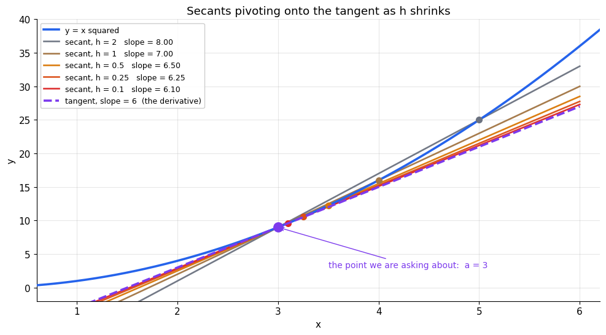

**Output**

```text
     h        second point       secant slope     distance from 6
------------------------------------------------------------------
  2.00    (5.00,  25.00)          8.0000          2.0000
  1.00    (4.00,  16.00)          7.0000          1.0000
  0.50    (3.50,  12.25)          6.5000          0.5000
  0.25    (3.25,  10.56)          6.2500          0.2500
  0.10    (3.10,   9.61)          6.1000          0.1000
 1e-02    (3.010000, 9.060100)      6.010000        1.00e-02
 1e-04    (3.000100, 9.000600)      6.000100        1.00e-04
 1e-06    (3.000001, 9.000006)      6.000001        1.00e-06

Every secant slope here is exactly 6 + h. The picture and the algebra
agree, and both say the same thing: as h vanishes, the slope is 6.
```

### Cell 77

```python
# ============================================================
#  Confirm a by-hand derivation TWO independent ways:
#    (a) symbolically -- let sympy take the same limit
#    (b) numerically  -- measure the slope with real numbers
#  If our algebra were wrong, at least one of these would disagree.
# ============================================================
def confirm(label, f_expr, claimed, points, h_small=1e-6):
    """Check that d/dx f_expr equals `claimed`, symbolically and numerically."""
    quotient  = (f_expr.subs(x, x + h) - f_expr) / h        # the definition itself
    from_lim  = sp.simplify(sp.limit(quotient, h, 0))       # sympy takes the limit
    agree_sym = sp.simplify(from_lim - claimed) == 0

    print(f"{label}")
    print(f"   difference quotient      : {sp.simplify(quotient)}")
    print(f"   its limit as h -> 0      : {from_lim}          (sympy)")
    print(f"   what we derived by hand  : {claimed}")
    print(f"   symbolic agreement       : {agree_sym}")
    print(f"   sympy's own diff()       : {sp.diff(f_expr, x)}")
    print()

    f_num, d_num = sp.lambdify(x, f_expr, "numpy"), sp.lambdify(x, claimed, "numpy")
    print(f"   {'x':>7} {'slope measured':>16} {'our formula':>14} {'gap':>11}")
    worst = 0.0
    for a in points:
        measured = (f_num(a + h_small) - f_num(a - h_small)) / (2 * h_small)
        ours     = float(d_num(a))
        worst    = max(worst, abs(measured - ours))
        print(f"   {a:7.2f} {measured:16.8f} {ours:14.8f} {abs(measured - ours):11.2e}")
    print(f"   largest disagreement     : {worst:.2e}  (this is float noise, not error)")
    return agree_sym, worst


ok1, gap1 = confirm("f(x) = x**2   ->  we claim f'(x) = 2*x",
                    x**2, 2*x, [-3.0, -1.0, 0.5, 3.0, 7.0])
```

**Output**

```text
f(x) = x**2   ->  we claim f'(x) = 2*x
   difference quotient      : h + 2*x
   its limit as h -> 0      : 2*x          (sympy)
   what we derived by hand  : 2*x
   symbolic agreement       : True
   sympy's own diff()       : 2*x

         x   slope measured    our formula         gap
     -3.00      -6.00000000    -6.00000000    8.39e-10
     -1.00      -2.00000000    -2.00000000    2.00e-12
      0.50       1.00000000     1.00000000    1.29e-11
      3.00       6.00000000     6.00000000    8.39e-10
      7.00      14.00000000    14.00000000    3.73e-09
   largest disagreement     : 3.73e-09  (this is float noise, not error)
```

### Cell 80

```python
ok2, gap2 = confirm("f(x) = x**3   ->  we claim f'(x) = 3*x**2",
                    x**3, 3*x**2, [-2.0, -0.5, 1.0, 2.5, 4.0])

# And a direct look at the "junk terms die" claim, with numbers:
print()
print("The leftovers 3xh + h^2 at x = 2, as h shrinks:")
for hh in [1.0, 0.1, 0.01, 1e-3, 1e-4]:
    quot = ((2 + hh)**3 - 2**3) / hh
    print(f"   h = {hh:<8g} quotient = {quot:12.8f}   "
          f"= 12 + {3*2*hh + hh**2:.8f}   (junk = 3xh + h^2)")
print(f"   h -> 0     quotient -> {3 * 2**2:.8f}   = 3x^2 at x = 2")
```

**Output**

```text
f(x) = x**3   ->  we claim f'(x) = 3*x**2
   difference quotient      : (-x**3 + (h + x)**3)/h
   its limit as h -> 0      : 3*x**2          (sympy)
   what we derived by hand  : 3*x**2
   symbolic agreement       : True
   sympy's own diff()       : 3*x**2

         x   slope measured    our formula         gap
     -2.00      12.00000000    12.00000000    7.89e-10
     -0.50       0.75000000     0.75000000    7.50e-13
      1.00       3.00000000     3.00000000    8.03e-11
      2.50      18.75000000    18.75000000    2.40e-09
      4.00      48.00000000    48.00000000    3.16e-09
   largest disagreement     : 3.16e-09  (this is float noise, not error)

The leftovers 3xh + h^2 at x = 2, as h shrinks:
   h = 1        quotient =  19.00000000   = 12 + 7.00000000   (junk = 3xh + h^2)
   h = 0.1      quotient =  12.61000000   = 12 + 0.61000000   (junk = 3xh + h^2)
   h = 0.01     quotient =  12.06010000   = 12 + 0.06010000   (junk = 3xh + h^2)
   h = 0.001    quotient =  12.00600100   = 12 + 0.00600100   (junk = 3xh + h^2)
   h = 0.0001   quotient =  12.00060001   = 12 + 0.00060001   (junk = 3xh + h^2)
   h -> 0     quotient -> 12.00000000   = 3x^2 at x = 2
```

### Cell 83

```python
ok3, gap3 = confirm("f(x) = 1/x    ->  we claim f'(x) = -1/x**2",
                    1/x, -1/x**2, [-3.0, -0.5, 0.5, 2.0, 5.0])

# The common-denominator step, checked with plain numbers at x = 2, h = 0.1:
xv, hv = 2.0, 0.1
lhs = (1/(xv + hv) - 1/xv) / hv                # what the definition literally says
rhs = -1 / (xv * (xv + hv))                    # what Step 4 says it equals
print()
print("Step-by-step algebra, checked arithmetically at x = 2, h = 0.1:")
print(f"   definition, computed directly : {lhs:.12f}")
print(f"   our Step 4 expression -1/(x(x+h)) : {rhs:.12f}")
print(f"   difference                    : {abs(lhs - rhs):.2e}   <- the algebra is exact")
print(f"   and as h -> 0 this becomes -1/x^2 = {-1/xv**2:.6f}")
```

**Output**

```text
f(x) = 1/x    ->  we claim f'(x) = -1/x**2
   difference quotient      : -1/(x*(h + x))
   its limit as h -> 0      : -1/x**2          (sympy)
   what we derived by hand  : -1/x**2
   symbolic agreement       : True
   sympy's own diff()       : -1/x**2

         x   slope measured    our formula         gap
     -3.00      -0.11111111    -0.11111111    6.28e-12
     -0.50      -4.00000000    -4.00000000    4.00e-12
      0.50      -4.00000000    -4.00000000    4.00e-12
      2.00      -0.25000000    -0.25000000    2.06e-11
      5.00      -0.04000000    -0.04000000    6.70e-12
   largest disagreement     : 2.06e-11  (this is float noise, not error)

Step-by-step algebra, checked arithmetically at x = 2, h = 0.1:
   definition, computed directly : -0.238095238095
   our Step 4 expression -1/(x(x+h)) : -0.238095238095
   difference                    : 2.78e-16   <- the algebra is exact
   and as h -> 0 this becomes -1/x^2 = -0.250000
```

### Cell 88

```python
# ------------------------------------------------------------------
#  f and f' on shared axes. f rises where f' is positive, falls where
#  f' is negative, and levels off exactly where f' crosses zero.
# ------------------------------------------------------------------
xs   = np.linspace(-2.2, 2.2, 500)
fx   = xs**3 - 3*xs            # f
dfx  = 3*xs**2 - 3             # f', by the pattern above (proved in Part 4)
turn = np.array([-1.0, 1.0])   # where 3x^2 - 3 = 0

fig, (axU, axL) = plt.subplots(2, 1, figsize=(9.5, 7), sharex=True,
                               gridspec_kw=dict(height_ratios=[1.15, 1]))

axU.plot(xs, fx, color=C_F, lw=2.6)
axU.plot(turn, turn**3 - 3*turn, "o", color=C_EXACT, ms=10, zorder=5)
axU.axhline(0, color=C_GREY, lw=0.8)
axU.fill_between(xs, fx.min() - 1, fx.max() + 1, where=(dfx > 0),
                 color=C_AREA, alpha=0.07)
axU.set_ylim(fx.min() - 1, fx.max() + 1)
axU.set_ylabel("f(x)")
axU.set_title("f(x) = x cubed minus 3x        (shaded = f is rising)")
axU.annotate("hill: flat here", xy=(-1, 2), xytext=(-2.1, 3.2), fontsize=10,
             color=C_EXACT, arrowprops=dict(arrowstyle="->", color=C_EXACT))
axU.annotate("valley: flat here", xy=(1, -2), xytext=(1.15, -3.6), fontsize=10,
             color=C_EXACT, arrowprops=dict(arrowstyle="->", color=C_EXACT))

axL.plot(xs, dfx, color=C_SLOPE, lw=2.6)
axL.axhline(0, color=C_GREY, lw=1.2)
axL.plot(turn, 0 * turn, "o", color=C_EXACT, ms=10, zorder=5)
axL.fill_between(xs, 0, dfx, where=(dfx > 0), color=C_AREA, alpha=0.18)
axL.fill_between(xs, 0, dfx, where=(dfx < 0), color=C_SLOPE, alpha=0.12)
axL.set_xlabel("x"); axL.set_ylabel("f'(x)")
axL.set_title("its derivative  f'(x) = 3x squared minus 3")

for a in (axU, axL):
    for tv in turn:
        a.axvline(tv, color=C_EXACT, ls=":", lw=1.4)
fig.tight_layout(); plt.show()

# Does f' really vanish at the turning points? Measure, do not assume.
print("     x     f(x)        f'(x) formula   f'(x) measured")
print("-" * 56)
for a in [-2.0, -1.0, 0.0, 1.0, 2.0]:
    meas = ((a + 1e-6)**3 - 3*(a + 1e-6) - ((a - 1e-6)**3 - 3*(a - 1e-6))) / 2e-6
    print(f"  {a:5.1f}  {a**3 - 3*a:9.4f}   {3*a**2 - 3:13.6f}   {meas:14.6f}")
print()
print("f' is zero at x = -1 and x = +1 -- exactly the hill and the valley.")
print("f' is negative between them -- exactly where f is falling.")
```

**Output**

```text
<Figure size 950x700 with 2 Axes>
```

**Figure**

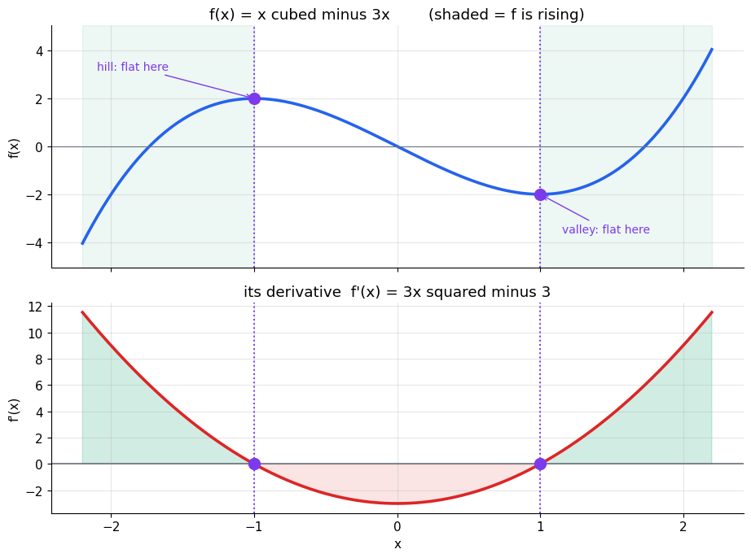

**Output**

```text
     x     f(x)        f'(x) formula   f'(x) measured
--------------------------------------------------------
   -2.0    -2.0000        9.000000         9.000000
   -1.0     2.0000        0.000000         0.000000
    0.0     0.0000       -3.000000        -3.000000
    1.0    -2.0000        0.000000         0.000000
    2.0     2.0000        9.000000         9.000000

f' is zero at x = -1 and x = +1 -- exactly the hill and the valley.
f' is negative between them -- exactly where f is falling.
```

### Cell 94

```python
# ------------------------------------------------------------------
#  Four ways a derivative can fail to exist, at x = 0 in each case.
# ------------------------------------------------------------------
xs = np.linspace(-1, 1, 801)
xs = xs[np.abs(xs) > 1e-12]          # keep 0 out of the plotted grid

panels = [
    ("CORNER:  |x|",            np.abs(xs),                          "slopes -1 and +1 disagree"),
    ("CUSP:  x^(2/3)",          np.abs(xs) ** (2/3),                 "slopes run to -inf and +inf"),
    ("VERTICAL TANGENT:  x^(1/3)", np.sign(xs) * np.abs(xs) ** (1/3), "both sides agree on +inf"),
    ("JUMP:  step function",    np.where(xs < 0, -0.5, 0.5),         "not even continuous"),
]

fig, axes = plt.subplots(1, 4, figsize=(15, 3.8))
for ax, (title, ys, why) in zip(axes, panels):
    if "JUMP" in title:                       # draw the two branches separately
        ax.plot(xs[xs < 0], ys[xs < 0], color=C_F, lw=2.6)
        ax.plot(xs[xs > 0], ys[xs > 0], color=C_F, lw=2.6)
    else:
        ax.plot(xs, ys, color=C_F, lw=2.6)
    ax.plot([0], [0 if "JUMP" not in title else 0], "x", color=C_SLOPE, ms=12, mew=3)
    ax.axvline(0, color=C_GREY, ls=":", lw=1.2)
    ax.set_title(title, fontsize=10)
    ax.set_xlabel(why, fontsize=9, color=C_SLOPE)
    ax.set_ylim(-1.1, 1.35)
fig.suptitle("No derivative at x = 0", fontsize=12)
fig.tight_layout(); plt.show()

# The corner, in numbers: the one-sided difference quotients for |x| at a = 0.
print("f(x) = |x|,  a = 0.   Difference quotient (|0+h| - |0|)/h = |h|/h :")
print(f"   {'h':>10} {'quotient':>12}      {'h':>10} {'quotient':>12}")
print("-" * 56)
for hh in [1.0, 0.1, 0.01, 1e-4, 1e-8]:
    right = (abs(0 + hh) - abs(0)) / hh
    left  = (abs(0 - hh) - abs(0)) / (-hh)
    print(f"   {hh:>10g} {right:12.1f}      {-hh:>10g} {left:12.1f}")
print()
print("From the right the answer is +1, no matter how small h gets.")
print("From the left  the answer is -1, no matter how small h gets.")
print("They never meet, so the limit does not exist, so f'(0) does not exist.")
print()
print("Everywhere ELSE, though, |x| is perfectly differentiable:")
for a in [-2.0, -0.5, 0.5, 2.0]:
    print(f"   f'({a:+.1f}) = {(abs(a + 1e-7) - abs(a - 1e-7)) / 2e-7:+.1f}")
```

**Output**

```text
<Figure size 1500x380 with 4 Axes>
```

**Figure**

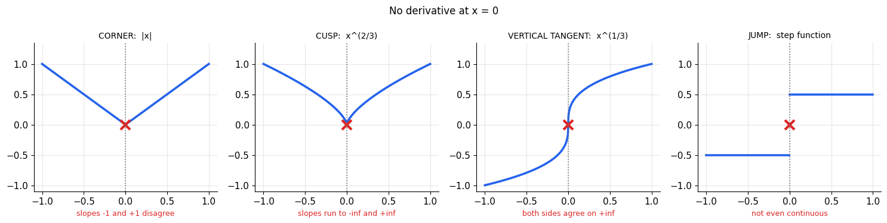

**Output**

```text
f(x) = |x|,  a = 0.   Difference quotient (|0+h| - |0|)/h = |h|/h :
            h     quotient               h     quotient
--------------------------------------------------------
            1          1.0              -1         -1.0
          0.1          1.0            -0.1         -1.0
         0.01          1.0           -0.01         -1.0
       0.0001          1.0         -0.0001         -1.0
        1e-08          1.0          -1e-08         -1.0

From the right the answer is +1, no matter how small h gets.
From the left  the answer is -1, no matter how small h gets.
They never meet, so the limit does not exist, so f'(0) does not exist.

Everywhere ELSE, though, |x| is perfectly differentiable:
   f'(-2.0) = -1.0
   f'(-0.5) = -1.0
   f'(+0.5) = +1.0
   f'(+2.0) = +1.0
```

### Cell 98

```python
# ReLU and its derivative, the convention frameworks actually use.
def relu(z):        return np.maximum(0.0, z)
def relu_prime(z):  return np.where(z > 0, 1.0, 0.0)   # note: > not >=  -> f'(0) = 0

zz = np.linspace(-2, 2, 401)
fig, (a1, a2) = plt.subplots(1, 2, figsize=(11, 3.4))
a1.plot(zz, relu(zz), color=C_F, lw=2.8); a1.set_title("ReLU(x) = max(0, x)")
a2.step(zz, relu_prime(zz), where="post", color=C_SLOPE, lw=2.8)
a2.set_title("its derivative: 1 on the right, 0 on the left")
a2.set_ylim(-0.2, 1.25)
for a in (a1, a2):
    a.axvline(0, color=C_GREY, ls=":", lw=1.2); a.set_xlabel("x")
a1.plot([0], [0], "o", color=C_SLOPE, ms=9)
fig.tight_layout(); plt.show()

print("One-sided difference quotients for ReLU at x = 0:")
for hh in [1.0, 0.01, 1e-6]:
    print(f"   h = {hh:>8g}: from the right {(relu(hh) - relu(0)) / hh + 0.0:.1f}   "
          f"from the left {(relu(-hh) - relu(0)) / (-hh) + 0.0:.1f}")
print()
print(f"Undefined at 0. Frameworks return {relu_prime(0.0):.0f} by convention.")
print(f"Away from the corner there is no ambiguity: f'(-1) = {relu_prime(-1.0):.0f}, "
      f"f'(+1) = {relu_prime(1.0):.0f}.")
```

**Output**

```text
<Figure size 1100x340 with 2 Axes>
```

**Figure**

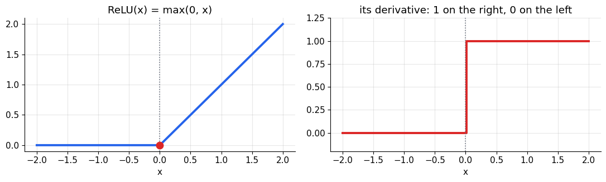

**Output**

```text
One-sided difference quotients for ReLU at x = 0:
   h =        1: from the right 1.0   from the left 0.0
   h =     0.01: from the right 1.0   from the left 0.0
   h =    1e-06: from the right 1.0   from the left 0.0

Undefined at 0. Frameworks return 0 by convention.
Away from the corner there is no ambiguity: f'(-1) = 0, f'(+1) = 1.
```

### Cell 101

```python
# ============================================================
#  Differentiate the measured position to recover the speed --
#  and check it against the truth we happen to have.
# ============================================================
v_est = np.gradient(pos_m, t_sec)      # numerical derivative of position
err   = np.abs(v_est - v_true)

fig, (axA, axB) = plt.subplots(2, 1, figsize=(10, 6.4), sharex=True,
                               gridspec_kw=dict(height_ratios=[2.4, 1]))

axA.plot(t_sec, v_true, color=C_SLOPE, lw=4.0, alpha=0.35,
         label="v_true: the speed the journey was built from")
axA.plot(t_sec, v_est, color=C_EXACT, lw=1.8, ls="--",
         label="d(position)/dt, computed from pos_m alone")
axA.set_ylabel("speed (m/s)")
axA.set_title("The derivative of position IS the speed")
axA.legend(loc="lower center", fontsize=10)

axB.plot(t_sec, err, color=C_APPROX, lw=1.8)
axB.set_xlabel("time (seconds)"); axB.set_ylabel("|error| (m/s)")
axB.set_title("how far apart they are")
fig.tight_layout(); plt.show()

i_all, i_in = int(err.argmax()), int(err[1:-1].argmax()) + 1
print(f"max absolute error, whole journey  : {err.max():.6f} m/s   at t = {t_sec[i_all]:.0f} s")
print(f"max absolute error, interior only  : {err[i_in]:.6f} m/s   at t = {t_sec[i_in]:.0f} s")
print(f"mean absolute error                : {err.mean():.6f} m/s")
print(f"top speed for scale                : {v_true.max():.3f} m/s")
print(f"worst error as a share of top speed: {100 * err.max() / v_true.max():.3f} %")
print()
print("The single worst point is t = 0 s -- an EDGE. There is no reading before")
print("it, so np.gradient cannot use a symmetric window there and falls back to a")
print("one-sided one, which is exactly the cruder approximation we drew earlier.")
print()
# Inside, does the error track how hard the speed is CURVING?
# Measure the curvature INDEPENDENTLY -- from speed_mps on a much finer grid,
# so this is a genuine second opinion and not the same subtraction twice.
eps  = 0.01
curv = np.abs((speed_mps(t_sec + eps) - 2 * speed_mps(t_sec)
               + speed_mps(t_sec - eps)) / eps**2)               # |v''|, fine grid
order = np.argsort(err[1:-1])[::-1][:5] + 1
print("The five worst INTERIOR moments, against how hard the speed is curving:")
print(f"   {'t (s)':>7} {'|error|':>10} {'|v curvature|':>15} {'ratio':>9}")
for k in order:
    print(f"   {t_sec[k]:7.0f} {err[k]:10.5f} {curv[k]:15.5f} {err[k]/curv[k]:9.4f}")
print(f"   correlation of |error| with curvature, interior only : "
      f"{np.corrcoef(err[1:-1], curv[1:-1])[0, 1]:.4f}")
ratio = (err[1:-1] / curv[1:-1]).mean()
print(f"   mean ratio |error| / |v''| : {ratio:.4f}   vs theory 1/4 = 0.2500")
print("   -- so the error is not merely CORRELATED with curvature, it is")
print("      curvature divided by four, which is what the algebra predicts for")
print("      a symmetric one-second difference. Curvature was measured here on a")
print("      0.01 s grid, independently of anything np.gradient did.")
print()
print("They cluster around t = 7-18 s: the pull-away, where the speed is bending")
print("hardest. Not the bend at t = 55 s -- that dip is deep but gentle. A")
print("one-second window cannot follow a curve that turns inside one second;")
print("wherever the speed is straight or steady, the error is near zero.")
```

**Output**

```text
<Figure size 1000x640 with 2 Axes>
```

**Figure**

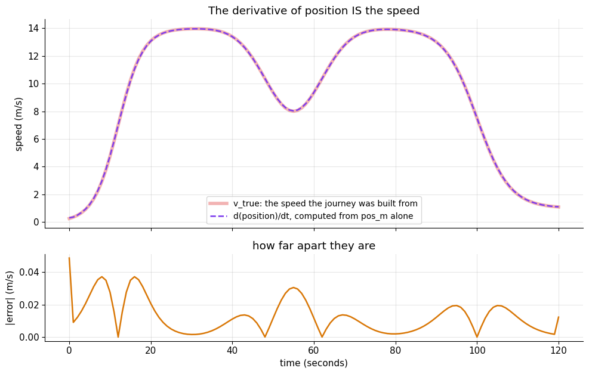

**Output**

```text
max absolute error, whole journey  : 0.048568 m/s   at t = 0 s
max absolute error, interior only  : 0.037077 m/s   at t = 16 s
mean absolute error                : 0.012635 m/s
top speed for scale                : 13.958 m/s
worst error as a share of top speed: 0.348 %

The single worst point is t = 0 s -- an EDGE. There is no reading before
it, so np.gradient cannot use a symmetric window there and falls back to a
one-sided one, which is exactly the cruder approximation we drew earlier.

The five worst INTERIOR moments, against how hard the speed is curving:
     t (s)    |error|   |v curvature|     ratio
        16    0.03708         0.14966    0.2477
         8    0.03708         0.14966    0.2477
        17    0.03526         0.14182    0.2486
         7    0.03526         0.14182    0.2486
        15    0.03489         0.14133    0.2469
   correlation of |error| with curvature, interior only : 1.0000
   mean ratio |error| / |v''| : 0.2967   vs theory 1/4 = 0.2500
   -- so the error is not merely CORRELATED with curvature, it is
      curvature divided by four, which is what the algebra predicts for
      a symmetric one-second difference. Curvature was measured here on a
      0.01 s grid, independently of anything np.gradient did.

They cluster around t = 7-18 s: the pull-away, where the speed is bending
hardest. Not the bend at t = 55 s -- that dip is deep but gentle. A
one-second window cannot follow a curve that turns inside one second;
wherever the speed is straight or steady, the error is near zero.
```

### Cell 106

```python
# ============================================================
#  The verification harness. Every rule in Part 4 goes through this.
# ============================================================
RULE_CHECKS = []   # (name, expression, derivative, worst relative gap, passed?)


def num_deriv(f, a, step=1e-5):
    """Derivative of f at a, from numbers only -- no calculus rules used.

    The CENTRAL difference. It looks one step forward and one step back and
    splits the difference, which makes the leading error proportional to
    step**2 rather than step, so it is far more accurate than the one-sided
    version we used in Part 3 for the same size of step.
    """
    return (f(a + step) - f(a - step)) / (2.0 * step)


def verify(name, expr, points, var=None, tol=1e-6):
    """Differentiate `expr` with sympy, then check it against num_deriv.

    Records the result in RULE_CHECKS and returns the symbolic derivative,
    so a cell can both use the answer and have it audited in one line.
    """
    var = x if var is None else var
    expr = sp.sympify(expr)
    d = sp.diff(expr, var)

    f_num = sp.lambdify(var, expr, "numpy")
    d_num = sp.lambdify(var, d,    "numpy")

    worst = 0.0
    for a in points:
        a = float(a)
        approx = float(num_deriv(f_num, a))
        exact  = float(d_num(a))
        # relative gap, softened by 1 so a derivative of 0 does not blow up
        worst = max(worst, abs(approx - exact) / (1.0 + abs(exact)))

    passed = worst < tol
    RULE_CHECKS.append((name, str(expr), str(d), worst, passed))
    return d


def from_definition(expr, var=None):
    """The Part 3 definition itself, evaluated symbolically:

           lim          f(x+h) - f(x)
          h -> 0        -------------
                              h

    Used below to DERIVE each rule rather than to look it up.
    """
    var = x if var is None else var
    expr = sp.sympify(expr)
    return sp.simplify(sp.limit((expr.subs(var, var + h) - expr) / h, h, 0))


# --- warm up on something Part 3 already did by hand -------------------
d_from_def = from_definition(x**2)
d_checked  = verify("warm-up  x**2", x**2, [-2.0, 0.5, 3.0])

print("Part 3 derived  d/dx x^2  by hand and got 2x.")
print(f"  from the definition, symbolically : {d_from_def}")
print(f"  sympy's own differentiation       : {d_checked}")
print(f"  numerically at x = 3              : {num_deriv(lambda v: v**2, 3.0):.9f}")
print(f"  what 2x says at x = 3             : {2 * 3.0:.9f}")
print()
print("Three independent routes, one answer. That is the standard for this part.")
```

**Output**

```text
Part 3 derived  d/dx x^2  by hand and got 2x.
  from the definition, symbolically : 2*x
  sympy's own differentiation       : 2*x
  numerically at x = 3              : 6.000000000
  what 2x says at x = 3             : 6.000000000

Three independent routes, one answer. That is the standard for this part.
```

### Cell 108

```python
# ============================================================
#  4.1 -- the easy three, derived and checked
# ============================================================
F, G = sp.Function("f"), sp.Function("g")   # ABSTRACT functions: no formulas
c    = sp.Symbol("c", real=True)

print("STEP 1 -- are the regroupings identities? (sympy must print 0)")

const_mult_gap = sp.simplify((c*F(x + h) - c*F(x)) - c*(F(x + h) - F(x)))
sum_gap        = sp.simplify(((F(x + h) + G(x + h)) - (F(x) + G(x)))
                             - ((F(x + h) - F(x)) + (G(x + h) - G(x))))

print(f"  constant multiple regrouping : {const_mult_gap}")
print(f"  sum regrouping               : {sum_gap}")
print("  -> both zero, for functions sympy knows nothing about. The steps hold.")
print()

print("STEP 2 -- take the limit in the definition, on concrete functions")
print(f"  d/dx of the constant 7        = {from_definition(sp.Integer(7))}")
print(f"  d/dx sin(x)                   = {from_definition(sp.sin(x))}")
print(f"  d/dx [5*sin(x)]               = {from_definition(5*sp.sin(x))}"
      f"      (= 5 x the line above)")
print(f"  d/dx [sin(x) + x**3]          = {from_definition(sp.sin(x) + x**3)}")
print(f"  d/dx sin(x) + d/dx x**3       = "
      f"{sp.simplify(from_definition(sp.sin(x)) + from_definition(x**3))}")
print()

print("STEP 3 -- audit each one against raw numbers")
pts = [-1.7, 0.4, 2.3]
verify("4.1 constant  7",            sp.Integer(7),        pts)
verify("4.1 const mult  5*sin(x)",   5*sp.sin(x),          pts)
verify("4.1 sum  sin(x) + x**3",     sp.sin(x) + x**3,     pts)
verify("4.1 combo  3*x**2 - 4*x + 9", 3*x**2 - 4*x + 9,    pts)
for nm, e, d, w, ok in RULE_CHECKS[-4:]:
    print(f"  {'PASS' if ok else 'FAIL'}  {nm:<28}  d/dx = {d:<28}  gap {w:.2e}")
```

**Output**

```text
STEP 1 -- are the regroupings identities? (sympy must print 0)
  constant multiple regrouping : 0
  sum regrouping               : 0
  -> both zero, for functions sympy knows nothing about. The steps hold.

STEP 2 -- take the limit in the definition, on concrete functions
  d/dx of the constant 7        = 0
  d/dx sin(x)                   = cos(x)
  d/dx [5*sin(x)]               = 5*cos(x)      (= 5 x the line above)
  d/dx [sin(x) + x**3]          = 3*x**2 + cos(x)
  d/dx sin(x) + d/dx x**3       = 3*x**2 + cos(x)

STEP 3 -- audit each one against raw numbers
  PASS  4.1 constant  7               d/dx = 0                             gap 0.00e+00
  PASS  4.1 const mult  5*sin(x)      d/dx = 5*cos(x)                      gap 1.32e-11
  PASS  4.1 sum  sin(x) + x**3        d/dx = 3*x**2 + cos(x)               gap 3.56e-11
  PASS  4.1 combo  3*x**2 - 4*x + 9   d/dx = 6*x - 4                       gap 1.65e-11
```

### Cell 110

```python
# ============================================================
#  4.2a -- the binomial expansion, and watching the h-terms die
# ============================================================
n_demo = 5
expansion = sp.expand((x + h)**n_demo)
print(f"(x + h)**{n_demo}  expanded:")
print(f"    {expansion}")
print()

# subtract x**n and divide by h -- exactly the definition's numerator
quotient = sp.expand(sp.cancel((expansion - x**n_demo) / h))
print(f"After subtracting x**{n_demo} and dividing by h:")
print(f"    {quotient}")
print()

# split that into "the term with no h" and "everything else"
poly_in_h = sp.Poly(quotient, h)
survivor  = poly_in_h.coeff_monomial(1)               # the h**0 term
leftover  = sp.expand(quotient - survivor)
print("Grouped by how many h's each term carries:")
for power in range(poly_in_h.degree() + 1):
    coeff = poly_in_h.coeff_monomial(h**power) if power else survivor
    fate  = "SURVIVES the limit" if power == 0 else f"-> 0  (carries h**{power})"
    print(f"    h**{power} term : {str(coeff):<12}  {fate}")
print()
print(f"So the limit is {survivor}, and the rule claims {n_demo}*x**{n_demo - 1}"
      f"  ->  difference = {sp.simplify(survivor - n_demo*x**(n_demo - 1))}")
print()

print("The same derivation, run from the definition for n = 1 .. 7:")
for n_int in range(1, 8):
    derived = from_definition(x**n_int)
    claimed = n_int * x**(n_int - 1)
    agree   = sp.simplify(derived - claimed) == 0
    print(f"    n = {n_int}:  limit gives {str(derived):<16}"
          f" rule says {str(claimed):<16} {'OK' if agree else 'MISMATCH'}")
    verify(f"4.2 power  x**{n_int}", x**n_int, [-1.4, 0.7, 2.1])

# ---- picture: the leftover terms really do go to zero, linearly in h -----
x0 = 1.3
f5 = lambda v: v**n_demo
hs = np.logspace(-1, -6, 40)
quot = (f5(x0 + hs) - f5(x0)) / hs          # the raw difference quotient
lead = n_demo * x0**(n_demo - 1)            # what the rule predicts
rest = quot - lead                          # everything that carries an h

fig, (axA, axB) = plt.subplots(1, 2, figsize=(12, 4.2))

axA.semilogx(hs, quot, "o-", color=C_APPROX, ms=4, label="difference quotient")
axA.axhline(lead, color=C_EXACT, lw=2.2, ls="--",
            label=f"n * x^(n-1) = {lead:.3f}")
axA.set_xlabel("window width h  (log scale, shrinking to the right)")
axA.set_ylabel("value")
axA.set_title(f"n = {n_demo}, x = {x0}: the quotient settles onto the rule")
axA.invert_xaxis()
axA.legend(fontsize=9)

axB.loglog(hs, np.abs(rest), "o-", color=C_SLOPE, ms=4,
           label="size of the leftover h-terms")
axB.loglog(hs, np.abs(rest[0] / hs[0]) * hs, ls=":", color=C_GREY,
           label="a straight line proportional to h")
axB.set_xlabel("window width h")
axB.set_ylabel("how far off the rule is")
axB.set_title("The leftover shrinks in step with h -- so at h = 0 it is gone")
axB.legend(fontsize=9)

fig.tight_layout()
plt.show()

print(f"leftover at h = 1e-1 : {abs(rest[0]):.3e}")
print(f"leftover at h = 1e-6 : {abs(rest[-1]):.3e}")
print(f"ratio                : {abs(rest[0]) / abs(rest[-1]):.2e} times smaller, "
      f"for an h that shrank by 1.00e+05.")
print("The leftover tracks h one for one -- so at h = 0 there is nothing left of it.")
```

**Output**

```text
(x + h)**5  expanded:
    h**5 + 5*h**4*x + 10*h**3*x**2 + 10*h**2*x**3 + 5*h*x**4 + x**5

After subtracting x**5 and dividing by h:
    h**4 + 5*h**3*x + 10*h**2*x**2 + 10*h*x**3 + 5*x**4

Grouped by how many h's each term carries:
    h**0 term : 5*x**4        SURVIVES the limit
    h**1 term : 10*x**3       -> 0  (carries h**1)
    h**2 term : 10*x**2       -> 0  (carries h**2)
    h**3 term : 5*x           -> 0  (carries h**3)
    h**4 term : 1             -> 0  (carries h**4)

So the limit is 5*x**4, and the rule claims 5*x**4  ->  difference = 0

The same derivation, run from the definition for n = 1 .. 7:
    n = 1:  limit gives 1                rule says 1                OK
    n = 2:  limit gives 2*x              rule says 2*x              OK
    n = 3:  limit gives 3*x**2           rule says 3*x**2           OK
    n = 4:  limit gives 4*x**3           rule says 4*x**3           OK
    n = 5:  limit gives 5*x**4           rule says 5*x**4           OK
    n = 6:  limit gives 6*x**5           rule says 6*x**5           OK
    n = 7:  limit gives 7*x**6           rule says 7*x**6           OK
```

**Output**

```text
<Figure size 1200x420 with 2 Axes>
```

**Figure**

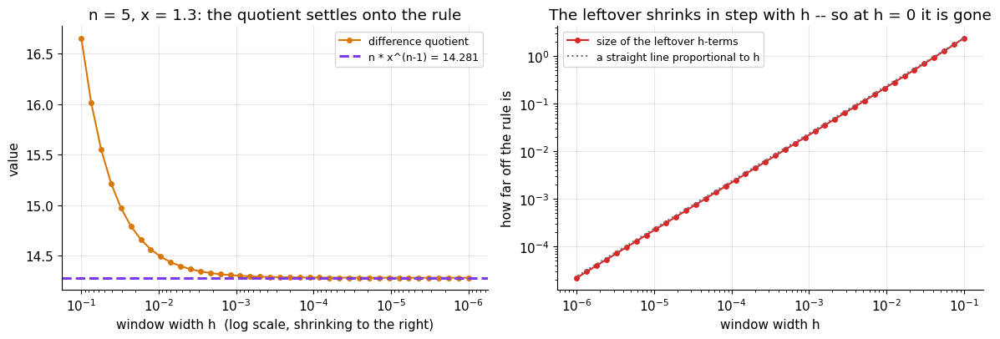

**Output**

```text
leftover at h = 1e-1 : 2.373e+00
leftover at h = 1e-6 : 2.197e-05
ratio                : 1.08e+05 times smaller, for an h that shrank by 1.00e+05.
The leftover tracks h one for one -- so at h = 0 there is nothing left of it.
```

### Cell 113

```python
# ============================================================
#  4.2b -- negative and fractional exponents, verified not assumed
# ============================================================
print("NEGATIVE EXPONENT:  n = -2")
d_neg = verify("4.2 power  x**-2", x**-2, [-2.4, 0.8, 1.9])
print(f"    d/dx x**-2   sympy says : {d_neg}")
print(f"    rule n*x**(n-1) predicts : {sp.simplify(-2*x**-3)}")
print(f"    difference               : {sp.simplify(d_neg - (-2)*x**(-3))}")
for a in (0.8, 1.9):
    print(f"    at x = {a}:  numerically {num_deriv(lambda v: v**-2.0, a): .8f}"
          f"   rule {-2 * a**-3.0: .8f}")
print()

print("FRACTIONAL EXPONENT:  n = 1/2   (that is, sqrt(x))")
half  = sp.Rational(1, 2)
d_fr  = verify("4.2 power  x**(1/2)", x**half, [0.5, 1.5, 3.0])
print(f"    d/dx sqrt(x) sympy says : {d_fr}")
print(f"    rule n*x**(n-1) predicts : {sp.simplify(half*x**(half - 1))}")
print(f"    difference               : {sp.simplify(d_fr - half*x**(half - 1))}")
for a in (0.5, 3.0):
    print(f"    at x = {a}:  numerically {num_deriv(np.sqrt, a): .8f}"
          f"   rule {0.5 * a**-0.5: .8f}")
print()

print("=" * 62)
print("TWO IMPOSTORS -- these are NOT powers, and the power rule fails on them")
print("=" * 62)

# x**x : the exponent moves too, so 'bring the exponent down' is meaningless
a = 2.0
naive_xx = a * a**(a - 1)                       # pretending n = x is a constant
true_xx  = float(sp.diff(x**x, x).subs(x, a))   # x**x * (ln(x) + 1)
num_xx   = num_deriv(lambda v: v**v, a)
print(f"  d/dx x**x  at x = {a}")
print(f"    power rule 'x * x**(x-1)' would say : {naive_xx: .6f}   <-- WRONG")
print(f"    the truth,  x**x * (ln x + 1)       : {true_xx: .6f}")
print(f"    numerically, from raw arithmetic    : {num_xx: .6f}   <-- agrees with truth")
print()

# 2**x : the BASE is the constant here, not the exponent
b = 3.0
naive_2x = b * 2.0**(b - 1)                     # same mistake, other way round
true_2x  = float(sp.diff(2**x, x).subs(x, b))   # 2**x * ln 2
num_2x   = num_deriv(lambda v: 2.0**v, b)
print(f"  d/dx 2**x  at x = {b}")
print(f"    power rule 'x * 2**(x-1)' would say : {naive_2x: .6f}   <-- WRONG")
print(f"    the truth,  2**x * ln(2)            : {true_2x: .6f}")
print(f"    numerically, from raw arithmetic    : {num_2x: .6f}   <-- agrees with truth")
```

**Output**

```text
NEGATIVE EXPONENT:  n = -2
    d/dx x**-2   sympy says : -2/x**3
    rule n*x**(n-1) predicts : -2/x**3
    difference               : 0
    at x = 0.8:  numerically -3.90625000   rule -3.90625000
    at x = 1.9:  numerically -0.29158770   rule -0.29158769

FRACTIONAL EXPONENT:  n = 1/2   (that is, sqrt(x))
    d/dx sqrt(x) sympy says : 1/(2*sqrt(x))
    rule n*x**(n-1) predicts : 1/(2*sqrt(x))
    difference               : 0
    at x = 0.5:  numerically  0.70710678   rule  0.70710678
    at x = 3.0:  numerically  0.28867513   rule  0.28867513

==============================================================
TWO IMPOSTORS -- these are NOT powers, and the power rule fails on them
==============================================================
  d/dx x**x  at x = 2.0
    power rule 'x * x**(x-1)' would say :  4.000000   <-- WRONG
    the truth,  x**x * (ln x + 1)       :  6.772589
    numerically, from raw arithmetic    :  6.772589   <-- agrees with truth

  d/dx 2**x  at x = 3.0
    power rule 'x * 2**(x-1)' would say :  12.000000   <-- WRONG
    the truth,  2**x * ln(2)            :  5.545177
    numerically, from raw arithmetic    :  5.545177   <-- agrees with truth
```

### Cell 116

```python
# ============================================================
#  4.3 -- the product rule: the trick, the proof, and the wrong guess
# ============================================================
print("STEP 1 -- is 'add and subtract f(x+h)g(x)' really a no-op?")
print("          (checked on ABSTRACT f and g -- sympy has no formulas for them)")

stuck    = F(x + h)*G(x + h) - F(x)*G(x)
regroup  = F(x + h)*(G(x + h) - G(x)) + G(x)*(F(x + h) - F(x))
print(f"    difference between the two forms : {sp.simplify(sp.expand(stuck - regroup))}")
print("    -> 0. The regrouping is an identity, not an approximation.")
print()

print("STEP 2 -- take the limit, on concrete functions, straight from the definition")
fa, ga = x**2, sp.sin(x)
lhs = from_definition(fa*ga)
rhs = sp.simplify(sp.diff(fa, x)*ga + fa*sp.diff(ga, x))
print(f"    definition applied to  x**2 * sin(x)  gives : {sp.simplify(lhs)}")
print(f"    product rule  f'g + fg'               gives : {rhs}")
print(f"    difference                                  : {sp.simplify(lhs - rhs)}")
print()

print("STEP 3 -- THE WRONG GUESS, in numbers.  Take f = x**2, g = x**3.")
print("          We already know the answer without any product rule at all,")
print("          because x**2 * x**3 = x**5, and the power rule gives 5*x**4.")
naive   = sp.diff(x**2, x) * sp.diff(x**3, x)            # f' * g'   -- the guess
correct = sp.diff(x**2, x)*x**3 + x**2*sp.diff(x**3, x)  # f'g + fg' -- the rule
known   = sp.diff(x**5, x)                               # the truth, via §4.2
print(f"    naive guess   f' * g'    = {sp.expand(naive)}")
print(f"    product rule  f'g + fg'  = {sp.expand(correct)}")
print(f"    known answer  d/dx x**5  = {known}")
print()
a = 2.0
print(f"    at x = {a}:")
print(f"      naive guess          : {float(naive.subs(x, a)): 9.4f}   <-- WRONG")
print(f"      product rule         : {float(correct.subs(x, a)): 9.4f}")
print(f"      known 5*x**4         : {float(known.subs(x, a)): 9.4f}")
print(f"      numerical derivative : {num_deriv(lambda v: v**2 * v**3, a): 9.4f}")
print("      -> the last three agree to 4 decimals; the guess is off by 32.")
print()

print("STEP 4 -- audit a few products")
for label, e in [("x**2 * sin(x)",      x**2*sp.sin(x)),
                 ("exp(x) * cos(x)",    sp.exp(x)*sp.cos(x)),
                 ("x**2 * x**3",        x**2*x**3),
                 ("(3*x+1) * ln(x)",   (3*x + 1)*sp.log(x))]:
    verify(f"4.3 product  {label}", e, [0.6, 1.4, 2.2])
for nm, e, d, w, ok in RULE_CHECKS[-4:]:
    print(f"    {'PASS' if ok else 'FAIL'}  {nm:<32} gap {w:.2e}")
```

**Output**

```text
STEP 1 -- is 'add and subtract f(x+h)g(x)' really a no-op?
          (checked on ABSTRACT f and g -- sympy has no formulas for them)
    difference between the two forms : 0
    -> 0. The regrouping is an identity, not an approximation.

STEP 2 -- take the limit, on concrete functions, straight from the definition
    definition applied to  x**2 * sin(x)  gives : x*(x*cos(x) + 2*sin(x))
    product rule  f'g + fg'               gives : x*(x*cos(x) + 2*sin(x))
    difference                                  : 0

STEP 3 -- THE WRONG GUESS, in numbers.  Take f = x**2, g = x**3.
          We already know the answer without any product rule at all,
          because x**2 * x**3 = x**5, and the power rule gives 5*x**4.
    naive guess   f' * g'    = 6*x**3
    product rule  f'g + fg'  = 5*x**4
    known answer  d/dx x**5  = 5*x**4

    at x = 2.0:
      naive guess          :   48.0000   <-- WRONG
      product rule         :   80.0000
      known 5*x**4         :   80.0000
      numerical derivative :   80.0000
      -> the last three agree to 4 decimals; the guess is off by 32.

STEP 4 -- audit a few products
    PASS  4.3 product  x**2 * sin(x)       gap 1.39e-10
    PASS  4.3 product  exp(x) * cos(x)     gap 5.77e-11
    PASS  4.3 product  x**2 * x**3         gap 2.17e-10
    PASS  4.3 product  (3*x+1) * ln(x)     gap 5.62e-12
```

### Cell 117

```python
# ============================================================
#  4.3 picture -- why a product's change has TWO pieces
# ============================================================
f_w, g_w = 3.0, 2.0        # width f(x), height g(x)
df, dg   = 0.9, 0.7        # the little growths, drawn large so you can see them

fig, ax = plt.subplots(figsize=(7.6, 5.2))

ax.add_patch(plt.Rectangle((0, 0), f_w, g_w, facecolor=C_SOFT,
                           edgecolor=C_GREY, lw=1.5))
ax.add_patch(plt.Rectangle((0, g_w), f_w, dg, facecolor=C_F,
                           alpha=0.55, edgecolor=C_F, lw=1.5))
ax.add_patch(plt.Rectangle((f_w, 0), df, g_w, facecolor=C_SLOPE,
                           alpha=0.55, edgecolor=C_SLOPE, lw=1.5))
ax.add_patch(plt.Rectangle((f_w, g_w), df, dg, facecolor=C_EXACT,
                           alpha=0.75, edgecolor=C_EXACT, lw=1.5))

ax.text(f_w/2, g_w/2, "f * g\nthe area we started with",
        ha="center", va="center", fontsize=11)
ax.text(f_w/2, g_w + dg/2, "f * (change in g)", ha="center", va="center",
        fontsize=10, color="white", fontweight="bold")
ax.text(f_w + df/2, g_w/2, "g * (change in f)", ha="center", va="center",
        fontsize=10, color="white", fontweight="bold", rotation=90)
ax.annotate("(change in f) * (change in g)\nBOTH tiny -> vanishes in the limit",
            xy=(f_w + df/2, g_w + dg/2), xytext=(f_w - 1.9, g_w + dg + 0.75),
            fontsize=9.5, color=C_EXACT, ha="center",
            arrowprops=dict(arrowstyle="->", color=C_EXACT, lw=1.4))

ax.set_xlim(-0.35, f_w + df + 0.9)
ax.set_ylim(-0.35, g_w + dg + 1.5)
ax.set_xlabel("width  =  f(x)")
ax.set_ylabel("height  =  g(x)")
ax.set_title("The change in a product is two strips (plus a corner that disappears)")
ax.set_aspect("equal")
ax.grid(False)
plt.show()

corner_share = (df*dg) / (f_w*dg + g_w*df + df*dg)
print(f"With the growths drawn this large, the purple corner is "
      f"{corner_share:6.2%} of the new area.")
for shrink in (0.1, 0.01, 0.001):
    d1, d2 = df*shrink, dg*shrink
    share = (d1*d2) / (f_w*d2 + g_w*d1 + d1*d2)
    print(f"  shrink the growths by {shrink:>6}:  corner is {share:9.5%} of the new area")
print("\nThe two strips stay. The corner does not. That is why the rule has")
print("two terms and not three.")
```

**Output**

```text
<Figure size 760x520 with 1 Axes>
```

**Figure**

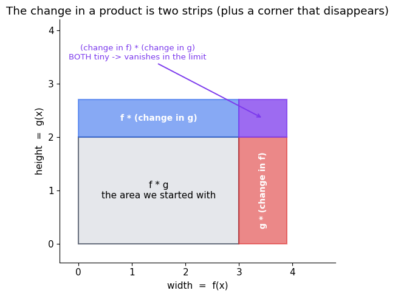

**Output**

```text
With the growths drawn this large, the purple corner is 13.91% of the new area.
  shrink the growths by    0.1:  corner is  1.58970% of the new area
  shrink the growths by   0.01:  corner is  0.16128% of the new area
  shrink the growths by  0.001:  corner is  0.01615% of the new area

The two strips stay. The corner does not. That is why the rule has
two terms and not three.
```

### Cell 122

```python
# ============================================================
#  4.4 -- the quotient rule, derived from §4.3 and then audited
# ============================================================
print("STEP 1 -- re-derive it symbolically, exactly as the markdown did")
q = F(x) / G(x)
# differentiate f = q*g and solve for q'
qp = sp.Symbol("qprime")
solved = sp.solve(sp.Eq(sp.diff(F(x), x),
                        qp*G(x) + (F(x)/G(x))*sp.diff(G(x), x)), qp)[0]
print(f"    solving  f' = q'g + q g'  for q'  gives : {sp.simplify(solved)}")
target = (sp.diff(F(x), x)*G(x) - F(x)*sp.diff(G(x), x)) / G(x)**2
print(f"    the rule  (f'g - fg') / g**2           : {target}")
print(f"    difference                             : {sp.simplify(solved - target)}")
print("    -> 0, on abstract f and g. The quotient rule IS the product rule.")
print()

print("STEP 2 -- and it agrees with the raw definition on a concrete quotient")
fa, ga = sp.sin(x), x**2 + 1
by_def  = from_definition(fa/ga)
by_rule = sp.simplify((sp.diff(fa, x)*ga - fa*sp.diff(ga, x)) / ga**2)
print(f"    from the definition : {sp.simplify(by_def)}")
print(f"    from the rule       : {by_rule}")
print(f"    difference          : {sp.simplify(by_def - by_rule)}")
print()

print("STEP 3 -- what happens if you get the order backwards")
wrong = sp.simplify((fa*sp.diff(ga, x) - sp.diff(fa, x)*ga) / ga**2)
a = 1.3
print(f"    at x = {a}:  correct {float(by_rule.subs(x, a)): .6f}"
      f"    order swapped {float(wrong.subs(x, a)): .6f}")
print(f"    numerically       : {num_deriv(lambda v: np.sin(v)/(v**2 + 1), a): .6f}")
print("    -> swapping the order does not perturb the answer, it negates it.")
print()

print("STEP 4 -- audit some quotients (including 1/x, which Part 3 did by hand)")
for label, e in [("sin(x) / (x**2+1)", sp.sin(x)/(x**2 + 1)),
                 ("1 / x",             1/x),
                 ("x / (x+2)",         x/(x + 2)),
                 ("tan = sin/cos",     sp.sin(x)/sp.cos(x))]:
    verify(f"4.4 quotient  {label}", e, [0.6, 1.1, 1.9])
for nm, e, d, w, ok in RULE_CHECKS[-4:]:
    print(f"    {'PASS' if ok else 'FAIL'}  {nm:<34} d/dx = {d[:34]:<34} gap {w:.2e}")
```

**Output**

```text
STEP 1 -- re-derive it symbolically, exactly as the markdown did
    solving  f' = q'g + q g'  for q'  gives : (-f(x)*Derivative(g(x), x) + g(x)*Derivative(f(x), x))/g(x)**2
    the rule  (f'g - fg') / g**2           : (-f(x)*Derivative(g(x), x) + g(x)*Derivative(f(x), x))/g(x)**2
    difference                             : 0
    -> 0, on abstract f and g. The quotient rule IS the product rule.

STEP 2 -- and it agrees with the raw definition on a concrete quotient
    from the definition : (x**2*cos(x) - 2*x*sin(x) + cos(x))/(x**4 + 2*x**2 + 1)
    from the rule       : (-2*x*sin(x) + (x**2 + 1)*cos(x))/(x**2 + 1)**2
    difference          : 0

STEP 3 -- what happens if you get the order backwards
    at x = 1.3:  correct -0.246774    order swapped  0.246774
    numerically       : -0.246774
    -> swapping the order does not perturb the answer, it negates it.

STEP 4 -- audit some quotients (including 1/x, which Part 3 did by hand)
    PASS  4.4 quotient  sin(x) / (x**2+1)    d/dx = -2*x*sin(x)/(x**2 + 1)**2 + cos(x) gap 2.85e-11
    PASS  4.4 quotient  1 / x                d/dx = -1/x**2                            gap 2.02e-10
    PASS  4.4 quotient  x / (x+2)            d/dx = -x/(x + 2)**2 + 1/(x + 2)          gap 1.92e-12
    PASS  4.4 quotient  tan = sin/cos        d/dx = sin(x)**2/cos(x)**2 + 1            gap 8.10e-10
```

### Cell 124

```python
# ============================================================
#  4.5 -- the chain rule: rates multiply, at three depths
# ============================================================
print("A. RATE TIMES RATE, in plain numbers")
u_of_x = lambda v: 2.0*v + 1.0      # u changes 2x as fast as x
y_of_u = lambda w: 3.0*w - 4.0      # y changes 3x as fast as u
comp   = lambda v: y_of_u(u_of_x(v))
a = 1.0
print(f"    du/dx measured : {num_deriv(u_of_x, a):.6f}")
print(f"    dy/du measured : {num_deriv(y_of_u, u_of_x(a)):.6f}")
print(f"    their product  : {num_deriv(y_of_u, u_of_x(a)) * num_deriv(u_of_x, a):.6f}")
print(f"    dy/dx measured : {num_deriv(comp, a):.6f}   <-- same number")
print()

print("B. WORKED EXAMPLES, getting deeper")
a = 1.1
examples = [
    ("depth 1   (3x + 1)**4",
     (3*x + 1)**4,
     "outer u**4 -> 4u**3 at u = 3x+1;  inner 3x+1 -> 3"),
    ("depth 2   sin(x**2)",
     sp.sin(x**2),
     "outer sin -> cos at u = x**2;     inner x**2 -> 2x"),
    ("depth 3   sin(exp(x**2))",
     sp.sin(sp.exp(x**2)),
     "cos(exp(x^2)) * exp(x^2) * 2x  -- three factors, one per layer"),
]
for label, e, how in examples:
    d = verify(f"4.5 chain  {label.split('   ')[1]}", e, [0.4, 1.1, 1.7])
    f_n = sp.lambdify(x, e, "numpy")
    print(f"    {label}")
    print(f"        peel:  {how}")
    print(f"        d/dx = {sp.simplify(d)}")
    print(f"        at x = {a}:  rule {float(sp.simplify(d).subs(x, a)): .6f}"
          f"   numerically {num_deriv(f_n, a): .6f}")
print()

print("C. THE THREE-DEEP ONE, assembled BY HAND from the three layers")
inner1 = x**2                     # innermost
inner2 = sp.exp(inner1)           # middle
outer  = sp.sin(inner2)           # outermost
by_hand = (sp.cos(inner2)) * (sp.exp(inner1)) * (2*x)
by_sympy = sp.diff(outer, x)
print(f"    hand-assembled : {by_hand}")
print(f"    sympy          : {by_sympy}")
print(f"    difference     : {sp.simplify(by_hand - by_sympy)}")
print()

print("D. WHAT FORGETTING THE INNER DERIVATIVE COSTS")
a = 1.2
right = float(sp.diff(sp.sin(x**2), x).subs(x, a))
wrong = float(sp.cos(x**2).subs(x, a))          # outer only -- inner dropped
numer = num_deriv(lambda v: np.sin(v**2), a)
print(f"    d/dx sin(x**2)  at x = {a}")
print(f"      forgot the inner derivative, cos(x**2) : {wrong: .6f}   <-- WRONG")
print(f"      full chain rule, 2x*cos(x**2)          : {right: .6f}")
print(f"      numerically, from raw arithmetic       : {numer: .6f}")
print(f"      the error factor is exactly 2x = {2*a:.1f}: {right/wrong:.4f}")

# ---- picture: three panels, three slopes, one product -------------------
x0 = 1.1
u0 = x0**2
g_x = lambda v: v**2
f_u = lambda w: np.sin(w)
comp2 = lambda v: np.sin(v**2)
s_inner = 2*x0
s_outer = np.cos(u0)
s_total = s_outer * s_inner

xs = np.linspace(0.2, 1.9, 400)
us = np.linspace(0.0, 3.4, 400)

fig, axes = plt.subplots(1, 3, figsize=(13.5, 4.0))
for ax, (dom, fn, pt, slope, ttl, xl, yl) in zip(axes, [
        (xs, g_x,   (x0, u0),          s_inner,
         f"inner: u = x squared\nslope du/dx = {s_inner:.4f}", "x", "u"),
        (us, f_u,   (u0, np.sin(u0)),  s_outer,
         f"outer: y = sin(u)\nslope dy/du = {s_outer:.4f}",    "u", "y"),
        (xs, comp2, (x0, np.sin(x0**2)), s_total,
         f"together: y = sin(x squared)\nslope dy/dx = {s_total:.4f}", "x", "y")]):
    ax.plot(dom, fn(dom), color=C_F, lw=2.3)
    span = np.linspace(pt[0] - 0.4, pt[0] + 0.4, 20)
    ax.plot(span, pt[1] + slope*(span - pt[0]), color=C_SLOPE, lw=2.0, ls="--")
    ax.plot(*pt, "o", color=C_SLOPE, ms=8, zorder=5)
    ax.set_title(ttl, fontsize=10)
    ax.set_xlabel(xl); ax.set_ylabel(yl)
fig.suptitle(f"{s_outer:.4f}  x  {s_inner:.4f}  =  {s_total:.4f}",
             fontsize=13, y=1.04)
fig.tight_layout()
plt.show()

print(f"outer slope {s_outer:.6f}  x  inner slope {s_inner:.6f}"
      f"  =  {s_total:.6f}")
print(f"measured slope of the composite            =  {num_deriv(comp2, x0):.6f}")
```

**Output**

```text
A. RATE TIMES RATE, in plain numbers
    du/dx measured : 2.000000
    dy/du measured : 3.000000
    their product  : 6.000000
    dy/dx measured : 6.000000   <-- same number

B. WORKED EXAMPLES, getting deeper
    depth 1   (3x + 1)**4
        peel:  outer u**4 -> 4u**3 at u = 3x+1;  inner 3x+1 -> 3
        d/dx = 12*(3*x + 1)**3
        at x = 1.1:  rule  954.084000   numerically  954.084000
    depth 2   sin(x**2)
        peel:  outer sin -> cos at u = x**2;     inner x**2 -> 2x
        d/dx = 2*x*cos(x**2)
        at x = 1.1:  rule  0.776643   numerically  0.776643
    depth 3   sin(exp(x**2))
        peel:  cos(exp(x^2)) * exp(x^2) * 2x  -- three factors, one per layer
        d/dx = 2*x*exp(x**2)*cos(exp(x**2))
        at x = 1.1:  rule -7.212663   numerically -7.212663

C. THE THREE-DEEP ONE, assembled BY HAND from the three layers
    hand-assembled : 2*x*exp(x**2)*cos(exp(x**2))
    sympy          : 2*x*exp(x**2)*cos(exp(x**2))
    difference     : 0

D. WHAT FORGETTING THE INNER DERIVATIVE COSTS
    d/dx sin(x**2)  at x = 1.2
      forgot the inner derivative, cos(x**2) :  0.130424   <-- WRONG
      full chain rule, 2x*cos(x**2)          :  0.313017
      numerically, from raw arithmetic       :  0.313017
      the error factor is exactly 2x = 2.4: 2.4000
```

**Output**

```text
<Figure size 1350x400 with 3 Axes>
```

**Figure**

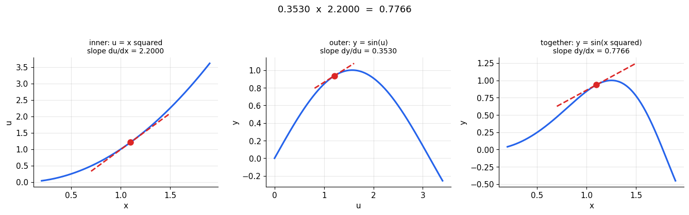

**Output**

```text
outer slope 0.353019  x  inner slope 2.200000  =  0.776643
measured slope of the composite            =  0.776643
```

### Cell 129

```python
# ============================================================
#  4.6 -- sigma'(x) = sigma(x) * (1 - sigma(x)), derived and measured
# ============================================================
sig_sym = 1 / (1 + sp.exp(-x))

print("STEP 1 -- differentiate it, and confirm the tidy form is the SAME function")
d_sig = verify("4.6 sigmoid", sig_sym, [-3.0, -0.7, 0.0, 1.4, 4.0])
print(f"    sympy's raw answer            : {d_sig}")
print(f"    the claimed form sig*(1-sig)  : {sig_sym*(1 - sig_sym)}")
print(f"    simplified difference         : "
      f"{sp.simplify(d_sig - sig_sym*(1 - sig_sym))}")
print("    -> 0, identically. Not an approximation, the same function.")
print()

print("STEP 2 -- and again straight from the Part 3 definition")
print(f"    lim (sig(x+h)-sig(x))/h  minus  sig*(1-sig)  =  "
      f"{sp.simplify(from_definition(sig_sym) - sig_sym*(1 - sig_sym))}")
print()

print("STEP 3 -- measure it, with no algebra at all")
def sigma(v):
    return 1.0 / (1.0 + np.exp(-v))

print("        x        numerical d/dx      sig*(1-sig)        gap")
for a in (-4.0, -1.5, 0.0, 0.8, 3.0):
    numeric = num_deriv(sigma, a)
    formula = sigma(a) * (1 - sigma(a))
    print(f"    {a:6.1f}      {numeric:14.10f}   {formula:14.10f}   {abs(numeric-formula):.2e}")
print()

print("STEP 4 -- THE PEAK, which is the number ML people quote")
grid = np.linspace(-12, 12, 400001)
slope = sigma(grid) * (1 - sigma(grid))
peak_i = int(np.argmax(slope))
print(f"    largest value of sig'(x) found : {slope[peak_i]:.10f}")
print(f"    it occurs at x                 : {grid[peak_i]:.6f}")
print(f"    exactly 1/4?                   : {abs(slope[peak_i] - 0.25):.3e} away")
print(f"    reason: sig(0) = {sigma(0.0):.1f}, so sig'(0) = 0.5 * 0.5 = 0.25,")
print(f"            and s*(1-s) is largest when s = 1/2, which is at x = 0.")
print()
print("    So the sigmoid NEVER has a slope steeper than 0.25, anywhere.")
for depth in (1, 5, 10, 20):
    print(f"      {depth:>2} sigmoid layers chained: gradient shrinks by at most "
          f"0.25**{depth} = {0.25**depth:.3e}")

# ---- picture ------------------------------------------------------------
gs = np.linspace(-8, 8, 800)
fig, (axA, axB) = plt.subplots(1, 2, figsize=(12.4, 4.3))

axA.plot(gs, sigma(gs), color=C_F, lw=2.6)
axA.axhline(0.5, color=C_GREY, ls=":", lw=1.2)
axA.axvline(0.0, color=C_GREY, ls=":", lw=1.2)
axA.plot(0.0, 0.5, "o", color=C_SLOPE, ms=8, zorder=5)
tang = np.linspace(-2.6, 2.6, 20)
axA.plot(tang, 0.5 + 0.25*tang, color=C_SLOPE, lw=2.0, ls="--",
         label="steepest tangent, slope 0.25")
axA.set_title("the sigmoid: everything squashed into (0, 1)")
axA.set_xlabel("x"); axA.set_ylabel("sigma(x)")
axA.legend(fontsize=9, loc="upper left")

axB.plot(gs, sigma(gs)*(1 - sigma(gs)), color=C_SLOPE, lw=2.6)
axB.axhline(0.25, color=C_EXACT, ls="--", lw=1.8)
axB.plot(0.0, 0.25, "o", color=C_EXACT, ms=8, zorder=5)
axB.annotate("peak = 0.25, at x = 0", xy=(0, 0.25), xytext=(2.1, 0.205),
             fontsize=10, color=C_EXACT,
             arrowprops=dict(arrowstyle="->", color=C_EXACT, lw=1.4))
axB.fill_between(gs, 0, sigma(gs)*(1 - sigma(gs)),
                 where=(np.abs(gs) > 4), color=C_SOFT)
axB.text(-7.6, 0.115, "flat: gradient\nalmost zero", fontsize=9, color=C_GREY)
axB.text(4.6, 0.115, "flat: gradient\nalmost zero", fontsize=9, color=C_GREY)
axB.set_ylim(0, 0.30)
axB.set_title("its derivative: never more than a quarter")
axB.set_xlabel("x"); axB.set_ylabel("sigma'(x)")

fig.tight_layout()
plt.show()
```

**Output**

```text
STEP 1 -- differentiate it, and confirm the tidy form is the SAME function
    sympy's raw answer            : exp(-x)/(1 + exp(-x))**2
    the claimed form sig*(1-sig)  : (1 - 1/(1 + exp(-x)))/(1 + exp(-x))
    simplified difference         : 0
    -> 0, identically. Not an approximation, the same function.

STEP 2 -- and again straight from the Part 3 definition
    lim (sig(x+h)-sig(x))/h  minus  sig*(1-sig)  =  0

STEP 3 -- measure it, with no algebra at all
        x        numerical d/dx      sig*(1-sig)        gap
      -4.0        0.0176627062     0.0176627062   4.88e-14
      -1.5        0.1491464521     0.1491464521   2.59e-13
       0.0        0.2500000000     0.2500000000   6.69e-12
       0.8        0.2139096965     0.2139096965   3.27e-12
       3.0        0.0451766597     0.0451766597   1.11e-12

STEP 4 -- THE PEAK, which is the number ML people quote
    largest value of sig'(x) found : 0.2500000000
    it occurs at x                 : 0.000000
    exactly 1/4?                   : 0.000e+00 away
    reason: sig(0) = 0.5, so sig'(0) = 0.5 * 0.5 = 0.25,
            and s*(1-s) is largest when s = 1/2, which is at x = 0.

    So the sigmoid NEVER has a slope steeper than 0.25, anywhere.
       1 sigmoid layers chained: gradient shrinks by at most 0.25**1 = 2.500e-01
       5 sigmoid layers chained: gradient shrinks by at most 0.25**5 = 9.766e-04
      10 sigmoid layers chained: gradient shrinks by at most 0.25**10 = 9.537e-07
      20 sigmoid layers chained: gradient shrinks by at most 0.25**20 = 9.095e-13
```

**Output**

```text
<Figure size 1240x430 with 2 Axes>
```

**Figure**

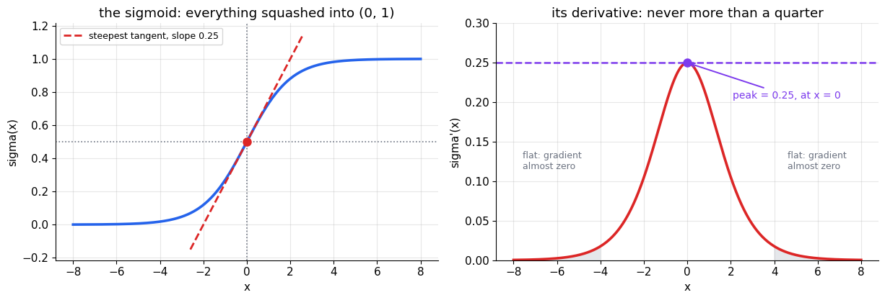

### Cell 132

```python
# ============================================================
#  4.7 -- the nine standard derivatives, each one verified
# ============================================================
relu = sp.Piecewise((0, x < 0), (x, True))

TABLE = [
    ("x**7",     x**7,                    [-1.6, 0.9, 2.2]),
    ("exp(x)",   sp.exp(x),               [-1.2, 0.3, 2.0]),
    ("ln(x)",    sp.log(x),               [0.4, 1.5, 3.7]),
    ("sin(x)",   sp.sin(x),               [-2.0, 0.5, 2.6]),
    ("cos(x)",   sp.cos(x),               [-2.0, 0.5, 2.6]),
    ("tan(x)",   sp.tan(x),               [-0.9, 0.2, 1.0]),
    ("sigmoid",  1/(1 + sp.exp(-x)),      [-2.5, 0.0, 3.1]),
    ("tanh(x)",  sp.tanh(x),              [-1.8, 0.4, 2.3]),
    ("ReLU(x)",  relu,                    [-2.0, -0.5, 1.3, 3.0]),
]

print(f"{'f(x)':<10} {'sympy says f\'(x)':<34} {'x':>6} {'numeric':>12} {'formula':>12}")
print("-" * 80)
for label, expr, pts in TABLE:
    d = verify(f"4.7 table  {label}", expr, pts)
    f_n = sp.lambdify(x, expr, "numpy")
    d_n = sp.lambdify(x, d,    "numpy")
    spot = float(pts[-1])
    print(f"{label:<10} {str(sp.simplify(d))[:33]:<34} {spot:6.2f} "
          f"{float(num_deriv(f_n, spot)):12.7f} {float(d_n(spot)):12.7f}")
print()

print("The two identities the table claims, checked as algebra:")
sig_sym = 1/(1 + sp.exp(-x))
print(f"    sigma' - sigma*(1-sigma) : "
      f"{sp.simplify(sp.diff(sig_sym, x) - sig_sym*(1 - sig_sym))}")
print(f"    tanh' - (1 - tanh**2)    : "
      f"{sp.simplify(sp.diff(sp.tanh(x), x) - (1 - sp.tanh(x)**2))}")
print(f"    tan'  - 1/cos(x)**2      : "
      f"{sp.simplify(sp.diff(sp.tan(x), x) - 1/sp.cos(x)**2)}")
print()

print("And the claim about e, which is where the number comes from:")
for base in (2.0, 2.5, np.e, 3.0):
    slope_at_0 = num_deriv(lambda v: base**v, 0.0)
    tag = "  <-- slope exactly 1: this is e" if abs(slope_at_0 - 1) < 1e-9 else ""
    print(f"    d/dx {base:.5f}**x  at x = 0  =  {slope_at_0:.9f}{tag}")
print()

print("ReLU at its corner -- the derivative does NOT exist there:")
for side, step in [("from the left ", -1e-6), ("from the right", 1e-6)]:
    slope = (max(0.0, 0.0 + step) - max(0.0, 0.0)) / step
    print(f"    slope approaching 0 {side} : {slope + 0.0:.1f}")
print("    two different answers -> no single slope -> not differentiable at 0.")
print("    (Frameworks pick one by convention and carry on; see Part 3.)")
```

**Output**

```text
f(x)       sympy says f'(x)                        x      numeric      formula
--------------------------------------------------------------------------------
x**7       7*x**6                               2.20  793.6593281  793.6593280
exp(x)     exp(x)                               2.00    7.3890561    7.3890561
ln(x)      1/x                                  3.70    0.2702703    0.2702703
sin(x)     cos(x)                               2.60   -0.8568888   -0.8568888
cos(x)     -sin(x)                              2.60   -0.5155014   -0.5155014
tan(x)     cos(x)**(-2)                         1.00    3.4255188    3.4255188
sigmoid    1/(4*cosh(x/2)**2)                   3.10    0.0412490    0.0412490
tanh(x)    cosh(x)**(-2)                        2.30    0.0394111    0.0394111
ReLU(x)    Piecewise((0, x < 0), (1, True))     3.00    1.0000000    1.0000000

The two identities the table claims, checked as algebra:
    sigma' - sigma*(1-sigma) : 0
    tanh' - (1 - tanh**2)    : 0
    tan'  - 1/cos(x)**2      : 0

And the claim about e, which is where the number comes from:
    d/dx 2.00000**x  at x = 0  =  0.693147181
    d/dx 2.50000**x  at x = 0  =  0.916290732
    d/dx 2.71828**x  at x = 0  =  1.000000000  <-- slope exactly 1: this is e
    d/dx 3.00000**x  at x = 0  =  1.098612289

ReLU at its corner -- the derivative does NOT exist there:
    slope approaching 0 from the left  : 0.0
    slope approaching 0 from the right : 1.0
    two different answers -> no single slope -> not differentiable at 0.
    (Frameworks pick one by convention and carry on; see Part 3.)
```

### Cell 133

```python
# ============================================================
#  4.8 -- THE VERDICT. Every rule derived in Part 4, audited.
# ============================================================
print("=" * 92)
print("PART 4 VERIFICATION HARNESS".center(92))
print("every claim above, sympy vs a numerical derivative at several points".center(92))
print("=" * 92)
print(f"{'rule':<34} {'f(x)':<20} {'f\'(x)':<22} {'worst gap':>11}  {'':>4}")
print("-" * 92)
for name, expr_s, deriv_s, worst, ok in RULE_CHECKS:
    print(f"{name:<34} {expr_s[:19]:<20} {deriv_s[:21]:<22} "
          f"{worst:11.2e}  {'PASS' if ok else 'FAIL':>4}")
print("-" * 92)

n_total  = len(RULE_CHECKS)
n_passed = sum(1 for r in RULE_CHECKS if r[4])
worst_of_all = max(r[3] for r in RULE_CHECKS)
print(f"{n_passed} of {n_total} checks passed.   "
      f"Worst disagreement anywhere in Part 4: {worst_of_all:.3e}")
print("=" * 92)

if n_passed == n_total:
    print("\nEvery rule derived in this part agrees with a derivative computed")
    print("from raw arithmetic, at every point tested, to better than one part")
    print("in a million. Nothing on this page was asserted.")
else:
    print("\nSOMETHING DISAGREES -- look at the FAIL rows above.")
```

**Output**

```text
============================================================================================
                                PART 4 VERIFICATION HARNESS                                 
            every claim above, sympy vs a numerical derivative at several points            
============================================================================================
rule                               f(x)                 f'(x)                    worst gap      
--------------------------------------------------------------------------------------------
warm-up  x**2                      x**2                 2*x                       5.62e-12  PASS
4.1 constant  7                    7                    0                         0.00e+00  PASS
4.1 const mult  5*sin(x)           5*sin(x)             5*cos(x)                  1.32e-11  PASS
4.1 sum  sin(x) + x**3             x**3 + sin(x)        3*x**2 + cos(x)           3.56e-11  PASS
4.1 combo  3*x**2 - 4*x + 9        3*x**2 - 4*x + 9     6*x - 4                   1.65e-11  PASS
4.2 power  x**1                    x                    1                         3.28e-12  PASS
4.2 power  x**2                    x**2                 2*x                       3.66e-12  PASS
4.2 power  x**3                    x**3                 3*x**2                    3.73e-11  PASS
4.2 power  x**4                    x**4                 4*x**3                    1.16e-10  PASS
4.2 power  x**5                    x**5                 5*x**4                    2.21e-10  PASS
4.2 power  x**6                    x**6                 6*x**5                    3.39e-10  PASS
4.2 power  x**7                    x**7                 7*x**6                    4.59e-10  PASS
4.2 power  x**-2                   x**(-2)              -2/x**3                   2.44e-10  PASS
4.2 power  x**(1/2)                sqrt(x)              1/(2*sqrt(x))             2.11e-11  PASS
4.3 product  x**2 * sin(x)         x**2*sin(x)          x**2*cos(x) + 2*x*sin     1.39e-10  PASS
4.3 product  exp(x) * cos(x)       exp(x)*cos(x)        -exp(x)*sin(x) + exp(     5.77e-11  PASS
4.3 product  x**2 * x**3           x**5                 5*x**4                    2.17e-10  PASS
4.3 product  (3*x+1) * ln(x)       (3*x + 1)*log(x)     3*log(x) + (3*x + 1)/     5.62e-12  PASS
4.4 quotient  sin(x) / (x**2+1)    sin(x)/(x**2 + 1)    -2*x*sin(x)/(x**2 + 1     2.85e-11  PASS
4.4 quotient  1 / x                1/x                  -1/x**2                   2.02e-10  PASS
4.4 quotient  x / (x+2)            x/(x + 2)            -x/(x + 2)**2 + 1/(x      1.92e-12  PASS
4.4 quotient  tan = sin/cos        sin(x)/cos(x)        sin(x)**2/cos(x)**2 +     8.10e-10  PASS
4.5 chain  (3x + 1)**4             (3*x + 1)**4         12*(3*x + 1)**3           1.84e-10  PASS
4.5 chain  sin(x**2)               sin(x**2)            2*x*cos(x**2)             1.47e-10  PASS
4.5 chain  sin(exp(x**2))          sin(exp(x**2))       2*x*exp(x**2)*cos(exp     4.68e-08  PASS
4.6 sigmoid                        1/(1 + exp(-x))      exp(-x)/(1 + exp(-x))     6.43e-12  PASS
4.7 table  x**7                    x**7                 7*x**6                    4.83e-10  PASS
4.7 table  exp(x)                  exp(x)               exp(x)                    2.21e-11  PASS
4.7 table  ln(x)                   log(x)               1/x                       1.51e-10  PASS
4.7 table  sin(x)                  sin(x)               cos(x)                    9.32e-12  PASS
4.7 table  cos(x)                  cos(x)               -sin(x)                   5.36e-12  PASS
4.7 table  tan(x)                  tan(x)               tan(x)**2 + 1             2.15e-10  PASS
4.7 table  sigmoid                 1/(1 + exp(-x))      exp(-x)/(1 + exp(-x))     5.35e-12  PASS
4.7 table  tanh(x)                 tanh(x)              1 - tanh(x)**2            8.55e-12  PASS
4.7 table  ReLU(x)                 Piecewise((0, x < 0  Piecewise((0, x < 0),     3.28e-12  PASS
--------------------------------------------------------------------------------------------
35 of 35 checks passed.   Worst disagreement anywhere in Part 4: 4.685e-08
============================================================================================

Every rule derived in this part agrees with a derivative computed
from raw arithmetic, at every point tested, to better than one part
in a million. Nothing on this page was asserted.
```

### Cell 136

```python
# ============================================================
#  Sign of f' = direction of f. Two panels, ONE shared x-axis,
#  so you can read straight down from the curve to its slope.
# ============================================================
def f(u):
    """Our test function, f(u) = u^3 - 3u."""
    return u ** 3 - 3 * u

def f_prime(u):
    """Its derivative. Power rule + constant-multiple rule, both from Part 4:
       d/du(u^3) = 3u^2  and  d/du(-3u) = -3."""
    return 3 * u ** 2 - 3

xs = np.linspace(-2.2, 2.2, 801)
ys, dys = f(xs), f_prime(xs)

# Where does the slope change sign? Find it NUMERICALLY here -- we will solve
# for it exactly, by hand, in a moment, and the two answers must agree.
sign_changes = np.where(np.diff(np.sign(dys)) != 0)[0]
flat_x = xs[sign_changes]

fig, (ax1, ax2) = plt.subplots(2, 1, figsize=(9.5, 7.0), sharex=True)

ax1.plot(xs, ys, color=C_F, lw=2.6)
ax1.set_ylabel("f(x)")
ax1.set_title("f(x) = x^3 - 3x        (top: the function)")
for cx in flat_x:
    ax1.plot(cx, f(cx), "o", ms=10, color=C_EXACT, zorder=5)
    ax1.plot([cx - 0.45, cx + 0.45], [f(cx), f(cx)],
             color=C_EXACT, lw=2.2, ls="--")
ax1.annotate("rising", xy=(-1.8, f(-1.8)), xytext=(-2.1, 4.2), color=C_AREA,
             fontweight="bold", arrowprops=dict(arrowstyle="->", color=C_AREA))
ax1.annotate("falling", xy=(0.0, 0.0), xytext=(-0.55, 3.4), color=C_SLOPE,
             fontweight="bold", arrowprops=dict(arrowstyle="->", color=C_SLOPE))
ax1.annotate("rising", xy=(1.8, f(1.8)), xytext=(1.15, -3.6), color=C_AREA,
             fontweight="bold", arrowprops=dict(arrowstyle="->", color=C_AREA))

ax2.axhline(0, color="black", lw=1.0)
ax2.plot(xs, dys, color=C_SLOPE, lw=2.6)
up = dys >= 0
ax2.fill_between(xs, 0, dys, where=up, color=C_AREA, alpha=0.35,
                 interpolate=True, label="f'(x) > 0  ->  f is rising")
ax2.fill_between(xs, 0, dys, where=~up, color=C_SLOPE, alpha=0.30,
                 interpolate=True, label="f'(x) < 0  ->  f is falling")
ax2.set_xlabel("x")
ax2.set_ylabel("f'(x)")
ax2.set_title("bottom: its slope")
ax2.legend(loc="upper center", frameon=False, fontsize=10)

# vertical guides through the flat spots, drawn on BOTH panels
for cx in flat_x:
    for a in (ax1, ax2):
        a.axvline(cx, color=C_GREY, lw=1.1, ls=":")
fig.tight_layout()
plt.show()

print(f"slope crosses zero near x = {flat_x[0]:+.4f} and x = {flat_x[1]:+.4f}")
print()
print("Reading the sign, then checking it by actually stepping forward:")
print(f"{'x':>7} {'f prime(x)':>13} {'sign says':>12} "
      f"{'f(x+0.01) - f(x)':>18} {'agrees?':>9}")
for probe in (-2.0, -1.5, -0.5, 0.0, 0.5, 1.5, 2.0):
    d = f_prime(probe)
    step = f(probe + 0.01) - f(probe)
    says = "rising" if d > 0 else ("falling" if d < 0 else "flat")
    ok = (d > 0 and step > 0) or (d < 0 and step < 0) or (d == 0)
    print(f"{probe:>7.2f} {d:>13.4f} {says:>12} {step:>18.5f} {str(ok):>9}")
```

**Output**

```text
<Figure size 950x700 with 2 Axes>
```

**Figure**

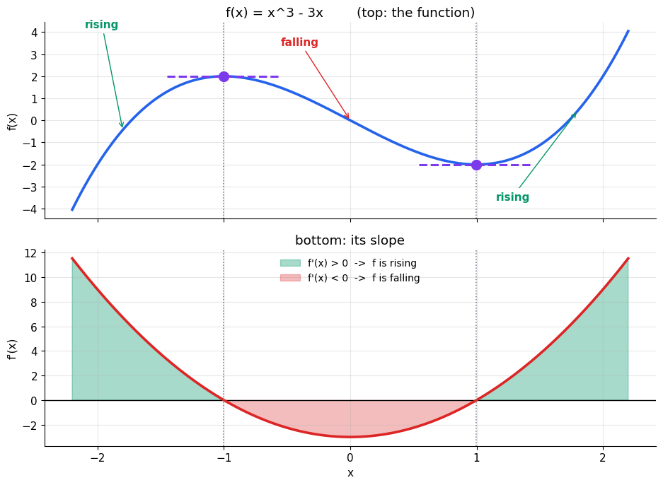

**Output**

```text
slope crosses zero near x = -1.0010 and x = +0.9955

Reading the sign, then checking it by actually stepping forward:
      x    f prime(x)    sign says   f(x+0.01) - f(x)   agrees?
  -2.00        9.0000       rising            0.08940      True
  -1.50        3.7500       rising            0.03705      True
  -0.50       -2.2500      falling           -0.02265      True
   0.00       -3.0000      falling           -0.03000      True
   0.50       -2.2500      falling           -0.02235      True
   1.50        3.7500       rising            0.03795      True
   2.00        9.0000       rising            0.09060      True
```

### Cell 140

```python
# ============================================================
#  The same solve, three independent ways.
#    1. sympy's algebra  2. a numeric root scan  3. a raw
#    difference quotient on f itself (no formula for f' used)
# ============================================================
f_sym  = x ** 3 - 3 * x
fp_sym = sp.diff(f_sym, x)
roots  = sorted(sp.solve(sp.Eq(fp_sym, 0), x))

print("BY ALGEBRA (sympy)")
print(f"  f(x)          = {f_sym}")
print(f"  f'(x)         = {sp.simplify(fp_sym)}")
print(f"  f'(x) = 0 at  x = {roots}")
print()

# 2. numeric: bisect on the sign change we found in the figure
from scipy.optimize import brentq
num_roots = [brentq(f_prime, lo, hi) for lo, hi in [(-2.0, 0.0), (0.0, 2.0)]]
print("BY NUMERIC ROOT-FINDING (scipy brentq, never told the algebra)")
print(f"  f'(x) = 0 at  x = [{num_roots[0]:+.12f}, {num_roots[1]:+.12f}]")
print()

# 3. the most honest check of all: no derivative FORMULA anywhere. Just the
#    difference quotient from Part 3, evaluated on f, at the claimed roots.
hh = 1e-6
print("BY RAW DIFFERENCE QUOTIENT on f  (Part 3's definition, no rules used)")
for r in roots:
    r = float(r)
    dq = (f(r + hh) - f(r - hh)) / (2 * hh)
    print(f"  x = {r:+.1f}:  [f(x+h) - f(x-h)] / 2h = {dq:+.3e}   (want 0)")
print()

print(f"algebra vs numeric disagreement: "
      f"{max(abs(float(a) - b) for a, b in zip(roots, num_roots)):.2e}")
print()
print("The values of f at those two points:")
for r in roots:
    print(f"  f({float(r):+.0f}) = {f(float(r)):+.0f}")
```

**Output**

```text
BY ALGEBRA (sympy)
  f(x)          = x**3 - 3*x
  f'(x)         = 3*x**2 - 3
  f'(x) = 0 at  x = [-1, 1]

BY NUMERIC ROOT-FINDING (scipy brentq, never told the algebra)
  f'(x) = 0 at  x = [-1.000000000000, +1.000000000000]

BY RAW DIFFERENCE QUOTIENT on f  (Part 3's definition, no rules used)
  x = -1.0:  [f(x+h) - f(x-h)] / 2h = +2.220e-10   (want 0)
  x = +1.0:  [f(x+h) - f(x-h)] / 2h = +2.220e-10   (want 0)

algebra vs numeric disagreement: 0.00e+00

The values of f at those two points:
  f(-1) = +2
  f(+1) = -2
```

### Cell 142

```python
# ============================================================
#  Three functions. All have f'(0) = 0. All three are DIFFERENT
#  kinds of flat. This is why f' = 0 is only a shortlist.
# ============================================================
cases = [("x**2  -> a valley (minimum)",      lambda u: u ** 2,  x ** 2,  C_AREA),
         ("-x**2 -> a hill (maximum)",        lambda u: -u ** 2, -x ** 2, C_SLOPE),
         ("x**3  -> neither (an inflection)", lambda u: u ** 3,  x ** 3,  C_EXACT)]

zs = np.linspace(-1.4, 1.4, 401)
fig, axes = plt.subplots(1, 3, figsize=(13, 4.0))
for ax, (label, fn, expr, colour) in zip(axes, cases):
    ax.plot(zs, fn(zs), color=colour, lw=2.6)
    ax.plot([-0.6, 0.6], [fn(0.0), fn(0.0)], color=C_GREY, lw=2.4, ls="--")
    ax.plot(0, fn(0.0), "o", ms=11, color="black", zorder=5)
    ax.set_title(label, fontsize=11)
    ax.set_xlabel("x")
axes[0].set_ylabel("f(x)")
fig.suptitle("All three are perfectly flat at the origin. Only the shape differs.",
             y=1.02, fontsize=12)
fig.tight_layout()
plt.show()

print(f"{'f(x)':>8} {'f prime(0) [sympy]':>20} {'f prime(0) [numeric]':>22} "
      f"{'f(-0.1)':>10} {'f(0)':>8} {'f(+0.1)':>10}   what it is")
print("-" * 100)
for label, fn, expr, _ in cases:
    name  = str(expr)
    d_sym = float(sp.diff(expr, x).subs(x, 0))
    d_num = (fn(1e-6) - fn(-1e-6)) / (2e-6)
    left, mid, right = fn(-0.1), fn(0.0), fn(0.1)
    if left > mid and right > mid:
        verdict = "MINIMUM  (dips below both neighbours)"
    elif left < mid and right < mid:
        verdict = "MAXIMUM  (rises above both neighbours)"
    else:
        verdict = "NEITHER  (goes down one side, up the other)"
    print(f"{name:>8} {d_sym:>20.1f} {d_num:>22.3e} "
          f"{left:>10.3f} {mid:>8.3f} {right:>10.3f}   {verdict}")
```

**Output**

```text
<Figure size 1300x400 with 3 Axes>
```

**Figure**

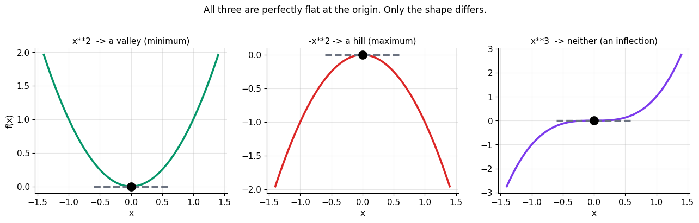

**Output**

```text
    f(x)   f prime(0) [sympy]   f prime(0) [numeric]    f(-0.1)     f(0)    f(+0.1)   what it is
----------------------------------------------------------------------------------------------------
    x**2                  0.0              0.000e+00      0.010    0.000      0.010   MINIMUM  (dips below both neighbours)
   -x**2                  0.0              0.000e+00     -0.010   -0.000     -0.010   MAXIMUM  (rises above both neighbours)
    x**3                  0.0              1.000e-12     -0.001    0.000      0.001   NEITHER  (goes down one side, up the other)
```

### Cell 147

```python
# ============================================================
#  Position, speed, acceleration -- one journey, three panels,
#  one shared time axis. Speed is differentiated SYMBOLICALLY
#  (we know the formula it was built from) and then checked
#  against a purely numerical derivative of the recorded data.
# ============================================================
# the exact speed profile the journey was generated from, as sympy
v_expr = (14 / (1 + sp.exp(-(t - 12) / sp.Rational(3)))
          - 6 * sp.exp(-((t - 55) ** 2) / (2 * sp.Float(7.0) ** 2))
          - 13 / (1 + sp.exp(-(t - 100) / sp.Rational(4))))

# does the np.clip in the generator ever actually bite? If not, this formula
# IS the journey's speed and we may differentiate it freely.
v_from_formula = sp.lambdify(t, v_expr, "numpy")(t_sec)
print(f"max |formula speed - recorded speed| = "
      f"{np.abs(v_from_formula - v_true).max():.2e}   "
      f"(so the clip never binds; the formula is exact)")

a_expr = sp.diff(v_expr, t)          # <- the second derivative of position
a_fun  = sp.lambdify(t, a_expr, "numpy")
a_sym  = a_fun(t_sec)

a_num = np.gradient(v_true, t_sec)   # numeric derivative of the DATA
print(f"max |symbolic accel - numeric accel|  = {np.abs(a_sym - a_num).max():.4f} m/s^2")
print()

fig, (ax1, ax2, ax3) = plt.subplots(3, 1, figsize=(9.5, 8.6), sharex=True)
ax1.plot(t_sec, pos_m, color=C_F, lw=2.4)
ax1.set_ylabel("position s(t)\n(metres)")
ax1.set_title("one journey, differentiated twice")

ax2.plot(t_sec, v_true, color=C_SLOPE, lw=2.4)
ax2.set_ylabel("speed s'(t)\n(m/s)")

ax3.axhline(0, color="black", lw=1.0)
ax3.plot(t_sec, a_sym, color=C_EXACT, lw=2.4, label="s''(t) from the formula")
ax3.plot(t_sec[::4], a_num[::4], "o", ms=3.5, color=C_GREY,
         label="s''(t) from the data")
pos_a = a_sym >= 0
ax3.fill_between(t_sec, 0, a_sym, where=pos_a, color=C_AREA, alpha=0.30,
                 interpolate=True)
ax3.fill_between(t_sec, 0, a_sym, where=~pos_a, color=C_SLOPE, alpha=0.25,
                 interpolate=True)
ax3.set_ylabel("acceleration s''(t)\n(m/s per s)")
ax3.set_xlabel("time (seconds)")
ax3.legend(loc="lower left", frameon=False, fontsize=9)

# find the extremes on a fine grid, so we are not limited to whole seconds
t_fine = np.linspace(0, 120, 240001)
a_fine = a_fun(t_fine)
i_hi, i_lo = int(np.argmax(a_fine)), int(np.argmin(a_fine))
t_hi, t_lo = t_fine[i_hi], t_fine[i_lo]

for a in (ax1, ax2, ax3):
    a.axvline(t_hi, color=C_AREA,  lw=1.4, ls="--")
    a.axvline(t_lo, color=C_SLOPE, lw=1.4, ls="--")
ax3.annotate("hardest acceleration", xy=(t_hi, a_fine[i_hi]),
             xytext=(t_hi + 8, a_fine[i_hi] * 0.85), color=C_AREA, fontsize=10,
             arrowprops=dict(arrowstyle="->", color=C_AREA))
ax3.annotate("hardest braking", xy=(t_lo, a_fine[i_lo]),
             xytext=(t_lo - 55, a_fine[i_lo] * 0.9), color=C_SLOPE, fontsize=10,
             arrowprops=dict(arrowstyle="->", color=C_SLOPE))
fig.tight_layout()
plt.show()

print("THE ANSWERS")
print(f"  hardest acceleration : {a_fine[i_hi]:+.4f} m/s^2  at t = {t_hi:.2f} s"
      f"   (speed there = {sp.lambdify(t, v_expr, 'numpy')(t_hi):.2f} m/s)")
print(f"  hardest braking      : {a_fine[i_lo]:+.4f} m/s^2  at t = {t_lo:.2f} s"
      f"   (speed there = {sp.lambdify(t, v_expr, 'numpy')(t_lo):.2f} m/s)")
print()
print(f"  in g:  {a_fine[i_hi] / 9.81:+.3f} g accelerating, "
      f"{a_fine[i_lo] / 9.81:+.3f} g braking  -- a gentle drive.")
print()
print("Note WHERE those two moments are: neither is at top speed or at a stop.")
print("They are where the speed curve is STEEPEST, which is a different thing.")
```

**Output**

```text
max |formula speed - recorded speed| = 8.88e-15   (so the clip never binds; the formula is exact)
max |symbolic accel - numeric accel|  = 0.0147 m/s^2
```

**Output**

```text
<Figure size 950x860 with 3 Axes>
```

**Figure**

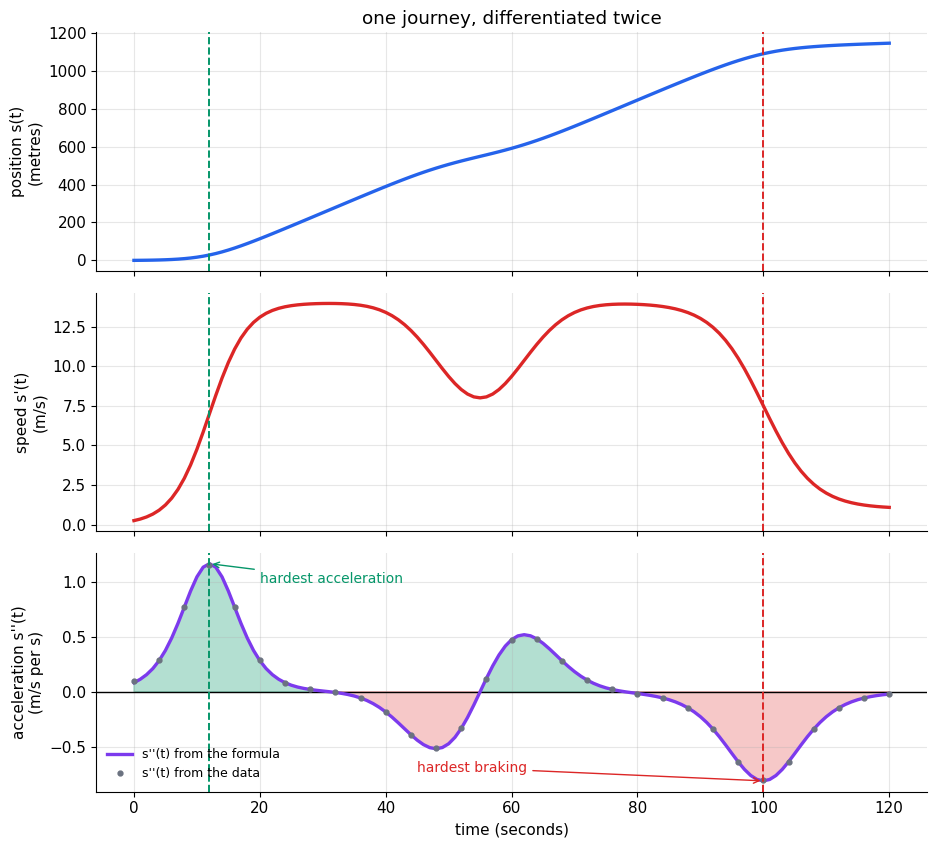

**Output**

```text
THE ANSWERS
  hardest acceleration : +1.1667 m/s^2  at t = 12.00 s   (speed there = 7.00 m/s)
  hardest braking      : -0.8125 m/s^2  at t = 100.00 s   (speed there = 7.50 m/s)

  in g:  +0.119 g accelerating, -0.083 g braking  -- a gentle drive.

Note WHERE those two moments are: neither is at top speed or at a stop.
They are where the speed curve is STEEPEST, which is a different thing.
```

### Cell 150

```python
# ============================================================
#  The second-derivative test, run on four functions, and then
#  independently audited by brute force (look either side).
# ============================================================
tests = [("x**2",  x ** 2),
         ("-x**2", -x ** 2),
         ("x**3",  x ** 3),
         ("x**4",  x ** 4)]

def truth_by_looking(fn, c=0.0, eps=1e-3):
    """No calculus at all: is f(c) below, above, or between its neighbours?"""
    left, mid, right = fn(c - eps), fn(c), fn(c + eps)
    if left > mid and right > mid:
        return "minimum"
    if left < mid and right < mid:
        return "maximum"
    return "neither"

print(f"{'f(x)':>7} {'f prime(0)':>11} {'f dblprime(0)':>14} "
      f"{'test says':>22} {'truth (by looking)':>20}   verdict")
print("-" * 100)
for name, expr in tests:
    fn  = sp.lambdify(x, expr, "numpy")
    d1  = float(sp.diff(expr, x, 1).subs(x, 0))
    d2  = float(sp.diff(expr, x, 2).subs(x, 0))
    if d1 != 0:
        says = "not a critical point"
    elif d2 > 0:
        says = "MINIMUM"
    elif d2 < 0:
        says = "MAXIMUM"
    else:
        says = "INCONCLUSIVE"
    truth = truth_by_looking(fn)
    agree = "test worked" if says.lower() == truth else (
        "test gave up -- had to look" if says == "INCONCLUSIVE" else "MISMATCH!")
    print(f"{name:>7} {d1:>11.1f} {d2:>14.1f} {says:>22} {truth:>20}   {agree}")

print()
print("Now apply it to our running example, f(x) = x^3 - 3x:")
f2_sym = sp.diff(f_sym, x, 2)
print(f"  f''(x) = {f2_sym}")
for r in roots:
    r  = float(r)
    d2 = float(f2_sym.subs(x, r))
    kind = "local MINIMUM (bowl)" if d2 > 0 else "local MAXIMUM (dome)"
    print(f"  x = {r:+.0f}:  f''({r:+.0f}) = {d2:+.0f}  ->  {kind},  f = {f(r):+.0f}")

print()
scan = np.linspace(-1.6, 1.6, 200001)
i_max, i_min = int(np.argmax(f(scan))), int(np.argmin(f(scan)))
print("Brute-force scan over 200,001 points in [-1.6, 1.6], no calculus used:")
print(f"  highest point at x = {scan[i_max]:+.5f}, f = {f(scan[i_max]):+.5f}")
print(f"  lowest  point at x = {scan[i_min]:+.5f}, f = {f(scan[i_min]):+.5f}")
```

**Output**

```text
   f(x)  f prime(0)  f dblprime(0)              test says   truth (by looking)   verdict
----------------------------------------------------------------------------------------------------
   x**2         0.0            2.0                MINIMUM              minimum   test worked
  -x**2         0.0           -2.0                MAXIMUM              maximum   test worked
   x**3         0.0            0.0           INCONCLUSIVE              neither   test gave up -- had to look
   x**4         0.0            0.0           INCONCLUSIVE              minimum   test gave up -- had to look

Now apply it to our running example, f(x) = x^3 - 3x:
  f''(x) = 6*x
  x = -1:  f''(-1) = -6  ->  local MAXIMUM (dome),  f = +2
  x = +1:  f''(+1) = +6  ->  local MINIMUM (bowl),  f = -2

Brute-force scan over 200,001 points in [-1.6, 1.6], no calculus used:
  highest point at x = -1.00000, f = +2.00000
  lowest  point at x = +1.00000, f = -2.00000
```

### Cell 153

```python
# ============================================================
#  The fence problem, solved symbolically and then verified by
#  brute force over a grid, and again by scipy's optimiser.
# ============================================================
w = sp.symbols("w", real=True)
PERIM = 100

A      = w * (PERIM / 2 - w)             # objective: area as a function of width
A1     = sp.diff(A, w)                   # A'(w)
A2     = sp.diff(A, w, 2)                # A''(w)
w_star = sp.solve(sp.Eq(A1, 0), w)[0]
A_star = sp.simplify(A.subs(w, w_star))

print("METHOD 1 -- CALCULUS (sympy)")
print(f"  A(w)   = {sp.expand(A)}")
print(f"  A'(w)  = {A1}")
print(f"  A''(w) = {A2}   -> negative everywhere, so this really is a maximum")
print(f"  A'(w) = 0 at w = {w_star}")
print(f"  best width  = {float(w_star):.6f} m")
print(f"  best length = {PERIM / 2 - float(w_star):.6f} m")
print(f"  best area   = {float(A_star):.6f} m^2")
print()

# ---- METHOD 2: brute force. Try 500,001 widths and keep the best.
ws     = np.linspace(0, PERIM / 2, 500001)
areas  = ws * (PERIM / 2 - ws)
i_best = int(np.argmax(areas))
print("METHOD 2 -- BRUTE FORCE (500,001 widths tried, no derivative anywhere)")
print(f"  best width  = {ws[i_best]:.6f} m")
print(f"  best area   = {areas[i_best]:.6f} m^2")
print(f"  endpoints for comparison:  A(0) = {areas[0]:.1f},  "
      f"A(50) = {areas[-1]:.1f}   <- both terrible")
print()

# ---- METHOD 3: a general-purpose numerical optimiser
from scipy.optimize import minimize_scalar
res = minimize_scalar(lambda ww: -(ww * (PERIM / 2 - ww)),
                      bounds=(0, PERIM / 2), method="bounded")
print("METHOD 3 -- SCIPY minimize_scalar (on the negated area)")
print(f"  best width  = {res.x:.6f} m")
print(f"  best area   = {-res.fun:.6f} m^2")
print()

print("AGREEMENT")
print(f"  calculus vs brute force : width differs by "
      f"{abs(float(w_star) - ws[i_best]):.2e} m")
print(f"  calculus vs scipy       : width differs by "
      f"{abs(float(w_star) - res.x):.2e} m")
print(f"  the answer is a SQUARE, 25 m x 25 m, area {float(A_star):.0f} m^2")
```

**Output**

```text
METHOD 1 -- CALCULUS (sympy)
  A(w)   = -w**2 + 50.0*w
  A'(w)  = 50.0 - 2*w
  A''(w) = -2   -> negative everywhere, so this really is a maximum
  A'(w) = 0 at w = 25.0000000000000
  best width  = 25.000000 m
  best length = 25.000000 m
  best area   = 625.000000 m^2

METHOD 2 -- BRUTE FORCE (500,001 widths tried, no derivative anywhere)
  best width  = 25.000000 m
  best area   = 625.000000 m^2
  endpoints for comparison:  A(0) = 0.0,  A(50) = 0.0   <- both terrible

METHOD 3 -- SCIPY minimize_scalar (on the negated area)
  best width  = 25.000000 m
  best area   = 625.000000 m^2

AGREEMENT
  calculus vs brute force : width differs by 0.00e+00 m
  calculus vs scipy       : width differs by 0.00e+00 m
  the answer is a SQUARE, 25 m x 25 m, area 625 m^2
```

### Cell 157

```python
# ============================================================
#  The tangent line hugs the curve nearby and lets go far away.
#  Then: measure the error, and watch it fall like h^2.
# ============================================================
def sigmoid(u):
    return 1.0 / (1.0 + np.exp(-u))

def sigmoid_prime(u):
    """Part 4's result: sigma'(u) = sigma(u) * (1 - sigma(u))."""
    s = sigmoid(u)
    return s * (1.0 - s)

a = 1.0                                   # the point we expand around
fa, fpa = sigmoid(a), sigmoid_prime(a)
tangent = lambda u: fa + fpa * (u - a)    # y = f(a) + f'(a)(x - a)

print(f"expanding around a = {a}")
print(f"  sigma(a)  = {fa:.6f}")
print(f"  sigma'(a) = {fpa:.6f}   (checked against sympy below)")

s_sym = 1 / (1 + sp.exp(-x))
print(f"  sympy d/dx sigma at a: {float(sp.diff(s_sym, x).subs(x, a)):.6f}")
print()

fig, (ax1, ax2) = plt.subplots(1, 2, figsize=(12.5, 4.4))
wide = np.linspace(-5, 7, 600)
ax1.plot(wide, sigmoid(wide), color=C_F, lw=2.6, label="sigma(x)")
ax1.plot(wide, tangent(wide), color=C_APPROX, lw=2.2, ls="--",
         label="tangent at a = 1")
ax1.plot(a, fa, "o", ms=10, color=C_EXACT, zorder=5)
ax1.set_ylim(-0.35, 1.35)
ax1.set_title("far away: the line leaves the curve behind")
ax1.set_xlabel("x"); ax1.set_ylabel("value")
ax1.legend(frameon=False, fontsize=10)

near = np.linspace(a - 0.10, a + 0.10, 400)
ax2.plot(near, sigmoid(near), color=C_F, lw=3.0, label="sigma(x)")
ax2.plot(near, tangent(near), color=C_APPROX, lw=2.2, ls="--", label="tangent")
ax2.plot(a, fa, "o", ms=10, color=C_EXACT, zorder=5)
ax2.set_title("zoomed to +/- 0.1: the two are one line")
ax2.set_xlabel("x")
ax2.legend(frameon=False, fontsize=10)
fig.tight_layout()
plt.show()

print(f"{'step h':>10} {'true sigma(a+h)':>18} {'linear guess':>14} "
      f"{'error':>12} {'error / h^2':>13}")
print("-" * 72)
prev_err = None
for hh in (2.0, 1.0, 0.5, 0.25, 0.1, 0.01, 0.001):
    true  = sigmoid(a + hh)
    guess = fa + fpa * hh
    err   = abs(true - guess)
    print(f"{hh:>10.3f} {true:>18.9f} {guess:>14.9f} {err:>12.3e} "
          f"{err / hh ** 2:>13.5f}")

print()
half = [abs(sigmoid(a + hh) - (fa + fpa * hh)) for hh in (0.4, 0.2, 0.1, 0.05)]
print("halving the step, and what the error does each time:")
for i in range(1, len(half)):
    print(f"   error shrank by a factor of {half[i - 1] / half[i]:.2f}  "
          f"(theory says 4)")
print()
print(f"predicted limit of error/h^2 is |sigma''(a)|/2 = "
      f"{abs(float(sp.diff(s_sym, x, 2).subs(x, a))) / 2:.5f}")
```

**Output**

```text
expanding around a = 1.0
  sigma(a)  = 0.731059
  sigma'(a) = 0.196612   (checked against sympy below)
  sympy d/dx sigma at a: 0.196612
```

**Output**

```text
<Figure size 1250x440 with 2 Axes>
```

**Figure**

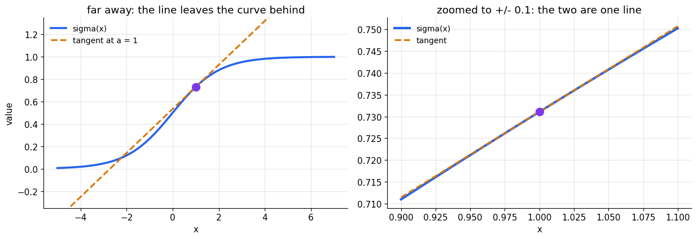

**Output**

```text
    step h    true sigma(a+h)   linear guess        error   error / h^2
------------------------------------------------------------------------
     2.000        0.952574127    1.124282445    1.717e-01       0.04293
     1.000        0.880797078    0.927670512    4.687e-02       0.04687
     0.500        0.817574476    0.829364545    1.179e-02       0.04716
     0.250        0.777299861    0.780211562    2.912e-03       0.04659
     0.100        0.750260106    0.750719772    4.597e-04       0.04597
     0.010        0.733020149    0.733024698    4.549e-06       0.04549
     0.001        0.731255145    0.731255191    4.543e-08       0.04543

halving the step, and what the error does each time:
   error shrank by a factor of 4.05  (theory says 4)
   error shrank by a factor of 4.04  (theory says 4)
   error shrank by a factor of 4.02  (theory says 4)

predicted limit of error/h^2 is |sigma''(a)|/2 = 0.04543
```

### Cell 160

```python
# ============================================================
#  Panel 1: a real (tiny) loss, minimised exactly.
#  Panels 2 and 3: the two ways "set the derivative to zero"
#                  quietly gives you the wrong answer.
# ============================================================
xd = np.array([1.0, 2.0, 3.0])
yd = np.array([2.1, 3.9, 6.3])

def loss(ww):
    ww = np.atleast_1d(np.asarray(ww, dtype=float))[:, None]
    return ((ww * xd - yd) ** 2).sum(axis=1)

# --- analytic minimum, from the derivation above
w_hat = (xd * yd).sum() / (xd ** 2).sum()

# --- and again, symbolically, trusting nothing
wsym  = sp.symbols("w_s", real=True)
L_sym = sum((wsym * float(xi) - float(yi)) ** 2 for xi, yi in zip(xd, yd))
w_sym = sp.solve(sp.Eq(sp.diff(L_sym, wsym), 0), wsym)[0]
L2    = sp.diff(L_sym, wsym, 2)

# --- and once more by scanning, which uses no calculus at all
grid   = np.linspace(0.5, 3.5, 300001)
L_grid = loss(grid)
w_scan = grid[int(np.argmin(L_grid))]

print("PANEL 1 -- squared-error loss, one parameter")
print(f"  formula   w* = sum(x*y)/sum(x^2) = {(xd * yd).sum():.2f}/"
      f"{(xd ** 2).sum():.2f} = {w_hat:.9f}")
print(f"  sympy     w* = {float(w_sym):.9f}")
print(f"  scan      w* = {w_scan:.9f}   (300,001 candidates, no derivatives)")
print(f"  L''(w) = {L2}  > 0, so it is a MINIMUM, not just a critical point")
print(f"  loss at the optimum = {loss(w_hat)[0]:.6f}")
print(f"  worst disagreement between the three = "
      f"{max(abs(w_hat - float(w_sym)), abs(w_hat - w_scan)):.2e}")
print()

# --- a nastier loss: two valleys, and one is deeper
def rugged(u):
    return u ** 4 - 4 * u ** 2 + u

rg     = np.linspace(-2.3, 2.3, 400001)
rv     = rugged(rg)
left   = rg[:200000][int(np.argmin(rv[:200000]))]
right  = rg[200000:][int(np.argmin(rv[200000:]))]
crit   = sorted(float(sp.re(r)) for r in sp.Poly(sp.diff(x ** 4 - 4 * x ** 2 + x, x), x).nroots())

print("PANEL 2 -- a loss with TWO valleys")
print(f"  critical points (f'(x) = 4x^3 - 8x + 1 = 0): "
      f"{[round(c, 5) for c in crit]}")
for c in crit:
    d2 = 12 * c ** 2 - 8
    kind = "minimum" if d2 > 0 else "maximum"
    print(f"    x = {c:+.5f}:  f'' = {d2:+.4f}  -> {kind:>7},  f = {rugged(c):+.5f}")
print(f"  GLOBAL minimum is at x = {left:+.5f}, f = {rugged(left):+.5f}")
print(f"  the OTHER minimum   at x = {right:+.5f}, f = {rugged(right):+.5f}"
      f"   <- {rugged(right) - rugged(left):.3f} worse, and f'=0 there too")
print()

# --- the same function, but we are only allowed x in [0, 2]
seg    = np.linspace(0, 2, 200001)
sv     = rugged(seg)
i_lo, i_hi = int(np.argmin(sv)), int(np.argmax(sv))
print("PANEL 3 -- the same function, restricted to the interval [0, 2]")
print(f"  minimum on [0,2] : x = {seg[i_lo]:+.5f}, f = {sv[i_lo]:+.5f}   "
      f"(interior -- f' = 0 there)")
print(f"  maximum on [0,2] : x = {seg[i_hi]:+.5f}, f = {sv[i_hi]:+.5f}   "
      f"(an ENDPOINT -- f'({seg[i_hi]:.0f}) = "
      f"{4 * seg[i_hi] ** 3 - 8 * seg[i_hi] + 1:+.1f}, nowhere near zero)")
print(f"  the best interior critical point only reaches f = "
      f"{max(rugged(c) for c in crit if 0 <= c <= 2):+.5f}")

fig, axes = plt.subplots(1, 3, figsize=(14, 4.2))

axes[0].plot(grid, L_grid, color=C_F, lw=2.6)
axes[0].plot(w_hat, loss(w_hat)[0], "o", ms=11, color=C_EXACT, zorder=5)
axes[0].axvline(w_hat, color=C_EXACT, ls=":", lw=1.4)
axes[0].set_title(f"a real loss: one bowl, w* = {w_hat:.4f}")
axes[0].set_xlabel("parameter w"); axes[0].set_ylabel("loss L(w)")

axes[1].plot(rg, rv, color=C_F, lw=2.4)
axes[1].plot(left, rugged(left), "o", ms=11, color=C_AREA, zorder=5)
axes[1].plot(right, rugged(right), "o", ms=11, color=C_SLOPE, zorder=5)
axes[1].annotate("global min", xy=(left, rugged(left)),
                 xytext=(left - 0.15, rugged(left) + 3.0), color=C_AREA,
                 fontsize=10, arrowprops=dict(arrowstyle="->", color=C_AREA))
axes[1].annotate("local min only", xy=(right, rugged(right)),
                 xytext=(right - 1.30, rugged(right) + 3.4), color=C_SLOPE,
                 fontsize=10, arrowprops=dict(arrowstyle="->", color=C_SLOPE))
axes[1].set_title("two valleys: f' = 0 at both")
axes[1].set_xlabel("x")

axes[2].plot(seg, sv, color=C_F, lw=2.6)
axes[2].plot(seg[i_hi], sv[i_hi], "s", ms=11, color=C_SLOPE, zorder=5)
axes[2].plot(seg[i_lo], sv[i_lo], "o", ms=11, color=C_AREA, zorder=5)
axes[2].annotate("max is HERE,\nat the edge", xy=(seg[i_hi], sv[i_hi]),
                 xytext=(0.55, sv[i_hi] - 0.6), color=C_SLOPE, fontsize=10,
                 arrowprops=dict(arrowstyle="->", color=C_SLOPE))
axes[2].set_title("restricted to [0, 2]: the edge wins")
axes[2].set_xlabel("x")
fig.tight_layout()
plt.show()
```

**Output**

```text
PANEL 1 -- squared-error loss, one parameter
  formula   w* = sum(x*y)/sum(x^2) = 28.80/14.00 = 2.057142857
  sympy     w* = 2.057142857
  scan      w* = 2.057140000   (300,001 candidates, no derivatives)
  L''(w) = 28.0000000000000  > 0, so it is a MINIMUM, not just a critical point
  loss at the optimum = 0.064286
  worst disagreement between the three = 2.86e-06

PANEL 2 -- a loss with TWO valleys
  critical points (f'(x) = 4x^3 - 8x + 1 = 0): [-1.473, 0.126, 1.347]
    x = -1.47300:  f'' = +18.0367  -> minimum,  f = -5.44419
    x = +0.12600:  f'' = -7.8095  -> maximum,  f = +0.06275
    x = +1.34700:  f'' = +13.7728  -> minimum,  f = -2.61856
  GLOBAL minimum is at x = -1.47300, f = -5.44419
  the OTHER minimum   at x = +1.34699, f = -2.61856   <- 2.826 worse, and f'=0 there too

PANEL 3 -- the same function, restricted to the interval [0, 2]
  minimum on [0,2] : x = +1.34700, f = -2.61856   (interior -- f' = 0 there)
  maximum on [0,2] : x = +2.00000, f = +2.00000   (an ENDPOINT -- f'(2) = +17.0, nowhere near zero)
  the best interior critical point only reaches f = +0.06275
```

**Output**

```text
<Figure size 1400x420 with 3 Axes>
```

**Figure**

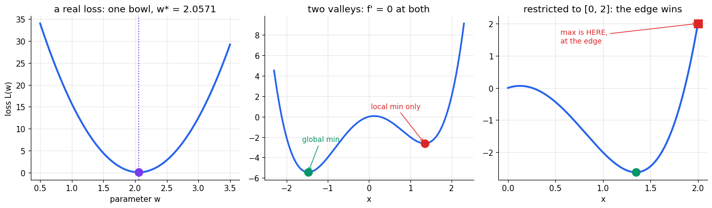

### Cell 167

```python
# ============================================================
#  Chop, multiply, add -- written out as a plain loop.
# ============================================================
def f_demo(z):
    """Our practice curve: f(z) = z squared."""
    return z ** 2

A, B = 0.0, 3.0          # where we start and where we stop

def left_sum(f, a, b, n):
    """Left Riemann sum: n rectangles, each as TALL as f at its LEFT edge."""
    width = (b - a) / n            # width of one sliver
    total = 0.0
    for i in range(n):
        z_left = a + i * width     # left edge of slice number i
        total += f(z_left) * width # height x width = area of one rectangle
    return total

# A yardstick to measure our error against: a midpoint sum so fine it is good
# to about ten decimal places. Later in this part we PROVE the exact value with
# algebra -- for now this is just a very trustworthy number to compare to.
_fine_n = 2_000_000
_fine_m = (np.arange(_fine_n) + 0.5) * (B - A) / _fine_n + A
REF = float(np.sum(f_demo(_fine_m)) * (B - A) / _fine_n)
print(f"reference area under f(z) = z^2 from {A:.0f} to {B:.0f}:  {REF:.10f}\n")

fig, axes = plt.subplots(1, 3, figsize=(13, 3.8))
zs = np.linspace(A, B, 400)
for ax, n in zip(axes, (1, 6, 24)):
    wdt   = (B - A) / n
    lefts = A + np.arange(n) * wdt
    ax.bar(lefts, f_demo(lefts), width=wdt, align="edge",
           color=C_AREA, alpha=0.30, edgecolor=C_AREA, linewidth=1.0)
    ax.plot(zs, f_demo(zs), color=C_F, lw=2.6)
    s = left_sum(f_demo, A, B, n)
    ax.set_title(f"n = {n}   sum = {s:.4f}\nshort by {REF - s:.4f}", fontsize=10)
    ax.set_xlabel("z")
axes[0].set_ylabel("f(z)")
fig.tight_layout()
plt.show()

print("      n |  left sum  |  how much area we are still missing")
print("  " + "-" * 50)
for n in (1, 2, 4, 8, 16, 32):
    s = left_sum(f_demo, A, B, n)
    print(f"  {n:>5} | {s:10.5f} | {REF - s:10.5f}")
```

**Output**

```text
reference area under f(z) = z^2 from 0 to 3:  9.0000000000
```

**Output**

```text
<Figure size 1300x380 with 3 Axes>
```

**Figure**

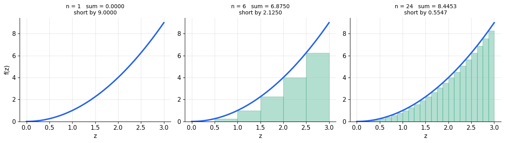

**Output**

```text
      n |  left sum  |  how much area we are still missing
  --------------------------------------------------
      1 |    0.00000 |    9.00000
      2 |    3.37500 |    5.62500
      4 |    5.90625 |    3.09375
      8 |    7.38281 |    1.61719
     16 |    8.17383 |    0.82617
     32 |    8.58252 |    0.41748
```

### Cell 169

```python
# ============================================================
#  Three honest choices of rectangle height.
# ============================================================
def right_sum(f, a, b, n):
    """Each rectangle as tall as f at its RIGHT edge."""
    width = (b - a) / n
    total = 0.0
    for i in range(n):
        z_right = a + (i + 1) * width
        total += f(z_right) * width
    return total

def mid_sum(f, a, b, n):
    """Each rectangle as tall as f at the MIDDLE of its slice."""
    width = (b - a) / n
    total = 0.0
    for i in range(n):
        z_mid = a + (i + 0.5) * width
        total += f(z_mid) * width
    return total

n = 8
wdt   = (B - A) / n
lefts = A + np.arange(n) * wdt
zs    = np.linspace(A, B, 400)

heights = {"left edge":   f_demo(lefts),
           "right edge":  f_demo(lefts + wdt),
           "midpoint":    f_demo(lefts + wdt / 2)}
sums    = {"left edge":   left_sum(f_demo, A, B, n),
           "right edge":  right_sum(f_demo, A, B, n),
           "midpoint":    mid_sum(f_demo, A, B, n)}

fig, axes = plt.subplots(1, 3, figsize=(13, 3.8), sharey=True)
for ax, (name, hgt) in zip(axes, heights.items()):
    ax.bar(lefts, hgt, width=wdt, align="edge",
           color=C_AREA, alpha=0.30, edgecolor=C_AREA, linewidth=1.0)
    ax.plot(zs, f_demo(zs), color=C_F, lw=2.6)
    if name == "midpoint":
        ax.plot(lefts + wdt / 2, hgt, "o", ms=4, color=C_SLOPE, zorder=5)
    err = sums[name] - REF
    ax.set_title(f"height from the {name}\nsum = {sums[name]:.4f}   "
                 f"error = {err:+.4f}", fontsize=10)
    ax.set_xlabel("z")
axes[0].set_ylabel("f(z)")
fig.tight_layout()
plt.show()

print(f"with the SAME n = {n} rectangles, and the truth at {REF:.6f}:\n")
for name in ("left edge", "right edge", "midpoint"):
    print(f"  {name:<12} {sums[name]:9.5f}   error {sums[name] - REF:+9.5f}")
print(f"\n  midpoint's error is {abs(sums['left edge'] - REF) / abs(sums['midpoint'] - REF):.0f}x "
      f"smaller than the left rule's, for exactly the same amount of work.")
```

**Output**

```text
<Figure size 1300x380 with 3 Axes>
```

**Figure**

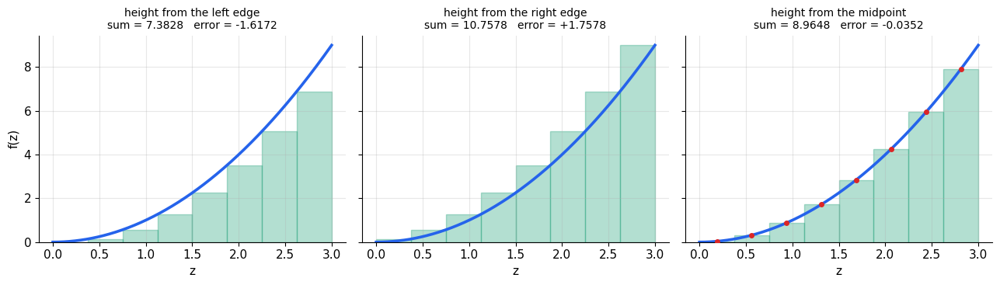

**Output**

```text
with the SAME n = 8 rectangles, and the truth at 9.000000:

  left edge      7.38281   error  -1.61719
  right edge    10.75781   error  +1.75781
  midpoint       8.96484   error  -0.03516

  midpoint's error is 46x smaller than the left rule's, for exactly the same amount of work.
```

### Cell 173

```python
# ============================================================
#  Do the sums converge? Watch the error column.
# ============================================================
trapz = np.trapezoid if hasattr(np, "trapezoid") else np.trapz   # numpy 2.x / 1.x

print(f"area under f(z) = z^2 on [{A:.0f}, {B:.0f}]   (reference {REF:.8f})\n")
print("     n |    width |      left |     right |  midpoint | trapezoid")
print("       |          |     error |     error |     error |     error")
print("  " + "-" * 66)
for n in (4, 8, 16, 64, 256):
    wdt = (B - A) / n
    L = left_sum(f_demo, A, B, n)
    R = right_sum(f_demo, A, B, n)
    M = mid_sum(f_demo, A, B, n)
    T = 0.5 * (L + R)
    print(f"  {n:>4} | {wdt:8.5f} | {L - REF:+9.5f} | {R - REF:+9.5f} | "
          f"{M - REF:+9.5f} | {T - REF:+9.5f}")

# Is the trapezoid rule really the average of left and right, and really what
# numpy computes? Two claims, both cheap to test.
n = 256
wdt   = (B - A) / n
edges = np.linspace(A, B, n + 1)
T_hand  = 0.5 * (left_sum(f_demo, A, B, n) + right_sum(f_demo, A, B, n))
T_formula = float(np.sum((f_demo(edges[:-1]) + f_demo(edges[1:])) / 2 * wdt))
T_numpy = float(trapz(f_demo(edges), edges))
print(f"\n  n = {n}:")
print(f"    (L + R)/2               = {T_hand:.10f}")
print(f"    trapezoid formula       = {T_formula:.10f}")
print(f"    np.trapezoid            = {T_numpy:.10f}")
print(f"    biggest gap between them = "
      f"{max(abs(T_hand - T_formula), abs(T_hand - T_numpy)):.2e}")

# Halving the width: what happens to the error?
print("\n  how fast does the error shrink when the slivers halve in width?")
prev_M = prev_T = None
for n in (32, 64, 128, 256, 512):
    M = mid_sum(f_demo, A, B, n)
    T = 0.5 * (left_sum(f_demo, A, B, n) + right_sum(f_demo, A, B, n))
    if prev_M is not None:
        print(f"    n {n//2:>4} -> {n:<4}:  midpoint error shrank "
              f"{abs(prev_M - REF) / abs(M - REF):5.2f}x,   "
              f"trapezoid {abs(prev_T - REF) / abs(T - REF):5.2f}x")
    prev_M, prev_T = M, T

# ------------------------------------------------------------------
#  So: is MORE rectangles always better? Let us actually check.
#  np.cumsum adds strictly left to right, one term at a time -- exactly what
#  our loop does -- so its last entry is the naive running total, and we can
#  ask for it in single precision to make the effect visible at a sane n.
# ------------------------------------------------------------------
def naive_mid_sum(n, dtype):
    """Midpoint sum accumulated one term at a time, in the given precision."""
    wdt   = dtype((B - A) / n)
    mids  = (np.arange(n, dtype=dtype) + dtype(0.5)) * wdt + dtype(A)
    terms = (mids * mids * wdt).astype(dtype)
    return float(np.cumsum(terms, dtype=dtype)[-1])

print("\n  pushing n as far as it will go:")
print("           n |  error, 64-bit floats |  error, 32-bit floats")
print("  " + "-" * 60)
for n in (10**2, 10**3, 10**4, 10**5, 10**6, 10**7):
    e64 = naive_mid_sum(n, np.float64) - REF
    e32 = naive_mid_sum(n, np.float32) - REF
    print(f"  {n:>10} | {e64:+21.3e} | {e32:+21.3e}")

print("\n  The 32-bit column improves, bottoms out, and then gets WORSE.")
print("  Nothing is wrong with the maths. Every one of those millions of")
print("  additions rounds the running total to the nearest representable")
print("  number, and past a certain n you are adding more rounding error")
print("  than you are removing approximation error.")
```

**Output**

```text
area under f(z) = z^2 on [0, 3]   (reference 9.00000000)

     n |    width |      left |     right |  midpoint | trapezoid
       |          |     error |     error |     error |     error
  ------------------------------------------------------------------
     4 |  0.75000 |  -3.09375 |  +3.65625 |  -0.14062 |  +0.28125
     8 |  0.37500 |  -1.61719 |  +1.75781 |  -0.03516 |  +0.07031
    16 |  0.18750 |  -0.82617 |  +0.86133 |  -0.00879 |  +0.01758
    64 |  0.04688 |  -0.20984 |  +0.21204 |  -0.00055 |  +0.00110
   256 |  0.01172 |  -0.05267 |  +0.05280 |  -0.00003 |  +0.00007

  n = 256:
    (L + R)/2               = 9.0000686646
    trapezoid formula       = 9.0000686646
    np.trapezoid            = 9.0000686646
    biggest gap between them = 0.00e+00

  how fast does the error shrink when the slivers halve in width?
    n   32 -> 64  :  midpoint error shrank  4.00x,   trapezoid  4.00x
    n   64 -> 128 :  midpoint error shrank  4.00x,   trapezoid  4.00x
    n  128 -> 256 :  midpoint error shrank  4.00x,   trapezoid  4.00x
    n  256 -> 512 :  midpoint error shrank  4.00x,   trapezoid  4.00x

  pushing n as far as it will go:
           n |  error, 64-bit floats |  error, 32-bit floats
  ------------------------------------------------------------
         100 |            -2.250e-04 |            -2.270e-04
        1000 |            -2.250e-06 |            -4.768e-06
       10000 |            -2.250e-08 |            -5.722e-06
      100000 |            -2.244e-10 |            +5.631e-13
     1000000 |            -1.215e-12 |            -7.095e-04
    10000000 |            +4.050e-13 |            +9.794e-02

  The 32-bit column improves, bottoms out, and then gets WORSE.
  Nothing is wrong with the maths. Every one of those millions of
  additions rounds the running total to the nearest representable
  number, and past a certain n you are adding more rounding error
  than you are removing approximation error.
```

### Cell 178

```python
# ============================================================
#  An exact answer, from algebra alone -- no calculus, no rectangles.
#  (Archimedes did essentially this, by hand, around 250 BC.)
# ============================================================
i_s, n_s = sp.symbols("i n", positive=True, integer=True)

# The classical closed form for the sum of the first n squares:
sum_squares = sp.summation(i_s**2, (i_s, 1, n_s))
print("sum of i^2 for i = 1..n  =  ", sp.factor(sum_squares))

# The RIGHT Riemann sum for f(x) = x^2 on [0, 3] with n slices:
#   width = 3/n,  right edge of slice i is x_i = 3i/n
R_n = sp.summation((3 * i_s / n_s)**2 * (sp.Integer(3) / n_s), (i_s, 1, n_s))
R_n = sp.simplify(sp.expand(R_n))
print("right sum with n slices  =  ", R_n)

# Now let the slivers become infinitely thin -- a Part 2 limit, done exactly.
exact = sp.limit(R_n, n_s, sp.oo)
print("\nlimit as n -> infinity   =  ", exact)

# And confirm the algebra against the numbers we have been computing all along.
print(f"\n  exact value (algebra)        : {float(exact):.12f}")
print(f"  fine midpoint sum (numerics) : {REF:.12f}")
print(f"  difference                   : {abs(float(exact) - REF):.2e}")
for n in (10, 1000, 100000):
    print(f"  right sum at n = {n:>6}      : {float(R_n.subs(n_s, n)):.10f}")
```

**Output**

```text
sum of i^2 for i = 1..n  =   n*(n + 1)*(2*n + 1)/6
right sum with n slices  =   9 + 27/(2*n) + 9/(2*n**2)

limit as n -> infinity   =   9

  exact value (algebra)        : 9.000000000000
  fine midpoint sum (numerics) : 8.999999999999
  difference                   : 5.63e-13
  right sum at n =     10      : 10.3950000000
  right sum at n =   1000      : 9.0135045000
  right sum at n = 100000      : 9.0001350004
```

### Cell 181

```python
# ============================================================
#  A function that crosses zero: g(z) = z - 2 on [0, 4].
#  Chosen because school geometry gives the exact answer:
#    two triangles, each base 2 and height 2, so area 2 each.
# ============================================================
def g(z):
    return z - 2.0

GA, GB = 0.0, 4.0
N = 200_000

signed   = mid_sum(g, GA, GB, N)                     # lets the minus signs act
unsigned = mid_sum(lambda z: abs(g(z)), GA, GB, N)   # forces every bit positive

zs = np.linspace(GA, GB, 400)
fig, ax = plt.subplots(figsize=(9, 4.0))
ax.plot(zs, g(zs), color=C_F, lw=2.6)
ax.fill_between(zs, g(zs), 0, where=(g(zs) >= 0), color=C_AREA, alpha=0.35,
                label="counts as +2")
ax.fill_between(zs, g(zs), 0, where=(g(zs) <= 0), color=C_SLOPE, alpha=0.30,
                label="counts as -2")
ax.axhline(0, color=C_GREY, lw=1.4)
ax.set_xlabel("z")
ax.set_ylabel("g(z) = z - 2")
ax.set_title("Below the axis, the height is negative, so the area subtracts")
ax.legend(loc="upper left")
fig.tight_layout()
plt.show()

print(f"  signed  integral of g   : {signed:+.6f}     (exact: 0, the two halves cancel)")
print(f"  unsigned integral of |g|: {unsigned:+.6f}     (exact: 4, two triangles of area 2)")
print()
print(f"  piece on [0, 2] (below) : {mid_sum(g, 0.0, 2.0, N):+.6f}")
print(f"  piece on [2, 4] (above) : {mid_sum(g, 2.0, 4.0, N):+.6f}")
print()
print("  If g were a velocity in m/s over 4 seconds:")
print(f"    displacement      = {signed:+.4f} m   -- you finished where you began")
print(f"    distance travelled = {unsigned:.4f} m   -- but the odometer still moved")
```

**Output**

```text
<Figure size 900x400 with 1 Axes>
```

**Figure**

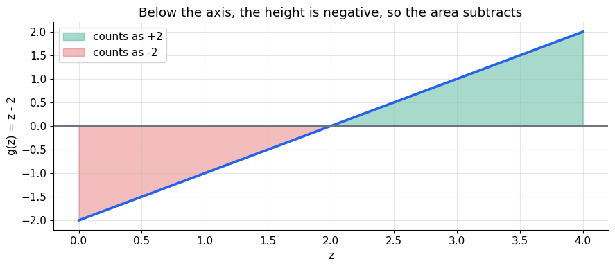

**Output**

```text
  signed  integral of g   : +0.000000     (exact: 0, the two halves cancel)
  unsigned integral of |g|: +4.000000     (exact: 4, two triangles of area 2)

  piece on [0, 2] (below) : -2.000000
  piece on [2, 4] (above) : +2.000000

  If g were a velocity in m/s over 4 seconds:
    displacement      = +0.0000 m   -- you finished where you began
    distance travelled = 4.0000 m   -- but the odometer still moved
```

### Cell 185

```python
# ============================================================
#  Verify all five claims numerically. Nothing here is assumed.
# ============================================================
N = 200_000
def I(f, a, b):
    """Our integral: a very fine midpoint sum. Works for b < a too."""
    return mid_sum(f, a, b, N)

def report(label, lhs, rhs):
    ok = "OK " if abs(lhs - rhs) < 1e-6 else "!! "
    print(f"  {ok}{label:<44} {lhs:+13.8f}  vs {rhs:+13.8f}   "
          f"gap {abs(lhs - rhs):.2e}")

whole = I(f_demo, 0.0, 3.0)

print("1. additivity -- split the interval anywhere")
report("I(0,3)  ==  I(0,1) + I(1,3)", whole, I(f_demo, 0, 1) + I(f_demo, 1, 3))
report("I(0,3)  ==  I(0,0.7)+I(0.7,2.1)+I(2.1,3)", whole,
       I(f_demo, 0, 0.7) + I(f_demo, 0.7, 2.1) + I(f_demo, 2.1, 3))

print("\n2. swapping the limits flips the sign")
report("I(3,0)  ==  -I(0,3)", I(f_demo, 3.0, 0.0), -whole)
report("I(2,2)  ==  0", I(f_demo, 2.0, 2.0), 0.0)

print("\n3. linearity -- constants out, sums apart")
report("I(5*f)  ==  5 * I(f)", I(lambda z: 5 * f_demo(z), 0, 3), 5 * whole)
report("I(f + sin)  ==  I(f) + I(sin)",
       I(lambda z: f_demo(z) + np.sin(z), 0, 3),
       whole + I(np.sin, 0, 3))

print(f"\n  (every 'gap' above is a numerical-integration error, not a broken")
print(f"   identity -- they shrink if you raise N from {N:,}.)")
```

**Output**

```text
1. additivity -- split the interval anywhere
  OK I(0,3)  ==  I(0,1) + I(1,3)                    +9.00000000  vs   +9.00000000   gap 3.74e-11
  OK I(0,3)  ==  I(0,0.7)+I(0.7,2.1)+I(2.1,3)       +9.00000000  vs   +9.00000000   gap 4.82e-11

2. swapping the limits flips the sign
  OK I(3,0)  ==  -I(0,3)                            -9.00000000  vs   -9.00000000   gap 3.55e-14
  OK I(2,2)  ==  0                                  +0.00000000  vs   +0.00000000   gap 0.00e+00

3. linearity -- constants out, sums apart
  OK I(5*f)  ==  5 * I(f)                          +45.00000000  vs  +45.00000000   gap 3.27e-13
  OK I(f + sin)  ==  I(f) + I(sin)                 +10.98999250  vs  +10.98999250   gap 1.31e-13

  (every 'gap' above is a numerical-integration error, not a broken
   identity -- they shrink if you raise N from 200,000.)
```

### Cell 188

```python
# ============================================================
#  Integrate the speed. Compare against the recorded positions.
# ============================================================
step  = 0.001                                     # one millisecond slivers
edges = np.arange(0.0, 120.0 + step / 2, step)    # 0.000, 0.001, ..., 120.000
mids  = edges[:-1] + step / 2                     # midpoint of every sliver

sliver_areas = speed_mps(mids) * step             # speed x time = distance
running      = np.concatenate([[0.0], np.cumsum(sliver_areas)])   # accumulate

# read the running total off at each whole second, to line up with pos_m
idx          = np.round(t_sec / step).astype(int)
integrated   = running[idx]

diff    = integrated - pos_m
maxdiff = np.abs(diff).max()

print(f"  slivers used            : {len(mids):,}  of width {step} s")
print(f"  integrated distance     : {integrated[-1]:,.4f} m")
print(f"  recorded pos_m[-1]      : {pos_m[-1]:,.4f} m")
print(f"  MAX ABSOLUTE DIFFERENCE : {maxdiff:.6f} m  "
      f"({100 * maxdiff / pos_m[-1]:.5f}% of the trip)\n")

# The same thing with the crude 1-second grid, for contrast.
coarse = np.concatenate([[0.0], np.cumsum((v_true[:-1] + v_true[1:]) / 2)])
print(f"  1-second trapezoid rule : max difference {np.abs(coarse - pos_m).max():.2e} m")
print("    (that one is zero by construction -- it is literally the arithmetic")
print("     Part 0 used to build pos_m from v_true in the first place.)")

fig, (ax1, ax2) = plt.subplots(1, 2, figsize=(12, 4.0))
ax1.plot(t_sec, pos_m, color=C_F, lw=4.0, alpha=0.35, label="recorded position")
ax1.plot(t_sec, integrated, color=C_AREA, lw=1.8, ls="--",
         label="integral of the speed")
ax1.set_xlabel("time (seconds)")
ax1.set_ylabel("distance (metres)")
ax1.set_title("Two curves, drawn on top of each other")
ax1.legend(loc="upper left")

ax2.plot(t_sec, diff, color=C_SLOPE, lw=2.0)
ax2.axhline(0, color=C_GREY, lw=1.0)
ax2.set_xlabel("time (seconds)")
ax2.set_ylabel("difference (metres)")
ax2.set_title("What is left over, magnified")
fig.tight_layout()
plt.show()

# And the picture of what we just did: area under the speed curve up to t = 55.
fig, ax = plt.subplots(figsize=(9, 3.8))
ax.plot(t_sec, v_true, color=C_SLOPE, lw=2.4)
ax.fill_between(t_sec, v_true, 0, where=(t_sec <= 55), color=C_AREA, alpha=0.30)
ax.set_xlabel("time (seconds)")
ax.set_ylabel("speed (m/s)")
ax.set_title(f"Shaded area = {integrated[55]:,.1f} m travelled by t = 55 s")
fig.tight_layout()
plt.show()
```

**Output**

```text
  slivers used            : 120,000  of width 0.001 s
  integrated distance     : 1,145.6101 m
  recorded pos_m[-1]      : 1,145.6015 m
  MAX ABSOLUTE DIFFERENCE : 0.090455 m  (0.00790% of the trip)

  1-second trapezoid rule : max difference 0.00e+00 m
    (that one is zero by construction -- it is literally the arithmetic
     Part 0 used to build pos_m from v_true in the first place.)
```

**Output**

```text
<Figure size 1200x400 with 2 Axes>
```

**Figure**

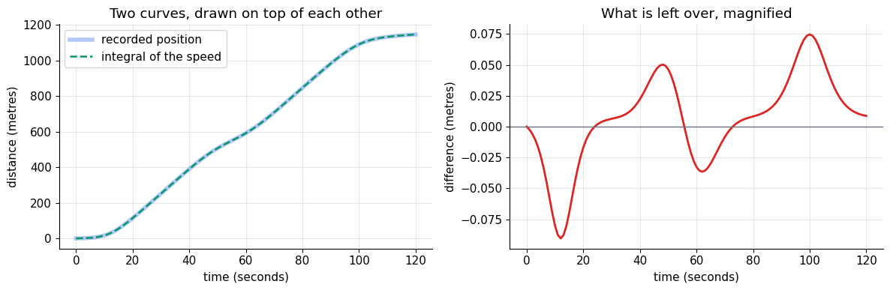

**Output**

```text
<Figure size 900x380 with 1 Axes>
```

**Figure**

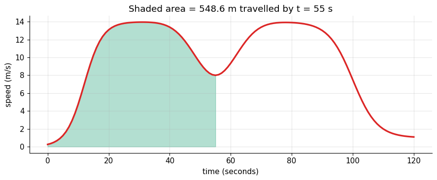

### Cell 192

```python
# ============================================================
#  scipy does it adaptively, and tells you its own error bar.
# ============================================================
from scipy.integrate import quad

val, abserr = quad(f_demo, 0.0, 3.0)
print("A. an integral whose exact answer we PROVED above (should be 9):")
print(f"     quad estimate     = {val:.14f}")
print(f"     quad's error bar  = {abserr:.3e}")
print(f"     actual error      = {abs(val - 9.0):.3e}   "
      f"(inside its own bar: {abs(val - 9.0) <= abserr})")

print("\nB. the bell curve, which has NO elementary antiderivative:")
bell = lambda z: np.exp(-z ** 2)
val_b, err_b = quad(bell, 0.0, 1.0)
truth_b = float(sp.N(sp.sqrt(sp.pi) / 2 * sp.erf(1), 20))   # via the erf function
print(f"     quad estimate     = {val_b:.14f}")
print(f"     quad's error bar  = {err_b:.3e}")
print(f"     high-precision    = {truth_b:.14f}")
print(f"     actual error      = {abs(val_b - truth_b):.3e}")
print("     No formula-hunting will help here. Numerics is the answer, not a")
print("     substitute for one.")

print("\nC. our car, integrated by scipy instead of by our loop:")
val_c, err_c = quad(speed_mps, 0.0, 120.0, limit=200)
print(f"     quad estimate     = {val_c:,.6f} m   (error bar {err_c:.2e})")
print(f"     our midpoint sum  = {integrated[-1]:,.6f} m")
print(f"     recorded pos_m    = {pos_m[-1]:,.6f} m")
print(f"     quad vs our sum   = {abs(val_c - integrated[-1]):.2e} m")

print("\nD. why 'adaptive' matters -- a function that is calm then violent:")
spiky = lambda z: np.exp(-20000.0 * (z - 0.5) ** 2)   # a very narrow bump
val_d, err_d = quad(spiky, 0.0, 1.0)
print(f"     quad              = {val_d:.12f}   (error bar {err_d:.1e})")
for n in (20, 50, 200, 2000):
    got = mid_sum(spiky, 0.0, 1.0, n)
    print(f"     plain midpoint n={n:<5} = {got:.12f}"
          f"   off by {100 * abs(got - val_d) / val_d:8.4f}%")
```

**Output**

```text
A. an integral whose exact answer we PROVED above (should be 9):
     quad estimate     = 9.00000000000000
     quad's error bar  = 9.992e-14
     actual error      = 1.776e-15   (inside its own bar: True)

B. the bell curve, which has NO elementary antiderivative:
     quad estimate     = 0.74682413281243
     quad's error bar  = 8.291e-15
     high-precision    = 0.74682413281243
     actual error      = 1.110e-16
     No formula-hunting will help here. Numerics is the answer, not a
     substitute for one.

C. our car, integrated by scipy instead of by our loop:
     quad estimate     = 1,145.610117 m   (error bar 1.04e-08)
     our midpoint sum  = 1,145.610117 m
     recorded pos_m    = 1,145.601461 m
     quad vs our sum   = 4.33e-09 m

D. why 'adaptive' matters -- a function that is calm then violent:
     quad              = 0.012533141373   (error bar 4.1e-09)
     plain midpoint n=20    = 0.000000372665   off by  99.9970%
     plain midpoint n=50    = 0.005413411939   off by  56.8072%
     plain midpoint n=200   = 0.012533141306   off by   0.0000%
     plain midpoint n=2000  = 0.012533141373   off by   0.0000%
```

### Cell 199

```python
# ============================================================
#  The area function, built by brute force.
#  f wiggles on purpose: it has tall stretches and short ones,
#  so we can watch A climb fast and then climb slowly.
# ============================================================
def f_demo(z):
    """A positive, wiggling function. Nothing special about it."""
    return 2.0 + np.sin(z)

A_LO, A_HI = 0.0, 8.0
xs  = np.linspace(A_LO, A_HI, 8001)      # step exactly 0.001
fs  = f_demo(xs)
dxs = xs[1] - xs[0]

# A(x) = area under f from A_LO up to x, accumulated as we sweep right.
# This is EXACTLY the trapezoid rule of Part 6 -- kept running, instead of
# reported once at the end. A[0] = 0, because we have not gone anywhere yet.
A_num = np.concatenate([[0.0], np.cumsum((fs[:-1] + fs[1:]) / 2 * dxs)])

fig, (ax1, ax2) = plt.subplots(2, 1, figsize=(10, 6.6), sharex=True)

ax1.plot(xs, fs, color=C_F, lw=2.4)
ax1.set_ylabel("f(x)")
ax1.set_ylim(0, 3.4)
ax1.set_title("f  --  the tap.  Tall means filling fast.")

ax2.plot(xs, A_num, color=C_AREA, lw=2.6)
ax2.set_ylabel("A(x)  =  area so far")
ax2.set_xlabel("x   (where we stop)")
ax2.set_title("A  --  the bath.  Its STEEPNESS is f.")

# mark three stopping points, and shade the area each one has collected
for xm, tag in [(2.0, "x = 2"), (4.5, "x = 4.5"), (7.0, "x = 7")]:
    k = int(round((xm - A_LO) / dxs))
    ax1.fill_between(xs[:k + 1], 0, fs[:k + 1], color=C_AREA, alpha=0.16)
    ax1.axvline(xm, color=C_GREY, ls=":", lw=1.2)
    ax2.axvline(xm, color=C_GREY, ls=":", lw=1.2)
    ax2.plot([xm], [A_num[k]], "o", color=C_EXACT, ms=7, zorder=5)
    ax2.annotate(f"{tag}\nA = {A_num[k]:.2f}", (xm, A_num[k]),
                 textcoords="offset points", xytext=(9, -30), fontsize=9)

fig.tight_layout()
plt.show()

print("Area collected so far, at a few stopping points:")
for xm in (1.0, 2.0, 4.5, 7.0, 8.0):
    k = int(round((xm - A_LO) / dxs))
    print(f"    A({xm:>4.1f}) = {A_num[k]:8.4f}      "
          f"(f there = {fs[k]:.3f})")
print()
print("Two things to notice, both visible in the picture:")
print("  * A never decreases -- f is never negative, so the tap never reverses.")
print("  * A is STEEPEST exactly where f is TALLEST, and flattest where f dips.")
```

**Output**

```text
<Figure size 1000x660 with 2 Axes>
```

**Figure**

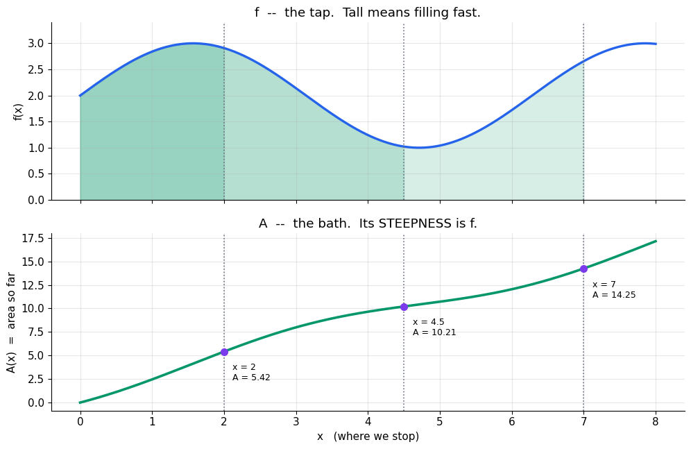

**Output**

```text
Area collected so far, at a few stopping points:
    A( 1.0) =   2.4597      (f there = 2.841)
    A( 2.0) =   5.4161      (f there = 2.909)
    A( 4.5) =  10.2108      (f there = 1.022)
    A( 7.0) =  14.2461      (f there = 2.657)
    A( 8.0) =  17.1455      (f there = 2.989)

Two things to notice, both visible in the picture:
  * A never decreases -- f is never negative, so the tap never reverses.
  * A is STEEPEST exactly where f is TALLEST, and flattest where f dips.
```

### Cell 202

```python
# ============================================================
#  Differentiate A numerically -- Part 3's difference quotient,
#  applied to the array we just built.
#  np.gradient computes the central difference
#         ( A[i+1] - A[i-1] ) / (2 * step)
#  which is exactly the symmetric slope estimate from Part 3.
# ============================================================
dA = np.gradient(A_num, xs)

err = np.abs(dA - fs)
print(f"max  | d/dx A(x)  minus  f(x) |  =  {err.max():.3e}")
print(f"mean | d/dx A(x)  minus  f(x) |  =  {err.mean():.3e}")
print(f"(for scale, f itself ranges over {fs.min():.3f} .. {fs.max():.3f})")
print()
print("    x       d/dx A(x)          f(x)         difference")
for xm in (0.5, 1.6, 3.0, 4.7, 6.2, 7.5):
    k = int(round((xm - A_LO) / dxs))
    print(f"  {xm:4.1f}     {dA[k]:12.8f}   {fs[k]:12.8f}     {dA[k] - fs[k]:+.2e}")

fig, ax = plt.subplots(figsize=(10, 4.4))
ax.plot(xs, fs, color=C_F, lw=7, alpha=0.32,
        label="f(x)  --  the function we started with")
ax.plot(xs, dA, color=C_SLOPE, lw=1.9, ls="--",
        label="derivative of the area function A(x)")
ax.set_xlabel("x")
ax.set_ylabel("value")
ax.set_ylim(0, 3.4)
ax.set_title("We integrated f, then differentiated the result, and got f back")
ax.legend(loc="lower left")
fig.tight_layout()
plt.show()
```

**Output**

```text
max  | d/dx A(x)  minus  f(x) |  =  5.000e-04
mean | d/dx A(x)  minus  f(x) |  =  2.323e-07
(for scale, f itself ranges over 1.000 .. 3.000)

    x       d/dx A(x)          f(x)         difference
   0.5       2.47942542     2.47942554     -1.20e-07
   1.6       2.99957335     2.99957360     -2.50e-07
   3.0       2.14111997     2.14112001     -3.53e-08
   4.7       1.00007699     1.00007674     +2.50e-07
   6.2       1.91691062     1.91691060     +2.08e-08
   7.5       2.93799974     2.93799998     -2.34e-07
```

**Output**

```text
<Figure size 1000x440 with 1 Axes>
```

**Figure**

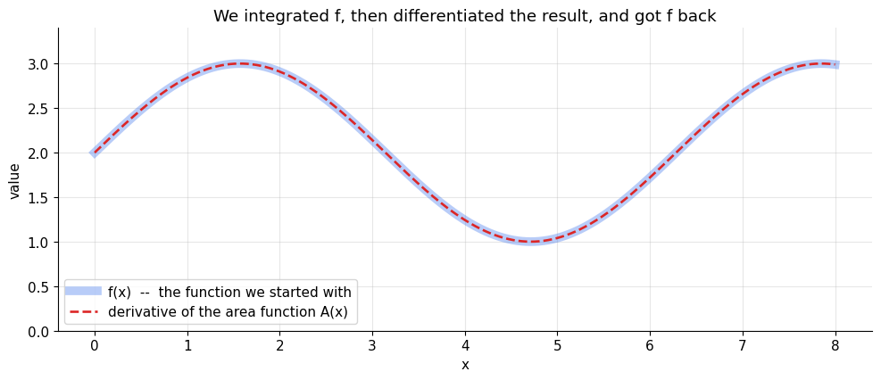

### Cell 205

```python
# ============================================================
#  The sliver -- drawn, and then measured as h shrinks.
# ============================================================
X0 = 5.0
k0 = int(round((X0 - A_LO) / dxs))
H_BIG = 0.9
k1 = int(round((X0 + H_BIG - A_LO) / dxs))

fig, (axL, axR) = plt.subplots(1, 2, figsize=(12, 4.5))

# ---- left: the whole picture, with the sliver picked out -------------------
axL.plot(xs, fs, color=C_F, lw=2.4)
axL.fill_between(xs[:k0 + 1], 0, fs[:k0 + 1], color=C_AREA, alpha=0.18)
axL.fill_between(xs[k0:k1 + 1], 0, fs[k0:k1 + 1], color=C_APPROX, alpha=0.80)
axL.set_ylim(0, 3.4)
axL.set_xlabel("x")
axL.set_ylabel("f(x)")
axL.set_title("A(x+h) minus A(x)  is JUST the orange sliver")
axL.annotate("all of this is in BOTH\nA(x+h) and A(x),\nso it cancels",
             (1.5, 0.7), fontsize=9, color=C_GREY)
axL.annotate("the sliver", (X0 + H_BIG + 0.2, 2.2), fontsize=9, color=C_APPROX)

# ---- right: zoom in, and lay the rectangle f(x)*h over it ------------------
zl, zr = X0 - 0.25, X0 + H_BIG + 0.25
mz = (xs >= zl) & (xs <= zr)
axR.plot(xs[mz], fs[mz], color=C_F, lw=2.8, zorder=4, label="f, the true top edge")
axR.fill_between(xs[k0:k1 + 1], 0, fs[k0:k1 + 1], color=C_APPROX, alpha=0.55,
                 label="the true sliver")
axR.add_patch(plt.Rectangle((X0, 0), H_BIG, fs[k0], fill=False,
                            edgecolor=C_SLOPE, lw=2.4, ls="--", zorder=5))
axR.set_xlim(zl, zr)
axR.set_ylim(0, fs[k0] * 1.75)
axR.set_xlabel("x")
axR.set_title("the rectangle  f(x) times h  (dashed)  vs  the true sliver")
axR.annotate("height f(x)", (X0 + 0.05, fs[k0] * 1.05), fontsize=9, color=C_SLOPE)
axR.annotate("width h", (X0 + H_BIG / 2 - 0.1, 0.1), fontsize=9, color=C_SLOPE)
axR.annotate("this wedge is the whole error,\nand it shrinks faster than h does",
             (X0 + 0.05, fs[k0] * 1.35), fontsize=8.5, color=C_GREY)
axR.legend(loc="lower right", fontsize=8)

fig.tight_layout()
plt.show()

# ---- and now the numbers, as h shrinks ------------------------------------
# We read A straight off the array we built, so nothing here knows any algebra.
print(f"At x = {X0}:    f(x) = {f_demo(X0):.9f}")
print()
print("      h        ( A(x+h) - A(x) ) / h        difference from f(x)")
for hh in (0.9, 0.3, 0.1, 0.03, 0.01, 0.003, 0.001):
    step = int(round(hh / dxs))
    q = (A_num[k0 + step] - A_num[k0]) / hh
    print(f"  {hh:7.4f}          {q:14.9f}            {q - f_demo(X0):+.3e}")
print()
print("The quotient walks straight into f(x) -- roughly one extra decimal place")
print("each time h shrinks tenfold. That is A'(x) = f(x), watched happening")
print("rather than asserted.")
```

**Output**

```text
<Figure size 1200x450 with 2 Axes>
```

**Figure**

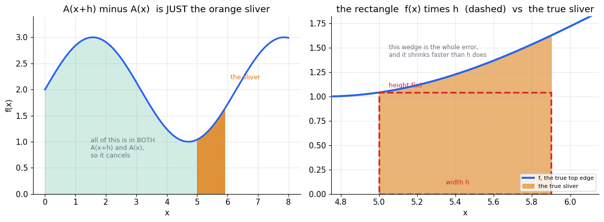

**Output**

```text
At x = 5.0:    f(x) = 1.041075725

      h        ( A(x+h) - A(x) ) / h        difference from f(x)
   0.9000             1.284648676            +2.436e-01
   0.3000             1.097626239            +5.655e-02
   0.1000             1.056844506            +1.577e-02
   0.0300             1.045474251            +4.399e-03
   0.0100             1.042510086            +1.434e-03
   0.0030             1.041502737            +4.270e-04
   0.0010             1.041217796            +1.421e-04

The quotient walks straight into f(x) -- roughly one extra decimal place
each time h shrinks tenfold. That is A'(x) = f(x), watched happening
rather than asserted.
```

### Cell 209

```python
# ============================================================
#  The payoff.
#  Part 6 would attack this integral with rectangles:
#          integral, from 0 to pi, of   x * sin(x)  dx
#  We do it BOTH ways and put the answers side by side.
# ============================================================
def g_demo(z):
    return z * np.sin(z)

a_lim, b_lim = 0.0, np.pi

# ---- the Part 6 way: 256 left rectangles ---------------------------------
n_rect = 256
edges  = np.linspace(a_lim, b_lim, n_rect + 1)
w_rect = (b_lim - a_lim) / n_rect
riemann_256 = np.sum(g_demo(edges[:-1])) * w_rect

# ---- the Part 7 way: find F with F' = g, then subtract two numbers -------
# Guess F(x) = sin(x) - x*cos(x). A guess is worthless until it is checked,
# so differentiate it back before using it. If the guess is wrong this cell
# raises AssertionError instead of quietly printing a wrong number.
F_sym = sp.sin(x) - x * sp.cos(x)
print("guessed   F(x) =", F_sym)
print("its derivative =", sp.simplify(sp.diff(F_sym, x)), "  <- must be x*sin(x)")
assert sp.simplify(sp.diff(F_sym, x) - x * sp.sin(x)) == 0
print("CHECKED: F really is an antiderivative of x*sin(x).")
print()

F_demo = lambda z: np.sin(z) - z * np.cos(z)
exact  = F_demo(b_lim) - F_demo(a_lim)

print("By hand, F(pi) - F(0):")
print("   F(pi) = sin(pi) - pi*cos(pi) = 0 - pi*(-1) = pi")
print("   F(0)  = sin(0)  - 0*cos(0)   = 0")
print("   so the integral is exactly pi.")
print("   sympy, asked independently   :",
      sp.integrate(x * sp.sin(x), (x, 0, sp.pi)))
print()
print("=" * 64)
print(f"  256 rectangles (Part 6)  : {riemann_256:.12f}")
print(f"  F(b) - F(a)    (Part 7)  : {exact:.12f}")
print(f"  pi                       : {np.pi:.12f}")
print(f"  rectangle error          : {abs(riemann_256 - np.pi):.3e}")
print(f"  antiderivative error     : {abs(exact - np.pi):.3e}")
print("=" * 64)
print()
print("How many rectangles would Part 6 need in order to catch up?")
for n in (16, 64, 256, 1024, 4096, 16384, 65536):
    e = np.linspace(a_lim, b_lim, n + 1)
    s = np.sum(g_demo(e[:-1])) * (b_lim - a_lim) / n
    print(f"    n = {n:>6}   ->   {s:.10f}    error {abs(s - np.pi):.2e}")
print()
print("It never catches up. It only creeps, and each decimal place costs it")
print("about ten times the work. The antiderivative does not creep: it hands")
print("you pi -- the actual number, not a decimal approximation to it -- for")
print("the price of one subtraction.")
```

**Output**

```text
guessed   F(x) = -x*cos(x) + sin(x)
its derivative = x*sin(x)   <- must be x*sin(x)
CHECKED: F really is an antiderivative of x*sin(x).

By hand, F(pi) - F(0):
   F(pi) = sin(pi) - pi*cos(pi) = 0 - pi*(-1) = pi
   F(0)  = sin(0)  - 0*cos(0)   = 0
   so the integral is exactly pi.
   sympy, asked independently   : pi

================================================================
  256 rectangles (Part 6)  : 3.141553226971
  F(b) - F(a)    (Part 7)  : 3.141592653590
  pi                       : 3.141592653590
  rectangle error          : 3.943e-05
  antiderivative error     : 0.000e+00
================================================================

How many rectangles would Part 6 need in order to catch up?
    n =     16   ->   3.1314929732    error 1.01e-02
    n =     64   ->   3.1409618039    error 6.31e-04
    n =    256   ->   3.1415532270    error 3.94e-05
    n =   1024   ->   3.1415901894    error 2.46e-06
    n =   4096   ->   3.1415924996    error 1.54e-07
    n =  16384   ->   3.1415926440    error 9.63e-09
    n =  65536   ->   3.1415926530    error 6.02e-10

It never catches up. It only creeps, and each decimal place costs it
about ten times the work. The antiderivative does not creep: it hands
you pi -- the actual number, not a decimal approximation to it -- for
the price of one subtraction.
```

### Cell 212

```python
# ============================================================
#  The family: every one of these has derivative x**2.
# ============================================================
xs3   = np.linspace(-2.2, 2.2, 400)
X_TAN = 1.3
SLOPE = X_TAN ** 2                 # d/dx of x**3/3 is x**2

fig, (axA, axB) = plt.subplots(1, 2, figsize=(12, 4.5))

for Cval, alpha in zip([-2, -1, 0, 1, 2], [0.5, 0.7, 1.0, 0.7, 0.5]):
    axA.plot(xs3, xs3 ** 3 / 3 + Cval, color=C_EXACT, lw=2.0, alpha=alpha)
    y0  = X_TAN ** 3 / 3 + Cval
    seg = np.array([-0.6, 0.6])
    axA.plot(X_TAN + seg, y0 + SLOPE * seg, color=C_SLOPE, lw=2.4)
    axA.plot([X_TAN], [y0], "o", color=C_SLOPE, ms=5, zorder=5)
    axA.annotate(f"C = {Cval:+d}", (2.26, 2.2 ** 3 / 3 + Cval - 0.15),
                 fontsize=9, color=C_EXACT)

axA.set_xlim(-2.3, 3.2)
axA.set_xlabel("x")
axA.set_ylabel("F(x) = (x cubed)/3 + C")
axA.set_title("Five antiderivatives of f(x) = x squared")

axB.plot(xs3, xs3 ** 2, color=C_F, lw=2.6)
axB.set_xlabel("x")
axB.set_ylabel("f(x) = x squared")
axB.set_title("...and all five have THIS as their derivative")
axB.axvline(X_TAN, color=C_SLOPE, ls=":", lw=1.4)
axB.plot([X_TAN], [SLOPE], "o", color=C_SLOPE, ms=7, zorder=5)
axB.annotate(f"every red segment on the left\nhas this one slope, {SLOPE:.2f}",
             (X_TAN + 0.15, SLOPE - 0.1), fontsize=9, color=C_SLOPE)

fig.tight_layout()
plt.show()

# ---- the cancellation, shown rather than claimed --------------------------
a_c, b_c = 0.5, 2.0
print(f"Integral of x squared from {a_c} to {b_c}, computed with different C:")
print()
for Cval in (-2.0, 0.0, 3.7, 1000.0):
    Fb = b_c ** 3 / 3 + Cval
    Fa = a_c ** 3 / 3 + Cval
    print(f"   C = {Cval:>8.1f}    F(b) = {Fb:>13.4f}   F(a) = {Fa:>11.4f}"
          f"   F(b) - F(a) = {Fb - Fa:.10f}")
print()
print(f"   sympy, definite integral, no C anywhere = "
      f"{float(sp.integrate(x ** 2, (x, sp.Rational(1, 2), 2))):.10f}")
print()
print("Every C gives the same answer, to every decimal place. That is why you")
print("may set it to zero when computing an area -- and why you may NOT when")
print("you are reconstructing a function.")
```

**Output**

```text
<Figure size 1200x450 with 2 Axes>
```

**Figure**

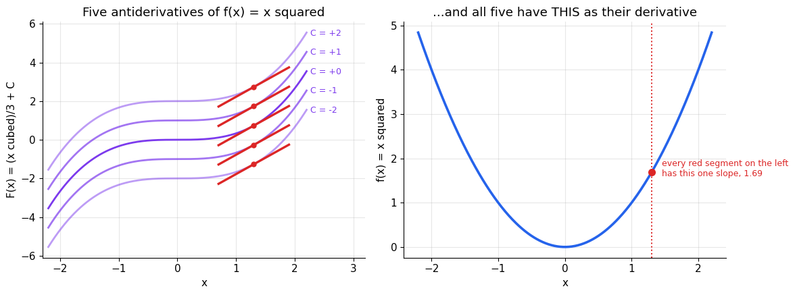

**Output**

```text
Integral of x squared from 0.5 to 2.0, computed with different C:

   C =     -2.0    F(b) =        0.6667   F(a) =     -1.9583   F(b) - F(a) = 2.6250000000
   C =      0.0    F(b) =        2.6667   F(a) =      0.0417   F(b) - F(a) = 2.6250000000
   C =      3.7    F(b) =        6.3667   F(a) =      3.7417   F(b) - F(a) = 2.6250000000
   C =   1000.0    F(b) =     1002.6667   F(a) =   1000.0417   F(b) - F(a) = 2.6250000000

   sympy, definite integral, no C anywhere = 2.6250000000

Every C gives the same answer, to every decimal place. That is why you
may set it to zero when computing an area -- and why you may NOT when
you are reconstructing a function.
```

### Cell 216

```python
# ============================================================
#  Down the loop and back up it.
#     pos_m   --differentiate-->   speed      (should equal v_true)
#     v_true  --integrate----->    position   (should equal pos_m)
# ============================================================
dt = t_sec[1] - t_sec[0]                       # 1 second between readings

# ---- direction 1: differentiate position    (Part 3) --------------------
v_from_pos = np.gradient(pos_m, t_sec)

# ---- direction 2: integrate speed           (Part 6) --------------------
pos_from_v = np.concatenate([[0.0],
                             np.cumsum((v_true[:-1] + v_true[1:]) / 2 * dt)])

err_v = np.abs(v_from_pos - v_true)
err_p = np.abs(pos_from_v - pos_m)

fig, (axV, axP) = plt.subplots(1, 2, figsize=(12, 4.4))

axV.plot(t_sec, v_true, color=C_SLOPE, lw=7, alpha=0.30,
         label="v_true  (the truth)")
axV.plot(t_sec, v_from_pos, color=C_F, lw=1.8, ls="--",
         label="derivative of pos_m")
axV.set_xlabel("time (seconds)")
axV.set_ylabel("speed (m/s)")
axV.set_title("Differentiate position  ->  speed")
axV.legend(loc="lower center", fontsize=9)

axP.plot(t_sec, pos_m, color=C_F, lw=7, alpha=0.30,
         label="pos_m  (the truth)")
axP.plot(t_sec, pos_from_v, color=C_AREA, lw=1.8, ls="--",
         label="integral of v_true")
axP.set_xlabel("time (seconds)")
axP.set_ylabel("distance (m)")
axP.set_title("Integrate speed  ->  position")
axP.legend(loc="upper left", fontsize=9)

fig.tight_layout()
plt.show()

print("=" * 74)
print("  direction                        max error      mean error       scale")
print("-" * 74)
print(f"  differentiate pos_m -> speed    {err_v.max():10.3e}    {err_v.mean():10.3e}"
      f"    {v_true.max():7.2f} m/s")
print(f"  integrate v_true -> position    {err_p.max():10.3e}    {err_p.mean():10.3e}"
      f"    {pos_m.max():7.1f} m")
print("=" * 74)
print()
print(f"  total distance, integrated from speed : {pos_from_v[-1]:,.6f} m")
print(f"  total distance, as measured           : {pos_m[-1]:,.6f} m")
print()
print("The integration leg is exact to machine precision -- but for a boring")
print("reason, not a profound one: pos_m was BUILT by this exact accumulation")
print("back in Part 0, so this leg tests arithmetic, not the theorem.")
print()
print("The differentiation leg carries a real, small error. That is not the")
print("theorem failing. It is the price of estimating a slope from readings")
print("taken a whole second apart. Halve the sampling interval and it quarters.")
```

**Output**

```text
<Figure size 1200x440 with 2 Axes>
```

**Figure**

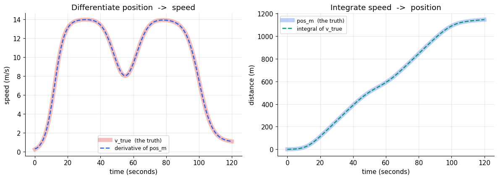

**Output**

```text
==========================================================================
  direction                        max error      mean error       scale
--------------------------------------------------------------------------
  differentiate pos_m -> speed     4.857e-02     1.264e-02      13.96 m/s
  integrate v_true -> position     0.000e+00     0.000e+00     1145.6 m
==========================================================================

  total distance, integrated from speed : 1,145.601461 m
  total distance, as measured           : 1,145.601461 m

The integration leg is exact to machine precision -- but for a boring
reason, not a profound one: pos_m was BUILT by this exact accumulation
back in Part 0, so this leg tests arithmetic, not the theorem.

The differentiation leg carries a real, small error. That is not the
theorem failing. It is the price of estimating a slope from readings
taken a whole second apart. Halve the sampling interval and it quarters.
```

### Cell 219

```python
# ============================================================
#  One worked example of each, verified three independent ways:
#  by hand, by sympy, and by brute-force rectangles that know
#  nothing whatever about antiderivatives.
# ============================================================
def brute(fn, lo, hi, n=400000):
    """Part 6's trapezoid rule, with enough slices to act as a referee."""
    zz = np.linspace(lo, hi, n + 1)
    vv = fn(zz)
    return np.sum((vv[:-1] + vv[1:]) / 2) * (hi - lo) / n

print("=" * 70)
print("EXAMPLE 1 -- reverse the power rule:    integral of x**4, from 1 to 3")
print("=" * 70)
print("   antiderivative  F(x) = x**5 / 5")
print("   check it:  d/dx F =", sp.diff(x ** 5 / 5, x), "   <- must be x**4")
by_hand = (3 ** 5 - 1 ** 5) / 5
print(f"   by hand    F(3) - F(1) = (243 - 1)/5   = {by_hand:.10f}")
print(f"   sympy                                  = "
      f"{float(sp.integrate(x ** 4, (x, 1, 3))):.10f}")
print(f"   400,000 trapezoids (Part 6 only)       = "
      f"{brute(lambda z: z ** 4, 1, 3):.10f}")
print()

print("=" * 70)
print("EXAMPLE 2 -- substitution:   integral of x * exp(x**2), from 0 to 2")
print("=" * 70)
print("   spot the pattern: the inner function is g(x) = x**2,")
print("   and g'(x) = 2x -- a copy of which (up to the factor 2) sits outside.")
print("   let u = x**2,  du = 2x dx,  so  x dx = du/2.")
print("   the limits move too:   x = 0 -> u = 0,   x = 2 -> u = 4.")
print("   the integral becomes   (1/2) * integral of exp(u) du, from 0 to 4")
print("                        = (1/2) * (exp(4) - exp(0))")
by_hand2 = 0.5 * (np.exp(4) - 1.0)
print()
print(f"   by hand                                = {by_hand2:.10f}")
print(f"   sympy                                  = "
      f"{float(sp.integrate(x * sp.exp(x ** 2), (x, 0, 2))):.10f}")
print(f"   400,000 trapezoids (Part 6 only)       = "
      f"{brute(lambda z: z * np.exp(z ** 2), 0, 2):.10f}")
print()
print("   and the antiderivative, differentiated straight back:")
print("      d/dx [ exp(x**2)/2 ] =",
      sp.simplify(sp.diff(sp.exp(x ** 2) / 2, x)), "  <- the original integrand")
```

**Output**

```text
======================================================================
EXAMPLE 1 -- reverse the power rule:    integral of x**4, from 1 to 3
======================================================================
   antiderivative  F(x) = x**5 / 5
   check it:  d/dx F = x**4    <- must be x**4
   by hand    F(3) - F(1) = (243 - 1)/5   = 48.4000000000
   sympy                                  = 48.4000000000
   400,000 trapezoids (Part 6 only)       = 48.4000000002

======================================================================
EXAMPLE 2 -- substitution:   integral of x * exp(x**2), from 0 to 2
======================================================================
   spot the pattern: the inner function is g(x) = x**2,
   and g'(x) = 2x -- a copy of which (up to the factor 2) sits outside.
   let u = x**2,  du = 2x dx,  so  x dx = du/2.
   the limits move too:   x = 0 -> u = 0,   x = 2 -> u = 4.
   the integral becomes   (1/2) * integral of exp(u) du, from 0 to 4
                        = (1/2) * (exp(4) - exp(0))

   by hand                                = 26.7990750166
   sympy                                  = 26.7990750166
   400,000 trapezoids (Part 6 only)       = 26.7990750176

   and the antiderivative, differentiated straight back:
      d/dx [ exp(x**2)/2 ] = x*exp(x**2)   <- the original integrand
```

### Cell 222

```python
# ============================================================
#  The Gaussian: no elementary antiderivative. Ask, and see.
# ============================================================
from scipy import integrate as spi
from scipy.special import erf as scipy_erf

F_gauss = sp.integrate(sp.exp(-x ** 2), x)
print("sympy, asked for the antiderivative of exp(-x**2):")
print("     ", F_gauss)
print()
print("That is not a formula built from powers, exps and logs. 'erf' is a NAME")
print("for the accumulated area -- defined by the very integral we asked about.")
print()
print("It IS a genuine antiderivative, though. Differentiate it back:")
print("      d/dx [", F_gauss, "] =", sp.simplify(sp.diff(F_gauss, x)))
print()

# over the WHOLE line the answer is clean -- which is a separate surprise
print("Remarkably, over the whole real line the answer IS elementary:")
print("      sympy   : integral of exp(-x**2) from -oo to oo  =",
      sp.integrate(sp.exp(-x ** 2), (x, -sp.oo, sp.oo)))
val, abserr = spi.quad(lambda z: np.exp(-z ** 2), -np.inf, np.inf)
print(f"      numeric : {val:.12f}    (estimated error {abserr:.1e})")
print(f"      sqrt(pi): {np.sqrt(np.pi):.12f}")
print()

# ---- normalising a probability density -----------------------------------
print("=" * 68)
print("NORMALISING A DENSITY -- the everyday ML use of exactly this integral")
print("=" * 68)
raw  = lambda z: np.exp(-z ** 2 / 2)          # the bell SHAPE, un-normalised
Z, _ = spi.quad(raw, -np.inf, np.inf)         # the normalising constant
pdf  = lambda z: raw(z) / Z                   # divide by it -> a real density
total, _ = spi.quad(pdf, -np.inf, np.inf)

print(f"  area under the raw shape exp(-z**2/2)      Z = {Z:.10f}")
print(f"  claimed to be sqrt(2*pi)                     = {np.sqrt(2*np.pi):.10f}")
print(f"  area under exp(-z**2/2) / Z                  = {total:.12f}   <- a density")
print()
print(f"  P(-1 <= z <= 1) = {spi.quad(pdf, -1, 1)[0]:.6f}    (the famous 68%)")
print(f"  P(-2 <= z <= 2) = {spi.quad(pdf, -2, 2)[0]:.6f}    (the famous 95%)")
print(f"  the same 95%, via erf = {scipy_erf(2 / np.sqrt(2)):.6f}   -- named, not derived")

fig, ax = plt.subplots(figsize=(10, 4.3))
zz = np.linspace(-4, 4, 800)
ax.plot(zz, pdf(zz), color=C_F, lw=2.6, label="the normalised bell (a density)")
ax.fill_between(zz, 0, pdf(zz), where=(np.abs(zz) <= 2), color=C_AREA, alpha=0.14)
ax.fill_between(zz, 0, pdf(zz), where=(np.abs(zz) <= 1), color=C_AREA, alpha=0.35)
ax.plot(zz, scipy_erf(zz / np.sqrt(2)) / 2 + 0.5, color=C_EXACT, lw=2.2, ls="--",
        label="its area function A(z) -- writable only with erf")
ax.axhline(1.0, color=C_GREY, ls=":", lw=1.0)
ax.set_xlabel("z")
ax.set_ylabel("value")
ax.set_title("The bell curve, and the area under it, which has no elementary formula")
ax.legend(loc="upper left", fontsize=9)
fig.tight_layout()
plt.show()
```

**Output**

```text
sympy, asked for the antiderivative of exp(-x**2):
      sqrt(pi)*erf(x)/2

That is not a formula built from powers, exps and logs. 'erf' is a NAME
for the accumulated area -- defined by the very integral we asked about.

It IS a genuine antiderivative, though. Differentiate it back:
      d/dx [ sqrt(pi)*erf(x)/2 ] = exp(-x**2)

Remarkably, over the whole real line the answer IS elementary:
      sympy   : integral of exp(-x**2) from -oo to oo  = sqrt(pi)
      numeric : 1.772453850906    (estimated error 1.4e-08)
      sqrt(pi): 1.772453850906

====================================================================
NORMALISING A DENSITY -- the everyday ML use of exactly this integral
====================================================================
  area under the raw shape exp(-z**2/2)      Z = 2.5066282746
  claimed to be sqrt(2*pi)                     = 2.5066282746
  area under exp(-z**2/2) / Z                  = 1.000000000000   <- a density

  P(-1 <= z <= 1) = 0.682689    (the famous 68%)
  P(-2 <= z <= 2) = 0.954500    (the famous 95%)
  the same 95%, via erf = 0.954500   -- named, not derived
```

**Output**

```text
<Figure size 1000x430 with 1 Axes>
```

**Figure**

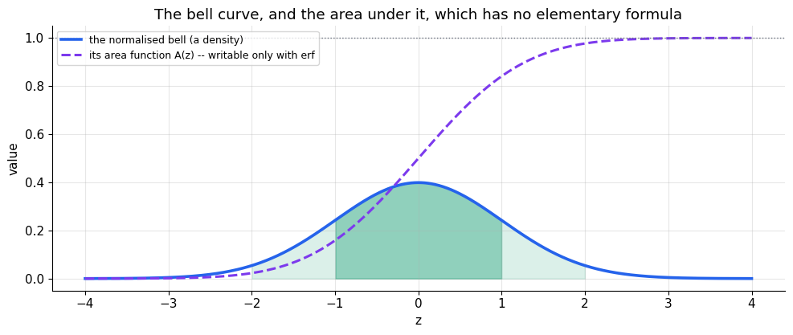

### Cell 229

```python
from mpl_toolkits.mplot3d import Axes3D  # noqa: F401  -- registers the 3-D projection

# ============================================================
#  f(x, y) = x^2 + 3y^2 + xy - 2x + 4      -- a tilted bowl
# ============================================================
def f(x, y):
    """Our two-input function. Two numbers in, one number out."""
    return x**2 + 3*y**2 + x*y - 2*x + 4

print(f"f(0, 0)    = {f(0.0,  0.0):7.4f}")
print(f"f(2, 1.5)  = {f(2.0,  1.5):7.4f}")
print(f"f(1, -1)   = {f(1.0, -1.0):7.4f}")
print()
print("Two numbers in, one out. The graph is no longer a curve -- it is a")
print("SURFACE, and its height above the floor is the value of f there.")

gx = np.linspace(-3, 4, 200)
gy = np.linspace(-3, 3, 200)
GX, GY = np.meshgrid(gx, gy)
GZ = f(GX, GY)

fig = plt.figure(figsize=(14.5, 4.4))

ax1 = fig.add_subplot(1, 3, 1, projection="3d")
ax1.plot_surface(GX, GY, GZ, cmap="viridis", linewidth=0, antialiased=True, alpha=0.92)
ax1.set_xlabel("x"); ax1.set_ylabel("y"); ax1.set_zlabel("f(x, y)")
ax1.set_title("1. the surface\n(pretty, hard to reason with)")

ax2 = fig.add_subplot(1, 3, 2)
cs = ax2.contour(GX, GY, GZ, levels=16, cmap="viridis")
ax2.clabel(cs, inline=True, fontsize=7, fmt="%.0f")
ax2.set_xlabel("x"); ax2.set_ylabel("y")
ax2.set_title("2. contours\n(USE THIS ONE)")

ax3 = fig.add_subplot(1, 3, 3)
im = ax3.imshow(GZ, origin="lower", extent=[gx[0], gx[-1], gy[0], gy[-1]],
                aspect="auto", cmap="viridis")
fig.colorbar(im, ax=ax3, shrink=0.85, label="f(x, y)")
ax3.set_xlabel("x"); ax3.set_ylabel("y")
ax3.set_title("3. heatmap\n(height as colour)")

fig.tight_layout()
plt.show()

print()
print(f"lowest  value on this grid : {GZ.min():.4f}")
print(f"highest value on this grid : {GZ.max():.4f}")
```

**Output**

```text
f(0, 0)    =  4.0000
f(2, 1.5)  = 13.7500
f(1, -1)   =  5.0000

Two numbers in, one out. The graph is no longer a curve -- it is a
SURFACE, and its height above the floor is the value of f there.
```

**Output**

```text
<Figure size 1450x440 with 4 Axes>
```

**Figure**

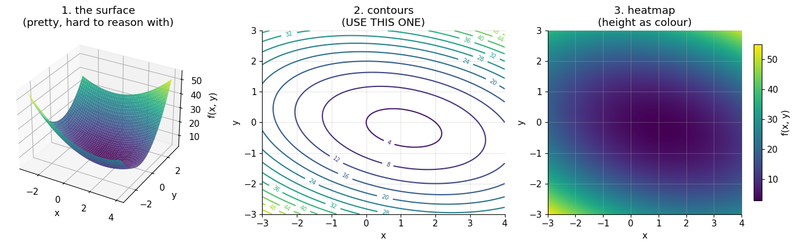

**Output**

```text
lowest  value on this grid : 2.9098
highest value on this grid : 55.0000
```

### Cell 234

```python
# ============================================================
#  Slice the surface, then use PART 3's definition on the slice.
# ============================================================
x0, y0 = 2.0, 1.5          # the point we will stand at

def slice_at_fixed_y(xx):   # y frozen -> an ordinary 1-input function of x
    return f(xx, y0)

def slice_at_fixed_x(yy):   # x frozen -> an ordinary 1-input function of y
    return f(x0, yy)

def slope_of(g, a, step=1e-5):
    """Part 3's derivative, symmetric version: rise over run as the run -> 0."""
    return (g(a + step) - g(a - step)) / (2 * step)

xs = np.linspace(-3, 4, 300)
ys = np.linspace(-3, 3, 300)

fig, (axA, axB, axC) = plt.subplots(1, 3, figsize=(15, 4.3))

# --- A: where the two slices sit on the contour map
axA.contour(GX, GY, GZ, levels=16, cmap="viridis", alpha=0.75)
axA.axhline(y0, color=C_SLOPE, lw=2.2, label="slice at y = 1.5   (gives df/dx)")
axA.axvline(x0, color=C_AREA,  lw=2.2, label="slice at x = 2.0   (gives df/dy)")
axA.plot(x0, y0, "o", color="black", ms=8, zorder=5)
axA.set_xlabel("x"); axA.set_ylabel("y"); axA.legend(fontsize=8, loc="lower left")
axA.set_title("A. two vertical cuts through the bowl")

# --- B: the y-frozen slice, and its tangent
sx_vals = slice_at_fixed_y(xs)
mB = slope_of(slice_at_fixed_y, x0)
axB.plot(xs, sx_vals, color=C_SLOPE, lw=2.4)
axB.plot(xs, slice_at_fixed_y(x0) + mB * (xs - x0), "--", color=C_EXACT, lw=1.8)
axB.plot(x0, slice_at_fixed_y(x0), "o", color="black", ms=8, zorder=5)
axB.set_xlim(-3, 4); axB.set_ylim(sx_vals.min() - 2, sx_vals.max())
axB.set_xlabel("x   (y is frozen at 1.5)"); axB.set_ylabel("f(x, 1.5)")
axB.set_title(f"B. an ordinary curve. slope here = {mB:.4f}")

# --- C: the x-frozen slice, and its tangent
sy_vals = slice_at_fixed_x(ys)
mC = slope_of(slice_at_fixed_x, y0)
axC.plot(ys, sy_vals, color=C_AREA, lw=2.4)
axC.plot(ys, slice_at_fixed_x(y0) + mC * (ys - y0), "--", color=C_EXACT, lw=1.8)
axC.plot(y0, slice_at_fixed_x(y0), "o", color="black", ms=8, zorder=5)
axC.set_xlim(-3, 3); axC.set_ylim(sy_vals.min() - 2, sy_vals.max())
axC.set_xlabel("y   (x is frozen at 2.0)"); axC.set_ylabel("f(2, y)")
axC.set_title(f"C. another ordinary curve. slope here = {mC:.4f}")

fig.tight_layout()
plt.show()

# ---- three independent routes to the same two numbers ------------------
sx, sy_, su, sv, st = sp.symbols("x y u v t", real=True)
f_sym  = sx**2 + 3*sy_**2 + sx*sy_ - 2*sx + 4
fx_sym = sp.diff(f_sym, sx)
fy_sym = sp.diff(f_sym, sy_)
sub    = {sx: x0, sy_: y0}

print("BY HAND       df/dx = 2x + y - 2   ->  ", 2*x0 + y0 - 2)
print("              df/dy = 6y + x       ->  ", 6*y0 + x0)
print()
print(f"SYMPY         df/dx = {fx_sym}    ->   {float(fx_sym.subs(sub)):.10f}")
print(f"              df/dy = {fy_sym}        ->   {float(fy_sym.subs(sub)):.10f}")
print()
print(f"FROM A SLICE  df/dx = slope of panel B  ->   {mB:.10f}")
print(f"              df/dy = slope of panel C  ->   {mC:.10f}")
print()
print(f"disagreement, df/dx : {abs(mB - float(fx_sym.subs(sub))):.3e}")
print(f"disagreement, df/dy : {abs(mC - float(fy_sym.subs(sub))):.3e}")
```

**Output**

```text
<Figure size 1500x430 with 3 Axes>
```

**Figure**

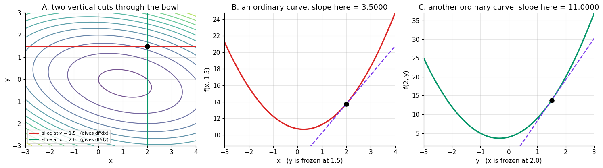

**Output**

```text
BY HAND       df/dx = 2x + y - 2   ->   3.5
              df/dy = 6y + x       ->   11.0

SYMPY         df/dx = 2*x + y - 2    ->   3.5000000000
              df/dy = x + 6*y        ->   11.0000000000

FROM A SLICE  df/dx = slope of panel B  ->   3.5000000002
              df/dy = slope of panel C  ->   11.0000000001

disagreement, df/dx : 2.228e-10
disagreement, df/dy : 1.165e-10
```

### Cell 240

```python
# ============================================================
#  Is the gradient really the steepest direction? MEASURE it.
#  We evaluate the directional derivative in 3600 directions
#  around the circle -- from the raw definition, with no
#  gradient involved anywhere -- and see where the maximum falls.
# ============================================================
P = np.array([2.0, 1.5])          # where we stand

def grad_numeric(p, step=1e-5):
    """Central-difference gradient: nudge each coordinate on its own."""
    p   = np.asarray(p, dtype=float)
    out = np.zeros_like(p)
    for i in range(p.size):
        e = np.zeros_like(p); e[i] = step
        out[i] = (f(*(p + e)) - f(*(p - e))) / (2 * step)
    return out

def dir_deriv(p, u, step=1e-5):
    """Slope felt walking in direction u. Raw definition; no gradient used."""
    u = np.asarray(u, dtype=float)
    u = u / np.linalg.norm(u)                     # a DIRECTION has length 1
    return (f(*(p + step*u)) - f(*(p - step*u))) / (2 * step)

thetas = np.linspace(0, 2*np.pi, 3601)[:-1]       # 0.1 degree resolution
D_meas = np.array([dir_deriv(P, [np.cos(a), np.sin(a)]) for a in thetas])

g        = grad_numeric(P)
ang_grad = np.degrees(np.arctan2(g[1], g[0])) % 360.0
ang_max  = np.degrees(thetas[np.argmax(D_meas)]) % 360.0
ang_min  = np.degrees(thetas[np.argmin(D_meas)]) % 360.0
ang_flat = np.degrees(thetas[np.argmin(np.abs(D_meas))]) % 360.0

fig, (axL, axR) = plt.subplots(1, 2, figsize=(13.5, 4.6))

axL.plot(np.degrees(thetas), D_meas, color=C_F, lw=2.4)
axL.axhline(0, color=C_GREY, lw=1)
axL.axvline(ang_grad, color=C_SLOPE, lw=2, ls="--",
            label=f"direction of grad f  ({ang_grad:.1f} deg)")
axL.plot(ang_max, D_meas.max(), "o", color=C_EXACT, ms=10, zorder=5,
         label=f"measured maximum  ({ang_max:.1f} deg)")
axL.axhline(np.linalg.norm(g), color=C_AREA, lw=1.6, ls=":",
            label=f"length of grad f  ({np.linalg.norm(g):.3f})")
axL.set_xlabel("direction you walk (degrees, 0 = east)")
axL.set_ylabel("slope you feel")
axL.set_title("the slope in every direction, from the point (2, 1.5)")
axL.legend(fontsize=8, loc="lower center")

axR.contour(GX, GY, GZ, levels=22, cmap="viridis", alpha=0.6)
for a in np.linspace(0, 2*np.pi, 25)[:-1]:
    u = np.array([np.cos(a), np.sin(a)])
    d = dir_deriv(P, u)
    col = C_SLOPE if d > 0 else C_F
    L = 0.55 * abs(d) / np.linalg.norm(g)
    axR.arrow(P[0], P[1], L*u[0], L*u[1], head_width=0.05, color=col,
              alpha=0.75, length_includes_head=True)
gh = g / np.linalg.norm(g)
axR.arrow(P[0], P[1], 0.75*gh[0], 0.75*gh[1], head_width=0.11, color=C_EXACT,
          lw=2.5, length_includes_head=True, zorder=6)
axR.plot(P[0], P[1], "o", color="black", ms=8, zorder=7)
axR.set_xlim(0.7, 3.6); axR.set_ylim(0.4, 2.7)
axR.set_xlabel("x"); axR.set_ylabel("y")
axR.set_title("arrow length = slope felt that way\n(purple = grad f, red = uphill, blue = downhill)")

fig.tight_layout()
plt.show()

print(f"gradient at (2, 1.5), measured numerically  : [{g[0]:.6f}, {g[1]:.6f}]")
print(f"its length                                  :  {np.linalg.norm(g):.6f}")
print()
print(f"angle of the gradient                       : {ang_grad:9.4f} deg")
print(f"angle where the MEASURED slope is biggest   : {ang_max:9.4f} deg")
print(f"                               disagreement : {abs(ang_max - ang_grad):9.4f} deg"
      f"   (the angular grid step is {360/3600:.2f} deg)")
print()
print(f"biggest measured slope over all directions  : {D_meas.max():.8f}")
print(f"length of the gradient                      : {np.linalg.norm(g):.8f}")
print(f"                               disagreement : {abs(D_meas.max() - np.linalg.norm(g)):.3e}")
print()
print(f"angle of STEEPEST DESCENT (measured)        : {ang_min:9.4f} deg"
      f"   -> {abs((ang_min - ang_grad) % 360):.2f} deg from the gradient")
print(f"angle where the slope is ZERO (measured)    : {ang_flat:9.4f} deg"
      f"   -> {abs((ang_flat - ang_grad) % 360):.2f} deg from the gradient")

# ---- and the dot-product formula, on directions picked at random -------
rng   = np.random.default_rng(0)
worst = 0.0
print()
print("     direction u           D_u f (measured)      grad f . u          gap")
for k in range(6):
    a = rng.uniform(0, 2*np.pi)
    u = np.array([np.cos(a), np.sin(a)])
    lhs, rhs = dir_deriv(P, u), float(g @ u)
    worst = max(worst, abs(lhs - rhs))
    print(f"  [{u[0]:+.3f}, {u[1]:+.3f}]       {lhs:+13.8f}    {rhs:+13.8f}     {abs(lhs-rhs):.2e}")
print()
print(f"worst gap between the raw definition and grad f . u : {worst:.3e}")
```

**Output**

```text
<Figure size 1350x460 with 2 Axes>
```

**Figure**

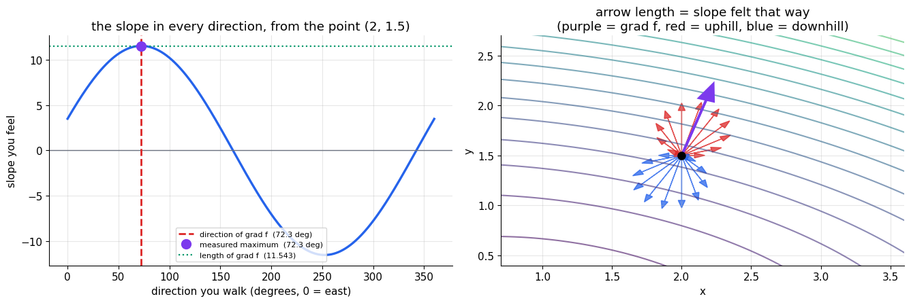

**Output**

```text
gradient at (2, 1.5), measured numerically  : [3.500000, 11.000000]
its length                                  :  11.543396

angle of the gradient                       :   72.3499 deg
angle where the MEASURED slope is biggest   :   72.3000 deg
                               disagreement :    0.0499 deg   (the angular grid step is 0.10 deg)

biggest measured slope over all directions  : 11.54339201
length of the gradient                      : 11.54339638
                               disagreement : 4.374e-06

angle of STEEPEST DESCENT (measured)        :  252.3000 deg   -> 179.95 deg from the gradient
angle where the slope is ZERO (measured)    :  162.3000 deg   -> 89.95 deg from the gradient

     direction u           D_u f (measured)      grad f . u          gap
  [-0.652, -0.758]        -10.62231171     -10.62231171     5.66e-11
  [-0.124, +0.992]        +10.48108699     +10.48108699     2.01e-10
  [+0.967, +0.255]         +6.18536193      +6.18536193     3.27e-10
  [+0.995, +0.104]         +4.62140105      +4.62140105     3.44e-10
  [+0.387, -0.922]         -8.78715838      -8.78715838     8.74e-11
  [+0.853, -0.521]         -2.74524218      -2.74524218     3.07e-11

worst gap between the raw definition and grad f . u : 3.441e-10
```

### Cell 245

```python
# ============================================================
#  The gradient field: an arrow at every point, pointing uphill.
# ============================================================
qx = np.linspace(-2.6, 3.6, 14)
qy = np.linspace(-2.6, 2.6, 12)
QX, QY = np.meshgrid(qx, qy)
U = np.zeros_like(QX)
V = np.zeros_like(QY)
for i in range(QX.shape[0]):
    for j in range(QX.shape[1]):
        U[i, j], V[i, j] = grad_numeric([QX[i, j], QY[i, j]])

fig, ax = plt.subplots(figsize=(8.6, 5.9))
csF = ax.contour(GX, GY, GZ, levels=20, cmap="viridis", alpha=0.85)
ax.clabel(csF, inline=True, fontsize=7, fmt="%.0f")
ax.quiver(QX, QY, U, V, color=C_SLOPE, alpha=0.85, width=0.0035)

# the bottom of the bowl: the point where the gradient is the zero vector
from scipy.optimize import fsolve
bottom = fsolve(lambda p: grad_numeric(p), [0.0, 0.0])
ax.plot(bottom[0], bottom[1], "*", color=C_EXACT, ms=20, zorder=6)
ax.annotate("gradient = 0 here\n(bottom of the bowl)", xy=bottom,
            xytext=(bottom[0] - 2.5, bottom[1] - 2.0), fontsize=9, color=C_EXACT,
            arrowprops=dict(arrowstyle="->", color=C_EXACT))
ax.set_xlabel("x"); ax.set_ylabel("y")
ax.set_title("contours + gradient arrows: every arrow crosses its contour at a\n"
             "right angle, points uphill, and lengthens where the rings crowd together")
fig.tight_layout()
plt.show()

print(f"bottom of the bowl, found by solving grad f = 0 : "
      f"({bottom[0]:.6f}, {bottom[1]:.6f})")
print(f"by hand, solving 2x + y - 2 = 0 and 6y + x = 0  : "
      f"({12/11:.6f}, {-2/11:.6f})")
print(f"gradient there : [{grad_numeric(bottom)[0]:.2e}, {grad_numeric(bottom)[1]:.2e}]"
      f"   (the zero vector, to numerical precision)")
print()

# --- perpendicularity, as a number rather than an impression -----------
print("Stepping 0.02 ALONG the gradient, versus 0.02 ACROSS it:")
print("     point        change in f, along      change in f, across       ratio")
for p in ([2.0, 1.5], [-1.0, 1.0], [3.0, -2.0], [0.0, 2.0]):
    p    = np.array(p, dtype=float)
    gp   = grad_numeric(p)
    uhat = gp / np.linalg.norm(gp)
    perp = np.array([-uhat[1], uhat[0]])          # rotate 90 degrees
    eps  = 0.02
    d_along  = f(*(p + eps*uhat)) - f(*p)
    d_across = f(*(p + eps*perp)) - f(*p)
    print(f"  ({p[0]:+.1f}, {p[1]:+.1f})       {d_along:+.8f}            "
          f"{d_across:+.8f}      {abs(d_along/d_across):8.1f}x")
print()
print("Along the gradient, f changes by about eps * ||grad f||.")
print("Across it, the change is hundreds of times smaller and is pure curvature")
print("(order eps^2). To first order, walking across the gradient does not change")
print("your height at all -- which is exactly what 'the contour runs that way' means.")
```

**Output**

```text
<Figure size 860x590 with 1 Axes>
```

**Figure**

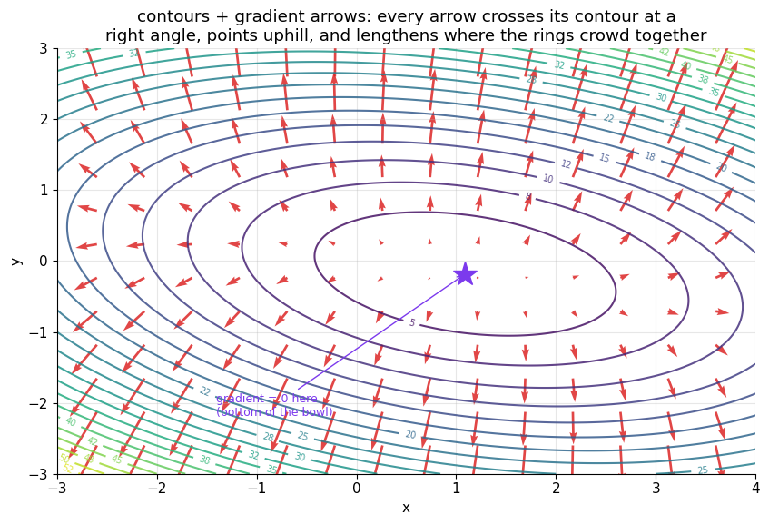

**Output**

```text
bottom of the bowl, found by solving grad f = 0 : (1.090909, -0.181818)
by hand, solving 2x + y - 2 = 0 and 6y + x = 0  : (1.090909, -0.181818)
gradient there : [0.00e+00, 0.00e+00]   (the zero vector, to numerical precision)

Stepping 0.02 ALONG the gradient, versus 0.02 ACROSS it:
     point        change in f, along      change in f, across       ratio
  (+2.0, +1.5)       +0.23210995            +0.00035797         648.4x
  (-1.0, +1.0)       +0.11743080            +0.00078824         149.0x
  (+3.0, -2.0)       +0.18546854            +0.00052235         355.1x
  (+0.0, +2.0)       +0.24120000            +0.00040000         603.0x

Along the gradient, f changes by about eps * ||grad f||.
Across it, the change is hundreds of times smaller and is pure curvature
(order eps^2). To first order, walking across the gradient does not change
your height at all -- which is exactly what 'the contour runs that way' means.
```

### Cell 249

```python
# ============================================================
#  (a) the chain rule as stated, checked numerically and symbolically
# ============================================================
def u_of(tt): return np.cos(tt)
def v_of(tt): return tt**2 + 1
def F(u, v):  return u**2 * v + np.sin(v)
def z_of(tt): return F(u_of(tt), v_of(tt))

t0  = 0.7
eps = 1e-6

# LEFT SIDE: forget the structure entirely. Compose everything into one
# function of t and take an ordinary Part-3 derivative of it.
lhs = (z_of(t0 + eps) - z_of(t0 - eps)) / (2*eps)

# RIGHT SIDE: four small, separate derivatives, assembled by the rule.
u0, v0 = u_of(t0), v_of(t0)
dF_du = (F(u0 + eps, v0) - F(u0 - eps, v0)) / (2*eps)
dF_dv = (F(u0, v0 + eps) - F(u0, v0 - eps)) / (2*eps)
du_dt = (u_of(t0 + eps) - u_of(t0 - eps)) / (2*eps)
dv_dt = (v_of(t0 + eps) - v_of(t0 - eps)) / (2*eps)
rhs   = dF_du*du_dt + dF_dv*dv_dt

# SYMPY, for a third and independent opinion
z_sym = (sp.cos(st))**2 * (st**2 + 1) + sp.sin(st**2 + 1)
exact = float(sp.diff(z_sym, st).subs(st, t0))

print("z = f(u, v) = u^2 v + sin(v),    u = cos t,    v = t^2 + 1,    at t = 0.7")
print()
print(f"  df/du = {dF_du:+.8f}       du/dt = {du_dt:+.8f}")
print(f"  df/dv = {dF_dv:+.8f}       dv/dt = {dv_dt:+.8f}")
print()
print(f"  chain rule   (df/du)(du/dt) + (df/dv)(dv/dt)  = {rhs:+.8f}")
print(f"  brute force   d/dt of the composed function   = {lhs:+.8f}")
print(f"  sympy, exact                                  = {exact:+.8f}")
print(f"  worst disagreement                            = "
      f"{max(abs(rhs - exact), abs(lhs - exact)):.3e}")
print()
print(f"  Keeping ONE path only (dropping the v term) gives {dF_du*du_dt:+.8f},")
print(f"  which is wrong by {abs(dF_du*du_dt - exact):.4f}. You must add across ALL paths.")
```

**Output**

```text
z = f(u, v) = u^2 v + sin(v),    u = cos t,    v = t^2 + 1,    at t = 0.7

  df/du = +2.27922972       du/dt = -0.64421769
  df/dv = +0.66569202       dv/dt = +1.40000000

  chain rule   (df/du)(du/dt) + (df/dv)(dv/dt)  = -0.53635127
  brute force   d/dt of the composed function   = -0.53635127
  sympy, exact                                  = -0.53635127
  worst disagreement                            = 5.776e-11

  Keeping ONE path only (dropping the v term) gives -1.46832010,
  which is wrong by 0.9320. You must add across ALL paths.
```

### Cell 250

```python
# ============================================================
#  (b) the same rule on something shaped like a neural network:
#      one neuron, two inputs, a tanh, and a squared error.
#
#        z = w1*in1 + w2*in2 + b      (a linear layer)
#        a = tanh(z)                  (an activation)
#        L = (a - target)^2           (a loss)
#
#  This is a real, if tiny, forward pass. Training needs the
#  gradient of L with respect to (w1, w2, b), and the chain
#  rule is the only tool used to get it.
# ============================================================
in1, in2, target = 0.8, -0.5, 1.0

def forward(w1, w2, b):
    z = w1*in1 + w2*in2 + b
    a = np.tanh(z)
    return (a - target)**2

W = np.array([0.30, -0.70, 0.10])          # (w1, w2, b)

# ---- BY HAND: multiply the local derivatives along the chain -----------
z_val = W[0]*in1 + W[1]*in2 + W[2]
a_val = np.tanh(z_val)
dL_da = 2*(a_val - target)                 # loss    -> activation
da_dz = 1 - a_val**2                       # tanh'   = 1 - tanh^2
dz_dw1, dz_dw2, dz_db = in1, in2, 1.0      # linear layer -> its parameters
grad_hand = np.array([dL_da * da_dz * dz_dw1,
                      dL_da * da_dz * dz_dw2,
                      dL_da * da_dz * dz_db])

# ---- NUMERICALLY: knowing nothing at all about the structure -----------
def grad_by_nudging(fn, p, step=1e-6):
    p = np.asarray(p, dtype=float); out = np.zeros_like(p)
    for i in range(p.size):
        e = np.zeros_like(p); e[i] = step
        out[i] = (fn(*(p + e)) - fn(*(p - e))) / (2*step)
    return out

grad_nudged = grad_by_nudging(forward, W)

print(f"forward pass:   z = {z_val:+.6f}    a = tanh(z) = {a_val:+.6f}"
      f"    L = {forward(*W):.6f}")
print()
print("                      by the chain rule        by nudging weights          gap")
for nm, gh_, gn_ in zip(["dL/dw1", "dL/dw2", "dL/db "], grad_hand, grad_nudged):
    print(f"     {nm}          {gh_:+.10f}            {gn_:+.10f}     {abs(gh_-gn_):.2e}")
print()
rel = (np.linalg.norm(grad_hand - grad_nudged)
       / (np.linalg.norm(grad_hand) + np.linalg.norm(grad_nudged)))
print(f"relative error  ||hand - numeric|| / (||hand|| + ||numeric||) = {rel:.3e}")
print()
print("That is backpropagation. Three local derivatives, multiplied along the")
print("chain. Part 9 does exactly this on a network with a hidden layer, where")
print("the weights of the first layer reach the loss along several paths and")
print("the 'add across paths' half of the rule finally earns its keep.")
```

**Output**

```text
forward pass:   z = +0.690000    a = tanh(z) = +0.597982    L = 0.161618

                      by the chain rule        by nudging weights          gap
     dL/dw1          -0.4132214545            -0.4132214545     3.10e-11
     dL/dw2          +0.2582634091            +0.2582634091     5.52e-12
     dL/db           -0.5165268182            -0.5165268182     1.10e-11

relative error  ||hand - numeric|| / (||hand|| + ||numeric||) = 2.352e-11

That is backpropagation. Three local derivatives, multiplied along the
chain. Part 9 does exactly this on a network with a hidden layer, where
the weights of the first layer reach the loss along several paths and
the 'add across paths' half of the rule finally earns its keep.
```

### Cell 254

```python
# ============================================================
#  Jacobian and Hessian with sympy, then checked with numbers.
# ============================================================
Fvec = sp.Matrix([sx**2 * sy_, sx + sp.sin(sy_)])
J    = Fvec.jacobian([sx, sy_])

print("F(x, y) = ( x^2 y ,  x + sin y )      -- two inputs, two outputs")
print()
print("Jacobian (row per output, column per input):")
print(sp.pretty(J))

pt    = {sx: 1.3, sy_: 0.4}
J_sym = np.array(J.subs(pt).evalf(), dtype=float)

def F_np(p):
    return np.array([p[0]**2 * p[1], p[0] + np.sin(p[1])])

p0    = np.array([1.3, 0.4])
J_num = np.zeros((2, 2))
for j in range(2):
    e = np.zeros(2); e[j] = 1e-6
    J_num[:, j] = (F_np(p0 + e) - F_np(p0 - e)) / 2e-6

print()
print(f"at (1.3, 0.4)   sympy   : {J_sym.round(8).tolist()}")
print(f"                numeric : {J_num.round(8).tolist()}")
print(f"                worst disagreement : {np.abs(J_sym - J_num).max():.3e}")

# ---------------- Hessian, and what its eigenvalues mean ---------------
g_expr = sx**3 + sx*sy_**2 - sy_**3
H      = sp.hessian(g_expr, (sx, sy_))
print()
print()
print("g(x, y) = x^3 + x y^2 - y^3")
print()
print("Hessian (all the second derivatives):")
print(sp.pretty(H))
mixed_ok = sp.simplify(sp.diff(g_expr, sx, sy_) - sp.diff(g_expr, sy_, sx)) == 0
print()
print(f"symmetric?  d2g/dx dy = {sp.diff(g_expr, sx, sy_)},   "
      f"d2g/dy dx = {sp.diff(g_expr, sy_, sx)}   ->  {mixed_ok}")
print()
print("     point         Hessian eigenvalues          what you are standing on")
for px, py in [(1.0, 0.0), (-1.0, 0.0), (0.4, 1.0)]:
    Hn = np.array(H.subs({sx: px, sy_: py}).evalf(), dtype=float)
    ev = np.linalg.eigvalsh(Hn)
    if   (ev > 0).all(): shape = "a bowl   (curves up every way)"
    elif (ev < 0).all(): shape = "a dome   (curves down every way)"
    else:                shape = "a SADDLE (up one way, down another)"
    print(f"   ({px:+.1f}, {py:+.1f})     [{ev[0]:+8.3f}, {ev[1]:+8.3f}]        {shape}")

# our bowl, for comparison -- a constant Hessian, both eigenvalues positive
H_bowl = np.array(sp.hessian(f_sym, (sx, sy_)), dtype=float)
print()
print(f"Our bowl f(x, y) has the constant Hessian {H_bowl.tolist()}, with")
print(f"eigenvalues {np.linalg.eigvalsh(H_bowl).round(4).tolist()} -- both positive everywhere.")
print("That is why it is a bowl everywhere and has exactly one minimum. The loss")
print("surfaces of real networks are nothing like this well behaved.")
```

**Output**

```text
F(x, y) = ( x^2 y ,  x + sin y )      -- two inputs, two outputs

Jacobian (row per output, column per input):
⎡          2  ⎤
⎢2⋅x⋅y    x   ⎥
⎢             ⎥
⎣  1    cos(y)⎦

at (1.3, 0.4)   sympy   : [[1.04, 1.69], [1.0, 0.92106099]]
                numeric : [[1.04, 1.69], [1.0, 0.92106099]]
                worst disagreement : 8.369e-11


g(x, y) = x^3 + x y^2 - y^3

Hessian (all the second derivatives):
⎡6⋅x     2⋅y   ⎤
⎢              ⎥
⎣2⋅y  2⋅x - 6⋅y⎦

symmetric?  d2g/dx dy = 2*y,   d2g/dy dx = 2*y   ->  True

     point         Hessian eigenvalues          what you are standing on
   (+1.0, +0.0)     [  +2.000,   +6.000]        a bowl   (curves up every way)
   (-1.0, +0.0)     [  -6.000,   -2.000]        a dome   (curves down every way)
   (+0.4, +1.0)     [  -5.694,   +2.894]        a SADDLE (up one way, down another)

Our bowl f(x, y) has the constant Hessian [[2.0, 1.0], [1.0, 6.0]], with
eigenvalues [1.7639, 6.2361] -- both positive everywhere.
That is why it is a bowl everywhere and has exactly one minimum. The loss
surfaces of real networks are nothing like this well behaved.
```

### Cell 257

```python
# ============================================================
#  A gradient checker -- the tool every ML engineer reaches for
#  the moment a hand-written backward pass misbehaves.
# ============================================================
def numerical_gradient(fn, p, h=1e-5):
    """Central-difference gradient of fn at p. Knows nothing about fn."""
    p   = np.asarray(p, dtype=float)
    out = np.zeros_like(p)
    for i in range(p.size):
        e = np.zeros_like(p); e[i] = h
        out[i] = (fn(p + e) - fn(p - e)) / (2*h)
    return out

def relative_error(a, b):
    """The standard gradient-check score. Below about 1e-7: your gradient is right."""
    a, b = np.asarray(a, dtype=float), np.asarray(b, dtype=float)
    return np.linalg.norm(a - b) / max(np.linalg.norm(a) + np.linalg.norm(b), 1e-15)

# ---- a deliberately awkward test function, three inputs ---------------
#   q(x, y, z) = sin(xy) + x*exp(-z^2/2) + log(1 + y^2) + x*z^3
def q(p):
    x_, y_, z_ = p
    return (np.sin(x_*y_) + x_*np.exp(-z_**2/2)
            + np.log(1 + y_**2) + x_*z_**3)

sz    = sp.symbols("z", real=True)
q_sym = (sp.sin(sx*sy_) + sx*sp.exp(-sz**2/2)
         + sp.log(1 + sy_**2) + sx*sz**3)
q_grad_exact = sp.lambdify((sx, sy_, sz),
                           [sp.diff(q_sym, v) for v in (sx, sy_, sz)], "numpy")

P3      = np.array([0.7, -1.3, 0.45])
exact_g = np.array(q_grad_exact(*P3), dtype=float)
numer_g = numerical_gradient(q, P3)

print("q(x,y,z) = sin(xy) + x*exp(-z^2/2) + log(1+y^2) + x*z^3    at (0.7, -1.3, 0.45)")
print()
print("              exact (sympy)          numerical             gap")
for nm, e_, n_ in zip("xyz", exact_g, numer_g):
    print(f"   dq/d{nm}     {e_:+.12f}      {n_:+.12f}     {abs(e_-n_):.3e}")
print()
print(f"   relative error : {relative_error(exact_g, numer_g):.3e}"
      f"    (the usual pass threshold is 1e-7)")

# ---- forward vs central, as the step size shrinks ---------------------
def forward_gradient(fn, p, h):
    p = np.asarray(p, dtype=float); out = np.zeros_like(p)
    for i in range(p.size):
        e = np.zeros_like(p); e[i] = h
        out[i] = (fn(p + e) - fn(p)) / h
    return out

print()
print("Why CENTRAL differences rather than forward ones:")
print("      h          forward rel.err     central rel.err")
for hh in [1e-1, 1e-2, 1e-3, 1e-4, 1e-5, 1e-6, 1e-8, 1e-10]:
    ef = relative_error(exact_g, forward_gradient(q, P3, hh))
    ec = relative_error(exact_g, numerical_gradient(q, P3, hh))
    print(f"   {hh:.0e}        {ef:.3e}         {ec:.3e}")
print()
print("Forward improves like h. Central improves like h^2 -- until h gets so small")
print("that subtracting two nearly equal numbers destroys the precision, and both")
print("get WORSE again. That U-shape is why 1e-5 is the usual choice.")

# ---- and now the point of the whole tool: catching a real bug ---------
def wrong_gradient(p):
    """The same gradient with ONE typo: 3*x*z^2 written as x*z^2."""
    x_, y_, z_ = p
    return np.array([y_*np.cos(x_*y_) + np.exp(-z_**2/2) + z_**3,
                     x_*np.cos(x_*y_) + 2*y_/(1 + y_**2),
                     -x_*z_*np.exp(-z_**2/2) + x_*z_**2])   # <-- bug: missing the 3

print()
print()
print(f"correct analytic gradient vs numerical : "
      f"{relative_error(exact_g, numer_g):.3e}    PASS")
print(f"buggy   analytic gradient vs numerical : "
      f"{relative_error(wrong_gradient(P3), numer_g):.3e}    FAIL")
print()
print("Note what the bug did NOT do: it raised no error, and the buggy gradient")
print("still points broadly in a plausible direction, so training on it would")
print("still make the loss go down -- just wrongly, and more slowly. The only")
print("thing that finds a bug like this is a gradient check.")
```

**Output**

```text
q(x,y,z) = sin(xy) + x*exp(-z^2/2) + log(1+y^2) + x*z^3    at (0.7, -1.3, 0.45)

              exact (sympy)          numerical             gap
   dq/dx     +0.196962603538      +0.196962603555     1.699e-11
   dq/dy     -0.536920726287      -0.536920726291     3.435e-12
   dq/dz     +0.140582270470      +0.140582270558     8.808e-11

   relative error : 7.621e-11    (the usual pass threshold is 1e-7)

Why CENTRAL differences rather than forward ones:
      h          forward rel.err     central rel.err
   1e-01        8.561e-02         7.307e-03
   1e-02        8.250e-03         7.325e-05
   1e-03        8.212e-04         7.325e-07
   1e-04        8.208e-05         7.325e-09
   1e-05        8.208e-06         7.621e-11
   1e-06        8.208e-07         7.196e-11
   1e-08        2.248e-08         6.899e-09
   1e-10        1.043e-06         3.926e-07

Forward improves like h. Central improves like h^2 -- until h gets so small
that subtracting two nearly equal numbers destroys the precision, and both
get WORSE again. That U-shape is why 1e-5 is the usual choice.


correct analytic gradient vs numerical : 7.621e-11    PASS
buggy   analytic gradient vs numerical : 2.406e-01    FAIL

Note what the bug did NOT do: it raised no error, and the buggy gradient
still points broadly in a plausible direction, so training on it would
still make the loss go down -- just wrongly, and more slowly. The only
thing that finds a bug like this is a gradient check.
```

### Cell 262

```python
# ============================================================
#  The recipe from Part 5 -- and the wall it runs into.
# ============================================================
w_sym = sp.symbols("w", real=True)          # a fresh symbol; x, y, h, t stay as they were

f_expr  = sp.Rational(1, 2) * w_sym**2 - 3 * w_sym + 5 + 2 * sp.sin(2 * w_sym)
fp_expr = sp.diff(f_expr, w_sym)            # Part 4's rules, applied by sympy

print("f (w)  =", f_expr)
print("f'(w)  =", sp.simplify(fp_expr))
print()

print("Part 5 says: solve f'(w) = 0.  Asking sympy to do exactly that ...")
try:
    roots = sp.solve(sp.Eq(fp_expr, 0), w_sym)
    print("   solved:", roots)
except Exception as err:
    print(f"   {type(err).__name__}: {err}")
print()
print("That is not sympy being weak. No formula built from +, -, x, /, roots,")
print("exp and log solves it. The equation has no closed-form answer at all.")
print()

# We can still LOCATE the answers numerically, one at a time, from a guess.
for guess in (-1.0, 2.0, 5.0):
    r = float(sp.nsolve(fp_expr, w_sym, guess))
    print(f"   numerical root near w = {guess:+.1f}  ->  w = {r:.6f}")
print()
print("Note there are THREE places where f'(w) = 0. We will come back to that.")
```

**Output**

```text
f (w)  = w**2/2 - 3*w + 2*sin(2*w) + 5
f'(w)  = w + 4*cos(2*w) - 3

Part 5 says: solve f'(w) = 0.  Asking sympy to do exactly that ...
   NotImplementedError: multiple generators [w, cos(2*w)]
No algorithms are implemented to solve equation (w + 4*cos(2*w) - 3) + 0

That is not sympy being weak. No formula built from +, -, x, /, roots,
exp and log solves it. The equation has no closed-form answer at all.

   numerical root near w = -1.0  ->  w = -0.300243
   numerical root near w = +2.0  ->  w = 2.427947
   numerical root near w = +5.0  ->  w = 5.205745

Note there are THREE places where f'(w) = 0. We will come back to that.
```

### Cell 265

```python
# ============================================================
#  Gradient descent in seven lines, and the path it walks.
# ============================================================
f  = sp.lambdify(w_sym, f_expr,  "numpy")   # f (w) as a fast numeric function
fp = sp.lambdify(w_sym, fp_expr, "numpy")   # f'(w) likewise


def gradient_descent_1d(w_start, eta, n_steps):
    """Walk downhill on f. Returns every w visited, including the start."""
    w = float(w_start)
    path = [w]
    for _ in range(n_steps):
        w = w - eta * fp(w)                 # <-- the entire algorithm
        path.append(w)
    return np.array(path)


path = gradient_descent_1d(w_start=4.0, eta=0.10, n_steps=40)

print("step |      w       |    f(w)     |   f'(w)   ")
print("-----+--------------+-------------+-----------")
for k in (0, 1, 2, 3, 5, 10, 20, 40):
    print(f"{k:4d} | {path[k]:12.7f} | {f(path[k]):11.7f} | {fp(path[k]):9.5f}")

w_star = float(sp.nsolve(fp_expr, w_sym, 2.0))
print()
print(f"gradient descent landed at  w = {path[-1]:.9f}")
print(f"the numerical root of f'    w = {w_star:.9f}")
print(f"difference                      {abs(path[-1] - w_star):.2e}")
print()
print("Nobody solved anything. We only ever evaluated the slope and stepped.")

# ---- the picture -------------------------------------------------------
grid = np.linspace(-2.5, 6.5, 600)
fig, ax = plt.subplots(figsize=(10, 5))
ax.plot(grid, f(grid), color=C_F, lw=2.4, label="f(w)")
ax.plot(path, f(path), "o-", color=C_SLOPE, ms=5, lw=1.2, alpha=0.85,
        label="the steps taken")
ax.plot(path[0], f(path[0]), "o", color="black", ms=11, zorder=5)
ax.annotate("start,  w = 4.0", (path[0], f(path[0])),
            textcoords="offset points", xytext=(14, 16), fontsize=10)
ax.plot(path[-1], f(path[-1]), "*", color=C_EXACT, ms=20, zorder=5)
ax.annotate(f"arrived,  w = {path[-1]:.4f}", (path[-1], f(path[-1])),
            textcoords="offset points", xytext=(-30, -34), fontsize=10,
            color=C_EXACT)
ax.set_xlabel("w  (the number we are allowed to change)")
ax.set_ylabel("f(w)  (the thing we want small)")
ax.set_title("Gradient descent: 40 steps, learning rate 0.10")
ax.legend()
fig.tight_layout()
plt.show()
```

**Output**

```text
step |      w       |    f(w)     |   f'(w)   
-----+--------------+-------------+-----------
   0 |    4.0000000 |   2.9787165 |   0.41800
   1 |    3.9582000 |   2.9551788 |   0.70869
   2 |    3.8873312 |   2.8873900 |   1.20428
   3 |    3.7669036 |   2.6924316 |   2.02583
   5 |    3.2425321 |   0.9304317 |   4.16130
  10 |    2.4280829 |  -1.3158192 |   0.00121
  20 |    2.4279471 |  -1.3158193 |   0.00000
  40 |    2.4279471 |  -1.3158193 |  -0.00000

gradient descent landed at  w = 2.427947123
the numerical root of f'    w = 2.427947123
difference                      0.00e+00

Nobody solved anything. We only ever evaluated the slope and stepped.
```

**Output**

```text
<Figure size 1000x500 with 1 Axes>
```

**Figure**

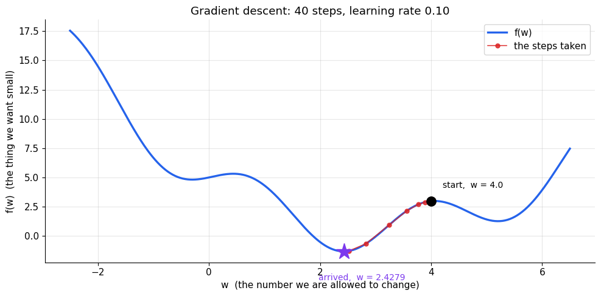

### Cell 269

```python
# ============================================================
#  One bowl, four learning rates. The most useful figure here.
# ============================================================
def f_bowl(w):  return (w - 3.0) ** 2
def fp_bowl(w): return 2.0 * (w - 3.0)

# The curvature, and the threshold it implies -- computed, not asserted.
fpp = sp.diff((w_sym - 3) ** 2, w_sym, 2)
eta_max = float(2 / fpp)
print(f"f''(w) = {fpp}   ->  gradient descent diverges once eta > 2/f'' = {eta_max:.1f}")
print()

W_START, N_STEPS = 8.0, 40
settings = [(0.005, "too small",     "crawls"),
            (0.150, "just right",    "arrives"),
            (0.900, "too large",     "oscillates in"),
            (1.150, "far too large", "diverges")]

paths = {}
for eta, label, _ in settings:
    w, hist = W_START, [W_START]
    for _ in range(N_STEPS):
        w = w - eta * fp_bowl(w)
        hist.append(w)
    paths[eta] = np.array(hist)

for eta, label, verdict in settings:
    p = paths[eta]
    print(f"eta = {eta:<6.3f} ({label:<13}) factor 1-2*eta = {1 - 2 * eta:+.3f}")
    print(f"    after {N_STEPS} steps:  w = {p[-1]:14.4f}   "
          f"distance still to go = {abs(p[-1] - 3.0):.4e}")
    if eta == 1.150:
        shown = "  ".join(f"{v:.3g}" for v in p[[0, 5, 10, 20, 30, 40]])
        print(f"    w at steps 0,5,10,20,30,40:  {shown}")
    print()

# ---- four panels -------------------------------------------------------
gw = np.linspace(-3, 11, 400)
fig, axes = plt.subplots(1, 4, figsize=(15.5, 4.0), sharey=False)
for ax, (eta, label, verdict) in zip(axes, settings):
    p = paths[eta]
    ax.plot(gw, f_bowl(gw), color=C_F, lw=2.0)
    vis = p[np.abs(p) < 11]                       # the diverging run leaves the frame
    ax.plot(vis, f_bowl(vis), "o-", color=C_SLOPE, ms=4, lw=1.0, alpha=0.9)
    ax.axvline(3.0, color=C_GREY, ls="--", lw=1.0)
    ax.set_title(f"eta = {eta}\n{label} -- {verdict}", fontsize=11)
    ax.set_xlabel("w")
    ax.set_xlim(-3, 11)
    ax.set_ylim(-4, 70)
axes[0].set_ylabel("f(w) = (w - 3)^2")
fig.suptitle("Same bowl, same start, same 40 steps. Only the learning rate differs.",
             y=1.03, fontsize=12)
fig.tight_layout()
plt.show()
```

**Output**

```text
f''(w) = 2   ->  gradient descent diverges once eta > 2/f'' = 1.0

eta = 0.005  (too small    ) factor 1-2*eta = +0.990
    after 40 steps:  w =         6.3449   distance still to go = 3.3449e+00

eta = 0.150  (just right   ) factor 1-2*eta = +0.700
    after 40 steps:  w =         3.0000   distance still to go = 3.1834e-06

eta = 0.900  (too large    ) factor 1-2*eta = -0.800
    after 40 steps:  w =         3.0007   distance still to go = 6.6461e-04

eta = 1.150  (far too large) factor 1-2*eta = -1.300
    after 40 steps:  w =    180597.3240   distance still to go = 1.8059e+05
    w at steps 0,5,10,20,30,40:  8  -15.6  71.9  953  1.31e+04  1.81e+05
```

**Output**

```text
<Figure size 1550x400 with 4 Axes>
```

**Figure**

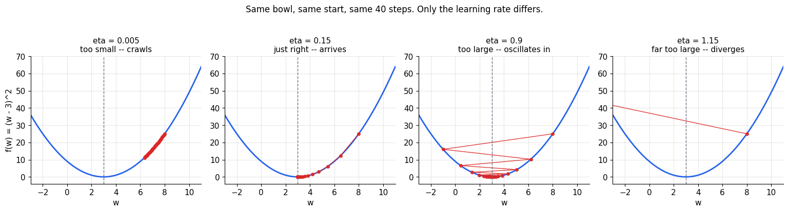

### Cell 274

```python
# ============================================================
#  Gradient descent in 2-D, on a stretched bowl.
# ============================================================
a_sym, b_sym = sp.symbols("a b", real=True)
F = a_sym**2 + 6 * b_sym**2

grad_sym = [sp.diff(F, v) for v in (a_sym, b_sym)]     # Part 8's gradient
print("f(a,b)      =", F)
print("grad f      =", grad_sym)
print("curvatures  =", [sp.diff(F, v, 2) for v in (a_sym, b_sym)],
      " ->  safe eta below", [float(2 / sp.diff(F, v, 2)) for v in (a_sym, b_sym)])
print()

F_num    = sp.lambdify((a_sym, b_sym), F, "numpy")
grad_num = sp.lambdify((a_sym, b_sym), grad_sym, "numpy")

def descend_2d(start, eta, n_steps):
    p = np.array(start, dtype=float)
    trail = [p.copy()]
    for _ in range(n_steps):
        g = np.array(grad_num(p[0], p[1]), dtype=float)
        p = p - eta * g                                # same rule, now a vector
        trail.append(p.copy())
    return np.array(trail)

trail = descend_2d(start=(-4.5, 2.0), eta=0.14, n_steps=30)

print("step |     a      |     b      |  f(a,b)")
print("-----+------------+------------+---------")
for k in (0, 1, 2, 3, 6, 12, 30):
    print(f"{k:4d} | {trail[k, 0]:10.5f} | {trail[k, 1]:10.5f} | "
          f"{F_num(trail[k, 0], trail[k, 1]):8.5f}")
print()
print(f"finished at (a, b) = ({trail[-1,0]:.5f}, {trail[-1,1]:.5f}), "
      f"true minimum is (0, 0)")
print(f"b flips sign every step: {np.sign(trail[:6,1]).astype(int)} "
      f"-- that is the zig-zag")

# ---- contour map with the path drawn on it -----------------------------
ga = np.linspace(-5, 5, 300)
gb = np.linspace(-2.5, 2.5, 300)
GA, GB = np.meshgrid(ga, gb)
fig, ax = plt.subplots(figsize=(10, 4.8))
cs = ax.contour(GA, GB, F_num(GA, GB), levels=np.array([0.5, 2, 5, 10, 20, 35, 55, 80]),
                colors=C_GREY, linewidths=0.9)
ax.clabel(cs, inline=True, fontsize=8, fmt="%.0f")
ax.plot(trail[:, 0], trail[:, 1], "o-", color=C_SLOPE, ms=4.5, lw=1.2)
ax.plot(*trail[0],  "o", color="black",  ms=11, zorder=5)
ax.plot(0, 0, "*", color=C_EXACT, ms=20, zorder=5)
ax.annotate("start", trail[0], textcoords="offset points", xytext=(12, 10))
ax.annotate("minimum", (0, 0), textcoords="offset points", xytext=(14, -20),
            color=C_EXACT)
ax.set_xlabel("a"); ax.set_ylabel("b")
ax.set_title("30 steps of gradient descent on a stretched bowl (eta = 0.14)")
fig.tight_layout()
plt.show()
```

**Output**

```text
f(a,b)      = a**2 + 6*b**2
grad f      = [2*a, 12*b]
curvatures  = [2, 12]  ->  safe eta below [1.0, 0.16666666666666666]

step |     a      |     b      |  f(a,b)
-----+------------+------------+---------
   0 |   -4.50000 |    2.00000 | 44.25000
   1 |   -3.24000 |   -1.36000 | 21.59520
   2 |   -2.33280 |    0.92480 | 10.57349
   3 |   -1.67962 |   -0.62886 |  5.19393
   6 |   -0.62691 |    0.19773 |  0.62762
  12 |   -0.08734 |    0.01955 |  0.00992
  30 |   -0.00024 |    0.00002 |  0.00000

finished at (a, b) = (-0.00024, 0.00002), true minimum is (0, 0)
b flips sign every step: [ 1 -1  1 -1  1 -1] -- that is the zig-zag
```

**Output**

```text
<Figure size 1000x480 with 1 Axes>
```

**Figure**

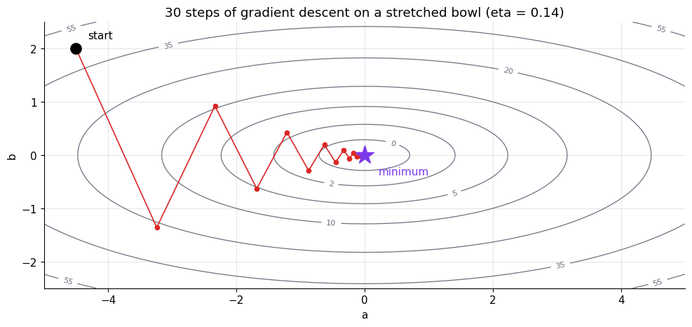

### Cell 277

```python
# ============================================================
#  Left: same code, two starting points, two different answers.
#  Right: what a saddle looks like, and why it is not a trap.
# ============================================================
starts = [4.0, 5.0]
runs   = {s: gradient_descent_1d(s, eta=0.10, n_steps=60) for s in starts}
for s in starts:
    p = runs[s]
    print(f"start w = {s:.1f}  ->  ends at w = {p[-1]:.6f}, f = {f(p[-1]):.6f}")
best = min(starts, key=lambda s: f(runs[s][-1]))
print(f"\nIdentical algorithm, identical learning rate, identical number of steps.")
print(f"The start at w = {best:.1f} found the better valley; the other did not,")
print(f"and it has no way of knowing. Gap in f: "
      f"{abs(f(runs[starts[0]][-1]) - f(runs[starts[1]][-1])):.4f}")

# a saddle: f(a,b) = a^2 - b^2. Gradient is zero at the origin, but it is
# neither a peak nor a valley.
S = a_sym**2 - b_sym**2
gS = [sp.diff(S, v) for v in (a_sym, b_sym)]
print(f"\nsaddle f(a,b) = {S};  grad = {gS};  at (0,0) grad = "
      f"{[float(g.subs({a_sym: 0, b_sym: 0})) for g in gS]}  <- zero, yet not a minimum")
print(f"curvature along a: {sp.diff(S, a_sym, 2)}  (up)    "
      f"curvature along b: {sp.diff(S, b_sym, 2)}  (down)")
S_num  = sp.lambdify((a_sym, b_sym), S, "numpy")
gS_num = sp.lambdify((a_sym, b_sym), gS, "numpy")

fig, (axL, axR) = plt.subplots(1, 2, figsize=(13, 4.6))

gwide = np.linspace(-2.5, 7.0, 600)
axL.plot(gwide, f(gwide), color=C_F, lw=2.2)
for s, col in zip(starts, [C_SLOPE, C_APPROX]):
    p = runs[s]
    axL.plot(p, f(p), "o-", ms=4, lw=1.0, color=col, alpha=0.9,
             label=f"start w = {s:.1f}  ->  {p[-1]:.3f}")
    axL.plot(p[0], f(p[0]), "o", color=col, ms=10, mec="black", zorder=5)
axL.set_xlabel("w"); axL.set_ylabel("f(w)")
axL.set_title("Where you start decides which valley you get")
axL.legend(fontsize=9)

ga2 = np.linspace(-2, 2, 260); gb2 = np.linspace(-2, 2, 260)
GA2, GB2 = np.meshgrid(ga2, gb2)
axR.contourf(GA2, GB2, S_num(GA2, GB2), levels=24, cmap="coolwarm", alpha=0.75)
qa, qb = np.meshgrid(np.linspace(-1.8, 1.8, 9), np.linspace(-1.8, 1.8, 9))
QU, QV = gS_num(qa, qb)
axR.quiver(qa, qb, -QU, -QV, color="black", alpha=0.6, width=0.004)
axR.plot(0, 0, "*", color=C_EXACT, ms=20, zorder=5)
axR.set_xlabel("a"); axR.set_ylabel("b")
axR.set_title("A saddle: gradient zero at the star, but arrows lead away")
fig.tight_layout()
plt.show()
```

**Output**

```text
start w = 4.0  ->  ends at w = 2.427947, f = -1.315819
start w = 5.0  ->  ends at w = 5.205745, f = 1.264221

Identical algorithm, identical learning rate, identical number of steps.
The start at w = 4.0 found the better valley; the other did not,
and it has no way of knowing. Gap in f: 2.5800

saddle f(a,b) = a**2 - b**2;  grad = [2*a, -2*b];  at (0,0) grad = [0.0, 0.0]  <- zero, yet not a minimum
curvature along a: 2  (up)    curvature along b: -2  (down)
```

**Output**

```text
<Figure size 1300x460 with 2 Axes>
```

**Figure**

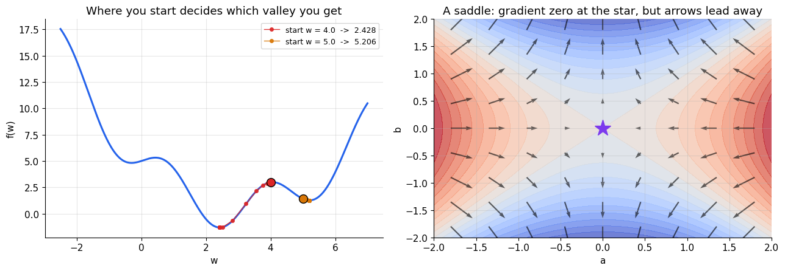

### Cell 281

```python
# ============================================================
#  Method 1 -- Part 5's recipe, done symbolically, exactly.
# ============================================================
rng = np.random.default_rng(0)
n_pts = 40
X_data = np.sort(rng.uniform(0, 10, n_pts))
Y_data = 2.3 * X_data + 1.7 + rng.normal(0, 2.0, n_pts)   # true line + noise
print(f"{n_pts} points generated from y = 2.3x + 1.7 plus noise of sd 2.0")
print("(the model does not know those numbers, and noise means it should not")
print(" recover them exactly -- it recovers the best line THROUGH THIS DATA.)")
print()

m_sym, c_sym = sp.symbols("m c", real=True)
L_sym = sum((m_sym * float(xi) + c_sym - float(yi))**2
            for xi, yi in zip(X_data, Y_data)) / n_pts

dL_dm = sp.simplify(sp.diff(L_sym, m_sym))     # partial derivatives, Part 8
dL_dc = sp.simplify(sp.diff(L_sym, c_sym))
print("dL/dm = 0  ->  ", sp.Eq(sp.nsimplify(dL_dm, rational=False).evalf(4), 0))
print("dL/dc = 0  ->  ", sp.Eq(sp.nsimplify(dL_dc, rational=False).evalf(4), 0))
print()
print("Two linear equations in two unknowns. Part 5 says solve them.")

sol = sp.solve([sp.Eq(dL_dm, 0), sp.Eq(dL_dc, 0)], [m_sym, c_sym], dict=True)[0]
m_exact, c_exact = float(sol[m_sym]), float(sol[c_sym])

def mse(m, c):
    return float(np.mean((m * X_data + c - Y_data) ** 2))

print(f"\nANALYTIC   m = {m_exact:.12f}   c = {c_exact:.12f}   L = {mse(m_exact, c_exact):.12f}")

# ============================================================
#  Method 2 -- gradient descent. No solving, only stepping.
#  (Same cell, so the two answers can be compared on the spot.)
# ============================================================
# The gradient, differentiated by hand from L = mean((m*x + c - y)^2):
#     dL/dm = mean( 2 * (m*x + c - y) * x )      [chain rule, Part 4]
#     dL/dc = mean( 2 * (m*x + c - y) * 1 )
def mse_grad(m, c):
    resid = m * X_data + c - Y_data
    return 2.0 * np.mean(resid * X_data), 2.0 * np.mean(resid)

m_gd, c_gd, eta_fit, n_iter = 0.0, 0.0, 0.02, 4000
loss_hist, m_hist, c_hist = [mse(m_gd, c_gd)], [m_gd], [c_gd]
for _ in range(n_iter):
    gm, gc = mse_grad(m_gd, c_gd)
    m_gd -= eta_fit * gm
    c_gd -= eta_fit * gc
    loss_hist.append(mse(m_gd, c_gd)); m_hist.append(m_gd); c_hist.append(c_gd)

print(f"start          m = {m_hist[0]:.10f}   c = {c_hist[0]:.10f}   L = {loss_hist[0]:.6f}")
for k in (1, 10, 100, 1000, n_iter):
    print(f"after {k:5d}    m = {m_hist[k]:.10f}   c = {c_hist[k]:.10f}   L = {loss_hist[k]:.6f}")

print()
print("            slope m               intercept c")
print(f"analytic    {m_exact:.12f}      {c_exact:.12f}")
print(f"descent     {m_gd:.12f}      {c_gd:.12f}")
print(f"difference  {abs(m_gd - m_exact):.3e}          {abs(c_gd - c_exact):.3e}")
print(f"\nloss, analytic {mse(m_exact, c_exact):.12f}   descent {loss_hist[-1]:.12f}")
print(f"numpy's polyfit, as a third opinion: {np.polyfit(X_data, Y_data, 1)}")

# ---- the fitted line, and the descent ----------------------------------
fig, (axA, axB) = plt.subplots(1, 2, figsize=(13, 4.4))
axA.scatter(X_data, Y_data, s=34, color=C_GREY, alpha=0.75, label="data")
xs = np.linspace(0, 10, 50)
axA.plot(xs, m_exact * xs + c_exact, color=C_EXACT, lw=3.4, alpha=0.55,
         label=f"analytic:  y = {m_exact:.4f}x + {c_exact:.4f}")
axA.plot(xs, m_gd * xs + c_gd, color=C_SLOPE, lw=1.6, ls="--",
         label=f"descent:   y = {m_gd:.4f}x + {c_gd:.4f}")
axA.set_xlabel("x"); axA.set_ylabel("y")
axA.set_title("Two methods, one line (they overlap exactly)")
axA.legend(fontsize=9)

axB.plot(loss_hist, color=C_SLOPE, lw=2.0, label="loss during descent")
axB.axhline(mse(m_exact, c_exact), color=C_EXACT, ls="--", lw=1.6,
            label="analytic minimum")
axB.set_yscale("log")
axB.set_xlabel("gradient descent step")
axB.set_ylabel("mean squared error (log scale)")
axB.set_title("The loss falling to the exact answer")
axB.legend(fontsize=9)
fig.tight_layout()
plt.show()
```

**Output**

```text
40 points generated from y = 2.3x + 1.7 plus noise of sd 2.0
(the model does not know those numbers, and noise means it should not
 recover them exactly -- it recovers the best line THROUGH THIS DATA.)

dL/dm = 0  ->   Eq(10.73*c + 75.71*m - 197.4, 0)
dL/dc = 0  ->   Eq(2.0*c + 10.73*m - 29.29, 0)

Two linear equations in two unknowns. Part 5 says solve them.

ANALYTIC   m = 2.218569752618   c = 2.739278244669   L = 4.628779869948
start          m = 0.0000000000   c = 0.0000000000   L = 263.677735
after     1    m = 3.9472214240   c = 0.5858375893   L = 82.423056
after    10    m = 2.5209855327   c = 0.5774177142   L = 5.746825
after   100    m = 2.3506544201   c = 1.8134344756   L = 4.833748
after  1000    m = 2.2185972721   c = 2.7390853480   L = 4.628780
after  4000    m = 2.2185697526   c = 2.7392782447   L = 4.628780

            slope m               intercept c
analytic    2.218569752618      2.739278244669
descent     2.218569752618      2.739278244670
difference  3.952e-14          2.358e-13

loss, analytic 4.628779869948   descent 4.628779869948
numpy's polyfit, as a third opinion: [2.21856975 2.73927824]
```

**Output**

```text
<Figure size 1300x440 with 2 Axes>
```

**Figure**

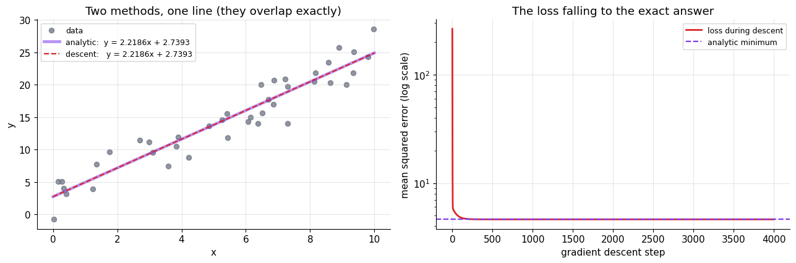

### Cell 286

```python
# ============================================================
#  The forward pass, with every intermediate number printed,
#  and the network drawn with those numbers on it.
# ============================================================
def sigmoid(z):
    return 1.0 / (1.0 + np.exp(-z))

# Fixed, hand-chosen values so the arithmetic below is reproducible and small.
W1 = np.array([[0.50, -1.20],
               [0.80,  0.30]])         # W1[j, k]: input k -> hidden j
b1 = np.array([0.10, -0.40])
W2 = np.array([1.10, -0.70])           # hidden j -> output
b2 = 0.25
x_in  = np.array([0.60, 0.90])         # one training example
y_true = 1.0                           # ... and its correct answer

# ---- forward, one node at a time --------------------------------------
z1 = W1 @ x_in + b1
a1 = sigmoid(z1)
z2 = float(W2 @ a1 + b2)
o  = z2                                # output unit is linear
L  = (o - y_true) ** 2

print("FORWARD PASS, node by node")
print("-" * 62)
print(f"inputs        x1 = {x_in[0]:.4f}      x2 = {x_in[1]:.4f}")
for j in (0, 1):
    print(f"hidden {j+1}      z1[{j}] = {W1[j,0]:+.2f}*{x_in[0]:.2f} "
          f"{W1[j,1]:+.2f}*{x_in[1]:.2f} {b1[j]:+.2f} = {z1[j]:+.6f}")
    print(f"              a1[{j}] = sigmoid({z1[j]:+.6f})           = {a1[j]:.6f}")
print(f"output        z2    = {W2[0]:+.2f}*{a1[0]:.6f} {W2[1]:+.2f}*{a1[1]:.6f} "
      f"{b2:+.2f} = {z2:+.6f}")
print(f"prediction    o     = {o:.6f}        target y = {y_true:.4f}")
print(f"loss          L     = (o - y)^2 = ({o:.6f} - {y_true:.4f})^2 = {L:.6f}")

# ---- draw it, labelled with the numbers just computed ------------------
fig, ax = plt.subplots(figsize=(11, 4.6))
pos = {"x1": (0, 1.0), "x2": (0, -1.0),
       "h1": (2, 1.0), "h2": (2, -1.0),
       "o":  (4, 0.0), "L":  (5.7, 0.0)}
vals = {"x1": x_in[0], "x2": x_in[1], "h1": a1[0], "h2": a1[1], "o": o, "L": L}
face = {"x1": C_SOFT, "x2": C_SOFT, "h1": "#DBEAFE", "h2": "#DBEAFE",
        "o": "#EDE9FE", "L": "#FEE2E2"}
for (k, (px, py)) in pos.items():
    ax.add_patch(plt.Circle((px, py), 0.44, facecolor=face[k],
                            edgecolor=C_GREY, lw=1.6, zorder=3))
    ax.text(px, py + 0.10, k, ha="center", va="center", fontsize=11,
            fontweight="bold", zorder=4)
    ax.text(px, py - 0.15, f"{vals[k]:.4f}", ha="center", va="center",
            fontsize=9.5, color=C_SLOPE, zorder=4)

def arrow(p, q, label, dy=0.0):
    (x0, y0), (x1_, y1_) = pos[p], pos[q]
    ax.annotate("", xy=(x1_ - 0.46, y1_), xytext=(x0 + 0.46, y0),
                arrowprops=dict(arrowstyle="-|>", color=C_GREY, lw=1.3))
    ax.text((x0 + x1_) / 2, (y0 + y1_) / 2 + 0.14 + dy, label,
            ha="center", fontsize=9, color=C_F)

for j, hk in enumerate(("h1", "h2")):
    arrow("x1", hk, f"{W1[j,0]:+.2f}",  0.10)
    arrow("x2", hk, f"{W1[j,1]:+.2f}", -0.10)
    arrow(hk, "o", f"{W2[j]:+.2f}")
arrow("o", "L", "loss")
ax.text(2.0, 1.72, "hidden layer: weighted sum, then sigmoid",
        ha="center", fontsize=9.5, color=C_GREY)
ax.text(4.85, 0.62, f"y = {y_true:.1f}", fontsize=10, color=C_AREA)
ax.set_xlim(-0.9, 6.5); ax.set_ylim(-2.0, 2.1)
ax.axis("off"); ax.grid(False)
ax.set_title("The whole network, with the forward pass written on it")
fig.tight_layout()
plt.show()
```

**Output**

```text
FORWARD PASS, node by node
--------------------------------------------------------------
inputs        x1 = 0.6000      x2 = 0.9000
hidden 1      z1[0] = +0.50*0.60 -1.20*0.90 +0.10 = -0.680000
              a1[0] = sigmoid(-0.680000)           = 0.336261
hidden 2      z1[1] = +0.80*0.60 +0.30*0.90 -0.40 = +0.350000
              a1[1] = sigmoid(+0.350000)           = 0.586618
output        z2    = +1.10*0.336261 -0.70*0.586618 +0.25 = +0.209255
prediction    o     = 0.209255        target y = 1.0000
loss          L     = (o - y)^2 = (0.209255 - 1.0000)^2 = 0.625277
```

**Output**

```text
<Figure size 1100x460 with 1 Axes>
```

**Figure**

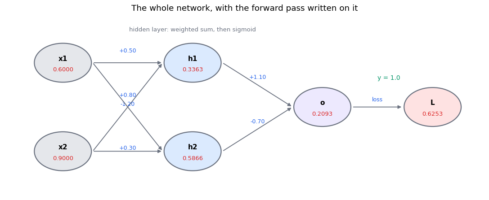

### Cell 290

```python
# ============================================================
#  The backward pass. Every gradient printed as an EXPRESSION
#  first, then as a number -- then checked against Part 8's
#  numerical gradient, which knows nothing about our algebra.
# ============================================================
print("BACKWARD PASS")
print("=" * 74)

# --- step 1 -------------------------------------------------------------
dL_do  = 2.0 * (o - y_true)
delta2 = dL_do * 1.0
print(f"dL/do    = 2*(o - y)            = 2*({o:.6f} - {y_true:.4f}) = {dL_do:+.6f}")
print(f"delta2   = dL/do * do/dz2       = {dL_do:+.6f} * 1 = {delta2:+.6f}")
print()

# --- steps 2 and 3 ------------------------------------------------------
gW2 = delta2 * a1
gb2 = delta2
for j in (0, 1):
    print(f"dL/dW2[{j}] = delta2 * a1[{j}]        = {delta2:+.6f} * {a1[j]:.6f} "
          f"= {gW2[j]:+.6f}")
print(f"dL/db2   = delta2               = {gb2:+.6f}")
print()

# --- step 4: back through the sigmoid ----------------------------------
sig_prime = a1 * (1.0 - a1)                 # sigma'(z) = sigma(z)(1 - sigma(z))
dL_da1    = delta2 * W2
delta1    = dL_da1 * sig_prime
for j in (0, 1):
    print(f"dL/da1[{j}] = delta2 * W2[{j}]        = {delta2:+.6f} * {W2[j]:+.2f} "
          f"= {dL_da1[j]:+.6f}")
    print(f"sigma'(z1[{j}]) = a1[{j}]*(1-a1[{j}])   = {a1[j]:.6f}*{1-a1[j]:.6f} "
          f"= {sig_prime[j]:.6f}")
    print(f"delta1[{j}] = dL/da1[{j}] * sigma'   = {dL_da1[j]:+.6f} * "
          f"{sig_prime[j]:.6f} = {delta1[j]:+.6f}")
print()

# --- step 5 -------------------------------------------------------------
gW1 = np.outer(delta1, x_in)                # gW1[j,k] = delta1[j] * x[k]
gb1 = delta1
for j in (0, 1):
    for k in (0, 1):
        print(f"dL/dW1[{j},{k}] = delta1[{j}] * x[{k}]    = {delta1[j]:+.6f} * "
              f"{x_in[k]:.2f} = {gW1[j,k]:+.6f}")
for j in (0, 1):
    print(f"dL/db1[{j}] = delta1[{j}]           = {gb1[j]:+.6f}")

# --- sanity: sigma' really is sigma(1-sigma), checked symbolically ------
z_s = sp.symbols("z_s", real=True)
sig_s = 1 / (1 + sp.exp(-z_s))
print("\nsympy on sigma':", sp.simplify(sp.diff(sig_s, z_s) - sig_s * (1 - sig_s)),
      " (zero means the identity we derived is exact)")

# ============================================================
#  ... and now the verification, in the SAME cell, because a
#  derivation you have not checked is a derivation you are
#  taking on faith. Part 8's numerical gradient nudges one
#  number, sees how much the loss moves, divides. It uses no
#  algebra at all -- so if it agrees with the hand derivation,
#  the hand derivation is right.
# ============================================================
print()
def numerical_gradient(fn, params, eps=1e-6):
    """Central difference, one entry at a time:  (f(p+e) - f(p-e)) / 2e."""
    p = np.array(params, dtype=float)
    grad = np.zeros_like(p)
    it = np.nditer(p, flags=["multi_index"])
    while not it.finished:
        idx = it.multi_index
        keep = p[idx]
        p[idx] = keep + eps; f_plus  = fn(p)
        p[idx] = keep - eps; f_minus = fn(p)
        p[idx] = keep
        grad[idx] = (f_plus - f_minus) / (2 * eps)
        it.iternext()
    return grad


def loss_of(W1_, b1_, W2_, b2_):
    """The forward pass again, as one function of the nine numbers."""
    a = sigmoid(W1_ @ x_in + b1_)
    return float((W2_ @ a + b2_ - y_true) ** 2)


num_W1 = numerical_gradient(lambda A: loss_of(A,  b1, W2, b2), W1)
num_b1 = numerical_gradient(lambda A: loss_of(W1, A,  W2, b2), b1)
num_W2 = numerical_gradient(lambda A: loss_of(W1, b1, A,  b2), W2)
num_b2 = numerical_gradient(lambda A: loss_of(W1, b1, W2, float(A[0])),
                            np.array([b2]))

rows = [("W1[0,0]", gW1[0, 0], num_W1[0, 0]), ("W1[0,1]", gW1[0, 1], num_W1[0, 1]),
        ("W1[1,0]", gW1[1, 0], num_W1[1, 0]), ("W1[1,1]", gW1[1, 1], num_W1[1, 1]),
        ("b1[0]",   gb1[0],    num_b1[0]),    ("b1[1]",   gb1[1],    num_b1[1]),
        ("W2[0]",   gW2[0],    num_W2[0]),    ("W2[1]",   gW2[1],    num_W2[1]),
        ("b2",      gb2,       num_b2[0])]

TOL = 1e-7
print("parameter |  by hand (calculus) |  numerical (nudging) |  |difference| | verdict")
print("-" * 84)
n_pass = 0
for name, hand, numeric in rows:
    diff = abs(hand - numeric)
    ok = diff < TOL
    n_pass += ok
    print(f"{name:<9} | {hand:+19.12f} | {numeric:+20.12f} | {diff:12.3e} | "
          f"{'PASS' if ok else 'FAIL'}")
print("-" * 84)
print(f"{n_pass} / {len(rows)} gradients agree to better than {TOL:.0e}   "
      f"(largest disagreement {max(abs(h - n) for _, h, n in rows):.3e})")
```

**Output**

```text
BACKWARD PASS
==========================================================================
dL/do    = 2*(o - y)            = 2*(0.209255 - 1.0000) = -1.581490
delta2   = dL/do * do/dz2       = -1.581490 * 1 = -1.581490

dL/dW2[0] = delta2 * a1[0]        = -1.581490 * 0.336261 = -0.531794
dL/dW2[1] = delta2 * a1[1]        = -1.581490 * 0.586618 = -0.927730
dL/db2   = delta2               = -1.581490

dL/da1[0] = delta2 * W2[0]        = -1.581490 * +1.10 = -1.739639
sigma'(z1[0]) = a1[0]*(1-a1[0])   = 0.336261*0.663739 = 0.223190
delta1[0] = dL/da1[0] * sigma'   = -1.739639 * 0.223190 = -0.388269
dL/da1[1] = delta2 * W2[1]        = -1.581490 * -0.70 = +1.107043
sigma'(z1[1]) = a1[1]*(1-a1[1])   = 0.586618*0.413382 = 0.242497
delta1[1] = dL/da1[1] * sigma'   = +1.107043 * 0.242497 = +0.268455

dL/dW1[0,0] = delta1[0] * x[0]    = -0.388269 * 0.60 = -0.232962
dL/dW1[0,1] = delta1[0] * x[1]    = -0.388269 * 0.90 = -0.349442
dL/dW1[1,0] = delta1[1] * x[0]    = +0.268455 * 0.60 = +0.161073
dL/dW1[1,1] = delta1[1] * x[1]    = +0.268455 * 0.90 = +0.241610
dL/db1[0] = delta1[0]           = -0.388269
dL/db1[1] = delta1[1]           = +0.268455

sympy on sigma': 0  (zero means the identity we derived is exact)

parameter |  by hand (calculus) |  numerical (nudging) |  |difference| | verdict
------------------------------------------------------------------------------------
W1[0,0]   |     -0.232961602615 |      -0.232961602620 |    4.588e-12 | PASS
W1[0,1]   |     -0.349442403923 |      -0.349442403902 |    2.087e-11 | PASS
W1[1,0]   |     +0.161073000212 |      +0.161073000327 |    1.143e-10 | PASS
W1[1,1]   |     +0.241609500318 |      +0.241609500351 |    3.267e-11 | PASS
b1[0]     |     -0.388269337692 |      -0.388269337737 |    4.465e-11 | PASS
b1[1]     |     +0.268455000354 |      +0.268455000341 |    1.305e-11 | PASS
W2[0]     |     -0.531793801619 |      -0.531793801606 |    1.347e-11 | PASS
W2[1]     |     -0.927729685162 |      -0.927729685241 |    7.876e-11 | PASS
b2        |     -1.581489744774 |      -1.581489744718 |    5.634e-11 | PASS
------------------------------------------------------------------------------------
9 / 9 gradients agree to better than 1e-07   (largest disagreement 1.143e-10)
```

### Cell 292

```python
# ============================================================
#  Why deep sigmoid stacks stopped working, in one product.
# ============================================================
zs = np.linspace(-6, 6, 400)
print("sigma'(z) = sigma(z)*(1 - sigma(z)).  Its largest possible value:")
z_s2 = sp.symbols("z_s2", real=True)
sig2 = 1 / (1 + sp.exp(-z_s2))
crit = sp.solve(sp.diff(sig2 * (1 - sig2), z_s2), z_s2)
print(f"   d/dz of sigma' is zero at z = {crit}, where sigma' = "
      f"{float((sig2*(1-sig2)).subs(z_s2, crit[0])):.4f}")
print("   so EVERY factor the chain rule contributes through a sigmoid is at")
print("   most 0.25, and usually a good deal less.\n")

# A chain of L sigmoid layers, each with weight 1, input 0.5.
print("depth | product of sigma' along the chain | dLoss/d(first weight)")
print("------+-----------------------------------+----------------------")
val, product = 0.5, 1.0
for depth in range(1, 13):
    z = val                       # weight 1, no bias: z of this layer = previous a
    a = sigmoid(z)
    product *= a * (1 - a)
    val = a
    if depth in (1, 2, 3, 4, 6, 8, 10, 12):
        print(f"{depth:5d} | {product:33.3e} | {product * 0.5:20.3e}")
print(f"\nBest case, all factors at the maximum 0.25:  0.25^12 = {0.25**12:.3e}")

fig, (axL, axR) = plt.subplots(1, 2, figsize=(13, 4.2))
axL.plot(zs, sigmoid(zs), color=C_F, lw=2.4, label="sigmoid(z)")
axL.plot(zs, sigmoid(zs) * (1 - sigmoid(zs)), color=C_SLOPE, lw=2.4,
         label="its derivative")
axL.axhline(0.25, color=C_GREY, ls="--", lw=1.2)
axL.text(-5.8, 0.27, "maximum 0.25", fontsize=9, color=C_GREY)
axL.set_xlabel("z"); axL.set_title("The sigmoid and its derivative")
axL.legend(fontsize=9)

depths = np.arange(1, 21)
prods, v, pr = [], 0.5, 1.0
for _ in depths:
    a = sigmoid(v); pr *= a * (1 - a); v = a; prods.append(pr)
axR.semilogy(depths, prods, "o-", color=C_SLOPE, lw=2.0, label="actual chain")
axR.semilogy(depths, 0.25 ** depths, "--", color=C_GREY, lw=1.6,
             label="best case, 0.25 per layer")
axR.set_xlabel("number of sigmoid layers the gradient passes through")
axR.set_ylabel("size of the gradient (log scale)")
axR.set_title("Vanishing gradients")
axR.legend(fontsize=9)
fig.tight_layout()
plt.show()
```

**Output**

```text
sigma'(z) = sigma(z)*(1 - sigma(z)).  Its largest possible value:
   d/dz of sigma' is zero at z = [0], where sigma' = 0.2500
   so EVERY factor the chain rule contributes through a sigmoid is at
   most 0.25, and usually a good deal less.

depth | product of sigma' along the chain | dLoss/d(first weight)
------+-----------------------------------+----------------------
    1 |                         2.350e-01 |            1.175e-01
    2 |                         5.341e-02 |            2.670e-02
    3 |                         1.203e-02 |            6.016e-03
    4 |                         2.705e-03 |            1.353e-03
    6 |                         1.366e-04 |            6.831e-05
    8 |                         6.898e-06 |            3.449e-06
   10 |                         3.483e-07 |            1.742e-07
   12 |                         1.759e-08 |            8.793e-09

Best case, all factors at the maximum 0.25:  0.25^12 = 5.960e-08
```

**Output**

```text
<Figure size 1300x420 with 2 Axes>
```

**Figure**

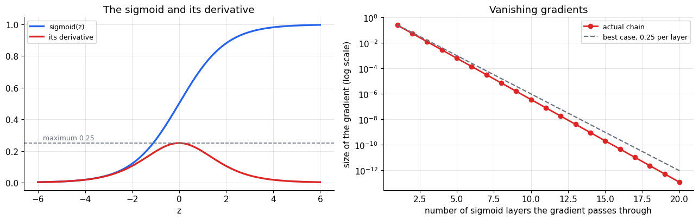

### Cell 295

```python
# ============================================================
#  Put it together: gradient descent driven by backprop.
#  Four training examples -- exclusive-or, the classic problem
#  a network without a hidden layer cannot solve at all.
# ============================================================
X_train = np.array([[0., 0.], [0., 1.], [1., 0.], [1., 1.]])
y_train = np.array([0., 1., 1., 0.])          # XOR

rng2 = np.random.default_rng(3)
A1 = rng2.normal(0, 1.2, (2, 2)); B1 = rng2.normal(0, 1.2, 2)
A2 = rng2.normal(0, 1.2, 2);      B2 = 0.0

eta_net, n_epochs = 0.5, 6000
loss_curve = []
for epoch in range(n_epochs):
    gA1 = np.zeros((2, 2)); gB1 = np.zeros(2)
    gA2 = np.zeros(2);      gB2 = 0.0
    total = 0.0
    for xv, yv in zip(X_train, y_train):
        # --- forward (exactly the pass we drew above) ---
        a  = sigmoid(A1 @ xv + B1)
        oo = float(A2 @ a + B2)
        total += (oo - yv) ** 2
        # --- backward (exactly the five steps we derived) ---
        d2 = 2.0 * (oo - yv)
        gA2 += d2 * a
        gB2 += d2
        d1 = d2 * A2 * a * (1 - a)
        gA1 += np.outer(d1, xv)
        gB1 += d1
    n = len(X_train)
    A1 -= eta_net * gA1 / n                    # the update rule from 9.1
    B1 -= eta_net * gB1 / n
    A2 -= eta_net * gA2 / n
    B2 -= eta_net * gB2 / n
    loss_curve.append(total / n)

print("epoch |    mean squared loss")
print("------+---------------------")
for k in (0, 1, 10, 100, 500, 2000, n_epochs - 1):
    print(f"{k:5d} | {loss_curve[k]:.8f}")
print(f"\nloss fell from {loss_curve[0]:.6f} to {loss_curve[-1]:.3e}  "
      f"(a factor of {loss_curve[0] / loss_curve[-1]:.3g})")
print("\n x1  x2 | target | prediction")
print("--------+--------+-----------")
for xv, yv in zip(X_train, y_train):
    pred = float(A2 @ sigmoid(A1 @ xv + B1) + B2)
    print(f"{xv[0]:.0f}   {xv[1]:.0f}  |  {yv:.0f}     | {pred:+.6f}")

fig, ax = plt.subplots(figsize=(9.5, 4.2))
ax.semilogy(loss_curve, color=C_SLOPE, lw=2.0)
ax.set_xlabel("epoch (one sweep through all four examples)")
ax.set_ylabel("mean squared loss (log scale)")
ax.set_title("Backprop supplying the gradient, gradient descent taking the step")
fig.tight_layout()
plt.show()
```

**Output**

```text
epoch |    mean squared loss
------+---------------------
    0 | 3.36718311
    1 | 1.11249528
   10 | 0.32580029
  100 | 0.20564502
  500 | 0.00000000
 2000 | 0.00000000
 5999 | 0.00000000

loss fell from 3.367183 to 1.405e-30  (a factor of 2.4e+30)

 x1  x2 | target | prediction
--------+--------+-----------
0   0  |  0     | +0.000000
0   1  |  1     | +1.000000
1   0  |  1     | +1.000000
1   1  |  0     | +0.000000
```

**Output**

```text
<Figure size 950x420 with 1 Axes>
```

**Figure**

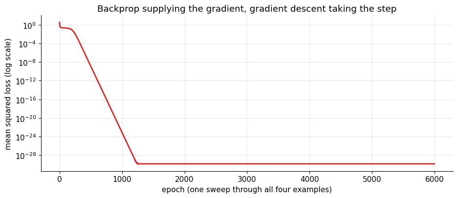

