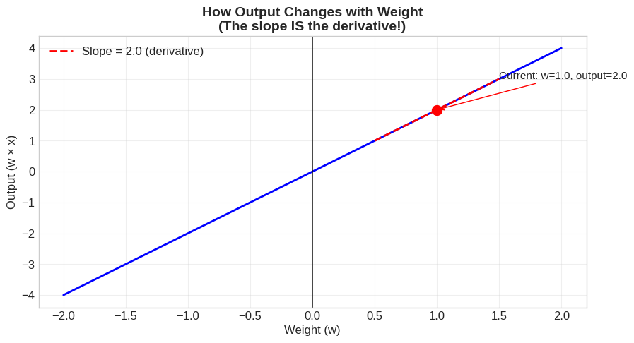
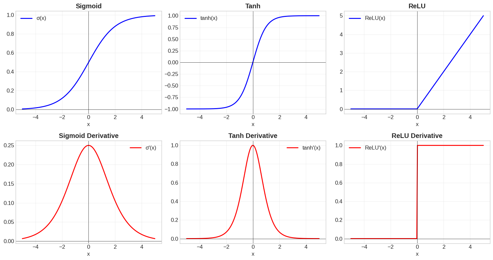
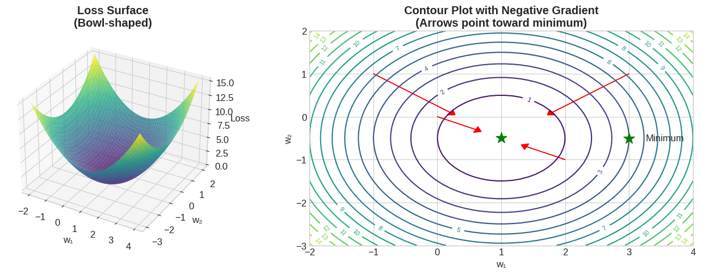
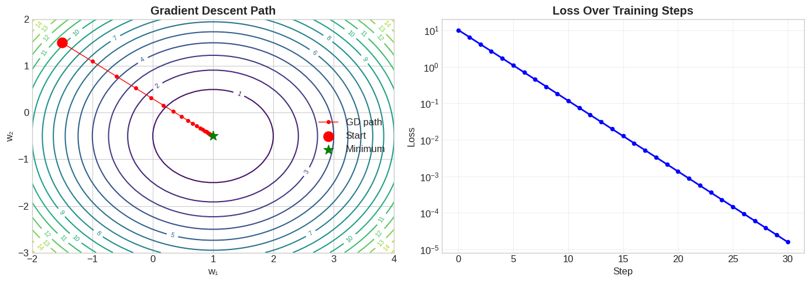
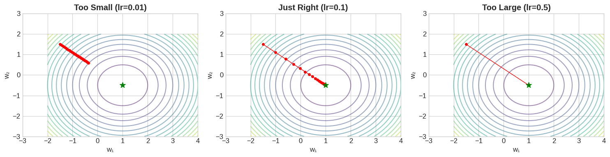
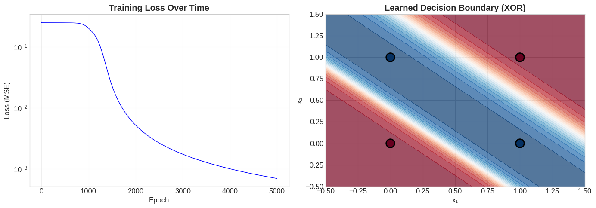
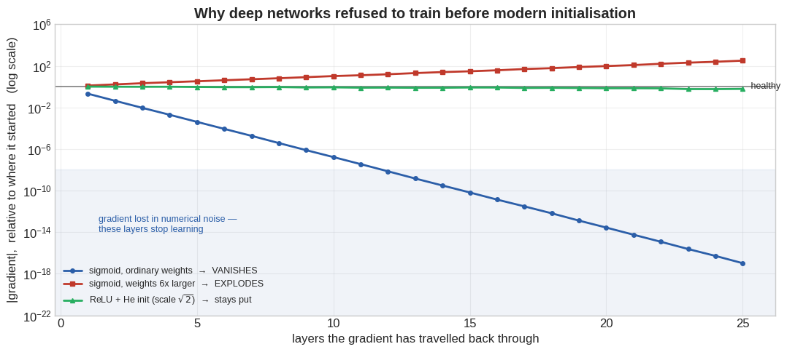

# 14 — Calculus 2

**Status:** Executed successfully

## Code and Output

### Cell 3

```python
# Core libraries
import numpy as np
import matplotlib.pyplot as plt
# (3-D axes need no special import on modern matplotlib —
#  projection='3d' is enough, as used in Section 3.)

# For beautiful visualizations
plt.style.use('seaborn-v0_8-whitegrid')
plt.rcParams['figure.figsize'] = [10, 6]
plt.rcParams['font.size'] = 12

# Set random seed for reproducibility
np.random.seed(42)

print("✅ Setup complete!")
print(f"NumPy version: {np.__version__}")
```

**Output**

```text
✅ Setup complete!
NumPy version: 2.1.3
```

### Cell 5

```python
# Simple example: How does changing weight affect output?

def simple_neuron(x, w):
    """A single neuron: output = w * x"""
    return w * x

x = 2.0  # Fixed input
weights = np.linspace(-2, 2, 100)
outputs = [simple_neuron(x, w) for w in weights]

# Plot
plt.figure(figsize=(10, 5))
plt.plot(weights, outputs, 'b-', linewidth=2)
plt.axhline(y=0, color='k', linewidth=0.5)
plt.axvline(x=0, color='k', linewidth=0.5)

# Mark current weight and show slope
w_current = 1.0
y_current = simple_neuron(x, w_current)
plt.scatter([w_current], [y_current], color='red', s=100, zorder=5)
plt.annotate(f'Current: w={w_current}, output={y_current}',
             xy=(w_current, y_current), xytext=(w_current+0.5, y_current+1),
             fontsize=11, arrowprops=dict(arrowstyle='->', color='red'))

# Draw tangent line (the derivative!)
slope = x  # dy/dw = x (the derivative)
tangent_x = np.array([w_current-0.5, w_current+0.5])
tangent_y = y_current + slope * (tangent_x - w_current)
plt.plot(tangent_x, tangent_y, 'r--', linewidth=2, label=f'Slope = {slope} (derivative)')

plt.xlabel('Weight (w)', fontsize=12)
plt.ylabel('Output (w × x)', fontsize=12)
plt.title('How Output Changes with Weight\n(The slope IS the derivative!)', fontsize=14, fontweight='bold')
plt.legend()
plt.grid(True, alpha=0.3)
plt.show()

print("💡 Key Insight:")
print(f"   If we increase w by a tiny amount ε, output increases by {x}ε")
print(f"   The derivative dy/dw = {x} tells us exactly this rate of change!")
```

**Output**

```text
<Figure size 1000x500 with 1 Axes>
```

**Figure**



**Output**

```text
💡 Key Insight:
   If we increase w by a tiny amount ε, output increases by 2.0ε
   The derivative dy/dw = 2.0 tells us exactly this rate of change!
```

### Cell 10

```python
# Computing derivatives numerically vs analytically
def numerical_derivative(f, x, h=1e-5):
    """Compute derivative using finite differences"""
    return (f(x + h) - f(x - h)) / (2 * h)  # Central difference (more accurate)

# Example: f(x) = x²
def f(x):
    return x ** 2

def f_derivative_analytical(x):
    """Analytical derivative: d/dx(x²) = 2x"""
    return 2 * x

x_test = 3.0
numerical = numerical_derivative(f, x_test)
analytical = f_derivative_analytical(x_test)

print("📐 Computing Derivatives")
print("="*40)
print(f"Function: f(x) = x²")
print(f"At x = {x_test}:")
print(f"  f({x_test}) = {f(x_test)}")
print(f"\n  Numerical derivative:  {numerical:.6f}")
print(f"  Analytical derivative: {analytical:.6f}")
print(f"  Difference: {abs(numerical - analytical):.10f}")
print("\n✅ They match! (tiny error is from numerical approximation)")
```

**Output**

```text
📐 Computing Derivatives
========================================
Function: f(x) = x²
At x = 3.0:
  f(3.0) = 9.0

  Numerical derivative:  6.000000
  Analytical derivative: 6.000000
  Difference: 0.0000000000

✅ They match! (tiny error is from numerical approximation)
```

### Cell 12

```python
# ── Verifying our derivations symbolically with SymPy ──────────────────────
# New API in this cell:
#   sp.symbols('x')  -> creates a symbolic variable (an unknown, not a number)
#   sp.diff(expr, x) -> differentiates expr with respect to x, algebraically
#   sp.simplify(e)   -> rewrites e in a canonical simplified form
#   expr.subs(x, v)  -> substitutes a value in;  float(...) evaluates it
import sympy as sp

x_sym = sp.symbols('x', real=True)          # a symbol, not a value

# ── Step 1 ── the power rule result we derived from the limit definition
expr_square = x_sym**2
print("d/dx [x^2]      =", sp.diff(expr_square, x_sym), "      (we derived 2*x)")

# ── Step 2 ── the sigmoid derivative, the long way and the short way
sigma_sym   = 1 / (1 + sp.exp(-x_sym))              # the definition
deriv_auto  = sp.diff(sigma_sym, x_sym)             # what SymPy computes
deriv_ours  = sigma_sym * (1 - sigma_sym)           # what we derived by hand

# sp.simplify on the DIFFERENCE is the honest test: it should collapse to 0.
difference = sp.simplify(deriv_auto - deriv_ours)
print("sigma'(x) - [sigma(1-sigma)] =", difference, "  <- 0 means our derivation is exact")

# ── Step 3 ── a preview of the rule we'll meet in Section 2, on y = (3x+2)^2.
#              For now just note the answer; Section 2 derives WHY.
expr_chain = (3*x_sym + 2)**2
print("d/dx [(3x+2)^2] =", sp.expand(sp.diff(expr_chain, x_sym)),
      "   (Section 2 will show this is 6*(3x+2) = 18x + 12)")

# ── Step 4 ── the ceiling on the sigmoid gradient, found by calculus itself
#   maximise sigma' by setting its own derivative to zero
critical = sp.solve(sp.diff(deriv_ours, x_sym), x_sym)
peak     = sp.simplify(deriv_ours.subs(x_sym, critical[0]))
print(f"\nsigma' is largest at x = {critical[0]}, where it equals {peak} = {float(peak)}")
print("So one sigmoid layer multiplies an incoming gradient by AT MOST 0.25.")
print("Section 6 measures what that does across many layers.")
```

**Output**

```text
d/dx [x^2]      = 2*x       (we derived 2*x)
sigma'(x) - [sigma(1-sigma)] = 0   <- 0 means our derivation is exact
d/dx [(3x+2)^2] = 18*x + 12    (Section 2 will show this is 6*(3x+2) = 18x + 12)

sigma' is largest at x = 0, where it equals 1/4 = 0.25
So one sigmoid layer multiplies an incoming gradient by AT MOST 0.25.
Section 6 measures what that does across many layers.
```

### Cell 13

```python
# Visualizing activation functions and their derivatives
fig, axes = plt.subplots(2, 3, figsize=(15, 8))

x = np.linspace(-5, 5, 200)

# Sigmoid
sigmoid = 1 / (1 + np.exp(-x))
sigmoid_deriv = sigmoid * (1 - sigmoid)
axes[0, 0].plot(x, sigmoid, 'b-', linewidth=2, label='σ(x)')
axes[0, 0].set_title('Sigmoid', fontweight='bold')
axes[1, 0].plot(x, sigmoid_deriv, 'r-', linewidth=2, label="σ'(x)")
axes[1, 0].set_title("Sigmoid Derivative", fontweight='bold')

# Tanh
tanh = np.tanh(x)
tanh_deriv = 1 - tanh**2
axes[0, 1].plot(x, tanh, 'b-', linewidth=2, label='tanh(x)')
axes[0, 1].set_title('Tanh', fontweight='bold')
axes[1, 1].plot(x, tanh_deriv, 'r-', linewidth=2, label="tanh'(x)")
axes[1, 1].set_title("Tanh Derivative", fontweight='bold')

# ReLU
relu = np.maximum(0, x)
relu_deriv = (x > 0).astype(float)
axes[0, 2].plot(x, relu, 'b-', linewidth=2, label='ReLU(x)')
axes[0, 2].set_title('ReLU', fontweight='bold')
axes[1, 2].plot(x, relu_deriv, 'r-', linewidth=2, label="ReLU'(x)")
axes[1, 2].set_title("ReLU Derivative", fontweight='bold')

for ax in axes.flat:
    ax.axhline(y=0, color='k', linewidth=0.5)
    ax.axvline(x=0, color='k', linewidth=0.5)
    ax.grid(True, alpha=0.3)
    ax.legend()
    ax.set_xlabel('x')

plt.tight_layout()
plt.show()

print("💡 Key Insights:")
print("   • Sigmoid/Tanh: Derivatives → 0 for large |x| (vanishing gradient problem!)")
print("   • ReLU: Derivative is 0 or 1 (no vanishing gradient for x > 0)")
print("   • This is why ReLU became the default activation in modern networks!")
```

**Output**

```text
<Figure size 1500x800 with 6 Axes>
```

**Figure**



**Output**

```text
💡 Key Insights:
   • Sigmoid/Tanh: Derivatives → 0 for large |x| (vanishing gradient problem!)
   • ReLU: Derivative is 0 or 1 (no vanishing gradient for x > 0)
   • This is why ReLU became the default activation in modern networks!
```

### Cell 19

```python
# Chain Rule Example: y = (3x + 2)²
# Let g(x) = 3x + 2, and y = g²
# dy/dx = dy/dg * dg/dx = 2g * 3 = 6(3x + 2)

def g(x):
    return 3 * x + 2

def y(x):
    return g(x) ** 2

# Derivatives
def dg_dx(x):
    return 3  # d/dx(3x + 2) = 3

def dy_dg(x):
    return 2 * g(x)  # d/dg(g²) = 2g

def dy_dx_chain_rule(x):
    return dy_dg(x) * dg_dx(x)  # Chain rule!

x_test = 2.0
print("⛓️ Chain Rule Example: y = (3x + 2)²")
print("="*45)
print(f"x = {x_test}")
print(f"g(x) = 3x + 2 = {g(x_test)}")
print(f"y = g² = {y(x_test)}")
print(f"\nUsing Chain Rule:")
print(f"  dg/dx = 3")
print(f"  dy/dg = 2g = 2 × {g(x_test)} = {dy_dg(x_test)}")
print(f"  dy/dx = dy/dg × dg/dx = {dy_dg(x_test)} × {dg_dx(x_test)} = {dy_dx_chain_rule(x_test)}")
print(f"\nVerify numerically: {numerical_derivative(y, x_test):.4f}")
print(f"✅ Match!")
```

**Output**

```text
⛓️ Chain Rule Example: y = (3x + 2)²
=============================================
x = 2.0
g(x) = 3x + 2 = 8.0
y = g² = 64.0

Using Chain Rule:
  dg/dx = 3
  dy/dg = 2g = 2 × 8.0 = 16.0
  dy/dx = dy/dg × dg/dx = 16.0 × 3 = 48.0

Verify numerically: 48.0000
✅ Match!
```

### Cell 20

```python
# Deep Learning Example: Chain Rule Through a Mini Network
# x → [w1] → z1 → [sigmoid] → a1 → [w2] → z2 → [MSE loss] → L

def forward_pass(x, w1, w2, y_true):
    """Forward pass through mini network"""
    # Layer 1
    z1 = w1 * x
    a1 = 1 / (1 + np.exp(-z1))  # Sigmoid

    # Layer 2
    z2 = w2 * a1
    prediction = z2

    # Loss (MSE)
    loss = (prediction - y_true) ** 2

    return z1, a1, z2, prediction, loss

def backward_pass(x, w1, w2, y_true, z1, a1, z2, prediction):
    """Backward pass using chain rule"""
    # dL/d(prediction) = 2(prediction - y_true)
    dL_dpred = 2 * (prediction - y_true)

    # dL/dz2 = dL/dpred * dpred/dz2 = dL/dpred * 1
    dL_dz2 = dL_dpred

    # dL/dw2 = dL/dz2 * dz2/dw2 = dL/dz2 * a1
    dL_dw2 = dL_dz2 * a1

    # dL/da1 = dL/dz2 * dz2/da1 = dL/dz2 * w2
    dL_da1 = dL_dz2 * w2

    # dL/dz1 = dL/da1 * da1/dz1 = dL/da1 * sigmoid'(z1)
    sigmoid_deriv = a1 * (1 - a1)  # Sigmoid derivative
    dL_dz1 = dL_da1 * sigmoid_deriv

    # dL/dw1 = dL/dz1 * dz1/dw1 = dL/dz1 * x
    dL_dw1 = dL_dz1 * x

    return dL_dw1, dL_dw2

# Test
x = 2.0
w1 = 0.5
w2 = 0.8
y_true = 1.0

z1, a1, z2, pred, loss = forward_pass(x, w1, w2, y_true)
dL_dw1, dL_dw2 = backward_pass(x, w1, w2, y_true, z1, a1, z2, pred)

print("🧠 Chain Rule Through a Neural Network")
print("="*50)
print("Network: x → w1 → sigmoid → w2 → MSE Loss")
print(f"\nForward Pass:")
print(f"  x = {x}")
print(f"  z1 = w1 × x = {w1} × {x} = {z1}")
print(f"  a1 = sigmoid(z1) = {a1:.4f}")
print(f"  z2 = w2 × a1 = {w2} × {a1:.4f} = {z2:.4f}")
print(f"  prediction = {pred:.4f}")
print(f"  loss = (pred - y)² = ({pred:.4f} - {y_true})² = {loss:.4f}")

print(f"\nBackward Pass (Chain Rule!):")
print(f"  dL/dw2 = {dL_dw2:.4f}")
print(f"  dL/dw1 = {dL_dw1:.4f}")

print("\n💡 These gradients tell us how to adjust w1 and w2 to reduce loss!")
```

**Output**

```text
🧠 Chain Rule Through a Neural Network
==================================================
Network: x → w1 → sigmoid → w2 → MSE Loss

Forward Pass:
  x = 2.0
  z1 = w1 × x = 0.5 × 2.0 = 1.0
  a1 = sigmoid(z1) = 0.7311
  z2 = w2 × a1 = 0.8 × 0.7311 = 0.5848
  prediction = 0.5848
  loss = (pred - y)² = (0.5848 - 1.0)² = 0.1724

Backward Pass (Chain Rule!):
  dL/dw2 = -0.6070
  dL/dw1 = -0.2612

💡 These gradients tell us how to adjust w1 and w2 to reduce loss!
```

### Cell 24

```python
# Example: f(x, y) = x² + 2xy + y²
def f(x, y):
    return x**2 + 2*x*y + y**2

# Partial derivatives (computed analytically)
def df_dx(x, y):
    """∂f/∂x = 2x + 2y (treat y as constant)"""
    return 2*x + 2*y

def df_dy(x, y):
    """∂f/∂y = 2x + 2y (treat x as constant)"""
    return 2*x + 2*y

def gradient(x, y):
    """Gradient = [∂f/∂x, ∂f/∂y]"""
    return np.array([df_dx(x, y), df_dy(x, y)])

# Test at point (1, 2)
x, y = 1.0, 2.0
print("📐 Partial Derivatives and Gradient")
print("="*45)
print(f"Function: f(x, y) = x² + 2xy + y²")
print(f"Point: (x, y) = ({x}, {y})")
print(f"f({x}, {y}) = {f(x, y)}")
print(f"\n∂f/∂x = 2x + 2y = {df_dx(x, y)}")
print(f"∂f/∂y = 2x + 2y = {df_dy(x, y)}")
print(f"\nGradient ∇f = [{df_dx(x, y)}, {df_dy(x, y)}]")
print(f"Gradient magnitude: {np.linalg.norm(gradient(x, y)):.2f}")

print("\n💡 The gradient points toward steepest ascent!")
print("   To minimize, go in the OPPOSITE direction (negative gradient).")
```

**Output**

```text
📐 Partial Derivatives and Gradient
=============================================
Function: f(x, y) = x² + 2xy + y²
Point: (x, y) = (1.0, 2.0)
f(1.0, 2.0) = 9.0

∂f/∂x = 2x + 2y = 6.0
∂f/∂y = 2x + 2y = 6.0

Gradient ∇f = [6.0, 6.0]
Gradient magnitude: 8.49

💡 The gradient points toward steepest ascent!
   To minimize, go in the OPPOSITE direction (negative gradient).
```

### Cell 25

```python
# Visualizing gradient on a loss surface
fig = plt.figure(figsize=(14, 5))

# Loss function (bowl shape)
def loss(w1, w2):
    return (w1 - 1)**2 + (w2 + 0.5)**2

def loss_gradient(w1, w2):
    return np.array([2*(w1 - 1), 2*(w2 + 0.5)])

# Create grid
w1_range = np.linspace(-2, 4, 50)
w2_range = np.linspace(-3, 2, 50)
W1, W2 = np.meshgrid(w1_range, w2_range)
L = loss(W1, W2)

# 3D surface
ax1 = fig.add_subplot(121, projection='3d')
ax1.plot_surface(W1, W2, L, cmap='viridis', alpha=0.8)
ax1.set_xlabel('w₁')
ax1.set_ylabel('w₂')
ax1.set_zlabel('Loss')
ax1.set_title('Loss Surface\n(Bowl-shaped)', fontweight='bold')

# 2D contour with gradient arrows
ax2 = fig.add_subplot(122)
contour = ax2.contour(W1, W2, L, levels=15, cmap='viridis')
ax2.clabel(contour, inline=True, fontsize=8)

# Plot gradient arrows at several points
points = [(-1, 1), (0, 0), (2, -1), (3, 1)]
for w1, w2 in points:
    grad = loss_gradient(w1, w2)
    # Negative gradient (direction of descent)
    ax2.arrow(w1, w2, -grad[0]*0.3, -grad[1]*0.3,
              head_width=0.15, head_length=0.1, fc='red', ec='red')

# Mark minimum
ax2.scatter([1], [-0.5], color='green', s=200, marker='*', zorder=5, label='Minimum')
ax2.set_xlabel('w₁')
ax2.set_ylabel('w₂')
ax2.set_title('Contour Plot with Negative Gradient\n(Arrows point toward minimum)', fontweight='bold')
ax2.legend()

plt.tight_layout()
plt.show()

print("💡 Key Insight: Gradient descent follows the negative gradient downhill!")
print("   Red arrows show the direction we should move to reduce loss.")
```

**Output**

```text
<Figure size 1400x500 with 2 Axes>
```

**Figure**



**Output**

```text
💡 Key Insight: Gradient descent follows the negative gradient downhill!
   Red arrows show the direction we should move to reduce loss.
```

### Cell 29

```python
# Gradient Descent Implementation
def gradient_descent(loss_fn, grad_fn, initial_weights, learning_rate, num_steps):
    """
    Perform gradient descent optimization.

    Returns: history of (weights, loss) at each step
    """
    weights = np.array(initial_weights, dtype=float)
    history = [(weights.copy(), loss_fn(*weights))]

    for _ in range(num_steps):
        gradient = grad_fn(*weights)
        weights = weights - learning_rate * gradient
        history.append((weights.copy(), loss_fn(*weights)))

    return history

# Use our loss function from before
# loss(w1, w2) = (w1 - 1)² + (w2 + 0.5)²
# Minimum at (1, -0.5)

initial = [-1.5, 1.5]
lr = 0.1
steps = 30

history = gradient_descent(loss, loss_gradient, initial, lr, steps)

print("🚀 Gradient Descent in Action")
print("="*50)
print(f"Loss function: L(w₁, w₂) = (w₁ - 1)² + (w₂ + 0.5)²")
print(f"True minimum: (1.0, -0.5)")
print(f"Initial weights: {initial}")
print(f"Learning rate: {lr}")
print(f"\nOptimization path:")
for i, (w, l) in enumerate(history[:6]):
    print(f"  Step {i}: w = [{w[0]:.4f}, {w[1]:.4f}], loss = {l:.4f}")
print("  ...")
final_w, final_l = history[-1]
print(f"  Step {len(history)-1}: w = [{final_w[0]:.4f}, {final_w[1]:.4f}], loss = {final_l:.6f}")
print(f"\n✅ Converged to approximately (1.0, -0.5)!")
```

**Output**

```text
🚀 Gradient Descent in Action
==================================================
Loss function: L(w₁, w₂) = (w₁ - 1)² + (w₂ + 0.5)²
True minimum: (1.0, -0.5)
Initial weights: [-1.5, 1.5]
Learning rate: 0.1

Optimization path:
  Step 0: w = [-1.5000, 1.5000], loss = 10.2500
  Step 1: w = [-1.0000, 1.1000], loss = 6.5600
  Step 2: w = [-0.6000, 0.7800], loss = 4.1984
  Step 3: w = [-0.2800, 0.5240], loss = 2.6870
  Step 4: w = [-0.0240, 0.3192], loss = 1.7197
  Step 5: w = [0.1808, 0.1554], loss = 1.1006
  ...
  Step 30: w = [0.9969, -0.4975], loss = 0.000016

✅ Converged to approximately (1.0, -0.5)!
```

### Cell 30

```python
# Visualizing the gradient descent path
fig, axes = plt.subplots(1, 2, figsize=(14, 5))

# Left: Path on contour plot
ax1 = axes[0]
contour = ax1.contour(W1, W2, L, levels=15, cmap='viridis')
ax1.clabel(contour, inline=True, fontsize=8)

# Plot path
weights_path = np.array([h[0] for h in history])
ax1.plot(weights_path[:, 0], weights_path[:, 1], 'ro-', markersize=4, linewidth=1, label='GD path')
ax1.scatter([initial[0]], [initial[1]], color='red', s=150, marker='o', zorder=5, label='Start')
ax1.scatter([1], [-0.5], color='green', s=150, marker='*', zorder=5, label='Minimum')

ax1.set_xlabel('w₁')
ax1.set_ylabel('w₂')
ax1.set_title('Gradient Descent Path', fontweight='bold')
ax1.legend()

# Right: Loss over time
ax2 = axes[1]
losses = [h[1] for h in history]
ax2.plot(losses, 'b-', linewidth=2)
ax2.scatter(range(len(losses)), losses, color='blue', s=20)
ax2.set_xlabel('Step')
ax2.set_ylabel('Loss')
ax2.set_title('Loss Over Training Steps', fontweight='bold')
ax2.set_yscale('log')
ax2.grid(True, alpha=0.3)

plt.tight_layout()
plt.show()

print("💡 Key Insight: Gradient descent 'rolls downhill' on the loss surface!")
print("   Each step moves in the direction of steepest descent.")
```

**Output**

```text
<Figure size 1400x500 with 2 Axes>
```

**Figure**



**Output**

```text
💡 Key Insight: Gradient descent 'rolls downhill' on the loss surface!
   Each step moves in the direction of steepest descent.
```

### Cell 32

```python
# Learning Rate Effects
fig, axes = plt.subplots(1, 3, figsize=(15, 4))

learning_rates = [0.01, 0.1, 0.5]
titles = ['Too Small (lr=0.01)', 'Just Right (lr=0.1)', 'Too Large (lr=0.5)']

for ax, lr, title in zip(axes, learning_rates, titles):
    history = gradient_descent(loss, loss_gradient, [-1.5, 1.5], lr, 30)
    weights_path = np.array([h[0] for h in history])

    contour = ax.contour(W1, W2, L, levels=15, cmap='viridis', alpha=0.5)
    ax.plot(weights_path[:, 0], weights_path[:, 1], 'ro-', markersize=4, linewidth=1)
    ax.scatter([1], [-0.5], color='green', s=100, marker='*', zorder=5)
    ax.set_xlabel('w₁')
    ax.set_ylabel('w₂')
    ax.set_title(title, fontweight='bold')
    ax.set_xlim(-3, 4)
    ax.set_ylim(-3, 3)

plt.tight_layout()
plt.show()

print("💡 Learning Rate is CRITICAL:")
print("   • Too small → Very slow convergence")
print("   • Just right → Smooth, efficient convergence")
print("   • Too large → Oscillation, may diverge!")
```

**Output**

```text
<Figure size 1500x400 with 3 Axes>
```

**Figure**



**Output**

```text
💡 Learning Rate is CRITICAL:
   • Too small → Very slow convergence
   • Just right → Smooth, efficient convergence
   • Too large → Oscillation, may diverge!
```

### Cell 36

```python
# Complete Backpropagation Example: XOR Problem
# Network: 2 inputs → 4 hidden (sigmoid) → 1 output (sigmoid)

class SimpleNeuralNetwork:
    def __init__(self):
        # Xavier/He initialization
        np.random.seed(42)
        self.W1 = np.random.randn(2, 4) * 0.5  # 2 inputs → 4 hidden
        self.b1 = np.zeros((1, 4))
        self.W2 = np.random.randn(4, 1) * 0.5  # 4 hidden → 1 output
        self.b2 = np.zeros((1, 1))

    def sigmoid(self, z):
        return 1 / (1 + np.exp(-np.clip(z, -500, 500)))

    def sigmoid_derivative(self, a):
        return a * (1 - a)

    def forward(self, X):
        """Forward pass - save values for backprop"""
        self.X = X
        self.z1 = X @ self.W1 + self.b1
        self.a1 = self.sigmoid(self.z1)
        self.z2 = self.a1 @ self.W2 + self.b2
        self.a2 = self.sigmoid(self.z2)
        return self.a2

    def backward(self, y_true, learning_rate=0.5):
        """Backward pass - compute gradients using chain rule"""
        m = y_true.shape[0]  # batch size

        # Output layer gradients (chain rule!)
        dL_da2 = 2 * (self.a2 - y_true)  # MSE derivative
        da2_dz2 = self.sigmoid_derivative(self.a2)
        dz2 = dL_da2 * da2_dz2  # Element-wise for batch

        dW2 = (self.a1.T @ dz2) / m
        db2 = np.sum(dz2, axis=0, keepdims=True) / m

        # Hidden layer gradients (chain rule continues!)
        da1 = dz2 @ self.W2.T
        dz1 = da1 * self.sigmoid_derivative(self.a1)

        dW1 = (self.X.T @ dz1) / m
        db1 = np.sum(dz1, axis=0, keepdims=True) / m

        # Update weights (gradient descent step)
        self.W2 -= learning_rate * dW2
        self.b2 -= learning_rate * db2
        self.W1 -= learning_rate * dW1
        self.b1 -= learning_rate * db1

        return np.mean((self.a2 - y_true) ** 2)  # Return loss

# XOR data
X = np.array([[0, 0], [0, 1], [1, 0], [1, 1]])
y = np.array([[0], [1], [1], [0]])

# Train!
nn = SimpleNeuralNetwork()
losses = []

print("🧠 Training Neural Network with Backpropagation")
print("="*50)
print("Problem: XOR (not linearly separable!)")
print(f"Architecture: 2 → 4 → 1")

for epoch in range(5000):
    predictions = nn.forward(X)
    # NOTE: name it epoch_loss, not loss — `loss` is the loss
    # FUNCTION defined back in Section 3, and we must not shadow it.
    epoch_loss = nn.backward(y, learning_rate=1.0)
    losses.append(epoch_loss)

    if epoch % 1000 == 0:
        print(f"Epoch {epoch}: Loss = {epoch_loss:.6f}")

print(f"\nFinal predictions:")
for xi, yi, pred in zip(X, y, predictions):
    print(f"  Input: {xi} → Pred: {pred[0]:.3f} (Target: {yi[0]})")
```

**Output**

```text
🧠 Training Neural Network with Backpropagation
==================================================
Problem: XOR (not linearly separable!)
Architecture: 2 → 4 → 1
Epoch 0: Loss = 0.255675
Epoch 1000: Loss = 0.203313
Epoch 2000: Loss = 0.005210
Epoch 3000: Loss = 0.001743
Epoch 4000: Loss = 0.001005

Final predictions:
  Input: [0 0] → Pred: 0.030 (Target: 0)
  Input: [0 1] → Pred: 0.975 (Target: 1)
  Input: [1 0] → Pred: 0.975 (Target: 1)
  Input: [1 1] → Pred: 0.025 (Target: 0)
```

### Cell 37

```python
# Visualize training
fig, axes = plt.subplots(1, 2, figsize=(14, 5))

# Loss curve
axes[0].plot(losses, 'b-', linewidth=1)
axes[0].set_xlabel('Epoch')
axes[0].set_ylabel('Loss (MSE)')
axes[0].set_title('Training Loss Over Time', fontweight='bold')
axes[0].set_yscale('log')
axes[0].grid(True, alpha=0.3)

# Decision boundary
xx, yy = np.meshgrid(np.linspace(-0.5, 1.5, 100), np.linspace(-0.5, 1.5, 100))
grid = np.c_[xx.ravel(), yy.ravel()]
Z = nn.forward(grid).reshape(xx.shape)

axes[1].contourf(xx, yy, Z, levels=20, cmap='RdBu', alpha=0.7)
axes[1].scatter(X[:, 0], X[:, 1], c=y.ravel(), cmap='RdBu', s=200, edgecolors='black', linewidth=2)
axes[1].set_xlabel('x₁')
axes[1].set_ylabel('x₂')
axes[1].set_title('Learned Decision Boundary (XOR)', fontweight='bold')

plt.tight_layout()
plt.show()

print("🎉 Success! The network learned XOR through backpropagation!")
print("   Blue = 0, Red = 1. The curved boundary separates the XOR pattern.")
```

**Output**

```text
<Figure size 1400x500 with 2 Axes>
```

**Figure**



**Output**

```text
🎉 Success! The network learned XOR through backpropagation!
   Blue = 0, Red = 1. The curved boundary separates the XOR pattern.
```

### Cell 41

```python
# ── Measuring how a gradient's size changes as it travels back ────────────
# The realistic experiment: push a gradient VECTOR back through `depth`
# random layers of a fixed width and record its length at each step.
# We repeat it many times and take the median, so the picture reflects the
# typical case rather than one lucky random draw.
#
# New API in this cell:
#   np.random.default_rng(0)   -> a modern, seeded random generator
#   np.linalg.norm(v)          -> Euclidean length of a vector
#   np.median(A, axis=0)       -> element-wise median down the trials
#   ax.set_yscale('log')       -> log axis; essential across 20 orders of magnitude

WIDTH, DEPTH, TRIALS = 64, 25, 60
rng_vg = np.random.default_rng(0)

def backward_norms(scale, activation):
    """Return |gradient| after each of DEPTH layers, starting from size 1."""
    g = rng_vg.normal(0, 1, WIDTH)
    g /= np.linalg.norm(g)                       # start at exactly 1.0
    sizes = []
    for _ in range(DEPTH):
        z = rng_vg.normal(0, 1, WIDTH)           # typical pre-activations
        # weights scaled by 1/sqrt(width) — the standard convention that
        # keeps a layer's output variance stable regardless of width
        W_layer = rng_vg.normal(0, scale / np.sqrt(WIDTH), size=(WIDTH, WIDTH))

        if activation == "sigmoid":
            a = 1.0 / (1.0 + np.exp(-z))
            local = a * (1 - a)                  # sigma'  — derived in Section 1
        else:                                    # ReLU
            local = (z > 0).astype(float)        # 1 where active, 0 where not

        g = (W_layer.T @ g) * local              # one backward step (chain rule)
        sizes.append(np.linalg.norm(g))
    return np.array(sizes)

def median_curve(scale, activation):
    runs = np.array([backward_norms(scale, activation) for _ in range(TRIALS)])
    return np.median(runs, axis=0)

depths        = np.arange(1, DEPTH + 1)
curve_vanish  = median_curve(1.0,          "sigmoid")   # ordinary weights
curve_explode = median_curve(6.0,          "sigmoid")   # weights turned up
curve_healthy = median_curve(np.sqrt(2),   "relu")      # ReLU + He initialisation

fig, ax = plt.subplots(figsize=(11, 5))
ax.axhline(1.0, color='black', lw=1.2, ls='-', alpha=0.5)
ax.text(25.2, 1.0, ' healthy', va='center', fontsize=9)

ax.plot(depths, curve_vanish,  'o-', color='#2b5ea8', lw=2, ms=4,
        label='sigmoid, ordinary weights  →  VANISHES')
ax.plot(depths, curve_explode, 's-', color='#c0392b', lw=2, ms=4,
        label='sigmoid, weights 6x larger  →  EXPLODES')
ax.plot(depths, curve_healthy, '^-', color='#27ae60', lw=2, ms=4,
        label='ReLU + He init (scale $\\sqrt{2}$)  →  stays put')

ax.axhspan(1e-8, 1e-22, color='#2b5ea8', alpha=0.07)
ax.text(1.4, 1e-14, 'gradient lost in numerical noise —\nthese layers stop learning',
        fontsize=9, color='#2b5ea8')

ax.set_yscale('log')
ax.set_ylim(1e-22, 1e6)
ax.set_xlabel('layers the gradient has travelled back through')
ax.set_ylabel('|gradient|,  relative to where it started   (log scale)')
ax.set_title('Why deep networks refused to train before modern initialisation',
             fontweight='bold')
ax.legend(loc='lower left', fontsize=9)
ax.grid(True, alpha=0.3)
plt.tight_layout(); plt.show()

print(f"After 10 layers, the median gradient size is:")
print(f"   sigmoid, ordinary weights : {curve_vanish[9]:.2e}   (vanished)")
print(f"   sigmoid, 6x larger weights: {curve_explode[9]:.2e}   (exploded)")
print(f"   ReLU + He initialisation  : {curve_healthy[9]:.2e}   (healthy)")
print(f"\nAt depth {DEPTH} the sigmoid gradient is {curve_vanish[-1]:.1e} of its")
print(f"original size — far below the precision training can even represent.")
```

**Output**

```text
<Figure size 1100x500 with 1 Axes>
```

**Figure**



**Output**

```text
After 10 layers, the median gradient size is:
   sigmoid, ordinary weights : 1.67e-07   (vanished)
   sigmoid, 6x larger weights: 1.04e+01   (exploded)
   ReLU + He initialisation  : 8.53e-01   (healthy)

At depth 25 the sigmoid gradient is 1.0e-17 of its
original size — far below the precision training can even represent.
```

### Cell 44

```python
# ── Gradient checking the network from Section 5 ──────────────────────────
# New API in this cell:
#   np.nditer(A, flags=['multi_index'])  -> walk every element of an array,
#        giving its index tuple, so we can perturb one weight at a time
#   np.linalg.norm(A)                    -> Euclidean length of an array

# ── Step 1 ── the analytical gradients, WITHOUT taking a training step.
# (The nn.backward() method updates the weights as a side effect, so we
#  restate the same chain-rule formulas here in a read-only form.)
def analytic_grads(net, Xb, yb):
    m  = yb.shape[0]
    a2 = net.forward(Xb)                                  # fills net.a1, net.X

    dz2 = 2 * (a2 - yb) * net.sigmoid_derivative(a2)      # dL/dz2  (chain rule)
    gW2 = (net.a1.T @ dz2) / m
    gb2 = np.sum(dz2, axis=0, keepdims=True) / m

    dz1 = (dz2 @ net.W2.T) * net.sigmoid_derivative(net.a1)   # push back a layer
    gW1 = (net.X.T @ dz1) / m
    gb1 = np.sum(dz1, axis=0, keepdims=True) / m
    return {"W1": gW1, "b1": gb1, "W2": gW2, "b2": gb2}

# ── Step 2 ── the loss as a plain function of the current weights
def net_loss(net, Xb, yb):
    return float(np.mean((net.forward(Xb) - yb) ** 2))

# ── Step 3 ── the numerical gradient: nudge ONE weight, see what the loss does.
#   This is the central-difference formula from Section 1, applied to every
#   single parameter in turn. It costs 2 forward passes PER PARAMETER — which
#   is why we do it once on a toy net and never in the training loop.
def numeric_grads(net, Xb, yb, h=1e-6):
    out = {}
    for name in ("W1", "b1", "W2", "b2"):
        P = getattr(net, name)
        g = np.zeros_like(P)
        it = np.nditer(P, flags=["multi_index"])
        while not it.finished:
            idx, original = it.multi_index, P[it.multi_index]
            P[idx] = original + h; loss_plus  = net_loss(net, Xb, yb)
            P[idx] = original - h; loss_minus = net_loss(net, Xb, yb)
            P[idx] = original                       # always restore!
            g[idx] = (loss_plus - loss_minus) / (2 * h)
            it.iternext()
        out[name] = g
    return out

# ── Step 4 ── compare them
grads_a = analytic_grads(nn, X, y)
grads_n = numeric_grads(nn, X, y)

print("🔍 Gradient Check on the trained XOR network")
print("=" * 58)
print(f"{'parameter':<12}{'relative error':>18}   verdict")
print("-" * 58)
worst = 0.0
for name in ("W1", "b1", "W2", "b2"):
    diff = np.linalg.norm(grads_a[name] - grads_n[name])
    scale = np.linalg.norm(grads_a[name]) + np.linalg.norm(grads_n[name])
    rel = diff / scale if scale > 0 else 0.0
    worst = max(worst, rel)
    verdict = "✅ correct" if rel < 1e-7 else ("⚠️ suspicious" if rel < 1e-4 else "❌ BUG")
    print(f"{name:<12}{rel:>18.3e}   {verdict}")
print("-" * 58)
print(f"worst relative error: {worst:.3e}")
print("\n✅ Backpropagation and finite differences agree to ~9 decimal places.")
print("   The chain-rule algebra in Section 5 is provably implemented correctly.")

# ── Step 5 ── what a REAL bug looks like, so you can recognise one
grads_bugged = {k: v.copy() for k, v in grads_a.items()}
grads_bugged["W1"] = grads_bugged["W1"] * 0.5      # a classic: forgot a factor
bad_diff  = np.linalg.norm(grads_bugged["W1"] - grads_n["W1"])
bad_scale = np.linalg.norm(grads_bugged["W1"]) + np.linalg.norm(grads_n["W1"])
print(f"\nFor contrast — the same check on a gradient with a missing factor of 2:")
print(f"   relative error = {bad_diff/bad_scale:.3e}  ❌  (five orders of magnitude worse)")
```

**Output**

```text
🔍 Gradient Check on the trained XOR network
==========================================================
parameter       relative error   verdict
----------------------------------------------------------
W1                   5.738e-09   ✅ correct
b1                   6.299e-09   ✅ correct
W2                   2.026e-09   ✅ correct
b2                   1.093e-08   ✅ correct
----------------------------------------------------------
worst relative error: 1.093e-08

✅ Backpropagation and finite differences agree to ~9 decimal places.
   The chain-rule algebra in Section 5 is provably implemented correctly.

For contrast — the same check on a gradient with a missing factor of 2:
   relative error = 3.333e-01  ❌  (five orders of magnitude worse)
```

### Cell 46

```python
# ── The same gradients, computed by PyTorch's autograd ────────────────────
# New API in this cell:
#   torch.tensor(a, requires_grad=True) -> a tensor that RECORDS operations
#   L.backward()                        -> walk the recorded graph backwards
#   t.grad                              -> the accumulated dL/dt after backward
#   t.item()                            -> pull a Python float out of a tensor
try:
    import torch
    HAS_TORCH = True
except ImportError:                        # Colab ships torch; this is a safety net
    HAS_TORCH = False
    print("PyTorch not installed — run `!pip install torch` to see this comparison.")

if HAS_TORCH:
    # ── Step 1 ── copy the SAME weights out of our NumPy network
    tW1 = torch.tensor(nn.W1, requires_grad=True)
    tb1 = torch.tensor(nn.b1, requires_grad=True)
    tW2 = torch.tensor(nn.W2, requires_grad=True)
    tb2 = torch.tensor(nn.b2, requires_grad=True)
    tX  = torch.tensor(X, dtype=torch.float64)
    ty  = torch.tensor(y, dtype=torch.float64)

    # ── Step 2 ── the forward pass, written exactly as the maths reads.
    # We never mention derivatives. PyTorch is recording the graph as we go.
    ta1  = torch.sigmoid(tX @ tW1 + tb1)
    ta2  = torch.sigmoid(ta1 @ tW2 + tb2)
    tL   = torch.mean((ta2 - ty) ** 2)

    # ── Step 3 ── one line replaces all of Section 5
    tL.backward()

    # ── Step 4 ── compare against our hand-written chain rule
    print("🔥 PyTorch autograd vs. our from-scratch backpropagation")
    print("=" * 62)
    print(f"loss agrees:  torch {tL.item():.10f}   numpy {net_loss(nn, X, y):.10f}")
    print()
    print(f"{'parameter':<12}{'max |difference|':>20}")
    print("-" * 62)
    for name, tensor in (("W1", tW1), ("b1", tb1), ("W2", tW2), ("b2", tb2)):
        gap = np.abs(tensor.grad.numpy() - grads_a[name]).max()
        print(f"{name:<12}{gap:>20.2e}")
    print("-" * 62)
    print("\n✅ Identical to machine precision.")
    print("   PyTorch did not do anything you have not now done by hand —")
    print("   it just did it automatically, for millions of parameters.")
```

**Output**

```text
🔥 PyTorch autograd vs. our from-scratch backpropagation
==============================================================
loss agrees:  torch 0.0006964604   numpy 0.0006964604

parameter       max |difference|
--------------------------------------------------------------
W1                      5.42e-20
b1                      1.08e-19
W2                      1.63e-19
b2                      2.71e-19
--------------------------------------------------------------

✅ Identical to machine precision.
   PyTorch did not do anything you have not now done by hand —
   it just did it automatically, for millions of parameters.
```

