# 15 — Calculus 3

**Status:** Executed successfully

## Code and Output

### Cell 3

```python
# ============================================================
#  Setup — the toolkit and the house style for this series
# ============================================================
# Everything here is pre-installed on Colab. Nothing to download.
import sys, math, json, textwrap, random, warnings
import numpy as np
import matplotlib.pyplot as plt
import matplotlib.patches as mpatches
from matplotlib.patches import FancyBboxPatch, FancyArrowPatch, Circle, Polygon
from matplotlib.colors import LinearSegmentedColormap

warnings.filterwarnings("ignore")

# ---- reproducibility -------------------------------------------------
SEED = 7
rng = np.random.default_rng(SEED)
random.seed(SEED)
np.random.seed(SEED)

# ---- the colour grammar, used identically in all four notebooks ------
# Learn these five and every figure in the series reads at a glance.
C_DATA  = "#2563EB"   # blue    — data, inputs, what we are given
C_MODEL = "#7C3AED"   # purple  — the model, parameters, transformations
C_PRED  = "#EA7317"   # orange  — predictions, what the model says
C_TRUE  = "#15803D"   # green   — ground truth, the target, the right answer
C_ERR   = "#DC2626"   # red     — error, loss, the gap we are closing
C_GREY  = "#64748B"   # slate   — structure, axes, annotation
C_SOFT  = "#F1F5F9"   # near-white fill

plt.rcParams.update({
    "figure.dpi": 110,
    "font.size": 11,
    "axes.titlesize": 13,
    "axes.titleweight": "bold",
    "axes.labelsize": 11,
    "axes.edgecolor": C_GREY,
    "axes.grid": True,
    "grid.alpha": 0.25,
    "grid.linestyle": "-",
    "legend.frameon": True,
    "legend.framealpha": 0.92,
    "figure.facecolor": "white",
})

print("Toolkit ready.")
print(f"NumPy {np.__version__} | Matplotlib {plt.matplotlib.__version__}")
print(f"Random seed pinned to {SEED} — your numbers will match the text exactly.")
```

**Output**

```text
Toolkit ready.
NumPy 2.1.3 | Matplotlib 3.10.0
Random seed pinned to 7 — your numbers will match the text exactly.
```

### Cell 4

```python
# ============================================================
#  Drawing helpers — used by every figure in the series
# ============================================================
# Read these once. After this cell, every diagram is three lines.

def box(ax, x, y, w, h, text, fc=C_SOFT, ec=C_GREY, fs=10, tc="#0F172A",
        lw=1.8, bold=False, alpha=1.0):
    """A rounded label box centred on (x, y). Returns its centre."""
    ax.add_patch(FancyBboxPatch((x - w/2, y - h/2), w, h,
                                boxstyle="round,pad=0.02,rounding_size=0.08",
                                fc=fc, ec=ec, lw=lw, zorder=2, alpha=alpha))
    ax.text(x, y, text, ha="center", va="center", fontsize=fs, color=tc,
            zorder=3, fontweight="bold" if bold else "normal", linespacing=1.4)
    return (x, y)

def arrow(ax, p0, p1, color=C_GREY, rad=0.0, lw=2.0, label=None, ls="-",
          label_off=(0, 0.12), fs=9, style="-|>", ms=16):
    """A (optionally curved, optionally labelled) arrow from p0 to p1."""
    ax.add_patch(FancyArrowPatch(p0, p1, arrowstyle=style, mutation_scale=ms,
                                 color=color, lw=lw, linestyle=ls, zorder=1,
                                 connectionstyle=f"arc3,rad={rad}",
                                 shrinkA=7, shrinkB=9))
    if label:
        mx, my = (p0[0] + p1[0]) / 2, (p0[1] + p1[1]) / 2
        ax.text(mx + label_off[0], my + label_off[1], label, ha="center",
                va="center", fontsize=fs, color=color, style="italic",
                bbox=dict(fc="white", ec="none", alpha=0.88, pad=1.6), zorder=4)

def stage(ax, xlim=(0, 10), ylim=(0, 6), title=None):
    """Turn an Axes into a blank drawing stage."""
    ax.set_xlim(*xlim); ax.set_ylim(*ylim); ax.axis("off")
    if title:
        ax.set_title(title, pad=12)
    return ax

def tidy(ax, xlabel=None, ylabel=None, title=None, legend=False):
    """Consistent finishing touches for a plotted (non-diagram) Axes."""
    if xlabel: ax.set_xlabel(xlabel)
    if ylabel: ax.set_ylabel(ylabel)
    if title:  ax.set_title(title)
    ax.spines[["top", "right"]].set_visible(False)
    if legend: ax.legend(fontsize=9)
    return ax

print("Drawing helpers ready: box(), arrow(), stage(), tidy()")
```

**Output**

```text
Drawing helpers ready: box(), arrow(), stage(), tidy()
```

### Cell 7

```python
# ============================================================
#  The shrinking nudge — computed, not quoted
# ============================================================
def f(x):
    return x ** 2

x0 = 3.0
print("f(x) = x^2, standing at x = 3")
print("=" * 58)
print(f"{'h':>12}{'f(3+h)':>14}{'slope of secant':>20}")
print("-" * 58)
for h in [1.0, 0.1, 0.01, 0.001, 1e-6]:
    slope = (f(x0 + h) - f(x0)) / h
    print(f"{h:>12.6g}{f(x0 + h):>14.8f}{slope:>20.8f}")
print("-" * 58)
print("The numbers are marching to 6. That limit IS the derivative.")
print()
print("Book's table (h = 1, 0.1, 0.01, 0.001):  7, 6.1, 6.01, 6.001")
print("Ours                                  : ", end="")
print(", ".join(f"{(f(x0+h)-f(x0))/h:g}" for h in [1.0, 0.1, 0.01, 0.001]))
```

**Output**

```text
f(x) = x^2, standing at x = 3
==========================================================
           h        f(3+h)     slope of secant
----------------------------------------------------------
           1   16.00000000          7.00000000
         0.1    9.61000000          6.10000000
        0.01    9.06010000          6.01000000
       0.001    9.00600100          6.00100000
       1e-06    9.00000600          6.00000100
----------------------------------------------------------
The numbers are marching to 6. That limit IS the derivative.

Book's table (h = 1, 0.1, 0.01, 0.001):  7, 6.1, 6.01, 6.001
Ours                                  : 7, 6.1, 6.01, 6.001
```

### Cell 9

```python
# ============================================================
#  Figure: secants collapsing onto the tangent at x = 3
# ============================================================
fig = plt.figure(figsize=(13.2, 4.9))
gs = fig.add_gridspec(1, 2, width_ratios=[1.2, 1])

ax1 = fig.add_subplot(gs[0])
xs = np.linspace(1.4, 4.6, 300)
ax1.plot(xs, f(xs), color=C_MODEL, lw=2.8, label="$f(x)=x^2$", zorder=3)

hs = [1.0, 0.5, 0.25]
shades = plt.cm.Oranges(np.linspace(0.45, 0.85, len(hs)))
for h, col in zip(hs, shades):
    m = (f(x0 + h) - f(x0)) / h
    ax1.plot([x0 - 1.3, x0 + 1.6], [f(x0) - 1.3 * m, f(x0) + 1.6 * m],
             color=col, lw=1.8, alpha=0.95, zorder=2,
             label=f"secant, h={h}   slope {m:.2f}")
    ax1.scatter([x0 + h], [f(x0 + h)], s=55, color=col, zorder=5,
                edgecolor="white", lw=1.1)

m_true = 2 * x0
ax1.plot([x0 - 1.3, x0 + 1.6], [f(x0) - 1.3 * m_true, f(x0) + 1.6 * m_true],
         color=C_TRUE, lw=2.6, ls="--", zorder=4,
         label=f"tangent, $f'(3)={m_true:.0f}$")
ax1.scatter([x0], [f(x0)], s=170, color=C_ERR, zorder=6, edgecolor="white", lw=2)
ax1.text(x0 + 0.06, f(x0) - 2.4, "we are here\n(3, 9)", color=C_ERR,
         fontsize=9.6, fontweight="bold")
ax1.set_ylim(0, 22)
tidy(ax1, "x", "f(x)", "Shrink the nudge and the secant becomes the tangent", legend=True)
ax1.legend(fontsize=8.6, loc="upper left")

ax2 = fig.add_subplot(gs[1])
h_grid = np.logspace(0, -6, 60)
slopes = (f(x0 + h_grid) - f(x0)) / h_grid
ax2.semilogx(h_grid, slopes, "o-", color=C_PRED, lw=2.0, ms=4)
ax2.axhline(m_true, color=C_TRUE, ls="--", lw=2.0)
ax2.text(1e-4, m_true + 0.09, f"$f'(3) = {m_true:.0f}$", color=C_TRUE,
         fontsize=11, fontweight="bold")
ax2.invert_xaxis()
tidy(ax2, "nudge size h  (shrinking to the right)", "secant slope",
     "The table, drawn")
plt.tight_layout(); plt.show()

print(f"secant slope at h=1e-6 : {(f(x0+1e-6)-f(x0))/1e-6:.8f}")
print(f"exact derivative 2x    : {m_true:.8f}")
```

**Output**

```text
<Figure size 1452x539 with 2 Axes>
```

**Figure**

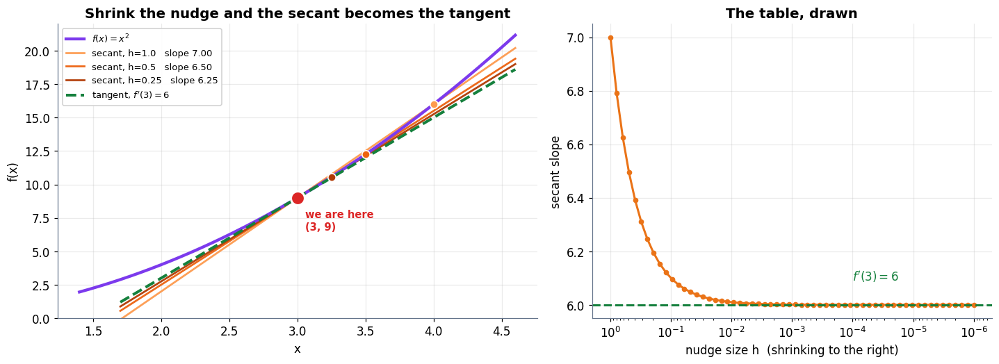

**Output**

```text
secant slope at h=1e-6 : 6.00000100
exact derivative 2x    : 6.00000000
```

### Cell 12

```python
# ============================================================
#  Figure: the sign of the derivative IS the direction home
# ============================================================
fig, (ax1, ax2) = plt.subplots(1, 2, figsize=(13.2, 4.7))

xs = np.linspace(-4, 4, 400)
ax1.plot(xs, xs ** 2, color=C_MODEL, lw=2.8, zorder=2)
ax1.fill_between(xs, 0, xs ** 2, color=C_MODEL, alpha=0.06)

for xp, col in [(-2.5, C_DATA), (3.0, C_ERR), (0.0, C_TRUE)]:
    slope = 2 * xp
    ax1.scatter([xp], [xp ** 2], s=170, color=col, zorder=6,
                edgecolor="white", lw=2)
    tl = np.linspace(xp - 1.15, xp + 1.15, 2)
    ax1.plot(tl, xp ** 2 + slope * (tl - xp), color=col, lw=2.2, ls="--", zorder=4)
    if slope != 0:
        step = -0.85 * np.sign(slope)          # step AGAINST the sign
        ax1.annotate("", xy=(xp + step, xp ** 2 - 1.1), xytext=(xp, xp ** 2 - 1.1),
                     arrowprops=dict(arrowstyle="-|>", color=col, lw=3.0,
                                     mutation_scale=20))
    lab = f"x={xp:.1f}\nf'={slope:+.0f}"
    lab += "\n→ go left" if slope > 0 else ("\n→ go right" if slope < 0 else "\nflat: done")
    ax1.text(xp, xp ** 2 + 1.6, lab, ha="center", fontsize=9.4,
             color=col, fontweight="bold")
ax1.set_ylim(-2.5, 20)
tidy(ax1, "parameter x", "loss  f(x) = x²",
     "The tangent's sign points away from home — so walk the other way")

ax2.plot(xs, 2 * xs, color=C_PRED, lw=2.8)
ax2.axhline(0, color=C_GREY, lw=1.4)
ax2.axvline(0, color=C_GREY, lw=1.0, ls=":")
ax2.fill_between(xs, 0, 2 * xs, where=(xs > 0), color=C_ERR, alpha=0.13)
ax2.fill_between(xs, 0, 2 * xs, where=(xs < 0), color=C_DATA, alpha=0.13)
ax2.text(2.0, -4.6, "f' > 0  here\n→ move LEFT", color=C_ERR, fontsize=10,
         fontweight="bold", ha="center")
ax2.text(-2.0, 4.0, "f' < 0  here\n→ move RIGHT", color=C_DATA, fontsize=10,
         fontweight="bold", ha="center")
ax2.scatter([0], [0], s=170, color=C_TRUE, zorder=6, edgecolor="white", lw=2)
ax2.text(0.15, 1.2, "f' = 0\nthe minimum", color=C_TRUE, fontsize=9.6,
         fontweight="bold")
tidy(ax2, "parameter x", "derivative  f'(x) = 2x",
     "The derivative on its own axes")
plt.tight_layout(); plt.show()

for xp in [-2.5, 0.0, 3.0]:
    d = 2 * xp
    where = "left" if d > 0 else ("right" if d < 0 else "nowhere — flat")
    print(f"  x = {xp:>5.1f}   f'(x) = {d:>5.1f}   ->  step {where}")
```

**Output**

```text
<Figure size 1452x517 with 2 Axes>
```

**Figure**

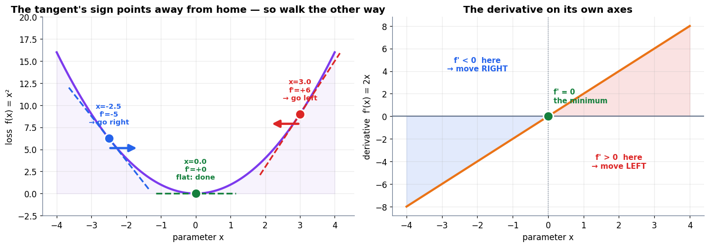

**Output**

```text
  x =  -2.5   f'(x) =  -5.0   ->  step right
  x =   0.0   f'(x) =   0.0   ->  step nowhere — flat
  x =   3.0   f'(x) =   6.0   ->  step left
```

### Cell 15

```python
# ============================================================
#  All four rules, verified twice: symbolically and numerically
# ============================================================
import sympy as sp

x = sp.Symbol("x")

def central_diff(fn, a, h=1e-5):
    """Numerical derivative. Central differences: error ~ h², far better than one-sided."""
    return (fn(a + h) - fn(a - h)) / (2 * h)

tests = [
    ("power",   x ** 5,                 lambda t: t ** 5,                       1.3),
    ("sum",     x ** 2 - 4 * x + 5,     lambda t: t ** 2 - 4 * t + 5,           0.7),
    ("product", x ** 2 * sp.exp(x),     lambda t: t ** 2 * np.exp(t),           0.9),
    ("chain",   (3 * x + 1) ** 2,       lambda t: (3 * t + 1) ** 2,             2.0),
    ("chain²",  sp.sin(x ** 2),         lambda t: np.sin(t ** 2),               1.1),
]

print(f"{'rule':<9}{'f(x)':<20}{'symbolic f\'(x)':<28}{'at a':>6}"
      f"{'sympy':>12}{'finite diff':>14}{'gap':>11}")
print("=" * 100)
for name, expr, fn, a in tests:
    d = sp.simplify(sp.diff(expr, x))
    sym_val = float(d.subs(x, a))
    num_val = central_diff(fn, a)
    print(f"{name:<9}{str(expr):<20}{str(d):<28}{a:>6.2f}"
          f"{sym_val:>12.6f}{num_val:>14.6f}{abs(sym_val-num_val):>11.2e}")
print("=" * 100)
print("Every rule agrees with brute-force nudging to ~1e-9. The rules are not magic;")
print("they are just the limit, pre-computed once so you never have to take it again.")
```

**Output**

```text
rule     f(x)                symbolic f'(x)                at a       sympy   finite diff        gap
====================================================================================================
power    x**5                5*x**4                        1.30   14.280500     14.280500   1.78e-09
sum      x**2 - 4*x + 5      2*x - 4                       0.70   -2.600000     -2.600000   1.41e-11
product  x**2*exp(x)         x*(x + 2)*exp(x)              0.90    6.419564      6.419564   4.66e-10
chain    (3*x + 1)**2        18*x + 6                      2.00   42.000000     42.000000   8.97e-10
chain²   sin(x**2)           2*x*cos(x**2)                 1.10    0.776643      0.776643   2.62e-10
====================================================================================================
Every rule agrees with brute-force nudging to ~1e-9. The rules are not magic;
they are just the limit, pre-computed once so you never have to take it again.
```

### Cell 17

```python
# ============================================================
#  L(w) = w² − 4w + 5 : derivative, stationary point, picture
# ============================================================
w_sym = sp.Symbol("w")
L_sym = w_sym ** 2 - 4 * w_sym + 5
dL_sym = sp.diff(L_sym, w_sym)
roots = sp.solve(sp.Eq(dL_sym, 0), w_sym)

print("L(w)  =", L_sym)
print("L'(w) =", dL_sym, "   <- power rule + sum rule, checked by sympy")
print("L'(w) = 0 at w =", roots, "  with L =", [float(L_sym.subs(w_sym, r)) for r in roots])
print("second derivative L''(w) =", sp.diff(L_sym, w_sym, 2), "> 0  -> it is a MINIMUM, not a maximum")
print()

def L(w):  return w ** 2 - 4 * w + 5
def dL(w): return 2 * w - 4

print(f"{'w':>7}{'L(w)':>10}{'L\'(w)':>10}{'finite diff':>14}   verdict")
print("-" * 62)
for wv in [-1.0, 0.0, 1.0, 2.0, 3.0, 5.0]:
    fd = (L(wv + 1e-5) - L(wv - 1e-5)) / 2e-5
    verdict = "go left" if dL(wv) > 1e-9 else ("go right" if dL(wv) < -1e-9 else "STOP — bottom")
    print(f"{wv:>7.1f}{L(wv):>10.3f}{dL(wv):>10.3f}{fd:>14.6f}   {verdict}")

# ============================================================
#  Figure: the bowl, its tangents, and the flat spot at w = 2
# ============================================================
fig, (ax1, ax2) = plt.subplots(1, 2, figsize=(13.2, 4.7), sharex=True)

ws = np.linspace(-1.2, 5.2, 400)
ax1.plot(ws, L(ws), color=C_MODEL, lw=2.9, zorder=3)
ax1.fill_between(ws, L(ws), L(ws).min(), color=C_MODEL, alpha=0.06)

for wp in [-0.5, 0.75, 2.0, 3.4, 4.8]:
    s = dL(wp)
    col = C_TRUE if abs(s) < 1e-9 else (C_ERR if s > 0 else C_DATA)
    seg = np.linspace(wp - 0.75, wp + 0.75, 2)
    ax1.plot(seg, L(wp) + s * (seg - wp), color=col, lw=2.2, alpha=0.95, zorder=4)
    ax1.scatter([wp], [L(wp)], s=95, color=col, zorder=6, edgecolor="white", lw=1.5)
    ax1.text(wp, L(wp) + 1.05, f"{s:+.1f}", ha="center", fontsize=9.4,
             color=col, fontweight="bold")

ax1.scatter([2.0], [1.0], s=230, marker="*", color=C_TRUE, zorder=7,
            edgecolor="white", lw=1.4)
ax1.annotate("slope 0 — the fingerprint of done\n$w=2$, $L=1$", xy=(2.0, 1.0),
             xytext=(2.55, 5.6), fontsize=10, color=C_TRUE, fontweight="bold",
             arrowprops=dict(arrowstyle="->", color=C_TRUE, lw=1.8))
ax1.set_ylim(-0.6, 13)
tidy(ax1, "parameter w", "loss  L(w) = w² − 4w + 5",
     "Tangent slopes, annotated with their value")

ax2.plot(ws, dL(ws), color=C_PRED, lw=2.9)
ax2.axhline(0, color=C_GREY, lw=1.4)
ax2.fill_between(ws, 0, dL(ws), where=(dL(ws) > 0), color=C_ERR, alpha=0.13)
ax2.fill_between(ws, 0, dL(ws), where=(dL(ws) < 0), color=C_DATA, alpha=0.13)
ax2.scatter([2.0], [0.0], s=200, marker="*", color=C_TRUE, zorder=6,
            edgecolor="white", lw=1.3)
ax2.text(3.3, -3.4, "L' > 0\nstep left", color=C_ERR, ha="center",
         fontsize=10, fontweight="bold")
ax2.text(0.5, 2.4, "L' < 0\nstep right", color=C_DATA, ha="center",
         fontsize=10, fontweight="bold")
ax2.text(2.06, 0.55, "zero crossing = the answer", color=C_TRUE,
         fontsize=9.6, fontweight="bold")
tidy(ax2, "parameter w", "derivative  L'(w) = 2w − 4", "Where the slope crosses zero")
plt.tight_layout(); plt.show()
```

**Output**

```text
L(w)  = w**2 - 4*w + 5
L'(w) = 2*w - 4    <- power rule + sum rule, checked by sympy
L'(w) = 0 at w = [2]   with L = [1.0]
second derivative L''(w) = 2 > 0  -> it is a MINIMUM, not a maximum

      w      L(w)     L'(w)   finite diff   verdict
--------------------------------------------------------------
   -1.0    10.000    -6.000     -6.000000   go right
    0.0     5.000    -4.000     -4.000000   go right
    1.0     2.000    -2.000     -2.000000   go right
    2.0     1.000     0.000      0.000000   STOP — bottom
    3.0     2.000     2.000      2.000000   go left
    5.0    10.000     6.000      6.000000   go left
```

**Output**

```text
<Figure size 1452x517 with 2 Axes>
```

**Figure**

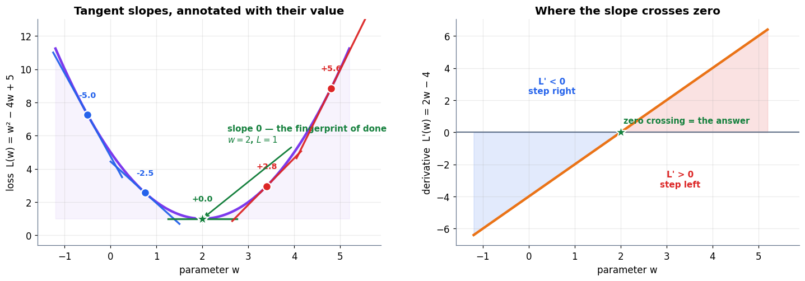

### Cell 21

```python
# ============================================================
#  Partials and the gradient, three independent ways
# ============================================================
xs_, ys_ = sp.symbols("x y")
f_sym = xs_ ** 2 + 3 * ys_ ** 2
fx_sym, fy_sym = sp.diff(f_sym, xs_), sp.diff(f_sym, ys_)

print("f(x, y) =", f_sym)
print("  ∂f/∂x =", fx_sym, "   (3y² was a constant, so it vanished)")
print("  ∂f/∂y =", fy_sym, "   (x² was a constant, so it vanished)")
print()

def f2(p):
    """The bowl, taking p = [x, y]."""
    return p[0] ** 2 + 3 * p[1] ** 2

def grad2(p):
    """∇f = [∂f/∂x, ∂f/∂y], worked out by hand once."""
    return np.array([2 * p[0], 6 * p[1]])

def numerical_grad(fn, p, h=1e-6):
    """Wiggle each coordinate one at a time — the definition, in code."""
    p = np.asarray(p, dtype=float)
    g = np.zeros_like(p)
    for i in range(p.size):
        e = np.zeros_like(p); e[i] = h
        g[i] = (fn(p + e) - fn(p - e)) / (2 * h)
    return g

P = np.array([2.0, 1.0])
g_hand = grad2(P)
g_sym  = np.array([float(fx_sym.subs({xs_: P[0], ys_: P[1]})),
                   float(fy_sym.subs({xs_: P[0], ys_: P[1]}))])
g_num  = numerical_grad(f2, P)

print(f"at (x, y) = ({P[0]:.0f}, {P[1]:.0f}),  f = {f2(P):.0f}")
print(f"  by hand        ∇f = {g_hand}")
print(f"  by sympy       ∇f = {g_sym}")
print(f"  by wiggling    ∇f = [{g_num[0]:.6f} {g_num[1]:.6f}]")
print(f"  agreement                max gap = {np.abs(g_hand - g_num).max():.2e}")
print()
print(f"  magnitude  ||∇f|| = sqrt({g_hand[0]:.0f}² + {g_hand[1]:.0f}²)"
      f" = sqrt({(g_hand**2).sum():.0f}) = {np.linalg.norm(g_hand):.4f}")
print(f"  book quotes sqrt(52) ≈ 7.2 ; we compute {np.linalg.norm(g_hand):.4f}")

# ============================================================
#  Figure: the bowl, its contours, and the gradient arrow
# ============================================================
gx = np.linspace(-3, 3, 90)
gy = np.linspace(-2, 2, 90)
GX, GY = np.meshgrid(gx, gy)
GZ = GX ** 2 + 3 * GY ** 2

fig = plt.figure(figsize=(13.4, 5.0))

ax1 = fig.add_subplot(1, 2, 1, projection="3d")
ax1.plot_surface(GX, GY, GZ, cmap="viridis", alpha=0.82, linewidth=0,
                 rstride=3, cstride=3, antialiased=True)
ax1.contour(GX, GY, GZ, levels=10, zdir="z", offset=0, colors=C_GREY,
            linewidths=0.7, alpha=0.6)
ax1.scatter([2], [1], [f2(P)], s=90, color=C_ERR, depthshade=False)
ax1.text(2, 1, f2(P) + 3.2, "we are here\n(2, 1), f = 7", color=C_ERR,
         fontsize=9, fontweight="bold")
ax1.set_xlabel("x"); ax1.set_ylabel("y"); ax1.set_zlabel("f")
ax1.set_title("f(x, y) = x² + 3y²  —  a bowl, steeper in y", pad=2)
ax1.view_init(elev=26, azim=-58)

ax2 = fig.add_subplot(1, 2, 2)
cs = ax2.contour(GX, GY, GZ, levels=[0.5, 2, 4, 7, 11, 16, 22], colors=C_GREY,
                 linewidths=1.3)
ax2.clabel(cs, inline=True, fontsize=8, fmt="%.0f")
ax2.contourf(GX, GY, GZ, levels=30, cmap="viridis", alpha=0.20)

g = grad2(P)
ax2.annotate("", xy=(P[0] + g[0] * 0.13, P[1] + g[1] * 0.13), xytext=tuple(P),
             arrowprops=dict(arrowstyle="-|>", color=C_ERR, lw=3.2, mutation_scale=22))
ax2.text(P[0] + 0.62, P[1] + 0.82, f"∇f = [{g[0]:.0f}, {g[1]:.0f}]\nsteepest UPHILL",
         color=C_ERR, fontsize=9.8, fontweight="bold")
ax2.annotate("", xy=(P[0] - g[0] * 0.13, P[1] - g[1] * 0.13), xytext=tuple(P),
             arrowprops=dict(arrowstyle="-|>", color=C_TRUE, lw=3.2, mutation_scale=22))
ax2.text(P[0] - 2.35, P[1] - 1.15, "−∇f\nthe way we walk", color=C_TRUE,
         fontsize=9.8, fontweight="bold")

# the two partials as their own little arrows
ax2.annotate("", xy=(P[0] + 0.52, P[1]), xytext=tuple(P),
             arrowprops=dict(arrowstyle="-|>", color=C_DATA, lw=2.2, mutation_scale=16))
ax2.text(P[0] + 0.30, P[1] - 0.24, "∂f/∂x = 4", color=C_DATA, fontsize=9)
ax2.annotate("", xy=(P[0], P[1] + 0.78), xytext=tuple(P),
             arrowprops=dict(arrowstyle="-|>", color=C_MODEL, lw=2.2, mutation_scale=16))
ax2.text(P[0] - 1.05, P[1] + 0.62, "∂f/∂y = 6", color=C_MODEL, fontsize=9)

ax2.scatter([P[0]], [P[1]], s=140, color=C_ERR, zorder=6, edgecolor="white", lw=1.8)
ax2.set_aspect("equal")
tidy(ax2, "x", "y", "Contours, the two partials, and the gradient they build")
plt.tight_layout(); plt.show()
```

**Output**

```text
f(x, y) = x**2 + 3*y**2
  ∂f/∂x = 2*x    (3y² was a constant, so it vanished)
  ∂f/∂y = 6*y    (x² was a constant, so it vanished)

at (x, y) = (2, 1),  f = 7
  by hand        ∇f = [4. 6.]
  by sympy       ∇f = [4. 6.]
  by wiggling    ∇f = [4.000000 6.000000]
  agreement                max gap = 1.15e-10

  magnitude  ||∇f|| = sqrt(4² + 6²) = sqrt(52) = 7.2111
  book quotes sqrt(52) ≈ 7.2 ; we compute 7.2111
```

**Output**

```text
<Figure size 1474x550 with 2 Axes>
```

**Figure**

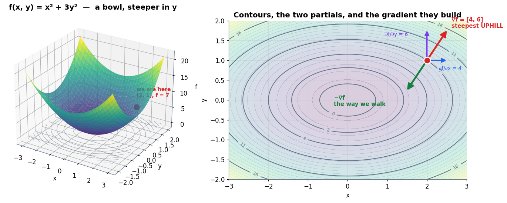

### Cell 24

```python
# ============================================================
#  Brute force: try every direction and see which climbs fastest
# ============================================================
angles = np.linspace(0, 2 * np.pi, 3601)         # every tenth of a degree
g = grad2(P)
g_hat = g / np.linalg.norm(g)

# (a) the honest measurement: actually step both ways and see how f changes
eps = 1e-5
measured = np.array([(f2(P + eps * np.array([np.cos(a), np.sin(a)]))
                      - f2(P - eps * np.array([np.cos(a), np.sin(a)]))) / (2 * eps)
                     for a in angles])
# (b) the theory: ∇f · u = ||∇f|| cos θ
theta_to_grad = angles - np.arctan2(g[1], g[0])
predicted = np.linalg.norm(g) * np.cos(theta_to_grad)

best = angles[np.argmax(measured)]
print(f"Brute-force search over {len(angles)} directions at the point (2, 1)")
print("=" * 66)
print(f"  fastest-climb direction found : {np.degrees(best):.2f}°")
print(f"  direction of ∇f = [4, 6]      : {np.degrees(np.arctan2(g[1], g[0])):.2f}°")
print(f"  best climb rate measured      : {measured.max():.4f}")
print(f"  ||∇f||                        : {np.linalg.norm(g):.4f}")
print(f"  slowest (steepest descent)    : {measured.min():.4f}   =  −||∇f||")
print(f"  max |measured − ||∇f||cosθ|   : {np.abs(measured - predicted).max():.2e}")
print()
print("The winner out of every direction tried is the gradient's own direction, and")
print("the winning rate is exactly ||∇f||. Neither was assumed — both were measured.")

# ============================================================
#  Figure: the cosine law of steepest ascent
# ============================================================
fig = plt.figure(figsize=(13.4, 4.8))
gs = fig.add_gridspec(1, 2, width_ratios=[1.25, 1])

ax1 = fig.add_subplot(gs[0])
ax1.plot(np.degrees(angles), measured, color=C_PRED, lw=3.0,
         label="measured:  (f(p+εu) − f(p))/ε")
ax1.plot(np.degrees(angles), predicted, color=C_MODEL, lw=1.7, ls="--",
         label="theory:  ‖∇f‖ cos θ")
ax1.axhline(0, color=C_GREY, lw=1.2)
ax1.axhline(np.linalg.norm(g), color=C_ERR, lw=1.3, ls=":")
ax1.axhline(-np.linalg.norm(g), color=C_TRUE, lw=1.3, ls=":")
ax1.scatter([np.degrees(best)], [measured.max()], s=150, color=C_ERR, zorder=6,
            edgecolor="white", lw=1.6)
ax1.text(np.degrees(best) + 8, measured.max() - 0.9,
         f"steepest ASCENT\n{np.degrees(best):.0f}° — the gradient\nrate = ‖∇f‖ = {np.linalg.norm(g):.2f}",
         color=C_ERR, fontsize=9.4, fontweight="bold")
worst = np.degrees(angles[np.argmin(measured)])
ax1.scatter([worst], [measured.min()], s=150, color=C_TRUE, zorder=6,
            edgecolor="white", lw=1.6)
ax1.text(worst - 128, measured.min() + 0.6,
         f"steepest DESCENT\n{worst:.0f}° — where we walk", color=C_TRUE,
         fontsize=9.4, fontweight="bold")
for zc in np.degrees(angles[np.where(np.abs(measured) < 0.02)]):
    ax1.scatter([zc], [0], s=45, color=C_DATA, zorder=5)
ax1.text(300, 0.55, "zero rate:\nalong a contour", color=C_DATA, fontsize=9,
         fontweight="bold", ha="center")
ax1.set_xticks([0, 90, 180, 270, 360])
tidy(ax1, "direction of the step  (degrees)", "rate of change of f",
     "Every direction you could step, ranked", legend=True)
ax1.legend(fontsize=8.8, loc="lower left")

ax2 = fig.add_subplot(gs[1])
ax2.contour(GX, GY, GZ, levels=[2, 4, 7, 11, 16], colors=C_GREY, linewidths=1.1)
for a in np.linspace(0, 2 * np.pi, 25)[:-1]:
    u = np.array([np.cos(a), np.sin(a)])
    rate = g @ u
    col = C_ERR if rate > 0 else C_TRUE
    ax2.annotate("", xy=tuple(P + 0.10 * abs(rate) * u), xytext=tuple(P),
                 arrowprops=dict(arrowstyle="-|>", color=col, lw=1.5,
                                 alpha=0.75, mutation_scale=11))
ax2.annotate("", xy=tuple(P + 0.10 * np.linalg.norm(g) * g_hat), xytext=tuple(P),
             arrowprops=dict(arrowstyle="-|>", color=C_ERR, lw=3.4, mutation_scale=20))
ax2.scatter([P[0]], [P[1]], s=130, color=C_MODEL, zorder=6, edgecolor="white", lw=1.6)
ax2.set_xlim(0.4, 3.4); ax2.set_ylim(-0.4, 2.4); ax2.set_aspect("equal")
tidy(ax2, "x", "y", "Arrow length = how fast f changes that way")
plt.tight_layout(); plt.show()
```

**Output**

```text
Brute-force search over 3601 directions at the point (2, 1)
==================================================================
  fastest-climb direction found : 56.30°
  direction of ∇f = [4, 6]      : 56.31°
  best climb rate measured      : 7.2111
  ||∇f||                        : 7.2111
  slowest (steepest descent)    : -7.2111   =  −||∇f||
  max |measured − ||∇f||cosθ|   : 1.47e-10

The winner out of every direction tried is the gradient's own direction, and
the winning rate is exactly ||∇f||. Neither was assumed — both were measured.
```

**Output**

```text
<Figure size 1474x528 with 2 Axes>
```

**Figure**

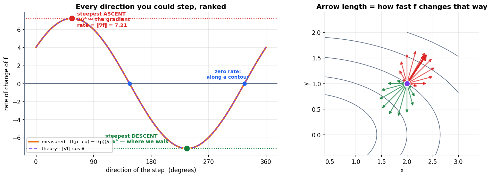

### Cell 27

```python
# ============================================================
#  Perpendicularity, measured
# ============================================================
# Walk along the contour f = 7 through (2, 1). Parametrise it as an ellipse:
#   x = √7 cos t, y = √(7/3) sin t     (check: x² + 3y² = 7 for all t)
t = np.arccos(2 / np.sqrt(7))
pt = np.array([np.sqrt(7) * np.cos(t), np.sqrt(7 / 3) * np.sin(t)])
tangent = np.array([-np.sqrt(7) * np.sin(t), np.sqrt(7 / 3) * np.cos(t)])
tangent /= np.linalg.norm(tangent)

gg = grad2(pt)
print(f"point on the contour f = 7 :  ({pt[0]:.6f}, {pt[1]:.6f})   f = {f2(pt):.6f}")
print(f"unit tangent to the contour:  [{tangent[0]:.6f}, {tangent[1]:.6f}]")
print(f"gradient there             :  [{gg[0]:.6f}, {gg[1]:.6f}]")
print()
print(f"  ∇f · t          = {gg @ tangent:.2e}      (zero: walking the contour changes nothing)")
print(f"  angle between   = {np.degrees(np.arccos(np.clip(gg @ tangent / np.linalg.norm(gg), -1, 1))):.4f}°")
print()
# and confirm f really is flat along the tangent
for step in [1e-3, 1e-4]:
    print(f"  f(p + {step:g}·t) − f(p) = {f2(pt + step*tangent) - f2(pt):+.3e}"
          f"   vs  f(p + {step:g}·∇f/‖∇f‖) − f(p) = "
          f"{f2(pt + step*gg/np.linalg.norm(gg)) - f2(pt):+.3e}")
```

**Output**

```text
point on the contour f = 7 :  (2.000000, 1.000000)   f = 7.000000
unit tangent to the contour:  [-0.832050, 0.554700]
gradient there             :  [4.000000, 6.000000]

  ∇f · t          = 8.88e-16      (zero: walking the contour changes nothing)
  angle between   = 90.0000°

  f(p + 0.001·t) − f(p) = +1.615e-06   vs  f(p + 0.001·∇f/‖∇f‖) − f(p) = +7.213e-03
  f(p + 0.0001·t) − f(p) = +1.615e-08   vs  f(p + 0.0001·∇f/‖∇f‖) − f(p) = +7.211e-04
```

### Cell 31

```python
# ============================================================
#  Three steps of gradient descent, printed to full precision
# ============================================================
p = np.array([2.0, 1.0])
eta = 0.1

print("f(x,y) = x² + 3y² ,  ∇f = [2x, 6y] ,  η = 0.1")
print("=" * 74)
print(f"{'step':>5}{'x':>12}{'y':>12}{'loss':>14}{'∇f':>22}")
print("-" * 74)
trace = []
for step in range(4):
    gp = grad2(p)
    trace.append((step, p.copy(), f2(p)))
    print(f"{step:>5}{p[0]:>12.6f}{p[1]:>12.6f}{f2(p):>14.6f}"
          f"{'[' + f'{gp[0]:.3f}, {gp[1]:.3f}' + ']':>22}")
    p = p - eta * gp                       # θ ← θ − η∇L(θ)
print("-" * 74)

book = [7, 3.04, 1.715, 1.06]
ours = [t[2] for t in trace]
print(f"{'book quotes':<16}" + "".join(f"{b:>12}" for b in book))
print(f"{'we compute':<16}" + "".join(f"{o:>12.6f}" for o in ours))
print()
print("Exact match (the book rounds 1.7152 -> 1.715 and 1.060864 -> 1.06).")
print(f"The bowl's true minimum is f(0,0) = 0; after 3 steps we are at {ours[-1]:.4f}.")
```

**Output**

```text
f(x,y) = x² + 3y² ,  ∇f = [2x, 6y] ,  η = 0.1
==========================================================================
 step           x           y          loss                    ∇f
--------------------------------------------------------------------------
    0    2.000000    1.000000      7.000000        [4.000, 6.000]
    1    1.600000    0.400000      3.040000        [3.200, 2.400]
    2    1.280000    0.160000      1.715200        [2.560, 0.960]
    3    1.024000    0.064000      1.060864        [2.048, 0.384]
--------------------------------------------------------------------------
book quotes                7        3.04       1.715        1.06
we compute          7.000000    3.040000    1.715200    1.060864

Exact match (the book rounds 1.7152 -> 1.715 and 1.060864 -> 1.06).
The bowl's true minimum is f(0,0) = 0; after 3 steps we are at 1.0609.
```

### Cell 33

```python
# ============================================================
#  Gradient descent, complete, in ten lines
# ============================================================
import numpy as np

def loss(p):                       # p = [x, y]
    return p[0] ** 2 + 3 * p[1] ** 2

def grad(p):                       # ∇f = [∂f/∂x, ∂f/∂y]
    return np.array([2 * p[0], 6 * p[1]])

p = np.array([2.0, 1.0])           # starting parameters
eta = 0.1                          # learning rate
for step in range(4):
    print(step, p, loss(p))
    p = p - eta * grad(p)          # θ ← θ − η∇L(θ)

print()
print("Notice what is NOT here: there is no calculus at runtime.")
print("We differentiated once, by hand, and the loop only evaluates and subtracts.")
print("A real network has millions of parameters and nobody differentiates by hand —")
print("which is exactly the problem Parts 4 and 5 solve.")
```

**Output**

```text
0 [2. 1.] 7.0
1 [1.6 0.4] 3.04
2 [1.28 0.16] 1.7152
3 [1.024 0.064] 1.060864

Notice what is NOT here: there is no calculus at runtime.
We differentiated once, by hand, and the loop only evaluates and subtracts.
A real network has millions of parameters and nobody differentiates by hand —
which is exactly the problem Parts 4 and 5 solve.
```

### Cell 35

```python
# ============================================================
#  Divergence, computed — and the exact stability threshold
# ============================================================
print("y-only descent on 3y²  (slope 6y), starting at y = 1")
print("=" * 72)
for eta_try in [0.1, 0.4]:
    y = 1.0
    factor = 1 - 6 * eta_try
    print(f"\n  η = {eta_try}   ->  each step multiplies y by (1 − 6η) = {factor:+.2f}")
    print(f"    {'step':>6}{'y':>14}{'loss 3y²':>14}")
    for s in range(4):
        print(f"    {s:>6}{y:>14.6f}{3 * y ** 2:>14.6f}")
        y = y - eta_try * (6 * y)
    print(f"    verdict: {'CONVERGING' if abs(factor) < 1 else 'DIVERGING'}")

print("\n" + "=" * 72)
print("Book quotes for η = 0.4 :  y  1 → −1.4 → +1.96      loss  3 → 5.88 → 11.5")
y = 1.0; ys = []; ls = []
for s in range(3):
    ys.append(y); ls.append(3 * y ** 2); y = y - 0.4 * 6 * y
print(f"We compute              :  y  {ys[0]:g} → {ys[1]:g} → {ys[2]:g}"
      f"      loss  {ls[0]:g} → {ls[1]:g} → {ls[2]:g}")
print()
print("Stability threshold |1 − 6η| < 1  ->  0 < η < 1/3 = 0.3333...")
for eta_try in [0.30, 1/3, 0.34]:
    y = 1.0
    for _ in range(60): y = y - eta_try * 6 * y
    print(f"  η = {eta_try:.4f}  ->  |y| after 60 steps = {abs(y):.4e}"
          f"   ({'stable' if abs(y) < 1 else 'blown up'})")
```

**Output**

```text
y-only descent on 3y²  (slope 6y), starting at y = 1
========================================================================

  η = 0.1   ->  each step multiplies y by (1 − 6η) = +0.40
      step             y      loss 3y²
         0      1.000000      3.000000
         1      0.400000      0.480000
         2      0.160000      0.076800
         3      0.064000      0.012288
    verdict: CONVERGING

  η = 0.4   ->  each step multiplies y by (1 − 6η) = -1.40
      step             y      loss 3y²
         0      1.000000      3.000000
         1     -1.400000      5.880000
         2      1.960000     11.524800
         3     -2.744000     22.588608
    verdict: DIVERGING

========================================================================
Book quotes for η = 0.4 :  y  1 → −1.4 → +1.96      loss  3 → 5.88 → 11.5
We compute              :  y  1 → -1.4 → 1.96      loss  3 → 5.88 → 11.5248

Stability threshold |1 − 6η| < 1  ->  0 < η < 1/3 = 0.3333...
  η = 0.3000  ->  |y| after 60 steps = 1.5325e-06   (stable)
  η = 0.3333  ->  |y| after 60 steps = 1.0000e+00   (blown up)
  η = 0.3400  ->  |y| after 60 steps = 1.0520e+01   (blown up)
```

### Cell 36

```python
# ============================================================
#  Figure: converge vs diverge, on the map and on the scoreboard
# ============================================================
def descend(p0, eta, steps=14):
    p, path = np.array(p0, dtype=float), [np.array(p0, dtype=float)]
    for _ in range(steps):
        p = p - eta * grad2(p)
        path.append(p.copy())
    return np.array(path)

good = descend([2.0, 1.0], 0.10)
bad  = descend([2.0, 1.0], 0.40, steps=6)

fig = plt.figure(figsize=(13.6, 8.4))
gs = fig.add_gridspec(2, 2, height_ratios=[1.25, 1], hspace=0.36, wspace=0.24)

for col, (path, e, name, colr) in enumerate(
        [(good, 0.10, "η = 0.10 — converges", C_TRUE),
         (bad,  0.40, "η = 0.40 — diverges",  C_ERR)]):
    ax = fig.add_subplot(gs[0, col])
    lim = 3.2 if col == 0 else 7.5
    gx2 = np.linspace(-lim, lim, 140); gy2 = np.linspace(-lim * 0.7, lim * 0.7, 140)
    A, B = np.meshgrid(gx2, gy2)
    Z = A ** 2 + 3 * B ** 2
    ax.contour(A, B, Z, levels=12, colors=C_GREY, linewidths=0.9, alpha=0.7)
    ax.plot(path[:, 0], path[:, 1], "o-", color=colr, lw=2.0, ms=6, zorder=4)
    for i in range(len(path) - 1):
        ax.annotate("", xy=path[i + 1], xytext=path[i],
                    arrowprops=dict(arrowstyle="-|>", color=colr, lw=1.4,
                                    alpha=0.85, mutation_scale=12))
    ax.scatter([2], [1], s=150, color=C_MODEL, zorder=6, edgecolor="white", lw=1.6)
    ax.scatter([0], [0], s=230, marker="*", color=C_TRUE, zorder=6,
               edgecolor="white", lw=1.3)
    ax.set_aspect("equal")
    tidy(ax, "x", "y", name)

ax3 = fig.add_subplot(gs[1, 0])
ax3.semilogy([f2(q) for q in good], "o-", color=C_TRUE, lw=2.2, ms=5,
             label="η = 0.10")
ax3.semilogy([f2(q) for q in bad], "o-", color=C_ERR, lw=2.2, ms=5,
             label="η = 0.40")
ax3.axhline(f2(good[0]), color=C_GREY, ls=":", lw=1.3)
ax3.text(0.25, f2(good[0]) * 1.5, "starting loss = 7", color=C_GREY, fontsize=9)
tidy(ax3, "step", "loss  (log scale)", "The scoreboard: falling vs climbing", legend=True)

ax4 = fig.add_subplot(gs[1, 1])
etas = np.linspace(0.001, 0.45, 400)
ax4.plot(etas, np.abs(1 - 6 * etas), color=C_MODEL, lw=2.8)
ax4.axhline(1.0, color=C_ERR, lw=1.8, ls="--")
ax4.axvline(1 / 3, color=C_ERR, lw=1.6, ls=":")
ax4.axvline(1 / 6, color=C_TRUE, lw=1.6, ls=":")
ax4.fill_between(etas, 0, np.abs(1 - 6 * etas), where=(np.abs(1 - 6 * etas) < 1),
                 color=C_TRUE, alpha=0.12)
ax4.scatter([0.1], [abs(1 - 0.6)], s=110, color=C_TRUE, zorder=6,
            edgecolor="white", lw=1.4)
ax4.scatter([0.4], [abs(1 - 2.4)], s=110, color=C_ERR, zorder=6,
            edgecolor="white", lw=1.4)
ax4.text(1 / 6, 0.06, "η = 1/6\none-step\nlanding", color=C_TRUE, fontsize=8.6,
         ha="center", fontweight="bold")
ax4.text(1 / 3 + 0.005, 1.25, "η = 1/3\nthe cliff", color=C_ERR, fontsize=9,
         fontweight="bold")
ax4.set_ylim(0, 1.6)
tidy(ax4, "learning rate η", "|1 − 6η|  (per-step multiplier on y)",
     "Below 1 it shrinks; above 1 it explodes")
fig.suptitle("Same bowl, same start, same correct direction — only the step size differs",
             fontsize=13, fontweight="bold", y=0.965)
plt.show()
```

**Output**

```text
<Figure size 1496x924 with 4 Axes>
```

**Figure**

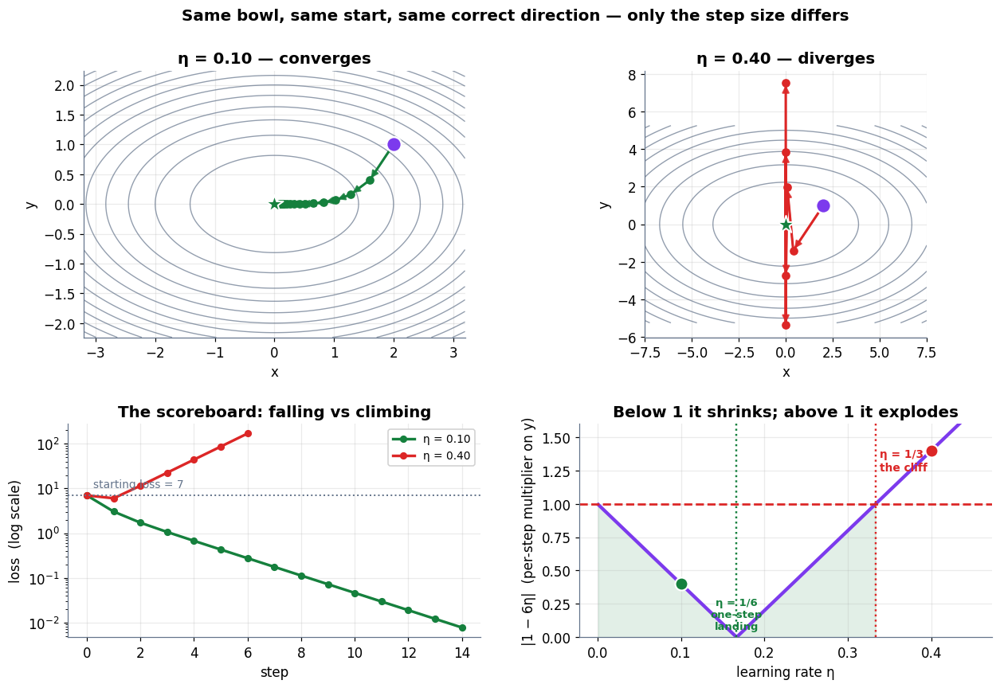

### Cell 39

```python
# ============================================================
#  A learning-rate sweep: where the cliff actually is
# ============================================================
def final_loss(eta, steps=40, p0=(2.0, 1.0)):
    p = np.array(p0, dtype=float)
    for _ in range(steps):
        p = p - eta * grad2(p)
        if not np.isfinite(p).all() or np.abs(p).max() > 1e12:
            return np.inf
    return f2(p)

sweep = np.linspace(0.005, 0.42, 220)
finals = np.array([final_loss(e) for e in sweep])

fig, ax = plt.subplots(figsize=(9.6, 4.4))
ok = np.isfinite(finals) & (finals < 1e12)
ax.semilogy(sweep[ok], np.maximum(finals[ok], 1e-30), color=C_MODEL, lw=2.6)
ax.axvline(1 / 3, color=C_ERR, ls="--", lw=1.8)
ax.axvline(1 / 6, color=C_TRUE, ls="--", lw=1.8)
ax.axhline(7, color=C_GREY, ls=":", lw=1.3)
ax.text(1 / 3 + 0.006, 1e-8, "η = 1/3\nbeyond here: divergence", color=C_ERR,
        fontsize=9.6, fontweight="bold")
ax.text(1 / 6 - 0.006, 1e-20, "η = 1/6\nfastest for y", color=C_TRUE,
        fontsize=9.6, fontweight="bold", ha="right")
ax.text(0.02, 12, "starting loss = 7", color=C_GREY, fontsize=9)
tidy(ax, "learning rate η", "loss after 40 steps  (log scale)",
     "Too small wastes steps; too large destroys the run")
plt.tight_layout(); plt.show()

best_e = sweep[np.nanargmin(np.where(np.isfinite(finals), finals, np.inf))]
print(f"  best η in the sweep      : {best_e:.4f}   -> loss {final_loss(best_e):.3e}")
print(f"  η = 0.01 (too timid)     : loss {final_loss(0.01):.4f}   (started at 7)")
print(f"  η = 0.30 (just inside)   : loss {final_loss(0.30):.3e}")
print(f"  η = 0.34 (just outside)  : loss {final_loss(0.34):.3e}")
```

**Output**

```text
<Figure size 1056x484 with 1 Axes>
```

**Figure**

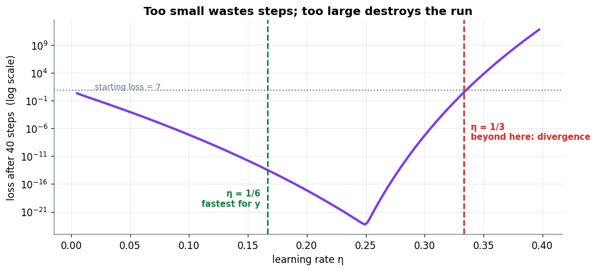

**Output**

```text
  best η in the sweep      : 0.2495   -> loss 5.406e-24
  η = 0.01 (too timid)     : loss 0.8158   (started at 7)
  η = 0.30 (just inside)   : loss 5.301e-08
  η = 0.34 (just outside)  : loss 6.915e+01
```

### Cell 44

```python
# ============================================================
#  Figure: one hard global derivative = a product of easy local ones
# ============================================================
fig, ax = plt.subplots(figsize=(12.8, 5.0))
stage(ax, (0, 12.8), (0, 5.4))

nodes = [(1.6, "w", "the weight\nwe want to nudge", C_MODEL, "#EDE9FE"),
         (4.6, "h", "hidden value", C_DATA, "#DBEAFE"),
         (7.6, "y", "prediction", C_PRED, "#FFEDD5"),
         (10.6, "L", "the loss", C_ERR, "#FEE2E2")]
for x, name, sub, ec, fc in nodes:
    box(ax, x, 3.5, 2.1, 1.25, f"$\\mathbf{{{name}}}$\n{sub}", fc=fc, ec=ec, fs=10)

# forward arrows
for x0, x1, lab in [(2.65, 3.55, "$h(w)$"), (5.65, 6.55, "$y(h)$"), (8.65, 9.55, "$L(y)$")]:
    arrow(ax, (x0, 3.9), (x1, 3.9), color=C_GREY, lw=2.4, label=lab, label_off=(0, 0.42), fs=9.5)

# backward arrows with the local slopes
for x0, x1, lab in [(9.55, 8.65, r"$\frac{dL}{dy}$"),
                    (6.55, 5.65, r"$\frac{dy}{dh}$"),
                    (3.55, 2.65, r"$\frac{dh}{dw}$")]:
    arrow(ax, (x0, 3.1), (x1, 3.1), color=C_TRUE, lw=2.4, label=lab,
          label_off=(0, -0.55), fs=13)

ax.text(6.4, 4.98, "FORWARD  —  values flow this way",
        ha="center", fontsize=11, color=C_GREY, fontweight="bold")
ax.text(6.4, 1.72, "BACKWARD  —  slopes flow this way",
        ha="center", fontsize=11, color=C_TRUE, fontweight="bold")
ax.text(6.4, 0.72,
        r"$\frac{dL}{dw} \;=\; \frac{dL}{dy}\cdot\frac{dy}{dh}\cdot\frac{dh}{dw}$"
        "     — multiply the local slopes along the path",
        ha="center", fontsize=13, color="#0F172A")
plt.tight_layout(); plt.show()
```

**Output**

```text
<Figure size 1408x550 with 1 Axes>
```

**Figure**

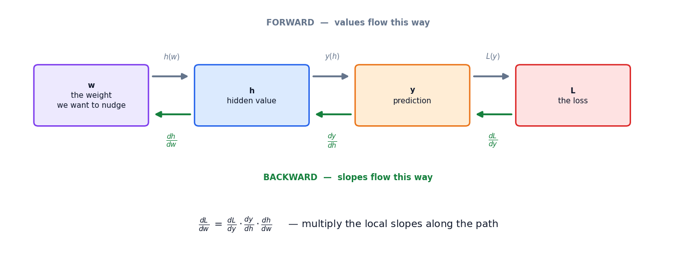

### Cell 47

```python
# ============================================================
#  The two-link chain: chain rule vs brute force
# ============================================================
def forward(w):
    h = 3 * w
    y = h ** 2
    L = y
    return h, y, L

w0 = 2.0
h0, y0, L0 = forward(w0)
print("FORWARD PASS at w = 2")
print("=" * 56)
print(f"  h = 3w      = {h0:g}")
print(f"  y = h²      = {y0:g}")
print(f"  L = y       = {L0:g}")
print()

dL_dy = 1.0
dy_dh = 2 * h0          # needs h from the forward pass
dh_dw = 3.0
dL_dw = dL_dy * dy_dh * dh_dw

print("BACKWARD PASS — local slopes, multiplied")
print("=" * 56)
print(f"  dL/dy = {dL_dy:g}")
print(f"  dy/dh = 2h = 2·{h0:g} = {dy_dh:g}      <- reuses the cached h")
print(f"  dh/dw = {dh_dw:g}")
print(f"  dL/dw = {dL_dy:g} × {dy_dh:g} × {dh_dw:g} = {dL_dw:g}")
print()

print("BRUTE FORCE — nudge w and watch L")
print("=" * 76)
print(f"{'nudge':>10}{'w+nudge':>12}{'h':>12}{'y = L':>16}{'ΔL/nudge':>16}")
print("-" * 76)
for nudge in [0.001, 1e-5, 1e-7]:
    h1, y1, L1 = forward(w0 + nudge)
    print(f"{nudge:>10.0e}{w0 + nudge:>12.6f}{h1:>12.6f}{y1:>16.9f}"
          f"{(L1 - L0) / nudge:>16.6f}")
print("-" * 76)
h1, y1, L1 = forward(2.001)
print(f"The book's line: w 2 -> 2.001 gives h = {h1:g}, y = {y1:g},")
print(f"  so L rose by {L1 - L0:.6f} and the rate is {(L1 - L0) / 0.001:.4f}.")
print(f"  (Forward differences are biased high by h·f''/2; the book rounds this to 36.)")
print(f"Central difference, the fair test: "
      f"{(forward(w0 + 1e-5)[2] - forward(w0 - 1e-5)[2]) / 2e-5:.9f}")
print(f"Chain rule                       : {dL_dw:.9f}")
```

**Output**

```text
FORWARD PASS at w = 2
========================================================
  h = 3w      = 6
  y = h²      = 36
  L = y       = 36

BACKWARD PASS — local slopes, multiplied
========================================================
  dL/dy = 1
  dy/dh = 2h = 2·6 = 12      <- reuses the cached h
  dh/dw = 3
  dL/dw = 1 × 12 × 3 = 36

BRUTE FORCE — nudge w and watch L
============================================================================
     nudge     w+nudge           h           y = L        ΔL/nudge
----------------------------------------------------------------------------
     1e-03    2.001000    6.003000    36.036009000       36.009000
     1e-05    2.000010    6.000030    36.000360001       36.000090
     1e-07    2.000000    6.000000    36.000003600       36.000001
----------------------------------------------------------------------------
The book's line: w 2 -> 2.001 gives h = 6.003, y = 36.036,
  so L rose by 0.036009 and the rate is 36.0090.
  (Forward differences are biased high by h·f''/2; the book rounds this to 36.)
Central difference, the fair test: 36.000000001
Chain rule                       : 36.000000000
```

### Cell 48

```python
# ============================================================
#  Same thing, checked symbolically — no numbers involved
# ============================================================
w_s = sp.Symbol("w")
h_s = 3 * w_s
y_s = h_s ** 2
L_s = y_s
print("Composed by hand :  L(w) =", sp.expand(L_s))
print("sympy dL/dw      :", sp.diff(L_s, w_s), " -> at w=2 :",
      float(sp.diff(L_s, w_s).subs(w_s, 2)))
print()
# ... and factored the way the chain rule sees it
hh = sp.Symbol("h"); yy = sp.Symbol("y")
print("link by link     :  dL/dy =", sp.diff(yy, yy),
      " dy/dh =", sp.diff(hh ** 2, hh),
      " dh/dw =", sp.diff(3 * w_s, w_s))
print("product at w = 2 :", 1 * float(sp.diff(hh ** 2, hh).subs(hh, 6)) * 3)
print()
print("Composing first and differentiating, or differentiating each link and")
print("multiplying, give the same number. That equivalence IS the chain rule.")
```

**Output**

```text
Composed by hand :  L(w) = 9*w**2
sympy dL/dw      : 18*w  -> at w=2 : 36.0

link by link     :  dL/dy = 1  dy/dh = 2*h  dh/dw = 3
product at w = 2 : 36.0

Composing first and differentiating, or differentiating each link and
multiplying, give the same number. That equivalence IS the chain rule.
```

### Cell 49

```python
# ============================================================
#  Figure: the chain, the composed curve, and the converging ratio
# ============================================================
fig, (ax1, ax2) = plt.subplots(1, 2, figsize=(13.2, 4.7))

ws = np.linspace(0.6, 3.4, 300)
ax1.plot(ws, 9 * ws ** 2, color=C_MODEL, lw=2.8, label="$L(w) = (3w)^2 = 9w^2$")
tl = np.linspace(1.3, 2.7, 2)
ax1.plot(tl, L0 + dL_dw * (tl - w0), color=C_TRUE, lw=2.4, ls="--",
         label=f"tangent, slope {dL_dw:.0f}")
ax1.scatter([w0], [L0], s=170, color=C_ERR, zorder=6, edgecolor="white", lw=2)
ax1.annotate("", xy=(2.55, L0), xytext=(w0, L0),
             arrowprops=dict(arrowstyle="-|>", color=C_GREY, lw=2, mutation_scale=14))
ax1.annotate("", xy=(2.55, L0 + dL_dw * 0.55), xytext=(2.55, L0),
             arrowprops=dict(arrowstyle="-|>", color=C_ERR, lw=2, mutation_scale=14))
ax1.text(2.60, L0 + dL_dw * 0.26, "rise 36\nper 1 of w", color=C_ERR, fontsize=9.4,
         fontweight="bold")
ax1.set_ylim(0, 100)
tidy(ax1, "weight w", "loss L", "The chain rule is the slope of the composed curve",
     legend=True)
ax1.legend(fontsize=9, loc="upper left")

hs_ = np.logspace(-1, -8, 40)
ratios = [(forward(w0 + hh_)[2] - L0) / hh_ for hh_ in hs_]
cent = [(forward(w0 + hh_)[2] - forward(w0 - hh_)[2]) / (2 * hh_) for hh_ in hs_]
ax2.semilogx(hs_, ratios, "o-", color=C_PRED, lw=2.0, ms=4.5, label="forward difference")
ax2.semilogx(hs_, cent, "s-", color=C_DATA, lw=1.6, ms=3.6, label="central difference")
ax2.axhline(dL_dw, color=C_TRUE, ls="--", lw=2.2)
ax2.text(1e-5, dL_dw + 0.045, "chain rule = 36", color=C_TRUE, fontsize=10.5,
         fontweight="bold")
ax2.invert_xaxis()
ax2.set_ylim(35.9, 36.35)
tidy(ax2, "nudge size  (shrinking to the right)", "measured ΔL / Δw",
     "Brute force converges to the chain rule's answer", legend=True)
ax2.legend(fontsize=9)
plt.tight_layout(); plt.show()
```

**Output**

```text
<Figure size 1452x517 with 2 Axes>
```

**Figure**

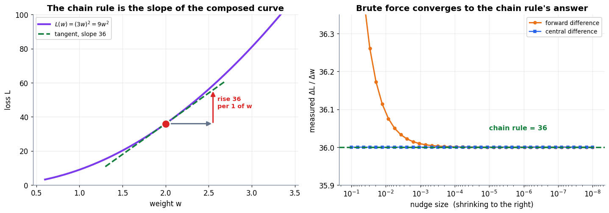

### Cell 52

```python
# ============================================================
#  Fan-out: the gradient is the SUM over paths
# ============================================================
def fan(u):
    p = 3 * u
    q = u ** 2
    return p, q, p + q

u0 = 2.0
p0, q0, Lf0 = fan(u0)
print(f"u = {u0:g}   ->   p = 3u = {p0:g},  q = u² = {q0:g},  L = p + q = {Lf0:g}")
print()
print("Path 1:  dL/dp × dp/du = 1 × 3      = 3")
print(f"Path 2:  dL/dq × dq/du = 1 × 2u = 1 × {2*u0:g}  = {2*u0:g}")
print(f"SUM   :  dL/du                     = {3 + 2*u0:g}      <- the correct answer")
print(f"(max would say {max(3, 2*u0):g}; mean would say {(3 + 2*u0)/2:g}; both are wrong)")
print()

print("BRUTE FORCE")
print("=" * 62)
print(f"{'nudge':>10}{'L(u+nudge)':>20}{'ΔL/nudge':>16}")
print("-" * 62)
for nudge in [0.001, 1e-5, 1e-7]:
    print(f"{nudge:>10.0e}{fan(u0 + nudge)[2]:>20.9f}{(fan(u0 + nudge)[2] - Lf0) / nudge:>16.6f}")
print("-" * 62)
print(f"L(2.001) = {fan(2.001)[2]:.9f}")
print("  The book prints 10.007002 for this value.")
print(f"  We compute {fan(2.001)[2]:.9f}  (3·2.001 = 6.003 exactly, 2.001² = 4.004001 exactly,")
print("  and 6.003 + 4.004001 = 10.007001). The book's final digit looks like a typo;")
print("  the rate it concludes — about 7 — is right either way.")
print()
u_s = sp.Symbol("u")
print("sympy, for certainty:  d/du (3u + u²) =", sp.diff(3 * u_s + u_s ** 2, u_s),
      "-> at u=2 :", float(sp.diff(3 * u_s + u_s ** 2, u_s).subs(u_s, 2)))
```

**Output**

```text
u = 2   ->   p = 3u = 6,  q = u² = 4,  L = p + q = 10

Path 1:  dL/dp × dp/du = 1 × 3      = 3
Path 2:  dL/dq × dq/du = 1 × 2u = 1 × 4  = 4
SUM   :  dL/du                     = 7      <- the correct answer
(max would say 4; mean would say 3.5; both are wrong)

BRUTE FORCE
==============================================================
     nudge          L(u+nudge)        ΔL/nudge
--------------------------------------------------------------
     1e-03        10.007001000        7.001000
     1e-05        10.000070000        7.000010
     1e-07        10.000000700        7.000000
--------------------------------------------------------------
L(2.001) = 10.007001000
  The book prints 10.007002 for this value.
  We compute 10.007001000  (3·2.001 = 6.003 exactly, 2.001² = 4.004001 exactly,
  and 6.003 + 4.004001 = 10.007001). The book's final digit looks like a typo;
  the rate it concludes — about 7 — is right either way.

sympy, for certainty:  d/du (3u + u²) = 2*u + 3 -> at u=2 : 7.0
```

### Cell 53

```python
# ============================================================
#  Figure: two paths back into one node
# ============================================================
fig = plt.figure(figsize=(13.4, 4.9))
gs = fig.add_gridspec(1, 2, width_ratios=[1.15, 1])

ax = fig.add_subplot(gs[0])
stage(ax, (0, 11), (0, 5.6))
box(ax, 1.7, 2.8, 1.9, 1.15, "$\\mathbf{u}$\nvalue = 2", fc="#EDE9FE", ec=C_MODEL, fs=10)
box(ax, 5.5, 4.3, 1.9, 1.05, "$\\mathbf{p} = 3u$\n= 6", fc="#DBEAFE", ec=C_DATA, fs=10)
box(ax, 5.5, 1.35, 1.9, 1.05, "$\\mathbf{q} = u^2$\n= 4", fc="#FFEDD5", ec=C_PRED, fs=10)
box(ax, 9.1, 2.8, 1.9, 1.15, "$\\mathbf{L} = p+q$\n= 10", fc="#FEE2E2", ec=C_ERR, fs=10)

arrow(ax, (2.7, 3.1), (4.5, 4.1), color=C_GREY, lw=2.2)
arrow(ax, (2.7, 2.5), (4.5, 1.55), color=C_GREY, lw=2.2)
arrow(ax, (6.5, 4.1), (8.1, 3.1), color=C_GREY, lw=2.2)
arrow(ax, (6.5, 1.55), (8.1, 2.5), color=C_GREY, lw=2.2)

ax.text(3.35, 4.06, "$dp/du = 3$", fontsize=10.5, color=C_TRUE, fontweight="bold")
ax.text(3.35, 1.36, "$dq/du = 2u = 4$", fontsize=10.5, color=C_TRUE, fontweight="bold")
ax.text(6.9, 4.15, "$dL/dp = 1$", fontsize=10, color=C_TRUE)
ax.text(6.9, 1.42, "$dL/dq = 1$", fontsize=10, color=C_TRUE)
ax.text(1.7, 1.15, "$\\frac{dL}{du} = 3 + 4 = 7$", ha="center", fontsize=15,
        color=C_TRUE, fontweight="bold")
ax.text(1.7, 0.35, "sum, not max, not mean", ha="center", fontsize=10,
        color=C_TRUE, style="italic")
ax.set_title("One value, two paths — the returning gradients accumulate", pad=10)

ax2 = fig.add_subplot(gs[1])
us = np.linspace(1.0, 3.0, 300)
ax2.plot(us, 3 * us + us ** 2, color=C_MODEL, lw=2.8, label="$L(u) = 3u + u^2$")
seg = np.linspace(1.45, 2.55, 2)
for slope, col, lab in [(7.0, C_TRUE, "sum: slope 7  ✔"),
                        (3.0, C_DATA, "path 1 only: 3  ✘"),
                        (4.0, C_PRED, "path 2 only: 4  ✘")]:
    ax2.plot(seg, Lf0 + slope * (seg - u0), color=col, lw=2.3,
             ls="--" if slope == 7 else ":", label=lab)
ax2.scatter([u0], [Lf0], s=170, color=C_ERR, zorder=6, edgecolor="white", lw=2)
ax2.set_ylim(3, 19)
tidy(ax2, "u", "L", "Only the sum matches the real slope", legend=True)
ax2.legend(fontsize=9, loc="upper left")
plt.tight_layout(); plt.show()
```

**Output**

```text
<Figure size 1474x539 with 2 Axes>
```

**Figure**

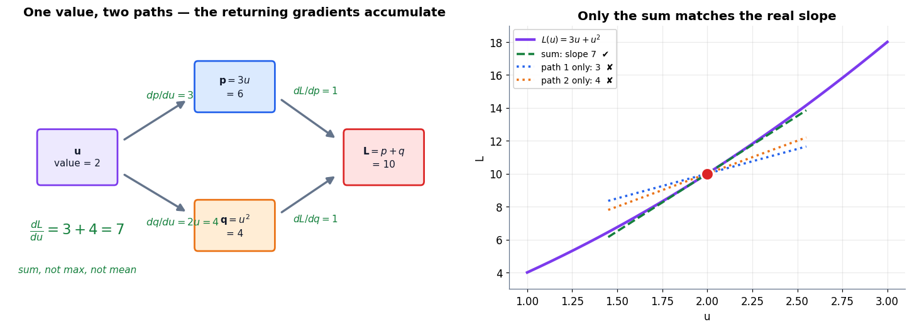

### Cell 57

```python
# ============================================================
#  σ'(z) = σ(1−σ) — derived above, now verified three ways
# ============================================================
z_s = sp.Symbol("z")
sig_s = 1 / (1 + sp.exp(-z_s))
dsig_s = sp.diff(sig_s, z_s)

print("sympy raw derivative      :", dsig_s)
print("simplified                :", sp.simplify(dsig_s))
identity = sp.simplify(dsig_s - sig_s * (1 - sig_s))
print("σ'(z) − σ(1−σ) simplifies to:", identity, " -> the identity holds exactly"
      if identity == 0 else " -> MISMATCH")
print()

def sigmoid(z):  return 1 / (1 + np.exp(-z))
def sigmoid_p(z):
    s = sigmoid(z)
    return s * (1 - s)

print(f"{'z':>7}{'σ(z)':>12}{'σ(1−σ)':>14}{'finite diff':>15}{'gap':>12}")
print("-" * 62)
for zv in [-6, -2, -0.5, 0.0, 0.5, 2, 6]:
    fd = (sigmoid(zv + 1e-6) - sigmoid(zv - 1e-6)) / 2e-6
    print(f"{zv:>7.1f}{sigmoid(zv):>12.6f}{sigmoid_p(zv):>14.6f}{fd:>15.6f}"
          f"{abs(sigmoid_p(zv) - fd):>12.2e}")
print("-" * 62)

zs = np.linspace(-12, 12, 20001)
i = np.argmax(sigmoid_p(zs))
print(f"maximum of σ' is {sigmoid_p(zs)[i]:.6f} at z = {zs[i]:.4f}"
      f"   (exactly 1/4 at z = 0, since σ(0) = 1/2)")
print("Remember that ceiling of 0.25. Part 5 measures what it does to a deep stack.")
```

**Output**

```text
sympy raw derivative      : exp(-z)/(1 + exp(-z))**2
simplified                : 1/(4*cosh(z/2)**2)
σ'(z) − σ(1−σ) simplifies to: 0  -> the identity holds exactly

      z        σ(z)        σ(1−σ)    finite diff         gap
--------------------------------------------------------------
   -6.0    0.002473      0.002467       0.002467    3.72e-13
   -2.0    0.119203      0.104994       0.104994    5.66e-12
   -0.5    0.377541      0.235004       0.235004    1.70e-11
    0.0    0.500000      0.250000       0.250000    3.49e-11
    0.5    0.622459      0.235004       0.235004    1.07e-11
    2.0    0.880797      0.104994       0.104994    2.21e-11
    6.0    0.997527      0.002467       0.002467    7.23e-11
--------------------------------------------------------------
maximum of σ' is 0.250000 at z = -0.0000   (exactly 1/4 at z = 0, since σ(0) = 1/2)
Remember that ceiling of 0.25. Part 5 measures what it does to a deep stack.
```

### Cell 58

```python
# ============================================================
#  Figure: the sigmoid, its derivative, and the saturation trap
# ============================================================
fig, (ax1, ax2) = plt.subplots(1, 2, figsize=(13.2, 4.6), sharex=True)

zz = np.linspace(-9, 9, 600)
ax1.plot(zz, sigmoid(zz), color=C_MODEL, lw=3.0)
for zp, col in [(-5.0, C_ERR), (0.0, C_TRUE), (5.0, C_ERR)]:
    s = sigmoid_p(zp)
    seg = np.linspace(zp - 2.2, zp + 2.2, 2)
    ax1.plot(seg, sigmoid(zp) + s * (seg - zp), color=col, lw=2.2, ls="--")
    ax1.scatter([zp], [sigmoid(zp)], s=120, color=col, zorder=6,
                edgecolor="white", lw=1.6)
    ax1.text(zp, sigmoid(zp) + 0.11, f"σ' = {s:.4f}", ha="center", fontsize=9.4,
             color=col, fontweight="bold")
ax1.axhspan(0, 0.02, color=C_ERR, alpha=0.10)
ax1.axhspan(0.98, 1.0, color=C_ERR, alpha=0.10)
ax1.text(-8.4, 0.06, "saturated: flat", color=C_ERR, fontsize=9)
ax1.text(3.2, 0.90, "saturated: flat", color=C_ERR, fontsize=9)
tidy(ax1, "pre-activation z", "σ(z)", "The sigmoid, with three tangents")

ax2.plot(zz, sigmoid_p(zz), color=C_PRED, lw=3.0, label="σ'(z) = σ(1−σ)")
ax2.plot(zz[::25], (sigmoid(zz[::25] + 1e-6) - sigmoid(zz[::25] - 1e-6)) / 2e-6,
         "o", color=C_DATA, ms=4, label="finite difference")
ax2.axhline(0.25, color=C_ERR, ls="--", lw=2.0)
ax2.text(-8.6, 0.258, "ceiling: σ' ≤ 0.25", color=C_ERR, fontsize=10.5,
         fontweight="bold")
ax2.scatter([0], [0.25], s=150, color=C_ERR, zorder=6, edgecolor="white", lw=1.5)
ax2.fill_between(zz, 0, sigmoid_p(zz), where=(np.abs(zz) > 4), color=C_ERR, alpha=0.15)
ax2.annotate("gradient here is\nunder 0.02", xy=(5.6, 0.0033), xytext=(3.0, 0.10),
             fontsize=9.2, color=C_ERR, fontweight="bold",
             arrowprops=dict(arrowstyle="->", color=C_ERR, lw=1.6))
ax2.set_ylim(-0.01, 0.30)
tidy(ax2, "pre-activation z", "σ'(z)", "Its derivative never exceeds a quarter",
     legend=True)
ax2.legend(fontsize=9)
plt.tight_layout(); plt.show()
```

**Output**

```text
<Figure size 1452x506 with 2 Axes>
```

**Figure**

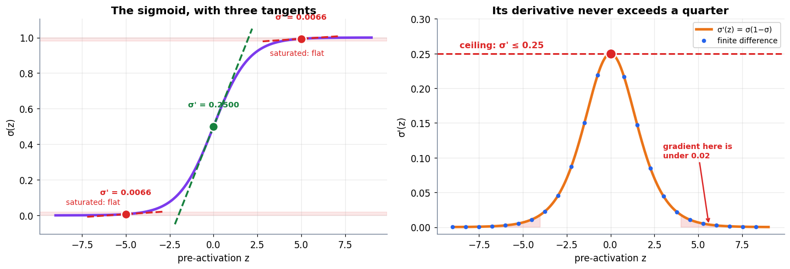

### Cell 60

```python
# ============================================================
#  A whole neuron's weight gradient — chain rule vs brute force
# ============================================================
# One neuron, squared-error loss on one example.
x_in, y_true = 1.7, 1.0
w_n, b_n = 0.8, -0.3

def neuron_loss(w, b, x=x_in, y=y_true):
    z = w * x + b
    a = sigmoid(z)
    return (a - y) ** 2, z, a

L_n, z_n, a_n = neuron_loss(w_n, b_n)
print("FORWARD  (and cache everything the backward pass will need)")
print("=" * 60)
print(f"  x = {x_in},  w = {w_n},  b = {b_n}")
print(f"  z = w·x + b = {z_n:.6f}      <- cached")
print(f"  a = σ(z)    = {a_n:.6f}      <- cached")
print(f"  L = (a − y)² = {L_n:.6f}")
print()

dL_da = 2 * (a_n - y_true)
da_dz = a_n * (1 - a_n)          # σ'(z), free from the cached a
dz_dw = x_in
dz_db = 1.0
grad_w = dL_da * da_dz * dz_dw
grad_b = dL_da * da_dz * dz_db

print("BACKWARD  (right to left, one link at a time)")
print("=" * 60)
print(f"  dL/da = 2(a − y)      = {dL_da:+.6f}")
print(f"  da/dz = a(1 − a)      = {da_dz:+.6f}     <- reuses cached a, no exp() needed")
print(f"  dz/dw = x             = {dz_dw:+.6f}")
print(f"  dL/dw = product       = {grad_w:+.9f}")
print(f"  dL/db = same, ×1      = {grad_b:+.9f}")
print()

fd_w = (neuron_loss(w_n + 1e-6, b_n)[0] - neuron_loss(w_n - 1e-6, b_n)[0]) / 2e-6
fd_b = (neuron_loss(w_n, b_n + 1e-6)[0] - neuron_loss(w_n, b_n - 1e-6)[0]) / 2e-6
print("CHECK  (finite differences, which know nothing about the chain rule)")
print("=" * 60)
print(f"  dL/dw : chain {grad_w:+.9f}   brute {fd_w:+.9f}   gap {abs(grad_w-fd_w):.2e}")
print(f"  dL/db : chain {grad_b:+.9f}   brute {fd_b:+.9f}   gap {abs(grad_b-fd_b):.2e}")
```

**Output**

```text
FORWARD  (and cache everything the backward pass will need)
============================================================
  x = 1.7,  w = 0.8,  b = -0.3
  z = w·x + b = 1.060000      <- cached
  a = σ(z)    = 0.742691      <- cached
  L = (a − y)² = 0.066208

BACKWARD  (right to left, one link at a time)
============================================================
  dL/da = 2(a − y)      = -0.514619
  da/dz = a(1 − a)      = +0.191101     <- reuses cached a, no exp() needed
  dz/dw = x             = +1.700000
  dL/dw = product       = -0.167185382
  dL/db = same, ×1      = -0.098344342

CHECK  (finite differences, which know nothing about the chain rule)
============================================================
  dL/dw : chain -0.167185382   brute -0.167185382   gap 2.26e-11
  dL/db : chain -0.098344342   brute -0.098344342   gap 2.60e-11
```

### Cell 64

```python
# ============================================================
#  Measured: brute-force gradients vs one backward pass
# ============================================================
import time

def make_net(n_hidden, rng):
    """A 2 -> n_hidden -> 1 network, weights flattened into one vector."""
    sizes = [(n_hidden, 2), (n_hidden, 1), (1, n_hidden), (1, 1)]
    return np.concatenate([rng.standard_normal(r * c) * 0.5 for r, c in sizes]), sizes

def unpack(theta, sizes):
    out, i = [], 0
    for r, c in sizes:
        out.append(theta[i:i + r * c].reshape(r, c)); i += r * c
    return out

def net_loss(theta, sizes, X, Y):
    """Forward pass only: X is (2, N), Y is (1, N)."""
    W1, b1, W2, b2 = unpack(theta, sizes)
    A1 = np.tanh(W1 @ X + b1)
    A2 = W2 @ A1 + b2
    return float(((A2 - Y) ** 2).mean())

def net_grad_backprop(theta, sizes, X, Y):
    """Forward, cache, then one backward sweep."""
    W1, b1, W2, b2 = unpack(theta, sizes)
    N = X.shape[1]
    Z1 = W1 @ X + b1; A1 = np.tanh(Z1)
    A2 = W2 @ A1 + b2
    d2 = 2 * (A2 - Y) / N                       # dL/dz for the output layer
    gW2, gb2 = d2 @ A1.T, d2.sum(1, keepdims=True)
    d1 = (W2.T @ d2) * (1 - A1 ** 2)            # push back, times tanh'
    gW1, gb1 = d1 @ X.T, d1.sum(1, keepdims=True)
    return np.concatenate([g.ravel() for g in (gW1, gb1, gW2, gb2)])

def net_grad_bruteforce(theta, sizes, X, Y, h=1e-6):
    """The naive way: one full forward pass per parameter."""
    base = net_loss(theta, sizes, X, Y)
    g = np.empty_like(theta)
    for i in range(theta.size):
        t = theta.copy(); t[i] += h
        g[i] = (net_loss(t, sizes, X, Y) - base) / h
    return g

Xd = rng.standard_normal((2, 200))
Yd = np.sin(Xd[0:1] * 1.5) + 0.3 * Xd[1:2]

print(f"{'hidden':>8}{'params P':>10}{'brute force (s)':>18}{'backprop (s)':>15}"
      f"{'speed-up':>11}{'max |gap|':>12}")
print("=" * 76)
timings = []
for nh in [4, 8, 16, 32, 64, 128]:
    th, sizes = make_net(nh, rng)
    t0 = time.perf_counter(); gb = net_grad_bruteforce(th, sizes, Xd, Yd)
    t_brute = time.perf_counter() - t0
    t0 = time.perf_counter()
    for _ in range(20): gp = net_grad_backprop(th, sizes, Xd, Yd)
    t_bp = (time.perf_counter() - t0) / 20
    timings.append((th.size, t_brute, t_bp))
    print(f"{nh:>8}{th.size:>10}{t_brute:>18.4f}{t_bp:>15.6f}"
          f"{t_brute / t_bp:>11.0f}×{np.abs(gb - gp).max():>11.1e}")
print("=" * 76)
print("Both columns compute the SAME gradient (last column: they agree).")
print("Only one of them has a cost that grows with the parameter count.")

# ============================================================
#  Figure: the two cost curves, and where they end up
# ============================================================
P = np.array([t[0] for t in timings], dtype=float)
t_brute = np.array([t[1] for t in timings])
t_bp = np.array([t[2] for t in timings])

fig, (ax1, ax2) = plt.subplots(1, 2, figsize=(13.2, 4.6))

ax1.loglog(P, t_brute, "o-", color=C_ERR, lw=2.6, ms=7, label="brute force: P+1 forward passes")
ax1.loglog(P, t_bp, "o-", color=C_TRUE, lw=2.6, ms=7, label="backprop: 1 forward + 1 backward")
ref = t_brute[0] * (P / P[0]) ** 2
ax1.loglog(P, ref, ls=":", color=C_GREY, lw=1.8, label="slope 2 (quadratic) reference")
tidy(ax1, "number of parameters P", "seconds for one full gradient",
     "Same gradient, two costs", legend=True)
ax1.legend(fontsize=8.6, loc="upper left")

per_forward = t_brute[-1] / (P[-1] + 1)
scales = np.array([1e3, 1e5, 1e6, 1e9])
brute_est = per_forward * (scales + 1)
bp_est = np.full_like(scales, 2 * per_forward)
xpos = np.arange(len(scales))
ax2.bar(xpos - 0.2, brute_est, 0.4, color=C_ERR, label="brute force")
ax2.bar(xpos + 0.2, bp_est, 0.4, color=C_TRUE, label="backprop")
ax2.set_yscale("log")
ax2.set_xticks(xpos)
ax2.set_xticklabels(["1 K", "100 K", "1 M", "1 B"])
for xi, (b, s) in enumerate(zip(brute_est, bp_est)):
    lab = f"{b:.0f}s" if b < 3600 else f"{b/3600:.0f}h" if b < 86400 * 3 else f"{b/86400:.0f}d"
    ax2.text(xi - 0.2, b * 1.5, lab, ha="center", fontsize=8.8, color=C_ERR,
             fontweight="bold")
ax2.text(len(scales) - 0.6, bp_est[0] * 0.35, "backprop stays here", color=C_TRUE,
         fontsize=9.4, fontweight="bold", ha="center")
tidy(ax2, "parameters in the model", "estimated seconds per gradient (log)",
     "Extrapolated from the measured per-pass time", legend=True)
ax2.legend(fontsize=9)
plt.tight_layout(); plt.show()

print(f"measured cost of ONE forward pass on this machine : {per_forward*1e6:.1f} µs")
print(f"a 1,000,000-parameter model, brute force          : "
      f"{per_forward * 1e6 / 60:.1f} minutes PER TRAINING STEP")
print(f"a 1,000,000,000-parameter model, brute force      : "
      f"{per_forward * 1e9 / 86400:.1f} days PER TRAINING STEP")
print(f"the same model, backpropagation                   : "
      f"{2 * per_forward * 1e3:.3f} ms per training step")
print("A training run is hundreds of thousands of steps. That is the whole argument.")
```

**Output**

```text
  hidden  params P   brute force (s)   backprop (s)   speed-up   max |gap|
============================================================================
       4        17            0.0050       0.000162         31×    1.0e-06
       8        33            0.0075       0.000637         12×    1.0e-06
      16        65            0.0206       0.000370         56×    1.0e-06
      32       129            0.0785       0.001561         50×    1.4e-06
      64       257            0.3396       0.001201        283×    1.0e-06
     128       513            1.1298       0.002192        515×    3.6e-06
============================================================================
Both columns compute the SAME gradient (last column: they agree).
Only one of them has a cost that grows with the parameter count.
```

**Output**

```text
<Figure size 1452x506 with 2 Axes>
```

**Figure**

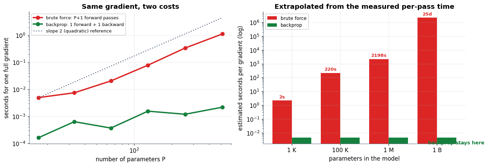

**Output**

```text
measured cost of ONE forward pass on this machine : 2198.1 µs
a 1,000,000-parameter model, brute force          : 36.6 minutes PER TRAINING STEP
a 1,000,000,000-parameter model, brute force      : 25.4 days PER TRAINING STEP
the same model, backpropagation                   : 4.396 ms per training step
A training run is hundreds of thousands of steps. That is the whole argument.
```

### Cell 67

```python
# ============================================================
#  Figure: one layer, forward and backward
# ============================================================
fig, ax = plt.subplots(figsize=(12.8, 5.6))
stage(ax, (0, 12.8), (0, 6.0))

box(ax, 1.5, 4.3, 2.0, 1.0, "$x$\ncached input", fc="#DBEAFE", ec=C_DATA, fs=10)
box(ax, 4.9, 4.3, 2.2, 1.0, "$z = Wx + b$\npre-activation", fc="#EDE9FE", ec=C_MODEL, fs=10)
box(ax, 8.4, 4.3, 2.0, 1.0, "$a = \\varphi(z)$\nactivation", fc="#FFEDD5", ec=C_PRED, fs=10)
box(ax, 11.4, 4.3, 1.6, 1.0, "onward\nto layer $l{+}1$", fc=C_SOFT, ec=C_GREY, fs=9)
arrow(ax, (2.55, 4.3), (3.75, 4.3), color=C_GREY, lw=2.4)
arrow(ax, (6.05, 4.3), (7.35, 4.3), color=C_GREY, lw=2.4)
arrow(ax, (9.45, 4.3), (10.55, 4.3), color=C_GREY, lw=2.4)
ax.text(6.4, 5.45, "FORWARD — compute and CACHE  x, z, a", ha="center",
        fontsize=11, color=C_GREY, fontweight="bold")

box(ax, 11.4, 2.3, 1.9, 0.95, "grad_from_above\n$dL/da$", fc="#DCFCE7", ec=C_TRUE, fs=9)
box(ax, 8.0, 2.3, 2.6, 0.95, "$\\delta = \\frac{dL}{da}\\odot\\varphi'(z)$",
    fc="#DCFCE7", ec=C_TRUE, fs=11)
box(ax, 4.2, 2.3, 2.6, 0.95, "$W^{\\top}\\delta$\nhanded to layer $l{-}1$",
    fc="#DCFCE7", ec=C_TRUE, fs=10)
arrow(ax, (10.4, 2.3), (9.35, 2.3), color=C_TRUE, lw=2.6)
arrow(ax, (6.65, 2.3), (5.55, 2.3), color=C_TRUE, lw=2.6)
arrow(ax, (2.85, 2.3), (1.8, 2.3), color=C_TRUE, lw=2.6)
ax.text(6.4, 3.35, "BACKWARD — one delta per node, reused by everything",
        ha="center", fontsize=11, color=C_TRUE, fontweight="bold")

box(ax, 8.0, 0.75, 3.4, 0.9, "$\\nabla_W = \\delta\\, x^{\\top}$        "
    "$\\nabla_b = \\delta$", fc="#FEE2E2", ec=C_ERR, fs=11)
arrow(ax, (8.0, 1.78), (8.0, 1.26), color=C_ERR, lw=2.2)
ax.text(4.4, 0.75, "the two gradients we actually wanted", fontsize=10,
        color=C_ERR, fontweight="bold", ha="center", va="center")
ax.text(1.5, 3.35, "$x$ is reused here ↑", fontsize=9, color=C_DATA, ha="center")
plt.tight_layout(); plt.show()
```

**Output**

```text
<Figure size 1408x616 with 1 Axes>
```

**Figure**

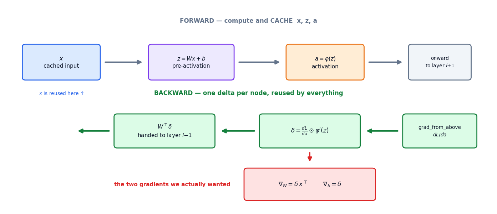

### Cell 69

```python
# ============================================================
#  The transpose, verified: is W.T @ delta really dL/dx ?
# ============================================================
rng_local = np.random.default_rng(11)
W = rng_local.standard_normal((4, 3))          # 3 inputs -> 4 outputs
b = rng_local.standard_normal((4, 1))
x = rng_local.standard_normal((3, 1))
c = rng_local.standard_normal((4, 1))          # an arbitrary downstream loss L = c·a

def layer_loss(xv):
    z = W @ xv + b
    a = np.tanh(z)
    return float((c.T @ a).item())

z = W @ x + b
a = np.tanh(z)
delta = c * (1 - a ** 2)                       # dL/da ⊙ φ'(z)
grad_x_formula = W.T @ delta                   # the claim

grad_x_numeric = np.zeros_like(x)
for j in range(x.size):                        # wiggle each input, one at a time
    xp, xm = x.copy(), x.copy()
    xp[j] += 1e-6; xm[j] -= 1e-6
    grad_x_numeric[j] = (layer_loss(xp) - layer_loss(xm)) / 2e-6

print("W is 4x3, so the forward pass maps 3 numbers -> 4 numbers.")
print("The backward pass must map 4 deltas -> 3 gradients, and W.T is 3x4.\n")
print(f"{'j':>4}{'(W.T @ delta)_j':>20}{'measured dL/dx_j':>20}{'gap':>12}")
print("-" * 58)
for j in range(3):
    print(f"{j:>4}{grad_x_formula[j,0]:>20.9f}{grad_x_numeric[j,0]:>20.9f}"
          f"{abs(grad_x_formula[j,0]-grad_x_numeric[j,0]):>12.1e}")
print("-" * 58)
print(f"and the WRONG version, W @ delta, does not even have a valid shape: "
      f"(4,3)@(4,1) -> ", end="")
try:
    _ = W @ delta
    print("it worked?!")
except ValueError as e:
    print("ValueError, as it must.")
```

**Output**

```text
W is 4x3, so the forward pass maps 3 numbers -> 4 numbers.
The backward pass must map 4 deltas -> 3 gradients, and W.T is 3x4.

   j     (W.T @ delta)_j    measured dL/dx_j         gap
----------------------------------------------------------
   0        -0.633815112        -0.633815112     5.3e-11
   1         1.324983709         1.324983709     1.3e-12
   2         0.039017546         0.039017546     5.5e-11
----------------------------------------------------------
and the WRONG version, W @ delta, does not even have a valid shape: (4,3)@(4,1) -> ValueError, as it must.
```

### Cell 71

```python
# ============================================================
#  First: verify the "δ = a − y" shortcut for sigmoid + BCE
# ============================================================
z_sym, y_sym = sp.symbols("z y")
a_sym = 1 / (1 + sp.exp(-z_sym))
bce = -(y_sym * sp.log(a_sym) + (1 - y_sym) * sp.log(1 - a_sym))
delta_sym = sp.simplify(sp.diff(bce, z_sym))
print("L(z) = BCE(σ(z), y)")
print("dL/dz simplified by sympy :", delta_sym)
print("claimed                   :", sp.simplify(a_sym - y_sym))
print("difference                :", sp.simplify(delta_sym - (a_sym - y_sym)),
      " -> the shortcut is exact")
print()
for zv, yv in [(0.4, 1.0), (-1.3, 0.0), (2.2, 1.0)]:
    num = float(sp.diff(bce, z_sym).subs({z_sym: zv, y_sym: yv}))
    short = 1 / (1 + np.exp(-zv)) - yv
    print(f"  z={zv:>5.1f}, y={yv:g}   sympy dL/dz = {num:+.9f}   a−y = {short:+.9f}")
```

**Output**

```text
L(z) = BCE(σ(z), y)
dL/dz simplified by sympy : (-y + (1 - y)*exp(z))/(exp(z) + 1)
claimed                   : (-y*(exp(z) + 1) + exp(z))/(exp(z) + 1)
difference                : 0  -> the shortcut is exact

  z=  0.4, y=1   sympy dL/dz = -0.401312340   a−y = -0.401312340
  z= -1.3, y=0   sympy dL/dz = +0.214165017   a−y = +0.214165017
  z=  2.2, y=1   sympy dL/dz = -0.099750489   a−y = -0.099750489
```

### Cell 72

```python
# ============================================================
#  A neural network, from scratch. No autograd anywhere.
# ============================================================
def make_moons(n_per_class=140, noise=0.18, seed=7):
    """Two interleaved crescents. No sklearn — just trigonometry and noise."""
    r = np.random.default_rng(seed)
    t = np.linspace(0, np.pi, n_per_class)
    x1 = np.stack([np.cos(t), np.sin(t)])                       # upper moon
    x2 = np.stack([1 - np.cos(t), 0.5 - np.sin(t)])             # lower moon
    X = np.concatenate([x1, x2], axis=1) + noise * r.standard_normal((2, 2 * n_per_class))
    Y = np.concatenate([np.zeros(n_per_class), np.ones(n_per_class)]).reshape(1, -1)
    idx = r.permutation(X.shape[1])
    return X[:, idx], Y[:, idx]

class Net:
    """A plain MLP: tanh hidden layers, sigmoid output, binary cross-entropy."""

    def __init__(self, sizes, seed=0):
        r = np.random.default_rng(seed)
        self.sizes = sizes
        # Xavier-ish init for tanh: variance 1/n_in keeps activations sane
        self.W = [r.standard_normal((sizes[i + 1], sizes[i])) * np.sqrt(1.0 / sizes[i])
                  for i in range(len(sizes) - 1)]
        self.b = [np.zeros((sizes[i + 1], 1)) for i in range(len(sizes) - 1)]

    # ---------------- forward: compute and cache ----------------
    def forward(self, X):
        A = [X]; Z = []
        last = len(self.W) - 1
        for l, (W, b) in enumerate(zip(self.W, self.b)):
            z = W @ A[-1] + b
            a = 1 / (1 + np.exp(-z)) if l == last else np.tanh(z)
            Z.append(z); A.append(a)
        return Z, A

    def loss(self, X, Y, eps=1e-12):
        A_out = self.forward(X)[1][-1]
        return float(-(Y * np.log(A_out + eps) + (1 - Y) * np.log(1 - A_out + eps)).mean())

    # ---------------- backward: four lines per layer ----------------
    def backward(self, X, Y):
        Z, A = self.forward(X)
        N = X.shape[1]
        gW = [None] * len(self.W); gb = [None] * len(self.b)

        delta = (A[-1] - Y) / N                       # sigmoid + BCE shortcut
        for l in reversed(range(len(self.W))):
            gW[l] = delta @ A[l].T                    # grad_W = delta @ x.T
            gb[l] = delta.sum(axis=1, keepdims=True)  # grad_b = delta (summed over batch)
            if l > 0:
                below = self.W[l].T @ delta           # grad_to_below = W.T @ delta
                delta = below * (1 - A[l] ** 2)       # times tanh'(z) = 1 − a²
        return gW, gb

    def step(self, X, Y, eta):
        gW, gb = self.backward(X, Y)
        for l in range(len(self.W)):
            self.W[l] -= eta * gW[l]                  # θ ← θ − η∇L
            self.b[l] -= eta * gb[l]

    def predict(self, X):
        return self.forward(X)[1][-1]

X_moon, Y_moon = make_moons()
net = Net([2, 16, 16, 1], seed=3)
print(f"data  : X {X_moon.shape},  Y {Y_moon.shape},  "
      f"class balance {Y_moon.mean():.2f}")
print(f"model : {net.sizes},  "
      f"{sum(w.size for w in net.W) + sum(bb.size for bb in net.b)} parameters")
print(f"loss before training: {net.loss(X_moon, Y_moon):.4f}"
      f"   (a coin flip would score {np.log(2):.4f})")
```

**Output**

```text
data  : X (2, 280),  Y (1, 280),  class balance 0.50
model : [2, 16, 16, 1],  337 parameters
loss before training: 0.6943   (a coin flip would score 0.6931)
```

### Cell 74

```python
# ============================================================
#  GRADIENT CHECK — backprop vs brute force, every parameter
# ============================================================
def flatten(net):
    return np.concatenate([w.ravel() for w in net.W] + [bb.ravel() for bb in net.b])

def load(net, theta):
    i = 0
    for l, w in enumerate(net.W):
        net.W[l] = theta[i:i + w.size].reshape(w.shape); i += w.size
    for l, bb in enumerate(net.b):
        net.b[l] = theta[i:i + bb.size].reshape(bb.shape); i += bb.size

check_net = Net([2, 6, 5, 1], seed=1)          # small enough to check EVERY parameter
Xc, Yc = X_moon[:, :40], Y_moon[:, :40]

gW, gb = check_net.backward(Xc, Yc)
g_analytic = np.concatenate([g.ravel() for g in gW] + [g.ravel() for g in gb])

theta0 = flatten(check_net)
g_numeric = np.empty_like(theta0)
h = 1e-6
for i in range(theta0.size):
    tp, tm = theta0.copy(), theta0.copy()
    tp[i] += h; tm[i] -= h
    load(check_net, tp); Lp = check_net.loss(Xc, Yc)
    load(check_net, tm); Lm = check_net.loss(Xc, Yc)
    g_numeric[i] = (Lp - Lm) / (2 * h)
load(check_net, theta0)

rel = (np.linalg.norm(g_analytic - g_numeric)
       / (np.linalg.norm(g_analytic) + np.linalg.norm(g_numeric)))
print(f"parameters checked        : {theta0.size}  (all of them)")
print(f"largest single |gap|      : {np.abs(g_analytic - g_numeric).max():.3e}")
print(f"RELATIVE ERROR            : {rel:.3e}")
print(f"verdict                   : {'PASS — under 1e-7' if rel < 1e-7 else 'FAIL'}")
print()
print(f"{'param':>7}{'backprop':>16}{'brute force':>16}")
print("-" * 40)
for i in [0, 1, 2, theta0.size // 2, theta0.size - 2, theta0.size - 1]:
    print(f"{i:>7}{g_analytic[i]:>16.9f}{g_numeric[i]:>16.9f}")
print("-" * 40)
print("Every one of these came from four lines of matrix algebra, and every one")
print("agrees with physically nudging that weight and re-running the network.")
```

**Output**

```text
parameters checked        : 59  (all of them)
largest single |gap|      : 1.154e-10
RELATIVE ERROR            : 4.593e-10
verdict                   : PASS — under 1e-7

  param        backprop     brute force
----------------------------------------
      0    -0.040057431    -0.040057431
      1     0.038636528     0.038636528
      2    -0.007165653    -0.007165654
     29    -0.003441539    -0.003441539
     57    -0.000144543    -0.000144543
     58    -0.028691923    -0.028691923
----------------------------------------
Every one of these came from four lines of matrix algebra, and every one
agrees with physically nudging that weight and re-running the network.
```

### Cell 76

```python
# ============================================================
#  torch.autograd as an independent referee
# ============================================================
import torch
torch.manual_seed(0)

t_net = Net([2, 16, 16, 1], seed=3)            # same seed => same initial weights
Xt = torch.tensor(X_moon, dtype=torch.float64)
Yt = torch.tensor(Y_moon, dtype=torch.float64)
Wt = [torch.tensor(w, dtype=torch.float64, requires_grad=True) for w in t_net.W]
bt = [torch.tensor(bb, dtype=torch.float64, requires_grad=True) for bb in t_net.b]

A = Xt
for l in range(len(Wt)):
    Z = Wt[l] @ A + bt[l]
    A = torch.sigmoid(Z) if l == len(Wt) - 1 else torch.tanh(Z)
loss_t = -(Yt * torch.log(A) + (1 - Yt) * torch.log(1 - A)).mean()
loss_t.backward()

gW_ours, gb_ours = t_net.backward(X_moon, Y_moon)
print(f"loss   ours  {t_net.loss(X_moon, Y_moon):.12f}")
print(f"loss   torch {loss_t.item():.12f}")
print()
print(f"{'layer':>7}{'shape':>12}{'max |ours − torch|':>24}")
print("-" * 46)
worst = 0.0
for l in range(len(Wt)):
    dW = np.abs(gW_ours[l] - Wt[l].grad.numpy()).max()
    db = np.abs(gb_ours[l] - bt[l].grad.numpy()).max()
    worst = max(worst, dW, db)
    print(f"{'W' + str(l):>7}{str(tuple(gW_ours[l].shape)):>12}{dW:>24.3e}")
    print(f"{'b' + str(l):>7}{str(tuple(gb_ours[l].shape)):>12}{db:>24.3e}")
print("-" * 46)
print(f"worst disagreement anywhere : {worst:.3e}")
print("That is floating-point noise. Two independent implementations of the chain")
print("rule — ours in four lines, torch's on a tape — computed the same gradient.")
```

**Output**

```text
loss   ours  0.694285668875
loss   torch 0.694285668877

  layer       shape      max |ours − torch|
----------------------------------------------
     W0     (16, 2)               4.163e-17
     b0     (16, 1)               3.469e-18
     W1    (16, 16)               5.551e-17
     b1     (16, 1)               3.469e-18
     W2     (1, 16)               2.776e-17
     b2      (1, 1)               6.939e-18
----------------------------------------------
worst disagreement anywhere : 5.551e-17
That is floating-point noise. Two independent implementations of the chain
rule — ours in four lines, torch's on a tape — computed the same gradient.
```

### Cell 77

```python
# ============================================================
#  Train it. Same four-beat loop as Notebook 1.
# ============================================================
net = Net([2, 16, 16, 1], seed=3)
eta, EPOCHS = 0.6, 4000
hist, snaps = [], {}
for e in range(EPOCHS + 1):
    L = net.loss(X_moon, Y_moon)
    hist.append(L)
    if e in (0, 50, 300, 1200, EPOCHS):
        snaps[e] = ([w.copy() for w in net.W], [bb.copy() for bb in net.b], L)
    net.step(X_moon, Y_moon, eta)              # forward, backward, update

acc = ((net.predict(X_moon) > 0.5) == (Y_moon > 0.5)).mean()
print("TRAINING A NETWORK WITH GRADIENTS WE DERIVED OURSELVES")
print("=" * 58)
print(f"{'epoch':>8}{'loss':>14}")
print("-" * 58)
for e in [0, 50, 300, 1200, EPOCHS]:
    print(f"{e:>8}{hist[e]:>14.6f}")
print("-" * 58)
print(f"training accuracy : {acc * 100:.2f}%")
print(f"loss              : {hist[0]:.4f} -> {hist[-1]:.4f}")
print()
print("No autograd, no framework, no library that knows what a derivative is.")
print("Four lines per layer, run backward, 4000 times.")
```

**Output**

```text
TRAINING A NETWORK WITH GRADIENTS WE DERIVED OURSELVES
==========================================================
   epoch          loss
----------------------------------------------------------
       0      0.694286
      50      0.240310
     300      0.027670
    1200      0.007903
    4000      0.001653
----------------------------------------------------------
training accuracy : 100.00%
loss              : 0.6943 -> 0.0017

No autograd, no framework, no library that knows what a derivative is.
Four lines per layer, run backward, 4000 times.
```

### Cell 78

```python
# ============================================================
#  Figure: the boundary being carved, and the loss falling
# ============================================================
fig = plt.figure(figsize=(13.4, 7.6))
gs = fig.add_gridspec(2, 3, height_ratios=[1.15, 0.85], hspace=0.34, wspace=0.22)

gxx, gyy = np.meshgrid(np.linspace(-1.6, 2.6, 220), np.linspace(-1.3, 1.8, 220))
grid = np.stack([gxx.ravel(), gyy.ravel()])
shown = [0, 50, EPOCHS]
for k, e in enumerate(shown):
    ax = fig.add_subplot(gs[0, k])
    Wb, bb_, Le = snaps[e]
    tmp = Net([2, 16, 16, 1]); tmp.W, tmp.b = Wb, bb_
    probs = tmp.predict(grid).reshape(gxx.shape)
    ax.contourf(gxx, gyy, probs, levels=np.linspace(0, 1, 21), cmap="coolwarm", alpha=0.75)
    ax.contour(gxx, gyy, probs, levels=[0.5], colors="k", linewidths=2.2)
    m0 = (Y_moon.ravel() == 0)
    ax.scatter(X_moon[0, m0], X_moon[1, m0], s=16, color=C_DATA, edgecolor="white", lw=0.4)
    ax.scatter(X_moon[0, ~m0], X_moon[1, ~m0], s=16, color=C_ERR, edgecolor="white", lw=0.4)
    ax.set_title(f"epoch {e}   loss {Le:.3f}", fontsize=11)
    ax.set_xticks([]); ax.set_yticks([])

ax4 = fig.add_subplot(gs[1, :2])
ax4.semilogy(hist, color=C_ERR, lw=2.4)
for e in shown:
    ax4.scatter([e], [hist[e]], s=70, color=C_MODEL, zorder=5, edgecolor="white", lw=1.2)
    ax4.annotate(f"epoch {e}", xy=(e, hist[e]), xytext=(e + 180, hist[e] * 1.9),
                 fontsize=8.8, color=C_MODEL)
ax4.axhline(np.log(2), color=C_GREY, ls=":", lw=1.4)
ax4.text(2500, np.log(2) * 1.12, "log 2 = the loss of a coin flip", color=C_GREY, fontsize=9)
tidy(ax4, "epoch", "binary cross-entropy (log scale)", "The scoreboard")

ax5 = fig.add_subplot(gs[1, 2])
lim = 1.08 * max(np.abs(g_analytic).max(), np.abs(g_numeric).max())
ax5.plot([-lim, lim], [-lim, lim], color=C_GREY, lw=1.6, ls="--")
ax5.scatter(g_numeric, g_analytic, s=42, color=C_MODEL, alpha=0.85,
            edgecolor="white", lw=0.7)
ax5.set_xlim(-lim, lim); ax5.set_ylim(-lim, lim); ax5.set_aspect("equal")
ax5.text(-lim * 0.92, lim * 0.72, f"relative error\n{rel:.1e}", fontsize=9.4,
         color=C_TRUE, fontweight="bold")
tidy(ax5, "brute force  (nudge and re-run)", "backprop  (four lines)",
     "Every gradient, both ways")
plt.show()
```

**Output**

```text
<Figure size 1474x836 with 5 Axes>
```

**Figure**

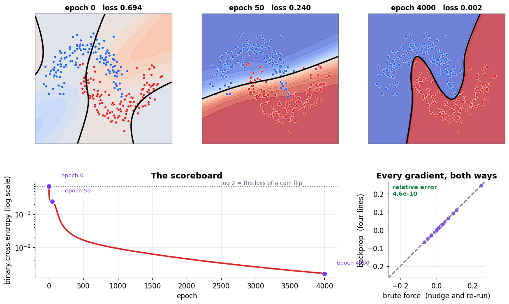

### Cell 81

```python
# ============================================================
#  MEASURED: how a gradient's size changes with depth
# ============================================================
def backward_norms(act, gain, depth=25, width=64, trials=120, seed=0):
    """Push a unit gradient back through `depth` random layers; return median ‖g‖."""
    r = np.random.default_rng(seed)
    allnorms = []
    for _ in range(trials):
        a = r.standard_normal(width) / np.sqrt(width)
        Zs, Ws = [], []
        for _ in range(depth):                                   # forward, cache z
            W = r.standard_normal((width, width)) * np.sqrt(gain / width)
            z = W @ a
            Ws.append(W); Zs.append(z)
            a = sigmoid(z) if act == "sigmoid" else np.maximum(z, 0.0)
        g = r.standard_normal(width); g /= np.linalg.norm(g)     # unit gradient at the top
        norms = [1.0]
        for l in range(depth - 1, -1, -1):                       # the four-line step
            phi_p = sigmoid_p(Zs[l]) if act == "sigmoid" else (Zs[l] > 0).astype(float)
            g = Ws[l].T @ (g * phi_p)
            norms.append(np.linalg.norm(g))
        allnorms.append(norms)
    return np.median(np.array(allnorms), axis=0)

configs = [("sigmoid, standard init (gain 1)", "sigmoid", 1.0, C_ERR),
           ("sigmoid, cranked up (gain 8)",    "sigmoid", 8.0, C_PRED),
           ("sigmoid, absurd init (gain 128)", "sigmoid", 128.0, "#0891B2"),
           ("ReLU + He init (gain 2)",         "relu",    2.0, C_TRUE),
           ("ReLU, init too large (gain 8)",   "relu",    8.0, C_MODEL)]

print("Median ‖gradient‖ after travelling back through N layers (width 64, 120 trials)")
print("=" * 92)
print(f"{'configuration':<34}{'N=5':>13}{'N=15':>13}{'N=25':>13}{'per-layer factor':>18}")
print("-" * 92)
curves = []
for label, act, gain, col in configs:
    n = backward_norms(act, gain)
    curves.append((label, n, col))
    print(f"{label:<34}{n[5]:>13.3e}{n[15]:>13.3e}{n[25]:>13.3e}"
          f"{n[25] ** (1 / 25):>18.4f}")
print("-" * 92)
print("A per-layer factor below 1 vanishes; above 1 explodes.")
print("ReLU+He sits just under 1 BY DESIGN. Sigmoid can be forced above 1, but only")
print("with an absurd initialisation -- in practice it fails by vanishing first.")
print(f"For reference, 0.25**25 = {0.25**25:.3e}  (the sigmoid's best possible case).")
```

**Output**

```text
Median ‖gradient‖ after travelling back through N layers (width 64, 120 trials)
============================================================================================
configuration                               N=5         N=15         N=25  per-layer factor
--------------------------------------------------------------------------------------------
sigmoid, standard init (gain 1)       6.887e-04    3.485e-10    1.749e-16            0.2343
sigmoid, cranked up (gain 8)          3.567e-02    4.521e-05    6.854e-08            0.5169
sigmoid, absurd init (gain 128)       9.525e-01    9.553e-01    2.061e+00            1.0293
ReLU + He init (gain 2)               8.845e-01    7.508e-01    5.659e-01            0.9775
ReLU, init too large (gain 8)         2.830e+01    2.460e+04    1.899e+07            1.9550
--------------------------------------------------------------------------------------------
A per-layer factor below 1 vanishes; above 1 explodes.
ReLU+He sits just under 1 BY DESIGN. Sigmoid can be forced above 1, but only
with an absurd initialisation -- in practice it fails by vanishing first.
For reference, 0.25**25 = 8.882e-16  (the sigmoid's best possible case).
```

### Cell 82

```python
# ============================================================
#  Figure: four ways a gradient can travel 25 layers
# ============================================================
fig, (ax1, ax2) = plt.subplots(1, 2, figsize=(13.4, 4.8))

for label, n, col in curves:
    ax1.semilogy(range(len(n)), np.maximum(n, 1e-30), "o-", color=col, lw=2.4,
                 ms=4.5, label=label)
ax1.axhline(1.0, color=C_GREY, ls="--", lw=1.6)
ax1.text(0.4, 1.6, "gradient arrives the size it left", color=C_GREY, fontsize=9)
ax1.axhspan(1e-30, 1e-12, color=C_ERR, alpha=0.07)
ax1.text(13, 1e-19, "below here: nothing left to learn from", color=C_ERR,
         fontsize=9.4, fontweight="bold", ha="center")
tidy(ax1, "layers travelled backward", "median ‖gradient‖  (log scale)",
     "Exponentials, in both directions", legend=True)
ax1.legend(fontsize=8.4, loc="lower left")

names = ["sigmoid\ngain 1", "sigmoid\ngain 8", "ReLU + He\ngain 2", "ReLU\ngain 8"]
factors = [c[1][25] ** (1 / 25) for c in curves]
cols = [c[2] for c in curves]
ax2.bar(range(len(factors)), factors, color=cols, alpha=0.9)
ax2.axhline(1.0, color=C_GREY, ls="--", lw=2.0)
ax2.text(len(names) - 0.55, 1.03, "κ = 1\nthe knife edge", color=C_GREY, fontsize=9,
         ha="right", fontweight="bold")
for i, f_ in enumerate(factors):
    ax2.text(i, f_ + 0.05, f"{f_:.2f}", ha="center", fontsize=10, fontweight="bold",
             color=cols[i])
ax2.set_xticks(range(len(names))); ax2.set_xticklabels(names, fontsize=7.8)
ax2.set_ylim(0, max(factors) * 1.25)
tidy(ax2, "", "per-layer multiplier κ", "One number decides the fate of the run")
plt.tight_layout(); plt.show()
```

**Output**

```text
<Figure size 1474x528 with 2 Axes>
```

**Figure**

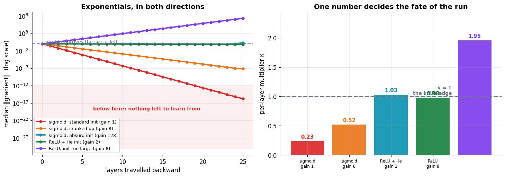

### Cell 88

```python
# ============================================================
#  Four rectangles, worked exactly as in the text
# ============================================================
def g(x):
    return x ** 2

a_lo, b_hi, n = 0.0, 3.0, 4
dx = (b_hi - a_lo) / n
right_edges = a_lo + dx * np.arange(1, n + 1)
heights = g(right_edges)

print(f"f(x) = x²  on [{a_lo:g}, {b_hi:g}]  with {n} rectangles, Δx = {dx:g}")
print("=" * 58)
print(f"{'strip':>7}{'right edge':>14}{'height f(x)':>16}{'area':>12}")
print("-" * 58)
for i, (xe, hh) in enumerate(zip(right_edges, heights), 1):
    print(f"{i:>7}{xe:>14.4f}{hh:>16.4f}{hh * dx:>12.6f}")
print("-" * 58)
print(f"{'sum of heights':>37}{heights.sum():>12.6f}")
print(f"{'× Δx':>37}{heights.sum() * dx:>12.6f}   <- the Riemann sum")
print()
print(f"book says   : 12.66")
print(f"we compute  : {heights.sum() * dx:.5f}   (the book rounds 12.65625)")
print(f"true area   : 9.0        -> we are over by {heights.sum()*dx - 9:.5f}")

# ============================================================
#  Figure: the rectangles, and where the over-count comes from
# ============================================================
def riemann(fn, a_, b_, n_, where="right"):
    dx_ = (b_ - a_) / n_
    if where == "right":  pts = a_ + dx_ * np.arange(1, n_ + 1)
    elif where == "left": pts = a_ + dx_ * np.arange(0, n_)
    else:                 pts = a_ + dx_ * (np.arange(n_) + 0.5)
    return float(fn(pts).sum() * dx_), pts, dx_

fig, axes = plt.subplots(1, 3, figsize=(13.4, 4.3), sharey=True)
xs = np.linspace(0, 3, 400)
for ax, n_ in zip(axes, [4, 10, 40]):
    tot, pts, dx_ = riemann(g, 0, 3, n_)
    ax.bar(pts - dx_, g(pts), width=dx_, align="edge", color=C_PRED,
           alpha=0.35, edgecolor=C_PRED, lw=1.0)
    ax.plot(xs, g(xs), color=C_MODEL, lw=2.8, zorder=4)
    ax.fill_between(xs, 0, g(xs), color=C_MODEL, alpha=0.10)
    ax.set_title(f"{n_} rectangles → {tot:.4f}", fontsize=11.5)
    ax.set_xlabel("x")
    ax.spines[["top", "right"]].set_visible(False)
    ax.text(0.15, 8.2, f"over the true 9.0\nby {tot - 9:.3f}", fontsize=9.4,
            color=C_ERR, fontweight="bold")
axes[0].set_ylabel("f(x) = x²")
fig.suptitle("Right-edge rectangles over-count a rising curve — and the error shrinks with the strips",
             fontsize=12.5, fontweight="bold", y=1.02)
plt.tight_layout(); plt.show()
```

**Output**

```text
f(x) = x²  on [0, 3]  with 4 rectangles, Δx = 0.75
==========================================================
  strip    right edge     height f(x)        area
----------------------------------------------------------
      1        0.7500          0.5625    0.421875
      2        1.5000          2.2500    1.687500
      3        2.2500          5.0625    3.796875
      4        3.0000          9.0000    6.750000
----------------------------------------------------------
                       sum of heights   16.875000
                                 × Δx   12.656250   <- the Riemann sum

book says   : 12.66
we compute  : 12.65625   (the book rounds 12.65625)
true area   : 9.0        -> we are over by 3.65625
```

**Output**

```text
<Figure size 1474x473 with 3 Axes>
```

**Figure**

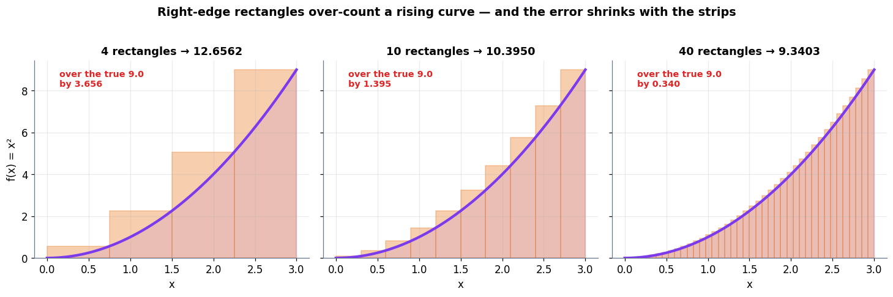

### Cell 90

```python
# ============================================================
#  Taking the slices to zero — the convergence table
# ============================================================
TRUE = 9.0
print("f(x) = x² on [0, 3];  the exact area is 9.0")
print("=" * 84)
print(f"{'n':>7}{'Δx':>10}{'right edge':>14}{'left edge':>14}{'midpoint':>14}"
      f"{'right error':>15}")
print("-" * 84)
for n_ in [4, 10, 100, 1000, 100000]:
    r_, _, dx_ = riemann(g, 0, 3, n_, "right")
    l_, _, _ = riemann(g, 0, 3, n_, "left")
    m_, _, _ = riemann(g, 0, 3, n_, "mid")
    print(f"{n_:>7}{dx_:>10.5f}{r_:>14.5f}{l_:>14.5f}{m_:>14.7f}{r_ - TRUE:>15.6f}")
print("-" * 84)
print("book quotes (right edge) :  12.66,  10.40,   9.14,   9.01")
print("we compute               : ", ",  ".join(
    f"{riemann(g, 0, 3, n_)[0]:.2f}" for n_ in [4, 10, 100, 1000]))
print()
print("Right and left bracket the answer from above and below; the midpoint rule,")
print("with FOUR strips, is about as accurate as the right rule with a HUNDRED:")
print(f"  midpoint, n=4    : {riemann(g, 0, 3, 4, 'mid')[0]:.6f}   error "
      f"{abs(riemann(g, 0, 3, 4, 'mid')[0] - TRUE):.6f}")
print(f"  right edge, n=100: {riemann(g, 0, 3, 100)[0]:.6f}   error "
      f"{abs(riemann(g, 0, 3, 100)[0] - TRUE):.6f}")
```

**Output**

```text
f(x) = x² on [0, 3];  the exact area is 9.0
====================================================================================
      n        Δx    right edge     left edge      midpoint    right error
------------------------------------------------------------------------------------
      4   0.75000      12.65625       5.90625     8.8593750       3.656250
     10   0.30000      10.39500       7.69500     8.9775000       1.395000
    100   0.03000       9.13545       8.86545     8.9997750       0.135450
   1000   0.00300       9.01350       8.98650     8.9999978       0.013504
 100000   0.00003       9.00014       8.99987     9.0000000       0.000135
------------------------------------------------------------------------------------
book quotes (right edge) :  12.66,  10.40,   9.14,   9.01
we compute               :  12.66,  10.39,  9.14,  9.01

Right and left bracket the answer from above and below; the midpoint rule,
with FOUR strips, is about as accurate as the right rule with a HUNDRED:
  midpoint, n=4    : 8.859375   error 0.140625
  right edge, n=100: 9.135450   error 0.135450
```

### Cell 92

```python
# ============================================================
#  Figure: convergence, and the rate at which it happens
# ============================================================
ns = np.unique(np.logspace(0.6, 4, 40).astype(int))
err_r = np.array([abs(riemann(g, 0, 3, int(n_), "right")[0] - TRUE) for n_ in ns])
err_l = np.array([abs(riemann(g, 0, 3, int(n_), "left")[0] - TRUE) for n_ in ns])
err_m = np.array([abs(riemann(g, 0, 3, int(n_), "mid")[0] - TRUE) for n_ in ns])

fig, (ax1, ax2) = plt.subplots(1, 2, figsize=(13.2, 4.6))

est = [riemann(g, 0, 3, int(n_))[0] for n_ in ns]
ax1.semilogx(ns, est, "o-", color=C_PRED, lw=2.4, ms=5, label="right-edge estimate")
ax1.axhline(TRUE, color=C_TRUE, ls="--", lw=2.2)
ax1.text(300, TRUE + 0.28, "exact area = 9.0", color=C_TRUE, fontsize=10.5,
         fontweight="bold")
for n_, lab in [(4, "12.66"), (10, "10.40"), (100, "9.14"), (1000, "9.01")]:
    v = riemann(g, 0, 3, n_)[0]
    ax1.scatter([n_], [v], s=90, color=C_ERR, zorder=6, edgecolor="white", lw=1.3)
    ax1.text(n_ * 1.25, v + 0.16, f"n={n_}\n{lab}", fontsize=8.4, color=C_ERR)
tidy(ax1, "number of rectangles n", "Riemann sum",
     "The sum converges to the integral", legend=True)
ax1.legend(fontsize=9)

ax2.loglog(ns, err_r, "o-", color=C_PRED, lw=2.2, ms=4.5, label="right edge")
ax2.loglog(ns, err_l, "s-", color=C_DATA, lw=2.0, ms=4, label="left edge")
ax2.loglog(ns, err_m, "^-", color=C_TRUE, lw=2.2, ms=4.5, label="midpoint")
ax2.loglog(ns, 13.5 / ns, ls=":", color=C_GREY, lw=1.8, label="slope −1  (1/n)")
ax2.loglog(ns, 2.3 / ns ** 2, ls="--", color=C_GREY, lw=1.5, label="slope −2  (1/n²)")
tidy(ax2, "number of rectangles n", "|error|",
     "How fast each rule converges", legend=True)
ax2.legend(fontsize=8.4, loc="lower left")
plt.tight_layout(); plt.show()
```

**Output**

```text
<Figure size 1452x506 with 2 Axes>
```

**Figure**

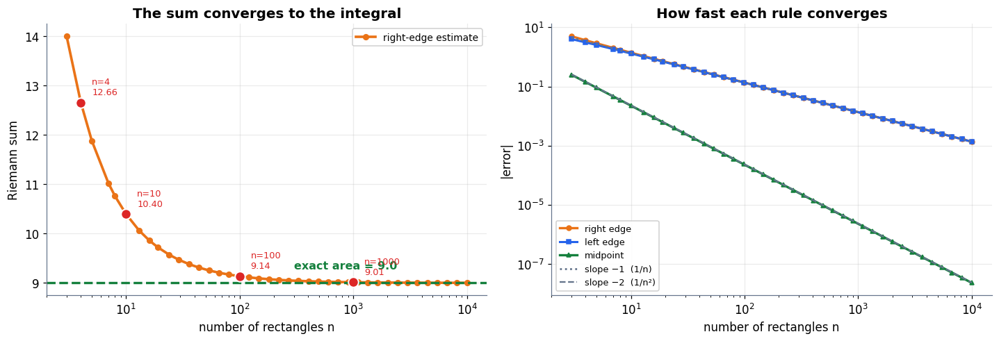

### Cell 95

```python
# ============================================================
#  The Fundamental Theorem, checked in both directions
# ============================================================
xq = sp.Symbol("x")
F = xq ** 3 / 3

print("Claim: F(x) = x³/3 is an antiderivative of f(x) = x²")
print(f"  d/dx (x³/3) = {sp.diff(F, xq)}      <- yes, it gives back x²")
print()
val = float(F.subs(xq, 3) - F.subs(xq, 0))
print(f"F(3) − F(0) = {sp.nsimplify(F.subs(xq, 3))} − {sp.nsimplify(F.subs(xq, 0))} = {val:g}")
print(f"sympy integrate(x², (x, 0, 3)) = {sp.integrate(xq ** 2, (xq, 0, 3))}")
print(f"a million-rectangle midpoint sum = {riemann(g, 0, 3, 1000000, 'mid')[0]:.10f}")
print()
print("Three routes — antiderivative, symbolic integration, brute-force summation —")
print("and they agree. The theorem is not a shortcut that trades away accuracy.")
print()
for lo, hi in [(0, 1), (1, 2), (0, 3), (-2, 2)]:
    exact = float(F.subs(xq, hi) - F.subs(xq, lo))
    num, _, _ = riemann(g, lo, hi, 200000, "mid")
    print(f"  ∫ x² dx from {lo:>3} to {hi:>2} :  F(b)−F(a) = {exact:>9.5f}"
          f"   rectangles = {num:>9.5f}")
```

**Output**

```text
Claim: F(x) = x³/3 is an antiderivative of f(x) = x²
  d/dx (x³/3) = x**2      <- yes, it gives back x²

F(3) − F(0) = 9 − 0 = 9
sympy integrate(x², (x, 0, 3)) = 9
a million-rectangle midpoint sum = 9.0000000000

Three routes — antiderivative, symbolic integration, brute-force summation —
and they agree. The theorem is not a shortcut that trades away accuracy.

  ∫ x² dx from   0 to  1 :  F(b)−F(a) =   0.33333   rectangles =   0.33333
  ∫ x² dx from   1 to  2 :  F(b)−F(a) =   2.33333   rectangles =   2.33333
  ∫ x² dx from   0 to  3 :  F(b)−F(a) =   9.00000   rectangles =   9.00000
  ∫ x² dx from  -2 to  2 :  F(b)−F(a) =   5.33333   rectangles =   5.33333
```

### Cell 98

```python
# ============================================================
#  Probability = area. Measured on a Gaussian.
# ============================================================
def gauss(x, mu=0.0, sd=1.0):
    return np.exp(-0.5 * ((x - mu) / sd) ** 2) / (sd * np.sqrt(2 * np.pi))

def area(fn, lo, hi, n=400000):
    """Midpoint Riemann sum — the definition, with small enough rectangles."""
    dx_ = (hi - lo) / n
    return float(fn(lo + dx_ * (np.arange(n) + 0.5)).sum() * dx_)

print("Standard normal, everything by adding up rectangles")
print("=" * 62)
print(f"  total area  ∫ f over [−12, 12]     = {area(gauss, -12, 12):.10f}")
print(f"  P(−1 ≤ X ≤ 1)                      = {area(gauss, -1, 1):.6f}   (the 68% rule)")
print(f"  P(−2 ≤ X ≤ 2)                      = {area(gauss, -2, 2):.6f}   (the 95% rule)")
print(f"  P(−3 ≤ X ≤ 3)                      = {area(gauss, -3, 3):.6f}")
print()
for w in [1e-2, 1e-4, 1e-6, 0.0]:
    print(f"  P(0 ≤ X ≤ {w:g})".ljust(38) + f"= {area(gauss, 0, 0 + w, 2000) if w else 0.0:.12f}")
print("  -> the probability of ONE exact value is the limit of that column: zero.")
print()
x_s = sp.Symbol("x")
pdf_s = sp.exp(-x_s ** 2 / 2) / sp.sqrt(2 * sp.pi)
print(f"  sympy, symbolically: ∫ f(x) dx over all x = "
      f"{sp.integrate(pdf_s, (x_s, -sp.oo, sp.oo))}")

# ============================================================
#  Figure: area is the probability; height is not
# ============================================================
fig, (ax1, ax2) = plt.subplots(1, 2, figsize=(13.2, 4.6))

xs = np.linspace(-4, 4, 800)
ax1.plot(xs, gauss(xs), color=C_MODEL, lw=2.8)
band = (xs >= -1) & (xs <= 1)
ax1.fill_between(xs[band], 0, gauss(xs[band]), color=C_DATA, alpha=0.45)
ax1.fill_between(xs[xs <= -1], 0, gauss(xs[xs <= -1]), color=C_GREY, alpha=0.18)
ax1.fill_between(xs[xs >= 1], 0, gauss(xs[xs >= 1]), color=C_GREY, alpha=0.18)
ax1.annotate(f"$P(-1 \\leq X \\leq 1) = \\int_{{-1}}^{{1}} f = {area(gauss,-1,1):.3f}$",
             xy=(0, 0.16), xytext=(1.25, 0.32), fontsize=10.5, color=C_DATA,
             fontweight="bold", arrowprops=dict(arrowstyle="->", color=C_DATA, lw=1.7))
ax1.axvline(0.7, color=C_ERR, lw=2.0, ls="--")
ax1.annotate("a single point:\nzero width, zero area,\nprobability 0",
             xy=(0.7, 0.05), xytext=(-3.85, 0.30), fontsize=9.2, color=C_ERR,
             fontweight="bold", arrowprops=dict(arrowstyle="->", color=C_ERR, lw=1.6))
ax1.set_ylim(0, 0.46)
tidy(ax1, "x", "density f(x)", "Probability is the shaded AREA, not the height")

for w, col in [(2.0, C_DATA), (1.0, C_MODEL), (0.5, C_ERR)]:
    h = 1.0 / w
    ax2.plot([0, 0, w, w], [0, h, h, 0], color=col, lw=2.6,
             label=f"Uniform[0, {w:g}]:  height {h:g},  area {w*h:g}")
    ax2.fill_between([0, w], 0, h, color=col, alpha=0.13)
    ax2.text(w / 2, h + 0.08, f"{h:g}", ha="center", color=col, fontsize=10,
             fontweight="bold")
ax2.axhline(1.0, color=C_GREY, ls=":", lw=1.8)
ax2.text(2.05, 1.06, "height = 1", color=C_GREY, fontsize=9)
xs2 = np.linspace(-0.6, 2.6, 600)
ax2.plot(xs2, gauss(xs2, 1.0, 0.18), color=C_TRUE, lw=2.4,
         label="Normal(1, σ=0.18):  peak ≈ 2.2")
ax2.set_ylim(0, 2.6)
tidy(ax2, "x", "density f(x)", "A density may exceed 1 — only the AREA is fixed",
     legend=True)
ax2.legend(fontsize=8.4, loc="upper right")
plt.tight_layout(); plt.show()

print(f"Uniform[0, 0.5] must be {1/0.5:g} tall to enclose area 1.")
print(f"Normal(1, 0.18) peaks at {gauss(1.0, 1.0, 0.18):.4f} — well above 1 —")
print(f"and its total area is still {area(lambda t: gauss(t, 1.0, 0.18), -3, 5):.8f}.")
```

**Output**

```text
Standard normal, everything by adding up rectangles
==============================================================
  total area  ∫ f over [−12, 12]     = 1.0000000000
  P(−1 ≤ X ≤ 1)                      = 0.682689   (the 68% rule)
  P(−2 ≤ X ≤ 2)                      = 0.954500   (the 95% rule)
  P(−3 ≤ X ≤ 3)                      = 0.997300

  P(0 ≤ X ≤ 0.01)                     = 0.003989356315
  P(0 ≤ X ≤ 0.0001)                   = 0.000039894228
  P(0 ≤ X ≤ 1e-06)                    = 0.000000398942
  P(0 ≤ X ≤ 0)                        = 0.000000000000
  -> the probability of ONE exact value is the limit of that column: zero.

  sympy, symbolically: ∫ f(x) dx over all x = 1
```

**Output**

```text
<Figure size 1452x506 with 2 Axes>
```

**Figure**

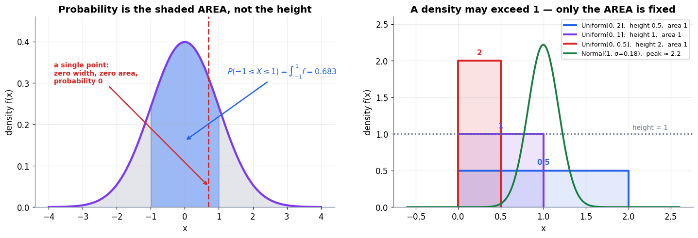

**Output**

```text
Uniform[0, 0.5] must be 2 tall to enclose area 1.
Normal(1, 0.18) peaks at 2.2163 — well above 1 —
and its total area is still 1.00000000.
```

### Cell 101

```python
# ============================================================
#  Expected value, discrete and continuous, four ways each
# ============================================================
print("DISCRETE — a fair six-sided die")
print("=" * 62)
faces = np.arange(1, 7)
probs = np.full(6, 1 / 6)
print(f"  Σ x·P(x) = {(faces * probs).sum():.6f}")
print(f"  simulated mean of 400,000 rolls = "
      f"{rng.integers(1, 7, 400_000).mean():.6f}")
print()

print("CONTINUOUS — Uniform on [0, 2],  f(x) = 0.5")
print("=" * 62)
def unif_pdf(x, lo=0.0, hi=2.0):
    return np.where((x >= lo) & (x <= hi), 1.0 / (hi - lo), 0.0)

print(f"  total area  ∫ f dx                 = {area(unif_pdf, -1, 3):.8f}   (valid PDF)")
print(f"  E[X] = ∫ x·f(x) dx  by rectangles  = "
      f"{area(lambda t: t * unif_pdf(t), 0, 2):.8f}")
print(f"  E[X] by sympy                      = "
      f"{sp.integrate(xq * sp.Rational(1, 2), (xq, 0, 2))}")
print(f"  E[X] by hand: 0.5·[x²/2] from 0 to 2 = 0.5·2 = 1.0")
print(f"  simulated mean of 400,000 draws    = "
      f"{rng.uniform(0, 2, 400_000).mean():.6f}")
print()
print("Four independent routes to 1.0: symbolic, numeric, algebraic, empirical.")
```

**Output**

```text
DISCRETE — a fair six-sided die
==============================================================
  Σ x·P(x) = 3.500000
  simulated mean of 400,000 rolls = 3.503235

CONTINUOUS — Uniform on [0, 2],  f(x) = 0.5
==============================================================
  total area  ∫ f dx                 = 1.00000000   (valid PDF)
  E[X] = ∫ x·f(x) dx  by rectangles  = 1.00000000
  E[X] by sympy                      = 1
  E[X] by hand: 0.5·[x²/2] from 0 to 2 = 0.5·2 = 1.0
  simulated mean of 400,000 draws    = 0.999088

Four independent routes to 1.0: symbolic, numeric, algebraic, empirical.
```

### Cell 102

```python
# ============================================================
#  Figure: expectation as the balance point
# ============================================================
fig, (ax1, ax2) = plt.subplots(1, 2, figsize=(13.2, 4.4))

ax1.bar(faces, probs, width=0.55, color=C_DATA, alpha=0.85, edgecolor="white")
for f_, p_ in zip(faces, probs):
    ax1.text(f_, p_ + 0.006, f"{f_}×{p_:.3f}", ha="center", fontsize=8.2, color=C_GREY)
ax1.axvline(3.5, color=C_ERR, lw=2.4, ls="--")
ax1.plot([3.5], [-0.012], marker="^", ms=16, color=C_ERR, clip_on=False)
ax1.text(3.62, 0.15, "E[X] = Σ x·P(x) = 3.5\nthe balance point", color=C_ERR,
         fontsize=10, fontweight="bold")
ax1.set_ylim(0, 0.22)
tidy(ax1, "outcome x", "P(x)", "Discrete: a sum over outcomes")

xs3 = np.linspace(-0.6, 2.6, 700)
ax2.plot(xs3, unif_pdf(xs3), color=C_MODEL, lw=2.8)
ax2.fill_between(xs3, 0, unif_pdf(xs3), color=C_MODEL, alpha=0.16)
ax2.axvline(1.0, color=C_ERR, lw=2.4, ls="--")
ax2.plot([1.0], [-0.03], marker="^", ms=16, color=C_ERR, clip_on=False)
ax2.text(1.1, 0.30, "E[X] = ∫ x·f(x) dx = 1.0\nthe same balance point",
         color=C_ERR, fontsize=10, fontweight="bold")
strip_x = np.linspace(0.05, 1.95, 20)
for sx in strip_x:
    ax2.plot([sx, sx], [0, 0.5], color=C_MODEL, lw=0.8, alpha=0.55)
ax2.text(0.35, 0.06, "each thin strip contributes  x · f(x) · dx",
         fontsize=8.6, color=C_GREY)
ax2.set_ylim(0, 0.62)
tidy(ax2, "x", "density f(x)", "Continuous: an integral over the density")
plt.tight_layout(); plt.show()
```

**Output**

```text
<Figure size 1452x484 with 2 Axes>
```

**Figure**

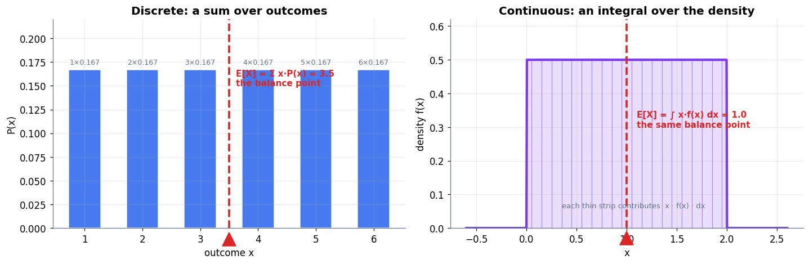

### Cell 105

```python
# ============================================================
#  loss.mean() vs the integral it approximates
# ============================================================
# Setup with a KNOWN answer: x ~ N(0,1), truth y = 2x, model ŷ = 1.5x.
# Per-example loss  ℓ(x) = (1.5x − 2x)² = 0.25 x² ,  so
#     true expected loss = 0.25 · E[x²] = 0.25 · 1 = 0.25  exactly.
def per_example_loss(x):
    return (1.5 * x - 2.0 * x) ** 2

TRUE_EXPECTED_LOSS = 0.25
print("The integral we cannot normally compute — but here we can:")
print(f"  ∫ ℓ(x)·f(x) dx  by rectangles = "
      f"{area(lambda t: per_example_loss(t) * gauss(t), -12, 12):.10f}")
print(f"  by sympy                      = "
      f"{sp.integrate(sp.Rational(1,4) * xq**2 * sp.exp(-xq**2/2) / sp.sqrt(2*sp.pi), (xq, -sp.oo, sp.oo))}")
print(f"  exact                         = {TRUE_EXPECTED_LOSS}")
print()

print("Now the thing we actually do: average over a finite batch.")
print("=" * 78)
print(f"{'batch size N':>14}{'loss.mean() (5 draws)':>46}{'spread':>13}")
print("-" * 78)
sizes = [4, 16, 64, 256, 1024, 4096]
spread = []
for N in sizes:
    draws = [per_example_loss(rng.standard_normal(N)).mean() for _ in range(400)]
    spread.append(np.std(draws))
    shown_ = "  ".join(f"{d:6.3f}" for d in draws[:5])
    print(f"{N:>14}{shown_:>46}{np.std(draws):>13.4f}")
print("-" * 78)
print(f"true value being estimated : {TRUE_EXPECTED_LOSS}")
print(f"spread shrinks by a factor of {spread[0]/spread[-1]:.1f} as N grows "
      f"{sizes[-1]//sizes[0]}× — and √{sizes[-1]//sizes[0]} = {np.sqrt(sizes[-1]/sizes[0]):.1f}")
```

**Output**

```text
The integral we cannot normally compute — but here we can:
  ∫ ℓ(x)·f(x) dx  by rectangles = 0.2500000000
  by sympy                      = 1/4
  exact                         = 0.25

Now the thing we actually do: average over a finite batch.
==============================================================================
  batch size N                         loss.mean() (5 draws)       spread
------------------------------------------------------------------------------
             4         0.096   0.089   0.019   0.064   0.157       0.1782
            16         0.191   0.268   0.236   0.274   0.311       0.0850
            64         0.250   0.229   0.300   0.257   0.256       0.0432
           256         0.250   0.251   0.276   0.242   0.250       0.0228
          1024         0.239   0.245   0.249   0.247   0.270       0.0117
          4096         0.249   0.250   0.252   0.256   0.253       0.0052
------------------------------------------------------------------------------
true value being estimated : 0.25
spread shrinks by a factor of 34.0 as N grows 1024× — and √1024 = 32.0
```

### Cell 106

```python
# ============================================================
#  Figure: the batch mean as a noisy measurement of an integral
# ============================================================
fig, (ax1, ax2) = plt.subplots(1, 2, figsize=(13.2, 4.6))

for N, col, off in [(8, C_ERR, 0), (64, C_PRED, 1), (1024, C_TRUE, 2)]:
    draws = np.array([per_example_loss(rng.standard_normal(N)).mean() for _ in range(3000)])
    ax1.hist(draws, bins=70, range=(0, 0.75), alpha=0.55, color=col, density=True,
             label=f"batch N = {N}   (sd {draws.std():.3f})")
ax1.axvline(TRUE_EXPECTED_LOSS, color=C_MODEL, lw=2.6, ls="--")
ax1.text(0.27, 9.0, "the true expected loss\n∫ ℓ(x)f(x)dx = 0.25", color=C_MODEL,
         fontsize=9.6, fontweight="bold")
tidy(ax1, "value returned by loss.mean()", "how often",
     "Every batch loss is an estimate, not the truth", legend=True)
ax1.legend(fontsize=8.6)

ax2.loglog(sizes, spread, "o-", color=C_MODEL, lw=2.6, ms=7,
           label="measured spread of loss.mean()")
ax2.loglog(sizes, spread[0] * (np.array(sizes) / sizes[0]) ** -0.5, ls=":",
           color=C_GREY, lw=2.0, label="slope −1/2   (1/√N)")
ax2.loglog(sizes, spread[0] * (np.array(sizes) / sizes[0]) ** -1.0, ls="--",
           color=C_ERR, lw=1.6, label="slope −1   (rectangles, for contrast)")
tidy(ax2, "batch size N", "standard deviation of the estimate",
     "Sampling buys accuracy slowly — but it buys it in any dimension", legend=True)
ax2.legend(fontsize=8.6, loc="lower left")
plt.tight_layout(); plt.show()
```

**Output**

```text
<Figure size 1452x506 with 2 Axes>
```

**Figure**

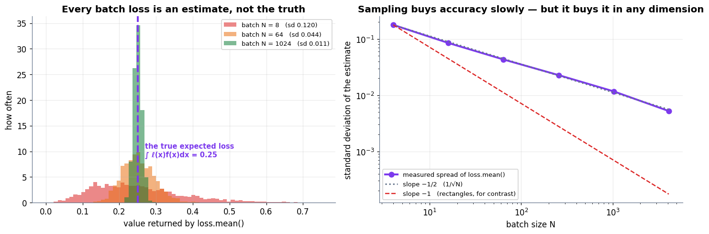

### Cell 111

```python
# ============================================================
#  CAPSTONE — the four-beat loop, assembled from four notebooks
# ============================================================
# ---- BEAT 1 · DATA (notebook 3: two known Gaussian densities) --------
MU0, MU1, SD = np.array([-1.0, 0.0]), np.array([1.0, 0.6]), 0.8

def sample(n, seed):
    r = np.random.default_rng(seed)
    n0 = n // 2
    X0 = MU0[:, None] + SD * r.standard_normal((2, n0))
    X1 = MU1[:, None] + SD * r.standard_normal((2, n - n0))
    X = np.hstack([X0, X1])
    Y = np.hstack([np.zeros(n0), np.ones(n - n0)]).reshape(1, -1)
    idx = r.permutation(X.shape[1])
    return X[:, idx], Y[:, idx]

X_tr, Y_tr = sample(600, seed=21)
X_te, Y_te = sample(600, seed=99)          # a test set the model never trains on

# ---- the ceiling: Bayes error, by integration (part 6) ---------------
d_sep = np.linalg.norm(MU1 - MU0) / SD
Phi = lambda t: area(gauss, -12, t, 200000)          # our own normal CDF
bayes_err = Phi(-d_sep / 2)

print("BEAT 1 · DATA")
print("=" * 62)
print(f"  class 0 ~ N({MU0}, {SD}²I)   class 1 ~ N({MU1}, {SD}²I)")
print(f"  train {X_tr.shape[1]} points, test {X_te.shape[1]} points")
print(f"  separation d = ||μ1 − μ0|| / σ = {d_sep:.4f}")
print(f"  Bayes error   = Φ(−d/2) = Φ({-d_sep/2:.4f}) = {bayes_err:.4f}")
print(f"  CEILING on accuracy for ANY model = {100*(1-bayes_err):.2f}%")

# ---- BEATS 2-4 · MODEL, LOSS, UPDATE (notebooks 2 and 4) ------------
cap = Net([2, 12, 12, 1], seed=5)
eta_c, EP = 0.5, 3000
tr_hist, te_hist = [], []
for e in range(EP + 1):
    tr_hist.append(cap.loss(X_tr, Y_tr))       # LOSS   (notebook 3 + §6.6)
    te_hist.append(cap.loss(X_te, Y_te))
    cap.step(X_tr, Y_tr, eta_c)                # UPDATE (backprop, part 5)

X_big, Y_big = sample(20000, seed=123)      # a big set, to measure accuracy precisely
acc_tr = ((cap.predict(X_tr) > 0.5) == (Y_tr > 0.5)).mean()
acc_te = ((cap.predict(X_te) > 0.5) == (Y_te > 0.5)).mean()
acc_big = ((cap.predict(X_big) > 0.5) == (Y_big > 0.5)).mean()
# what the Bayes-optimal rule itself scores on that same sample
bayes_pred = (((X_big - MU1[:, None]) ** 2).sum(0)
              < ((X_big - MU0[:, None]) ** 2).sum(0)).astype(float)
acc_bayes = (bayes_pred == Y_big.ravel()).mean()

def se(acc, n):
    return np.sqrt(acc * (1 - acc) / n)

print()
print("BEATS 2-4 · MODEL, LOSS, UPDATE")
print("=" * 62)
print(f"  architecture {cap.sizes},  "
      f"{sum(w.size for w in cap.W) + sum(b.size for b in cap.b)} parameters")
print(f"  loss  train {tr_hist[0]:.4f} -> {tr_hist[-1]:.4f} | "
      f"test {te_hist[0]:.4f} -> {te_hist[-1]:.4f}")
print()
print(f"  accuracy, train (600)          {100*acc_tr:6.2f}%")
print(f"  accuracy, test  (600)          {100*acc_te:6.2f}%  ± {100*se(acc_te, 600):.2f}")
print(f"  accuracy, test  (20,000)       {100*acc_big:6.2f}%  ± {100*se(acc_big, 20000):.2f}")
print(f"  the Bayes ceiling              {100*(1-bayes_err):6.2f}%")
print(f"  the Bayes RULE on those 20,000 {100*acc_bayes:6.2f}%  "
      f"± {100*se(acc_bayes, 20000):.2f}")
print()
print(f"Note the 600-point test score of {100*acc_te:.2f}% sits ABOVE the ceiling.")
print(f"That is not a miracle: its standard error is ±{100*se(acc_te,600):.2f} points, so a")
print("finite sample can flatter a model by more than a point. Measure on 20,000")
print(f"and it falls to {100*acc_big:.2f}%, just under the ceiling — where it belongs.")
print("The perfect rule itself scores above the ceiling on that sample, for the")
print("same reason. A ceiling is a statement about the distribution, not a sample.")
```

**Output**

```text
BEAT 1 · DATA
==============================================================
  class 0 ~ N([-1.  0.], 0.8²I)   class 1 ~ N([1.  0.6], 0.8²I)
  train 600 points, test 600 points
  separation d = ||μ1 − μ0|| / σ = 2.6101
  Bayes error   = Φ(−d/2) = Φ(-1.3050) = 0.0959
  CEILING on accuracy for ANY model = 90.41%

BEATS 2-4 · MODEL, LOSS, UPDATE
==============================================================
  architecture [2, 12, 12, 1],  205 parameters
  loss  train 0.3888 -> 0.1459 | test 0.4146 -> 0.2486

  accuracy, train (600)           93.17%
  accuracy, test  (600)           91.00%  ± 1.17
  accuracy, test  (20,000)        90.22%  ± 0.21
  the Bayes ceiling               90.41%
  the Bayes RULE on those 20,000  90.45%  ± 0.21

Note the 600-point test score of 91.00% sits ABOVE the ceiling.
That is not a miracle: its standard error is ±1.17 points, so a
finite sample can flatter a model by more than a point. Measure on 20,000
and it falls to 90.22%, just under the ceiling — where it belongs.
The perfect rule itself scores above the ceiling on that sample, for the
same reason. A ceiling is a statement about the distribution, not a sample.
```

### Cell 112

```python
# ============================================================
#  Figure: the capstone, three ways
# ============================================================
fig = plt.figure(figsize=(13.6, 4.6))
gs = fig.add_gridspec(1, 3, width_ratios=[1.15, 1, 0.9], wspace=0.28)

ax1 = fig.add_subplot(gs[0])
gx3, gy3 = np.meshgrid(np.linspace(-3.6, 3.6, 240), np.linspace(-3.0, 3.4, 240))
grid3 = np.stack([gx3.ravel(), gy3.ravel()])
prob = cap.predict(grid3).reshape(gx3.shape)
ax1.contourf(gx3, gy3, prob, levels=np.linspace(0, 1, 21), cmap="coolwarm", alpha=0.55)
ax1.contour(gx3, gy3, prob, levels=[0.5], colors="k", linewidths=2.4)
# the Bayes-optimal boundary: equal densities <=> the perpendicular bisector
mid, direc = (MU0 + MU1) / 2, (MU1 - MU0)
tvals = np.linspace(-4, 4, 2)
ax1.plot(mid[0] - direc[1] * tvals, mid[1] + direc[0] * tvals,
         color=C_TRUE, lw=2.6, ls="--")
m0 = (Y_te.ravel() == 0)
ax1.scatter(X_te[0, m0], X_te[1, m0], s=12, color=C_DATA, alpha=0.75)
ax1.scatter(X_te[0, ~m0], X_te[1, ~m0], s=12, color=C_ERR, alpha=0.75)
ax1.set_xlim(-3.6, 3.6); ax1.set_ylim(-3.0, 3.4)
ax1.text(-3.4, 3.0, "green dashed = Bayes-optimal\nblack = what we learned",
         fontsize=8.8, fontweight="bold", color="#0F172A")
tidy(ax1, "feature 1", "feature 2", "Learned boundary vs the best possible one")

ax2 = fig.add_subplot(gs[1])
ax2.plot(tr_hist, color=C_MODEL, lw=2.4, label="train loss")
ax2.plot(te_hist, color=C_PRED, lw=2.4, label="test loss")
ax2.axhline(min(te_hist), color=C_TRUE, ls=":", lw=1.6)
ax2.annotate(f"best test loss {min(te_hist):.3f}\nat epoch {int(np.argmin(te_hist))}",
             xy=(np.argmin(te_hist), min(te_hist)),
             xytext=(EP * 0.35, min(te_hist) + 0.09), fontsize=8.8, color=C_TRUE,
             fontweight="bold", arrowprops=dict(arrowstyle="->", color=C_TRUE, lw=1.5))
tidy(ax2, "epoch", "binary cross-entropy", "Train falls; test bottoms out", legend=True)
ax2.legend(fontsize=9)

ax3 = fig.add_subplot(gs[2])
labels = ["train\n600", "test\n600", "test\n20,000", "Bayes\nceiling"]
vals = [100 * acc_tr, 100 * acc_te, 100 * acc_big, 100 * (1 - bayes_err)]
errs = [100 * se(acc_tr, 600), 100 * se(acc_te, 600), 100 * se(acc_big, 20000), 0]
bars = ax3.bar(labels, vals, yerr=errs, capsize=4,
               color=[C_MODEL, C_PRED, C_DATA, C_TRUE], alpha=0.9)
for b, v in zip(bars, vals):
    ax3.text(b.get_x() + b.get_width() / 2, v + 1.0, f"{v:.1f}", ha="center",
             fontsize=9.4, fontweight="bold")
ax3.axhline(100 * (1 - bayes_err), color=C_TRUE, ls="--", lw=1.8)
ax3.set_ylim(84, 97)
ax3.tick_params(axis="x", labelsize=8.4)
tidy(ax3, "", "accuracy (%)", "Measured against the ceiling")
plt.show()
```

**Output**

```text
<Figure size 1496x506 with 3 Axes>
```

**Figure**

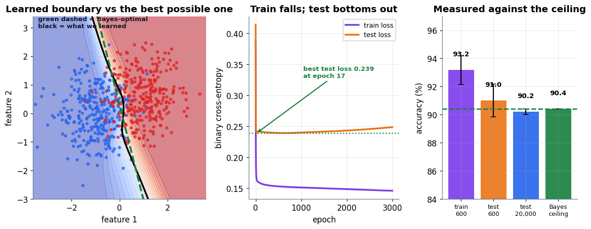

### Cell 116

```python
# ============================================================
#  XOR: one neuron cannot; one hidden layer can
# ============================================================
X_xor = np.array([[0., 0., 1., 1.],
                  [0., 1., 0., 1.]])
Y_xor = np.array([[0., 1., 1., 0.]])

flat = Net([2, 1], seed=0)          # a perceptron: no hidden layer
deep = Net([2, 4, 1], seed=0)       # one hidden layer of four units
for _ in range(6000):
    flat.step(X_xor, Y_xor, 1.0)
    deep.step(X_xor, Y_xor, 1.0)

print("XOR — the function that ended the first AI spring")
print("=" * 68)
print(f"{'input':>12}{'target':>9}{'no hidden layer':>19}{'one hidden layer':>20}")
print("-" * 68)
for i in range(4):
    print(f"{str(X_xor[:, i].astype(int)):>12}{int(Y_xor[0, i]):>9}"
          f"{flat.predict(X_xor)[0, i]:>19.4f}{deep.predict(X_xor)[0, i]:>20.4f}")
print("-" * 68)
for name, m in [("no hidden layer", flat), ("one hidden layer", deep)]:
    a = ((m.predict(X_xor) > 0.5) == (Y_xor > 0.5)).mean()
    print(f"  {name:<18} loss {m.loss(X_xor, Y_xor):.4f}   accuracy {100*a:5.1f}%")
print()
print(f"The flat model converges to log 2 = {np.log(2):.4f} and outputs 0.5 for")
print("everything: unable to separate the classes, it hedges perfectly. Note that")
print("even the BEST single line would only get 3 of the 4 points (75%) — gradient")
print("descent does not even find that, because the symmetric hedge has lower loss.")
```

**Output**

```text
XOR — the function that ended the first AI spring
====================================================================
       input   target    no hidden layer    one hidden layer
--------------------------------------------------------------------
       [0 0]        0             0.5000              0.0001
       [0 1]        1             0.5000              0.9998
       [1 0]        1             0.5000              0.9998
       [1 1]        0             0.5000              0.0002
--------------------------------------------------------------------
  no hidden layer    loss 0.6931   accuracy  50.0%
  one hidden layer   loss 0.0002   accuracy 100.0%

The flat model converges to log 2 = 0.6931 and outputs 0.5 for
everything: unable to separate the classes, it hedges perfectly. Note that
even the BEST single line would only get 3 of the 4 points (75%) — gradient
descent does not even find that, because the symmetric hedge has lower loss.
```

### Cell 117

```python
# ============================================================
#  Figure: one line cannot; two can
# ============================================================
fig, axes = plt.subplots(1, 2, figsize=(12.4, 4.6))
gxo, gyo = np.meshgrid(np.linspace(-0.45, 1.45, 260), np.linspace(-0.45, 1.45, 260))
grid_o = np.stack([gxo.ravel(), gyo.ravel()])

for ax, m, title in [(axes[0], flat, "Perceptron (1958): one line, no hope"),
                     (axes[1], deep, "One hidden layer: the boundary bends")]:
    p = m.predict(grid_o).reshape(gxo.shape)
    ax.contourf(gxo, gyo, p, levels=np.linspace(0, 1, 21), cmap="coolwarm", alpha=0.7)
    ax.contour(gxo, gyo, p, levels=[0.5], colors="k", linewidths=2.4)
    for i in range(4):
        col = C_ERR if Y_xor[0, i] == 1 else C_DATA
        ax.scatter([X_xor[0, i]], [X_xor[1, i]], s=320, color=col, zorder=6,
                   edgecolor="white", lw=2.4)
        ax.text(X_xor[0, i], X_xor[1, i] - 0.19, f"{int(Y_xor[0, i])}", ha="center",
                fontsize=12, fontweight="bold", color=col)
    acc = ((m.predict(X_xor) > 0.5) == (Y_xor > 0.5)).mean()
    ax.set_title(f"{title}\naccuracy {100*acc:.0f}%   loss {m.loss(X_xor, Y_xor):.4f}",
                 fontsize=11)
    ax.set_xticks([0, 1]); ax.set_yticks([0, 1])
    ax.set_xlabel("input A"); ax.set_ylabel("input B")
plt.tight_layout(); plt.show()
```

**Output**

```text
<Figure size 1364x506 with 2 Axes>
```

**Figure**

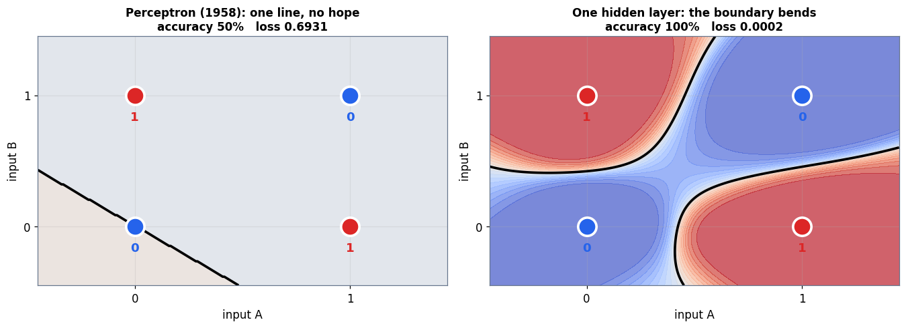

### Cell 120

```python
# ============================================================
#  Same arithmetic, one lane at a time vs many lanes at once
# ============================================================
import time
n_dim = 1000
Amat = rng.standard_normal((n_dim, n_dim))
vvec = rng.standard_normal(n_dim)

t0 = time.perf_counter(); fast = Amat @ vvec; t_fast = time.perf_counter() - t0

t0 = time.perf_counter()
slow = np.zeros(n_dim)
for i in range(n_dim):                      # one output entry at a time...
    acc = 0.0
    for j in range(n_dim):                  # ...one multiply-add at a time
        acc += Amat[i, j] * vvec[j]
    slow[i] = acc
t_slow = time.perf_counter() - t0

print(f"A is {n_dim}×{n_dim}, v is {n_dim} long")
print(f"multiply-adds performed by BOTH methods : {n_dim * n_dim:,}")
print("=" * 64)
print(f"  Python loop, one lane at a time : {t_slow:8.4f} s")
print(f"  vectorised (BLAS under NumPy)   : {t_fast:8.6f} s")
print(f"  speed-up                        : {t_slow / t_fast:8.0f}×")
print(f"  same answer?  max difference    : {np.abs(fast - slow).max():.2e}")
print()
print("Identical arithmetic, identical result, three orders of magnitude apart.")
print("A GPU applies the same idea with thousands of lanes instead of a handful —")
print("which is why the maths that stalled in the 1990s flew in 2012.")
```

**Output**

```text
A is 1000×1000, v is 1000 long
multiply-adds performed by BOTH methods : 1,000,000
================================================================
  Python loop, one lane at a time :   0.6285 s
  vectorised (BLAS under NumPy)   : 0.000925 s
  speed-up                        :      679×
  same answer?  max difference    : 2.13e-13

Identical arithmetic, identical result, three orders of magnitude apart.
A GPU applies the same idea with thousands of lanes instead of a handful —
which is why the maths that stalled in the 1990s flew in 2012.
```

### Cell 122

```python
# ============================================================
#  Scaling laws: the linear reading vs the actual power law
# ============================================================
N_pts = np.array([1e9, 1e10, 1e11, 1e12])
book_L = np.array([2.0, 1.7, 1.4, 1.1])        # "0.3 per decade"

# Fit L = L_inf + (C/N)^p through the FIRST TWO points, with a floor L_inf = 0.7.
L_INF = 0.7
# require L(1e9) = 2.0 and L(1e10) = 1.7  ->  (C/1e10)^p = 1.0 -> C = 1e10
C_fit = 1e10
p_fit = np.log10((2.0 - L_INF) / (1.7 - L_INF))     # 10^p = 1.3
law = lambda N: L_INF + (C_fit / N) ** p_fit

print(f"fitted power law:  L(N) = {L_INF} + (1e10 / N)^{p_fit:.4f}")
print("=" * 74)
print(f"{'parameters N':>16}{'book (0.3/decade)':>22}{'power law':>14}{'difference':>14}")
print("-" * 74)
for Nv, bl in zip(N_pts, book_L):
    print(f"{Nv:>16.0e}{bl:>22.2f}{law(Nv):>14.4f}{law(Nv) - bl:>14.4f}")
print("-" * 74)
print("The two agree exactly where the law was fitted and diverge as N grows:")
print("the power law's per-decade drops shrink (0.300, 0.231, 0.177, ...) because")
print("it is bending toward the floor, while the straight-line reading never bends.")
prev = law(1e9)
for k in range(1, 5):
    nxt = law(1e9 * 10 ** k)
    print(f"    decade {k}:  {prev:.4f} -> {nxt:.4f}   drop {prev - nxt:.4f}")
    prev = nxt
print()
print(f"Extended far enough, the straight line reaches zero loss at N = "
      f"1e{9 + 2.0/0.3:.1f}, which is impossible; the power law never gets below "
      f"{L_INF}.")
```

**Output**

```text
fitted power law:  L(N) = 0.7 + (1e10 / N)^0.1139
==========================================================================
    parameters N     book (0.3/decade)     power law    difference
--------------------------------------------------------------------------
           1e+09                  2.00        2.0000        0.0000
           1e+10                  1.70        1.7000        0.0000
           1e+11                  1.40        1.4692        0.0692
           1e+12                  1.10        1.2917        0.1917
--------------------------------------------------------------------------
The two agree exactly where the law was fitted and diverge as N grows:
the power law's per-decade drops shrink (0.300, 0.231, 0.177, ...) because
it is bending toward the floor, while the straight-line reading never bends.
    decade 1:  2.0000 -> 1.7000   drop 0.3000
    decade 2:  1.7000 -> 1.4692   drop 0.2308
    decade 3:  1.4692 -> 1.2917   drop 0.1775
    decade 4:  1.2917 -> 1.1552   drop 0.1365

Extended far enough, the straight line reaches zero loss at N = 1e15.7, which is impossible; the power law never gets below 0.7.
```

### Cell 123

```python
# ============================================================
#  Figure: why labs plot scaling laws on log-log axes
# ============================================================
fig, (ax1, ax2) = plt.subplots(1, 2, figsize=(13.2, 4.6))

Ns = np.logspace(8.5, 14, 300)
ax1.semilogx(Ns, law(Ns), color=C_MODEL, lw=2.8, label="power law  $L_\\infty + (C/N)^p$")
ax1.semilogx(Ns, 2.0 - 0.3 * np.log10(Ns / 1e9), color=C_PRED, lw=2.0, ls="--",
             label="constant 0.3 per decade")
ax1.scatter(N_pts, book_L, s=95, color=C_ERR, zorder=6, edgecolor="white", lw=1.4,
            label="the book's four numbers")
ax1.axhline(L_INF, color=C_TRUE, ls=":", lw=2.0)
ax1.text(2e8, L_INF + 0.06, "$L_\\infty$ — the floor you never beat", color=C_TRUE,
         fontsize=9.6, fontweight="bold")
ax1.set_ylim(0.3, 2.4)
tidy(ax1, "parameters N", "loss L", "Raw axes: the bend is visible", legend=True)
ax1.legend(fontsize=8.4, loc="upper right")

excess = law(Ns) - L_INF
ax2.loglog(Ns, excess, color=C_MODEL, lw=3.0, label="$L - L_\\infty$")
ax2.loglog(N_pts, law(N_pts) - L_INF, "o", color=C_ERR, ms=9, zorder=6,
           markeredgecolor="white", markeredgewidth=1.3)
slope = np.log(excess[-1] / excess[0]) / np.log(Ns[-1] / Ns[0])
ax2.text(3e9, 0.42, f"a perfectly straight line\nmeasured slope = {slope:+.4f}\n"
                    f"(the exponent −p = {-p_fit:+.4f})",
         fontsize=9.6, color=C_MODEL, fontweight="bold")
tidy(ax2, "parameters N", "excess loss  $L - L_\\infty$",
     "Log-log axes: a power law becomes a ruler", legend=True)
ax2.legend(fontsize=9)
plt.tight_layout(); plt.show()
```

**Output**

```text
<Figure size 1452x506 with 2 Axes>
```

**Figure**

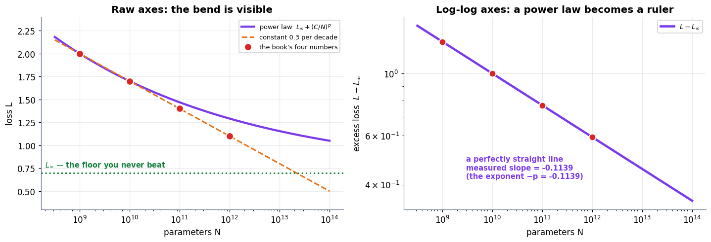

