# 16 — Foundations of Learning

**Status:** Executed successfully

## Code and Output

### Cell 3

```python
# ============================================================
#  Setup — the toolkit and the house style for this series
# ============================================================
# Everything here is pre-installed on Colab. Nothing to download.
import sys, math, json, textwrap, random, warnings
import numpy as np
import matplotlib.pyplot as plt
import matplotlib.patches as mpatches
from matplotlib.patches import FancyBboxPatch, FancyArrowPatch, Circle, Polygon
from matplotlib.colors import LinearSegmentedColormap

warnings.filterwarnings("ignore")

# ---- reproducibility -------------------------------------------------
SEED = 7
rng = np.random.default_rng(SEED)
random.seed(SEED)
np.random.seed(SEED)

# ---- the colour grammar, used identically in all four notebooks ------
# Learn these five and every figure in the series reads at a glance.
C_DATA  = "#2563EB"   # blue    — data, inputs, what we are given
C_MODEL = "#7C3AED"   # purple  — the model, parameters, transformations
C_PRED  = "#EA7317"   # orange  — predictions, what the model says
C_TRUE  = "#15803D"   # green   — ground truth, the target, the right answer
C_ERR   = "#DC2626"   # red     — error, loss, the gap we are closing
C_GREY  = "#64748B"   # slate   — structure, axes, annotation
C_SOFT  = "#F1F5F9"   # near-white fill

plt.rcParams.update({
    "figure.dpi": 110,
    "font.size": 11,
    "axes.titlesize": 13,
    "axes.titleweight": "bold",
    "axes.labelsize": 11,
    "axes.edgecolor": C_GREY,
    "axes.grid": True,
    "grid.alpha": 0.25,
    "grid.linestyle": "-",
    "legend.frameon": True,
    "legend.framealpha": 0.92,
    "figure.facecolor": "white",
})

print("Toolkit ready.")
print(f"NumPy {np.__version__} | Matplotlib {plt.matplotlib.__version__}")
print(f"Random seed pinned to {SEED} — your numbers will match the text exactly.")
```

**Output**

```text
Toolkit ready.
NumPy 2.1.3 | Matplotlib 3.10.0
Random seed pinned to 7 — your numbers will match the text exactly.
```

### Cell 4

```python
# ============================================================
#  Drawing helpers — used by every figure in the series
# ============================================================
# Read these once. After this cell, every diagram is three lines.

def box(ax, x, y, w, h, text, fc=C_SOFT, ec=C_GREY, fs=10, tc="#0F172A",
        lw=1.8, bold=False, alpha=1.0):
    """A rounded label box centred on (x, y). Returns its centre."""
    ax.add_patch(FancyBboxPatch((x - w/2, y - h/2), w, h,
                                boxstyle="round,pad=0.02,rounding_size=0.08",
                                fc=fc, ec=ec, lw=lw, zorder=2, alpha=alpha))
    ax.text(x, y, text, ha="center", va="center", fontsize=fs, color=tc,
            zorder=3, fontweight="bold" if bold else "normal", linespacing=1.4)
    return (x, y)

def arrow(ax, p0, p1, color=C_GREY, rad=0.0, lw=2.0, label=None, ls="-",
          label_off=(0, 0.12), fs=9, style="-|>", ms=16):
    """A (optionally curved, optionally labelled) arrow from p0 to p1."""
    ax.add_patch(FancyArrowPatch(p0, p1, arrowstyle=style, mutation_scale=ms,
                                 color=color, lw=lw, linestyle=ls, zorder=1,
                                 connectionstyle=f"arc3,rad={rad}",
                                 shrinkA=7, shrinkB=9))
    if label:
        mx, my = (p0[0] + p1[0]) / 2, (p0[1] + p1[1]) / 2
        ax.text(mx + label_off[0], my + label_off[1], label, ha="center",
                va="center", fontsize=fs, color=color, style="italic",
                bbox=dict(fc="white", ec="none", alpha=0.88, pad=1.6), zorder=4)

def stage(ax, xlim=(0, 10), ylim=(0, 6), title=None):
    """Turn an Axes into a blank drawing stage."""
    ax.set_xlim(*xlim); ax.set_ylim(*ylim); ax.axis("off")
    if title:
        ax.set_title(title, pad=12)
    return ax

def tidy(ax, xlabel=None, ylabel=None, title=None, legend=False):
    """Consistent finishing touches for a plotted (non-diagram) Axes."""
    if xlabel: ax.set_xlabel(xlabel)
    if ylabel: ax.set_ylabel(ylabel)
    if title:  ax.set_title(title)
    ax.spines[["top", "right"]].set_visible(False)
    if legend: ax.legend(fontsize=9)
    return ax

print("Drawing helpers ready: box(), arrow(), stage(), tidy()")
```

**Output**

```text
Drawing helpers ready: box(), arrow(), stage(), tidy()
```

### Cell 7

```python
# ============================================================
#  Figure: the three nested circles, with what changes at each step
# ============================================================
fig, ax = plt.subplots(figsize=(11, 7.4))
stage(ax, (0, 11), (0, 7.6), "AI ⊃ ML ⊃ Deep Learning — three nested circles, not three rivals")

# ── the circles, drawn largest first so the smaller ones sit on top ──
rings = [
    (3.05, "#DBEAFE", "#1D4ED8", "ARTIFICIAL INTELLIGENCE", 6.95,
     "any technique that looks intelligent\nrules · search · planning"),
    (2.05, "#EDE9FE", "#6D28D9", "MACHINE LEARNING", 4.55,
     "rules learned from examples"),
    (1.10, "#FFEDD5", "#C2410C", "DEEP LEARNING", 2.85,
     "features learned too"),
]
for r, fc, ec, label, ytext, sub in rings:
    ax.add_patch(Circle((3.5, 3.5), r, fc=fc, ec=ec, lw=2.4, zorder=1))
    ax.text(3.5, ytext, label, ha="center", fontsize=10.5,
            fontweight="bold", color=ec, zorder=5)
    ax.text(3.5, ytext - 0.34, sub, ha="center", fontsize=8.4,
            color=ec, style="italic", zorder=5, linespacing=1.3)

# ── the same task, one example per ring ──
examples = [
    (3.5, 3.62, "spam filter with a\nhand-written word list", "#C2410C", 8.2),
    (3.5, 2.30, "logistic regression on\nword-count features", "#6D28D9", 8.2),
    (3.5, 1.05, "a neural net reading\nthe raw email text", "#1D4ED8", 8.2),
]
ax.text(3.5, 3.5, "one task:\nis this spam?", ha="center", va="center",
        fontsize=9.2, fontweight="bold", color="#7C2D12", zorder=6,
        linespacing=1.3)

# ── the "who supplies what" ladder on the right ──
box(ax, 8.6, 6.2, 4.2, 1.05,
    "OUTER — classical AI\nyou write the rules\nyou choose the features",
    fc="#DBEAFE", ec="#1D4ED8", fs=9.3)
box(ax, 8.6, 4.3, 4.2, 1.05,
    "MIDDLE — machine learning\nDATA picks the numbers\nyou choose the features",
    fc="#EDE9FE", ec="#6D28D9", fs=9.3)
box(ax, 8.6, 2.4, 4.2, 1.05,
    "INNER — deep learning\nDATA picks the numbers\nDATA picks the features",
    fc="#FFEDD5", ec="#C2410C", fs=9.3)
arrow(ax, (8.6, 5.65), (8.6, 4.87), color=C_GREY, lw=1.6)
arrow(ax, (8.6, 3.75), (8.6, 2.97), color=C_GREY, lw=1.6)
ax.text(10.95, 4.3, "more handed\nover to data →", rotation=270, ha="center",
        va="center", fontsize=8.6, color=C_GREY, style="italic")

plt.tight_layout(); plt.show()
```

**Output**

```text
<Figure size 1210x814 with 1 Axes>
```

**Figure**

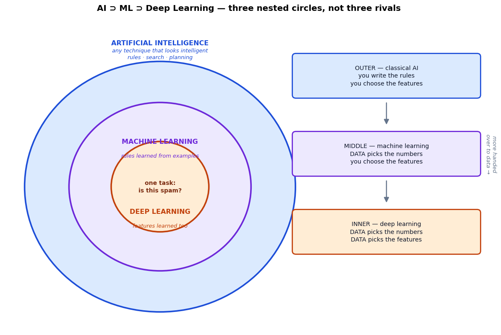

### Cell 10

```python
# ============================================================
#  Circle 1 — a hand-written rule. Real AI, and it learns nothing.
# ============================================================
SPAM_WORDS = {"free", "winner", "prize", "click"}

def is_spam_by_rule(email_words):
    """Classical AI: the intelligence is yours, frozen into a constant."""
    hits = sum(1 for w in email_words if w in SPAM_WORDS)
    return hits >= 3                      # <- 3 chosen by a human, never revised

tests = [
    (["free", "prize", "click", "today"],       True),
    (["meeting", "notes", "attached"],          False),
    (["free", "lunch"],                         False),
    (["winner", "claim", "your", "prize"],      True),
]
print("Circle 1 — hand-written rule")
print("=" * 52)
for words, expected in tests:
    got = is_spam_by_rule(words)
    mark = "✅" if got == expected else "❌"
    print(f"  {mark} {str(words):<44} -> {'SPAM' if got else 'ham'}")

print()
print("Look at the last row. 'winner claim your prize' is obviously spam, but it")
print("contains only TWO listed words, so hits=2 < 3 and the rule waves it through.")
print("The rule is not broken -- it is doing exactly what a human told it. The human")
print("was wrong, and the rule has no way to find that out.")
print()
print("Notice what is missing: there is no .fit(). No data was consulted.")
print("Show this function a million emails and it makes the SAME mistakes")
print("on the millionth as on the first, because `3` never changes.")
```

**Output**

```text
Circle 1 — hand-written rule
====================================================
  ✅ ['free', 'prize', 'click', 'today']          -> SPAM
  ✅ ['meeting', 'notes', 'attached']             -> ham
  ✅ ['free', 'lunch']                            -> ham
  ❌ ['winner', 'claim', 'your', 'prize']         -> ham

Look at the last row. 'winner claim your prize' is obviously spam, but it
contains only TWO listed words, so hits=2 < 3 and the rule waves it through.
The rule is not broken -- it is doing exactly what a human told it. The human
was wrong, and the rule has no way to find that out.

Notice what is missing: there is no .fit(). No data was consulted.
Show this function a million emails and it makes the SAME mistakes
on the millionth as on the first, because `3` never changes.
```

### Cell 12

```python
# ============================================================
#  Circle 2 — the same task, learned from labelled examples
# ============================================================
from sklearn.linear_model import LogisticRegression

def make_emails(n, generator):
    """Synthetic inbox. Spam tends to carry LINKS more than spam-words --
    a fact the hand-written rule has no way to know."""
    is_spam = generator.random(n) < 0.4
    spam_words = np.where(is_spam, generator.poisson(2.0, n), generator.poisson(1.7, n))
    links      = np.where(is_spam, generator.poisson(3.6, n), generator.poisson(0.5, n))
    return np.c_[spam_words, links].astype(float), is_spam.astype(int)

# A held-out inbox neither approach ever trains on — the honest scoreboard.
X_test, y_test = make_emails(6000, np.random.default_rng(99))

# The hand-written rule, expressed on the same two features
def rule_predict(X):
    return ((X[:, 0] + X[:, 1]) >= 3).astype(int)   # the human's threshold

rule_accuracy = (rule_predict(X_test) == y_test).mean()

# The learned model, trained on just 300 labelled emails
X_train, y_train = make_emails(300, np.random.default_rng(1))
model = LogisticRegression().fit(X_train, y_train)
learned_accuracy = (model.predict(X_test) == y_test).mean()

w1, w2 = model.coef_[0]
b = model.intercept_[0]

print("Circle 2 — learned from data")
print("=" * 58)
print(f"  hand-written rule : {rule_accuracy:6.1%}")
print(f"  learned model     : {learned_accuracy:6.1%}   (trained on 300 emails)")
print()
print("The weights nobody typed in:")
print(f"  w1 (spam words) = {w1:+.3f}")
print(f"  w2 (links)      = {w2:+.3f}")
print(f"  b  (bias)       = {b:+.3f}")
print()
print(f"The data discovered that LINKS matter about {w2/w1:.0f}x more than spam-words.")
print("The hand-written rule weighted them equally. That is the whole gap.")
```

**Output**

```text
Circle 2 — learned from data
==========================================================
  hand-written rule :  74.3%
  learned model     :  89.6%   (trained on 300 emails)

The weights nobody typed in:
  w1 (spam words) = +0.221
  w2 (links)      = +1.820
  b  (bias)       = -3.445

The data discovered that LINKS matter about 8x more than spam-words.
The hand-written rule weighted them equally. That is the whole gap.
```

### Cell 16

```python
# ============================================================
#  The fingerprint experiment: does more data help?
# ============================================================
train_sizes = [20, 50, 100, 300, 1000, 3000, 10000]
TRIALS = 12          # average over several random training sets, so the
                     # curve reflects the method and not one lucky draw

learned_curve, learned_spread = [], []
for n in train_sizes:
    scores = []
    for t in range(TRIALS):
        Xtr, ytr = make_emails(n, np.random.default_rng(1000 + t))
        if len(np.unique(ytr)) < 2:        # a tiny sample can be all one class
            continue
        clf = LogisticRegression().fit(Xtr, ytr)
        scores.append((clf.predict(X_test) == y_test).mean())
    learned_curve.append(np.mean(scores))
    learned_spread.append(np.std(scores))

rule_curve = [rule_accuracy] * len(train_sizes)   # flat, by construction

print(f"{'training emails':>16}{'hand rule':>12}{'learned':>10}")
print("-" * 40)
for n, r, l in zip(train_sizes, rule_curve, learned_curve):
    print(f"{n:>16,}{r:>11.1%}{l:>10.1%}")
print("-" * 40)
print(f"The rule never moves. The learner gains "
      f"{learned_curve[-1] - learned_curve[0]:+.1%} from 20 -> 10,000 emails,")
print(f"and beats the rule by {learned_curve[-1] - rule_accuracy:+.1%} at the end.")
```

**Output**

```text
 training emails   hand rule   learned
----------------------------------------
              20      74.3%     86.2%
              50      74.3%     88.8%
             100      74.3%     89.1%
             300      74.3%     89.4%
           1,000      74.3%     89.4%
           3,000      74.3%     89.6%
          10,000      74.3%     89.6%
----------------------------------------
The rule never moves. The learner gains +3.3% from 20 -> 10,000 emails,
and beats the rule by +15.3% at the end.
```

### Cell 17

```python
# ============================================================
#  Figure: the fingerprint — flat rule vs. climbing learner
# ============================================================
fig, ax = plt.subplots(figsize=(10.5, 5.4))

lo = np.array(learned_curve) - np.array(learned_spread)
hi = np.array(learned_curve) + np.array(learned_spread)
ax.fill_between(train_sizes, lo, hi, color=C_MODEL, alpha=0.15,
                label="learned model — spread over 12 runs")
ax.plot(train_sizes, learned_curve, "o-", color=C_MODEL, lw=2.6, ms=7,
        label="learned model (logistic regression)")
ax.plot(train_sizes, rule_curve, "s--", color=C_ERR, lw=2.6, ms=7,
        label="hand-written rule (no .fit)")

ax.set_xscale("log")
ax.set_xticks(train_sizes)
ax.set_xticklabels([f"{n:,}" for n in train_sizes])
ax.set_ylim(0.68, 0.95)
ax.yaxis.set_major_formatter(lambda v, p: f"{v:.0%}")

# annotate the gap at the right-hand edge
ax.annotate("", xy=(10000, learned_curve[-1]), xytext=(10000, rule_accuracy),
            arrowprops=dict(arrowstyle="<->", color=C_TRUE, lw=2))
ax.text(11500, (learned_curve[-1] + rule_accuracy) / 2,
        f"{learned_curve[-1] - rule_accuracy:+.1%}\nfrom learning",
        color=C_TRUE, fontsize=9.5, fontweight="bold", va="center")
ax.text(24, rule_accuracy + 0.006, "flat forever — no amount of data helps",
        color=C_ERR, fontsize=9, style="italic")

tidy(ax, "labelled emails used for training  (log scale)",
     "accuracy on the same held-out inbox",
     "The fingerprint of machine learning", legend=True)
plt.tight_layout(); plt.show()
```

**Output**

```text
<Figure size 1155x594 with 1 Axes>
```

**Figure**

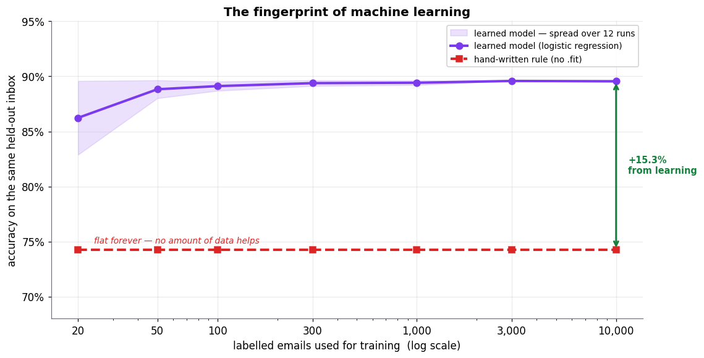

### Cell 22

```python
# ============================================================
#  Figure: the same 2-D points under three kinds of feedback
# ============================================================
fig, axes = plt.subplots(1, 3, figsize=(13.4, 4.5))

# one shared cloud of points, so only the FEEDBACK differs between panels
g = np.random.default_rng(3)
cloud_a = g.normal([-1.1, -0.6], 0.55, size=(45, 2))
cloud_b = g.normal([1.2, 0.8], 0.55, size=(45, 2))
pts = np.vstack([cloud_a, cloud_b])
lab = np.r_[np.zeros(45), np.ones(45)]

# ── 1. supervised: the answers came with the data ──
ax = axes[0]
ax.scatter(*pts[lab == 0].T, c=C_DATA, s=42, edgecolor="white", lw=0.8, label="class 0")
ax.scatter(*pts[lab == 1].T, c=C_PRED, s=42, edgecolor="white", lw=0.8, label="class 1")
xs = np.linspace(-3, 3.2, 10)
ax.plot(xs, -0.9 * xs + 0.15, color=C_TRUE, lw=2.4, ls="--", label="learned boundary")
tidy(ax, "feature 1", "feature 2", "SUPERVISED\nevery point carries its answer", legend=True)

# ── 2. unsupervised: identical points, labels withheld ──
ax = axes[1]
ax.scatter(*pts.T, c=C_GREY, s=42, edgecolor="white", lw=0.8, label="unlabelled")
for centre, col in [(cloud_a.mean(0), C_DATA), (cloud_b.mean(0), C_PRED)]:
    ax.scatter(*centre, marker="X", s=260, c=col, edgecolor="white", lw=1.6, zorder=5)
    ax.add_patch(Circle(centre, 1.25, fill=False, ec=col, lw=2, ls=":", zorder=4))
ax.scatter([], [], marker="X", s=120, c=C_MODEL, label="discovered centres")
tidy(ax, "feature 1", "feature 2", "UNSUPERVISED\nno answers — find the structure", legend=True)

# ── 3. reinforcement: no labels, only a reward for acting ──
ax = axes[2]
stage(ax, (0, 10), (0, 10), "REINFORCEMENT\nno answers — only a reward")
p_agent = box(ax, 2.6, 6.6, 3.0, 1.15, "AGENT\npolicy π", fc="#EDE9FE", ec=C_MODEL, fs=9.5, bold=True)
p_env   = box(ax, 7.4, 6.6, 3.0, 1.15, "ENVIRONMENT", fc="#DBEAFE", ec=C_DATA, fs=9.5, bold=True)
arrow(ax, (4.1, 7.0), (5.9, 7.0), color=C_PRED, rad=-0.32, label="action", label_off=(0, 0.62))
arrow(ax, (5.9, 6.2), (4.1, 6.2), color=C_TRUE, rad=-0.32, label="reward + new state",
      label_off=(0, -0.72), fs=8.4)
box(ax, 5.0, 3.1, 8.2, 1.9,
    "no target is ever revealed.\nthe agent only learns that some sequences of actions\n"
    "score better than others — and only after the fact.",
    fc=C_SOFT, ec=C_GREY, fs=9)

plt.tight_layout(); plt.show()
```

**Output**

```text
<Figure size 1474x495 with 3 Axes>
```

**Figure**

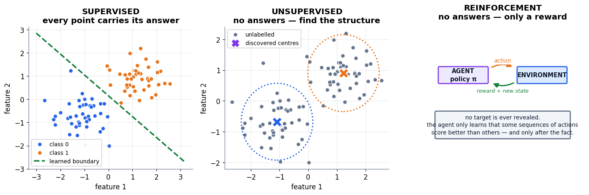

### Cell 25

```python
# ============================================================
#  Figure: the decision flowchart for placing a problem
# ============================================================
fig, ax = plt.subplots(figsize=(12.4, 6.4))
stage(ax, (0, 12.4), (0, 7.0), "Where does this problem belong?")

q1 = box(ax, 6.2, 6.3, 6.4, 0.82,
         "1.  Do I have data with examples of the right answer?",
         fc=C_SOFT, ec=C_GREY, fs=10.6, bold=True)
out_ai = box(ax, 1.9, 4.5, 3.2, 1.1,
             "CLASSICAL AI\nrules · search · planning",
             fc="#DBEAFE", ec="#1D4ED8", fs=9.4, bold=True)
arrow(ax, (4.2, 6.1), (2.4, 5.1), color="#1D4ED8", lw=1.9,
      label="no — I write the logic", label_off=(-0.2, 0.55), fs=8.8)

q2 = box(ax, 7.9, 4.5, 6.0, 0.82,
         "2.  Can a human easily name the useful features?",
         fc=C_SOFT, ec=C_GREY, fs=10.6, bold=True)
arrow(ax, (7.4, 5.85), (7.9, 4.96), color=C_GREY, lw=1.9,
      label="yes, labelled data", label_off=(1.35, 0.28), fs=8.8)

out_ml = box(ax, 4.6, 2.6, 3.6, 1.25,
             "CLASSIC ML\nlogistic regression\ntrees · k-means",
             fc="#EDE9FE", ec="#6D28D9", fs=9.4, bold=True)
arrow(ax, (6.4, 4.06), (5.1, 3.28), color="#6D28D9", lw=1.9,
      label="yes — a tidy table", label_off=(-0.55, 0.42), fs=8.8)

q3 = box(ax, 10.0, 2.6, 4.3, 0.82,
         "3.  Enough data and compute?", fc=C_SOFT, ec=C_GREY, fs=10, bold=True)
arrow(ax, (9.4, 4.06), (10.0, 3.06), color=C_GREY, lw=1.9,
      label="no — raw pixels,\naudio, free text", label_off=(1.5, 0.30), fs=8.4)

out_dl = box(ax, 10.0, 0.85, 4.3, 1.0,
             "DEEP LEARNING\nearns its keep here",
             fc="#FFEDD5", ec="#C2410C", fs=9.4, bold=True)
arrow(ax, (10.0, 2.16), (10.0, 1.38), color="#C2410C", lw=1.9,
      label="yes", label_off=(0.45, 0), fs=8.8)
arrow(ax, (7.85, 2.6), (6.45, 2.6), color="#6D28D9", lw=1.9, ls="--",
      label="no — stay simpler", label_off=(0, 0.36), fs=8.4)

ax.text(6.2, 0.15, "the honest default: stay in the outer, cheaper circles — "
        "and move inward only when the data forces you",
        ha="center", fontsize=9.8, color=C_TRUE, fontweight="bold", style="italic")
plt.tight_layout(); plt.show()
```

**Output**

```text
<Figure size 1364x704 with 1 Axes>
```

**Figure**

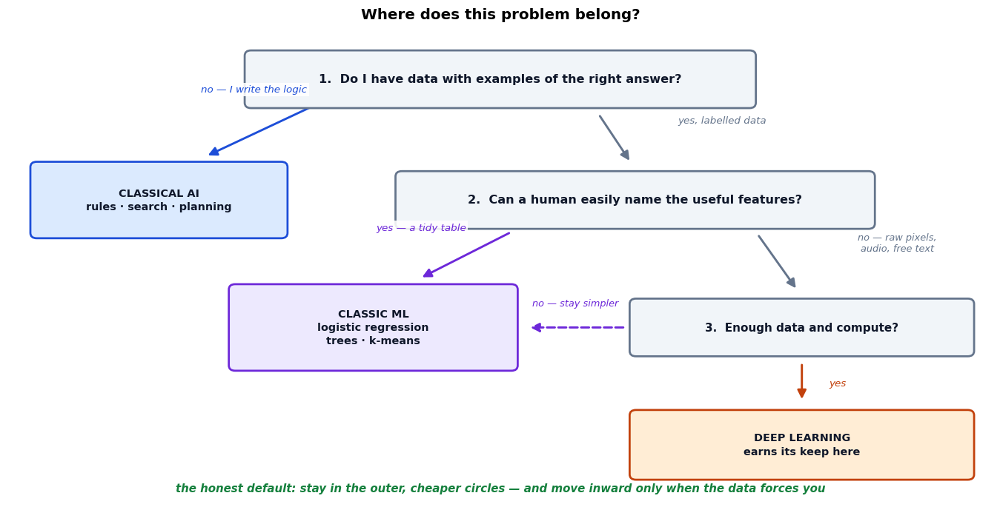

### Cell 29

```python
# ============================================================
#  Figure: the four-beat loop — the skeleton of all of ML
# ============================================================
fig, ax = plt.subplots(figsize=(12.6, 5.4))
stage(ax, (0, 12.6), (0, 5.6))

beats = [
    (1.85, "1 · DATA",   "examples with\nthe right answer",  C_DATA,  "#DBEAFE"),
    (4.75, "2 · MODEL",  "numbers we are\nallowed to change", C_MODEL, "#EDE9FE"),
    (7.65, "3 · LOSS",   "how wrong,\nas one number",         C_ERR,   "#FEE2E2"),
    (10.55, "4 · UPDATE", "nudge the numbers\ndownhill",      C_TRUE,  "#DCFCE7"),
]
for x, title, sub, ec, fc in beats:
    box(ax, x, 3.55, 2.45, 1.5, f"{title}\n\n{sub}", fc=fc, ec=ec, fs=9.6, bold=False)
    ax.text(x, 4.55, title, ha="center", fontsize=11, fontweight="bold", color=ec)

for x0, x1 in [(3.1, 3.5), (6.0, 6.4), (8.9, 9.3)]:
    arrow(ax, (x0, 3.55), (x1, 3.55), color=C_GREY, lw=2.4)

# the repeat arc
ax.add_patch(FancyArrowPatch((10.55, 2.78), (4.75, 2.78), arrowstyle="-|>",
                             mutation_scale=20, color=C_MODEL, lw=2.4,
                             connectionstyle="arc3,rad=0.34", zorder=1))
ax.text(7.65, 1.28, "repeat — thousands or millions of times",
        ha="center", fontsize=10.5, color=C_MODEL, fontweight="bold", style="italic")

ax.text(0.35, 3.55, "→", fontsize=22, color=C_GREY, va="center")
ax.text(6.3, 0.42, "This is not a simplified picture of training. It IS training.",
        ha="center", fontsize=10.5, color="#0F172A", fontweight="bold")
plt.tight_layout(); plt.show()
```

**Output**

```text
<Figure size 1386x594 with 1 Axes>
```

**Figure**

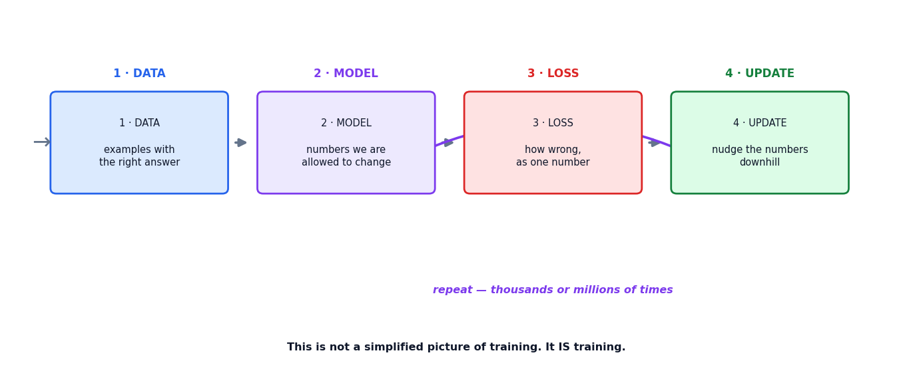

### Cell 32

```python
# ============================================================
#  BEAT 2 — the model: two numbers and a multiplication
# ============================================================
def predict(hours, w, b):
    """The entire model. Two parameters, one line of arithmetic."""
    return w * hours + b          # ŷ = w·x + b

# The model starts out knowing nothing. These values are arbitrary.
w, b = 5.0, 20.0

x_one, y_one = 4.0, 70.0          # one student: studied 4 h, scored 70
y_hat = predict(x_one, w, b)

print("BEAT 2 — the model makes a guess")
print("=" * 46)
print(f"  parameters   w = {w},  b = {b}   (arbitrary — nobody chose these)")
print(f"  input        x = {x_one} hours studied")
print(f"  prediction   ŷ = {w} × {x_one} + {b} = {y_hat}")
print(f"  truth        y = {y_one}")
print()
print(f"  The model guessed {y_hat:.0f} when it should have said {y_one:.0f}.")
print(f"  It is off by {y_one - y_hat:.0f}.")
print()
print("That gap is the whole subject of the next beat.")
```

**Output**

```text
BEAT 2 — the model makes a guess
==============================================
  parameters   w = 5.0,  b = 20.0   (arbitrary — nobody chose these)
  input        x = 4.0 hours studied
  prediction   ŷ = 5.0 × 4.0 + 20.0 = 40.0
  truth        y = 70.0

  The model guessed 40 when it should have said 70.
  It is off by 30.

That gap is the whole subject of the next beat.
```

### Cell 35

```python
# ============================================================
#  BEAT 3 — the loss: one number that says how wrong we are
# ============================================================
def squared_loss(y_hat, y):
    """The scoreboard. Lower is better; zero is perfect."""
    return (y_hat - y) ** 2

loss_now = squared_loss(y_hat, y_one)

print("BEAT 3 — measuring the wrongness")
print("=" * 46)
print(f"  prediction ŷ = {y_hat:.0f}")
print(f"  truth      y = {y_one:.0f}")
print(f"  gap          = {y_hat - y_one:+.0f}")
print(f"  loss         = ({y_hat - y_one:+.0f})² = {loss_now:.0f}")
print()

# Why squaring matters: watch the signs cancel without it
gaps = np.array([-30.0, +30.0, -10.0, +10.0])
print("  Four errors:", gaps.astype(int).tolist())
print(f"    plain sum of gaps   : {gaps.sum():>8.0f}   <- looks perfect. it is not.")
print(f"    sum of |gaps|       : {np.abs(gaps).sum():>8.0f}")
print(f"    sum of squared gaps : {(gaps ** 2).sum():>8.0f}   <- what we use")
print()
print("  The plain sum says this model is flawless. Squaring refuses to be fooled,")
print("  and unlike |gap| it is smooth everywhere — which the next beat needs.")
```

**Output**

```text
BEAT 3 — measuring the wrongness
==============================================
  prediction ŷ = 40
  truth      y = 70
  gap          = -30
  loss         = (-30)² = 900

  Four errors: [-30, 30, -10, 10]
    plain sum of gaps   :        0   <- looks perfect. it is not.
    sum of |gaps|       :       80
    sum of squared gaps :     2000   <- what we use

  The plain sum says this model is flawless. Squaring refuses to be fooled,
  and unlike |gap| it is smooth everywhere — which the next beat needs.
```

### Cell 36

```python
# ============================================================
#  Figure: the miss, and the bowl that miss puts us on
# ============================================================
fig, (ax1, ax2) = plt.subplots(1, 2, figsize=(13, 4.9))

# ── left: the line, the truth, and the gap ──
hours = np.linspace(0, 8, 100)
ax1.plot(hours, predict(hours, w, b), color=C_MODEL, lw=2.6,
         label=f"model:  ŷ = {w:.0f}x + {b:.0f}")
ax1.scatter([x_one], [y_one], s=170, color=C_TRUE, zorder=5,
            edgecolor="white", lw=2, label=f"truth (4 h, {y_one:.0f})")
ax1.scatter([x_one], [y_hat], s=170, color=C_PRED, zorder=5,
            edgecolor="white", lw=2, label=f"prediction ({y_hat:.0f})")
ax1.annotate("", xy=(x_one, y_one), xytext=(x_one, y_hat),
             arrowprops=dict(arrowstyle="<->", color=C_ERR, lw=2.6))
ax1.text(x_one + 0.22, (y_one + y_hat) / 2, f"gap = {y_one - y_hat:.0f}",
         color=C_ERR, fontsize=11, fontweight="bold", va="center")
ax1.set_ylim(0, 90)
tidy(ax1, "hours studied (x)", "exam score", "The model misses by 30", legend=True)

# ── right: the loss as a function of w, with our position on it ──
w_grid = np.linspace(0, 25, 300)
loss_grid = (predict(x_one, w_grid, b) - y_one) ** 2
ax2.plot(w_grid, loss_grid, color=C_ERR, lw=2.6)
ax2.fill_between(w_grid, 0, loss_grid, color=C_ERR, alpha=0.08)
ax2.scatter([w], [loss_now], s=200, color=C_MODEL, zorder=5,
            edgecolor="white", lw=2)
ax2.annotate(f"we are here\nw = {w:.0f},  loss = {loss_now:.0f}",
             xy=(w, loss_now), xytext=(w + 2.2, loss_now + 700),
             fontsize=10, color=C_MODEL, fontweight="bold",
             arrowprops=dict(arrowstyle="->", color=C_MODEL, lw=1.8))
w_best = (y_one - b) / x_one
ax2.scatter([w_best], [0], s=220, marker="*", color=C_TRUE, zorder=5,
            edgecolor="white", lw=1.4)
ax2.text(w_best, 260, f"the bottom\nw = {w_best:.1f}", ha="center",
         fontsize=9.6, color=C_TRUE, fontweight="bold")
ax2.set_ylim(-200, 5200)
tidy(ax2, "the weight w", "loss  (ŷ − y)²",
     "Squaring turns the error into a bowl")

plt.tight_layout(); plt.show()
```

**Output**

```text
<Figure size 1430x539 with 2 Axes>
```

**Figure**

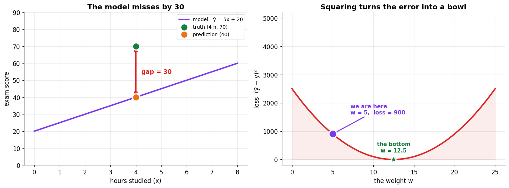

### Cell 40

```python
# ============================================================
#  BEAT 4 — the update: one step downhill
# ============================================================
eta = 0.001                     # the learning rate: how big a step

# the slopes of the loss with respect to each parameter
dL_dw = 2 * (y_hat - y_one) * x_one
dL_db = 2 * (y_hat - y_one)

print("BEAT 4 — taking one step")
print("=" * 54)
print(f"  ∂L/∂w = 2 × ({y_hat - y_one:+.0f}) × {x_one:.0f} = {dL_dw:+.0f}")
print(f"  ∂L/∂b = 2 × ({y_hat - y_one:+.0f})       = {dL_db:+.0f}")
print()
print("  Both are NEGATIVE, which reads: 'increasing w or b DECREASES the loss.'")
print("  Stepping against a negative gradient therefore means increasing them.")
print()

w_new = w - eta * dL_dw
b_new = b - eta * dL_db
y_hat_new = predict(x_one, w_new, b_new)
loss_new = squared_loss(y_hat_new, y_one)

print(f"  w: {w:.3f}  ->  {w_new:.3f}")
print(f"  b: {b:.3f}  ->  {b_new:.3f}")
print(f"  ŷ: {y_hat:.2f}  ->  {y_hat_new:.2f}      (target {y_one:.0f})")
print(f"  loss: {loss_now:.1f}  ->  {loss_new:.1f}")
print()
print(f"  The problem is not solved. It is nudged {loss_now - loss_new:.0f} in the right direction.")
print("  Do this ten thousand times and the line settles where the data wants it.")
```

**Output**

```text
BEAT 4 — taking one step
======================================================
  ∂L/∂w = 2 × (-30) × 4 = -240
  ∂L/∂b = 2 × (-30)       = -60

  Both are NEGATIVE, which reads: 'increasing w or b DECREASES the loss.'
  Stepping against a negative gradient therefore means increasing them.

  w: 5.000  ->  5.240
  b: 20.000  ->  20.060
  ŷ: 40.00  ->  41.02      (target 70)
  loss: 900.0  ->  839.8

  The problem is not solved. It is nudged 60 in the right direction.
  Do this ten thousand times and the line settles where the data wants it.
```

### Cell 42

```python
# ============================================================
#  Three learning rates on the same bowl, same start
# ============================================================
def descend_w(eta, steps=12, w_start=5.0):
    """Gradient descent on w alone (b frozen), so we can draw it in 2-D."""
    ww, path = w_start, [(w_start, squared_loss(predict(x_one, w_start, b), y_one))]
    for _ in range(steps):
        g = 2 * (predict(x_one, ww, b) - y_one) * x_one
        ww = ww - eta * g
        path.append((ww, squared_loss(predict(x_one, ww, b), y_one)))
    return np.array(path)

runs = [("too small", 0.002, C_DATA),
        ("just right", 0.02, C_TRUE),
        ("too large", 0.075, C_ERR)]

fig, axes = plt.subplots(1, 3, figsize=(13.4, 4.4), sharey=True)
for ax, (name, e, col) in zip(axes, runs):
    path = descend_w(e)
    ax.plot(w_grid, loss_grid, color=C_GREY, lw=1.8, alpha=0.55)
    ax.plot(path[:, 0], path[:, 1], "o-", color=col, lw=1.9, ms=5.5, zorder=4)
    ax.scatter([path[0, 0]], [path[0, 1]], s=130, color=C_MODEL, zorder=6,
               edgecolor="white", lw=1.5)
    ax.scatter([w_best], [0], s=200, marker="*", color=C_TRUE, zorder=6,
               edgecolor="white", lw=1.2)
    ax.set_ylim(-300, 6000); ax.set_xlim(0, 25)
    ax.set_title(f"{name}\nη = {e}", fontsize=11)
    ax.set_xlabel("weight w")
    final = path[-1, 1]
    ax.text(0.5, 5400, f"loss after 12 steps: {final:,.0f}", fontsize=9.4,
            color=col, fontweight="bold")
    ax.spines[["top", "right"]].set_visible(False)
axes[0].set_ylabel("loss")
fig.suptitle("Same bowl, same start, same direction — only the step size differs",
             fontsize=12.5, fontweight="bold", y=1.02)
plt.tight_layout(); plt.show()

for name, e, _ in runs:
    p = descend_w(e)
    print(f"  η = {e:<6} {name:<11} loss 900 -> {p[-1,1]:>10,.1f}")
```

**Output**

```text
<Figure size 1474x484 with 3 Axes>
```

**Figure**

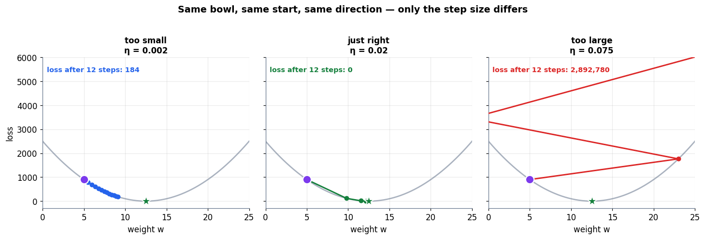

**Output**

```text
  η = 0.002  too small   loss 900 ->      184.0
  η = 0.02   just right  loss 900 ->        0.0
  η = 0.075  too large   loss 900 -> 2,892,779.7
```

### Cell 46

```python
# ============================================================
#  THE WHOLE LOOP — three students, 2000 steps
# ============================================================
# Three students: (hours studied, exam score)
X = np.array([2.0, 4.0, 6.0])
Y = np.array([45.0, 70.0, 88.0])

w, b = 5.0, 20.0          # back to knowing nothing
eta = 0.02
STEPS = 2000

history = []
for step in range(STEPS):
    y_hat = w * X + b                        # 2. MODEL
    errors = y_hat - Y
    loss = (errors ** 2).mean()              # 3. LOSS  (mean over the batch)
    history.append((w, b, loss))

    dL_dw = 2 * (errors * X).mean()          #    gradients, averaged over students
    dL_db = 2 * errors.mean()

    w -= eta * dL_dw                         # 4. UPDATE
    b -= eta * dL_db

history = np.array(history)

print("THE LOOP, RUNNING")
print("=" * 58)
print(f"{'step':>7}{'w':>10}{'b':>10}{'loss':>12}")
print("-" * 58)
for s in [0, 1, 2, 5, 20, 100, 500, STEPS - 1]:
    ws, bs, ls = history[s]
    print(f"{s:>7}{ws:>10.3f}{bs:>10.3f}{ls:>12.3f}")
print("-" * 58)
print(f"final model:  ŷ = {w:.3f}·x + {b:.3f}")
print(f"final loss :  {history[-1, 2]:.4f}   (started at {history[0, 2]:.1f})")
```

**Output**

```text
THE LOOP, RUNNING
==========================================================
   step         w         b        loss
----------------------------------------------------------
      0     5.000    20.000     856.333
      1    10.040    21.107      45.026
      2    11.140    21.363       6.173
      5    11.434    21.481       4.172
     20    11.383    21.733       3.952
    100    11.159    22.774       3.234
    500    10.796    24.455       2.729
   1999    10.750    24.667       2.722
----------------------------------------------------------
final model:  ŷ = 10.750·x + 24.667
final loss :  2.7222   (started at 856.3)
```

### Cell 47

```python
# ============================================================
#  Figure: the line learning, and the loss falling
# ============================================================
fig = plt.figure(figsize=(13.2, 4.9))
gs = fig.add_gridspec(1, 2, width_ratios=[1.15, 1])

# ── left: a film-strip of the line at increasing steps ──
ax1 = fig.add_subplot(gs[0])
xs = np.linspace(0, 8, 50)
snapshots = [0, 2, 5, 15, 60, STEPS - 1]
shades = plt.cm.viridis(np.linspace(0.12, 0.92, len(snapshots)))
for (s, col) in zip(snapshots, shades):
    ws, bs, ls = history[s]
    ax1.plot(xs, ws * xs + bs, color=col, lw=2.0,
             label=f"step {s:>4}   loss {ls:7.1f}")
ax1.scatter(X, Y, s=170, color=C_TRUE, zorder=6, edgecolor="white", lw=2,
            label="the three students")
ax1.set_ylim(0, 100)
tidy(ax1, "hours studied", "exam score", "The line finds the data")
ax1.legend(fontsize=8.2, loc="lower right")

# ── right: the loss curve ──
ax2 = fig.add_subplot(gs[1])
ax2.plot(history[:, 2], color=C_ERR, lw=2.4)
ax2.set_yscale("log")
ax2.axhline(history[-1, 2], color=C_TRUE, ls="--", lw=1.6)
ax2.text(STEPS * 0.42, history[-1, 2] * 1.7,
         f"floor ≈ {history[-1, 2]:.2f} — the best a straight line can do",
         fontsize=9.2, color=C_TRUE, fontweight="bold")
for s, col in zip([0, 2, 5, 15, 60], shades):
    ax2.scatter([s], [history[s, 2]], s=55, color=col, zorder=5,
                edgecolor="white", lw=1.1)
tidy(ax2, "training step", "loss  (log scale)", "The scoreboard falls")

plt.tight_layout(); plt.show()
```

**Output**

```text
<Figure size 1452x539 with 2 Axes>
```

**Figure**

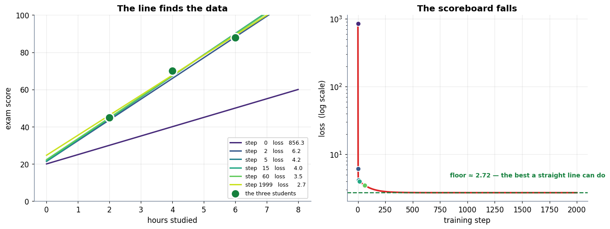

### Cell 50

```python
# ============================================================
#  The model answers about a student it never saw
# ============================================================
print("What the model was shown")
print("=" * 52)
for xi, yi in zip(X, Y):
    print(f"   {xi:.0f} hours  ->  scored {yi:.0f}      predicted {predict(xi, w, b):6.2f}"
          f"   (off by {predict(xi, w, b) - yi:+5.2f})")

print()
print("It misses EVERY training point a little. No line can pass through all three.")
print(f"Total mean squared error: {((predict(X, w, b) - Y) ** 2).mean():.3f}  — not zero, and cannot be.")
print()
print("But now ask it about a student it has never seen:")
print("=" * 52)
for hours in [3.0, 5.0, 7.0]:
    print(f"   {hours:.0f} hours  ->  predicts {predict(hours, w, b):.1f}")
print()
print("Nobody stored '5 hours'. The model has exactly two numbers in it:")
print(f"   w = {w:.3f}   b = {b:.3f}")
print("Those two numbers ARE the learned rule. Predicting well on unseen")
print("inputs is called GENERALISATION, and it is the goal — not perfect recall.")
```

**Output**

```text
What the model was shown
====================================================
   2 hours  ->  scored 45      predicted  46.17   (off by +1.17)
   4 hours  ->  scored 70      predicted  67.67   (off by -2.33)
   6 hours  ->  scored 88      predicted  89.17   (off by +1.17)

It misses EVERY training point a little. No line can pass through all three.
Total mean squared error: 2.722  — not zero, and cannot be.

But now ask it about a student it has never seen:
====================================================
   3 hours  ->  predicts 56.9
   5 hours  ->  predicts 78.4
   7 hours  ->  predicts 99.9

Nobody stored '5 hours'. The model has exactly two numbers in it:
   w = 10.750   b = 24.667
Those two numbers ARE the learned rule. Predicting well on unseen
inputs is called GENERALISATION, and it is the goal — not perfect recall.
```

### Cell 51

```python
# ============================================================
#  Figure: a compromise line that answers about the unseen
# ============================================================
fig, ax = plt.subplots(figsize=(10.4, 5.4))
xs = np.linspace(0.5, 8.5, 100)

ax.plot(xs, predict(xs, w, b), color=C_MODEL, lw=2.8,
        label=f"the learned rule:  ŷ = {w:.2f}x + {b:.2f}")

# the residual to every training point — the model is wrong about all of them
for xi, yi in zip(X, Y):
    yh = predict(xi, w, b)
    ax.plot([xi, xi], [yi, yh], color=C_ERR, lw=2.2, zorder=3)
    ax.text(xi + 0.12, (yi + yh) / 2, f"{yh - yi:+.1f}", color=C_ERR,
            fontsize=8.8, va="center", fontweight="bold")
ax.scatter(X, Y, s=180, color=C_TRUE, zorder=6, edgecolor="white", lw=2,
           label="the three students it saw")

# the unseen student
x_new = 5.0
y_new = predict(x_new, w, b)
ax.scatter([x_new], [y_new], s=230, marker="*", color=C_PRED, zorder=7,
           edgecolor="white", lw=1.8, label="a student it never saw (5 h)")
ax.annotate(f"never seen before\npredicted {y_new:.1f}",
            xy=(x_new, y_new), xytext=(x_new - 2.5, y_new + 17),
            fontsize=10, color=C_PRED, fontweight="bold",
            arrowprops=dict(arrowstyle="->", color=C_PRED, lw=1.9))

ax.set_ylim(30, 105)
tidy(ax, "hours studied", "exam score",
     "Wrong about every point it saw — and useful about one it did not", legend=True)
plt.tight_layout(); plt.show()
```

**Output**

```text
<Figure size 1144x594 with 1 Axes>
```

**Figure**

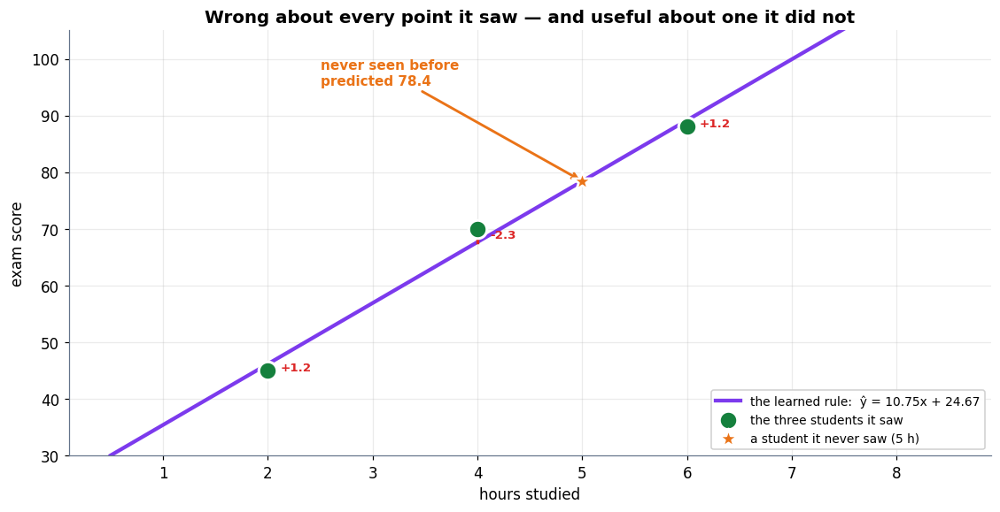

### Cell 54

```python
# ============================================================
#  Overfitting: the training loss lies to you
# ============================================================
# A more realistic dataset: 9 students, a gently curved truth, and noise
# (real exam scores are never exactly on a curve).
def true_relationship(hours):
    return 45 + 9.5 * hours - 0.42 * hours ** 2

gen = np.random.default_rng(SEED)
x_train = np.sort(gen.uniform(1, 9, 9))
y_train = true_relationship(x_train) + gen.normal(0, 3.0, 9)

# a large "future intake" the model never trains on — the honest scoreboard
x_test = np.linspace(1, 9, 200)
y_test = true_relationship(x_test) + gen.normal(0, 3.0, 200)

degrees = [1, 2, 3, 5, 8]
rows = []
for d in degrees:
    coeffs = np.polyfit(x_train, y_train, d)     # fit a degree-d polynomial
    fitted = np.poly1d(coeffs)
    mse_train = ((fitted(x_train) - y_train) ** 2).mean()
    mse_test  = ((fitted(x_test)  - y_test)  ** 2).mean()
    rows.append((d, d + 1, mse_train, mse_test, fitted))

print("Fitting the SAME 9 students with models of growing flexibility")
print("=" * 68)
print(f"{'degree':>7}{'parameters':>12}{'train MSE':>13}{'test MSE':>15}")
print("-" * 68)
for d, npar, tr, te, _ in rows:
    flag = "  <- memorised!" if tr < 0.01 else ""
    print(f"{d:>7}{npar:>12}{tr:>13.2f}{te:>15,.1f}{flag}")
print("-" * 68)
print("Read the two number columns against each other. Training error falls")
print("all the way to ZERO. Test error falls, bottoms out, then EXPLODES.")
```

**Output**

```text
Fitting the SAME 9 students with models of growing flexibility
====================================================================
 degree  parameters    train MSE       test MSE
--------------------------------------------------------------------
      1           2        10.02           12.7
      2           3         2.46            9.7
      3           4         2.41            9.2
      5           6         2.31           10.0
      8           9         0.00      694,210.6  <- memorised!
--------------------------------------------------------------------
Read the two number columns against each other. Training error falls
all the way to ZERO. Test error falls, bottoms out, then EXPLODES.
```

### Cell 55

```python
# ============================================================
#  Figure: under-fit, just right, and memorised
# ============================================================
fig = plt.figure(figsize=(13.4, 7.6))
gs = fig.add_gridspec(2, 3, height_ratios=[1, 0.95], hspace=0.42, wspace=0.25)

showcase = [(1, "TOO SIMPLE\na straight line", C_DATA),
            (2, "JUST RIGHT\nmatches the truth", C_TRUE),
            (8, "MEMORISED\nzero training error", C_ERR)]
xs = np.linspace(1, 9, 400)

for col, (d, title, colr) in enumerate(showcase):
    ax = fig.add_subplot(gs[0, col])
    fitted = dict((r[0], r[4]) for r in rows)[d]
    ax.plot(xs, true_relationship(xs), color=C_GREY, lw=2, ls="--",
            label="the true relationship")
    ax.plot(xs, fitted(xs), color=colr, lw=2.6, label=f"degree {d} fit")
    ax.scatter(x_train, y_train, s=95, color=C_TRUE, zorder=6,
               edgecolor="white", lw=1.6, label="9 students seen")
    ax.set_ylim(20, 105)
    ax.set_title(title, fontsize=11, color=colr)
    ax.set_xlabel("hours studied")
    if col == 0:
        ax.set_ylabel("exam score")
    ax.spines[["top", "right"]].set_visible(False)
    if col == 2:
        ax.legend(fontsize=7.6, loc="lower center")

# ── bottom: the two error curves that tell the real story ──
ax = fig.add_subplot(gs[1, :])
ds     = [r[0] for r in rows]
tr_mse = [r[2] for r in rows]
te_mse = [r[3] for r in rows]
# a training error of exactly 0 is -inf on a log axis: pin it to the floor
FLOOR = 2e-3
tr_plot = [max(v, FLOOR) for v in tr_mse]
ax.plot(ds, tr_plot, "o-", color=C_MODEL, lw=2.6, ms=8, label="training error — what you can see")
if tr_mse[-1] < FLOOR:
    ax.scatter([ds[-1]], [FLOOR], s=190, marker="v", color=C_MODEL, zorder=7,
               edgecolor="white", lw=1.6)
    ax.annotate("training error = EXACTLY 0  (below the log axis)",
                xy=(ds[-1], FLOOR), xytext=(ds[-1] - 3.4, FLOOR * 6),
                fontsize=9.6, color=C_MODEL, fontweight="bold",
                arrowprops=dict(arrowstyle="->", color=C_MODEL, lw=1.8))
ax.plot(ds, te_mse, "s-", color=C_ERR,   lw=2.6, ms=8, label="test error — what actually matters")
ax.set_yscale("log")
best = ds[int(np.argmin(te_mse))]
ax.axvline(best, color=C_TRUE, ls="--", lw=1.8)
ax.text(best + 0.12, 8e3, f"sweet spot\ndegree {best}", color=C_TRUE,
        fontsize=10, fontweight="bold")
ax.fill_between([best, 8.4], 1e-3, 1e7, color=C_ERR, alpha=0.06)
ax.text(6.6, 4e4, "OVERFITTING\ntraining error keeps falling,\nreal performance collapses",
        color=C_ERR, fontsize=10, fontweight="bold", ha="center")
ax.set_xticks(ds); ax.set_xlim(0.7, 8.4); ax.set_ylim(1e-3, 1e7)
tidy(ax, "model flexibility (polynomial degree)", "mean squared error (log)",
     "The training score is not the score that matters", legend=True)

plt.tight_layout(); plt.show()
```

**Output**

```text
<Figure size 1474x836 with 4 Axes>
```

**Figure**

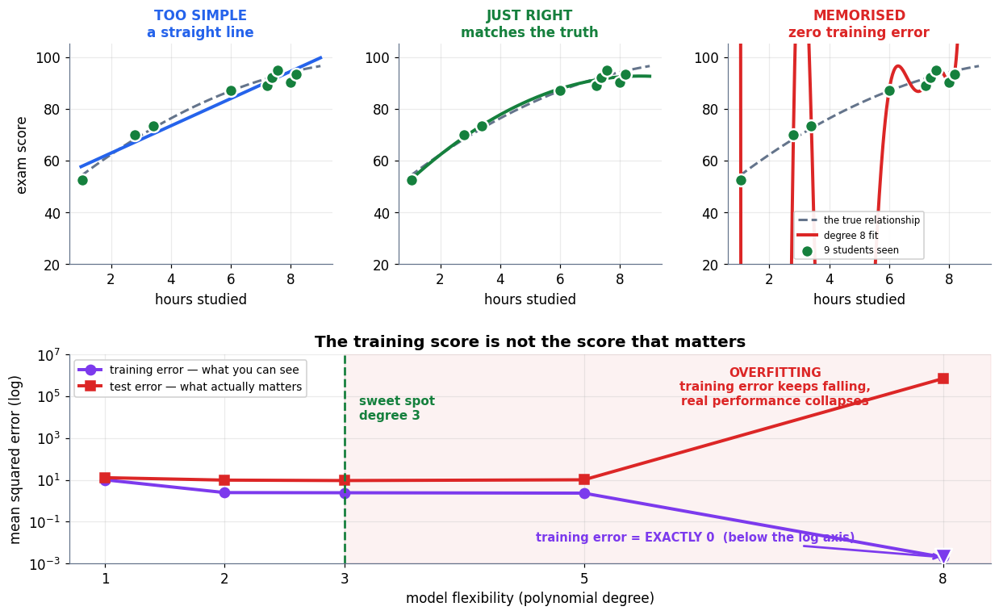

### Cell 60

```python
# ============================================================
#  Figure: the loop is constant; its three inputs are what grew
# ============================================================
fig, (ax1, ax2) = plt.subplots(1, 2, figsize=(13.2, 4.8),
                               gridspec_kw={"width_ratios": [1, 1.05]})

# ── left: one equation, three growing inputs ──
stage(ax1, (0, 10), (0, 8), "The equation never moved — its inputs exploded")
box(ax1, 5.0, 6.6, 7.4, 1.15, r"$\theta \;\leftarrow\; \theta \;-\; \eta\,\nabla L(\theta)$",
    fc="#EDE9FE", ec=C_MODEL, fs=17, bold=True)
ax1.text(5.0, 5.55, "unchanged since the 1950s", ha="center", fontsize=9.4,
         color=C_MODEL, style="italic")
for x, label, detail, col in [(2.0, "DATA", "thousands\n→ trillions", C_DATA),
                              (5.0, "COMPUTE", "one core\n→ GPU farms", C_PRED),
                              (8.0, "θ  SIZE", "dozens\n→ trillions", C_TRUE)]:
    box(ax1, x, 3.0, 2.5, 1.5, f"{label}\n\n{detail}", fc=C_SOFT, ec=col, fs=9.4)
    arrow(ax1, (x, 3.8), (x, 5.2), color=col, lw=2.0, ls="--")
ax1.text(5.0, 1.15, "the revolution happened in the inputs,\nnot in the rule",
         ha="center", fontsize=10.2, color="#0F172A", fontweight="bold")

# ── right: XOR — why depth was the missing piece ──
xor_X = np.array([[0, 0], [0, 1], [1, 0], [1, 1]], float)
xor_y = np.array([0, 1, 1, 0])
ax2.scatter(*xor_X[xor_y == 0].T, s=280, c=C_DATA, edgecolor="white",
            lw=2, zorder=5, label="output 0")
ax2.scatter(*xor_X[xor_y == 1].T, s=280, c=C_PRED, edgecolor="white",
            lw=2, zorder=5, label="output 1")
for angle, off in [(-1.0, 0.5), (-1.0, 1.5), (-0.35, 0.75)]:
    tt = np.linspace(-0.4, 1.4, 10)
    ax2.plot(tt, angle * tt + off, color=C_ERR, lw=1.6, ls="--", alpha=0.55)
ax2.text(0.5, -0.30, "no single straight line separates blue from orange",
         ha="center", fontsize=9.6, color=C_ERR, fontweight="bold")
ax2.text(0.5, 1.42, "XOR — the function that stalled the field for a decade",
         ha="center", fontsize=9.6, color=C_GREY, style="italic")
ax2.set_xlim(-0.45, 1.45); ax2.set_ylim(-0.45, 1.6)
tidy(ax2, "input 1", "input 2", "One neuron draws one line", legend=True)

plt.tight_layout(); plt.show()
```

**Output**

```text
<Figure size 1452x528 with 2 Axes>
```

**Figure**

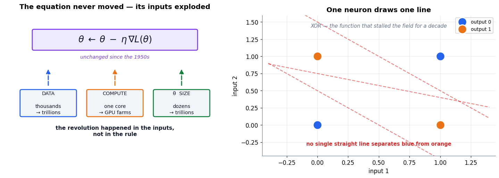

